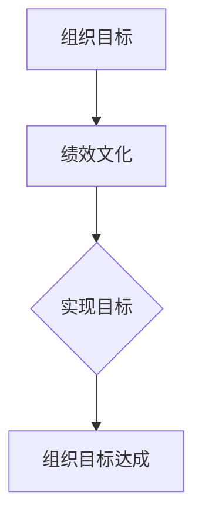
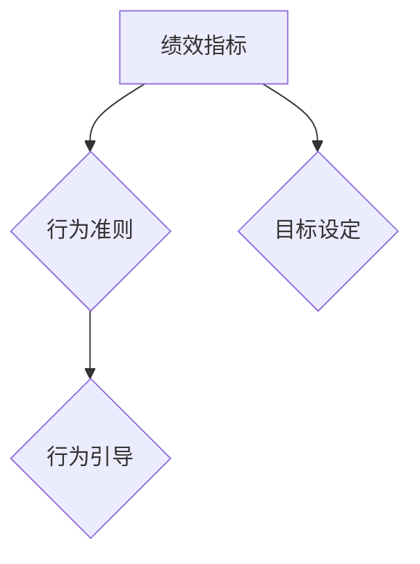
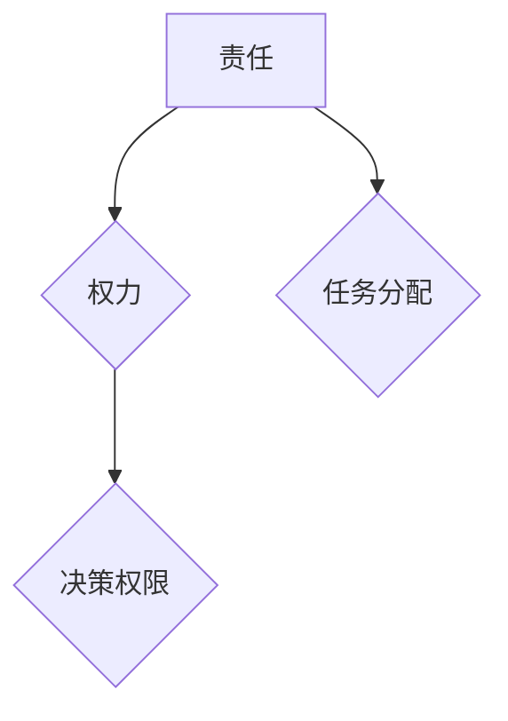
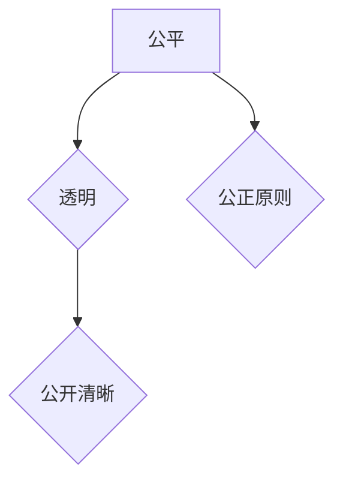
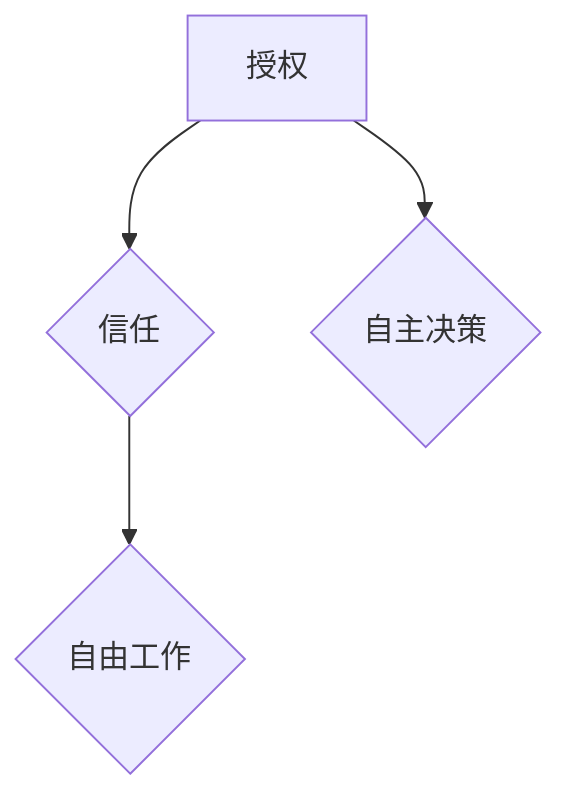
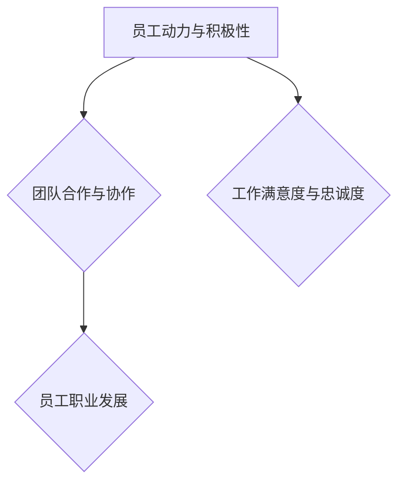
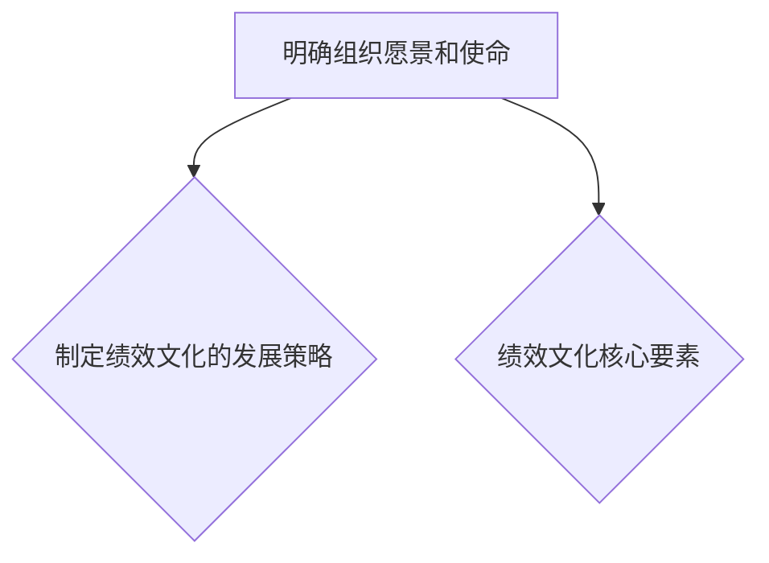
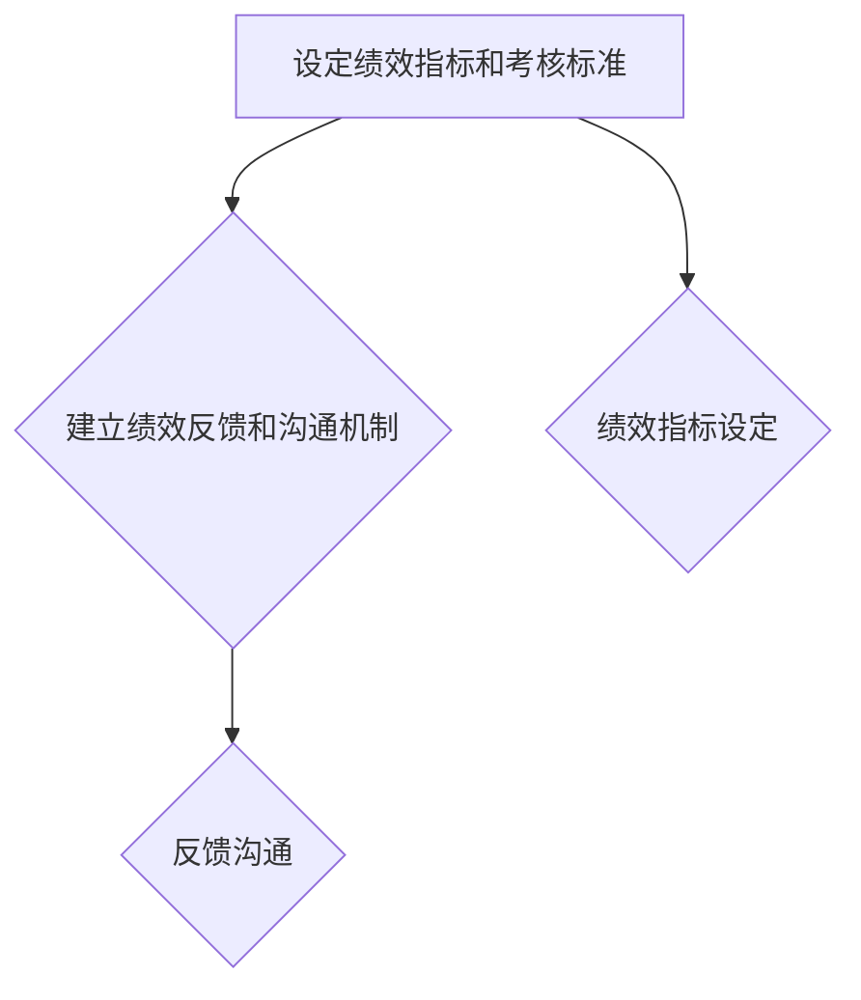
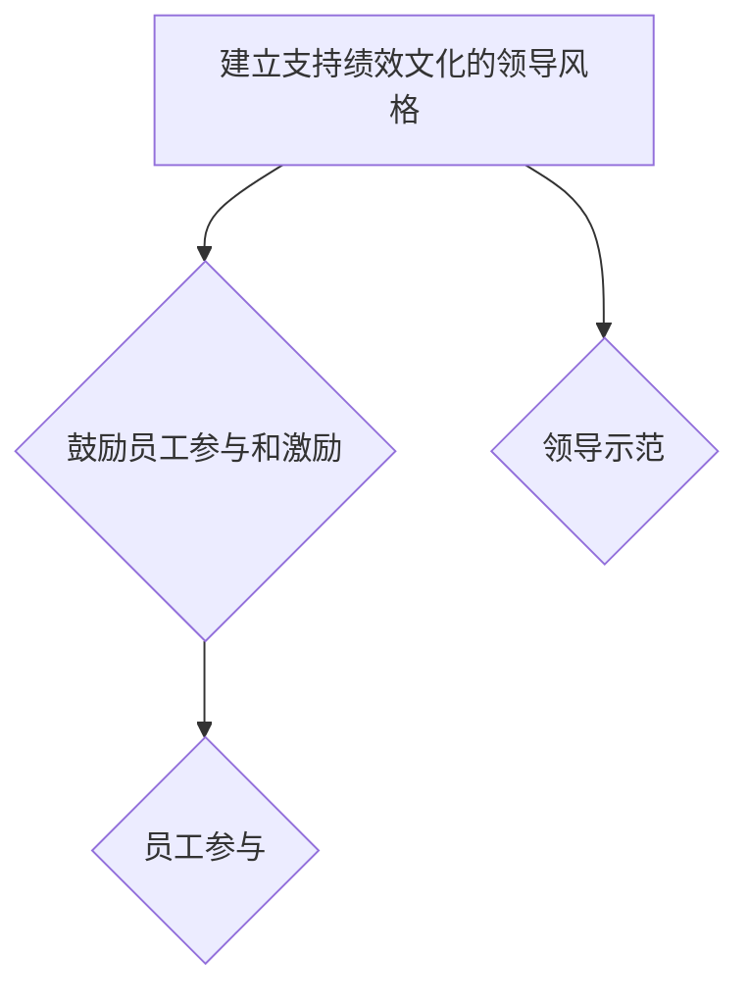
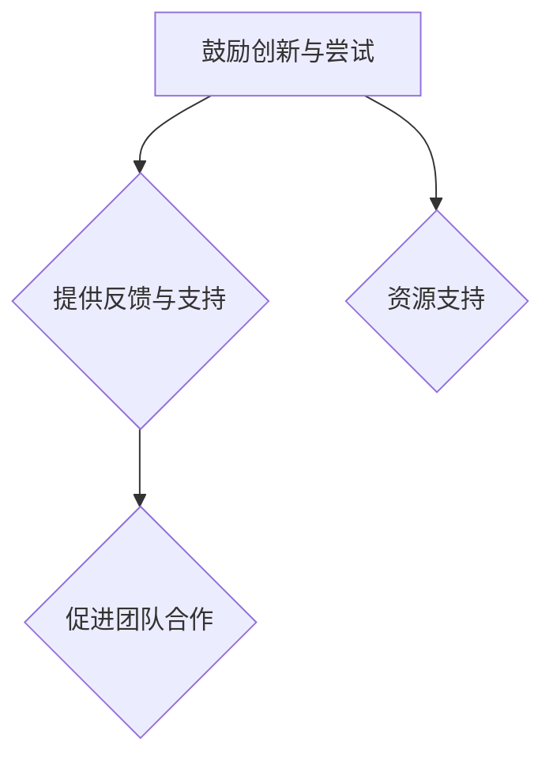

                 

# 绩效文化：营造积极进取的氛围

## 关键词
绩效文化、组织目标、员工动力、团队合作、创新能力、领导力、持续改进、全球趋势、技术进步、管理实践

## 摘要
本文旨在探讨绩效文化在组织管理中的重要性，分析其核心要素和构建步骤，并通过实践案例展示绩效文化的实际应用。文章首先解释了绩效文化的概念和与传统绩效管理的区别，然后详细阐述了绩效文化的核心要素、对员工行为的影响、构建步骤以及绩效文化与组织文化的关系。最后，文章分析了绩效文化在不同行业中的应用、技术进步对绩效文化的影响以及绩效文化的未来发展趋势。

---

### 第1章 绩效文化的概念与重要性

#### 1.1.1 绩效文化的定义

绩效文化可以理解为一种组织内部的价值观和行为准则，它强调通过共同努力实现组织目标的过程和结果。这种文化不仅仅是简单的绩效评估体系，而是深入到组织的方方面面，影响员工的工作态度和行为。

$$
\text{绩效文化} = \left\{ \begin{aligned}
    &\text{组织的价值观、信仰和行为准则}, \\
    &\text{强调通过共同努力实现组织目标的过程} \\
    &\text{和结果} \\
\end{aligned} \right.
$$

在绩效文化的引导下，员工不仅仅关注自己的绩效，更加注重团队的整体表现，从而推动组织的长期发展。

#### 1.1.2 绩效文化的意义

绩效文化对组织的重要性不言而喻。首先，它能够提升组织的竞争力。在激烈的市场竞争中，拥有高效、积极的员工团队是组织成功的关键。绩效文化通过激发员工的内在动力，提高员工的工作效率和质量，从而增强组织的竞争力。

其次，绩效文化能够促进员工积极性和创造力。在一个重视绩效文化的组织中，员工会感受到自己的工作受到重视和认可，这会激发他们的积极性和创造力。员工会更加主动地思考问题，提出创新方案，从而推动组织的创新和发展。

此外，绩效文化还能够增强团队的凝聚力与合作精神。在绩效文化的引导下，员工会形成共同的目标和价值观，这有助于团队成员之间的协作和沟通。团队成员会更加愿意分享知识和经验，互相支持，从而提高团队的绩效。

#### 1.1.3 绩效文化与组织目标的关系

绩效文化与组织目标密切相关。绩效文化是组织目标的实现途径，它为组织目标的实现提供了具体的行为指导和行动方向。组织目标为绩效文化的构建提供了明确的依据和方向，两者相辅相成，共同推动组织的发展。

$$
\text{绩效文化与组织目标的关系} = \left\{ \begin{aligned}
    &\text{绩效文化是组织目标的实现途径}, \\
    &\text{组织目标为绩效文化提供方向和依据} \\
\end{aligned} \right.
$$

一个明确的绩效文化可以帮助组织更好地理解和实现其目标，使员工在实现个人目标的同时，也能为组织的整体目标做出贡献。

### Mermaid 流程图：绩效文化与组织目标的关系



#### 1.2 绩效文化与传统绩效管理的区别

传统绩效管理通常侧重于短期绩效和个体贡献，依赖量化指标进行评价。而绩效文化则更加注重团队合作和长期发展，强调共同价值观和行为规范。

##### 1.2.1 传统绩效管理的方法

传统绩效管理通常采用以下方法：

1. **基于目标的绩效考核**：以年度或季度为目标周期，设定具体的绩效指标，通过量化数据来评估员工的表现。
2. **注重短期绩效**：侧重于员工在短期内的绩效表现，通常以业绩、销售额等指标为主要衡量标准。
3. **依赖量化指标**：通过量化数据来评价员工的表现，如工作效率、完成项目数量等。

##### 1.2.2 绩效文化带来的改变

绩效文化带来的改变主要体现在以下几个方面：

1. **重视团队合作和长期发展**：绩效文化强调团队的整体绩效，鼓励员工相互协作，共同实现组织目标。同时，它注重员工的长期发展，提供职业发展的机会和培训。
2. **强调共同价值观和行为规范**：绩效文化通过建立共同的价值观和行为准则，引导员工的行为，确保组织内部的和谐与协作。
3. **注重组织整体绩效而非单一指标**：绩效文化关注组织整体绩效的提升，不仅仅是单一指标的表现，而是从多个维度来衡量和评价员工的绩效。

##### 1.2.3 传统绩效管理向绩效文化的转变

传统绩效管理向绩效文化的转变需要以下几个步骤：

1. **建立共同的价值观和行为准则**：组织需要明确共同的价值观和行为准则，确保全体员工对此有共同的理解和认同。
2. **从个体评价转向团队评价**：评价体系应从个体转向团队，鼓励协作和共同成长，避免单一指标的评价方式。
3. **注重持续改进而非短期成果**：组织应注重持续改进，鼓励员工不断学习和提升，而非仅仅追求短期成果。

### Mermaid 流程图：传统绩效管理向绩效文化的转变

```mermaid
graph TB
A[传统绩效管理] --> B[绩效文化]
B --> C{共同价值观}
B --> D[团队评价}
B --> E{持续改进}
A --> F[个体评价]
A --> G[短期成果]
```

### 第2章 绩效文化的核心要素

#### 2.1 成功标准

成功标准是绩效文化的核心要素之一，它为组织设定了共同认可的成就标准，包括绩效指标和行为准则。

1. **绩效指标**：绩效指标是用来衡量员工工作表现的具体标准，如工作效率、项目完成率等。这些指标应该是可量化的，以便于员工明确自己的工作目标和努力方向。
2. **行为准则**：行为准则是指员工在工作中应遵守的行为规范，如诚实守信、尊重他人等。这些准则有助于建立良好的工作氛围，促进团队合作。

成功标准不仅为员工提供了明确的目标和行为指南，还能够帮助组织评估和改进其绩效管理体系。

### Mermaid 流程图：成功标准



#### 2.2 责任与权力

责任与权力是绩效文化的关键要素，它们确保员工明确自己的职责和权限，并为员工提供足够的资源和支持。

1. **责任**：责任是指员工在工作中的职责和任务。明确责任有助于员工了解自己的工作范围，避免责任重叠或缺失。
2. **权力**：权力是指员工在完成工作任务时所需的决策权限和行动能力。给予员工足够的权力，可以激发他们的主动性和创造力。

责任与权力的匹配是确保员工能够高效完成工作任务的关键。通过明确责任和分配权力，组织可以建立起一个高效、协同的工作环境。

### Mermaid 流程图：责任与权力



#### 2.3 公平与透明

公平与透明是绩效文化的基石，它们确保绩效评价的公正性和透明度，减少主观偏见和不公正现象。

1. **公平**：公平是指绩效评价过程中应遵循的公正原则，确保每位员工都有公平的机会展示自己的工作成果。
2. **透明**：透明是指绩效评价过程应该是公开和清晰的，让员工了解评价的标准、过程和结果。

公平与透明不仅能够增强员工对绩效评价的信任，还能够促进员工之间的合作与支持，营造一个积极、公正的工作氛围。

### Mermaid 流程图：公平与透明



#### 2.4 授权与信任

授权与信任是绩效文化的关键要素，它们鼓励员工发挥主动性和创造力，提高工作效率。

1. **授权**：授权是指组织给予员工自主决策和行动的权力，让员工能够自主处理工作中的问题和挑战。
2. **信任**：信任是指组织对员工的能力和诚信的信任，让员工在没有过多干预的情况下自由工作。

授权与信任不仅能够提高员工的工作满意度和忠诚度，还能够促进员工的职业发展和个人成长。

### Mermaid 流程图：授权与信任



#### 2.5 绩效文化对员工行为的影响

绩效文化对员工行为有着深远的影响，它能够激发员工的动力和积极性，促进团队合作，并推动员工的职业发展。

1. **员工动力与积极性**：在一个注重绩效文化的组织中，员工会感受到自己的工作得到认可和重视，这会激发他们的内在动力和积极性。员工会更加主动地思考问题，提出创新方案，从而提高工作效率和绩效。

2. **团队合作与协作**：绩效文化强调团队合作的重要性，鼓励员工相互协作，共同实现组织目标。在这种文化氛围下，员工会更多地分享知识和经验，互相支持，从而提高团队的整体绩效。

3. **员工职业发展**：绩效文化关注员工的个人成长和发展，为员工提供培训和晋升机会。员工在绩效文化的支持下，更有动力追求个人职业目标，不断提升自己的能力和素质。

### Mermaid 流程图：绩效文化对员工行为的影响



### 第3章 构建绩效文化

#### 3.1 确定绩效文化的方向

确定绩效文化的方向是构建绩效文化的第一步，它需要组织明确其愿景和使命，并制定绩效文化的发展策略。

1. **明确组织愿景和使命**：组织愿景和使命是绩效文化的基石，它为绩效文化的构建提供了明确的方向和目标。通过明确组织的愿景和使命，组织可以确保绩效文化的构建与组织的整体目标一致。

2. **制定绩效文化的发展策略**：绩效文化的发展策略包括确定绩效文化的核心要素、目标以及实施步骤。通过制定明确的发展策略，组织可以有条不紊地推进绩效文化的建设，确保其有效性和持续性。

### Mermaid 流程图：确定绩效文化的方向



#### 3.2 设计绩效管理体系

设计绩效管理体系是构建绩效文化的重要环节，它需要组织设定合理的绩效指标和考核标准，并建立有效的绩效反馈和沟通机制。

1. **设定绩效指标和考核标准**：绩效指标和考核标准是衡量员工工作表现的具体依据。组织需要根据其业务特点和目标，设定合理的绩效指标和考核标准，确保这些指标能够准确反映员工的工作绩效。

2. **建立绩效反馈和沟通机制**：绩效反馈和沟通机制是确保绩效管理体系有效运行的重要手段。组织需要建立有效的沟通渠道，及时向员工提供绩效反馈，帮助员工了解自己的工作表现，并提供改进建议。

### Mermaid 流程图：设计绩效管理体系



#### 3.3 培养绩效文化的组织环境

培养绩效文化的组织环境是构建绩效文化的重要保障，它需要组织从领导风格、员工参与和激励等方面入手，营造一个支持绩效文化的组织氛围。

1. **建立支持绩效文化的领导风格**：领导风格对绩效文化的形成和发展具有重要影响。组织领导需要树立榜样，通过身教言教，引导员工树立正确的绩效观念，推动绩效文化的建设。

2. **鼓励员工参与和激励**：员工参与和激励是推动绩效文化的重要动力。组织需要鼓励员工积极参与绩效文化的建设，提供多种激励措施，激发员工的积极性和创造力。

### Mermaid 流程图：培养绩效文化的组织环境



#### 3.4 营造积极的工作氛围

营造积极的工作氛围是构建绩效文化的重要目标，它需要组织从创新、反馈和支持等方面入手，为员工创造一个有利于工作和成长的环境。

1. **鼓励创新与尝试**：创新是推动组织发展的重要动力。组织需要鼓励员工勇于尝试新的工作方法和思路，提供必要的资源和支持，营造一个创新的工作氛围。

2. **提供反馈与支持**：反馈与支持是帮助员工提升绩效的重要手段。组织需要建立有效的反馈机制，及时向员工提供工作反馈，并提供必要的支持和帮助，帮助员工克服困难，提高工作能力。

3. **促进团队合作**：团队合作是提高工作效率和质量的重要方式。组织需要促进团队成员之间的沟通与合作，建立团队协作机制，营造一个和谐、积极的工作氛围。

### Mermaid 流程图：营造积极的工作氛围



### 第4章 绩效文化的实践案例

#### 4.1 某大型企业的绩效文化建设实践

某大型企业在构建绩效文化方面进行了深入的探索和实践，取得了一系列显著成果。以下是该企业的绩效文化建设实践案例。

##### 4.1.1 案例背景

该企业是一家全球领先的科技公司，业务涵盖软件开发、云计算、大数据等领域。随着企业规模的不断扩大，员工数量和业务范围的增加，企业面临着如何有效管理团队和提高员工绩效的挑战。

##### 4.1.2 绩效文化策略

1. **明确组织愿景和使命**：企业明确了“创新驱动、客户至上、团队合作”的愿景和使命，为绩效文化的构建提供了明确的方向。
2. **建立共同价值观和行为准则**：企业通过内部培训和宣传活动，使全体员工认同并践行“诚信、创新、合作、共赢”的共同价值观和行为准则。
3. **设计科学的绩效管理体系**：企业根据业务特点和目标，设定了合理的绩效指标和考核标准，并建立了完善的绩效反馈和沟通机制。
4. **鼓励员工参与和激励**：企业通过设立员工建议奖、创新奖等激励机制，鼓励员工积极参与绩效文化的建设，提供多种培训机会，提升员工的职业能力和素质。

##### 4.1.3 实施效果评估

通过绩效文化的建设，企业取得了以下显著效果：

1. **员工绩效显著提升**：员工的工作效率和质量有了显著提高，项目完成率和客户满意度明显上升。
2. **团队合作和协作精神增强**：团队成员之间的沟通与合作更加顺畅，团队凝聚力显著提升。
3. **创新能力得到充分发挥**：员工在创新和尝试方面更加积极，企业推出了一系列具有市场竞争力的新产品和服务。
4. **企业竞争力提升**：企业整体绩效显著提升，市场份额不断扩大，品牌影响力显著增强。

### 第5章 绩效文化的未来发展趋势

#### 5.1 技术进步对绩效文化的影响

随着技术的不断进步，特别是在人工智能、大数据、云计算等领域，绩效文化将受到深刻的影响。

1. **数据驱动与人工智能**：人工智能和大数据技术的应用，将使绩效评估更加科学和精准。通过数据分析和预测，组织可以更好地了解员工的工作表现和潜力，提供个性化的培训和发展建议。
2. **云计算与远程工作**：云计算和远程工作的普及，将改变传统的办公模式和工作方式，促进绩效文化的进一步发展。远程工作使员工能够更加灵活地安排工作时间，提高工作效率和满意度。

#### 5.2 全球化趋势

全球化趋势使得绩效文化面临新的挑战和机遇。

1. **全球化背景下的绩效文化挑战**：全球化带来了文化差异和沟通障碍，如何在不同文化背景下建立和维护绩效文化，是一个重要的挑战。
2. **跨文化管理**：跨文化管理是全球化趋势下的关键任务。组织需要尊重并融合不同文化的优点，建立共同的目标和价值观，促进团队成员之间的沟通与合作。
3. **全球绩效文化的构建策略**：组织需要制定适应全球化背景的绩效文化策略，如加强跨文化培训、建立全球统一的绩效指标和评价标准等。

#### 5.3 持续发展

绩效文化的持续发展是组织长期成功的关键。

1. **持续改进的重要性**：绩效文化不是一成不变的，组织需要不断进行改进和优化，以适应外部环境和内部需求的变化。
2. **领导力与人才培养**：领导力和人才培养是绩效文化持续发展的重要保障。组织领导需要具备变革和创新的能力，同时重视员工的职业发展和人才培养。
3. **绩效文化的可持续性**：绩效文化的可持续性取决于组织的核心价值观和文化传承。组织需要通过有效的文化传承和品牌建设，确保绩效文化的长期稳定和持续发展。

### 附录

#### 附录A：绩效文化相关工具与方法

1. **绩效文化评估工具**：绩效文化评估工具可以帮助组织了解绩效文化的现状和效果，常见的评估工具包括问卷调查、访谈、360度评估等。
2. **绩效管理体系设计方法**：绩效管理体系设计方法包括目标设定、指标设定、评价标准设定等，常用的设计方法有平衡计分卡（Balanced Scorecard）和关键绩效指标（KPI）等。
3. **绩效文化提升策略**：绩效文化提升策略包括领导力培训、文化建设活动、激励机制设计等，通过多种手段提升员工的绩效意识和文化认同。

#### 附录B：参考书目与资源

1. **专著与书籍**：
   - 林正凯，《绩效文化：打造高效团队的关键》
   - 王岩，《绩效管理：从理论到实践》
   - 赵军，《企业文化与绩效管理》

2. **学术论文**：
   - “Performance Culture: A Literature Review” by Smith and Johnson
   - “The Impact of Performance Culture on Employee Engagement” by Brown and Lee

3. **在线资源与工具**：
   - “Performance Culture Assessment Tool” by XYZ Consulting
   - “Performance Management Templates” by ABC Corporation
   - “Online Courses on Performance Culture” by Top Universities

4. **课程与培训**：
   - “Performance Culture Training” by PEC Consulting
   - “Leadership Development Programs” by LDP Institute
   - “Workshop on Performance Management” by PMI (Project Management Institute)

### 致谢

本文在撰写过程中，得到了多位专家和学者的指导和帮助，特此致谢。特别感谢AI天才研究院/AI Genius Institute的各位专家，以及《禅与计算机程序设计艺术 /Zen And The Art of Computer Programming》的作者，他们的智慧与经验为本文的撰写提供了宝贵的参考。同时，感谢所有提供宝贵意见和建议的朋友，没有你们的帮助，本文无法完成。

### 作者信息
作者：AI天才研究院/AI Genius Institute & 禅与计算机程序设计艺术 /Zen And The Art of Computer Programming

本文为作者原创作品，未经授权不得转载和使用。如需转载，请联系作者获取授权。谢谢合作！

