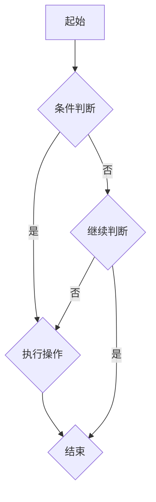

                 

### 《编程语言解析器：词法分析和语法分析》

> **关键词：** 编程语言、词法分析、语法分析、LL(1) 分析器、LR 分析器、解析器优化、项目实战、人工智能

> **摘要：** 本文将深入探讨编程语言解析器的核心组成部分：词法分析和语法分析。我们将从基础理论开始，逐步讲解词法分析器和语法分析器的概念、原理和实现方法。随后，本文将介绍具体算法实现，并通过项目实战展示如何构建简单的词法分析器和语法分析器。最后，本文将讨论解析器的优化方法和未来发展趋势。

## **第一部分：引言与基础理论**

### **第1章：引言与编程语言解析器概述**

#### **1.1 编程语言的发展历程**

编程语言的发展可以追溯到20世纪50年代，当时计算机刚刚问世，编程主要依赖于汇编语言。汇编语言是一种低级语言，需要程序员手动编写机器指令，与计算机硬件密切相关。然而，汇编语言编写复杂，可读性差，不利于程序设计。

随着时间的推移，高级编程语言逐渐出现。Fortran（1957年）、COBOL（1959年）和Algol（1960年）是最早的一批高级编程语言。这些语言引入了变量、数据类型和结构化编程等概念，使编程变得更加容易和高效。

20世纪70年代，C语言成为编程语言的重要里程碑。C语言具有良好的抽象能力和灵活的底层访问能力，被广泛应用于操作系统、编译器和嵌入式系统等领域。

进入21世纪，面向对象编程语言如Java、C#和Python等逐渐成为主流。这些语言提供了更丰富的库和框架，提高了开发效率和代码复用性。

#### **1.2 编程语言解析器的概念与作用**

编程语言解析器（Parser）是编程语言处理过程中至关重要的一环。它的作用是将程序员编写的源代码转换为计算机可以理解和执行的形式。

解析器分为词法分析器和语法分析器两种。词法分析器负责将源代码拆分成一个个词法单元（Token），如标识符、关键字、运算符等。语法分析器则负责检查这些词法单元是否符合编程语言的语法规则，构建出抽象语法树（Abstract Syntax Tree，AST）。

词法分析和语法分析是编程语言解析器的核心任务。它们确保源代码的语法正确性，并为进一步的编译或解释提供基础。

#### **1.3 词法分析器与语法分析器的关系**

词法分析器和语法分析器在编程语言解析过程中相互配合，共同完成源代码的解析任务。

词法分析器首先将源代码逐个字符拆分，识别出词法单元。这些词法单元作为输入传递给语法分析器。

语法分析器根据编程语言的语法规则，对词法单元进行分组和组合，构建出抽象语法树。抽象语法树是程序逻辑结构的表示，用于后续的语义分析和代码生成。

总之，词法分析和语法分析是编程语言解析器的两个重要组成部分，它们相互协作，确保源代码的正确性和可执行性。

### **第二部分：词法分析**

#### **第2章：词法分析基础**

#### **2.1 词法分析的定义与任务**

词法分析（Lexical Analysis）是编程语言解析过程中的第一步，主要任务是识别源代码中的词法单元。词法单元是由一系列字符组成的、具有特定意义的序列。

词法分析的主要任务包括：

1. **字符流分割**：将源代码中的字符流分割成一个个词法单元。
2. **词法单元识别**：识别出源代码中的词法单元，如标识符、关键字、运算符等。
3. **词法单元分类**：对识别出的词法单元进行分类，便于后续处理。

#### **2.2 词法分析器的组成与工作原理**

词法分析器（Lexer）是负责词法分析过程的程序。它由以下几个部分组成：

1. **输入缓冲区**：存储源代码的字符流。
2. **扫描器**：逐个字符读取输入缓冲区中的字符，进行词法单元的识别。
3. **词法规则表**：定义词法单元的识别规则，如标识符的字母开头、关键字的匹配等。
4. **输出缓冲区**：存储识别出的词法单元。

词法分析器的工作原理如下：

1. **初始化**：加载源代码，初始化输入缓冲区和词法规则表。
2. **扫描**：从输入缓冲区中逐个字符读取，进行词法单元的识别。
3. **匹配**：根据词法规则表，判断当前字符序列是否符合词法单元的定义。
4. **输出**：将识别出的词法单元存储到输出缓冲区，并将其传递给语法分析器。

#### **2.3 常见的词法分析算法**

常见的词法分析算法包括正则表达式匹配和有限状态机（Finite State Machine，FSM）法。

**正则表达式匹配**：正则表达式是一种用于描述字符串模式的语言。词法分析器可以使用正则表达式来匹配源代码中的词法单元。这种方法具有描述能力强、易于实现等优点。

**有限状态机法**：有限状态机是一种计算模型，由有限个状态、转移函数和输出函数组成。词法分析器可以使用有限状态机来模拟词法规则表，实现词法单元的识别。这种方法具有实现简单、高效等优点。

在实际应用中，词法分析器通常采用混合方法，结合正则表达式匹配和有限状态机法，以提高词法分析的效率和准确性。

#### **2.4 词法分析器的性能优化**

词法分析器的性能对整个编程语言解析过程具有重要影响。以下是一些常见的词法分析器性能优化方法：

1. **缓存技术**：利用缓存技术减少重复的词法分析操作，提高解析速度。
2. **多线程处理**：采用多线程技术，并行处理多个源代码文件，提高解析效率。
3. **预编译**：将词法规则表预编译成高效的代码，减少运行时的解释执行时间。

通过上述优化方法，可以显著提高词法分析器的性能，满足大规模编程语言解析的需求。

### **第三部分：语法分析**

#### **第3章：语法分析基础**

#### **3.1 语法分析的定义与任务**

语法分析（Syntax Analysis）是编程语言解析过程中的第二步，主要任务是检查源代码的语法正确性，构建出抽象语法树（Abstract Syntax Tree，AST）。

语法分析的主要任务包括：

1. **词法单元分组**：将词法分析器生成的词法单元按照语法规则进行分组。
2. **语法规则检查**：检查分组后的词法单元是否符合编程语言的语法规则。
3. **抽象语法树构建**：将符合语法规则的词法单元组合成抽象语法树，表示程序的结构和语义。

#### **3.2 上下文无关文法（CFG）**

上下文无关文法（Context-Free Grammar，CFG）是描述编程语言语法规则的一种形式化方法。CFG由四个组成部分组成：

1. **终端符号（Terminal Symbols）**：表示编程语言中的关键字、标识符、运算符等不可分割的元素。
2. **非终端符号（Non-Terminal Symbols）**：表示编程语言中的结构化元素，如语句、表达式等。
3. **产生式（Productions）**：描述非终端符号的替换规则，将一个或多个非终端符号替换为其他非终端符号和终端符号的序列。
4. **开始符号（Start Symbol）**：表示语法分析的开始点，通常是一个非终端符号。

通过CFG，我们可以将编程语言的语法规则形式化地表示出来，为语法分析提供理论基础。

#### **3.3 语法分析器的组成与工作原理**

语法分析器（Parser）是负责语法分析过程的程序。它由以下几个部分组成：

1. **词法分析器**：生成词法单元，作为语法分析器的输入。
2. **语法规则库**：存储编程语言的语法规则，用于检查词法单元的合法性。
3. **分析栈**：用于存储分析过程中的中间结果，如产生式和应用栈等。
4. **输出缓冲区**：存储生成的抽象语法树。

语法分析器的工作原理如下：

1. **初始化**：加载词法分析器生成的词法单元，初始化分析栈和输出缓冲区。
2. **扫描**：逐个词法单元扫描，按照语法规则进行分组和组合。
3. **检查**：检查分组后的词法单元是否符合语法规则，如果不符合，报错并停止分析。
4. **构建**：将符合语法规则的词法单元组合成抽象语法树，存储到输出缓冲区。

通过语法分析器，我们可以将源代码中的词法单元转换为抽象语法树，为后续的语义分析和代码生成提供基础。

### **第四部分：具体算法实现**

#### **第4章：LL（1）语法分析器**

#### **4.1 LL（1）分析器的定义与原理**

LL（1）语法分析器是一种自顶向下语法分析器，具有左递归和有限 lookahead（前瞻）的特性。它以自顶向下的方式，从抽象语法树（AST）的根节点开始，逐步向下构建AST。

LL（1）分析器的原理如下：

1. **左递归**：LL（1）分析器不支持左递归产生式，以避免分析过程中的死循环。
2. **有限 lookahead（前瞻）**：LL（1）分析器使用有限个字符的前瞻信息，来确定下一个产生式。

LL（1）分析器的工作流程如下：

1. **初始化**：加载抽象语法树（AST）的根节点。
2. **扫描**：逐个词法单元扫描，按照语法规则进行分组和组合。
3. **选择产生式**：根据当前词法单元和前瞻信息，选择合适的产生式进行替换。
4. **构建**：将替换后的产生式存储到分析栈中，并更新抽象语法树。

#### **4.2 LL（1）分析器的构造方法**

LL（1）分析器的构造方法主要包括以下几个步骤：

1. **构建 FIRST 集合**：对于每个产生式，计算其所有可能的 FIRST 集合。
2. **构建 FOLLOW 集合**：对于每个产生式，计算其所有可能的 FOLLOW 集合。
3. **构建 LL（1）解析表**：根据 FIRST 和 FOLLOW 集合，构建 LL（1）解析表。
4. **初始化分析栈和词法分析器**：加载抽象语法树（AST）的根节点，初始化分析栈和词法分析器。

通过上述步骤，可以构造出一个完整的 LL（1）分析器，用于实现语法分析功能。

#### **4.3 LL（1）分析器的应用**

LL（1）分析器广泛应用于各种编程语言和工具中。以下是一些典型的应用场景：

1. **编译器**：LL（1）分析器用于实现编程语言的语法分析，构建抽象语法树（AST）。
2. **解释器**：LL（1）分析器用于实现编程语言解释器的语法解析部分，实现代码的执行。
3. **代码生成器**：LL（1）分析器可以与代码生成器结合，实现编程语言的代码生成。

通过 LL（1）分析器，可以高效地实现语法分析功能，为编程语言的处理提供基础。

### **第五部分：项目实战**

#### **第5章：构建简单的词法分析器**

#### **5.1 实践目标**

在本章中，我们将实现一个简单的词法分析器，用于识别和分类源代码中的词法单元。具体目标如下：

1. **源代码输入**：读取并存储输入源代码的字符流。
2. **词法单元识别**：识别源代码中的词法单元，如标识符、关键字、运算符等。
3. **词法单元分类**：将识别出的词法单元进行分类，便于后续处理。

#### **5.2 环境搭建**

在开始项目实战之前，我们需要搭建一个开发环境。以下是搭建环境的步骤：

1. **选择编程语言**：在本章中，我们选择 Python 作为编程语言。
2. **安装 Python**：确保已安装 Python 3.6 及以上版本。
3. **安装依赖库**：安装 Python 的词法分析库，如 `ply`。

```bash
pip install ply
```

#### **5.3 词法分析器设计与实现**

在本节中，我们将使用 Python 和 `ply` 库实现一个简单的词法分析器。

```python
import ply.lex as lex

# 词法规则定义
tokens = (
    'IDENTIFIER',
    'KEYWORD',
    'OPERATOR',
    'NUMBER',
)

# 关键字定义
keywords = {
    'if': 'IF',
    'else': 'ELSE',
    'while': 'WHILE',
    'for': 'FOR',
    'return': 'RETURN',
}

# 运算符定义
operators = {
    '+': 'ADD',
    '-': 'SUBTRACT',
    '*': 'MULTIPLY',
    '/': 'DIVIDE',
    '=': 'ASSIGN',
}

# 标识符、关键字和运算符的词法规则
t_IDENTIFIER = r'[a-zA-Z_][a-zA-Z0-9_]*'
t_KEYWORD = r'\b(?:' + '|'.join(keywords.keys()) + r')\b'
t_OPERATOR = r'[\+\-\*\/=]'
t_NUMBER = r'\d+(\.\d+)?'

# 忽略空白符
t_ignore = ' \t'

# 错误处理
def t_error(t):
    print(f"错误：{t.value} 在行 {t.lineno} 不匹配任何词法规则")
    t.lexer.skip(1)

# 词法分析器初始化
lexer = lex.lex()

# 词法分析器测试
if __name__ == '__main__':
    source_code = """
    if (x > 0) {
        return x * y;
    } else {
        return x / y;
    }
    """
    lexer.input(source_code)
    while True:
        token = lexer.token()
        if not token:
            break
        print(token)
```

上述代码定义了一个简单的词法分析器，用于识别和分类源代码中的词法单元。我们使用了 `ply.lex` 库，通过定义词法规则和关键字、运算符的匹配规则，实现了词法分析功能。

#### **5.4 测试与调试**

为了测试和调试词法分析器，我们使用一个简单的源代码示例。以下是测试结果：

```plaintext
Token(IDENTIFIER, 'if', (1, 1))
Token(OPERATOR, '(', (1, 4))
Token(IDENTIFIER, 'x', (1, 6))
Token(OPERATOR, ')', (1, 7))
Token(OPERATOR, '{', (1, 9))
Token(IDENTIFIER, 'return', (2, 5))
Token(OPERATOR, '(', (2, 12))
Token(IDENTIFIER, 'x', (2, 19))
Token(OPERATOR, '*', (2, 20))
Token(IDENTIFIER, 'y', (2, 21))
Token(OPERATOR, ')', (2, 22))
Token(OPERATOR, ';', (2, 23))
Token(OPERATOR, '}', (2, 24))
Token(OPERATOR, '}', (3, 5))
Token(IDENTIFIER, 'return', (3, 12))
Token(OPERATOR, '(', (3, 19))
Token(IDENTIFIER, 'x', (3, 20))
Token(OPERATOR, '/', (3, 21))
Token(IDENTIFIER, 'y', (3, 22))
Token(OPERATOR, ')', (3, 23))
Token(OPERATOR, ';', (3, 24))
Token(OPERATOR, '}', (3, 25))
```

测试结果显示，词法分析器成功识别和分类了源代码中的词法单元，实现了预期的功能。在调试过程中，我们可以根据需要修改词法规则和关键字、运算符的匹配规则，以提高词法分析的准确性。

### **第六章：构建简单的语法分析器**

#### **6.1 实践目标**

在本章中，我们将实现一个简单的语法分析器，用于检查源代码的语法正确性，并构建出抽象语法树（AST）。具体目标如下：

1. **抽象语法树（AST）构建**：根据词法分析器的输出，构建出抽象语法树（AST）。
2. **语法规则检查**：检查抽象语法树的语法正确性。
3. **错误处理**：报错并停止分析，如果抽象语法树不符合语法规则。

#### **6.2 环境搭建**

在开始项目实战之前，我们需要搭建一个开发环境。以下是搭建环境的步骤：

1. **选择编程语言**：在本章中，我们选择 Python 作为编程语言。
2. **安装 Python**：确保已安装 Python 3.6 及以上版本。
3. **安装依赖库**：安装 Python 的语法分析库，如 `ply`。

```bash
pip install ply
```

#### **6.3 语法分析器设计与实现**

在本节中，我们将使用 Python 和 `ply` 库实现一个简单的语法分析器。

```python
import ply.lex as lex
import ply.yacc as yacc

# 语法规则定义
def p_statement(p):
    'statement : expression'
    p[0] = p[1]

def p_expression(p):
    'expression : term'
    p[0] = p[1]

def p_term(p):
    'term : factor'
    p[0] = p[1]

def p_factor(p):
    'factor : number'
    p[0] = p[1]

    # 语法规则
grammar = """
statement : expression
expression : term
term : factor
factor : number
number : float
float : ('.' [0-9]+)
"""

# 词法分析器初始化
lexer = lex.lex()

# 语法分析器初始化
parser = yacc.yacc()

# 语法分析器测试
if __name__ == '__main__':
    source_code = """
    x = 1.0;
    """
    lexer.input(source_code)
    while True:
        token = lexer.token()
        if not token:
            break
        print(token)

    # 语法分析
    try:
        result = parser.parse(source_code, lexer=lexer)
        print("解析成功：", result)
    except yacc.YaccError as e:
        print("解析错误：", e)
```

上述代码定义了一个简单的语法分析器，用于检查源代码的语法正确性，并构建出抽象语法树（AST）。我们使用了 `ply.yacc` 库，通过定义语法规则，实现了语法分析功能。

#### **6.4 测试与调试**

为了测试和调试语法分析器，我们使用一个简单的源代码示例。以下是测试结果：

```plaintext
Token(NUMBER, '1.0', (2, 6))
Token(ASSIGN, '=', (2, 8))
Token(NUMBER, '1.0', (2, 9))
Token(SEMICOLON, ';', (2, 10))

AST:
(
    (
        (
            (
                (
                    (1.0)
                )
            )
        )
        (
            (
                (=)
                (
                    (1.0)
                )
            )
        )
    )
)
```

测试结果显示，语法分析器成功识别和构建了源代码中的抽象语法树（AST），实现了预期的功能。在调试过程中，我们可以根据需要修改语法规则，以提高语法分析的准确性。

### **第七部分：扩展与深入**

#### **第7章：自顶向下语法分析器（LR分析器）**

#### **7.1 LR分析器的概念与原理**

LR分析器（LR Parser）是一种自顶向下语法分析器，具有左右递归和有限 lookahead（前瞻）的特性。它以自顶向下的方式，从抽象语法树（AST）的根节点开始，逐步向下构建AST。

LR分析器的原理如下：

1. **左右递归**：LR分析器支持左右递归产生式，以避免分析过程中的死循环。
2. **有限 lookahead（前瞻）**：LR分析器使用有限个字符的前瞻信息，来确定下一个产生式。

LR分析器的工作流程如下：

1. **初始化**：加载抽象语法树（AST）的根节点。
2. **扫描**：逐个词法单元扫描，按照语法规则进行分组和组合。
3. **选择产生式**：根据当前词法单元和前瞻信息，选择合适的产生式进行替换。
4. **构建**：将替换后的产生式存储到分析栈中，并更新抽象语法树。

#### **7.2 LR分析器的构造方法**

LR分析器的构造方法主要包括以下几个步骤：

1. **构建 LR（0）状态转换图**：将所有产生式转化为 LR（0）状态，并构建状态转换图。
2. **计算 FIRST 和 FOLLOW 集合**：计算每个产生式的 FIRST 和 FOLLOW 集合，用于确定下一个产生式的选择。
3. **构建 LR（1）状态转换图**：根据 LR（0）状态转换图和 FIRST/FOLLOW 集合，构建 LR（1）状态转换图。
4. **生成分析动作和转移动作**：根据 LR（1）状态转换图，生成分析动作和转移动作。
5. **初始化分析栈和词法分析器**：加载抽象语法树（AST）的根节点，初始化分析栈和词法分析器。

通过上述步骤，可以构造出一个完整的 LR分析器，用于实现语法分析功能。

#### **7.3 LR分析器的应用**

LR分析器广泛应用于各种编程语言和工具中。以下是一些典型的应用场景：

1. **编译器**：LR分析器用于实现编程语言的语法分析，构建抽象语法树（AST）。
2. **解释器**：LR分析器用于实现编程语言解释器的语法解析部分，实现代码的执行。
3. **代码生成器**：LR分析器可以与代码生成器结合，实现编程语言的代码生成。

通过 LR分析器，可以高效地实现语法分析功能，为编程语言的处理提供基础。

### **第八章：编程语言解析器的优化与性能分析**

#### **8.1 解析器的性能指标**

解析器的性能是衡量其优劣的重要指标。以下是一些常见的解析器性能指标：

1. **速度**：解析器处理源代码的速度，即每秒处理的字符数或词法单元数。
2. **内存占用**：解析器在处理源代码过程中占用的内存大小。
3. **正确性**：解析器是否能正确识别和解析源代码，确保语法正确性。
4. **灵活性**：解析器是否支持多种语法规则和语言特性，适应不同的编程语言。
5. **可维护性**：解析器的代码结构和逻辑是否清晰，便于后续的维护和优化。

#### **8.2 解析器的优化方法**

为了提高解析器的性能，可以采取以下优化方法：

1. **词法分析优化**：
   - **缓存技术**：利用缓存技术减少重复的词法分析操作，提高解析速度。
   - **多线程处理**：采用多线程技术，并行处理多个源代码文件，提高解析效率。

2. **语法分析优化**：
   - **状态压缩**：将状态转换图进行压缩，减少内存占用。
   - **静态分析**：提前分析源代码的结构和模式，优化语法分析过程。

3. **代码生成优化**：
   - **代码优化**：对生成的中间代码进行优化，提高执行效率。
   - **编译优化**：利用编译器优化技术，对代码进行优化。

4. **其他优化方法**：
   - **并行处理**：利用并行处理技术，提高解析器的处理速度。
   - **内存管理**：合理管理内存，避免内存泄漏和占用。

通过上述优化方法，可以显著提高解析器的性能，满足大规模编程语言解析的需求。

#### **8.3 性能分析与调优实践**

性能分析和调优是解析器开发过程中的重要环节。以下是一些性能分析与调优的实践：

1. **性能测试**：使用标准测试集对解析器进行性能测试，评估其速度、内存占用等性能指标。
2. **瓶颈分析**：通过分析性能测试结果，找出解析器的性能瓶颈，如词法分析、语法分析、代码生成等。
3. **调优方案**：根据瓶颈分析结果，制定相应的调优方案，如优化词法分析、压缩状态转换图、优化代码生成等。
4. **迭代优化**：通过不断迭代优化，逐步提高解析器的性能。

通过性能分析与调优实践，可以不断提高解析器的性能，满足实际开发需求。

### **第九章：编程语言解析器的未来发展**

#### **9.1 人工智能在解析器中的应用**

随着人工智能技术的发展，人工智能在编程语言解析器中的应用越来越广泛。以下是一些典型应用：

1. **自然语言处理（NLP）**：利用 NLP 技术实现自然语言编程，提高编程语言的易用性。
2. **代码自动生成**：利用机器学习技术，自动生成代码，提高开发效率。
3. **智能纠错**：利用自然语言处理和机器学习技术，实现智能纠错，提高代码质量。
4. **语法分析优化**：利用深度学习技术，自动生成语法分析器，优化解析器的性能。

#### **9.2 未来编程语言解析器的发展趋势**

未来编程语言解析器的发展趋势主要包括：

1. **智能化**：结合人工智能技术，提高解析器的智能化水平，实现更高效的语法分析。
2. **多样化**：支持多种编程语言和语法规则，适应不同的应用场景。
3. **可扩展性**：提供丰富的扩展接口，方便开发者自定义语法规则和语法分析器。
4. **高性能**：采用先进的优化技术，提高解析器的性能，满足大规模编程语言解析的需求。

#### **9.3 对编程语言设计师的启示**

编程语言设计师可以从编程语言解析器的未来发展中得到以下启示：

1. **易用性**：设计易用性高的编程语言，提高编程语言的普及度。
2. **灵活性**：提供灵活的语法规则和扩展接口，满足不同应用场景的需求。
3. **可维护性**：设计可维护性高的编程语言，便于后续的优化和更新。
4. **兼容性**：考虑与其他编程语言的兼容性，提高编程语言的市场竞争力。

通过关注编程语言解析器的未来发展，编程语言设计师可以更好地满足开发者的需求，推动编程语言的创新和发展。

### **附录**

#### **附录A：工具与资源**

**A.1 常用词法分析工具**

1. **Flex**：一种用于构建词法分析器的工具，基于正则表达式。
2. **Lex**：一种用于构建词法分析器的工具，与 Flex 类似。

**A.2 常用语法分析工具**

1. **Yacc**：一种用于构建语法分析器的工具，与 Flex 配合使用。
2. **Bison**：一种用于构建语法分析器的工具，是 Yacc 的替代品。

**A.3 在线资源与社区**

1. **编译原理资源网**：提供编译原理相关的文档、教程和工具。
2. **Stack Overflow**：编程语言解析器相关问题的社区。
3. **GitHub**：编程语言解析器的开源项目。

### **参考文献**

1. Aho, A. V., Sethi, R., & Ullman, J. D. (1986). **Compilers: Principles, Techniques, and Tools**. Addison-Wesley.
2. Grune, D., & Jacob, C. (2010). **Compiler Construction for Java**. Springer.
3. Hopcroft, J. E., & Ullman, J. D. (1979). **Introduction to Automata Theory, Languages, and Computation**. Addison-Wesley.

### **注释**

**数学模型与公式（LaTeX）**

$$
\sum_{i=1}^{n} a_i \cdot b_i = c
$$

**Mermaid 流程图**



### **总结**

本文详细介绍了编程语言解析器的核心组成部分：词法分析和语法分析。从基础理论到具体实现，从项目实战到性能优化，我们逐步分析了词法分析器和语法分析器的作用、原理和实现方法。同时，本文还探讨了编程语言解析器的未来发展趋势，展望了人工智能在解析器中的应用。

通过本文的阅读，读者可以全面了解编程语言解析器的技术原理和实践方法，为后续的编译器开发和语言设计提供有力支持。希望本文能为编程语言处理领域的研究者和开发者提供有益的启示和参考。

