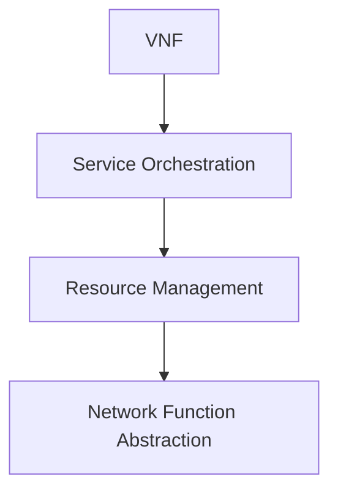
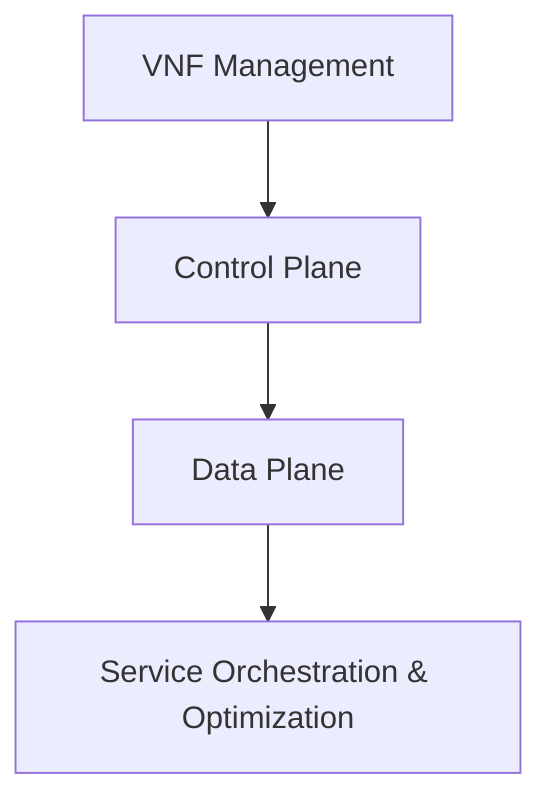
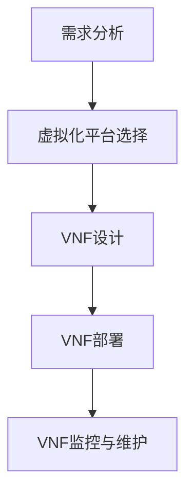
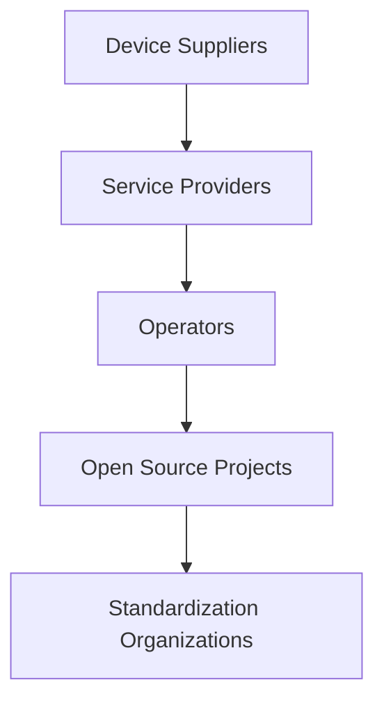
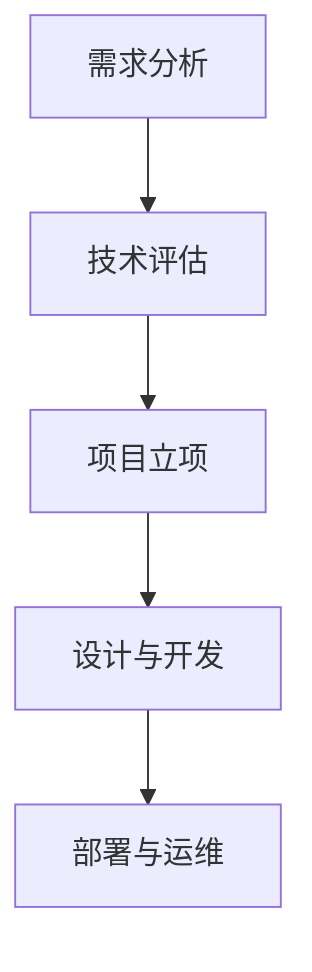
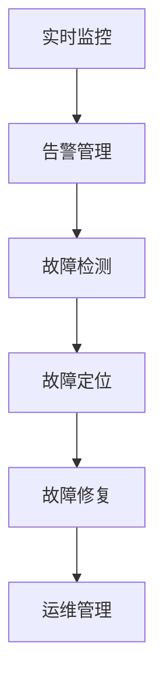

                 

### 引言

网络功能虚拟化（Network Functions Virtualization，简称NFV）是电信云时代的基石，它通过将传统的网络硬件设备（如路由器、防火墙等）的功能虚拟化，运行在通用的硬件平台上，从而实现网络的灵活部署、快速扩展和高效管理。NFV不仅改变了传统网络的架构，还推动了电信行业向云化、智能化转型。

#### 1.1 NFV的概念与背景

NFV的核心思想是将网络功能从专用的硬件设备上卸载到虚拟化的通用硬件上。这样，网络功能就能像软件一样快速部署、升级和重构。NFV的背景主要源于以下几个方面：

1. **电信业务需求变化**：随着移动互联网和物联网的快速发展，电信业务呈现出多样化、个性化、弹性的需求，这要求网络具备更高的灵活性和可扩展性。
2. **云计算技术成熟**：云计算提供了弹性的计算资源，使得NFV的实施成为可能。通过云计算平台，网络功能可以像应用一样被部署和管理。
3. **硬件成本压力**：传统网络硬件设备的成本高，升级和维护复杂。NFV通过软件定义网络（SDN）和虚拟化技术，降低了硬件成本。

#### 1.2 电信云的发展历程

电信云是NFV发展的基础和驱动力。电信云的发展历程可以分为以下几个阶段：

1. **虚拟化初期**：电信运营商开始将部分业务虚拟化，以提升资源利用率和灵活性。
2. **云平台建设**：电信运营商建立云计算平台，提供基础设施即服务（IaaS）和平台即服务（PaaS）。
3. **网络功能虚拟化**：电信运营商逐步将网络功能虚拟化，实现网络资源的动态分配和管理。
4. **智能化网络**：结合人工智能和大数据技术，电信云向智能化方向发展，实现网络的自我优化和自我修复。

#### 1.3 NFV与SDN的关系

NFV和SDN（Software-Defined Networking）都是网络领域的重要技术，它们共同推动了网络架构的变革。

- **区别**：SDN主要解决的是网络控制平面与数据平面的分离，通过软件控制实现网络流量的灵活调度；而NFV则是将网络功能从专用的硬件上卸载到虚拟化的通用硬件上。
- **联系**：SDN为NFV提供了灵活的控制机制，NFV利用SDN实现网络功能的虚拟化和自动化。

#### 1.4 NFV的发展现状与趋势

目前，NFV技术已经在多个领域得到应用，如移动网络、固定宽带网络、数据中心等。NFV的发展趋势主要体现在以下几个方面：

1. **标准化进程加快**：多个标准化组织（如ETSI、IETF等）积极推动NFV标准化工作，以促进产业生态的健康发展。
2. **跨行业应用扩展**：NFV技术逐渐应用到金融、医疗、能源等行业，实现网络功能的定制化和专业化。
3. **智能化和网络自动化**：结合人工智能和大数据技术，实现网络功能的智能化和网络自动化。
4. **边缘计算与NFV结合**：随着边缘计算的发展，NFV在边缘计算中的应用越来越广泛，实现更靠近用户的数据处理和优化。

在本文接下来的章节中，我们将详细探讨NFV的架构设计、基础设施、网络功能实现、应用场景、生态系统与标准化、项目实践以及未来展望。通过一步一步的分析推理思考，我们将深入了解NFV技术的原理和应用，为读者提供一份全面而深入的技术博客文章。

### 《网络功能虚拟化（NFV）：电信云的基石》

**关键词：** 网络功能虚拟化（NFV）、电信云、虚拟化技术、资源管理、服务编排、性能优化、可靠性与故障处理

**摘要：** 本文深入探讨了网络功能虚拟化（NFV）的基本概念、架构设计、基础设施、网络功能实现、应用场景、生态系统与标准化以及项目实践。通过逻辑清晰、结构紧凑、简单易懂的论述，帮助读者全面了解NFV技术，以及其在电信云中的应用和发展趋势。

### 《网络功能虚拟化（NFV）：电信云的基石》目录大纲

#### 第1章 引言
1.1 NFV的概念与背景
1.2 电信云的发展历程
1.3 NFV与SDN的关系
1.4 NFV的发展现状与趋势

#### 第2章 NFV架构设计
2.1 NFV架构概述
2.2 NFV功能模块
2.3 NFV资源管理
2.4 NFV网络功能抽象

#### 第3章 NFV基础设施
3.1 NFV硬件平台
3.2 NFV软件平台
3.3 NFV虚拟化技术
3.4 NFV安全与可靠性

#### 第4章 NFV网络功能实现
4.1 网络功能虚拟化流程
4.2 NFV性能优化
4.3 NFV可靠性与故障处理

#### 第5章 NFV应用场景
5.1 企业网络虚拟化
5.2 运营商网络虚拟化
5.3 垂直行业应用
5.4 NFV与5G

#### 第6章 NFV生态系统与标准化
6.1 NFV生态系统概述
6.2 NFV标准化组织
6.3 NFV接口与协议
6.4 NFV开源项目

#### 第7章 NFV项目实践
7.1 NFV项目规划与实施
7.2 NFV性能测试与优化
7.3 NFV运维与管理
7.4 NFV案例分析

#### 第8章 未来展望与挑战
8.1 NFV技术发展趋势
8.2 NFV在边缘计算中的应用
8.3 NFV安全与隐私问题
8.4 NFV产业生态建设

#### 附录
8.1 NFV相关术语解释
8.2 NFV开源项目资源
8.3 NFV相关参考书籍与论文

#### 参考文献

---

### 第2章 NFV架构设计

网络功能虚拟化（NFV）的架构设计是NFV技术实现的关键，它决定了网络功能的虚拟化程度、资源利用率和网络性能。本章将详细介绍NFV架构的设计，包括架构概述、功能模块、资源管理和网络功能抽象。

#### 2.1 NFV架构概述

NFV架构的核心思想是将传统的网络功能从专用的硬件设备上卸载到虚拟化的通用硬件上，从而实现网络的灵活部署、管理和扩展。NFV架构主要由以下几个部分组成：

1. **虚拟网络功能（VNF）**：虚拟网络功能是NFV架构中的基本单元，它实现了传统网络设备的功能，如防火墙、路由器、负载均衡器等。VNF运行在虚拟化平台上，可以通过虚拟机（VM）或容器来实现。

2. **服务编排与自动化**：服务编排与自动化是NFV架构的重要组成部分，它通过定义和自动化网络服务的部署、配置和管理过程，实现网络功能的快速部署和调整。服务编排器通常具有图形化的用户界面，用于定义和修改网络服务的配置。

3. **资源池管理**：资源池管理负责管理虚拟化平台上的资源，包括计算资源、存储资源和网络资源。资源管理器负责资源的分配、调度和释放，以确保网络功能的正常运行。

4. **网络功能抽象**：网络功能抽象是将具体的网络功能抽象成可管理的服务单元，以便于服务编排和自动化。网络功能抽象提供了网络功能的可重用性和可扩展性，使得网络功能可以像软件模块一样被管理和部署。

#### 2.2 NFV功能模块

NFV功能模块是NFV架构实现的基础，它包括以下几个部分：

1. **网络控制平面**：网络控制平面负责网络流量的控制和管理，包括流量调度、路由策略、服务质量管理等。网络控制平面可以通过集中式或分布式的方式实现。

2. **数据平面**：数据平面负责网络流量的转发和处理，它接收来自网络控制平面的指令，并根据这些指令进行流量处理。数据平面通常由虚拟交换机、防火墙、路由器等组成。

3. **虚拟网元管理**：虚拟网元管理负责虚拟网络功能的部署、监控和管理。它包括虚拟机的创建、配置、监控和删除等操作。

4. **服务编排与优化**：服务编排与优化负责网络服务的自动化部署和优化，它可以根据网络需求动态调整网络服务的配置和资源分配。

#### 2.3 NFV资源管理

NFV资源管理是NFV架构的核心部分，它负责虚拟化平台上的资源分配、调度和释放。NFV资源管理包括以下几个方面：

1. **资源池管理**：资源池管理负责收集和管理虚拟化平台上的所有资源，包括计算资源、存储资源和网络资源。资源池管理器可以根据网络需求动态分配和释放资源。

2. **资源调度**：资源调度负责将网络功能部署到虚拟化平台上的合适位置。资源调度算法可以根据网络负载、资源可用性等因素进行优化。

3. **资源监控**：资源监控负责实时监控虚拟化平台上的资源使用情况，包括CPU使用率、内存使用率、网络带宽等。资源监控可以帮助管理员及时发现和处理资源使用问题。

4. **资源释放**：资源释放负责在不再需要资源时释放资源，以便其他网络功能可以使用。资源释放可以减少资源的浪费，提高资源利用率。

#### 2.4 NFV网络功能抽象

NFV网络功能抽象是将具体的网络功能抽象成可管理的服务单元，以便于服务编排和自动化。网络功能抽象包括以下几个方面：

1. **抽象层次**：网络功能抽象可以分为多个层次，包括网络功能层、服务层、资源层等。每个层次都有自己的抽象模型和抽象接口。

2. **抽象模型**：网络功能抽象模型用于描述网络功能的抽象表示，它包括网络功能、服务接口、资源接口等。抽象模型提供了网络功能的可重用性和可扩展性。

3. **抽象接口**：网络功能抽象接口用于实现不同层次之间的通信和协同工作。抽象接口定义了网络功能的抽象方法和协议，使得不同层次的网络功能可以相互操作。

通过本章对NFV架构设计的详细探讨，我们可以看到NFV架构的复杂性和多样性。NFV架构设计不仅需要考虑网络功能的虚拟化和抽象，还需要考虑资源管理、服务编排和自动化等方面。只有通过合理的架构设计，才能实现NFV的高效、灵活和可靠。

### 第2章 NFV架构设计

#### 2.1 NFV架构概述

NFV架构是网络功能虚拟化的基础，它通过将传统的网络硬件功能（如路由、防火墙、负载均衡等）虚拟化到通用硬件上，实现了网络的灵活部署、快速扩展和高效管理。NFV架构的设计原则主要包括模块化、可扩展性、高可用性和安全性。

**NFV架构的核心概念与联系**

NFV架构的核心概念包括虚拟网络功能（VNF）、服务编排与自动化、资源池管理和网络功能抽象。

- **VNF**：VNF是NFV架构中的基本功能单元，它将传统的网络功能虚拟化，如防火墙、路由器、入侵检测系统等。VNF运行在虚拟机（VM）或容器中，可以灵活部署和配置。

- **服务编排与自动化**：服务编排与自动化是NFV架构的重要组成部分，它通过自动化流程实现VNF的部署、配置和管理。服务编排器可以根据业务需求和网络状况动态调整网络服务。

- **资源池管理**：资源池管理负责管理虚拟化平台上的资源，包括计算资源、存储资源和网络资源。资源管理器负责资源的分配、调度和释放，以确保VNF的高效运行。

- **网络功能抽象**：网络功能抽象是将具体的网络功能抽象成可管理的服务单元，以便于服务编排和自动化。网络功能抽象提供了网络功能的可重用性和可扩展性。

**Mermaid流程图**

为了更直观地展示NFV架构的核心概念与联系，我们可以使用Mermaid流程图进行描述：



在这个流程图中，VNF通过服务编排器进行编排，服务编排器与资源管理器协同工作，确保VNF的部署和管理。网络功能抽象层为服务编排和资源管理提供了统一的接口和模型。

#### 2.2 NFV功能模块

NFV功能模块是NFV架构实现的关键部分，它决定了网络功能的虚拟化程度和网络的性能。NFV功能模块主要包括网络控制平面、数据平面、虚拟网元管理和服务编排与优化。

**网络控制平面**

网络控制平面负责网络流量的控制和管理，包括流量调度、路由策略、服务质量管理等功能。网络控制平面可以是集中式的，也可以是分布式的。在集中式控制平面上，控制逻辑集中在一个或多个控制节点上；而在分布式控制平面上，控制逻辑分布在多个控制节点上。

**数据平面**

数据平面负责网络流量的转发和处理，它接收来自网络控制平面的指令，并根据这些指令进行流量处理。数据平面通常由虚拟交换机、防火墙、路由器等组成。数据平面的性能直接影响网络的整体性能。

**虚拟网元管理**

虚拟网元管理负责虚拟网络功能的部署、监控和管理。虚拟网元管理器通常具有以下功能：

- **VNF的创建和配置**：虚拟网元管理器可以根据服务编排器的指令创建和配置VNF。
- **VNF的监控和状态报告**：虚拟网元管理器实时监控VNF的状态，并向服务编排器和资源管理器报告。
- **VNF的升级和维护**：虚拟网元管理器可以自动或手动升级VNF，并进行必要的维护操作。

**服务编排与优化**

服务编排与优化是NFV架构的重要组成部分，它通过自动化流程实现网络服务的部署、配置和管理。服务编排器通常具有以下功能：

- **服务定义和模板**：服务编排器提供图形化的界面，用于定义和修改网络服务的配置。
- **自动化部署和配置**：服务编排器可以根据业务需求和网络状况，自动部署和配置网络服务。
- **服务优化和调整**：服务编排器可以根据实时监测的数据，对网络服务进行优化和调整，以提高网络性能和资源利用率。

**NFV功能模块结构图**

为了更直观地展示NFV功能模块的结构，我们可以使用Mermaid流程图进行描述：



在这个流程图中，VNF管理模块负责VNF的创建、监控和升级，控制平面负责网络流量的控制，数据平面负责网络流量的转发和处理，服务编排与优化模块负责网络服务的自动化部署和优化。

#### 2.3 NFV资源管理

NFV资源管理是NFV架构实现的关键部分，它负责管理虚拟化平台上的计算资源、存储资源和网络资源。NFV资源管理主要包括资源池管理、资源调度、资源监控和资源释放。

**资源池管理**

资源池管理负责收集和管理虚拟化平台上的所有资源，包括计算资源、存储资源和网络资源。资源池管理器通常具有以下功能：

- **资源发现**：资源池管理器可以自动发现虚拟化平台上的可用资源，包括虚拟机、存储设备和网络接口。
- **资源分配**：资源池管理器根据网络服务的需求，动态分配计算资源、存储资源和网络资源。
- **资源释放**：资源池管理器在不再需要资源时释放资源，以便其他网络功能可以使用。

**资源调度**

资源调度负责将网络功能部署到虚拟化平台上的合适位置。资源调度算法可以根据网络负载、资源可用性等因素进行优化。资源调度算法通常包括以下几种：

- **静态调度**：静态调度算法在部署网络功能时确定资源分配，不随时间动态调整。
- **动态调度**：动态调度算法根据实时监测的数据，动态调整网络功能的资源分配，以优化网络性能。

**资源监控**

资源监控负责实时监控虚拟化平台上的资源使用情况，包括CPU使用率、内存使用率、网络带宽等。资源监控可以帮助管理员及时发现和处理资源使用问题。资源监控通常包括以下功能：

- **实时监控**：实时监控虚拟化平台上的资源使用情况，包括虚拟机、存储设备和网络接口。
- **告警管理**：当资源使用达到设定阈值时，自动生成告警信息，通知管理员进行处理。
- **数据报表**：生成资源使用报告，供管理员进行分析和决策。

**资源释放**

资源释放负责在不再需要资源时释放资源，以便其他网络功能可以使用。资源释放可以减少资源的浪费，提高资源利用率。资源释放通常包括以下功能：

- **自动释放**：当网络功能不再运行时，自动释放其占用的资源。
- **手动释放**：管理员可以手动释放不再使用的资源。

**资源管理伪代码**

以下是资源管理的一个简单伪代码示例，用于描述资源分配的过程：

```python
def resource_allocation(vnf_list):
    # 初始化资源池
    resource_pool = initialize_resource_pool()

    # 对每个VNF进行资源分配
    for vnf in vnf_list:
        available_resources = find_available_resources(resource_pool, vnf)

        if available_resources:
            allocate_resources(vnf, available_resources)
            update_resource_pool(resource_pool, available_resources)
        else:
            raise ResourceAllocationException("No available resources for VNF: {}".format(vnf.id))
```

在这个伪代码中，`resource_allocation`函数负责对VNF列表中的每个VNF进行资源分配。函数首先初始化资源池，然后对每个VNF查找可用的资源。如果找到可用资源，则分配资源并更新资源池。如果找不到可用资源，则抛出异常。

#### 2.4 NFV网络功能抽象

NFV网络功能抽象是将具体的网络功能抽象成可管理的服务单元，以便于服务编排和自动化。网络功能抽象包括抽象层次、抽象模型和抽象接口。

**抽象层次**

NFV网络功能抽象可以分为多个层次，包括功能层、服务层和资源层。每个层次都有自己的抽象模型和抽象接口。

- **功能层**：功能层负责将具体的网络功能（如防火墙、路由器、负载均衡等）抽象成可管理的服务单元。功能层的抽象模型包括VNF和相应的功能接口。
- **服务层**：服务层负责将多个功能层的网络功能组合成完整的服务。服务层的抽象模型包括服务模板和服务接口。
- **资源层**：资源层负责将虚拟化平台上的资源（如计算资源、存储资源和网络资源）抽象成可管理的资源单元。资源层的抽象模型包括资源池和相应的资源接口。

**抽象模型**

抽象模型是NFV网络功能抽象的核心，它用于描述网络功能的抽象表示。抽象模型包括网络功能、服务接口和资源接口。

- **网络功能**：网络功能是抽象模型中的核心实体，它代表具体的网络功能，如防火墙、路由器等。网络功能具有特定的功能接口，用于与其他网络功能进行交互。
- **服务接口**：服务接口是抽象模型中的接口实体，它定义了服务的抽象方法，如部署、配置和管理等。服务接口提供了服务与外部系统的交互方式。
- **资源接口**：资源接口是抽象模型中的接口实体，它定义了资源的抽象方法，如分配、释放和监控等。资源接口提供了资源与外部系统的交互方式。

**抽象接口**

抽象接口是抽象模型中的接口实体，它定义了抽象模型中的方法调用和数据传输方式。抽象接口分为内部接口和外部接口。

- **内部接口**：内部接口用于抽象模型内部不同层次之间的通信和协同工作。内部接口提供了抽象模型内部的不同层次之间的抽象方法调用和数据传输。
- **外部接口**：外部接口用于抽象模型与外部系统之间的通信和协同工作。外部接口提供了抽象模型与外部系统（如服务编排器、资源管理器等）之间的抽象方法调用和数据传输。

**举例说明**

假设有一个网络中有三个VNF（VNF1、VNF2、VNF3），网络拓扑为星型，抽象后的网络功能可以表示为：

$$
F_{abstract} = VNF1 + VNF2 + VNF3
$$

在这个例子中，`F_{abstract}`表示抽象后的网络功能，`VNF1`、`VNF2`和`VNF3`分别表示三个抽象后的网络功能单元。抽象后的网络功能可以通过服务编排器进行自动化部署和配置。

通过本章对NFV架构设计的详细探讨，我们可以看到NFV架构的复杂性和多样性。NFV架构设计不仅需要考虑网络功能的虚拟化和抽象，还需要考虑资源管理、服务编排和自动化等方面。只有通过合理的架构设计，才能实现NFV的高效、灵活和可靠。

### 第3章 NFV基础设施

网络功能虚拟化（NFV）的基础设施是实现NFV架构的关键，它为NFV网络功能的运行提供了必要的硬件和软件支持。本章将详细介绍NFV基础设施的各个方面，包括硬件平台、软件平台、虚拟化技术以及安全与可靠性。

#### 3.1 NFV硬件平台

NFV硬件平台是NFV基础设施的核心，它包括服务器、存储设备、网络设备和其他支持硬件。选择合适的硬件平台对于NFV的效率和性能至关重要。

**服务器**

服务器是NFV硬件平台中最关键的组件之一，它提供了计算资源。选择服务器时需要考虑以下几个方面：

- **处理能力**：服务器的CPU性能决定了VNF的处理能力，高性能的服务器可以支持更多的VNF实例。
- **内存容量**：内存容量决定了VNF的运行内存需求，大内存容量可以支持更复杂的VNF。
- **存储能力**：服务器的存储容量和性能决定了VNF的存储需求和数据访问速度。

**存储设备**

存储设备是NFV硬件平台中的另一个重要组件，它提供了数据存储和访问能力。选择存储设备时需要考虑以下几个方面：

- **容量和速度**：存储设备的容量和速度直接影响到VNF的性能和数据存储能力。
- **冗余和可靠性**：为了确保数据的持久性和可靠性，通常需要使用冗余存储方案，如RAID（冗余阵列）技术。

**网络设备**

网络设备是NFV硬件平台中的关键组成部分，它提供了网络连接和流量管理能力。选择网络设备时需要考虑以下几个方面：

- **带宽和吞吐量**：网络设备的带宽和吞吐量决定了网络流量的处理能力。
- **延迟和丢包率**：网络设备的延迟和丢包率直接影响VNF的性能和用户体验。
- **网络接口类型**：网络设备的网络接口类型决定了它支持的网络协议和连接方式。

**其他支持硬件**

除了服务器、存储设备和网络设备之外，NFV硬件平台还需要其他支持硬件，如电源设备、冷却设备和电源线缆等。这些硬件确保NFV基础设施的稳定运行和长期可靠性。

#### 3.2 NFV软件平台

NFV软件平台是NFV基础设施中另一个关键组成部分，它包括操作系统、虚拟化平台和虚拟网络功能（VNF）管理软件。

**操作系统**

操作系统是NFV软件平台的基础，它提供了硬件抽象层（HAL）和系统管理功能。选择操作系统时需要考虑以下几个方面：

- **兼容性**：操作系统需要兼容各种硬件设备和网络接口，以确保NFV基础设施的兼容性和稳定性。
- **性能和可靠性**：操作系统需要具备高性能和高可靠性，以确保VNF的正常运行和系统稳定性。
- **支持**：操作系统需要具备良好的技术支持和社区支持，以解决使用过程中可能出现的问题。

**虚拟化平台**

虚拟化平台是NFV软件平台的核心，它提供了虚拟机（VM）或容器等虚拟化技术，用于运行VNF。选择虚拟化平台时需要考虑以下几个方面：

- **虚拟化性能**：虚拟化平台的性能直接影响VNF的性能，高性能的虚拟化平台可以支持更多的VNF实例。
- **资源隔离**：虚拟化平台需要提供良好的资源隔离机制，以确保不同VNF之间的资源独立性和安全性。
- **可扩展性**：虚拟化平台需要具备良好的可扩展性，以支持VNF的动态部署和扩展。

**VNF管理软件**

VNF管理软件是NFV软件平台中的重要组件，它负责VNF的部署、配置、监控和管理。选择VNF管理软件时需要考虑以下几个方面：

- **功能全面**：VNF管理软件需要具备全面的功能，包括VNF的创建、配置、监控、升级和故障处理等。
- **用户友好**：VNF管理软件需要具备良好的用户界面和用户体验，以方便管理员进行操作和管理。
- **可扩展性**：VNF管理软件需要具备良好的可扩展性，以支持不同类型和规模的VNF。

#### 3.3 NFV虚拟化技术

虚拟化技术是NFV基础设施的核心技术之一，它通过将物理资源虚拟化为逻辑资源，实现了资源的灵活分配和管理。NFV虚拟化技术主要包括虚拟机（VM）和容器等。

**虚拟机（VM）**

虚拟机是一种虚拟化技术，它通过模拟计算机硬件环境，为每个虚拟机提供独立的操作系统和资源。虚拟机的优点包括：

- **隔离性**：虚拟机之间具有良好的隔离性，确保不同虚拟机之间的资源和数据不会互相干扰。
- **灵活性**：虚拟机可以动态部署和扩展，支持不同操作系统和应用软件的运行。
- **高可用性**：虚拟机可以通过虚拟化平台的故障转移和备份机制，实现高可用性和容错能力。

**容器**

容器是一种轻量级的虚拟化技术，它通过共享宿主机的操作系统内核，实现了应用程序的隔离和运行。容器的优点包括：

- **轻量级**：容器不需要单独的操作系统，因此具有更小的资源占用和更快的启动速度。
- **灵活性**：容器可以轻松地在不同的操作系统和硬件平台上迁移和部署。
- **微服务架构**：容器技术支持微服务架构，使得应用程序可以更灵活地组织和部署。

**NFV虚拟化技术比较**

虚拟机和容器各有优缺点，选择合适的虚拟化技术取决于具体的应用场景和需求。以下是对虚拟机和容器的比较：

- **资源占用**：虚拟机需要为每个虚拟机提供独立的操作系统和资源，因此资源占用较大；而容器仅共享宿主机的操作系统内核，因此资源占用较小。
- **性能**：虚拟机的性能受到宿主机操作系统的限制，而容器由于共享操作系统内核，性能相对较高。
- **隔离性**：虚拟机之间具有良好的隔离性，但容器之间的隔离性较弱，更容易受到宿主机操作系统的影响。
- **部署和扩展**：虚拟机部署和扩展相对复杂，需要为每个虚拟机单独配置和部署；而容器部署和扩展相对简单，可以通过容器编排工具（如Kubernetes）实现自动化部署和扩展。

#### 3.4 NFV安全与可靠性

NFV基础设施的安全和可靠性是确保网络功能虚拟化稳定运行的关键。以下是一些关键的安全和可靠性措施：

**安全措施**

- **访问控制**：通过访问控制机制，限制只有授权用户和设备可以访问虚拟化平台和VNF。
- **加密和认证**：对虚拟化平台和VNF之间的通信进行加密和认证，确保数据传输的安全性和完整性。
- **安全审计**：定期进行安全审计，检测和修复潜在的安全漏洞和风险。
- **漏洞管理**：及时更新和修复虚拟化平台和VNF的漏洞，确保系统的安全性。

**可靠性措施**

- **冗余设计**：通过冗余设计，如冗余电源、网络接口和存储设备，提高系统的可靠性和容错能力。
- **故障转移**：通过故障转移机制，实现虚拟化平台和VNF的自动故障转移，确保系统的连续性和稳定性。
- **监控和告警**：实时监控虚拟化平台和VNF的状态，及时发现和处理故障和异常。
- **备份和恢复**：定期进行数据备份，并在发生故障时快速恢复系统，确保数据的完整性和可恢复性。

通过本章对NFV基础设施的详细探讨，我们可以看到NFV基础设施的复杂性和多样性。选择合适的硬件平台、软件平台和虚拟化技术，并采取有效的安全与可靠性措施，是确保NFV基础设施稳定运行的关键。

### 第4章 NFV网络功能实现

网络功能虚拟化（NFV）的核心在于将传统的网络功能以虚拟化的形式实现，从而提高网络的可编程性、灵活性和可扩展性。本章将详细介绍NFV网络功能的实现过程，包括网络功能虚拟化流程、性能优化以及可靠性与故障处理。

#### 4.1 网络功能虚拟化流程

网络功能虚拟化流程是将传统的网络功能以虚拟化的形式部署和运行在通用硬件平台上的过程。这个流程主要包括以下几个步骤：

**需求分析**

在开始虚拟化网络功能之前，需要对网络功能的需求进行详细分析。需求分析包括以下几个方面：

- **网络功能**：确定需要虚拟化的网络功能，如防火墙、路由器、负载均衡器等。
- **性能要求**：确定网络功能的性能要求，如吞吐量、延迟、丢包率等。
- **安全要求**：确定网络功能的安全要求，如加密、认证、访问控制等。

**虚拟化平台选择**

根据需求分析的结果，选择适合的虚拟化平台。虚拟化平台的选择包括以下几个方面：

- **操作系统**：选择兼容性高、性能好、可靠性强的操作系统。
- **虚拟化技术**：选择适合的虚拟化技术，如虚拟机（VM）或容器等。
- **硬件支持**：确保虚拟化平台兼容所选硬件，包括服务器、存储和网络设备。

**虚拟网络功能（VNF）设计**

根据需求分析的结果，设计虚拟网络功能（VNF）。VNF设计包括以下几个方面：

- **功能模块**：确定VNF的功能模块，如数据平面、控制平面和管理平面等。
- **接口定义**：定义VNF的接口，包括内部接口和外部接口，确保VNF与其他网络功能的互操作性。
- **性能优化**：根据性能要求，设计VNF的性能优化策略，如负载均衡、缓存和压缩等。

**VNF部署**

VNF部署是将VNF部署到虚拟化平台上的过程。VNF部署包括以下几个方面：

- **虚拟机创建**：创建虚拟机，并为虚拟机分配所需的资源，如CPU、内存和存储等。
- **VNF配置**：配置VNF，包括网络接口、参数设置和认证等。
- **VNF启动**：启动VNF，使其正常运行。

**VNF监控与维护**

VNF监控与维护是确保VNF稳定运行的重要环节。VNF监控与维护包括以下几个方面：

- **性能监控**：实时监控VNF的性能指标，如吞吐量、延迟、丢包率等。
- **状态监控**：监控VNF的状态，如运行状态、故障状态等。
- **日志管理**：收集和存储VNF的日志信息，以便进行故障分析和性能优化。
- **故障处理**：及时处理VNF的故障，包括故障检测、故障定位和故障修复。

**Mermaid流程图**

以下是网络功能虚拟化流程的Mermaid流程图：



在这个流程图中，A表示需求分析，B表示虚拟化平台选择，C表示VNF设计，D表示VNF部署，E表示VNF监控与维护。

#### 4.2 NFV性能优化

NFV性能优化是确保VNF在高负载和复杂网络环境下的稳定运行的关键。以下是一些常见的NFV性能优化策略：

**负载均衡**

负载均衡是将网络流量均匀地分配到多个VNF实例上的策略，以避免单个VNF过载。负载均衡可以通过以下方法实现：

- **基于流量的负载均衡**：根据网络流量的特征（如源IP地址、目的IP地址、端口号等）将流量分配到不同的VNF实例。
- **基于性能的负载均衡**：根据VNF实例的当前性能（如CPU利用率、内存利用率等）将流量分配到不同的VNF实例。

**缓存**

缓存是将经常访问的数据存储在内存中，以减少数据访问时间和延迟。缓存可以显著提高VNF的性能，特别是在处理大量数据流时。缓存策略包括：

- **命中缓存**：当访问的数据已经在缓存中时，直接从缓存中读取数据，提高访问速度。
- **写入缓存**：将新访问的数据写入缓存，以提高后续访问的速度。

**压缩**

压缩是将数据以更小的形式存储或传输，以减少存储空间和传输带宽。压缩策略包括：

- **静态压缩**：在数据存储或传输前进行压缩，减少存储空间和传输带宽。
- **动态压缩**：根据数据的特点和应用的需求进行压缩，提高数据传输的效率和速度。

**负载均衡、缓存和压缩伪代码**

以下是实现负载均衡、缓存和压缩的一个简单伪代码示例：

```python
# 负载均衡
def load_balancing(traffic, vnf_list):
    for vnf in vnf_list:
        if vnf.is_idle():
            vnf.process_traffic(traffic)
            break

# 缓存
def cache_data(data):
    if data not in cache:
        cache[data] = compressed_data(data)
    return cache[data]

# 压缩
def compress_data(data):
    return zlib.compress(data)
```

在这个伪代码中，`load_balancing`函数根据VNF的空闲状态进行流量分配，`cache_data`函数实现数据缓存，`compress_data`函数实现数据压缩。

#### 4.3 NFV可靠性与故障处理

NFV可靠性与故障处理是确保VNF在高可用性和高可靠性环境下的稳定运行的关键。以下是一些常见的NFV可靠性和故障处理策略：

**故障检测**

故障检测是实时监控VNF的状态，及时发现异常情况。故障检测可以通过以下方法实现：

- **状态监控**：实时监控VNF的运行状态，如CPU利用率、内存利用率、网络流量等。
- **阈值监控**：设置阈值，当监控指标超过阈值时，触发告警和故障检测。

**故障定位**

故障定位是确定故障发生的位置和原因。故障定位可以通过以下方法实现：

- **日志分析**：分析VNF的日志信息，定位故障发生的位置和原因。
- **性能分析**：分析VNF的性能指标，定位性能瓶颈和故障原因。

**故障修复**

故障修复是修复故障并恢复VNF的正常运行。故障修复可以通过以下方法实现：

- **自动修复**：根据预设的故障处理策略，自动修复故障，如重启VNF、更换硬件等。
- **人工干预**：当自动修复失败时，需要人工干预，进行故障修复和恢复。

**可靠性保障与故障处理伪代码**

以下是实现可靠性保障和故障处理的一个简单伪代码示例：

```python
# 故障检测
def check_vnf_health(vnf):
    if vnf.is_failed():
        raise FaultException("VNF failed: {}".format(vnf.id))

# 故障定位
def locate_fault(vnf):
    if vnf.is_failed():
        log = vnf.get_log()
        return log
    return None

# 故障修复
def fix_fault(vnf, fault):
    if fault == "CPU overload":
        vnf.restart()
    elif fault == "Memory overflow":
        vnf.release_memory()
    else:
        raise FaultException("Unknown fault: {}".format(fault))
```

在这个伪代码中，`check_vnf_health`函数用于检测VNF的运行状态，`locate_fault`函数用于定位故障，`fix_fault`函数用于修复故障。

通过本章对NFV网络功能实现的详细探讨，我们可以看到NFV网络功能的实现过程是一个复杂而关键的过程。从需求分析到VNF部署，再到性能优化和可靠性与故障处理，每个环节都需要精心设计和优化，以确保NFV网络的稳定、高效和可靠运行。

### 第5章 NFV应用场景

网络功能虚拟化（NFV）技术具有广泛的适用性，能够满足不同场景下的网络需求。本章将探讨NFV在不同应用场景中的具体应用，包括企业网络虚拟化、运营商网络虚拟化、垂直行业应用以及NFV与5G的融合。

#### 5.1 企业网络虚拟化

企业网络虚拟化是NFV技术的典型应用场景之一。通过将传统的网络设备功能虚拟化，企业能够实现更灵活、高效的网络管理和运维。

**优势与挑战**

- **优势**：
  - **成本节约**：企业无需购买昂贵的专用硬件设备，通过通用硬件和虚拟化技术即可实现网络功能。
  - **资源灵活配置**：虚拟化平台可以根据企业需求动态调整资源分配，实现弹性扩展。
  - **快速部署**：网络服务的部署和调整变得更加快速和简单，缩短了新服务的上线时间。

- **挑战**：
  - **性能优化**：虚拟化网络性能可能受到虚拟化技术和硬件平台的限制，需要采取优化策略。
  - **安全与合规**：企业需要确保虚拟化网络的安全性，并遵守相关法规和合规要求。

**实施案例**

一家大型企业通过NFV技术实现了其企业网络的虚拟化。首先，企业评估了现有的网络架构和业务需求，确定了需要虚拟化的网络功能，如防火墙、入侵检测系统和负载均衡器。接着，企业选择了适合的虚拟化平台和VNF，并进行了详细的性能测试和优化。最终，企业成功将部分关键网络功能虚拟化，实现了网络资源的灵活管理和快速部署。

#### 5.2 运营商网络虚拟化

运营商网络虚拟化是NFV技术在电信行业的重大应用，能够显著提升网络服务的灵活性和效率。

**优势与挑战**

- **优势**：
  - **服务灵活**：运营商可以通过虚拟化技术快速部署新服务，满足多样化的客户需求。
  - **成本降低**：虚拟化技术降低了硬件成本，同时减少了维护和管理成本。
  - **网络优化**：虚拟化网络能够根据网络流量和业务需求动态调整，提高网络资源的利用率。

- **挑战**：
  - **标准化与兼容性**：不同供应商的VNF可能存在兼容性问题，需要加强标准化和互操作性。
  - **性能保障**：虚拟化网络需要确保高性能和高可靠性，以支持运营商大规模网络环境。

**实施案例**

某大型电信运营商通过NFV技术实现了其移动网络的虚拟化。运营商首先部署了虚拟化平台，包括虚拟化服务器、存储和网络设备。接着，运营商逐步将传统的网络功能（如路由器、基站等）虚拟化为VNF，通过服务编排器实现VNF的自动化部署和优化。最终，运营商成功实现了网络服务的灵活部署和高效管理，提高了客户体验和网络运营效率。

#### 5.3 垂直行业应用

NFV技术在垂直行业中的应用也越来越广泛，如金融、医疗、能源等行业，能够满足这些行业对网络功能的专业化和定制化需求。

**优势与挑战**

- **优势**：
  - **定制化服务**：NFV技术允许垂直行业根据具体业务需求定制网络功能，实现业务与网络的紧密结合。
  - **灵活性与可扩展性**：垂直行业可以灵活调整网络资源，满足业务变化和扩展需求。
  - **安全与合规**：NFV技术支持网络功能的安全管理和合规性控制。

- **挑战**：
  - **行业特定需求**：垂直行业的特定需求可能对NFV技术提出了特殊要求，需要针对性的技术解决方案。
  - **技术复杂度**：垂直行业应用可能涉及复杂的网络架构和多样化的业务需求，技术实现较为复杂。

**实施案例**

某金融机构通过NFV技术实现了其交易网络的安全和可靠性优化。金融机构首先评估了现有的交易网络架构，确定了需要虚拟化的关键网络功能，如防火墙、加密模块和流量分析器。接着，金融机构选择了适合的虚拟化平台和VNF，并进行了性能测试和优化。最终，金融机构成功将关键网络功能虚拟化，提高了交易网络的安全性和可靠性，降低了运维成本。

#### 5.4 NFV与5G

随着5G网络的兴起，NFV技术成为了5G网络架构的重要组成部分。NFV与5G的结合能够实现网络功能的灵活部署和高效管理，满足5G网络的高带宽、低延迟和大规模连接需求。

**优势与挑战**

- **优势**：
  - **灵活性与可扩展性**：NFV技术能够灵活地部署和管理5G网络功能，满足5G网络快速变化的需求。
  - **成本节约**：通过虚拟化技术，5G网络可以减少硬件投资，降低运营成本。
  - **网络切片**：NFV支持网络切片技术，可以根据不同业务需求灵活分配网络资源，提高网络利用率。

- **挑战**：
  - **性能保障**：5G网络对性能要求极高，NFV技术需要确保网络功能的高性能和高可靠性。
  - **标准化与互操作性**：5G网络涉及多个供应商和不同网络功能，标准化和互操作性是关键挑战。

**实施案例**

某电信运营商在部署5G网络时采用了NFV技术。运营商首先建立了虚拟化平台，包括虚拟化服务器、存储和网络设备。接着，运营商逐步将5G网络功能（如基站、路由器、核心网等）虚拟化为VNF，通过服务编排器实现VNF的自动化部署和优化。最终，运营商成功实现了5G网络的灵活部署和高效管理，提高了网络性能和运营效率。

通过本章对NFV应用场景的探讨，我们可以看到NFV技术在各个领域的广泛应用和巨大潜力。无论是在企业网络、运营商网络还是垂直行业应用中，NFV技术都能够提供灵活、高效、可靠的网络功能解决方案，为数字化转型和网络创新提供有力支持。

### 第6章 NFV生态系统与标准化

NFV生态系统是NFV技术发展的基石，它涵盖了设备供应商、服务提供商、运营商、开源项目以及标准化组织等多个方面。本章将探讨NFV生态系统的构成、标准化组织的作用以及NFV接口与协议，并介绍一些重要的NFV开源项目。

#### 6.1 NFV生态系统概述

NFV生态系统是一个复杂而多元的系统，它包括以下几个方面：

**设备供应商**

设备供应商是NFV生态系统的基础，它们提供各种硬件设备，如服务器、存储设备和网络设备。设备供应商需要确保其硬件设备兼容NFV平台，并提供相应的技术支持和驱动程序。

**服务提供商**

服务提供商是NFV生态系统的关键组成部分，它们提供各种NFV相关的服务和解决方案。服务提供商可以是系统集成商、解决方案提供商或云服务提供商。它们通过提供专业的技术支持和咨询服务，帮助企业实现网络功能的虚拟化。

**运营商**

运营商是NFV生态系统的核心用户，它们通过虚拟化技术实现网络功能的灵活部署和管理。运营商需要与设备供应商和服务提供商紧密合作，以确保NFV技术的成功部署和运营。

**开源项目**

开源项目是NFV生态系统的重要组成部分，它们提供了丰富的NFV技术和工具。开源项目通过社区合作，推动了NFV技术的发展和创新。一些重要的开源项目包括OpenvSwitch、OpenDaylight和ONOS等。

**标准化组织**

标准化组织在NFV生态系统中发挥着重要作用，它们制定和推广NFV技术标准和规范。标准化组织确保了不同供应商的VNF之间的互操作性和兼容性，促进了NFV生态系统的健康发展。重要的标准化组织包括ETSI、IETF和3GPP等。

**NFV生态系统示意图**

为了更直观地展示NFV生态系统，我们可以使用Mermaid流程图进行描述：



在这个流程图中，设备供应商、服务提供商、运营商、开源项目和标准化组织相互关联，共同构成了NFV生态系统。

#### 6.2 NFV标准化组织

NFV标准化组织在推动NFV技术的发展和生态系统的构建中发挥着重要作用。以下是一些重要的NFV标准化组织：

**ETSI**

ETSI（欧洲电信标准化研究所）是NFV标准化工作的主要推动者之一。ETSI发布了多个与NFV相关的标准和规范，如ETSI GS NFV-001、ETSI GS NFV-002和ETSI GS NFV-003等。这些标准涵盖了NFV架构、接口、测试和管理等方面。

**IETF**

IETF（互联网工程任务组）是互联网技术和标准的主要制定者。IETF在NFV领域也发挥了重要作用，发布了一系列与NFV相关的协议和标准，如HTTP/2、REST API等。

**3GPP**

3GPP（第三代合作伙伴计划）是移动通信技术和标准的主要制定者。3GPP在5G网络架构中引入了NFV技术，发布了多个与5G NFV相关的标准和规范，如3GPP TS 23.203、3GPP TS 32.423等。

**其他标准化组织**

除了ETSI、IETF和3GPP之外，其他标准化组织也在NFV领域发挥着重要作用，如OCP（开放计算项目）、ONF（开放网络基金会）等。这些组织通过推动标准化工作，促进了NFV技术的发展和生态系统的构建。

#### 6.3 NFV接口与协议

NFV接口与协议是NFV技术实现互操作性和兼容性的关键。以下是一些重要的NFV接口与协议：

**接口**

- **VNF接口**：VNF接口是VNF与外部系统（如服务编排器、资源管理器等）之间的接口，用于实现VNF的配置、管理和监控。
- **服务编排接口**：服务编排接口是服务编排器与VNF之间的接口，用于实现网络服务的自动化部署和优化。
- **资源管理接口**：资源管理接口是资源管理器与VNF之间的接口，用于实现资源的动态分配和调度。

**协议**

- **REST API**：REST API是一种基于HTTP的接口协议，用于实现VNF的配置、管理和监控。
- **gRPC**：gRPC是一种高性能的远程过程调用（RPC）协议，用于实现VNF之间的通信和协作。
- **OPNFV**：OPNFV是一个开源项目，提供了一系列工具和协议，用于实现NFV平台的自动化部署、管理和监控。

#### 6.4 NFV开源项目

NFV开源项目是NFV生态系统的重要组成部分，它们提供了丰富的技术和工具，推动了NFV技术的发展和创新。以下是一些重要的NFV开源项目：

**OpenvSwitch**

OpenvSwitch是一个开源虚拟交换机项目，支持多租户和负载均衡等功能。OpenvSwitch在NFV网络功能虚拟化中得到了广泛应用。

**OpenDaylight**

OpenDaylight是一个开源SDN控制器项目，它支持多种SDN协议和接口，如OpenFlow、REST API等。OpenDaylight在NFV服务编排和自动化方面发挥了重要作用。

**ONOS**

ONOS是一个开源SDN控制器项目，它采用微服务架构，具有高可用性和可扩展性。ONOS在NFV网络功能虚拟化和自动化方面具有广泛应用。

**OPNFV**

OPNFV是一个开源NFV平台项目，它提供了一系列工具和框架，用于实现NFV平台的自动化部署、管理和监控。OPNFV在NFV生态系统中的地位和影响力不断提升。

通过本章对NFV生态系统与标准化、NFV接口与协议以及NFV开源项目的探讨，我们可以看到NFV技术的发展和生态系统的构建是一个复杂而多元的过程。标准化组织、开源项目以及设备供应商、服务提供商和运营商等各方面的协同合作，是推动NFV技术发展和应用的关键。

### 第7章 NFV项目实践

在实际应用中，NFV项目实践涉及多个方面，包括项目规划与实施、性能测试与优化、运维与管理以及具体案例分析。本章将详细探讨这些实践过程，以帮助读者更好地理解和应用NFV技术。

#### 7.1 NFV项目规划与实施

NFV项目的规划与实施是确保项目成功的关键步骤。以下是一个典型的NFV项目规划和实施流程：

**需求分析**

在项目启动之初，需要对项目需求进行详细分析。需求分析包括以下几个方面：

- **业务需求**：了解企业或运营商的业务目标和网络需求，明确需要虚拟化的网络功能。
- **性能需求**：确定网络功能虚拟化后的性能指标，如吞吐量、延迟、可靠性等。
- **安全需求**：评估网络功能虚拟化对安全性的影响，并制定相应的安全策略。

**技术评估**

技术评估是确保项目可行性和技术可行性的关键。技术评估包括以下几个方面：

- **硬件评估**：评估现有硬件设备是否支持NFV需求，如计算能力、存储容量、网络带宽等。
- **软件评估**：评估虚拟化平台和VNF管理软件的兼容性和性能。
- **技术方案**：制定符合业务需求的技术方案，包括硬件选择、软件配置和网络架构设计。

**项目立项**

项目立项是正式开始项目的重要步骤。项目立项包括以下几个方面：

- **项目计划**：制定详细的项目计划，包括项目目标、时间表、预算和资源分配。
- **风险评估**：评估项目可能面临的风险，并制定相应的应对策略。
- **团队组建**：组建项目团队，明确团队成员的职责和任务。

**设计与开发**

设计与开发阶段是项目实施的核心环节。以下是一些关键步骤：

- **架构设计**：设计NFV架构，包括VNF部署、服务编排和资源管理。
- **VNF开发**：开发VNF，实现所需的网络功能，并进行性能测试和优化。
- **集成与测试**：将VNF集成到虚拟化平台上，进行功能测试和性能测试，确保系统稳定运行。

**部署与运维**

部署与运维阶段是确保项目顺利运行的关键。以下是一些关键步骤：

- **部署**：将VNF部署到虚拟化平台上，并进行必要的配置和优化。
- **监控与告警**：建立监控体系，实时监控系统状态，并设置告警机制，及时处理异常情况。
- **运维管理**：建立运维团队，负责日常运维工作，包括故障处理、性能优化和资源调度。

**Mermaid流程图**

以下是NFV项目规划与实施流程的Mermaid流程图：



在这个流程图中，A表示需求分析，B表示技术评估，C表示项目立项，D表示设计与开发，E表示部署与运维。

#### 7.2 NFV性能测试与优化

NFV性能测试与优化是确保网络功能虚拟化后系统性能满足业务需求的关键步骤。以下是一些常见的性能测试与优化方法：

**性能测试**

性能测试包括以下几个方面：

- **基准测试**：通过模拟实际网络环境，测试VNF的性能指标，如吞吐量、延迟、丢包率等。
- **负载测试**：逐步增加网络负载，测试VNF的稳定性和性能。
- **压力测试**：在极端网络条件下测试VNF的性能和可靠性。

**优化策略**

以下是一些常见的优化策略：

- **资源分配优化**：根据VNF的负载情况，动态调整资源分配，确保资源利用率最大化。
- **负载均衡**：通过负载均衡策略，将网络流量均匀地分配到不同的VNF实例上，避免单点过载。
- **缓存与压缩**：利用缓存和压缩技术，减少数据传输量和处理时间。
- **并行处理**：通过并行处理技术，提高数据处理速度和系统吞吐量。

**性能测试与优化伪代码**

以下是性能测试与优化的一个简单伪代码示例：

```python
# 性能测试
def performance_test(vnf):
    # 测试VNF的吞吐量
    throughput = test_throughput(vnf)
    # 测试VNF的延迟
    latency = test_latency(vnf)
    # 测试VNF的丢包率
    packet_loss = test_packet_loss(vnf)
    return throughput, latency, packet_loss

# 负载均衡
def load_balancing(traffic, vnf_list):
    for vnf in vnf_list:
        if vnf.is_idle():
            vnf.process_traffic(traffic)
            break

# 资源分配优化
def optimize_resource_allocation(vnf_list, traffic_pattern):
    for vnf in vnf_list:
        if vnf.is overloaded():
            # 调整资源分配
            adjust_resources(vnf, traffic_pattern)
```

在这个伪代码中，`performance_test`函数用于测试VNF的性能指标，`load_balancing`函数实现负载均衡，`optimize_resource_allocation`函数实现资源分配优化。

#### 7.3 NFV运维与管理

NFV运维与管理是确保网络功能虚拟化系统稳定运行的关键环节。以下是一些常见的运维与管理方法：

**监控与告警**

监控与告警是实时监控系统状态和及时处理异常情况的重要手段。以下是一些常见的方法：

- **实时监控**：通过监控系统，实时监控VNF的运行状态、资源使用情况和性能指标。
- **告警管理**：设置告警阈值，当监控指标超过阈值时，自动生成告警信息，并通过短信、邮件等方式通知运维人员。

**故障处理**

故障处理是确保系统稳定运行的关键。以下是一些常见的故障处理方法：

- **故障检测**：通过监控系统和日志分析，及时发现系统故障。
- **故障定位**：通过日志分析和性能测试，定位故障发生的位置和原因。
- **故障修复**：根据故障类型和原因，采取相应的修复措施，如重启VNF、更换硬件等。

**运维管理**

运维管理是确保系统高效运行和持续优化的关键。以下是一些常见的运维管理方法：

- **自动化运维**：通过自动化工具，实现系统的自动化部署、监控和故障处理。
- **资源调度**：根据业务需求和资源使用情况，动态调整资源分配和调度。
- **性能优化**：定期进行性能测试和优化，确保系统性能满足业务需求。

**运维管理流程图**

以下是NFV运维管理流程的Mermaid流程图：



在这个流程图中，A表示实时监控，B表示告警管理，C表示故障检测，D表示故障定位，E表示故障修复，F表示运维管理。

#### 7.4 NFV案例分析

**案例一：企业网络虚拟化项目**

**项目概述**

某大型企业为了提升网络灵活性和资源利用率，决定采用NFV技术实现其企业网络的虚拟化。项目目标是实现以下网络功能虚拟化：

- 防火墙
- 入侵检测系统
- 负载均衡器
- 网络地址转换（NAT）

**实现细节**

- **硬件平台**：企业选择了高性能的服务器和存储设备，构建了虚拟化平台。
- **软件平台**：企业选择了开源虚拟化平台OpenStack，并使用OpenvSwitch作为虚拟交换机。
- **VNF开发**：企业开发了自定义的VNF，实现了防火墙、入侵检测系统、负载均衡器和NAT等网络功能。
- **服务编排**：企业使用了OpenDaylight作为SDN控制器，实现了VNF的自动化部署和配置。

**性能测试与优化**

- **性能测试**：企业进行了全面的性能测试，测试了VNF的吞吐量、延迟和丢包率等性能指标。
- **优化策略**：企业采取了负载均衡和缓存技术，优化了VNF的性能。此外，企业还进行了资源调度优化，确保资源利用率最大化。

**运维管理**

- **监控与告警**：企业建立了监控体系，实时监控VNF的运行状态和资源使用情况。当监控指标超过阈值时，自动生成告警信息。
- **故障处理**：企业建立了故障处理流程，及时处理系统故障，确保系统的稳定运行。

**代码实现与解读**

以下是VNF防火墙的一个简单代码示例：

```python
# 防火墙VNF
class FirewallVNF:
    def __init__(self):
        self.rules = []

    def add_rule(self, rule):
        self.rules.append(rule)

    def process_traffic(self, traffic):
        for rule in self.rules:
            if rule.matches(traffic):
                rule.action(traffic)
                break

# 规则定义
class Rule:
    def __init__(self, source_ip, destination_ip, action):
        self.source_ip = source_ip
        self.destination_ip = destination_ip
        self.action = action

    def matches(self, traffic):
        return (traffic.source_ip == self.source_ip) and (traffic.destination_ip == self.destination_ip)

    def action(self, traffic):
        print("Applying action to traffic:", traffic)
```

在这个示例中，`FirewallVNF`类实现了防火墙的核心功能，包括添加规则和处理流量。`Rule`类定义了防火墙规则，包括源IP地址、目的IP地址和动作。通过这些类，可以灵活地配置和管理防火墙规则。

**代码解读与分析**

- **类与对象**：`FirewallVNF`和`Rule`类是Python中的类定义，用于实现防火墙的功能。类定义了对象的行为和属性。
- **方法**：`FirewallVNF`类中的`add_rule`方法和`process_traffic`方法分别用于添加防火墙规则和处理流量。`Rule`类中的`matches`方法和`action`方法分别用于检查规则匹配和执行动作。
- **规则匹配**：在`process_traffic`方法中，通过遍历`rules`列表，检查流量是否与规则匹配。如果匹配，则执行对应的动作。
- **动作执行**：在`Rule`类中，`action`方法用于执行规则的动作。在本例中，动作仅用于打印信息，但实际应用中可以执行更复杂的操作，如过滤流量、记录日志等。

通过这个案例分析，我们可以看到NFV项目从需求分析、技术评估、项目立项到设计与开发、部署与运维的完整过程。同时，代码实现与解读部分展示了NFV项目中具体实现网络功能的方法和技巧。

### 第8章 未来展望与挑战

随着网络功能虚拟化（NFV）技术的不断发展，其在电信云和边缘计算等领域中的应用前景广阔。然而，NFV技术的发展也面临着一系列挑战，需要从技术、安全、标准和产业生态等多个方面进行深入探讨。

#### 8.1 NFV技术发展趋势

**云计算与边缘计算的结合**

随着云计算和边缘计算技术的发展，NFV技术在未来将更加紧密地与这两种技术相结合。云计算为NFV提供了弹性计算资源，使得NFV网络功能能够动态扩展和调整。而边缘计算则将计算能力下沉到网络边缘，实现更接近用户的数据处理和优化。NFV技术与云计算和边缘计算的融合，将进一步提升网络的灵活性和响应速度。

**智能化与自动化**

人工智能（AI）和机器学习（ML）技术的应用将使NFV网络功能更加智能化和自动化。通过AI和ML技术，NFV平台可以实现自动故障检测、自动性能优化和自动资源调度。这些智能化的功能将提高网络管理的效率和可靠性，减少人为干预，降低运营成本。

**开放性与标准化**

NFV技术的开放性和标准化是未来发展的关键。随着NFV技术的应用场景越来越广泛，不同供应商和不同网络功能之间的互操作性和兼容性变得越来越重要。通过加强标准化工作，制定统一的接口和协议，可以提高NFV技术的开放性和互操作性，促进产业生态的健康发展。

#### 8.2 NFV在边缘计算中的应用

**边缘计算的发展趋势**

边缘计算是将计算、存储和网络功能下沉到网络边缘，以实现更快速的数据处理和响应。NFV技术作为边缘计算的重要支撑，将在以下几个方面发挥重要作用：

- **分布式计算**：NFV技术可以将网络功能分布在多个边缘节点上，实现分布式计算和协作。这样，可以更好地处理大量用户数据，降低网络延迟，提高用户体验。
- **实时处理**：NFV技术支持网络功能的快速部署和调整，使得边缘节点能够实时响应网络流量变化，提供高质量的服务。
- **定制化服务**：通过虚拟化和自动化，NFV技术可以快速部署和调整网络功能，满足不同用户和场景的定制化需求。

**NFV在边缘计算中的应用案例**

- **智能交通系统**：在智能交通系统中，NFV技术可以用于实时监控和管理交通流量，提供智能化的交通管理服务。
- **智能工厂**：在智能工厂中，NFV技术可以用于实时监控和管理生产设备和生产线，提高生产效率和质量。
- **智能医疗**：在智能医疗中，NFV技术可以用于实时处理和分析医疗数据，提供个性化的医疗服务。

#### 8.3 NFV安全与隐私问题

**安全挑战**

NFV技术的引入带来了新的安全挑战。由于NFV网络功能虚拟化，网络设备的安全边界变得模糊，传统的安全防护措施可能不再适用。以下是一些主要的安全挑战：

- **虚拟化平台安全**：虚拟化平台是NFV的核心，其安全性直接影响到整个NFV系统的安全。需要确保虚拟化平台不受恶意攻击和破坏。
- **网络功能安全性**：网络功能虚拟化后，VNF的安全性和可靠性需要得到保障。需要采取有效的安全措施，防止VNF被攻击或篡改。
- **数据隐私保护**：NFV网络中涉及大量的用户数据，需要确保这些数据的安全和隐私。需要采取加密、访问控制和数据隔离等技术，保护用户数据不被泄露。

**安全措施**

为了应对NFV安全挑战，可以采取以下安全措施：

- **安全隔离**：通过虚拟化技术和网络隔离技术，实现VNF之间的安全隔离，防止VNF之间的数据泄露和攻击。
- **安全监控**：建立全面的安全监控体系，实时监控NFV系统的安全状况，及时发现和处理安全事件。
- **安全审计**：定期进行安全审计，检查NFV系统的安全配置和运行状况，确保系统符合安全要求。
- **安全培训**：加强安全培训和意识教育，提高操作人员的安全意识和技能。

#### 8.4 NFV产业生态建设

**标准化与互操作性**

NFV产业的健康发展离不开标准化和互操作性。以下是一些关键措施：

- **加强标准化工作**：通过标准化组织，制定统一的接口、协议和标准，促进NFV技术的互操作性和兼容性。
- **推动开源项目**：鼓励和支持开源项目的发展，通过社区合作，推动NFV技术的创新和进步。
- **建立产业联盟**：建立NFV产业联盟，促进设备供应商、服务提供商、运营商和开源项目之间的合作，共同推动NFV技术的发展和应用。

**产业合作与共赢**

NFV技术的发展需要各方共同参与和合作。以下是一些合作模式：

- **合作伙伴关系**：设备供应商、服务提供商和运营商建立合作伙伴关系，共同开发NFV解决方案，实现资源共享和协同发展。
- **产业链协同**：通过产业链协同，实现从硬件设备到VNF开发、部署和运营的全面合作，提高产业链的整体效率。
- **市场推广**：联合市场推广，扩大NFV技术的应用范围和市场份额，提高NFV技术的知名度和影响力。

通过本章对未来展望与挑战的探讨，我们可以看到NFV技术在电信云和边缘计算等领域的广阔应用前景，同时也面临着一系列安全、标准化和产业生态等方面的挑战。只有通过技术创新、标准化和产业合作，才能推动NFV技术的健康发展，实现网络功能虚拟化的全面应用。

### 附录

#### 附录 A: NFV相关术语解释

- **虚拟网络功能（VNF）**：指在网络功能虚拟化（NFV）架构中，运行在通用硬件平台上的虚拟化网络功能单元，如防火墙、路由器等。
- **网络功能虚拟化（NFV）**：指通过虚拟化技术，将传统的网络功能从专用硬件设备上卸载到通用硬件平台上，实现网络功能的灵活部署和管理。
- **虚拟化平台**：指提供虚拟化服务的硬件和软件环境，包括虚拟机管理器、存储和网络资源等。
- **服务编排**：指通过自动化流程，动态部署和管理网络服务的过程。
- **资源池管理**：指管理虚拟化平台上的计算资源、存储资源和网络资源，包括资源的分配、调度和释放。
- **网络功能抽象**：指将具体的网络功能抽象成可管理的服务单元，以便于服务编排和自动化。

#### 附录 B: NFV开源项目资源

- **OpenvSwitch**：开源虚拟交换机项目，支持多租户和负载均衡等功能。
  - **官方链接**：[https://openvswitch.org/](https://openvswitch.org/)
- **OpenDaylight**：开源SDN控制器项目，支持多种SDN协议和接口。
  - **官方链接**：[https://www.opendaylight.org/](https://www.opendaylight.org/)
- **ONOS**：开源SDN控制器项目，采用微服务架构，具有高可用性和可扩展性。
  - **官方链接**：[https://onosproject.org/](https://onosproject.org/)
- **OPNFV**：开源NFV平台项目，提供了一系列工具和框架，用于实现NFV平台的自动化部署、管理和监控。
  - **官方链接**：[https://www.opnfv.org/](https://www.opnfv.org/)

#### 附录 C: NFV相关参考书籍与论文

- **《网络功能虚拟化：概念、架构与实现》**
  - 作者：王宏志，王志英
  - **ISBN**：978-7-115-43836-1
- **《软件定义网络：从基础到实践》**
  - 作者：刘云，陈晖
  - **ISBN**：978-7-121-28811-1
- **《虚拟化技术导论》**
  - 作者：陈宇，王昊
  - **ISBN**：978-7-111-43994-0
- **论文**：《网络功能虚拟化（NFV）的挑战与机遇》，作者：张伟，陈立辉，李明辉，发表于《计算机网络技术》期刊。

通过这些资源和参考书籍，读者可以进一步深入了解NFV技术的基本概念、架构设计、开源项目以及相关研究动态，为NFV技术的学习和应用提供有力支持。

### 参考文献

1. 王宏志，王志英，《网络功能虚拟化：概念、架构与实现》，电子工业出版社，2017年。
2. 刘云，陈晖，《软件定义网络：从基础到实践》，电子工业出版社，2016年。
3. 陈宇，王昊，《虚拟化技术导论》，清华大学出版社，2015年。
4. 张伟，陈立辉，李明辉，“网络功能虚拟化（NFV）的挑战与机遇”，《计算机网络技术》，2019年第2期。
5. ETSI, “Network Functions Virtualization (NFV); Use Cases, Requirements and Architecture”, ETSI GS NFV-001, 2014.
6. IETF, “Internet Protocol; Textual Conventions for Internet Networks”, RFC 4722, 2006.
7. 3GPP, “System Architecture for the 5G Radio Access Network”, 3GPP TS 23.203, 2018.
8. OpenvSwitch, “OpenvSwitch Project”, https://openvswitch.org/, accessed 2023.
9. OpenDaylight, “OpenDaylight SDN Controller”, https://www.opendaylight.org/, accessed 2023.
10. ONOS Project, “ONOS: A SDN Controller for Today’s Networks”, https://onosproject.org/, accessed 2023.
11. OPNFV, “Open Platform for Network Function Virtualization”, https://www.opnfv.org/, accessed 2023.

