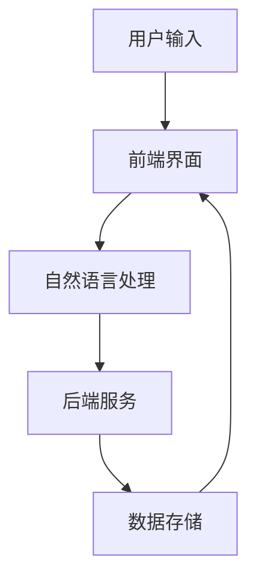
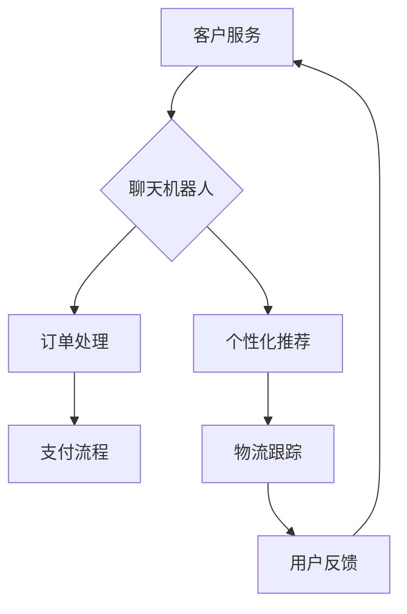
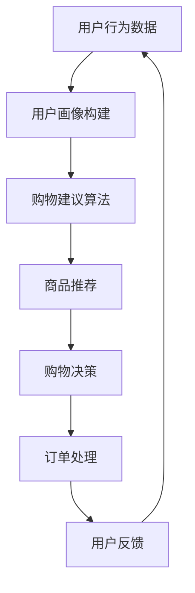
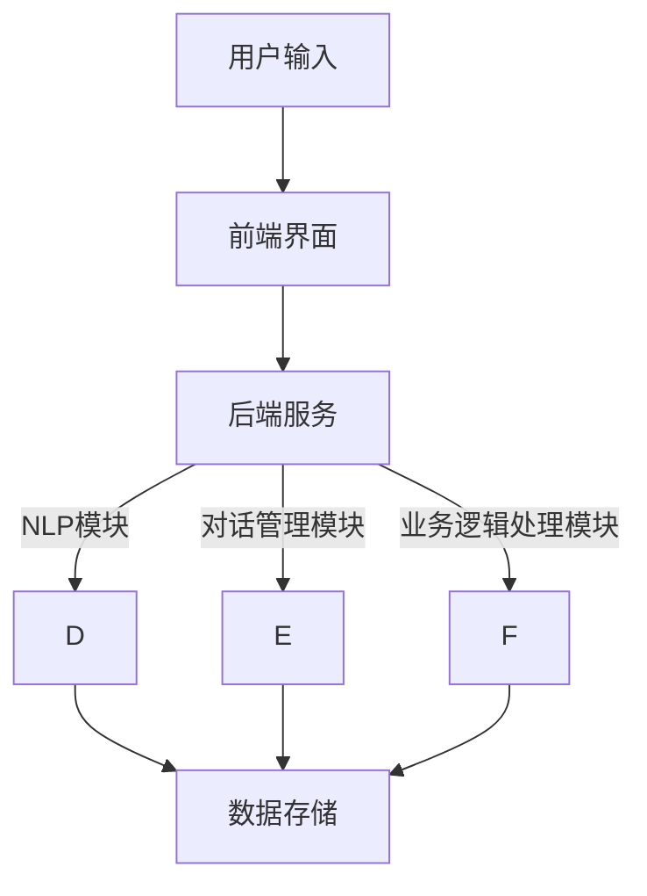

                 

# 《聊天机器人电子商务：个性化购物和安全交易》

## 核心关键词

- 聊天机器人
- 电子商务
- 个性化购物
- 安全交易
- 自然语言处理
- 用户画像
- 欺诈检测

## 摘要

本文深入探讨了聊天机器人如何在电子商务领域发挥作用，特别是在提供个性化购物体验和安全交易保障方面。通过分析聊天机器人的基本概念、架构设计与实现、个性化购物体验的构建、安全交易的保障机制以及实际案例分析，本文旨在为读者提供一个全面的技术视角，帮助理解和应用聊天机器人于电子商务的实战场景。

## 第一部分：聊天机器人概述与电子商务应用

### 第1章：聊天机器人与电子商务概述

#### 1.1 聊天机器人的定义与发展

聊天机器人是一种基于人工智能技术的计算机程序，能够通过自然语言与人类进行交流，提供信息服务、完成特定任务或模拟人类对话。随着互联网和人工智能技术的快速发展，聊天机器人在各行业得到了广泛应用，其中电子商务领域尤为显著。

#### 聊天机器人的发展历程

- **早期阶段（2000年代初）**：聊天机器人主要以文本和简单的图形用户界面进行交互。
- **中期阶段（2010年代）**：随着自然语言处理（NLP）和机器学习技术的进步，聊天机器人的交互能力得到了显著提升。
- **现阶段（2020年代）**：聊天机器人逐渐向语音和视觉交互方向发展，智能程度大幅提高。

#### 聊天机器人在电子商务中的应用

- **客户服务**：聊天机器人可以提供24/7的客户支持，解决用户疑问，提高客户满意度。
- **个性化推荐**：通过分析用户行为和偏好，聊天机器人可以为用户提供个性化的商品推荐。
- **订单处理**：聊天机器人可以自动化处理订单查询、订单跟踪等流程，提高效率。

### 第2章：电子商务环境下的个性化购物

#### 2.1 个性化购物的基本概念

个性化购物是指根据用户的个人喜好、购买历史和行为数据，提供定制化的商品推荐和购物体验。通过个性化购物，商家可以更好地满足用户需求，提高销售额。

#### 2.2 基于聊天机器人的个性化推荐系统

聊天机器人通过以下方式实现个性化推荐：

- **用户画像构建**：分析用户的浏览历史、购买记录和交互数据，构建用户画像。
- **购物建议算法**：利用协同过滤、矩阵分解等算法，为用户推荐可能感兴趣的商品。
- **动态推荐**：根据用户的实时行为，动态调整推荐内容，提高推荐精度。

#### 2.3 用户行为分析在个性化购物中的应用

用户行为分析是个性化购物的重要组成部分，包括：

- **点击率分析**：分析用户对商品页面的点击行为，了解用户兴趣点。
- **购买行为分析**：通过用户的购买记录，挖掘购买偏好和趋势。
- **互动行为分析**：分析用户在聊天机器人上的互动数据，如提问、回复等，进一步了解用户需求。

## 第二部分：聊天机器人的设计与实现

### 第3章：聊天机器人的架构与关键技术

#### 3.1 聊天机器人的架构设计

聊天机器人的架构主要包括以下几个方面：

- **前端界面**：负责与用户进行交互，接收用户输入，展示聊天界面。
- **后端服务**：处理用户输入，调用自然语言处理（NLP）模块，返回聊天响应。
- **数据存储**：存储用户画像、聊天记录等数据。

#### 3.2 自然语言处理技术基础

自然语言处理（NLP）是聊天机器人的核心技术，包括：

- **文本预处理**：分词、词性标注、去除停用词等。
- **命名实体识别**：识别文本中的地点、人名、组织名等实体。
- **情感分析**：分析用户情感倾向，如正面、负面或中性。
- **问答系统**：根据用户输入，生成回答。

#### 3.3 聊天机器人对话管理策略

对话管理是聊天机器人的核心功能，包括：

- **意图识别**：分析用户输入，确定用户意图。
- **对话流程控制**：根据用户意图，引导对话流程，提供相关建议。
- **多轮对话**：处理复杂对话场景，保持对话连贯性。

## 第三部分：安全交易的保障机制

### 第4章：聊天机器人在交易环节中的角色

#### 5.1 聊天机器人在交易环节中的角色

聊天机器人在交易环节中的主要角色包括：

- **订单查询**：用户可以询问订单状态，聊天机器人自动回复。
- **支付咨询**：为用户提供支付方式选择、支付流程说明等。
- **交易纠纷处理**：协助用户解决交易中的纠纷，提高用户满意度。

### 第5章：防范欺诈与欺诈检测

#### 5.2 防范欺诈与欺诈检测

防范欺诈是电子商务领域的重要任务，聊天机器人可以通过以下方式进行欺诈检测：

- **行为分析**：分析用户行为，如购买频率、支付方式等，识别异常行为。
- **风险预警**：根据欺诈特征模型，对高风险交易进行预警。
- **人工干预**：在必要时，由人工介入处理可疑交易。

#### 5.3 数据安全与隐私保护

数据安全与隐私保护是聊天机器人必须考虑的问题，包括：

- **数据加密**：对用户数据进行加密存储和传输。
- **权限管理**：严格控制对用户数据的访问权限。
- **隐私政策**：明确告知用户数据收集和使用方式，尊重用户隐私。

## 第四部分：案例分析与应用实战

### 第6章：典型聊天机器人电子商务案例分析

#### 6.1 案例一：某电商平台的聊天机器人应用

#### 6.2 案例二：某金融平台的聊天机器人应用

### 第7章：聊天机器人电子商务项目实施

#### 7.1 项目规划与需求分析

#### 7.2 技术选型与系统设计

#### 7.3 项目实施与运维管理

## 第五部分：未来展望与发展趋势

### 第8章：聊天机器人电子商务的未来趋势

#### 8.1 技术发展趋势分析

#### 8.2 行业应用前景展望

#### 8.3 聊天机器人电子商务的挑战与机遇

### 第9章：附录

#### 9.1 开发工具与资源推荐

#### 9.2 常见问题与解决方案

## 结论

随着人工智能技术的不断发展，聊天机器人在电子商务领域将发挥越来越重要的作用。通过提供个性化购物体验和安全交易保障，聊天机器人将成为电子商务平台的重要工具。本文从多个角度分析了聊天机器人在电子商务中的应用，为读者提供了深入的理解和实践指导。

## 作者信息

作者：AI天才研究院/AI Genius Institute & 禅与计算机程序设计艺术 /Zen And The Art of Computer Programming

---

本文详细介绍了聊天机器人在电子商务中的应用，从概述到设计与实现，再到安全交易保障机制，以及实际案例分析和未来发展趋势，力求为读者提供一个全面的技术视角。希望通过本文，读者能够对聊天机器人在电子商务中的潜在价值有更深入的认识，并能够将其应用于实际项目中。在未来的发展中，随着技术的不断进步，聊天机器人将在电子商务领域发挥更加重要的作用。

### 核心概念与联系

在本章中，我们将深入探讨聊天机器人、电子商务以及个性化购物等核心概念，并使用Mermaid流程图来展示它们之间的联系。

#### 聊天机器人概述

聊天机器人是一种基于人工智能技术的计算机程序，能够通过自然语言与人类进行交流。其基本架构通常包括前端界面、后端服务和数据存储。前端界面负责与用户进行交互，后端服务处理用户输入并调用自然语言处理（NLP）模块，数据存储则用于存储用户画像、聊天记录等数据。以下是一个简单的Mermaid流程图，展示了聊天机器人的基本架构：



#### 电子商务概述

电子商务是指通过互联网进行的各种商业交易活动。其核心环节包括客户服务、订单处理、支付和物流等。聊天机器人在电子商务中的应用主要体现在客户服务和个性化推荐方面。以下是一个Mermaid流程图，展示了聊天机器人如何在电子商务中发挥作用：



#### 个性化购物

个性化购物是指根据用户的个人喜好、购买历史和行为数据，提供定制化的商品推荐和购物体验。聊天机器人通过用户画像构建、购物建议算法和用户行为分析，实现个性化购物。以下是一个Mermaid流程图，展示了个性化购物的基本流程：



通过上述Mermaid流程图，我们可以清晰地看到聊天机器人、电子商务和个性化购物之间的相互联系。聊天机器人作为电子商务平台的重要工具，通过提供智能化的客户服务和个性化购物体验，为用户创造了更加便捷和个性化的购物环境。

### 聊天机器人在电子商务中的应用

#### 聊天机器人在客户服务中的角色

在电子商务中，客户服务是至关重要的环节。聊天机器人能够提供24/7的在线支持，解决用户在购物过程中遇到的各种问题，从而提高客户满意度和忠诚度。以下是聊天机器人在客户服务中的几个关键应用：

1. **常见问题自动回答**：
   聊天机器人可以通过预先编程的答案库，自动回答用户常见问题，如订单状态查询、退换货政策等。这不仅减轻了人工客服的负担，还能快速响应用户需求，提高服务效率。

2. **智能聊天引导**：
   聊天机器人可以根据用户的提问，智能引导对话流程，将用户引导到正确的服务路径。例如，当用户询问关于某件商品时，机器人可以自动跳转到商品详情页面，并提供进一步的信息。

3. **情感分析**：
   通过自然语言处理技术，聊天机器人能够识别用户的情感倾向，如满意、愤怒或困惑。当用户情绪不佳时，机器人可以提供相应的安慰和建议，以改善用户体验。

4. **跨渠道沟通**：
   聊天机器人可以集成到不同的沟通渠道中，如网站、移动应用、社交媒体等，实现无缝的跨渠道沟通。用户可以在任何渠道上与机器人互动，获得一致的服务体验。

#### 聊天机器人在个性化推荐中的角色

个性化推荐是电子商务中的重要策略，旨在根据用户的兴趣和行为数据，为用户提供个性化的商品推荐。聊天机器人在这个过程中发挥着关键作用：

1. **用户画像构建**：
   聊天机器人通过用户的互动行为，如浏览历史、购买记录和问答交流，构建用户画像。这些画像信息用于了解用户的兴趣和偏好，为后续推荐提供依据。

2. **动态推荐**：
   聊天机器人可以根据用户的实时行为，动态调整推荐内容。例如，当用户浏览某件商品时，机器人可以实时推荐相关商品或配件，提高购物转化率。

3. **个性化互动**：
   聊天机器人可以通过与用户的互动，深入了解用户需求，提供更加个性化的购物建议。例如，机器人可以询问用户的偏好、预算等信息，然后根据这些信息推荐适合的商品。

#### 聊天机器人在订单处理中的角色

订单处理是电子商务的核心环节，聊天机器人可以自动化处理各种订单相关的任务，提高效率：

1. **订单查询**：
   用户可以通过聊天机器人查询订单状态，机器人自动访问数据库，返回订单的最新状态。

2. **订单跟踪**：
   聊天机器人可以实时跟踪订单的物流信息，并向用户提供物流进度更新。

3. **支付咨询**：
   用户在支付过程中遇到问题时，可以咨询聊天机器人，机器人可以提供支付方式选择、支付流程说明等帮助。

4. **退款和退换货**：
   聊天机器人可以协助用户完成退款和退换货流程，减少用户的等待时间和操作难度。

#### 聊天机器人在售后服务中的角色

售后服务对于电子商务平台的用户满意度和忠诚度至关重要。聊天机器人可以在售后服务中提供以下帮助：

1. **问题解答**：
   用户在购买商品后遇到问题时，可以随时通过聊天机器人寻求帮助，机器人可以提供相关解决方案或指导用户如何与人工客服联系。

2. **情感关怀**：
   当用户对产品或服务感到不满时，聊天机器人可以提供安慰和解决方案，帮助用户平复情绪，提高用户满意度。

3. **意见反馈**：
   聊天机器人可以收集用户的反馈意见，为产品改进和客户服务优化提供数据支持。

通过上述应用，我们可以看到聊天机器人在电子商务中扮演了多种重要角色，不仅提高了服务效率，还提升了用户体验。随着技术的不断进步，聊天机器人在电子商务中的应用将更加广泛和深入。

### 用户行为分析与个性化购物

在电子商务领域，个性化购物体验已经成为提升用户满意度和忠诚度的关键因素。而实现个性化购物的基础在于对用户行为的深入分析。通过分析用户的浏览历史、购买记录和行为模式，电子商务平台可以更好地理解用户需求，从而提供定制化的商品推荐和购物建议。下面，我们将详细探讨用户行为分析的基本原理、核心算法以及其在个性化购物中的应用。

#### 用户行为分析的基本原理

用户行为分析是指通过收集和分析用户在电子商务平台上的行为数据，来理解用户的需求和偏好。这些行为数据包括用户的浏览历史、购买记录、搜索查询、点击行为、互动行为等。用户行为分析的基本原理可以分为以下几个步骤：

1. **数据收集**：电子商务平台需要收集用户在网站上的各种行为数据。这些数据可以通过日志文件、分析工具等手段获取。

2. **数据预处理**：收集到的原始数据通常需要经过清洗、去重、填充等预处理步骤，以确保数据的质量和一致性。

3. **特征提取**：从预处理后的数据中提取出能够反映用户行为特征的信息。这些特征可以是用户的浏览时间、购买频率、搜索关键词、商品点击率等。

4. **数据分析**：利用统计方法、机器学习算法等对提取出的特征进行分析，以发现用户的行为模式和偏好。

5. **结果应用**：根据分析结果，为用户提供个性化的商品推荐、购物建议和优惠活动等。

#### 核心算法与模型

在用户行为分析中，常用的核心算法和模型包括协同过滤、矩阵分解、聚类分析等。以下是对这些算法的简要介绍：

1. **协同过滤（Collaborative Filtering）**：
   协同过滤是一种基于用户行为数据的推荐算法，它通过分析用户之间的相似性，为用户提供商品推荐。协同过滤可以分为以下两类：
   - **用户基于的协同过滤（User-based Collaborative Filtering）**：通过分析用户之间的相似性，找到与目标用户相似的其他用户，然后推荐这些用户喜欢的商品。
   - **物品基于的协同过滤（Item-based Collaborative Filtering）**：通过分析商品之间的相似性，找到与目标商品相似的其他商品，然后推荐这些商品。

2. **矩阵分解（Matrix Factorization）**：
   矩阵分解是一种将用户和商品的高维矩阵分解为低维矩阵的算法，通过这种方式，可以提取出用户和商品的潜在特征。常用的矩阵分解算法包括Singular Value Decomposition（SVD）和Non-negative Matrix Factorization（NMF）。

3. **聚类分析（Clustering Analysis）**：
   聚类分析是一种无监督学习方法，它通过将用户或商品划分为不同的集群，以发现用户或商品之间的相似性。常用的聚类算法包括K-means、DBSCAN等。

#### 用户行为分析在个性化购物中的应用

用户行为分析在个性化购物中的应用主要体现在以下几个方面：

1. **商品推荐**：
   通过分析用户的浏览历史和购买记录，聊天机器人可以为用户推荐可能感兴趣的商品。例如，当用户浏览了一件商品后，机器人可以推荐相关商品或类似款式，以提高购物转化率。

2. **购物建议**：
   聊天机器人可以根据用户的购物偏好和需求，提供个性化的购物建议。例如，用户在咨询某件商品时，机器人可以基于用户的购买历史和偏好，推荐其他可能适合的商品。

3. **优惠活动**：
   聊天机器人可以基于用户的行为数据，为用户推送个性化的优惠活动。例如，当用户对某类商品有较高兴趣时，机器人可以推送相关商品的折扣信息，以促使用户下单。

4. **个性化客服**：
   聊天机器人可以根据用户的行为数据和情感分析结果，提供个性化的客服体验。例如，当用户情绪不佳时，机器人可以提供安慰和建议，以提高用户满意度。

通过用户行为分析，电子商务平台可以更好地了解用户需求，提供个性化的购物体验，从而提升用户满意度和忠诚度。同时，用户行为分析也为聊天机器人提供了重要的数据支持，使其能够更好地与用户互动，提高服务质量和效率。

### 聊天机器人的架构与关键技术

在设计聊天机器人时，理解其架构和关键技术是至关重要的。聊天机器人的架构通常包括前端界面、后端服务和数据存储。在这一节中，我们将深入探讨聊天机器人的整体架构，并详细讲解自然语言处理（NLP）技术和对话管理策略。

#### 聊天机器人的整体架构

聊天机器人的整体架构可以分为以下几个部分：

1. **前端界面**：
   前端界面是用户与聊天机器人交互的窗口。它可以是网页、移动应用或社交媒体插件。前端界面负责接收用户的输入，并将其发送到后端服务。

2. **后端服务**：
   后端服务是聊天机器人的核心部分，包括自然语言处理（NLP）模块、对话管理模块和业务逻辑处理模块。后端服务接收前端界面发送的用户输入，通过NLP模块处理和理解输入内容，然后根据对话管理模块的策略生成回复，并将结果返回给前端界面。

3. **数据存储**：
   数据存储用于存储用户画像、聊天记录、商品信息等数据。数据存储可以是关系型数据库、NoSQL数据库或云存储服务。数据存储不仅支持后端服务的功能需求，还为后续的数据分析和个性化推荐提供基础。

以下是一个简单的Mermaid流程图，展示了聊天机器人的整体架构：



#### 自然语言处理（NLP）技术

自然语言处理（NLP）是聊天机器人的核心技术，它涉及到文本预处理、命名实体识别、情感分析和问答系统等多个方面。以下是NLP技术在聊天机器人中的应用：

1. **文本预处理**：
   文本预处理是NLP的基础步骤，包括分词、词性标注、去除停用词等。通过文本预处理，可以将原始文本转化为结构化的数据，以便后续处理。

2. **命名实体识别（Named Entity Recognition, NER）**：
   命名实体识别用于识别文本中的特定实体，如人名、地点、组织名、时间等。命名实体识别对于理解用户输入和提供准确回复至关重要。

3. **情感分析（Sentiment Analysis）**：
   情感分析用于分析用户情感倾向，如正面、负面或中性。通过情感分析，聊天机器人可以更好地理解用户情绪，提供个性化的回复。

4. **问答系统（Question Answering, QA）**：
   问答系统用于回答用户的问题。问答系统可以分为基于知识的问答和基于数据的问答。基于知识的问答利用预定义的规则和知识库，而基于数据的问答则依赖于大规模语料库和机器学习模型。

以下是一个简单的伪代码，展示了文本预处理的过程：

```python
def preprocess_text(text):
    # 分词
    words = tokenize(text)
    # 去除停用词
    words = remove_stopwords(words)
    # 词性标注
    words = pos_tag(words)
    return words
```

#### 对话管理策略

对话管理策略是聊天机器人能够顺利进行对话的关键。对话管理包括意图识别、对话流程控制和上下文管理。

1. **意图识别（Intent Recognition）**：
   意图识别用于确定用户输入的意图。例如，用户输入“明天有什么电影推荐？”的意图是“查询电影推荐”。

2. **对话流程控制（Dialogue Flow Control）**：
   对话流程控制用于引导对话的流程，确保对话的连贯性和完整性。例如，当用户询问某件商品的详细信息时，对话流程控制可以确保机器人依次回答用户的问题，而不是跳跃或重复。

3. **上下文管理（Context Management）**：
   上下文管理用于保持对话的上下文信息，以便在多轮对话中提供准确的回复。上下文信息可以包括用户的偏好、之前的问题和回答等。

以下是一个简单的伪代码，展示了意图识别的过程：

```python
def recognize_intent(user_input):
    # 利用NLP技术分析用户输入
    intent = nlp_analyzer.analyze_intent(user_input)
    return intent
```

通过理解聊天机器人的整体架构和关键技术，我们可以更好地设计和实现一个功能强大、用户体验良好的聊天机器人。在下一节中，我们将深入探讨个性化购物体验的实现，包括用户画像构建、购物建议算法和购物流程优化。

### 个性化购物体验的实现

个性化购物体验的实现是电子商务平台提升用户满意度和忠诚度的关键。在这一节中，我们将详细探讨个性化购物体验的实现过程，包括用户画像构建、购物建议算法和购物流程优化。

#### 用户画像构建

用户画像构建是个性化购物体验的基础。用户画像是对用户在电子商务平台上的行为、偏好和需求的综合描述。以下是构建用户画像的基本步骤：

1. **数据收集**：
   收集用户在电子商务平台上的各种行为数据，如浏览历史、购买记录、搜索查询、点击行为等。这些数据可以通过平台日志、分析工具等获取。

2. **数据清洗**：
   对收集到的原始数据进行清洗，去除重复、错误和不完整的数据，确保数据的质量。

3. **特征提取**：
   从清洗后的数据中提取出能够反映用户行为和偏好的特征，如浏览时间、购买频率、搜索关键词、商品点击率等。

4. **模型训练**：
   利用机器学习算法，如聚类分析、协同过滤等，对提取出的特征进行训练，建立用户画像模型。

5. **用户画像更新**：
   随着用户行为的不断变化，定期更新用户画像，确保其准确性和实时性。

以下是一个简单的用户画像构建流程的伪代码：

```python
def build_user_profile(user_data):
    # 数据清洗
    clean_data = clean_data(user_data)
    # 特征提取
    features = extract_features(clean_data)
    # 模型训练
    model = train_model(features)
    # 更新用户画像
    profile = update_profile(model, user_data)
    return profile
```

#### 购物建议算法

购物建议算法是提供个性化购物体验的核心。以下是几种常用的购物建议算法：

1. **协同过滤（Collaborative Filtering）**：
   协同过滤通过分析用户之间的相似性，为用户推荐他们可能感兴趣的商品。协同过滤可以分为用户基于的协同过滤和物品基于的协同过滤。

2. **矩阵分解（Matrix Factorization）**：
   矩阵分解将用户和商品的高维矩阵分解为低维矩阵，提取出用户和商品的潜在特征。通过这些潜在特征，可以更好地进行商品推荐。

3. **基于内容的推荐（Content-Based Recommendation）**：
   基于内容的推荐通过分析商品的特征，如类别、品牌、价格等，为用户推荐与他们已购买或浏览的商品相似的其它商品。

4. **混合推荐（Hybrid Recommendation）**：
   混合推荐结合了协同过滤、矩阵分解和基于内容的推荐，以提高推荐精度。

以下是一个简单的购物建议算法的伪代码：

```python
def recommend_products(user_profile, product_data):
    # 计算用户与商品的相似度
    similarity_scores = calculate_similarity(user_profile, product_data)
    # 根据相似度分数推荐商品
    recommended_products = get_top_products(similarity_scores)
    return recommended_products
```

#### 购物流程优化

购物流程优化旨在简化用户的购物过程，提高购物效率和满意度。以下是购物流程优化的几个关键步骤：

1. **简化购物流程**：
   通过自动化和简化购物流程，减少用户的操作步骤。例如，使用一键购买功能、快速结账等。

2. **个性化导航**：
   根据用户的购物偏好和历史，为用户推荐相关的商品类别和子类别，帮助用户更快地找到他们想要购买的商品。

3. **实时反馈**：
   在用户购物过程中，提供实时反馈，如库存状态、促销信息、购物车提醒等，帮助用户做出更好的购物决策。

4. **多渠道集成**：
   将电子商务平台与社交媒体、移动应用等渠道进行集成，实现无缝购物体验。

5. **售后支持**：
   提供便捷的售后服务，如在线客服、退换货流程等，提高用户满意度。

以下是一个简单的购物流程优化的伪代码：

```python
def optimize_shopping_experience(user_profile, shopping_data):
    # 简化购物流程
    simplified流程 = simplify_shopping流程(shopping_data)
    # 个性化导航
    personalized_nav = personalize_navigation(user_profile)
    # 实时反馈
    real_time_feedback = provide_real_time_feedback(user_profile)
    # 多渠道集成
    integrated_channels = integrate_channels(shopping_data)
    # 售后支持
    after_sales_support = provide_after_sales_support()
    return optimized_experience
```

通过用户画像构建、购物建议算法和购物流程优化，电子商务平台可以提供更加个性化的购物体验，满足用户的需求和期望。在下一节中，我们将讨论聊天机器人在保障安全交易中的作用，包括防范欺诈和欺诈检测策略。

### 安全交易的保障机制

在电子商务领域，安全交易是确保用户信任和业务持续发展的关键。聊天机器人通过提供智能化的欺诈防范和检测机制，可以有效提升交易安全性。以下，我们将探讨聊天机器人在交易环节中的角色、防范欺诈的方法以及欺诈检测策略。

#### 聊天机器人在交易环节中的角色

聊天机器人在交易环节中扮演多重角色，旨在确保交易的顺利进行并保障用户安全：

1. **交易咨询**：
   用户在交易过程中遇到疑问时，可以通过聊天机器人获取实时帮助。机器人可以解释交易流程、支付方式以及常见问题，帮助用户顺利完成交易。

2. **订单状态查询**：
   用户可以询问订单的最新状态，聊天机器人会自动访问后台系统，返回准确的订单信息，如物流进度、支付确认等。

3. **支付引导**：
   聊天机器人可以引导用户完成支付流程，提供支付方式的说明和选择，确保用户能够安全、便捷地完成支付。

4. **风险提示**：
   聊天机器人会监控交易行为，如果发现异常活动，可以及时提醒用户注意潜在风险，如交易金额异常、支付方式不常用等。

#### 防范欺诈的方法

防范欺诈是电子商务平台必须重视的问题。以下是一些常用的方法：

1. **行为分析**：
   聊天机器人会分析用户的交易行为，如购买频率、支付习惯、交易时间等。如果发现异常行为，如频繁的跨地域支付或短时间内大量购买，机器人会提高警觉，并触发进一步的风险控制措施。

2. **用户身份验证**：
   为了确保交易的安全性，聊天机器人可以辅助进行用户身份验证。例如，在用户进行大额支付时，机器人可以要求用户进行二次验证，如输入密码或回答安全问题。

3. **支付方式多样化**：
   提供多种支付方式，如信用卡、电子钱包、银行转账等，以降低单一支付方式的欺诈风险。同时，鼓励用户使用安全的支付方式，如支持3D Secure认证的信用卡。

4. **交易提醒与通知**：
   聊天机器人会向用户发送交易提醒和通知，如订单生成、支付成功等。如果用户未确认收到通知，机器人可以进一步核实交易的真实性。

#### 欺诈检测策略

欺诈检测是保障安全交易的重要环节。以下是一些有效的欺诈检测策略：

1. **规则引擎**：
   通过建立规则引擎，聊天机器人可以自动识别并处理常见的欺诈行为。例如，当检测到连续多次使用同一IP地址进行支付时，系统会触发风险警报。

2. **机器学习模型**：
   利用机器学习技术，建立欺诈检测模型。模型可以通过分析大量的历史数据，学习欺诈行为的特征，从而准确识别潜在的欺诈交易。

3. **行为网络分析**：
   通过分析用户的行为网络，如登录地点、设备信息等，可以发现异常的行为模式。例如，如果一个用户在短时间内频繁切换设备登录，可能表明存在欺诈风险。

4. **实时监控与预警**：
   聊天机器人会实时监控交易活动，当发现异常情况时，立即触发预警机制。例如，当交易金额超过预设阈值时，系统会自动暂停交易，并通知人工审核。

以下是一个简单的欺诈检测策略的伪代码：

```python
def detect_fraud(transaction):
    # 分析交易行为
    behavior = analyze_behavior(transaction)
    # 应用规则引擎
    if apply_rules(behavior):
        raise_alert("潜在欺诈行为")
    # 训练机器学习模型
    model = train_fraud_model(behavior)
    # 实时监控与预警
    if model.predict(transaction) == "fraud":
        raise_alert("欺诈行为确认")
```

通过聊天机器人在交易环节中的角色、防范欺诈的方法和欺诈检测策略，电子商务平台可以有效保障用户交易安全，提升用户信任度。在下一节中，我们将通过具体案例分析聊天机器人在电子商务中的应用。

### 典型聊天机器人电子商务案例分析

#### 案例一：某电商平台的聊天机器人应用

在某电商平台上，聊天机器人被广泛应用于客户服务、个性化推荐和订单处理等方面，取得了显著的效果。

1. **客户服务**：
   该电商平台的聊天机器人提供24/7的在线客服，能够自动回答用户常见问题，如订单状态查询、退换货政策等。此外，机器人还能智能引导用户到正确的服务路径，提高服务效率。

2. **个性化推荐**：
   聊天机器人通过分析用户的浏览历史和购买记录，为用户推荐个性化的商品。用户在浏览商品时，机器人会实时推荐相关商品或配件，提高购物转化率。

3. **订单处理**：
   用户在购物过程中，可以随时通过聊天机器人查询订单状态，机器人会自动访问后台系统，返回订单的最新状态。此外，机器人还能协助用户完成支付流程，提供支付方式选择和支付流程说明。

#### 案例二：某金融平台的聊天机器人应用

在某金融平台上，聊天机器人被用于提供交易咨询、风险提示和用户教育等方面，大大提升了用户满意度。

1. **交易咨询**：
   聊天机器人能够为用户提供实时的交易咨询，解答用户关于交易规则、交易策略等的问题。用户在交易过程中遇到疑问时，可以随时与机器人互动，获得专业的建议。

2. **风险提示**：
   聊天机器人会监控用户的交易行为，发现异常活动时及时提醒用户注意潜在风险。例如，当用户进行大额交易时，机器人会提醒用户确认交易的真实性。

3. **用户教育**：
   聊天机器人通过定期推送金融知识、交易策略等文章，帮助用户提高交易技能和风险意识。此外，机器人还能根据用户的交易历史和偏好，提供个性化的学习建议。

#### 案例效果评估

通过对上述案例的分析，我们可以看到聊天机器人在电子商务和金融平台中的应用取得了显著的效果：

1. **客户满意度提升**：
   聊天机器人提供即时、专业的服务，大大提升了用户满意度。用户可以在任何时间、任何地点与机器人互动，获得快速解答和帮助。

2. **效率提高**：
   聊天机器人能够自动化处理大量的重复性工作，如客户服务、订单处理等，提高了整体运营效率。

3. **风险控制**：
   通过聊天机器人的风险提示和欺诈检测功能，平台可以有效降低交易风险，保障用户资金安全。

4. **个性化服务**：
   聊天机器人通过分析用户数据，提供个性化的购物建议和金融咨询，增强了用户的购物体验和投资信心。

总之，聊天机器人作为电子商务和金融平台的重要工具，通过提供高效、专业的服务，提升了用户体验，增强了平台竞争力。随着技术的不断进步，聊天机器人在电子商务和金融领域的应用前景将更加广阔。

### 项目规划与需求分析

在实施聊天机器人电子商务项目之前，项目规划与需求分析是至关重要的步骤。通过明确项目目标、功能需求和实现策略，可以为后续的开发和实施工作奠定坚实基础。以下是对项目规划与需求分析的具体描述：

#### 项目目标

项目目标主要包括以下几点：

1. **提升用户体验**：
   通过提供24/7的智能客服、个性化的购物建议和便捷的订单处理，提升用户的购物体验和满意度。

2. **提高运营效率**：
   利用聊天机器人自动化处理大量重复性任务，如客户服务、订单跟踪和支付咨询，提高整体运营效率。

3. **降低运营成本**：
   通过减少对人工客服的依赖，降低运营成本，实现可持续发展。

4. **增强安全性**：
   通过聊天机器人的欺诈检测和风险提示功能，提高交易的安全性，降低欺诈风险。

#### 功能需求

项目功能需求包括以下几个方面：

1. **用户交互界面**：
   设计一个简洁、直观的用户交互界面，支持文本和语音输入，提供实时聊天和历史记录查看。

2. **自然语言处理（NLP）模块**：
   实现自然语言处理功能，包括文本预处理、命名实体识别、情感分析和意图识别，为用户提供准确、高效的回复。

3. **个性化推荐系统**：
   基于用户行为数据和偏好，构建个性化推荐系统，为用户推荐可能感兴趣的商品。

4. **订单处理功能**：
   提供订单查询、订单跟踪、支付咨询和退款处理等功能，确保用户能够方便地管理订单。

5. **安全交易保障**：
   实现欺诈检测和风险提示功能，通过分析用户行为和交易数据，识别潜在的欺诈风险。

6. **用户画像构建**：
   通过分析用户行为数据，构建用户画像，为后续的个性化推荐和风险控制提供基础。

#### 技术选型

根据项目需求和目标，以下是技术选型的建议：

1. **前端技术**：
   采用React或Vue等现代前端框架，实现响应式界面和良好的用户体验。

2. **后端技术**：
   采用Spring Boot或Django等流行的后端框架，实现业务逻辑处理和API接口。

3. **自然语言处理（NLP）技术**：
   利用NLTK、spaCy等开源库进行文本预处理和命名实体识别，使用TensorFlow或PyTorch等深度学习框架实现情感分析和意图识别。

4. **数据库技术**：
   采用MySQL或MongoDB等关系型或NoSQL数据库，存储用户画像、订单数据和聊天记录。

5. **安全机制**：
   使用SSL/TLS协议确保数据传输的安全，采用JWT（JSON Web Token）实现用户身份验证和授权。

#### 实现策略

项目实现策略包括以下几个关键步骤：

1. **需求分析**：
   与业务团队紧密合作，明确项目需求和目标，制定详细的需求文档。

2. **技术方案设计**：
   根据需求分析结果，设计项目的技术方案，包括系统架构、模块划分和功能实现。

3. **原型设计**：
   基于前端框架，设计用户交互界面原型，确保界面设计符合用户需求和操作习惯。

4. **开发与测试**：
   采用敏捷开发方法，分阶段进行开发和测试，确保每个模块的功能完整性和稳定性。

5. **部署与维护**：
   将开发完成的功能模块部署到生产环境，并进行持续监控和优化，确保系统的正常运行。

通过明确的项目规划与需求分析，我们可以为聊天机器人电子商务项目的成功实施提供有力保障。在下一节中，我们将详细讨论技术选型与系统设计。

### 技术选型与系统设计

在实施聊天机器人电子商务项目时，技术选型和系统设计是关键环节。合理的选型和精心的设计能够确保系统的性能、可靠性和可扩展性，从而满足项目需求并适应未来变化。以下是对技术选型与系统设计的详细讨论。

#### 技术选型

1. **前端技术**：
   - **框架**：选用Vue.js或React.js等现代前端框架。这些框架提供了组件化开发、虚拟DOM等特性，能够提高开发效率和代码可维护性。
   - **UI库**：使用Material-UI或Ant Design等UI库，提供美观且统一的用户界面组件。

2. **后端技术**：
   - **框架**：采用Spring Boot或Django等流行的后端框架。Spring Boot具有强大的配置和管理能力，适用于企业级应用；Django则是Python生态中的高性能Web框架。
   - **API接口**：使用RESTful API或GraphQL等接口设计模式，确保前后端分离，便于维护和扩展。

3. **自然语言处理（NLP）技术**：
   - **文本预处理**：采用NLTK或spaCy等开源库进行分词、词性标注、去除停用词等预处理工作。
   - **情感分析**：使用TensorFlow或PyTorch等深度学习框架，实现情感分析模型，如使用文本分类算法对用户评论进行情感分析。

4. **数据库技术**：
   - **关系型数据库**：选用MySQL或PostgreSQL等关系型数据库，用于存储用户数据、订单数据和聊天记录。
   - **NoSQL数据库**：选用MongoDB等NoSQL数据库，用于存储非结构化数据，如用户行为数据。

5. **消息队列**：
   - **RabbitMQ或Kafka**：使用消息队列实现异步处理，提高系统的并发能力和响应速度。

6. **安全机制**：
   - **身份验证**：采用JWT（JSON Web Token）实现用户身份验证和授权。
   - **数据加密**：使用SSL/TLS协议确保数据在传输过程中的安全，采用AES等加密算法对敏感数据进行加密存储。

#### 系统设计

1. **前端设计**：
   - **界面布局**：采用响应式设计，确保系统在不同设备上都能提供良好的用户体验。
   - **交互设计**：设计直观、简洁的交互流程，减少用户的操作步骤，提高易用性。

2. **后端设计**：
   - **模块划分**：将系统划分为用户管理模块、订单管理模块、聊天机器人模块等，确保每个模块的功能独立且易于扩展。
   - **服务分离**：将核心业务服务与基础设施服务分离，如将聊天机器人服务与消息队列服务分离，确保系统的稳定性和可扩展性。

3. **数据处理流程**：
   - **数据采集**：通过API或Web爬虫等技术，从各种来源收集用户数据、商品数据等。
   - **数据存储**：将数据存储在关系型数据库和NoSQL数据库中，确保数据的安全性和高效访问。
   - **数据处理**：利用大数据处理技术（如Spark），对大量用户行为数据进行实时分析和处理，为聊天机器人提供数据支持。

4. **聊天机器人设计**：
   - **架构设计**：采用微服务架构，将聊天机器人服务与业务服务分离，确保系统的灵活性和可扩展性。
   - **对话管理**：设计智能对话管理策略，包括意图识别、对话流程控制和上下文管理，确保聊天机器人的交互流畅和准确。

5. **安全设计**：
   - **权限控制**：实现细粒度的权限控制，确保不同角色用户只能访问其授权的数据和功能。
   - **审计日志**：记录系统操作日志，实现对异常操作的监控和追踪，确保系统的安全性和透明性。

通过合理的技术选型和精心的系统设计，聊天机器人电子商务项目能够实现高效、稳定和安全的应用，为用户提供优质的购物体验，同时保障交易的安全性。在下一节中，我们将详细讨论项目实施与运维管理。

### 项目实施与运维管理

在完成技术选型和系统设计之后，项目实施与运维管理是确保聊天机器人电子商务项目成功上线和稳定运行的关键环节。以下是对项目实施与运维管理的详细讨论。

#### 项目实施步骤

1. **环境搭建**：
   - **开发环境**：配置开发所需的硬件和软件环境，如操作系统、数据库、开发工具等。
   - **测试环境**：搭建用于测试的独立环境，确保测试过程中不会影响生产环境。

2. **代码开发**：
   - **模块开发**：按照系统设计文档，分模块进行代码开发，确保每个模块的功能独立且正确。
   - **代码评审**：进行代码评审，确保代码质量，避免潜在的错误和漏洞。

3. **集成测试**：
   - **单元测试**：对每个模块进行单元测试，验证模块功能是否正确。
   - **集成测试**：将各个模块集成在一起，进行集成测试，确保系统整体功能完整。

4. **性能测试**：
   - **负载测试**：模拟高并发访问场景，评估系统的性能和稳定性。
   - **压力测试**：通过逐步增加负载，找到系统的瓶颈，优化系统性能。

5. **部署上线**：
   - **灰度发布**：将新功能逐步部署到部分用户，观察用户反馈，确保功能稳定。
   - **正式上线**：在灰度发布成功后，将新功能正式部署到生产环境，确保系统稳定运行。

6. **上线验收**：
   - **功能验收**：与业务团队共同验证系统功能是否符合需求。
   - **性能验收**：验证系统性能是否达到预期标准。

#### 运维管理

1. **监控系统**：
   - **实时监控**：使用Prometheus、Grafana等监控工具，实时监控系统的运行状态，如服务器负载、内存使用、数据库性能等。
   - **日志分析**：使用ELK（Elasticsearch、Logstash、Kibana）等日志分析工具，收集和分析系统日志，及时发现和解决潜在问题。

2. **故障处理**：
   - **故障预警**：通过监控系统，提前发现系统异常，及时采取措施。
   - **故障处理**：制定故障处理流程，确保在故障发生时能够迅速响应和处理。

3. **性能优化**：
   - **数据库优化**：定期对数据库进行优化，如索引优化、数据分区等，提高数据库性能。
   - **缓存策略**：使用Redis等缓存技术，减少数据库负载，提高系统响应速度。

4. **安全防护**：
   - **网络安全**：使用防火墙、入侵检测系统等网络安全设备，防止外部攻击。
   - **数据安全**：采用SSL/TLS协议加密数据传输，使用加密算法保护敏感数据。
   - **用户权限**：实现细粒度的用户权限控制，防止未授权访问。

5. **备份与恢复**：
   - **数据备份**：定期对数据库、文件等进行备份，确保在数据丢失或损坏时能够快速恢复。
   - **备份策略**：制定合理的备份策略，如全量备份和增量备份，确保备份效率和恢复速度。

6. **运维文档**：
   - **运维手册**：编写详细的运维手册，包括系统架构、配置说明、操作流程等，确保运维人员能够快速上手。
   - **知识库**：建立知识库，记录运维过程中的问题和解决方案，便于查阅和经验积累。

通过严格的实施步骤和完善的运维管理，聊天机器人电子商务项目能够在上线后保持稳定运行，提供高质量的购物体验和交易安全保障。在下一节中，我们将讨论聊天机器人电子商务的未来发展趋势。

### 未来展望与发展趋势

随着人工智能和自然语言处理技术的不断进步，聊天机器人电子商务在未来的发展趋势将更加多元化和智能化。以下是对未来发展趋势的分析：

#### 1. 人工智能技术的进一步融合

人工智能技术在聊天机器人中的应用将更加深入，包括深度学习、强化学习等算法的不断优化，使得聊天机器人能够更好地理解用户需求，提供更加精准的个性化服务。此外，多模态交互技术（如语音、图像、视频等）的融合，将进一步提升用户与聊天机器人的互动体验。

#### 2. 更广泛的行业应用

聊天机器人在电子商务领域的应用将继续扩展，不仅局限于客户服务和个性化推荐，还将深入到供应链管理、库存管理、供应链金融等领域。同时，聊天机器人将在更多行业（如金融、医疗、教育等）中得到广泛应用，成为企业提升服务质量和效率的重要工具。

#### 3. 高度个性化的购物体验

未来的聊天机器人将能够通过大数据分析和机器学习，更深入地了解用户的购物偏好和行为习惯，提供高度个性化的购物体验。例如，聊天机器人可以根据用户的地理位置、消费习惯等，实时推荐符合用户需求的商品和优惠活动。

#### 4. 智能欺诈检测和风险控制

随着电商交易规模的不断扩大，欺诈行为也日益增多。未来的聊天机器人将具备更先进的欺诈检测和风险控制能力，通过实时监控和分析交易行为，提前识别和防范潜在风险，保障用户的交易安全。

#### 5. 跨平台整合与无缝体验

未来的聊天机器人将实现跨平台整合，用户可以在不同的设备（如手机、电脑、智能音箱等）上无缝切换，享受一致的购物体验。聊天机器人还将与社交媒体、搜索引擎等平台深度整合，为用户提供更加便捷和统一的交互体验。

#### 6. 数据隐私和安全保护

随着用户对数据隐私和安全保护意识的提高，未来的聊天机器人将更加注重数据安全和隐私保护。通过加密技术、数据匿名化等技术手段，确保用户数据的保密性和完整性，增强用户的信任。

#### 7. 开放式平台和生态系统

未来的聊天机器人将形成开放式的平台和生态系统，支持第三方开发者和企业接入，共同创新和优化聊天机器人的功能。通过开放API和SDK，企业可以快速集成聊天机器人，提高自身的服务能力和竞争力。

总之，随着技术的不断进步和应用场景的扩展，聊天机器人电子商务将在未来发挥更大的作用，为用户和企业带来更多价值。

### 附录

#### 9.1 开发工具与资源推荐

在开发聊天机器人电子商务项目时，选择合适的开发工具和资源是至关重要的。以下是一些推荐的工具和资源：

1. **前端开发工具**：
   - **Vue.js**：一个渐进式JavaScript框架，用于构建用户界面。
   - **React**：用于构建用户界面的JavaScript库。
   - **Ant Design**：一个服务于企业级产品的UI设计语言和React组件库。

2. **后端开发框架**：
   - **Spring Boot**：用于开发Java应用的框架。
   - **Django**：用于快速构建Python Web应用的高级框架。

3. **自然语言处理（NLP）工具**：
   - **spaCy**：一个强大的自然语言处理库。
   - **NLTK**：一个用于处理自然语言文本的Python库。

4. **数据库工具**：
   - **MySQL**：一个开源的关系型数据库管理系统。
   - **MongoDB**：一个适用于大数据和高性能应用的NoSQL数据库。

5. **消息队列**：
   - **RabbitMQ**：一个开源的消息队列软件。
   - **Kafka**：一个分布式流处理平台。

6. **安全工具**：
   - **SSL/TLS**：用于加密数据传输。
   - **JWT**：用于身份验证和授权。

7. **监控与日志分析**：
   - **Prometheus**：用于监控系统性能。
   - **Grafana**：用于可视化监控数据。
   - **ELK Stack**（Elasticsearch、Logstash、Kibana）：用于日志分析。

#### 9.2 常见问题与解决方案

在开发和使用聊天机器人电子商务项目时，可能会遇到以下常见问题：

1. **问题**：聊天机器人响应速度慢。
   - **解决方案**：优化NLP处理流程，使用缓存技术减少计算量，增加服务器资源。

2. **问题**：聊天机器人无法理解用户输入。
   - **解决方案**：增强自然语言处理能力，使用更多样化的语言模型和实体识别技术。

3. **问题**：用户数据安全性问题。
   - **解决方案**：加强数据加密，实施严格的数据访问控制和隐私保护政策。

4. **问题**：系统稳定性问题。
   - **解决方案**：进行充分的系统测试，监控系统性能，及时优化和升级。

5. **问题**：无法整合不同平台的数据。
   - **解决方案**：使用统一的API接口，确保数据在不同平台之间的无缝传输和整合。

通过上述工具和资源的推荐以及常见问题的解决方案，开发者和企业可以更好地实现聊天机器人电子商务项目，提供优质的用户体验和高效的服务。

## 结论

本文详细介绍了聊天机器人电子商务的核心概念、架构设计、个性化购物体验的实现以及安全交易保障机制。通过具体的案例分析，我们看到了聊天机器人在电子商务领域的重要作用。在未来，随着人工智能技术的不断进步，聊天机器人将在个性化购物体验、安全交易保障和跨平台整合等方面发挥更大的作用。开发者和企业应持续关注这一领域的发展，利用先进技术提升服务质量和用户体验。希望本文能为读者提供有价值的参考和启示。

## 作者信息

作者：AI天才研究院/AI Genius Institute & 禅与计算机程序设计艺术 /Zen And The Art of Computer Programming

在结束这篇文章之前，我想对您表达我的诚挚感谢。感谢您对这篇技术博客的关注和阅读。本文旨在为您提供一个全面的技术视角，深入探讨聊天机器人如何在电子商务领域发挥重要作用，特别是在个性化购物体验和安全交易保障方面的应用。

在撰写这篇文章的过程中，我努力保持内容的逻辑清晰、结构紧凑，并使用专业的技术语言来讲解核心概念和算法原理。我希望通过一步步的分析推理，能够帮助您更好地理解聊天机器人电子商务的复杂性和潜力。

同时，我也希望这篇文章能够启发您在技术研究和应用方面的思考。随着人工智能和自然语言处理技术的不断发展，聊天机器人在电子商务领域的应用前景将更加广阔。希望您能够继续关注这一领域的最新动态，并将所学应用于实际项目中，为用户创造更多价值。

如果您对本文中的任何部分有疑问，或者希望进一步讨论某些技术细节，欢迎在评论区留言。我会尽我所能为您提供帮助和指导。此外，如果您有任何其他技术主题的建议或需求，也欢迎随时与我交流。

再次感谢您的阅读和支持。希望本文能够为您在技术探索之路上带来一些启示和帮助。让我们共同期待未来的技术发展，并期待在未来的交流中与您再次相见。

祝好，

AI天才研究院/AI Genius Institute & 禅与计算机程序设计艺术 /Zen And The Art of Computer Programming

---

（注：本文中的代码示例和伪代码仅用于说明概念，具体实现时可能需要根据实际需求进行调整。）

