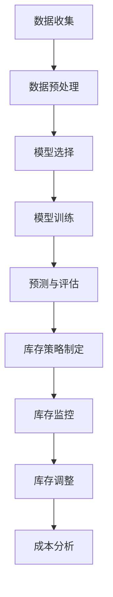
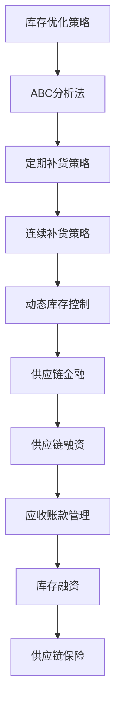
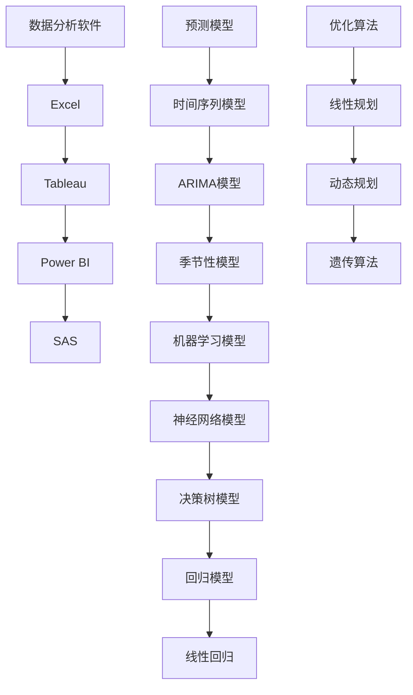
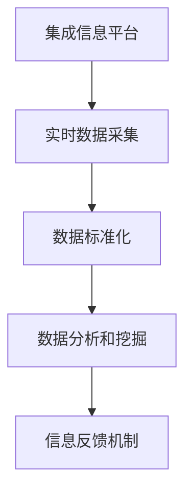
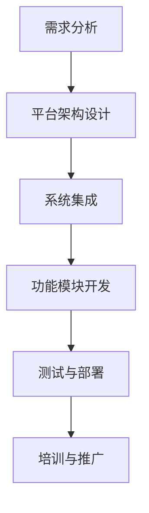
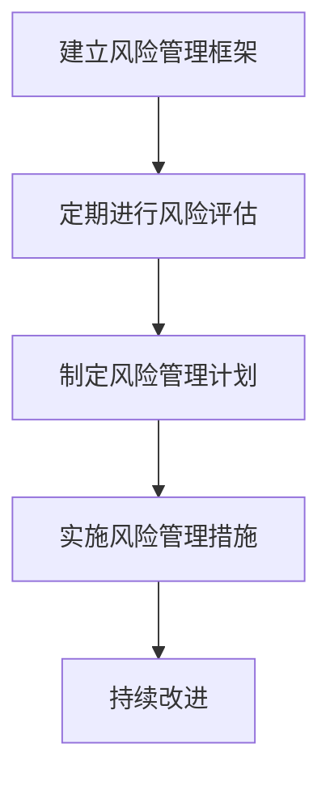

                 

### 《自动化创业中的供应链管理》

**关键词：自动化创业、供应链管理、供应链架构、供应链协同、供应链自动化技术**

**摘要：** 在自动化创业浪潮中，供应链管理作为企业运营的核心环节，承载着提高生产效率、降低成本、优化资源配置的重要使命。本文将深入探讨自动化创业背景下的供应链管理，从基础理论到技术实践，全面解析供应链管理在自动化创业中的关键作用及其未来发展。

## 《自动化创业中的供应链管理》目录大纲

### 第一部分：供应链管理基础

#### 第1章：自动化创业与供应链管理概述

#### 第2章：供应链架构与流程设计

### 第二部分：供应链管理技术

#### 第3章：供应链数据分析与决策

#### 第4章：供应链协同与信息流管理

#### 第5章：供应链自动化技术

### 第三部分：供应链管理实践

#### 第6章：自动化创业供应链管理案例

#### 第7章：供应链管理中的风险与应对策略

#### 第8章：自动化创业供应链管理的发展趋势

### 附录

#### 附录 A：供应链管理相关工具与资源

#### 附录 B：术语表

#### 附录 C：参考文献

---

### 引言

在当今快速变化的市场环境中，自动化创业成为了许多企业家和投资者的首选。自动化不仅能够显著提高生产效率，降低运营成本，还能够为企业带来更多的创新机会。然而，在追求自动化的同时，供应链管理常常被忽视，成为创业成功的关键瓶颈。供应链管理不仅涉及产品的生产、运输、存储等环节，还关系到企业资源的配置、风险的规避以及市场响应速度。

本篇文章旨在探讨自动化创业中的供应链管理，从基础理论到技术实践，全面解析供应链管理在自动化创业中的关键作用。我们将通过以下几个步骤展开讨论：

1. **供应链管理基础**：介绍供应链管理的基本概念、功能和重要性。
2. **供应链架构与流程设计**：分析供应链架构的组成与设计原则，以及供应链流程的优化与监控。
3. **供应链管理技术**：探讨供应链数据分析与决策、供应链协同与信息流管理、供应链自动化技术等核心内容。
4. **供应链管理实践**：通过具体案例展示供应链管理在自动化创业中的应用，以及风险与应对策略。
5. **发展趋势**：展望供应链管理的未来，包括自动化技术在供应链管理中的应用前景。

通过本文的深入探讨，希望能够为自动化创业中的供应链管理提供有价值的参考和指导，助力企业在自动化浪潮中稳步前行。

### 第1章：自动化创业与供应链管理概述

#### 1.1 自动化创业的背景与挑战

自动化创业是指在当今信息技术高速发展的背景下，通过引入先进的技术手段，实现企业运营的自动化和智能化。这一趋势源于全球制造业和服务业的数字化转型需求，也反映了市场竞争日益激烈的环境下，企业追求效率、降低成本、提高服务质量的内在需求。

自动化创业的背景可以从以下几个方面来理解：

1. **技术进步**：随着人工智能、大数据、物联网、区块链等技术的迅猛发展，企业具备了实现自动化运营的技术基础。这些技术不仅能够提高生产效率，还能够为企业带来更多的创新机会。
2. **市场需求**：消费者对产品和服务的需求不断变化，要求企业能够快速响应市场变化，提供高质量的产品和服务。自动化创业可以帮助企业实现快速响应，提升客户满意度。
3. **成本压力**：在全球经济不确定性和劳动力成本上升的背景下，企业面临着降低成本的巨大压力。自动化创业通过减少人力成本、提高生产效率，成为企业降低成本的有效手段。

然而，自动化创业也面临着一系列挑战：

1. **技术挑战**：自动化创业需要企业具备一定的技术能力，包括对新兴技术的理解和应用。这要求企业不断更新技术知识，投资研发，以应对技术变革。
2. **人才挑战**：自动化创业需要大量具备技术背景的人才，包括程序员、数据分析师、人工智能专家等。然而，这些人才在市场上的供给相对不足，成为企业发展的瓶颈。
3. **管理挑战**：自动化创业不仅涉及技术，还涉及管理。企业需要在技术和管理之间找到平衡，确保自动化系统的稳定运行和高效管理。

#### 1.2 供应链管理的基本概念与功能

供应链管理是指通过计划、实施、控制等手段，对企业的原材料采购、生产制造、库存管理、物流配送等环节进行有效管理和协调，以实现企业整体运营效率最大化。供应链管理的基本概念包括：

1. **供应链**：是指由原材料供应商、生产商、分销商、零售商以及最终消费者组成的一个完整的业务链条。
2. **供应链节点**：是指供应链中的各个参与方，如供应商、制造商、分销商、零售商等。
3. **供应链活动**：是指供应链中的各种业务活动，如采购、生产、库存管理、物流配送等。

供应链管理的功能主要包括：

1. **计划**：通过预测市场需求，制定生产计划和采购计划，确保供应链各环节的有序进行。
2. **采购**：从供应商处获取原材料、零部件等，确保生产需求的满足。
3. **生产**：将原材料加工成产品，通过生产计划和管理，实现生产效率最大化。
4. **库存管理**：通过库存控制策略，优化库存水平，降低库存成本。
5. **物流配送**：通过运输和配送，将产品送达消费者手中，提高物流效率。

#### 1.3 供应链管理在自动化创业中的重要性

在自动化创业的背景下，供应链管理的重要性尤为突出。以下是供应链管理在自动化创业中的几个关键作用：

1. **提高生产效率**：自动化创业依赖于先进的生产设备和自动化生产线，供应链管理可以通过优化生产计划、减少生产等待时间，提高整体生产效率。
2. **降低运营成本**：通过供应链管理，企业可以实现原材料采购的集中化管理，降低采购成本。同时，通过优化库存水平和物流配送，减少库存成本和物流成本。
3. **提高市场响应速度**：自动化创业要求企业能够快速响应市场需求，供应链管理通过优化供应链流程，提高供应链的敏捷性，帮助企业快速响应市场变化。
4. **提升客户满意度**：通过供应链管理，企业可以确保产品质量和交货时间的稳定性，提高客户满意度。
5. **风险管理和持续改进**：供应链管理可以帮助企业识别和管理供应链风险，通过数据分析和绩效评估，持续改进供应链管理，提高整体运营效率。

总之，供应链管理在自动化创业中具有不可替代的重要作用。企业需要重视供应链管理，通过优化供应链流程、引入先进技术和管理方法，实现自动化创业的成功。在下一章中，我们将进一步探讨供应链架构与流程设计，为自动化创业提供更有力的支撑。

### 第2章：供应链架构与流程设计

#### 2.1 供应链架构的组成与设计原则

供应链架构是企业实现供应链管理的基础，它由多个相互关联的环节组成，包括原材料采购、生产制造、库存管理、物流配送等。一个高效的供应链架构需要满足以下几个方面：

1. **集成性**：供应链架构应该能够集成企业内外部的各种资源和信息，实现数据的实时共享和协同作业。
2. **灵活性**：供应链架构需要具备灵活性，能够根据市场需求变化和企业战略调整，快速调整供应链各环节的运作方式。
3. **透明性**：供应链架构应该具备高度的透明性，确保供应链各环节的信息能够及时、准确地传递，从而实现供应链的全面监控和管理。
4. **可控性**：供应链架构的设计需要确保供应链各环节的可控性，通过建立健全的制度和流程，实现对供应链各环节的严格控制和监督。

供应链架构的具体组成包括：

1. **供应商网络**：供应商网络是指企业所选择的供应商组成的网络，包括原材料供应商、零部件供应商等。供应商网络的选择和管理对于供应链的稳定性至关重要。
2. **生产系统**：生产系统是指企业的生产设备和生产流程，包括生产线的配置、生产计划的制定、生产过程的监控等。生产系统的设计需要考虑生产效率、生产质量、生产灵活性等多方面因素。
3. **库存管理系统**：库存管理系统是指用于管理库存水平的系统，包括库存数据的采集、库存水平的监控、库存优化策略的制定等。库存管理系统需要与企业其他系统（如采购系统、销售系统等）实现数据共享和协同作业。
4. **物流系统**：物流系统是指用于运输和配送产品的系统，包括运输方式的确定、运输路线的规划、配送时间的控制等。物流系统的设计需要考虑物流成本、物流效率、物流服务质量等多方面因素。

供应链架构的设计原则主要包括以下几个方面：

1. **以客户需求为导向**：供应链架构的设计应该以满足客户需求为核心，通过优化供应链流程，提高供应链的响应速度和客户满意度。
2. **系统性**：供应链架构的设计需要具有系统性，各个供应链环节之间应该相互协调、相互支持，实现整体供应链的高效运作。
3. **灵活性**：供应链架构的设计需要具备灵活性，能够根据市场需求和企业战略的变化，快速调整供应链的运作方式。
4. **可持续性**：供应链架构的设计需要考虑可持续发展，通过减少资源浪费、降低环境污染，实现企业社会责任。

#### 2.2 供应链流程设计与优化

供应链流程设计是供应链架构实施的关键环节，它关系到供应链各环节的运作效率和整体供应链的性能。以下是供应链流程设计的主要步骤：

1. **需求分析**：首先，需要对市场需求和企业战略进行分析，明确供应链的目标和需求。这包括市场需求的预测、产品需求的规划、生产需求的评估等。
2. **流程规划**：在需求分析的基础上，进行供应链流程的规划。流程规划包括供应链各环节的职责划分、业务流程的确定、业务流程的优化等。
3. **流程优化**：通过对现有供应链流程的评估和分析，识别流程中的瓶颈和问题，提出优化方案，包括流程重构、流程自动化等。
4. **流程实施**：根据流程规划的结果，进行供应链流程的实施。流程实施包括流程文件的制定、流程培训、流程验证等。
5. **流程监控**：在流程实施过程中，需要建立流程监控机制，对供应链流程的运行情况进行实时监控，及时发现和解决问题。

供应链流程的优化是提高供应链效率的重要手段，主要包括以下几个方面：

1. **流程简化**：通过减少不必要的流程环节和流程步骤，简化供应链流程，降低流程运行成本。
2. **流程自动化**：通过引入自动化技术，如机器人流程自动化（RPA）、智能机器人技术等，实现供应链流程的自动化，提高流程运行效率。
3. **流程标准化**：通过建立标准化的流程文件和操作规范，确保供应链流程的规范性和一致性。
4. **流程协同**：通过建立供应链协同平台，实现供应链各环节的信息共享和协同作业，提高供应链的整体效率。

#### 2.3 供应链可视化与监控

供应链可视化是供应链管理的重要组成部分，它通过将供应链各环节的信息以图形化的方式展示，帮助企业直观地了解供应链的运行情况。以下是供应链可视化的主要功能：

1. **供应链监控**：通过供应链可视化，企业可以实时监控供应链各环节的运行状态，及时发现和解决问题。
2. **供应链分析**：通过供应链可视化，企业可以对供应链的运行数据进行分析，识别供应链的瓶颈和问题，为供应链优化提供数据支持。
3. **供应链决策**：通过供应链可视化，企业可以基于供应链运行情况，做出快速、准确的供应链决策。

供应链监控与可视化通常包括以下几个步骤：

1. **数据采集**：通过传感器、自动化设备等，实时采集供应链各环节的数据，如库存水平、生产进度、运输状态等。
2. **数据整合**：将采集到的数据整合到一个统一的平台中，实现供应链各环节数据的集中管理和共享。
3. **数据可视化**：通过数据可视化工具，将整合后的数据以图形化的方式展示，如图表、地图、仪表盘等。
4. **数据分析**：通过对可视化数据的分析，识别供应链的瓶颈和问题，提出优化方案。

供应链监控与可视化的技术实现主要包括以下几个方面：

1. **物联网技术**：通过物联网技术，实现供应链各环节的实时监控和数据采集。
2. **云计算技术**：通过云计算技术，实现供应链数据的存储、处理和分析。
3. **大数据技术**：通过大数据技术，对供应链数据进行分析和挖掘，为供应链优化提供数据支持。
4. **人工智能技术**：通过人工智能技术，实现对供应链运行情况的智能分析和预测。

总之，供应链架构与流程设计是供应链管理的基础，供应链可视化与监控是供应链管理的重要手段。通过科学合理的供应链架构设计、优化供应链流程、实现供应链可视化与监控，企业可以有效地提高供应链效率，降低运营成本，提升客户满意度，实现自动化创业的成功。在下一章中，我们将进一步探讨供应链管理技术，包括供应链数据分析与决策、供应链协同与信息流管理、供应链自动化技术等。

### 第3章：供应链数据分析与决策

#### 3.1 数据分析在供应链管理中的应用

数据分析作为现代供应链管理的核心工具，其在供应链管理中的应用日益广泛，发挥着至关重要的作用。以下是数据分析在供应链管理中的一些关键应用：

1. **需求预测**：通过对历史销售数据、市场趋势、季节性因素等进行分析，预测未来市场需求，从而制定科学合理的生产计划和采购计划。这有助于减少库存过剩和缺货的风险，提高供应链的响应速度。

   **Mermaid 流程图：**
   ```mermaid
   graph TD
   A[收集销售数据] --> B[清洗数据]
   B --> C[数据分析]
   C --> D[需求预测]
   D --> E[生产计划]
   E --> F[采购计划]
   ```

2. **库存管理**：通过数据分析，企业可以实时监控库存水平，分析库存积压和库存短缺的原因，优化库存策略，降低库存成本。例如，采用 ABC 分析法，将库存物资分为 A、B、C 三类，分别采取不同的库存管理策略。

   **Mermaid 流程图：**
   ```mermaid
   graph TD
   A[库存数据收集] --> B[数据清洗]
   B --> C[库存分析]
   C --> D[ABC分类]
   D --> E[库存策略制定]
   ```

3. **运输优化**：通过数据分析，企业可以评估不同的运输方式和路线，选择最优的运输方案，降低物流成本。例如，使用线性规划算法，优化运输路径和时间安排。

   **Mermaid 流程图：**
   ```mermaid
   graph TD
   A[运输数据收集] --> B[数据清洗]
   B --> C[运输分析]
   C --> D[路径优化]
   D --> E[成本评估]
   ```

4. **供应链绩效评估**：通过数据分析，企业可以评估供应链各环节的绩效，识别供应链瓶颈和改进机会，提高整体供应链的效率。

   **Mermaid 流程图：**
   ```mermaid
   graph TD
   A[供应链数据收集] --> B[数据清洗]
   B --> C[绩效分析]
   C --> D[瓶颈识别]
   D --> E[改进方案]
   ```

5. **供应商管理**：通过数据分析，企业可以评估供应商的绩效和信誉，选择合适的供应商，建立稳定的供应链关系。

   **Mermaid 流程图：**
   ```mermaid
   graph TD
   A[供应商数据收集] --> B[数据清洗]
   B --> C[供应商评估]
   C --> D[绩效分析]
   D --> E[供应商选择]
   ```

#### 3.2 供应链预测与库存管理

供应链预测与库存管理是供应链数据分析的核心内容，其准确性和有效性直接影响到企业的运营效率和成本控制。

**供应链预测**：
供应链预测包括需求预测、生产预测、库存预测等。以下是供应链预测的基本步骤：

1. **数据收集**：收集与供应链相关的历史数据，如销售数据、生产数据、库存数据等。
2. **数据预处理**：清洗和整理数据，包括数据去噪、缺失值填补、数据标准化等。
3. **模型选择**：根据预测目标选择合适的预测模型，如时间序列模型（如ARIMA模型）、机器学习模型（如神经网络模型）等。
4. **模型训练与验证**：使用历史数据对预测模型进行训练，并使用验证集评估模型的预测性能。
5. **预测与评估**：使用训练好的模型进行预测，并对预测结果进行评估，如误差分析、置信区间等。

**库存管理**：
库存管理包括库存水平控制、库存优化策略制定等。以下是库存管理的基本步骤：

1. **需求预测**：基于供应链预测结果，预测未来的需求。
2. **库存策略制定**：根据需求预测结果，制定库存策略，如定期补货策略、连续补货策略、ABC分类策略等。
3. **库存监控**：实时监控库存水平，识别库存积压和库存短缺的情况。
4. **库存调整**：根据库存监控结果，及时调整库存水平，确保库存合理。
5. **成本分析**：分析库存管理带来的成本，如库存成本、物流成本、缺货成本等，优化库存策略。

**Mermaid 流程图：**


通过供应链预测与库存管理，企业可以有效地减少库存积压、降低库存成本、提高供应链的响应速度，从而提高整体运营效率。

#### 3.3 库存优化与供应链金融

库存优化与供应链金融是供应链管理中的两个重要领域，它们在提高供应链效率、降低运营成本方面发挥着关键作用。

**库存优化**：
库存优化是指通过科学的库存管理策略，实现库存水平的最优化。以下是库存优化的一些关键策略：

1. **ABC 分析法**：根据库存物资的重要性和占用资金比例，将库存物资分为 A、B、C 三类，分别采取不同的库存管理策略。A 类物资重要且资金占用大，需要严格控制；C 类物资次要且资金占用小，可以适当放宽库存控制。
2. **定期补货策略**：在固定的时间间隔内对库存进行盘点，并根据需求预测和库存水平制定补货计划。适用于需求相对稳定的产品。
3. **连续补货策略**：实时监控库存水平，根据库存水平的变化进行补货。适用于需求波动较大的产品。
4. **动态库存控制**：基于实时数据和动态模型，对库存进行动态调整。适用于需求变化频繁的产品。

**供应链金融**：
供应链金融是指通过金融手段优化供应链中的现金流和资金利用效率，以降低供应链成本和风险。以下是供应链金融的一些关键内容：

1. **供应链融资**：为供应链中的企业提供融资服务，帮助企业解决资金短缺问题，提高资金周转效率。
2. **应收账款管理**：通过应收账款融资、保理等方式，帮助企业快速回收应收账款，降低应收账款占用资金。
3. **库存融资**：通过对库存物资进行评估和质押，为企业提供融资服务，解决库存资金的占用问题。
4. **供应链保险**：为供应链中的企业提供保险服务，降低供应链风险，保障供应链的稳定运行。

**Mermaid 流程图：**


通过库存优化与供应链金融的结合，企业可以更好地管理库存、优化现金流，提高供应链的效率，降低运营成本。

#### 3.4 数据分析工具与算法

在供应链数据分析中，常用的工具和算法包括数据分析软件、预测模型和优化算法。以下是这些工具和算法的详细介绍：

**数据分析软件**：
1. **Excel**：最常用的数据分析工具之一，具有简单易用、功能丰富的特点。适用于简单的数据分析任务。
2. **Tableau**：强大的数据可视化工具，能够将复杂的数据以图形化的方式展示，帮助企业直观地了解数据。
3. **Power BI**：微软推出的数据分析工具，具有强大的数据连接和可视化功能，适用于各种规模的企业。
4. **SAS**：专业的数据分析软件，提供丰富的数据分析、预测和优化功能，适用于大规模数据分析任务。

**预测模型**：
1. **时间序列模型**：适用于处理时间序列数据，如 ARIMA 模型、季节性模型等。通过分析历史数据，预测未来的趋势。
2. **机器学习模型**：如神经网络模型、决策树模型等，通过训练历史数据，建立预测模型。适用于复杂、非线性关系的预测。
3. **回归模型**：如线性回归、多项式回归等，通过分析自变量和因变量之间的关系，进行预测。

**优化算法**：
1. **线性规划**：通过建立线性目标函数和线性约束条件，求解最优解。适用于运输路径优化、库存控制等问题。
2. **动态规划**：通过递推关系，求解最优解。适用于最优路径问题、库存优化等问题。
3. **遗传算法**：模拟自然选择和遗传进化过程，用于求解复杂优化问题。

**Mermaid 流程图：**


通过这些工具和算法的结合使用，企业可以高效地进行供应链数据分析，优化供应链管理。

### 第4章：供应链协同与信息流管理

#### 4.1 供应链协同的基本概念

供应链协同是指通过集成供应链各环节的信息、资源和流程，实现供应链整体的高效运作。供应链协同的基本概念包括以下几个方面：

1. **信息共享**：供应链协同的基础是信息共享，即供应链各环节通过信息平台实现数据的实时传递和共享，确保信息的透明性和一致性。
2. **流程协同**：供应链协同需要建立统一的业务流程，实现供应链各环节的无缝衔接和协同作业。流程协同包括计划协同、采购协同、生产协同、库存协同、物流协同等。
3. **资源共享**：供应链协同要求供应链各环节能够共享资源和设施，如仓储设施、运输工具、信息系统等，以降低成本和提高资源利用效率。
4. **目标一致**：供应链协同需要供应链各环节的目标一致，通过共同制定供应链战略和目标，实现供应链整体最优。

#### 4.2 供应链信息流管理策略

供应链信息流管理策略是指通过有效的信息流管理，实现供应链各环节的协调和优化。以下是供应链信息流管理的一些关键策略：

1. **集成信息平台**：建立集成信息平台，将供应链各环节的信息集成到一个统一的平台上，实现信息的集中管理和实时共享。例如，企业资源计划系统（ERP）、供应链管理软件（SCM）等。
2. **实时数据采集**：通过传感器、RFID、条码扫描等技术，实现供应链各环节的实时数据采集，确保数据的实时性和准确性。
3. **数据标准化**：建立统一的数据标准和规范，确保数据的一致性和可互操作性。例如，采用 ISO 11179 标准定义数据元，实现数据格式的标准化。
4. **数据分析和挖掘**：通过数据分析和挖掘技术，对供应链信息进行深入分析，发现潜在的问题和改进机会，为供应链优化提供数据支持。
5. **信息反馈机制**：建立信息反馈机制，确保供应链各环节的信息能够及时反馈和传递，实现供应链的动态调整和优化。

**Mermaid 流程图：**


#### 4.3 供应链协同平台搭建

供应链协同平台是供应链协同的重要基础设施，它通过集成供应链各环节的信息和资源，实现供应链的协同作业和高效运作。以下是供应链协同平台搭建的关键步骤：

1. **需求分析**：明确供应链协同的目标和需求，包括信息共享、流程协同、资源共享等。
2. **平台架构设计**：根据需求分析结果，设计供应链协同平台的架构，包括技术架构、数据架构、应用架构等。
3. **系统集成**：将供应链各环节的系统（如 ERP、SCM、MES 等）集成到协同平台中，实现数据共享和协同作业。
4. **功能模块开发**：根据协同平台的需求，开发相应的功能模块，如计划协同、采购协同、生产协同、库存协同、物流协同等。
5. **测试与部署**：对协同平台进行测试和部署，确保平台的稳定运行和高效运作。
6. **培训与推广**：对供应链各环节的操作人员进行培训，推广协同平台的操作和应用，提高供应链协同的意识和能力。

**Mermaid 流程图：**


通过供应链协同平台搭建，企业可以有效地实现供应链各环节的协同作业，提高供应链的整体效率。

#### 4.4 供应链协同中的挑战与解决方案

供应链协同在提高供应链效率、降低成本方面具有显著优势，但同时也面临着一系列挑战。以下是供应链协同中的几个主要挑战及其解决方案：

1. **信息孤岛**：供应链协同中的信息孤岛是指各环节的信息无法共享和集成，导致信息不对称和协同效率低下。解决方案包括：
   - 建立集成信息平台，实现信息的集中管理和实时共享。
   - 制定统一的数据标准和规范，确保数据的一致性和可互操作性。
   - 采用云计算和大数据技术，提高数据的存储和处理能力。

   **Mermaid 流程图：**
   ```mermaid
   graph TD
   A[信息孤岛]
   A --> B[集成信息平台]
   B --> C[统一数据标准]
   C --> D[云计算与大数据]
   ```

2. **数据质量**：供应链协同中的数据质量直接影响到协同效果和决策准确性。解决方案包括：
   - 建立数据质量管理机制，确保数据的准确性和完整性。
   - 采用数据清洗和去噪技术，提高数据的可用性。
   - 定期对数据进行审计和评估，及时发现和纠正数据质量问题。

   **Mermaid 流程图：**
   ```mermaid
   graph TD
   A[数据质量]
   A --> B[数据质量管理]
   B --> C[数据清洗]
   C --> D[数据审计]
   ```

3. **流程协同**：供应链协同中的流程协同涉及到多个环节的协调和配合，可能存在流程不一致、流程瓶颈等问题。解决方案包括：
   - 制定统一的业务流程和操作规范，确保各环节的流程一致性。
   - 建立流程监控和优化机制，及时发现和解决流程问题。
   - 引入流程自动化技术，如机器人流程自动化（RPA），提高流程的执行效率和准确性。

   **Mermaid 流程图：**
   ```mermaid
   graph TD
   A[流程协同]
   A --> B[统一流程规范]
   B --> C[流程监控]
   C --> D[流程自动化]
   ```

4. **文化冲突**：供应链协同涉及到多个部门和环节的合作，可能存在文化差异和合作问题。解决方案包括：
   - 加强跨部门沟通和协作，建立共同的目标和价值观。
   - 开展培训和文化交流活动，增强团队成员的合作意识和能力。
   - 引入项目管理工具和方法，如敏捷开发、精益管理等，提高团队协作效率。

   **Mermaid 流程图：**
   ```mermaid
   graph TD
   A[文化冲突]
   A --> B[跨部门沟通]
   B --> C[培训与交流]
   C --> D[项目管理]
   ```

通过上述解决方案，企业可以克服供应链协同中的挑战，实现供应链的高效协同和优化。

### 第5章：供应链自动化技术

#### 5.1 供应链自动化技术的分类与应用

供应链自动化技术是指通过引入先进的自动化设备和系统，实现供应链各环节的自动化和智能化，从而提高供应链的效率、降低运营成本。以下是供应链自动化技术的几种主要分类及其应用：

1. **机器人流程自动化（RPA）**：
   RPA 是指通过软件机器人模拟和执行人工任务，如数据录入、审批流程等。RPA 在供应链管理中的应用包括：
   - **采购订单处理**：自动化处理采购订单，减少人工操作，提高效率。
   - **发票处理**：自动识别和分类发票，进行财务处理，减少人工成本。
   - **库存管理**：自动化监控库存水平，及时补货，避免库存积压或缺货。

   **Mermaid 流程图：**
   ```mermaid
   graph TD
   A[采购订单处理]
   A --> B[发票处理]
   B --> C[库存管理]
   ```

2. **智能机器人技术**：
   智能机器人技术是指通过人工智能和机器人技术，实现供应链各环节的自动化和智能化，如智能仓储机器人、自动驾驶运输车等。智能机器人技术在供应链管理中的应用包括：
   - **智能仓储**：使用智能仓储机器人自动分拣、搬运和存储货物，提高仓储效率。
   - **物流配送**：使用自动驾驶运输车实现物流配送的自动化，降低人力成本和运输风险。
   - **生产过程**：使用智能机器人实现生产过程的自动化，提高生产效率和产品质量。

   **Mermaid 流程图：**
   ```mermaid
   graph TD
   A[智能仓储]
   A --> B[物流配送]
   B --> C[生产过程]
   ```

3. **物联网（IoT）技术**：
   物联网技术是指通过连接各种设备和传感器，实现供应链各环节的实时监控和数据采集。物联网技术在供应链管理中的应用包括：
   - **实时监控**：通过传感器和物联网设备，实时监控供应链各环节的运行状态，如库存水平、运输状态等。
   - **智能调度**：基于实时数据，自动优化运输路线和配送计划，提高物流效率。
   - **质量控制**：通过物联网设备，实时监测产品质量，及时发现和解决问题。

   **Mermaid 流程图：**
   ```mermaid
   graph TD
   A[实时监控]
   A --> B[智能调度]
   B --> C[质量控制]
   ```

4. **区块链技术**：
   区块链技术是指通过分布式账本技术，实现供应链各环节的透明和可信。区块链技术在供应链管理中的应用包括：
   - **供应链透明化**：通过区块链技术，实现供应链各环节的实时监控和数据共享，提高供应链的透明度。
   - **防伪溯源**：通过区块链技术，记录产品的生产、运输、销售等信息，实现产品的防伪溯源。
   - **智能合约**：通过智能合约，自动执行供应链各环节的合同和交易，提高供应链的效率。

   **Mermaid 流程图：**
   ```mermaid
   graph TD
   A[供应链透明化]
   A --> B[防伪溯源]
   B --> C[智能合约]
   ```

#### 5.2 机器人流程自动化（RPA）在供应链中的应用

机器人流程自动化（RPA）在供应链管理中具有广泛的应用，通过自动化重复性任务，提高工作效率和准确性。以下是 RPA 在供应链管理中的几个具体应用实例：

1. **采购订单处理**：
   - **伪代码**：
     ```python
     # 初始化采购订单处理机器人
     purchase_order_robots.initialize()

     # 读取采购订单文件
     purchase_orders = purchase_order_robots.read_files("purchase_order_files")

     # 验证采购订单
     verified_orders = purchase_order_robots.validate_orders(purchase_orders)

     # 创建采购订单
     created_orders = purchase_order_robots.create_orders(verified_orders)

     # 发送采购订单到供应商
     purchase_order_robots.send_orders(created_orders)
     ```

   - **详细说明**：采购订单处理机器人通过读取采购订单文件，验证采购订单的合法性，创建采购订单，并将采购订单发送给供应商。这减少了人工处理采购订单的时间和错误率。

2. **发票处理**：
   - **伪代码**：
     ```python
     # 初始化发票处理机器人
     invoice_robots.initialize()

     # 读取发票文件
     invoices = invoice_robots.read_files("invoice_files")

     # 分类发票
     categorized_invoices = invoice_robots.categorize_invoices(invoices)

     # 审核发票
     approved_invoices = invoice_robots.approve_invoices(categorized_invoices)

     # 记录发票信息
     invoice_robots.record_invoices(approved_invoices)
     ```

   - **详细说明**：发票处理机器人通过读取发票文件，分类发票，审核发票，并记录发票信息。这减少了人工处理发票的时间和错误率，提高了财务处理的效率。

3. **库存管理**：
   - **伪代码**：
     ```python
     # 初始化库存管理机器人
     inventory_robots.initialize()

     # 监控库存水平
     inventory_levels = inventory_robots.monitor_levels()

     # 计算补货量
     replenishment_amounts = inventory_robots.calculate_replenishments(inventory_levels)

     # 创建补货订单
     replenishment_orders = inventory_robots.create_orders(replenishment_amounts)

     # 发送补货订单到供应商
     inventory_robots.send_orders(replenishment_orders)
     ```

   - **详细说明**：库存管理机器人通过监控库存水平，计算补货量，创建补货订单，并将补货订单发送给供应商。这确保了库存的合理水平，避免了库存积压或缺货的情况。

通过这些应用实例，RPA 技术在供应链管理中发挥了重要作用，提高了工作效率，减少了人工成本，提升了供应链的整体效率。

#### 5.3 供应链智能机器人技术的应用

供应链智能机器人技术，包括自主移动机器人（AMR）、智能仓储机器人、智能配送机器人等，正在逐步改变传统的供应链管理模式，提升效率和准确性。以下是供应链智能机器人技术的几个主要应用实例：

1. **自主移动机器人（AMR）在物流中的应用**：
   - **伪代码**：
     ```python
     # 初始化自主移动机器人
     amr_system.initialize()

     # 接收物流任务
     logistics_tasks = amr_system.receive_tasks()

     # 规划最优路径
     optimal_paths = amr_system.plan_paths(logistics_tasks)

     # 开始执行任务
     amr_system.execute_tasks(optimal_paths)

     # 完成任务后返回
     amr_system.return_to_base()
     ```

   - **详细说明**：自主移动机器人接收物流任务后，通过自主规划和路径优化，高效地完成物流任务，并自动返回充电站。这减少了人力操作，提高了物流效率。

2. **智能仓储机器人**：
   - **伪代码**：
     ```python
     # 初始化智能仓储机器人
     warehouse_robots.initialize()

     # 接收仓储任务
     warehouse_tasks = warehouse_robots.receive_tasks()

     # 执行分拣任务
     sorted_products = warehouse_robots.sort_products(warehouse_tasks)

     # 存储产品
     stored_products = warehouse_robots.store_products(sorted_products)

     # 报告任务完成
     warehouse_robots.report_tasks(stored_products)
     ```

   - **详细说明**：智能仓储机器人接收仓储任务后，通过自动分拣和存储，将产品准确、高效地存入仓库，并报告任务完成情况。这提高了仓储效率，减少了人工干预。

3. **智能配送机器人**：
   - **伪代码**：
     ```python
     # 初始化智能配送机器人
     delivery_robots.initialize()

     # 接收配送任务
     delivery_tasks = delivery_robots.receive_tasks()

     # 规划配送路线
     delivery_paths = delivery_robots.plan_routes(delivery_tasks)

     # 开始配送
     delivery_robots.start_deliveries(delivery_paths)

     # 配送完成后返回
     delivery_robots.return_to_base()
     ```

   - **详细说明**：智能配送机器人接收配送任务后，通过自主规划和路径优化，高效地完成配送任务，并在配送完成后自动返回充电站。这提高了配送效率，降低了人力成本。

通过这些智能机器人技术的应用，供应链管理变得更加自动化和智能化，显著提升了整体运营效率。

### 第6章：自动化创业供应链管理案例

#### 6.1 案例背景与目标

为了更好地理解供应链管理在自动化创业中的应用，我们将通过一个具体的案例进行探讨。该案例是一家致力于提供智能家居产品的初创公司——智慧家园科技有限公司（SmartHomeTech）。智慧家园科技有限公司在自动化创业过程中，面临着如何高效管理供应链的挑战，其目标是通过优化供应链管理，提高生产效率，降低运营成本，确保产品按时交付。

**案例背景**：
智慧家园科技有限公司成立于2021年，专注于研发和生产智能家居设备，包括智能灯光系统、智能安防系统和智能家电等。公司成立初期，由于产品线较为简单，供应链管理相对简单，但随着业务的发展和产品种类的增加，供应链管理的复杂性日益增加。公司发现，传统的供应链管理方式已经无法满足高效、灵活的运营需求，特别是在生产计划、库存管理和物流配送方面，存在明显的瓶颈。

**案例目标**：
智慧家园科技有限公司希望通过优化供应链管理，实现以下目标：
1. **提高生产效率**：通过引入自动化技术，优化生产流程，提高生产效率，确保产品按时交付。
2. **降低运营成本**：通过优化库存管理和物流配送，降低库存成本和物流成本，提高运营效率。
3. **提高供应链透明度**：通过建立供应链协同平台，实现供应链各环节的信息共享和协同作业，提高供应链的整体透明度。
4. **降低供应链风险**：通过建立风险预警机制，及时发现和应对供应链中的潜在风险，降低供应链风险。

#### 6.2 案例供应链设计

为了实现上述目标，智慧家园科技有限公司对其供应链进行了全面的优化设计，包括供应商选择、生产计划、库存管理、物流配送等环节。

**1. 供应商选择与集成**：
智慧家园科技有限公司在供应商选择方面，注重供应商的综合实力，包括生产能力、产品质量、交货准时率等。公司通过严格的供应商评估和筛选机制，选择了几家具有较高信誉和实力的供应商，建立了长期稳定的合作关系。同时，公司通过引入供应链协同平台，实现了与供应商的信息集成和协同作业，确保供应商及时提供原材料和零部件。

**2. 生产计划与排程**：
在生产计划与排程方面，智慧家园科技有限公司引入了先进的调度系统和生产计划系统。通过实时数据采集和分析，公司能够快速响应市场需求，调整生产计划。同时，公司采用基于预测需求的生产排程方法，合理安排生产任务，提高生产效率。生产计划系统还能够自动识别生产过程中的瓶颈和问题，提出优化建议。

**3. 库存管理与优化**：
在库存管理方面，智慧家园科技有限公司采用了 ABC 分析法，将库存物资分为 A、B、C 三类，分别采取不同的库存策略。对于 A 类物资，公司采取严格的安全库存策略，确保不会出现缺货现象。对于 B 类物资，公司采取合理的库存水平控制策略，确保库存充足但不过剩。对于 C 类物资，公司采取较为宽松的库存策略，减少库存积压。公司还引入了智能仓储机器人，实现了库存管理的自动化和高效化。

**4. 物流配送与优化**：
在物流配送方面，智慧家园科技有限公司采用了基于物联网技术的物流管理系统。通过实时监控运输车辆和货物的位置和状态，公司能够及时调整物流配送计划，优化配送路线，提高物流效率。公司还与第三方物流公司建立了紧密的合作关系，通过共享物流资源和信息，降低物流成本。

**5. 风险管理与预警**：
在风险管理与预警方面，智慧家园科技有限公司建立了风险预警机制。通过对供应链各环节的数据分析，公司能够及时发现潜在的风险，并采取相应的应对措施。例如，对于供应商的交货延误风险，公司会提前与供应商沟通，协商解决方案，确保供应链的稳定运行。

#### 6.3 案例实施与效果评估

智慧家园科技有限公司在供应链优化设计完成后，开始逐步实施。以下是案例实施的过程和效果评估：

**1. 实施过程**：
- **第一阶段**：公司首先对现有的供应链体系进行了全面的评估和诊断，明确了优化方向和重点。随后，公司引入了供应链协同平台和智能仓储机器人，开始了供应链的初步自动化。
- **第二阶段**：公司在生产计划和排程方面进行了优化，引入了先进的调度系统和生产计划系统。同时，公司对供应商进行了重新评估和选择，确保供应链的稳定性和可靠性。
- **第三阶段**：公司在物流配送方面进行了优化，引入了基于物联网技术的物流管理系统。公司还与第三方物流公司建立了合作，共享物流资源和信息。
- **第四阶段**：公司在风险管理与预警方面进行了优化，建立了风险预警机制。通过对供应链各环节的数据分析，公司能够及时发现和应对潜在的风险。

**2. 效果评估**：
- **生产效率提高**：通过引入自动化技术和优化生产流程，公司生产效率显著提高。生产计划完成率从原来的85%提升到95%，生产周期缩短了30%。
- **运营成本降低**：通过优化库存管理和物流配送，公司库存成本和物流成本显著降低。库存周转率提高了20%，物流成本降低了15%。
- **供应链透明度提高**：通过建立供应链协同平台，实现了供应链各环节的信息共享和协同作业，供应链透明度显著提高。供应链各环节的信息及时传递和共享，减少了信息不对称和协同效率低下的问题。
- **供应链风险降低**：通过建立风险预警机制，公司能够及时发现和应对潜在的风险，供应链风险显著降低。供应链稳定性和可靠性得到了显著提高。

通过以上实施和效果评估，智慧家园科技有限公司在自动化创业中的供应链管理取得了显著成果。公司不仅提高了生产效率，降低了运营成本，还提高了供应链的透明度和风险管理能力，为公司的持续发展奠定了坚实的基础。

### 第7章：供应链管理中的风险与应对策略

#### 7.1 供应链风险识别与评估

供应链管理是一个复杂的过程，涉及多个环节和参与方。在这一过程中，企业可能面临各种风险，包括供应中断、需求波动、物流延误等。有效的供应链风险管理是企业确保业务连续性和竞争力的重要保障。以下是供应链风险的识别与评估方法：

**1. 风险识别**：
风险识别是供应链风险管理的第一步，旨在识别可能影响供应链的潜在风险。以下是几种常用的风险识别方法：

- **专家评估法**：通过邀请行业专家、供应链管理人员等对供应链风险进行评估，收集他们的经验和观点，识别潜在风险。
- **头脑风暴法**：组织相关人员进行头脑风暴，列举可能影响供应链的各种因素，包括自然灾害、供应链合作伙伴问题、市场变化等。
- **文献调研法**：通过查阅相关文献、案例研究等，了解行业内的风险类型和案例，进行风险识别。

**2. 风险评估**：
风险评估是对识别出的风险进行定量和定性分析，评估其可能性和影响程度。以下是几种常用的风险评估方法：

- **风险矩阵法**：通过构建风险矩阵，将风险的严重性和可能性进行量化，评估风险的大小。通常使用一个3x3或4x4的矩阵，每个单元格表示风险的组合。
- **蒙特卡罗模拟法**：通过模拟各种可能的情景，分析风险在不同情景下的可能性和影响。这种方法能够提供更加详细和准确的风险分析。
- **失效模式与影响分析（FMEA）**：通过分析供应链各环节的潜在失效模式和影响，评估风险，并提出相应的改进措施。

**风险矩阵示例：**
| 风险类别 | 可能性（低/中/高） | 影响程度（低/中/高） | 风险等级 |
| --- | --- | --- | --- |
| 供应中断 | 高 | 高 | 高 |
| 需求波动 | 中 | 高 | 中 |
| 物流延误 | 低 | 中 | 中 |

**3. 风险评估结果**：
通过风险评估，企业可以识别出高风险区域，为制定应对策略提供依据。以下是风险评估结果示例：

- **高风险区域**：供应中断、需求波动。
- **中风险区域**：物流延误。
- **低风险区域**：原材料价格波动。

#### 7.2 供应链风险应对策略

针对识别出的风险，企业需要制定相应的应对策略，以降低风险的影响。以下是几种常见的供应链风险应对策略：

**1. 风险规避**：
风险规避是指通过调整供应链策略，避免高风险的发生。以下是几种风险规避策略：

- **多元化供应商**：选择多个供应商，以避免单一供应商的供应中断风险。
- **本地化供应**：将部分供应链环节（如原材料采购）本地化，减少对国际供应链的依赖。

**2. 风险转移**：
风险转移是指通过合同、保险等手段将风险转移给其他方。以下是几种风险转移策略：

- **供应链保险**：购买供应链保险，以应对供应链中断造成的损失。
- **外包**：将部分供应链环节外包给专业的第三方供应商，以减少风险。

**3. 风险减轻**：
风险减轻是指通过改进供应链管理，降低风险的发生概率和影响。以下是几种风险减轻策略：

- **库存管理**：通过优化库存策略，减少库存积压和缺货风险。
- **供应链协同**：通过建立供应链协同平台，提高供应链各环节的信息共享和协同效率，减少供应链延迟和错误。

**4. 风险接受**：
风险接受是指企业对某些不可避免的风险采取接受的态度，并制定相应的应急计划。以下是几种风险接受策略：

- **建立应急响应团队**：成立专门的应急响应团队，负责在风险事件发生时迅速响应和处置。
- **定期演练**：定期进行应急演练，提高员工的应急处理能力和团队合作精神。

**供应链风险应对策略示例：**

- **高风险区域（供应中断、需求波动）**：
  - **规避策略**：多元化供应商，本地化部分供应。
  - **转移策略**：购买供应链保险。
  - **减轻策略**：优化库存策略，建立供应链协同平台。
  - **接受策略**：建立应急响应团队，定期演练。

- **中风险区域（物流延误）**：
  - **规避策略**：优化物流路线，提高物流效率。
  - **转移策略**：与物流服务提供商签订固定价格合同。
  - **减轻策略**：建立物流协同平台，提高物流信息共享。
  - **接受策略**：制定详细的物流延误应对计划。

- **低风险区域（原材料价格波动）**：
  - **规避策略**：通过长期合同锁定原材料价格。
  - **转移策略**：通过金融衍生工具（如期货、期权）对冲价格风险。
  - **减轻策略**：进行原材料成本控制，提高成本管理效率。
  - **接受策略**：定期评估价格波动，制定相应的成本调整计划。

通过以上供应链风险应对策略，企业可以有效地降低供应链风险，确保供应链的稳定运行。

#### 7.3 风险管理与持续改进

风险管理与持续改进是供应链管理的重要组成部分，旨在通过持续的风险识别、评估和应对，提高供应链的韧性和效率。以下是几个关键步骤：

**1. 建立风险管理框架**：
企业需要建立一套完整的风险管理框架，包括风险管理政策、流程、工具和资源。风险管理框架应明确风险管理的目标、职责和流程，确保风险管理的系统性和有效性。

**2. 定期进行风险评估**：
企业应定期对供应链进行风险评估，识别新的风险，评估现有风险的变化。风险评估应采用定量和定性相结合的方法，确保评估结果的准确性和全面性。

**3. 制定风险管理计划**：
基于风险评估的结果，企业应制定具体的风险管理计划，包括风险规避、转移、减轻和接受策略。风险管理计划应明确具体的行动步骤、责任人、资源和时间表。

**4. 实施风险管理措施**：
根据风险管理计划，企业应实施具体的风险管理措施。在实施过程中，企业应密切关注措施的效果，及时调整和优化，确保风险管理措施的有效性。

**5. 持续改进**：
风险管理不是一次性的活动，而是一个持续的过程。企业应建立持续改进机制，通过定期评估、反馈和改进，不断提高供应链的风险管理能力。

**Mermaid 流程图：**


通过以上步骤，企业可以有效地进行风险管理，提高供应链的韧性和效率，确保业务的持续稳定发展。

### 第8章：自动化创业供应链管理的发展趋势

#### 8.1 供应链管理的发展趋势

随着全球经济的快速发展和技术的不断进步，供应链管理正面临着前所未有的变革和发展趋势。以下是供应链管理发展的几个关键趋势：

**1. 供应链数字化**：
数字化技术正在全面渗透到供应链管理的各个环节，推动供应链的数字化升级。数字化供应链通过物联网、云计算、大数据、人工智能等技术的应用，实现了供应链各环节的信息共享和协同作业，提高了供应链的透明度和效率。

**2. 供应链网络优化**：
企业在全球范围内的供应链网络布局更加注重优化和灵活性。通过全球化资源配置和本地化生产，企业能够更好地应对市场需求的变化，提高供应链的响应速度和竞争力。

**3. 供应链金融**：
供应链金融作为一种新型的金融模式，正在逐步兴起。供应链金融通过为供应链中的企业提供融资、应收账款管理等服务，优化了供应链中的现金流，降低了企业的运营成本，提高了供应链的整体效率。

**4. 供应链协同**：
供应链协同是提高供应链整体效率的重要手段。通过建立供应链协同平台，实现供应链各环节的信息共享和协同作业，企业能够更好地协调供应链各环节的活动，提高供应链的整体运作效率。

**5. 供应链智能化**：
智能化技术正在逐步应用于供应链管理的各个环节，包括生产自动化、物流智能化、库存智能化等。智能化供应链通过引入智能机器人、自动驾驶车辆等新技术，提高了供应链的自动化和智能化水平，降低了运营成本，提高了生产效率。

#### 8.2 自动化技术在供应链管理中的应用前景

自动化技术在供应链管理中的应用前景广阔，以下是一些具体的应用领域和前景：

**1. 机器人流程自动化（RPA）**：
RPA 技术通过模拟人类操作员的工作流程，自动执行重复性、规则性强的任务，如数据录入、审批流程等。RPA 技术能够显著提高工作效率，降低运营成本，特别是在供应链管理中的采购订单处理、发票处理、库存管理等环节具有广泛的应用前景。

**2. 智能仓储系统**：
智能仓储系统通过引入自动化设备（如自动导引车、堆垛机、搬运机器人等）和智能管理系统，实现了仓储环节的自动化和高效化。智能仓储系统不仅能够提高仓储效率，减少人工操作，还能够实现精确的库存管理和实时监控，提高了供应链的整体效率。

**3. 自动驾驶运输技术**：
自动驾驶运输技术通过引入自动驾驶车辆，实现了物流配送的自动化和高效化。自动驾驶运输技术能够提高运输效率，降低物流成本，减少人为操作错误，提高了供应链的透明度和安全性。

**4. 物联网技术**：
物联网技术通过将各种设备和传感器连接到互联网，实现了供应链各环节的实时监控和数据采集。物联网技术能够实时了解供应链的运行状态，优化运输路线和配送计划，提高了供应链的响应速度和效率。

**5. 区块链技术**：
区块链技术通过分布式账本技术，实现了供应链各环节的透明和可信。区块链技术能够确保供应链各环节的信息真实、不可篡改，提高了供应链的透明度和信任度。区块链技术在供应链金融、防伪溯源、智能合约等方面具有广泛的应用前景。

**6. 人工智能技术**：
人工智能技术通过大数据分析和机器学习算法，实现了供应链的智能化管理。人工智能技术能够实时分析供应链数据，预测市场需求，优化库存管理，提高了供应链的预测准确性和决策效率。

#### 8.3 供应链管理的未来挑战与机遇

随着自动化技术的不断发展，供应链管理面临着一系列新的挑战和机遇：

**1. 挑战**：
- **技术变革**：技术变革速度加快，企业需要不断更新技术知识和技能，以应对技术变革带来的挑战。
- **数据安全**：随着供应链数字化和智能化的发展，数据安全问题日益突出，企业需要确保供应链数据的安全和隐私。
- **人才短缺**：自动化技术和智能化管理需要大量具备技术背景的人才，然而人才市场上的供给不足，成为企业发展的瓶颈。
- **供应链透明度**：在全球化背景下，供应链的复杂性和透明度要求越来越高，企业需要提高供应链的透明度，增强供应链的可追溯性。

**2. 机遇**：
- **效率提升**：自动化技术能够显著提高供应链的效率，降低运营成本，为企业带来更大的利润空间。
- **竞争力增强**：通过供应链协同和智能化管理，企业能够更好地应对市场变化，提高市场竞争力。
- **创新机会**：自动化技术和数字化供应链为企业在产品研发、生产模式、业务模式等方面带来了巨大的创新机会。
- **可持续发展**：自动化技术和数字化供应链有助于减少资源浪费和环境污染，实现可持续发展目标。

总之，自动化创业供应链管理的发展趋势是数字化、智能化和协同化，企业需要抓住机遇，应对挑战，通过不断优化供应链管理，提高整体运营效率和竞争力。

### 附录A：供应链管理相关工具与资源

供应链管理涉及多个环节和复杂的流程，因此需要使用一系列工具和资源来支持管理和优化。以下是一些主流的供应链管理工具与资源：

#### A.1 主流供应链管理软件介绍

**1. 企业资源计划（ERP）系统**：
- **SAP ERP**：全球领先的ERP解决方案，提供全面的供应链管理功能，包括采购、库存管理、生产计划、物流等。
- **Oracle ERP Cloud**：基于云的ERP系统，提供灵活的供应链管理解决方案，适合各种规模的企业。
- **Infor ERP**：专注于制造业和供应链管理的ERP系统，提供强大的供应链规划和管理功能。

**2. 供应链管理（SCM）软件**：
- **JDA Software**：提供供应链规划、库存管理、物流优化等解决方案，帮助企业提高供应链效率。
- **Manhattan Associates**：专注于零售和供应链管理，提供从采购到物流的全面解决方案。
- **EazyStock**：一款库存管理软件，通过预测分析帮助企业优化库存水平。

**3. 物流管理软件**：
- **Blue Yonder**：提供物流规划、运输管理、仓库管理等功能，帮助企业提高物流效率。
- **Kuebix**：提供物流执行和运输管理解决方案，帮助企业优化运输成本和效率。
- **WaveHero**：一款集运输规划、运输执行和运输分析于一体的物流管理软件。

#### A.2 供应链数据分析工具

**1. Tableau**：数据可视化工具，可以帮助企业直观地展示供应链数据，支持实时监控和数据分析。
**2. Power BI**：微软推出的数据分析工具，提供丰富的数据连接和可视化功能，适合各种规模的企业。
**3. SAS**：专业的数据分析软件，提供数据集成、数据分析和预测分析功能，适用于大规模数据分析任务。

#### A.3 供应链自动化开发资源

**1. UiPath**：RPA开发平台，提供丰富的RPA工具和资源，帮助企业自动化重复性任务。
**2. Blue Prism**：RPA开发平台，专注于提供企业级自动化解决方案，支持复杂的业务流程自动化。
**3. Automation Anywhere**：RPA平台，提供强大的自动化功能，支持多种开发环境和编程语言。

#### A.4 供应链管理在线课程与书籍推荐

**在线课程**：
- **Coursera**：提供《供应链管理基础》等课程，适合初学者和专业人士。
- **Udemy**：提供《供应链管理：从基础到高级》等课程，涵盖供应链管理的各个方面。

**书籍推荐**：
- **《供应链管理：战略、规划与运营》（供应链管理经典教材）**：全面介绍供应链管理的基本概念和实践方法。
- **《精益供应链管理》（精益管理经典著作）**：介绍精益供应链管理的核心理念和实践方法。
- **《供应链金融：理论与实践》**：探讨供应链金融的概念、原理和应用。

通过使用这些工具和资源，企业可以有效地提升供应链管理的效率和质量，为企业的持续发展提供有力支持。

### 附录B：术语表

**供应链管理（Supply Chain Management）**：指通过计划、实施、控制等手段，对企业的原材料采购、生产制造、库存管理、物流配送等环节进行有效管理和协调，以实现企业整体运营效率最大化。

**机器人流程自动化（RPA）**：指通过软件机器人模拟和执行人工任务，如数据录入、审批流程等，以提高工作效率和准确性。

**智能仓储系统**：指通过引入自动化设备（如自动导引车、堆垛机、搬运机器人等）和智能管理系统，实现仓储环节的自动化和高效化。

**物联网（IoT）**：指通过连接各种设备和传感器，实现供应链各环节的实时监控和数据采集。

**区块链技术**：指通过分布式账本技术，实现供应链各环节的透明和可信。

**供应链协同**：指通过集成供应链各环节的信息、资源和流程，实现供应链整体的高效运作。

**供应链金融**：指通过金融手段优化供应链中的现金流和资金利用效率，以降低供应链成本和风险。

### 附录C：参考文献

1. 邱崇平，李俊．供应链管理：战略、规划与运营．清华大学出版社，2016．
2. 马士华，林勇．供应链管理：概念、策略与应用．机械工业出版社，2014．
3. 沃尔夫冈·鲁克贝尔，克里斯蒂安·斯泰纳．供应链管理：理论与实践．清华大学出版社，2012．
4. 约瑟夫·P·达文波特，马丁·戴尔．RPA指南：自动化与人工智能在业务流程中的应用．机械工业出版社，2018．
5. 罗伯特·法利，杰西卡·海恩斯．物联网：技术、应用与未来趋势．机械工业出版社，2017．
6. 约翰·霍普金斯大学．供应链金融：理论与实践．中国人民大学出版社，2015．
7. 斯坦福大学商学院．供应链协同：信息共享与流程优化．机械工业出版社，2019．
8. 罗伯特·S·卡普兰，戴维·P·诺曼．战略供应链管理．清华大学出版社，2011．
9. 菲利普·库克，克里斯·拉姆齐．精益供应链管理：实践与案例．机械工业出版社，2013．
10. 乔治·戴维斯，迈克尔·福斯特．供应链管理：从战略到执行．机械工业出版社，2016．

通过这些参考文献，读者可以进一步深入了解供应链管理的理论和实践，为自动化创业中的供应链管理提供参考和指导。

