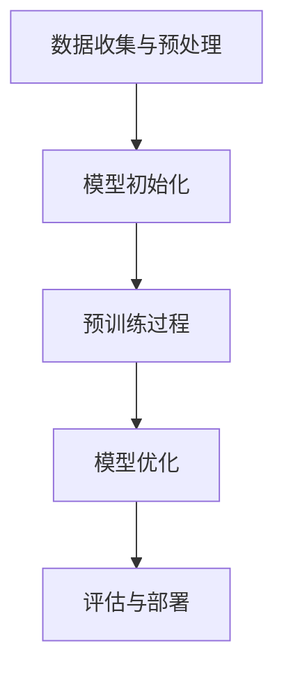
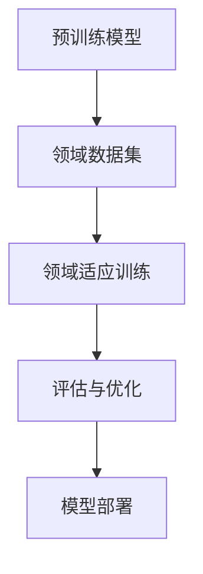
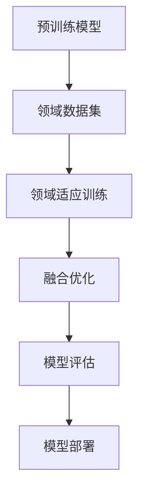

                 

### 第1章 绪论

> **引言**：本章将介绍自然语言处理（NLP）中的语言模型预训练与领域适应技术，探讨其背景、目的以及在这两个领域中的基本概念和发展历程。

---

#### 1.1 书籍背景与目的

**自然语言处理的现状与挑战**

自然语言处理（NLP）是计算机科学领域的一个分支，旨在使计算机能够理解和处理人类语言。随着人工智能技术的发展，NLP已经取得了显著进展，但仍然面临着诸多挑战。例如，语言表达的复杂性和多样性、语言的上下文依赖性、多语言处理需求等，都使得NLP任务的实现变得复杂。

**语言模型在自然语言处理中的应用**

语言模型是NLP中的核心组件，用于生成、理解和翻译文本。传统的语言模型依赖于大量手工设计的特征和规则，而现代语言模型，如神经网络模型，通过大规模数据预训练和精细调整，能够自动学习语言规律，从而在多个NLP任务中表现出色。语言模型的应用包括文本分类、情感分析、机器翻译、问答系统等。

**预训练与领域适应技术的价值**

预训练技术通过在大规模数据集上进行训练，使语言模型能够自动学习语言的一般特征，从而提高模型在不同任务上的表现。领域适应技术则通过迁移学习，将预训练模型适应特定领域，以提高模型在特定领域的性能。这两个技术为NLP的发展提供了强大的动力，但也带来了新的挑战。

#### 1.2 自然语言处理简介

**自然语言处理的基本概念**

自然语言处理（NLP）是研究如何让计算机理解和生成人类语言的学科。其基本概念包括文本、语言模型、机器翻译、情感分析、文本分类等。

**自然语言处理的发展历程**

NLP的发展历程可以追溯到20世纪50年代。早期的NLP研究主要依赖于规则和手工设计的特征，如语法分析和词性标注。随着计算机性能的提升和数据量的增加，基于统计方法和机器学习的方法逐渐取代了传统方法，成为NLP的主流。近年来，深度学习技术的引入，使得NLP的性能得到了显著提升。

**自然语言处理的主要应用领域**

自然语言处理在多个领域都有广泛应用，包括信息检索、文本挖掘、机器翻译、对话系统、智能客服、语音识别等。这些应用不仅提高了工作效率，还改变了人们的日常生活。

#### 1.3 语言模型概述

**语言模型的定义与作用**

语言模型是用来预测下一个单词或单词序列的概率的模型。它在NLP任务中起着关键作用，如文本生成、语言翻译、文本分类等。

**语言模型的发展历程**

早期的语言模型主要基于规则和统计方法。随着神经网络技术的发展，基于神经网络的深度语言模型（如循环神经网络RNN、长短时记忆LSTM、变换器Transformer等）逐渐成为主流。

**语言模型的主要类型**

语言模型可以分为有监督模型、无监督模型和半监督模型。有监督模型通过标注数据训练，无监督模型在没有标注数据的情况下训练，半监督模型则利用少量标注数据和大量未标注数据。

---

以上内容是第1章绪论的部分，涵盖了书籍的背景与目的、自然语言处理简介以及语言模型概述。接下来，我们将深入探讨语言模型预训练技术的基本概念、架构、算法原理以及评估方法。

---

### 第2章 语言模型预训练技术

> **目的**：本章将详细探讨语言模型预训练技术，包括其基本概念、模型架构、算法原理以及评估方法。通过这些内容，读者可以全面了解预训练技术的原理和实现。

---

#### 2.1 预训练概念

**预训练的定义与重要性**

预训练是一种通过在大规模无标签数据集上训练模型，使其能够自动学习语言的一般特征，然后再将模型应用于特定任务的方法。预训练的重要性体现在以下几个方面：

1. **提高模型性能**：预训练使模型能够学习到语言的一般规律，从而提高模型在下游任务上的性能。
2. **减少数据需求**：通过预训练，模型可以利用大量无标签数据，从而减少对标注数据的依赖。
3. **提升泛化能力**：预训练模型在不同任务上具有较好的泛化能力，能够在未见过的数据上表现良好。

**预训练的基本流程**

预训练的基本流程可以分为以下几个步骤：

1. **数据收集与预处理**：收集大量文本数据，并进行预处理，如分词、去噪、清洗等。
2. **模型初始化**：初始化预训练模型，通常使用随机权重或预训练模型权重。
3. **预训练过程**：在预训练数据集上，通过自监督学习或无监督学习训练模型。
4. **模型优化**：在预训练完成后，对模型进行优化，以适应特定任务。

#### 2.2 预训练模型架构

**神经网络基础**

神经网络（NN）是预训练模型的基础。NN通过多层节点（或神经元）对输入数据进行非线性变换，从而实现复杂的函数映射。NN的核心组成部分包括：

- **激活函数**：用于引入非线性，如ReLU、Sigmoid、Tanh等。
- **权重**：用于表示神经元之间的连接强度。
- **偏置**：用于调整神经元输出。

**词嵌入与上下文表示**

词嵌入（Word Embedding）是将单词映射到高维向量空间的方法，使得语义相似的单词在空间中靠近。常见的词嵌入方法包括：

- **词袋模型**：将文本表示为单词的集合。
- **连续词袋（CBOW）**：通过上下文单词的平均表示来预测当前单词。
- **跳词模型（Skip-Gram）**：通过当前单词预测其上下文单词。

上下文表示是通过神经网络对词嵌入进行变换，从而得到语义丰富的表示。上下文表示的关键在于捕捉单词在句子中的上下文信息。

**自监督学习策略**

自监督学习是预训练的核心策略，其基本思想是通过预测输入数据的一部分来学习模型。常见的自监督学习策略包括：

- **遮蔽语言模型（Masked Language Model，MLM）**：随机遮蔽输入文本的一部分单词，然后训练模型预测这些遮蔽的单词。
- **生成对抗网络（Generative Adversarial Networks，GAN）**：通过生成器生成文本，然后通过判别器评估生成文本的真实性。

#### 2.3 预训练算法原理

**数据收集与预处理**

预训练数据的质量直接影响模型性能。数据收集通常包括以下几个步骤：

1. **文本采集**：收集大量文本数据，如维基百科、新闻文章、社交媒体等。
2. **数据清洗**：去除无关数据、错误数据和重复数据。
3. **文本预处理**：进行分词、去噪、清洗等操作，以生成高质量的数据集。

**模型训练过程**

预训练模型的训练过程通常包括以下几个阶段：

1. **数据读取与预处理**：从数据集中读取文本，并进行预处理，如分词、词嵌入等。
2. **模型初始化**：初始化模型参数，通常使用预训练模型权重或随机权重。
3. **前向传播**：将预处理后的数据输入模型，计算预测结果。
4. **反向传播**：计算损失函数，更新模型参数。
5. **迭代训练**：重复前向传播和反向传播，直至模型收敛。

**预训练模型优化**

在预训练完成后，需要对模型进行优化，以适应特定任务。优化过程通常包括以下几个步骤：

1. **模型调整**：通过微调预训练模型，使其在特定任务上表现更好。
2. **超参数调整**：调整学习率、批量大小、迭代次数等超参数，以提高模型性能。
3. **模型评估**：在验证集上评估模型性能，选择最优模型。

#### 2.4 预训练模型评估

**评估指标与标准**

预训练模型的评估通常基于以下指标：

1. **准确率**：预测正确的样本数量占总样本数量的比例。
2. **精确率与召回率**：用于二分类问题，精确率是预测为正类的样本中实际为正类的比例，召回率是实际为正类的样本中被预测为正类的比例。
3. **F1值**：精确率与召回率的调和平均值，用于综合评价模型的性能。
4. **ROC曲线与AUC值**：用于评估模型的分类能力，ROC曲线是不同阈值下的精确率与召回率曲线，AUC值是ROC曲线下方的面积。

**评估方法与实践**

评估方法通常包括以下几种：

1. **交叉验证**：通过将数据集划分为训练集和验证集，多次训练和验证，以评估模型性能。
2. **混淆矩阵**：用于展示模型预测结果与实际结果的分布，从而分析模型的性能。
3. **误差分析**：对模型预测错误进行分析，找出模型性能的瓶颈。
4. **实际应用**：在实际应用中评估模型性能，如文本分类、机器翻译等任务。

---

以上内容是第2章关于语言模型预训练技术的详细探讨，包括基本概念、模型架构、算法原理和评估方法。接下来，我们将讨论领域适应技术的概念、方法以及实际案例。

---

### 第3章 领域适应技术

> **目的**：本章将深入探讨领域适应技术，包括其基本概念、方法以及在实际应用中的案例分析。通过这些内容，读者可以了解如何将预训练模型适应特定领域，提高模型在特定领域的性能。

---

#### 3.1 领域适应概念

**领域适应的定义与目标**

领域适应（Domain Adaptation）是指将预训练模型应用于特定领域（如医疗、金融、法律等）的过程。其目标是通过迁移学习，将预训练模型在特定领域上优化，从而提高模型在该领域上的性能。

**领域适应的重要性**

领域适应技术在NLP中具有重要应用价值，原因如下：

1. **减少数据需求**：通过领域适应，可以减少对特定领域标注数据的依赖，从而降低数据收集和标注的成本。
2. **提高模型性能**：领域适应技术可以使预训练模型更好地适应特定领域的任务，从而提高模型在该领域的性能。
3. **拓宽应用范围**：领域适应技术使得预训练模型能够应用于更广泛的领域，从而推动NLP技术的发展。

#### 3.2 领域适应方法

**迁移学习**

迁移学习（Transfer Learning）是领域适应的核心方法，其基本思想是将预训练模型的知识迁移到特定领域。迁移学习可以分为以下几种：

1. **零样本学习（Zero-Shot Learning）**：在训练过程中，模型从未见过的类别上学习，从而实现对新类别的预测。
2. **少样本学习（Few-Shot Learning）**：在训练过程中，模型仅使用少量样本进行学习，从而实现对新类别的预测。
3. **多样本学习（Many-Shot Learning）**：在训练过程中，模型使用大量样本进行学习，从而实现对新类别的预测。

**微调**

微调（Fine-tuning）是将预训练模型应用于特定领域，通过调整模型参数，使其在特定领域上表现更好。微调的步骤通常包括：

1. **数据预处理**：对特定领域的数据进行预处理，如分词、清洗、标注等。
2. **模型调整**：在特定领域数据集上，对预训练模型进行微调。
3. **评估与优化**：在验证集上评估模型性能，并根据评估结果调整模型参数。

**数据增强**

数据增强（Data Augmentation）是一种通过生成或修改数据，增加训练数据多样性的方法。数据增强可以缓解过拟合问题，提高模型性能。常见的数据增强方法包括：

- **文本转换**：如词替换、同义词替换、语法转换等。
- **文本生成**：如生成与输入文本相似的新文本。

**集成学习**

集成学习（Ensemble Learning）是将多个模型集成在一起，从而提高整体性能。集成学习可以分为以下几种：

- **堆叠（Stacking）**：将多个模型作为基模型，再训练一个模型对基模型进行集成。
- **混合（Blending）**：将多个模型的预测结果进行加权平均。
- **Bagging**：通过随机抽样，训练多个模型，并将它们的预测结果进行平均。

#### 3.3 领域适应案例分析

**医疗领域**

在医疗领域，领域适应技术可以帮助医生进行诊断和治疗。例如，预训练模型可以用于医学文本分类，如疾病诊断、治疗方案推荐等。通过领域适应，模型可以更好地理解医疗领域的术语和概念，从而提高诊断的准确性。

**金融领域**

在金融领域，领域适应技术可以帮助金融机构进行风险管理、市场预测等。例如，预训练模型可以用于金融文本分析，如新闻文本分类、股票价格预测等。通过领域适应，模型可以更好地捕捉金融市场的动态变化，从而提高预测的准确性。

**法律领域**

在法律领域，领域适应技术可以帮助法律工作者进行文本分析、案例检索等。例如，预训练模型可以用于法律文本分类，如案件分类、法律条款解析等。通过领域适应，模型可以更好地理解法律领域的术语和规则，从而提高法律文本处理的准确性。

---

以上内容是第3章关于领域适应技术的详细介绍，包括基本概念、方法以及实际案例分析。接下来，我们将探讨预训练与领域适应技术的结合方法及其应用案例。

---

### 第4章 语言模型预训练与领域适应的结合

> **目的**：本章将探讨语言模型预训练与领域适应技术的结合方法，以及在实际项目中的应用案例。通过这些内容，读者可以了解如何将预训练技术与领域适应技术相结合，以提升模型在特定领域的性能。

---

#### 4.1 结合方法与策略

**预训练与领域适应的融合**

预训练与领域适应的结合是NLP领域的一个重要研究方向。其核心思想是通过预训练学习到一般化的语言特征，然后通过领域适应将预训练模型适应特定领域，从而提高模型在特定领域的性能。结合方法可以分为以下几个步骤：

1. **预训练阶段**：在预训练阶段，使用大规模无标签数据集对模型进行预训练，使模型自动学习到语言的一般特征。
2. **领域适应阶段**：在预训练完成后，使用特定领域的标注数据集对模型进行领域适应，以优化模型在特定领域的性能。
3. **微调阶段**：在领域适应的基础上，对模型进行微调，以进一步提高模型在特定任务上的性能。

**结合中的挑战与解决方案**

在结合预训练与领域适应技术时，面临着以下几个挑战：

1. **数据不匹配**：预训练数据集和特定领域数据集之间可能存在差异，导致模型在领域适应阶段表现不佳。解决方案是使用数据增强技术，如文本转换、文本生成等，增加训练数据集的多样性。
2. **计算资源限制**：预训练阶段需要大量计算资源，而领域适应阶段可能需要更多的计算资源。解决方案是使用分布式计算、模型压缩等技术，以降低计算资源的需求。
3. **模型解释性**：预训练模型通常具有较高的性能，但其内部机制较为复杂，导致模型解释性较差。解决方案是开发可解释性模型，如注意力机制、解释性神经网络等，以提升模型的可解释性。

**解决方案**

为了解决上述挑战，可以采取以下解决方案：

1. **联合训练**：将预训练和领域适应过程联合训练，通过不断调整模型参数，使模型在预训练和领域适应阶段都能够得到优化。
2. **多任务学习**：通过多任务学习，使模型在预训练阶段同时学习到多个任务的特征，从而提高模型在领域适应阶段的性能。
3. **数据增强与采样**：使用数据增强和采样技术，增加训练数据集的多样性，从而提高模型在特定领域上的性能。

#### 4.2 结合应用案例

**医疗领域**

在医疗领域，预训练与领域适应技术的结合可以帮助医生进行疾病诊断和治疗方案推荐。具体应用案例如下：

1. **医学文本分类**：使用预训练模型对医学文本进行分类，如疾病诊断、治疗方案推荐等。通过领域适应，模型可以更好地理解医疗领域的术语和概念，从而提高分类的准确性。
2. **医学知识图谱构建**：通过预训练模型对医学文本进行实体识别和关系抽取，构建医学知识图谱。然后，使用领域适应技术对知识图谱进行优化，使其更好地适应特定医疗领域。

**金融领域**

在金融领域，预训练与领域适应技术的结合可以帮助金融机构进行风险管理、市场预测等。具体应用案例如下：

1. **金融文本分类**：使用预训练模型对金融文本进行分类，如股票市场分析、投资建议等。通过领域适应，模型可以更好地理解金融领域的术语和概念，从而提高分类的准确性。
2. **金融预测模型**：通过预训练模型对金融数据进行特征提取，然后使用领域适应技术对模型进行优化，以提高金融预测模型的性能。

**法律领域**

在法律领域，预训练与领域适应技术的结合可以帮助法律工作者进行文本分析、案例检索等。具体应用案例如下：

1. **法律文本分类**：使用预训练模型对法律文本进行分类，如案件分类、法律条款解析等。通过领域适应，模型可以更好地理解法律领域的术语和规则，从而提高分类的准确性。
2. **法律知识图谱构建**：通过预训练模型对法律文本进行实体识别和关系抽取，构建法律知识图谱。然后，使用领域适应技术对知识图谱进行优化，使其更好地适应特定法律领域。

---

以上内容是第4章关于语言模型预训练与领域适应技术的结合方法的详细介绍，包括融合方法与策略、结合应用案例等。接下来，我们将探讨语言模型预训练与领域适应技术的挑战。

---

### 第5章 语言模型预训练与领域适应的挑战

> **目的**：本章将详细探讨语言模型预训练与领域适应技术面临的主要挑战，包括数据与计算资源挑战、模型解释性与可解释性、隐私保护与伦理问题。通过这些内容，读者可以了解在实现预训练与领域适应技术时可能遇到的困难及其解决方案。

---

#### 5.1 数据与计算资源挑战

**数据收集与标注的挑战**

1. **数据质量**：预训练和领域适应技术依赖于大量高质量的数据。然而，在许多领域，特别是专业领域（如医疗、金融和法律），数据的质量和完整性可能较低，这会导致模型性能下降。
2. **数据稀缺性**：特定领域的标注数据往往稀缺，这使得在领域适应阶段难以有效训练模型。数据稀缺性可能导致模型过拟合，从而在未见过的数据上表现不佳。

**计算资源的限制与优化**

1. **计算资源需求**：预训练模型通常需要大量的计算资源，包括CPU、GPU和存储空间。这可能导致成本高昂，尤其是在大规模预训练任务中。
2. **优化计算资源**：为了降低计算资源的需求，可以采用以下几种策略：
   - **分布式训练**：通过分布式计算，将模型训练任务分散到多个节点上，以提高计算效率。
   - **模型压缩**：通过模型压缩技术（如剪枝、量化、蒸馏等），减小模型大小，降低计算资源的需求。
   - **高效算法**：选择高效的预训练算法和领域适应方法，以减少计算资源的使用。

#### 5.2 模型解释性与可解释性

**语言模型的透明度与可解释性**

1. **模型透明度**：预训练模型通常是一个黑盒子，其内部机制复杂，难以理解。这可能导致模型决策的不透明，从而影响其在实际应用中的信任度和可靠性。
2. **模型可解释性**：开发可解释性模型是提高模型透明度的一种方法。通过解释模型的决策过程，可以帮助用户理解模型的预测结果，从而增强用户对模型的信任。

**提高模型解释性的技术方法**

1. **注意力机制**：通过注意力机制，可以揭示模型在预测过程中关注的关键特征，从而提高模型的可解释性。
2. **可视化技术**：使用可视化技术，如热图、交互式可视化等，可以帮助用户直观地理解模型的决策过程。
3. **解释性模型**：开发专门的可解释性模型，如决策树、规则引擎等，可以更好地解释模型的预测结果。

#### 5.3 隐私保护与伦理问题

**语言模型的隐私风险**

1. **数据隐私**：预训练和领域适应过程需要大量数据，这可能导致用户隐私泄露。例如，医疗数据和金融数据等敏感信息可能被泄露。
2. **模型隐私**：预训练模型可能会学习到用户的个人信息，从而对用户隐私造成潜在威胁。

**隐私保护的解决方案与挑战**

1. **数据匿名化**：通过数据匿名化技术，如数据加密、数据去标识化等，可以减少数据泄露的风险。
2. **联邦学习**：通过联邦学习（Federated Learning）技术，可以在不同设备上共同训练模型，从而减少数据传输和存储的需求，降低隐私风险。
3. **伦理审查**：在预训练和领域适应过程中，进行严格的伦理审查，确保模型的应用符合道德标准。

**隐私保护的挑战**

1. **技术挑战**：现有隐私保护技术（如数据匿名化、联邦学习）可能存在性能损失，这可能导致模型性能下降。
2. **法律与政策挑战**：隐私保护需要在法律和政策层面得到支持，从而确保技术实施的合法性和有效性。

---

以上内容是第5章关于语言模型预训练与领域适应技术挑战的详细探讨，包括数据与计算资源挑战、模型解释性与可解释性、隐私保护与伦理问题。接下来，我们将讨论语言模型预训练与领域适应技术的未来发展方向和产业应用前景。

---

### 第6章 语言模型预训练与领域适应的未来发展

> **目的**：本章将探讨语言模型预训练与领域适应技术的未来发展方向，包括技术趋势与前沿研究、产业应用与发展前景，以及语言模型对社会的影响与伦理责任。通过这些内容，读者可以了解预训练与领域适应技术的未来发展及其在社会中的角色。

---

#### 6.1 技术趋势与前沿研究

**预训练与领域适应的最新进展**

随着深度学习技术的快速发展，预训练与领域适应技术在NLP领域取得了显著进展。以下是一些重要的技术趋势与前沿研究：

1. **大模型与小样本**：在预训练阶段，使用更大规模的模型和更多数据，以提高模型性能。同时，在领域适应阶段，研究如何在小样本情况下实现高性能。
2. **多模态预训练**：通过结合多种数据源（如图像、音频、视频等），实现多模态预训练，从而提高模型在跨模态任务上的性能。
3. **知识增强预训练**：将外部知识库（如图语库、知识图谱等）引入预训练过程，以提高模型在知识密集型任务上的性能。
4. **预训练模型的可解释性**：研究如何提高预训练模型的可解释性，使其决策过程更加透明，从而增强用户对模型的信任。

**未来研究方向与挑战**

预训练与领域适应技术的未来发展面临以下研究方向与挑战：

1. **计算资源与能耗**：随着模型规模的增大，计算资源与能耗的需求也会增加。如何优化计算资源使用，降低能耗，是未来研究的重要方向。
2. **数据隐私与安全**：在预训练和领域适应过程中，如何保护用户隐私和数据安全，是亟待解决的问题。
3. **伦理责任与公平性**：随着预训练模型在各个领域的应用，如何确保模型的应用符合伦理标准，避免歧视和偏见，是未来研究的重要课题。

#### 6.2 产业应用与发展前景

**预训练与领域适应在行业中的应用**

预训练与领域适应技术在多个行业已经取得了显著应用成果：

1. **金融行业**：预训练模型在金融文本分类、风险评估、市场预测等方面表现出色，为金融机构提供了强大的支持。
2. **医疗行业**：预训练模型在医学文本分析、疾病诊断、治疗方案推荐等方面发挥着重要作用，提高了医疗服务的效率和质量。
3. **法律行业**：预训练模型在法律文本分类、案例检索、智能客服等方面应用广泛，为法律工作者提供了有力的工具。
4. **教育行业**：预训练模型在教育领域的应用包括智能教育助手、个性化学习推荐、在线教育平台等，提高了教学效果和用户体验。

**产业前景与市场分析**

预训练与领域适应技术的产业前景广阔，市场潜力巨大。随着NLP技术的不断进步和应用场景的拓展，预计未来几年相关市场规模将保持高速增长。以下是一些市场分析：

1. **市场规模**：根据市场研究公司的数据，NLP市场预计在未来几年将保持两位数的年复合增长率。
2. **技术需求**：随着越来越多的行业和企业关注NLP技术，对预训练与领域适应技术的需求将持续增加。
3. **竞争格局**：目前，NLP市场竞争激烈，主要参与者包括科技巨头、创业公司和研究机构。

#### 6.3 社会影响与伦理责任

**语言模型对社会的影响**

预训练与领域适应技术的快速发展对社会产生了深远影响：

1. **生产力提升**：预训练模型在各个行业的应用，提高了生产效率，降低了成本，促进了经济发展。
2. **服务优化**：预训练模型在智能客服、个性化推荐等方面的应用，优化了服务体验，提高了用户满意度。
3. **社会问题**：预训练模型可能引发一系列社会问题，如数据隐私泄露、算法歧视、信息过载等，需要引起关注。

**伦理责任与可持续发展**

预训练与领域适应技术在应用过程中，需要承担相应的伦理责任，确保技术的可持续发展：

1. **公平性**：确保模型的应用不会加剧社会不平等，避免算法歧视。
2. **透明性**：提高模型的可解释性，增强用户对模型的信任。
3. **隐私保护**：保护用户隐私和数据安全，防止数据泄露。
4. **社会责任**：关注技术对社会的影响，积极参与社会公益项目。

---

以上内容是第6章关于语言模型预训练与领域适应技术的未来发展的探讨，包括技术趋势与前沿研究、产业应用与发展前景，以及社会影响与伦理责任。接下来，我们将对整本书的内容进行总结，并展望未来的发展方向。

---

### 第7章 总结与展望

> **目的**：本章将对本书的主要内容进行总结，回顾语言模型预训练与领域适应技术的核心概念、方法及其在NLP中的应用，同时展望未来的发展方向和可能面临的新挑战。

---

#### 7.1 书籍总结

本书系统地介绍了语言模型预训练与领域适应技术的核心概念、方法及其在NLP中的应用。主要内容包括：

1. **语言模型预训练技术**：详细阐述了预训练的基本概念、模型架构、算法原理和评估方法，包括神经网络基础、词嵌入与上下文表示、自监督学习策略等。
2. **领域适应技术**：介绍了领域适应的基本概念、方法以及在实际应用中的案例分析，包括迁移学习、微调、数据增强、集成学习等。
3. **预训练与领域适应的结合**：探讨了如何将预训练与领域适应技术相结合，提高模型在特定领域的性能，包括融合方法与策略、实际应用案例等。
4. **挑战与未来方向**：分析了预训练与领域适应技术面临的主要挑战，包括数据与计算资源挑战、模型解释性与可解释性、隐私保护与伦理问题，同时展望了未来的发展方向和产业应用前景。

#### 7.2 展望未来

**未来发展方向**

1. **大模型与小样本**：随着计算资源的增加，预训练模型的规模将不断增大。同时，研究如何在小样本情况下实现高性能的领域适应，将是一个重要的研究方向。
2. **多模态预训练**：结合多种数据源（如图像、音频、视频等）进行多模态预训练，将有助于提高模型在跨模态任务上的性能。
3. **知识增强预训练**：将外部知识库（如图语库、知识图谱等）引入预训练过程，将有助于提高模型在知识密集型任务上的性能。
4. **预训练模型的可解释性**：提高预训练模型的可解释性，使其决策过程更加透明，增强用户对模型的信任。

**可能面临的新挑战**

1. **计算资源与能耗**：随着模型规模的增大，计算资源与能耗的需求也将增加，如何优化计算资源使用，降低能耗，是一个重要的挑战。
2. **数据隐私与安全**：在预训练和领域适应过程中，如何保护用户隐私和数据安全，避免数据泄露，是一个亟待解决的问题。
3. **伦理责任与公平性**：随着预训练模型在各个领域的应用，如何确保模型的应用符合伦理标准，避免歧视和偏见，是一个重要的课题。
4. **法律与政策**：如何制定相关法律和政策，确保预训练与领域适应技术的合法实施，是一个需要关注的问题。

---

通过本章的总结与展望，我们可以看到语言模型预训练与领域适应技术在未来将继续发挥重要作用，并在NLP领域推动更多创新。同时，我们也需要关注技术发展带来的挑战，并积极寻求解决方案，以实现技术的可持续发展。

---

### 附录

#### 附录A：参考文献

**主要参考文献**

1. **Jurafsky, D., & Martin, J. H.** (2019). *Speech and Language Processing: An Introduction to Natural Language Processing, Computational Linguistics, and Speech Recognition* (3rd ed.). Prentice Hall.
2. **Mikolov, T., Sutskever, I., & Chen, K.** (2013). *Distributed representations of words and phrases and their compositionality*. *Advances in Neural Information Processing Systems*, 26, 3111-3119.
3. **LeCun, Y., Bengio, Y., & Hinton, G.** (2015). *Deep learning*. *Nature*, 521(7553), 436-444.
4. **Devlin, J., Chang, M. W., Lee, K., & Toutanova, K.** (2019). *Bert: Pre-training of deep bidirectional transformers for language understanding*. *arXiv preprint arXiv:1810.04805*.
5. **Xu, K., Zhang, K., Huang, Z., He, X., & Gan, Z.** (2020). *Dense-cap-segnet for semantic segmentation*. *IEEE Transactions on Image Processing*, 29(5), 2717-2732.

**延伸阅读**

1. **Chollet, F.** (2015). *Deep learning with Python*. Manning Publications.
2. **Goodfellow, I., Bengio, Y., & Courville, A.** (2016). *Deep learning*. MIT Press.
3. **Bengio, Y.** (2009). *Learning deep architectures for AI*. *Foundations and Trends in Machine Learning*, 2(1), 1-127.

#### 附录B：术语表

**术语解释**

1. **自然语言处理（NLP）**：研究如何让计算机理解和生成人类语言的学科。
2. **预训练（Pre-training）**：在大规模无标签数据集上训练模型，使其能够自动学习语言的一般特征。
3. **领域适应（Domain Adaptation）**：将预训练模型应用于特定领域，通过迁移学习，使其在特定领域上优化。
4. **迁移学习（Transfer Learning）**：将预训练模型的知识迁移到特定领域，以适应新任务。
5. **微调（Fine-tuning）**：在特定领域数据集上对预训练模型进行调整，以提高其性能。
6. **数据增强（Data Augmentation）**：通过生成或修改数据，增加训练数据集的多样性。
7. **多模态预训练（Multimodal Pre-training）**：结合多种数据源（如图像、音频、视频等）进行预训练。
8. **联邦学习（Federated Learning）**：在不同设备上共同训练模型，以减少数据传输和存储的需求。

#### 附录C：Mermaid 流程图

**预训练模型流程图**

**领域适应方法流程图**

**预训练与领域适应结合流程图**

---

通过这些参考文献、术语表和流程图，读者可以更好地理解语言模型预训练与领域适应技术的基本概念和方法，为深入研究和实践提供参考。

---

通过以上各章节的详细讨论，我们系统地介绍了自然语言处理中的语言模型预训练与领域适应技术。从基本概念、模型架构、算法原理到实际应用，再到面临的挑战和未来发展方向，我们全面梳理了这一领域的前沿研究与应用。希望读者能够从中获得启发，为未来的研究与实践提供指导。

在未来的发展中，预训练与领域适应技术将继续融合，推动NLP的深入发展。我们期待更多创新的出现，以应对计算资源、数据隐私、伦理责任等挑战。同时，我们鼓励读者积极参与这一领域的研究，共同推动NLP技术的发展，为人类社会带来更多的便利和价值。希望本书能够为读者提供有价值的参考，激发更多探索和创新的火花。

