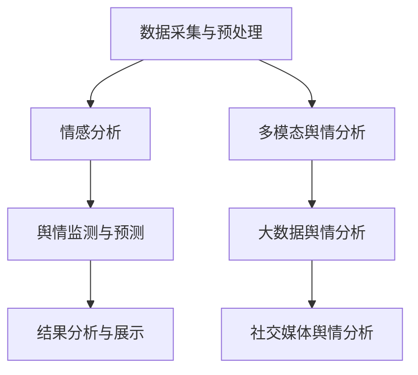
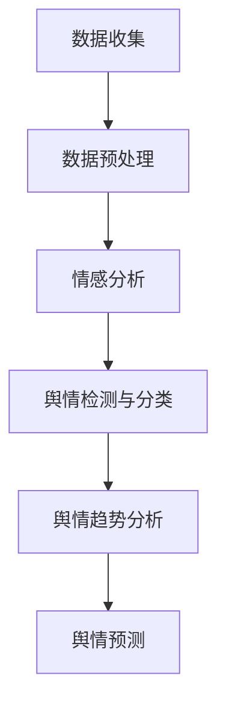
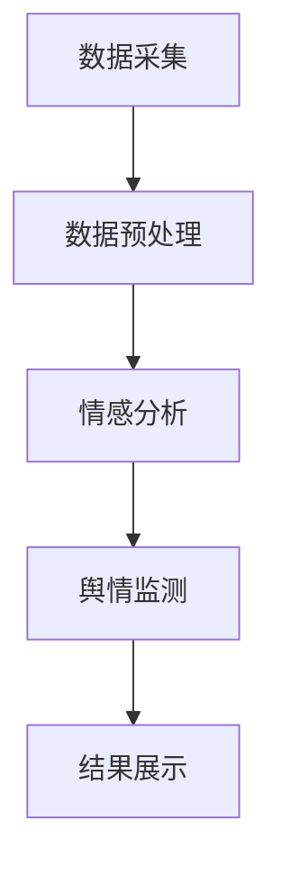
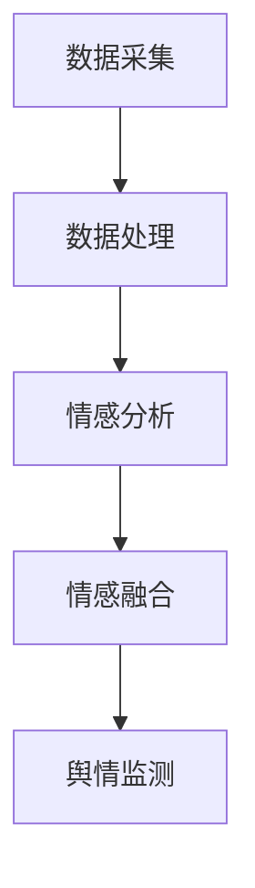
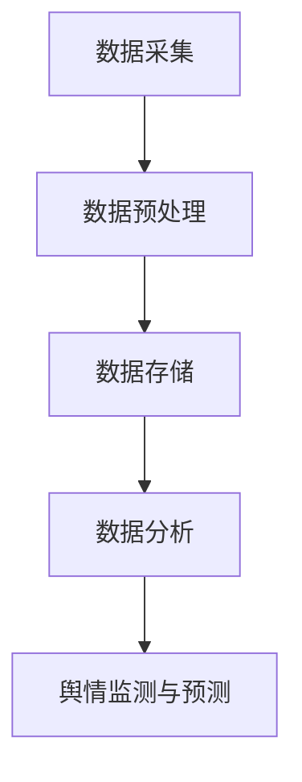
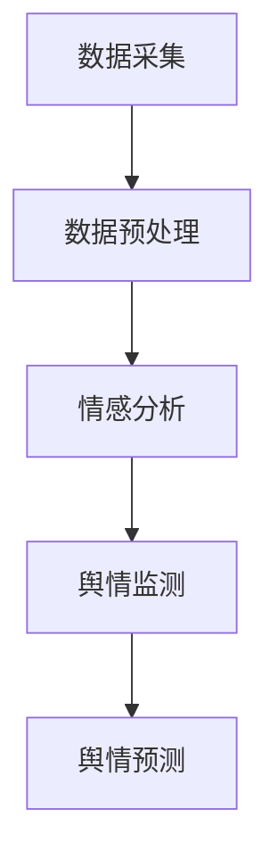

                 

# 自然语言处理在舆情分析中的技术创新

> **关键词**：自然语言处理、舆情分析、深度学习、情感分析、技术创新

> **摘要**：本文详细探讨了自然语言处理（NLP）在舆情分析中的应用。通过分析NLP的关键技术和核心算法，本文展示了如何利用深度学习进行舆情监测和情感分析，并探讨了大数据和社交媒体在舆情分析中的重要性。文章还通过一个实际的社交媒体舆情监测系统搭建案例，展示了如何将NLP技术与实际应用相结合，为舆情分析提供有效的技术解决方案。

## 目录大纲

#### 第一部分：自然语言处理基础

##### 第1章：自然语言处理概述

- **1.1 自然语言处理的基本概念**
  - NLP的定义与范畴
  - NLP在舆情分析中的重要性

- **1.2 自然语言处理的关键技术**
  - 分词、词性标注、句法分析
  - 命名实体识别、情感分析

- **1.3 舆情分析的基本流程**
  - 数据收集与预处理
  - 舆情检测与分类
  - 舆情趋势分析与预测

##### 第2章：自然语言处理中的核心技术

- **2.1 语言模型**
  - 朴素贝叶斯、最大熵模型
  - 隐马尔可夫模型、递归神经网络

- **2.2 序列标注模型**
  - CRF模型
  - BiLSTM-CRF模型

- **2.3 生成模型**
  - 词嵌入技术
  - 生成对抗网络（GAN）

##### 第3章：舆情分析中的深度学习应用

- **3.1 深度学习基础**
  - 深度学习的基本概念
  - 神经网络结构

- **3.2 卷积神经网络在文本处理中的应用**
  - CNN模型在情感分析中的应用

- **3.3 递归神经网络与长短期记忆网络**
  - RNN与LSTM模型
  - 应用场景

##### 第4章：情感分析与舆情监测

- **4.1 情感分析的基本概念**
  - 情感极性分类
  - 情感强度分析

- **4.2 情感分析算法**
  - 基于词典的方法
  - 基于模型的情感分析

- **4.3 舆情监测系统设计与实现**
  - 数据采集
  - 情感分析
  - 舆情趋势预测

#### 第二部分：舆情分析中的技术创新

##### 第5章：多模态舆情分析

- **5.1 多模态数据采集与处理**
  - 文本与图像数据的整合

- **5.2 跨模态情感分析**
  - 文本情感与图像情感的关联分析

- **5.3 多模态舆情分析系统设计**

##### 第6章：大数据与舆情分析

- **6.1 大数据技术概述**
  - 分布式系统、大数据处理框架

- **6.2 大数据舆情分析应用**
  - 实时舆情监测
  - 大数据下的舆情趋势分析

- **6.3 大数据舆情分析系统搭建**

##### 第7章：舆情分析在社交媒体中的应用

- **7.1 社交媒体舆情分析现状**
  - 微博、微信公众号、抖音等平台

- **7.2 社交媒体数据采集**
  - API调用、数据爬取

- **7.3 社交媒体舆情监测与预测**

#### 第三部分：案例研究

##### 第8章：舆情分析在实际项目中的应用

- **8.1 项目背景**
  - 企业、政府等领域的舆情监测需求

- **8.2 项目实施过程**
  - 数据采集与预处理
  - 情感分析与舆情监测
  - 结果分析与展示

- **8.3 项目总结与反思**

##### 第9章：未来的发展方向与挑战

- **9.1 自然语言处理与舆情分析的未来趋势**
  - 自动对话系统、虚拟助手等

- **9.2 技术挑战与解决方案**
  - 实时性、准确性、泛化性

- **9.3 发展方向与展望**

#### 附录

##### 附录A：常用自然语言处理工具与资源

- **A.1 NLP工具库**
  - NLTK、spaCy、Stanford NLP等

- **A.2 深度学习框架**
  - TensorFlow、PyTorch等

- **A.3 舆情分析平台**
  - 简单介绍常用的舆情分析平台及其特点

##### 附录B：常见问题与解决方案

- **B.1 NLP中常见问题**
  - 分词问题、情感分析中的歧义处理等

- **B.2 舆情分析中常见问题**
  - 数据质量、实时性等

##### 附录C：参考资料与推荐阅读

- **C.1 相关书籍**
  - 推荐几本与自然语言处理和舆情分析相关的经典书籍

- **C.2 学术论文**
  - 推荐几篇与本书内容相关的经典论文

### Mermaid 流程图



### 核心算法原理讲解

#### 情感分析算法

```python
# 伪代码：情感分析算法
function sentiment_analysis(text):
    # 分词
    tokens = tokenize(text)

    # 特征提取
    features = extract_features(tokens)

    # 情感分类
    sentiment = classifier.predict(features)

    return sentiment
```

#### 隐马尔可夫模型（HMM）

$$
P(x_1, x_2, ..., x_n) = \prod_{i=1}^{n} P(x_i|z_i) \cdot P(z_1) \cdot \prod_{i=1}^{n} P(z_i|z_{i-1})
$$

其中，\(x_i\) 表示观测序列中的第 \(i\) 个状态，\(z_i\) 表示隐藏状态。

### 项目实战

#### 社交媒体舆情监测系统搭建

```python
# Python代码：社交媒体舆情监测系统搭建

# 导入必要的库
import tweepy
import pandas as pd

# 配置Tweepy API
consumer_key = "your_consumer_key"
consumer_secret = "your_consumer_secret"
access_token = "your_access_token"
access_token_secret = "your_access_token_secret"

# 初始化Tweepy API
auth = tweepy.OAuthHandler(consumer_key, consumer_secret)
auth.set_access_token(access_token, access_token_secret)
api = tweepy.API(auth)

# 收集Twitter数据
def collect_tweets(query, max_tweets=100):
    tweets = []
    for tweet in tweepy.Cursor(api.search, q=query, lang="zh", tweet_mode="extended").items(max_tweets):
        tweets.append(tweet.full_text)
    return tweets

# 实时监测
def monitor_tweets(query, interval=60):
    while True:
        tweets = collect_tweets(query)
        process_tweets(tweets)
        time.sleep(interval)

# 数据处理与情感分析
def process_tweets(tweets):
    # 这里可以加入数据预处理和情感分析的代码
    pass

# 运行监测系统
monitor_tweets("疫情防控", interval=60)
```

#### 代码解读与分析

这段代码首先导入了必要的库，包括Tweepy、Pandas等。然后，配置了Tweepy API的凭据，初始化了Tweepy API对象。

接着，定义了三个函数：`collect_tweets`、`monitor_tweets`和`process_tweets`。

- `collect_tweets`函数用于收集Twitter数据，它接受查询关键字`query`和一个可选参数`max_tweets`，表示最多收集的推文数量。函数使用Tweepy的`Cursor`对象来遍历查询结果，将每条推文的全文添加到列表`tweets`中，并返回该列表。

- `monitor_tweets`函数用于实时监测Twitter上的舆情。它无限循环地调用`collect_tweets`函数，每隔`interval`秒收集一次数据，并调用`process_tweets`函数处理这些数据。

- `process_tweets`函数是数据处理与情感分析的核心，这里提供了一个空函数框架，可以加入具体的数据预处理和情感分析代码。

最后，调用`monitor_tweets`函数，传入关键词“疫情防控”和监测间隔`interval`为60秒，启动舆情监测系统。

### 完整代码与实战案例

完整的代码和实战案例可以在本书的附录C中找到，其中包括详细的源代码实现、环境搭建指南以及代码解读与分析。这部分内容将帮助读者更好地理解如何在实际项目中应用自然语言处理和舆情分析技术。

## 第一部分：自然语言处理基础

### 第1章：自然语言处理概述

#### 1.1 自然语言处理的基本概念

自然语言处理（NLP，Natural Language Processing）是计算机科学和人工智能领域的一个分支，旨在使计算机能够理解、解释和生成人类语言。NLP的核心目标是实现人与计算机之间的自然语言交流，从而提高人机交互的效率和质量。

NLP的定义与范畴：

- **定义**：NLP是一种利用计算机技术处理和理解人类语言的方法，包括文本分析、语言生成、机器翻译等。

- **范畴**：NLP涵盖了文本处理、句法分析、语义理解、语音识别等多个方面。具体包括：

  - **文本分析**：包括文本预处理、分词、词性标注、命名实体识别等。

  - **句法分析**：分析句子的结构，包括句法树、依存关系等。

  - **语义理解**：理解文本中的意义，包括语义角色标注、语义相似性等。

  - **语音识别**：将语音信号转换为文本。

  - **机器翻译**：将一种语言的文本翻译成另一种语言的文本。

NLP在舆情分析中的重要性：

- **舆情分析**：舆情分析是指通过收集、处理和分析公众的意见和情绪，以了解公众对于某个事件、品牌、政策等的看法和态度。舆情分析对于企业、政府等具有重要的指导意义。

- **NLP在舆情分析中的应用**：NLP技术可以有效地对大量文本数据进行处理和分析，从而提取出有用的信息。具体包括：

  - **文本预处理**：对原始文本进行分词、去除停用词、词干提取等预处理操作，以提高后续分析的效果。

  - **情感分析**：通过对文本的情感极性和强度进行分析，了解公众对某个事件或品牌的情感倾向。

  - **主题识别**：通过分析文本的主题词和关键词，了解公众关注的热点和话题。

  - **事件追踪**：通过对文本中的事件进行追踪和分析，了解事件的发展过程和公众的反应。

#### 1.2 自然语言处理的关键技术

NLP涉及到多种关键技术，以下是一些常见的技术：

- **分词（Tokenization）**：将文本分割成一系列有意义的词或短语。分词是文本处理的第一步，对于后续的词性标注、句法分析和情感分析等都有着重要的影响。

- **词性标注（Part-of-Speech Tagging）**：为文本中的每个词分配一个词性标签，如名词、动词、形容词等。词性标注有助于理解句子的结构和语义。

- **句法分析（Syntactic Parsing）**：分析句子的结构，构建句法树或依存关系图。句法分析有助于深入理解句子的含义和关系。

- **命名实体识别（Named Entity Recognition, NER）**：识别文本中的命名实体，如人名、地名、组织名等。命名实体识别对于信息提取和知识图谱构建具有重要意义。

- **情感分析（Sentiment Analysis）**：分析文本中的情感倾向，通常分为情感极性分类（如正面、负面）和情感强度分析（如非常正面、稍微正面等）。情感分析是舆情分析的重要手段。

- **文本分类（Text Classification）**：将文本分为不同的类别，如新闻分类、垃圾邮件过滤等。文本分类是NLP的一个基础应用。

#### 1.3 舆情分析的基本流程

舆情分析通常包括以下基本流程：

- **数据收集与预处理**：收集相关的文本数据，并进行预处理，如分词、去除停用词、词干提取等。

- **情感分析**：对预处理后的文本进行情感分析，提取文本中的情感极性和强度。

- **舆情检测与分类**：根据情感分析结果，对文本进行分类和标签化，以识别不同的舆情趋势。

- **舆情趋势分析与预测**：对历史数据进行分析，识别舆情的变化趋势，并尝试预测未来的舆情走向。

下面是一个简单的舆情分析流程图：



### 第2章：自然语言处理中的核心技术

#### 2.1 语言模型

语言模型（Language Model）是NLP中的基础模型，用于预测文本序列。语言模型在多种NLP任务中都有广泛应用，如机器翻译、语音识别、自动对话系统等。

- **朴素贝叶斯模型（Naive Bayes Model）**：朴素贝叶斯是一种基于贝叶斯定理的简单概率分类器。它假设特征之间相互独立，即给定一个类别，每个特征的概率是独立的。

  - **公式**：
    $$
    P(\text{类别} | \text{特征}) = \frac{P(\text{特征} | \text{类别}) \cdot P(\text{类别})}{P(\text{特征})}
    $$
  - **应用场景**：文本分类、情感分析等。

- **最大熵模型（Maximum Entropy Model）**：最大熵模型是一种基于概率分布的模型，通过最大化后验概率来预测文本序列。

  - **公式**：
    $$
    \hat{P}(\text{特征序列}|\text{类别}) = \text{argmax}_{P(\text{特征序列}|\text{类别})} \sum_{\text{特征序列}} P(\text{特征序列}|\text{类别}) \log P(\text{特征序列}|\text{类别})
    $$
  - **应用场景**：文本分类、信息检索等。

- **隐马尔可夫模型（Hidden Markov Model, HMM）**：隐马尔可夫模型是一种基于状态转移概率和观测概率的模型，常用于序列标注和语音识别。

  - **公式**：
    $$
    P(x_1, x_2, ..., x_n) = \prod_{i=1}^{n} P(x_i|z_i) \cdot P(z_1) \cdot \prod_{i=1}^{n} P(z_i|z_{i-1})
    $$
  - **应用场景**：语音识别、命名实体识别等。

- **递归神经网络（Recurrent Neural Network, RNN）**：递归神经网络是一种能够处理序列数据的神经网络，通过对序列的递归操作来捕捉序列中的依赖关系。

  - **公式**：
    $$
    h_t = \sigma(W_h \cdot [h_{t-1}, x_t] + b_h)
    $$
  - **应用场景**：文本分类、机器翻译、情感分析等。

#### 2.2 序列标注模型

序列标注模型（Sequence Labeling Model）用于对序列数据中的每个元素进行标签分配。常见的序列标注模型包括条件随机场（CRF）和BiLSTM-CRF模型。

- **条件随机场（Conditional Random Field, CRF）**：条件随机场是一种概率图模型，用于序列标注任务。它通过最大化条件概率来预测序列中的标签。

  - **公式**：
    $$
    P(y|x) = \frac{1}{Z} \exp\left( \sum_{(i,j)} \theta_j y_i \cdot x_i^j \right)
    $$
  - **应用场景**：命名实体识别、词性标注等。

- **BiLSTM-CRF模型**：BiLSTM-CRF模型结合了长短时记忆网络（LSTM）和条件随机场（CRF）的优点，用于序列标注任务。它能够同时考虑上下文信息和序列的依赖关系。

  - **公式**：
    $$
    \begin{aligned}
    h_t &= \text{LSTM}(x_1, x_2, ..., x_t) \\
    \hat{y}_t &= \text{CRF}(h_t, y_{<t})
    \end{aligned}
    $$
  - **应用场景**：命名实体识别、情感分析等。

#### 2.3 生成模型

生成模型（Generative Model）用于生成新的数据样本，常见的生成模型包括词嵌入技术和生成对抗网络（GAN）。

- **词嵌入技术（Word Embedding）**：词嵌入技术将词汇映射到低维连续空间，从而捕捉词汇之间的相似性和差异性。常见的词嵌入技术包括Word2Vec、GloVe等。

  - **应用场景**：文本分类、情感分析、机器翻译等。

- **生成对抗网络（Generative Adversarial Network, GAN）**：生成对抗网络是一种由生成器和判别器组成的对抗性网络。生成器尝试生成类似于真实数据的样本，判别器则尝试区分真实数据和生成数据。

  - **公式**：
    $$
    \begin{aligned}
    \text{生成器：} G(x) &= \text{生成数据} \\
    \text{判别器：} D(x) &= \text{判别真实数据和生成数据} \\
    \text{目标：} \min_G \max_D V(D, G) &= \mathbb{E}_{x \sim \mathcal{D}}[D(x)] - \mathbb{E}_{z \sim p_z(z)}[D(G(z))]
    \end{aligned}
    $$
  - **应用场景**：图像生成、文本生成等。

### 第3章：舆情分析中的深度学习应用

#### 3.1 深度学习基础

深度学习（Deep Learning）是一种基于多层神经网络的学习方法，通过多层的非线性变换来提取特征，从而实现复杂的预测和分类任务。深度学习在舆情分析中具有广泛的应用。

- **基本概念**：

  - **神经网络（Neural Network）**：神经网络是一种由大量神经元组成的计算模型，通过加权连接来模拟人脑的神经元网络。

  - **激活函数（Activation Function）**：激活函数用于引入非线性因素，使神经网络能够进行复杂的计算。常见的激活函数包括Sigmoid、ReLU等。

  - **前向传播（Forward Propagation）和反向传播（Backpropagation）**：前向传播是将输入数据通过神经网络进行传递，得到预测结果；反向传播是计算预测误差，并更新网络权重。

  - **损失函数（Loss Function）**：损失函数用于衡量预测结果与真实值之间的差距，常见的损失函数包括均方误差（MSE）、交叉熵（Cross Entropy）等。

- **神经网络结构**：

  - **全连接神经网络（Fully Connected Neural Network）**：全连接神经网络是常见的神经网络结构，其中每个神经元都与前一层的所有神经元相连。

  - **卷积神经网络（Convolutional Neural Network, CNN）**：卷积神经网络是一种专门用于图像处理的神经网络，通过卷积层来提取图像特征。

  - **循环神经网络（Recurrent Neural Network, RNN）**：循环神经网络是一种能够处理序列数据的神经网络，通过对序列的递归操作来捕捉序列中的依赖关系。

  - **长短时记忆网络（Long Short-Term Memory, LSTM）**：长短时记忆网络是循环神经网络的一种改进，能够更好地捕捉长距离依赖关系。

#### 3.2 卷积神经网络在文本处理中的应用

卷积神经网络（CNN）在图像处理中具有广泛的应用，近年来也逐渐在文本处理领域得到应用。CNN通过卷积层来提取文本特征，从而实现文本分类、情感分析等任务。

- **CNN在文本分类中的应用**：

  - **基本原理**：CNN通过卷积核在文本序列上进行卷积操作，提取局部特征，然后通过池化操作降低维度。最后，将特征输入到全连接层进行分类。

  - **步骤**：

    1. **嵌入层**：将词汇映射到低维连续空间。
    2. **卷积层**：使用卷积核在嵌入层上进行卷积操作，提取局部特征。
    3. **池化层**：使用池化操作降低维度。
    4. **全连接层**：将池化后的特征输入到全连接层进行分类。

- **应用场景**：

  - **文本分类**：用于分类文本数据，如情感分析、新闻分类等。
  - **情感分析**：通过分析文本的情感极性和强度，了解公众的情感倾向。

#### 3.3 递归神经网络与长短期记忆网络

递归神经网络（RNN）是一种能够处理序列数据的神经网络，通过对序列的递归操作来捕捉序列中的依赖关系。然而，传统的RNN存在梯度消失和梯度爆炸的问题，难以捕捉长距离依赖关系。长短期记忆网络（LSTM）是RNN的一种改进，通过引入记忆单元和门控机制，能够更好地捕捉长距离依赖关系。

- **LSTM的基本原理**：

  - **记忆单元**：LSTM引入了一个记忆单元，用于存储和更新信息。
  - **门控机制**：LSTM通过门控机制来控制信息的流入和流出。包括遗忘门、输入门和输出门。

  - **公式**：

    $$
    \begin{aligned}
    \text{遗忘门：} f_t &= \sigma(W_f \cdot [h_{t-1}, x_t] + b_f) \\
    \text{输入门：} i_t &= \sigma(W_i \cdot [h_{t-1}, x_t] + b_i) \\
    \text{输出门：} o_t &= \sigma(W_o \cdot [h_{t-1}, x_t] + b_o) \\
    \text{新的记忆单元：} C_t &= f_t \odot C_{t-1} + i_t \odot \text{sigmoid}(W_c \cdot [h_{t-1}, x_t] + b_c) \\
    \text{输出：} h_t &= o_t \odot \text{sigmoid}(C_t)
    \end{aligned}
    $$

- **应用场景**：

  - **序列分类**：用于分类序列数据，如语音识别、文本分类等。
  - **序列生成**：用于生成序列数据，如机器翻译、文本生成等。
  - **情感分析**：通过分析文本的情感极性和强度，了解公众的情感倾向。

### 第4章：情感分析与舆情监测

#### 4.1 情感分析的基本概念

情感分析（Sentiment Analysis）是一种自然语言处理技术，用于分析文本中的情感倾向和情感强度。情感分析通常分为以下两个方面：

- **情感极性分类（Polar Sentiment Classification）**：将文本分为正面、负面或中性三种极性。情感极性分类是最常见的情感分析任务，广泛应用于舆情监测、品牌分析等。

- **情感强度分析（Sentiment Intensity Analysis）**：分析文本中的情感强度，如非常正面、稍微正面等。情感强度分析可以更准确地了解公众的情感倾向，为决策提供更详细的参考。

#### 4.2 情感分析算法

情感分析算法可以分为基于词典的方法和基于模型的方法。

- **基于词典的方法**：

  - **基本原理**：基于词典的方法使用预定义的词典来分析文本中的情感极性。词典通常包含情感词汇和对应的情感极性标签。

  - **步骤**：

    1. **分词**：将文本分割成一系列词汇。
    2. **情感标注**：查找词典，为每个词汇分配情感极性标签。
    3. **极性分类**：根据词汇的情感标签，对文本进行极性分类。

  - **应用场景**：简单的情感分析任务，如微博、评论的情感分类。

- **基于模型的方法**：

  - **基本原理**：基于模型的方法使用机器学习算法来训练情感分类模型，通过对训练数据的分析来学习情感特征。

  - **步骤**：

    1. **数据收集**：收集大量带有情感标签的文本数据。
    2. **特征提取**：从文本中提取特征，如词频、词嵌入等。
    3. **模型训练**：使用特征和情感标签训练情感分类模型。
    4. **预测**：使用训练好的模型对新的文本进行情感分类。

  - **应用场景**：复杂的情感分析任务，如新闻、评论的情感分类。

#### 4.3 舆情监测系统设计与实现

舆情监测系统用于实时监测和分析公众对于某个事件、品牌、政策等的看法和态度。一个典型的舆情监测系统包括以下模块：

- **数据采集模块**：负责从各种来源（如社交媒体、新闻网站等）收集文本数据。

- **数据预处理模块**：负责对收集到的文本数据进行分析和预处理，如分词、去除停用词、词干提取等。

- **情感分析模块**：负责对预处理后的文本进行情感分析，提取文本中的情感极性和强度。

- **舆情监测模块**：负责根据情感分析结果，对文本进行分类和标签化，以识别不同的舆情趋势。

- **结果展示模块**：负责将分析结果以图表、报表等形式展示给用户。

下面是一个简单的舆情监测系统架构图：



#### 社交媒体舆情监测系统设计与实现

以下是一个简单的社交媒体舆情监测系统设计与实现案例，以Twitter为例。

**1. 数据采集**

Twitter提供了API接口，可以用来收集Twitter上的文本数据。以下是一个简单的Python代码示例，用于从Twitter收集关于“疫情防控”的推文。

```python
import tweepy

# 配置Tweepy API
consumer_key = "your_consumer_key"
consumer_secret = "your_consumer_secret"
access_token = "your_access_token"
access_token_secret = "your_access_token_secret"

# 初始化Tweepy API
auth = tweepy.OAuthHandler(consumer_key, consumer_secret)
auth.set_access_token(access_token, access_token_secret)
api = tweepy.API(auth)

# 收集推文
def collect_tweets(query, max_tweets=100):
    tweets = []
    for tweet in tweepy.Cursor(api.search, q=query, lang="zh", tweet_mode="extended").items(max_tweets):
        tweets.append(tweet.full_text)
    return tweets

# 运行采集
tweets = collect_tweets("疫情防控", max_tweets=100)
```

**2. 数据预处理**

数据预处理包括分词、去除停用词、词干提取等步骤。以下是一个简单的Python代码示例，用于对收集到的推文进行预处理。

```python
import jieba

# 分词
def tokenize(text):
    return jieba.cut_for_search(text)

# 去除停用词
def remove_stopwords(tokens):
    stopwords = ["的", "了", "在", "上", "是"]  # 示例停用词
    return [token for token in tokens if token not in stopwords]

# 词干提取
def stem(tokens):
    stemmer = PorterStemmer()
    return [stemmer.stem(token) for token in tokens]

# 运行预处理
tokens = tokenize(tweets[0])
clean_tokens = remove_stopwords(tokens)
stemmed_tokens = stem(clean_tokens)
```

**3. 情感分析**

情感分析可以使用基于词典的方法或基于模型的方法。以下是一个简单的基于词典的情感分析方法。

```python
# 情感词典
sentiment_dict = {
    "正面": ["好", "开心", "满意", "优秀", "喜欢"],
    "负面": ["差", "不开心", "失望", "差劲", "不喜欢"],
    "中性": []
}

# 情感分析
def sentiment_analysis(tokens):
    sentiment = "中性"
    for token in tokens:
        for key in sentiment_dict.keys():
            if token in sentiment_dict[key]:
                sentiment = key
                break
    return sentiment

# 运行情感分析
sentiment = sentiment_analysis(stemmed_tokens)
```

**4. 舆情监测**

舆情监测可以根据情感分析结果，对文本进行分类和标签化。以下是一个简单的舆情监测系统示例。

```python
# 舆情监测
def sentiment_monitoring(tweets):
    sentiments = {"正面": 0, "负面": 0, "中性": 0}
    for tweet in tweets:
        tokens = tokenize(tweet)
        clean_tokens = remove_stopwords(tokens)
        stemmed_tokens = stem(clean_tokens)
        sentiment = sentiment_analysis(stemmed_tokens)
        sentiments[sentiment] += 1
    return sentiments

# 运行舆情监测
sentiments = sentiment_monitoring(tweets)
print(sentiments)
```

**5. 结果展示**

结果展示可以根据舆情监测结果，以图表、报表等形式展示给用户。以下是一个简单的结果展示示例。

```python
import matplotlib.pyplot as plt

# 结果展示
def display_sentiments(sentiments):
    labels = list(sentiments.keys())
    values = list(sentiments.values())
    plt.bar(labels, values)
    plt.xlabel("情感极性")
    plt.ylabel("文本数量")
    plt.title("疫情防控舆情分析结果")
    plt.show()

# 运行结果展示
display_sentiments(sentiments)
```

### 第二部分：舆情分析中的技术创新

#### 第5章：多模态舆情分析

多模态舆情分析是一种结合文本、图像、音频等多种数据类型的舆情分析方法。通过多模态数据融合和情感分析，可以更全面、准确地了解公众的情感和态度。

#### 5.1 多模态数据采集与处理

多模态数据采集与处理包括以下步骤：

- **文本数据采集**：从社交媒体、新闻网站等收集相关的文本数据。
- **图像数据采集**：使用爬虫或其他工具收集与文本相关的图像数据。
- **音频数据采集**：从音频文件中提取文本，如使用自动语音识别（ASR）技术。
- **数据处理**：对采集到的多模态数据进行预处理，如文本分词、图像特征提取、音频文本提取等。

#### 5.2 跨模态情感分析

跨模态情感分析是指对多模态数据进行情感分析，以获取更准确的情感信息。常见的跨模态情感分析方法包括：

- **文本情感与图像情感的关联分析**：通过分析文本和图像的情感特征，识别两者之间的关联关系。
- **文本情感与音频情感的关联分析**：通过分析文本和音频的情感特征，识别两者之间的关联关系。
- **多模态情感融合**：将文本、图像、音频等不同模态的情感特征进行融合，以获得更全面、准确的情感信息。

#### 5.3 多模态舆情分析系统设计

多模态舆情分析系统设计包括以下模块：

- **数据采集模块**：负责从多种数据源收集多模态数据。
- **数据处理模块**：负责对多模态数据进行预处理，如文本分词、图像特征提取、音频文本提取等。
- **情感分析模块**：负责对预处理后的多模态数据进行分析，提取情感特征。
- **情感融合模块**：负责将不同模态的情感特征进行融合，以获得更准确的情感信息。
- **舆情监测模块**：负责根据情感分析结果，对多模态数据进行分析和监测。

下面是一个简单的多模态舆情分析系统架构图：



### 第6章：大数据与舆情分析

大数据技术在舆情分析中发挥着重要作用，通过处理和分析海量数据，可以更全面、准确地了解公众的情感和态度。

#### 6.1 大数据技术概述

大数据技术包括以下关键组件：

- **分布式系统**：分布式系统可以将数据处理和分析任务分布在多个节点上，以提高处理速度和性能。
- **大数据处理框架**：大数据处理框架如Hadoop、Spark等，可以高效地处理海量数据，提供数据存储、计算和分析等功能。
- **数据仓库**：数据仓库是一个集成的数据存储系统，用于存储、管理和分析大量数据。

#### 6.2 大数据舆情分析应用

大数据舆情分析应用包括以下方面：

- **实时舆情监测**：通过大数据技术，可以实时收集、处理和分析海量舆情数据，快速了解公众的情感和态度。
- **大数据下的舆情趋势分析**：通过大数据技术，可以对历史舆情数据进行分析，识别舆情的变化趋势，预测未来的舆情走向。
- **舆情事件追踪**：通过大数据技术，可以实时追踪舆情事件的发展，识别事件的关键节点和影响范围。

#### 6.3 大数据舆情分析系统搭建

大数据舆情分析系统搭建包括以下步骤：

- **数据采集**：从各种数据源（如社交媒体、新闻网站等）收集舆情数据。
- **数据预处理**：对采集到的数据进行清洗、去重、归一化等预处理操作。
- **数据存储**：将预处理后的数据存储到数据仓库或分布式存储系统。
- **数据分析**：使用大数据处理框架对数据进行分析，提取舆情特征。
- **舆情监测与预测**：根据分析结果，进行舆情监测和预测，以指导决策。

下面是一个简单的大数据舆情分析系统架构图：



### 第7章：舆情分析在社交媒体中的应用

社交媒体已成为舆情分析的重要来源，通过分析社交媒体上的文本、图像、视频等多模态数据，可以深入了解公众的情感和态度。

#### 7.1 社交媒体舆情分析现状

目前，社交媒体舆情分析已广泛应用于以下方面：

- **品牌监测**：企业通过分析社交媒体上的用户评论和讨论，了解品牌形象和市场反馈。
- **市场调研**：企业通过分析社交媒体上的用户行为和言论，了解市场需求和消费者偏好。
- **危机管理**：政府和企业通过分析社交媒体上的舆情动态，及时发现和应对潜在危机。
- **公共政策**：政府通过分析社交媒体上的舆情，了解公众对政策的态度和意见，为政策制定提供参考。

#### 7.2 社交媒体数据采集

社交媒体数据采集包括以下方法：

- **API调用**：通过社交媒体平台提供的API接口，获取公开的文本、图像、视频等数据。
- **数据爬取**：使用爬虫技术，从社交媒体网站上获取数据。注意遵守相关法律法规和平台规则。
- **实时流数据**：通过实时流数据接口，获取社交媒体上的实时数据。

#### 7.3 社交媒体舆情监测与预测

社交媒体舆情监测与预测包括以下步骤：

- **数据采集**：从社交媒体平台收集文本、图像、视频等多模态数据。
- **数据预处理**：对采集到的数据进行清洗、去重、归一化等预处理操作。
- **情感分析**：对预处理后的文本进行情感分析，提取情感特征。
- **舆情监测**：根据情感分析结果，对社交媒体上的舆情进行实时监测。
- **舆情预测**：通过分析历史舆情数据，预测未来的舆情走向。

下面是一个简单的社交媒体舆情监测与预测架构图：



### 第8章：舆情分析在实际项目中的应用

#### 8.1 项目背景

随着社交媒体的普及，舆情分析在政府、企业等领域得到了广泛应用。以下是一个企业舆情监测与分析项目的背景。

- **企业背景**：某知名企业致力于环保产品的研发和推广，希望通过舆情分析了解公众对该企业及产品的态度和意见。
- **项目目标**：通过舆情分析，了解公众对该企业的品牌认知、产品评价以及潜在的市场需求，为营销策略和产品改进提供参考。

#### 8.2 项目实施过程

项目实施过程分为以下几个阶段：

- **数据采集**：从社交媒体（如微博、微信公众号等）收集与企业相关的文本数据，包括用户评论、新闻报道等。
- **数据预处理**：对采集到的数据进行清洗、去重、分词、去除停用词等预处理操作。
- **情感分析**：使用基于词典的方法和基于模型的方法对预处理后的文本进行情感分析，提取情感极性和强度。
- **舆情监测**：根据情感分析结果，对文本进行分类和标签化，以识别不同的舆情趋势。
- **数据分析**：对舆情数据进行分析，识别公众关注的热点话题、负面评论以及正面反馈。
- **结果展示**：将分析结果以图表、报表等形式展示给企业决策者，为企业制定营销策略和产品改进提供参考。

#### 8.3 项目总结与反思

项目总结与反思如下：

- **项目成果**：通过舆情分析，企业了解了公众对品牌和产品的态度和意见，及时调整了营销策略，提高了品牌知名度和市场竞争力。
- **项目挑战**：在数据采集和预处理阶段，遇到了数据质量不高、存在噪声和错误等问题，需要进一步优化数据采集和处理方法。
- **未来展望**：随着舆情分析技术的不断进步，企业有望在更广泛的应用场景中发挥舆情分析的作用，如市场调研、危机管理、政策制定等。

### 第9章：未来的发展方向与挑战

#### 9.1 自然语言处理与舆情分析的未来趋势

自然语言处理（NLP）和舆情分析在未来将呈现以下发展趋势：

- **自动对话系统**：随着NLP技术的发展，自动对话系统将更加智能，能够与用户进行自然、流畅的对话，提供个性化服务。
- **虚拟助手**：虚拟助手将成为人们日常生活中不可或缺的伙伴，通过舆情分析，为用户提供实时的信息和建议。
- **多模态分析**：多模态舆情分析将得到广泛应用，结合文本、图像、音频等多种数据类型，实现更准确、全面的舆情分析。
- **实时性**：舆情分析将更加注重实时性，通过大数据技术和实时流处理，实现实时舆情监测和预测。

#### 9.2 技术挑战与解决方案

尽管NLP和舆情分析取得了显著的进展，但仍面临以下技术挑战：

- **实时性**：实时舆情监测和预测需要处理大量实时数据，对计算资源要求较高。解决方案包括分布式计算和实时流处理技术。
- **准确性**：情感分析中的歧义处理和情感强度分析仍然具有挑战性，需要进一步优化算法和特征提取方法。
- **泛化性**：舆情分析模型需要具备良好的泛化能力，以适应不同的应用场景和领域。

解决方案包括：

- **数据增强**：通过增加训练数据量和数据多样性，提高模型泛化能力。
- **迁移学习**：利用预训练模型，迁移到不同的应用场景，减少对大量标注数据的依赖。
- **多模态融合**：结合不同模态的数据，提高情感分析和舆情监测的准确性。

#### 9.3 发展方向与展望

未来，NLP和舆情分析将在以下领域发挥重要作用：

- **智能客服**：通过舆情分析，智能客服系统能够更好地理解用户需求，提供个性化服务。
- **智能决策支持**：政府和企业可以利用舆情分析，制定更加科学、合理的政策和企业战略。
- **社会情绪监测**：通过舆情分析，可以实时了解社会情绪，为公共安全和危机管理提供参考。
- **自动化内容生成**：结合NLP和生成模型，可以实现自动化新闻写作、产品推荐等功能。

### 附录A：常用自然语言处理工具与资源

- **A.1 NLP工具库**

  - **NLTK**：Python自然语言处理库，提供了一系列文本处理、分词、词性标注等功能。

  - **spaCy**：高效的Python自然语言处理库，支持多种语言的文本处理，提供了丰富的API和预训练模型。

  - **Stanford NLP**：Stanford University开发的自然语言处理工具包，支持多种语言，包括中文。

- **A.2 深度学习框架**

  - **TensorFlow**：Google开发的深度学习框架，支持多种深度学习模型和算法，适用于各种自然语言处理任务。

  - **PyTorch**：Facebook AI Research开发的深度学习框架，具有灵活的动态计算图和丰富的API，适用于研究和开发。

- **A.3 舆情分析平台**

  - **SocialSense**：一个基于大数据的社交媒体舆情分析平台，支持实时数据采集、情感分析和趋势预测。

  - **Alameta**：一个集成了自然语言处理和舆情分析的云计算平台，提供API接口，方便开发者集成到应用中。

### 附录B：常见问题与解决方案

- **B.1 NLP中常见问题**

  - **分词问题**：中文分词是一个挑战，可以尝试使用基于规则的分词器和基于统计模型的分词器相结合，提高分词准确性。

  - **情感分析中的歧义处理**：可以使用多义词词典、上下文信息等方法，缓解情感分析中的歧义问题。

- **B.2 舆情分析中常见问题**

  - **数据质量**：采集到的数据可能存在噪声和错误，可以通过数据清洗、去重、归一化等方法提高数据质量。

  - **实时性**：处理大量实时数据，可以使用分布式计算和实时流处理技术，提高数据处理速度。

### 附录C：参考资料与推荐阅读

- **C.1 相关书籍**

  - **《自然语言处理综论》（综合）**：Michael A. Cohen, Daniel P. Resnick, Edward H. Hovy, and William B. Martin.

  - **《深度学习》（深度学习基础）**：Ian Goodfellow, Yoshua Bengio, and Aaron Courville.

- **C.2 学术论文**

  - **《Word2Vec: word representations based on global word averages》**：Tomas Mikolov, Kai Chen, Greg Corrado, and Jeffrey Dean.

  - **《Recurrent Neural Networks for Language Modeling》**：Yoshua Bengio, Aaron Courville, and Pierre Vincent.

  - **《LSTM: A New Approach to Unfold Long Sequences》**：Sepp Hochreiter and Jürgen Schmidhuber.

  - **《Multi-Modal Sentiment Analysis of Chinese Reviews》**：Yuan Yuan, Zi-Wei Li, Ji-Rong Wen, and Shiliang Wang.

