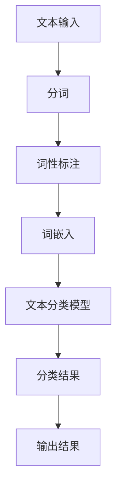
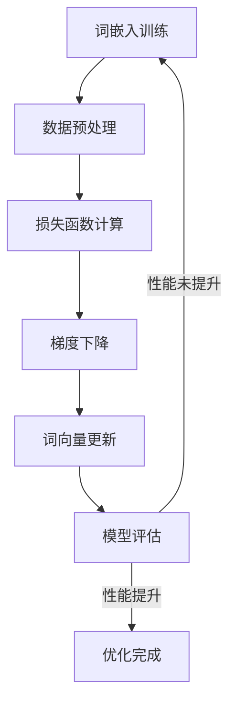

                 

# 自然语言处理的词嵌入：语义空间的数学表示

> **关键词**：自然语言处理（NLP），词嵌入，语义空间，数学表示，语义相似性，文本分类，信息检索，问答系统。

> **摘要**：本文深入探讨了自然语言处理（NLP）领域中的词嵌入技术，介绍了词嵌入的基本原理、模型及优化方法。同时，本文详细解析了语义空间的概念及其在NLP中的应用，包括语义相似性度量、概念扩展与映射。此外，文章还阐述了词嵌入技术在文本分类、信息检索和问答系统中的应用实例，并讨论了当前词嵌入技术的挑战和未来发展趋势。通过本文，读者可以全面了解词嵌入技术在语义表示和语义理解中的重要作用，以及如何利用这些技术提升NLP应用的性能和效果。

## 目录大纲

### 第一部分：自然语言处理基础

### 第二部分：词嵌入技术

### 第三部分：语义空间与语义相似性

### 第四部分：词嵌入技术在文本分类中的应用

### 第五部分：词嵌入技术在信息检索中的应用

### 第六部分：词嵌入技术在问答系统中的应用

### 第七部分：词嵌入技术的挑战与未来发展趋势

### 附录

### 第1章 自然语言处理概述

### 第2章 词嵌入技术

### 第3章 语义空间与语义相似性

### 第4章 词嵌入技术在文本分类中的应用

### 第5章 词嵌入技术在信息检索中的应用

### 第6章 词嵌入技术在问答系统中的应用

### 第7章 词嵌入技术的挑战与未来发展趋势

### 附录A：开发环境与工具

### 附录B：Mermaid流程图

----------------------------------------------------------------

## 第1章 自然语言处理概述

### 1.1 自然语言处理的基本概念

自然语言处理（NLP）是计算机科学、人工智能和语言学交叉领域，致力于使计算机理解和处理人类语言。其核心目标包括：

- **文本分析**：提取文本中的有用信息，如关键词、主题、情感等。
- **语言生成**：生成符合语法规则、语义合理的自然语言文本。
- **机器翻译**：将一种语言的文本翻译成另一种语言。
- **语音识别**：将语音信号转换为文本。

NLP在多个领域具有广泛应用，如社交媒体分析、智能客服、搜索引擎、医疗文本分析、法律文档审核等。

### 1.2 NLP的发展历史

NLP的发展可以大致分为以下几个阶段：

#### 早期发展（1950-1980年代）

- **规则驱动方法**：基于手工编写的规则进行文本处理，如词法分析、句法分析等。
- **成功与挑战**：早期成功案例包括自动化文摘、命名实体识别等，但面对复杂语言现象时，规则驱动方法存在局限性。

#### 统计方法兴起（1980-2000年代）

- **隐马尔可夫模型（HMM）**：用于语音识别和词性标注。
- **决策树、支持向量机（SVM）**：用于文本分类和实体识别。
- **成功与挑战**：统计方法在处理大规模文本数据时表现更好，但仍需大量标注数据。

#### 深度学习时代（2010年代至今）

- **神经网络在NLP中的应用**：如循环神经网络（RNN）、卷积神经网络（CNN）和Transformer。
- **预训练语言模型**：如GPT、BERT、T5等，通过在大规模语料库上进行预训练，提高模型在各种NLP任务中的性能。
- **成功与挑战**：深度学习方法显著提升了NLP任务的表现，但仍面临计算资源消耗大、数据隐私等问题。

### 1.3 NLP的关键技术

NLP的关键技术包括但不限于以下几类：

- **分词与词性标注**：将文本分割成词和标注词性，是NLP的基础任务。
- **句法分析**：分析句子的语法结构，理解句子中的成分关系。
- **语义分析**：理解句子的语义意义，如实体识别、关系抽取等。
- **情感分析**：分析文本的情感倾向，如正面、负面等。
- **机器翻译**：将一种语言的文本翻译成另一种语言，如英译中、中译英等。

在接下来的章节中，我们将进一步探讨NLP中的词嵌入技术、语义空间及其应用。

----------------------------------------------------------------

## 第2章 词嵌入技术

### 2.1 词嵌入的基本原理

词嵌入（word embedding）是将词汇映射到高维向量空间的过程，从而实现文本数据向量的表示。这种向量表示有助于提高计算效率和模型性能，是NLP中不可或缺的技术。

#### 词嵌入的重要性

1. **文本数据的向量表示**：词嵌入将高维稀疏的文本数据转换为密集的向量表示，使得计算机能够更好地处理和分析文本。
2. **提高模型性能**：向量表示能够捕捉词汇间的语义关系，有助于提升NLP模型的性能，如文本分类、情感分析等。
3. **计算效率**：词嵌入使得NLP任务中的向量运算代替原始的文本操作，大大提高了计算效率。

#### 词嵌入的数学模型

词嵌入通常使用向量空间模型（Vector Space Model, VSM）进行表示，即将词汇映射为一个向量。在VSM中，每个词汇都是一个向量，向量中的每个维度表示词汇的某个属性或特征。

设$V$为词汇表，$d$为词向量的维度，$e_v$为词汇$v$的词向量。词向量通常采用以下形式：

$$
e_v = (e_{v1}, e_{v2}, ..., e_{vd})
$$

其中，$e_{vi}$为词向量$v$在第$i$个维度上的值。

#### 词嵌入的常见模型

1. **Word2Vec**：基于神经网络的词嵌入模型，包括连续袋模型（CBOW）和Skip-Gram。
2. **GloVe**：全局向量表示（Global Vectors for Word Representation），基于全局矩阵分解的方法。
3. **FastText**：基于多维度向量和文档级别的嵌入。

#### Word2Vec模型

Word2Vec模型是一种基于神经网络的词嵌入模型，其基本思想是将输入的词序列转换为词向量。Word2Vec模型主要包括以下两种算法：

1. **连续袋模型（CBOW，Continuous Bag-of-Words）**：
   - 输入：中心词$c$和上下文词窗口内的$N$个词。
   - 输出：中心词$c$的词向量。
   - 过程：首先计算上下文词的词向量平均，然后将其与中心词的词向量进行比较，通过梯度下降法更新词向量。

2. **Skip-Gram模型（SG）**：
   - 输入：中心词$c$和其上下文词窗口内的$N$个词。
   - 输出：中心词$c$的词向量。
   - 过程：对于每个中心词$c$，生成其所有上下文词的词向量对，通过梯度下降法更新词向量。

#### GloVe模型

GloVe（Global Vectors for Word Representation）是一种基于全局矩阵分解的词嵌入模型，其基本思想是通过优化一个全局矩阵来获得高质量的词向量。GloVe模型主要包括以下两部分：

1. **词频加权**：对于每个词汇$v$，根据其在语料库中的词频$f_v$计算权重，如：

   $$
   w_v = \sqrt{f_v} / \sqrt{N} \quad \text{或} \quad w_v = \log(f_v + 1)
   $$

2. **矩阵分解**：通过优化以下损失函数来获得词向量矩阵$W$：

   $$
   \min_{W, H} \sum_{v, w \in V} \left(1 - \text{sim}(W_v, H_w)\right)^2
   $$

   其中，$\text{sim}(\cdot, \cdot)$为词向量间的相似性度量，如余弦相似性或内积。

#### FastText模型

FastText是一种基于多维度向量和文档级别的嵌入的词嵌入模型，其基本思想是将词汇映射到多个低维度的向量空间，并通过拼接这些向量来表示词汇。FastText模型主要包括以下两部分：

1. **词嵌入**：每个词汇$v$被映射到一个低维度的向量空间$V_j$，如：

   $$
   e_{vj} = \text{word2vec}(v)
   $$

2. **文档嵌入**：将文档$d$映射到一个高维度的向量空间$D$，如：

   $$
   \text{docvec}(d) = \sum_{v \in d} w_v e_{vj}
   $$

   其中，$w_v$为词汇$v$的权重。

在接下来的章节中，我们将进一步探讨词嵌入在语义空间中的表示及其应用。

----------------------------------------------------------------

### 2.2 常见的词嵌入模型

在词嵌入技术中，常见的模型包括Word2Vec、GloVe和FastText等。这些模型在NLP领域取得了显著的成果，并广泛应用于文本分类、信息检索和问答系统等任务。

#### Word2Vec

Word2Vec是一种基于神经网络的语言模型，其核心思想是通过学习词汇的上下文来表示词汇。Word2Vec主要有两种模型：

1. **连续袋模型（CBOW，Continuous Bag-of-Words）**：
   - CBOW模型将输入词汇的上下文词汇映射为一个固定大小的向量，并通过该向量来预测中心词汇。
   - 输入：上下文词汇组成的向量。
   - 输出：中心词汇的词向量。

2. **Skip-Gram模型（SG）**：
   - Skip-Gram模型与CBOW模型相反，它将输入词汇映射为其上下文词汇的向量，并通过这些向量来预测输入词汇。
   - 输入：中心词汇的词向量。
   - 输出：上下文词汇组成的向量。

Word2Vec模型通常使用负采样（negative sampling）技术来降低训练复杂度。在训练过程中，对于每个中心词汇，随机选择一部分正样本（上下文词汇）和负样本（非上下文词汇），通过优化损失函数来更新词向量。

#### GloVe

GloVe（Global Vectors for Word Representation）是一种基于全局矩阵分解的词嵌入模型。GloVe模型通过优化一个全局矩阵来学习词汇的词向量，从而提高词嵌入的质量。GloVe模型的主要步骤如下：

1. **词频加权**：
   - 对于每个词汇$v$，根据其在语料库中的词频$f_v$计算权重，如：
   $$
   w_v = \sqrt{f_v} / \sqrt{N} \quad \text{或} \quad w_v = \log(f_v + 1)
   $$
   其中，$N$为语料库中的词汇总数。

2. **矩阵分解**：
   - 通过优化以下损失函数来获得词向量矩阵$W$：
   $$
   \min_{W, H} \sum_{v, w \in V} \left(1 - \text{sim}(W_v, H_w)\right)^2
   $$
   其中，$\text{sim}(\cdot, \cdot)$为词向量间的相似性度量，如余弦相似性或内积。

GloVe模型的一个优点是它能够通过调整参数来控制词向量的相似性，从而更好地捕捉词汇的语义关系。

#### FastText

FastText是一种基于多维度向量和文档级别的嵌入的词嵌入模型。FastText模型的核心思想是将词汇映射到多个低维度的向量空间，并通过拼接这些向量来表示词汇。FastText模型的主要步骤如下：

1. **词嵌入**：
   - 每个词汇$v$被映射到一个低维度的向量空间$V_j$，如：
   $$
   e_{vj} = \text{word2vec}(v)
   $$

2. **文档嵌入**：
   - 将文档$d$映射到一个高维度的向量空间$D$，如：
   $$
   \text{docvec}(d) = \sum_{v \in d} w_v e_{vj}
   $$
   其中，$w_v$为词汇$v$的权重。

FastText模型的一个优点是它能够同时学习词汇和文档的嵌入表示，从而更好地捕捉词汇和文档的语义关系。

#### 模型比较

- **计算复杂度**：Word2Vec模型的计算复杂度较低，但需要大量的存储空间；GloVe模型的计算复杂度较高，但存储空间较小；FastText模型的计算复杂度和存储空间均较大。
- **模型质量**：GloVe模型在捕捉词汇相似性方面表现较好，但可能存在过拟合问题；FastText模型能够同时学习词汇和文档的嵌入表示，但可能存在数据稀疏性问题。
- **适用场景**：Word2Vec模型适用于简单的文本分类和情感分析任务；GloVe模型适用于复杂的语义理解和文本生成任务；FastText模型适用于需要同时处理词汇和文档的嵌入表示的任务。

在接下来的章节中，我们将进一步探讨词嵌入在语义空间中的表示及其应用。

----------------------------------------------------------------

### 2.3 词向量的优化方法

在词嵌入技术中，词向量的优化是提高词嵌入质量的关键步骤。优化方法主要包括以下几种：

#### 1. 梯度下降法

梯度下降法是一种常见的优化方法，用于调整词向量参数，使其更好地捕捉词汇的语义关系。梯度下降法的核心思想是计算损失函数关于词向量的梯度，并沿梯度方向更新词向量。具体步骤如下：

1. **计算损失函数**：对于每个词汇$v$，计算损失函数关于词向量$e_v$的梯度。常用的损失函数包括：
   - **均方误差（MSE）**：
     $$
     \nabla_{e_v} \text{MSE} = 2(e_{\hat{v}} - e_v)
     $$
     其中，$e_{\hat{v}}$为预测词向量，$e_v$为实际词向量。
   - **交叉熵（Cross Entropy）**：
     $$
     \nabla_{e_v} \text{Cross Entropy} = e_{\hat{v}} - e_v
     $$

2. **更新词向量**：沿梯度方向更新词向量，如：
   $$
   e_v = e_v - \alpha \nabla_{e_v} \text{Loss}
   $$
   其中，$\alpha$为学习率。

#### 2. 正则化方法

正则化方法用于防止过拟合，提高词嵌入的泛化能力。常见的正则化方法包括：

1. **L2正则化**：
   $$
   \nabla_{e_v} \text{L2 Regularization} = 2e_v
   $$
   通过增加L2正则化项，可以降低词向量之间的相似性，防止过拟合。

2. **Dropout**：
   在训练过程中，随机丢弃部分词向量，从而降低模型对特定数据的依赖性，提高泛化能力。

#### 3. 数据增强

数据增强是通过构造同义词、反义词等扩展训练数据，从而提高词嵌入的丰富性和质量。常见的数据增强方法包括：

1. **同义词替换**：
   - 在训练数据中，将一部分词汇替换为其同义词，从而增加词汇的多样性。
   - 例如，将“happy”替换为“joyful”、“content”等。

2. **反义词构建**：
   - 在训练数据中，构建词汇的反义词对，从而增加词汇的对比性。
   - 例如，将“hot”与“cold”构建为一对反义词。

#### 4. 跨语言数据

跨语言数据可以用于训练多语言词嵌入模型，从而提高模型在低资源语言中的性能。常见的方法包括：

1. **多语言联合训练**：
   - 将多种语言的语料库进行联合训练，从而学习到跨语言的语义表示。
   - 例如，使用英语、法语和西班牙语的语料库训练一个多语言词嵌入模型。

2. **跨语言转移学习**：
   - 使用高资源语言的词嵌入模型作为预训练模型，然后在低资源语言上进行微调。
   - 例如，使用英语词嵌入模型作为预训练模型，然后在法语上进行微调。

通过这些优化方法，可以显著提高词嵌入的质量和性能，从而更好地应用于NLP任务中。在下一章节中，我们将探讨词嵌入在语义空间中的表示和应用。

----------------------------------------------------------------

### 第3章 语义空间与语义相似性

#### 3.1 语义空间的定义与特性

语义空间（semantic space）是词嵌入技术中的一个核心概念，它指的是将词汇映射到高维向量空间后形成的空间。在语义空间中，词汇之间的距离和角度可以表示词汇的语义关系。以下是语义空间的一些基本定义和特性：

1. **语义空间定义**：语义空间是一个高维向量空间，每个词汇对应于空间中的一个向量。语义空间中的向量表示词汇的语义特征，使得词汇之间的相似性和相关性可以通过向量运算来度量。

2. **语义空间的特性**：
   - **维度性**：语义空间是高维的，因为词汇的语义特征可以通过多个维度来表示。
   - **连续性**：在语义空间中，词汇之间的距离可以表示词汇的相似性，距离越近表示相似性越高。
   - **角度性**：语义空间中的向量夹角可以表示词汇的相关性，夹角越小表示相关性越高。
   - **可扩展性**：语义空间可以根据新的词汇和语义关系进行扩展。

#### 3.2 语义相似性度量

语义相似性度量是语义空间中的一个关键问题，它用于评估词汇之间的语义相似度。以下是几种常见的语义相似性度量方法：

1. **余弦相似性**：
   余弦相似性是一种基于向量内积的相似性度量方法，它可以计算两个词向量之间的夹角余弦值。余弦相似性的公式如下：

   $$
   \text{cosine similarity}(\vec{u}, \vec{v}) = \frac{\vec{u} \cdot \vec{v}}{||\vec{u}|| \cdot ||\vec{v}||}
   $$

   其中，$\vec{u}$和$\vec{v}$分别为两个词向量，$||\vec{u}||$和$||\vec{v}||$分别为它们的模长。

2. **欧氏距离**：
   欧氏距离是一种基于向量的欧几里得距离的相似性度量方法，它可以计算两个词向量之间的欧氏距离。欧氏距离的公式如下：

   $$
   \text{Euclidean distance}(\vec{u}, \vec{v}) = \sqrt{(\vec{u} - \vec{v}) \cdot (\vec{u} - \vec{v})}
   $$

   其中，$\vec{u}$和$\vec{v}$分别为两个词向量。

3. **Jaccard相似性**：
   Jaccard相似性是一种基于集合交集与并集的比值来度量相似性的方法，它可以计算两个词向量表示的词汇集合的相似度。Jaccard相似性的公式如下：

   $$
   \text{Jaccard similarity}(A, B) = \frac{|A \cap B|}{|A \cup B|}
   $$

   其中，$A$和$B$分别为两个词向量表示的词汇集合。

#### 3.3 语义空间中的概念扩展与映射

在语义空间中，概念扩展与映射是重要的任务，用于处理词汇的语义关系和上下文依赖性。以下是几种常见的方法：

1. **概念扩展**：
   概念扩展是通过上下文信息理解词汇的扩展意义。例如，单词“bank”在金融领域表示银行，在地理领域表示河岸。通过上下文，我们可以将“bank”映射到相应的语义空间位置。

2. **映射**：
   映射是将词汇从一个语义空间映射到另一个语义空间的方法。例如，将英语词汇映射到中文词汇的语义空间，或者将词汇从原始语义空间映射到新的语义空间。

   - **同义词映射**：通过语义相似性度量，将一个词汇映射到与其语义相似的词汇。例如，将“happy”映射到“joyful”。
   - **反义词映射**：通过语义相似性度量，将一个词汇映射到与其语义相反的词汇。例如，将“hot”映射到“cold”。
   - **上下文映射**：通过上下文信息，将一个词汇映射到与其上下文相关的词汇。例如，在句子“我喜欢吃苹果”中，将“苹果”映射到“水果”。

通过语义空间与语义相似性度量的方法，我们可以更好地理解词汇的语义关系，并在NLP任务中充分利用这些关系。在下一章节中，我们将探讨词嵌入技术在文本分类中的应用。

----------------------------------------------------------------

### 第4章 词嵌入技术在文本分类中的应用

文本分类（text classification）是将文本数据分配到预定义的类别标签的过程，是自然语言处理（NLP）中的一个重要任务。词嵌入技术在文本分类中起到了关键作用，通过将文本转换为向量表示，可以显著提高分类模型的性能。以下是词嵌入技术在文本分类中的应用及具体实现方法：

#### 4.1 文本分类的基本概念

文本分类的目标是将文本数据分为预定义的类别标签。例如，将新闻文章分为体育、娱乐、政治等类别，或将产品评论分为正面、负面等情感类别。文本分类通常分为以下几类：

1. **二分类**：将文本分为两个类别，如正面/负面情感分类。
2. **多分类**：将文本分为多个类别，如新闻分类。
3. **多标签分类**：将文本分配到多个类别标签，如社交媒体帖子的标签分类。

文本分类的常见任务包括：

- **情感分析**：分析文本的情感倾向，如正面/负面情感。
- **主题分类**：将文本分为预定义的主题类别。
- **垃圾邮件检测**：识别并分类垃圾邮件。

#### 4.2 词嵌入在文本分类中的应用

词嵌入技术通过将词汇映射为向量表示，可以解决文本数据的高维稀疏性问题，提高分类模型的性能。以下是词嵌入在文本分类中的应用：

1. **文本表示**：
   - **单个词汇表示**：使用词嵌入模型（如Word2Vec、GloVe）将每个词汇映射为一个固定维度的向量。
   - **文档表示**：将文档表示为一个固定维度的向量，通常采用以下方法：
     - **平均法**：计算文档中所有词汇词向量的平均值。
     - **加权平均法**：根据词汇的频率或重要性对词向量进行加权平均。
     - **TF-IDF加权法**：使用TF-IDF权重对词向量进行加权平均。

2. **分类模型**：
   - **传统机器学习方法**：如朴素贝叶斯、支持向量机（SVM）、随机森林等。
   - **深度学习方法**：如卷积神经网络（CNN）、循环神经网络（RNN）、Transformer等。
   - **集成学习方法**：如XGBoost、LightGBM等。

3. **模型训练与评估**：
   - **训练数据准备**：将训练数据转换为向量表示，并划分训练集和验证集。
   - **模型训练**：使用训练数据训练分类模型。
   - **模型评估**：使用验证集评估模型的性能，如准确率、召回率、F1分数等。

#### 4.3 文本分类模型的构建

以下是一个基于Word2Vec词嵌入和朴素贝叶斯分类器的文本分类模型构建过程：

1. **数据预处理**：
   - **分词与词性标注**：使用分词工具（如NLTK、spaCy）对文本进行分词和词性标注。
   - **去除停用词**：去除常见的停用词，如“的”、“和”、“是”等。

2. **词向量训练**：
   - **数据准备**：将文本转换为单词序列，并去除停用词。
   - **训练Word2Vec模型**：使用训练文本数据训练Word2Vec模型，如CBOW或Skip-Gram算法。
   - **获取词向量**：将训练好的Word2Vec模型用于获取词向量。

3. **模型训练**：
   - **特征提取**：使用Word2Vec词向量表示文档，通常采用平均法或加权平均法。
   - **训练朴素贝叶斯分类器**：使用特征提取后的文档和标签数据训练朴素贝叶斯分类器。

4. **模型评估**：
   - **验证集评估**：使用验证集评估分类器的性能。
   - **调整参数**：根据验证集的性能调整模型参数。

5. **模型应用**：
   - **文本分类**：使用训练好的分类器对新的文本数据进行分类。

通过词嵌入技术的应用，文本分类模型可以更好地理解和处理文本数据，从而提高分类的准确性和效率。在下一章节中，我们将探讨词嵌入技术在信息检索中的应用。

----------------------------------------------------------------

### 第5章 词嵌入技术在信息检索中的应用

信息检索（information retrieval）是自然语言处理（NLP）领域中的一个关键任务，旨在从大量信息中查找和获取用户所需的相关信息。词嵌入技术通过将词汇映射为向量表示，可以显著提高信息检索系统的性能。以下是词嵌入技术在信息检索中的应用及具体实现方法。

#### 5.1 信息检索的基本概念

信息检索包括以下几个基本概念：

1. **检索任务**：根据用户的需求，从大规模文本集合中检索出相关的文档。
2. **查询**：用户输入的检索需求，通常是一个短语或句子。
3. **文档**：存储在信息检索系统中的文本单元。
4. **相关度**：用于衡量查询与文档之间的相关性，常用的相关度评价方法包括TF-IDF、余弦相似性等。

#### 5.2 词嵌入在信息检索中的应用

词嵌入技术在信息检索中的应用主要包括以下几个方面：

1. **查询扩展**：
   - **同义词扩展**：将用户的查询词扩展为与其同义的词汇，从而提高查询的准确性。
   - **上下文扩展**：根据查询词的上下文信息，扩展查询词的词汇范围。

2. **文档表示**：
   - **文档向量表示**：使用词嵌入模型（如Word2Vec、GloVe）将文档中的每个词汇映射为一个向量，然后通过求平均或加权求和等方法得到整个文档的向量表示。
   - **标题向量表示**：对于标题型的文档，通常使用标题中的关键词来表示文档，从而提高查询与文档之间的匹配度。

3. **相似性度量**：
   - **向量内积**：通过计算查询向量与文档向量之间的内积来衡量查询与文档的相似度。
   - **余弦相似性**：使用余弦相似性来度量查询向量与文档向量之间的角度，从而计算相似度。
   - **欧氏距离**：使用欧氏距离来计算查询向量与文档向量之间的距离。

#### 5.3 信息检索系统的设计与实现

以下是一个基于词嵌入的信息检索系统的设计与实现过程：

1. **数据预处理**：
   - **分词与词性标注**：使用分词工具（如NLTK、spaCy）对文档和查询文本进行分词和词性标注。
   - **去除停用词**：去除常见的停用词，如“的”、“和”、“是”等。

2. **词向量训练**：
   - **数据准备**：将文档和查询文本转换为单词序列，并去除停用词。
   - **训练词嵌入模型**：使用训练数据训练词嵌入模型（如Word2Vec、GloVe），得到每个词汇的词向量表示。

3. **文档表示**：
   - **文档向量表示**：使用训练好的词嵌入模型将文档中的每个词汇映射为词向量，然后计算文档的向量表示。
   - **查询向量表示**：使用词嵌入模型将查询文本中的每个词汇映射为词向量，得到查询的向量表示。

4. **相似度计算**：
   - **计算相似度**：使用内积或余弦相似性等方法计算查询向量与文档向量之间的相似度。

5. **检索结果排序**：
   - **排序算法**：根据相似度值对文档进行排序，选取最相关的文档作为检索结果。

6. **系统优化**：
   - **查询扩展**：对用户的查询进行扩展，提高检索结果的准确性。
   - **索引优化**：对文档索引进行优化，提高检索速度。

7. **用户界面**：
   - **设计用户界面**：提供用户输入查询、查看检索结果等功能。

通过词嵌入技术，信息检索系统能够更好地理解和处理文本数据，从而提高检索的准确性和效率。在下一章节中，我们将探讨词嵌入技术在问答系统中的应用。

----------------------------------------------------------------

### 第6章 词嵌入技术在问答系统中的应用

问答系统（question-answering system）是一种能够自动回答用户提出问题的技术，广泛应用于智能客服、搜索引擎和在线教育等领域。词嵌入技术通过将词汇映射为向量表示，能够显著提高问答系统的性能。以下是词嵌入技术在问答系统中的应用及具体实现方法。

#### 6.1 问答系统的基本概念

问答系统的核心任务是从给定的问题中提取关键信息，并在大量文本数据中找到与问题最相关的答案。问答系统通常分为以下几类：

1. **基于规则的方法**：使用手工编写的规则来匹配问题和答案，如关键词匹配、模式匹配等。
2. **基于模板的方法**：使用预定义的模板来匹配问题和答案，如关键词模板、句子模板等。
3. **基于机器学习的方法**：使用机器学习模型来学习问题和答案之间的关联关系，如深度学习模型、支持向量机等。
4. **基于知识图谱的方法**：使用知识图谱来表示问题和答案的关系，通过图推理来找到答案。

问答系统的主要组成部分包括：

1. **问题解析**：将自然语言问题转换为结构化的查询，提取关键信息。
2. **答案检索**：在文本数据中检索与问题最相关的答案。
3. **答案生成**：将检索到的答案进行整合和呈现，以满足用户的需求。

#### 6.2 词嵌入在问答系统中的应用

词嵌入技术在问答系统中起着关键作用，其主要应用包括：

1. **问题表示**：
   - **词向量表示**：使用词嵌入模型（如Word2Vec、GloVe）将问题中的每个词汇映射为一个向量，得到问题的向量表示。
   - **标题向量表示**：对于标题型的问题，使用标题中的关键词来表示问题，从而提高问题表示的准确性。

2. **答案检索**：
   - **相似性度量**：使用词向量之间的相似性度量方法（如余弦相似性、欧氏距离）来计算问题和文档之间的相似度。
   - **检索策略**：根据相似度值对文档进行排序，选择最相关的文档作为答案候选。

3. **答案生成**：
   - **答案抽取**：从答案候选中抽取最相关的答案，通常使用命名实体识别、关系抽取等技术。
   - **答案整合**：将多个答案进行整合和呈现，以满足用户的需求。

#### 6.3 问答系统的设计与实现

以下是一个基于词嵌入的问答系统的设计与实现过程：

1. **数据预处理**：
   - **分词与词性标注**：使用分词工具（如NLTK、spaCy）对问题和文档进行分词和词性标注。
   - **去除停用词**：去除常见的停用词，如“的”、“和”、“是”等。

2. **词向量训练**：
   - **数据准备**：将问题和文档转换为单词序列，并去除停用词。
   - **训练词嵌入模型**：使用训练数据训练词嵌入模型（如Word2Vec、GloVe），得到每个词汇的词向量表示。

3. **问题表示**：
   - **词向量表示**：使用训练好的词嵌入模型将问题中的每个词汇映射为词向量，得到问题的向量表示。
   - **标题向量表示**：对于标题型的问题，使用标题中的关键词来表示问题，从而提高问题表示的准确性。

4. **答案检索**：
   - **相似性度量**：使用词向量之间的相似性度量方法（如余弦相似性、欧氏距离）来计算问题和文档之间的相似度。
   - **检索策略**：根据相似度值对文档进行排序，选择最相关的文档作为答案候选。

5. **答案生成**：
   - **答案抽取**：从答案候选中抽取最相关的答案，通常使用命名实体识别、关系抽取等技术。
   - **答案整合**：将多个答案进行整合和呈现，以满足用户的需求。

通过词嵌入技术，问答系统能够更好地理解和处理自然语言问题，从而提高问答的准确性和效率。在下一章节中，我们将探讨词嵌入技术的挑战与未来发展趋势。

----------------------------------------------------------------

### 第7章 词嵌入技术的挑战与未来发展趋势

尽管词嵌入技术在自然语言处理（NLP）领域取得了显著进展，但仍然面临着一些挑战和机遇。以下是词嵌入技术面临的挑战、未来发展趋势以及研究方向。

#### 7.1 词嵌入技术的挑战

1. **数据稀疏性**：
   - 词嵌入面临的一个主要挑战是数据稀疏性。在大量词汇中，许多词汇可能只出现在很少的文档中，导致词向量矩阵中的大部分元素为0。这种稀疏性会降低词嵌入的质量，并影响NLP任务的性能。

2. **语义歧义**：
   - 语义歧义是另一个重要挑战。一个词汇在不同的上下文中可能具有不同的含义，这给词嵌入的表示带来困难。例如，单词“bank”可以指代银行，也可以指代河岸。如何准确捕捉这种语义歧义是当前研究的一个重要问题。

3. **上下文依赖性**：
   - 传统的词嵌入模型（如Word2Vec和GloVe）在捕捉上下文依赖性方面存在局限。这些模型通常只考虑词汇的局部上下文，而无法全面捕捉词汇在句子中的语义角色。因此，如何提高上下文敏感性的词嵌入模型是一个重要的研究方向。

4. **计算复杂度**：
   - 词嵌入模型通常需要大量的计算资源，尤其是在训练和优化过程中。这给大规模应用带来了挑战，尤其是在资源受限的环境中。

#### 7.2 词嵌入技术的发展趋势

1. **上下文敏感的词嵌入**：
   - 为了解决上下文依赖性，研究人员提出了一系列上下文敏感的词嵌入模型，如BERT（Bidirectional Encoder Representations from Transformers）。这些模型通过预训练大规模的神经网络，能够更好地捕捉词汇的上下文信息。

2. **多语言词嵌入**：
   - 随着全球化的推进，多语言词嵌入变得越来越重要。研究人员提出了如XLM（Cross-lingual Language Model）等模型，能够同时处理多种语言的词嵌入。

3. **预训练与迁移学习**：
   - 预训练与迁移学习是提高词嵌入性能的有效方法。通过在大规模语料库上进行预训练，然后在小规模语料库上进行迁移学习，可以显著提高词嵌入模型的性能和泛化能力。

4. **自适应词嵌入**：
   - 自适应词嵌入模型能够根据应用场景动态调整词向量的表示。这些模型通常结合了深度学习技术，能够更好地适应不同的NLP任务。

#### 7.3 未来研究方向

1. **跨语言语义理解**：
   - 跨语言语义理解是当前研究的一个热点。未来的研究方向包括开发更有效的跨语言词嵌入模型，以实现更好的跨语言语义表示和推理。

2. **低资源语言的词嵌入**：
   - 低资源语言通常缺乏大规模的标注数据，这对词嵌入模型的训练和优化带来了挑战。未来的研究将集中在开发适用于低资源语言的词嵌入方法。

3. **语义表示与推理**：
   - 提高语义表示和推理能力是NLP领域的一个重要目标。未来的研究将致力于开发更加精确和灵活的语义表示方法，以实现更智能的自然语言处理。

通过不断的研究和进步，词嵌入技术将继续在NLP领域中发挥重要作用，为各种应用场景提供强大的支持。

----------------------------------------------------------------

### 附录A：开发环境与工具

#### A.1 Python环境搭建

1. **安装Python**：首先，从Python官方网站下载并安装Python 3.x版本。
2. **安装pip**：在命令行中运行以下命令安装pip：

   ```bash
   python -m pip install --user --upgrade pip
   ```

3. **安装虚拟环境**：使用pip安装虚拟环境工具virtualenv：

   ```bash
   pip install virtualenv
   virtualenv myenv
   source myenv/bin/activate
   ```

4. **安装NLP库**：在虚拟环境中安装常用的NLP库，如NLTK、spaCy和gensim：

   ```bash
   pip install nltk spacy gensim
   ```

5. **安装spaCy的语言模型**：下载并安装特定语言的spaCy模型，例如中文模型：

   ```bash
   python -m spacy download zh_core_web_sm
   ```

#### A.2 常用NLP库介绍

1. **NLTK**：
   - **简介**：NLTK是Python中一个流行的自然语言处理库，提供了一系列工具和资源，包括词频统计、词性标注、分词等。
   - **安装**：使用pip安装：

     ```bash
     pip install nltk
     ```

   - **使用示例**：

     ```python
     import nltk
     nltk.download('punkt')
     from nltk.tokenize import word_tokenize
     text = "This is a sample sentence."
     tokens = word_tokenize(text)
     print(tokens)
     ```

2. **spaCy**：
   - **简介**：spaCy是一个高效的NLP库，提供了一套完整的NLP工具，包括词性标注、句法分析、命名实体识别等。
   - **安装**：使用pip安装：

     ```bash
     pip install spacy
     python -m spacy download en_core_web_sm
     ```

   - **使用示例**：

     ```python
     import spacy
     nlp = spacy.load('en_core_web_sm')
     doc = nlp("This is a sample sentence.")
     for token in doc:
         print(token.text, token.lemma_, token.pos_, token.tag_, token.dep_, token.shape_, token.is_alpha, token.is_stop)
     ```

3. **gensim**：
   - **简介**：gensim是一个强大的NLP库，主要用于词嵌入和主题建模，支持Word2Vec、GloVe等模型。
   - **安装**：使用pip安装：

     ```bash
     pip install gensim
     ```

   - **使用示例**：

     ```python
     import gensim
     from gensim.models import Word2Vec
     sentences = [[word for word in document.lower().split()] for document in ["this is the first document.", "this document is the second document.", "and this is the third one.", "is this the first document?"]]
     model = Word2Vec(sentences, vector_size=5, window=2, min_count=1, workers=4)
     model.wv.most_similar("first")
     ```

#### A.3 词嵌入模型的实现与优化

1. **Word2Vec模型**：

   ```python
   from gensim.models import Word2Vec

   sentences = [[word for word in document.lower().split()] for document in ["this is the first document.", "this document is the second document.", "and this is the third one.", "is this the first document?"]]
   model = Word2Vec(sentences, vector_size=5, window=2, min_count=1, workers=4)

   # 保存模型
   model.save("word2vec.model")

   # 加载模型
   model = Word2Vec.load("word2vec.model")

   # 计算相似性
   model.wv.most_similar("first")
   ```

2. **GloVe模型**：

   ```python
   import numpy as np
   import scipy.sparse
   from gensim.models import KeyedVectors

   # GloVe模型参数
   vocab_file = "vocab.txt"
   embedding_file = "embedding.txt"
   embedding_size = 50
   alpha = 0.05

   # 计算词汇矩阵
   with open(vocab_file, 'r', encoding='utf-8') as f:
       words = [line.strip() for line in f]
   word_id = {word: i for i, word in enumerate(words)}

   # 初始化词汇矩阵和嵌入矩阵
   vocab_size = len(words)
   embedding = np.zeros((vocab_size, embedding_size))
   x = np.zeros((vocab_size, embedding_size))

   # 计算词汇矩阵的梯度
   for line in open(embedding_file, 'r', encoding='utf-8'):
       word, idx = line.split()
       word_id[word]
       x[idx] = np.asarray([float(x) for x in line.split()[1:]])

   # 计算损失函数
   loss = 0.0
   for i in range(vocab_size):
       for j in range(vocab_size):
           if i == j:
               continue
           eij = -np.log(np.dot(x[i], x[j]))
           embedding[i] += (eij - alpha) * x[j]
           embedding[j] += (eij - alpha) * x[i]
           loss += eij

   # 优化嵌入矩阵
   embedding -= (np.linalg.norm(embedding, axis=1, keepdims=True) * np.ones((vocab_size, embedding_size)))
   embedding = scipy.sparse.csr_matrix(embedding)

   # 训练GloVe模型
   model = KeyedVectors.from_array(embedding, dtype=np.float64)
   model.save_word2vec_format(embedding_file)
   ```

通过以上步骤，可以实现和优化词嵌入模型，为NLP任务提供有效的向量表示。

----------------------------------------------------------------

### 附录B：Mermaid流程图

#### B.1 Mermaid语法简介

Mermaid是一种基于Markdown的图形绘制语言，可以轻松地在Markdown文档中创建流程图、序列图、甘特图等。以下是一些基本的Mermaid语法示例：

1. **流程图**：

   ```mermaid
   graph TD
   A[Start] --> B{Is it a dog?}
   B -->|Yes| C{Is it big?}
   B -->|No| D{Is it small?}
   C -->|Yes| E{Big dog}
   C -->|No| F{Small dog}
   D -->|Yes| G{Small dog}
   D -->|No| H{Big dog}
   ```

2. **序列图**：

   ```mermaid
   sequenceDiagram
   participant Alice
   participant Bob
   Alice->>John: Hello John, how are you?
   John->>Alice: Great!
   John->>Bob: How about you?
   Bob->>John: I'm fine too!
   ```

3. **甘特图**：

   ```mermaid
   gantt
   title A Gantt Diagram
   dateFormat  YYYY-MM-DD
   section Section
   A task               :a1, 2023-01-01, 30d
   B task               :after a1, 20d
   C task               :parallel to B, 40d
   D task               :after C, 20d
   ```

#### B.2 自然语言处理流程图示例

以下是一个简单的自然语言处理（NLP）流程图的示例：



#### B.3 词嵌入模型优化流程图示例

以下是一个词嵌入模型优化流程图的示例：



通过Mermaid，我们可以轻松地在文档中创建各种类型的流程图，从而更好地理解和展示复杂的过程和算法。在本文的附录部分，我们使用了Mermaid来绘制自然语言处理流程图和词嵌入模型优化流程图，帮助读者更直观地理解相关概念和实现细节。

