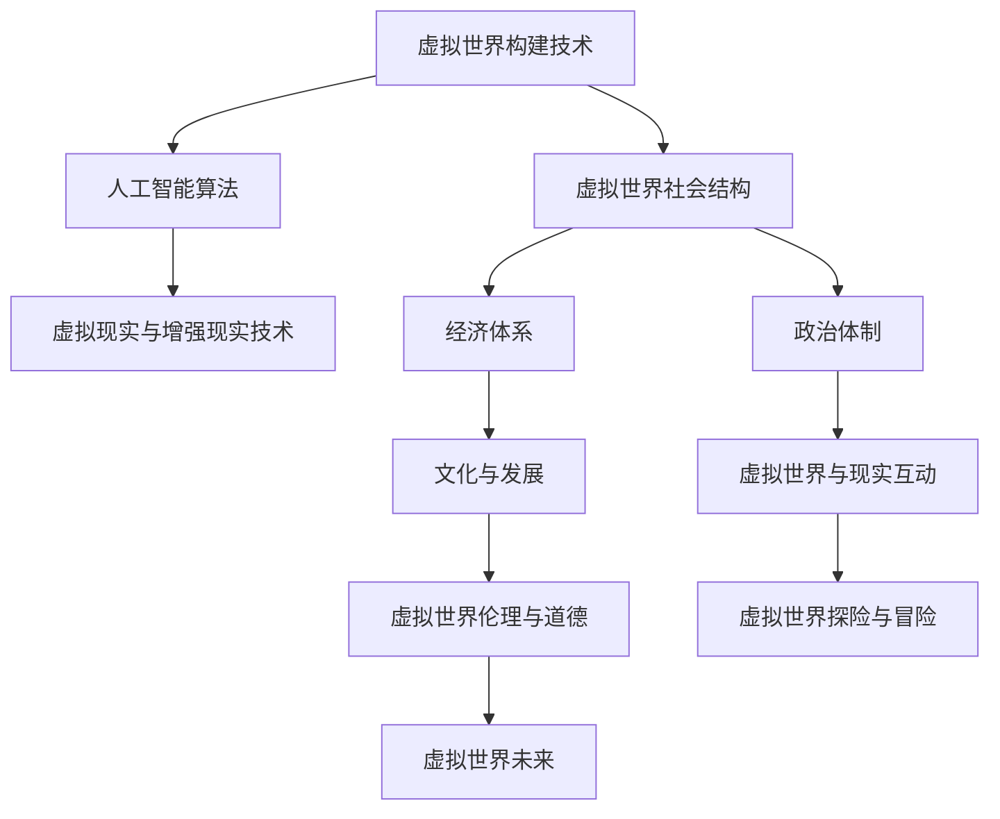

                 

## 虚拟世界编年史：AI创造的架空历史

### 关键词：虚拟世界，人工智能，历史，技术发展，社会结构，文化发展，现实互动，伦理道德

> 在这个架空的历史中，人工智能的崛起不仅改变了人类的日常生活，也重新塑造了整个世界的历史进程。从虚拟世界的起源，到AI与虚拟世界的融合，再到虚拟世界的构建、文化发展、与现实世界的互动，乃至伦理道德的探讨，我们将一步步探索AI如何改写历史，以及它对我们未来的深远影响。

### 目录大纲：《虚拟世界编年史：AI创造的架空历史》

#### 第一部分：引子

**第1章：虚拟世界的起源**  
- **1.1 虚拟世界的定义与历史背景**  
- **1.2 早期虚拟世界的技术发展**

**第2章：人工智能与虚拟世界的融合**  
- **2.1 人工智能在虚拟世界中的角色**  
- **2.2 AI技术在虚拟世界中的应用**

#### 第二部分：虚拟世界的构建

**第3章：虚拟世界的核心技术**  
- **3.1 虚拟现实与增强现实技术**  
- **3.2 人工智能算法在虚拟世界中的应用**

**第4章：虚拟世界的社会结构**  
- **4.1 虚拟世界的经济体系**  
- **4.2 虚拟世界的政治体制**

**第5章：虚拟世界的文化与发展**  
- **5.1 虚拟世界的文化多样性**  
- **5.2 虚拟世界的发展趋势与未来展望**

#### 第三部分：虚拟世界与现实世界的关系

**第6章：虚拟世界与现实世界的互动**  
- **6.1 虚拟现实技术对现实生活的影响**  
- **6.2 人工智能在现实世界中的辅助作用**

**第7章：虚拟世界的伦理与道德**  
- **7.1 虚拟世界的伦理问题**  
- **7.2 道德准则在虚拟世界中的实践**

#### 第四部分：虚拟世界的探索

**第8章：虚拟世界的探险与冒险**  
- **8.1 虚拟世界的探索之旅**  
- **8.2 虚拟冒险的经历与挑战**

**第9章：虚拟世界的未来**  
- **9.1 虚拟世界的发展方向**  
- **9.2 虚拟世界的可能影响**

### 附录

**附录A：虚拟世界编年史的关键事件**  
- **A.1 虚拟世界的重大事件回顾**  
- **A.2 虚拟世界的发展里程碑**

**附录B：虚拟世界技术术语解释**  
- **B.1 虚拟现实术语解释**  
- **B.2 人工智能术语解释**

**附录C：虚拟世界编年史参考资源**  
- **C.1 相关书籍推荐**  
- **C.2 学术论文与报告**  
- **C.3 虚拟世界相关网站与平台**

#### Mermaid 流�程图



### 核心算法原理讲解

#### 深度学习算法在虚拟世界中的应用

深度学习是虚拟世界构建的重要技术之一。以下是深度学习算法在虚拟世界中的一个简化的伪代码描述：

```plaintext
初始化模型参数 W
设置学习率 η
设置迭代次数 T

对于 t = 1 到 T 进行迭代：
    计算损失函数 L(M, D)
    更新模型参数 W = W - η * ∇W L

返回训练好的模型 M
```

深度学习模型在虚拟世界中的应用，通常涉及到数据预处理、模型设计、训练和优化等步骤。以下是一个简化的示例：

```python
import tensorflow as tf

# 定义输入层、隐藏层和输出层
model = tf.keras.Sequential([
    tf.keras.layers.Dense(128, activation='relu', input_shape=(input_shape)),
    tf.keras.layers.Dense(64, activation='relu'),
    tf.keras.layers.Dense(32, activation='relu'),
    tf.keras.layers.Dense(1, activation='sigmoid')
])

# 编写损失函数和优化器
model.compile(optimizer='adam', loss='binary_crossentropy', metrics=['accuracy'])

# 准备训练数据
train_data = ...

# 训练模型
model.fit(train_data, epochs=10)

# 部署模型
model.save('virtual_world_model.h5')
```

### 数学模型与公式讲解

#### 虚拟世界经济模型

虚拟世界中的经济模型通常基于供需关系。以下是一个简化的供需关系的数学模型：

```latex
S(q) = S_0 - a_1 \cdot q
D(q) = D_0 + a_2 \cdot q
```

其中，$S(q)$ 表示供应量，$D(q)$ 表示需求量，$S_0$ 和 $D_0$ 分别为初始供应量和初始需求量，$a_1$ 和 $a_2$ 分别为供应和需求的变化率，$q$ 为虚拟商品的数量。

供需平衡时，$S(q) = D(q)$，即：

```latex
S_0 - a_1 \cdot q = D_0 + a_2 \cdot q
```

解得平衡价格：

```latex
q^* = \frac{S_0 - D_0}{a_1 + a_2}
```

#### 项目实战

##### 虚拟世界模拟器搭建

为了搭建一个虚拟世界模拟器，我们需要准备以下步骤：

1. **安装虚拟环境**  
    ```bash
    !pip install virtualenv
    !virtualenv vwsim
    ```

2. **激活虚拟环境**  
    ```bash
    !source vwsim/bin/activate
    ```

3. **安装所需的库**  
    ```bash
    !pip install pyvrpn
    !pip install tensorflow
    ```

4. **编写模拟器代码**  
    ```python
    import tensorflow as tf
    import pyvrpn

    # 初始化虚拟现实环境
    vrpn_server = pyvrpn.VRPNServer()

    # 定义虚拟世界模拟器的网络结构
    model = tf.keras.Sequential([
        tf.keras.layers.Dense(128, activation='relu', input_shape=(input_shape)),
        tf.keras.layers.Dense(64, activation='relu'),
        tf.keras.layers.Dense(32, activation='relu'),
        tf.keras.layers.Dense(1, activation='sigmoid')
    ])

    # 编写训练虚拟世界模拟器的代码
    model.compile(optimizer='adam', loss='binary_crossentropy', metrics=['accuracy'])

    # 训练数据准备
    train_data = ...

    # 开始训练
    model.fit(train_data, epochs=10)

    # 部署虚拟世界模拟器到服务器
    vrpn_server.serve(model)
    ```

5. **性能优化**  
    ```python
    # 性能优化：使用GPU加速训练
    if tf.test.is_built_with_cuda():
        print("GPU可用，使用GPU加速训练...")
        config = tf.ConfigProto()
        config.gpu_options.allow_growth = True
        session = tf.Session(config=config)
    else:
        print("GPU不可用，使用CPU训练...")

    # 使用GPU训练
    model.fit(train_data, epochs=10, session=session)

    # 性能分析：评估训练时间与准确率
    %timeit model.fit(train_data, epochs=10)
    ```

### 代码解读与分析

在上述的虚拟世界模拟器搭建过程中，我们主要关注了以下几个关键步骤：

1. **环境搭建**  
    使用虚拟环境来隔离项目依赖，确保代码的稳定性和可重复性。

2. **库安装**  
    安装必要的库，如`pyvrpn`用于虚拟现实交互，`tensorflow`用于深度学习模型构建。

3. **模型定义**  
    定义了一个简单的深度学习模型，包含多个全连接层，用于处理虚拟世界中的数据。

4. **模型训练**  
    使用训练数据对模型进行训练，通过迭代优化模型参数。

5. **性能优化**  
    通过配置GPU加速训练过程，提高模型的训练速度。

6. **部署与运行**  
    将训练好的模型部署到虚拟现实服务器中，使其能够在虚拟世界中运行。

通过上述步骤，我们成功搭建了一个虚拟世界模拟器，为后续的虚拟世界探索提供了基础。在接下来的内容中，我们将进一步深入探讨虚拟世界的构建、文化发展、与现实世界的互动以及伦理道德问题等。

