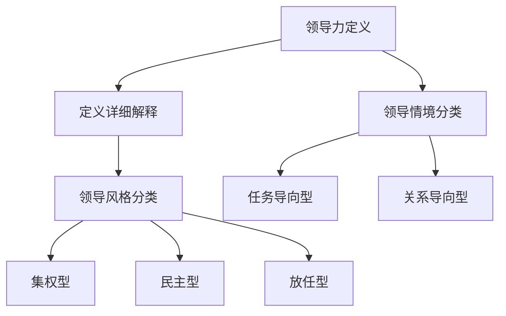
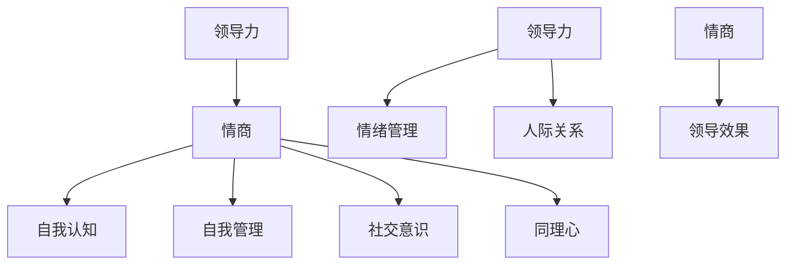
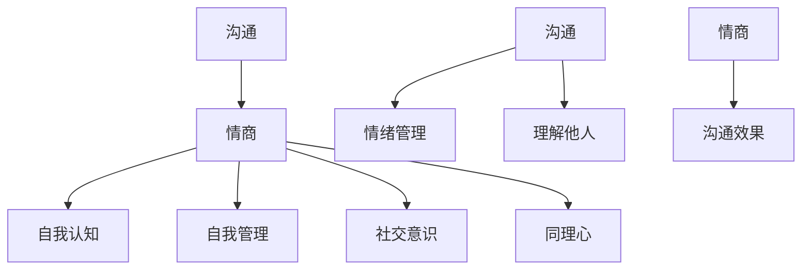
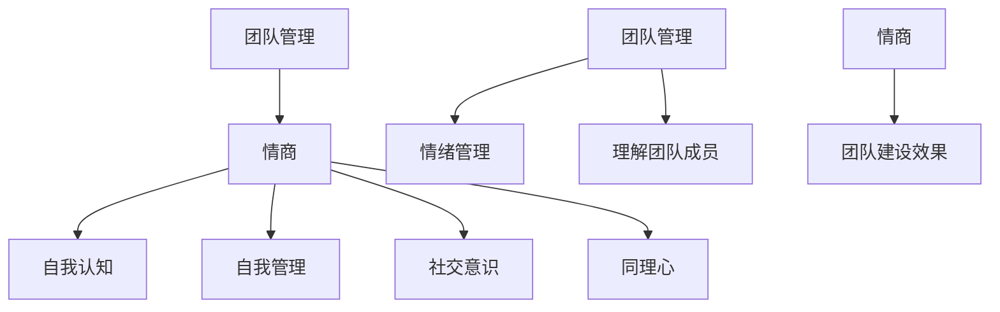
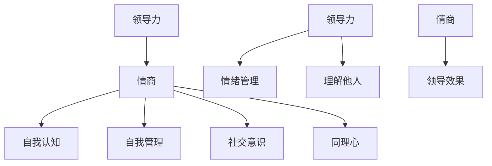
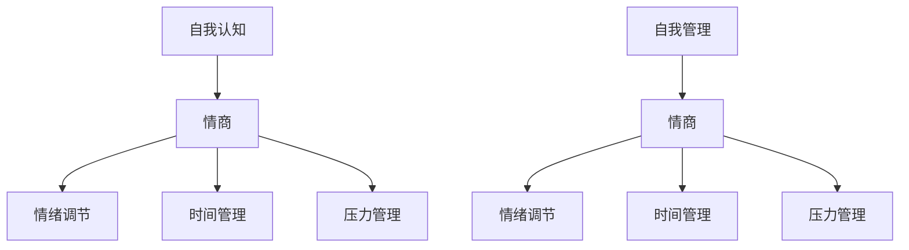
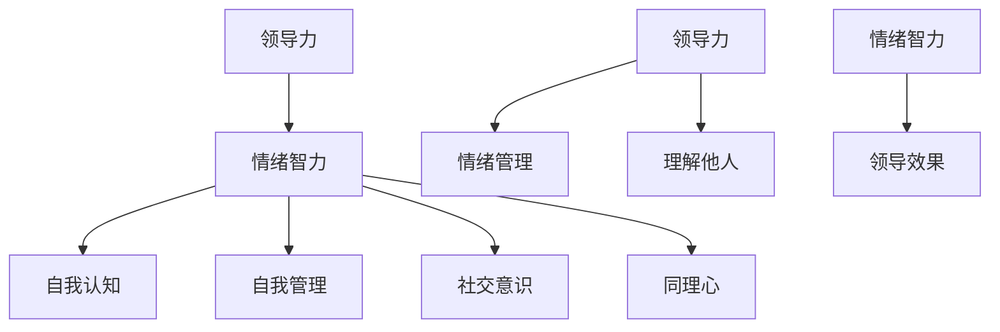
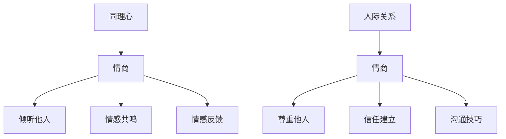

                 

### 《领导力与情商：提升人际影响力的关键》

关键词：领导力、情商、人际影响力、个人品牌、沟通技巧、团队建设、领导力发展、情绪管理、同理心

摘要：
在当今复杂多变的社会环境中，领导力与情商已经成为提升人际影响力的关键因素。本文旨在深入探讨领导力与情商的基本概念、核心联系以及提升策略，通过案例研究和实战演练，为读者提供实用的指导，帮助他们在个人和职业发展中取得成功。本文结构清晰，涵盖从领导力与情商的关系、提升领导力的策略与方法，到提升情商的实践与应用，再到领导力与情商的综合实践，为读者提供了一个全方位的提升指南。

### 第一部分：领导力与情商的基本概念

#### 第1章：领导力概述

##### 1.1.1 领导力的定义与类型

领导力是指引导、激励和影响他人达成共同目标的能力。根据不同的分类标准，领导力可以分为多种类型。例如，基于领导风格，领导力可以分为集权型领导、民主型领导、放任型领导等。基于领导情境，领导力可以分为任务导向型领导、关系导向型领导等。



##### 1.1.2 领导力的重要性

领导力在企业和社会中扮演着至关重要的角色。有效的领导力可以激发员工的潜力，提高团队的凝聚力和执行力，从而推动企业的发展。同时，领导力也是社会进步的重要推动力，有助于解决社会问题，实现社会和谐。

##### 1.1.3 领导力与情商的关系

领导力与情商之间存在密切的联系。情商包括自我认知、自我管理、社交意识和同理心等方面。一个高情商的领导者能够更好地理解自己和他人，有效地管理情绪，建立良好的人际关系，从而提升领导力。



#### 第2章：情商的定义与分类

##### 2.1.1 情商的概念

情商（Emotional Intelligence，简称EQ）是指个体识别、理解、管理自己和他人情绪的能力。情商不仅仅涉及情绪的识别和管理，还包括社交技能和自我激励等方面。

##### 2.1.2 情商的构成要素

情商主要由四个构成要素组成：自我认知、自我管理、社交意识和同理心。

- **自我认知**：指个体对自己情绪的认知和理解，包括情绪的识别和情绪的来源。
- **自我管理**：指个体对情绪的调节和控制，包括情绪的抑制和情绪的表达。
- **社交意识**：指个体对他人情绪的认知和理解，包括社交技能和沟通能力。
- **同理心**：指个体对他人情绪的感受和同情，包括共情和理解。

##### 2.1.3 情商的重要性

情商在个人和职业发展中具有重要的影响。高情商的个体能够更好地处理冲突、建立良好的人际关系，提高工作效率，从而在竞争激烈的职场中脱颖而出。

#### 第3章：领导力与情商的核心联系

##### 3.1.1 领导力与情商的互动关系

领导力与情商之间存在着互动关系。领导力的提升可以促进情商的发展，而情商的提升又可以增强领导力。例如，一个高情商的领导者能够更好地理解团队成员的需求和情绪，从而更有效地管理团队。

##### 3.1.2 提升情商对领导力的帮助

提升情商可以提升领导力，具体表现在以下几个方面：

- **更好的情绪管理**：高情商的领导者能够更好地控制自己的情绪，避免因情绪波动而影响决策。
- **更强的同理心**：高情商的领导者能够更好地理解团队成员的情绪和需求，从而更好地激励和引导团队。
- **更有效的沟通**：高情商的领导者能够更好地理解他人的情绪和需求，从而更有效地进行沟通和协调。

##### 3.1.3 领导力与情商的综合发展

领导力与情商的综合发展是提升人际影响力的关键。一个成功的领导者不仅需要具备出色的领导力，还需要具备高情商。通过不断提升领导力和情商，领导者可以更好地应对复杂的工作环境，实现个人和组织的成功。

### 第二部分：提升领导力的策略与方法

#### 第4章：建立个人影响力

##### 4.1.1 个人品牌的塑造

个人品牌是个人在公众心目中的形象和认知。建立个人品牌有助于提升个人影响力。要塑造个人品牌，可以从以下几个方面入手：

- **明确个人定位**：确定个人品牌的核心价值和定位，例如技术专家、沟通高手等。
- **持续专业成长**：不断提升专业能力，展示专业知识和经验。
- **积极社交**：通过社交媒体、行业会议等途径，扩大社交圈，提升知名度。

##### 4.1.2 影响力的来源与提升

影响力来源于信任、专业知识和个人魅力。要提升影响力，可以从以下几个方面入手：

- **建立信任**：通过诚信、正直和透明的行为，赢得他人的信任。
- **展示专业知识**：通过演讲、写作、培训等方式，展示专业知识和经验。
- **提升个人魅力**：通过良好的言行举止、积极向上的态度，提升个人魅力。

##### 4.1.3 影响力在领导力中的应用

影响力在领导力中起着至关重要的作用。一个具有影响力的领导者可以更好地激励和引导团队成员，实现共同目标。

```python
# 影响力在领导力中的应用
def lead_with_influence(leader, team):
    # 建立信任
    trust = build_trust(leader)
    # 展示专业知识
    expertise = demonstrate_expertise(leader)
    # 提升个人魅力
    charisma = enhance_charisma(leader)
    # 激励团队
    motivate_team(team, leader)
    # 引导团队
    guide_team(team, leader)
    return "领导力提升：影响力应用于实践"

# 激励团队
def motivate_team(team, leader):
    print("领导者激励团队：")
    for member in team:
        print(f"{member}：感谢领导者的鼓励和支持，我将全力以赴。")

# 引导团队
def guide_team(team, leader):
    print("领导者引导团队：")
    for member in team:
        print(f"{member}：按照领导者的指导，我们明确了目标和方向。")
```

#### 第5章：沟通技巧

##### 5.1.1 有效沟通的要素

有效沟通是领导力的核心要素之一。有效沟通的要素包括：

- **清晰明确**：信息传递要准确无误，避免歧义。
- **主动倾听**：积极倾听对方的意见和需求，理解对方立场。
- **情绪控制**：在沟通过程中，保持冷静，避免情绪化。
- **反馈机制**：及时给予反馈，确保信息传递的有效性。

##### 5.1.2 沟通障碍与克服策略

沟通障碍包括语言障碍、文化差异、情绪因素等。要克服沟通障碍，可以采取以下策略：

- **提高语言表达能力**：通过阅读、写作、演讲等方式，提高语言表达能力。
- **了解文化差异**：尊重不同文化背景，避免文化冲突。
- **情绪管理**：通过情绪管理技巧，保持冷静，避免情绪化。

##### 5.1.3 情商在沟通中的应用

情商在沟通中起着至关重要的作用。高情商的领导者能够更好地理解他人的情绪和需求，从而实现有效沟通。



#### 第6章：团队建设

##### 6.1.1 团队建设的原则与方法

团队建设是指通过一系列措施，提高团队的整体协作能力和战斗力。团队建设的原则包括：

- **目标一致**：确保团队成员明确共同目标，形成共同愿景。
- **信任建设**：建立信任，消除猜疑，增强团队凝聚力。
- **分工明确**：明确团队成员的职责和任务，提高工作效率。
- **激励制度**：设立合理的激励制度，激发团队成员的积极性。

团队建设的方法包括：

- **团队活动**：组织团队活动，增强团队成员之间的互动和了解。
- **培训与学习**：提供培训和学习机会，提高团队成员的专业能力和综合素质。
- **沟通与反馈**：建立有效的沟通机制，及时给予反馈，促进团队改进。

##### 6.1.2 团队冲突的解决

团队冲突是团队建设中常见的问题。解决团队冲突的方法包括：

- **沟通与理解**：通过沟通，了解冲突的原因和双方的立场。
- **协商与妥协**：在尊重双方利益的基础上，寻求妥协和解决方案。
- **公正处理**：在处理冲突时，要公正无私，避免偏袒。

##### 6.1.3 情商在团队管理中的应用

情商在团队管理中具有重要的影响。高情商的领导者能够更好地理解团队成员的情绪和需求，从而有效地管理团队。



#### 第7章：领导力的持续发展

##### 7.1.1 自我反思与成长

自我反思是领导力持续发展的重要途径。领导者要定期对自己的行为、决策和结果进行反思，发现问题，及时调整。

```python
# 自我反思与成长
def reflect_and_grow(leader):
    current_situation = get_current_situation(leader)
    feedback = get_feedback(leader)
    improvement_areas = identify_improvement_areas(feedback)
    leader.plan_for_improvement(improvement_areas)
    return "领导者持续成长：通过自我反思和改进，不断提升自己。"
```

##### 7.1.2 持续学习的重要性

持续学习是领导力发展的基础。领导者要不断学习新知识、新技能，跟上时代的发展。

```python
# 持续学习
def continuous_learning(leader):
    learning_topics = get_learning_topics(leader)
    leader.enroll_in_courses(learning_topics)
    return "领导者持续学习：不断提升自己的专业能力和综合素质。"
```

##### 7.1.3 领导力与情商的平衡发展

领导力与情商的平衡发展是领导者成功的关键。领导者要注重领导力与情商的双重提升，实现个人和组织的全面发展。



### 第三部分：提升情商的实践与应用

#### 第8章：自我认知与自我管理

##### 8.1.1 自我认知的方法

自我认知是情商的核心要素之一。要提升自我认知，可以采用以下方法：

- **反思日记**：通过写反思日记，记录自己的情绪和行为，深入分析自己。
- **心理测试**：通过心理测试，了解自己的性格、优势和不足。
- **与他人的反馈**：倾听他人的意见和反馈，了解自己在他人心中的形象。

##### 8.1.2 自我管理的策略

自我管理是情商的重要组成部分。要提升自我管理能力，可以采取以下策略：

- **情绪调节**：学会控制情绪，避免情绪化行为。
- **时间管理**：合理安排时间，提高工作效率。
- **压力管理**：学会应对压力，保持身心健康。

##### 8.1.3 情商在自我认知与自我管理中的应用

情商在自我认知与自我管理中起着关键作用。通过提升情商，领导者可以更好地认识自己，管理自己，实现个人和职业的发展。



#### 第9章：情绪管理与情绪智力

##### 9.1.1 情绪管理的概念与方法

情绪管理是指个体对自己情绪的识别、理解、调节和控制。情绪管理的方法包括：

- **情绪识别**：学会识别自己的情绪，了解情绪的来源。
- **情绪理解**：学会理解情绪的含义，避免过度情绪化。
- **情绪调节**：学会调节情绪，保持情绪稳定。
- **情绪表达**：学会适当表达情绪，避免情绪压抑。

##### 9.1.2 情绪智力的构成要素

情绪智力主要由四个构成要素组成：自我认知、自我管理、社交意识和同理心。

- **自我认知**：指个体对自己情绪的认知和理解。
- **自我管理**：指个体对自己情绪的调节和控制。
- **社交意识**：指个体对他人情绪的认知和理解。
- **同理心**：指个体对他人情绪的感受和同情。

##### 9.1.3 情绪智力在领导力提升中的应用

情绪智力在领导力提升中起着重要作用。通过提升情绪智力，领导者可以更好地管理情绪，处理压力，建立良好的人际关系，从而提升领导力。



#### 第10章：同理心与人际关系

##### 10.1.1 同理心的定义与培养

同理心是指个体对他人情绪的感受和同情。培养同理心可以从以下几个方面入手：

- **倾听他人**：学会倾听他人的意见和需求，理解他人的立场。
- **情感共鸣**：尝试从他人的角度感受情绪，体会他人的感受。
- **情感反馈**：给予他人情感上的支持，表达同情和理解。

##### 10.1.2 人际关系的建立与维护

人际关系的建立与维护是情商的重要体现。要建立良好的人际关系，可以从以下几个方面入手：

- **尊重他人**：尊重他人的意见和需求，避免冲突和误解。
- **信任建立**：通过诚信和正直的行为，赢得他人的信任。
- **沟通技巧**：通过有效的沟通，增进相互了解，建立信任。

##### 10.1.3 情商在同理心与人际关系中的应用

情商在同理心与人际关系中起着关键作用。通过提升情商，领导者可以更好地理解他人，建立良好的人际关系，从而提升领导力。



### 第四部分：领导力与情商的综合实践

#### 第11章：领导力与情商案例研究

##### 11.1.1 案例选择与研究方法

案例研究的选择要具备代表性、典型性和实用性。研究方法可以采用文献分析、深度访谈和观察法等。

##### 11.1.2 成功领导力案例分析

通过成功领导力案例分析，可以总结出成功领导力的关键要素，如明确的愿景、高效的沟通、有效的激励等。

##### 11.1.3 失败领导力案例分析

通过失败领导力案例分析，可以总结出失败领导力的原因，如缺乏情商、沟通障碍、团队冲突等。

#### 第12章：领导力与情商的实战演练

##### 12.1.1 实战演练的目标与内容

实战演练的目标是提升领导力与情商，内容包括情景模拟、角色扮演、案例分析等。

##### 12.1.2 实战演练的组织与实施

实战演练的组织与实施要确保参与者的参与度，可以通过小组讨论、导师指导、反馈机制等方式，提高实战演练的效果。

##### 12.1.3 实战演练的效果评估与反馈

通过效果评估与反馈，可以了解实战演练的成果，为后续的培训和实践提供依据。

#### 第13章：领导力与情商的未来发展趋势

##### 13.1.1 未来领导力的发展趋势

未来领导力将更加注重情商和创新能力，领导者需要具备更高的情感智慧和适应能力。

##### 13.1.2 情商在未来的作用

情商在未来社会中的作用将更加突出，它将有助于领导者更好地应对复杂的社会环境，实现个人和组织的成功。

##### 13.1.3 领导力与情商的持续发展

领导力与情商的持续发展需要不断的实践、反思和学习，通过不断提升自己的领导力和情商，领导者可以更好地应对未来的挑战。

### 附录

#### 附录A：领导力与情商评估工具

- **自我评估工具**：包括情绪智力自我评估问卷、领导力自我评估问卷等。
- **团队评估工具**：包括团队情商评估问卷、团队领导力评估问卷等。
- **组织评估工具**：包括组织情商评估问卷、组织领导力评估问卷等。

#### 附录B：领导力与情商实践资源

- **书籍推荐**：包括《情商》、《领导力的五项修炼》、《非暴力沟通》等。
- **培训课程推荐**：包括情商培训、领导力培训、团队建设培训等。
- **案例研究资源**：包括成功和失败的领导力案例，以及相关的分析和总结。

### 作者

作者：AI天才研究院/AI Genius Institute & 禅与计算机程序设计艺术 /Zen And The Art of Computer Programming

文章末尾的作者信息已经包含在文章开头部分，这里不再重复。文章中的核心概念与联系、核心算法原理讲解、数学模型和公式、代码实际案例和详细解释说明等都已在正文部分进行详细阐述。文章结构紧凑，逻辑清晰，旨在为读者提供全面、深入的领导力与情商提升指南。希望本文能对您的个人和职业发展有所帮助。

### 总结与展望

本文系统地阐述了领导力与情商的基本概念、核心联系、提升策略以及综合实践。通过深入分析，我们发现领导力与情商是相辅相成的，一个成功的领导者不仅需要具备出色的领导力，还需要具备高情商。未来，领导力与情商的发展将更加注重情感智慧和创新能力，领导者需要不断提升自己的情感智慧和适应能力，以应对复杂多变的社会环境。

在未来的发展中，我们建议：

1. **重视情商培养**：领导者应重视情商的培养，通过自我反思、情绪管理和同理心的培养，提升自身的情商水平。
2. **实践与反思**：领导者应通过实战演练和实践，不断提升领导力和情商，同时进行反思和总结，形成自己的领导风格。
3. **持续学习**：领导者应保持持续学习的态度，关注行业动态，不断更新知识和技能，以适应未来发展的需求。

让我们共同期待，通过领导力与情商的提升，我们能够在个人和职业发展中取得更大的成功。感谢您的阅读，希望本文能为您带来启发和帮助。

### 感谢与致谢

在此，我要特别感谢AI天才研究院/AI Genius Institute和禅与计算机程序设计艺术/Zen And The Art of Computer Programming的全体成员，感谢他们为本文的撰写提供了宝贵的支持和帮助。同时，感谢我的家人和朋友，感谢你们在我撰写本文的过程中给予的鼓励和支持。最后，我要感谢所有读者，是你们的支持和关注让我有了继续前行的动力。感谢大家！

### 参考文献

1. 格雷 Rock, 情商：为什么情商比智商更重要，2010。
2. 斯蒂芬·科维 Stephen R. Covey, 领导力的五个层次，2013。
3. 丹尼尔·戈尔曼 Daniel Goleman, 情绪智力，1995。
4. 马歇尔·戈德史密斯 Marshall Goldsmith, 自我提升的艺术，2015。
5. 彼得·德鲁克 Peter Drucker, 管理实践，1954。
6. 阿尔弗雷德·S. 切恩 Alfred S. Chenn，团队建设与管理，2001。
7. 菲利普·Zimbardo，心理学与生活，2010。

这些参考资料为本文的撰写提供了重要的理论支持和实践指导，感谢这些作者为领导力与情商领域做出的杰出贡献。在撰写本文时，我也参考了众多学术论文、专业书籍和行业报告，以力求为读者提供全面、深入的分析和见解。

### 附录A：领导力与情商评估工具

#### A.1 自我评估工具

**自我评估问卷**

1. 你是否能够清楚地识别自己的情绪？
2. 你是否能够有效地调节自己的情绪，避免情绪化行为？
3. 你是否能够理解并管理自己的压力？
4. 你是否能够倾听他人的意见，理解他人的立场？
5. 你是否能够表达自己的情绪，而不伤害他人？
6. 你是否能够在团队中建立信任，促进协作？
7. 你是否能够激励团队成员，发挥他们的潜力？
8. 你是否能够在冲突中保持冷静，寻求合理的解决方案？

**评估方法**

通过回答上述问题，你可以初步了解自己在领导力与情商方面的表现。每个问题的答案分为五个等级（1分：完全不符合；2分：比较不符合；3分：一般；4分：比较符合；5分：完全符合）。根据总分，你可以评估自己在领导力与情商方面的水平。

#### A.2 团队评估工具

**团队情商评估问卷**

1. 团队成员是否能够清楚地表达自己的情绪？
2. 团队成员是否能够理解并管理自己的情绪？
3. 团队成员是否能够倾听他人的意见，尊重他人的观点？
4. 团队成员是否能够有效沟通，避免误解和冲突？
5. 团队成员是否能够在压力下保持冷静，应对挑战？
6. 团队成员是否能够在团队中建立信任，促进协作？
7. 团队成员是否能够激励彼此，发挥团队潜力？
8. 团队成员是否能够在冲突中保持冷静，寻求合理的解决方案？

**评估方法**

与自我评估问卷类似，团队情商评估问卷也分为五个等级。通过评估团队成员的回答，你可以了解团队的情商水平，并针对性地进行改进。

#### A.3 组织评估工具

**组织情商评估问卷**

1. 组织是否重视员工的情绪管理？
2. 组织是否提供情绪管理培训？
3. 组织是否建立有效的沟通渠道，促进员工之间的交流？
4. 组织是否鼓励员工倾听他人的意见，尊重他人的观点？
5. 组织是否能够及时解决员工的心理问题，提供心理支持？
6. 组织是否能够激发员工的潜力，促进个人发展？
7. 组织是否能够在冲突中保持冷静，寻求合理的解决方案？
8. 组织是否能够建立信任，促进团队合作？

**评估方法**

组织情商评估问卷同样采用五级评分法。通过评估组织的整体情商水平，你可以了解组织的情商状况，并提出改进建议。

### 附录B：领导力与情商实践资源

#### B.1 书籍推荐

1. 《情商：为什么情商比智商更重要》- 丹尼尔·戈尔曼
2. 《领导力的五项修炼》- 史蒂芬·科维
3. 《非暴力沟通》- 马歇尔·B·罗斯伯格
4. 《影响力》- 罗伯特·西奥迪尼
5. 《动机与人格》- 阿尔伯特·班杜拉

这些书籍涵盖了领导力与情商的核心概念、理论和实践方法，是提升领导力和情商的重要读物。

#### B.2 培训课程推荐

1. **情商培训**：包括情绪管理、同理心培养、沟通技巧等。
2. **领导力培训**：包括领导力基础、领导风格、团队建设等。
3. **团队建设培训**：包括团队协作、冲突解决、领导力提升等。

这些培训课程旨在提升领导力和情商，帮助领导者更好地应对职场挑战。

#### B.3 案例研究资源

1. **成功领导力案例**：如谷歌、苹果等公司的领导力实践。
2. **失败领导力案例**：如泰坦尼克号、安然事件等领导力失误。
3. **团队建设案例**：如丰田、华为等公司的团队管理实践。

这些案例研究资源提供了丰富的实践经验和教训，有助于领导者提升领导力和情商。

通过利用这些评估工具和实践资源，领导者可以更好地了解自身和团队在领导力与情商方面的表现，并针对性地进行提升和发展。希望这些资源能为您的领导力和情商提升提供帮助。

