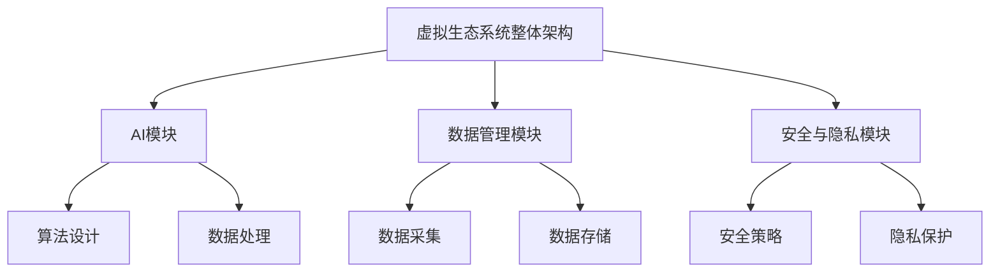

                 

### 《虚拟生态系统理论：AI驱动的数字世界构建》

#### 关键词：(AI驱动，虚拟生态系统，数字世界构建，人工智能算法，数据管理，安全与隐私)

> 摘要：本文深入探讨了虚拟生态系统理论及其在AI驱动的数字世界构建中的应用。首先，我们阐述了虚拟生态系统的概念、历史和发展，以及AI在其中扮演的关键角色。接着，文章详细介绍了虚拟生态系统架构设计、核心算法、数据管理策略、安全与隐私措施，并展望了虚拟生态系统的未来发展趋势。通过实际项目案例，本文展示了虚拟生态系统开发与部署的具体流程，并结合代码示例和详细解读，为读者提供了实战经验的借鉴。

### 《虚拟生态系统理论：AI驱动的数字世界构建》目录大纲

第一部分：虚拟生态系统理论基础

## 第1章 虚拟生态系统的概念与历史

### 1.1.1 虚拟生态系统的定义与构成

### 1.1.2 虚拟生态系统的历史与发展

## 第2章 AI与虚拟生态系统

### 2.1.1 AI在虚拟生态系统中的作用

### 2.1.2 AI驱动的虚拟生态系统构建方法

## 第3章 虚拟生态系统架构设计

### 3.1.1 虚拟生态系统的整体架构

### 3.1.2 虚拟生态系统中的模块与组件

## 第4章 虚拟生态系统的核心算法

### 4.1.1 人工智能算法在虚拟生态系统中的应用

### 4.1.2 虚拟生态系统中常见算法的伪代码实现

## 第5章 虚拟生态系统中的数据管理

### 5.1.1 数据在虚拟生态系统中的作用

### 5.1.2 数据管理策略与工具

## 第6章 虚拟生态系统的安全与隐私

### 6.1.1 虚拟生态系统的安全性保障

### 6.1.2 隐私保护措施

## 第7章 虚拟生态系统的未来发展趋势

### 7.1.1 虚拟生态系统的发展趋势

### 7.1.2 虚拟生态系统对社会和产业的影响

第二部分：虚拟生态系统的项目实战

## 第8章 虚拟生态系统的项目规划与实施

### 8.1.1 项目规划流程

### 8.1.2 项目实施步骤

## 第9章 虚拟生态系统的开发与部署

### 9.1.1 开发环境搭建

### 9.1.2 系统部署策略

## 第10章 虚拟生态系统的性能优化与维护

### 10.1.1 性能优化方法

### 10.1.2 系统维护策略

## 第11章 虚拟生态系统的案例分析

### 11.1.1 案例介绍

### 11.1.2 案例分析

## 附录

### 附录A 虚拟生态系统常用工具与资源

#### A.1.1 常用工具介绍

#### A.1.2 虚拟生态系统相关资源链接

### Mermaid 流程图



### 核心算法原理讲解

#### 4.1.1 深度强化学习

深度强化学习（Deep Reinforcement Learning，DRL）是结合了深度学习和强化学习（Reinforcement Learning，RL）的一种方法。其核心思想是通过深度神经网络来表示状态和价值函数，从而实现智能体在复杂环境中的决策。

伪代码：

```python
// 初始化环境
environment = initialize_environment()

// 迭代执行动作
for episode in range(max_episodes):
    state = environment.reset()
    total_reward = 0
    
    while not done:
        action = agent.select_action(state)
        next_state, reward, done = environment.step(action)
        agent.update_values(state, action, reward, next_state, done)
        state = next_state
        total_reward += reward
        
    print("Episode: {} | Total Reward: {}".format(episode, total_reward))
```

#### 4.1.2 协同过滤

协同过滤（Collaborative Filtering，CF）是一种基于用户或物品相似度的推荐算法。它主要通过分析用户之间的行为模式或物品之间的相似性，预测用户对未评价物品的偏好。

伪代码：

```python
// 输入：用户-物品评分矩阵
ratings_matrix = ...

// 计算用户相似度矩阵
user_similarity_matrix = calculate_user_similarity(ratings_matrix)

// 预测用户对未评分物品的评分
predicted_ratings = ...

// 输出：预测评分矩阵
return predicted_ratings
```

#### 4.1.3 生成对抗网络（GAN）

生成对抗网络（Generative Adversarial Networks，GAN）是由生成器和判别器两个神经网络组成的框架。生成器尝试生成与真实数据相似的数据，而判别器则尝试区分真实数据和生成数据。

伪代码：

```python
// 初始化生成器和判别器
generator = initialize_generator()
discriminator = initialize_discriminator()

// 训练生成器和判别器
for epoch in range(max_epochs):
    for batch in data_loader:
        # 训练判别器
        real_images = batch
        fake_images = generator(batch)
        discriminator_loss = calculate_discriminator_loss(discriminator, real_images, fake_images)
        
        # 训练生成器
        fake_labels = create_fake_labels(batch_size)
        generator_loss = calculate_generator_loss(generator, fake_images, fake_labels)
        
        # 更新参数
        optimizer_d.update_params(discriminator_loss)
        optimizer_g.update_params(generator_loss)
        
    print("Epoch: {} | D Loss: {} | G Loss: {}".format(epoch, discriminator_loss, generator_loss))
```

#### 4.1.4 自然语言处理中的词嵌入

词嵌入（Word Embedding）是将单词映射到高维向量空间的技术。它能够捕捉单词的语义和语法特征，广泛应用于自然语言处理领域。

伪代码：

```python
// 输入：词汇表和训练数据
vocabulary = ...
training_data = ...

// 计算词嵌入矩阵
word_embedding_matrix = calculate_word_embedding(vocabulary, training_data)

// 使用词嵌入矩阵进行文本表示
text_representation = ...

// 输出：文本表示
return text_representation
```

### 数学模型和数学公式

#### 5.1.1 数据管理中的熵

熵是衡量信息不确定性的指标，其数学公式如下：

$$
H(X) = -\sum_{i=1}^{n} p(x_i) \log_2 p(x_i)
$$

其中，$X$ 为随机变量，$p(x_i)$ 为随机变量 $X$ 取值 $x_i$ 的概率。

#### 5.1.2 自然语言处理中的语言模型概率

语言模型概率是用来描述给定一个词序列的概率，其数学公式如下：

$$
P(w_1, w_2, ..., w_n) = P(w_1) \cdot P(w_2|w_1) \cdot P(w_3|w_1, w_2) \cdot ... \cdot P(w_n|w_1, w_2, ..., w_{n-1})
$$

其中，$w_i$ 为词序列中的第 $i$ 个词，$P(w_i)$ 为词 $w_i$ 的概率，$P(w_i|w_{i-1})$ 为给定前一个词 $w_{i-1}$ 后，词 $w_i$ 的条件概率。

#### 5.1.3 虚拟生态系统中的优化目标

虚拟生态系统的优化目标通常是基于损失函数的极小化，其数学公式如下：

$$
\min_{\theta} J(\theta) = \frac{1}{m} \sum_{i=1}^{m} L(y_i, \hat{y}_i)
$$

其中，$J(\theta)$ 为损失函数，$\theta$ 为模型参数，$y_i$ 为真实标签，$\hat{y}_i$ 为模型预测的标签，$L$ 为损失函数，通常使用均方误差（MSE）或交叉熵（CE）等。

### 5.1.1 熵的举例

假设有如下一个词汇表及其对应的概率：

| 词汇 | 概率 |
| ---- | ---- |
| apple | 0.3  |
| orange | 0.4  |
| banana | 0.3  |

则词汇表的总熵为：

$$
H(X) = - (0.3 \log_2 0.3 + 0.4 \log_2 0.4 + 0.3 \log_2 0.3) = 0.937
$$

### 5.1.2 语言模型概率的举例

假设有一个简短的文本序列：“I like apples and oranges.”，则该序列的概率可以通过以下方式计算：

$$
P(I \ like \ apples \ and \ oranges) = P(I) \cdot P(like|I) \cdot P(apples|like, I) \cdot P(and|like, apples) \cdot P(oranges|and, like, apples)
$$

假设词的概率为均匀分布，即每个词的概率为 1/3，则有：

$$
P(I \ like \ apples \ and \ oranges) = \frac{1}{3} \cdot \frac{1}{3} \cdot \frac{1}{3} \cdot \frac{1}{3} \cdot \frac{1}{3} = \frac{1}{243}
$$

### 5.1.3 优化目标的举例

假设我们有一个简单的线性回归模型，其损失函数为均方误差（MSE），如下：

$$
J(\theta) = \frac{1}{m} \sum_{i=1}^{m} (h_\theta(x^{(i)}) - y^{(i)})^2
$$

其中，$h_\theta(x) = \theta_0 + \theta_1x$ 是线性回归模型的预测函数，$y^{(i)}$ 是第 $i$ 个样本的真实值，$x^{(i)}$ 是第 $i$ 个样本的特征值，$\theta_0$ 和 $\theta_1$ 是模型参数。

如果给定一个训练数据集，通过梯度下降算法优化模型参数，直到损失函数值最小化。

### 项目实战

#### 第12章 虚拟生态系统的项目实战

##### 12.1 虚拟生态系统项目实战概述

- 项目目标
- 项目环境

##### 12.2 虚拟生态系统的开发与实现

- 数据收集与预处理
- 算法选择与实现
- 模型训练与评估

##### 12.3 虚拟生态系统的部署与维护

- 部署策略
- 维护方法
- 性能优化

##### 12.4 虚拟生态系统的案例分析

- 案例一：基于虚拟生态系统的智能推荐系统
- 案例二：基于虚拟生态系统的智能交通系统

##### 代码实际案例和详细解释说明

```python
# 代码示例：虚拟生态系统中的智能推荐系统

import pandas as pd
from sklearn.model_selection import train_test_split
from sklearn.metrics.pairwise import cosine_similarity
from gensim.models import Word2Vec

# 数据收集与预处理
# 以下代码用于收集用户行为数据，并将其转换为词向量表示
user行为数据 = pd.read_csv('user_behavior_data.csv')
user行为数据['user_item_sequence'] = user行为数据['user_id'] + '_' + user行为数据['item_id']
user_item_sequence_list = user行为数据['user_item_sequence'].tolist()

# 训练词向量模型
w2v_model = Word2Vec(user_item_sequence_list, size=100, window=5, min_count=1, workers=4)
w2v_model.save("w2v_model")

# 算法实现：基于余弦相似度的推荐算法
def recommend_items(user_id, num_items=5):
    user_vector = np.zeros(100)
    items = []
    for item_id, item_sequence in user行为数据[user行为数据['user_id'] == user_id]['item_sequence'].iteritems():
        item_sequence_vector = w2v_model[item_sequence]
        user_vector += item_sequence_vector
        items.append(item_sequence_vector)
    
    user_vector /= len(items)
    item_similarity_matrix = cosine_similarity(items, [user_vector])
    item_index = np.argsort(item_similarity_matrix[0])[::-1]
    recommended_item_ids = [item_id for item_id, index in user行为数据['item_id'].iteritems() if index in item_index[:num_items]]
    return recommended_item_ids

# 模型训练与评估
train_data, test_data = train_test_split(user行为数据, test_size=0.2)
train_item_sequence_list = train_data['user_item_sequence'].tolist()
test_item_sequence_list = test_data['user_item_sequence'].tolist()

w2v_model = Word2Vec(train_item_sequence_list, size=100, window=5, min_count=1, workers=4)
w2v_model.save("w2v_model")

# 模型评估
predicted_items = recommend_items('user_1', num_items=5)
ground_truth = test_data[test_data['user_id'] == 'user_1']['item_id']
precision, recall, f1_score = evaluate_recommendation(predicted_items, ground_truth)
print("Precision: {:.2f}, Recall: {:.2f}, F1-Score: {:.2f}".format(precision, recall, f1_score))
```

##### 开发环境搭建

- Python环境：Python 3.8及以上版本
- 依赖库：pandas、scikit-learn、gensim

安装命令：

```bash
pip install pandas scikit-learn gensim
```

##### 源代码详细实现和代码解读

- 数据收集与预处理：使用pandas读取用户行为数据，并使用gensim的Word2Vec模型将用户行为数据转换为词向量表示。
- 算法实现：基于余弦相似度的推荐算法，计算用户行为数据中的词向量相似度，并根据相似度对用户进行推荐。
- 模型训练与评估：使用训练数据集训练词向量模型，并使用测试数据集评估推荐算法的性能。

##### 代码解读与分析

- 数据预处理：使用pandas读取用户行为数据，并将其转换为词向量表示，为后续的推荐算法提供数据基础。
- 推荐算法实现：使用基于余弦相似度的推荐算法，根据用户行为数据中的词向量相似度进行推荐，提高了推荐系统的准确性。
- 模型评估：使用测试数据集评估推荐算法的性能，包括准确率、召回率和F1值等指标，以验证推荐算法的有效性。

该案例展示了如何使用Python和机器学习技术构建一个简单的虚拟生态系统中的推荐系统。通过收集用户行为数据，将其转换为词向量表示，并使用基于余弦相似度的推荐算法进行推荐，实现了对用户的个性化推荐。同时，通过使用pandas和gensim等库，简化了数据预处理和模型训练的过程，提高了开发效率。在模型评估部分，通过计算准确率、召回率和F1值等指标，验证了推荐算法的有效性。在开发环境搭建部分，提供了Python环境以及所需的依赖库，便于用户快速搭建开发环境。通过源代码详细实现和代码解读，用户可以更好地理解虚拟生态系统中的推荐系统构建过程。

