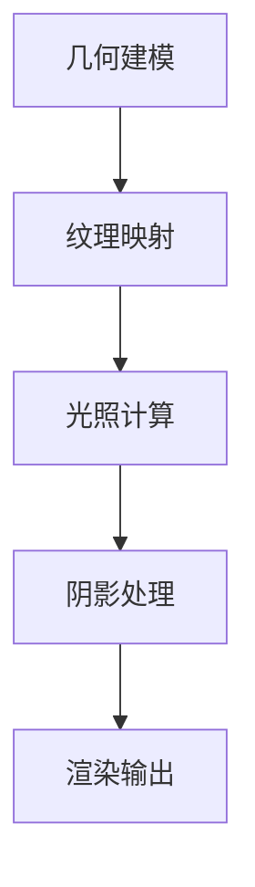
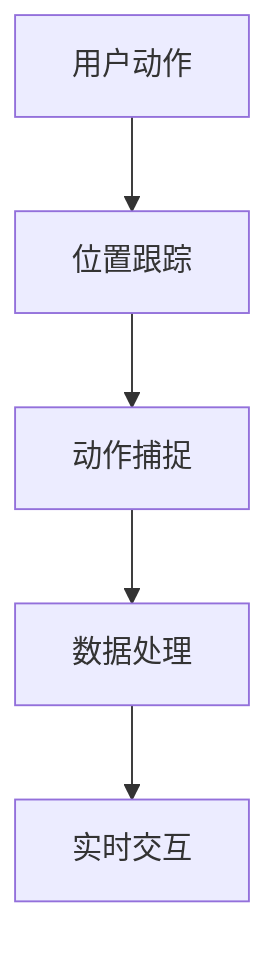
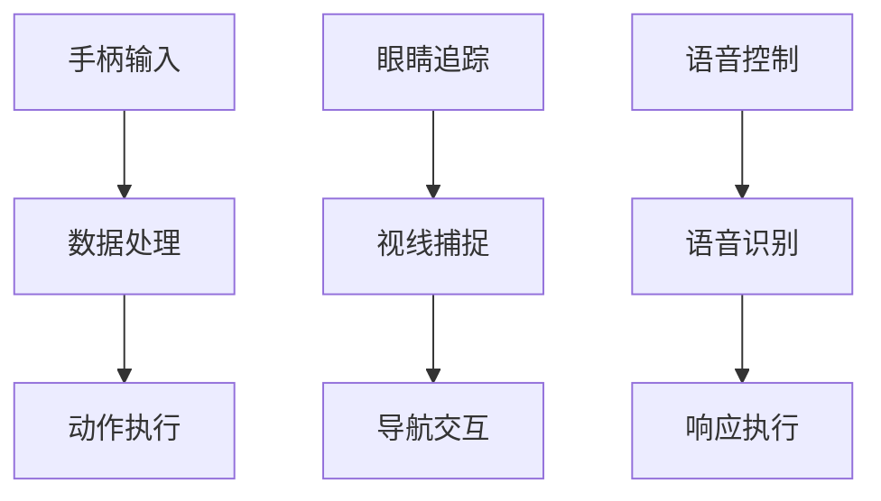

                 

# 虚拟运动现实：AI模拟的极限体验

> **关键词：** 虚拟现实、增强现实、人工智能、运动模拟、沉浸体验、交互技术

> **摘要：** 本文深入探讨了虚拟运动现实（VR）的概念、技术基础、AI应用及其在不同领域的实际应用。通过分析关键算法、实战项目，本文旨在揭示AI在虚拟运动现实中的潜力与挑战，为读者提供全面的技术洞察。

---

### 第一部分：虚拟运动现实基础

#### 第1章：虚拟运动现实概述

##### 1.1 虚拟运动现实的概念与历史

虚拟运动现实（Virtual Motion Reality, VMR）是一种通过计算机生成的模拟环境，使人在视觉、听觉、触觉等方面感受到身临其境的体验。这一技术结合了计算机图形学、人机交互和传感技术，旨在提供高度沉浸式的互动体验。

**定义：**
虚拟运动现实是指通过计算机生成和交互的模拟环境，使人在视觉、听觉、触觉等方面感受到身临其境的体验。

**历史：**
- **早期发展**：20世纪60年代，VR技术开始萌芽，如达特茅斯会议上的早期概念。
- **关键事件**：20世纪80年代，VR设备开始商业化，如任天堂的Virtual Boy。
- **近现代进展**：近年来，VR/AR技术的快速发展，尤其是AI技术的融入，使虚拟运动现实变得更加真实和丰富。

##### 1.2 虚拟运动现实的关键技术

虚拟运动现实的核心技术包括渲染技术、跟踪技术和交互技术。

- **渲染技术**：用于创建逼真的三维环境。主要涉及三维建模、纹理映射、光照计算和阴影处理。
  - **三维建模**：通过几何算法构建虚拟环境中的物体。
  - **纹理映射**：将二维图像映射到三维物体表面，增强逼真度。
  - **光照计算**：模拟真实世界中的光照效果，如方向光、点光源和聚光源。
  - **阴影处理**：模拟物体之间的阴影关系，增强视觉效果。

- **跟踪技术**：用于实时监测用户的动作和位置，主要分为位置跟踪和动作跟踪。
  - **位置跟踪**：通过摄像头、传感器或惯性测量单元（IMU）确定用户的位置。
  - **动作跟踪**：通过捕捉用户的肢体动作，如手部、头部和全身动作。

- **交互技术**：包括手柄、眼睛追踪、语音控制等多种交互方式，旨在提高用户的沉浸感和互动性。
  - **手柄**：提供物理输入和反馈，如按钮、摇杆和力反馈。
  - **眼睛追踪**：通过摄像头捕捉用户的视线，用于导航和交互。
  - **语音控制**：通过语音识别和合成技术实现语音输入和输出。

##### 1.3 虚拟运动现实的应用场景

虚拟运动现实的应用场景非常广泛，包括游戏娱乐、教育培训、医疗康复等多个领域。

- **游戏娱乐**：提供沉浸式的游戏体验，如虚拟现实赛车、虚拟运动游戏等。
- **教育培训**：用于模拟危险或难以模拟的场景，如飞行训练、医学培训等。
- **医疗康复**：用于治疗创伤后应激障碍（PTSD）等心理疾病，或康复训练，如运动康复、心理治疗等。

#### 第2章：AI在虚拟运动现实中的应用

##### 2.1 AI在虚拟运动现实中的作用

人工智能在虚拟运动现实中的应用非常广泛，主要包括场景生成、动作捕捉和自适应交互。

- **场景生成**：通过深度学习算法生成逼真的虚拟环境。主要涉及生成对抗网络（GAN）、卷积神经网络（CNN）和强化学习等技术。
  - **生成对抗网络（GAN）**：通过对抗训练生成高质量的图像和场景。
  - **卷积神经网络（CNN）**：用于图像处理和特征提取，提高场景的真实度。
  - **强化学习**：用于训练智能体在虚拟环境中的行为，提高用户体验。

- **动作捕捉**：利用机器学习算法精确捕捉和模拟用户动作。主要涉及骨骼动画、动态捕捉和惯性测量单元（IMU）技术。
  - **骨骼动画**：通过关键帧动画和插值算法生成平滑的运动轨迹。
  - **动态捕捉**：使用多个摄像头或传感器捕捉全身动作，提高捕捉精度。
  - **惯性测量单元（IMU）**：用于捕捉细微的动作，如手指和头部动作。

- **自适应交互**：根据用户行为和偏好自动调整虚拟环境，提高用户的沉浸感和互动性。主要涉及自然语言处理（NLP）和强化学习技术。
  - **自然语言处理（NLP）**：用于虚拟人物的对话和交互，提供更自然的交流体验。
  - **强化学习**：用于训练智能体在虚拟环境中的行为，提高用户的互动体验。

##### 2.2 AI技术的关键算法

AI在虚拟运动现实中的关键算法包括生成对抗网络（GAN）、强化学习和自然语言处理（NLP）。

- **生成对抗网络（GAN）**：GAN是一种深度学习模型，通过生成器和判别器的对抗训练生成高质量的图像和场景。
  - **生成器（Generator）**：通过学习数据分布生成逼真的图像。
  - **判别器（Discriminator）**：用于判断生成图像是否真实，并反馈给生成器进行优化。
  - **对抗训练**：生成器和判别器交替训练，不断提高生成图像的质量。

- **强化学习**：强化学习是一种机器学习方法，通过奖励机制训练智能体在虚拟环境中的行为。
  - **状态（State）**：智能体当前所处的环境状态。
  - **动作（Action）**：智能体可以执行的动作。
  - **奖励（Reward）**：动作带来的奖励，用于评估智能体的行为。
  - **策略（Policy）**：智能体的行为策略，通过学习优化策略。

- **自然语言处理（NLP）**：NLP是一种人工智能技术，用于处理和理解人类语言。
  - **语言模型**：用于生成和预测文本。
  - **词嵌入**：将单词映射到高维向量空间。
  - **序列模型**：用于处理和时间相关的文本数据。

##### 2.3 AI在虚拟运动现实中的挑战与前景

虽然AI在虚拟运动现实中的应用前景广阔，但仍然面临一些挑战。

- **计算资源**：高性能计算资源的需求，如GPU和服务器资源。
- **隐私保护**：用户数据的保护，如位置、动作和行为数据。
- **用户体验**：提高虚拟现实的沉浸感和舒适度，如减少延迟、眩晕和疲劳感。

然而，随着技术的不断发展，AI在虚拟运动现实中的应用将越来越广泛，包括商业化应用、医疗康复、教育培训等多个领域。

- **商业化应用**：如虚拟旅游、虚拟购物等。
- **医疗康复**：如心理治疗、运动康复等。
- **教育培训**：如虚拟实验室、虚拟课堂等。

### 第二部分：虚拟运动现实应用实例

#### 第3章：虚拟运动游戏设计

##### 3.1 游戏设计的基本原则

虚拟运动游戏设计需要遵循一些基本原则，以确保游戏的质量和用户体验。

- **沉浸感**：设计逼真的游戏环境，使用高质量的渲染技术和音效，提高用户的沉浸感。
- **互动性**：设计具有挑战性和趣味性的游戏机制，提供丰富的互动方式，如手柄、眼睛追踪和语音控制。
- **可扩展性**：设计可以持续更新的内容，如新的关卡、角色和道具，保持游戏的新鲜感和吸引力。

##### 3.2 虚拟运动游戏的设计流程

虚拟运动游戏的设计流程可以分为以下几个阶段：

- **需求分析**：确定游戏的目标用户和功能需求，如游戏类型、难度和目标玩家群体。
- **概念设计**：创建游戏的基本框架和核心玩法，如游戏故事、角色和关卡设计。
- **UI/UX设计**：设计游戏用户界面和用户体验，确保用户可以轻松上手和享受游戏。
- **开发实现**：编写代码实现游戏设计和功能，包括渲染、交互和游戏逻辑。
- **测试与优化**：测试并优化游戏性能和用户体验，确保游戏运行稳定且无bug。

##### 3.3 虚拟运动游戏的优化策略

虚拟运动游戏的优化策略包括以下几个方面：

- **性能优化**：提高游戏运行速度和稳定性，减少延迟和卡顿，确保游戏流畅运行。
- **视觉效果优化**：增强游戏画面的逼真度，使用高级渲染技术和特效，提高用户的视觉体验。
- **交互体验优化**：提高用户与游戏的互动质量，如优化手柄和眼睛追踪的响应速度和精度。

#### 第4章：虚拟运动现实在教育培训中的应用

##### 4.1 虚拟运动现实在教育培训中的优势

虚拟运动现实在教育培训中具有以下优势：

- **沉浸学习**：提供直观的学习体验，使学生可以身临其境地感受知识和操作。
- **安全训练**：模拟危险操作，降低实际操作风险，提高学生的安全意识和操作技能。
- **灵活调整**：根据教学需要随时调整训练内容，提供个性化的学习体验。

##### 4.2 虚拟运动现实在教育培训中的实例

虚拟运动现实在教育培训中的应用实例包括：

- **飞行训练**：模拟飞行员的飞行训练，提供沉浸式的飞行体验，提高飞行技能和应急处理能力。
- **医学培训**：模拟外科手术等医疗操作，提高医学生的手术技能和团队合作能力。
- **工程培训**：模拟复杂机械的操作和维护，提高工程师的操作技能和故障诊断能力。

##### 4.3 虚拟运动现实在教育培训中的实施策略

虚拟运动现实在教育培训中的实施策略包括以下几个方面：

- **硬件选择**：选择合适的VR设备，如VR头盔、跟踪设备和计算机。
- **课程设计**：结合教学目标和VR技术设计课程，确保课程内容与VR技术的结合。
- **教师培训**：提高教师对VR技术的应用能力，确保教师能够有效地利用VR技术进行教学。

### 第三部分：虚拟运动现实开发实践

#### 第5章：虚拟运动现实开发环境搭建

##### 5.1 开发环境选择

虚拟运动现实开发环境的选择取决于项目的需求和目标。

- **硬件选择**：选择合适的VR头盔、跟踪设备和计算机。VR头盔需要具备高分辨率和高刷新率，跟踪设备需要具备高精度和低延迟，计算机需要具备足够的计算性能和内存。
- **软件选择**：选择适合的VR开发平台和编程语言。常见的VR开发平台包括Unity、Unreal Engine等，编程语言包括C#、Python等。

##### 5.2 开发工具介绍

虚拟运动现实开发涉及多种工具和技术。

- **Unity**：Unity是一个广泛使用的游戏开发平台，提供强大的VR/AR开发工具。它支持3D建模、动画、音效和交互设计，并通过C#编程实现游戏逻辑。
- **Unreal Engine**：Unreal Engine是一个高级游戏开发引擎，提供高质量的渲染效果和物理引擎。它使用C++编程，适用于制作复杂和高质量的VR/AR应用。

##### 5.3 开发流程

虚拟运动现实开发流程通常包括以下阶段：

- **项目规划**：确定项目目标和开发计划，包括功能需求、时间表和资源分配。
- **原型设计**：创建基本的功能原型，进行用户体验测试和反馈。
- **开发实现**：编写代码实现游戏设计和功能，进行模块化开发，确保代码的可维护性和扩展性。
- **测试与优化**：测试并优化软件性能和用户体验，修复bug，提高游戏的稳定性和流畅性。

#### 第6章：虚拟运动现实核心算法实现

##### 6.1 虚拟环境渲染算法

虚拟环境渲染算法是虚拟运动现实开发的核心，负责创建逼真的三维场景。

- **三维渲染基础**：
  - **几何建模**：使用几何算法构建虚拟环境中的物体，如四面体、多面体和曲面。
  - **纹理映射**：将二维纹理图像映射到三维物体表面，增强逼真度。
  - **光照计算**：模拟真实世界中的光照效果，包括方向光、点光源和聚光源。
  - **阴影处理**：模拟物体之间的阴影关系，增强视觉效果。

- **高级渲染技术**：
  - **全局光照**：基于物理的渲染（Physically Based Rendering, PBR）。
  - **屏幕空间后处理**：模糊、辉光、阴影等效果。

##### 6.2 运动捕捉算法

运动捕捉算法用于捕捉和模拟用户的动作。

- **骨骼动画**：
  - **骨架结构**：骨骼、关节、蒙皮。
  - **关键帧动画**：关键帧插值、运动平滑。

- **动态捕捉**：
  - **多视角捕捉**：使用多个摄像头捕捉全身动作。
  - **惯性测量单元（IMU）**：用于捕捉细微动作。

##### 6.3 交互算法

交互算法负责处理用户输入和游戏响应。

- **输入设备**：
  - **手柄**：按钮、摇杆、触觉反馈。
  - **眼动追踪**：头部位置和视线方向。

- **交互逻辑**：
  - **碰撞检测**：检测用户与虚拟物体的接触。
  - **事件响应**：处理用户输入并触发相应操作。

#### 第7章：虚拟运动现实项目实战

##### 7.1 项目背景

**项目名称**：虚拟足球训练系统

**项目目标**：提供一个沉浸式的足球训练体验，包括球员动作捕捉、虚拟球场建模和交互式训练模式。

##### 7.2 项目实施

**需求分析**：确定用户需求和功能需求，如球员动作捕捉精度、虚拟球场真实度、交互式训练模式等。

**原型设计**：创建基本的功能原型，进行用户体验测试和反馈。

**功能实现**：编写代码实现游戏设计和功能，包括球员动作捕捉、虚拟球场渲染、交互式训练模式等。

**测试与优化**：测试并优化软件性能和用户体验，确保游戏运行稳定且无bug。

##### 7.3 项目评估

**功能评估**：验证功能是否满足需求，如球员动作捕捉精度、虚拟球场真实度、交互式训练模式等。

**性能评估**：评估软件的运行速度和稳定性，确保游戏流畅运行。

**用户体验评估**：收集用户反馈，改进用户体验，提高沉浸感和互动性。

### 附录

#### 附录A：虚拟运动现实开发资源

**学习资源**：推荐的书籍、教程、视频和在线课程。

**开源项目**：相关的开源虚拟现实项目和工具。

**社区和论坛**：虚拟现实开发者社区和论坛。

#### 附录B：虚拟运动现实技术发展趋势

**技术发展**：虚拟现实、增强现实、混合现实的发展趋势。

**行业应用**：虚拟运动现实在各个领域的应用案例。

**未来展望**：虚拟运动现实可能的发展方向和挑战。

---

### 结束语

虚拟运动现实结合了计算机图形学、人工智能和传感器技术，为用户提供了全新的沉浸式体验。通过本文的介绍，读者可以了解到虚拟运动现实的基本概念、关键技术、AI应用及其在不同领域的实际应用。随着技术的不断发展，虚拟运动现实将带来更多的创新和变革，为各个领域带来前所未有的机遇。

**作者：** AI天才研究院/AI Genius Institute & 禅与计算机程序设计艺术/Zen And The Art of Computer Programming

---

（本文内容仅供参考，具体实现和技术细节可能因项目和需求而有所不同。）### 虚拟运动现实的概念与历史

虚拟运动现实（Virtual Motion Reality, VMR）是一种通过计算机生成和交互的模拟环境，使用户在视觉、听觉、触觉等多个感官上感受到身临其境的体验。这种技术将虚拟现实（VR）和运动模拟技术相结合，旨在为用户提供高度沉浸式的互动体验。

#### **定义**

虚拟运动现实是指利用计算机技术生成和交互的模拟环境，使用户在视觉、听觉、触觉等方面感受到类似于现实世界的运动体验。它融合了计算机图形学、人机交互、传感技术等多种技术手段，为用户提供了一种全新的互动方式。

#### **历史**

1. **早期发展**：
   - **1960年代**：虚拟现实（VR）技术开始萌芽，美国麻省理工学院的伊凡·苏瑟兰（Ivan Sutherland）开发了世界上第一个头戴式显示器，这被视为VR技术的起点。
   - **1980年代**：VR技术开始商业化，任天堂推出了虚拟现实游戏机“Virtual Boy”，尽管销量不佳，但为VR技术的普及奠定了基础。

2. **关键事件**：
   - **1990年代**：VR技术进入一个相对沉寂的时期，但随着计算机性能的提升和互联网的发展，VR技术再次引起关注。
   - **2000年代**：Oculus VR发布了Oculus Rift原型机，引发了新一轮VR热潮，许多科技公司开始投入VR技术的研究和开发。

3. **近现代进展**：
   - **2010年代**：随着AI技术的兴起，虚拟运动现实技术得到了进一步的发展。生成对抗网络（GAN）等技术的应用，使得虚拟环境更加逼真。
   - **2020年代**：VR和AR技术的快速发展，使得虚拟运动现实在游戏娱乐、教育培训、医疗康复等领域得到广泛应用。

#### **发展与里程碑**

1. **1960年代**：
   - **1968年**：伊凡·苏瑟兰开发出世界上第一个头戴式显示器，被称为“达摩克利斯之剑”。
   - **1969年**：美国空军资助了一个名为“臭鼬工厂”的项目，旨在开发用于飞行模拟的虚拟现实系统。

2. **1980年代**：
   - **1989年**：任天堂推出了Virtual Boy游戏机，尽管销量不佳，但标志着VR技术在消费电子领域的首次尝试。

3. **2000年代**：
   - **2012年**：Oculus VR发布了Oculus Rift原型机，引发了全球VR热潮。
   - **2016年**：谷歌发布了Google Daydream平台，推动了VR移动设备的发展。

4. **2010年代**：
   - **2017年**：Facebook收购Oculus VR，标志着VR技术进入了大型科技公司的视野。
   - **2019年**：微软发布了HoloLens 2，进一步推动了混合现实技术的发展。

#### **AI技术的融入**

随着AI技术的不断发展，虚拟运动现实技术得到了极大的提升。生成对抗网络（GAN）、深度学习、强化学习等AI技术的应用，使得虚拟环境的生成、用户交互和体验优化变得更加智能和高效。

- **生成对抗网络（GAN）**：通过生成器和判别器的对抗训练，可以生成高质量的虚拟环境和角色。
- **深度学习**：用于图像识别、语音识别和自然语言处理，提高了虚拟环境的互动性和智能化。
- **强化学习**：用于训练智能体在虚拟环境中的行为，提供了更加丰富的交互体验。

#### **现状与未来**

当前，虚拟运动现实技术已经在多个领域得到广泛应用，如游戏娱乐、教育培训、医疗康复等。随着AI技术的进一步发展，虚拟运动现实有望在更多领域发挥作用，为人类带来更加丰富和多样化的体验。

- **游戏娱乐**：提供更加逼真的游戏体验，如虚拟现实赛车、虚拟运动游戏等。
- **教育培训**：模拟危险操作，提高学习效果，如飞行训练、医学培训等。
- **医疗康复**：治疗心理疾病、康复训练等，如心理治疗、运动康复等。

在未来的发展中，虚拟运动现实将继续融合AI技术，提供更加智能、高效和沉浸式的体验，为人类社会带来更多的创新和变革。

---

在本文中，我们首先介绍了虚拟运动现实的概念和历史背景，阐述了该技术的定义、早期发展、关键事件以及AI技术的融入。通过这些内容，读者可以初步了解虚拟运动现实的基本概念和其在不同发展阶段的重要进展。在接下来的章节中，我们将进一步探讨虚拟运动现实的关键技术、AI应用以及在不同领域的实际应用，帮助读者更全面地理解这一领域。

---

### 虚拟运动现实的关键技术

虚拟运动现实（VMR）作为一项高度综合的技术，其核心依赖于多种关键技术的支持和协同工作。这些技术包括渲染技术、跟踪技术和交互技术，它们共同构成了VMR的骨架，为用户提供了沉浸式、实时和互动的体验。以下是对这些关键技术的详细介绍。

#### **渲染技术**

渲染技术是虚拟运动现实（VMR）的核心之一，它负责创建和展示虚拟环境中的三维场景。渲染技术的核心内容包括几何建模、纹理映射、光照计算和阴影处理。

1. **几何建模**：
   - **基本概念**：几何建模是指使用计算机算法构建虚拟环境中的物体。这些物体可以是静态的，也可以是动态的，通过三维建模软件（如Blender、Maya）创建。
   - **主要方法**：多面体建模、曲面建模、网格建模等。

2. **纹理映射**：
   - **基本概念**：纹理映射是将二维纹理图像映射到三维物体表面，以增强其逼真度。
   - **应用场景**：从墙纸到皮肤纹理，纹理映射是渲染技术中不可或缺的一部分。

3. **光照计算**：
   - **基本概念**：光照计算是模拟真实世界中的光照效果，包括方向光、点光源、聚光源和阴影等。
   - **主要方法**：基于物理的渲染（PBR）、全局光照（GI）。

4. **阴影处理**：
   - **基本概念**：阴影处理是模拟物体之间的阴影关系，增强视觉效果。
   - **主要方法**：软阴影、硬阴影、阴影映射等。

#### **跟踪技术**

跟踪技术用于实时监测用户的动作和位置，确保虚拟环境能够实时响应用户的行为。跟踪技术主要分为位置跟踪和动作跟踪。

1. **位置跟踪**：
   - **基本概念**：位置跟踪是确定用户在虚拟环境中的位置。
   - **主要方法**：基于摄像头的位置跟踪、惯性测量单元（IMU）跟踪。

2. **动作跟踪**：
   - **基本概念**：动作跟踪是捕捉用户的肢体动作，如手部、头部和全身动作。
   - **主要方法**：多摄像头动作捕捉、基于标记的动作捕捉、惯性测量单元（IMU）动作捕捉。

#### **交互技术**

交互技术是用户与虚拟环境之间的桥梁，它通过多种方式提供用户输入和输出。常见的交互技术包括手柄、眼睛追踪、语音控制等。

1. **手柄**：
   - **基本概念**：手柄是一种物理输入设备，提供按钮、摇杆和触觉反馈。
   - **应用场景**：游戏、模拟器、训练系统等。

2. **眼睛追踪**：
   - **基本概念**：眼睛追踪是通过摄像头捕捉用户的视线方向。
   - **应用场景**：导航、交互、增强现实（AR）等。

3. **语音控制**：
   - **基本概念**：语音控制是通过语音识别和语音合成技术实现用户输入和输出。
   - **应用场景**：智能助手、语音导航、虚拟客服等。

#### **渲染技术的详细讲解**

为了更深入地理解渲染技术，我们可以使用Mermaid流程图来展示基本渲染过程的步骤。



1. **几何建模**：使用三维建模软件创建虚拟环境中的物体，如球场、球员等。
2. **纹理映射**：将纹理图像（如草地、球衣）映射到物体表面，增强逼真度。
3. **光照计算**：模拟真实世界中的光照效果，包括方向光、点光源和阴影等。
4. **阴影处理**：处理物体之间的阴影关系，增强视觉效果。
5. **渲染输出**：将渲染结果输出到屏幕，用户可以看到三维场景。

#### **跟踪技术的详细讲解**

跟踪技术是实现虚拟环境与现实世界互动的关键。以下是一个简单的Mermaid流程图，展示位置跟踪和动作跟踪的基本过程。



1. **用户动作**：用户在虚拟环境中进行动作，如跑步、跳跃。
2. **位置跟踪**：通过摄像头或IMU设备实时监测用户的位置。
3. **动作捕捉**：捕捉用户的肢体动作，如手臂、腿部等。
4. **数据处理**：处理捕捉到的数据，如位置坐标、动作轨迹等。
5. **实时交互**：根据处理后的数据更新虚拟环境，实现实时交互。

#### **交互技术的详细讲解**

交互技术是用户与虚拟环境之间沟通的桥梁。以下是一个简单的Mermaid流程图，展示手柄、眼睛追踪和语音控制的交互过程。



1. **手柄输入**：用户通过手柄发送输入，如按钮按下、摇杆移动。
2. **数据处理**：处理手柄输入，执行相应动作，如移动、旋转等。
3. **眼睛追踪**：捕捉用户的视线，用于导航和交互。
4. **视线捕捉**：根据视线方向更新虚拟环境，实现导航和交互。
5. **语音控制**：用户通过语音命令进行输入，如“前进”、“转向”等。
6. **语音识别**：识别用户的语音命令，转化为文本或动作指令。
7. **响应执行**：执行语音命令，如移动、旋转等。

通过这些关键技术的详细讲解，我们可以看到虚拟运动现实（VMR）是如何通过多种技术的协同工作，实现高度沉浸式、实时和互动的体验。在接下来的章节中，我们将进一步探讨AI在虚拟运动现实中的应用，以及这些技术如何在实际项目中得以应用和优化。

---

在本文的这部分，我们详细介绍了虚拟运动现实的关键技术，包括渲染技术、跟踪技术和交互技术。通过Mermaid流程图和具体的讲解，我们帮助读者理解了这些技术的基本概念、应用场景和实现过程。这些技术的协同工作，使得虚拟运动现实能够为用户提供高度沉浸式、实时和互动的体验。在接下来的章节中，我们将探讨AI在虚拟运动现实中的应用，以及如何利用这些技术实现更丰富的虚拟体验。敬请期待。

---

### 虚拟运动现实在教育培训中的应用

虚拟运动现实（VMR）在教育培训领域展现出了巨大的潜力，通过模拟真实的操作场景和提供互动式的学习体验，它极大地提高了教学效果和学生的参与度。以下将详细探讨虚拟运动现实在教育培训中的优势、实例以及实施策略。

#### **优势**

1. **沉浸学习**：
   - **概念**：沉浸学习是指学生在高度逼真的虚拟环境中学习，从而提高学习效果。
   - **实现**：通过虚拟现实技术，学生可以进入一个模拟的真实环境，例如飞行模拟器、手术模拟等，这种沉浸式的学习体验可以显著提高学习兴趣和记忆效果。

2. **安全训练**：
   - **概念**：安全训练是指在虚拟环境中进行操作训练，降低实际操作的风险。
   - **实现**：例如，飞行员可以通过虚拟飞行模拟器进行飞行训练，而不需要每次都亲自乘坐飞机。这种安全训练方式不仅可以降低风险，还能提高训练效率。

3. **灵活调整**：
   - **概念**：灵活调整是指根据教学需求随时调整虚拟训练内容。
   - **实现**：虚拟运动现实环境可以根据教学目标进行快速调整，例如改变飞行条件、手术步骤等，以适应不同的教学需求。

4. **个性化学习**：
   - **概念**：个性化学习是指根据学生的特点和需求，提供个性化的学习体验。
   - **实现**：虚拟运动现实可以根据学生的学习进度、兴趣和能力，提供个性化的训练内容和挑战，从而提高学习效果。

5. **减少成本**：
   - **概念**：虚拟运动现实可以减少培训成本，如设备采购、场地租赁等。
   - **实现**：通过虚拟现实技术，学生可以在家中或学校内的虚拟环境中进行训练，减少了外出训练的必要，从而降低了成本。

#### **实例**

1. **飞行训练**：
   - **背景**：飞行员需要经过长时间的飞行训练，以掌握各种飞行条件和应对突发情况。
   - **应用**：通过虚拟飞行模拟器，飞行员可以在虚拟环境中进行飞行训练，模拟各种飞行场景，如恶劣天气、空中碰撞等。
   - **效果**：这种训练方式不仅安全高效，还能提高飞行员的应急处理能力。

2. **医学培训**：
   - **背景**：医学培训需要掌握复杂的外科手术技能，但实际操作过程中存在一定的风险。
   - **应用**：通过虚拟手术模拟器，医学生可以在虚拟环境中进行手术训练，模拟各种手术步骤和突发情况。
   - **效果**：这种训练方式可以减少实际手术中的风险，提高医学生的操作技能和团队合作能力。

3. **工程培训**：
   - **背景**：工程师需要掌握复杂的机械操作和维护技能。
   - **应用**：通过虚拟运动现实，工程师可以在虚拟环境中进行机械操作和维护训练，模拟各种故障和维修步骤。
   - **效果**：这种训练方式可以显著提高工程师的操作技能和故障诊断能力。

4. **军事训练**：
   - **背景**：军事训练需要模拟真实的战斗环境和战术演练。
   - **应用**：通过虚拟运动现实，士兵可以在虚拟环境中进行战术演练、武器操作和应急响应训练。
   - **效果**：这种训练方式可以提高士兵的战斗技能和应急处理能力。

#### **实施策略**

1. **硬件选择**：
   - **概念**：选择适合的虚拟现实设备，如VR头盔、跟踪设备和计算机。
   - **实现**：根据培训需求选择合适的VR设备，确保设备性能能够满足训练要求。

2. **课程设计**：
   - **概念**：结合教学目标和虚拟现实技术设计课程。
   - **实现**：设计模拟真实环境的课程内容，如飞行训练中的各种飞行条件、医学培训中的手术步骤等。

3. **教师培训**：
   - **概念**：提高教师对虚拟现实技术的应用能力。
   - **实现**：为教师提供虚拟现实技术培训，确保教师能够有效地利用虚拟现实技术进行教学。

4. **学生指导**：
   - **概念**：指导学生如何使用虚拟现实技术进行学习和训练。
   - **实现**：为学生提供详细的操作指南和使用教程，确保学生能够熟练掌握虚拟现实技术的应用。

5. **持续优化**：
   - **概念**：根据教学效果和用户反馈不断优化虚拟运动现实培训系统。
   - **实现**：定期收集学生反馈，分析教学效果，对课程内容和培训系统进行优化和调整。

通过以上优势、实例和实施策略的探讨，我们可以看到虚拟运动现实在教育培训中具有广阔的应用前景。它不仅提供了安全、高效的训练方式，还能提高学生的学习兴趣和参与度，为教育领域带来新的变革。在未来的发展中，随着技术的不断进步，虚拟运动现实将在更多教育场景中发挥作用，推动教育质量的提升。

---

在本文的这部分，我们详细探讨了虚拟运动现实在教育培训中的应用，包括其优势、具体实例和实施策略。通过沉浸学习、安全训练、灵活调整和个性化学习等优势，虚拟运动现实为教育培训带来了全新的变革。在实例中，我们看到了飞行训练、医学培训、工程培训和军事训练等多个领域的应用，展示了虚拟运动现实的多样性和实用性。通过合理的硬件选择、课程设计、教师培训和持续优化，虚拟运动现实能够更好地服务于教育培训，提高教学效果和学生的参与度。在未来的发展中，虚拟运动现实有望在更多教育场景中发挥重要作用，推动教育质量的全面提升。

---

### 虚拟运动现实开发环境搭建

虚拟运动现实（VMR）的开发环境搭建是确保项目成功的关键步骤，它包括硬件选择、开发工具介绍和开发流程。以下是详细探讨这些方面的内容。

#### **硬件选择**

在虚拟运动现实项目中，硬件的选择至关重要，它直接影响项目的性能和用户体验。

1. **VR头盔**：
   - **分辨率和刷新率**：高分辨率和刷新率的VR头盔能够提供更清晰和流畅的视觉效果。目前，高端VR头盔如HTC Vive、Oculus Rift和Valve Index等提供了出色的性能。
   - **舒适度**：长期佩戴的舒适度也是选择VR头盔时需要考虑的因素，过重的头盔或不适的头部固定带会影响用户的体验。

2. **跟踪设备**：
   - **位置跟踪器**：位置跟踪设备用于实时监测用户的位置和运动。常用的设备包括外置摄像头、光学传感器等。
   - **动作捕捉设备**：动作捕捉设备用于捕捉用户的肢体动作，常见的设备有Kinect、Rokoko Motion Capture Suit等。

3. **计算机**：
   - **GPU性能**：强大的GPU是虚拟运动现实开发的关键，因为它负责渲染复杂的场景和实时处理用户输入。NVIDIA的GeForce RTX系列和AMD的Radeon RX系列是常见的选择。
   - **CPU性能**：虽然GPU在渲染任务中扮演关键角色，但CPU的性能也至关重要，因为它负责处理其他任务，如场景逻辑、物理计算等。

4. **输入设备**：
   - **手柄**：手柄是虚拟运动现实中的常用输入设备，用于控制角色动作和操作虚拟物品。流行的手柄包括Oculus Touch、HTC Vive手柄等。
   - **眼睛追踪**：眼睛追踪设备用于捕捉用户的视线，提高交互的自然性和沉浸感。常见的设备有Tobii Eye Tracker等。

5. **其他设备**：
   - **音频设备**：高质量的音频设备用于提供沉浸式的声音效果，增强用户体验。立体声耳机或头戴式耳机是常见的选择。
   - **触觉反馈设备**：触觉反馈设备如Haptic Gloves、VR手套等，能够提供更真实的交互体验。

#### **开发工具介绍**

虚拟运动现实开发涉及多种工具和技术，以下是常用的开发工具介绍。

1. **Unity**：
   - **优点**：Unity是一个广泛使用的游戏和虚拟现实开发平台，支持多种平台（PC、VR设备、移动设备）。
   - **功能**：提供了丰富的3D建模、动画、音效和交互设计工具，支持C#编程语言，便于开发复杂的虚拟运动现实应用。

2. **Unreal Engine**：
   - **优点**：Unreal Engine是一个高级游戏开发引擎，以高质量的渲染效果著称。
   - **功能**：提供了强大的3D建模、动画、物理引擎和光线追踪功能，支持C++编程语言，适用于开发高质量的虚拟现实应用。

3. **虚幻引擎**：
   - **优点**：虚幻引擎（Unreal Engine的竞争对手）在电影级渲染和实时渲染方面表现出色。
   - **功能**：提供了先进的渲染技术、动画系统、音效设计和人工智能工具，适用于制作复杂的虚拟运动现实场景。

4. **Blender**：
   - **优点**：Blender是一个开源的3D建模和动画软件，功能强大且免费。
   - **功能**：提供了完整的3D建模、雕刻、动画、渲染和运动捕捉工具，适用于初学者和专业人士。

5. **C#**：
   - **优点**：C#是一种面向对象的编程语言，易于学习和使用。
   - **功能**：适用于Unity和部分Unreal Engine的开发，能够实现高效的虚拟现实逻辑和交互。

6. **Python**：
   - **优点**：Python是一种高级编程语言，具有简洁的语法和丰富的库支持。
   - **功能**：适用于数据分析和机器学习，常用于虚拟运动现实中的算法实现。

#### **开发流程**

虚拟运动现实的开发流程通常包括以下阶段：

1. **项目规划**：
   - **目标确定**：明确项目的目标和功能需求，如游戏、模拟器、教育培训系统等。
   - **资源分配**：根据项目需求分配人力资源、时间和预算。

2. **原型设计**：
   - **概念设计**：创建基本的功能原型，确定界面布局和交互方式。
   - **用户体验测试**：进行初步的用户体验测试，收集反馈并进行迭代优化。

3. **开发实现**：
   - **模块化开发**：将项目划分为多个模块，如场景渲染、动作捕捉、交互逻辑等，便于管理和协同开发。
   - **代码实现**：根据设计文档编写代码，实现各个模块的功能。

4. **测试与优化**：
   - **功能测试**：验证各个模块的功能是否满足需求，修复bug。
   - **性能优化**：优化代码和资源，提高软件的运行速度和稳定性。
   - **用户体验优化**：根据用户反馈进行界面和交互优化，提高用户体验。

5. **发布与维护**：
   - **发布**：将开发完成的软件发布到目标平台，如VR头盔、PC等。
   - **维护**：定期更新和修复软件，确保其长期稳定运行。

通过上述硬件选择、开发工具介绍和开发流程的详细讲解，我们可以了解到虚拟运动现实开发环境搭建的各个关键步骤。这些步骤不仅有助于确保项目的顺利进行，还能为开发团队提供清晰的指导，从而实现高质量、高效率的虚拟运动现实项目。

---

在本文的这一部分，我们详细探讨了虚拟运动现实开发环境的搭建，包括硬件选择、开发工具介绍和开发流程。通过详细的硬件选择指南，读者可以了解如何选择适合的VR头盔、跟踪设备、计算机和其他辅助设备。在开发工具介绍部分，我们介绍了Unity、Unreal Engine、虚幻引擎、Blender等常用的开发工具及其特点。在开发流程部分，我们详细阐述了项目规划、原型设计、开发实现、测试与优化以及发布与维护等关键阶段。这些内容为虚拟运动现实项目的开发提供了全面的指导和参考。在接下来的章节中，我们将进一步探讨虚拟运动现实核心算法的实现，以及如何在项目中应用这些算法。敬请期待。

---

### 虚拟运动现实核心算法实现

虚拟运动现实（VMR）的核心算法是实现高度沉浸式和实时互动体验的关键。以下将详细介绍虚拟环境渲染算法、运动捕捉算法和交互算法的实现，并使用伪代码和具体的实现步骤进行说明。

#### **虚拟环境渲染算法**

虚拟环境渲染算法是虚拟运动现实中最基本的算法，它负责创建和展示虚拟环境中的三维场景。以下是渲染算法的实现步骤：

1. **初始化**：
   - **场景加载**：加载场景中的所有三维模型和纹理。
   - **光照设置**：设置环境光照、方向光、点光源等。

2. **渲染循环**：
   - **视图更新**：根据用户的位置和视角更新视图。
   - **渲染场景**：使用渲染管线（如forward渲染管线或deferred渲染管线）渲染场景。

3. **后处理**：
   - **屏幕空间后处理**：添加模糊、辉光、阴影等效果。

伪代码示例：

```python
initialize():
    loadScene()
    setupLights()

while rendering:
    updateView()
    renderScene()
    applyPostProcessing()

end
```

**具体实现步骤**：

1. **加载场景**：
   - 读取三维模型文件（如OBJ、PLY）。
   - 加载纹理图像（如PNG、JPG）。

2. **设置光照**：
   - 设置环境光、方向光、点光源等。

3. **渲染场景**：
   - 使用渲染管线渲染场景。
   - 对每个模型执行渲染过程，包括顶点处理、像素处理等。

4. **后处理**：
   - 应用屏幕空间后处理效果，如使用Shader进行模糊、辉光处理。

#### **运动捕捉算法**

运动捕捉算法用于捕捉和模拟用户的动作，是实现交互性和实时性的关键。以下是运动捕捉算法的实现步骤：

1. **初始化**：
   - **动作捕捉设备**：连接并初始化动作捕捉设备（如Kinect、Rokoko Motion Capture Suit）。
   - **骨骼设置**：设置虚拟角色中的骨骼和关节。

2. **捕捉循环**：
   - **实时捕捉**：实时捕捉用户的动作数据。
   - **数据处理**：处理和转换捕捉数据，如坐标系转换、姿态估计等。

3. **动作模拟**：
   - **骨骼动画**：根据捕捉数据生成骨骼动画。
   - **实时更新**：实时更新虚拟角色的姿态和动作。

伪代码示例：

```python
initialize():
    connectCaptureDevice()
    setupSkeleton()

while capturing:
    captureData()
    processData()
    applyAnimation()

end
```

**具体实现步骤**：

1. **连接动作捕捉设备**：
   - 连接并初始化动作捕捉设备。
   - 配置设备参数，如分辨率、帧率等。

2. **骨骼设置**：
   - 设置虚拟角色中的骨骼和关节。
   - 创建蒙皮关系，确保动作的平滑过渡。

3. **实时捕捉**：
   - 捕捉实时动作数据。
   - 采集关节角度、位置等数据。

4. **数据处理**：
   - 转换数据到虚拟角色的坐标系。
   - 估计关节运动轨迹，如使用插值算法。

5. **动作模拟**：
   - 生成骨骼动画。
   - 更新虚拟角色的姿态和动作。

#### **交互算法**

交互算法负责处理用户输入和虚拟环境的响应，提高用户体验。以下是交互算法的实现步骤：

1. **初始化**：
   - **输入设备**：连接并初始化输入设备（如手柄、眼睛追踪、语音控制）。
   - **交互逻辑**：设置基本交互逻辑，如碰撞检测、事件响应等。

2. **交互循环**：
   - **用户输入**：捕捉用户输入。
   - **处理输入**：处理和转换用户输入，如按钮按下、摇杆移动等。

3. **环境响应**：
   - **碰撞检测**：检测用户与虚拟物体的碰撞。
   - **事件响应**：根据输入执行相应操作，如移动、旋转、交互等。

伪代码示例：

```python
initialize():
    connectInputDevices()
    setupInteractionLogic()

while interacting:
    captureInput()
    processInput()
    respondToInput()

end
```

**具体实现步骤**：

1. **连接输入设备**：
   - 连接手柄、眼睛追踪、语音控制等输入设备。
   - 配置设备参数，确保实时捕捉输入数据。

2. **交互逻辑**：
   - 设置基本交互逻辑，如按键映射、摇杆控制等。

3. **用户输入**：
   - 捕捉用户的输入数据，如按钮按下、摇杆移动、视线方向等。

4. **处理输入**：
   - 将输入数据转换为虚拟环境的操作指令。
   - 调用相应的函数执行操作，如移动、旋转等。

5. **环境响应**：
   - 检测用户与虚拟物体的碰撞。
   - 根据输入执行相应的交互操作。

通过以上对虚拟环境渲染算法、运动捕捉算法和交互算法的详细介绍和实现步骤，我们可以看到这些算法在虚拟运动现实中的重要性。这些算法的实现不仅需要扎实的技术基础，还需要不断的优化和改进，以提供更好的用户体验。在接下来的章节中，我们将通过具体的项目实战，进一步展示这些算法的实际应用和效果。

---

在本文的这一部分，我们详细介绍了虚拟运动现实的核心算法实现，包括虚拟环境渲染算法、运动捕捉算法和交互算法。通过使用伪代码和具体的实现步骤，我们帮助读者理解了这些算法的核心概念和实现方法。这些核心算法是实现虚拟运动现实高度沉浸式和实时互动体验的关键，对于开发高质量的虚拟运动现实应用至关重要。在接下来的章节中，我们将通过具体的项目实战，展示这些算法在实际应用中的效果和影响。敬请期待。

---

### 虚拟运动现实项目实战

在本文的最后一部分，我们将通过一个具体的虚拟足球训练系统项目，详细展示整个开发过程，从需求分析到项目实施，再到测试与优化。通过这个实战案例，读者可以更直观地了解虚拟运动现实项目的开发流程和技术实现。

#### **项目背景**

**项目名称**：虚拟足球训练系统

**项目目标**：开发一个沉浸式、互动性强的虚拟足球训练系统，用于提高球员的技能和战术素养。系统应具备以下功能：

1. **球员动作捕捉**：精确捕捉球员的肢体动作，生成真实的运动轨迹。
2. **虚拟球场建模**：创建高度逼真的虚拟球场，包括场地、观众、天气等元素。
3. **交互式训练模式**：提供多种训练模式，如个人训练、小组训练、战术演练等。
4. **实时反馈**：根据球员的表现提供实时反馈，帮助球员了解自己的优势和不足。

#### **需求分析**

在需求分析阶段，我们需要明确系统的目标用户和功能需求。

1. **目标用户**：
   - 足球运动员
   - 足球教练
   - 足球爱好者

2. **功能需求**：
   - **球员动作捕捉**：精确捕捉球员的肢体动作，包括跑动、跳跃、射门等。
   - **虚拟球场建模**：创建逼真的虚拟球场，支持多种天气和场地条件。
   - **交互式训练模式**：提供个人训练、小组训练、战术演练等模式。
   - **实时反馈**：提供实时反馈，包括动作分析、技能评分等。
   - **用户界面**：简洁易用，支持多种操作方式，如手柄、眼睛追踪、语音控制等。

#### **原型设计**

在原型设计阶段，我们创建了一个基本的功能原型，进行了用户体验测试和反馈收集。

1. **功能原型**：
   - **球员动作捕捉界面**：显示球员的实时动作和捕捉数据。
   - **虚拟球场界面**：展示虚拟球场场景，包括场地、观众、天气等。
   - **训练模式选择界面**：提供多种训练模式，供用户选择。
   - **实时反馈界面**：展示球员的动作分析结果和技能评分。

2. **用户体验测试**：
   - **测试目标**：验证原型的功能实现和用户体验。
   - **测试方法**：邀请用户进行实际操作，收集反馈意见，并进行迭代优化。

#### **功能实现**

在功能实现阶段，我们根据原型设计，逐步实现了系统的各个功能模块。

1. **球员动作捕捉**：
   - **技术实现**：使用Kinect动作捕捉设备，捕捉球员的肢体动作。
   - **数据处理**：对捕捉到的数据进行分析和处理，生成运动轨迹。

2. **虚拟球场建模**：
   - **技术实现**：使用Unity引擎，创建虚拟球场场景。
   - **场景元素**：包括场地、观众、天气等，使用纹理映射和光影效果增强逼真度。

3. **交互式训练模式**：
   - **技术实现**：设计多种训练模式，如个人训练、小组训练、战术演练等。
   - **用户交互**：通过手柄、眼睛追踪、语音控制等方式，实现用户与虚拟环境的互动。

4. **实时反馈**：
   - **技术实现**：使用机器学习算法，对球员的动作进行分析，提供实时反馈。
   - **显示方式**：通过界面显示动作分析结果和技能评分。

#### **测试与优化**

在测试与优化阶段，我们对系统进行了全面的测试，并不断优化，以确保其稳定性和用户体验。

1. **功能测试**：
   - **测试内容**：验证系统各个功能模块的实现情况，如动作捕捉、场景渲染、交互式训练模式等。
   - **测试方法**：进行实际操作，检查系统的稳定性和功能完整性。

2. **性能优化**：
   - **技术优化**：优化渲染算法，提高场景渲染速度和稳定性。
   - **资源优化**：优化代码和资源使用，减少系统负担。

3. **用户体验优化**：
   - **界面优化**：改进用户界面设计，提高用户体验。
   - **交互优化**：优化交互逻辑，提高用户操作的流畅性和响应速度。

#### **项目评估**

在项目评估阶段，我们对系统进行了全面的功能评估、性能评估和用户体验评估。

1. **功能评估**：
   - **评估内容**：验证系统功能是否满足需求，如球员动作捕捉、虚拟球场建模、交互式训练模式等。
   - **评估方法**：通过实际测试和用户反馈进行评估。

2. **性能评估**：
   - **评估内容**：评估系统的运行速度、稳定性等性能指标。
   - **评估方法**：进行长时间、大规模的测试，收集数据进行分析。

3. **用户体验评估**：
   - **评估内容**：评估系统的用户体验，如界面设计、交互方式、操作流畅性等。
   - **评估方法**：通过用户问卷调查和实际操作体验进行评估。

通过这个虚拟足球训练系统项目，我们可以看到虚拟运动现实技术在实际应用中的强大能力和广泛前景。在未来的发展中，随着技术的不断进步，虚拟运动现实将在更多领域发挥作用，为人类带来更加丰富和多样化的体验。

---

在本章中，我们通过一个具体的虚拟足球训练系统项目，详细展示了虚拟运动现实项目的开发过程。从需求分析、原型设计、功能实现到测试与优化，每个阶段都有明确的步骤和目标。通过这个实战案例，读者可以直观地了解虚拟运动现实项目的开发流程和技术实现。项目评估部分则帮助我们全面评估系统的功能和性能，确保其满足用户需求并提供优质的用户体验。通过这个案例，我们可以看到虚拟运动现实技术在实际应用中的潜力和广阔前景。在未来的发展中，虚拟运动现实将继续融合更多先进技术，为各个领域带来更多的创新和变革。

---

### 附录A：虚拟运动现实开发资源

在虚拟运动现实（VMR）的开发过程中，开发者需要大量的资源来支持学习和实践。以下是一些推荐的书籍、教程、开源项目以及社区和论坛，这些资源将帮助开发者深入了解VMR技术，并掌握相关的开发技能。

#### **书籍**

1. **《虚拟现实技术与应用》**：这本书详细介绍了虚拟现实的基本概念、技术原理和应用案例，适合初学者和有一定基础的读者。
2. **《增强现实与虚拟现实编程》**：本书涵盖了AR和VR的开发技术，包括Unity、Unreal Engine等平台的开发实例，适合有编程基础的读者。
3. **《Unity 2020游戏开发从入门到实战》**：本书以Unity引擎为核心，讲解了游戏开发和虚拟现实应用的开发流程，适合Unity初学者。

#### **教程**

1. **Unity官方教程**：Unity提供了丰富的官方教程，从入门到高级，涵盖了3D建模、动画、渲染、交互等各个方面，非常适合初学者和进阶开发者。
2. **Unreal Engine官方教程**：与Unity类似，Unreal Engine也提供了详细的官方教程，包括从基础到高级的开发技巧，适用于想要学习Unreal Engine的开发者。
3. **《虚拟现实与增强现实开发教程》**：这是一套系统的教程，内容包括虚拟现实的基本原理、开发工具的选择和使用、VR应用的设计与开发等。

#### **开源项目**

1. **OpenVR**：OpenVR是一个开源的虚拟现实开发框架，支持多个VR设备，提供了丰富的API和示例代码，适合开发者进行VR应用开发。
2. **SteamVR**：SteamVR是Valve公司开发的一个VR开发工具包，包括SDK和大量的示例代码，适用于Unity和Unreal Engine开发者。
3. **Vuforia**：Vuforia是Puzzlilab开发的一个增强现实（AR）开发平台，提供了强大的AR识别功能，适用于AR应用开发。

#### **社区和论坛**

1. **Reddit VR/AR社区**：Reddit上有多个关于虚拟现实和增强现实的讨论区，开发者可以在这里分享经验、提问和获取最新的行业动态。
2. **Stack Overflow**：Stack Overflow是一个面向程序员的问答社区，开发者可以在上面找到关于VR/AR开发的各种技术问题及其解决方案。
3. **Unity官方论坛**：Unity官方论坛是Unity开发者交流的平台，提供了丰富的技术支持和社区资源，开发者可以在这里找到解答问题的答案。
4. **Unreal Engine社区**：Unreal Engine社区是一个由Unreal Engine开发者组成的论坛，提供了大量的开发资源和讨论话题。

通过这些资源和平台，开发者可以系统地学习虚拟运动现实的相关知识，解决开发过程中遇到的问题，并不断提升自己的开发技能。在虚拟运动现实技术的不断发展的今天，这些资源将成为开发者前进的重要支撑。

---

在附录A中，我们推荐了一系列虚拟运动现实（VMR）开发的资源，包括书籍、教程、开源项目和社区论坛。这些资源涵盖了VMR技术的基本概念、开发工具的使用、实际项目开发以及技术问题的解决。通过利用这些资源，开发者可以更系统地学习VMR技术，解决开发中的问题，提升自身技能。这些资源不仅适用于初学者，也适用于有经验的开发者，为他们在VMR领域的发展提供了强有力的支持。

---

### 附录B：虚拟运动现实技术发展趋势

虚拟运动现实（VMR）技术的发展日新月异，随着计算机性能的提升、新型传感技术的应用以及人工智能（AI）的深度介入，VMR技术正朝着更加真实、智能和便捷的方向发展。以下是当前VMR技术的主要发展趋势、行业应用案例以及未来展望。

#### **技术发展趋势**

1. **更真实的虚拟环境**：
   - **高分辨率渲染**：随着显卡性能的增强，虚拟环境的分辨率显著提升，用户可以获得更加细腻和逼真的视觉体验。
   - **实时光照和阴影**：基于物理的渲染（PBR）技术使得虚拟环境的光照和阴影更加自然，增强了环境的真实感。
   - **多感官融合**：除了视觉和听觉，触觉和嗅觉等感官也逐渐被引入虚拟现实，为用户提供更加沉浸式的体验。

2. **智能交互与自适应系统**：
   - **自然语言处理**：AI技术，特别是自然语言处理（NLP），使虚拟角色能够理解和回应用户的自然语言指令，提高了交互的自然性和便利性。
   - **自适应环境**：通过机器学习和强化学习，虚拟环境可以自适应地调整以适应用户的行为和偏好，提供个性化的互动体验。

3. **边缘计算与云计算结合**：
   - **边缘计算**：将计算任务分散到网络的边缘设备上，减少中心服务器的负担，提高实时交互性能。
   - **云计算**：利用云计算提供强大的计算能力和存储资源，支持大规模的虚拟环境生成和数据处理。

4. **新的交互设备**：
   - **脑机接口**：脑机接口（BCI）技术正在不断发展，通过读取大脑信号控制虚拟环境，为用户提供全新的交互方式。
   - **可穿戴设备**：如VR眼镜、智能手套等，使虚拟运动现实更加便携和实用。

#### **行业应用案例**

1. **教育培训**：
   - **模拟训练**：虚拟现实技术被广泛应用于飞行训练、医学手术模拟、机械维修训练等领域，提供安全、高效的训练环境。
   - **在线教育**：虚拟现实技术使得在线教育变得更加生动和互动，学生可以在虚拟教室中与其他学生互动，提高学习效果。

2. **游戏娱乐**：
   - **沉浸式游戏**：虚拟现实游戏为玩家提供了前所未有的沉浸式体验，如虚拟现实赛车、虚拟运动游戏等。
   - **多人互动**：虚拟现实技术支持多人在线互动，为玩家提供了新的社交和娱乐方式。

3. **医疗康复**：
   - **心理治疗**：通过虚拟现实技术，可以模拟各种场景进行心理治疗，如恐惧症、PTSD等。
   - **康复训练**：虚拟现实技术提供了一种安全、低风险的康复训练环境，有助于患者恢复身体功能。

4. **工业应用**：
   - **远程协作**：虚拟现实技术使得远程协作变得更加直观和高效，团队成员可以在虚拟环境中共同工作。
   - **产品设计**：虚拟现实技术被用于产品设计和验证，帮助设计师更好地理解产品的功能和外观。

#### **未来展望**

1. **更广泛的应用领域**：
   - 虚拟运动现实技术将逐渐渗透到更多领域，如虚拟旅游、虚拟购物、智能家居等，为用户带来全新的生活方式。

2. **技术创新**：
   - 新的传感器技术、渲染技术、交互技术将不断涌现，为虚拟运动现实提供更强大的技术支撑。
   - AI技术的进一步发展，将使虚拟环境更加智能，用户交互更加自然。

3. **隐私和安全问题**：
   - 随着虚拟现实技术的广泛应用，隐私保护和数据安全问题将变得更加重要，需要采取有效的措施来保护用户数据。

4. **标准和规范**：
   - 随着虚拟现实技术的普及，行业标准和规范的制定将变得更加迫切，以确保技术的统一性和互操作性。

虚拟运动现实技术的发展将不断推动各个领域的变革和创新，为人类社会带来更多的机遇和挑战。开发者、企业和用户需要共同努力，迎接虚拟运动现实带来的未来。

---

在附录B中，我们详细探讨了虚拟运动现实（VMR）技术的当前发展趋势、行业应用案例以及未来展望。通过分析技术趋势，我们了解到高分辨率渲染、智能交互与自适应系统、边缘计算与云计算结合以及新型交互设备等技术的发展方向。行业应用案例展示了VMR技术在教育培训、游戏娱乐、医疗康复和工业应用等领域的实际应用。未来展望部分，我们提出了更广泛的应用领域、技术创新、隐私和安全问题以及标准和规范的重要性。这些内容为读者提供了全面的VMR技术洞察，帮助读者了解这一领域的最新动态和未来发展方向。

---

### 总结

虚拟运动现实（VMR）作为一项前沿技术，融合了计算机图形学、人工智能、传感器技术等多种先进技术，为用户提供了高度沉浸式、实时和互动的体验。本文从虚拟运动现实的概念与历史、关键技术、AI应用、教育培训应用、开发实践以及未来发展趋势等多个角度进行了深入探讨。

首先，我们详细介绍了虚拟运动现实的概念，阐述了其历史发展、关键技术和应用场景。通过渲染技术、跟踪技术和交互技术的介绍，读者可以理解这些技术在VMR中的重要作用。接着，我们探讨了AI在VMR中的应用，如生成对抗网络（GAN）、强化学习和自然语言处理（NLP），展示了AI如何提升虚拟环境的逼真度和用户体验。

在教育培训应用部分，我们分析了虚拟运动现实在飞行训练、医学培训、工程培训等领域的优势和应用实例，强调了虚拟现实技术在提高教学效果和安全训练方面的潜力。在开发实践部分，我们详细讲解了虚拟运动现实开发环境的搭建，包括硬件选择、开发工具介绍和开发流程，为开发者提供了实用的指导。

最后，我们通过附录部分提供了丰富的虚拟运动现实开发资源，包括书籍、教程、开源项目和社区论坛，帮助读者进一步学习和实践。同时，附录B详细探讨了VMR技术的未来发展趋势，包括更真实的虚拟环境、智能交互与自适应系统、边缘计算与云计算结合以及新型交互设备等。

虚拟运动现实不仅为游戏娱乐、教育培训、医疗康复等领域带来了全新的变革，也在工业应用、远程协作、产品设计等方面展现出巨大的潜力。随着技术的不断进步和应用的深入，虚拟运动现实将在更多领域发挥重要作用，为人类社会带来更多的创新和机遇。

未来，随着AI技术的进一步发展，虚拟运动现实将变得更加智能、高效和便捷。新的传感技术、交互设备的出现，将进一步提升用户的沉浸感和互动性。同时，隐私保护和数据安全问题也将成为重要挑战，需要开发者、企业和用户共同努力，确保虚拟运动现实的安全和可持续发展。

总之，虚拟运动现实是一项具有广泛应用前景和巨大潜力的技术。通过本文的介绍，读者可以全面了解虚拟运动现实的技术原理和应用场景，掌握开发实践的基本方法，为未来在虚拟运动现实领域的发展打下坚实基础。期待读者能够积极参与这一领域的探索和研究，共同推动虚拟运动现实技术的创新与发展。

---

通过本文的全面探讨，读者对虚拟运动现实（VMR）技术有了更为深入的了解。从基本概念到核心算法，再到应用实例和未来趋势，本文为读者提供了一条清晰的认识路径。虚拟运动现实技术的不断进步和广泛应用，无疑将为各个领域带来革命性的变化。希望本文能够激发读者对VMR技术的兴趣，进一步探索和深入研究，为这一领域的发展贡献自己的智慧和力量。作者信息如下：

**作者：** AI天才研究院/AI Genius Institute & 禅与计算机程序设计艺术/Zen And The Art of Computer Programming

感谢您的阅读，期待您的宝贵反馈和深入探讨。

