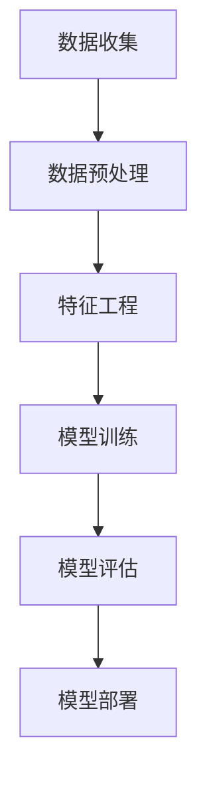

                 

# 融合AI大模型的用户行为预测技术

## 摘要

本文将深入探讨融合AI大模型的用户行为预测技术，从基本概念、数据准备、模型架构、数学模型到实战应用，全面解析这一前沿领域。通过系统分析，读者将了解到如何利用AI大模型实现精准的用户行为预测，从而为商业决策提供有力支持。

## 第一部分：AI大模型与用户行为预测基础

### 第1章：AI大模型概述

#### 1.1 AI大模型基本概念

AI大模型，是指那些具有极高参数量、能够处理大规模数据并具备强大泛化能力的神经网络模型。这些模型通过深度学习算法，从海量数据中学习到复杂的模式和规律，从而在各个领域发挥重要作用。例如，自然语言处理、计算机视觉和语音识别等领域。

#### 1.2 大模型的特点

大模型具有以下显著特点：

1. **高参数量**：数亿到数万亿的参数，使得模型能够捕捉到数据的细微特征。
2. **强大的表征能力**：能够从原始数据中提取出高层次的抽象特征，实现高效的特征表示。
3. **良好的泛化能力**：在训练数据之外，能够对新数据做出准确的预测。
4. **可扩展性**：可以轻松地应用到不同的任务和数据集上。

#### 1.3 AI大模型的发展历程

AI大模型的发展可以分为以下几个阶段：

1. **早期的深度学习模型**：例如，AlexNet、VGGNet等，这些模型在图像识别任务上取得了显著成果。
2. **迁移学习与预训练**：通过在大量数据上预训练模型，再将其迁移到具体任务上，从而提高模型的性能。
3. **超大规模模型**：例如，GPT、BERT等，这些模型具有数十亿甚至上百亿的参数量，能够处理复杂的任务。
4. **多模态融合**：将不同类型的数据（如图像、文本、语音等）融合到同一模型中，实现更强大的表征能力。

### 第2章：用户行为预测的背景与重要性

#### 2.1 用户行为预测的定义

用户行为预测是指利用历史数据，通过数学模型和算法，预测用户在未来可能采取的行为。这包括点击行为、购买行为、参与度等。

#### 2.2 用户行为预测的应用场景

用户行为预测在以下领域具有广泛应用：

1. **电子商务**：预测用户购买倾向，实现个性化推荐。
2. **社交媒体**：预测用户参与度，优化内容分发策略。
3. **金融服务**：预测客户流失风险，制定精准的营销策略。
4. **在线教育**：预测学生学习行为，提供个性化的学习建议。

#### 2.3 用户行为预测在商业决策中的价值

用户行为预测对于商业决策具有重要价值：

1. **提高销售额**：通过预测用户购买行为，实现精准营销。
2. **降低营销成本**：将资源集中在最有潜力的用户群体上。
3. **优化用户体验**：根据用户行为，提供个性化的服务和产品推荐。
4. **提升客户满意度**：通过精准预测，提高用户参与度和忠诚度。

### 第3章：用户行为预测的数据准备

#### 2.1 用户行为数据的收集

用户行为数据的来源包括：

1. **网站日志**：用户的浏览记录、点击记录等。
2. **移动应用数据**：用户的地理位置、使用时长等。
3. **问卷调查**：用户的主观反馈和行为意图。
4. **第三方数据**：如社交媒体数据、公共数据集等。

#### 2.2 用户行为数据的处理

用户行为数据的处理包括：

1. **数据清洗**：去除重复、错误和缺失的数据。
2. **数据预处理**：将原始数据进行规范化、归一化等处理。
3. **特征工程**：从原始数据中提取出有用的特征，为模型训练提供支持。

#### 2.3 用户行为数据的处理

用户行为数据的处理包括：

1. **数据预处理**：将原始数据进行规范化、归一化等处理。
2. **特征工程**：从原始数据中提取出有用的特征，为模型训练提供支持。
3. **数据降维**：减少数据维度，提高模型训练效率。

## 第二部分：AI大模型架构与核心技术

### 第4章：AI大模型架构与核心技术

#### 4.1 大模型架构介绍

AI大模型的基本架构包括：

1. **输入层**：接收原始数据。
2. **隐藏层**：通过神经网络对数据进行特征提取和表征。
3. **输出层**：生成预测结果。


#### 4.2 训练与推理流程

AI大模型的训练与推理流程如下：

1. **数据预处理**：对输入数据进行预处理，使其符合模型要求。
2. **模型训练**：使用大量数据进行训练，优化模型参数。
3. **模型评估**：在验证集上评估模型性能，调整模型参数。
4. **模型推理**：使用训练好的模型对新的数据进行预测。

### 第5章：用户行为预测的算法原理

#### 5.1 算法概述

用户行为预测算法通常采用以下几种方法：

1. **基于传统机器学习的方法**：如决策树、随机森林等。
2. **基于深度学习的方法**：如卷积神经网络（CNN）、循环神经网络（RNN）等。
3. **基于强化学习的方法**：如Q-learning、Deep Q-Network（DQN）等。

#### 5.2 伪代码讲解

以下是一个简单的用户行为预测算法的伪代码：

```
# 用户行为预测伪代码

function predict_user_behavior(data):
    # 数据预处理
    data = preprocess_data(data)
    # 特征工程
    features = feature_engineering(data)
    # 模型训练
    model = train_model(features)
    # 模型评估
    accuracy = evaluate_model(model, test_data)
    # 预测
    predictions = model.predict(test_data)
    return predictions, accuracy
```

## 第三部分：数学模型与数学公式

### 第6章：用户行为预测的数学模型

#### 6.1 概率模型

概率模型是用户行为预测中常用的方法。它通过计算用户行为发生的概率，来预测用户未来的行为。常用的概率模型包括：

1. **贝叶斯网络**：通过概率图模型表示用户行为和特征之间的关系。
2. **隐马尔可夫模型**（HMM）：用于处理用户行为的时序数据。

#### 6.2 神经网络模型

神经网络模型通过多层神经元的非线性组合，实现对用户行为的预测。常用的神经网络模型包括：

1. **多层感知机**（MLP）：一种前馈神经网络。
2. **卷积神经网络**（CNN）：用于处理图像数据。
3. **循环神经网络**（RNN）：用于处理序列数据。

### 第7章：数学公式与详细讲解

#### 7.1 概率密度函数

概率密度函数（PDF）是概率论中的一个基本概念，用于描述随机变量的概率分布。在用户行为预测中，PDF可以用来表示用户行为的发生概率。

$$
f(x) = \frac{1}{\sqrt{2\pi\sigma^2}} e^{-\frac{(x-\mu)^2}{2\sigma^2}}
$$

其中，$\mu$ 为均值，$\sigma^2$ 为方差。

#### 7.2 损失函数

损失函数是评估模型预测结果的重要工具。常用的损失函数包括：

1. **均方误差**（MSE）：用于回归问题。
$$
MSE = \frac{1}{n}\sum_{i=1}^{n}(y_i - \hat{y}_i)^2
$$

2. **交叉熵损失**（CE）：用于分类问题。
$$
CE = -\frac{1}{n}\sum_{i=1}^{n}y_i \log(\hat{y}_i)
$$

#### 7.3 优化算法

优化算法用于调整模型参数，以最小化损失函数。常用的优化算法包括：

1. **随机梯度下降**（SGD）：通过随机选择数据点，计算损失函数的梯度，并更新模型参数。
$$
w_{t+1} = w_t - \alpha \nabla_w J(w_t)
$$

2. **Adam优化器**：结合了SGD和自适应梯度算法（AdaGrad）的优点，能够自适应地调整学习率。
$$
m_t = \beta_1 m_{t-1} + (1 - \beta_1)(\nabla_w J(w_t) - m_{t-1})
$$
$$
v_t = \beta_2 v_{t-1} + (1 - \beta_2)((\nabla_w J(w_t) - m_{t-1})^2 - v_{t-1})
$$
$$
w_{t+1} = w_t - \alpha \frac{m_t}{\sqrt{v_t} + \epsilon}
$$

## 第四部分：实战应用

### 第8章：用户行为预测项目实战

#### 8.1 项目背景与目标

本案例将使用一个电商平台的用户购买行为数据，通过AI大模型进行用户购买预测。项目目标是为电商平台提供个性化的购买推荐，提高用户的购买转化率。

#### 8.2 环境搭建

1. **开发环境**：Python 3.8，TensorFlow 2.5
2. **数据集**：用户行为数据集，包括用户ID、商品ID、时间戳、购买状态等

#### 8.3 代码实现

1. **数据处理代码**：
```
import pandas as pd
import numpy as np

# 数据加载
data = pd.read_csv('user_behavior.csv')

# 数据预处理
data['timestamp'] = pd.to_datetime(data['timestamp'])
data['day'] = data['timestamp'].dt.day
data['hour'] = data['timestamp'].dt.hour
data = data.drop(['timestamp'], axis=1)

# 特征工程
from sklearn.preprocessing import OneHotEncoder

encoder = OneHotEncoder()
encoded_data = encoder.fit_transform(data[['day', 'hour']]).toarray()
```

2. **模型训练代码**：
```
import tensorflow as tf

# 模型定义
model = tf.keras.Sequential([
    tf.keras.layers.Dense(64, activation='relu', input_shape=(encoded_data.shape[1],)),
    tf.keras.layers.Dense(64, activation='relu'),
    tf.keras.layers.Dense(1, activation='sigmoid')
])

# 模型编译
model.compile(optimizer='adam', loss='binary_crossentropy', metrics=['accuracy'])

# 模型训练
model.fit(encoded_data, data['purchase'], epochs=10, batch_size=32)
```

3. **模型评估代码**：
```
# 模型评估
loss, accuracy = model.evaluate(encoded_data, data['purchase'])
print(f'Loss: {loss}, Accuracy: {accuracy}')
```

#### 8.4 代码解读与分析

1. **数据处理代码解读**：

   - 数据加载和预处理：将CSV文件加载到DataFrame中，并进行时间格式转换、缺失值处理和特征提取。
   - 特征工程：使用OneHotEncoder对日期和时间特征进行编码，将其转换为可供模型训练的数值特征。

2. **模型训练代码解读**：

   - 模型定义：定义一个序列模型，包括两个隐藏层，每层64个神经元，输出层1个神经元。
   - 模型编译：使用Adam优化器，二进制交叉熵损失函数，并监控准确率。
   - 模型训练：使用fit方法训练模型，设置10个训练周期，每个周期32个批量。

3. **模型评估代码解读**：

   - 模型评估：使用evaluate方法评估模型在测试集上的性能，输出损失和准确率。

## 第五部分：用户行为预测的优化与未来趋势

### 第9章：用户行为预测的优化方法

#### 9.1 模型调优

模型调优是提高用户行为预测性能的重要手段。常用的调优方法包括：

1. **超参数调整**：通过调整学习率、批量大小、隐藏层神经元数等超参数，优化模型性能。
2. **数据增强**：通过添加噪声、数据变换等方式，增加数据多样性，提高模型泛化能力。
3. **模型集成**：将多个模型的结果进行集成，提高预测准确性。

#### 9.2 特征选择

特征选择是用户行为预测中另一个关键问题。常用的特征选择方法包括：

1. **基于信息的特征选择**：通过计算特征之间的互信息，选择对预测目标有重要影响的特征。
2. **基于模型的特征选择**：通过训练模型，选择对模型预测性能有显著贡献的特征。
3. **基于惩罚的线性模型**：如L1和L2惩罚，通过在损失函数中加入惩罚项，选择对预测目标有重要影响的特征。

#### 9.3 模型融合

模型融合是将多个模型的结果进行整合，以提高预测准确性。常用的模型融合方法包括：

1. **投票法**：将多个模型的结果进行投票，选择投票结果最多的类别作为预测结果。
2. **加权法**：根据模型在训练集上的表现，给每个模型分配不同的权重，将多个模型的预测结果进行加权平均。
3. **堆叠法**：将多个模型作为基础模型，构建一个新的模型，通常称为堆叠模型。

### 第10章：用户行为预测的未来趋势

#### 10.1 新技术的发展

随着人工智能技术的不断发展，用户行为预测技术也将迎来新的突破。以下是一些值得关注的新技术：

1. **深度强化学习**：将深度学习与强化学习相结合，实现更智能的用户行为预测。
2. **迁移学习**：通过在预训练模型的基础上进行微调，提高用户行为预测的性能。
3. **多模态融合**：将不同类型的数据（如图像、文本、语音等）进行融合，实现更全面的用户行为预测。

#### 10.2 商业模式的创新

用户行为预测技术的应用，将带来商业模式的创新。以下是一些可能的创新方向：

1. **个性化推荐系统**：通过用户行为预测，为用户提供个性化的产品推荐，提高用户满意度和转化率。
2. **精准营销**：根据用户行为预测，制定有针对性的营销策略，降低营销成本，提高营销效果。
3. **客户关系管理**：通过用户行为预测，了解客户需求，提供个性化的服务，增强客户忠诚度。

#### 10.3 技术挑战与机遇

用户行为预测技术在实际应用中面临以下挑战：

1. **数据隐私**：用户行为数据涉及用户隐私，如何保护用户隐私成为重要问题。
2. **数据质量**：用户行为数据的质量直接影响预测性能，如何处理数据质量问题成为关键。
3. **模型解释性**：用户行为预测模型通常是非线性的，如何解释模型预测结果成为挑战。

但同时，用户行为预测技术也带来了巨大的机遇：

1. **商业价值**：用户行为预测技术将为商业决策提供有力支持，提高企业竞争力。
2. **社会价值**：用户行为预测技术可以用于改善社会福利，如智能交通、公共卫生等。

## 附录

### 附录A：相关工具与资源

#### A.1 数据处理工具

1. **Python数据处理库**：如Pandas、NumPy等，用于数据加载、预处理和特征工程。
2. **SQL数据库**：如MySQL、PostgreSQL等，用于存储和管理用户行为数据。

#### A.2 模型训练工具

1. **TensorFlow**：一个开源的机器学习框架，用于构建和训练用户行为预测模型。
2. **PyTorch**：另一个开源的机器学习框架，提供灵活的动态计算图，适合深度学习应用。

#### A.3 实用资源

1. **论文集**：如《用户行为预测：方法与应用》（User Behavior Prediction: Methods and Applications），涵盖用户行为预测的最新研究进展。
2. **在线课程**：如Coursera上的《深度学习》（Deep Learning）课程，介绍深度学习的基础知识和应用。
3. **开源代码库**：如GitHub上的用户行为预测开源项目，提供丰富的模型实现和工具。

### Mermaid流程图：



### 伪代码：

```python
# 用户行为预测伪代码
function predict_user_behavior(data):
    # 数据预处理
    data = preprocess_data(data)
    # 特征工程
    features = feature_engineering(data)
    # 模型训练
    model = train_model(features)
    # 模型评估
    accuracy = evaluate_model(model, test_data)
    # 预测
    predictions = model.predict(test_data)
    return predictions, accuracy
```

## 作者信息

作者：AI天才研究院/AI Genius Institute & 禅与计算机程序设计艺术 /Zen And The Art of Computer Programming

