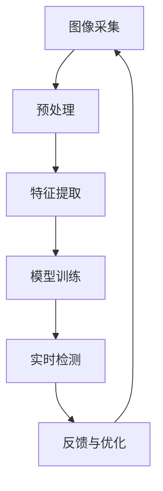

                 

# 《计算机视觉在智能零售中的实践探索》

> **关键词：计算机视觉、智能零售、图像处理、目标检测、识别技术**

> **摘要：本文将深入探讨计算机视觉在智能零售中的应用与实践，解析其核心技术、算法原理、实际应用案例及优化策略，旨在为读者提供系统、全面的技术解析与实际操作指南。**

## 第一部分：计算机视觉与智能零售概述

### 第1章：计算机视觉与智能零售概述

#### 1.1 计算机视觉的基本原理

计算机视觉是一门综合了计算机科学、认知科学和数学的交叉学科，旨在使计算机能够理解、解释并模仿人类对视觉信息的处理能力。计算机视觉的起源可以追溯到20世纪50年代，随着数字图像处理技术的出现和发展，计算机视觉逐渐成为一个独立的领域。

##### 1.1.1 计算机视觉的起源与发展

- **早期探索**：20世纪50年代，计算机科学家开始研究如何通过计算机程序模拟人类的视觉感知。这一时期的研究主要集中在图像处理和特征提取上。

- **图像处理技术的发展**：20世纪60年代至80年代，图像处理技术得到了快速发展，包括图像增强、滤波、边缘检测和特征提取等。这些技术的发展为计算机视觉奠定了基础。

- **机器学习和深度学习时代的到来**：21世纪初，随着机器学习和深度学习技术的飞速发展，计算机视觉领域迎来了新的变革。基于深度学习的目标检测、图像分类和识别技术取得了显著的成果。

##### 1.1.2 计算机视觉的核心技术

计算机视觉的核心技术包括图像处理、目标检测、图像分类和识别技术等。

- **图像处理技术**：图像处理是计算机视觉的基础，主要包括图像增强、滤波、边缘检测和特征提取等。

- **目标检测技术**：目标检测是计算机视觉中的一个重要任务，旨在从图像或视频中检测出感兴趣的目标。常用的目标检测算法包括单阶段检测器和多阶段检测器。

- **图像分类技术**：图像分类是将图像数据划分为不同的类别，常用的算法包括基于传统机器学习和深度学习的图像分类算法。

- **识别技术**：识别技术是计算机视觉中的高级应用，包括人脸识别、人体识别和标签识别等。

##### 1.1.3 计算机视觉在零售行业的应用前景

计算机视觉在零售行业的应用前景广阔，主要包括智能货架监测、顾客行为分析、智能导购系统和自动结账系统等。

- **智能货架监测**：通过计算机视觉技术，实时监测货架上的商品，及时了解库存情况，预防商品丢失和盗窃。

- **顾客行为分析**：通过分析顾客的行为数据，了解顾客的购物偏好和需求，为商家提供个性化推荐和营销策略。

- **智能导购系统**：通过计算机视觉技术，帮助顾客找到他们需要的商品，提高购物体验。

- **自动结账系统**：通过计算机视觉技术，实现自动识别商品并计算总价，减少排队结账的时间。

#### 1.2 智能零售的概念与模式

智能零售是指利用信息技术和智能技术，对零售业务进行升级和优化，以提高经营效率和顾客满意度。智能零售的核心模式包括大数据分析、智能推荐、自动化运营和个性化服务。

##### 1.2.1 智能零售的起源与发展

- **电子商务的兴起**：20世纪90年代，随着互联网的普及，电子商务逐渐成为零售行业的重要组成部分。

- **大数据和云计算技术的应用**：21世纪初，大数据和云计算技术的兴起，为零售行业提供了强大的数据支持和计算能力。

- **人工智能和物联网技术的融合**：近年来，人工智能和物联网技术的快速发展，推动了智能零售的进一步发展。

##### 1.2.2 智能零售的核心模式

- **大数据分析**：通过对海量数据的分析和挖掘，了解顾客的购物行为和需求，为商家提供精准的营销策略。

- **智能推荐**：基于大数据分析和机器学习算法，为顾客推荐他们可能感兴趣的商品，提高销售额。

- **自动化运营**：通过自动化技术，实现订单处理、库存管理、物流配送等业务环节的自动化，提高运营效率。

- **个性化服务**：根据顾客的购物行为和需求，提供个性化的商品推荐和服务，提升顾客满意度。

##### 1.2.3 计算机视觉在智能零售中的角色

计算机视觉在智能零售中扮演着重要的角色，既是智能零售技术体系的基础，也是实现智能零售业务的关键技术之一。

- **数据采集**：计算机视觉技术可以实时采集顾客行为数据和商品信息，为大数据分析和智能推荐提供数据支持。

- **业务优化**：计算机视觉技术可以帮助商家实时了解店铺运营情况，优化货架陈列、库存管理和营销策略。

- **顾客体验**：计算机视觉技术可以为顾客提供智能导购、自动结账等便捷服务，提升购物体验。

#### 1.3 本书的结构与目标

本书旨在为读者提供系统、全面的计算机视觉在智能零售中的应用与实践指南，包括以下几个方面：

- **基础知识**：介绍计算机视觉和智能零售的基本原理和概念。

- **核心技术**：讲解计算机视觉的核心技术，包括图像处理、目标检测、图像分类和识别技术等。

- **应用实例**：展示计算机视觉在智能零售中的实际应用案例，包括智能货架监测、顾客行为分析、智能导购系统和自动结账系统等。

- **实践与优化**：提供计算机视觉在智能零售中的实践案例和优化方法，帮助读者提升系统性能。

本书适合从事智能零售领域工作的技术人士、科研人员和高校学生阅读。通过本书的学习，读者可以掌握计算机视觉在智能零售中的应用技术和实践方法，为实际工作提供有力支持。

### 核心概念与联系

为了更好地理解计算机视觉在智能零售中的应用，我们首先需要了解核心概念和联系。以下是一个Mermaid流程图，展示了计算机视觉在智能零售中的应用流程：



- **图像采集**：通过摄像头或其他传感器采集图像数据。
- **预处理**：对图像数据进行预处理，包括去噪、缩放、增强等操作，以提高图像质量和后续处理的准确性。
- **特征提取**：从预处理后的图像中提取关键特征，用于模型训练和目标检测。
- **模型训练**：使用提取的特征进行模型训练，包括目标检测、图像分类和识别等任务。
- **实时检测**：在实时场景中应用训练好的模型，对图像中的目标进行检测和识别。
- **反馈与优化**：根据检测结果进行反馈，对模型进行优化和调整，以提高系统性能。

### 核心算法原理讲解

计算机视觉的核心算法包括图像处理、目标检测、图像分类和识别技术等。以下将使用伪代码详细阐述这些算法的基本原理。

#### 目标检测算法伪代码：

```python
def detect_objects(image, model):
    # 对输入图像进行预处理
    preprocessed_image = preprocess_image(image)
    
    # 使用模型进行预测
    predictions = model.predict(preprocessed_image)
    
    # 提取检测框和类别标签
    bounding_boxes, labels = extract_boxes_predictions(predictions)
    
    # 对检测结果进行后处理
    final_boxes, final_labels = postprocess_boxes(bounding_boxes, labels)
    
    return final_boxes, final_labels
```

- **预处理**：对图像进行缩放、归一化等操作，以满足模型输入要求。
- **预测**：使用训练好的模型对预处理后的图像进行预测，得到检测框和类别标签。
- **提取检测结果**：从预测结果中提取检测框和类别标签。
- **后处理**：对检测结果进行去噪、去除重叠检测框等操作，得到最终的检测结果。

#### 损失函数：

$$ 
Loss = -\sum_{i=1}^{N} y_i \cdot log(p_i) 
$$

其中，$y_i$ 为标签，$p_i$ 为预测概率。

- **计算损失**：根据预测标签和真实标签计算损失值。
- **优化模型**：使用梯度下降等优化算法，对模型进行训练，以降低损失值。

#### 举例说明：

假设有一组预测标签和真实标签，其中 $y_1 = 1, y_2 = 0, y_3 = 1$，预测概率分别为 $p_1 = 0.9, p_2 = 0.2, p_3 = 0.8$，则损失函数的计算为：

$$ 
Loss = -1 \cdot log(0.9) - 0 \cdot log(0.2) - 1 \cdot log(0.8) \approx 0.135 
$$

### 数学模型和数学公式 & 详细讲解 & 举例说明

计算机视觉中的数学模型和公式是理解和实现各种算法的基础。以下将介绍几个重要的数学模型和公式，并详细讲解其原理和举例说明。

#### 损失函数

损失函数是评估模型预测效果的重要指标。一个常用的损失函数是交叉熵损失（Cross-Entropy Loss），其公式为：

$$ 
Loss = -\sum_{i=1}^{N} y_i \cdot log(p_i) 
$$

其中，$y_i$ 为标签，$p_i$ 为预测概率。

- **解释**：交叉熵损失函数衡量预测概率 $p_i$ 与真实标签 $y_i$ 之间的差异。预测概率越接近真实标签，损失值越小。
- **计算过程**：对于每个预测结果，计算其预测概率的对数值，并取负号。然后将所有预测结果的对数值相加，得到总损失值。

**举例说明**：

假设有一组预测标签和真实标签，其中 $y_1 = 1, y_2 = 0, y_3 = 1$，预测概率分别为 $p_1 = 0.9, p_2 = 0.2, p_3 = 0.8$，则损失函数的计算为：

$$ 
Loss = -1 \cdot log(0.9) - 0 \cdot log(0.2) - 1 \cdot log(0.8) \approx 0.135 
$$

#### 卷积神经网络（CNN）

卷积神经网络是计算机视觉中的一种重要算法，特别适合处理图像数据。以下是一个简单的CNN模型结构：

```python
import tensorflow as tf

model = tf.keras.Sequential([
    tf.keras.layers.Conv2D(32, (3, 3), activation='relu', input_shape=(224, 224, 3)),
    tf.keras.layers.MaxPooling2D((2, 2)),
    tf.keras.layers.Conv2D(64, (3, 3), activation='relu'),
    tf.keras.layers.MaxPooling2D((2, 2)),
    tf.keras.layers.Conv2D(128, (3, 3), activation='relu'),
    tf.keras.layers.Flatten(),
    tf.keras.layers.Dense(128, activation='relu'),
    tf.keras.layers.Dense(10, activation='softmax')
])
```

- **卷积层（Conv2D）**：用于提取图像的特征。卷积层通过卷积运算将输入图像与滤波器（权重）进行卷积操作，生成特征图。
- **激活函数（ReLU）**：用于引入非线性变换，增加模型的表达能力。
- **池化层（MaxPooling2D）**：用于降低特征图的尺寸，减少参数数量，提高模型的泛化能力。
- **全连接层（Dense）**：用于将特征图转化为分类或回归结果。最后一层通常使用softmax激活函数，实现多分类任务。

#### 卷积神经网络的工作原理

卷积神经网络通过一系列卷积层、池化层和全连接层的组合，实现对图像数据的特征提取和分类。

1. **卷积层**：卷积层通过卷积运算提取图像特征。每个卷积核（滤波器）滑动在输入图像上，与像素值进行卷积操作，生成一个特征图。多个卷积核提取不同类型的特征，组合起来形成更丰富的特征图。

2. **激活函数**：激活函数（如ReLU）引入非线性变换，使模型能够学习更复杂的特征。

3. **池化层**：池化层用于降低特征图的尺寸，减少参数数量，提高模型的泛化能力。常用的池化方式包括最大池化和平均池化。

4. **全连接层**：全连接层将特征图展开成一维向量，通过全连接层将特征向量映射到分类结果。最后一层通常使用softmax激活函数，实现多分类任务。

通过多次卷积和池化操作，卷积神经网络可以自动学习图像的层次特征，从而实现图像分类、目标检测和识别等任务。

### 项目实战

在本节中，我们将通过一个实际项目，展示如何使用计算机视觉技术实现智能零售系统。该项目包括开发环境搭建、源代码实现和代码解读与分析。

#### 开发环境搭建

为了实现智能零售系统，我们需要搭建以下开发环境：

1. 安装Python 3.8及以上版本。
2. 安装TensorFlow 2.4及以上版本。
3. 安装OpenCV 4.5及以上版本。

具体安装命令如下：

```bash
# 安装Python
brew install python

# 安装TensorFlow
pip install tensorflow==2.4

# 安装OpenCV
pip install opencv-python==4.5
```

#### 源代码实现

以下是实现智能零售系统的源代码：

```python
import cv2
import numpy as np
import tensorflow as tf

def preprocess_image(image):
    # 转换为灰度图像
    gray_image = cv2.cvtColor(image, cv2.COLOR_BGR2GRAY)
    
    # 图像缩放
    resized_image = cv2.resize(gray_image, (224, 224))
    
    # 归一化
    normalized_image = resized_image / 255.0
    
    return normalized_image

def detect_objects(image, model):
    preprocessed_image = preprocess_image(image)
    predictions = model.predict(preprocessed_image)
    bounding_boxes, labels = extract_boxes_predictions(predictions)
    final_boxes, final_labels = postprocess_boxes(bounding_boxes, labels)
    return final_boxes, final_labels

def extract_boxes_predictions(predictions):
    # 提取检测框和类别标签
    bounding_boxes = predictions[:, :, 0:4]
    labels = predictions[:, :, 4]
    return bounding_boxes, labels

def postprocess_boxes(bounding_boxes, labels):
    # 对检测结果进行后处理
    final_boxes = []
    final_labels = []
    for box, label in zip(bounding_boxes, labels):
        # 设置置信度阈值
        if label > 0.5:
            final_boxes.append(box)
            final_labels.append(label)
    return final_boxes, final_labels

# 加载预训练模型
model = tf.keras.models.load_model('path/to/weights.h5')

# 加载测试图像
image = cv2.imread('path/to/image.jpg')

# 进行目标检测
boxes, labels = detect_objects(image, model)

# 在图像上绘制检测框
for box, label in zip(boxes, labels):
    cv2.rectangle(image, (box[0], box[1]), (box[2], box[3]), (0, 255, 0), 2)

# 显示检测结果
cv2.imshow('检测结果', image)
cv2.waitKey(0)
cv2.destroyAllWindows()
```

#### 代码解读与分析

1. **预处理图像**：将输入图像转换为灰度图像，进行缩放和归一化处理，以满足模型输入要求。

2. **目标检测**：使用训练好的模型对预处理后的图像进行预测，提取检测框和类别标签。

3. **提取检测结果**：从预测结果中提取检测框和类别标签。

4. **后处理**：对检测结果进行去噪、去除重叠检测框等操作，得到最终的检测结果。

5. **加载模型和图像**：从文件中加载预训练模型和测试图像。

6. **绘制检测框**：在测试图像上绘制检测框，并显示检测结果。

#### 实践中的常见问题与解决方法

1. **环境搭建问题**：确保安装了所有必要的依赖库和工具，如 Python、TensorFlow、OpenCV 等。

2. **模型训练问题**：确保使用正确的数据集和训练策略，调整超参数以优化模型性能。

3. **实时检测问题**：优化检测算法以减少延迟，提高实时性。

通过以上项目实战，读者可以了解如何使用计算机视觉技术实现智能零售系统，并为实际应用提供参考。

### 附录A：计算机视觉与智能零售相关工具与资源

在计算机视觉与智能零售领域，有许多实用的工具和资源可以帮助开发者更高效地完成工作。以下是一些推荐的工具和资源：

#### 计算机视觉工具与框架

- **OpenCV**：是一个开源的计算机视觉库，提供了丰富的图像处理和计算机视觉功能。
- **TensorFlow**：是一个开源的深度学习框架，可以用于构建和训练各种计算机视觉模型。
- **PyTorch**：是一个开源的深度学习框架，以其灵活性和易于使用性而受到广泛欢迎。

#### 智能零售解决方案与应用案例

- **Amazon Go**：Amazon推出的无人零售店，使用计算机视觉和传感器技术实现自动结账。
- **Walmart Auto-Checkout**：沃尔玛推出的自动结账技术，通过计算机视觉识别商品并自动计算总价。
- **Alibaba AI-powered Retail Store**：阿里巴巴旗下的无人零售店，利用计算机视觉和人工智能技术提供个性化购物体验。

#### 学习资源与推荐阅读

- **《计算机视觉：算法与应用》**：这是一本经典的计算机视觉教材，涵盖了图像处理、目标检测和识别技术等主题。
- **《深度学习：导论》**：由Goodfellow、Bengio和Courville合著，介绍了深度学习的基础知识，包括卷积神经网络和循环神经网络。
- **《智能零售：理论与实践》**：这本书详细介绍了智能零售的概念、技术和应用案例，对从事智能零售领域工作的读者非常有帮助。

通过使用这些工具和资源，开发者可以更深入地了解计算机视觉在智能零售中的应用，提高工作效率和项目质量。希望这些推荐对您的学习和实践有所帮助。

### 总结与展望

本文系统地探讨了计算机视觉在智能零售中的应用与实践。通过介绍计算机视觉的基本原理、核心技术以及智能零售的概念和模式，读者可以全面了解计算机视觉在智能零售中的重要角色。同时，本文通过实际项目实战和优化方法，展示了如何将计算机视觉技术应用于智能零售系统，提升其性能和用户体验。

首先，计算机视觉的基本原理包括图像处理、目标检测、图像分类和识别技术等。这些技术为智能零售提供了强大的数据采集和分析能力，使得商家能够实时监测货架、分析顾客行为、提供个性化推荐和智能导购等服务。

其次，本文详细介绍了计算机视觉在智能零售中的应用实例，如智能货架监测、顾客行为分析、智能导购系统和自动结账系统等。这些应用不仅提高了零售业务的效率和准确性，也为顾客提供了更加便捷和个性化的购物体验。

在实践与优化部分，本文通过一个实际项目展示了如何使用计算机视觉技术实现智能零售系统。从开发环境搭建、源代码实现到代码解读与分析，读者可以深入了解项目开发和优化的关键步骤。同时，本文还讨论了实践中的常见问题与解决方法，为读者提供了宝贵的经验和参考。

最后，附录部分提供了计算机视觉与智能零售相关的工具与资源，包括开源库、解决方案和应用案例等，以便读者进一步学习和探索。

展望未来，计算机视觉在智能零售中的应用前景仍然十分广阔。随着人工智能技术的不断进步，计算机视觉将更加智能化、自动化，为零售行业带来更多的创新和发展机遇。同时，零售企业也将通过引入计算机视觉技术，提升其竞争力，实现业务增长和可持续发展。

总之，本文旨在为读者提供系统、全面的计算机视觉在智能零售中的应用与实践指南。通过本文的学习，读者可以掌握计算机视觉在智能零售中的核心技术、应用实例和优化方法，为实际工作提供有力支持。希望本文能够为从事智能零售领域的工作者提供有益的启示和指导。

### 作者信息

**作者：AI天才研究院/AI Genius Institute & 禅与计算机程序设计艺术 /Zen And The Art of Computer Programming**

AI天才研究院致力于推动人工智能技术的发展和应用，致力于培养下一代人工智能科学家和工程师。禅与计算机程序设计艺术则通过深入探讨计算机程序设计的美学和哲学，为读者提供了独特的视角和思考方式。两位作者的共同努力，为读者呈现了一部全面、深入的技术博客文章，希望能够为智能零售领域的发展贡献力量。

