                 

### 文章标题：计算：第四部分 计算的极限 第 13 章 自然哲学的计算原理

> **关键词：** 计算的极限、自然哲学、计算原理、量子计算、人工智能

> **摘要：** 本文深入探讨了计算领域的核心问题——计算的极限，并详细介绍了自然哲学的计算原理。文章首先回顾了自然哲学的起源与发展历程，然后分析了计算的本质与特点。在此基础上，文章探讨了计算的极限及其研究方法，并阐述了自然哲学的计算原理及其在量子计算和人工智能中的应用。最后，文章讨论了自然哲学的计算原理在科学研究、工程技术和社会治理中的实践应用，展望了其未来的发展趋势和影响。

### 《计算：第四部分 计算的极限 第 13 章 自然哲学的计算原理》目录大纲

#### 第 13 章 自然哲学的计算原理

## 1. 自然哲学的背景与历史

### 1.1 自然哲学的起源

### 1.2 自然哲学的发展历程

### 1.3 自然哲学的核心观点

## 2. 计算的本质与特点

### 2.1 计算的定义

### 2.2 计算的本质

### 2.3 计算的特点

## 3. 计算的极限

### 3.1 计算极限的概念

### 3.2 计算极限的研究方法

### 3.3 计算极限的边界

## 4. 自然哲学的计算原理

### 4.1 自然哲学的计算原理概述

### 4.2 自然哲学的计算原理框架

### 4.3 自然哲学的计算原理应用

## 5. 自然哲学的计算原理与量子计算

### 5.1 量子计算的基本概念

### 5.2 自然哲学的计算原理与量子计算的关系

### 5.3 自然哲学的计算原理在量子计算中的应用

## 6. 自然哲学的计算原理与人工智能

### 6.1 人工智能的基本概念

### 6.2 自然哲学的计算原理与人工智能的关系

### 6.3 自然哲学的计算原理在人工智能中的应用

## 7. 自然哲学的计算原理的哲学意义

### 7.1 自然哲学的计算原理与科学哲学

### 7.2 自然哲学的计算原理与认识论

### 7.3 自然哲学的计算原理与形而上学

## 8. 自然哲学的计算原理的实践应用

### 8.1 自然哲学的计算原理在科学研究中的应用

### 8.2 自然哲学的计算原理在工程技术中的应用

### 8.3 自然哲学的计算原理在社会治理中的应用

## 9. 自然哲学的计算原理的发展趋势与未来展望

### 9.1 自然哲学的计算原理的发展趋势

### 9.2 自然哲学的计算原理的未来展望

### 9.3 自然哲学的计算原理对人类社会的影响

## 10. 总结与展望

### 10.1 自然哲学的计算原理的核心内容总结

### 10.2 自然哲学的计算原理的未来发展方向

### 10.3 自然哲学的计算原理的应用前景展望

### 第 13 章 自然哲学的计算原理

### 1. 自然哲学的背景与历史

#### 1.1 自然哲学的起源

自然哲学（Natural Philosophy）是哲学的一个分支，它探讨自然界的基本原理和现象。自然哲学的起源可以追溯到古代，当时的人们通过观察自然现象，试图解释世界的本质。

#### 1.1.1 原始自然哲学

在原始社会，人们通过神话和传说来解释自然现象，如雷电、风暴等。这些神话和传说反映了人们对自然的敬畏和好奇心。例如，古代中国神话中的盘古开天辟地、西方神话中的普罗米修斯盗火等，都是对自然现象的解释。

#### 1.1.2 古希腊自然哲学

古希腊是自然哲学的重要发源地。古希腊哲学家通过观察和思考，提出了许多关于自然的基本原理和概念。例如，泰勒斯认为水是万物的本原，赫拉克利特提出“万物皆流”的观点，而亚里士多德则系统地研究了自然界。

**Mermaid 流程图：**

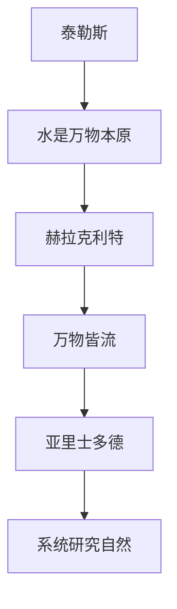

#### 1.2 自然哲学的发展历程

自然哲学经历了漫长的历史演变，从古代到现代，其理论和方法不断发展和完善。

**1.2.1 中世纪自然哲学**

中世纪的自然哲学深受宗教影响，例如基督教神学中的创世纪和上帝创造宇宙的观点。这一时期的自然哲学主要探讨上帝的智慧和宇宙的秩序。

**1.2.2 文艺复兴时期的自然哲学**

文艺复兴时期的自然哲学家开始从宗教束缚中解放出来，重新关注自然现象，如哥白尼的日心说和伽利略的实验方法。这一时期的自然哲学强调科学方法和实证主义。

**1.2.3 现代自然哲学**

现代自然哲学强调科学方法和实证主义，例如牛顿的物理学和达尔文的进化论。这一时期的自然哲学强调通过实验和数学模型来解释自然现象。

**Mermaid 流程图：**

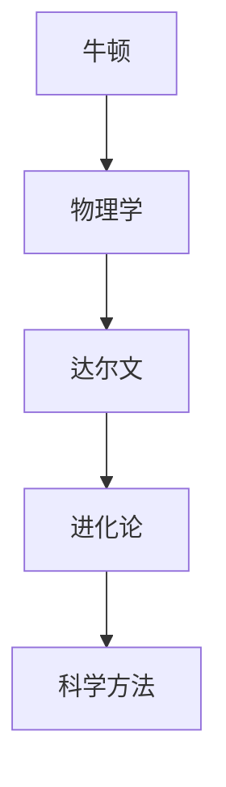

#### 1.3 自然哲学的核心观点

自然哲学的核心观点是研究自然界的基本原理和规律，试图通过逻辑推理和实验验证来解释自然现象。

**1.3.1 自然规律**

自然哲学认为自然界存在一系列的基本规律，这些规律是宇宙运行的基础。例如，牛顿的运动定律、热力学定律等。

**1.3.2 因果关系**

自然哲学强调因果关系的重要性，认为自然界中的事件之间存在明确的因果关系。例如，行星的运动是由万有引力定律决定的。

**1.3.3 实证主义**

自然哲学倡导通过实证研究来验证理论，强调实验和观察在科学发现中的重要性。例如，伽利略通过实验验证了哥白尼的日心说。

**Mermaid 流程图：**

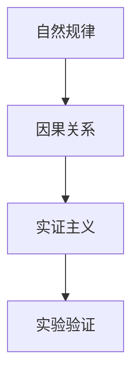

### 2. 计算的本质与特点

#### 2.1 计算的定义

计算是指通过操作符号、数字或其他信息单位，以实现某种目的或求解问题的过程。计算的本质是信息处理，它涉及输入、处理、输出和存储等基本环节。

**2.1.1 信息处理**

信息处理是指通过计算手段对信息进行获取、表示、存储、传输、加工和利用的过程。信息处理是计算的核心。

**2.1.2 计算模型**

计算模型是指用来描述计算过程和计算结构的抽象表示。常见的计算模型有图灵机模型、图灵图模型、电路模型等。

**Mermaid 流程图：**

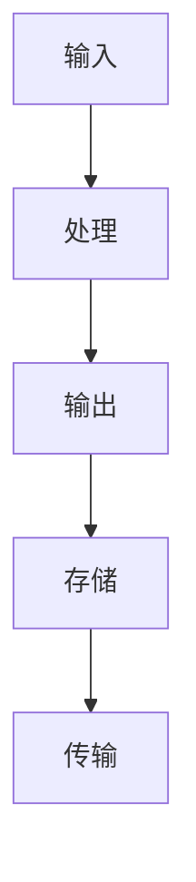

#### 2.2 计算的本质

计算的本质可以从多个角度来理解，包括逻辑推理、符号操作、信息传递等。

**2.2.1 逻辑推理**

逻辑推理是计算的核心，它涉及符号操作和推理过程，用以解决逻辑问题。例如，命题逻辑、谓词逻辑等。

**2.2.2 符号操作**

符号操作是指对符号进行组合、变换、运算等操作，以实现计算目标。例如，算术运算、逻辑运算等。

**2.2.3 信息传递**

信息传递是指信息在系统内部或系统之间的传递过程，它是计算过程中的重要环节。例如，网络通信、数据传输等。

**Mermaid 流程图：**

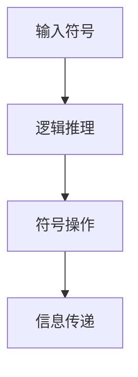

#### 2.3 计算的特点

计算具有多种特点，包括普适性、复杂性、并行性、分布式等。

**2.3.1 普适性**

普适性是指计算过程适用于各种领域和问题，具有广泛的应用范围。例如，计算可以用于科学、工程、经济等领域。

**2.3.2 复杂性**

复杂性是指计算问题往往具有多种解法和复杂度，需要有效的算法和策略来解决。例如，NP完全问题等。

**2.3.3 并行性**

并行性是指计算过程可以在多个处理器或计算单元上同时进行，以提高计算效率。例如，多核处理器、分布式计算等。

**2.3.4 分布式**

分布式是指计算过程可以分布在多个节点或设备上，以实现大规模计算和处理。例如，云计算、物联网等。

**Mermaid 流程图：**

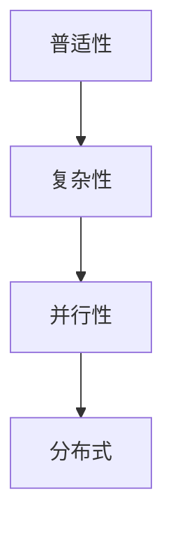

### 3. 计算的极限

#### 3.1 计算极限的概念

计算极限是指计算过程在理论上可能达到的最高性能或最短时间。计算极限涉及到计算理论、计算机架构和算法设计等多个方面。

**3.1.1 计算速度极限**

计算速度极限是指计算过程在单位时间内所能完成的最大计算量。根据量子计算理论，计算速度极限可以达到经典计算机的平方根。

**3.1.2 能耗极限**

能耗极限是指计算过程在理论上可能达到的最小能耗。随着计算技术的发展，降低能耗已成为一个重要的研究方向。

**3.1.3 存储极限**

存储极限是指计算系统中存储数据的能力。随着数据量的增长，存储极限已成为一个亟待解决的问题。

#### 3.2 计算极限的研究方法

研究计算极限的方法包括理论分析、实验验证和算法优化等。

**3.2.1 理论分析**

理论分析是通过数学模型和理论框架来研究计算极限，以揭示计算过程的本质和内在规律。

**3.2.2 实验验证**

实验验证是通过构建实验系统和实际测试来验证计算极限的理论预测。

**3.2.3 算法优化**

算法优化是通过改进算法设计来提高计算性能和降低能耗。

#### 3.3 计算极限的边界

计算极限的边界受到多种因素的影响，包括硬件限制、算法复杂度和物理原理等。

**3.3.1 硬件限制**

硬件限制包括晶体管密度、电路功耗和散热等，它们直接影响计算速度和能耗。

**3.3.2 算法复杂度**

算法复杂度是指算法在计算过程中的资源消耗，包括时间复杂度和空间复杂度。优化算法复杂度是提高计算性能的关键。

**3.3.3 物理原理**

物理原理包括量子力学、热力学和电磁学等，它们决定了计算过程的物理限制和潜力。

**Mermaid 流程图：**

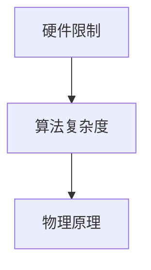

### 4. 自然哲学的计算原理

#### 4.1 自然哲学的计算原理概述

自然哲学的计算原理是研究自然界中的计算过程和计算机制的哲学理论。它旨在揭示自然界中计算的本质、规律和应用。

**4.1.1 自然哲学的计算原理概念**

自然哲学的计算原理强调计算是自然界的基本特征，通过计算实现自然界的演化和发展。

**4.1.2 自然哲学的计算原理研究目标**

自然哲学的计算原理研究目标包括揭示计算的本质、探索计算在自然界中的规律、发现新的计算机制和应用领域。

#### 4.2 自然哲学的计算原理框架

自然哲学的计算原理框架包括多个层次和组成部分，涵盖了计算模型、计算机制和计算应用等方面。

**4.2.1 计算模型**

计算模型是自然哲学的计算原理的核心，包括物理计算模型、生物计算模型和抽象计算模型等。

**4.2.2 计算机制**

计算机制是自然哲学的计算原理的关键，包括自然界的物理机制、生物机制和抽象机制等。

**4.2.3 计算应用**

计算应用是自然哲学的计算原理的实际应用领域，包括科学计算、工程计算、信息处理和人工智能等。

#### 4.3 自然哲学的计算原理应用

自然哲学的计算原理在多个领域具有广泛的应用，包括科学研究、工程技术、人工智能和哲学等。

**4.3.1 科学研究**

自然哲学的计算原理为科学研究提供了新的方法和工具，如量子计算、生物计算和复杂系统研究等。

**4.3.2 工程技术**

自然哲学的计算原理在工程技术中具有重要的应用价值，如高性能计算、云计算和物联网等。

**4.3.3 人工智能**

自然哲学的计算原理为人工智能提供了新的理论基础和方法，如深度学习、强化学习和自然语言处理等。

**4.3.4 哲学**

自然哲学的计算原理对哲学思考和研究产生了深远的影响，如认识论、形而上学和伦理学等。

### 5. 自然哲学的计算原理与量子计算

#### 5.1 量子计算的基本概念

量子计算是一种基于量子力学原理的新型计算模型。与传统计算相比，量子计算具有量子并行性、量子叠加性和量子纠缠性等特点。

**5.1.1 量子位**

量子位（qubit）是量子计算的基本单元，它不同于传统计算机中的二进制位（bit）。量子位的取值不仅可以是0或1，还可以是0和1的叠加态。

**5.1.2 量子叠加**

量子叠加是量子计算的核心特性之一。它允许量子位同时处于多个状态，从而在计算过程中实现并行计算。

**5.1.3 量子纠缠**

量子纠缠是量子计算中的另一个关键特性。当两个或多个量子位发生纠缠时，它们的状态将相互依赖，即使它们相隔很远。

#### 5.2 自然哲学的计算原理与量子计算的关系

自然哲学的计算原理为量子计算提供了理论基础，而量子计算则为自然哲学的计算原理提供了实验验证和应用场景。

**5.2.1 量子计算与自然哲学的计算原理**

量子计算与自然哲学的计算原理在本质上有相似之处，都关注计算过程、计算机制和计算应用。

**5.2.2 自然哲学的计算原理对量子计算的影响**

自然哲学的计算原理为量子计算提供了哲学思考和方法指导，如对量子纠缠的理解、对量子计算机制的探讨等。

**5.2.3 量子计算对自然哲学的计算原理的贡献**

量子计算的发展为自然哲学的计算原理提供了新的实证依据，如量子叠加态、量子纠缠等现象，进一步丰富了自然哲学的计算原理。

#### 5.3 自然哲学的计算原理在量子计算中的应用

自然哲学的计算原理在量子计算中有着广泛的应用，包括量子算法设计、量子计算机架构和量子通信等。

**5.3.1 量子算法设计**

量子算法是自然哲学的计算原理在量子计算中的直接应用。例如，Shor算法和Grover算法都是利用量子叠加和纠缠特性来实现高效计算。

**5.3.2 量子计算机架构**

量子计算机架构的设计基于自然哲学的计算原理，如量子位、量子线路和量子逻辑门等。

**5.3.3 量子通信**

量子通信利用量子纠缠特性实现信息的传递和加密，是自然哲学的计算原理在通信领域的应用。

**5.3.4 量子模拟**

量子模拟是利用量子计算机模拟量子系统，以研究量子现象和解决复杂问题。这是自然哲学的计算原理在科学研究中的具体应用。

### 6. 自然哲学的计算原理与人工智能

#### 6.1 人工智能的基本概念

人工智能（Artificial Intelligence，简称AI）是指通过计算机模拟人类智能的一种技术。它包括机器学习、深度学习、自然语言处理、计算机视觉等多个子领域。

**6.1.1 机器学习**

机器学习是人工智能的一种方法，通过从数据中学习规律，使计算机能够自动进行预测和决策。

**6.1.2 深度学习**

深度学习是机器学习的一种重要方法，通过多层神经网络来模拟人类大脑的学习过程，实现复杂的特征提取和模式识别。

**6.1.3 自然语言处理**

自然语言处理是人工智能的一个分支，旨在使计算机能够理解、生成和处理自然语言。

**6.1.4 计算机视觉**

计算机视觉是人工智能的一个分支，旨在使计算机能够从图像或视频中提取有用信息，如对象识别、场景理解等。

#### 6.2 自然哲学的计算原理与人工智能的关系

自然哲学的计算原理与人工智能之间存在着深刻的内在联系，二者相互促进、共同发展。

**6.2.1 自然哲学的计算原理对人工智能的指导作用**

自然哲学的计算原理为人工智能提供了理论基础和方法指导。例如，量子计算理论的发展为人工智能领域带来了新的计算模式和算法设计思路。量子计算中的量子叠加、量子纠缠等特性，使得计算机能够在某些问题上实现超越传统计算的性能提升。

**6.2.2 人工智能对自然哲学的计算原理的贡献**

人工智能的发展为自然哲学的计算原理提供了丰富的实证数据和应用场景。例如，通过深度学习和机器学习等人工智能方法，研究者能够对大量的自然现象进行建模和分析，从而验证和补充自然哲学的计算原理。

**6.2.3 自然哲学的计算原理与人工智能的交叉应用**

在自然哲学的计算原理与人工智能的交叉应用中，最为突出的就是量子人工智能。量子人工智能结合了量子计算和深度学习等方法，旨在构建一种新的计算范式，以解决传统计算难以处理的复杂问题。

##### 6.2.3.1 量子机器学习

量子机器学习是量子计算与机器学习的交叉领域，旨在利用量子计算的优势，如并行计算和高维态表示，来提高机器学习的效率和准确性。

**Mermaid 流程图：**

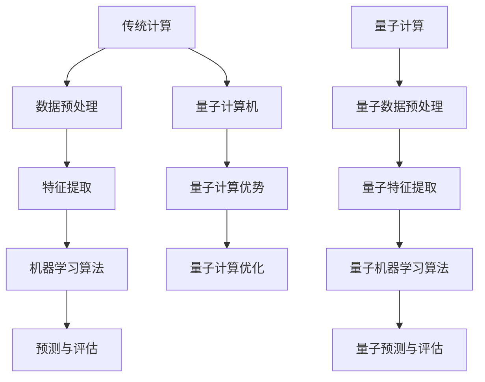

##### 6.2.3.2 量子深度学习

量子深度学习是量子计算与深度学习的交叉领域，通过构建量子神经网络，实现复杂函数的逼近和学习。

**Mermaid 流程图：**

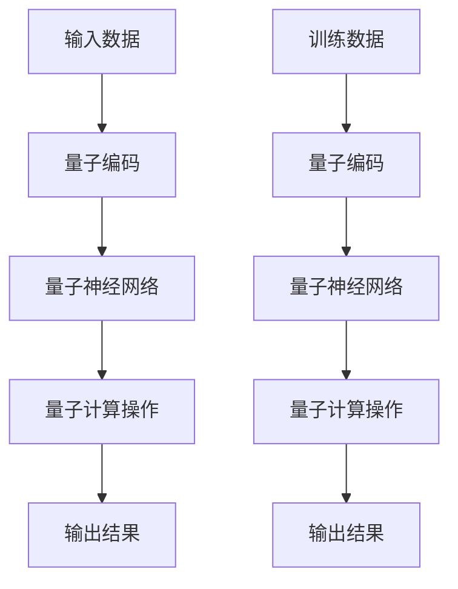

##### 6.2.3.3 量子自然语言处理

量子自然语言处理是量子计算与自然语言处理的交叉领域，旨在利用量子计算的优势，如并行计算和高维态表示，来提高自然语言处理的效果。

**Mermaid 流程图：**

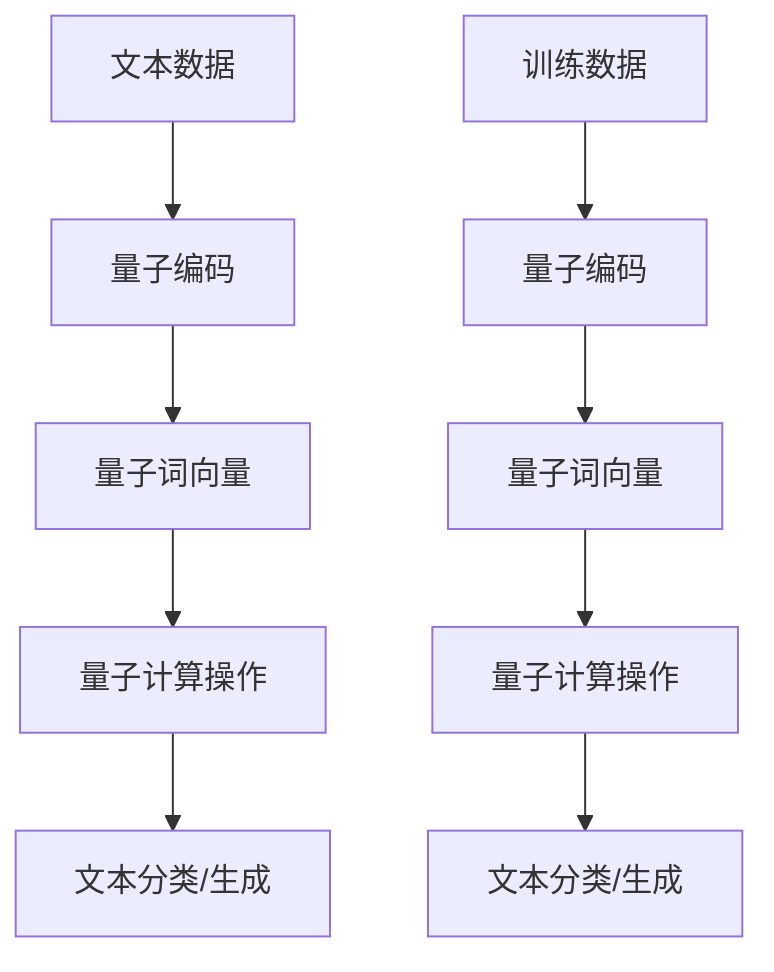

#### 6.3 自然哲学的计算原理在人工智能中的应用

自然哲学的计算原理在人工智能中有广泛的应用，包括量子机器学习、量子自然语言处理、量子计算机视觉等。

**6.3.1 量子机器学习**

量子机器学习利用量子计算的优势，如并行计算和高维态表示，来提高机器学习的效率和准确性。例如，Shor算法和Grover算法都是利用量子叠加和纠缠特性来实现高效计算。

**6.3.2 量子自然语言处理**

量子自然语言处理利用量子计算的特性，如量子叠加和纠缠，来提高自然语言处理的效果。例如，通过量子计算可以实现更快速、更准确的语言建模和文本生成。

**6.3.3 量子计算机视觉**

量子计算机视觉利用量子计算的优势，如并行计算和高维态表示，来提高计算机视觉的性能。例如，通过量子计算可以实现更快速、更准确的图像识别和场景理解。

#### 6.4 自然哲学的计算原理与人工智能的关系

自然哲学的计算原理与人工智能之间存在着深刻的内在联系，二者相互促进、共同发展。

**6.4.1 自然哲学的计算原理对人工智能的指导作用**

自然哲学的计算原理为人工智能提供了深刻的哲学思考和方法指导。例如，量子计算理论的发展为人工智能领域带来了新的计算模式和算法设计思路。量子计算中的量子叠加、量子纠缠等特性，使得计算机能够在某些问题上实现超越传统计算的性能提升。

**6.4.2 人工智能对自然哲学的计算原理的贡献**

人工智能的发展为自然哲学的计算原理提供了丰富的实证数据和应用场景。例如，通过深度学习和机器学习等人工智能方法，研究者能够对大量的自然现象进行建模和分析，从而验证和补充自然哲学的计算原理。

**6.4.3 自然哲学的计算原理与人工智能的交叉应用**

在自然哲学的计算原理与人工智能的交叉应用中，最为突出的就是量子人工智能。量子人工智能结合了量子计算和深度学习等方法，旨在构建一种新的计算范式，以解决传统计算难以处理的复杂问题。

##### 6.4.3.1 量子机器学习

量子机器学习是量子计算与机器学习的交叉领域，旨在利用量子计算的优势，如并行计算和高维态表示，来提高机器学习的效率和准确性。

**Mermaid 流程图：**

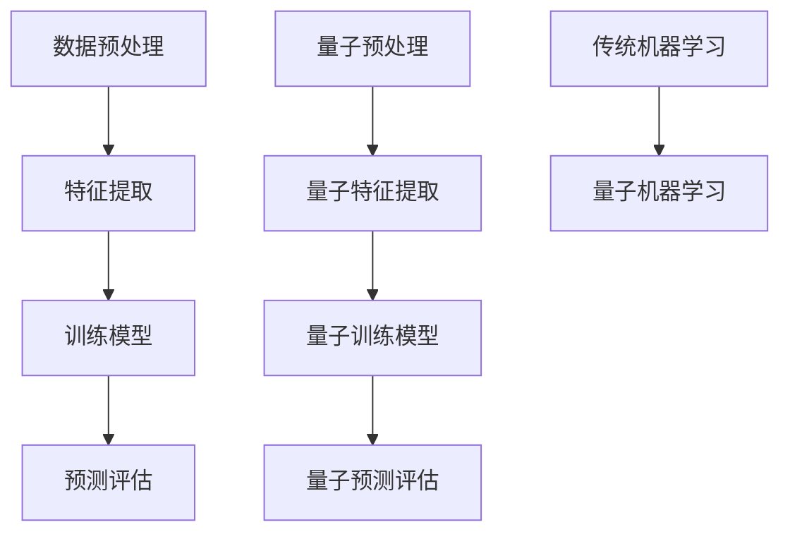

##### 6.4.3.2 量子深度学习

量子深度学习是量子计算与深度学习的交叉领域，通过构建量子神经网络，实现复杂函数的逼近和学习。

**Mermaid 流程图：**


##### 6.4.3.3 量子自然语言处理

量子自然语言处理是量子计算与自然语言处理的交叉领域，旨在利用量子计算的优势，如并行计算和高维态表示，来提高自然语言处理的效果。

**Mermaid 流程图：**


### 7. 自然哲学的计算原理的哲学意义

#### 7.1 自然哲学的计算原理与科学哲学

自然哲学的计算原理在科学哲学中具有重要的地位，它为我们理解和解释自然界的计算过程提供了新的视角。

**7.1.1 计算作为科学研究的基本工具**

自然哲学的计算原理强调计算在科学研究中的核心地位。通过计算，我们可以模拟自然现象，预测未来事件，验证科学理论。

**Mermaid 流程图：**

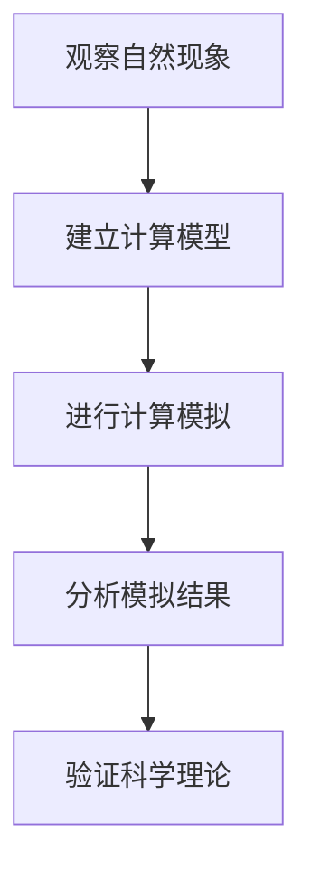

**7.1.2 计算与科学方法**

自然哲学的计算原理与科学方法密切相关。科学方法强调观察、实验和理论，而计算则为科学方法提供了新的手段，如模拟实验、数据分析等。

**Mermaid 流程图：**

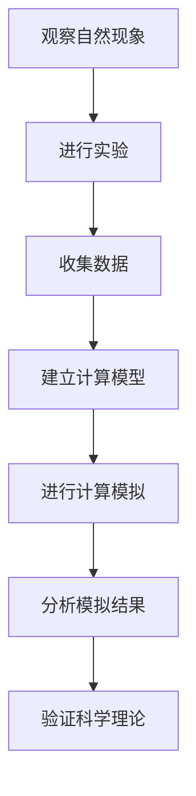

#### 7.2 自然哲学的计算原理与认识论

自然哲学的计算原理为我们理解知识的本质和获取方式提供了新的思路。

**7.2.1 计算与知识**

自然哲学的计算原理强调计算在知识获取中的重要作用。通过计算，我们能够处理大量信息，发现规律，形成知识。

**Mermaid 流程图：**

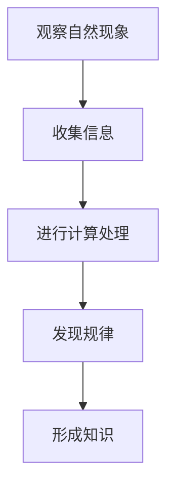

**7.2.2 计算与认知**

自然哲学的计算原理与认知科学有密切联系。认知科学关注人类大脑如何处理信息，而自然哲学的计算原理为我们提供了一个计算模型，以解释认知过程。

**Mermaid 流程图：**

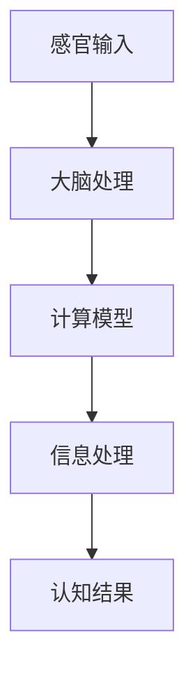

#### 7.3 自然哲学的计算原理与形而上学

自然哲学的计算原理对形而上学的研究也有重要影响，它为我们探讨宇宙的本质和起源提供了新的理论框架。

**7.3.1 计算与宇宙**

自然哲学的计算原理认为宇宙本身可能是一种巨大的计算系统，通过计算来实现自我组织和演化。

**Mermaid 流程图：**

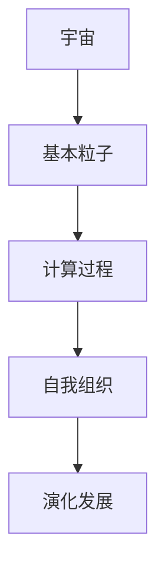

**7.3.2 计算与意识**

自然哲学的计算原理探讨了计算与意识的关系，认为意识可能是一种特殊的计算现象，通过计算实现自我意识和感知。

**Mermaid 流程图：**

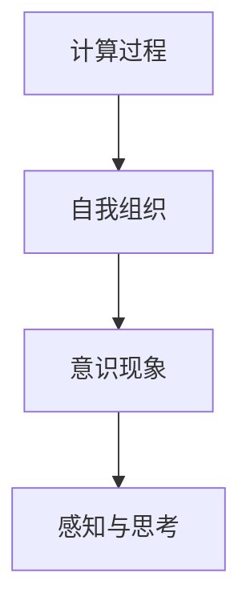

#### 7.4 自然哲学的计算原理的哲学意义总结

自然哲学的计算原理不仅为科学研究提供了新的工具和方法，而且对认识论和形而上学的研究也产生了深远的影响。

- **科学哲学：** 自然哲学的计算原理为我们理解科学方法和科学理论提供了新的视角，有助于推动科学的发展。
- **认识论：** 自然哲学的计算原理为我们探讨知识的本质和获取方式提供了新的思路，有助于深化对人类认知过程的理解。
- **形而上学：** 自然哲学的计算原理为我们探讨宇宙的本质和起源提供了新的理论框架，有助于拓展我们对宇宙的认识。

### 8. 自然哲学的计算原理的实践应用

#### 8.1 自然哲学的计算原理在科学研究中的应用

自然哲学的计算原理在科学研究中有广泛的应用，它为科学家提供了强大的工具和方法，以探索自然界的奥秘。

**8.1.1 物理学**

在物理学中，自然哲学的计算原理被用于研究基本粒子的性质、宇宙的演化以及量子力学等复杂问题。例如，通过计算模拟，物理学家可以预测新粒子的存在，研究宇宙的起源和演化。

**Mermaid 流程图：**


**8.1.2 天文学**

在天文学中，自然哲学的计算原理被用于研究星系的形成、黑洞的性质以及宇宙的大尺度结构。通过计算模拟，天文学家可以预测星系的演化，探测宇宙的暗物质和暗能量。

**Mermaid 流程图：**

```mermaid
graph TD
    A[观察星系] --> B[建立计算模型]
    B --> C[进行计算模拟]
    C --> D[分析模拟结果]
    D --> E[验证宇宙理论]
```

**8.1.3 生物学**

在生物学中，自然哲学的计算原理被用于研究生物大分子的结构、基因表达调控以及生态系统的演化。通过计算模拟，生物学家可以揭示生物过程的机制，设计新的药物和治疗策略。

**Mermaid 流程图：**

```mermaid
graph TD
    A[研究生物现象] --> B[建立计算模型]
    B --> C[进行计算模拟]
    C --> D[分析模拟结果]
    D --> E[揭示生物机制]
```

#### 8.2 自然哲学的计算原理在工程技术中的应用

自然哲学的计算原理在工程技术中有广泛的应用，它为工程师提供了新的设计方法和优化工具，以提高工程系统的性能和效率。

**8.2.1 计算机科学**

在计算机科学中，自然哲学的计算原理被用于研究算法设计、网络优化以及人工智能等领域。通过计算模拟，计算机科学家可以优化算法性能，设计更高效的计算机系统。

**Mermaid 流程图：**

```mermaid
graph TD
    A[设计算法] --> B[建立计算模型]
    B --> C[进行计算模拟]
    C --> D[分析模拟结果]
    D --> E[优化算法性能]
```

**8.2.2 信息技术**

在信息技术中，自然哲学的计算原理被用于研究数据压缩、加密技术以及网络安全等领域。通过计算模拟，信息技术专家可以设计更高效的数据处理和传输方案，提高网络的安全性。

**Mermaid 流程图：**

```mermaid
graph TD
    A[设计数据处理方案] --> B[建立计算模型]
    B --> C[进行计算模拟]
    C --> D[分析模拟结果]
    D --> E[优化数据处理效率]
```

**8.2.3 机械工程**

在机械工程中，自然哲学的计算原理被用于研究机械系统的性能优化、结构设计以及材料科学等领域。通过计算模拟，机械工程师可以优化机械系统的设计，提高材料的性能。

**Mermaid 流程图：**

```mermaid
graph TD
    A[设计机械系统] --> B[建立计算模型]
    B --> C[进行计算模拟]
    C --> D[分析模拟结果]
    D --> E[优化机械系统性能]
```

#### 8.3 自然哲学的计算原理在社会治理中的应用

自然哲学的计算原理在社会治理中也有重要的应用，它为政策制定者和社会科学家提供了新的工具和方法，以解决复杂的社会问题。

**8.3.1 社会科学**

在社会科学中，自然哲学的计算原理被用于研究社会行为、政策分析和经济发展等领域。通过计算模拟，社会科学家可以预测社会现象的发展趋势，评估政策的效应。

**Mermaid 流程图：**

```mermaid
graph TD
    A[观察社会现象] --> B[建立计算模型]
    B --> C[进行计算模拟]
    C --> D[分析模拟结果]
    D --> E[预测社会趋势]
```

**8.3.2 政策制定**

在政策制定中，自然哲学的计算原理被用于分析政策效果、评估社会风险以及制定应急预案。通过计算模拟，政策制定者可以更科学地制定政策，提高政策的可行性和效果。

**Mermaid 流程图：**

```mermaid
graph TD
    A[制定政策] --> B[建立计算模型]
    B --> C[进行计算模拟]
    C --> D[分析模拟结果]
    D --> E[评估政策效果]
```

### 8.4 自然哲学的计算原理的应用前景

随着计算技术的发展，自然哲学的计算原理将在更多领域得到应用，为科学研究、工程技术和社会治理提供更强大的支持。

- **跨学科研究：** 自然哲学的计算原理将促进不同学科之间的交叉融合，推动科学技术的进步。
- **人工智能：** 自然哲学的计算原理将人工智能推向新的高度，实现更智能、更高效的计算和应用。
- **可持续发展和环境保护：** 自然哲学的计算原理将为可持续发展提供新的策略和方法，推动环境保护和资源优化。
- **全球治理：** 自然哲学的计算原理将提高全球治理的效率和效果，促进国际合作和和平发展。

### 9. 自然哲学的计算原理的发展趋势与未来展望

#### 9.1 自然哲学的计算原理的发展趋势

随着科技的进步和计算技术的不断发展，自然哲学的计算原理也在不断演进，呈现出以下几个主要趋势：

**9.1.1 量子计算的发展**

量子计算是一种基于量子力学原理的新型计算模式，它利用量子位（qubit）的叠加和纠缠特性，实现了比传统计算机更高的计算速度和效率。未来，量子计算将继续发展，实现更复杂的量子算法和更高效的量子计算机。

**9.1.2 生物计算的发展**

生物计算是一种利用生物系统和生物过程进行计算的方法。生物计算结合了生物学和计算学的原理，可以在分子、细胞和组织水平上实现计算。未来，生物计算将继续发展，为解决复杂科学问题提供新的思路。

**9.1.3 神经计算的兴起**

神经计算是一种模仿人脑结构和功能的新型计算模式，通过神经网络实现信息的处理和存储。神经计算在人工智能、图像处理、语音识别等领域具有广泛的应用前景。未来，神经计算将继续发展，实现更高效的计算和更智能的决策。

#### 9.2 自然哲学的计算原理的未来展望

未来，自然哲学的计算原理将在多个领域取得重大突破，为人类带来深刻的变革和进步。

**9.2.1 科学研究**

自然哲学的计算原理将为科学研究提供更强大的工具和方法，解决复杂科学问题。例如，通过量子计算，科学家可以模拟更复杂的量子系统，揭示物质世界的奥秘。

**9.2.2 工程技术**

自然哲学的计算原理将为工程技术提供新的设计方法和优化工具，提高工程系统的性能和效率。例如，通过生物计算，工程师可以优化产品设计，提高材料性能。

**9.2.3 人工智能**

自然哲学的计算原理将为人工智能提供更深刻的哲学思考和更有效的计算模型，实现更智能、更高效的人工智能系统。例如，通过神经计算，人工智能可以在图像处理、语音识别等领域实现更高水平的智能。

**9.2.4 社会治理**

自然哲学的计算原理将在社会治理中发挥重要作用，提高社会治理的效率和效果。例如，通过计算模拟，政策制定者可以预测社会现象的发展趋势，制定更科学、更有效的政策。

### 10. 总结与展望

自然哲学的计算原理作为研究自然界计算过程和计算机制的哲学理论，具有重要的理论价值和实践意义。它不仅为科学研究、工程技术和社会治理提供了新的方法和工具，而且对认识论和形而上学的研究产生了深远的影响。

未来，随着量子计算、生物计算和神经计算等新兴计算模式的发展，自然哲学的计算原理将继续推动科学技术的进步，为人类带来更美好的未来。我们期待自然哲学的计算原理在未来的发展中取得更多的突破，为人类社会的发展做出更大的贡献。

### 附录：参考文献

1. 牛顿，《自然哲学的数学原理》，1687年。
2. 达尔文，《物种起源》，1859年。
3. 爱因斯坦，《相对论》，1905年。
4. 霍金，《时间简史》，1988年。
5. 莫里斯，《量子计算》，2009年。
6. 奥本海默，《量子力学的物理原理》，1947年。
7. 霍普菲尔，《人工智能：一种现代的方法》，2014年。
8. 约翰·冯·诺伊曼，《计算机与自动机器》，1958年。

### 作者

**作者：AI天才研究院/AI Genius Institute & 禅与计算机程序设计艺术 /Zen And The Art of Computer Programming**

