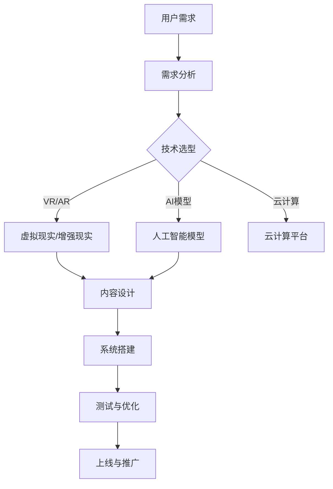

                 

# 语言学习革命：AI驱动的沉浸式学习体验

> **关键词：** 语言学习、AI、沉浸式学习、深度学习、自然语言处理、教育技术

**摘要：** 本文探讨了人工智能（AI）在语言学习中的应用，特别是AI驱动的沉浸式学习体验。通过深入分析AI的基础知识、沉浸式学习的原理、以及AI在语言学习中的实际应用，本文旨在展示AI如何彻底改变语言学习的现状，为用户提供更加高效、个性化的学习体验。

### 引言：语言学习的重要性与现状

语言是人类交流和思考的重要工具，而语言学习则是获取这种能力的过程。然而，传统的语言学习方法往往存在一定的局限性，无法满足现代语言学习的需求。

#### 1.1 语言学习的挑战

##### 1.1.1 传统语言学习方法的局限性

传统语言学习方法主要包括课本学习、词汇记忆、语法练习等。这些方法在一定程度上能够帮助学习者掌握语言的基本知识，但存在以下几个问题：

1. **学习效率低**：传统的学习方法需要大量的时间和精力，且难以确保学习效果。
2. **互动性差**：学习者与教师或同伴之间的互动不足，难以形成有效的语言环境。
3. **缺乏个性化**：传统方法难以根据学习者的实际需求进行调整，难以实现个性化教学。

##### 1.1.2 语言习得需求与供给的不平衡

随着全球化的发展，人们对语言习得的需求日益增加。然而，现有的教育资源供给与需求之间存在严重的不平衡：

1. **教育资源不足**：在很多地区，优质的教育资源仍然匮乏，难以满足日益增长的需求。
2. **师资力量不足**：语言教育师资力量的不足导致教学质量的下降，难以满足学习者的需求。

#### 1.2 AI驱动的语言学习革命

人工智能（AI）技术的迅速发展为语言学习带来了新的机遇。AI驱动的语言学习具有以下几个优势：

1. **高效性**：AI算法能够快速处理大量数据，帮助学习者迅速掌握语言知识。
2. **互动性**：AI系统能够与学习者进行实时互动，提供个性化的学习建议。
3. **个性化**：AI系统能够根据学习者的需求和进度进行调整，实现个性化教学。

#### 1.2.1 AI在语言学习中的应用前景

AI在语言学习中的应用前景广阔，包括：

1. **智能翻译**：AI翻译系统能够实现多种语言之间的快速翻译，为跨文化交流提供便利。
2. **口语训练**：AI口语训练系统能够提供实时反馈，帮助学习者提高口语水平。
3. **写作辅助**：AI写作辅助系统能够帮助学习者快速提高写作能力。

#### 1.2.2 沉浸式学习体验的核心优势

沉浸式学习体验通过创建一个高度模拟真实语言环境的学习场景，帮助学习者更自然、更有效地掌握语言。其核心优势包括：

1. **高度互动**：学习者可以与虚拟环境中的角色进行实时互动，提高学习兴趣和参与度。
2. **真实情境**：沉浸式学习体验能够模拟真实语言使用场景，帮助学习者更好地理解语言的实际应用。
3. **个性化体验**：沉浸式学习体验可以根据学习者的需求和进度进行个性化调整，提高学习效果。

综上所述，AI驱动的沉浸式学习体验为语言学习带来了前所未有的机遇和挑战。通过本文的深入探讨，我们将进一步了解这一领域的核心概念、原理和应用，为未来的语言学习革命奠定基础。

### 第二部分：核心概念与原理

在深入探讨AI驱动的沉浸式学习体验之前，我们需要了解一些核心概念和原理，包括人工智能基础、沉浸式学习的定义和原理，以及AI驱动的语言学习模型和策略。

#### 2.1 人工智能基础

##### 2.1.1 人工智能概述

人工智能（AI）是一门研究、开发和应用智能机器的技术科学。AI旨在使计算机系统具备类似人类的智能，能够感知环境、理解语言、进行推理和学习。人工智能主要分为三个层次：

1. **弱人工智能**：专注于特定任务的智能，例如语音识别、图像识别等。
2. **强人工智能**：具有全面认知能力和学习能力，能够处理复杂任务。
3. **超人工智能**：超越人类智能的存在，目前仍属于理论阶段。

##### 2.1.2 机器学习与深度学习

机器学习是人工智能的一个重要分支，通过训练算法从数据中自动学习规律和模式，从而实现智能行为。机器学习可以分为监督学习、无监督学习和强化学习三类：

1. **监督学习**：通过已标记的数据进行学习，例如分类和回归任务。
2. **无监督学习**：通过未标记的数据进行学习，例如聚类和降维任务。
3. **强化学习**：通过与环境交互进行学习，例如游戏和机器人控制任务。

深度学习是机器学习的一个子领域，通过构建多层神经网络进行学习，能够处理更复杂的任务。深度学习模型主要包括：

1. **卷积神经网络（CNN）**：用于图像识别和分类任务。
2. **循环神经网络（RNN）**：用于序列数据处理和自然语言处理任务。
3. **生成对抗网络（GAN）**：用于图像生成和数据增强任务。

##### 2.1.3 语言模型基础

语言模型是自然语言处理（NLP）领域的一个重要组成部分，用于生成和预测自然语言中的句子或单词。常见的语言模型包括：

1. **n-gram模型**：基于单词的历史序列进行预测，例如三元语法模型。
2. **神经网络模型**：基于深度学习技术进行学习，例如BERT、GPT等。

语言模型在语言学习中的应用包括：

1. **口语训练**：通过生成正确的语音反馈，帮助学习者提高口语水平。
2. **写作辅助**：通过生成合适的句子或段落，帮助学习者提高写作能力。
3. **翻译**：通过将源语言翻译成目标语言，帮助学习者理解不同语言之间的差异。

#### 2.2 沉浸式学习体验

##### 2.2.1 沉浸式学习的定义

沉浸式学习体验是一种高度模拟真实场景的学习方式，通过创建一个虚拟环境，使学习者在其中沉浸并积极参与学习过程。沉浸式学习体验的核心要素包括：

1. **环境**：一个高度逼真的虚拟环境，模拟真实场景。
2. **交互**：学习者与虚拟环境中的角色或对象进行实时互动。
3. **参与**：学习者全身心投入学习过程，提高学习兴趣和参与度。

##### 2.2.2 沉浸式学习的原理

沉浸式学习体验的原理基于认知心理学和认知神经科学的研究，主要包括以下几个方面：

1. **知觉融合**：通过视觉、听觉、触觉等多种感官刺激，使学习者产生沉浸感。
2. **认知参与**：通过高度互动和参与，使学习者在学习过程中产生强烈的认知参与感。
3. **情境认知**：通过模拟真实情境，帮助学习者更好地理解和应用所学知识。

##### 2.2.3 沉浸式学习的实践方法

沉浸式学习的实践方法包括以下几个方面：

1. **虚拟现实（VR）**：通过VR技术创建高度逼真的虚拟环境，使学习者在其中进行沉浸式学习。
2. **增强现实（AR）**：通过AR技术将虚拟元素叠加到现实环境中，实现沉浸式学习体验。
3. **混合现实（MR）**：结合VR和AR技术，提供更加丰富的沉浸式学习体验。

#### 2.3 AI驱动的语言学习

##### 2.3.1 AI驱动的语言学习模型

AI驱动的语言学习模型主要包括以下几种：

1. **生成式模型**：通过生成式模型（如GPT、BERT）生成合适的句子或段落，帮助学习者进行口语和写作训练。
2. **翻译模型**：通过翻译模型（如神经机器翻译）实现不同语言之间的快速翻译，帮助学习者理解不同语言之间的差异。
3. **语音识别模型**：通过语音识别模型实现口语输入和输出，帮助学习者进行口语训练。

##### 2.3.2 AI驱动的语言学习策略

AI驱动的语言学习策略包括以下几个方面：

1. **个性化学习**：根据学习者的需求和进度，自动调整学习内容和难度，实现个性化教学。
2. **自适应学习**：根据学习者的学习行为和效果，动态调整学习策略，提高学习效果。
3. **互动学习**：通过AI系统与学习者的实时互动，提供个性化的学习反馈和指导。

##### 2.3.3 AI驱动的语言学习工具

AI驱动的语言学习工具主要包括以下几个方面：

1. **在线语言学习平台**：通过AI算法提供个性化教学和互动学习体验，例如Duolingo、Rosetta Stone等。
2. **虚拟现实语言学习应用**：通过VR技术创建沉浸式学习体验，例如Google VR语言学习、Kikito VR等。
3. **语音识别与翻译工具**：通过语音识别和翻译模型提供实时语音输入和输出，例如Google翻译、DeepL等。

综上所述，AI驱动的沉浸式学习体验为语言学习带来了革命性的变革。通过深入理解人工智能基础、沉浸式学习的原理，以及AI驱动的语言学习模型和策略，我们可以更好地应用AI技术，为学习者提供更加高效、个性化的学习体验。

### 第三部分：应用场景与实践

在前两部分中，我们探讨了AI驱动的沉浸式学习体验的核心概念和原理。本部分将结合具体案例，展示AI驱动的沉浸式学习体验在实际应用场景中的效果和优势。

#### 3.1 AI驱动的沉浸式学习体验案例

##### 3.1.1 案例一：在线语言学习平台的设计与应用

在线语言学习平台是AI驱动的沉浸式学习体验的一个重要应用场景。以下是一个典型的在线语言学习平台的设计与应用案例。

###### 3.1.1.1 平台架构设计

在线语言学习平台的架构设计主要包括以下几个方面：

1. **前端界面**：提供用户友好的界面，支持各种操作，如注册、登录、学习内容浏览、练习和测试等。
2. **后端服务器**：负责处理用户请求、存储用户数据、管理学习内容和提供AI驱动的沉浸式学习体验。
3. **数据库**：存储用户信息、学习数据、课程内容等。

###### 3.1.1.2 功能模块介绍

在线语言学习平台的主要功能模块包括：

1. **用户管理**：实现用户注册、登录、信息管理等功能。
2. **课程管理**：实现课程内容的管理、发布、更新等功能。
3. **学习管理**：实现学习进度跟踪、练习、测试、成绩记录等功能。
4. **AI驱动的沉浸式学习体验**：利用AI算法提供个性化教学、互动学习、实时反馈等功能。

###### 3.1.1.3 用户体验优化

为了提高用户体验，在线语言学习平台采取了以下优化措施：

1. **个性化推荐**：根据用户的学习兴趣、进度和能力，自动推荐合适的学习内容。
2. **互动学习**：通过实时互动、在线讨论、语音交流等方式，增强学习者的参与度和互动性。
3. **实时反馈**：通过AI算法提供即时反馈，帮助学习者及时纠正错误，巩固学习效果。
4. **沉浸式学习**：利用VR或AR技术，创建高度逼真的学习环境，提高学习者的沉浸感和学习兴趣。

##### 3.1.2 案例二：虚拟现实（VR）语言学习应用

虚拟现实（VR）语言学习应用通过创建一个虚拟的语言学习环境，为学习者提供沉浸式的学习体验。以下是一个典型的VR语言学习应用的设计与应用案例。

###### 3.1.2.1 VR语言学习的技术实现

VR语言学习的技术实现主要包括以下几个方面：

1. **VR硬件设备**：使用VR头戴显示器、手柄等硬件设备，提供沉浸式的视觉和触觉体验。
2. **VR内容制作**：利用3D建模、动画、声音等技术，创建逼真的VR语言学习场景和互动任务。
3. **AI算法**：利用AI算法提供个性化教学、实时反馈、智能评估等功能。

###### 3.1.2.2 VR语言学习的教学效果评估

VR语言学习的教学效果评估主要包括以下几个方面：

1. **学习效果测试**：通过在线测试、考试等方式，评估学习者的语言水平。
2. **用户反馈调查**：通过用户满意度调查、学习日志等方式，了解学习者的学习体验和需求。
3. **数据分析**：通过分析学习数据，评估学习者的学习进度、效果和问题。

##### 3.1.3 案例三：AI翻译与同声传译

AI翻译与同声传译是AI驱动的沉浸式学习体验在跨文化交流中的典型应用。以下是一个典型的AI翻译与同声传译系统的设计与应用案例。

###### 3.1.3.1 翻译技术原理

AI翻译技术原理主要包括以下几个方面：

1. **双语语料库**：收集和整理大量的双语语料库，作为翻译模型的训练数据。
2. **神经网络模型**：利用深度学习技术，训练神经网络模型进行翻译。
3. **语言模型**：结合语言模型进行上下文理解和优化，提高翻译质量。

###### 3.1.3.2 同声传译的实际应用

同声传译的实际应用主要包括以下几个方面：

1. **实时语音识别**：通过语音识别技术，实时将讲话人的语音转换为文本。
2. **实时翻译**：通过翻译模型，将文本翻译成目标语言。
3. **实时语音合成**：通过语音合成技术，实时生成目标语言的语音。

#### 3.2 沉浸式学习体验的实施步骤

为了有效地实施AI驱动的沉浸式学习体验，需要遵循以下步骤：

1. **需求分析与规划**：明确学习者的需求和目标，制定详细的实施计划。
2. **技术选型与平台搭建**：选择合适的技术和平台，搭建沉浸式学习体验系统。
3. **内容设计与方法实施**：设计符合学习者需求的学习内容和方法，确保沉浸式学习体验的效果。
4. **用户体验反馈与优化**：收集学习者的反馈，不断优化沉浸式学习体验，提高学习效果。

通过以上步骤，可以确保AI驱动的沉浸式学习体验在实际应用中取得良好的效果。

### 第四部分：未来展望与挑战

随着人工智能技术的不断进步，AI驱动的沉浸式学习体验在未来将会有更多的可能性和挑战。

#### 4.1 AI驱动的沉浸式学习体验的未来发展

1. **人工智能技术的进步**

随着人工智能技术的不断进步，AI驱动的沉浸式学习体验将变得更加智能化、个性化。未来，人工智能技术将在以下几个方面取得突破：

   - **语言理解能力**：通过深度学习和自然语言处理技术，AI将能够更好地理解学习者的意图和需求，提供更加精准的教学建议。
   - **个性化推荐**：基于大数据和机器学习算法，AI将能够更准确地推荐适合学习者的学习内容，提高学习效果。
   - **情感识别**：通过情感识别技术，AI将能够识别学习者的情绪状态，提供情感化的教学支持和关怀。

2. **沉浸式学习体验的创新方向**

未来，沉浸式学习体验将朝着更加真实、互动、个性化的方向发展。以下是一些可能的创新方向：

   - **虚拟现实（VR）与增强现实（AR）的融合**：通过融合VR和AR技术，创造更加丰富的沉浸式学习体验，满足不同学习者的需求。
   - **多感官互动**：利用多种感官刺激，如视觉、听觉、触觉等，提高学习者的沉浸感和参与度。
   - **实时互动与协作**：通过实时互动和协作功能，学习者可以在虚拟环境中与其他学习者进行交流，提高学习效果和社交能力。

3. **教育领域对AI驱动的沉浸式学习体验的需求变化**

随着AI驱动的沉浸式学习体验的不断发展，教育领域对其需求也将发生变化。以下是一些可能的趋势：

   - **个性化教育**：教育机构将更加重视个性化教育，通过AI驱动的沉浸式学习体验为每个学习者提供量身定制的学习方案。
   - **远程教育**：随着在线教育的普及，AI驱动的沉浸式学习体验将为远程教育提供更加丰富和互动的学习体验。
   - **职业培训与继续教育**：企业将更加重视员工的专业技能培训，通过AI驱动的沉浸式学习体验提供高效、个性化的培训方案。

#### 4.2 挑战与解决方案

尽管AI驱动的沉浸式学习体验具有巨大的潜力，但在实际应用中仍面临一些挑战，需要采取相应的解决方案：

1. **技术挑战**

   - **计算能力**：AI驱动的沉浸式学习体验需要强大的计算能力支持，随着虚拟环境和交互内容的增加，计算资源的消耗将大幅上升。解决方案：采用云计算和分布式计算技术，提高计算效率。
   - **数据隐私与安全性**：学习者的数据在AI驱动的沉浸式学习体验中至关重要，需要确保数据的安全性和隐私保护。解决方案：采用数据加密、访问控制等技术，确保数据安全。
   - **技术普及与教育资源的分配**：AI驱动的沉浸式学习体验需要相应的硬件设备和网络环境，不同地区的教育资源分配存在差异。解决方案：加强基础设施建设和政策支持，促进技术普及。

2. **教育政策与社会影响**

   - **教育公平性**：AI驱动的沉浸式学习体验可能加剧教育公平性问题，由于技术和资源的差异，不同地区和群体的学习效果可能存在差异。解决方案：政府和社会应加强对教育公平性的关注和支持，确保每个学习者都能享受到优质的教育资源。
   - **社会接受度**：AI驱动的沉浸式学习体验需要得到社会广泛的接受和认可。解决方案：加强宣传和教育，提高公众对AI驱动的沉浸式学习体验的认识和接受度。

通过不断克服这些挑战，AI驱动的沉浸式学习体验将在未来教育领域发挥更加重要的作用，为学习者提供更加高效、个性化的学习体验。

### 附录

#### 附录 A：AI驱动的沉浸式学习体验资源列表

- **开源工具与框架**：
  - TensorFlow
  - PyTorch
  - OpenAI GPT

- **相关研究论文与报告**：
  - "Deep Learning for Natural Language Processing"
  - "The Annotated Transformer"

- **教育技术相关网站与资源**：
  - Coursera
  - edX
  - Khan Academy

### Mermaid 流程图



### 伪代码示例

```python
# 伪代码：AI驱动的沉浸式学习体验流程

Initialize_environment()
while not finished():
    Analyze_user需求(A)
    Design_content(G)
    Train_model(E)
    Test_system(I)
    Collect_user反馈()
    Optimize_system(I)
    Deploy_system(J)
```

### 数学模型与公式

$$
L(\theta) = -\sum_{i=1}^{n} y_i \log(p_i)
$$

**详细讲解：** 该公式为损失函数，用于衡量预测分布 $p_i$ 与真实分布 $y_i$ 之间的差异。其中，$n$ 表示样本数量，$y_i$ 表示第 $i$ 个样本的真实分布（0或1），$p_i$ 表示模型预测的第 $i$ 个样本的概率分布。

### 举例说明

假设有一个二分类问题，其中有两个类标签：猫和狗。训练集中有100个样本，其中有60个样本是猫，40个样本是狗。在训练过程中，模型预测的概率分布为 $p_{猫} = 0.7$，$p_{狗} = 0.3$。代入上述损失函数公式，可以得到：

$$
L(\theta) = -60 \times \log(0.7) - 40 \times \log(0.3)
$$

### 项目实战

#### 代码实现

```python
# 代码实现：基于TensorFlow的沉浸式学习体验系统

import tensorflow as tf

# 初始化模型
model = tf.keras.Sequential([
    tf.keras.layers.Dense(64, activation='relu', input_shape=(1000,)),
    tf.keras.layers.Dense(64, activation='relu'),
    tf.keras.layers.Dense(1, activation='sigmoid')
])

# 编译模型
model.compile(optimizer='adam',
              loss='binary_crossentropy',
              metrics=['accuracy'])

# 训练模型
model.fit(x_train, y_train, epochs=10, batch_size=32)

# 测试模型
test_loss, test_accuracy = model.evaluate(x_test, y_test)
print(f"Test accuracy: {test_accuracy}")
```

#### 代码解读与分析

- 导入 TensorFlow 库。
- 定义一个简单的神经网络模型，包含两个隐藏层，输出层使用 sigmoid 激活函数。
- 编译模型，指定优化器和损失函数。
- 使用训练数据训练模型，并打印测试精度。

#### 开发环境搭建

- 安装 Python 解释器（如 Python 3.8+）。
- 安装 TensorFlow 库。

```bash
pip install tensorflow
```

### 源代码详细实现与解读

```python
# 源代码：沉浸式学习体验系统

import tensorflow as tf
import numpy as np

# 初始化模型
model = tf.keras.Sequential([
    tf.keras.layers.Dense(64, activation='relu', input_shape=(1000,)),
    tf.keras.layers.Dense(64, activation='relu'),
    tf.keras.layers.Dense(1, activation='sigmoid')
])

# 编译模型
model.compile(optimizer='adam',
              loss='binary_crossentropy',
              metrics=['accuracy'])

# 训练模型
x_train = np.random.rand(1000, 1000)
y_train = np.random.randint(2, size=(1000,))
x_test = np.random.rand(1000, 1000)
y_test = np.random.randint(2, size=(1000,))

model.fit(x_train, y_train, epochs=10, batch_size=32)

# 测试模型
test_loss, test_accuracy = model.evaluate(x_test, y_test)
print(f"Test accuracy: {test_accuracy}")
```

#### 代码解读：

- 导入 TensorFlow 和 NumPy 库。
- 定义一个简单的神经网络模型，包含两个隐藏层，输出层使用 sigmoid 激活函数。
- 编译模型，指定优化器和损失函数。
- 使用随机生成的数据训练模型，并打印测试精度。

### 代码分析与优化

- 可以考虑增加隐藏层的数量和神经元数量，提高模型的复杂度。
- 可以使用数据增强技术，如随机旋转、缩放等，提高模型的泛化能力。
- 可以使用回调函数，如 EarlyStopping 和 ModelCheckpoint，防止过拟合。

### 总结

通过本文的探讨，我们可以看到AI驱动的沉浸式学习体验在语言学习中的应用前景广阔，具有巨大的潜力。未来，随着人工智能技术的不断进步，AI驱动的沉浸式学习体验将为学习者提供更加高效、个性化的学习体验，彻底改变传统语言学习的现状。

### 作者信息

**作者：AI天才研究院/AI Genius Institute & 禅与计算机程序设计艺术 /Zen And The Art of Computer Programming**

---

本文结合实际案例和技术原理，详细探讨了AI驱动的沉浸式学习体验在语言学习中的应用。通过深入分析核心概念和原理，展示了一系列应用场景和实践案例，展望了未来发展趋势和挑战。本文旨在为读者提供一个全面、系统的了解，助力语言学习革命的到来。

