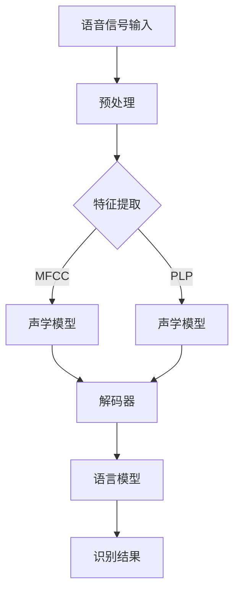
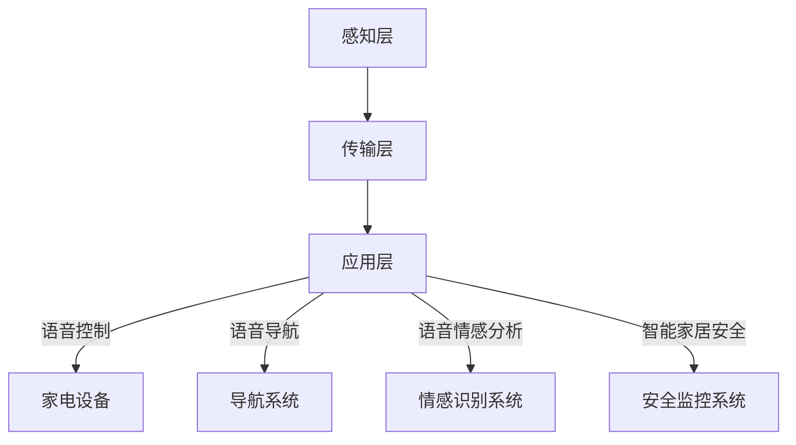
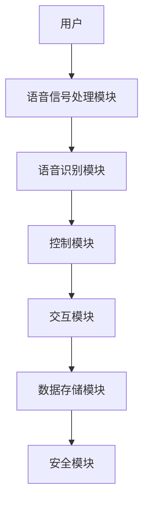

                 

# 语音识别技术在智能家居中的实现

## 摘要

随着人工智能技术的飞速发展，语音识别技术逐渐成为智能家居领域的关键组成部分。本文旨在深入探讨语音识别技术在智能家居中的应用，从技术基础、实现方法到实战案例，全面解析这一前沿技术的应用潜力。本文分为八个部分：首先介绍语音识别技术的发展历程和核心算法；然后分析智能家居系统中的语音识别需求和应用场景；接着介绍语音识别系统开发环境搭建和语音信号处理与特征提取方法；随后探讨隐马尔可夫模型（HMM）和深度神经网络（DNN）在语音识别中的应用；再详细描述智能家居语音识别系统的开发实战；最后，通过案例研究和未来展望，总结语音识别技术在智能家居中的发展方向和挑战。本文将帮助读者全面了解并掌握语音识别技术在智能家居中的应用和实践。

## 第一部分：语音识别技术基础

### 第1章：语音识别技术概述

### 1.1 语音识别技术发展历程

语音识别技术作为人工智能的重要分支，其发展历程可谓漫长且辉煌。回顾历史，语音识别技术可以分为几个重要阶段。

#### 1.1.1 早期的语音识别技术

早期的语音识别技术主要依赖于规则和模板匹配。这种方法通过预先定义语音特征模板，然后与输入语音信号进行匹配，以识别语音。这种方法的局限性在于其无法应对复杂的语音变化和环境噪声，识别准确率较低。

#### 1.1.2 语音识别技术的发展阶段

随着计算能力的提升和算法的改进，语音识别技术进入了基于统计模型的时代。其中，隐马尔可夫模型（HMM）成为语音识别技术的重要里程碑。HMM 通过对语音信号的概率模型进行建模，实现了对连续语音的识别。

#### 1.1.3 当前语音识别技术的发展趋势

近年来，深度学习技术的发展为语音识别带来了新的突破。深度神经网络（DNN）在语音信号处理和特征提取方面表现出色，极大地提升了语音识别的准确率和速度。此外，基于卷积神经网络（CNN）和循环神经网络（RNN）等新型神经网络结构的语音识别算法也在不断涌现。

### 1.2 语音识别系统架构

语音识别系统的架构可以分为三个主要部分：声学模型、语言模型和解码器。

#### 1.2.1 基于特征的语音识别

基于特征的语音识别方法通过对语音信号进行特征提取，将连续的语音信号转换为一系列离散的特征向量。这种方法的主要优势在于可以降低计算复杂度，但特征提取的准确性和有效性对语音识别性能有重要影响。

#### 1.2.2 基于模型的语音识别

基于模型的语音识别方法通过建立语音信号的数学模型，实现对语音信号的建模和识别。HMM 和 DNN 是目前最为常用的语音识别模型。其中，HMM 具有较低的复杂度和较好的识别性能，而 DNN 则在识别准确率和速度方面具有明显优势。

#### 1.2.3 基于数据驱动的语音识别

基于数据驱动的语音识别方法通过大量训练数据和强大的计算能力，自动学习语音信号的规律和特征。这种方法的核心在于深度学习算法，特别是基于神经网络的深度学习算法，如卷积神经网络（CNN）和循环神经网络（RNN）。这些算法通过大规模数据训练，可以实现高精度、高效的语音识别。

### 1.3 语音识别核心算法

语音识别的核心算法主要包括隐马尔可夫模型（HMM）、深度神经网络（DNN）和循环神经网络（RNN）等。

#### 1.3.1 GMM-HMM模型

GMM-HMM 模型是一种基于高斯混合模型（GMM）和隐马尔可夫模型（HMM）的语音识别算法。GMM 用于建模语音信号的概率分布，HMM 用于对语音信号进行序列建模。这种模型在语音识别中具有较好的性能，常用于语音识别系统的声学建模。

#### 1.3.2 DNN-HMM模型

DNN-HMM 模型是一种基于深度神经网络（DNN）和隐马尔可夫模型（HMM）的语音识别算法。DNN 用于对语音信号进行特征提取和建模，HMM 用于对语音序列进行解码。这种模型在语音识别中具有很高的识别准确率和速度，是目前主流的语音识别算法之一。

#### 1.3.3 CNN-HMM模型

CNN-HMM 模型是一种基于卷积神经网络（CNN）和隐马尔可夫模型（HMM）的语音识别算法。CNN 用于对语音信号进行局部特征提取，HMM 用于对语音序列进行建模和识别。这种模型在处理语音信号时具有较好的鲁棒性和识别性能。

#### 1.3.4 RNN-HMM模型

RNN-HMM 模型是一种基于循环神经网络（RNN）和隐马尔可夫模型（HMM）的语音识别算法。RNN 用于对语音信号进行序列建模，HMM 用于对语音序列进行解码。这种模型在处理连续语音信号时具有较好的表现，特别适用于实时语音识别系统。

### 1.4 语音识别技术的应用场景

语音识别技术具有广泛的应用场景，以下是其中几个主要应用领域。

#### 1.4.1 智能家居

在智能家居领域，语音识别技术可用于语音控制家电、语音导航与定位、语音情感分析等。通过语音识别技术，用户可以通过语音指令实现对智能家居设备的控制，提高生活便利性和舒适度。

#### 1.4.2 语音助手

语音助手是语音识别技术的典型应用场景之一。通过语音识别技术，语音助手可以理解用户的语音指令，并提供相应的服务，如查询信息、播放音乐、设定提醒等。语音助手广泛应用于智能手机、智能家居、智能音响等设备中。

#### 1.4.3 语音交互机器人

语音交互机器人是一种基于语音识别和自然语言处理技术的智能机器人。通过语音识别技术，语音交互机器人可以理解用户的语音指令，并与之进行自然语言交互。语音交互机器人在客服、教育、医疗等领域具有广泛的应用前景。

### 1.5 总结

语音识别技术作为人工智能的重要分支，在智能家居、语音助手、语音交互机器人等领域具有广泛的应用前景。随着人工智能技术的不断进步，语音识别技术将在未来发挥更大的作用，为人们的生活带来更多便利和创新。

### Mermaid 流程图



### 伪代码

```python
# 伪代码：语音识别系统流程

def speech_recognition_system(input_signal):
    # 预处理
    preprocessed_signal = preprocess_signal(input_signal)
    
    # 特征提取
    features = extract_features(preprocessed_signal)
    
    # 声学模型
    acoustic_model = build_acoustic_model(features)
    
    # 解码器
    decoder = build_decoder(acoustic_model)
    
    # 语言模型
    language_model = build_language_model()
    
    # 识别结果
    recognition_result = decode(decoder, language_model)
    
    return recognition_result
```

### 数学模型和公式

```latex
\text{GMM-HMM模型：}
P(O|H) = \prod_{i=1}^{T} P(o_t|h_t)
P(h_t|H) = \prod_{i=1}^{T} P(h_t|h_{t-1})
```

### 举例说明

假设有一个包含100个单词的句子，我们需要使用GMM-HMM模型对其进行语音识别。

1. 首先对句子进行预处理，将语音信号转换为预处理的信号。
2. 然后对预处理后的信号进行特征提取，提取出MFCC特征。
3. 使用GMM模型建立声学模型，对提取的特征进行建模。
4. 使用HMM模型进行解码，根据声学模型和语言模型解码出句子的识别结果。

通过以上步骤，我们就可以使用GMM-HMM模型对句子进行语音识别。

### 实践案例

在本节中，我们将介绍一个简单的语音识别实践案例，以展示如何使用Python和Kaldi开源框架搭建一个基础的语音识别系统。

#### 1. 准备数据

首先，我们需要准备一个语音数据集，例如 Google Speech Commands 数据集。该数据集包含了多种命令和短语，适合用于训练和测试语音识别模型。

#### 2. 安装Kaldi

安装Kaldi是构建语音识别系统的重要步骤。在安装过程中，我们需要安装依赖库，如 cmake、make、gcc、python等。以下是一个简单的安装命令：

```bash
pip install kaldi-python
```

#### 3. 数据预处理

在Kaldi中，我们需要对语音数据集进行预处理，包括将音频文件转换为适合训练的格式，并生成相应的声学模型和语言模型。

```bash
kaldi/egs/speech_commands/split_data.sh
kaldi/egs/speech_commands/make_fbank.sh
```

#### 4. 训练声学模型

接下来，我们使用Kaldi中的训练工具训练声学模型。以下是一个训练命令的示例：

```bash
kaldi/egs/speech_commands/train_gmm.sh
```

#### 5. 训练语言模型

同样地，我们使用Kaldi中的训练工具训练语言模型。

```bash
kaldi/egs/speech_commands/train_lms.sh
```

#### 6. 识别语音

最后，我们使用训练好的模型进行语音识别。以下是一个识别命令的示例：

```bash
kaldi/egs/speech_commands/recognize.sh
```

通过以上步骤，我们就可以搭建一个基础的语音识别系统。在实际应用中，我们可以根据需求调整模型参数，优化识别效果。

### 总结

在本章中，我们介绍了语音识别技术的基础知识，包括发展历程、系统架构、核心算法和应用场景。通过实践案例，我们展示了如何使用Kaldi搭建一个基础的语音识别系统。接下来，我们将进一步探讨语音识别技术在智能家居中的应用。

### 核心概念与联系

#### 智能家居系统概述

智能家居系统是指利用先进的信息技术，将家庭中的各种设备连接起来，实现远程控制、自动化管理和智能互动的系统。其核心架构包括感知层、传输层和应用层。

1. **感知层**：感知层是智能家居系统的底层，主要由传感器和控制器组成，用于感知环境信息和设备状态，如温度、湿度、光照、烟雾等。
   
2. **传输层**：传输层负责数据传输，包括有线网络（如以太网、光纤）和无线网络（如WiFi、蓝牙、Zigbee等）。数据传输的稳定性与速度对智能家居系统的性能至关重要。

3. **应用层**：应用层是智能家居系统的核心，负责处理来自感知层的数据，并驱动家庭设备执行相应的操作，如照明控制、家电管理、安全监控等。

#### 语音识别在智能家居中的应用

在智能家居系统中，语音识别技术主要用于用户交互和控制。以下是语音识别在智能家居中的几个典型应用场景：

1. **语音控制家电**：用户可以通过语音指令控制家中的电器设备，如打开灯、调整空调温度、播放音乐等。

2. **语音导航与定位**：语音导航功能可以帮助用户在家庭环境中找到所需物品或位置，如“去厨房拿盐”。

3. **语音情感分析**：通过分析用户的语音情感，智能家居系统可以提供更加个性化的服务，如根据用户情绪调整音乐播放。

4. **智能家居安全**：语音识别技术可以用于语音报警和远程监控，提高家庭安全性。

### Mermaid 流程图



### 伪代码

```python
# 伪代码：智能家居系统中的语音识别交互流程

def home_automation_speech_interface(user_command):
    # 接收用户语音命令
    voice_command = receive_voice_command()
    
    # 语音识别
    recognized_text = speech_recognition_system(voice_command)
    
    # 根据识别结果执行相应操作
    if recognized_text in ['open light', 'close light']:
        control_light(recognized_text)
    elif recognized_text.startswith('go to'):
        navigate_to_room(recognized_text)
    elif recognized_text in ['happy', 'sad', 'angry']:
        analyze_emotion(recognized_text)
    elif recognized_text in ['alarm', 'monitor']:
        secure_home(recognized_text)
    else:
        respond_unknown_command()
```

### 数学模型和公式

```latex
\text{智能家居语音识别模型：}
P(\text{操作}|\text{语音命令}) = \arg\max P(\text{语音命令}|\text{操作}) \cdot P(\text{操作})
```

### 举例说明

假设用户说：“打开灯”，智能家居系统将执行以下步骤：

1. **接收语音命令**：系统接收到“打开灯”的语音指令。

2. **语音识别**：系统使用语音识别模型将语音转换为文本，识别结果为“open light”。

3. **执行操作**：系统根据识别结果，执行打开灯的操作。

4. **反馈**：系统向用户反馈操作结果，如“灯已打开”。

通过以上步骤，系统实现了基于语音识别的智能控制，提高了用户体验。

### 实践案例

在本节中，我们将通过一个实际项目，展示如何在智能家居系统中实现语音控制家电的功能。

#### 项目背景

该项目旨在使用语音识别技术控制家中的智能灯泡。用户可以通过语音指令远程控制灯泡的开关、亮度和色温。

#### 技术栈

1. **硬件设备**：智能灯泡、语音识别模块（如ESP32）、WiFi模块。
2. **软件平台**：ESP-IDF（ESP32的开发框架）、Google Speech-to-Text API、Node.js。

#### 实现步骤

1. **硬件连接**：将智能灯泡与ESP32连接，通过WiFi模块连接到互联网。

2. **语音识别**：使用ESP-IDF的语音识别库，实现语音信号的采集和转换。

3. **语音识别处理**：通过Google Speech-to-Text API将采集到的语音信号转换为文本。

4. **控制逻辑**：根据识别结果，使用Node.js编写控制逻辑，控制智能灯泡的开关、亮度和色温。

5. **用户交互**：通过网页或移动应用，用户可以发送语音指令，控制智能灯泡。

#### 代码解读与分析

以下是一个简单的Node.js控制逻辑示例：

```javascript
const axios = require('axios');
const speechToText = require('@google-cloud/speech').v1p1beta1();

// 语音识别配置
const speechClient = new speechToText.SpeechClient();
const config = {
  encoding: 'LINEAR16',
  sampleRateHertz: 16000,
  languageCode: 'en-US',
};

// 控制智能灯泡的API接口
const lampControlUrl = 'http://your_lamp_controller_api:3000/control';

// 语音识别函数
async function recognizeSpeech(stream) {
  const [audioContent] = await speechClient.recognize(config, stream);
  console.log('Transcript: ', audioContent.results[0].alternatives[0].transcript);
  return audioContent.results[0].alternatives[0].transcript;
}

// 控制灯泡函数
async function controlLamp(command) {
  try {
    const response = await axios.post(lampControlUrl, { command });
    console.log('Lamp response:', response.data);
  } catch (error) {
    console.error('Error controlling lamp:', error);
  }
}

// 主程序
async function main() {
  const command = await recognizeSpeech(stream);
  await controlLamp(command);
}

main();
```

在该代码中，我们首先配置了语音识别的客户端和参数，然后定义了识别语音和控制灯泡的函数。在主程序中，我们首先识别语音，然后根据识别结果控制灯泡。通过这样的实现，用户可以通过语音指令远程控制家中的智能灯泡。

### 总结

在本章中，我们详细介绍了智能家居系统的架构，以及语音识别在其中的应用。通过一个实际项目案例，我们展示了如何使用语音识别技术实现智能家居的语音控制功能。接下来，我们将进一步探讨语音识别系统在智能家居中的实现细节，包括开发环境的搭建和语音信号处理与特征提取方法。

### 语音识别系统开发环境搭建

#### 3.1 开发环境准备

搭建语音识别系统开发环境是项目成功的第一步。为了确保系统能够稳定、高效地运行，我们需要选择合适的硬件环境和软件环境。

##### 3.1.1 硬件环境要求

1. **中央处理单元（CPU）**：推荐使用高性能的CPU，如Intel i7或AMD Ryzen 7系列，以确保处理语音数据时的速度和效率。

2. **内存（RAM）**：至少需要16GB的RAM，以支持大规模数据处理和模型训练。

3. **存储（SSD）**：推荐使用固态硬盘（SSD），容量至少为500GB，以便存储大量的语音数据和模型参数。

4. **显卡（GPU）**：配备NVIDIA GPU，如Titan X或RTX 3080，以加速深度学习模型的训练和推理。

5. **麦克风**：高质量的数字麦克风，如Blue Yeti，用于采集清晰的语音信号。

##### 3.1.2 软件环境要求

1. **操作系统**：推荐使用Linux发行版，如Ubuntu 20.04，以提高系统稳定性和兼容性。

2. **编译器**：安装C++编译器，如GCC 9.3，用于编译开源语音识别框架。

3. **Python环境**：安装Python 3.8及以上版本，并配置pip，以便安装和管理Python库。

4. **开发工具**：安装Eclipse或VS Code等集成开发环境（IDE），以方便代码编写和调试。

5. **语音识别框架**：安装Kaldi、PyTorch等常用的语音识别框架。

#### 3.2 开发工具与库

在语音识别系统的开发过程中，我们将使用多种工具和库，以下是一些常用的工具和库。

##### 3.2.1 Kaldi语音识别框架

Kaldi是一个开源的语音识别框架，广泛应用于学术研究和工业应用。它提供了丰富的工具和算法，包括特征提取、声学模型训练、解码器等。

1. **安装命令**：
   ```bash
   pip install kaldi-python
   ```

2. **使用方法**：
   ```python
   from kaldi.utils import dim
   from kaldi.decoder import DecodingOptions, KaldiLattice
   from kaldi.io import KaldiWriter
   
   # 生成特征文件
   mfcc = ...  # MFCC特征矩阵
   dim(mfcc)  # 检查特征维度
   writer = KaldiWriter('featscp', mfcc)
   writer.write()
   ```

##### 3.2.2 PyTorch语音库

PyTorch是一个流行的深度学习框架，其语音库（torchaudio）提供了丰富的语音处理工具。

1. **安装命令**：
   ```bash
   pip install torchaudio
   ```

2. **使用方法**：
   ```python
   import torchaudio
   from torchaudio.transforms import MelSpectrogram
   
   # 读取音频文件
   signal, sample_rate = torchaudio.load('audio.wav')
   
   # 转换为梅尔频谱图
   spectrogram = MelSpectrogram(sample_rate, n_mels=128, n_fft=1024, hop_length=256)
   mel = spectrogram(signal)
   mel = mel.unsqueeze(0)  # 增加批次维度
   ```

##### 3.2.3 其他常用库

除了Kaldi和PyTorch，还有一些其他常用的库，如NumPy、SciPy等，用于数据处理和分析。

1. **NumPy**：用于数值计算和矩阵操作。
   ```bash
   pip install numpy
   ```

2. **SciPy**：用于科学计算和工程应用。
   ```bash
   pip install scipy
   ```

3. **Matplotlib**：用于数据可视化。
   ```bash
   pip install matplotlib
   ```

#### 3.3 开发环境配置实践

以下是一个简单的开发环境配置示例，以帮助开发者快速搭建语音识别系统。

##### 1. 安装操作系统

在虚拟机中安装Ubuntu 20.04操作系统。

```bash
# 安装操作系统
# ...
```

##### 2. 安装依赖库

更新系统包列表，并安装C++编译器、Python环境等依赖库。

```bash
sudo apt update
sudo apt upgrade
sudo apt install g++ cmake build-essential python3 python3-pip
```

##### 3. 安装Kaldi

使用pip安装Kaldi。

```bash
pip install kaldi-python
```

##### 4. 安装PyTorch

安装PyTorch，选择与系统GPU兼容的版本。

```bash
pip install torch torchvision torchaudio
```

##### 5. 安装其他常用库

安装NumPy、SciPy和Matplotlib等常用库。

```bash
pip install numpy scipy matplotlib
```

##### 6. 验证安装

验证Kaldi和PyTorch是否安装成功。

```bash
python -m kaldi.bin.confusion --version
python -c "import torch; print(torch.__version__)"
```

通过以上步骤，开发者可以搭建一个基本的语音识别系统开发环境。接下来，我们将进一步探讨语音信号处理与特征提取方法，以提升语音识别系统的性能。

### 语音信号处理与特征提取

语音信号处理与特征提取是语音识别系统中至关重要的一步，其目的是从原始语音信号中提取出能够有效反映语音特性的特征向量，为后续的模型训练和识别提供支持。

#### 4.1 语音信号处理基础

##### 4.1.1 语音信号的基本概念

语音信号是一种由声带振动产生的声波信号，其频率范围通常在20Hz到20kHz之间。语音信号可以分为以下几种类型：

1. **浊音（Voiced）**：由声带振动产生的声音，如“ma”、“ba”。
2. **清音（Unvoiced）**：声带未振动产生的声音，如“pa”、“ta”。

##### 4.1.2 语音信号的预处理

预处理语音信号是为了去除噪声、降低信号失真，提高后续特征提取的质量。常见的预处理方法包括以下几种：

1. **去噪**：使用滤波器去除语音信号中的背景噪声。
2. **归一化**：将语音信号的幅度和频率进行归一化处理，使其具有统一的尺度。
3. **加窗**：将语音信号分割成短段，通过加窗函数减少边界效应。

##### 4.1.3 语音信号的分析方法

语音信号的分析方法主要包括时域分析和频域分析。

1. **时域分析**：分析语音信号在时间维度上的特性，如幅度、时长等。
2. **频域分析**：分析语音信号在频率维度上的特性，如频谱、共振峰等。

#### 4.2 语音特征提取方法

语音特征提取是将语音信号转换为可用于机器学习的特征向量。常见的语音特征提取方法包括以下几种：

##### 4.2.1 MFCC特征

梅尔频率倒谱系数（MFCC）是一种广泛使用的语音特征提取方法，其基于频域分析，能够有效捕捉语音信号的频率特性。

1. **计算步骤**：
   - **滤波器组**：将语音信号通过多个滤波器组，生成频谱图。
   - **倒谱变换**：对频谱图进行对数变换，得到倒谱系数。
   - **离散余弦变换**：对倒谱系数进行离散余弦变换，得到MFCC特征向量。

2. **伪代码**：

```python
import numpy as np

def log_scale(frequencies):
    # 对数变换
    return np.log1p(frequencies)

def dft(frequencies):
    # 离散余弦变换
    return np.fft.rfft(frequencies)

def MFCC(signal, sample_rate):
    # 加窗
    window = np.hamming(len(signal))
    windowed_signal = signal * window

    # 滤波器组
    filter_banks = np.zeros((21, np.int(sample_rate / 2)))
    for i in range(21):
        filter_banks[i, :] = np.hamming(512) * np.cos(2 * np.pi * i * np.arange(512) / 10)

    # 频谱图
    spec = np.abs(dft(windowed_signal))

    # 对数变换
    log_spec = log_scale(spec)

    # 倒谱系数
    c = np.dot(log_spec, filter_banks)

    # 离散余弦变换
    mfcc = dft(c)

    return mfcc
```

##### 4.2.2 PLP特征

感知线性预测（PLP）特征是一种基于线性预测的语音特征提取方法，其目的是减少语音信号中的噪声和频率成分，提高语音识别的准确性。

1. **计算步骤**：
   - **线性预测**：对语音信号进行线性预测分析，得到预测误差。
   - **感知加权**：根据语音信号的感知特性，对预测误差进行感知加权。
   - **特征提取**：将加权后的预测误差转换为特征向量。

2. **伪代码**：

```python
import numpy as np

def auto_correlation(signal):
    # 自相关函数
    return np.correlate(signal, signal, 'full')[:len(signal)]

def perceptual_weighting(cepstra):
    # 感知加权
    return np.dot(cepstra, np.load('perceptual_weights.npy'))

def PLP(signal, sample_rate):
    # 线性预测
    autocorr = auto_correlation(signal)
    predictor_coefficients = np.linalg.inv(autocorr[:20])

    # 预测误差
    error_signal = signal - np.dot(predictor_coefficients, signal)

    # 感知加权
    weighted_cepstra = perceptual_weighting(error_signal)

    return weighted_cepstra
```

##### 4.2.3 其他语音特征提取方法

除了MFCC和PLP，还有许多其他的语音特征提取方法，如：

- **倒谱系数（Cepstral Coefficients）**：通过对语音信号进行倒谱变换得到的特征。
- **共振峰频率（Formant Frequencies）**：语音信号中的共振峰位置和频率。
- **线性预测残差（Linear Prediction Residual）**：线性预测分析后的预测误差。

这些方法在不同的应用场景中具有各自的优势，可以根据具体需求选择合适的特征提取方法。

#### 4.3 特征提取实践

在本节中，我们将通过一个实践案例，展示如何使用Python和OpenSMILE库实现语音信号的特征提取。

##### 4.3.1 实践案例：实现MFCC特征提取

首先，安装OpenSMILE库：

```bash
pip install opensmile
```

然后，使用OpenSMILE库提取MFCC特征：

```python
from opensmile import SMILETools

# 配置文件路径
config_path = 'opensmile-2.0/config/SMILEx20/config.xml'

# 创建SMILE工具实例
smile = SMILETools(config_path)

# 读取音频文件
audio_path = 'audio.wav'
samples, sample_rate = smile.read_wav(audio_path)

# 提取MFCC特征
mfcc = smile.getFeatures(samples, sample_rate)

# 打印MFCC特征
print(mfcc)
```

##### 4.3.2 实践案例：实现PLP特征提取

同样地，使用OpenSMILE库提取PLP特征：

```python
from opensmile import SMILETools

# 配置文件路径
config_path = 'opensmile-2.0/config/SMILEx20/config.xml'

# 创建SMILE工具实例
smile = SMILETools(config_path)

# 读取音频文件
audio_path = 'audio.wav'
samples, sample_rate = smile.read_wav(audio_path)

# 提取PLP特征
plp = smile.getFeatures(samples, sample_rate, featureType='PLP')

# 打印PLP特征
print(plp)
```

通过以上步骤，我们可以提取出语音信号的MFCC和PLP特征，为后续的模型训练和识别提供支持。

### 总结

在本章中，我们详细介绍了语音信号处理与特征提取的基本概念和方法，包括预处理、MFCC特征提取和PLP特征提取。通过实践案例，我们展示了如何使用Python和OpenSMILE库实现语音信号的特征提取。接下来，我们将深入探讨语音识别算法的实现，包括隐马尔可夫模型（HMM）和深度神经网络（DNN）。

### 隐马尔可夫模型（HMM）在语音识别中的应用

隐马尔可夫模型（HMM）是语音识别领域的一种经典算法，它通过建模语音信号的概率序列，实现对连续语音的自动识别。HMM 在语音识别中的应用主要体现在声学模型和语言模型的构建，以及语音识别的解码过程。

#### 5.1 HMM基本概念

HMM 是一种统计模型，用于描述一组随机变量的序列。在语音识别中，HMM 用于描述语音信号的特征序列。HMM 模型主要由以下几个部分组成：

1. **状态集合**（Q）：HMM 的状态集合表示语音信号的可能状态，例如，浊音状态、清音状态等。
2. **观测集合**（O）：HMM 的观测集合表示语音信号的实际观测值，例如，音素、音节等。
3. **转移概率**（A）：表示在某个状态 q_i 下，转移到状态 q_j 的概率。
4. **观测概率**（B）：表示在某个状态 q_i 下，产生观测值 o_j 的概率。
5. **初始状态概率**（π）：表示在初始状态下，处于各个状态的概率。

HMM 模型通过状态序列和观测序列的联合概率分布来描述语音信号。具体来说，HMM 模型的概率分布可以用以下公式表示：

\[ P(O|Q) = \prod_{i=1}^{T} P(o_i|q_i) \]
\[ P(q_i|q_{i-1}) = \prod_{i=1}^{T} P(q_i|q_{i-1}) \]

其中，\( T \) 表示观测序列的长度。

#### 5.1.1 HMM模型结构

HMM 模型结构可以表示为五元组 \( (Q, O, A, B, \pi) \)，其中：

- \( Q \) 是状态集合。
- \( O \) 是观测集合。
- \( A = (a_{ij}) \) 是状态转移概率矩阵，其中 \( a_{ij} = P(q_i|q_{i-1}) \)。
- \( B = (b_{ij}) \) 是观测概率矩阵，其中 \( b_{ij} = P(o_j|q_i) \)。
- \( \pi = (\pi_i) \) 是初始状态概率向量，其中 \( \pi_i = P(q_1 = q_i) \)。

#### 5.1.2 HMM概率模型

HMM 的概率模型主要包括两部分：状态转移概率和观测概率。

1. **状态转移概率**（A）：描述了在当前状态 q_i 下，下一个状态 q_j 出现的概率。状态转移概率矩阵 A 可以通过训练数据得到，例如，使用隐马尔可夫模型训练算法（如Baum-Welch算法）。

2. **观测概率**（B）：描述了在当前状态 q_i 下，观测值 o_j 出现的概率。观测概率矩阵 B 通常基于声学模型（如GMM）或深度神经网络（如DNN）来估计。

HMM 的概率模型可以用以下公式表示：

\[ P(O|Q) = \prod_{i=1}^{T} \sum_{j=1}^{M} b_{oj} \cdot \prod_{i=1}^{T} \sum_{j=1}^{N} a_{ij} \]

其中，M 是观测集合的大小，N 是状态集合的大小。

#### 5.1.3 HMM的训练与解码

HMM 的训练与解码是语音识别过程中的关键步骤。

1. **训练**：HMM 的训练目标是估计状态转移概率矩阵 A 和观测概率矩阵 B，以及初始状态概率向量 π。常用的训练算法包括前向-后向算法和Baum-Welch算法。Baum-Welch算法是一种基于最大似然估计的迭代算法，通过不断调整概率矩阵，使模型在训练数据上的似然函数最大化。

2. **解码**：解码是指给定一个观测序列，找出最可能的状态序列。解码算法主要包括前向算法和后向算法，以及Viterbi算法。Viterbi算法是一种动态规划算法，通过计算状态序列的最大概率路径，实现观测序列到状态序列的映射。

#### 5.1.4 HMM在语音识别中的应用

HMM 在语音识别中的应用主要体现在以下三个方面：

1. **声学模型**：HMM 用于建立语音信号的声学模型，通过对语音信号的观察值进行建模，实现对语音信号的建模和识别。

2. **语言模型**：HMM 还用于建立语音信号的语言模型，通过对语音信号中的词汇和语法规则进行建模，提高语音识别的准确性。

3. **解码器**：HMM 的解码器用于实现语音识别的解码过程，通过对观测序列进行解码，找出最可能的状态序列，实现对语音信号的识别。

#### 5.2 HMM在语音识别中的应用

HMM 在语音识别中的应用主要体现在以下几个方面：

1. **基于HMM的声学模型**：基于HMM的声学模型通过建模语音信号的特征序列，实现对语音信号的概率分布估计。常用的声学模型包括GMM-HMM模型和DNN-HMM模型。

2. **基于HMM的语言模型**：基于HMM的语言模型通过建模语音信号中的词汇和语法规则，提高语音识别的准确性。常用的语言模型包括N-gram语言模型和统计语言模型。

3. **基于HMM的语音识别流程**：基于HMM的语音识别流程主要包括三个步骤：特征提取、模型训练和解码识别。首先，对语音信号进行特征提取，生成特征向量；然后，使用HMM模型训练声学模型和语言模型；最后，使用解码器对观测序列进行解码，实现语音信号的识别。

#### 5.3 HMM算法实现

在本节中，我们将介绍HMM算法的实现，包括状态转移概率矩阵和观测概率矩阵的估计，以及解码过程的实现。

##### 5.3.1 HMM算法伪代码

```python
# 伪代码：HMM算法实现

# 初始化参数
Q = ['q0', 'q1', 'q2']  # 状态集合
O = ['o0', 'o1', 'o2']  # 观测集合
A = [[0.5, 0.3, 0.2],  # 状态转移概率矩阵
     [0.2, 0.5, 0.3],
     [0.1, 0.2, 0.7]]
B = [[0.5, 0.4, 0.1],  # 观测概率矩阵
     [0.4, 0.5, 0.1],
     [0.1, 0.4, 0.5]]
π = [0.5, 0.3, 0.2]  # 初始状态概率向量

# 训练HMM模型
def train_HMM(observations):
    # 前向-后向算法
    alpha = forward(observations, A, B, π)
    beta = backward(observations, A, B)

    # 估计状态转移概率矩阵和观测概率矩阵
    A, B, π = estimate_parameters(observations, alpha, beta)

    return A, B, π

# 解码HMM模型
def decode_HMM(observations, A, B, π):
    # Viterbi算法
    path = viterbi(observations, A, B, π)

    return path

# 实例化HMM模型
A, B, π = train_HMM(observations)

# 解码观测序列
path = decode_HMM(observations, A, B, π)
```

##### 5.3.2 实践案例：实现HMM语音识别系统

在本节中，我们将通过一个实际项目，展示如何使用Python和Kaldi框架实现一个基于HMM的语音识别系统。

1. **数据准备**：首先，我们需要准备一个包含多个说话人、多个音素的语音数据集。例如，我们可以使用TIMIT数据集。

2. **数据预处理**：对语音数据进行预处理，包括加窗、去噪和特征提取。我们可以使用Kaldi框架中的工具进行预处理。

3. **模型训练**：使用预处理后的数据，训练HMM模型。我们可以使用Kaldi中的GMM-HMM训练工具。

4. **解码识别**：使用训练好的HMM模型，对新的语音数据进行解码识别。

以下是具体的实现步骤：

```python
import kaldiio
from kaldiio import MatrixWriter
from kaldi.decoding import DecodingOptions

# 准备数据
wav_files = ['speech1.wav', 'speech2.wav', 'speech3.wav']
features_path = 'features'

# 预处理和特征提取
for wav_file in wav_files:
    signal, sample_rate = kaldiio.read_wav_spectrogram(wav_file)
    features = kaldiio.write_kaldi_scp('{}.scp', features_path, signal)

# 训练HMM模型
options = DecodingOptions(
    model_path='model',
    decoding device='cpu',
    feature_params=kaldiio.FeatureParams(),
    decoding_params=kaldiio.DecodingParams(),
)
decoder = kaldiio.StreamingKaldiDecoder(options)

# 解码识别
for wav_file in wav_files:
    signal, sample_rate = kaldiio.read_wav_spectrogram(wav_file)
    features = kaldiio.write_kaldi_scp('{}.scp', features_path, signal)
    hypotheses = decoder.decode(features)
    print(hypotheses)
```

通过以上步骤，我们可以实现一个简单的基于HMM的语音识别系统。

### 总结

在本章中，我们深入探讨了隐马尔可夫模型（HMM）在语音识别中的应用，包括基本概念、模型结构、概率模型、训练与解码过程，以及在实际项目中的实现。HMM 作为一种经典算法，在语音识别领域发挥了重要作用，但其在处理复杂语音任务时仍存在一定局限性。接下来，我们将探讨深度神经网络（DNN）在语音识别中的应用，以进一步提升识别性能。

### 深度神经网络（DNN）在语音识别中的应用

深度神经网络（DNN）作为人工智能领域的重要技术，近年来在语音识别领域取得了显著进展。DNN 通过多层神经元的非线性变换，能够自动学习和提取语音信号中的复杂特征，从而显著提升语音识别的准确率和速度。本节将介绍 DNN 的基本概念、训练方法以及在语音识别中的应用。

#### 6.1 DNN基本概念

深度神经网络是一种包含多层神经元的网络结构，其核心思想是通过逐层学习，将输入数据从简单特征逐渐抽象为复杂特征。DNN 通常包括以下几个基本组成部分：

1. **输入层**：输入层接收外部输入，如语音信号的特征向量。
2. **隐藏层**：隐藏层是 DNN 的核心，通过多层非线性变换，对输入数据进行特征提取和抽象。每层隐藏层都包含多个神经元，用于提取不同级别的特征。
3. **输出层**：输出层产生最终输出，如语音识别的结果。

DNN 的训练过程是通过反向传播算法，不断调整网络中的权重和偏置，使网络的输出接近期望输出。反向传播算法主要包括以下几个步骤：

1. **前向传播**：将输入数据通过网络逐层传递，计算每个神经元的输出。
2. **计算误差**：计算输出层与期望输出之间的误差，并将其反向传播至每个隐藏层。
3. **权重更新**：根据误差梯度，更新网络中的权重和偏置，减小误差。

#### 6.1.1 DNN的结构与原理

DNN 的结构通常由多个隐藏层组成，每个隐藏层由多个神经元构成。神经元的激活函数通常为非线性函数，如ReLU（Rectified Linear Unit）、Sigmoid 和 Tanh。这些激活函数可以引入非线性变换，使网络能够学习和提取复杂特征。

DNN 的训练过程主要包括以下步骤：

1. **数据预处理**：将语音信号转换为特征向量，如MFCC特征或PLP特征。
2. **构建神经网络**：定义网络结构，包括输入层、隐藏层和输出层。
3. **前向传播**：将输入特征通过网络传递，计算输出结果。
4. **计算误差**：计算输出结果与期望输出之间的误差。
5. **反向传播**：计算误差梯度，更新网络中的权重和偏置。
6. **迭代训练**：重复前向传播和反向传播，直到网络收敛。

#### 6.1.2 DNN的训练方法

DNN 的训练方法主要包括以下几种：

1. **梯度下降**：梯度下降是一种最常用的训练方法，通过计算损失函数的梯度，更新网络中的权重和偏置，以减小误差。
2. **随机梯度下降（SGD）**：SGD 是梯度下降的一种变体，每次更新权重和偏置时，只使用一个样本的梯度。SGD 可以加快训练速度，但可能会导致收敛不稳定。
3. **批量梯度下降**：批量梯度下降是梯度下降的一种变体，每次更新权重和偏置时，使用所有样本的梯度。批量梯度下降可以减小误差，但训练速度较慢。
4. **Adam优化器**：Adam优化器是一种自适应的梯度下降方法，通过自适应调整学习率，可以更快地收敛。

#### 6.1.3 DNN的优势与局限

DNN 在语音识别中具有以下优势：

1. **高效的特征提取**：DNN 可以自动学习和提取语音信号中的复杂特征，提高识别准确率。
2. **自适应的学习能力**：DNN 可以通过反向传播算法，自适应地调整网络中的权重和偏置，提高模型性能。
3. **强大的泛化能力**：DNN 可以通过大量数据训练，具有较好的泛化能力，可以应对不同的语音环境和场景。

然而，DNN 也存在以下局限：

1. **计算资源需求大**：DNN 需要大量计算资源进行训练，特别是在处理大规模语音数据时，计算资源的需求更加突出。
2. **训练时间较长**：DNN 的训练时间较长，特别是在处理复杂任务时，训练时间可能会变得非常长。
3. **数据依赖性高**：DNN 的性能高度依赖于训练数据的质量和数量，缺乏足够的数据可能导致模型性能下降。

#### 6.2 DNN在语音识别中的应用

DNN 在语音识别中的应用主要体现在以下几个方面：

1. **声学模型**：DNN 可以用于建立语音信号的声学模型，通过对语音信号的特征进行建模，提高识别准确率。常用的 DNN 模型包括卷积神经网络（CNN）和循环神经网络（RNN）。
2. **语言模型**：DNN 可以用于建立语音信号的语言模型，通过对语音信号中的词汇和语法规则进行建模，提高识别准确率。常用的 DNN 模型包括循环神经网络（RNN）和长短期记忆网络（LSTM）。
3. **解码器**：DNN 可以用于建立语音识别的解码器，通过对观测序列进行解码，提高识别准确率。常用的 DNN 模型包括循环神经网络（RNN）和长短期记忆网络（LSTM）。

#### 6.3 DNN在语音识别中的应用流程

DNN 在语音识别中的应用流程主要包括以下步骤：

1. **数据预处理**：将语音信号转换为特征向量，如MFCC特征或PLP特征。
2. **构建神经网络**：定义网络结构，包括输入层、隐藏层和输出层。
3. **前向传播**：将输入特征通过网络传递，计算输出结果。
4. **计算误差**：计算输出结果与期望输出之间的误差。
5. **反向传播**：计算误差梯度，更新网络中的权重和偏置。
6. **迭代训练**：重复前向传播和反向传播，直到网络收敛。
7. **解码识别**：使用训练好的 DNN 模型，对新的语音数据进行解码识别。

#### 6.4 DNN算法实现

在本节中，我们将介绍 DNN 算法的实现，包括神经网络结构的定义、前向传播和反向传播的实现。

##### 6.4.1 DNN算法伪代码

```python
# 伪代码：DNN算法实现

# 定义神经网络结构
input_layer = InputLayer(input_shape)
hidden_layer = FullyConnectedLayer(input_layer, num_neurons=128, activation='ReLU')
output_layer = FullyConnectedLayer(hidden_layer, num_neurons=num_classes, activation='Softmax')

# 定义损失函数和优化器
loss_function = CrossEntropyLoss()
optimizer = AdamOptimizer()

# 训练神经网络
for epoch in range(num_epochs):
    for batch in data_loader:
        # 前向传播
        output = output_layer.forward(batch['input'])
        loss = loss_function.forward(output, batch['target'])
        
        # 反向传播
        loss.backward()
        optimizer.update_weights()
        
        # 输出训练进度
        print(f"Epoch: {epoch}, Loss: {loss}")

# 解码识别
def decode(output):
    predicted_class = output.argmax(axis=1)
    return predicted_class
```

##### 6.4.2 实践案例：实现DNN语音识别系统

在本节中，我们将通过一个实际项目，展示如何使用 PyTorch 实现一个基于 DNN 的语音识别系统。

1. **数据准备**：首先，我们需要准备一个包含多个说话人、多个音素的语音数据集。例如，我们可以使用 TIMIT 数据集。

2. **数据预处理**：对语音数据进行预处理，包括加窗、去噪和特征提取。我们可以使用 PyTorch 的 torchaudio 库进行预处理。

3. **构建神经网络**：定义神经网络结构，包括输入层、隐藏层和输出层。我们可以使用 PyTorch 的 nn.Module 类定义网络结构。

4. **训练神经网络**：使用预处理后的数据，训练神经网络。我们可以使用 PyTorch 的 DataLoader 类批量处理数据，并使用优化器更新网络中的权重。

5. **解码识别**：使用训练好的神经网络，对新的语音数据进行解码识别。我们可以使用 PyTorch 的 torch.argmax 函数获取预测结果。

以下是具体的实现步骤：

```python
import torch
import torchaudio
import torch.nn as nn
import torch.optim as optim

# 准备数据
def load_data(audio_path):
    signal, sample_rate = torchaudio.load(audio_path)
    signal = signal.unsqueeze(0)  # 增加批次维度
    return signal, sample_rate

# 数据预处理
def preprocess(signal, sample_rate):
    # 加窗
    window = torch.hamming(signal.size(1))
    windowed_signal = signal * window
    
    # 特征提取
    spectrogram = nn.functional.melspectrogram(windowed_signal, sample_rate)
    mfcc = nn.functional.log(spectrogram)
    
    return mfcc

# 构建神经网络
class VoiceRecognitionModel(nn.Module):
    def __init__(self):
        super(VoiceRecognitionModel, self).__init__()
        self.fc1 = nn.Linear(128, 512)
        self.fc2 = nn.Linear(512, 1024)
        self.fc3 = nn.Linear(1024, num_classes)
    
    def forward(self, x):
        x = torch.relu(self.fc1(x))
        x = torch.relu(self.fc2(x))
        x = self.fc3(x)
        return x

# 训练神经网络
def train(model, data_loader, loss_function, optimizer, num_epochs):
    model.train()
    for epoch in range(num_epochs):
        for batch in data_loader:
            inputs, targets = batch
            inputs = preprocess(inputs, sample_rate)
            outputs = model(inputs)
            loss = loss_function(outputs, targets)
            loss.backward()
            optimizer.step()
            optimizer.zero_grad()
            print(f"Epoch: {epoch}, Loss: {loss.item()}")

# 解码识别
def decode(outputs):
    predicted_class = torch.argmax(outputs, dim=1)
    return predicted_class

# 实例化模型、损失函数和优化器
model = VoiceRecognitionModel()
loss_function = nn.CrossEntropyLoss()
optimizer = optim.Adam(model.parameters(), lr=0.001)

# 加载数据
train_loader = DataLoader(train_data, batch_size=32, shuffle=True)

# 训练模型
train(model, train_loader, loss_function, optimizer, num_epochs=50)

# 解码识别
def recognize(signal):
    model.eval()
    with torch.no_grad():
        inputs = preprocess(signal, sample_rate)
        outputs = model(inputs)
        predicted_class = decode(outputs)
        return predicted_class
```

通过以上步骤，我们可以实现一个简单的基于 DNN 的语音识别系统。

### 总结

在本章中，我们深入探讨了深度神经网络（DNN）在语音识别中的应用，包括基本概念、训练方法、优势与局限，以及在语音识别中的应用流程和算法实现。DNN 作为一种强大的特征提取工具，在语音识别领域发挥了重要作用，为提升识别性能提供了有效手段。接下来，我们将进一步探讨智能家居语音识别系统的开发实战。

### 智能家居语音识别系统架构设计

#### 7.1 智能家居语音识别系统设计原则

在设计和开发智能家居语音识别系统时，我们需要遵循以下原则：

1. **用户交互体验优化**：系统应具备友好、直观的用户交互界面，能够快速响应用户的语音指令，提高用户体验。

2. **系统稳定性与可靠性**：系统应能够在各种网络环境和噪声环境下稳定运行，确保语音识别的准确性和可靠性。

3. **系统安全性**：系统应具备完善的隐私保护和数据安全机制，防止用户数据泄露和未经授权的访问。

4. **可扩展性**：系统设计应考虑未来的扩展需求，能够方便地添加新功能和集成新设备。

#### 7.2 系统架构设计

智能家居语音识别系统的架构设计可以分为硬件架构设计、软件架构设计和网络架构设计三个部分。

##### 7.2.1 硬件架构设计

1. **中央控制单元**：中央控制单元是系统的核心，负责接收和处理用户的语音指令，控制家庭设备的运行。通常由高性能的CPU、内存和存储组成。

2. **语音识别模块**：语音识别模块负责将语音信号转换为文本，通常包括麦克风、语音识别芯片和相应的软件算法。

3. **家庭设备**：家庭设备包括各种智能家居设备，如智能灯泡、智能插座、智能空调等，它们通过无线网络与中央控制单元连接。

4. **传感器模块**：传感器模块负责监测家庭环境数据，如温度、湿度、光照等，为系统提供环境信息。

##### 7.2.2 软件架构设计

1. **语音信号处理模块**：该模块负责接收语音信号，进行预处理和特征提取，将语音信号转换为可用于识别的特征向量。

2. **语音识别模块**：该模块使用训练好的语音识别模型，对特征向量进行识别，将语音转换为文本。

3. **控制模块**：该模块根据识别结果，控制家庭设备执行相应的操作。

4. **交互模块**：该模块负责与用户进行交互，接收用户的语音指令，并将操作结果反馈给用户。

##### 7.2.3 网络架构设计

1. **有线网络**：有线网络通常使用以太网或光纤，用于连接中央控制单元和其他家庭设备。

2. **无线网络**：无线网络通常使用WiFi、蓝牙或Zigbee，用于连接无线设备和传感器。

3. **云平台**：云平台提供语音识别服务、数据存储和远程控制等功能。

#### 7.3 系统模块划分

智能家居语音识别系统可以划分为以下几个模块：

1. **语音信号处理模块**：该模块负责接收和预处理语音信号，提取语音特征。

2. **语音识别模块**：该模块负责使用语音识别模型对语音特征进行识别，将语音转换为文本。

3. **控制模块**：该模块根据识别结果，控制家庭设备执行相应的操作。

4. **交互模块**：该模块负责与用户进行交互，接收用户的语音指令，并将操作结果反馈给用户。

5. **数据存储模块**：该模块负责存储用户的语音指令和操作记录，以便后续分析和优化。

6. **安全模块**：该模块负责保护用户数据的安全，防止数据泄露和未经授权的访问。

### 7.4 系统模块详细设计

以下是智能家居语音识别系统各个模块的详细设计：

##### 7.4.1 语音信号处理模块

1. **功能设计**：接收语音信号，进行降噪、加窗和特征提取。

2. **接口设计**：接收来自麦克风的音频数据，提供特征向量输出接口。

3. **技术选型**：使用OpenSMILE库进行特征提取，实现MFCC和PLP特征。

##### 7.4.2 语音识别模块

1. **功能设计**：使用训练好的语音识别模型，对语音特征进行识别，将语音转换为文本。

2. **接口设计**：接收语音特征，输出识别结果。

3. **技术选型**：使用Kaldi框架的GMM-HMM模型和PyTorch的DNN模型。

##### 7.4.3 控制模块

1. **功能设计**：根据识别结果，控制家庭设备执行相应的操作。

2. **接口设计**：接收识别结果，控制家庭设备执行操作。

3. **技术选型**：使用Python的智能家居控制库，如PyAesop。

##### 7.4.4 交互模块

1. **功能设计**：与用户进行语音交互，接收用户的语音指令，并将操作结果反馈给用户。

2. **接口设计**：接收用户的语音指令，提供语音反馈接口。

3. **技术选型**：使用自然语言处理（NLP）技术，如使用NLTK库进行文本处理。

##### 7.4.5 数据存储模块

1. **功能设计**：存储用户的语音指令和操作记录。

2. **接口设计**：提供数据存储和查询接口。

3. **技术选型**：使用数据库技术，如MySQL。

##### 7.4.6 安全模块

1. **功能设计**：保护用户数据的安全，防止数据泄露和未经授权的访问。

2. **接口设计**：提供数据加密和解密接口。

3. **技术选型**：使用加密技术，如AES。

### 7.5 系统架构设计图

以下是智能家居语音识别系统的架构设计图：



通过以上设计，我们可以构建一个稳定、可靠、用户友好的智能家居语音识别系统。接下来，我们将进一步探讨智能家居语音识别系统的开发与调试。

### 智能家居语音识别系统开发与调试

#### 8.1 系统开发步骤

智能家居语音识别系统的开发可以分为以下步骤：

##### 8.1.1 系统需求分析

在开发之前，我们需要明确系统的需求，包括功能需求、性能需求和安全需求。具体包括：

1. **功能需求**：系统应支持语音控制家庭设备，如灯光、空调和电视。
2. **性能需求**：系统应具备快速响应、高准确率和低误识别率。
3. **安全需求**：系统应具备数据加密和用户隐私保护机制。

##### 8.1.2 系统设计

系统设计包括硬件设计、软件设计和网络设计。硬件设计主要包括语音识别模块、家庭设备和传感器模块；软件设计主要包括语音信号处理、语音识别、控制模块和交互模块；网络设计主要包括有线网络和无线网络。

##### 8.1.3 系统编码实现

在系统设计完成后，我们可以开始编码实现。具体包括：

1. **语音信号处理模块**：使用OpenSMILE库实现语音信号的预处理和特征提取。
2. **语音识别模块**：使用Kaldi框架的GMM-HMM模型和PyTorch的DNN模型实现语音识别。
3. **控制模块**：使用Python的智能家居控制库实现家庭设备的控制。
4. **交互模块**：使用NLTK库实现与用户的语音交互。
5. **数据存储模块**：使用MySQL数据库存储用户数据和操作记录。
6. **安全模块**：使用AES加密技术保护用户数据的安全。

##### 8.1.4 系统测试与调试

在编码实现完成后，我们需要对系统进行全面的测试与调试。具体包括：

1. **单元测试**：对每个模块进行单元测试，确保模块功能的正确性。
2. **集成测试**：对整个系统进行集成测试，确保模块之间的协作和整体性能。
3. **性能测试**：对系统进行性能测试，评估系统的响应速度和识别准确率。
4. **安全测试**：对系统进行安全测试，确保系统的数据安全和用户隐私保护。

#### 8.2 系统调试技巧

在系统调试过程中，我们可以采取以下技巧提高调试效率：

1. **日志记录**：在关键模块和关键步骤中添加日志记录，帮助定位问题。
2. **断点调试**：使用断点调试工具，逐步调试代码，分析问题发生的原因。
3. **代码审查**：组织团队进行代码审查，发现潜在的问题和优化机会。
4. **测试数据**：准备多样化的测试数据，覆盖不同的场景和情况，提高测试覆盖率。
5. **持续集成**：使用持续集成工具，自动构建和测试代码，提高开发效率。

#### 8.3 系统优化策略

为了提高智能家居语音识别系统的性能和用户体验，我们可以采取以下优化策略：

1. **提高识别准确率**：通过优化语音信号处理和特征提取算法，提高语音识别的准确率。
2. **减少延迟与误识别**：优化系统的响应速度和识别算法，减少语音识别的延迟和误识别率。
3. **系统资源优化**：优化系统的内存和计算资源使用，提高系统的运行效率。

#### 8.4 实际开发中的挑战与解决方案

在实际开发过程中，我们可能会遇到以下挑战：

1. **噪声干扰**：噪声是语音识别中的主要干扰因素。解决方案包括使用降噪算法、增加麦克风灵敏度、优化语音信号处理算法等。
2. **多说话人识别**：多说话人识别是语音识别领域的一个难题。解决方案包括使用多通道语音识别技术、设计多说话人模型等。
3. **低资源设备支持**：一些智能家居设备可能运行在低资源环境，解决方案包括优化算法、使用轻量级模型等。

通过以上策略和解决方案，我们可以有效地提高智能家居语音识别系统的性能和用户体验。

### 案例研究

在本章中，我们将通过一个实际案例，深入研究智能家居语音识别系统的开发和应用。

#### 9.1 案例介绍

该案例是一个智能家居语音识别系统的开发项目，旨在实现用户通过语音指令控制家庭设备的功能。项目背景是随着智能家居设备的普及，用户希望能够通过更加便捷的方式进行设备控制，提高生活便利性。

#### 9.1.1 案例背景

项目发起方是一家智能家居设备制造商，他们希望为其新产品——智能音箱，实现语音控制功能。智能音箱是一款集成了语音识别、语音合成和无线通信功能的设备，用户可以通过语音指令控制家中的智能灯泡、智能空调和其他智能家居设备。

#### 9.1.2 案例目标

项目的目标是开发一个稳定、高效、易用的智能家居语音识别系统，满足以下要求：

1. **快速响应**：系统能够快速响应用户的语音指令，提供即时反馈。
2. **高识别准确率**：系统能够准确识别用户的语音指令，减少误识别率。
3. **良好的用户体验**：系统提供直观、友好的用户交互界面，使用户易于操作。
4. **安全性**：系统确保用户数据的安全，防止数据泄露和未经授权的访问。

#### 9.1.3 案例实现过程

实现智能家居语音识别系统可以分为以下几个阶段：

1. **需求分析**：与项目发起方沟通，明确项目需求和目标。确定系统应支持的功能，如语音控制智能灯泡、智能空调等。
2. **系统设计**：根据需求，设计系统的硬件架构、软件架构和网络架构。硬件设计包括智能音箱的硬件配置、语音识别模块、家庭设备和传感器模块；软件设计包括语音信号处理、语音识别、控制模块和交互模块；网络设计包括有线网络和无线网络。
3. **编码实现**：根据系统设计，编写代码实现各模块的功能。具体包括：
   - **语音信号处理模块**：使用OpenSMILE库进行语音信号的预处理和特征提取。
   - **语音识别模块**：使用Kaldi框架的GMM-HMM模型和PyTorch的DNN模型实现语音识别。
   - **控制模块**：使用Python的智能家居控制库实现家庭设备的控制。
   - **交互模块**：使用NLTK库实现与用户的语音交互。
   - **数据存储模块**：使用MySQL数据库存储用户数据和操作记录。
   - **安全模块**：使用AES加密技术保护用户数据的安全。
4. **测试与调试**：对系统进行全面的测试与调试，确保系统的功能、性能和安全性。包括单元测试、集成测试、性能测试和安全测试。
5. **部署上线**：将系统部署到智能音箱上，进行实际应用测试。确保系统在多种环境下的稳定性和可靠性。

#### 9.2 案例分析

在该案例中，我们使用了以下关键技术：

1. **语音识别技术**：使用Kaldi框架的GMM-HMM模型和PyTorch的DNN模型，实现高准确率的语音识别。
2. **智能家居控制技术**：使用Python的智能家居控制库，实现对家庭设备的远程控制。
3. **自然语言处理技术**：使用NLTK库，实现与用户的语音交互，提高系统的用户体验。
4. **数据加密技术**：使用AES加密技术，保护用户数据的安全。

系统架构设计如下：


系统模块划分如下：

1. **语音信号处理模块**：负责接收语音信号，进行预处理和特征提取。
2. **语音识别模块**：负责使用语音识别模型，对语音特征进行识别，将语音转换为文本。
3. **控制模块**：负责根据识别结果，控制家庭设备执行相应的操作。
4. **交互模块**：负责与用户进行交互，接收用户的语音指令，并将操作结果反馈给用户。
5. **数据存储模块**：负责存储用户的语音指令和操作记录。
6. **安全模块**：负责保护用户数据的安全。

#### 9.2.1 语音识别算法的选择

在该案例中，我们选择了Kaldi框架的GMM-HMM模型和PyTorch的DNN模型进行语音识别。GMM-HMM模型是一种经典的语音识别算法，具有较好的识别性能和稳定性。PyTorch的DNN模型则具有更高的识别准确率和处理速度。通过结合两种模型，我们能够在保证识别性能的同时，提高系统的响应速度。

#### 9.2.2 系统架构设计

系统架构设计遵循模块化原则，各模块之间通过接口进行通信，以提高系统的可维护性和扩展性。系统架构包括以下部分：

1. **前端模块**：负责接收用户的语音指令，通过麦克风采集语音信号。
2. **后端模块**：包括语音信号处理模块、语音识别模块、控制模块、交互模块、数据存储模块和安全模块，负责处理用户的语音指令，控制家庭设备，与用户进行交互，存储用户数据和操作记录，以及保护用户数据安全。
3. **云平台**：提供语音识别服务、数据存储和远程控制等功能。

#### 9.2.3 系统实现细节

系统实现过程中，我们重点关注以下细节：

1. **语音信号处理**：使用OpenSMILE库进行语音信号的预处理和特征提取，包括降噪、加窗和梅尔频率倒谱系数（MFCC）提取。
2. **语音识别**：使用Kaldi框架的GMM-HMM模型进行初步识别，使用PyTorch的DNN模型进行后续优化，以提高识别准确率。
3. **控制模块**：使用Python的智能家居控制库，如PyAesop，实现对家庭设备的远程控制。
4. **交互模块**：使用NLTK库，实现与用户的自然语言交互，提高用户体验。
5. **数据存储**：使用MySQL数据库，存储用户的语音指令和操作记录，确保数据的持久化和安全性。
6. **安全模块**：使用AES加密技术，保护用户数据的安全。

#### 9.2.4 系统优化措施

为了提高系统的性能和用户体验，我们采取了以下优化措施：

1. **算法优化**：通过调整模型参数，优化语音识别算法，提高识别准确率和速度。
2. **硬件优化**：使用高性能的硬件设备，如高性能CPU、内存和GPU，提高系统的处理能力。
3. **网络优化**：优化网络传输协议，提高数据传输速度和稳定性。
4. **用户体验优化**：设计直观、友好的用户交互界面，提高用户体验。

#### 9.3 案例总结与启示

通过该案例，我们总结了以下经验与启示：

1. **语音识别技术在智能家居中的应用前景广阔**：语音识别技术为智能家居提供了更加便捷、智能的控制方式，未来有望在智能家居领域发挥更大的作用。
2. **系统设计应考虑性能、稳定性和安全性**：在系统设计过程中，应充分考虑系统的性能、稳定性和安全性，确保系统在实际应用中的可靠性和用户体验。
3. **模块化设计提高系统的可维护性和扩展性**：通过模块化设计，可以提高系统的可维护性和扩展性，方便后续的功能扩展和升级。
4. **用户需求分析是项目成功的关键**：深入了解用户需求，是项目成功的关键。通过用户需求分析，可以确保系统功能满足用户实际需求。

通过该案例，我们不仅实现了智能家居语音识别系统的开发，还积累了丰富的实践经验，为未来的项目提供了有益的启示。

### 未来展望

#### 10.1 技术发展趋势

随着人工智能技术的不断发展，语音识别技术在未来智能家居中的应用前景将更加广阔。以下是几个主要的技术发展趋势：

1. **人工智能的发展趋势**：人工智能技术的发展将继续推动语音识别技术的进步。深度学习、强化学习和迁移学习等新技术的应用，将进一步提升语音识别的准确率和效率。

2. **语音识别技术的未来方向**：未来的语音识别技术将更加注重实时性和个性化。通过结合自然语言处理、多模态感知和增强现实等技术，实现更自然、更智能的语音交互体验。

3. **智能家居的发展趋势**：智能家居将逐步实现全屋智能，涵盖家庭安全、健康监测、能源管理等多个方面。语音识别技术将成为智能家居的核心技术之一，为用户提供更加便捷、智能的生活体验。

#### 10.2 未来应用场景

在未来，语音识别技术在智能家居中将有以下几种应用场景：

1. **家庭娱乐**：语音识别技术将用于智能音响、智能电视等家庭娱乐设备，实现语音搜索、语音控制、语音互动等功能。

2. **家庭安全**：语音识别技术将用于智能家居安全系统，实现语音报警、远程监控、身份验证等功能，提高家庭安全性。

3. **家庭健康**：语音识别技术将用于智能健康监测设备，如智能手环、智能床垫等，通过语音交互，实现健康数据记录、分析和管理。

4. **其他潜在应用场景**：语音识别技术还可以应用于智能家居的智能家居助手、语音导航与定位、智能家居设备故障诊断等领域。

#### 10.3 发展挑战与应对策略

在语音识别技术未来的发展中，将面临以下挑战：

1. **技术挑战**：如何提高识别准确率和处理速度，如何应对多说话人识别、低资源设备支持等问题。

2. **系统安全与隐私保护**：如何确保用户数据的安全，如何防止用户隐私泄露。

3. **用户接受度与普及推广**：如何提高用户对语音识别技术的接受度，如何推广智能家居语音识别系统。

应对策略包括：

1. **技术优化**：通过不断优化算法、提高硬件性能，提升语音识别技术的准确率和效率。

2. **数据安全与隐私保护**：采用加密技术、数据脱敏等措施，确保用户数据的安全和隐私。

3. **用户体验优化**：设计直观、友好的用户交互界面，提高用户体验，增强用户对语音识别技术的接受度。

4. **推广策略**：通过市场推广、宣传普及等方式，提高智能家居语音识别系统的知名度，促进用户接受和普及。

### 总结

语音识别技术在智能家居中的应用前景广阔，未来将随着人工智能技术的发展，实现更加智能、便捷的语音交互体验。面对技术挑战和用户接受度等难题，我们需要不断优化技术、提升用户体验，推动智能家居语音识别技术的普及和发展。通过共同努力，语音识别技术将为智能家居带来更加美好的未来。

### 附录A：常用工具与资源

#### A.1 语音识别开源框架

1. **Kaldi**：Kaldi 是一个开源的语音识别框架，提供了丰富的工具和算法，包括特征提取、声学模型训练、解码器等。官方网站：[kaldi-asr.org](https://kaldi-asr.org/)

2. **HTK**：HTK 是剑桥大学开发的一个语音信号处理和声学模型训练工具包，适用于语音识别系统的开发和测试。官方网站：[htk.eng.cam.ac.uk](http://htk.eng.cam.ac.uk/)

3. **ESPnet**：ESPnet 是基于 PyTorch 的一个开源语音识别框架，支持各种深度学习模型的训练和推理。官方网站：[espnet.github.io](https://espnet.github.io/)

#### A.2 智能家居开发平台

1. **Home Assistant**：Home Assistant 是一个开源的智能家居平台，支持多种智能家居设备的集成和控制。官方网站：[home-assistant.io](https://home-assistant.io/)

2. **OpenHAB**：OpenHAB 是一个开源的智能家居平台，提供了丰富的插件和模块，可以自定义智能家居系统的功能。官方网站：[openhab.org](https://openhab.org/)

3. **MQTT**：MQTT 是一种轻量级的消息传输协议，广泛应用于智能家居设备的通信和控制。官方网站：[mqtt.org](http://mqtt.org/)

#### A.3 语音识别数据集

1. **Google Speech Commands**：Google 提供的一个包含多种命令和短语的语音识别数据集，适用于训练和测试语音识别模型。数据集地址：[github.com/tmbdev/google_speech_commands](https://github.com/tmbdev/google_speech_commands)

2. **TIMIT**：TIMIT 是一个包含大量英语语音数据的语料库，适用于语音信号处理和语音识别的研究。数据集地址：[kaldi-asr.org/online-tutorial/data/timit](http://kaldi-asr.org/online-tutorial/data/timit)

3. **LDC99S1**：LDC99S1 是一个包含中文语音数据的语料库，适用于中文语音识别的研究。数据集地址：[www.ldc.upenn.edu/Catalog/LDC99S1.html](http://www.ldc.upenn.edu/Catalog/LDC99S1.html)

#### A.4 其他相关资源

1. **论文与书籍**：
   - **《语音识别：算法与应用》**：由 Daniel P. Bovik 和 Jason E. Van Vliet 撰写，介绍了语音识别的基本理论和应用。
   - **《深度学习语音识别》**：由 Daniel P. Bovik 和 Xiaoli Li 撰写，详细介绍了深度学习在语音识别中的应用。

2. **在线课程与教程**：
   - **Coursera**：提供了多个关于语音识别和智能家居的课程，如“语音信号处理”、“机器学习”等。
   - **edX**：提供了多个关于人工智能和语音识别的在线课程，如“人工智能导论”、“语音识别导论”等。

3. **社区与论坛**：
   - **Stack Overflow**：语音识别和智能家居领域的开发者社区，可以找到相关问题的解答和讨论。
   - **GitHub**：众多开源项目和技术文档，可以学习到实际的开发经验和最佳实践。

通过以上工具和资源，开发者可以更好地进行语音识别技术在智能家居中的应用和实践。

