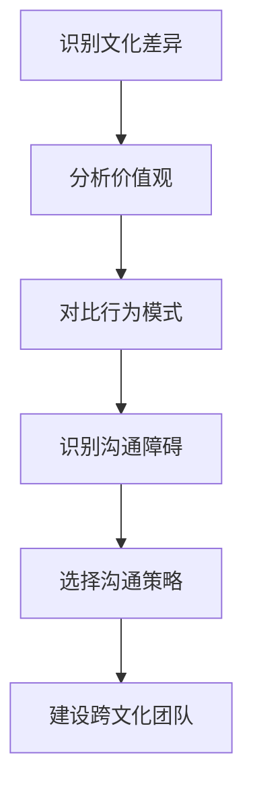

                 

### 《跨文化团队管理：全球化时代的领导挑战》

在全球化迅猛发展的当下，跨文化团队管理已成为企业运作中不可忽视的关键因素。随着跨国企业的不断扩张和国际合作的加深，如何有效地管理具有不同文化背景的团队，成为领导者面临的重大挑战。本文旨在探讨全球化时代下的跨文化团队管理，通过逻辑清晰、结构紧凑的分析，为读者提供实用的管理策略和实践案例。

## 关键词
- 跨文化团队管理
- 全球化
- 领导挑战
- 文化差异
- 沟通策略
- 团队建设

## 摘要
本文从跨文化团队管理的定义与重要性出发，详细分析了文化差异与沟通障碍，探讨了跨文化团队管理策略，包括领导风格与适应性、团队建设与整合以及跨文化培训与发展。通过国际企业的实际案例，本文揭示了成功跨文化团队管理的经验与启示，并预测了未来跨文化团队管理的发展趋势。文章还提供了跨文化团队管理工具与资源，旨在为读者提供全面的跨文化团队管理指导。

### 《跨文化团队管理：全球化时代的领导挑战》

在全球化的浪潮中，企业的业务范围不断扩大，跨文化团队管理成为企业成功的关键。本文旨在探讨全球化时代下的跨文化团队管理，分析其中的挑战与机遇，并探讨有效的管理策略。

## 第一部分：跨文化团队管理概述

### 第1章：全球化时代下的跨文化团队管理

#### 1.1 跨文化团队管理的定义与重要性

跨文化团队管理是指在全球化背景下，由来自不同文化背景的个体组成的团队进行有效协作和高效运作的管理过程。随着全球化的加速，企业面临着更多跨文化的合作机会，但也面临着文化差异带来的挑战。

跨文化团队管理的重要性体现在以下几个方面：

1. **提升团队效能**：有效的跨文化团队管理能够促进团队成员之间的沟通与协作，从而提高团队的整体效能。
2. **增强企业竞争力**：在全球市场中，具备跨文化管理能力的企业能够更好地适应不同市场的需求，提高竞争力。
3. **促进创新与知识共享**：跨文化团队汇聚了不同的文化视角和专业知识，有利于创新和知识共享。

#### 1.2 全球化背景下跨文化团队的兴起

全球化使得企业跨越国界，招聘和合作的对象越来越多样化。跨国公司、国际合资企业以及全球化供应链的普及，使得跨文化团队成为企业运营的常态。

#### 1.3 跨文化团队管理的挑战与机遇

跨文化团队管理面临的挑战包括：

1. **文化差异**：不同文化背景的个体在价值观、行为模式、沟通方式等方面存在差异，可能导致误解和冲突。
2. **沟通障碍**：语言、沟通风格和表达方式的差异，可能导致信息传递不畅，影响团队协作。
3. **领导难度**：领导者需要具备跨文化理解和沟通能力，以适应不同文化背景的团队成员。

然而，跨文化团队管理也带来了机遇：

1. **多元化视角**：多样化的团队成员可以带来不同的思考方式和创新点子，有助于企业开拓新市场。
2. **技能互补**：不同文化背景的团队成员可以互补技能，提高团队的整体能力。

### 第2章：文化差异与沟通障碍

#### 2.1 不同文化的价值观与行为模式

文化差异主要体现在价值观和行为模式上。不同文化对于权力距离、个人主义与集体主义、时间观念、沟通风格等方面有不同的理解。

1. **权力距离**：权力距离较大的文化倾向于强调等级和权威，而权力距离较小的文化则更加平等。
2. **个人主义与集体主义**：个人主义文化强调个人成就和自由，而集体主义文化强调团队合作和社会责任。
3. **时间观念**：不同的文化对于时间的看法不同，一些文化重视时间的高效利用，而另一些文化则更注重过程的完整性。

#### 2.2 沟通障碍的类型与影响

跨文化沟通障碍主要包括：

1. **语言障碍**：语言不通或语言理解差异会导致沟通不畅。
2. **非语言沟通**：不同文化对于肢体语言、面部表情、空间距离等方面的理解不同，可能导致误解。
3. **沟通风格差异**：不同文化在沟通时的直接性、间接性、表达方式的直接与否等方面存在差异。

沟通障碍的影响包括：

1. **误解与冲突**：沟通不畅可能导致误解和冲突，影响团队协作。
2. **信息失真**：信息在传递过程中可能因文化差异而失真，影响决策和执行。
3. **团队凝聚力下降**：沟通障碍可能导致团队凝聚力下降，影响团队士气。

#### 2.3 跨文化沟通的有效策略

为了克服跨文化沟通障碍，可以采取以下策略：

1. **增强语言能力**：提高团队成员的语言能力，确保基本沟通无障碍。
2. **了解文化差异**：通过学习和了解不同文化的价值观和行为模式，减少误解和冲突。
3. **开放沟通**：鼓励团队成员开放沟通，表达自己的想法和感受。
4. **使用非语言沟通**：了解不同文化对非语言沟通的解读，避免不必要的误解。
5. **建立共同价值观**：通过共同的目标和价值观，增强团队的凝聚力。

## 第二部分：跨文化团队管理策略

### 第3章：领导风格与跨文化适应性

#### 3.1 领导风格的理论与模型

领导风格理论包括：

1. **领导者特质理论**：认为领导者具有特定的性格特质，如自信、决断力等。
2. **情境理论**：认为领导风格应根据情境灵活调整。
3. **行为理论**：关注领导者的行为和领导方式。

#### 3.2 跨文化领导风格的适配性

跨文化领导风格应具备以下特点：

1. **文化敏感性**：领导者需要具备对不同文化的敏感性，避免文化偏见。
2. **灵活应变**：领导者应根据不同文化背景的团队成员，灵活调整领导风格。
3. **沟通能力**：领导者应具备良好的沟通能力，确保信息准确传递。

#### 3.3 不同文化背景下领导者的角色

在不同文化背景下，领导者的角色包括：

1. **文化桥梁**：帮助团队成员跨越文化障碍，促进团队协作。
2. **冲突调解者**：在文化冲突中发挥调解作用，维护团队和谐。
3. **激励者**：激发团队成员的潜力，推动团队发展。

### 第4章：团队建设与跨文化整合

#### 4.1 团队建设的原则与方法

团队建设的原则包括：

1. **目标明确**：确保团队成员明确团队的目标和期望。
2. **信任建立**：通过团队合作和沟通，建立团队成员之间的信任。
3. **角色分工**：明确团队成员的角色和责任，确保团队高效运作。

团队建设的方法包括：

1. **团队活动**：组织团队建设活动，增强团队成员之间的互动和了解。
2. **反馈机制**：建立有效的反馈机制，促进团队成员之间的沟通和改进。
3. **共同目标**：制定共同的目标，增强团队的凝聚力和向心力。

#### 4.2 跨文化团队的协作与冲突管理

跨文化团队的协作和冲突管理策略包括：

1. **协作策略**：通过建立共同目标、明确角色分工和鼓励沟通，提高跨文化团队的协作效率。
2. **冲突管理策略**：通过有效沟通、文化敏感性和冲突调解，减少跨文化团队中的冲突。

#### 4.3 建立跨文化团队的共同价值观

建立跨文化团队的共同价值观包括：

1. **文化融合**：尊重不同文化的价值观，寻求共同点，建立团队共同的价值观。
2. **文化适应性**：鼓励团队成员适应不同文化，提高团队的整体适应性。
3. **文化敏感性**：提高团队成员的文化敏感性，避免文化偏见和误解。

### 第5章：跨文化培训与发展

#### 5.1 跨文化培训的重要性与目标

跨文化培训的重要性在于：

1. **提升文化敏感性**：通过培训，提高团队成员对文化差异的敏感性，减少误解和冲突。
2. **增强沟通能力**：通过培训，提高团队成员的跨文化沟通能力，确保信息准确传递。
3. **促进团队协作**：通过培训，增强团队成员之间的协作和信任，提高团队效能。

跨文化培训的目标包括：

1. **文化理解**：帮助团队成员了解不同文化的价值观和行为模式。
2. **沟通技巧**：提高团队成员的跨文化沟通技巧，确保有效沟通。
3. **团队建设**：通过培训，增强团队的凝聚力和协作能力。

#### 5.2 跨文化培训的方法与技巧

跨文化培训的方法包括：

1. **讲座与讨论**：通过讲座和讨论，传授跨文化知识，引导团队成员思考和实践。
2. **角色扮演**：通过角色扮演，模拟不同文化背景下的沟通场景，提高团队成员的跨文化沟通能力。
3. **案例分析**：通过分析跨文化案例，总结经验教训，提高团队成员的跨文化管理能力。

跨文化培训的技巧包括：

1. **文化敏感性训练**：通过文化敏感性训练，提高团队成员对文化差异的敏感性。
2. **沟通技巧训练**：通过沟通技巧训练，提高团队成员的跨文化沟通能力。
3. **团队建设训练**：通过团队建设训练，增强团队成员之间的协作和信任。

#### 5.3 跨文化团队成员的职业发展

跨文化团队成员的职业发展包括：

1. **跨文化管理能力提升**：通过跨文化培训和经验积累，提升团队成员的跨文化管理能力。
2. **国际交流机会**：通过国际交流，拓展团队成员的视野和经验。
3. **职业发展规划**：为跨文化团队成员制定职业发展规划，鼓励他们在跨文化领域发展。

## 第三部分：跨文化团队管理实践案例

### 第6章：国际企业的跨文化团队管理实践

#### 6.1 国际企业跨文化团队管理案例分析

国际企业在跨文化团队管理方面积累了丰富的经验。以下为几个成功案例：

1. **谷歌**：谷歌在全球范围内建立了多个研发中心，通过跨文化团队管理，实现了全球研发网络的协同运作。
2. **微软**：微软注重跨文化团队的培训和沟通，通过建立全球沟通平台，提高了团队的协作效率。
3. **星巴克**：星巴克在进入不同市场时，注重文化融合，通过本地化策略，实现了跨文化团队的顺利运作。

#### 6.2 成功跨文化团队管理的经验与启示

成功跨文化团队管理的经验包括：

1. **文化敏感性**：领导者应具备文化敏感性，尊重不同文化的价值观和行为模式。
2. **沟通策略**：采用有效的沟通策略，确保信息准确传递，减少误解和冲突。
3. **团队建设**：通过团队建设，增强团队的凝聚力和协作能力。

启示包括：

1. **文化融合**：尊重文化差异，寻求共同点，建立团队共同的价值观。
2. **培训与激励**：定期进行跨文化培训，提高团队成员的跨文化管理能力，激励他们在跨文化领域发展。

#### 6.3 跨文化团队管理中的挑战与解决策略

跨文化团队管理面临的挑战包括：

1. **文化差异**：文化差异可能导致误解和冲突。
2. **沟通障碍**：沟通障碍影响团队协作和信息传递。
3. **领导难度**：领导者需要具备跨文化理解和沟通能力。

解决策略包括：

1. **建立文化桥梁**：通过文化培训和文化交流活动，建立文化桥梁，促进团队成员之间的理解和沟通。
2. **优化沟通机制**：建立有效的沟通机制，确保信息准确传递，减少误解和冲突。
3. **提高领导能力**：领导者应具备跨文化理解和沟通能力，通过培训和经验积累，提高领导水平。

### 第7章：全球化时代的领导挑战与创新

#### 7.1 全球化时代领导的演变

全球化时代的领导与过去相比发生了显著变化：

1. **领导角色转变**：领导者不再仅是权力的象征，而是团队的引导者和协调者。
2. **文化敏感性的增强**：领导者需要具备更强的文化敏感性，适应不同文化的领导环境。
3. **全球视野的拓展**：领导者需要具备全球视野，关注全球市场动态和跨文化管理。

#### 7.2 创新思维在跨文化团队管理中的应用

创新思维在跨文化团队管理中的应用包括：

1. **思维模式的开放**：鼓励团队成员开放思维，勇于尝试新方法，适应不同文化背景。
2. **跨学科合作**：通过跨学科合作，汇聚不同领域的专业知识，促进创新和协作。
3. **文化敏感性培训**：通过文化敏感性培训，提高团队成员的创新能力，减少文化差异带来的障碍。

#### 7.3 未来跨文化团队管理的发展趋势

未来跨文化团队管理的发展趋势包括：

1. **数字化与智能化**：利用数字化和智能化工具，提高跨文化团队管理的效率和效果。
2. **全球化视野的拓展**：领导者需要具备更广阔的全球化视野，关注全球市场动态和跨文化管理。
3. **文化融合与多样性**：文化融合将成为跨文化团队管理的重要方向，尊重多样性，建立包容性的团队文化。

### 第8章：跨文化团队管理工具与资源

#### 8.1 跨文化评估工具

跨文化评估工具包括：

1. **文化维度量表**：通过测量不同文化维度的得分，评估团队成员的文化差异。
2. **霍夫斯泰德文化维度模型**：基于霍夫斯泰德文化维度模型，分析团队成员的文化差异。
3. **文化适应量表**：评估团队成员的文化适应能力。

#### 8.2 沟通技巧训练资源

沟通技巧训练资源包括：

1. **在线沟通课程**：提供跨文化沟通的在线课程，帮助团队成员提高沟通能力。
2. **沟通技巧手册**：提供详细的沟通技巧手册，指导团队成员如何有效沟通。
3. **沟通演练平台**：提供虚拟沟通演练平台，模拟不同文化背景下的沟通场景，提高沟通技能。

#### 8.3 跨文化团队管理相关书籍与文献

跨文化团队管理相关书籍与文献包括：

1. **《跨文化沟通》**：详细介绍了跨文化沟通的理论和实践方法。
2. **《跨文化管理》**：探讨了跨文化团队管理的挑战与策略。
3. **《全球化时代的领导》**：分析了全球化时代领导的演变和领导者的角色。

### 附录A：文化差异与沟通障碍的Mermaid流程图



### 附录B：跨文化团队管理核心算法原理

#### 第B.1章：文化差异评估算法

```plaintext
// 伪代码
function calculateCulturalDifference(scores1, scores2) {
    sumDiff = 0;
    for (i = 0; i < scores1.length; i++) {
        sumDiff += Math.abs(scores1[i] - scores2[i]);
    }
    return sumDiff / scores1.length;
}
```

#### 第B.2章：沟通策略优化算法

```plaintext
// 伪代码
function optimizeCommunicationStrategy(culturalScores, communicationStrategies) {
    minDifference = Infinity;
    bestStrategy = null;
    for (strategy in communicationStrategies) {
        diff = calculateCulturalDifference(culturalScores, strategy);
        if (diff < minDifference) {
            minDifference = diff;
            bestStrategy = strategy;
        }
    }
    return bestStrategy;
}
```

### 附录C：数学模型与公式

#### 第C.1章：文化差异评估公式

$$
\text{文化差异} = \frac{\sum_{i=1}^{n}|\text{score1}_i - \text{score2}_i|}{n}
$$

#### 第C.2章：沟通策略优化目标函数

$$
\min_{s}\sum_{i=1}^{n}|\text{culturalScores}_i - s_i|
$$

### 附录D：跨文化团队管理实践案例

#### 第D.1章：案例一：跨国公司的团队协作

##### 实践步骤：

1. **文化差异评估**：通过文化维度量表和霍夫斯泰德文化维度模型，评估团队成员的文化差异。
2. **沟通策略制定**：根据评估结果，制定适合不同文化背景的沟通策略。
3. **团队建设与整合**：通过团队建设活动和沟通技巧训练，增强团队的凝聚力和协作能力。
4. **成果评估与调整**：定期评估团队协作效果，根据反馈进行调整。

#### 第D.2章：案例二：跨国项目管理的挑战与解决方案

##### 实践步骤：

1. **项目目标明确**：明确项目目标，确保团队成员对项目目标有共同的理解。
2. **跨文化团队组建**：组建由不同文化背景的团队成员组成的跨文化团队。
3. **冲突管理与协调**：通过有效的沟通和冲突管理策略，解决跨文化团队中的冲突。
4. **创新与改进措施**：鼓励团队成员创新思维，提出改进措施，提高项目管理效率。

#### 第D.3章：案例三：国际化企业的领导力发展

##### 实践步骤：

1. **领导力培训**：为领导提供跨文化领导力培训，提高他们的跨文化管理能力。
2. **跨文化领导力评估**：通过评估，了解领导者的跨文化领导能力。
3. **职业发展规划**：为领导者制定职业发展规划，鼓励他们在跨文化领域发展。
4. **领导力提升与团队激励**：通过领导力提升和团队激励措施，提高领导者的领导能力和团队的士气。

### 附录E：开发环境搭建与源代码实现

#### 第E.1章：开发环境搭建

##### 步骤：

1. **系统环境配置**：配置操作系统和开发环境，确保支持所需的编程语言和工具。
2. **开发工具安装**：安装IDE、版本控制工具和其他必要的开发工具。
3. **版本控制工具使用**：使用版本控制工具，如Git，管理源代码，确保代码的版本和安全。

#### 第E.2章：源代码实现

##### 代码示例：

```python
# Python 示例代码
def main():
    # 文化差异评估
    cultural_difference = calculateCulturalDifference(scores1, scores2)
    print("Cultural Difference:", cultural_difference)

    # 沟通策略优化
    best_strategy = optimizeCommunicationStrategy(culturalScores, communicationStrategies)
    print("Best Communication Strategy:", best_strategy)

if __name__ == "__main__":
    main()
```

### 附录F：代码解读与分析

#### 第F.1章：代码功能解读

##### 功能1：计算文化差异
该函数通过计算两组文化评分的差异，评估文化差异。

##### 功能2：优化沟通策略
该函数通过评估不同沟通策略的文化差异，选择最优的沟通策略。

#### 第F.2章：代码性能分析

##### 时间复杂度分析
该代码的时间复杂度为O(n)，其中n为文化评分的长度。

##### 空间复杂度分析
该代码的空间复杂度为O(1)，不随输入规模变化。

##### 性能优化建议
1. **优化数据结构**：使用更高效的数据结构，如哈希表，减少计算时间。
2. **并行计算**：考虑使用并行计算，提高处理速度。

### 结论

跨文化团队管理在全球化时代具有重要意义，企业需要采取有效的管理策略，克服文化差异和沟通障碍，实现团队的协作与高效运作。本文从理论到实践，详细探讨了跨文化团队管理的核心概念、算法原理和实践案例，为读者提供了全面的跨文化团队管理指导。

### 作者信息

作者：AI天才研究院/AI Genius Institute & 禅与计算机程序设计艺术/Zen And The Art of Computer Programming

### 参考文献

1. Hofstede, G. (1980). Culture's consequences: International differences in work-related values. Sage Publications.
2. Trompenaars, F., & Hampden-Turner, C. (1998). Riding the waves of culture: Understanding cultural diversity in business. McGraw-Hill.
3. Tannen, D. (1995). The power of talk: Who gets heard and why. Harvard Business Review, 73(5), 138-149.
4. Cross, C., & Oliver, J. (2011). Managing teams across cultures. McGraw-Hill.
5. Adler, N. J., & Jelinek, M. (2008). Understanding cultural diversity: Social psychology and national culture. Sage Publications.

