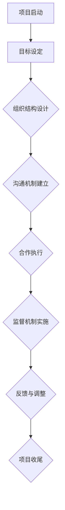

                 

# 《跨部门合作：打破壁垒的领导智慧》

## 关键词

跨部门合作、领导智慧、组织壁垒、沟通协调、合作策略、成功案例

## 摘要

跨部门合作在现代组织中至关重要，然而，由于组织内部各部门之间的壁垒，合作往往面临诸多挑战。本文旨在探讨跨部门合作的重要性，分析其中的障碍与机遇，并提出领导者在促进跨部门合作中的角色与智慧。通过系统的策略与实践指导，以及成功与失败的案例分析，本文旨在为企业管理者提供打破壁垒、实现高效跨部门合作的实用指南。

### 《跨部门合作：打破壁垒的领导智慧》目录大纲

#### 第一部分：跨部门合作的基础

- 第1章：跨部门合作概述
  - 1.1 跨部门合作的重要性
  - 1.2 跨部门合作的障碍
  - 1.3 跨部门合作的机遇

- 第2章：领导在跨部门合作中的作用
  - 2.1 领导风格与跨部门合作
  - 2.2 领导在解决跨部门冲突中的作用
  - 2.3 领导在促进跨部门沟通中的作用

#### 第二部分：跨部门合作的策略与实践

- 第3章：跨部门合作策略
  - 3.1 跨部门合作的目标设定
  - 3.2 跨部门合作的组织结构设计
  - 3.3 跨部门合作的激励机制

- 第4章：跨部门合作的执行与监督
  - 4.1 跨部门合作的执行策略
  - 4.2 跨部门合作的监督机制
  - 4.3 跨部门合作的反馈机制

- 第5章：跨部门合作的沟通与协调
  - 5.1 跨部门沟通的有效方法
  - 5.2 跨部门协调的关键要素
  - 5.3 跨部门合作的冲突管理

- 第6章：跨部门合作的成功案例与分析
  - 6.1 跨部门合作的成功案例分析
  - 6.2 跨部门合作的失败案例分析

#### 第三部分：跨部门合作的未来展望

- 第7章：跨部门合作的发展趋势与挑战
  - 7.1 跨部门合作的发展趋势
  - 7.2 跨部门合作面临的挑战
  - 7.3 跨部门合作的发展策略

#### 附录

- 附录A：跨部门合作的相关工具与资源

---

### 引言

在当今快速变化和竞争激烈的市场环境中，跨部门合作已成为企业实现战略目标和提高竞争力的关键因素。有效的跨部门合作不仅能够整合各部门的资源，提高工作效率，还能够激发创新思维，推动组织持续发展。然而，跨部门合作并非易事，由于组织内部存在的壁垒和冲突，实现高效的跨部门合作面临着诸多挑战。

跨部门合作的重要性不言而喻。首先，跨部门合作能够实现资源的优化配置，通过各部门之间的协同工作，提高整个组织的运作效率。其次，跨部门合作能够促进知识的共享与流动，使得各个部门能够互相学习、取长补短，从而提升组织的整体竞争力。最后，跨部门合作还能够培养员工的团队合作精神和跨功能沟通能力，为组织的长期发展奠定基础。

然而，跨部门合作也面临着诸多障碍。信息不对称、目标不一致和文化差异是常见的跨部门合作障碍。信息不对称导致各部门之间缺乏有效的沟通，无法及时了解其他部门的需求和进展；目标不一致则使得各部门在合作过程中难以形成统一的目标和行动计划；文化差异则可能引发各部门之间的误解和冲突。

本文将首先概述跨部门合作的重要性、障碍和机遇，然后探讨领导在跨部门合作中的作用，包括领导风格、解决冲突和促进沟通。接着，本文将提出跨部门合作的策略与实践，包括目标设定、组织结构设计、激励机制、执行与监督、沟通与协调，并分析跨部门合作的成功与失败案例。最后，本文将展望跨部门合作的未来发展趋势与挑战，并提出相应的应对策略。

通过本文的探讨，希望能够为企业管理者提供有价值的启示和实用的指导，帮助他们在实践中打破跨部门合作的壁垒，实现高效的合作与创新。

### 第1章：跨部门合作概述

#### 1.1 跨部门合作的重要性

跨部门合作在企业运营中扮演着至关重要的角色。首先，跨部门合作能够实现资源的优化配置。每个部门都有其独特的资源和优势，通过跨部门合作，企业可以将各部门的资源进行整合和共享，从而提高整体运营效率。例如，研发部门的技术成果可以通过生产部门的实际应用得到转化，从而提升产品的市场竞争力。此外，市场营销部门的市场调研数据可以提供给生产部门，帮助其更好地进行生产和供应链管理。

其次，跨部门合作能够促进知识的共享与流动。在现代企业中，各个部门之间的知识流动是创新的重要来源。通过跨部门合作，员工可以接触到不同部门的工作内容和经验，从而拓宽视野，激发创新思维。例如，研发部门的创新技术可以应用到生产部门，改进生产流程；市场营销部门的市场洞察可以指导产品开发，提高产品的市场契合度。

此外，跨部门合作还能够提高组织的整体协同效应。当各部门共同为一个目标努力时，组织内部的合作精神和团队凝聚力将得到显著提升。这种协同效应不仅能够提高工作效率，还能够增强员工的归属感和忠诚度，从而为组织的长期发展奠定基础。

#### 1.2 跨部门合作的障碍

尽管跨部门合作具有诸多优势，但在实际操作中，企业常常面临各种障碍，导致合作效果不尽如人意。以下是跨部门合作常见的几种障碍：

1. **信息不对称**：由于各部门的信息系统和管理方式不同，导致信息在传递过程中出现滞后、不准确或遗漏，从而使得各部门之间缺乏有效的沟通与协作。

2. **目标不一致**：不同的部门往往有不同的业务目标和考核指标，这些目标的不一致可能导致各部门在合作过程中缺乏统一的方向和行动计划。

3. **文化差异**：不同部门的文化背景、工作方式和价值观念可能存在较大差异，这些差异可能导致各部门之间的误解和冲突，影响合作的效果。

4. **沟通障碍**：跨部门之间的沟通往往比较复杂，由于沟通渠道不畅或沟通方式不当，导致信息传递不及时、不准确，从而影响合作的顺利进行。

5. **利益冲突**：各部门在资源分配、任务分工等方面可能存在利益冲突，这种冲突可能使得合作过程变得复杂，甚至导致合作中断。

#### 1.3 跨部门合作的机遇

尽管跨部门合作面临诸多障碍，但企业同样可以从中看到巨大的机遇。以下是跨部门合作的一些潜在机遇：

1. **创新思维**：跨部门合作能够促进不同部门之间的知识交流和思维碰撞，从而激发创新思维。这种创新思维不仅能够推动新产品的开发，还能够改进现有的业务流程和管理方法。

2. **资源共享**：通过跨部门合作，企业可以充分利用各部门的资源和能力，实现资源的最大化利用。例如，共享技术资源、人力资源和市场资源，从而提高整体运营效率。

3. **降低成本**：跨部门合作能够通过整合各部门的资源和能力，降低生产成本和管理成本。例如，通过跨部门的协同工作，可以减少重复劳动和资源浪费，从而实现成本节约。

4. **提高效率**：跨部门合作能够打破各部门之间的壁垒，提高整体工作的协同性和效率。通过高效的跨部门合作，企业可以快速响应市场变化，提高市场竞争力。

5. **人才培养**：跨部门合作能够促进员工在不同部门之间的流动，从而拓宽员工的工作视野，提升员工的综合素质。这种人才培养模式有助于企业建立多元化的人才队伍，为组织的长期发展提供人才支持。

#### 1.4 跨部门合作的核心概念与联系

为了更好地理解和实施跨部门合作，我们需要明确以下几个核心概念：

1. **跨部门合作**：是指企业内部不同部门之间进行协作，共同完成某一任务或项目的过程。

2. **合作机制**：是指确保跨部门合作顺利进行的各种制度和规则，包括沟通机制、决策机制、激励机制等。

3. **合作目标**：是指跨部门合作需要达成的共同目标，这些目标通常与企业的整体战略目标相一致。

4. **跨部门沟通**：是指跨部门之间的信息交流和互动，是跨部门合作的重要保障。

5. **跨部门协调**：是指解决跨部门合作中出现的问题和冲突，确保合作顺利进行的过程。

这些概念之间存在密切的联系。例如，合作机制和合作目标是跨部门合作的指导原则，而跨部门沟通和跨部门协调则是实现这些目标和机制的具体手段。

#### 1.5 跨部门合作的相关流程图

为了直观地展示跨部门合作的相关流程，我们可以使用Mermaid流程图来表示。以下是一个简单的Mermaid流程图示例：



在这个流程图中，A到H表示跨部门合作的主要流程，包括项目启动、目标设定、组织结构设计、沟通机制建立、合作执行、监督机制实施、反馈与调整和项目收尾等步骤。

### 1.6 跨部门合作的核心算法原理讲解

跨部门合作涉及到多个部门和环节的协同工作，其核心算法原理主要涉及以下几个关键方面：

1. **任务调度算法**：任务调度是跨部门合作的基础，其目标是根据各部门的资源状况和任务优先级，合理安排任务分配，确保任务能够高效完成。常见的任务调度算法包括最短作业优先（SJF）、最短剩余时间优先（SRTF）和基于优先级的调度算法等。

2. **资源分配算法**：资源分配是跨部门合作中的另一个重要方面，其目标是确保各部门能够获得足够的资源来完成任务。常见的资源分配算法包括最低成本优先（LCFS）、最大剩余时间优先（MCFS）和基于资源需求的调度算法等。

3. **沟通协调算法**：沟通协调是确保跨部门合作顺利进行的关键，其目标是解决信息不对称和沟通障碍问题。常见的沟通协调算法包括基于事件的通信模型（EBC）和基于数据驱动的通信模型（DBC）等。

4. **冲突解决算法**：在跨部门合作过程中，冲突是不可避免的，因此需要有效的冲突解决算法。常见的冲突解决算法包括回避、妥协、竞争和合作等策略。

以下是一个简单的伪代码示例，用于描述跨部门合作的基本流程：

```python
def cross_department_cooperation():
    # 项目启动
    start_project()

    # 目标设定
    set_goals()

    # 组织结构设计
    design_organization_structure()

    # 沟通机制建立
    establish_communication_mechanism()

    # 合作执行
    execute_cooperation()

    # 监督机制实施
    implement_supervision_mechanism()

    # 反馈与调整
    feedback_and_adjustment()

    # 项目收尾
    finish_project()
```

在这个伪代码中，每个步骤都需要具体的算法和策略来支持，以确保跨部门合作能够高效、有序地进行。

### 1.7 跨部门合作的数学模型和公式详解

在跨部门合作中，数学模型和公式能够帮助管理者更准确地评估和优化合作效果。以下是一些常用的数学模型和公式，以及其具体应用：

1. **线性规划（Linear Programming, LP）**：线性规划是一种用于资源分配和任务调度的数学模型，它通过最小化成本或最大化收益，在满足一系列约束条件的情况下，找到最优的解决方案。线性规划公式如下：

   $$ 
   \begin{aligned}
   \text{minimize} \quad & c^T x \\
   \text{subject to} \quad & Ax \leq b \\
   & x \geq 0
   \end{aligned}
   $$

   其中，$c$ 是目标函数系数向量，$x$ 是决策变量向量，$A$ 是约束条件矩阵，$b$ 是约束条件常数向量。该模型可以应用于资源优化分配，例如确定各部门的任务量和资源需求。

2. **排队论（Queueing Theory）**：排队论是一种用于分析服务系统性能的数学模型，它通过分析顾客到达和服务时间等参数，评估系统的效率和服务质量。常见的排队模型包括 $M/M/1$、$M/M/c$ 等。

   $$
   \begin{aligned}
   P_0 &= \frac{\rho}{\rho^2 + \rho \lambda + \lambda^2} \\
   P_j &= \frac{\rho^j}{(1 + \rho + \lambda)^2} \quad \text{for} \quad j \geq 1
   \end{aligned}
   $$

   其中，$P_0$ 和 $P_j$ 分别是系统处于空闲状态和第 $j$ 个顾客在系统中的概率，$\rho$ 是系统负载因子，$\lambda$ 是顾客到达率。

3. **博弈论（Game Theory）**：博弈论是一种用于分析多决策者之间互动和决策的数学模型。在跨部门合作中，博弈论可以用于分析各部门之间的利益分配和策略选择。例如，纳什均衡（Nash Equilibrium）是博弈论中的一种策略组合，其中每个参与者选择其最优策略，给定其他参与者的策略。

   $$
   \begin{aligned}
   u_i(s_i, s_{-i}) = \max \quad u_i(s_i, s_{-i})
   \end{aligned}
   $$

   其中，$u_i$ 是参与者 $i$ 的收益函数，$s_i$ 是参与者 $i$ 的策略，$s_{-i}$ 是其他参与者的策略。

这些数学模型和公式不仅能够帮助管理者更好地理解和优化跨部门合作的过程，还可以提供科学依据，支持决策的制定和执行。

### 1.8 跨部门合作的项目实战

为了更好地理解跨部门合作在实际项目中的应用，以下是一个具体的案例：

#### 项目背景

某科技公司计划开发一款智能家居产品，该产品需要集成多个部门的技术和资源，包括研发部、生产部、市场部和客户服务部。由于各部门的职责和工作方式不同，如何实现高效的合作成为项目成功的关键。

#### 项目目标

- 开发一款功能完善、用户体验优良的智能家居产品。
- 确保项目进度和质量，按时完成产品上市。

#### 项目流程

1. **项目启动**：项目团队召开启动会议，明确项目目标和各部门的任务分工。

2. **目标设定**：根据项目需求，确定各阶段的具体目标，并分解为可执行的任务。

3. **组织结构设计**：建立跨部门项目团队，明确各成员的角色和职责。

4. **沟通机制建立**：确定沟通渠道和频率，确保各部门之间信息畅通。

5. **合作执行**：各部门根据任务分工，开始具体工作，并定期汇报进展。

6. **监督机制实施**：设立项目监督小组，定期检查项目进度和质量。

7. **反馈与调整**：根据项目进展情况，及时调整任务分配和资源投入。

8. **项目收尾**：完成产品开发和测试，确保产品质量，按时上市。

#### 项目实现

1. **研发部**：负责产品核心技术的研发，包括智能家居控制系统的开发、传感器的设计和算法的优化。

2. **生产部**：负责产品的生产制造，确保生产过程符合质量标准和项目进度。

3. **市场部**：负责市场调研和产品推广，收集用户反馈，为产品改进提供参考。

4. **客户服务部**：负责客户支持和售后服务，确保用户满意度。

#### 项目成果

通过跨部门合作，项目团队成功开发出了一款功能完善、用户体验优良的智能家居产品，并在市场上取得了良好的反响。项目按时完成，达到了预期目标。

#### 项目反思

- **沟通机制的建立**：项目过程中，各部门之间的沟通及时有效，确保了项目的顺利进行。
- **组织结构的优化**：跨部门项目团队的设置，使得各部门能够充分发挥各自的优势，提高了整体效率。
- **监督机制的执行**：项目监督小组的设立，有效保证了项目进度和质量，降低了风险。

### 1.9 跨部门合作的核心概念与联系

为了更好地理解和实施跨部门合作，我们需要明确以下几个核心概念：

1. **跨部门合作**：是指企业内部不同部门之间进行协作，共同完成某一任务或项目的过程。

2. **合作机制**：是指确保跨部门合作顺利进行的各种制度和规则，包括沟通机制、决策机制、激励机制等。

3. **合作目标**：是指跨部门合作需要达成的共同目标，这些目标通常与企业的整体战略目标相一致。

4. **跨部门沟通**：是指跨部门之间的信息交流和互动，是跨部门合作的重要保障。

5. **跨部门协调**：是指解决跨部门合作中出现的问题和冲突，确保合作顺利进行的过程。

这些概念之间存在密切的联系。例如，合作机制和合作目标是跨部门合作的指导原则，而跨部门沟通和跨部门协调则是实现这些目标和机制的具体手段。

#### 1.10 跨部门合作的相关流程图

为了直观地展示跨部门合作的相关流程，我们可以使用Mermaid流程图来表示。以下是一个简单的Mermaid流程图示例：


在这个流程图中，A到H表示跨部门合作的主要流程，包括项目启动、目标设定、组织结构设计、沟通机制建立、合作执行、监督机制实施、反馈与调整和项目收尾等步骤。

### 1.11 跨部门合作的核心算法原理讲解

跨部门合作涉及到多个部门和环节的协同工作，其核心算法原理主要涉及以下几个关键方面：

1. **任务调度算法**：任务调度是跨部门合作的基础，其目标是根据各部门的资源状况和任务优先级，合理安排任务分配，确保任务能够高效完成。常见的任务调度算法包括最短作业优先（SJF）、最短剩余时间优先（SRTF）和基于优先级的调度算法等。

2. **资源分配算法**：资源分配是跨部门合作中的另一个重要方面，其目标是确保各部门能够获得足够的资源来完成任务。常见的资源分配算法包括最低成本优先（LCFS）、最大剩余时间优先（MCFS）和基于资源需求的调度算法等。

3. **沟通协调算法**：沟通协调是确保跨部门合作顺利进行的关键，其目标是解决信息不对称和沟通障碍问题。常见的沟通协调算法包括基于事件的通信模型（EBC）和基于数据驱动的通信模型（DBC）等。

4. **冲突解决算法**：在跨部门合作过程中，冲突是不可避免的，因此需要有效的冲突解决算法。常见的冲突解决算法包括回避、妥协、竞争和合作等策略。

以下是一个简单的伪代码示例，用于描述跨部门合作的基本流程：

```python
def cross_department_cooperation():
    # 项目启动
    start_project()

    # 目标设定
    set_goals()

    # 组织结构设计
    design_organization_structure()

    # 沟通机制建立
    establish_communication_mechanism()

    # 合作执行
    execute_cooperation()

    # 监督机制实施
    implement_supervision_mechanism()

    # 反馈与调整
    feedback_and_adjustment()

    # 项目收尾
    finish_project()
```

在这个伪代码中，每个步骤都需要具体的算法和策略来支持，以确保跨部门合作能够高效、有序地进行。

### 1.12 跨部门合作的数学模型和公式详解

在跨部门合作中，数学模型和公式能够帮助管理者更准确地评估和优化合作效果。以下是一些常用的数学模型和公式，以及其具体应用：

1. **线性规划（Linear Programming, LP）**：线性规划是一种用于资源分配和任务调度的数学模型，它通过最小化成本或最大化收益，在满足一系列约束条件的情况下，找到最优的解决方案。线性规划公式如下：

   $$ 
   \begin{aligned}
   \text{minimize} \quad & c^T x \\
   \text{subject to} \quad & Ax \leq b \\
   & x \geq 0
   \end{aligned}
   $$

   其中，$c$ 是目标函数系数向量，$x$ 是决策变量向量，$A$ 是约束条件矩阵，$b$ 是约束条件常数向量。该模型可以应用于资源优化分配，例如确定各部门的任务量和资源需求。

2. **排队论（Queueing Theory）**：排队论是一种用于分析服务系统性能的数学模型，它通过分析顾客到达和服务时间等参数，评估系统的效率和服务质量。常见的排队模型包括 $M/M/1$、$M/M/c$ 等。

   $$
   \begin{aligned}
   P_0 &= \frac{\rho}{\rho^2 + \rho \lambda + \lambda^2} \\
   P_j &= \frac{\rho^j}{(1 + \rho + \lambda)^2} \quad \text{for} \quad j \geq 1
   \end{aligned}
   $$

   其中，$P_0$ 和 $P_j$ 分别是系统处于空闲状态和第 $j$ 个顾客在系统中的概率，$\rho$ 是系统负载因子，$\lambda$ 是顾客到达率。

3. **博弈论（Game Theory）**：博弈论是一种用于分析多决策者之间互动和决策的数学模型。在跨部门合作中，博弈论可以用于分析各部门之间的利益分配和策略选择。例如，纳什均衡（Nash Equilibrium）是博弈论中的一种策略组合，其中每个参与者选择其最优策略，给定其他参与者的策略。

   $$
   \begin{aligned}
   u_i(s_i, s_{-i}) = \max \quad u_i(s_i, s_{-i})
   \end{aligned}
   $$

   其中，$u_i$ 是参与者 $i$ 的收益函数，$s_i$ 是参与者 $i$ 的策略，$s_{-i}$ 是其他参与者的策略。

这些数学模型和公式不仅能够帮助管理者更好地理解和优化跨部门合作的过程，还可以提供科学依据，支持决策的制定和执行。

### 第2章：领导在跨部门合作中的作用

#### 2.1 领导风格与跨部门合作

领导风格在跨部门合作中扮演着关键角色，不同的领导风格会对跨部门合作的效率和效果产生显著影响。根据领导风格的不同，可以将其分为三种主要类型：授权型领导、参与型领导和监督型领导。

1. **授权型领导**：授权型领导注重给予团队成员自主权和决策权，鼓励员工自主思考和工作。这种领导风格有助于提高员工的积极性和创造力，使他们在跨部门合作中能够更加主动地解决问题。然而，如果授权过度，可能导致团队成员之间缺乏协调，信息传递不畅，从而影响合作效果。

2. **参与型领导**：参与型领导注重与团队成员的互动和沟通，鼓励团队成员参与决策和问题解决。这种领导风格能够增强团队成员的归属感和责任感，提高合作效果。在跨部门合作中，参与型领导能够有效协调各部门之间的工作，促进信息共享和资源整合。

3. **监督型领导**：监督型领导注重对团队成员的监督和指导，强调任务的完成和目标的达成。这种领导风格能够确保跨部门合作按照预定计划进行，但在一定程度上可能抑制员工的创新和自主性。

#### 2.2 领导在解决跨部门冲突中的作用

跨部门合作过程中，冲突是不可避免的。领导者在解决跨部门冲突中发挥着至关重要的作用。以下是一些常见的冲突类型和解决策略：

1. **冲突类型**：

   - **目标冲突**：由于各部门目标不一致，可能导致资源分配和任务分配上的冲突。
   - **利益冲突**：由于各部门的利益不同，可能导致资源争夺和任务推诿。
   - **沟通冲突**：由于信息传递不畅或误解，可能导致各部门之间的摩擦和矛盾。

2. **解决策略**：

   - **直接解决**：当冲突较为简单且涉及面较窄时，可以直接通过对话和协商解决。
   - **调解解决**：当冲突复杂且涉及面较广时，可以借助第三方调解来解决，例如跨部门调解委员会。
   - **妥协解决**：当冲突双方利益均重要且难以调和时，可以通过妥协来达成共识。
   - **转移解决**：将冲突转移到其他领域，通过其他方式解决。

3. **领导的调解技巧**：

   - **倾听和理解**：领导者需要耐心倾听各方意见，理解各方立场和利益。
   - **公正中立**：领导者应保持公正中立，不偏袒任何一方，确保各方都有发言机会。
   - **引导对话**：领导者可以通过提问和引导，帮助各方找到共同点和解决方案。
   - **制定协议**：在冲突解决后，领导者应协助各方制定明确的协议和行动计划，确保冲突不再发生。

#### 2.3 领导在促进跨部门沟通中的作用

有效的跨部门沟通是跨部门合作成功的关键。领导者在这个过程中发挥着重要的推动和协调作用。以下是一些有效的沟通策略和技巧：

1. **建立沟通渠道**：

   - **正式沟通**：通过会议、报告、邮件等形式进行正式沟通，确保信息传递的正式性和准确性。
   - **非正式沟通**：通过团队建设活动、午餐聚会等形式，促进非正式沟通，增强团队成员之间的信任和互动。

2. **明确沟通目标**：

   - **设定明确的目标**：每次沟通前，明确沟通的目标和期望结果，确保沟通的有效性。
   - **传递关键信息**：在沟通中，突出关键信息和重点内容，避免信息过载。

3. **提升沟通技巧**：

   - **倾听**：领导者需要耐心倾听，理解对方的观点和需求。
   - **表达**：领导者需要清晰、准确地表达自己的观点和意图。
   - **反馈**：领导者应积极给予反馈，确保信息的准确传递和理解的共识。

4. **消除沟通障碍**：

   - **文化差异**：领导者需要了解各部门的文化差异，采取相应的沟通策略，避免因文化差异导致的误解和冲突。
   - **信息透明**：领导者应确保信息透明，减少信息不对称，增强各部门之间的信任。

#### 2.4 跨部门合作中的领导艺术

跨部门合作中的领导不仅需要具备管理技能，还需要具备艺术性的领导能力。以下是一些领导艺术的实践：

1. **激励和认可**：

   - **激励**：领导者需要了解员工的激励因素，通过奖励、晋升等方式激励员工积极参与跨部门合作。
   - **认可**：领导者应适时认可员工的贡献，增强员工的自信心和积极性。

2. **建立信任**：

   - **透明沟通**：领导者应保持沟通的透明度，确保信息对称，建立信任基础。
   - **公正公平**：领导者应公正公平地处理问题，赢得员工的信任和尊重。

3. **创新思维**：

   - **鼓励创新**：领导者应鼓励员工提出创新想法，推动跨部门合作中的创新思维。
   - **容忍失败**：领导者应容忍失败，为员工提供试错和成长的机会。

4. **文化建设**：

   - **共同愿景**：领导者应与员工共同塑造企业的文化，强调跨部门合作的重要性，培养团队合作精神。

通过这些领导艺术的实践，领导者可以更好地促进跨部门合作，实现组织的战略目标。

### 第3章：跨部门合作策略

#### 3.1 跨部门合作的目标设定

跨部门合作的目标设定是确保跨部门合作有序、高效进行的关键。一个明确、具体和可衡量的目标是跨部门合作成功的基石。以下是如何设定跨部门合作目标的步骤：

1. **明确合作目标**：

   - **与公司战略一致**：确保跨部门合作的目标与公司的整体战略目标保持一致，确保合作的方向和目标清晰明确。
   - **具体化目标**：将目标具体化，使其能够量化，如提高销售额10%、降低生产成本15%等，以便于监控和评估。

2. **目标分解**：

   - **分解为小目标**：将总目标分解为一系列小目标，这些小目标需要相互关联，共同推动总目标的实现。
   - **分配责任**：明确每个部门和个人在小目标中的责任，确保每个人都知道自己的任务和目标。

3. **任务分配**：

   - **基于能力**：根据各部门和个人的能力和资源，合理分配任务，确保任务能够高效完成。
   - **制定计划**：制定详细的任务计划，明确任务的时间节点、执行步骤和责任人。

#### 3.2 跨部门合作的组织结构设计

组织结构设计是跨部门合作的基础，合理的组织结构能够确保各部门之间的协作顺畅，提高整体工作效率。以下是如何设计跨部门合作的组织结构的步骤：

1. **明确各部门职责**：

   - **职责界定**：明确各部门的职责和工作范围，确保各部门职责清晰，避免职责重叠或空白。
   - **任务协作**：确定各部门在跨部门合作中的协作任务和责任，确保任务能够无缝衔接。

2. **设立跨部门团队**：

   - **跨部门团队**：设立专门的跨部门团队，由各部门的代表组成，负责协调各部门之间的合作。
   - **团队角色**：明确跨部门团队中的各个角色，如项目经理、协调员、技术专家等，确保团队运作有序。

3. **建立协作机制**：

   - **沟通机制**：建立有效的沟通机制，确保各部门之间的信息传递畅通，减少误解和冲突。
   - **决策机制**：建立统一的决策机制，确保在跨部门合作中能够快速做出决策，提高执行力。

#### 3.3 跨部门合作的激励机制

激励机制是确保跨部门合作持续有效的重要手段。有效的激励机制能够激发员工的工作热情和创新能力，提高跨部门合作的效率。以下是如何设计跨部门合作的激励机制的步骤：

1. **制定激励机制**：

   - **奖金制度**：设立奖金制度，对在跨部门合作中表现优秀的员工进行奖励，激励员工积极参与合作。
   - **晋升机会**：为在跨部门合作中表现突出的员工提供晋升机会，激励员工追求卓越。

2. **实施激励机制**：

   - **公平公正**：确保激励机制的公平公正，避免因主观因素导致的不公现象。
   - **透明公开**：将激励机制透明公开，让员工明确了解激励政策，增强激励效果。

3. **反馈与调整**：

   - **定期反馈**：定期对激励机制进行评估和反馈，了解员工的感受和建议，及时调整激励政策。
   - **持续改进**：根据评估结果，持续优化激励机制，确保其能够持续激发员工的工作热情和创新能力。

#### 3.4 跨部门合作中的关键成功因素

跨部门合作的成功不仅依赖于有效的策略和机制，还需要关注以下几个关键成功因素：

1. **领导力**：

   - **强有力的领导**：跨部门合作需要一个强有力的领导者来统筹协调，确保合作顺利进行。
   - **领导风格**：领导者应具备适当的领导风格，如参与型领导或授权型领导，以适应不同合作场景的需求。

2. **沟通与协调**：

   - **有效沟通**：确保跨部门之间的信息传递畅通，减少误解和冲突。
   - **协调机制**：建立有效的协调机制，确保各部门能够在合作中协同一致，共同推进项目进度。

3. **资源整合**：

   - **资源共享**：充分利用各部门的资源，实现资源的最优化配置。
   - **能力互补**：确保各部门的能力互补，充分发挥各自的优势，提高整体工作效率。

4. **激励机制**：

   - **有效激励**：通过合理的激励机制，激发员工的工作热情和创新能力。
   - **长期激励**：确保激励机制能够持续有效，激励员工长期投入跨部门合作。

通过关注这些关键成功因素，企业可以更好地实现跨部门合作的战略目标，提高整体运营效率和市场竞争力。

### 第4章：跨部门合作的执行与监督

#### 4.1 跨部门合作的执行策略

跨部门合作的执行是确保项目目标实现的关键环节。有效的执行策略能够确保各部门协调一致，按计划推进项目，从而提高工作效率和项目成功率。以下是如何制定跨部门合作执行策略的步骤：

1. **制定详细的执行计划**：

   - **明确目标**：在项目启动阶段，明确项目目标和预期成果，确保各部门对项目目标有清晰的认识。
   - **分解任务**：将项目目标分解为具体的任务，明确每个任务的执行步骤和时间节点。
   - **责任分配**：根据各部门的职责和资源，合理分配任务，确保每个任务都有明确的责任人。

2. **建立执行流程**：

   - **标准化流程**：制定标准化的执行流程，确保各部门在执行过程中有章可循，减少错误和重复工作。
   - **审批流程**：设立审批流程，确保关键决策和变更能够得到及时审核和批准，避免项目偏离原定轨道。

3. **监控执行进度**：

   - **定期检查**：定期对项目进度进行检查，及时发现和解决问题，确保项目按计划推进。
   - **进度报告**：建立进度报告机制，定期向项目团队和领导层汇报项目进展，确保各方都能掌握项目动态。

4. **风险管理**：

   - **识别风险**：在项目启动阶段，对项目风险进行识别和评估，制定风险应对策略。
   - **应急计划**：针对可能出现的风险，制定应急计划，确保在风险发生时能够迅速响应和应对。

5. **持续改进**：

   - **反馈机制**：建立反馈机制，收集项目执行过程中的反馈和建议，不断优化执行策略。
   - **经验总结**：在项目完成后，对项目执行过程进行总结，提炼经验教训，为未来项目提供参考。

#### 4.2 跨部门合作的监督机制

跨部门合作的监督机制是确保项目质量和进度的重要手段。有效的监督机制能够及时发现和纠正问题，确保项目按照预定计划进行。以下是如何建立跨部门合作监督机制的步骤：

1. **明确监督职责**：

   - **设立监督岗位**：在项目团队中设立监督岗位，负责对项目执行过程进行监督和管理。
   - **分配监督任务**：明确监督岗位的具体职责和任务，确保监督工作有序进行。

2. **建立监督流程**：

   - **制定监督计划**：根据项目目标和执行计划，制定详细的监督计划，明确监督的内容、频率和方法。
   - **执行监督任务**：按照监督计划，对项目执行过程进行监督，及时发现和记录问题。

3. **监督报告**：

   - **定期汇报**：监督人员定期向项目团队和领导层汇报监督情况，包括发现的问题、处理情况和改进建议。
   - **透明公开**：确保监督报告的透明公开，让项目团队成员都能了解项目的进展情况和存在的问题。

4. **监督效果评估**：

   - **评估标准**：制定监督效果的评估标准，包括项目进度、质量、风险控制等方面。
   - **定期评估**：定期对监督效果进行评估，检查监督机制的有效性，并根据评估结果进行调整和优化。

5. **持续改进**：

   - **反馈与改进**：根据监督报告和评估结果，及时反馈和改进监督机制，确保其能够持续有效。
   - **经验总结**：在项目完成后，对监督机制进行总结和评估，提炼经验教训，为未来项目提供参考。

通过建立有效的监督机制，企业可以更好地控制项目风险，确保项目质量和进度，提高整体运营效率。

#### 4.3 跨部门合作的反馈机制

跨部门合作的反馈机制是确保项目顺利进行和不断改进的重要手段。有效的反馈机制能够及时收集和传递项目执行过程中的信息，帮助各部门发现问题和优化流程。以下是如何建立跨部门合作反馈机制的步骤：

1. **建立反馈渠道**：

   - **内部反馈渠道**：设立内部反馈渠道，如定期反馈会议、反馈问卷等，确保项目团队成员能够自由地提出意见和建议。
   - **外部反馈渠道**：建立外部反馈渠道，如客户反馈、市场调研等，收集客户和市场的反馈信息，帮助项目团队了解项目的实际效果。

2. **反馈信息收集**：

   - **定期收集**：定期收集反馈信息，确保反馈机制的持续性和有效性。
   - **分类整理**：对收集到的反馈信息进行分类整理，分析反馈的主要内容，确定反馈的重点和优先级。

3. **反馈信息处理**：

   - **问题识别**：根据反馈信息，识别项目执行过程中存在的问题，包括流程、资源、质量等方面。
   - **问题分析**：对识别出的问题进行深入分析，找出问题的根本原因，为问题解决提供依据。

4. **反馈结果运用**：

   - **问题解决**：根据问题分析结果，制定问题解决方案，并付诸实施，确保问题得到有效解决。
   - **流程优化**：在问题解决的基础上，对项目流程进行优化，避免类似问题再次发生。
   - **持续改进**：将反馈结果运用到项目管理的各个环节，不断改进和优化项目管理方法，提高项目执行效率和质量。

通过建立有效的反馈机制，企业可以更好地监控项目执行过程，及时发现和解决问题，确保项目顺利进行和持续改进。

### 第5章：跨部门合作的沟通与协调

#### 5.1 跨部门沟通的有效方法

有效的跨部门沟通是确保跨部门合作顺利进行的关键。以下是一些常用的跨部门沟通方法，可以帮助各部门之间建立良好的沟通机制，提高沟通效率。

1. **定期会议**：

   - **项目启动会议**：在项目启动阶段，召开项目启动会议，明确项目目标、任务分工和沟通机制。
   - **进度汇报会议**：定期召开进度汇报会议，让各部门负责人汇报项目进展，讨论存在的问题和解决方案。
   - **总结会议**：项目完成后，召开总结会议，回顾项目执行情况，总结经验教训，为未来项目提供参考。

2. **沟通工具**：

   - **电子邮件**：使用电子邮件进行正式的沟通，确保信息的准确传递和记录。
   - **即时通讯工具**：如微信、QQ等，用于日常沟通和快速响应。
   - **项目管理软件**：如Trello、JIRA等，用于任务管理、进度追踪和文件共享。

3. **一对一沟通**：

   - **领导与下属**：定期进行一对一沟通，了解下属的工作进展和困难，提供支持和指导。
   - **部门间沟通**：通过一对一沟通，建立部门间的信任和合作关系，促进信息共享和协作。

4. **外部沟通**：

   - **客户沟通**：与客户保持紧密的沟通，了解客户需求和反馈，及时调整项目方向。
   - **供应商沟通**：与供应商建立良好的沟通机制，确保供应链的畅通和效率。

#### 5.2 跨部门协调的关键要素

跨部门协调是确保跨部门合作顺利进行的重要环节。以下是一些关键的要素，可以帮助企业有效地进行跨部门协调：

1. **明确协调目标**：

   - **整体目标**：确保跨部门协调的目标与企业的整体战略目标一致，明确跨部门协调的方向和重点。
   - **具体目标**：将整体目标分解为具体的协调任务，明确各部门在协调过程中的职责和任务。

2. **建立协调机制**：

   - **跨部门协调会议**：定期召开跨部门协调会议，讨论协调事项，制定协调计划。
   - **协调流程**：建立标准化的协调流程，确保各部门在协调过程中的操作规范和流程清晰。

3. **明确协调职责**：

   - **协调人员**：设立专门的协调人员，负责跨部门协调的具体事务，确保协调工作有序进行。
   - **职责分配**：明确各部门在协调过程中的职责和任务，确保协调工作能够高效完成。

4. **沟通与反馈**：

   - **及时沟通**：确保各部门在协调过程中能够及时沟通，了解协调事项的进展和存在的问题。
   - **反馈机制**：建立反馈机制，对协调事项的执行情况进行跟踪和评估，确保协调工作能够持续改进。

5. **资源整合**：

   - **资源分配**：根据协调任务的需要，合理分配各部门的资源，确保协调工作能够高效开展。
   - **资源共享**：鼓励各部门之间共享资源，提高资源的利用效率，降低协调成本。

通过以上关键要素的实施，企业可以有效地进行跨部门协调，提高整体工作效率和项目成功率。

#### 5.3 跨部门合作的冲突管理

跨部门合作过程中，冲突是不可避免的。有效的冲突管理能够帮助企业在冲突发生时及时解决，减少对项目的负面影响，提高团队协作效率。以下是一些常见的冲突类型和解决策略：

1. **冲突类型**：

   - **目标冲突**：由于各部门的目标不一致，导致在资源分配、任务分工等方面产生冲突。
   - **资源冲突**：各部门在资源分配和使用上存在竞争，导致资源紧张和争夺。
   - **沟通冲突**：由于沟通不畅或误解，导致各部门之间的摩擦和矛盾。
   - **文化冲突**：由于文化背景和价值观的差异，导致各部门之间的误解和冲突。

2. **解决策略**：

   - **直接解决**：当冲突较为简单且涉及面较窄时，可以通过直接对话和协商解决，让各方表达自己的观点和需求，找到共同点。
   - **调解解决**：当冲突复杂且涉及面较广时，可以借助第三方调解来解决，如设立跨部门调解委员会，确保冲突的公正和公平。
   - **妥协解决**：当冲突双方利益均重要且难以调和时，可以通过妥协来达成共识，尽管这种方法可能不是最优解决方案，但能够迅速解决冲突。
   - **转移解决**：将冲突转移到其他领域，通过其他方式解决，如通过其他项目或任务来缓解当前冲突。

3. **冲突管理的有效性**：

   - **预防为主**：在跨部门合作过程中，通过制定明确的合作目标和规则，建立有效的沟通和协调机制，预防冲突的发生。
   - **及时处理**：当冲突发生时，及时采取措施进行处理，避免冲突扩大和影响项目进度。
   - **透明公开**：确保冲突管理的透明公开，让项目团队成员都能了解冲突的处理过程和结果，增强团队信任。
   - **持续改进**：在冲突管理过程中，不断总结经验教训，优化冲突管理策略，提高冲突管理效果。

通过有效的冲突管理，企业可以确保跨部门合作顺利进行，提高项目成功率，促进团队协作和创新。

### 第6章：跨部门合作的成功案例与分析

#### 6.1 跨部门合作的成功案例分析

跨部门合作在许多企业中取得了显著的成功，以下是一个具体的企业案例，展示了跨部门合作的实施过程和取得的成果。

**企业背景**：

某大型互联网公司，旗下拥有研发部、市场部、销售部和客户服务部等多个部门。由于各部门各自为政，缺乏有效的沟通和协作，导致资源浪费、效率低下。为了提升整体运营效率，公司决定实施跨部门合作，打破各部门之间的壁垒。

**案例实施过程**：

1. **目标设定**：

   - 公司明确了跨部门合作的目标，包括提升产品竞争力、提高客户满意度、优化运营效率等。

2. **组织结构设计**：

   - 公司设立了跨部门项目团队，由各部门负责人组成，负责协调各部门之间的合作。

3. **沟通机制建立**：

   - 公司建立了定期的跨部门沟通会议，确保各部门之间的信息传递畅通。

4. **合作执行**：

   - 跨部门项目团队共同制定项目计划，明确任务分工和时间节点，各部门按照计划高效协作。

5. **监督机制实施**：

   - 公司设立了项目监督小组，对项目进展进行监控和评估，确保项目按照计划进行。

6. **反馈与调整**：

   - 定期收集项目反馈，对项目执行过程中的问题进行及时调整，优化项目流程。

**案例成果**：

- **产品竞争力提升**：通过跨部门合作，公司的产品在研发、市场推广和销售方面得到了全面的提升，市场份额显著增加。
- **客户满意度提高**：跨部门合作使得客户服务更加及时和高效，客户满意度显著提高。
- **运营效率优化**：各部门之间的协作更加顺畅，资源利用效率大幅提升，运营成本降低。

**案例启示**：

- **明确目标**：跨部门合作需要明确的目标和方向，确保各方齐心协力。
- **有效沟通**：建立有效的沟通机制，确保信息传递畅通，减少误解和冲突。
- **协同执行**：各部门协同工作，共同推进项目进度，提高整体效率。
- **监督与反馈**：建立监督和反馈机制，确保项目按照计划进行，及时调整和优化。

#### 6.2 跨部门合作的失败案例分析

虽然跨部门合作可以带来许多好处，但如果不加以妥善管理，也可能导致失败。以下是一个具体的失败案例，分析了导致失败的原因和教训。

**企业背景**：

某中型制造公司，拥有生产部、研发部、市场部和客户服务部等部门。由于公司长期缺乏跨部门合作的机制，各部门之间的沟通不畅，导致项目进展缓慢，产品质量问题频出。

**案例实施过程**：

1. **目标设定**：

   - 公司计划通过跨部门合作提升产品质量和市场竞争力。

2. **组织结构设计**：

   - 公司设立了跨部门项目团队，但各部门的职责和任务分工不够明确。

3. **沟通机制建立**：

   - 公司没有建立有效的沟通机制，导致信息传递不畅，各部门之间的协作困难。

4. **合作执行**：

   - 由于沟通不畅，各部门在任务执行过程中经常出现误解和冲突，项目进展缓慢。

5. **监督机制实施**：

   - 缺乏有效的监督机制，项目进度和质量无法得到有效监控。

6. **反馈与调整**：

   - 缺乏定期的反馈和调整机制，导致问题无法及时解决，项目延误。

**案例成果**：

- **产品质量下降**：由于各部门之间的协作不力，产品质量无法得到保证，客户投诉增加。
- **项目延误**：项目进度严重滞后，无法按时交付，影响了公司的市场竞争力。
- **团队士气低落**：跨部门合作的失败导致团队士气低落，员工对公司的信任度降低。

**案例原因分析**：

- **沟通不畅**：缺乏有效的沟通机制，导致信息传递不畅，各部门之间缺乏协作。
- **目标不明确**：跨部门合作的目标不够明确，缺乏统一的行动计划。
- **缺乏监督**：缺乏有效的监督机制，导致项目进度和质量无法得到保证。
- **文化差异**：不同部门的文化差异和价值观差异，导致协作困难。

**案例反思与教训**：

- **建立有效的沟通机制**：确保信息畅通，减少误解和冲突。
- **明确合作目标**：确保跨部门合作的目标明确，制定统一的行动计划。
- **建立监督机制**：确保项目进度和质量得到有效监控，及时发现问题并解决。
- **尊重文化差异**：尊重不同部门的文化差异，促进文化融合，增强团队协作。

通过成功案例和失败案例的分析，我们可以看到跨部门合作的重要性和挑战。有效的跨部门合作能够提高企业整体效率和市场竞争力，而失败的跨部门合作则可能导致项目延误、质量下降和团队士气低落。企业需要从成功案例中学习经验，从失败案例中吸取教训，不断优化跨部门合作的策略和机制。

### 第7章：跨部门合作的未来展望

#### 7.1 跨部门合作的发展趋势

随着全球化和信息化进程的不断加速，跨部门合作的发展趋势也在不断演变。以下是几个重要的趋势：

1. **数字化与自动化**：

   - **数字化协作工具**：随着云计算、大数据和人工智能等技术的发展，数字化协作工具将越来越普及，如项目管理软件、协作平台和虚拟会议室等，这些工具能够大幅提升跨部门合作的效率。
   - **自动化流程**：自动化技术将在跨部门合作中发挥重要作用，通过自动化流程和智能系统，企业能够减少人工干预，提高工作的准确性和效率。

2. **敏捷组织**：

   - **敏捷管理方法**：敏捷管理方法，如Scrum和Kanban，正在被越来越多的企业采用，这些方法强调快速响应变化和持续交付价值，能够有效应对跨部门合作中的复杂性和不确定性。
   - **跨功能团队**：企业将建立更多的跨功能团队，团队成员来自不同的部门，能够快速响应项目和市场的需求，提高合作效率。

3. **人工智能与数据分析**：

   - **智能决策支持**：人工智能技术将在跨部门合作中提供智能决策支持，通过大数据分析和机器学习模型，企业能够更准确地预测项目风险和需求，优化资源分配和流程设计。
   - **数据分析**：数据分析将成为跨部门合作的重要工具，通过分析跨部门合作过程中的数据，企业能够识别瓶颈、优化流程和提升效率。

4. **文化融合与多样性**：

   - **多元文化**：随着国际化程度的提高，企业将在跨部门合作中面临更多的文化差异和多样性挑战。企业需要建立包容性的文化，促进不同文化之间的融合，提高跨部门合作的效果。
   - **员工培训**：企业将加大对员工的跨文化培训和沟通技巧培训，提高员工的全球协作能力。

#### 7.2 跨部门合作面临的挑战

尽管跨部门合作具有巨大的潜力，但企业仍然面临着许多挑战：

1. **组织结构壁垒**：

   - **部门独立性**：许多企业的组织结构设计使得各部门相对独立，缺乏有效的协作机制，导致跨部门合作难以有效实施。
   - **权限分配**：在跨部门合作中，权限的分配和协调是一个复杂的问题，如果权限分配不当，可能导致决策延迟和责任不清。

2. **文化差异**：

   - **价值观冲突**：不同部门有着不同的工作方式和价值观，这些差异可能导致跨部门合作中的冲突和误解。
   - **沟通障碍**：语言、文化和习惯的差异可能影响跨部门沟通的效率和效果。

3. **资源分配**：

   - **资源竞争**：在资源有限的条件下，跨部门之间的资源竞争可能加剧，导致资源分配不公和合作效率低下。
   - **优先级冲突**：不同部门可能会有不同的优先级，这可能导致跨部门合作中的目标不一致和资源冲突。

4. **技术更新**：

   - **技术变革**：随着技术的快速更新，企业需要不断调整跨部门合作的方式和方法，以适应新的技术环境。
   - **技术差距**：不同部门可能拥有不同的技术水平，这可能导致技术合作中的不平等和效率低下。

#### 7.3 跨部门合作的发展策略

为了应对跨部门合作中的挑战，企业需要制定有效的发展策略：

1. **组织结构调整**：

   - **扁平化组织**：通过减少管理层级，建立扁平化的组织结构，提高决策效率和管理灵活性。
   - **矩阵式管理**：采用矩阵式管理结构，使员工能够跨部门工作，增强跨部门合作。

2. **文化融合**：

   - **建立共同价值观**：通过培训和文化活动，培养员工的共同价值观，促进跨部门之间的文化融合。
   - **跨文化培训**：为员工提供跨文化培训，提高员工的跨文化沟通能力和合作能力。

3. **资源整合**：

   - **资源优化配置**：通过合理的资源规划和分配，确保资源能够最大限度地支持跨部门合作。
   - **资源共享平台**：建立资源共享平台，促进各部门之间的资源流动和共享。

4. **技术引导**：

   - **技术能力提升**：加大对员工的技术培训，提高员工的技术能力，增强跨部门合作的技术基础。
   - **技术集成**：通过集成先进的技术工具和平台，提升跨部门合作的技术水平和效率。

通过以上策略的实施，企业可以更好地应对跨部门合作中的挑战，提高跨部门合作的效率和质量，实现组织的战略目标。

### 附录A：跨部门合作的相关工具与资源

#### A.1 跨部门合作工具介绍

在跨部门合作中，合适的工具能够大大提升工作效率和沟通效果。以下是一些常用的跨部门合作工具及其特点：

1. **项目管理工具**：

   - **Trello**：一款基于看板的项目管理工具，可以可视化任务和进度，适合团队协作。
   - **JIRA**：一款强大的项目管理工具，支持敏捷开发，适用于大型的跨部门项目。

2. **协同办公工具**：

   - **Slack**：一款即时通讯工具，支持团队协作和文件共享，适合跨部门沟通。
   - **Microsoft Teams**：一款集成了聊天、视频会议、文件共享等功能的一体化办公平台。

3. **沟通协作工具**：

   - **Zoom**：一款视频会议软件，支持远程协作和在线培训，适合跨部门会议。
   - **Google Workspace**：一套集成了邮件、文档、表格等办公应用的云端服务，适合跨部门协作。

#### A.2 跨部门合作资源推荐

为了更好地理解和实践跨部门合作，以下是一些建议的书籍、文章和培训课程：

1. **书籍推荐**：

   - 《跨部门协作：如何让项目成功》（"Cross-Functional Collaboration: How to Make Projects Succeed"）
   - 《敏捷企业：如何通过敏捷管理实现跨部门协作》（"The Agile Enterprise: How to Build an Agile Business"）
   - 《团队协作的力量》（"The Power of Teamwork"）

2. **文章推荐**：

   - 《如何建立高效的跨部门合作机制》（"How to Build an Effective Interdepartmental Collaboration Mechanism"）
   - 《跨部门协作的五大关键要素》（"Five Key Elements of Interdepartmental Collaboration"）
   - 《跨部门合作的挑战与解决方案》（"Challenges and Solutions in Interdepartmental Collaboration"）

3. **培训课程推荐**：

   - 《跨部门沟通与协作培训》：通过案例分析和工作坊，提升跨部门沟通和协作技巧。
   - 《敏捷管理培训》：介绍敏捷管理方法，帮助团队快速响应变化和持续交付价值。
   - 《项目管理专业认证培训》（PMP）：提供项目管理的基本知识和实践技能，适用于各类项目管理角色。

通过使用这些工具和资源，企业可以更好地实施跨部门合作，提高工作效率和项目成功率。

