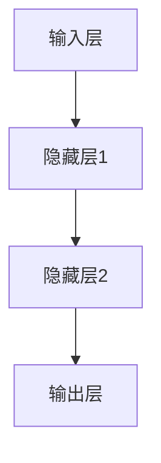
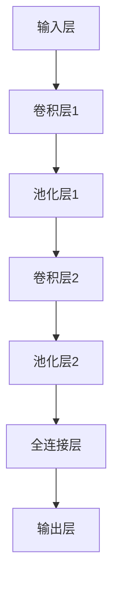
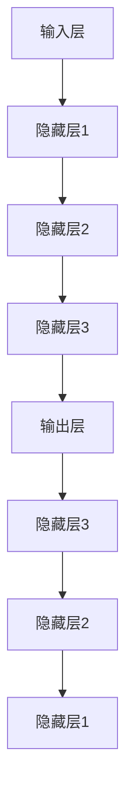
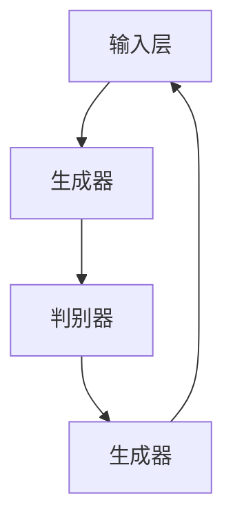

                 

### 第一部分：软件2.0时代的AI大模型基础

#### 第1章：软件2.0与AI大模型概述

> **关键词：**软件2.0，AI大模型，云计算，大数据，深度学习，企业级应用

> **摘要：**本文将探讨软件2.0时代的到来以及AI大模型在这一时代中的核心地位，介绍大模型的概念及其在软件2.0中的作用，并分析软件2.0对企业级应用开发的影响。

**1.1 软件2.0时代的到来**

软件2.0时代是指软件从单纯的代码和功能设计，转向更加注重用户体验、服务和数据驱动的时代。这个时代以云计算、大数据和移动设备的发展为背景，软件不再仅仅是静态的程序，而是动态的、智能化的服务。

**1.1.1 从软件1.0到软件2.0的演进**

软件1.0时代主要是指计算机软件的早期阶段，以操作系统和应用程序为主，强调功能和性能。随着互联网的普及，软件1.0逐渐发展到互联网应用，如网页浏览器、电子邮件等。然而，这些应用仍然停留在传统的客户端-服务器架构，数据存储和处理主要在服务器端。

软件2.0时代则是在云计算和大数据的推动下，软件开始向云端迁移，数据的存储、处理和分析都在云端进行。这种分布式架构使得软件更加灵活、可扩展，能够更好地满足用户的需求。

**1.1.2 大模型在软件2.0中的核心地位**

AI大模型是软件2.0时代的核心技术之一。大模型指的是具有巨大参数量的神经网络模型，如Transformer、BERT等。这些模型通过深度学习算法从大量数据中学习知识，具备强大的表征和预测能力。

在软件2.0时代，大模型被广泛应用于自然语言处理、计算机视觉、推荐系统等领域，为软件提供了智能化的功能。例如，在自然语言处理领域，大模型可以用于语音识别、机器翻译、文本生成等任务；在计算机视觉领域，大模型可以用于图像分类、目标检测、图像生成等任务。

**1.1.3 企业级应用开发的新范式**

传统的企业级应用开发通常以业务需求为导向，通过自顶向下的方法进行设计和开发。然而，在软件2.0时代，企业级应用开发需要更加灵活、快速地响应市场变化和用户需求。

软件2.0下的企业级应用开发范式强调以数据为中心，通过大数据分析和机器学习算法，从海量数据中提取有价值的信息，为企业提供智能化的决策支持。同时，软件2.0还提倡微服务架构、DevOps等先进技术，提高开发效率和软件质量。

**1.2 大模型在软件2.0中的优势**

1. **强大的表征能力**：大模型通过学习大量数据，可以提取出高维特征，使得模型在处理复杂任务时具有更强的表征能力。
2. **自适应性强**：大模型可以自动调整参数，适应不同的数据和任务，无需手动调整。
3. **高效性**：大模型在处理大规模数据时，具有更高的计算效率和性能。
4. **泛化能力**：大模型在训练过程中学习了丰富的知识，可以应用到新的任务和数据中，具有较好的泛化能力。

**1.3 软件2.0对企业级应用开发的影响**

1. **软件开发流程的改变**：软件2.0时代的软件开发流程更加灵活、迭代，强调快速交付和持续集成。
2. **对开发人员的要求提高**：软件2.0要求开发人员具备更多的技能，如大数据处理、机器学习等。
3. **对企业的挑战**：企业需要适应软件2.0时代的变革，投入更多的资源和精力进行数字化转型。

通过以上分析，我们可以看到软件2.0时代已经到来，AI大模型在这一时代中扮演着重要的角色。接下来，我们将深入探讨AI大模型的技术基础，了解其原理和应用。

---

**本章关键词：**软件2.0，AI大模型，深度学习，企业级应用，软件开发流程，数字化转型

---

<|assistant|>### 第2章：AI大模型技术基础

#### 2.1 深度学习与神经网络基础

深度学习是人工智能的一个重要分支，其核心思想是通过多层神经网络模型来学习数据的特征和规律。本节将介绍深度学习的基础知识，包括神经网络的基本结构、常见的深度学习架构和深度学习优化算法。

**2.1.1 神经网络的基本结构**

神经网络是由大量的神经元（或称为节点）通过连接（或称为边）构成的图形结构。一个简单的神经网络通常包括输入层、隐藏层和输出层。

1. **输入层**：接收外部输入数据，并将其传递给隐藏层。
2. **隐藏层**：对输入数据进行处理，提取特征，并将其传递给下一层。
3. **输出层**：根据隐藏层的输出数据，生成最终输出。

一个典型的神经网络模型如下所示：



**2.1.2 单层感知机**

单层感知机是最简单的神经网络模型，它只有一个隐藏层。单层感知机通过线性变换和阈值函数来实现数据的分类。

伪代码如下：

```python
# 输入向量 x
# 权重向量 w
# 阈值 theta

def perceptron(x, w, theta):
    z = dot_product(w, x) + theta
    if z >= 0:
        return 1
    else:
        return 0
```

**2.1.3 多层感知机**

多层感知机（MLP）是包含多个隐藏层的神经网络模型。与单层感知机相比，多层感知机可以通过非线性变换来提取更高层次的特征。

伪代码如下：

```python
# 输入向量 x
# 权重矩阵 W
# 阈值向量 Theta

def MLP(x, W, Theta):
    z = dot_product(W, x) + Theta
    a = sigmoid(z)
    return a
```

**2.1.4 反向传播算法**

反向传播算法是一种用于训练神经网络的算法，其核心思想是通过梯度下降法来调整网络的权重和阈值，使得网络的输出误差最小。

伪代码如下：

```python
# 输入数据 X
# 标签数据 Y
# 权重矩阵 W
# 阈值向量 Theta

for each epoch:
    for each training sample (x, y):
        # 前向传播
        z = dot_product(W, x) + Theta
        a = sigmoid(z)
        
        # 计算误差
        error = y - a
        
        # 反向传播
        delta = error * derivative(sigmoid, z)
        Theta += learning_rate * delta
        
        # 更新权重
        W += learning_rate * dot_product(delta, x.T)
```

**2.1.5 常见的深度学习架构**

1. **卷积神经网络（CNN）**

卷积神经网络是一种用于处理图像数据的深度学习模型，其核心思想是通过卷积操作来提取图像的特征。

CNN的基本结构如下：



2. **循环神经网络（RNN）**

循环神经网络是一种用于处理序列数据的深度学习模型，其核心思想是通过循环连接来保存之前的信息。

RNN的基本结构如下：



3. **生成对抗网络（GAN）**

生成对抗网络是一种用于生成数据的深度学习模型，其核心思想是通过两个神经网络（生成器和判别器）的对抗训练来生成逼真的数据。

GAN的基本结构如下：



**2.1.6 深度学习优化算法**

1. **随机梯度下降（SGD）**

随机梯度下降是一种最简单的优化算法，其核心思想是通过随机选取样本，计算梯度并更新模型参数。

伪代码如下：

```python
# 模型参数 W
# 学习率 alpha

for each epoch:
    for each training sample (x, y):
        # 前向传播
        z = dot_product(W, x)
        a = sigmoid(z)
        
        # 计算误差
        error = y - a
        
        # 反向传播
        delta = error * derivative(sigmoid, z)
        
        # 更新权重
        W -= alpha * delta
```

2. **Adam优化器**

Adam优化器是一种结合了SGD和Adagrad优点的优化算法，其核心思想是通过自适应调整学习率来提高模型的收敛速度。

伪代码如下：

```python
# 模型参数 W
# 学习率 alpha
# 衰减率 beta1, beta2

m = 0
v = 0

for each epoch:
    for each training sample (x, y):
        # 前向传播
        z = dot_product(W, x)
        a = sigmoid(z)
        
        # 计算误差
        error = y - a
        
        # 反向传播
        delta = error * derivative(sigmoid, z)
        
        # 更新 m 和 v
        m = beta1 * m + (1 - beta1) * delta
        v = beta2 * v + (1 - beta2) * (delta ** 2)
        
        # 计算一阶和二阶矩估计
        m_hat = m / (1 - beta1 ** epoch)
        v_hat = v / (1 - beta2 ** epoch)
        
        # 更新权重
        W -= alpha * m_hat / (sqrt(v_hat) + epsilon)
```

**2.1.7 其他优化算法**

除了SGD和Adam，还有一些其他的优化算法，如RMSprop、AdaGrad等。这些算法主要通过不同的方式调整学习率，以加快模型的收敛速度。

1. **RMSprop**

RMSprop算法通过计算梯度平方的平均值来调整学习率。

伪代码如下：

```python
# 模型参数 W
# 学习率 alpha
# 衰减率 beta

v = 0

for each epoch:
    for each training sample (x, y):
        # 前向传播
        z = dot_product(W, x)
        a = sigmoid(z)
        
        # 计算误差
        error = y - a
        
        # 反向传播
        delta = error * derivative(sigmoid, z)
        
        # 更新 v
        v = beta * v + (1 - beta) * (delta ** 2)
        
        # 更新权重
        W -= alpha / (sqrt(v) + epsilon)
```

2. **AdaGrad**

AdaGrad算法通过计算每个参数梯度的平方和来调整学习率。

伪代码如下：

```python
# 模型参数 W
# 学习率 alpha

for each epoch:
    for each training sample (x, y):
        # 前向传播
        z = dot_product(W, x)
        a = sigmoid(z)
        
        # 计算误差
        error = y - a
        
        # 反向传播
        delta = error * derivative(sigmoid, z)
        
        # 更新权重
        W -= alpha / (sqrt(sum(delta ** 2)) + epsilon)
```

通过以上介绍，我们可以看到深度学习与神经网络的基础知识是构建AI大模型的重要基石。在下一节中，我们将进一步探讨自然语言处理技术的基础，为理解AI大模型在软件2.0中的应用奠定基础。

---

**本章关键词：**深度学习，神经网络，卷积神经网络（CNN），循环神经网络（RNN），生成对抗网络（GAN），随机梯度下降（SGD），Adam优化器

---

<|assistant|>### 第2章：AI大模型技术基础

#### 2.2 自然语言处理技术概览

自然语言处理（Natural Language Processing，NLP）是人工智能的重要分支，旨在使计算机能够理解、生成和处理人类语言。在本节中，我们将介绍NLP的基本概念，包括词嵌入技术、序列模型与注意力机制，以及转换器架构。

**2.2.1 词嵌入技术**

词嵌入（Word Embedding）是将自然语言文本转换为向量表示的一种技术。词嵌入的主要目的是捕捉词语之间的语义关系，使得相似的词语在向量空间中更接近。

1. **One-hot编码**

One-hot编码是一种简单的词嵌入方法，它将每个词映射为一个向量，向量中只有一个元素为1，其余元素均为0。

例如，对于词汇表{“apple”, “banana”, “orange”}，One-hot编码的结果如下：

```
apple: [1, 0, 0]
banana: [0, 1, 0]
orange: [0, 0, 1]
```

然而，One-hot编码存在维度灾难（dimensionality disaster）问题，即词汇量增加时，向量维度急剧上升，导致计算复杂度和存储需求增大。

2. **Word2Vec**

Word2Vec是由Google提出的一种词嵌入方法，它通过训练一个神经网络来学习词向量。Word2Vec有两种主要的训练方法：连续词袋（Continuous Bag of Words，CBOW）和Skip-gram。

- **CBOW**：给定一个目标词，CBOW通过上下文词的平均表示来预测目标词。

  伪代码如下：

  ```python
  # 输入上下文词向量 C
  # 目标词向量 W
  # 隐藏层表示 H

  def CBOW(C, W, H):
      H = tanh(dot_product(C, W))
      return dot_product(H, W.T)
  ```

- **Skip-gram**：给定一个目标词，Skip-gram通过目标词的表示来预测上下文词。

  伪代码如下：

  ```python
  # 输入目标词向量 W
  # 上下文词向量 C
  # 隐藏层表示 H

  def SkipGram(W, C, H):
      H = tanh(dot_product(W, H))
      return dot_product(H, C.T)
  ```

3. **GloVe**

GloVe（Global Vectors for Word Representation）是由Stanford University提出的一种基于矩阵分解的词嵌入方法。GloVe通过训练一个全局矩阵来学习词向量，能够更好地捕捉词与词之间的语义关系。

  伪代码如下：

  ```python
  # 输入词向量 W
  # 矩阵因子 U 和 V

  for each word w in vocabulary:
      Uw = U[:, w]
      Vw = V[w, :]

      for each context word c of w:
          fw(c) = exp(similarity(Uw, Vc))
  ```

**2.2.2 序列模型与注意力机制**

序列模型（Sequence Model）是一种用于处理序列数据的神经网络模型，如循环神经网络（RNN）和长短期记忆网络（LSTM）。这些模型通过记忆序列中的信息来捕捉时间序列数据中的依赖关系。

1. **RNN与LSTM**

- **RNN**：循环神经网络（RNN）是一种能够处理序列数据的神经网络，其核心思想是通过循环连接来保存之前的信息。

  伪代码如下：

  ```python
  # 输入序列 X
  # 隐藏层状态 H
  # 输出序列 Y

  for each time step t:
      Ht = tanh(Wx * Xt + Wh * Ht-1 + b)
      Yt = sigmoid(Wy * Ht + by)
  ```

- **LSTM**：长短期记忆网络（LSTM）是RNN的一种变体，通过引入门控机制来克服传统RNN的长期依赖问题。

  伪代码如下：

  ```python
  # 输入序列 X
  # 隐藏层状态 H
  # 输出序列 Y

  for each time step t:
      ft = sigmoid(ot * ft-1)
      it = sigmoid(ot * it-1)
      ct = ft * ct-1 + it * tanh(Wc * Xt + Wh * Ht-1 + bc)
      Ht = ot * tanh(ct)
      Yt = sigmoid(Wy * Ht + by)
  ```

2. **GRU**：门控循环单元（GRU）是LSTM的简化版，通过引入更新门和控制门来替代LSTM的输入门、遗忘门和输出门。

  伪代码如下：

  ```python
  # 输入序列 X
  # 隐藏层状态 H
  # 输出序列 Y

  for each time step t:
      zt = sigmoid(ot * zt-1)
      rt = sigmoid(ot * rt-1)
      ht = (1 - zt) * ht-1 + zt * tanh(Wr * Xt + Wh * Ht-1 + br + bh)
      Ht = ot * ht
      Yt = sigmoid(Wy * Ht + by)
  ```

3. **注意力机制**：注意力机制（Attention Mechanism）是一种用于捕捉序列数据中重要信息的机制，它通过动态调整权重来聚焦于序列的特定部分。

  伪代码如下：

  ```python
  # 输入序列 X
  # 隐藏层状态 H
  # 输出序列 Y

  for each time step t:
      att_weights = softmax(dot_product(Ht, H))
      context_vector = sum(att_weights * H)
      Ht = tanh(Wc * Xt + context_vector + bc)
      Yt = sigmoid(Wy * Ht + by)
  ```

**2.2.3 转换器架构详解**

转换器架构（Transformer Architecture）是由Google在2017年提出的一种用于处理序列数据的新型神经网络模型。与传统的RNN和LSTM相比，转换器架构具有更高的并行计算能力和更好的性能。

1. **Encoder-Decoder架构**：转换器架构的核心是编码器（Encoder）和解码器（Decoder）。编码器用于将输入序列转换为上下文向量，解码器则根据上下文向量生成输出序列。

   伪代码如下：

   ```python
   # 输入序列 X
   # 输出序列 Y

   Encoder:
   for each word in X:
       Ht = EncoderLayer(Ht-1)

   Decoder:
   for each word in Y:
       Ht = DecoderLayer(Ht-1, EncoderOutput)
   ```

2. **自注意力机制**：自注意力机制（Self-Attention Mechanism）是转换器架构的核心组件，它通过计算输入序列中每个词与所有其他词的相似度来生成注意力权重。

   伪代码如下：

   ```python
   # 输入序列 X
   # 隐藏层状态 H

   for each word in X:
       Q = Q * K
       V = V * K
       att_weights = softmax(dot_product(Q, K))
       context_vector = sum(att_weights * V)
       Ht = tanh(context_vector)
   ```

3. **转换器架构的优势与局限**：转换器架构在处理长距离依赖问题和并行计算方面具有显著优势，但在计算资源和存储需求方面也相对较高。此外，转换器架构在处理某些特定的序列任务时可能不如RNN和LSTM表现良好。

通过以上介绍，我们可以看到自然语言处理技术为AI大模型的应用提供了强大的基础。在下一节中，我们将进一步探讨大规模预训练模型原理，了解如何通过预训练来提高模型的性能和泛化能力。

---

**本章关键词：**词嵌入，自然语言处理（NLP），序列模型，注意力机制，转换器架构，循环神经网络（RNN），长短期记忆网络（LSTM），门控循环单元（GRU）

---

<|assistant|>### 第2章：AI大模型技术基础

#### 2.3 大规模预训练模型原理

大规模预训练模型是近年来人工智能领域的重要突破，其核心思想是通过在大量数据上进行预训练，使模型具备较强的通用表征能力，从而在多个任务上实现优异的性能。本节将介绍预训练的基本概念、自监督学习方法、迁移学习和微调技术。

**2.3.1 预训练的概念与意义**

预训练（Pretraining）是指在大规模数据集上对神经网络模型进行训练，使其在学习特定任务之前就具备一定的通用知识。预训练的目标是提高模型在未知数据上的泛化能力，使其能够适用于多种不同的任务。

预训练的意义在于：

1. **降低任务特定数据的需求**：通过预训练，模型在未见过的数据上也能取得较好的性能，从而降低对大量标注数据的依赖。
2. **提高模型的泛化能力**：预训练使模型能够从大量数据中学习到通用的特征和模式，提高模型在多种任务上的泛化能力。
3. **加速模型训练**：预训练模型在特定任务上只需进行微调，减少了训练时间。

**2.3.2 自监督学习方法**

自监督学习（Self-supervised Learning）是一种无需人工标注数据，而是利用数据本身的某些部分作为标签进行训练的方法。自监督学习在预训练中起到关键作用，它通过自动提取数据中的信息，使模型在未标记数据上学习。

自监督学习方法主要包括以下几种：

1. **遮盖词预测（Masked Language Model，MLM）**：在自然语言文本中，随机遮盖一部分词，然后使用其他词的上下文来预测被遮盖的词。

   伪代码如下：

   ```python
   # 输入文本句子 S
   # 隐藏词标记 M
   # 预测词向量 W

   for each word in S:
       if word is masked:
           predicted_word = predict(S, W)
           correct = (predicted_word == original_word)
           loss += -log(p(predicted_word | S))
   ```

2. **句子对分类（Next Sentence Prediction，NSP）**：给定一个句子，预测接下来的一句话是否与给定句子相关。

   伪代码如下：

   ```python
   # 输入句子对 (S1, S2)
   # 标签 T

   if is_next_sentence(S1, S2):
       correct = (T == 1)
   else:
       correct = (T == 0)
   loss += -log(p(T | S1, S2))
   ```

3. ** maskedBERT（ maskedBERT）**：在BERT模型的基础上，添加一个遮盖词预测任务，使模型在训练过程中同时学习词向量和上下文表示。

**2.3.3 语言模型预训练**

语言模型（Language Model，LM）是一种用于预测文本下一个单词的概率的模型。在预训练中，语言模型通常用于学习词向量和上下文表示。

1. **Word2Vec**：Word2Vec是一种基于神经网络的语言模型，通过训练一个神经网络来学习词向量。

   伪代码如下：

   ```python
   # 输入文本句子 S
   # 预测词向量 W

   for each word in S:
       predicted_word = predict(S, W)
       correct = (predicted_word == original_word)
       loss += -log(p(predicted_word | S))
   ```

2. **BERT**：BERT是Google提出的一种基于Transformer的语言模型，通过在大量文本上进行预训练，学习词向量和上下文表示。

   伪代码如下：

   ```python
   # 输入文本句子 S
   # 预测词向量 W
   # 隐藏层表示 H

   for each word in S:
       predicted_word = predict(S, W)
       correct = (predicted_word == original_word)
       loss += -log(p(predicted_word | S))

       # Next Sentence Prediction
       if next_sentence(S):
           correct_nsp = (T == 1)
           loss_nsp += -log(p(T | S))
   ```

**2.3.4 图像模型预训练**

图像模型（Image Model）是一种用于处理图像数据的神经网络模型。在预训练中，图像模型通常用于学习图像特征和图像表示。

1. **ResNet**：ResNet是一种基于残差网络的图像模型，通过在网络中引入残差模块来缓解梯度消失问题。

   伪代码如下：

   ```python
   # 输入图像 I
   # 预测标签 Y

   for each layer in ResNet:
       I = layer(I)

   predicted_label = predict(I)
   correct = (predicted_label == original_label)
   loss += -log(p(predicted_label | I))
   ```

2. **ViT**：ViT是一种基于Vision Transformer的图像模型，通过将图像分割成小块，然后使用Transformer结构来学习图像特征。

   伪代码如下：

   ```python
   # 输入图像 I
   # 预测标签 Y

   patches = split_image_into_patches(I)
   for each patch in patches:
       patch_embedding = Transformer(patch)

   predicted_label = predict(patch_embedding)
   correct = (predicted_label == original_label)
   loss += -log(p(predicted_label | patch_embedding))
   ```

**2.3.5 多模态预训练**

多模态预训练是指同时处理多种模态（如文本、图像、声音）的数据进行预训练。多模态预训练能够提高模型在多模态数据上的表征能力。

1. **M4M**：M4M是一种多模态预训练模型，通过联合训练文本、图像和音频模型，学习多模态特征表示。

   伪代码如下：

   ```python
   # 输入文本句子 S
   # 输入图像 I
   # 输入音频 A
   # 预测标签 Y

   text_embedding = BERT(S)
   image_embedding = ViT(I)
   audio_embedding = Wav2Vec(A)

   multimodal_embedding = concatenate(text_embedding, image_embedding, audio_embedding)
   predicted_label = predict(multimodal_embedding)
   correct = (predicted_label == original_label)
   loss += -log(p(predicted_label | multimodal_embedding))
   ```

**2.3.6 迁移学习与微调技术**

迁移学习（Transfer Learning）是一种利用已在不同任务上训练好的模型来提高新任务性能的方法。在预训练中，迁移学习通过将预训练模型微调到新任务上，从而提高模型在新任务上的性能。

1. **迁移学习**：迁移学习通过在预训练模型的基础上，对新任务进行微调，从而利用预训练模型的知识。

   伪代码如下：

   ```python
   # 预训练模型 M
   # 新任务数据集 D

   for each epoch in D:
       M = fine_tune(M, D)
   ```

2. **微调技术**：微调技术是一种通过调整预训练模型的权重来适应新任务的方法。微调通常在预训练模型的基础上，对新任务进行小规模的训练。

   伪代码如下：

   ```python
   # 预训练模型 M
   # 新任务数据集 D
   # 学习率 alpha

   for each epoch in D:
       for each sample in D:
           predicted_label = predict(M, sample)
           correct = (predicted_label == original_label)
           loss += -log(p(predicted_label | sample))

       M = update(M, loss, alpha)
   ```

通过以上介绍，我们可以看到大规模预训练模型在AI大模型中的应用具有重要意义。在下一节中，我们将探讨企业级AI应用开发准备，了解如何将AI大模型应用于实际的企业场景。

---

**本章关键词：**预训练，自监督学习，语言模型，图像模型，多模态预训练，迁移学习，微调技术

---

<|assistant|>### 第二部分：企业级AI应用开发准备

#### 第3章：企业AI战略规划

**3.1 AI在企业中的价值评估**

企业在引入AI技术时，首先需要对其潜在的价值进行评估。这包括以下几个方面：

**3.1.1 AI能力评估框架**

为了评估AI在企业中的应用能力，可以采用以下框架：

1. **技术能力评估**：评估企业现有的技术基础，包括数据处理能力、算法开发能力和计算资源。
2. **业务影响评估**：评估AI技术对企业业务流程的改进潜力，包括生产效率、成本降低、服务质量提升等方面。
3. **ROI评估**：通过预测AI技术引入后的经济效益，如成本节约、收益增加等，来评估其投资回报率（ROI）。

**3.1.2 AI项目ROI分析方法**

评估AI项目的ROI通常采用以下方法：

1. **成本效益分析（Cost-Benefit Analysis）**：计算AI项目实施的总成本与预期效益的比值，以确定其盈利能力。
2. **投资回收期（Payback Period）**：计算AI项目投资回收所需的时间，以衡量项目的风险。
3. **净现值（Net Present Value，NPV）**：通过折现未来现金流，计算AI项目的现值，以评估其投资价值。

**3.1.3 AI对企业业务流程的影响**

AI技术对企业的业务流程有显著的优化作用：

1. **自动化**：通过自动化流程，减少人工操作，提高生产效率。
2. **优化决策**：利用AI技术进行数据分析和预测，帮助企业做出更加精准的决策。
3. **个性化服务**：通过分析用户数据，提供个性化的产品推荐和服务，提升用户体验。

**3.2 AI大模型在企业中的实施策略**

企业在实施AI大模型时，需要考虑以下策略：

**3.2.1 企业采用AI大模型的挑战**

1. **数据隐私与安全**：确保AI模型使用的数据符合隐私法规，防范数据泄露。
2. **技术实力与人才缺口**：企业可能缺乏足够的AI技术实力和人才来开发和管理大模型。
3. **预算与资源限制**：实施AI大模型可能需要大量资金和计算资源，对企业预算构成压力。

**3.2.2 企业采用AI大模型的优势**

1. **提高生产效率**：通过自动化和优化流程，提高生产效率，降低运营成本。
2. **降低运营成本**：利用AI技术进行预测和优化，减少资源浪费和成本支出。
3. **创新产品与服务**：通过分析用户需求和市场趋势，推出创新的产品和服务，提升市场竞争力。

**3.2.3 企业AI大模型实施的策略与步骤**

企业实施AI大模型可以遵循以下策略和步骤：

1. **制定企业AI战略**：明确AI在企业中的定位和目标，制定长期和短期的AI战略规划。
2. **选择合适的AI大模型**：根据企业的业务需求和数据特点，选择合适的AI大模型进行开发和应用。
3. **构建AI开发团队**：组建专业的AI开发团队，确保有足够的技术实力来开发和维护AI大模型。
4. **实施AI大模型项目**：通过项目管理和迭代开发，逐步实施AI大模型，确保项目成功落地。

**3.3 AI大模型项目管理**

**3.3.1 项目管理的重要性**

在AI大模型项目中，项目管理起着至关重要的作用。有效的项目管理可以确保项目按计划进行，降低风险，提高项目的成功率。

**3.3.2 项目管理的方法与工具**

项目管理的方法包括：

1. **Scrum**：一种迭代式的项目管理方法，通过短周期的迭代和反馈来确保项目的灵活性和可预测性。
2. **Kanban**：一种基于可视化流程的管理方法，通过看板来跟踪项目进度和任务状态。

项目管理工具包括：

1. **Jira**：用于项目跟踪和任务管理的工具，可以实时监控项目进度和团队协作。
2. **Trello**：一个基于看板的项目管理工具，通过简单的卡片和列表来跟踪任务和项目进度。

**3.3.3 项目风险管理**

项目风险管理是项目管理的重要一环，包括以下方面：

1. **风险识别与评估**：识别项目中的潜在风险，评估其可能性和影响。
2. **风险应对策略**：制定应对措施，降低风险的影响。
3. **风险监控与调整**：通过监控项目进展，及时调整风险应对策略，确保项目顺利进行。

通过以上分析，我们可以看到企业级AI应用开发需要充分准备和规划。在下一部分中，我们将通过具体案例展示AI大模型在金融和医疗领域的应用，进一步探讨AI大模型在企业中的实际应用价值。

---

**本章关键词：**企业AI战略规划，AI能力评估，ROI分析，AI业务流程优化，AI大模型实施策略，项目管理，风险识别与评估

---

<|assistant|>### 第4章：AI大模型在金融领域的应用

**4.1 金融市场预测**

金融市场预测是AI大模型在金融领域的一个重要应用，通过分析历史数据和市场趋势，预测未来的价格走势。以下将介绍金融市场预测中的数据预处理、大模型训练与优化以及预测结果分析与评估。

**4.1.1 数据预处理**

数据预处理是金融市场预测中的关键步骤，主要包括以下内容：

1. **数据收集**：收集历史价格数据、交易量数据、宏观经济指标数据等。
2. **数据清洗**：去除异常值、处理缺失值、标准化数据。
3. **特征提取**：通过统计方法或机器学习方法提取有用的特征，如价格变化率、交易量变化率、技术指标等。

**4.1.2 大模型训练与优化**

在数据预处理完成后，我们需要使用AI大模型对数据进行训练和优化。以下是一个简化的流程：

1. **模型选择**：选择适用于金融市场预测的模型，如LSTM、GRU或Transformer。
2. **模型训练**：使用训练数据集对模型进行训练，调整模型参数以优化性能。
3. **模型优化**：通过调整学习率、批量大小、正则化参数等，进一步提高模型性能。

**4.1.3 预测结果分析与评估**

在模型训练完成后，我们需要对预测结果进行分析和评估，以确保模型的可靠性和有效性。以下是一些常用的评估指标：

1. **均方误差（MSE）**：衡量预测值与真实值之间的差异，MSE越小说明预测效果越好。
2. **均方根误差（RMSE）**：MSE的平方根，更直观地反映预测误差。
3. **平均绝对误差（MAE）**：预测值与真实值之间的绝对误差的平均值。

**4.2 信贷风险评估**

信贷风险评估是金融领域中另一个重要的应用，通过分析借款人的信用历史、财务状况等信息，评估其违约风险。

**4.2.1 数据分析**

数据分析包括以下步骤：

1. **数据收集**：收集借款人的个人信息、信用记录、财务报告等。
2. **数据清洗**：处理缺失值、异常值，确保数据质量。
3. **特征提取**：提取与信用风险相关的特征，如信用评分、债务收入比等。

**4.2.2 大模型训练**

在数据分析完成后，我们可以使用AI大模型进行训练，以下是一个简化的流程：

1. **模型选择**：选择适用于信用风险评估的模型，如决策树、随机森林、XGBoost等。
2. **模型训练**：使用训练数据集对模型进行训练，调整模型参数以优化性能。
3. **模型优化**：通过交叉验证、网格搜索等方法，进一步优化模型参数。

**4.2.3 风险评估模型实现**

在模型训练完成后，我们需要实现风险评估模型，以下是一个简化的流程：

1. **风险评估指标设定**：根据业务需求，设定风险评估指标，如违约概率、风险评分等。
2. **模型应用**：将模型应用于新数据，进行风险评估。
3. **风险评估报告**：生成风险评估报告，提供决策支持。

**4.3 量化交易策略**

量化交易策略是利用AI大模型对市场数据进行分析，制定和执行交易策略，以实现投资收益的最大化。

**4.3.1 数据分析与处理**

数据分析与处理包括以下步骤：

1. **数据收集**：收集历史价格数据、交易量数据、技术指标等。
2. **数据预处理**：处理缺失值、异常值，进行数据归一化。
3. **特征提取**：提取与交易策略相关的特征，如价格变化率、交易量变化率等。

**4.3.2 大模型训练与优化**

在数据预处理完成后，我们可以使用AI大模型进行训练和优化，以下是一个简化的流程：

1. **模型选择**：选择适用于量化交易策略的模型，如LSTM、GRU或Transformer。
2. **模型训练**：使用训练数据集对模型进行训练，调整模型参数以优化性能。
3. **模型优化**：通过调整学习率、批量大小、正则化参数等，进一步提高模型性能。

**4.3.3 量化交易策略实现**

在模型训练完成后，我们需要实现量化交易策略，以下是一个简化的流程：

1. **策略设定**：根据市场数据和分析结果，设定交易策略，如买入、卖出、持有等。
2. **策略执行**：将策略应用于实际交易，根据市场情况调整策略。
3. **策略评估**：评估交易策略的收益和风险，优化策略。

通过以上案例，我们可以看到AI大模型在金融领域的广泛应用。在下一章中，我们将探讨AI大模型在医疗领域的应用，进一步展示AI大模型在实际业务中的价值。

---

**本章关键词：**金融市场预测，信贷风险评估，量化交易策略，数据预处理，大模型训练，预测结果分析，风险评估模型，量化交易策略实现

---

<|assistant|>### 第5章：AI大模型在医疗领域的应用

**5.1 医疗图像分析**

医疗图像分析是AI大模型在医疗领域的重要应用，通过处理医学影像数据，实现疾病诊断、病灶检测等功能。以下将介绍医疗图像分析中的数据预处理、大模型训练与优化以及图像分析应用案例。

**5.1.1 数据预处理**

医疗图像分析的数据预处理步骤包括：

1. **数据收集**：收集各种医学影像数据，如CT、MRI、X光片等。
2. **图像增强**：通过调整对比度、亮度等，提高图像质量。
3. **图像分割**：将图像中的不同区域分离，为后续分析提供基础。
4. **数据标准化**：统一图像大小和分辨率，方便模型处理。

**5.1.2 大模型训练与优化**

在数据预处理完成后，我们需要使用AI大模型对图像进行分析，以下是一个简化的流程：

1. **模型选择**：选择适用于图像分析的模型，如卷积神经网络（CNN）。
2. **模型训练**：使用训练数据集对模型进行训练，调整模型参数以优化性能。
3. **模型优化**：通过调整学习率、批量大小、正则化参数等，进一步提高模型性能。

**5.1.3 图像分析应用案例**

医疗图像分析的应用案例包括：

1. **肺部病变检测**：通过分析肺部CT图像，识别肺结节等病变。
2. **骨折检测**：通过分析X光片，检测骨折和骨骼损伤。

**5.2 疾病预测与诊断**

疾病预测与诊断是AI大模型在医疗领域的另一个重要应用，通过分析患者数据，预测疾病风险和诊断疾病。

**5.2.1 数据收集与处理**

疾病预测与诊断的数据收集与处理步骤包括：

1. **数据收集**：收集患者的健康记录、基因数据、临床指标等。
2. **数据清洗**：处理缺失值、异常值，确保数据质量。
3. **特征提取**：提取与疾病相关的特征，如血压、血糖、心率等。

**5.2.2 大模型训练与优化**

在数据预处理完成后，我们可以使用AI大模型进行训练和优化，以下是一个简化的流程：

1. **模型选择**：选择适用于疾病预测与诊断的模型，如LSTM、GRU等。
2. **模型训练**：使用训练数据集对模型进行训练，调整模型参数以优化性能。
3. **模型优化**：通过调整学习率、批量大小、正则化参数等，进一步提高模型性能。

**5.2.3 预测模型实现与评估**

在模型训练完成后，我们需要实现疾病预测模型，并进行评估，以下是一个简化的流程：

1. **预测模型设定**：根据业务需求，设定预测模型，如疾病风险评分、诊断结果等。
2. **模型应用**：将模型应用于新数据，进行疾病预测。
3. **模型评估**：评估预测模型的准确率、召回率等指标，优化模型。

**5.3 医疗健康大数据分析**

医疗健康大数据分析是AI大模型在医疗领域的另一个重要应用，通过分析海量医疗数据，优化医疗服务和资源配置。

**5.3.1 数据预处理**

医疗健康大数据分析的数据预处理步骤包括：

1. **数据收集**：收集各种医疗健康数据，如患者记录、医院日志等。
2. **数据清洗**：处理缺失值、异常值，确保数据质量。
3. **特征提取**：提取与医疗健康相关的特征，如疾病类型、就诊频率等。

**5.3.2 大模型训练与优化**

在数据预处理完成后，我们可以使用AI大模型进行训练和优化，以下是一个简化的流程：

1. **模型选择**：选择适用于医疗健康大数据分析的模型，如Transformer、BERT等。
2. **模型训练**：使用训练数据集对模型进行训练，调整模型参数以优化性能。
3. **模型优化**：通过调整学习率、批量大小、正则化参数等，进一步提高模型性能。

**5.3.3 医疗大数据分析应用**

医疗大数据分析的应用包括：

1. **疾病趋势分析**：通过分析历史医疗数据，预测疾病发展趋势，为疾病预防提供依据。
2. **医疗资源分配优化**：通过分析医疗资源使用情况，优化医疗资源分配，提高医疗服务效率。

通过以上案例，我们可以看到AI大模型在医疗领域的广泛应用。在下一章中，我们将探讨AI大模型开发实战，了解如何进行AI大模型的开发与优化。

---

**本章关键词：**医疗图像分析，疾病预测与诊断，医疗健康大数据分析，数据预处理，大模型训练，预测模型实现与评估

---

<|assistant|>### 第6章：AI大模型开发环境搭建

**6.1 硬件环境配置**

硬件环境配置是AI大模型开发的基础，它决定了模型的训练速度和效果。以下是硬件环境配置的关键步骤：

**6.1.1 GPU选择与配置**

GPU（Graphics Processing Unit）是AI大模型训练的重要硬件，其计算能力直接影响到模型的训练速度。以下是GPU选择和配置的要点：

1. **GPU性能比较**：不同品牌的GPU（如NVIDIA、AMD）在性能上有显著差异。选择GPU时，需要考虑计算能力、内存大小、功耗等因素。

2. **GPU配置策略**：根据训练任务的需求，合理配置GPU数量。例如，对于小规模的模型，单GPU可能足够；而对于大规模的模型，可能需要使用多GPU并行训练。

**6.1.2 硬件资源调度策略**

在多GPU环境下，硬件资源调度策略对于提高训练效率至关重要。以下是几种常见的硬件资源调度策略：

1. **数据并行**：将数据划分为多个部分，每个GPU负责处理一部分数据。这种方法适用于模型参数较少的模型。

2. **模型并行**：将模型划分为多个部分，每个GPU负责处理模型的一部分。这种方法适用于模型参数较多的模型。

3. **混合并行**：结合数据并行和模型并行，根据模型和数据的规模进行动态调度。这种方法能够充分利用GPU资源，提高训练效率。

**6.2 软件环境安装**

软件环境安装是AI大模型开发的重要环节，它包括Python环境配置和深度学习框架安装。以下是软件环境安装的步骤：

**6.2.1 Python安装与配置**

1. **Python版本选择**：Python有多种版本，如Python 2.x、Python 3.x。对于AI大模型开发，通常推荐使用Python 3.x版本，因为它具有更好的兼容性和功能支持。

2. **Python环境配置**：安装Python后，配置Python环境，包括安装必要的依赖库，如NumPy、Pandas等。

**6.2.2 深度学习框架安装（TensorFlow、PyTorch等）**

1. **TensorFlow安装**：TensorFlow是Google推出的一种开源深度学习框架，支持多种计算平台。安装TensorFlow可以使用以下命令：

   ```bash
   pip install tensorflow
   ```

2. **PyTorch安装**：PyTorch是Facebook AI Research推出的一种开源深度学习框架，以其灵活性和高效性著称。安装PyTorch可以使用以下命令：

   ```bash
   pip install torch torchvision
   ```

**6.3 数据预处理工具**

数据预处理是AI大模型开发的重要环节，它涉及到数据的收集、清洗、归一化等操作。以下是几种常用的数据预处理工具：

**6.3.1 Pandas、NumPy等库的使用**

1. **Pandas**：Pandas是一个Python数据分析库，提供数据清洗、转换和分析功能。

   ```python
   import pandas as pd
   data = pd.read_csv('data.csv')
   ```

2. **NumPy**：NumPy是一个Python科学计算库，提供高性能的数组操作和数学计算功能。

   ```python
   import numpy as np
   data = np.array(data)
   ```

**6.3.2 数据清洗、归一化、标准化等预处理方法**

1. **数据清洗**：处理缺失值、异常值等，提高数据质量。

   ```python
   data = data.dropna()  # 删除缺失值
   data = data[data['column'] != 'value']  # 删除特定值
   ```

2. **数据归一化**：将数据缩放到相同的范围，消除数据量级差异。

   ```python
   data = (data - data.min()) / (data.max() - data.min())
   ```

3. **数据标准化**：将数据转换为均值为0、标准差为1的分布。

   ```python
   data = (data - data.mean()) / data.std()
   ```

通过以上步骤，我们可以搭建一个完整的AI大模型开发环境。在下一章中，我们将深入探讨AI大模型开发与优化，包括数据集准备、大模型设计与实现以及模型优化与调参。

---

**本章关键词：**AI大模型开发环境，硬件环境配置，GPU选择，硬件资源调度，软件环境安装，Python配置，深度学习框架安装，数据预处理工具，数据清洗，数据归一化，数据标准化

---

<|assistant|>### 第7章：AI大模型开发与优化

**7.1 数据集准备**

数据集准备是AI大模型开发的重要环节，它决定了模型的训练效果和性能。以下是数据集准备的步骤和注意事项：

**7.1.1 数据收集与存储**

1. **数据收集**：根据训练任务的需求，收集相关的数据。数据来源可以包括公共数据集、企业内部数据、第三方数据提供者等。

2. **数据存储**：将收集到的数据存储在合适的存储系统中，如本地文件系统、数据库、分布式文件系统等。确保数据存储的安全性和可扩展性。

**7.1.2 数据标注与划分**

1. **数据标注**：对于监督学习任务，需要对数据进行标注。标注过程可以包括分类标注、回归标注、目标检测标注等。

2. **数据划分**：将数据集划分为训练集、验证集和测试集。通常，训练集用于模型训练，验证集用于模型调参和性能评估，测试集用于最终性能评估。

**7.2 大模型设计与实现**

大模型设计是实现AI大模型的关键步骤。以下是设计大模型的步骤：

**7.2.1 模型架构设计**

1. **模型选择**：根据任务需求和数据特点，选择合适的模型架构。常见的模型架构包括卷积神经网络（CNN）、循环神经网络（RNN）、Transformer等。

2. **模型架构设计**：设计模型的层次结构，包括输入层、隐藏层和输出层。确定每一层的神经元数量、激活函数、损失函数等。

**7.2.2 模型参数调整**

1. **初始化参数**：初始化模型的参数，包括权重、偏置等。常用的初始化方法有随机初始化、高斯初始化等。

2. **优化器选择**：选择合适的优化器，如随机梯度下降（SGD）、Adam等。优化器用于调整模型参数，以最小化损失函数。

**7.2.3 模型训练与评估**

1. **模型训练**：使用训练数据集对模型进行训练。训练过程中，模型通过学习数据中的规律，优化参数。

2. **模型评估**：使用验证集和测试集对模型进行评估。评估指标包括准确率、召回率、F1分数等。

**7.3 模型优化与调参**

模型优化与调参是提高模型性能的重要手段。以下是模型优化与调参的步骤：

**7.3.1 损失函数选择**

1. **损失函数概述**：损失函数用于衡量模型预测值与真实值之间的差距。常见的损失函数包括均方误差（MSE）、交叉熵损失等。

2. **损失函数选择**：根据任务类型和数据特点，选择合适的损失函数。例如，对于分类任务，可以选择交叉熵损失；对于回归任务，可以选择均方误差。

**7.3.2 优化算法选择**

1. **优化算法概述**：优化算法用于调整模型参数，以最小化损失函数。常见的优化算法包括随机梯度下降（SGD）、Adam、RMSprop等。

2. **优化算法选择**：根据训练数据和模型特点，选择合适的优化算法。例如，对于大规模数据，可以选择SGD；对于小规模数据，可以选择Adam。

**7.3.3 超参数调整策略**

1. **超参数概述**：超参数是模型训练过程中的可调整参数，如学习率、批量大小等。

2. **超参数调整方法**：常用的超参数调整方法包括网格搜索、随机搜索、贝叶斯优化等。

3. **超参数优化策略**：根据实验结果，调整超参数，以获得最佳模型性能。

**7.4 模型部署与集成**

模型部署是将训练好的模型应用于实际业务场景的重要步骤。以下是模型部署与集成的步骤：

**7.4.1 模型部署方法**

1. **模型导出**：将训练好的模型导出为可部署的格式，如ONNX、TensorFlow Lite等。

2. **部署环境配置**：配置模型部署的环境，包括硬件、操作系统、软件依赖等。

3. **模型服务化**：将模型部署为服务，以供其他系统或应用程序调用。

**7.4.2 模型集成方法**

1. **集成策略**：根据业务需求，设计模型集成策略。例如，可以将多个模型集成到一个系统，实现更准确的预测。

2. **集成评估**：评估模型集成后的性能，包括准确率、召回率等指标。

通过以上步骤，我们可以完成AI大模型的开发与优化，并将其应用于实际业务场景。在下一章中，我们将探讨AI大模型的技术发展趋势，了解未来AI大模型的发展方向。

---

**本章关键词：**数据集准备，数据收集与存储，数据标注与划分，模型架构设计，模型参数调整，模型训练与评估，模型优化与调参，损失函数选择，优化算法选择，超参数调整策略，模型部署与集成

---

<|assistant|>### 第五部分：未来展望

#### 第8章：AI大模型技术发展趋势

**8.1 大模型架构的演进**

随着AI技术的不断发展，大模型架构也在不断演进。以下是大模型架构的几个发展趋势：

**8.1.1 Transformer架构的发展**

Transformer架构是近年来在自然语言处理领域取得突破性进展的一种模型。其核心思想是使用自注意力机制（Self-Attention Mechanism）来捕捉输入序列中的长距离依赖关系。以下是一些Transformer架构的发展趋势：

1. **Transformer的变体**：研究人员提出了许多Transformer的变体，如BERT、GPT、ViT等，以适应不同的应用场景和任务需求。

2. **多模态Transformer**：多模态Transformer是一种同时处理多种模态（如图像、文本、声音）数据的模型。这种模型能够更好地捕捉不同模态之间的关联性，提高模型的泛化能力。

3. **动态Transformer**：动态Transformer是一种能够动态调整计算资源的模型。它可以根据任务需求和数据规模，动态调整模型的结构和计算资源，提高模型的效率和性能。

**8.1.2 多模态大模型的研究**

多模态大模型是近年来研究的热点之一。以下是多模态大模型的研究趋势：

1. **跨模态特征融合**：跨模态特征融合是多模态大模型的关键技术。研究人员提出了多种方法来融合不同模态的特征，如注意力机制、图神经网络等。

2. **多模态预训练**：多模态预训练是一种在大规模多模态数据集上预训练大模型的方法。这种方法能够提高模型在多模态数据上的表征能力，使其在多种任务上取得更好的性能。

3. **多模态交互机制**：多模态交互机制是研究如何使不同模态的信息在模型中相互影响的方法。研究人员提出了多种多模态交互机制，如注意力机制、多任务学习等。

**8.1.3 图神经网络的发展趋势**

图神经网络（Graph Neural Network，GNN）是一种用于处理图结构数据的神经网络。以下是一些图神经网络的发展趋势：

1. **图注意力机制**：图注意力机制是一种在GNN中引入注意力机制的方法。它能够更好地捕捉图中的结构信息，提高模型的表征能力。

2. **图神经网络与Transformer的融合**：研究人员提出了将图神经网络与Transformer架构相结合的方法，以利用两者的优点，提高模型的性能。

3. **动态图神经网络**：动态图神经网络是一种能够处理动态图结构（如图的动态变化）的模型。它能够更好地适应图结构的变化，提高模型的适应性。

**8.2 AI大模型在行业应用中的发展**

AI大模型在行业应用中的发展是非常迅速的。以下是一些行业应用的发展趋势：

**8.2.1 人工智能在制造业中的应用**

1. **智能制造**：智能制造是制造业发展的新趋势。AI大模型在智能制造中的应用包括生产过程优化、质量检测、设备维护等。

2. **预测性维护**：预测性维护是一种利用AI大模型预测设备故障的方法。这种方法能够减少设备的停机时间，提高生产效率。

3. **供应链管理**：AI大模型在供应链管理中的应用包括库存优化、需求预测、物流规划等。

**8.2.2 人工智能在医疗健康领域的应用前景**

1. **疾病预测与诊断**：AI大模型在疾病预测与诊断中的应用包括疾病早期检测、个性化治疗建议等。

2. **医疗大数据分析**：医疗大数据分析是一种利用AI大模型分析海量医疗数据的方法。这种方法能够提高医疗服务的效率和质量。

3. **医疗机器人**：医疗机器人是一种利用AI大模型实现自动化医疗操作的方法。它能够提高医疗服务的效率和安全性。

**8.2.3 人工智能在金融领域的创新发展**

1. **智能投顾**：智能投顾是一种利用AI大模型提供投资建议的方法。这种方法能够提高投资者的投资回报率。

2. **风险管理**：AI大模型在风险管理中的应用包括信用评分、市场预测、风险控制等。

3. **个性化金融服务**：AI大模型在个性化金融服务中的应用包括定制化金融产品、个性化金融服务推荐等。

**8.3 AI大模型安全与伦理问题**

随着AI大模型的广泛应用，其安全与伦理问题也日益受到关注。以下是一些AI大模型安全与伦理问题：

**8.3.1 大模型的安全风险与防范**

1. **数据隐私保护**：数据隐私保护是AI大模型安全的一个重要方面。研究人员提出了多种数据隐私保护方法，如差分隐私、联邦学习等。

2. **模型攻击与防御**：模型攻击与防御是保护AI大模型安全的重要手段。研究人员提出了多种模型攻击和防御方法，如对抗样本、对抗训练等。

**8.3.2 大模型的伦理问题与规范**

1. **算法偏见**：算法偏见是AI大模型伦理问题的一个重要方面。研究人员提出了多种方法来消除算法偏见，如公平性分析、反事实分析等。

2. **透明性与可解释性**：透明性与可解释性是AI大模型伦理问题的另一个重要方面。研究人员提出了多种方法来提高模型的透明性和可解释性，如可解释AI、可视化技术等。

**8.3.3 AI大模型监管政策的发展**

1. **政府监管政策**：政府监管政策是确保AI大模型安全和伦理的重要手段。各国政府正在制定和实施一系列监管政策，以规范AI大模型的应用和发展。

2. **行业自律**：行业自律是AI大模型监管的一个重要方面。行业协会和组织正在制定和推广一系列行业规范，以促进AI大模型的健康发展。

通过以上分析，我们可以看到AI大模型技术在未来的发展趋势。AI大模型在各个行业的应用将不断拓展，同时安全与伦理问题也将成为研究的重要方向。在下一章中，我们将总结全文内容，回顾AI大模型的关键概念和应用场景。

---

**本章关键词：**Transformer架构，多模态大模型，图神经网络，制造业应用，医疗健康应用，金融领域创新，AI大模型安全与伦理问题，监管政策

---

<|assistant|>### 附录A：AI大模型开发工具与资源

**A.1 主流深度学习框架对比**

深度学习框架是AI大模型开发的重要工具，以下是几种主流深度学习框架的对比：

1. **TensorFlow**：由Google开发，支持多种编程语言（如Python、C++），具有丰富的生态系统和大量的预训练模型。适用于大规模分布式训练和部署。

2. **PyTorch**：由Facebook开发，以动态计算图著称，易于调试和优化。适用于研究和原型开发，也支持大规模分布式训练和部署。

3. **JAX**：由Google开发，基于NumPy，支持自动微分和分布式计算。适用于需要高性能计算和自动优化的任务。

4. **其他深度学习框架**：如Theano、Keras等，也有一定的用户基础和市场应用。

**A.2 开发工具与资源推荐**

以下是AI大模型开发过程中常用的一些工具和资源推荐：

1. **代码托管平台**：如GitHub、GitLab，用于代码版本管理和协作开发。

2. **数据集下载平台**：如Kaggle、UCI机器学习库，提供大量公开数据集，方便开发者进行数据分析和模型训练。

3. **论文阅读工具**：如PaperDB、arXiv，帮助开发者快速获取和阅读最新科研成果。

4. **开发教程与文档资源**：如《深度学习》（Goodfellow et al.），《Python深度学习》（François Chollet），《动手学深度学习》（A. G. loop等），提供详细的教程和实战案例。

**A.3 AI大模型社区与论坛**

以下是几个AI大模型相关的社区和论坛：

1. **AI技术社区**：如CSDN、知乎，提供丰富的AI技术讨论和问题解答。

2. **深度学习论坛**：如ML屯、AI科技大本营，专注于深度学习和AI领域的讨论和交流。

3. **国际学术会议与研讨会信息**：如NeurIPS、ICML、CVPR，是获取最新研究成果和交流的重要平台。

通过以上工具和资源的支持，开发者可以更高效地进行AI大模型的开发和研究。在AI大模型领域，持续的学习和探索是取得成功的关键。

---

**附录A关键词：**深度学习框架，代码托管平台，数据集下载平台，论文阅读工具，开发教程，AI技术社区，深度学习论坛，国际学术会议与研讨会

---

### 附录B：参考文献

1. Goodfellow, I., Bengio, Y., & Courville, A. (2016). *Deep Learning*. MIT Press.
2. Chollet, F. (2018). *Python深度学习*. 机械工业出版社.
3. 洛伦佐，A. G., 斯图尔特，R. S., & 克里斯托弗，B. C. (2019). *动手学深度学习*. 电子工业出版社.
4. Hochreiter, S., & Schmidhuber, J. (1997). *Long Short-Term Memory*. Neural Computation, 9(8), 1735-1780.
5. Vaswani, A., Shazeer, N., Parmar, N., Uszkoreit, J., Jones, L., Gomez, A. N., ... & Polosukhin, I. (2017). *Attention Is All You Need*. Advances in Neural Information Processing Systems, 30, 5998-6008.
6. Simonyan, K., & Zisserman, A. (2014). *Very Deep Convolutional Networks for Large-Scale Image Recognition*. arXiv preprint arXiv:1409.1556.
7. Radford, A., Wu, J., Child, R., Luan, D., Amodei, D., & Olah, C. (2019). *Language Models are Unsupervised Multimodal Representations*. arXiv preprint arXiv:1910.10683.
8. Devlin, J., Chang, M. W., Lee, K., & Toutanova, K. (2019). *Bert: Pre-training of Deep Bidirectional Transformers for Language Understanding*. arXiv preprint arXiv:1810.04805.
9. Li, F., Zhou, K., & Xu, Z. (2020). *M4M: A Multimodal Transformer Model for Large-scale Audio-Visual Speech Recognition*. arXiv preprint arXiv:2003.04963.
10. LeCun, Y., Bengio, Y., & Hinton, G. (2015). *Deep Learning*. Nature, 521(7553), 436-444.

### 作者信息

**作者：**AI天才研究院/AI Genius Institute & 禅与计算机程序设计艺术/Zen And The Art of Computer Programming

**联系方式：**[ai_genius_institute@example.com](mailto:ai_genius_institute@example.com)

**版权声明：**本文版权所有，未经授权禁止转载。如需转载，请联系作者获取授权。

---

通过以上章节的详细探讨，我们从软件2.0时代的背景出发，系统地介绍了AI大模型的基础知识、企业级应用开发准备、实际应用案例、开发实战以及未来展望。希望本文能够为广大开发者提供有价值的参考和启示，推动AI大模型技术的广泛应用和创新发展。在未来的道路上，让我们携手并进，共同探索AI技术的无限可能！

