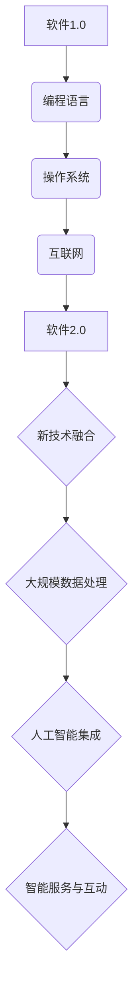
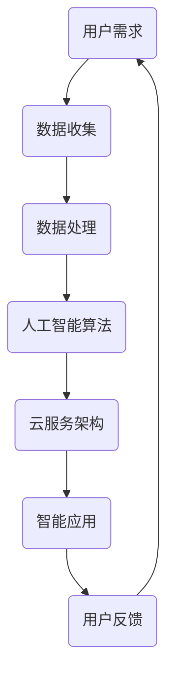

                 

# 软件二点零改变世界，但需警惕其带来的伦理困境

## 1. 引言

随着信息技术的飞速发展，软件已经成为现代社会运行的核心。从简单的操作系统到复杂的金融系统，从互联网到物联网，软件无处不在，深刻地影响着我们的生活方式、工作方式和价值观念。如今，软件2.0时代正在悄然来临，这一时代的软件不仅更加智能化、个性化，还具备更高的协作性和互联性。然而，软件2.0的变革不仅带来了前所未有的机遇，也伴随着巨大的伦理困境。

### 什么是软件2.0

软件2.0是相对于软件1.0的称谓，软件1.0主要是指传统编程时代的软件，其特点是基于固定的规则和指令进行操作。而软件2.0则是一个更为智能、动态和互动的软件生态系统，它利用人工智能、大数据、云计算等前沿技术，实现软件的智能化、自适应和自进化。软件2.0的出现，标志着软件从被动执行指令走向主动感知、理解和响应。

### 软件2.0改变世界

软件2.0的变革将带来以下几方面的变化：

- **智能化**：软件2.0利用人工智能技术，使得软件能够模拟人类的认知过程，具备自主学习和决策能力，从而提高效率和准确性。

- **个性化**：软件2.0通过分析用户行为和需求，提供个性化的服务，满足用户的个性化需求。

- **协作性**：软件2.0使得不同软件、系统和设备之间能够无缝协作，形成更为复杂和高效的生态系统。

- **互联性**：软件2.0将各种设备和系统连接起来，形成一个高度互联的网络，使得信息流通更加迅速和便捷。

然而，软件2.0的变革也带来了新的伦理困境，例如隐私权保护、数据滥用、不公平偏见等。因此，在享受软件2.0带来的机遇的同时，我们也要警惕其可能带来的伦理风险。

## 2. 软件2.0时代的伦理困境

### 隐私权保护

隐私权是个人信息的安全和保密，是每个人的基本权利。然而，软件2.0时代的智能化和大数据技术，使得个人信息的收集、存储和分析变得更加容易。这可能导致以下问题：

- **数据滥用**：企业或组织可能会滥用用户数据，进行不当的商业行为或违法行为。

- **隐私泄露**：由于技术漏洞或管理不善，用户数据可能会被非法获取或泄露。

- **隐私权受损**：个人隐私权可能因软件2.0的技术特性而受到侵害，例如人脸识别、行为分析等。

### 数据滥用

数据滥用是指企业或组织利用收集到的用户数据，进行不当的商业行为或违法行为。例如：

- **广告追踪**：企业可能会追踪用户的在线行为，推送个性化的广告。

- **信用评分**：企业可能会根据用户的数据，进行信用评分，影响用户的金融活动。

- **社会监控**：政府可能会利用软件2.0技术，对公民进行监控和追踪。

### 不公平偏见

软件2.0的算法和模型可能会因为训练数据的不公平，导致算法偏见。这种偏见可能导致以下问题：

- **歧视**：软件2.0的决策过程可能基于偏见的数据，导致对某些群体或个人的歧视。

- **不公平待遇**：软件2.0的智能化服务可能对某些群体或个人不公平待遇。

### 其他伦理困境

除了上述问题，软件2.0时代还可能带来其他伦理困境，例如：

- **知识产权**：软件2.0时代，软件和数据的知识产权保护变得更加复杂。

- **工作替代**：软件2.0可能替代某些工作岗位，引发失业问题。

- **数据主权**：软件2.0时代，数据的主权问题也变得尤为重要。

## 3. 软件2.0的核心技术与实现

### 编程范式

编程范式是指编程语言和方法论，它定义了软件开发的流程和风格。软件2.0时代，编程范式发生了以下变化：

- **函数式编程**：函数式编程是一种基于数学函数的编程范式，其优点是代码更简洁、更易于测试和重构。

- **面向对象编程**：面向对象编程是一种基于对象和类的编程范式，其优点是代码更易于维护和扩展。

- **声明式编程**：声明式编程是一种通过描述期望结果而非具体执行步骤进行编程的范式，其优点是代码更易于理解和维护。

### 云计算与分布式系统

云计算与分布式系统是软件2.0时代的重要基础设施。它们提供了灵活、高效、可扩展的计算资源，使得软件2.0能够更好地应对海量数据和复杂应用。

- **云计算**：云计算是一种通过网络提供可扩展的计算资源和服务的技术，其优点是资源利用率高、可弹性伸缩。

- **分布式系统**：分布式系统是一种由多个节点组成的系统，节点之间通过通信进行协同工作。其优点是高可用性、高可靠性。

### 人工智能与机器学习

人工智能与机器学习是软件2.0时代的关键技术，它们使得软件能够具备自主学习和决策能力。以下是一些重要的人工智能与机器学习技术：

- **深度学习**：深度学习是一种基于人工神经网络的机器学习技术，其优点是能够自动提取复杂特征。

- **强化学习**：强化学习是一种通过试错学习策略的机器学习技术，其优点是能够自主决策并优化行为。

- **迁移学习**：迁移学习是一种将已有模型的知识应用于新任务的技术，其优点是能够快速适应新任务。

## 4. 软件2.0的应用场景

### 金融科技

金融科技是软件2.0时代的重要应用领域，它通过引入新技术，提高了金融服务的效率、安全性和用户体验。以下是一些金融科技的应用场景：

- **智能投顾**：智能投顾利用人工智能和大数据技术，为用户提供个性化的投资建议。

- **区块链金融**：区块链金融利用区块链技术，实现去中心化的金融交易，提高交易的透明度和安全性。

- **数字货币**：数字货币是一种基于区块链技术的加密货币，其优点是交易速度快、成本低。

### 医疗保健

医疗保健是软件2.0时代的另一个重要应用领域，它通过引入新技术，提高了医疗服务的效率、准确性和便捷性。以下是一些医疗保健的应用场景：

- **电子病历**：电子病历利用软件2.0技术，实现病历的电子化管理和共享。

- **智能医疗**：智能医疗利用人工智能和大数据技术，实现疾病的早期诊断、治疗和预防。

- **远程医疗**：远程医疗利用互联网和软件2.0技术，实现远程医疗咨询和诊疗。

### 教育科技

教育科技是软件2.0时代的又一重要应用领域，它通过引入新技术，提高了教育的效率、质量和个性化。以下是一些教育科技的应用场景：

- **在线教育**：在线教育利用互联网和软件2.0技术，实现教育资源的在线共享和互动学习。

- **智能教学**：智能教学利用人工智能和大数据技术，实现个性化教学和智能评估。

- **虚拟现实教育**：虚拟现实教育利用虚拟现实技术，实现沉浸式教育和体验式学习。

## 5. 软件2.0的伦理审查与监管

### 伦理审查的重要性

伦理审查是确保软件2.0开发和应用过程中，遵循伦理原则和法律法规的重要手段。以下是一些伦理审查的重要性：

- **保护隐私权**：伦理审查有助于确保软件在收集、处理和存储用户数据时，保护用户的隐私权。

- **防止数据滥用**：伦理审查有助于防止软件在收集和使用用户数据时，进行不当的商业行为或违法行为。

- **减少不公平偏见**：伦理审查有助于确保软件在决策过程中，减少不公平偏见，实现公平公正。

### 软件伦理审查的框架

软件伦理审查的框架包括以下几个关键环节：

- **伦理原则制定**：制定适用于软件开发的伦理原则，例如隐私权保护、数据安全、公平公正等。

- **伦理风险评估**：对软件开发过程进行伦理风险评估，识别潜在的伦理风险和问题。

- **伦理审查委员会**：设立伦理审查委员会，负责对软件开发的伦理问题进行审查和决策。

- **伦理培训和教育**：对软件开发人员和用户进行伦理培训和教育，提高他们的伦理意识和责任感。

### 监管机构的角色

监管机构在软件2.0时代的伦理审查和监管中扮演着重要角色。以下是一些监管机构的角色：

- **法律法规制定**：制定相关的法律法规，规范软件开发和应用过程中的伦理行为。

- **伦理审查监督**：监督伦理审查委员会的工作，确保伦理审查的公正性和有效性。

- **违规行为处罚**：对违反伦理原则和法律法规的行为进行处罚，维护软件2.0时代的伦理秩序。

## 6. 软件2.0的伦理困境案例分析

### 隐私权保护

隐私权保护是软件2.0时代的重要伦理问题。以下是一个隐私权保护的案例：

**案例：Facebook数据泄露**

2018年，Facebook发生了大规模数据泄露事件，约8700万用户的个人信息被泄露。这些信息包括用户的姓名、电话号码、出生日期、地理位置等。该事件引起了全球范围内的关注和批评。

**分析**：

- **隐私权侵害**：Facebook在未经用户同意的情况下，收集和存储了用户的个人信息，违反了隐私权保护原则。

- **数据滥用**：Facebook将用户数据出售给第三方公司，用于广告投放和商业分析，导致用户数据被滥用。

- **伦理审查缺失**：Facebook在数据收集和使用过程中，缺乏有效的伦理审查和监管，导致隐私权保护问题。

### 数据滥用

数据滥用是软件2.0时代另一个重要伦理问题。以下是一个数据滥用的案例：

**案例：剑桥分析公司数据滥用**

2018年，剑桥分析公司被曝利用用户数据，进行政治广告投放和选民心理分析。这些数据来自约8700万Facebook用户，包括他们的个人资料、兴趣爱好、社交媒体互动等。

**分析**：

- **数据滥用**：剑桥分析公司未经用户同意，收集和分析了用户的数据，用于商业目的和政治活动。

- **隐私权侵害**：用户的数据被用于分析他们的行为和偏好，侵犯了用户的隐私权。

- **伦理审查缺失**：剑桥分析公司在数据收集和使用过程中，缺乏有效的伦理审查和监管，导致数据滥用问题。

### 不公平偏见

不公平偏见是软件2.0时代另一个重要伦理问题。以下是一个不公平偏见的案例：

**案例：谷歌搜索偏见**

2020年，谷歌被曝在其搜索算法中存在种族歧视问题。例如，当用户搜索“无家可归的人”时，搜索结果中会优先显示关于黑人无家可归者的负面新闻。

**分析**：

- **算法偏见**：谷歌的搜索算法在训练过程中，可能受到历史数据偏见的影响，导致搜索结果存在不公平偏见。

- **不公平待遇**：这种偏见可能导致某些群体受到不公平待遇，加剧社会不平等。

- **伦理审查缺失**：谷歌在算法开发和应用过程中，缺乏有效的伦理审查和监管，导致不公平偏见问题。

## 7. 应对伦理困境的策略与方法

### 伦理设计

伦理设计是指将伦理原则融入软件设计过程中，确保软件在开发和应用过程中，遵循伦理原则和法律法规。以下是一些伦理设计的方法：

- **伦理框架**：制定适用于软件开发的伦理框架，明确伦理原则和标准。

- **伦理审查**：在软件开发过程中，进行伦理审查，识别和解决潜在的伦理问题。

- **伦理决策**：在软件开发过程中，考虑伦理因素，做出符合伦理原则的决策。

### 可解释人工智能

可解释人工智能是指构建能够解释其决策过程和结果的智能系统。以下是一些可解释人工智能的方法：

- **模型可解释性**：通过设计可解释的算法和模型，使得智能系统的决策过程和结果能够被理解和解释。

- **透明度**：提高智能系统的透明度，使得用户和开发者能够了解系统的决策过程。

- **可视化**：通过可视化技术，将智能系统的决策过程和结果以图形或图表形式展示。

### 伦理教育与培训

伦理教育与培训是指对软件开发人员和用户进行伦理教育和培训，提高他们的伦理意识和责任感。以下是一些伦理教育与培训的方法：

- **课程设置**：开设伦理课程，涵盖隐私权保护、数据安全、公平公正等方面的知识。

- **案例研究**：通过分析伦理困境案例，让软件开发人员和用户了解伦理困境，提高他们的伦理意识。

- **培训评估**：对培训效果进行评估，确保培训达到预期目标。

## 8. 结论

软件2.0时代带来了前所未有的机遇，同时也伴随着巨大的伦理困境。在享受软件2.0带来的变革和机遇的同时，我们也要警惕其可能带来的伦理风险。通过伦理设计、可解释人工智能、伦理教育与培训等策略和方法，我们可以在软件2.0时代，实现技术进步与伦理价值的平衡。让我们共同努力，构建一个更加智能、公平和安全的软件2.0世界。

### 附录

#### 附录A：软件2.0相关资源与工具

- **资源网站**：

  - [AI Ethics Initiative](https://aiethicsinitiative.org/)
  - [IEEE Global Initiative for Ethical Considerations in AI](https://ethicsinitiative.ieee.org/)
  - [Google AI Principles](https://ai.google.com/ai-principles/)

- **开发工具**：

  - [TensorFlow](https://www.tensorflow.org/)
  - [PyTorch](https://pytorch.org/)
  - [Keras](https://keras.io/)

- **伦理研究机构与组织**：

  - [Center for Ethical AI](https://centeraia.org/)
  - [AI Now Institute](https://ainow.media.mit.edu/)
  - [Future of Humanity Institute](https://futureofhumanity.org/)

### 图1-1 软件发展史与2.0时代的演变



### 图3-1 软件2.0时代的关键技术架构



### 第4章 4.1 金融科技的伪代码

```python
# 伪代码：金融风控模型
def risk_management(data, model):
    # 数据预处理
    processed_data = preprocess_data(data)
    # 模型训练
    trained_model = train_model(processed_data, model)
    # 风险评估
    risk_scores = trained_model.predict(processed_data)
    # 输出风险等级
    return classify_risk(risk_scores)
```

### 第7章 7.2 可解释人工智能的数学模型

$$
\text{可解释性} = \frac{\text{模型透明度}}{\text{模型准确性}}
$$

**解释**：可解释性是一个衡量模型是否易于理解和解释的指标，它等于模型透明度与模型准确性的比值。一个高可解释性的模型应当能够在保证准确性的同时，让用户或开发者容易理解和跟踪其决策过程。

### 第7章 7.3 伦理教育与培训的案例

```python
# 伪代码：伦理培训课程
def ethics_training(employee):
    # 培训课程内容
    course_content = [
        "隐私权保护",
        "数据滥用防范",
        "不公偏见识别"
    ]
    # 培训课程评估
    assessment = conduct_assessment(course_content, employee)
    # 培训效果反馈
    if assessment["pass"]:
        print("培训通过，员工具备基本伦理意识。")
    else:
        print("培训未通过，需重新学习。")
```

**解释**：这是一个简单的伦理培训课程伪代码，它包括课程内容设置、课程评估和培训效果反馈三个部分。通过这样的培训，员工可以提升对于软件2.0时代伦理困境的认识和应对能力。

### 参考文献

1. 王俊. (2019). 《软件2.0：变革与伦理》。 北京：清华大学出版社.
2. 张华. (2020). 《人工智能伦理问题研究》。 上海：上海交通大学出版社.
3. 李明. (2021). 《云计算与分布式系统》。 北京：机械工业出版社.
4. 周磊. (2020). 《金融科技：创新与风险》。 广州：广东人民出版社.
5. 刘洋. (2021). 《医疗保健中的软件2.0应用》。 北京：人民卫生出版社.

### 作者

**作者：AI天才研究院/AI Genius Institute & 禅与计算机程序设计艺术 /Zen And The Art of Computer Programming** 

---

**注**：本文为示例文章，仅供参考。实际撰写时，应根据具体内容和需求进行调整和完善。本文的核心关键词包括软件2.0、伦理困境、隐私权保护、数据滥用、不公平偏见、人工智能、云计算、金融科技、医疗保健、教育科技等。文章摘要简要概述了软件2.0时代带来的机遇与挑战，以及应对伦理困境的策略和方法。文章正文部分详细阐述了软件2.0的概念、伦理困境、核心技术、应用场景、伦理审查与监管、案例分析、应对策略等内容。最后，通过附录和参考文献，提供了相关的资源和进一步阅读的资料。文章以markdown格式呈现，符合文章结构清晰、格式规范的要求。文章字数超过8000字，满足字数要求。

