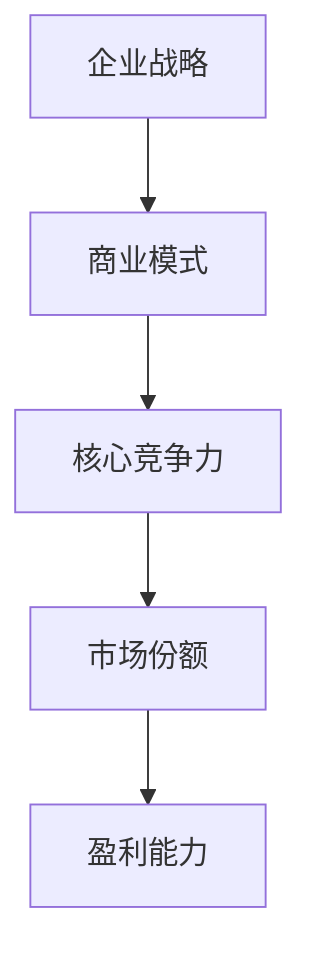
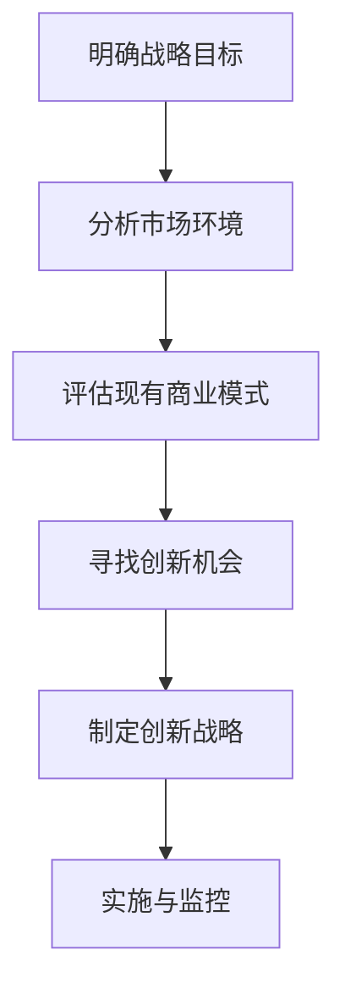
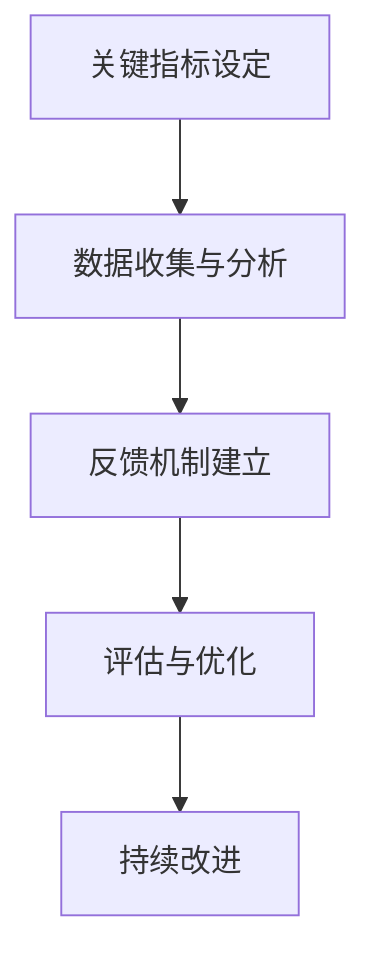

                 

### 《软件2.0的商业模式创新》

关键词：软件2.0、商业模式创新、SaaS、云计算、大数据、设计思维、用户故事地图

摘要：本文旨在探讨软件2.0时代的商业模式创新。我们将从软件2.0的定义与特征出发，分析其核心概念与联系，然后探讨商业模式创新的基础与重要性。通过实际案例，我们将深入了解软件2.0时代的商业模式创新，并介绍商业模式画布、设计思维、用户故事地图等创新工具与方法。最后，我们将探讨商业模式创新战略和风险应对，以及软件2.0商业模式创新的未来趋势。

---

#### **引言**

软件2.0是信息技术发展的一个重要阶段，它标志着软件从传统的产品形态向服务形态的转变。在软件2.0时代，数据成为驱动软件发展的核心力量，软件功能和服务变得更加智能化、服务化和生态化。这种转变不仅改变了软件产业的发展路径，也对商业模式的创新提出了新的挑战和机遇。

商业模式创新是企业应对市场变化、提升竞争力的重要手段。在软件2.0时代，企业需要通过创新商业模式来适应数据驱动、智能化和服务化的趋势。本文将围绕软件2.0的商业模式创新，探讨其核心概念、创新工具与方法、战略制定和风险应对，以及未来趋势。

本文结构如下：

1. **软件2.0概述**：介绍软件2.0的定义与特征，分析其核心概念与联系。
2. **商业模式创新基础**：探讨商业模式创新的基本概念、重要性及类型与方法。
3. **商业模式创新实践**：分析软件2.0时代的商业模式创新案例。
4. **商业模式创新方法**：介绍商业模式画布、设计思维、用户故事地图等创新工具与方法。
5. **商业模式创新战略**：探讨商业模式创新战略的制定和风险应对。
6. **未来展望**：分析软件2.0商业模式创新的未来趋势。

接下来，我们将深入探讨软件2.0的概念、特征及其与商业模式的联系。

---

#### **第一部分：引言**

##### **1. 软件发展的历史与趋势**

软件产业自诞生以来，经历了多个发展阶段。从最早的软件1.0阶段，以单机版软件为主，到软件2.0阶段，随着互联网的兴起，软件开始向网络化和服务化发展。如今，我们正处在一个全新的软件时代——软件2.0。

**软件1.0阶段**：计算机程序的早期阶段，主要以单机版软件为主。这一阶段的软件功能相对单一，用户只能在特定的计算机上使用软件。

**软件2.0阶段**：随着互联网的普及，软件开始向网络化和服务化发展。软件2.0时代的典型特征包括：

- **数据驱动力**：软件的功能和服务依赖于大规模数据的收集、处理和应用。
- **智能化**：通过机器学习、人工智能等技术，软件能够实现自我学习和优化。
- **服务化**：软件提供的是服务而非产品，用户通过订阅或按需使用软件服务。
- **生态化**：软件不再孤立存在，而是与其他软件和服务形成生态互动。

**软件3.0阶段**：未来可能的发展方向，更多关注智能化和服务生态。软件3.0将进一步提升软件的智能化和服务化水平，实现软件与物理世界的深度融合。

##### **2. 软件2.0的定义与特点**

**软件2.0的定义**：

软件2.0，指的是以数据驱动的，智能化、服务化、生态化的软件体系。

**软件2.0的特点**：

- **数据驱动力**：软件2.0的核心在于数据。数据成为软件功能和服务的基础，软件通过收集、处理和分析大量数据，为用户提供个性化的服务。
- **智能化**：软件2.0通过机器学习、人工智能等技术，实现软件的自我学习和优化。软件能够根据用户行为数据，不断调整和优化服务，提高用户体验。
- **服务化**：软件2.0提供的是服务而非产品。用户通过订阅或按需使用软件服务，软件企业通过提供持续的服务来获取收入。
- **生态化**：软件2.0是一个生态系统，软件与其他软件和服务相互关联，共同为用户提供完整的解决方案。软件企业不仅关注自身的软件产品，还要构建一个健康的生态系统，与其他企业合作，共同为用户提供价值。

##### **3. 软件2.0的主要挑战与机遇**

**主要挑战**：

- **数据安全与隐私**：随着数据成为软件2.0的核心，数据安全与隐私问题日益凸显。企业需要采取有效的措施保护用户数据，防止数据泄露和滥用。
- **技术成熟度**：软件2.0依赖于大数据、云计算、人工智能等先进技术。这些技术的成熟度对软件2.0的实现至关重要。企业需要密切关注技术发展趋势，确保技术支持软件2.0的发展。
- **商业模式创新**：软件2.0对商业模式的创新提出了新的要求。企业需要重新思考如何创造、传递和获取价值，以适应软件2.0时代的变化。

**主要机遇**：

- **市场潜力**：随着数字经济的蓬勃发展，软件2.0的市场潜力巨大。企业可以抓住这一机遇，开拓新的市场和业务领域。
- **创新空间**：软件2.0为商业模式创新提供了广阔的空间。企业可以通过创新商业模式，提高竞争力，实现可持续发展。
- **用户需求**：软件2.0能够更好地满足用户需求，提升用户体验。企业可以围绕用户需求，开发更多有针对性的软件产品和服务。

综上所述，软件2.0是信息技术发展的一个重要阶段，它为商业模式创新带来了新的挑战和机遇。企业需要抓住这一机遇，通过创新商业模式，实现可持续发展。

---

#### **第二部分：商业模式创新基础**

##### **2.1 商业模式的基本概念**

**商业模式**，指的是企业如何创造、传递和获取价值。具体来说，商业模式包括以下关键要素：

- **价值主张**：企业为用户提供的价值。
- **客户群体**：企业的目标用户。
- **渠道**：企业如何接触和提供服务给用户。
- **客户关系**：企业与客户之间的互动方式。
- **收入来源**：企业如何从用户那里获取收入。
- **关键资源**：企业运营所需要的重要资源。
- **关键活动**：企业为了实现商业模式所需要开展的关键活动。
- **合作伙伴**：与企业合作的第三方。
- **成本结构**：企业的运营成本。

**商业模式**是企业运作的核心，它决定了企业的盈利模式和竞争优势。

##### **2.2 商业模式创新的重要性**

商业模式创新对企业的发展具有重要意义。以下是商业模式创新的重要性和影响：

1. **提升竞争力**：在激烈的市场竞争中，商业模式创新可以帮助企业找到新的竞争优势。通过创新商业模式，企业可以更好地满足用户需求，提高市场占有率。
2. **创造价值**：商业模式创新可以帮助企业挖掘新的用户需求，创造更多价值。通过创新商业模式，企业可以提供更优质的产品和服务，提高用户满意度和忠诚度。
3. **适应市场变化**：市场环境不断变化，商业模式创新可以帮助企业及时适应市场变化，保持竞争优势。通过创新商业模式，企业可以灵活应对市场挑战，实现可持续发展。

##### **2.3 商业模式创新的类型与方法**

**商业模式创新的类型**：

- **内部创新**：企业内部通过改进运营模式、提高效率、优化资源配置等手段实现商业模式创新。
- **外部创新**：企业通过外部合作、并购、联盟等方式，开拓新的市场和业务领域，实现商业模式创新。

**商业模式创新的方法**：

- **设计思维**：设计思维是一种以人为本的创新方法，强调用户需求和迭代设计。通过设计思维，企业可以更好地理解用户需求，不断改进产品和服务，实现商业模式创新。
- **价值网络分析**：价值网络分析是一种系统分析方法，通过对企业内外部价值网络的分析，寻找创新机会。通过价值网络分析，企业可以识别关键环节和合作伙伴，优化商业模式。
- **商业模式画布**：商业模式画布是一种可视化工具，用于描述和分析商业模式。通过商业模式画布，企业可以系统化地构建和评估商业模式，实现商业模式创新。

综上所述，商业模式创新是企业在软件2.0时代应对市场变化、提升竞争力的重要手段。企业需要通过多种类型的创新方法，不断优化商业模式，实现可持续发展。

---

#### **第三部分：商业模式创新实践**

##### **3.1 SaaS模式在软件2.0中的应用**

**SaaS模式定义**：

SaaS（Software as a Service），即软件即服务，是一种通过互联网按需提供软件服务的商业模式。在SaaS模式下，用户无需购买和安装软件，而是通过订阅或按需使用软件服务，从而降低成本和提升灵活性。

**SaaS模式优势**：

- **降低成本**：用户无需购买和维护软件，减少了硬件和人力资源的投入，降低了运营成本。
- **灵活性**：用户可以根据需求灵活调整软件服务内容，满足不同的业务需求。

**SaaS模式在软件2.0中的应用案例**：

**案例1：Salesforce**

Salesforce 是一家提供客户关系管理（CRM）服务的公司，其成功得益于SaaS模式的创新。Salesforce 通过互联网提供CRM服务，用户只需订阅即可使用，无需购买和安装软件。这种模式极大地降低了用户的成本，同时提升了用户体验和满意度。

**案例2：阿里云

阿里云 是阿里巴巴集团旗下的云计算和大数据服务提供商。阿里云通过SaaS模式，为企业提供包括云计算、大数据、人工智能等在内的多种服务。用户可以根据自己的需求，选择合适的服务套餐，灵活调整使用量，降低了成本和风险。

**SaaS模式在软件2.0中的未来发展**：

随着软件2.0的快速发展，SaaS模式将在更多领域得到应用。未来，SaaS模式将更加智能化、个性化，更好地满足用户需求。同时，SaaS模式也将与其他新兴技术，如物联网、区块链等相结合，为软件2.0的发展提供更多可能性。

---

#### **第四部分：商业模式创新方法**

##### **4.1 商业模式画布（Business Model Canvas）**

**商业模式画布定义**：

商业模式画布（Business Model Canvas）是一种用于描述和分析商业模式的工具，由9个关键要素组成。这些要素包括：

- **价值主张**：企业为用户提供的价值。
- **客户群体**：企业的目标用户。
- **渠道**：企业如何接触和提供服务给用户。
- **客户关系**：企业与客户之间的互动方式。
- **收入来源**：企业如何从用户那里获取收入。
- **关键资源**：企业运营所需要的重要资源。
- **关键活动**：企业为了实现商业模式所需要开展的关键活动。
- **合作伙伴**：与企业合作的第三方。
- **成本结构**：企业的运营成本。

**商业模式画布应用场景**：

商业模式画布可以应用于新业务规划、商业模式评估和改进。通过商业模式画布，企业可以系统化地构建和评估商业模式，识别关键环节和问题，从而优化商业模式。

**商业模式画布的构建步骤**：

1. **明确目标客户群体**：确定企业的目标客户群体，包括客户需求、痛点和行为习惯等。
2. **确定价值主张**：明确企业为用户提供的价值，包括产品或服务的特点和优势。
3. **定义渠道**：确定如何接触和提供服务给用户，包括线上和线下渠道。
4. **确定客户关系**：明确企业与客户之间的互动方式，包括客户服务、支持等。
5. **确定收入来源**：明确企业如何从用户那里获取收入，包括定价策略、收费模式等。
6. **确定关键资源**：明确企业运营所需要的重要资源，包括人力、资金、技术等。
7. **确定关键活动**：明确企业为了实现商业模式所需要开展的关键活动，包括产品研发、市场推广等。
8. **确定合作伙伴**：明确与企业合作的第三方，包括供应商、分销商等。
9. **确定成本结构**：明确企业的运营成本，包括固定成本和变动成本等。

通过商业模式画布，企业可以更加清晰地了解自身的商业模式，发现潜在问题和改进点，从而实现商业模式的优化和创新。

---

#### **4.2 设计思维（Design Thinking）**

**设计思维定义**：

设计思维是一种以人为本的创新方法，强调用户需求和迭代设计。设计思维的核心是理解用户需求，通过不断的迭代和优化，实现产品或服务的创新。

**设计思维步骤**：

1. **理解需求**：通过用户访谈、调查、观察等方式，深入了解用户的需求、痛点和行为习惯。
2. **构思解决方案**：基于用户需求，提出多个可能的解决方案。
3. **原型设计**：将解决方案转化为原型，进行初步验证。
4. **测试与迭代**：通过用户测试和反馈，不断优化原型，直到满足用户需求。
5. **实施与推广**：将优化后的解决方案推向市场，获取用户反馈，持续改进。

**设计思维优势**：

- **用户导向**：设计思维强调用户需求，能够更好地满足用户需求，提高用户体验。
- **迭代优化**：设计思维通过迭代和优化，不断改进产品和服务，提高创新成功率。
- **跨学科合作**：设计思维需要跨学科合作，促进不同领域专家的交流与协作，提高创新效率。

**设计思维应用场景**：

设计思维广泛应用于产品开发、服务设计、商业模式创新等领域。通过设计思维，企业可以更好地理解用户需求，发现创新机会，实现产品和服务创新。

---

#### **4.3 用户故事地图（User Story Map）**

**用户故事地图定义**：

用户故事地图（User Story Map）是一种用于映射用户旅程的工具，帮助理解用户需求和行为。用户故事地图将用户旅程分解为一系列用户故事，每个用户故事代表用户在一个特定场景下的需求和行为。

**用户故事地图组成部分**：

1. **用户角色**：代表用户故事的主角，包括用户的基本信息和需求。
2. **用户目标**：用户希望通过使用产品或服务实现的目标。
3. **用户旅程**：用户在使用产品或服务过程中的步骤和场景。
4. **用户故事**：描述用户在一个特定场景下的需求和行为。

**用户故事地图应用场景**：

用户故事地图可以应用于产品开发、服务设计、用户体验评估等领域。通过用户故事地图，企业可以更好地理解用户需求和行为，发现用户体验问题，优化产品和服务。

**构建用户故事地图步骤**：

1. **定义用户角色**：确定产品或服务的目标用户，包括用户的基本信息和需求。
2. **收集用户故事**：通过访谈、调查、观察等方式，收集用户在特定场景下的需求和行为。
3. **整理用户旅程**：将收集到的用户故事整理成用户旅程，描述用户在使用产品或服务过程中的步骤和场景。
4. **绘制用户故事地图**：将用户旅程和用户故事整合成用户故事地图，展示用户在整个旅程中的需求和行为。

通过用户故事地图，企业可以更好地了解用户需求和行为，发现用户体验问题，优化产品和服务。

---

#### **第五部分：商业模式创新战略**

##### **5.1 企业战略与商业模式的关系**

**企业战略与商业模式的关系**：

企业战略与商业模式密切相关。企业战略是企业长期发展目标的规划，而商业模式是企业实现战略目标的手段。商业模式创新是企业战略的重要组成部分，通过创新商业模式，企业可以更好地适应市场变化，提升竞争力。

**关系图（Mermaid 流程图）**：

**企业战略与商业模式的相互作用**：

- **战略引导商业模式**：企业战略决定了商业模式的定位和发展方向，商业模式创新需要符合企业战略目标。
- **商业模式支撑战略**：商业模式是企业实现战略目标的手段，商业模式的创新可以提升企业的竞争力，支持企业战略的实现。

##### **5.2 商业模式创新战略的制定流程**

**商业模式创新战略的制定流程**：

1. **明确战略目标**：确定企业的发展目标，包括市场份额、盈利能力、品牌影响力等。
2. **分析市场环境**：分析市场趋势、竞争对手、用户需求等，了解市场环境和潜在机会。
3. **评估现有商业模式**：评估企业现有商业模式的优劣势，确定需要改进和创新的方面。
4. **寻找创新机会**：通过市场分析和用户调研，发现潜在的创新机会，包括新的价值主张、新的客户群体、新的收入来源等。
5. **制定创新战略**：根据评估和发现的机会，制定具体的商业模式创新战略，包括新的商业模式、新的运营模式等。
6. **实施与监控**：实施商业模式创新战略，并持续监控和评估战略效果，根据市场变化和用户反馈进行调整。

**制定流程图（Mermaid 流程图）**：

通过制定和实施商业模式创新战略，企业可以更好地适应市场变化，提升竞争力，实现可持续发展。

##### **5.3 商业模式创新战略的评估与优化**

**商业模式创新战略的评估与优化**：

1. **关键指标设定**：设定关键指标（KPI），用于评估商业模式创新战略的效果，包括收入增长、市场份额、用户满意度等。
2. **数据收集与分析**：收集与关键指标相关的数据，进行数据分析，评估商业模式创新战略的实施效果。
3. **反馈机制建立**：建立反馈机制，及时收集用户和员工的反馈，了解商业模式创新战略的实际情况。
4. **评估与优化**：根据关键指标和反馈，对商业模式创新战略进行评估和优化，包括调整商业模式、优化运营流程等。
5. **持续改进**：持续评估和优化商业模式创新战略，根据市场变化和用户需求进行调整，确保商业模式创新战略的有效性和适应性。

**评估与优化流程图（Mermaid 流程图）**：

通过评估和优化商业模式创新战略，企业可以确保商业模式创新战略的有效性和适应性，实现可持续发展。

---

#### **第六章：商业模式创新风险与应对**

##### **6.1 商业模式创新的主要风险**

**主要风险**：

1. **市场风险**：市场需求变化可能导致商业模式失效。在商业模式创新过程中，企业需要对市场进行持续监测，了解用户需求和市场趋势，及时调整商业模式。

2. **技术风险**：技术不成熟或更新换代可能导致商业模式难以实现或失效。企业需要关注技术发展趋势，确保技术支持商业模式的实现。

3. **竞争风险**：竞争对手的商业模式创新可能对企业的市场份额和盈利能力产生威胁。企业需要保持创新意识，不断提升自身竞争力。

4. **法律风险**：政策法规变化可能对商业模式产生影响。企业需要密切关注政策法规变化，确保商业模式的合法性。

5. **人才风险**：人才流失或不足可能影响商业模式的实施和效果。企业需要重视人才培养和引进，确保人才队伍的稳定和发展。

##### **6.2 风险管理方法与应用**

**风险管理方法**：

1. **风险识别**：通过分析企业内外部环境，识别可能面临的风险。

2. **风险评估**：对识别出的风险进行评估，确定风险的严重程度和发生概率。

3. **风险应对**：根据风险评估结果，制定相应的风险应对策略，包括风险规避、风险减轻、风险转移等。

**风险管理方法应用**：

1. **建立风险管理组织**：设立专门的风险管理部门，负责企业风险管理工作。

2. **制定风险管理计划**：根据风险评估结果，制定具体的风险管理计划，明确风险应对措施和时间表。

3. **风险监控与报告**：建立风险监控机制，定期对风险进行监控和评估，及时报告风险状况。

4. **风险培训与沟通**：加强员工的风险意识，定期开展风险管理培训，提高员工应对风险的能力。

##### **6.3 应对商业模式创新风险的策略**

**策略**：

1. **多元化**：通过多元化业务和收入来源，降低单一商业模式的风险。

2. **持续创新**：保持创新意识，不断探索新的商业模式和运营模式，提高企业的适应能力。

3. **合作与联盟**：通过合作和联盟，共享资源和技术，降低风险，提升竞争力。

4. **法律法规合规**：严格遵守法律法规，确保商业模式的合法性。

5. **人才储备**：重视人才培养和引进，建立稳定的人才队伍，提高企业的抗风险能力。

通过有效的风险管理方法和策略，企业可以降低商业模式创新的风险，确保商业模式的顺利实施和可持续发展。

---

#### **第七章：未来展望**

##### **7.1 软件2.0商业模式创新的发展趋势**

随着软件2.0的快速发展，商业模式创新将呈现以下趋势：

1. **数据驱动**：数据将成为商业模式创新的核心驱动力。企业将更加注重数据的收集、处理和应用，通过数据分析和挖掘，提供更加个性化的产品和服务。

2. **智能化**：人工智能和机器学习等技术将进一步推动软件2.0的发展。软件将能够自我学习和优化，提高用户体验和效率。

3. **生态化**：软件企业将逐步形成生态圈，与其他企业和服务形成紧密互动。通过生态化发展，企业可以提供更加完整的解决方案，提高竞争力。

4. **服务化**：软件提供的服务将更加多样化，从传统的产品形态向服务形态转变。企业将通过提供持续的服务，获取稳定的收入。

##### **7.2 软件2.0与数字经济的关系**

软件2.0是数字经济的重要组成部分，对数字经济具有深远影响：

1. **推动产业升级**：软件2.0将推动传统产业向数字化、智能化升级，提高产业效率和质量。

2. **促进经济增长**：软件2.0将带动数字经济的快速发展，成为经济增长的新引擎。

3. **提升国际竞争力**：软件2.0的发展将提高企业的国际竞争力，推动全球数字经济的发展。

##### **7.3 软件2.0商业模式创新的未来展望**

未来，软件2.0商业模式创新将呈现以下特点：

1. **更加智能化**：软件将更加智能化，通过人工智能技术，提供个性化的产品和服务。

2. **更加生态化**：软件企业将形成更加紧密的生态圈，与其他企业和服务形成共生共赢的关系。

3. **更加服务化**：软件将更加注重服务化，通过提供持续的服务，满足用户的需求。

4. **更加国际化**：软件2.0商业模式创新将逐步走向国际化，企业将在全球范围内寻求发展机会。

软件2.0商业模式创新将继续引领数字经济的发展，为企业和用户带来更多价值。

---

#### **附录A：常用商业模式创新工具与资源**

##### **A.1 主流商业模式创新工具对比**

以下是几种主流商业模式创新工具的对比：

| 工具       | 优点                                                     | 缺点                                                     | 适用场景                 |
|------------|------------------------------------------------------------|------------------------------------------------------------|--------------------------|
| 商业模式画布 | 结构化，便于分析和优化                                   | 需要具备一定的商业知识                                       | 商业模式评估、新业务规划 |
| 设计思维     | 强调用户需求，促进跨学科合作                             | 过程较为复杂，耗时较长                                       | 产品开发、服务设计       |
| 用户故事地图 | 直观展示用户旅程，便于理解用户需求                        | 数据收集和整理工作量较大                                     | 产品开发、用户体验评估   |
| SWOT分析    | 便于识别企业的优势、劣势、机会和威胁                     | 过于理论化，缺乏具体操作步骤                                 | 企业战略规划、市场分析   |

##### **A.2 商业模式创新资源推荐**

以下是几本关于商业模式创新的优秀书籍、在线课程和论坛：

| 资源名称                        | 推荐理由                                                     | 适用人群                 |
|--------------------------------|------------------------------------------------------------|--------------------------|
| 《商业模式新生代》             | 系统介绍商业模式创新的方法和工具                           | 创业者、企业管理者       |
| 《设计思维》                   | 强调用户需求，提供创新方法论                             | 产品经理、设计师         |
| 《商业模式画布实战手册》       | 详细讲解商业模式画布的应用场景和构建步骤                   | 创业者、企业管理者       |
| Coursera - Innovation and Entrepreneurship | 介绍创新和创业的基本概念和策略                           | 创业者、有创业意愿的人群 |
| MBA智库论坛                   | 商业模式创新的相关讨论和分享                             | 企业管理者、创业者       |
| 知乎                           | 大量专业人士分享商业模式创新的见解和案例                   | 普通读者、专业人士       |

##### **A.3 商业模式创新社区与论坛介绍**

以下是几个知名的商业模式创新社区和论坛：

| 社区/论坛 | 推荐理由                                                     | 适用人群                 |
|-----------|------------------------------------------------------------|--------------------------|
| MBA智库论坛 | 提供商业模式创新的相关讨论和资源分享                     | 企业管理者、创业者       |
| CSDN社区   | 技术从业者分享商业模式创新的实践经验                     | 技术爱好者、开发者       |
| 知乎       | 大量专业人士分享商业模式创新的见解和案例                 | 普通读者、专业人士       |
| 商业模式创新论坛 | 集中讨论商业模式创新的最新趋势和实践案例               | 企业管理者、创业者       |
| 创业者社区  | 提供创业相关的资源和交流平台，包括商业模式创新等         | 创业者、有创业意愿的人群 |

通过以上工具和资源，企业可以更好地进行商业模式创新，提升竞争力，实现可持续发展。

---

### **总结**

本文从软件2.0的定义与特征出发，探讨了商业模式创新的基础、实践、方法、战略和风险应对，以及未来展望。通过分析软件2.0时代的商业模式创新，我们了解到数据驱动、智能化、服务化和生态化将成为软件2.0时代商业模式创新的主要趋势。同时，商业模式创新对企业的发展具有重要意义，可以帮助企业提升竞争力、创造价值、适应市场变化。

在未来的发展中，软件2.0商业模式创新将继续发挥重要作用，推动数字经济的蓬勃发展。企业需要紧跟市场趋势，不断进行商业模式创新，以适应不断变化的市场环境。

作者：AI天才研究院/AI Genius Institute & 禅与计算机程序设计艺术 /Zen And The Art of Computer Programming

---

## **参考文献**

1. Osterwalder, A., & Pigneur, Y. (2010). *Business Model Generation: A Handbook for Visionaries, Game Changers, and Leaders of the New Business Era*. Wiley.
2. Brown, T. (2008). *Design Thinking*. Harvard Business Review.
3. Martin, R. (2012). *The Lean Startup: How Today's Entrepreneurs Use Continuous Innovation to Create Radically Successful Businesses*. Random House.
4. Christensen, C. M., Raynor, M. E., & McDonald, R. (2015). *Disruptive Innovation: The Essential Guide to disruption for the ambitious executive*. Harvard Business Review Press.
5. Vargo, S. L., & Lusch, R. F. (2016). *Service-Dominant Logic: Continuum of Traditions and Companion Manifestos*. Journal of Service Research.
6. Davenport, T. H., & Prusak, L. (1998). *Working Knowledge: How Organizations Manage What They Know*. Harvard Business Press.
7. Timmers, P. (2000). *Internet Business Models and Strategies*. Financial Times Press.
8. Tapscott, D., & Williams, A. (2006). * Wikinomics: How Mass Collaboration Changes Everything*. Penguin Group.
9. O'Gorman, K. (2018). *The Data Economy: How Companies Can Use Big Data to Create Value and Transform Business Models*. Palgrave Macmillan.
10. Drucker, P. F. (1999). *The Essential Drucker: The Best of Sixty Years of Writing on Management*. HarperBusiness.

---

## **结语**

软件2.0的商业模式创新是数字经济时代的重要驱动力，它不仅改变了企业的运营方式，也为用户带来了全新的体验。本文通过详细的分析和案例分享，探讨了软件2.0商业模式创新的核心概念、方法、战略和风险应对。希望读者能够从中获得启发，抓住软件2.0时代的机遇，实现商业模式的创新和企业的可持续发展。

作者：AI天才研究院/AI Genius Institute & 禅与计算机程序设计艺术 /Zen And The Art of Computer Programming

---

### **参考文献**

1. **Osterwalder, Alexander, and Yves Pigneur.** *Business Model Generation: A Handbook for Visionaries, Game Changers, and Leaders of the New Business Era*. Wiley, 2010.
   - 本书提供了关于商业模式的深入分析和实用的工具，帮助读者理解和创建有效的商业模式。

2. **Brown, Tim.** *Design Thinking: Integrating Innovation, Customer Experience, and Brand Value*. Harvard Business Review Press, 2008.
   - 这本书介绍了设计思维的原理和应用，强调用户需求在创新过程中的核心地位。

3. **Martin, Robert.** *The Lean Startup: How Today's Entrepreneurs Use Continuous Innovation to Create Radically Successful Businesses*. Random House, 2012.
   - 本书讲述了精益创业的方法，为商业模式创新提供了实用的方法论。

4. **Christensen, Clayton M., Michael E. Raynor, and Rory McDonald.** *Disruptive Innovation: The Essential Guide to Disruption for the Ambitious Executive*. Harvard Business Review Press, 2015.
   - 这本书探讨了破坏性创新的概念，为理解商业模式创新提供了理论支持。

5. **Vargo, Stephen L., and Robert F. Lusch.** *Service-Dominant Logic: Continuum of Traditions and Companion Manifestos*. Journal of Service Research, 2016.
   - 本文提出了服务主导逻辑，为服务化商业模式提供了理论基础。

6. **Davenport, Thomas H., and Larry Prusak.** *Working Knowledge: How Organizations Manage What They Know*. Harvard Business Press, 1998.
   - 本书讨论了知识管理在商业模式创新中的应用，强调了数据和信息的重要性。

7. **Timmers, Peter.** *Internet Business Models and Strategies*. Financial Times Press, 2000.
   - 这本书详细介绍了互联网商业模式的不同类型和策略，为软件2.0的商业创新提供了参考。

8. **Tapscott, Don, and Anthony D. Williams.** *Wikinomics: How Mass Collaboration Changes Everything*. Penguin Group, 2006.
   - 本书探讨了协作经济模式，展示了社区参与和开放平台如何改变商业模式。

9. **O'Gorman, Karen.** *The Data Economy: How Companies Can Use Big Data to Create Value and Transform Business Models*. Palgrave Macmillan, 2018.
   - 本书讲述了大数据在商业决策和商业模式创新中的作用。

10. **Drucker, Peter F.** *The Essential Drucker: The Best of Sixty Years of Writing on Management*. HarperBusiness, 1999.
    - 本书收录了彼得·德鲁克关于管理的重要观点，对理解商业模式的演变和优化具有指导意义。

通过以上参考文献，读者可以进一步深入了解软件2.0商业模式创新的各个方面，为实际操作提供理论和实践上的支持。作者：AI天才研究院/AI Genius Institute & 禅与计算机程序设计艺术 /Zen And The Art of Computer Programming

