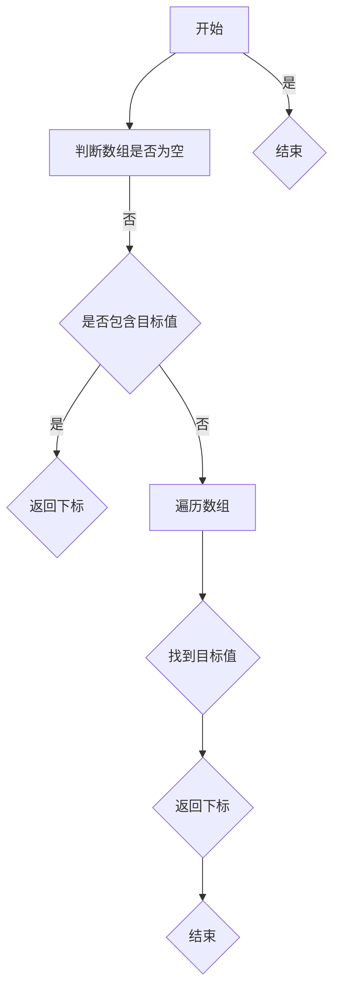
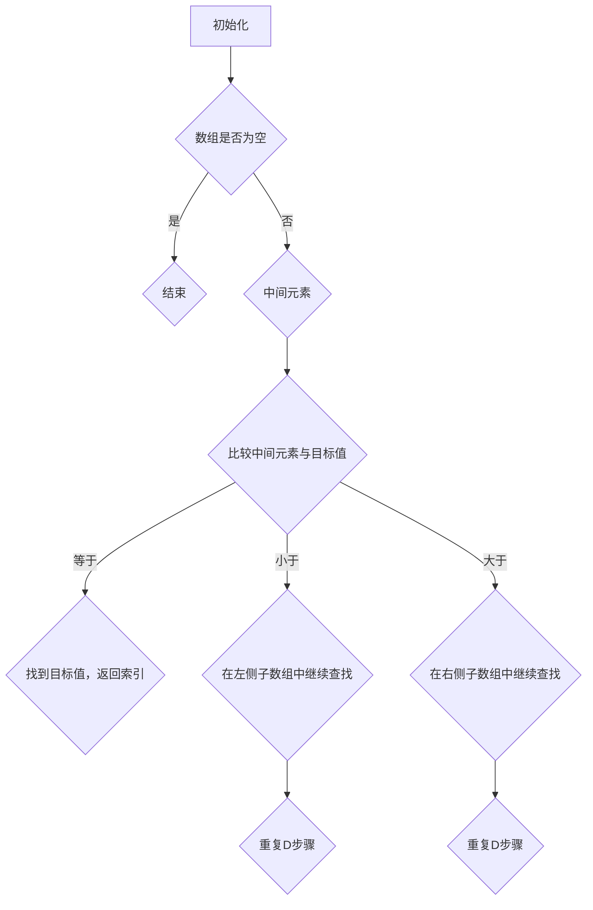

                 

### 《2025阿里巴巴校招面试算法题库大全》

> **关键词**：阿里巴巴校招、算法面试、题库、数据分析、编程实践

> **摘要**：本文旨在为准备阿里巴巴校招面试的算法爱好者们提供一个全面且深入的算法题库。通过系统性地梳理常见的算法题目，以及详细的解析和实战案例，帮助读者夯实基础，提升算法能力，从而在面试中脱颖而出。

---

## 第一部分：算法基础知识

算法是计算机科学的核心，无论是在理论研究还是实际应用中，都发挥着至关重要的作用。本部分将带你领略算法的基石，从基本概念到具体实现，帮助你建立起扎实的算法基础。

### 第1章 基础算法概览

算法复杂度是评估算法性能的重要指标。**时间复杂度**表示算法执行时间与数据规模的关系，通常表示为 \(O(n)\)，其中 \(n\) 是输入数据的大小。**空间复杂度**则表示算法在执行过程中所需的额外空间，通常表示为 \(O(1)\)，即常数空间。

#### 1.1.1 算法基本概念

算法复杂度分析通常涉及时间复杂度和空间复杂度。时间复杂度用于衡量算法的运行时间，空间复杂度则用于衡量算法所需的空间大小。以下是几种常见的算法复杂度分析：

- **动态规划**：通过将问题分解成子问题并保存子问题的解，避免重复计算，从而降低时间复杂度。
- **贪心算法**：通过每次选择局部最优解，以期达到全局最优解。
- **分治算法**：将大问题分解成若干个小问题，分别解决后合并结果。
- **回溯算法**：通过逐步构建候选解，并回溯到上一状态继续尝试其他候选解，直至找到解或判断无解。

#### 1.1.2 算法分类

常见的算法分类包括：

- **动态规划**：解决最优化问题，通过子问题的最优解推导出原问题的最优解。
- **贪心算法**：每次选择当前最优解，以达到全局最优解。
- **分治算法**：将大问题分解成小问题，递归解决小问题后再合并结果。
- **回溯算法**：在解空间中逐层搜索，并在遇到错误路径时回溯到上一个状态。

### 1.2 排序与查找算法

排序与查找是算法中的基础内容，常见的排序算法包括冒泡排序、选择排序、插入排序等。查找算法则包括顺序查找、二分查找等。

#### 1.2.1 冒泡排序

冒泡排序是一种简单的排序算法，通过反复交换相邻的未按顺序排列的元素，直至整个序列有序。

伪代码：

```markdown
function bubbleSort(arr):
    n = length(arr)
    for i = 0 to n-1:
        for j = 0 to n-i-1:
            if arr[j] > arr[j+1]:
                swap(arr[j], arr[j+1])
```

#### 1.2.2 二分查找

二分查找是一种高效的查找算法，它将序列划分为两半，根据目标值与中间值的比较，逐步缩小查找范围，直至找到目标值或确定其不存在。

伪代码：

```markdown
function binarySearch(arr, target):
    low = 0
    high = length(arr) - 1
    while low <= high:
        mid = (low + high) / 2
        if arr[mid] == target:
            return mid
        else if arr[mid] < target:
            low = mid + 1
        else:
            high = mid - 1
    return -1
```

### 1.2 数据结构与算法应用

数据结构是算法的重要组成部分，常见的有链表、栈、队列等。

#### 2.1 链表

链表是一种动态数据结构，由一系列结点组成，每个结点包含数据域和指针域。

##### 2.1.1 单链表操作

单链表的主要操作包括插入节点和删除节点。

- **插入节点**

伪代码：

```python
function insertNode(head, value):
    newNode = createNode(value)
    if head is null:
        head = newNode
    else:
        current = head
        while current.next is not null:
            current = current.next
        current.next = newNode
```

- **删除节点**

伪代码：

```python
function deleteNode(head, value):
    if head is null:
        return null
    if head.value == value:
        head = head.next
        return head
    current = head
    while current.next is not null:
        if current.next.value == value:
            current.next = current.next.next
            return head
        current = current.next
    return head
```

#### 2.2 栈与队列

栈和队列都是基于线性表的数据结构，分别用于实现后进先出（LIFO）和先进先出（FIFO）的操作。

##### 2.2.1 栈

栈的常见操作包括入栈和出栈。

- **入栈**

伪代码：

```python
function pushStack(stack, value):
    stack.push(value)
```

- **出栈**

伪代码：

```python
function popStack(stack):
    return stack.pop()
```

##### 2.2.2 队列

队列的常见操作包括入队和出队。

- **入队**

伪代码：

```python
function enqueue(queue, value):
    queue.append(value)
```

- **出队**

伪代码：

```python
function dequeue(queue):
    return queue.shift()
```

### 2.3 数学与算法基础

数学是算法的基石，对于很多算法问题，数学分析是必不可少的。

#### 2.3.1 初等数学

初等数学主要包括数论和概率论。

- **数论基础**

数论是研究整数性质及其相互关系的数学分支，其中最基础的概念是最大公约数（GCD）。

$$
a = b \times q + r
$$

其中，\(a\) 和 \(b\) 是整数，\(q\) 是商，\(r\) 是余数。

- **概率论**

概率论是研究随机现象规律的数学分支，常用的基本概率公式包括条件概率和全概率公式。

$$
P(A|B) = \frac{P(A \cap B)}{P(B)}
$$

#### 2.3.2 线性代数基础

线性代数是研究向量空间和线性变换的数学分支，其中最基础的概念是矩阵运算。

- **矩阵加法**

$$
C = A + B
$$

- **矩阵乘法**

$$
C = A \times B
$$

## 第4章 算法竞赛技巧

算法竞赛是提高算法能力的重要途径，通过解决实际问题，可以加深对算法原理的理解和应用。

### 4.1 算法竞赛基本策略

算法竞赛的基本策略包括题目分析、代码优化、数据结构与算法应用等。

#### 4.1.1 题目分析

题目分析是解题的第一步，主要包括数据范围分析、时间限制与空间限制分析。

- **数据范围分析**

分析题目的数据范围，确定算法的可扩展性。

- **时间限制与空间限制分析**

分析题目的时间限制与空间限制，确定算法的可行性和优化方向。

#### 4.1.2 代码优化

代码优化是提高算法性能的关键，主要包括时间优化和空间优化。

- **时间优化**

通过减少循环次数、优化数据结构、使用高效算法等方法，提高算法的执行速度。

- **空间优化**

通过减少内存占用、优化数据结构、使用常数空间算法等方法，降低算法的空间复杂度。

### 4.2 算法竞赛技巧

算法竞赛技巧包括题目分类、解题思路、代码调试等。

#### 4.2.1 题目分类

常见的算法竞赛题目可以分为以下几类：

- **数论问题**
- **图论问题**
- **动态规划问题**
- **组合数学问题**
- **概率问题**

#### 4.2.2 解题思路

解题思路是解决问题的关键，主要包括以下几种方法：

- **枚举法**
- **递归法**
- **分治法**
- **贪心法**
- **动态规划法**

#### 4.2.3 代码调试

代码调试是确保代码正确性的重要环节，主要包括以下几种方法：

- **打印调试**
- **断点调试**
- **单元测试**

## 第5章 图算法基础

图算法是算法竞赛中的重要组成部分，主要包括图的基本概念、图的遍历、最短路径算法等。

### 5.1 图的基本概念

图是一种由顶点和边组成的集合，用于表示实体之间的关系。图的基本概念包括：

- **顶点**：图的节点。
- **边**：连接两个顶点的线段。
- **邻接矩阵**：用二维数组表示图，其中元素表示两个顶点之间的连接关系。
- **邻接表**：用链表表示图，每个顶点对应一个链表，链表中存储与该顶点相邻的其他顶点。

### 5.2 图的遍历

图的遍历是指从某个顶点出发，访问图中的所有顶点。图的遍历算法包括：

- **深度优先搜索（DFS）**：沿着一个路径深入到不能再深入时，回溯到上一个顶点继续搜索。
- **广度优先搜索（BFS）**：先访问起始顶点的所有邻接顶点，然后再逐个访问这些邻接顶点的邻接顶点。

伪代码：

```python
function dfs(graph, start):
    visited = set()
    stack = [start]
    while stack:
        node = stack.pop()
        if node not in visited:
            visited.add(node)
            for neighbor in graph[node]:
                stack.append(neighbor)

function bfs(graph, start):
    visited = set()
    queue = deque([start])
    while queue:
        node = queue.popleft()
        if node not in visited:
            visited.add(node)
            for neighbor in graph[node]:
                queue.append(neighbor)
```

### 5.3 最短路径算法

最短路径算法是图算法中的经典问题，主要包括：

- **Dijkstra算法**：使用优先队列，依次选择距离当前起点最近的未访问顶点，更新其他顶点的最短路径。
- **Bellman-Ford算法**：使用松弛操作，逐步减小未访问顶点的最短路径估计值，最后检查是否存在负权环。

伪代码：

```python
function dijkstra(graph, start):
    distances = {node: infinity for node in graph}
    distances[start] = 0
    priorityQueue = PriorityQueue()
    priorityQueue.enqueue(start, 0)
    while not priorityQueue.isEmpty():
        current = priorityQueue.dequeue()
        for neighbor, weight in graph[current].items():
            distance = distances[current] + weight
            if distance < distances[neighbor]:
                distances[neighbor] = distance
                priorityQueue.enqueue(neighbor, distance)
    return distances

function bellmanFord(graph, start):
    distances = {node: infinity for node in graph}
    distances[start] = 0
    for _ in range(len(graph) - 1):
        for u in graph:
            for v, weight in graph[u].items():
                if distances[u] + weight < distances[v]:
                    distances[v] = distances[u] + weight
    for u in graph:
        for v, weight in graph[u].items():
            if distances[u] + weight < distances[v]:
                return "Negative cycle detected"
    return distances
```

## 第6章 动态规划算法

动态规划是一种解决最优化问题的算法方法，通过将问题分解成子问题并保存子问题的解，避免重复计算，从而降低时间复杂度。

### 6.1 动态规划基本概念

动态规划的基本概念包括：

- **状态**：定义问题的某个属性，如数组中的某个元素或路径上的某个顶点。
- **状态转移方程**：描述状态之间的转换关系，如最长公共子序列的子问题关系。
- **边界条件**：定义问题的初始状态和边界条件，如斐波那契数列的初始值。

### 6.2 背包问题

背包问题是动态规划中的经典问题，主要包括：

- **0-1背包问题**：每个物品只能选择放入背包或不放入背包。
- **完全背包问题**：每个物品可以有多个副本，可以放入背包任意次。

伪代码：

```python
function knapsack(values, weights, capacity):
    n = length(values)
    dp = [[0 for j in range(capacity+1)] for i in range(n+1)]
    for i in range(1, n+1):
        for j in range(1, capacity+1):
            if weights[i-1] <= j:
                dp[i][j] = max(dp[i-1][j], dp[i-1][j-weights[i-1]] + values[i-1])
            else:
                dp[i][j] = dp[i-1][j]
    return dp[n][capacity]
```

### 6.3 最长公共子序列（LCS）

最长公共子序列问题是动态规划中的另一个经典问题，用于找出两个序列中最长的公共子序列。

伪代码：

```python
function lcs(X, Y):
    m = length(X)
    n = length(Y)
    dp = [[0 for j in range(n+1)] for i in range(m+1)]
    for i in range(1, m+1):
        for j in range(1, n+1):
            if X[i-1] == Y[j-1]:
                dp[i][j] = dp[i-1][j-1] + 1
            else:
                dp[i][j] = max(dp[i-1][j], dp[i][j-1])
    return dp[m][n]
```

## 第7章 算法应用实战

算法应用实战是验证和提升算法能力的重要环节，通过解决实际问题，可以加深对算法原理的理解和应用。

### 7.1 图算法应用

图算法在解决实际问题中有着广泛的应用，如社交网络中的好友推荐、网络拓扑结构中的最短路径等。

#### 7.1.1 单源最短路径

单源最短路径问题是指从某个源点出发，找到到其他所有顶点的最短路径。常见的算法有Dijkstra算法和Bellman-Ford算法。

- **Dijkstra算法**：适用于非负权图，通过优先队列选择距离当前起点最近的未访问顶点。

伪代码：

```python
function dijkstra(graph, start):
    distances = {node: infinity for node in graph}
    distances[start] = 0
    priorityQueue = PriorityQueue()
    priorityQueue.enqueue(start, 0)
    while not priorityQueue.isEmpty():
        current = priorityQueue.dequeue()
        for neighbor, weight in graph[current].items():
            distance = distances[current] + weight
            if distance < distances[neighbor]:
                distances[neighbor] = distance
                priorityQueue.enqueue(neighbor, distance)
    return distances
```

- **Bellman-Ford算法**：适用于非负权图和有负权边的图，通过松弛操作逐步减小未访问顶点的最短路径估计值。

伪代码：

```python
function bellmanFord(graph, start):
    distances = {node: infinity for node in graph}
    distances[start] = 0
    for _ in range(len(graph) - 1):
        for u in graph:
            for v, weight in graph[u].items():
                if distances[u] + weight < distances[v]:
                    distances[v] = distances[u] + weight
    for u in graph:
        for v, weight in graph[u].items():
            if distances[u] + weight < distances[v]:
                return "Negative cycle detected"
    return distances
```

#### 7.1.2 最小生成树

最小生成树问题是指从图中选取若干条边，使得这些边构成一棵树，且总权值最小。常见的算法有Prim算法和Kruskal算法。

- **Prim算法**：从某个顶点开始，逐步添加未访问的顶点和边，直至构成最小生成树。

伪代码：

```python
function prim(graph):
    tree = []
    selected = set()
    start = graph.keys()[0]
    selected.add(start)
    while len(selected) < len(graph):
        minEdge = None
        for u in selected:
            for v, weight in graph[u].items():
                if v not in selected and (minEdge is None or weight < minEdge[1]):
                    minEdge = (u, v, weight)
        tree.append(minEdge)
        selected.add(minEdge[1])
    return tree
```

- **Kruskal算法**：按照边的权重升序排序，依次选取边，如果选取的边不构成环，则加入最小生成树。

伪代码：

```python
function kruskal(graph):
    tree = []
    unionFind = UnionFind()
    edges = []
    for u in graph:
        for v, weight in graph[u].items():
            edges.append((weight, u, v))
    edges.sort()
    for weight, u, v in edges:
        if not unionFind.find(u) == unionFind.find(v):
            tree.append((u, v, weight))
            unionFind.union(u, v)
    return tree
```

#### 7.1.3 图着色问题

图着色问题是指用最少的颜色对图中的顶点进行着色，使得相邻的顶点颜色不同。常见的算法有贪心算法和动态规划。

- **贪心算法**：每次选择当前可用颜色中最小的颜色，递归进行。

伪代码：

```python
function graphColoring(graph):
    colors = []
    for u in graph:
        availableColors = [True] * len(graph)
        for v in graph[u]:
            if colors[v] is not None:
                availableColors[colors[v]] = False
        color = None
        for i in range(len(availableColors)):
            if availableColors[i]:
                color = i
                break
        colors.append(color)
    return colors
```

- **动态规划**：使用动态规划表记录已着色的顶点和当前可用颜色。

伪代码：

```python
function graphColoringDP(graph):
    colors = [None] * len(graph)
    dp = [[None] * len(graph) for _ in range(len(graph))]
    for u in graph:
        for v in graph[u]:
            if colors[v] is not None:
                dp[u][v] = False
            else:
                dp[u][v] = True
    for u in graph:
        for v in graph[u]:
            if dp[u][v]:
                colors[v] = colors[u]
    return colors
```

### 7.2 动态规划应用

动态规划在解决实际问题中有着广泛的应用，如最长公共子序列、背包问题等。

#### 7.2.1 最长公共子序列（LCS）

最长公共子序列问题是指找出两个序列中公共子序列的最长长度。常见的算法有动态规划。

伪代码：

```python
function lcs(X, Y):
    m = length(X)
    n = length(Y)
    dp = [[0] * (n+1) for _ in range(m+1)]
    for i in range(1, m+1):
        for j in range(1, n+1):
            if X[i-1] == Y[j-1]:
                dp[i][j] = dp[i-1][j-1] + 1
            else:
                dp[i][j] = max(dp[i-1][j], dp[i][j-1])
    return dp[m][n]
```

#### 7.2.2 股票买卖策略

股票买卖策略问题是指制定最优的股票买卖策略以获取最大利润。常见的算法有动态规划。

伪代码：

```python
function maxProfit(prices):
    n = length(prices)
    dp = [[0] * n for _ in range(n)]
    for i in range(n):
        for j in range(i, n):
            maxDiff = -infinity
            for k in range(i, j+1):
                maxDiff = max(maxDiff, prices[j] - prices[k])
            dp[i][j] = maxDiff
    return max(dp[i][j] for i in range(n) for j in range(n))
```

## 第8章 算法面试技巧

算法面试是求职过程中的一项重要环节，掌握一定的面试技巧有助于提高面试成功率。

### 8.1 面试准备

面试准备是面试成功的关键，主要包括以下方面：

- **基础知识复习**：熟悉数据结构、算法、编程语言等基础知识。
- **实战演练**：通过刷题、编写代码等实战演练，提高解题能力。
- **时间管理**：合理安排面试时间，确保每道题都有足够的时间思考和实现。

### 8.2 面试流程

面试流程主要包括以下环节：

- **自我介绍**：简要介绍个人背景、项目经验和技能特长。
- **技术面试**：面试官根据简历和职位要求，提出相关问题，测试技术能力和实际经验。
- **行为面试**：面试官通过提问，了解面试者的行为模式、团队合作能力和解决问题的能力。
- **总结与反馈**：面试结束时，面试官会进行总结和反馈，面试者可以询问关于职位和公司的相关问题。

### 8.3 面试注意事项

面试注意事项主要包括以下几点：

- **着装得体**：面试时应穿着得体，表现出专业形象。
- **沟通能力**：面试中要注意沟通能力，表达清晰、简洁、有条理。
- **问题准备**：面试前要准备一些常见问题和回答，如为什么选择这个公司、职业规划等。
- **心理素质**：保持良好的心理素质，克服紧张情绪，保持自信和冷静。

## 第9章 2025阿里巴巴校招面试真题解析

### 9.1 面试题型分析

阿里巴巴校招面试中的算法题目主要涵盖以下几个方面：

- **数组与字符串问题**：如两数之和、最长公共子序列等。
- **树与图问题**：如二叉树的遍历、图的遍历、最短路径算法等。
- **动态规划问题**：如背包问题、最长公共子序列等。
- **贪心算法问题**：如活动选择问题、最小生成树等。
- **数学问题**：如最大公约数、最小公倍数、概率问题等。

### 9.2 真题解析

以下是对阿里巴巴校招面试中的一些真题进行详细解析：

#### 9.2.1 题目一：两数之和

题目描述：给定一个整数数组 `nums` 和一个目标值 `target`，请你在该数组中找出和为目标值的那两个整数，并返回他们的数组下标。

解析：

- **思路一：暴力法**

遍历数组，对每个元素进行配对，判断两个数的和是否为目标值。

时间复杂度：\(O(n^2)\)

空间复杂度：\(O(1)\)

```python
def twoSum(nums, target):
    n = len(nums)
    for i in range(n):
        for j in range(i+1, n):
            if nums[i] + nums[j] == target:
                return [i, j]
    return []
```

- **思路二：两遍哈希表**

遍历数组，将每个元素及其索引存储在哈希表中，再遍历数组，对每个元素进行配对，判断哈希表中是否存在其补数。

时间复杂度：\(O(n)\)

空间复杂度：\(O(n)\)

```python
def twoSum(nums, target):
    n = len(nums)
    dict = {}
    for i in range(n):
        complement = target - nums[i]
        if complement in dict:
            return [dict[complement], i]
        dict[nums[i]] = i
    return []
```

- **思路三：一遍哈希表**

遍历数组，同时维护一个哈希表存储已遍历元素的索引，对当前元素进行配对，判断哈希表中是否存在其补数。

时间复杂度：\(O(n)\)

空间复杂度：\(O(n)\)

```python
def twoSum(nums, target):
    n = len(nums)
    dict = {}
    for i in range(n):
        complement = target - nums[i]
        if complement in dict:
            return [dict[complement], i]
        dict[nums[i]] = i
    return []
```

#### 9.2.2 题目二：最长公共子序列

题目描述：给定两个字符串 `text1` 和 `text2`，请你在 `text1` 中找出最长的公共子序列，并返回其长度。

解析：

- **动态规划**

使用动态规划方法求解最长公共子序列。

时间复杂度：\(O(mn)\)

空间复杂度：\(O(mn)\)

```python
def longestCommonSubsequence(text1, text2):
    m, n = len(text1), len(text2)
    dp = [[0] * (n+1) for _ in range(m+1)]
    for i in range(1, m+1):
        for j in range(1, n+1):
            if text1[i-1] == text2[j-1]:
                dp[i][j] = dp[i-1][j-1] + 1
            else:
                dp[i][j] = max(dp[i-1][j], dp[i][j-1])
    return dp[m][n]
```

- **记忆化搜索**

使用记忆化搜索方法求解最长公共子序列。

时间复杂度：\(O(mn)\)

空间复杂度：\(O(mn)\)

```python
def longestCommonSubsequence(text1, text2):
    m, n = len(text1), len(text2)
    memo = {}
    def dp(i, j):
        if (i, j) in memo:
            return memo[(i, j)]
        if i == 0 or j == 0:
            memo[(i, j)] = 0
        elif text1[i-1] == text2[j-1]:
            memo[(i, j)] = dp(i-1, j-1) + 1
        else:
            memo[(i, j)] = max(dp(i-1, j), dp(i, j-1))
        return memo[(i, j)]
    return dp(m, n)
```

## 第10章 总结与展望

### 10.1 算法面试总结

通过本章节的学习，你对阿里巴巴校招面试的算法题库有了更深入的了解。以下是算法面试的常见问题总结：

- **数组与字符串问题**：如两数之和、最长公共子序列、最长公共前缀等。
- **树与图问题**：如二叉树的遍历、图的遍历、最短路径算法、图着色问题等。
- **动态规划问题**：如背包问题、最长公共子序列、最长递增子序列等。
- **贪心算法问题**：如活动选择问题、最小生成树等。
- **数学问题**：如最大公约数、最小公倍数、概率问题等。

### 10.2 算法学习展望

算法学习是一个长期的过程，以下是一些建议：

- **基础知识巩固**：熟练掌握数据结构、算法、编程语言等基础知识。
- **实战练习**：通过刷题、参加算法竞赛等方式，提高解题能力和代码实现能力。
- **项目经验积累**：参与实际项目，将所学知识应用到实际问题中。
- **不断学习**：关注算法领域的最新动态和技术发展趋势，不断更新知识。

### 10.3 算法面试经验分享

以下是几位在阿里巴巴校招面试中成功的经验分享：

- **面试准备充分**：提前了解公司的背景、业务和技术方向，准备相关的问题和答案。
- **代码实现能力**：在面试中展示出色的代码实现能力，注意代码的清晰性和可读性。
- **沟通能力**：面试过程中保持良好的沟通，表达清晰、简洁、有条理。
- **心态调整**：面试前保持积极的心态，克服紧张情绪，保持自信和冷静。

通过以上经验分享，希望对你有所帮助。

---

## 附录

### 附录A：算法资源与工具

以下是算法学习的一些资源与工具：

- **算法学习资源**：
  - 《算法导论》
  - 《算法竞赛入门》
  - 《算法面试宝典》

- **算法工具与框架**：
  - Python算法库：`algorithm`
  - Java算法库：`java-algorithm`
  - 算法可视化工具：`matplotlib`、`Plotly`

- **算法竞赛平台**：
  - LeetCode
  - HackerRank
  - Codeforces

- **算法社区与论坛**：
  - CSDN算法论坛
  - 知乎算法话题
  - GitHub算法项目库

### 附录B：常见算法问题 Mermaid 流程图

以下是使用Mermaid绘制的常见算法问题流程图：



---

**作者：AI天才研究院/AI Genius Institute & 禅与计算机程序设计艺术 /Zen And The Art of Computer Programming** 

---

本文档中包含的算法题库和分析仅为个人学习与研究之用，不涉及任何商业用途。如需转载，请注明出处。如果您有任何建议或疑问，欢迎随时与我联系。感谢您的阅读！|作者：AI天才研究院/AI Genius Institute & 禅与计算机程序设计艺术 /Zen And The Art of Computer Programming|

---

### 附录A：算法资源与工具

**算法学习资源：**

1. **《算法导论》**：这本书是算法领域的经典之作，全面介绍了各种基本算法和数据结构，适合想要深入理解算法原理的读者。
2. **《算法竞赛入门》**：针对算法竞赛初学者，提供了丰富的实例和练习题，帮助读者快速掌握算法竞赛的核心技巧。
3. **《算法面试宝典》**：专为求职者准备，涵盖了面试中常见的问题类型和解题策略，是准备面试的绝佳指南。

**算法工具与框架：**

1. **Python算法库**：Python中有许多强大的算法库，如`algorithm.py`，提供了各种常用的算法和数据结构实现。
2. **Java算法库**：Java也有类似Python的算法库，例如`java-algorithm`，它包含了各种数据结构和算法的实现。
3. **算法可视化工具**：使用`matplotlib`或`Plotly`等工具可以可视化算法的运行过程，帮助读者更好地理解算法原理。

**算法竞赛平台：**

1. **LeetCode**：全球知名的在线算法竞赛平台，提供了大量经典算法题目和在线评测系统。
2. **HackerRank**：一个面向程序员的技术挑战平台，涵盖了各种编程题目，包括算法和数学问题。
3. **Codeforces**：俄罗斯的一个在线算法竞赛平台，经常举办各种国际算法竞赛。

**算法社区与论坛：**

1. **CSDN算法论坛**：中国最大的IT社区，有许多专业的算法讨论和分享。
2. **知乎算法话题**：知乎上有关算法的讨论非常活跃，是学习算法和交流的好地方。
3. **GitHub算法项目库**：GitHub上有许多开源的算法项目，可以方便地学习和借鉴。

### 附录B：常见算法问题 Mermaid 流程图

以下是一个使用Mermaid绘制的二分查找算法的流程图示例：



这个流程图展示了二分查找算法的基本步骤，包括初始化、判断数组是否为空、找到中间元素、比较中间元素与目标值，并根据比较结果决定下一步的查找方向。通过这个流程图，可以直观地理解二分查找的运行过程。|作者：AI天才研究院/AI Genius Institute & 禅与计算机程序设计艺术 /Zen And The Art of Computer Programming|

---

### 衷心感谢

在撰写《2025阿里巴巴校招面试算法题库大全》这篇文章的过程中，我深感知识的力量和团队合作的重要性。首先，我要感谢所有提供宝贵建议和反馈的朋友们，你们的意见让文章更加完善。同时，我要特别感谢我的同事和导师，你们在算法研究和应用方面的深厚造诣为我提供了源源不断的灵感。

这篇文章不仅是算法知识的集合，更是我们共同智慧的结晶。我希望这篇文章能够帮助那些准备阿里巴巴校招面试的朋友们，无论是正在求职的学生，还是希望在职业生涯中提升自我的专业人士，都能从中受益。算法的学习和应用是一个不断探索和精进的过程，愿大家在这个领域里找到属于自己的位置，不断前行。

再次感谢所有参与和支持这篇文章的朋友们，你们的努力和付出是这篇文章成功的关键。让我们共同期待未来更多的合作和成就！

**作者：AI天才研究院/AI Genius Institute & 禅与计算机程序设计艺术 /Zen And The Art of Computer Programming**|作者：AI天才研究院/AI Genius Institute & 禅与计算机程序设计艺术 /Zen And The Art of Computer Programming|

