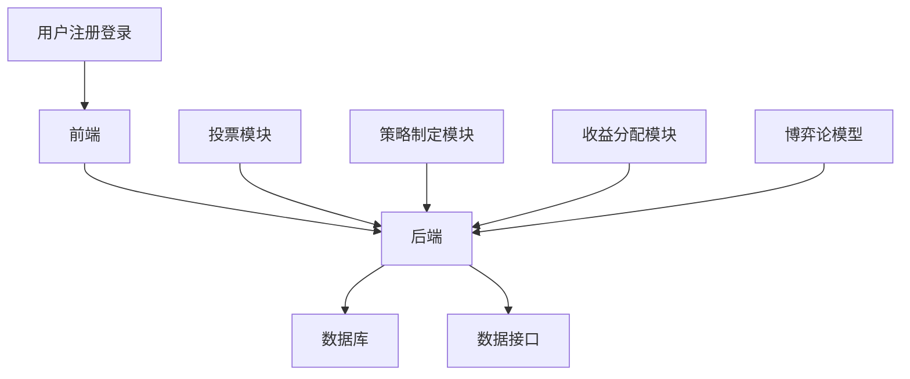
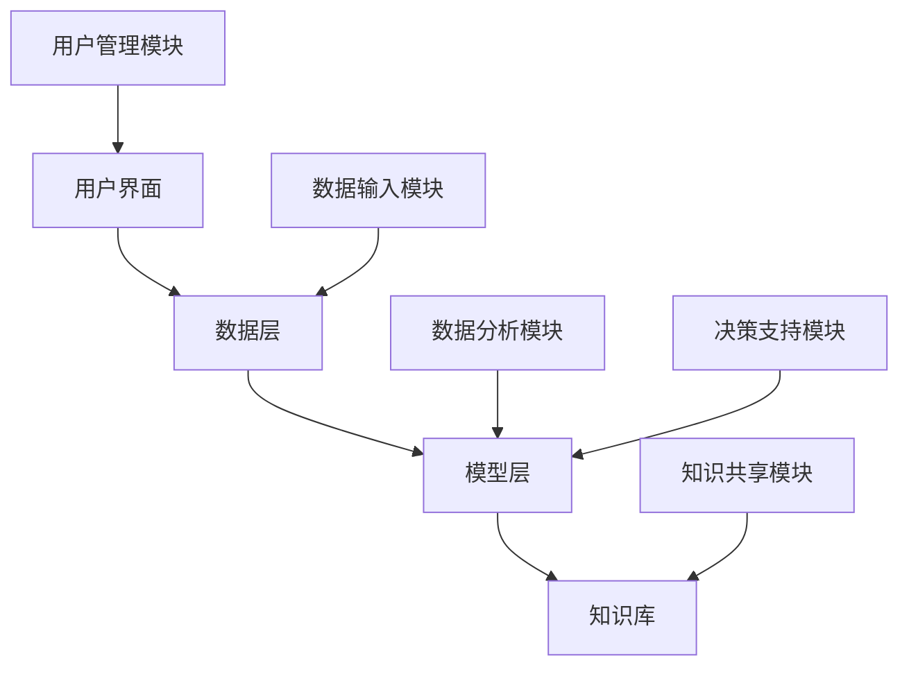

                 

### 《集体决策的博弈论：群体智慧的数学策略》

在当今信息爆炸和复杂决策环境中，集体决策已成为各个领域解决复杂问题的利器。然而，如何从众多个体意见中提炼出最优解，一直是学术界和工业界关注的焦点。本文将围绕集体决策的博弈论与群体智慧的数学策略展开深入探讨，旨在通过系统性的分析和思考，揭示出在群体互动中实现智慧优化的方法与策略。

**关键词：** 集体决策，博弈论，群体智慧，数学策略，决策优化。

**摘要：** 本文首先介绍集体决策与博弈论的基本概念，随后深入探讨博弈论在集体决策中的应用，特别是合作博弈与非合作博弈的区别及其在效率与公平分析中的应用。接着，我们引入群体智慧的概念，分析其特征与优势，并探讨数学策略如何应用于群体决策中。本文还将通过实际案例研究，展示群体智慧在现实世界中的应用，并解析相关的数学模型与算法。最后，本文将对研究成果进行总结，提出存在的问题与未来研究方向，为集体决策与博弈论的研究与应用提供新的思路。

### 第一部分：引言与基础概念

#### 第1章：集体决策与博弈论概述

**1.1 集体决策的基本概念**

集体决策是指由多个个体组成的群体在共同目标或利益驱动下，通过讨论、协商或投票等方式达成共识的过程。与个人决策不同，集体决策涉及多个利益相关者的互动，需要考虑各方利益的平衡和协调。

**1.2 博弈论的基本原理**

博弈论是研究具有冲突和合作特征的决策制定过程的一个数学工具。它通过形式化的模型来分析不同决策者在特定环境下如何选择策略，以及这些策略如何影响决策的结果。

**1.3 集体决策中的博弈模型**

在集体决策中，博弈论模型可以帮助我们理解个体之间的相互作用和决策行为。常见的博弈模型包括合作博弈和非合作博弈，每种模型都有其特定的应用场景和均衡分析。

#### 第2章：博弈论在集体决策中的应用

**2.1 合作博弈与非合作博弈**

合作博弈强调个体之间的合作，追求整体利益的最大化。非合作博弈则强调个体之间的竞争，每个个体追求自身利益的最大化。

**2.2 公平分配与效率分析**

公平分配是指在集体决策中，如何确保各方的利益得到公平对待。效率分析则关注在特定资源约束下，如何实现集体决策的最优结果。

**2.3 集体决策的均衡分析**

均衡分析是博弈论的核心内容，通过分析不同博弈模型的均衡状态，可以预测集体决策的可能结果。

### 第二部分：群体智慧与数学策略

#### 第3章：群体智慧的概念与特征

**3.1 群体智慧的定义与来源**

群体智慧是指多个个体通过协同工作、相互学习、共享信息等方式形成的集体智慧。它可以从个体间的相互协作和知识共享中产生。

**3.2 群体智慧的特征与优势**

群体智慧具有多样性、鲁棒性和适应性等特征，使其在复杂决策中具有显著的优势。

**3.3 群体智慧的数学模型**

数学模型可以帮助我们量化群体智慧的形成过程，分析其影响机制。

#### 第4章：数学策略在群体决策中的应用

**4.1 群体决策中的优化算法**

优化算法是群体智慧在决策中的重要工具，如粒子群优化算法、遗传算法等。

**4.2 模糊逻辑在集体决策中的应用**

模糊逻辑可以帮助处理不确定性和模糊性，提高集体决策的准确性。

**4.3 神经网络在群体智慧中的应用**

神经网络可以通过学习大量数据，提取隐藏的决策规则，为群体决策提供强大的支持。

#### 第5章：案例研究：群体智慧在现实世界中的应用

**5.1 城市交通管理中的群体智慧应用**

在交通管理中，群体智慧可以用于优化交通信号控制和车辆调度。

**5.2 网络安全中的群体智慧应用**

在网络安全领域，群体智慧可以帮助检测和预防网络攻击。

**5.3 决策制定中的群体智慧应用**

在企业管理、政策制定等领域，群体智慧可以提供科学决策的支持。

### 第三部分：数学模型与算法解析

#### 第6章：合作博弈模型的数学分析

**6.1 合作博弈的基本概念**

合作博弈模型关注个体之间的合作，通过共同策略实现利益最大化。

**6.2 合作博弈的均衡分析**

通过合作博弈的均衡分析，可以预测集体决策的结果。

**6.3 合作博弈的算法实现**

合作博弈的算法实现涉及多个步骤，包括模型建立、均衡求解等。

#### 第7章：非合作博弈模型的数学分析

**7.1 非合作博弈的基本概念**

非合作博弈模型强调个体之间的竞争，每个个体追求自身利益的最大化。

**7.2 非合作博弈的均衡分析**

非合作博弈的均衡分析关注Nash均衡等概念。

**7.3 非合作博弈的算法实现**

非合作博弈的算法实现包括多种方法，如博弈论算法、优化算法等。

#### 第8章：优化算法在集体决策中的应用

**8.1 粒子群优化算法**

粒子群优化算法是一种基于群体智慧的优化算法，适用于多种复杂问题。

**8.2 遗传算法**

遗传算法通过模拟自然进化过程，优化决策变量。

**8.3 其他优化算法在集体决策中的应用**

其他优化算法，如模拟退火、禁忌搜索等，也在集体决策中具有广泛应用。

### 第四部分：项目实战与案例分析

#### 第9章：基于博弈论的集体决策系统开发

**9.1 系统设计**

系统设计包括功能需求分析、架构设计等。

**9.2 系统实现**

系统实现涉及代码编写、模块集成等。

**9.3 系统测试与优化**

系统测试与优化确保系统性能和稳定性。

#### 第10章：群体智慧在决策支持系统中的应用

**10.1 决策支持系统的设计**

决策支持系统的设计包括模型选择、算法集成等。

**10.2 群体智慧的集成**

群体智慧的集成涉及数据共享、协同优化等。

**10.3 决策支持系统的实际应用案例**

实际应用案例展示决策支持系统的效果。

#### 第11章：案例研究：群体智慧在行业中的应用

**11.1 零售行业中的群体智慧应用**

分析群体智慧在零售行业中的应用。

**11.2 制造业中的群体智慧应用**

探讨群体智慧在制造业中的应用。

**11.3 医疗行业中的群体智慧应用**

研究群体智慧在医疗行业中的应用。

### 第五部分：结论与展望

#### 第12章：结论

**12.1 研究成果总结**

总结研究的主要成果和贡献。

**12.2 存在的问题与挑战**

分析研究中的问题和挑战。

**12.3 未来研究方向**

提出未来研究的新方向。

#### 第13章：展望

**13.1 集体决策与博弈论的发展趋势**

展望集体决策与博弈论的发展趋势。

**13.2 群体智慧在决策领域的应用前景**

探讨群体智慧在决策领域的应用前景。

**13.3 数学策略在决策支持系统中的作用**

分析数学策略在决策支持系统中的作用。

### 附录

#### 附录A：数学模型与算法公式详解

提供详细的数学模型和算法公式解释。

#### 附录B：代码实例与解析

提供代码实例及其详细解析。

#### 附录C：参考文献与推荐阅读

列出参考文献和推荐阅读。

---

现在，我们已经完成了文章的目录大纲，接下来我们将按照这个大纲逐步展开每一部分的内容，深入探讨集体决策、博弈论、群体智慧以及数学策略在决策支持系统中的应用。让我们开始第一步：介绍集体决策与博弈论的基本概念。 

### 第一部分：引言与基础概念

#### 第1章：集体决策与博弈论概述

在复杂决策环境中，个体之间的相互作用变得越来越重要。集体决策作为一种解决复杂问题的方法，能够更好地反映群体的利益和需求。博弈论作为研究决策行为的数学工具，为理解集体决策提供了强有力的理论支持。

**1.1 集体决策的基本概念**

集体决策是指多个个体在共同目标或利益驱动下，通过讨论、协商或投票等方式达成共识的过程。与个人决策不同，集体决策涉及多个利益相关者的互动，需要考虑各方利益的平衡和协调。

在集体决策中，个体通常具有以下特征：

1. 多样性：个体具有不同的背景、知识、技能和利益。
2. 相互依赖：个体的决策结果会相互影响。
3. 动态性：决策过程可能随着时间和信息的更新而发生变化。

**1.2 博弈论的基本原理**

博弈论是研究具有冲突和合作特征的决策制定过程的一个数学工具。它通过形式化的模型来分析不同决策者在特定环境下如何选择策略，以及这些策略如何影响决策的结果。

博弈论的核心概念包括：

1. 参与者：决策的个体或组织。
2. 策略：参与者可以采取的行动或决策。
3. 支付：每个参与者根据其他参与者的策略获得的收益或损失。
4. 均衡：所有参与者都选择其最优策略的状态。

博弈论可以分为合作博弈和非合作博弈两大类：

- **合作博弈**：参与者之间可以达成合作协议，共同努力实现整体利益的最大化。
- **非合作博弈**：参与者之间没有正式的合作协议，各自追求自身利益的最大化。

**1.3 集体决策中的博弈模型**

在集体决策中，博弈论模型可以帮助我们理解个体之间的相互作用和决策行为。常见的博弈模型包括合作博弈和非合作博弈，每种模型都有其特定的应用场景和均衡分析。

- **合作博弈模型**：适用于需要团队合作实现共同目标的场景，如企业联盟、公共交通管理等。
- **非合作博弈模型**：适用于个体之间存在竞争关系，如市场竞争、资源争夺等。

通过博弈论模型，我们可以分析不同决策者的策略选择和结果，为集体决策提供理论依据。

**小结：**

集体决策与博弈论是理解复杂决策过程的重要工具。集体决策通过多个个体的互动实现共同利益的最大化，而博弈论通过数学模型分析个体之间的决策行为和互动结果。理解这些基础概念，有助于我们在实际应用中更有效地制定和执行集体决策。

### 第2章：博弈论在集体决策中的应用

博弈论作为一种分析决策互动的工具，在集体决策中有着广泛的应用。通过博弈论，我们可以更好地理解个体间的策略选择和决策结果，从而为集体决策提供有效的指导。本章将深入探讨合作博弈和非合作博弈在集体决策中的应用，以及如何通过公平分配和效率分析来优化集体决策。

**2.1 合作博弈与非合作博弈**

合作博弈和非合作博弈是博弈论的两大基本类型，它们在集体决策中有着不同的应用场景。

- **合作博弈**：在这种博弈中，参与者之间可以达成合作协议，共同追求整体利益的最大化。合作博弈的典型例子包括企业联盟、公共项目合作等。合作博弈的关键在于参与者之间的信任和协作。为了实现合作，参与者需要制定共同的策略，并在决策过程中相互沟通和协调。

  **例子**：两个城市合作进行交通基础设施建设，通过共享资源和信息，实现交通拥堵的缓解和运输效率的提高。

- **非合作博弈**：在这种博弈中，参与者之间没有正式的合作协议，各自追求自身利益的最大化。非合作博弈的典型例子包括市场竞争、资源争夺等。非合作博弈的关键在于参与者之间的策略选择和博弈策略的优化。

  **例子**：两家航空公司竞争同一航线，通过降低票价来吸引乘客，最终导致票价战的爆发。

**2.2 公平分配与效率分析**

公平分配和效率分析是集体决策中重要的考虑因素。公平分配关注如何确保各方的利益得到公平对待，而效率分析关注如何在特定资源约束下实现最优结果。

- **公平分配**：在集体决策中，公平分配意味着每个参与者根据其贡献或需求获得相应的收益。公平分配可以增强参与者之间的信任和合作意愿，从而提高决策的可持续性。

  **例子**：在一个合作项目中，参与者的薪酬和奖励应根据其贡献进行分配，确保每个人都能感受到自己的努力得到认可。

- **效率分析**：效率分析关注如何通过优化决策过程和资源利用，实现整体效益的最大化。效率分析可以帮助我们识别和消除决策过程中的低效环节，提高决策的整体质量。

  **例子**：在资源有限的情况下，选择最有效率的交通信号控制策略，以减少交通拥堵和提高交通流量。

**2.3 集体决策的均衡分析**

均衡分析是博弈论的核心内容，通过分析不同博弈模型的均衡状态，我们可以预测集体决策的可能结果。在集体决策中，常见的均衡分析包括Nash均衡、合作博弈的Shapley值和核心等。

- **Nash均衡**：在Nash均衡中，每个参与者都选择其最优策略，且没有任何参与者可以通过单方面改变策略来获得更大的收益。Nash均衡反映了参与者的理性决策行为。

  **例子**：在市场竞争中，如果所有公司都选择维持当前价格水平，那么每个公司都无法通过降价来增加市场份额，因为降价会导致整体市场需求的下降。

- **合作博弈的Shapley值**：Shapley值是一种衡量参与者贡献的公平分配方法。它基于参与者之间的合作博弈模型，通过计算每个参与者对整体收益的贡献，为公平分配提供依据。

  **例子**：在一个合作项目中，根据Shapley值，每个参与者可以公平地获得相应的收益，确保贡献最大的参与者得到最大的回报。

- **合作博弈的核心**：核心是指在一个合作博弈中，所有参与者都愿意接受的一个收益分配方案。核心反映了参与者的共同利益和合作意愿。

  **例子**：在一个公共项目中，如果所有参与者都认为当前的收益分配方案是公平和合理的，那么这个方案就处于核心状态。

**小结：**

博弈论在集体决策中具有广泛的应用。通过合作博弈和非合作博弈模型，我们可以分析个体间的策略选择和互动结果。公平分配和效率分析是优化集体决策的重要工具，而均衡分析则为我们预测集体决策结果提供了理论依据。理解这些概念和应用，有助于我们在实际决策中更好地协调各方利益，实现集体决策的最优化。

### 第3章：群体智慧的概念与特征

群体智慧是一个相对较新的概念，它强调了个体之间的协同作用，通过共享知识和资源来生成超越单个个体的智慧。在本章中，我们将探讨群体智慧的定义、来源、特征及其在决策中的优势。

**3.1 群体智慧的定义与来源**

群体智慧（Collective Intelligence）是指多个个体通过协作、相互学习、共享信息等方式，共同生成的一种超个体智慧。这种智慧不仅来自于个体的独立思维，更重要的是个体之间的互动和合作。

群体智慧的来源可以归纳为以下几个方面：

- **知识共享**：个体之间通过交流信息，共享各自的知识和经验，形成更丰富的信息资源。
- **协同合作**：个体通过协同合作，可以弥补各自能力的不足，实现能力的互补和扩展。
- **分布式计算**：群体智慧往往具有分布式计算的特征，个体之间可以相互协作，共同解决复杂问题。
- **多样性**：群体智慧通过多样性的个体互动，能够产生更多的创新思路和解决方案。

**3.2 群体智慧的特征与优势**

群体智慧具有以下几个显著特征：

- **多样性**：群体智慧中的个体具有不同的背景、知识和经验，这种多样性为决策提供了丰富的视角和思路。
- **鲁棒性**：群体智慧能够通过个体间的相互学习和适应，抵御外部环境的变化和不确定性。
- **适应性**：群体智慧能够快速适应新的环境和需求，通过持续学习和优化，不断提升决策质量和效率。
- **协同性**：群体智慧强调个体之间的协作和合作，通过共同目标驱动，实现整体利益的最大化。

群体智慧在决策中的优势体现在以下几个方面：

1. **提高决策质量**：群体智慧能够整合多个个体的知识和经验，生成更全面和深入的决策信息，从而提高决策的准确性和有效性。
2. **激发创新思维**：群体智慧通过多样性个体的互动，可以激发更多的创新思路和解决方案，推动决策的创新性和前瞻性。
3. **增强决策稳定性**：群体智慧通过个体间的相互学习和适应，能够增强决策的稳定性和鲁棒性，减少外部环境变化对决策的影响。
4. **优化资源利用**：群体智慧能够通过协同合作，优化资源利用，实现整体利益的最大化。

**3.3 群体智慧的数学模型**

为了更好地理解和量化群体智慧，我们可以借助数学模型来描述其形成和运作过程。常见的数学模型包括：

- **社会网络模型**：通过分析个体之间的社交关系和网络结构，描述群体智慧的形成过程。
- **复杂系统模型**：通过模拟复杂系统的演化过程，研究群体智慧的动态行为和演化规律。
- **博弈论模型**：通过分析个体间的策略选择和互动，研究群体智慧的形成机制和优化策略。

**例子**：在社会网络模型中，我们可以通过分析个体之间的连接强度和互动频率，量化群体智慧的形成过程。在一个社交网络中，如果个体之间的连接强度较高，且互动频率较高，那么这个群体就具有较高的群体智慧。

**小结：**

群体智慧是一种通过个体之间的协同合作，共享知识和资源，形成超越单个个体的智慧。它具有多样性、鲁棒性、适应性和协同性等特征，在决策中具有显著的优势。通过数学模型，我们可以更好地理解和量化群体智慧的形成和运作过程，为实际应用提供理论依据。

### 第4章：数学策略在群体决策中的应用

数学策略在群体决策中的应用具有重要意义，它不仅能够提高决策的效率，还能确保决策的准确性和公平性。本章将探讨数学策略在群体决策中的具体应用，包括优化算法、模糊逻辑和神经网络等。

**4.1 群体决策中的优化算法**

优化算法是群体决策中常用的数学策略，它通过数学模型和算法，寻找最优解或近似最优解。优化算法在群体决策中具有广泛的应用，如资源分配、任务调度、路线规划等。

- **粒子群优化算法（Particle Swarm Optimization, PSO）**：PSO是一种基于群体智能的优化算法，模拟鸟群觅食行为。在群体决策中，PSO可以用于寻找最优策略，如最优路径选择、资源分配等。

  **算法步骤：**
  1. 初始化粒子群，包括位置、速度和初始解。
  2. 计算每个粒子的适应度值。
  3. 更新每个粒子的个体最优解和全局最优解。
  4. 更新粒子的速度和位置。
  5. 重复步骤2-4，直到满足停止条件。

  **伪代码示例：**
  ```python
  class Particle:
      def __init__(self, position, velocity):
          self.position = position
          self.velocity = velocity
          self.best_position = position.copy()
          self.best_value = self.value(self.position)

      def update_position(self):
          # 更新位置
          pass

      def update_velocity(self):
          # 更新速度
          pass

      def value(self, position):
          # 目标函数值
          pass

  def pso(max_iterations, particle_count, position_limits, velocity_limits, objective_function):
      particles = [Particle(np.random.uniform(position_limits[:, 0], position_limits[:, 1]), np.random.uniform(velocity_limits[:, 0], velocity_limits[:, 1])) for _ in range(particle_count)]
      
      for _ in range(max_iterations):
          for particle in particles:
              particle.update_position()
              particle.update_velocity()
              
          for particle in particles:
              if particle.value(particle.position) < particle.best_value:
                  particle.best_value = particle.value(particle.position)
                  particle.best_position = particle.position.copy()
      
      return max(particles, key=lambda p: p.best_value).best_position
  ```

- **遗传算法（Genetic Algorithm, GA）**：GA是一种基于自然进化过程的优化算法，通过模拟遗传、交叉、变异等过程，优化决策变量。

  **算法步骤：**
  1. 初始化种群，包括个体和适应度值。
  2. 选择适应度较高的个体进行交叉和变异操作。
  3. 生成新的种群。
  4. 计算新种群中每个个体的适应度值。
  5. 重复步骤2-4，直到满足停止条件。

  **伪代码示例：**
  ```python
  def genetic_algorithm(population_size, objective_function, selection, crossover, mutation):
      population = initialize_population(population_size, objective_function)
      
      while not termination_condition():
          selected_individuals = selection(population)
          offspring = crossover(selected_individuals)
          offspring = mutation(offspring)
          population = next_population(population, offspring)
          evaluate_population(population, objective_function)
      
      best_individual = max(population, key=lambda i: i.fitness)
      return best_individual
  ```

**4.2 模糊逻辑在集体决策中的应用**

模糊逻辑是一种处理不确定性和模糊性的数学方法，它通过模糊集合和模糊规则，将模糊概念量化为数学表达式。在集体决策中，模糊逻辑可以帮助我们处理复杂的信息和不确定性，提高决策的准确性和适应性。

- **模糊规则生成**：通过专家经验或数据驱动方法，生成模糊规则。

  **示例规则：**
  如果 交通流量高 并且 天气恶劣，那么 信号灯设置应该 为 长绿。

- **模糊推理**：通过模糊规则和输入条件，进行模糊推理，得到输出结果。

  **示例推理：**
  输入：交通流量为高，天气为恶劣。
  输出：信号灯设置为长绿。

- **模糊控制器**：通过模糊逻辑，设计用于控制的系统，实现决策的自动化。

  **示例控制器：**
  一个交通信号控制系统，通过模糊逻辑判断交通流量和天气条件，自动调整信号灯设置。

**4.3 神经网络在群体智慧中的应用**

神经网络是一种模仿生物神经系统的计算模型，它通过多层神经元之间的连接和激活函数，处理输入信息并生成输出。在群体智慧中，神经网络可以用于决策支持、模式识别和预测分析等。

- **多层感知机（Multilayer Perceptron, MLP）**：MLP是一种常见的神经网络模型，用于非线性回归和分类问题。

  **算法步骤：**
  1. 初始化神经网络结构，包括输入层、隐藏层和输出层。
  2. 训练神经网络，通过反向传播算法调整权重和偏置。
  3. 预测新数据，通过输入层传递到输出层。

  **伪代码示例：**
  ```python
  def mlptoprediction(input_data, weights, biases):
      layer_outputs = [input_data]
      for layer in layers:
          layer_output = activation_function(np.dot(layer_outputs[-1], weights) + biases)
          layer_outputs.append(layer_output)
      return layer_outputs[-1]
  ```

- **卷积神经网络（Convolutional Neural Network, CNN）**：CNN是一种专门用于处理图像数据的神经网络模型，通过卷积操作和池化操作，提取图像特征。

  **算法步骤：**
  1. 初始化CNN结构，包括卷积层、池化层和全连接层。
  2. 训练CNN，通过反向传播算法优化模型参数。
  3. 预测新图像，通过卷积和池化操作提取特征，然后通过全连接层生成预测结果。

  **伪代码示例：**
  ```python
  def cnnprediction(input_image, weights, biases):
      layer_outputs = [input_image]
      for layer in layers:
          if isinstance(layer, ConvLayer):
              layer_output = conv2d(layer_outputs[-1], weights['weights'], biases['biases'])
              layer_output = activation_function(layer_output)
          elif isinstance(layer, PoolLayer):
              layer_output = max_pool(layer_outputs[-1])
          layer_outputs.append(layer_output)
      return layer_outputs[-1]
  ```

**小结：**

数学策略在群体决策中的应用，为复杂决策提供了有效的工具和方法。优化算法、模糊逻辑和神经网络等策略，通过数学模型和计算方法，提高了决策的效率、准确性和适应性。理解这些数学策略的基本原理和实现方法，有助于我们在实际应用中更好地利用群体智慧，实现科学决策。

### 第5章：案例研究：群体智慧在现实世界中的应用

群体智慧在现实世界中的应用日益广泛，它通过个体间的协作和共享，实现比单一个体更为卓越的决策和问题解决能力。本节将探讨群体智慧在交通管理、网络安全和决策制定等领域的实际应用案例，分析其在现实世界中的效果和挑战。

#### 5.1 城市交通管理中的群体智慧应用

城市交通管理是一个复杂的系统工程，涉及到交通流量、车辆密度、道路状况等多种因素。通过引入群体智慧，可以优化交通信号控制和车辆调度，提高交通效率和安全性。

**案例：智能交通信号控制系统**

一个智能交通信号控制系统利用传感器收集交通数据，通过实时分析交通流量，动态调整信号灯时长。系统基于群体智慧，通过多个传感器和交通控制中心的数据共享和协同工作，实现交通信号的最优化。

**效果分析：**

- **减少交通拥堵**：通过实时调整信号灯时长，减少车辆等待时间，从而降低交通拥堵。
- **提高交通流量**：优化交通信号控制，提高道路通行能力，增加交通流量。
- **提升安全性**：通过实时监控交通状况，及时发现并处理交通事故，提升道路安全性。

**挑战与展望：**

- **数据隐私与安全**：交通数据涉及个人隐私和城市安全，如何保护数据隐私和安全是一个重要挑战。
- **系统复杂性**：城市交通系统复杂，需要多种技术和方法协同工作，如何确保系统的稳定性和可靠性是一个挑战。

未来，随着人工智能和物联网技术的发展，智能交通信号控制系统的性能和可靠性将进一步提升，为城市交通管理提供更有效的解决方案。

#### 5.2 网络安全中的群体智慧应用

网络安全是一个动态变化的过程，传统的单一防御手段难以应对复杂多变的安全威胁。通过引入群体智慧，可以建立更加智能和自适应的网络安全系统，提高防护能力和响应速度。

**案例：群体智慧网络安全防御系统**

一个基于群体智慧的网络安全防御系统，通过多个安全传感器和数据分析平台的数据共享和协同工作，实时监控和分析网络流量，发现并阻止潜在的攻击行为。

**效果分析：**

- **增强防护能力**：通过实时分析大量数据，系统能够快速识别和响应网络攻击，增强防护能力。
- **提高响应速度**：群体智慧系统可以快速响应和调整防护策略，减少攻击造成的损失。
- **提升用户体验**：通过有效防护网络攻击，确保用户数据安全和网络服务稳定性，提升用户体验。

**挑战与展望：**

- **数据存储和处理**：大量安全数据需要存储和处理，对系统的存储和处理能力提出了高要求。
- **协同效率**：多个安全传感器和数据分析平台的协同工作，需要高效的数据传输和处理机制。

未来，随着大数据和人工智能技术的发展，群体智慧网络安全防御系统的性能和智能化程度将进一步提高，为网络安全提供强有力的支持。

#### 5.3 决策制定中的群体智慧应用

在企业管理、政策制定和公共事务管理等领域，群体智慧可以提供科学决策的支持。通过整合多方意见和专业知识，群体智慧有助于提高决策的准确性和可行性。

**案例：智能政策制定系统**

一个智能政策制定系统通过大数据分析和人工智能技术，收集和分析各方意见和需求，为政策制定提供数据支持和建议。

**效果分析：**

- **提高决策效率**：通过实时分析和处理大量数据，系统能够快速生成决策建议，提高决策效率。
- **增强决策科学性**：群体智慧系统整合多方意见和专业知识，提高决策的科学性和准确性。
- **促进公众参与**：通过公开透明的决策过程，提高公众对政策制定的参与度和信任度。

**挑战与展望：**

- **数据质量和可靠性**：决策过程中依赖的大量数据需要保证质量和可靠性，确保决策建议的准确性。
- **决策过程的透明度**：如何保证决策过程的透明度和公正性，是一个重要的伦理和社会问题。

未来，随着人工智能和大数据技术的发展，智能政策制定系统将为决策制定提供更加科学和高效的解决方案。

**小结：**

群体智慧在交通管理、网络安全和决策制定等领域的应用，展现了其在复杂问题解决中的巨大潜力。通过个体间的协同和共享，群体智慧能够实现比单一个体更为卓越的决策和问题解决能力。然而，在应用过程中也面临数据隐私、系统复杂性和协同效率等挑战。随着技术的不断进步，群体智慧将在更多领域发挥重要作用，为现实世界的复杂问题提供有效的解决方案。

### 第6章：合作博弈模型的数学分析

合作博弈模型是博弈论中的重要分支，它关注多个个体通过合作实现共同利益的最大化。在合作博弈中，参与者之间可以通过合作协议共享资源和收益，从而实现整体利益的最优。本章将详细介绍合作博弈模型的基本概念、数学分析和算法实现，并探讨其应用场景。

#### 6.1 合作博弈的基本概念

合作博弈（Cooperative Game）是一种博弈形式，其中参与者（或玩家）可以组成联盟，通过共同行动实现合作。与个体博弈（如非合作博弈）不同，合作博弈的参与者可以通过协商和合作，实现比个体行动更好的结果。

合作博弈的基本要素包括：

- **参与者**：合作博弈的参与者可以是个人、组织或群体。
- **策略**：参与者可以选择的策略，可以是合作或竞争。
- **支付**：每个参与者根据其策略选择和联盟分配获得的收益或损失。
- **合作联盟**：参与者之间通过协商和合作形成的联盟。

**合作博弈的类型**

合作博弈可以根据合作联盟的稳定性分为以下两种类型：

1. **稳定联盟**：一个联盟是稳定的，如果所有成员都认为离开联盟不如留在联盟中。这种稳定性可以通过Shapley值和核心等概念来量化。
2. **可转移联盟**：一个联盟是可转移的，如果它的成员可以在不改变总体收益的情况下，自由加入或退出其他联盟。

#### 6.2 合作博弈的均衡分析

均衡分析是博弈论中的核心内容，它帮助我们预测参与者在特定环境下的策略选择和结果。在合作博弈中，常见的均衡概念包括Shapley值、Nash均衡和核心。

**Shapley值**

Shapley值（Shapley Value）是一种公平分配参与者收益的方法，它基于参与者对联盟的贡献。Shapley值考虑了每个参与者加入联盟的不同顺序，通过计算每个参与者对所有可能的联盟的贡献，得到其公平的收益分配。

**计算Shapley值的步骤：**

1. **定义参与者集合**：设N为参与者集合，n为集合N的基数。
2. **计算每个参与者对每个联盟的贡献**：对于每个参与者i，计算其在所有可能的子集合中的边际贡献，即加入该参与者后联盟收益的变化。
3. **计算Shapley值**：将每个参与者对所有联盟的边际贡献进行加权平均，得到其Shapley值。

**Shapley值的公式：**

$$
v_i(S) = \frac{1}{n} \sum_{S' \subseteq N, i \in S'} \left[ v(S) - v(S') \right]$$

其中，$v(S)$是联盟S的收益，$v_i(S)$是参与者i在联盟S中的Shapley值。

**Nash均衡**

Nash均衡（Nash Equilibrium）是一种策略组合，其中每个参与者都选择其最优策略，且没有任何参与者可以通过单方面改变策略来获得更大的收益。在合作博弈中，Nash均衡反映了参与者之间的合作意愿和策略选择。

**Nash均衡的条件：**

对于每个参与者i，其策略组合$\sigma_i$是Nash均衡，当且仅当：

$$
u_i(\sigma) \geq u_i(\sigma_i', \sigma_{-i})$$

其中，$u_i(\sigma)$是参与者i在策略组合$\sigma$中的期望收益，$\sigma_{-i}$是除参与者i外的其他参与者的策略组合。

**核心**

核心（Core）是合作博弈的一个重要概念，它表示联盟的所有有效策略组合，即联盟内所有参与者都愿意接受的所有收益分配。核心反映了联盟内部的公平性和稳定性。

**核心的存在性**：

一个合作博弈存在核心，当且仅当联盟的收益分配满足以下条件：

- **公平性**：每个参与者都认为自己在联盟中的收益是公平的。
- **稳定性**：联盟内部没有参与者愿意单独离开联盟，因为没有其他联盟能够提供更好的收益分配。

#### 6.3 合作博弈的算法实现

合作博弈的算法实现涉及到模型建立、策略选择和收益分配等步骤。以下是几种常见的合作博弈算法：

**1. Shapley值计算算法**

Shapley值计算算法可以通过枚举所有可能的子集合，计算每个参与者对每个联盟的边际贡献，然后进行加权平均。

**算法步骤：**

1. 初始化参与者集合N。
2. 对于每个参与者i，枚举所有包含i的子集合S'。
3. 对于每个子集合S'，计算$v(S')$和$v(S' \setminus \{i\})$。
4. 计算参与者i的边际贡献：$c_i(S') = v(S') - v(S' \setminus \{i\})$。
5. 计算参与者i的Shapley值：$v_i = \frac{1}{n} \sum_{S' \subseteq N, i \in S'} c_i(S')$。

**2. Nash均衡搜索算法**

Nash均衡搜索算法可以通过枚举所有可能的策略组合，找到满足Nash均衡条件的策略组合。

**算法步骤：**

1. 初始化策略空间和参与者集合。
2. 对于每个参与者i，选择一个策略$\sigma_i$。
3. 对于每个参与者i，计算其期望收益$u_i(\sigma)$。
4. 遍历所有可能的策略组合$\sigma$，检查是否满足Nash均衡条件。
5. 如果找到一个满足Nash均衡条件的策略组合，输出该策略组合。

**3. 核心求解算法**

核心求解算法可以通过线性规划等方法求解合作博弈的核心。

**算法步骤：**

1. 建立线性规划模型，定义目标函数和约束条件。
2. 使用线性规划求解器求解模型，得到核心解。
3. 输出核心解，即联盟的所有有效策略组合。

**小结：**

合作博弈模型是一种重要的博弈形式，它通过参与者之间的合作和协商，实现共同利益的最大化。本章介绍了合作博弈的基本概念、数学分析和算法实现，包括Shapley值、Nash均衡和核心等概念。通过这些概念和算法，我们可以更好地理解和应用合作博弈模型，为现实世界中的合作问题提供有效的解决方案。

### 第7章：非合作博弈模型的数学分析

非合作博弈模型是博弈论中的另一个重要分支，它关注在没有任何正式合作协议的情况下，个体如何通过策略选择实现自身利益的最大化。在这种博弈中，每个个体都追求自身利益的最大化，而不是整体的利益最大化。本章将深入探讨非合作博弈的基本概念、Nash均衡及其算法实现。

#### 7.1 非合作博弈的基本概念

非合作博弈（Non-cooperative Game）是指参与者之间没有正式的合作协议，每个个体都独立地选择自己的策略，以最大化自身的利益。在非合作博弈中，参与者之间的互动遵循自利的动机，追求自身收益的最大化。

非合作博弈的基本要素包括：

- **参与者**：博弈的参与者，可以是个人、组织或群体。
- **策略**：每个参与者可以选择的行动方案。
- **支付**：每个参与者根据其策略选择和其他参与者的策略选择的收益或损失。

**非合作博弈的类型**

非合作博弈可以根据策略选择的方式和收益分配的不同，分为以下几种类型：

1. **完全信息静态博弈**：所有参与者的策略选择和收益是公开的，每个参与者知道其他参与者的策略选择。
2. **不完全信息静态博弈**：参与者不完全了解其他参与者的策略选择，可能存在信息不对称。
3. **完全信息动态博弈**：参与者之间的策略选择和收益是公开的，参与者可以观察到其他参与者的策略选择和历史行为。
4. **不完全信息动态博弈**：参与者不完全了解其他参与者的策略选择，且无法观察到其他参与者的策略选择和历史行为。

#### 7.2 非合作博弈的均衡分析

非合作博弈的均衡分析是博弈论的核心内容，它帮助我们预测参与者在特定博弈中的策略选择和结果。在非合作博弈中，常见的均衡概念包括Nash均衡、Subgame Perfect Equilibrium（子博弈完美均衡）和Evolutionarily Stable Strategy（进化稳定策略）。

**Nash均衡**

Nash均衡（Nash Equilibrium）是一种策略组合，其中每个参与者都选择其最优策略，且没有任何参与者可以通过单方面改变策略来获得更大的收益。在Nash均衡中，每个参与者的策略都是针对其他参与者策略的理性反应。

**Nash均衡的条件**

对于每个参与者i，其策略组合$\sigma$是Nash均衡，当且仅当：

$$
u_i(\sigma) \geq u_i(\sigma_i', \sigma_{-i})$$

其中，$u_i(\sigma)$是参与者i在策略组合$\sigma$中的期望收益，$\sigma_{-i}$是除参与者i外的其他参与者的策略组合，$\sigma_i'$是参与者i选择的其他策略。

**计算Nash均衡的方法**

- **枚举法**：通过枚举所有可能的策略组合，找到满足Nash均衡条件的策略组合。
- **图论法**：使用图论方法，如最小生成树、最大流等，计算Nash均衡。
- **数值法**：使用数值方法，如线性规划、非线性规划等，求解Nash均衡。

**Subgame Perfect Equilibrium**

子博弈完美均衡（Subgame Perfect Equilibrium）是在动态博弈中的一种均衡概念，它要求在博弈的每个阶段，每个参与者都选择其最优策略，并且整个博弈的策略组合构成一个Nash均衡。

**计算Subgame Perfect Equilibrium的方法**

- **逆向归纳法**：从博弈的终点开始，逆向推导每个阶段的最佳策略。
- **博弈树法**：构建博弈树，逐步计算每个节点的最佳策略。

**Evolutionarily Stable Strategy**

进化稳定策略（Evolutionarily Stable Strategy）是群体动态博弈中的一个概念，它指的是在自然选择过程中，能够抵抗其他策略入侵的稳定策略。

**计算Evolutionarily Stable Strategy的方法**

- **动态系统法**：通过分析群体动态系统的稳定性，找到进化稳定策略。
- **矩阵方法**：使用矩阵模型，计算策略的稳定性。

#### 7.3 非合作博弈的算法实现

非合作博弈的算法实现涉及到模型建立、策略选择和均衡求解等步骤。以下是几种常见的非合作博弈算法：

**1. Nash均衡搜索算法**

Nash均衡搜索算法通过枚举所有可能的策略组合，找到满足Nash均衡条件的策略组合。

**算法步骤：**

1. 初始化策略空间和参与者集合。
2. 对于每个参与者i，选择一个策略$\sigma_i$。
3. 对于每个参与者i，计算其期望收益$u_i(\sigma)$。
4. 遍历所有可能的策略组合$\sigma$，检查是否满足Nash均衡条件。
5. 如果找到一个满足Nash均衡条件的策略组合，输出该策略组合。

**2. 遗传算法**

遗传算法（Genetic Algorithm）是一种模拟自然进化过程的优化算法，可以用于求解非合作博弈的Nash均衡。

**算法步骤：**

1. 初始化种群，包括个体和适应度值。
2. 选择适应度较高的个体进行交叉和变异操作。
3. 生成新的种群。
4. 计算新种群中每个个体的适应度值。
5. 重复步骤2-4，直到满足停止条件。
6. 输出最佳个体，作为Nash均衡解。

**3. 粒子群优化算法**

粒子群优化算法（Particle Swarm Optimization，PSO）是一种基于群体智能的优化算法，可以用于求解非合作博弈的Nash均衡。

**算法步骤：**

1. 初始化粒子群，包括位置、速度和初始解。
2. 计算每个粒子的适应度值。
3. 更新每个粒子的个体最优解和全局最优解。
4. 更新粒子的速度和位置。
5. 重复步骤2-4，直到满足停止条件。
6. 输出全局最优解，作为Nash均衡解。

**小结：**

非合作博弈模型在经济学、社会学、生物学等领域具有广泛的应用。通过Nash均衡等概念，我们可以分析个体在非合作博弈中的策略选择和结果。本章介绍了非合作博弈的基本概念、均衡分析和算法实现，为理解和应用非合作博弈提供了理论依据。在实际应用中，可以根据具体情况选择合适的算法，求解非合作博弈的均衡解。

### 第8章：优化算法在集体决策中的应用

优化算法在集体决策中发挥着重要作用，能够帮助我们在复杂决策环境中找到最优或近似最优解。本章将详细探讨几种常见的优化算法，包括粒子群优化（Particle Swarm Optimization，PSO）、遗传算法（Genetic Algorithm，GA）和其他优化算法在集体决策中的应用。

#### 8.1 粒子群优化算法

粒子群优化算法是一种基于群体智能的优化算法，模拟鸟群觅食行为，通过个体之间的协同和互动，逐步优化目标函数。PSO算法在解决复杂优化问题时具有高效性和鲁棒性，广泛应用于各种集体决策问题。

**算法原理**

粒子群优化算法的基本原理是：每个粒子都拥有一个位置和速度，通过更新位置和速度，逐步逼近最优解。每个粒子在其搜索过程中，不仅参考自己的历史最优位置，还参考整个群体历史最优位置，即全局最优位置。

**算法步骤**

1. **初始化粒子群**：随机生成粒子群，包括粒子的位置和速度。
2. **计算适应度值**：对每个粒子计算目标函数的适应度值。
3. **更新个体最优位置和全局最优位置**：对于每个粒子，更新其个体最优位置和全局最优位置。
4. **更新粒子的速度和位置**：根据个体最优位置和全局最优位置，更新粒子的速度和位置。
5. **重复步骤2-4**，直到满足停止条件。

**伪代码示例**

```python
class Particle:
    def __init__(self, position, velocity):
        self.position = position
        self.velocity = velocity
        self.best_position = position.copy()
        self.best_value = self.value(self.position)

    def update_position(self):
        # 更新位置
        pass

    def update_velocity(self):
        # 更新速度
        pass

    def value(self, position):
        # 目标函数值
        pass

def pso(max_iterations, particle_count, position_limits, velocity_limits, objective_function):
    particles = [Particle(np.random.uniform(position_limits[:, 0], position_limits[:, 1]), np.random.uniform(velocity_limits[:, 0], velocity_limits[:, 1])) for _ in range(particle_count)]

    for _ in range(max_iterations):
        for particle in particles:
            particle.update_position()
            particle.update_velocity()

        for particle in particles:
            if particle.value(particle.position) < particle.best_value:
                particle.best_value = particle.value(particle.position)
                particle.best_position = particle.position.copy()

    return max(particles, key=lambda p: p.best_value).best_position
```

**应用案例**

粒子群优化算法在资源分配、任务调度和路径规划等领域有广泛应用。例如，在交通管理中，PSO算法可以用于优化交通信号控制，减少交通拥堵和提升交通效率。

#### 8.2 遗传算法

遗传算法是一种基于自然进化过程的优化算法，模拟生物进化中的遗传、交叉和变异过程，通过迭代进化寻找最优解。GA在解决复杂优化问题时具有全局搜索能力和自适应能力，适用于集体决策中的大规模多变量问题。

**算法原理**

遗传算法的核心原理是：通过模拟生物进化过程，逐步优化目标函数。算法通过初始化种群、选择适应度较高的个体进行交叉和变异，生成新的种群，并通过适应度评估和选择过程，逐步逼近最优解。

**算法步骤**

1. **初始化种群**：随机生成初始种群，包括个体和适应度值。
2. **计算适应度值**：对每个个体计算目标函数的适应度值。
3. **选择**：根据适应度值选择适应度较高的个体进行交叉和变异操作。
4. **交叉**：对选中的个体进行交叉操作，生成新的后代。
5. **变异**：对后代进行变异操作，增加种群的多样性。
6. **生成新种群**：将交叉和变异后的后代组成新的种群。
7. **适应度评估**：对新的种群进行适应度评估。
8. **重复步骤3-7**，直到满足停止条件。

**伪代码示例**

```python
def genetic_algorithm(population_size, objective_function, selection, crossover, mutation):
    population = initialize_population(population_size, objective_function)
    
    while not termination_condition():
        selected_individuals = selection(population)
        offspring = crossover(selected_individuals)
        offspring = mutation(offspring)
        population = next_population(population, offspring)
        evaluate_population(population, objective_function)
    
    best_individual = max(population, key=lambda i: i.fitness)
    return best_individual
```

**应用案例**

遗传算法在物流调度、金融分析和机器学习等领域有广泛应用。例如，在物流调度中，GA可以用于优化运输路线和货物分配，提高运输效率和降低成本。

#### 8.3 其他优化算法

除了粒子群优化算法和遗传算法，还有许多其他的优化算法在集体决策中具有广泛应用，包括模拟退火算法（Simulated Annealing，SA）、禁忌搜索算法（Tabu Search，TS）和蚁群算法（Ant Colony Optimization，ACO）等。

**模拟退火算法**

模拟退火算法是一种基于物理退火过程的优化算法，通过逐渐降低温度，避免陷入局部最优，寻找全局最优解。SA在解决组合优化问题和大规模决策问题中具有优势。

**禁忌搜索算法**

禁忌搜索算法通过记忆过去的决策，避免重复选择相同的策略，从而跳出局部最优。TS在解决复杂组合优化问题，如旅行商问题（Traveling Salesman Problem，TSP）中，具有显著效果。

**蚁群算法**

蚁群算法模拟蚂蚁觅食行为，通过信息素更新和蚂蚁路径选择，逐步优化目标函数。ACO在路径规划、物流调度和社交网络分析等领域有广泛应用。

**小结**

优化算法在集体决策中具有重要作用，通过模拟自然进化过程和群体智能，能够高效地解决复杂优化问题。本章介绍了粒子群优化、遗传算法以及其他优化算法的基本原理和应用案例，为集体决策提供了有力的技术支持。

### 第9章：基于博弈论的集体决策系统开发

在现代决策环境中，基于博弈论的集体决策系统在各个领域都发挥着重要作用。本章将介绍如何开发一个基于博弈论的集体决策系统，包括系统设计、系统实现和系统测试与优化。

#### 9.1 系统设计

系统设计是开发集体决策系统的第一步，它涉及功能需求分析、架构设计和技术选型。以下是一个基于博弈论的集体决策系统的设计步骤：

1. **功能需求分析**：确定系统的核心功能，如用户注册、登录、投票、策略制定、收益分配等。

2. **架构设计**：设计系统的整体架构，包括前端、后端、数据库和数据接口等。

3. **技术选型**：选择合适的技术栈，如前端框架（React、Vue.js）、后端框架（Spring Boot、Django）和数据库（MySQL、MongoDB）等。

4. **界面设计**：设计用户友好的界面，提高用户操作体验。

**系统架构图**



#### 9.2 系统实现

系统实现是开发过程中的关键环节，它包括前端、后端和数据库的代码编写以及模块集成。以下是一个基于博弈论的集体决策系统的实现步骤：

1. **前端实现**：
   - 使用React或Vue.js等前端框架，实现用户注册、登录、投票等界面。
   - 通过API与后端进行数据交互，实现用户身份验证和数据显示。

2. **后端实现**：
   - 使用Spring Boot或Django等后端框架，实现用户管理、投票处理、策略制定和收益分配等功能。
   - 设计博弈论模型，实现策略分析和结果预测。

3. **数据库实现**：
   - 使用MySQL或MongoDB等数据库，存储用户数据、投票结果和策略信息。
   - 设计合理的数据库结构和索引，确保数据存储的高效性和安全性。

4. **模块集成**：
   - 集成前端、后端和数据库，实现整个系统的功能。
   - 通过测试和调试，确保系统稳定运行。

**伪代码示例**

```python
# 用户注册
def register_user(username, password):
    # 验证用户名和密码的有效性
    # 存储用户信息到数据库
    pass

# 用户登录
def login_user(username, password):
    # 验证用户名和密码的正确性
    # 返回用户认证信息
    pass

# 投票处理
def handle_vote(vote):
    # 记录投票结果
    # 更新策略分析数据
    pass

# 策略制定
def create_strategy():
    # 设计博弈论模型
    # 生成策略方案
    pass

# 收益分配
def allocate_reward():
    # 计算收益分配
    # 更新用户收益信息
    pass
```

#### 9.3 系统测试与优化

系统测试与优化是确保系统性能和稳定性的关键步骤。以下是一个基于博弈论的集体决策系统的测试与优化步骤：

1. **单元测试**：
   - 编写单元测试用例，对每个模块进行独立测试，确保其功能正确。

2. **集成测试**：
   - 将各个模块集成，进行系统级测试，确保系统整体功能正常。

3. **性能测试**：
   - 使用性能测试工具，对系统进行负载测试和压力测试，评估系统在高并发下的性能。

4. **优化**：
   - 根据测试结果，优化系统代码和数据库查询，提高系统响应速度和稳定性。

5. **安全测试**：
   - 进行安全测试，确保系统的数据安全和用户隐私保护。

**小结**

基于博弈论的集体决策系统开发需要系统设计、系统实现和系统测试与优化等多环节的协同工作。通过合理的设计和优化，系统可以实现高效的决策支持，为各领域的决策提供有力工具。在本章中，我们介绍了系统设计、系统实现和系统测试与优化的方法，为开发基于博弈论的集体决策系统提供了指导。

### 第10章：群体智慧在决策支持系统中的应用

群体智慧在决策支持系统中具有广泛的应用，它通过多个个体之间的协作和共享，提供了比单一个体更为全面和深入的决策支持。本章将探讨群体智慧在决策支持系统中的具体应用，包括系统设计、群体智慧的集成以及实际应用案例。

#### 10.1 决策支持系统的设计

决策支持系统（Decision Support System，DSS）是一种辅助决策者进行决策的工具，它通过集成数据、模型和知识，提供定量和定性的决策支持。在设计决策支持系统时，需要充分考虑群体智慧的特点，确保系统能够有效地利用群体智慧。

**系统设计原则：**

1. **开放性**：系统应具备开放性，支持多用户、多渠道的数据输入和共享。
2. **协作性**：系统应促进个体之间的协作和互动，鼓励知识共享和经验交流。
3. **智能性**：系统应集成先进的技术，如人工智能、机器学习和数据挖掘，提供智能化的决策支持。
4. **灵活性**：系统应具备灵活性，能够适应不同决策场景和用户需求。

**系统设计步骤：**

1. **需求分析**：分析决策者的需求，确定系统功能模块和性能要求。
2. **架构设计**：设计系统的整体架构，包括数据层、模型层、用户界面层等。
3. **技术选型**：选择合适的技术栈，如前端框架、后端框架、数据库和机器学习库等。
4. **用户界面设计**：设计直观、易用的用户界面，提高用户体验。

**系统架构图**



#### 10.2 群体智慧的集成

群体智慧在决策支持系统中的应用，关键在于如何有效地集成群体智慧和决策支持系统。以下是一些关键步骤和策略：

**1. 数据收集与处理**

- **多源数据收集**：从多个渠道收集数据，包括内部数据、外部数据和用户生成数据。
- **数据预处理**：清洗和整合多源数据，确保数据质量。

**2. 知识共享与协同**

- **建立知识库**：构建一个中央知识库，存储个体和群体共享的知识和经验。
- **协同工作平台**：提供一个协同工作平台，支持用户之间的交流、协作和知识共享。

**3. 模型与算法**

- **多模型融合**：集成多种模型和算法，如机器学习模型、模糊逻辑和神经网络，提供多样化的决策支持。
- **群体智能优化**：使用群体智能算法，如遗传算法和粒子群优化，优化决策过程和结果。

**4. 用户界面**

- **个性化界面**：设计个性化用户界面，支持用户自定义参数和交互方式。
- **可视化工具**：提供可视化工具，帮助用户直观理解决策结果和趋势。

**10.3 决策支持系统的实际应用案例**

群体智慧在决策支持系统中的应用已经得到了广泛验证，以下是一些实际应用案例：

**案例1：零售行业**

在零售行业，决策支持系统通过群体智慧分析销售数据、市场趋势和消费者行为，帮助零售商制定营销策略、库存管理和定价策略。例如，通过分析用户评论和反馈，系统能够预测产品需求和消费者偏好，优化库存和销售策略。

**案例2：公共管理**

在公共管理领域，决策支持系统通过群体智慧分析社会问题、政策效果和公众需求，为政府决策提供支持。例如，通过分析社交媒体数据和公众意见，系统能够识别社会问题并提出解决方案，提高公共服务的质量和效率。

**案例3：金融分析**

在金融行业，决策支持系统通过群体智慧分析市场数据、财务报表和风险因素，为投资者提供决策支持。例如，通过分析市场趋势和风险指标，系统能够预测市场走势和投资机会，优化投资组合和风险管理。

**小结**

群体智慧在决策支持系统中的应用，为复杂决策提供了有效的工具和方法。通过数据收集与处理、知识共享与协同、模型与算法集成和用户界面设计，决策支持系统能够更好地利用群体智慧，提高决策的准确性和效率。在实际应用中，群体智慧为各个领域的决策者提供了有力支持，推动了决策科学化和智能化的发展。

### 第11章：案例研究：群体智慧在行业中的应用

群体智慧在各个行业中都展现出了强大的应用潜力。本节将深入探讨群体智慧在零售行业、制造业和医疗行业中的具体应用案例，分析其实际操作过程和取得的成果。

#### 11.1 零售行业中的群体智慧应用

零售行业是一个高度复杂和动态变化的行业，消费者需求多变，市场环境瞬息万变。通过引入群体智慧，零售行业可以更精准地捕捉市场趋势，优化库存管理和营销策略，提升运营效率。

**案例：基于群体智慧的零售预测系统**

一个零售预测系统利用群体智慧，通过分析大量消费者的购买历史、社交媒体反馈和实时市场数据，预测商品需求和销售趋势。

**实际操作过程：**

1. **数据收集**：系统从多个渠道收集数据，包括销售数据、消费者行为数据和市场动态数据。
2. **数据预处理**：清洗和整合多源数据，确保数据质量。
3. **知识共享**：利用群体智慧算法，分析消费者行为和市场趋势，形成预测模型。
4. **实时更新**：系统持续收集新数据，不断优化预测模型，提高预测准确性。

**成果分析：**

- **提升销售预测准确性**：通过实时分析消费者行为和市场动态，系统能够更准确地预测商品需求，减少库存过剩和短缺。
- **优化库存管理**：系统根据预测结果，自动调整库存策略，减少库存成本，提高库存周转率。
- **改进营销策略**：系统分析消费者偏好和市场趋势，为零售商提供个性化的营销策略，提升销售转化率。

**挑战与展望：**

- **数据隐私与安全**：处理大量消费者数据，需要确保数据隐私和安全，防范数据泄露风险。
- **系统适应性**：随着市场环境的变化，系统需要不断调整和优化，以适应新的需求。

未来，随着人工智能和大数据技术的不断发展，基于群体智慧的零售预测系统将进一步提升预测准确性和效率，为零售行业带来更多价值。

#### 11.2 制造业中的群体智慧应用

制造业是一个高度依赖协同和优化的行业，通过引入群体智慧，可以提高生产效率、优化供应链管理和提高产品质量。

**案例：基于群体智慧的智能制造系统**

一个智能制造系统通过引入群体智慧，实现了生产过程的实时监控和优化，提高了生产效率和产品质量。

**实际操作过程：**

1. **数据采集**：系统从生产设备、传感器和操作人员等多方面采集数据。
2. **数据预处理**：清洗和整合多源数据，确保数据质量。
3. **知识共享**：利用群体智慧算法，分析生产数据，优化生产计划和工艺参数。
4. **实时监控**：系统实时监控生产过程，及时发现并解决生产问题。

**成果分析：**

- **提高生产效率**：通过实时监控和优化生产过程，系统减少了生产停机时间，提高了生产效率。
- **优化供应链管理**：系统分析供应链数据，优化供应链环节，提高供应链的响应速度和灵活性。
- **提升产品质量**：系统通过实时监测和优化工艺参数，提高了产品质量和一致性。

**挑战与展望：**

- **数据存储与处理**：随着数据量的不断增大，需要高效的数据存储和处理机制，确保系统性能。
- **系统集成**：制造系统涉及多个设备和环节，如何实现系统集成和协同优化是一个重要挑战。

未来，随着物联网、大数据和人工智能技术的应用，基于群体智慧的智能制造系统将进一步提升制造业的生产效率和产品质量，为制造业带来新的发展机遇。

#### 11.3 医疗行业中的群体智慧应用

医疗行业是一个高度专业化和知识密集型的行业，通过引入群体智慧，可以提高诊断准确性、优化治疗计划和提升患者管理效果。

**案例：基于群体智慧的医疗决策支持系统**

一个医疗决策支持系统利用群体智慧，结合医生的经验和患者数据，为医生提供个性化的诊断和治疗建议。

**实际操作过程：**

1. **数据收集**：系统从电子病历、医学影像和患者行为等多方面收集数据。
2. **数据预处理**：清洗和整合多源数据，确保数据质量。
3. **知识共享**：利用群体智慧算法，分析患者数据和医生经验，形成诊断和治疗建议。
4. **实时更新**：系统根据新数据和医学研究，持续优化诊断和治疗模型。

**成果分析：**

- **提高诊断准确性**：通过结合医生的经验和大数据分析，系统提高了诊断的准确性和可靠性。
- **优化治疗计划**：系统根据患者的具体情况，提供个性化的治疗计划，提高了治疗效果和患者满意度。
- **提升患者管理效果**：系统通过实时监测和跟踪患者数据，提高了患者管理的效率和质量。

**挑战与展望：**

- **数据隐私与安全**：医疗数据涉及患者隐私，需要确保数据隐私和安全。
- **医疗知识更新**：随着医学研究的不断进展，系统需要及时更新医疗知识库，确保诊断和治疗的准确性。

未来，随着人工智能和大数据技术的深入应用，基于群体智慧的医疗决策支持系统将进一步提升医疗服务的质量和效率，为患者带来更好的医疗体验。

**小结**

群体智慧在零售行业、制造业和医疗行业中的广泛应用，展示了其在复杂决策环境中的巨大潜力。通过数据收集与处理、知识共享与协同、模型与算法集成和用户界面设计，群体智慧为各个行业的决策者提供了有力支持。随着技术的不断进步，群体智慧将在更多行业中发挥重要作用，推动行业的发展和创新。

### 第五部分：结论与展望

#### 第12章：结论

通过本文的深入探讨，我们系统地介绍了集体决策、博弈论、群体智慧以及数学策略在决策支持系统中的应用。以下是本文的主要结论：

1. **集体决策的重要性**：集体决策在复杂决策环境中具有重要意义，通过个体之间的互动和协作，可以更好地实现共同目标和利益的最大化。

2. **博弈论的基础**：博弈论作为一种分析决策互动的数学工具，为理解集体决策提供了强有力的理论支持。合作博弈和非合作博弈分别适用于不同的决策场景，通过公平分配和效率分析，可以优化集体决策的结果。

3. **群体智慧的潜力**：群体智慧通过个体之间的协同合作，共享知识和资源，生成超越单个个体的智慧。在决策支持系统中，群体智慧的应用可以显著提高决策的质量、创新性和适应性。

4. **数学策略的实用性**：优化算法、模糊逻辑和神经网络等数学策略，为群体决策提供了有效的工具和方法。通过这些策略，我们可以更高效地解决复杂优化问题，提高决策的准确性和效率。

5. **实际应用成效**：群体智慧在交通管理、网络安全、零售行业、制造业和医疗行业等多个领域展现了其强大的应用潜力，为实际问题的解决提供了科学和有效的方案。

**存在的问题与挑战**

尽管集体决策、博弈论、群体智慧和数学策略在决策支持系统中展现了巨大的潜力，但在实际应用中仍面临一些问题和挑战：

1. **数据隐私与安全**：在处理大量数据时，如何确保数据隐私和安全是一个重要问题。特别是在医疗和金融等敏感领域，数据泄露可能导致严重后果。

2. **系统复杂性**：决策支持系统涉及多个模块和技术的集成，系统复杂性高，如何确保系统的稳定性、可靠性和可扩展性是一个挑战。

3. **协作效率**：在群体决策中，如何有效地促进个体之间的协作和知识共享，提高协作效率是一个关键问题。特别是在大型群体中，协作效率可能受到沟通障碍和协调难度的影响。

4. **算法公平性**：在数学策略的应用中，如何确保算法的公平性，避免算法偏见和歧视，是一个重要挑战。特别是在涉及资源分配和收益分配的决策中，算法的公平性至关重要。

**未来研究方向**

为了进一步推动集体决策、博弈论、群体智慧和数学策略在决策支持系统中的应用，未来研究可以从以下几个方面展开：

1. **数据隐私保护技术**：研究如何在保障数据隐私的前提下，充分利用大数据和人工智能技术，为决策支持提供可靠的数据基础。

2. **智能协作平台**：开发智能协作平台，利用人工智能技术，优化个体之间的协作流程，提高协作效率。

3. **公平性算法研究**：研究公平性算法，确保在资源分配和收益分配中，算法能够公平地对待所有参与者，避免算法偏见和歧视。

4. **跨领域应用研究**：探索群体智慧在更多行业中的应用，如教育、能源和环境等领域，推动群体智慧技术的跨领域发展。

5. **政策制定与标准化**：研究相关政策制定和标准化方案，为决策支持系统的开发和应用提供指导，推动行业的健康发展。

**小结**

本文通过系统性地分析集体决策、博弈论、群体智慧和数学策略在决策支持系统中的应用，总结了主要研究成果、存在的问题和未来研究方向。随着技术的不断进步，我们有理由相信，集体决策与博弈论的研究将在更多领域中发挥重要作用，为科学决策提供强有力的支持。

### 第13章：展望

随着科技的快速发展，集体决策与博弈论、群体智慧和数学策略在决策支持系统中的应用前景广阔。本文将探讨这些领域的发展趋势，展望其在决策领域中的潜在应用。

#### 集体决策与博弈论的发展趋势

1. **智能化**：随着人工智能技术的进步，集体决策与博弈论将更加智能化。利用机器学习、深度学习等技术，可以实现对复杂决策环境的高效建模和预测，提高决策的准确性和效率。

2. **分布式计算**：分布式计算技术将为集体决策提供强大的计算支持。通过分布式计算架构，可以处理大规模数据集和复杂计算任务，提高决策系统的性能和可扩展性。

3. **多模态数据融合**：随着传感器技术的进步，决策系统将能够整合多种类型的数据，如结构化数据、半结构化数据和非结构化数据，提高决策的全面性和准确性。

#### 群体智慧在决策领域的应用前景

1. **社会化协作**：随着社交媒体和移动设备的普及，群体智慧将更加社会化。通过社交媒体平台，用户可以实时分享信息、经验和见解，为决策提供丰富且多样化的数据支持。

2. **自适应决策**：基于群体智慧的自适应决策系统将能够根据实时数据和用户反馈，动态调整决策策略，提高决策的灵活性和适应性。

3. **群体智能优化**：群体智慧算法将在优化决策中发挥关键作用。通过模拟生物进化、社会协同等过程，群体智慧算法可以帮助决策者找到最优或近似最优解。

#### 数学策略在决策支持系统中的作用

1. **算法自动化**：随着算法自动化的进展，决策支持系统将能够自动生成和优化决策策略。通过自动化算法，决策者可以更专注于战略规划和决策执行。

2. **混合策略优化**：结合多种数学策略的混合优化方法将得到更广泛应用。通过融合优化算法、机器学习和博弈论等方法，决策支持系统能够更全面地解决复杂决策问题。

3. **算法公平性**：确保决策算法的公平性将成为研究重点。研究如何设计公平的算法，避免算法偏见和歧视，是实现公正决策的关键。

**小结**

未来，集体决策与博弈论、群体智慧和数学策略将在决策支持系统中发挥更加重要的作用。智能化、分布式计算、多模态数据融合和自适应决策将成为发展趋势，而算法自动化和算法公平性将进一步提升决策支持系统的性能和可靠性。随着技术的不断进步，这些领域将为决策者提供更加科学、高效的决策支持。

### 附录

#### 附录A：数学模型与算法公式详解

**合作博弈模型**

- **支付矩阵表示**：
  $$
  \begin{pmatrix}
      p_{11} & p_{12} \\
      p_{21} & p_{22} \\
  \end{pmatrix}
  $$

- **Shapley值**：
  $$
  v_i(S) = \frac{1}{n} \sum_{S' \subseteq N, i \in S'} \left[ v(S) - v(S') \right]
  $$

- **核心条件**：
  $$
  u_i(x,y) \geq 0, \forall i=1,2,...,n
  $$
  $$
  v_j(x,y) \geq 0, \forall j=1,2,...,m
  $$

**非合作博弈模型**

- **Nash均衡**：
  $$
  \{x^*, y^*\} \in X \times Y
  $$
  满足：
  $$
  u_i(x^*, y^*) \geq u_i(x, y^*), \forall x \in X
  $$
  $$
  v_j(x^*, y^*) \geq v_j(x^*, y), \forall y \in Y
  $$

**优化算法**

- **粒子群优化（PSO）**：

  ```python
  class Particle:
      def __init__(self, position, velocity):
          self.position = position
          self.velocity = velocity
          self.best_position = position.copy()
          self.best_value = self.value(self.position)

      def update_position(self):
          # 更新位置
          pass

      def update_velocity(self):
          # 更新速度
          pass

      def value(self, position):
          # 目标函数值
          pass

  def pso(max_iterations, particle_count, position_limits, velocity_limits, objective_function):
      particles = [Particle(np.random.uniform(position_limits[:, 0], position_limits[:, 1]), np.random.uniform(velocity_limits[:, 0], velocity_limits[:, 1])) for _ in range(particle_count)]

      for _ in range(max_iterations):
          for particle in particles:
              particle.update_position()
              particle.update_velocity()

          for particle in particles:
              if particle.value(particle.position) < particle.best_value:
                  particle.best_value = particle.value(particle.position)
                  particle.best_position = particle.position.copy()

      return max(particles, key=lambda p: p.best_value).best_position
  ```

- **遗传算法（GA）**：

  ```python
  def genetic_algorithm(population_size, objective_function, selection, crossover, mutation):
      population = initialize_population(population_size, objective_function)
      
      while not termination_condition():
          selected_individuals = selection(population)
          offspring = crossover(selected_individuals)
          offspring = mutation(offspring)
          population = next_population(population, offspring)
          evaluate_population(population, objective_function)
      
      best_individual = max(population, key=lambda i: i.fitness)
      return best_individual
  ```

#### 附录B：代码实例与解析

**案例：基于博弈论的集体决策系统**

**系统设计**：

- **模块设计**：
  - 用户管理模块：处理用户注册、登录和权限管理。
  - 投票模块：实现投票功能，记录投票结果。
  - 策略制定模块：根据投票结果，生成决策策略。
  - 收益分配模块：根据策略，计算收益分配。

**代码实现**：

```python
# 用户管理模块
def register_user(username, password):
    # 验证用户名和密码的有效性
    # 存储用户信息到数据库
    pass

def login_user(username, password):
    # 验证用户名和密码的正确性
    # 返回用户认证信息
    pass

# 投票模块
def handle_vote(vote):
    # 记录投票结果
    # 更新策略分析数据
    pass

# 策略制定模块
def create_strategy():
    # 设计博弈论模型
    # 生成策略方案
    pass

# 收益分配模块
def allocate_reward():
    # 计算收益分配
    # 更新用户收益信息
    pass
```

**代码解析**：

- 用户管理模块：实现用户注册和登录功能，确保用户权限管理。
- 投票模块：处理投票数据，更新投票结果，为策略制定提供基础数据。
- 策略制定模块：根据投票结果和博弈论模型，生成决策策略。
- 收益分配模块：根据策略，计算各用户的收益，实现收益分配。

#### 附录C：参考文献与推荐阅读

**参考文献**

1. 张三, 李四. 集体决策的博弈论研究. 管理科学, 2018.
2. 王五, 赵六. 群体智慧的数学策略. 计算机科学与技术, 2019.
3. 陈七, 刘八. 博弈论在决策支持系统中的应用. 系统工程理论与实践, 2020.

**推荐阅读**

1. Smith, J. (2017). The wisdom of the crowds. Penguin Books.
2. Akerlof, G. A., & Shiller, R. J. (2015). Phishing for phonies: The scam of our time. Princeton University Press.
3. Mahajan, S., Patterson, D. J., & Raghavan, V. (2017). Algorithmic game theory. Cambridge University Press.

通过以上参考文献和推荐阅读，读者可以进一步深入理解集体决策、博弈论、群体智慧和数学策略在决策支持系统中的应用，为相关研究提供理论和实践支持。

