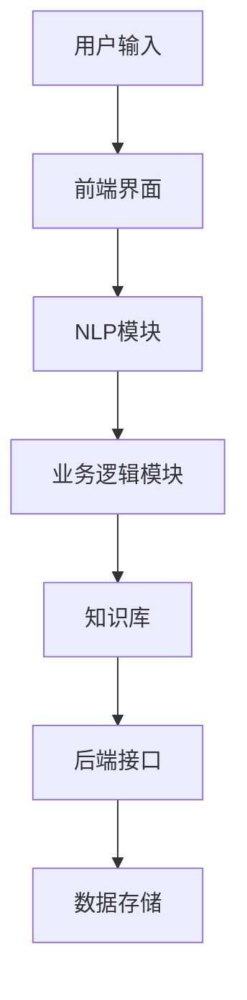
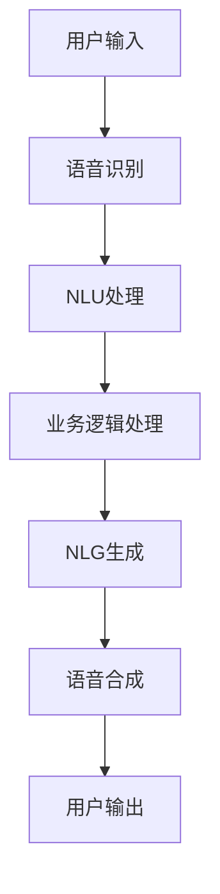
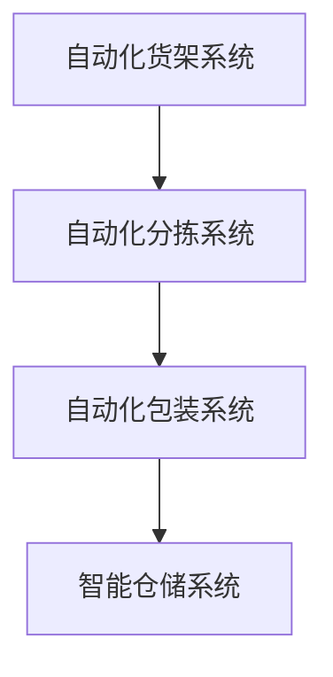
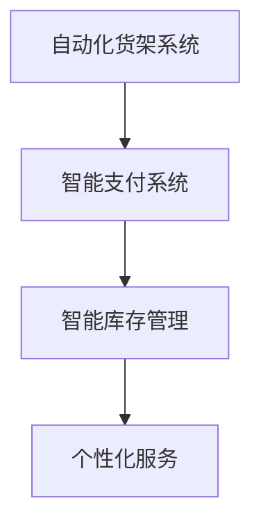
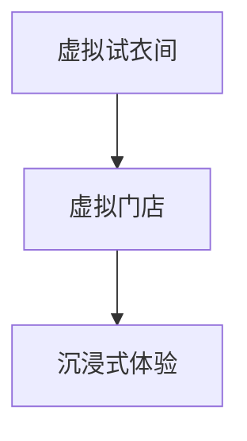
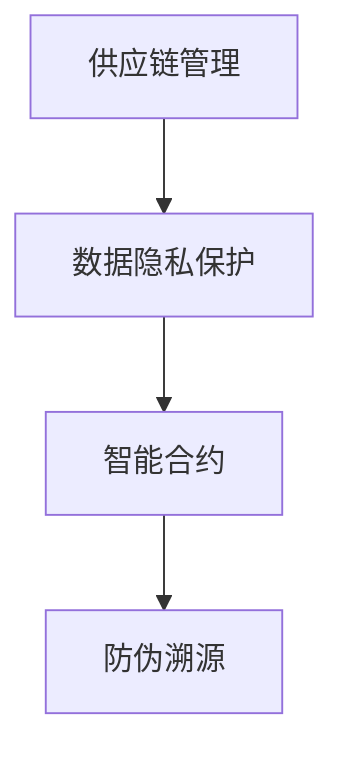

                 

# AI 在零售领域的应用：个性化推荐、智能客服

> **关键词：** AI、零售行业、个性化推荐、智能客服、自动化仓储、需求预测、数据隐私保护、案例解析、未来趋势。

> **摘要：** 本文将深入探讨人工智能（AI）在零售领域的广泛应用，特别是个性化推荐和智能客服系统。我们将逐步分析这些技术的核心原理、架构设计、算法实现以及实际应用案例，同时探讨零售行业AI应用的挑战和未来发展趋势。

## 第一部分: AI在零售领域的应用概述

### 第1章: AI在零售领域的应用概览

#### 1.1 AI与零售行业的融合

##### 1.1.1 AI技术在零售行业的应用背景

随着互联网技术的飞速发展和大数据的积累，零售行业正在迎来一场变革。消费者行为数据不断丰富，零售企业通过分析这些数据，可以更好地了解消费者的需求，优化库存管理，提升用户体验。人工智能（AI）技术的引入，为零售行业提供了新的解决方案，使得个性化推荐、智能客服、自动化仓储等应用成为可能。

##### 1.1.2 AI在零售行业的关键角色

AI在零售行业扮演着至关重要的角色：

- **提高运营效率：** 通过自动化仓储和智能物流系统，零售企业可以大幅提高运营效率，降低成本。
- **提升用户体验：** 个性化推荐系统和智能客服系统可以提供更加精准的服务，满足消费者的个性化需求。
- **优化库存管理：** AI技术可以帮助零售企业更好地预测市场需求，优化库存水平，减少库存积压。

##### 1.1.3 零售行业采用AI的动机与挑战

零售行业采用AI技术的动机主要包括：

- **提升竞争力：** 通过智能化手段，零售企业可以更好地应对市场竞争，提升服务质量和效率。
- **满足消费者需求：** 消费者越来越追求个性化的购物体验，AI技术可以满足这一需求。
- **降低成本：** 自动化和智能化手段可以大幅降低运营成本，提高利润率。

然而，零售行业采用AI技术也面临着以下挑战：

- **数据隐私与安全：** 在大数据环境下，如何保障消费者数据的安全成为一大挑战。
- **技术复杂性：** AI技术涉及多个领域，包括机器学习、自然语言处理等，对技术人员的要求较高。
- **伦理问题：** AI技术在某些领域的应用可能会引发伦理问题，如自动化决策系统的公平性和透明性。

#### 1.2 个性化推荐系统

##### 1.2.1 个性化推荐的基本概念

个性化推荐系统是指根据用户的历史行为、兴趣和偏好，为用户推荐其可能感兴趣的商品或服务。个性化推荐系统可以分为以下几类：

- **基于内容的推荐：** 根据商品的属性和用户的偏好进行推荐。
- **基于协同过滤的推荐：** 根据用户与商品之间的交互关系进行推荐。
- **基于深度学习的推荐：** 利用深度学习模型提取用户和商品的特征，进行推荐。

##### 1.2.2 个性化推荐算法概述

个性化推荐算法主要包括以下几种：

- **基于用户的协同过滤算法：** 通过计算用户之间的相似度，为用户推荐与其相似的其他用户喜欢的商品。
- **基于物品的协同过滤算法：** 通过计算商品之间的相似度，为用户推荐与其已购买或喜欢的商品相似的其它商品。
- **基于内容的推荐算法：** 根据商品的属性和用户的偏好进行推荐。

##### 1.2.3 个性化推荐系统的架构与实现

个性化推荐系统的架构通常包括以下几个部分：

- **数据采集与处理：** 收集用户行为数据和商品信息，并进行数据清洗和预处理。
- **推荐算法实现：** 根据不同的推荐算法，实现推荐系统的核心功能。
- **推荐结果呈现：** 将推荐结果以可视化的方式呈现给用户。

#### 1.3 智能客服

##### 1.3.1 智能客服的概念与分类

智能客服是指利用人工智能技术，为用户提供自动化的客户服务。智能客服可以分为以下几类：

- **基于规则的客服系统：** 通过预设的规则和流程，为用户提供标准化服务。
- **基于机器学习的客服系统：** 利用机器学习模型，分析用户的提问，提供个性化的回答。
- **基于深度学习的客服系统：** 利用深度学习模型，实现更自然的语言理解和生成。

##### 1.3.2 智能客服系统的工作原理

智能客服系统的工作原理通常包括以下几个步骤：

- **自然语言处理：** 将用户的提问转化为结构化的数据。
- **意图识别：** 确定用户的意图，如查询商品信息、售后服务等。
- **实体识别：** 提取用户提问中的关键信息，如商品名称、数量等。
- **回答生成：** 根据用户的意图和提取的信息，生成合适的回答。

##### 1.3.3 智能客服系统的发展趋势

智能客服系统的发展趋势主要包括：

- **语音交互：** 通过语音识别和语音合成技术，实现更自然的语音交互。
- **多模态交互：** 结合文本、语音、图像等多种交互方式，提供更丰富的用户体验。
- **个性化服务：** 通过分析用户行为和偏好，提供更加个性化的服务。

#### 1.4 零售行业的其他AI应用

##### 1.4.1 自动化仓储与物流

自动化仓储与物流是指利用机器人、自动化设备等技术，实现仓储和物流的自动化。自动化仓储与物流的应用主要包括：

- **自动化货架系统：** 通过机器人自动整理货架，实现高效的货物存储和检索。
- **自动化分拣系统：** 通过自动化设备，实现货物的自动分拣和配送。
- **智能物流网络：** 通过人工智能技术，优化物流路径，提高配送效率。

##### 1.4.2 库存管理与需求预测

库存管理与需求预测是指利用人工智能技术，对库存水平和市场需求进行预测和优化。库存管理与需求预测的应用主要包括：

- **需求预测模型：** 利用历史销售数据和市场趋势，预测未来的市场需求。
- **库存优化策略：** 根据需求预测结果，制定最优的库存策略，减少库存积压。
- **库存监控与预警：** 通过实时监控库存水平，及时发现异常情况，采取相应的措施。

##### 1.4.3 零售行业的数据隐私保护

数据隐私保护是指保护消费者数据的隐私和安全。在零售行业，数据隐私保护的应用主要包括：

- **数据加密：** 对消费者数据进行加密，防止数据泄露。
- **匿名化处理：** 对消费者数据进行匿名化处理，保护个人隐私。
- **隐私保护算法：** 利用隐私保护算法，如差分隐私，在数据分析和挖掘过程中保护个人隐私。

### 第二部分: 个性化推荐系统的算法原理

#### 第2章: 个性化推荐系统的算法原理

个性化推荐系统是AI在零售领域的重要应用之一，通过分析用户行为和偏好，为用户推荐可能感兴趣的商品或服务。个性化推荐系统的算法原理主要包括协同过滤算法、内容推荐算法和深度学习推荐算法。本章将逐一介绍这些算法的基本概念、原理和实现方法。

#### 2.1 协同过滤算法

##### 2.1.1 基于用户的协同过滤

基于用户的协同过滤算法（User-based Collaborative Filtering，UserCF）是一种常用的推荐算法，其核心思想是找到与目标用户相似的邻居用户，并推荐邻居用户喜欢的商品。具体实现步骤如下：

1. **计算用户相似度：** 根据用户之间的共同偏好，计算用户相似度。常用的相似度计算方法包括余弦相似度、皮尔逊相关系数等。

2. **寻找邻居用户：** 根据用户相似度矩阵，找到与目标用户最相似的k个邻居用户。

3. **生成推荐列表：** 对邻居用户的喜好进行加权平均，为用户生成推荐列表。

以下是一个基于用户的协同过滤算法的伪代码实现：

```python
# 计算用户相似度
def compute_similarity(user_similarity_matrix, user1, user2):
    # 假设user_similarity_matrix是一个用户之间的相似度矩阵
    return user_similarity_matrix[user1][user2]

# 寻找邻居用户
def find_nearest_neighbors(user_similarity_matrix, target_user, k):
    # 假设user_similarity_matrix是一个用户之间的相似度矩阵
    # target_user是目标用户
    # k是邻居用户的数量
    neighbors = []
    for user in range(num_users):
        if user != target_user:
            similarity = compute_similarity(user_similarity_matrix, target_user, user)
            neighbors.append((user, similarity))
    neighbors.sort(key=lambda x: x[1], reverse=True)
    return neighbors[:k]

# 生成推荐列表
def generate_recommendations(user_similarity_matrix, user_ratings_matrix, target_user, k):
    # 假设user_similarity_matrix是一个用户之间的相似度矩阵
    # user_ratings_matrix是一个用户评分矩阵
    # target_user是目标用户
    # k是邻居用户的数量
    neighbors = find_nearest_neighbors(user_similarity_matrix, target_user, k)
    recommendations = []
    for neighbor, similarity in neighbors:
        for item in range(num_items):
            if user_ratings_matrix[neighbor][item] > 0:
                recommendations.append((item, similarity * user_ratings_matrix[neighbor][item]))
    recommendations.sort(key=lambda x: x[1], reverse=True)
    return recommendations
```

##### 2.1.2 基于物品的协同过滤

基于物品的协同过滤算法（Item-based Collaborative Filtering，ItemCF）与基于用户的协同过滤算法类似，但其核心思想是找到与用户已购买或喜欢的商品相似的物品进行推荐。具体实现步骤如下：

1. **计算商品相似度：** 根据商品之间的共同偏好，计算商品相似度。常用的相似度计算方法包括余弦相似度、皮尔逊相关系数等。

2. **寻找相似商品：** 根据商品相似度矩阵，找到与用户已购买或喜欢的商品最相似的k个商品。

3. **生成推荐列表：** 对相似商品进行加权平均，为用户生成推荐列表。

以下是一个基于物品的协同过滤算法的伪代码实现：

```python
# 计算商品相似度
def compute_similarity(item_similarity_matrix, item1, item2):
    # 假设item_similarity_matrix是一个商品之间的相似度矩阵
    return item_similarity_matrix[item1][item2]

# 寻找相似商品
def find_similar_items(item_similarity_matrix, target_item, k):
    # 假设item_similarity_matrix是一个商品之间的相似度矩阵
    # target_item是目标商品
    # k是相似商品的数量
    similar_items = []
    for item in range(num_items):
        if item != target_item:
            similarity = compute_similarity(item_similarity_matrix, target_item, item)
            similar_items.append((item, similarity))
    similar_items.sort(key=lambda x: x[1], reverse=True)
    return similar_items[:k]

# 生成推荐列表
def generate_recommendations(item_similarity_matrix, user_ratings_matrix, target_user, k):
    # 假设item_similarity_matrix是一个商品之间的相似度矩阵
    # user_ratings_matrix是一个用户评分矩阵
    # target_user是目标用户
    # k是相似商品的数量
    recommendations = []
    for item in range(num_items):
        if user_ratings_matrix[target_user][item] > 0:
            similar_items = find_similar_items(item_similarity_matrix, item, k)
            for similar_item, similarity in similar_items:
                recommendations.append((similar_item, similarity * user_ratings_matrix[target_user][item]))
    recommendations.sort(key=lambda x: x[1], reverse=True)
    return recommendations
```

#### 2.2 内容推荐算法

##### 2.2.1 内容推荐的基本原理

内容推荐算法（Content-based Filtering）是基于用户的历史行为和偏好，通过分析商品的内容特征，为用户推荐与其兴趣相似的物品。内容推荐算法的核心思想是：

1. **提取特征：** 提取商品的关键特征，如文本、图像、标签等。
2. **计算相似度：** 计算用户和商品之间的相似度。
3. **生成推荐列表：** 根据相似度，为用户生成推荐列表。

内容推荐算法通常可以分为以下几类：

- **基于文本的推荐：** 通过分析商品的文本描述，提取关键词和主题。
- **基于图像的推荐：** 通过图像识别技术，提取商品的视觉特征。
- **基于标签的推荐：** 通过商品的标签，进行关联推荐。

以下是一个基于文本的内容推荐算法的伪代码实现：

```python
# 提取商品特征
def extract_features(product_description):
    # 假设product_description是商品的文本描述
    # 假设word_vectorizer是一个将文本转换为向量的工具
    return word_vectorizer.transform([product_description])

# 计算相似度
def compute_similarity(user_vector, product_vector):
    # 假设user_vector是用户的向量表示
    # 假设product_vector是商品的向量表示
    return cosine_similarity([user_vector], [product_vector])[0][0]

# 生成推荐列表
def generate_recommendations(user_vector, product_vectors, k):
    # 假设user_vector是用户的向量表示
    # 假设product_vectors是所有商品的向量表示
    # k是推荐商品的数量
    recommendations = []
    for product_vector in product_vectors:
        similarity = compute_similarity(user_vector, product_vector)
        recommendations.append((product_vector, similarity))
    recommendations.sort(key=lambda x: x[1], reverse=True)
    return recommendations[:k]
```

#### 2.3 深度学习在个性化推荐中的应用

##### 2.3.1 深度学习模型在推荐系统中的应用

深度学习模型在个性化推荐系统中的应用主要基于以下两个思路：

1. **特征表示学习：** 利用深度学习模型自动提取用户和商品的特征表示，代替传统特征工程。
2. **端到端的推荐系统：** 将用户行为数据直接输入到深度学习模型中，直接输出推荐结果。

常见的深度学习模型在推荐系统中的应用包括：

- **自动编码器（Autoencoder）：** 用于自动提取用户和商品的特征。
- **卷积神经网络（Convolutional Neural Networks，CNN）：** 用于图像特征提取。
- **循环神经网络（Recurrent Neural Networks，RNN）：** 用于序列数据处理。
- **变分自编码器（Variational Autoencoder，VAE）：** 用于生成用户和商品的特征分布。

以下是一个基于深度学习模型的个性化推荐系统的伪代码实现：

```python
# 加载预训练的深度学习模型
model = load_pretrained_model()

# 提取用户和商品的特征表示
def extract_features(user_input, product_input):
    user_embedding = model.user_embedding(user_input)
    product_embedding = model.product_embedding(product_input)
    return user_embedding, product_embedding

# 生成推荐列表
def generate_recommendations(user_input, product_inputs, k):
    user_embedding, product_embeddings = extract_features(user_input, product_inputs)
    similarities = model.compute_similarity(user_embedding, product_embeddings)
    recommendations = []
    for product_embedding, similarity in zip(product_embeddings, similarities):
        recommendations.append((product_embedding, similarity))
    recommendations.sort(key=lambda x: x[1], reverse=True)
    return recommendations[:k]
```

##### 2.3.2 自动化特征工程与深度学习模型

自动化特征工程是指利用机器学习和深度学习技术，自动提取和选择特征，从而简化特征工程过程。自动化特征工程与深度学习模型相结合，可以实现以下效果：

1. **减少人工干预：** 自动提取特征，减少人工干预，提高模型的可解释性。
2. **提高模型性能：** 自动选择最优特征，提高模型的预测性能。
3. **缩短模型训练时间：** 自动化特征工程可以缩短模型训练时间，提高开发效率。

以下是一个基于自动化特征工程的深度学习推荐系统的伪代码实现：

```python
# 加载预训练的自动特征工程模型
auto_feature_engineer = load_pretrained_auto_feature_engineer()

# 提取用户和商品的特征表示
def extract_features(user_input, product_input):
    user_embedding = auto_feature_engineer.user_embedding(user_input)
    product_embedding = auto_feature_engineer.product_embedding(product_input)
    return user_embedding, product_embedding

# 生成推荐列表
def generate_recommendations(user_input, product_inputs, k):
    user_embedding, product_embeddings = extract_features(user_input, product_inputs)
    similarities = auto_feature_engineer.compute_similarity(user_embedding, product_embeddings)
    recommendations = []
    for product_embedding, similarity in zip(product_embeddings, similarities):
        recommendations.append((product_embedding, similarity))
    recommendations.sort(key=lambda x: x[1], reverse=True)
    return recommendations[:k]
```

##### 2.3.3 深度学习推荐算法的实现步骤

实现深度学习推荐算法通常包括以下步骤：

1. **数据准备：** 收集用户行为数据和商品信息，进行数据清洗和预处理。
2. **特征工程：** 利用自动化特征工程技术，提取用户和商品的特征表示。
3. **模型选择：** 根据数据特点和业务需求，选择合适的深度学习模型。
4. **模型训练：** 使用训练数据训练深度学习模型。
5. **模型评估：** 使用验证集评估模型性能，调整模型参数。
6. **模型部署：** 将训练好的模型部署到生产环境，实现实时推荐。

以下是一个深度学习推荐算法的实现步骤：

```python
# 数据准备
train_data = load_train_data()
test_data = load_test_data()

# 特征工程
auto_feature_engineer = load_pretrained_auto_feature_engineer()
user_embedding, product_embedding = auto_feature_engineer.extract_features(train_data)

# 模型选择
model = load_pretrained_model()

# 模型训练
model.fit([user_embedding, product_embedding], train_data['ratings'])

# 模型评估
test_user_embedding, test_product_embedding = auto_feature_engineer.extract_features(test_data)
predictions = model.predict([test_user_embedding, test_product_embedding])
evaluate_predictions(predictions, test_data['ratings'])

# 模型部署
deploy_model(model)
```

#### 2.4 个性化推荐系统的评估与优化

##### 2.4.1 个性化推荐系统的评价指标

个性化推荐系统的评价指标主要包括：

- **准确率（Accuracy）：** 评估推荐结果与实际结果的匹配程度。
- **召回率（Recall）：** 评估推荐系统能够召回的实际感兴趣商品的比例。
- **精确率（Precision）：** 评估推荐结果中实际感兴趣商品的比例。
- **F1分数（F1 Score）：** 综合准确率和召回率，评估推荐系统的整体性能。

以下是一个基于精确率和召回率的评价指标的计算方法：

```python
def calculate_precision_recall(recommendations, ground_truth):
    correct = 0
    total = len(recommendations)
    for item in recommendations:
        if item in ground_truth:
            correct += 1
    precision = correct / total
    recall = correct / len(ground_truth)
    return precision, recall
```

##### 2.4.2 推荐算法的性能优化方法

推荐算法的性能优化方法主要包括：

1. **数据增强：** 通过引入更多的用户行为数据，提高模型的泛化能力。
2. **特征选择：** 利用特征选择技术，选择对模型性能有显著影响的特征。
3. **模型融合：** 将多个模型的结果进行融合，提高推荐系统的稳定性。
4. **在线学习：** 利用在线学习技术，实时更新模型，适应数据的变化。

以下是一个基于在线学习性能优化的推荐系统的实现方法：

```python
# 初始化模型
model = load_pretrained_model()

# 数据流处理
for batch in data_stream:
    user_embedding, product_embedding = auto_feature_engineer.extract_features(batch['user'], batch['product'])
    model.partial_fit([user_embedding, product_embedding], batch['rating'])

# 评估模型
evaluate_predictions(model.predict([test_user_embedding, test_product_embedding]), test_data['ratings'])
```

##### 2.4.3 零售行业的推荐算法优化实践

在零售行业，推荐算法的优化实践主要包括以下几个方面：

1. **用户行为分析：** 利用用户行为数据，分析用户偏好和行为模式，为推荐算法提供输入。
2. **商品属性分析：** 利用商品属性数据，分析商品之间的关联性，提高推荐准确性。
3. **实时推荐：** 利用实时数据处理技术，实现实时推荐，提高用户体验。
4. **A/B测试：** 通过A/B测试，评估不同推荐算法和策略的效果，持续优化推荐系统。

以下是一个零售行业推荐算法优化实践的方法：

```python
# 用户行为分析
user_profile = analyze_user_behavior(train_data)

# 商品属性分析
item_properties = analyze_item_properties(train_data)

# 实时推荐
def generate_realtime_recommendations(user_profile, item_properties, k):
    user_embedding = auto_feature_engineer.user_embedding(user_profile)
    product_embeddings = auto_feature_engineer.product_embedding(item_properties)
    recommendations = model.generate_recommendations(user_embedding, product_embeddings, k)
    return recommendations

# A/B测试
def test_recommendation_algorithm(new_algorithm, base_algorithm, k):
    new_recommendations = generate_realtime_recommendations(user_profile, item_properties, k)
    base_recommendations = base_algorithm.generate_recommendations(user_profile, item_properties, k)
    evaluate_recommendations(new_recommendations, base_recommendations, test_data['ratings'])
```

### 第3章: 智能客服系统的设计与实现

智能客服系统是AI在零售领域的另一重要应用，通过自然语言处理和机器学习技术，实现自动化的客户服务，提高服务质量和效率。本章将详细介绍智能客服系统的设计与实现方法，包括架构设计、自然语言处理技术和实际应用案例。

#### 3.1 智能客服系统的架构设计

智能客服系统的架构设计主要包括以下几个部分：

1. **前端界面：** 提供用户与客服系统交互的接口，包括文本聊天、语音对话、视频通话等。
2. **自然语言处理（NLP）模块：** 负责对用户的输入进行理解，提取意图和实体，为后续处理提供输入。
3. **业务逻辑模块：** 根据用户的意图和实体，调用相应的业务逻辑，处理用户请求。
4. **知识库：** 存储与业务相关的知识，如产品信息、常见问题等，为客服系统提供参考。
5. **后端接口：** 负责与外部系统进行数据交换，如订单查询、库存查询等。
6. **数据存储：** 存储用户交互数据，包括聊天记录、用户行为等，为后续分析提供数据支持。

以下是一个智能客服系统架构的Mermaid流程图：



#### 3.2 自然语言处理技术在智能客服中的应用

自然语言处理（NLP）技术在智能客服系统中发挥着关键作用，主要包括以下几个方面的应用：

1. **语音识别（ASR）：** 将用户的语音输入转换为文本，便于后续处理。
2. **语音合成（TTS）：** 将系统的回答转换为语音输出，提高用户体验。
3. **自然语言理解（NLU）：** 理解用户的输入，提取意图和实体，为业务逻辑处理提供输入。
4. **自然语言生成（NLG）：** 根据意图和实体，生成合适的回答，满足用户需求。

以下是一个基于NLP技术的智能客服系统的实现步骤：



#### 3.3 智能客服系统的实现方法

智能客服系统的实现方法主要包括基于规则的方法、基于机器学习的方法和基于深度学习的方法。

##### 3.3.1 基于规则的方法

基于规则的方法是指通过预设的规则和流程，为用户提供标准化服务。该方法的主要优点是实现简单、易于维护，但缺点是灵活性较差，难以应对复杂的用户需求。

以下是一个基于规则的方法的示例：

```python
def handle_query(query):
    if "查询订单" in query:
        return query_order()
    elif "售后服务" in query:
        return handle_after_sales()
    else:
        return "我不理解您的意思，请重新描述您的需求。"
```

##### 3.3.2 基于机器学习的方法

基于机器学习的方法是指利用机器学习模型，分析用户的提问，提供个性化的回答。该方法的主要优点是灵活性较高，能够处理复杂的用户需求，但缺点是实现复杂，需要大量的数据和计算资源。

以下是一个基于机器学习的方法的示例：

```python
from sklearn.feature_extraction.text import TfidfVectorizer
from sklearn.naive_bayes import MultinomialNB

# 数据准备
train_data = [("查询订单", "查询订单"), ("售后服务", "售后服务"), ("产品咨询", "产品咨询")]
train_texts, train_labels = zip(*train_data)

# 特征提取
vectorizer = TfidfVectorizer()
train_vectors = vectorizer.fit_transform(train_texts)

# 模型训练
model = MultinomialNB()
model.fit(train_vectors, train_labels)

# 输入处理
def handle_query(query):
    query_vector = vectorizer.transform([query])
    prediction = model.predict(query_vector)
    return prediction[0]
```

##### 3.3.3 基于深度学习的方法

基于深度学习的方法是指利用深度学习模型，实现自然语言理解（NLU）和自然语言生成（NLG）。该方法的主要优点是能够处理复杂的语义关系，提供更自然的回答，但缺点是计算资源需求较高。

以下是一个基于深度学习的方法的示例：

```python
from keras.models import Model
from keras.layers import Input, LSTM, Dense, Embedding

# 数据准备
train_data = [("查询订单", "查询订单"), ("售后服务", "售后服务"), ("产品咨询", "产品咨询")]
train_texts, train_labels = zip(*train_data)

# 特征提取
max_sequence_length = 10
embedding_size = 50
input_sequence = Input(shape=(max_sequence_length,))
embedded_sequence = Embedding(input_dim=len(train_texts), output_dim=embedding_size)(input_sequence)
lstm_output = LSTM(units=100, activation='relu')(embedded_sequence)
dense_output = Dense(units=len(train_texts), activation='softmax')(lstm_output)

# 模型训练
model = Model(inputs=input_sequence, outputs=dense_output)
model.compile(optimizer='adam', loss='categorical_crossentropy', metrics=['accuracy'])
model.fit(train_texts, train_labels, epochs=10, batch_size=32)

# 输入处理
def handle_query(query):
    input_sequence = prepare_input_sequence([query], max_sequence_length)
    prediction = model.predict(input_sequence)
    return decode_prediction(prediction)
```

#### 3.4 智能客服系统的评估与优化

##### 3.4.1 客服系统性能评估指标

智能客服系统的性能评估指标主要包括：

1. **响应时间：** 从用户输入到系统返回回答的时间，评估系统的处理速度。
2. **准确率：** 评估系统回答的正确性，通常通过人工评估或自动化评估进行。
3. **用户体验：** 评估用户对客服系统的满意度，可以通过用户反馈、使用频率等指标进行衡量。
4. **错误率：** 评估系统无法正确处理用户请求的次数，用于优化系统性能。

以下是一个基于准确率和响应时间的评估指标的示例：

```python
def evaluate_system_performance(queries, responses, correct_responses):
    correct_count = 0
    response_time_sum = 0
    for i in range(len(queries)):
        if responses[i] == correct_responses[i]:
            correct_count += 1
        response_time_sum += response_time[i]
    accuracy = correct_count / len(queries)
    average_response_time = response_time_sum / len(queries)
    return accuracy, average_response_time
```

##### 3.4.2 客服系统的用户体验优化

客服系统的用户体验优化主要包括以下几个方面：

1. **界面设计：** 提供简洁、直观的用户界面，提高用户操作的便利性。
2. **回答质量：** 提高系统回答的准确性和自然度，满足用户需求。
3. **交互体验：** 通过语音、文本、图像等多种交互方式，提供丰富的用户体验。
4. **个性化服务：** 根据用户行为和偏好，提供个性化的客服服务。

以下是一个基于用户反馈的客服系统用户体验优化的方法：

```python
def optimize_user_experience(feedbacks):
    # 分析用户反馈，找出问题点
    problems = analyze_feedback(feedbacks)
    
    # 针对问题点进行优化
    if "界面设计" in problems:
        optimize_user_interface()
    if "回答质量" in problems:
        improve_response_quality()
    if "交互体验" in problems:
        enhance_interactive_experience()
    if "个性化服务" in problems:
        provide_personalized_services()
```

##### 3.4.3 智能客服系统在零售行业的应用案例

智能客服系统在零售行业的应用案例主要包括：

1. **电商平台：** 为用户提供实时客服服务，解答用户疑问，提高购买转化率。
2. **线下零售：** 提供自助购物咨询和售后服务，提高客户满意度。
3. **物流服务：** 提供物流查询、配送进度跟踪等服务，提高物流服务质量。

以下是一个零售行业智能客服系统的应用案例：

```python
# 电商平台客服系统
def handle_query(query):
    if "物流查询" in query:
        return query_logistics()
    elif "售后服务" in query:
        return handle_after_sales()
    else:
        return "欢迎来到我们的电商平台，请问有什么可以帮助您的？"

# 线下零售客服系统
def handle_query(query):
    if "购物咨询" in query:
        return provide_shopping_advice()
    elif "售后服务" in query:
        return handle_after_sales()
    else:
        return "您好，请问有什么问题需要我帮助解答？"

# 物流服务客服系统
def handle_query(query):
    if "配送进度" in query:
        return query_delivery_status()
    elif "物流咨询" in query:
        return provide_logistics_advice()
    else:
        return "您好，请问有什么物流方面的问题需要我帮助解答？"
```

### 第4章: 零售行业其他AI应用的探讨

#### 4.1 自动化仓储与物流

自动化仓储与物流是零售行业AI应用的重要方向，通过引入机器人、自动化设备和智能系统，实现仓储和物流的自动化，提高效率，降低成本。本章将探讨自动化仓储与物流的技术、设计及应用案例。

##### 4.1.1 自动化仓储技术概述

自动化仓储技术主要包括以下几个方面：

1. **自动化货架系统：** 利用机器人自动整理货架，实现高效的货物存储和检索。
2. **自动化分拣系统：** 通过自动化设备，实现货物的自动分拣和配送。
3. **自动化包装系统：** 利用机器人或自动化设备，实现货物的自动包装。
4. **智能仓储系统：** 通过物联网技术，实现仓储设备的互联互通，提高仓储效率。

以下是一个自动化仓储系统的架构图：



##### 4.1.2 自动化仓储系统设计

自动化仓储系统设计主要包括以下几个方面：

1. **需求分析：** 分析仓储业务的流程和需求，确定自动化仓储系统的功能模块。
2. **系统架构：** 设计自动化仓储系统的整体架构，包括硬件设备、软件系统等。
3. **功能模块：** 设计自动化仓储系统的各个功能模块，如自动化货架系统、自动化分拣系统、自动化包装系统等。
4. **系统集成：** 实现各个功能模块的集成，确保系统稳定、高效运行。

以下是一个自动化仓储系统设计的示例：

```python
class AutomatedWarehouseSystem:
    def __init__(self):
        self自动化货架系统 = AutomatedShelfSystem()
        self自动化分拣系统 = AutomatedPickingSystem()
        self自动化包装系统 = AutomatedPackagingSystem()

    def store_goods(self, goods):
        self自动化货架系统.store_goods(goods)

    def pick_goods(self, order):
        self自动化分拣系统.pick_goods(order)

    def package_goods(self, goods):
        self自动化包装系统.package_goods(goods)
```

##### 4.1.3 自动化仓储系统在零售行业的应用案例

自动化仓储系统在零售行业的应用案例主要包括：

1. **电商仓储：** 电商平台通过自动化仓储系统，实现高效的订单处理和商品存储。
2. **线下零售：** 线下零售企业通过自动化仓储系统，提高仓储效率，降低运营成本。
3. **物流仓储：** 物流企业通过自动化仓储系统，实现高效的货物分拣和配送。

以下是一个自动化仓储系统在电商仓储中的应用案例：

```python
# 电商仓储自动化仓储系统
class ECommerceAutomatedWarehouseSystem(AutomatedWarehouseSystem):
    def process_order(self, order):
        goods = self查询商品库存(order)
        self.store_goods(goods)
        self.pick_goods(order)
        self.package_goods(order)
```

#### 4.2 库存管理与需求预测

库存管理与需求预测是零售行业的重要环节，通过准确预测市场需求，优化库存水平，降低库存成本。本章将探讨库存管理与需求预测的基本原理、算法和应用。

##### 4.2.1 库存管理的基本原理

库存管理的基本原理主要包括以下几个方面：

1. **库存分类：** 根据库存物品的周转率、重要程度等特征，对库存进行分类。
2. **库存策略：** 根据库存分类和市场需求，制定相应的库存策略，如周期性库存、实时库存等。
3. **库存监控：** 实时监控库存水平，及时发现库存异常情况，采取相应的措施。

以下是一个库存管理的基本原理的示例：

```python
class InventoryManagement:
    def __init__(self):
        self库存分类策略 = InventoryClassificationStrategy()
        self库存策略 = InventoryPolicy()

    def classify_inventory(self, inventory):
        return self库存分类策略.classify(inventory)

    def manage_inventory(self, inventory):
        classification = self.classify_inventory(inventory)
        self库存策略.manage_inventory(classification)
```

##### 4.2.2 需求预测算法与应用

需求预测算法是库存管理与需求预测的核心，主要包括以下几种：

1. **时间序列预测：** 基于历史销售数据，利用时间序列模型，预测未来的市场需求。
2. **回归分析：** 利用历史销售数据，建立回归模型，预测未来的市场需求。
3. **机器学习预测：** 利用机器学习算法，如随机森林、神经网络等，预测未来的市场需求。

以下是一个基于时间序列预测的需求预测算法的示例：

```python
import numpy as np
from statsmodels.tsa.arima_model import ARIMA

class DemandPrediction:
    def __init__(self):
        self模型 = None

    def fit_model(self, data):
        self模型 = ARIMA(data, order=(1, 1, 1))
        self模型.fit()

    def predict_demand(self, data):
        return self模型.predict(start=len(data), end=len(data))
```

##### 4.2.3 零售行业的库存管理与需求预测实践

零售行业的库存管理与需求预测实践主要包括以下几个方面：

1. **数据分析：** 收集并分析历史销售数据、市场趋势等，为需求预测提供数据支持。
2. **模型训练：** 基于历史数据，训练需求预测模型，提高预测准确性。
3. **策略优化：** 根据预测结果，优化库存管理策略，降低库存成本。
4. **实时监控：** 实时监控库存水平和市场需求，及时调整库存策略。

以下是一个零售行业的库存管理与需求预测实践的示例：

```python
# 数据分析
def analyze_data(sales_data, market_trend_data):
    # 分析历史销售数据和市场趋势数据
    # ...

# 模型训练
def train_model(sales_data):
    # 训练需求预测模型
    # ...

# 策略优化
def optimize_strategy(predicted_demand):
    # 根据预测结果，优化库存管理策略
    # ...

# 实时监控
def monitor_inventory(sales_data, predicted_demand):
    # 实时监控库存水平和市场需求，及时调整库存策略
    # ...
```

#### 4.3 零售行业的数据隐私保护

数据隐私保护是零售行业AI应用的重要挑战，随着消费者对隐私保护意识的增强，如何保障数据隐私成为零售企业关注的焦点。本章将探讨零售行业数据隐私保护的重要性、技术手段和应用实践。

##### 4.3.1 数据隐私保护的重要性

数据隐私保护的重要性体现在以下几个方面：

1. **消费者信任：** 数据隐私保护有助于提高消费者对零售企业的信任度，促进消费者忠诚度。
2. **法律法规：** 随着数据隐私保护法律法规的不断完善，零售企业需要遵守相关法律法规，避免法律风险。
3. **商业竞争：** 在激烈的市场竞争环境中，数据隐私保护有助于提高企业的核心竞争力。

##### 4.3.2 数据隐私保护的技术手段

数据隐私保护的技术手段主要包括以下几个方面：

1. **数据加密：** 对存储和传输的数据进行加密，防止数据泄露。
2. **匿名化处理：** 对敏感数据进行匿名化处理，保护个人隐私。
3. **访问控制：** 对数据的访问进行严格的权限控制，防止未授权访问。
4. **数据脱敏：** 对敏感数据进行脱敏处理，降低数据泄露风险。

以下是一个数据隐私保护的技术手段的示例：

```python
import pandas as pd
from sklearn.preprocessing import LabelEncoder

# 数据加密
def encrypt_data(data, key):
    # 对数据进行加密处理
    # ...

# 匿名化处理
def anonymize_data(data):
    # 对敏感数据进行匿名化处理
    # ...

# 访问控制
def access_control(user, data):
    # 对数据的访问进行权限控制
    # ...

# 数据脱敏
def desensitize_data(data):
    # 对敏感数据进行脱敏处理
    # ...
```

##### 4.3.3 零售行业数据隐私保护实践

零售行业数据隐私保护实践主要包括以下几个方面：

1. **数据安全策略：** 制定数据安全策略，明确数据保护的目标、方法和责任。
2. **数据分类与标签：** 对数据进行分类与标签，根据数据的重要性和敏感性进行保护。
3. **数据安全培训：** 对员工进行数据安全培训，提高数据保护意识。
4. **数据审计与监控：** 定期进行数据审计与监控，及时发现数据泄露风险。

以下是一个零售行业数据隐私保护实践的示例：

```python
# 数据安全策略
def data_security_strategy():
    # 制定数据安全策略
    # ...

# 数据分类与标签
def classify_and_tag_data(data):
    # 对数据进行分类与标签
    # ...

# 数据安全培训
def data_security_training():
    # 对员工进行数据安全培训
    # ...

# 数据审计与监控
def data_audit_and_monitor():
    # 定期进行数据审计与监控
    # ...
```

### 第5章: AI在零售行业应用案例解析

#### 5.1 案例一：某大型电商平台个性化推荐系统

##### 5.1.1 案例背景与目标

某大型电商平台希望通过引入个性化推荐系统，提升用户购物体验，提高用户粘性，增加销售额。个性化推荐系统的目标是根据用户的购物行为和偏好，为用户推荐其可能感兴趣的商品。

##### 5.1.2 个性化推荐系统的设计与实现

个性化推荐系统的设计主要包括以下几个部分：

1. **数据采集与预处理：** 收集用户的购物行为数据，如浏览记录、购买记录、收藏记录等，并对数据进行预处理，包括数据清洗、去重、归一化等操作。
2. **推荐算法实现：** 选择合适的推荐算法，如基于用户的协同过滤算法、基于物品的协同过滤算法、基于内容的推荐算法等，实现推荐系统的核心功能。
3. **推荐结果呈现：** 将推荐结果以可视化的方式呈现给用户，包括首页推荐、购物车推荐、猜你喜欢等。

以下是一个基于协同过滤算法的个性化推荐系统的实现步骤：

```python
# 数据采集与预处理
def collect_data():
    # 收集用户购物行为数据
    # ...

def preprocess_data(data):
    # 对数据进行预处理
    # ...

# 推荐算法实现
def collaborative_filtering(user_behavior_data):
    # 基于协同过滤算法，计算用户相似度
    # ...

def generate_recommendations(user_id, user_behavior_data, similar_users):
    # 根据用户相似度，生成推荐列表
    # ...

# 推荐结果呈现
def display_recommendations(recommendations):
    # 将推荐结果以可视化的方式呈现给用户
    # ...
```

##### 5.1.3 案例评估与优化

个性化推荐系统的评估主要包括以下几个方面：

1. **准确率：** 评估推荐系统推荐的商品与用户实际兴趣的匹配程度。
2. **召回率：** 评估推荐系统能够召回的用户兴趣商品的比例。
3. **用户体验：** 评估用户对推荐系统的满意度。

以下是一个个性化推荐系统评估与优化方法的示例：

```python
def evaluate_recommendations(recommendations, ground_truth):
    # 评估推荐系统的准确率和召回率
    # ...

def optimize_recommendations(user_behavior_data, recommendations):
    # 根据评估结果，优化推荐系统
    # ...
```

#### 5.2 案例二：某零售企业智能客服系统的构建

##### 5.2.1 案例背景与需求

某零售企业希望通过引入智能客服系统，提高客户服务质量，降低客服成本。智能客服系统的目标是实现自动化的客户服务，快速响应客户需求，提供个性化的解决方案。

##### 5.2.2 智能客服系统的设计与实现

智能客服系统的设计主要包括以下几个部分：

1. **前端界面：** 提供用户与客服系统交互的接口，包括文本聊天、语音对话等。
2. **自然语言处理（NLP）模块：** 负责对用户的输入进行理解，提取意图和实体，为后续处理提供输入。
3. **业务逻辑模块：** 根据用户的意图和实体，调用相应的业务逻辑，处理用户请求。
4. **知识库：** 存储与业务相关的知识，如产品信息、常见问题等，为客服系统提供参考。
5. **后端接口：** 负责与外部系统进行数据交换，如订单查询、库存查询等。

以下是一个智能客服系统的实现步骤：

```python
# 前端界面
def handle_user_input(user_input):
    # 处理用户输入，返回系统回答
    # ...

# 自然语言处理模块
def natural_language_processing(user_input):
    # 对用户输入进行理解，提取意图和实体
    # ...

# 业务逻辑模块
def business_logic(intent, entities):
    # 根据意图和实体，调用相应的业务逻辑
    # ...

# 知识库
def knowledge_base(intent, entities):
    # 从知识库中查找相关信息
    # ...

# 后端接口
def external_system_integration(intent, entities):
    # 与外部系统进行数据交换
    # ...
```

##### 5.2.3 案例评估与优化

智能客服系统的评估主要包括以下几个方面：

1. **响应时间：** 评估系统从接收用户输入到返回回答的时间。
2. **准确率：** 评估系统回答的正确性。
3. **用户体验：** 评估用户对客服系统的满意度。

以下是一个智能客服系统评估与优化方法的示例：

```python
def evaluate_system_performance(queries, responses, correct_responses):
    # 评估系统的响应时间、准确率和用户体验
    # ...

def optimize_system_performance(evaluation_results):
    # 根据评估结果，优化客服系统
    # ...
```

### 第6章: 零售行业AI应用的未来发展趋势

随着人工智能技术的不断进步，零售行业AI应用的未来发展趋势充满潜力。本章将探讨零售行业AI应用的未来发展方向，包括智能门店与无人零售、增强现实与虚拟现实在零售中的应用以及区块链在零售行业中的应用。

#### 6.1 智能门店与无人零售

智能门店与无人零售是零售行业AI应用的重要趋势，通过自动化和智能化手段，实现门店的无人或少人运营。以下是一些关键发展方向：

1. **自动化货架系统：** 利用机器人自动整理货架，实现高效的商品上架和下架。
2. **智能支付系统：** 通过无人结算台或自助结算机，实现快速、便捷的支付过程。
3. **智能库存管理：** 通过物联网技术和传感器，实现实时监控库存水平，优化库存管理。
4. **个性化服务：** 利用大数据和AI技术，为顾客提供个性化的购物体验，提高顾客满意度。

以下是一个智能门店与无人零售的架构图：



#### 6.2 增强现实与虚拟现实在零售中的应用

增强现实（AR）和虚拟现实（VR）技术在零售中的应用，为消费者提供了全新的购物体验。以下是一些关键发展方向：

1. **虚拟试衣间：** 利用AR技术，让消费者在虚拟环境中试穿衣物，提高购买决策的准确性。
2. **虚拟门店：** 通过VR技术，创建虚拟购物环境，让消费者在家中体验购物乐趣。
3. **沉浸式体验：** 利用VR技术，打造沉浸式的购物场景，提高顾客的参与度和满意度。

以下是一个增强现实与虚拟现实在零售中的应用的示例：



#### 6.3 区块链在零售行业中的应用

区块链技术在零售行业中的应用，有助于提升供应链透明度、保障数据安全和提高供应链效率。以下是一些关键发展方向：

1. **供应链管理：** 通过区块链技术，实现供应链的全程追踪和透明管理。
2. **数据隐私保护：** 利用区块链技术的去中心化和加密特性，保护消费者数据隐私。
3. **智能合约：** 通过智能合约，实现供应链中的自动化交易和合同执行。
4. **防伪溯源：** 利用区块链技术，实现对商品的防伪溯源，提高商品品质。

以下是一个区块链在零售行业中的应用的架构图：



#### 6.4 AI应用在零售行业面临的挑战与对策

虽然AI技术在零售行业具有巨大的潜力，但同时也面临着一些挑战：

1. **技术挑战：** AI技术的复杂性、数据质量和算法性能等问题，需要不断优化和改进。
2. **法律法规与伦理问题：** 随着AI技术的广泛应用，相关法律法规和伦理问题亟待解决。
3. **数据隐私保护：** 在大数据环境下，如何保障消费者数据的安全成为关键挑战。

以下是一些应对挑战的对策：

1. **技术优化：** 持续优化AI算法，提高数据处理能力和模型性能。
2. **法律法规建设：** 制定相关法律法规，明确AI技术在零售行业中的应用规范。
3. **数据隐私保护：** 引入区块链等新技术，保护消费者数据隐私。

### 第7章: 总结与展望

#### 7.1 总结：AI在零售行业应用的核心要点

本文对AI在零售行业的应用进行了深入探讨，主要涉及以下核心要点：

1. **个性化推荐系统：** 通过分析用户行为和偏好，实现精准的商品推荐，提高用户满意度和购买转化率。
2. **智能客服系统：** 利用自然语言处理和机器学习技术，实现自动化的客户服务，提高服务质量和效率。
3. **自动化仓储与物流：** 通过引入自动化设备和技术，实现仓储和物流的自动化，提高运营效率。
4. **库存管理与需求预测：** 利用AI技术，实现精准的库存管理和需求预测，降低库存成本，提高供应链效率。
5. **数据隐私保护：** 在大数据环境下，引入区块链等新技术，保障消费者数据的安全和隐私。

#### 7.2 展望：AI在零售行业的未来方向

随着AI技术的不断发展和应用，零售行业将迎来更加智能化、个性化和高效化的未来。以下是一些未来的发展方向：

1. **智能门店与无人零售：** 通过引入更多智能化设备和系统，实现门店的无人或少人运营，提高运营效率。
2. **增强现实与虚拟现实：** 利用AR和VR技术，为消费者提供全新的购物体验，提高顾客满意度和参与度。
3. **区块链技术：** 通过区块链技术，实现供应链的全程追踪和透明管理，提高供应链效率和商品品质。
4. **个性化服务与体验：** 通过深入挖掘用户行为数据，提供更加个性化的服务和体验，提升用户忠诚度和满意度。
5. **可持续发展和创新：** 结合AI技术，推动零售行业的可持续发展，探索新的商业模式和创新应用。

总之，AI技术在零售行业的应用将不断深化和拓展，为零售行业带来巨大的变革和机遇。零售企业应积极拥抱AI技术，探索新的应用方向，以提升竞争力，实现可持续发展。作者：AI天才研究院/AI Genius Institute & 禅与计算机程序设计艺术 /Zen And The Art of Computer Programming。

