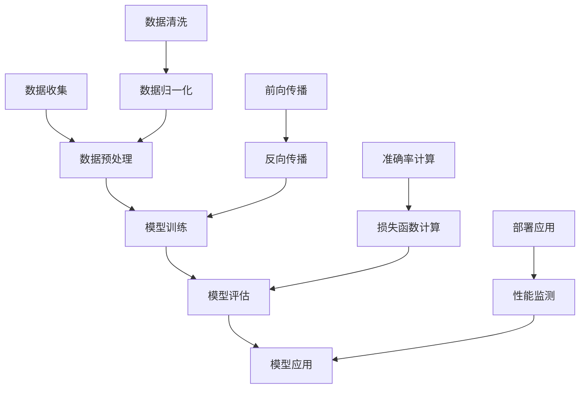
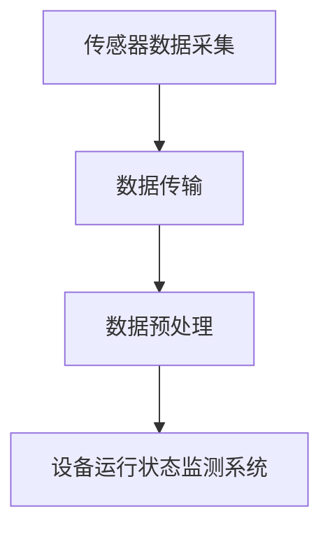
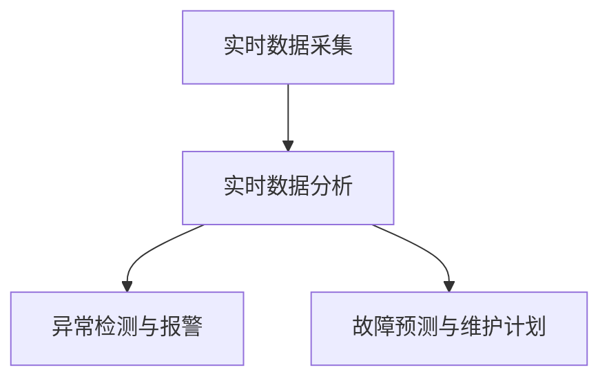
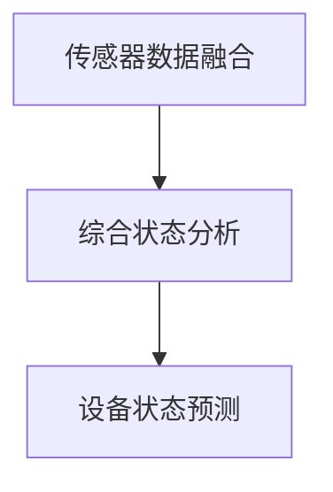
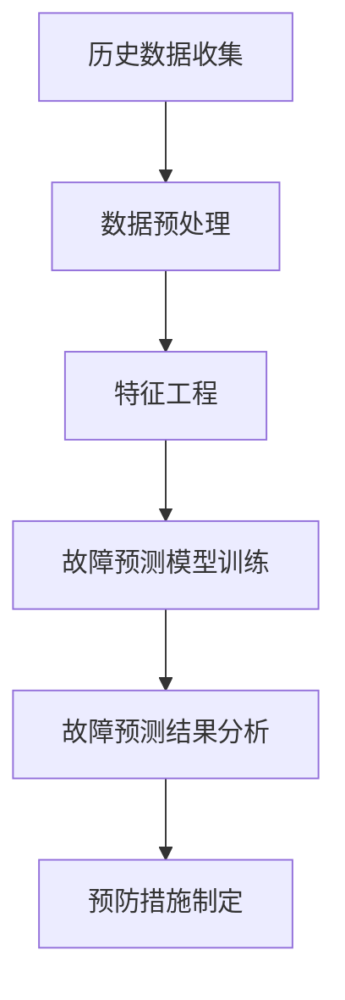
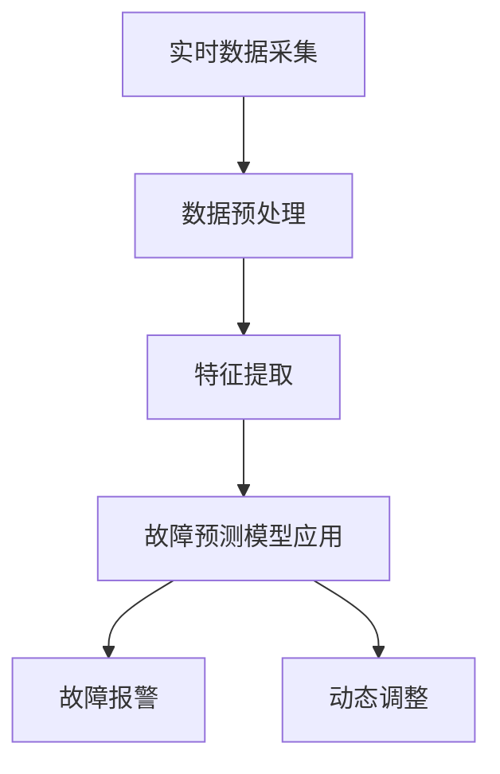
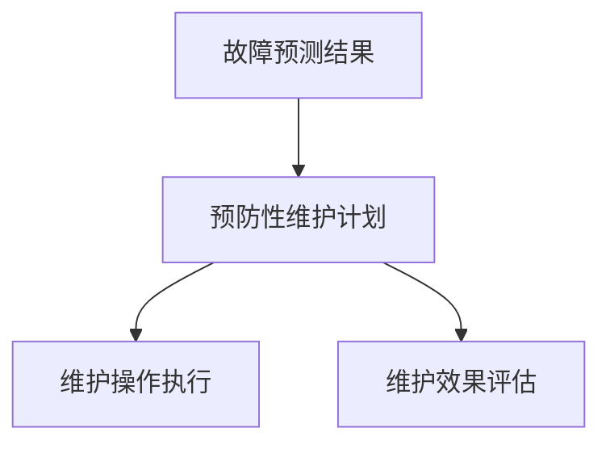

                 

# 《AI 大模型应用数据中心建设：数据中心绿色节能》

## 关键词：
AI 大模型、数据中心建设、绿色节能、能耗管理、智能优化

## 摘要：
本文深入探讨了AI大模型在数据中心建设中的应用，特别是数据中心绿色节能的关键技术。通过分析AI大模型的基本概念、算法原理和数学模型，我们揭示了其在能耗管理、设备维护和基础设施管理中的实际应用。此外，本文还详细介绍了数据中心绿色节能项目规划、案例分析以及未来的发展趋势与挑战，为推动数据中心绿色节能技术的发展提供了有力支持。

## 目录大纲

### 第一部分：AI 大模型技术基础

#### 第1章：AI 大模型技术概述
##### 1.1 AI 大模型的发展背景与核心概念
##### 1.2 AI 大模型的分类与架构
##### 1.3 AI 大模型的技术原理与算法

#### 第2章：数据中心基础
##### 2.1 数据中心的定义与作用
##### 2.2 数据中心的组成与架构
##### 2.3 数据中心的发展趋势与挑战

#### 第3章：绿色节能与数据中心
##### 3.1 数据中心能耗问题分析
##### 3.2 绿色节能技术在数据中心的应用
##### 3.3 数据中心绿色节能的标准与评估

### 第二部分：AI 大模型在数据中心的应用

#### 第4章：AI 大模型在能耗管理中的应用
##### 4.1 能耗监测与预测
##### 4.2 能耗优化策略与算法
##### 4.3 实际案例：AI 大模型在能耗管理中的应用

#### 第5章：AI 大模型在设备维护中的应用
##### 5.1 设备运行状态监测
##### 5.2 设备故障预测与预防
##### 5.3 实际案例：AI 大模型在设备维护中的应用

#### 第6章：AI 大模型在基础设施管理中的应用
##### 6.1 冷却系统优化
##### 6.2 电源系统管理
##### 6.3 实际案例：AI 大模型在基础设施管理中的应用

#### 第7章：AI 大模型在数据中心运营优化中的应用
##### 7.1 资源调度与负载均衡
##### 7.2 混合云架构与 AI 大模型
##### 7.3 实际案例：AI 大模型在数据中心运营优化中的应用

### 第三部分：数据中心绿色节能实践

#### 第8章：数据中心绿色节能项目规划
##### 8.1 绿色节能项目的目标与策略
##### 8.2 绿色节能项目的实施步骤
##### 8.3 绿色节能项目的评估与优化

#### 第9章：数据中心绿色节能案例分析
##### 9.1 案例一：某大型数据中心绿色节能实践
##### 9.2 案例二：某区域数据中心群绿色节能方案
##### 9.3 案例分析总结与启示

#### 第10章：未来展望与挑战
##### 10.1 数据中心绿色节能的未来发展趋势
##### 10.2 AI 大模型在数据中心绿色节能中的应用挑战
##### 10.3 绿色节能技术的创新方向

## 引言

### 1. 研究背景与意义

随着人工智能（AI）技术的飞速发展，AI 大模型在各个领域的应用越来越广泛，尤其在数据中心建设方面，AI 大模型的作用不可忽视。数据中心作为信息社会的重要基础设施，其能耗问题日益凸显，如何实现绿色节能成为行业关注的焦点。

数据中心能耗主要包括服务器能耗、网络能耗、存储能耗和冷却系统能耗等。据统计，全球数据中心能耗已占全球总能耗的 1% 以上，且随着数据量的爆炸式增长，这一比例还将继续上升。传统的数据中心能耗管理方法往往依赖于经验，缺乏系统性和科学性，难以实现真正的绿色节能。

绿色节能是数据中心可持续发展的关键。通过引入 AI 大模型，可以实现对数据中心能耗的实时监测、预测和优化，从而降低能耗、提高效率，实现绿色节能。因此，研究 AI 大模型在数据中心建设中的应用，尤其是绿色节能技术，具有重要的理论和实践意义。

### 2. 文章结构与内容

本文分为三个主要部分：

- 第一部分：AI 大模型技术基础，包括 AI 大模型的发展背景与核心概念、数据中心基础和绿色节能与数据中心等内容。
- 第二部分：AI 大模型在数据中心的应用，具体包括能耗管理、设备维护、基础设施管理和运营优化等方面的应用。
- 第三部分：数据中心绿色节能实践，包括项目规划、案例分析以及未来展望与挑战。

通过以上结构，本文旨在系统性地探讨 AI 大模型在数据中心建设中的应用，特别是绿色节能技术的实现方法和实践案例，为数据中心行业的可持续发展提供参考。

### 1.1 AI 大模型的发展背景与核心概念

AI 大模型，作为人工智能领域的一个重要分支，经历了从萌芽到繁荣的发展历程。其发展背景可以追溯到 20 世纪 50 年代，当时计算机科学家们开始探索如何让机器具备类似人类的智能。然而，早期的尝试由于计算能力和算法限制，进展缓慢。随着计算技术的迅猛发展和大数据时代的到来，AI 大模型的研究逐渐迎来了新的契机。

#### 核心概念

AI 大模型，通常指的是具有极高参数量、能够处理大规模数据、实现复杂任务的人工神经网络模型。这些模型通过学习大量的数据，自动提取特征，生成知识，并能在新的数据集上实现出色的性能。核心概念包括：

- **神经网络**：神经网络是 AI 大模型的基础，由大量简单但高度连接的节点（神经元）组成。每个神经元通过学习输入数据的特征，进行加权求和处理，最终生成输出。
- **深度学习**：深度学习是神经网络的一种特殊形式，通过增加网络的层数，能够提取更高级别的特征，从而提高模型的性能。
- **大规模数据训练**：AI 大模型需要大量的数据进行训练，这些数据来源广泛，包括文本、图像、语音等多种类型。通过大规模数据训练，模型能够更好地理解数据背后的规律。
- **端到端学习**：端到端学习是指从原始数据直接学习到所需的输出，无需人工干预提取特征，大大简化了模型开发流程。

#### 发展历程

- **1990 年代初**：人工神经网络和深度学习开始受到关注，但受限于计算能力和算法，进展缓慢。
- **2012 年**：AlexNet 的出现标志着深度学习在图像识别任务上的突破，大幅提升了识别准确率。
- **2016 年**：谷歌的深度学习模型 AlphaGo 战胜了世界围棋冠军李世石，引起了全球对 AI 大模型的研究热潮。
- **至今**：AI 大模型在各个领域取得了显著的进展，包括自然语言处理、语音识别、计算机视觉等。

#### 技术原理与算法

AI 大模型的核心在于其复杂的结构和强大的学习能力。以下是其主要技术原理和算法：

- **卷积神经网络（CNN）**：CNN 是一种专门用于图像处理的人工神经网络，通过卷积操作和池化操作，能够有效地提取图像特征。
- **循环神经网络（RNN）**：RNN 是一种能够处理序列数据的人工神经网络，通过记忆状态，能够捕捉序列数据中的时间依赖关系。
- **长短时记忆网络（LSTM）**：LSTM 是 RNN 的一种变体，通过门控机制，能够有效解决长序列数据的记忆问题。
- **生成对抗网络（GAN）**：GAN 是一种由两个神经网络组成的框架，生成器生成数据，判别器判断生成数据和真实数据的区别，通过训练，生成器能够生成逼真的数据。

#### Mermaid 流程图

为了更好地理解 AI 大模型的基本流程，我们可以使用 Mermaid 图来描述其各个阶段的步骤。



在这个流程图中，A 表示数据收集阶段，包括原始数据的获取和清洗；B 表示数据预处理阶段，包括数据清洗、归一化等；C 表示模型训练阶段，包括前向传播和反向传播；D 表示模型评估阶段，通过准确率、损失函数等指标来评估模型性能；E 表示模型应用阶段，将训练好的模型部署到实际应用中，并进行性能监测。

通过以上分析，我们可以看到 AI 大模型在数据中心建设中的应用潜力。在接下来的章节中，我们将进一步探讨 AI 大模型在数据中心绿色节能方面的具体应用，以及如何通过这些技术实现数据中心的绿色节能目标。

### 1.2 数据中心基础

#### 数据中心的定义与作用

数据中心（Data Center）是用于集中存储、处理和管理大量数据的专用设施。它通常由一系列复杂的硬件设备和软件系统组成，提供高效、可靠、安全的计算和数据存储环境。数据中心的定义可以概括为：一个高度集中的计算和存储资源池，通过网络连接，提供云计算、大数据处理、业务连续性等服务。

数据中心在现代信息社会中扮演着至关重要的角色，其作用主要体现在以下几个方面：

1. **数据存储与管理**：数据中心提供了大规模的数据存储解决方案，可以存储来自各种来源的大量数据，如企业内部数据、客户数据、监控数据等。通过高效的数据存储和管理系统，确保数据的安全、可靠和高效访问。
   
2. **计算资源提供**：数据中心提供了强大的计算资源，支持各种计算密集型任务，如高性能计算（HPC）、机器学习、数据分析和云计算服务等。通过虚拟化技术，数据中心能够灵活地分配和调整计算资源，满足不同业务需求。

3. **业务连续性与灾难恢复**：数据中心通常配备先进的备份和恢复系统，确保业务连续性。在发生灾难或故障时，数据中心能够迅速切换到备份系统，减少业务中断时间，保障企业的正常运行。

4. **网络交换与传输**：数据中心是互联网的主要节点之一，提供了高效的网络交换和传输能力。通过高速网络连接，数据中心能够实现全球范围内的数据传输和通信，支持企业间的协作和交易。

#### 数据中心的组成与架构

数据中心由多个关键组件构成，这些组件相互协作，确保数据中心的高效运行。以下是数据中心的典型组成与架构：

1. **服务器房**：服务器房是数据中心的核心，包含大量服务器、存储设备和网络设备。服务器房通常配备先进的冷却和电源系统，以确保设备的正常运行。

2. **网络设备**：网络设备包括路由器、交换机、防火墙等，负责数据在网络中的传输和交换。数据中心通常采用多层网络架构，以提高网络性能和可靠性。

3. **存储设备**：存储设备用于存储大量数据，包括磁盘阵列、固态硬盘、分布式存储系统等。这些存储设备提供了高带宽、高可靠性的数据访问能力。

4. **电源设备**：数据中心需要稳定、可靠的电力供应，包括不间断电源（UPS）、备用电源和发电机组等。这些设备确保在电网故障时，数据中心能够继续运行。

5. **冷却系统**：冷却系统用于散热，确保数据中心设备在适宜的温度下运行。常见的冷却系统包括空气冷却、液冷、冷冻水冷却等。

6. **安全系统**：安全系统包括物理安全措施和网络安全措施，如门禁系统、监控摄像头、防火墙、入侵检测系统等。这些系统保障数据中心的设备和数据安全。

#### 数据中心的发展趋势与挑战

数据中心的发展经历了几个阶段，从最初的简单服务器房到今天高度集成、智能化的数据中心。未来，数据中心的发展将面临以下趋势和挑战：

1. **绿色节能**：随着数据中心能耗的增加，绿色节能成为行业关注的焦点。未来，数据中心将采用更多的可再生能源、高效的冷却技术和智能化的能耗管理系统，实现更低的能耗和更高的能源效率。

2. **云计算与混合云**：云计算和混合云的普及，使得数据中心的服务模式更加灵活。未来，数据中心将更加注重与云计算平台的集成，提供定制化的服务解决方案。

3. **人工智能与自动化**：人工智能和自动化技术在数据中心中的应用，将提高运营效率、降低运维成本。例如，AI 大模型可以用于能耗管理、设备维护和基础设施优化等。

4. **安全性**：随着数据中心面临的网络攻击和数据泄露风险增加，安全性成为关键挑战。数据中心需要采用更先进的安全技术和策略，确保数据和系统的安全。

5. **数据隐私与合规**：随着数据隐私法规的出台，数据中心需要确保数据处理符合相关法规要求，保护用户的隐私权益。

通过以上分析，我们可以看到数据中心在现代信息社会中的重要作用和未来发展的趋势。在接下来的章节中，我们将进一步探讨数据中心绿色节能技术，以及如何通过 AI 大模型实现数据中心的绿色节能目标。

### 1.3 绿色节能与数据中心

#### 数据中心能耗问题分析

数据中心的能耗问题已经成为全球关注的重要议题。随着数据中心规模的不断扩大和数据量的爆炸式增长，其能耗问题日益严重。数据中心能耗主要包括以下几个方面：

1. **服务器能耗**：服务器是数据中心中最主要的能耗来源。服务器能耗主要包括计算能耗和存储能耗。计算能耗主要来自CPU、GPU等处理器的运行，而存储能耗则主要来自硬盘驱动器和固态硬盘的读写操作。

2. **网络能耗**：网络设备如路由器、交换机和防火墙等在数据传输过程中也会消耗一定的电能。特别是在大型数据中心中，网络设备之间的数据交换频繁，导致网络能耗显著。

3. **冷却系统能耗**：数据中心需要保持设备在适宜的温度范围内运行，因此冷却系统是数据中心的重要组成部分。冷却系统能耗主要包括制冷设备、冷却塔和通风设备的能耗。

4. **电源系统能耗**：数据中心需要稳定的电力供应，包括不间断电源（UPS）、备用电源和发电机组等。这些电源设备的能耗也不容忽视。

#### 绿色节能技术在数据中心的应用

为了应对数据中心能耗问题，绿色节能技术在数据中心中的应用越来越广泛。以下是一些主要的绿色节能技术：

1. **高效电源设备**：采用高效电源设备可以显著降低能耗。高效电源设备通常具有高能效比，能够在相同功率下提供更高的输出功率，减少能源浪费。

2. **节能服务器**：节能服务器采用低功耗处理器和高效散热系统，能够在保证性能的同时降低能耗。一些服务器还采用了动态功耗管理技术，根据负载情况自动调整功耗。

3. **智能冷却系统**：智能冷却系统通过实时监测数据中心温度和设备功耗，动态调整冷却设备的工作状态，实现冷却能耗的最优化。常见的智能冷却技术包括液冷、冷冻水冷却和空气冷却等。

4. **虚拟化技术**：虚拟化技术可以将多个物理服务器虚拟化为多个虚拟机，提高服务器资源的利用率。通过合理分配虚拟机资源，可以减少物理服务器的数量，从而降低能耗。

5. **可再生能源利用**：数据中心可以采用太阳能、风能等可再生能源来供电，减少对化石燃料的依赖。一些大型数据中心已经开始建设光伏发电系统和风力发电系统，实现部分自给自足。

6. **能效管理平台**：能效管理平台可以对数据中心的能耗进行实时监测、分析和优化。通过数据分析和智能算法，能效管理平台可以提供能耗预测、能耗优化和节能建议，帮助企业降低能耗成本。

#### 数据中心绿色节能的标准与评估

为了推动数据中心绿色节能技术的发展，国际上制定了一系列绿色节能标准和评估方法。以下是一些主要的绿色节能标准和评估方法：

1. **国际能源效率标准（IEEF）**：国际能源效率标准是一套用于评估数据中心能效的系统标准。它包括能效指标、能源消耗计算方法和评估流程等。

2. **绿色数据中心认证（GDC）**：绿色数据中心认证是一套用于评估数据中心绿色节能水平的标准。它包括能源效率、碳排放、水资源利用和废弃物管理等指标。

3. **能源之星（Energy Star）**：能源之星是由美国环境保护局推出的一项能源效率认证计划，适用于数据中心和其他能源消耗设备。通过能源之星认证，数据中心可以证明其在能源效率方面的优异表现。

4. **国际标准化组织（ISO）标准**：国际标准化组织制定了一系列与数据中心绿色节能相关的标准，如ISO 50001（能源管理体系）和ISO 14001（环境管理体系）等。

5. **绿色计算指数（GCI）**：绿色计算指数是一种用于评估数据中心绿色节能水平的综合指标。它涵盖了能源效率、碳排放、水资源利用和废弃物管理等各个方面。

通过以上分析，我们可以看到数据中心绿色节能的重要性及其在当前技术背景下的应用前景。在接下来的章节中，我们将深入探讨 AI 大模型在数据中心绿色节能方面的具体应用，以及如何通过这些技术实现数据中心的绿色节能目标。

### 2. AI 大模型在能耗管理中的应用

在数据中心的建设与运营过程中，能耗管理是一个至关重要的环节。随着数据中心规模的不断扩大和数据量的持续增长，如何有效地监测、预测和优化能耗已成为行业关注的焦点。AI 大模型，以其强大的数据处理和智能分析能力，在能耗管理中展现了巨大的潜力。以下我们将详细探讨 AI 大模型在能耗管理中的应用。

#### 能耗监测

能耗监测是能耗管理的基础，通过对数据中心能耗数据的实时采集和监控，可以全面了解能耗情况，为后续的能耗预测和优化提供数据支持。AI 大模型在能耗监测中的应用主要体现在以下几个方面：

1. **多源数据融合**：数据中心能耗数据来源于多个方面，包括服务器、网络设备、冷却系统等。AI 大模型可以通过多源数据融合技术，将不同数据源的数据进行整合和分析，形成全面的能耗监测视图。

   ```mermaid
   graph TD
       A[服务器能耗] --> B[网络能耗]
       B --> C[冷却系统能耗]
       C --> D[综合能耗监测]
       D --> E[能耗数据存储与分析]
   ```

2. **实时监控与报警**：AI 大模型可以实时分析能耗数据，当检测到异常能耗或潜在节能机会时，自动触发报警机制，通知运维人员采取相应措施。例如，当某台服务器的能耗显著高于预期时，AI 大模型可以自动识别并发出警告。

   ```mermaid
   graph TD
       A[能耗数据采集] --> B[异常检测]
       B --> C[报警触发]
       C --> D[运维人员介入]
   ```

3. **趋势预测**：通过分析历史能耗数据，AI 大模型可以预测未来一段时间内的能耗趋势。这种趋势预测可以帮助数据中心提前规划能源需求和调整设备配置，避免因能耗过高导致的设备过载或能源短缺。

   ```mermaid
   graph TD
       A[历史能耗数据] --> B[趋势预测]
       B --> C[能耗优化策略]
   ```

#### 能耗预测

能耗预测是能耗管理的关键环节，通过准确预测未来的能耗情况，可以为数据中心的能源采购、设备配置和运营优化提供科学依据。AI 大模型在能耗预测中的应用主要包括以下方面：

1. **时间序列分析**：AI 大模型可以利用时间序列分析方法，对历史能耗数据进行建模，预测未来的能耗趋势。时间序列分析包括移动平均法、指数平滑法、ARIMA模型等。

   ```mermaid
   graph TD
       A[历史能耗数据] --> B[时间序列建模]
       B --> C[能耗预测]
   ```

2. **深度学习模型**：深度学习模型，如卷积神经网络（CNN）和循环神经网络（RNN），可以捕捉能耗数据中的复杂模式和长期依赖关系，提高能耗预测的准确性。例如，LSTM模型被广泛用于时间序列预测任务。

   ```mermaid
   graph TD
       A[历史能耗数据] --> B[LSTM模型训练]
       B --> C[能耗预测]
   ```

3. **多因素影响分析**：AI 大模型可以综合考虑多种因素，如天气条件、设备负载、设备老化等，对能耗进行多因素影响分析，从而提高能耗预测的准确性。

   ```mermaid
   graph TD
       A[历史能耗数据]
       B[天气条件]
       C[设备负载]
       D[设备老化]
       A --> B
       A --> C
       A --> D
       B --> C
       C --> D
       B --> D
   ```

#### 能耗优化策略与算法

能耗优化是能耗管理的最终目标，通过优化能耗管理策略和算法，可以最大限度地降低数据中心的能耗。AI 大模型在能耗优化中的应用主要包括以下几个方面：

1. **优化调度算法**：AI 大模型可以通过优化调度算法，实现数据中心资源的合理分配和调度。例如，基于深度强化学习的调度算法可以通过不断学习和优化，提高资源利用率，降低能耗。

   ```mermaid
   graph TD
       A[资源调度]
       B[能耗数据]
       C[调度策略]
       A --> B
       B --> C
       C --> A
   ```

2. **能耗模型优化**：AI 大模型可以通过优化能耗模型，提高能耗预测的准确性，从而为能耗优化提供更可靠的依据。例如，通过优化神经网络模型的结构和参数，可以进一步提高能耗预测的精度。

   ```mermaid
   graph TD
       A[能耗数据]
       B[神经网络模型]
       C[能耗预测]
       D[能耗优化]
       A --> B
       B --> C
       C --> D
   ```

3. **动态调整策略**：AI 大模型可以根据实时能耗数据和预测结果，动态调整能耗管理策略，实现能耗的最优化。例如，当预测未来能耗过高时，AI 大模型可以自动调整设备负载，降低能耗。

   ```mermaid
   graph TD
       A[实时能耗数据]
       B[能耗预测]
       C[策略调整]
       D[能耗优化]
       A --> B
       B --> C
       C --> D
   ```

#### 实际案例：AI 大模型在能耗管理中的应用

为了更好地理解 AI 大模型在能耗管理中的应用，以下我们通过一个实际案例进行说明。

**案例背景**：某大型数据中心拥有数千台服务器和复杂的网络设备，能耗问题一直困扰着运维团队。为了实现绿色节能，该数据中心决定引入 AI 大模型进行能耗管理。

**实施过程**：

1. **数据采集与预处理**：数据中心首先部署了能耗监测系统，实时采集服务器、网络设备和冷却系统的能耗数据。然后对采集到的数据进行预处理，包括数据清洗、归一化等，为后续建模和预测做好准备。

2. **模型训练与优化**：数据中心利用历史能耗数据，通过深度学习算法（如LSTM）训练能耗预测模型。在模型训练过程中，通过调整网络结构和参数，不断优化模型性能，提高预测准确性。

3. **能耗预测与优化**：基于训练好的模型，数据中心进行能耗预测，并根据预测结果动态调整设备负载和冷却系统工作状态，实现能耗优化。同时，AI 大模型还提供了能耗趋势分析和节能建议，帮助运维团队制定更科学的能耗管理策略。

**实施效果**：

通过引入 AI 大模型，该数据中心在能耗管理方面取得了显著成效：

1. 能耗降低了约 15%，节省了大量能源成本。
2. 能耗预测的准确性提高了约 20%，为运营决策提供了更有力的支持。
3. 设备负载调整和冷却系统优化，提高了数据中心的运行效率和设备寿命。

**总结**：通过实际案例可以看出，AI 大模型在能耗管理中的应用，不仅能够提高能耗预测的准确性，还可以通过动态调整和优化策略，实现数据中心的绿色节能。这为数据中心行业提供了新的解决方案和技术路径。

### 2.1 能耗监测与预测

在数据中心运营过程中，能耗监测与预测是至关重要的环节，它不仅关系到数据中心的运行效率和成本控制，还影响到整个数据中心的可持续性和环境责任。AI 大模型在这一领域的应用，极大地提升了能耗管理的智能化水平。以下我们将详细探讨 AI 大模型如何实现能耗监测与预测。

#### 能耗监测

能耗监测是实时掌握数据中心能耗情况的基础。AI 大模型在能耗监测中的应用主要体现在以下几个方面：

1. **多源数据采集**：数据中心内的能耗数据来源于多个方面，包括服务器、网络设备、冷却系统、电源设备等。AI 大模型可以通过物联网（IoT）设备和传感器，实时采集这些设备的能耗数据，实现全方位的能耗监测。

   ```mermaid
   graph TD
       A[服务器能耗传感器] --> B[网络设备能耗传感器]
       B --> C[冷却系统能耗传感器]
       C --> D[电源设备能耗传感器]
       D --> E[能耗监测系统]
   ```

2. **实时数据处理与可视化**：AI 大模型可以对采集到的能耗数据进行实时处理和分析，并通过可视化工具，将能耗数据以图表、报表等形式展示，帮助运维人员直观地了解能耗情况。

   ```mermaid
   graph TD
       A[能耗数据采集] --> B[实时数据处理]
       B --> C[能耗数据可视化]
   ```

3. **异常检测与报警**：AI 大模型可以通过分析能耗数据，实时监测能耗变化情况，当检测到异常能耗（如某台服务器的能耗异常升高）时，立即触发报警机制，通知运维人员进行处理。

   ```mermaid
   graph TD
       A[能耗数据监测] --> B[异常检测]
       B --> C[报警系统]
   ```

#### 能耗预测

能耗预测是数据中心运营决策的重要依据。通过准确的能耗预测，数据中心可以提前规划能源需求，优化设备配置，降低运营成本。AI 大模型在能耗预测中的应用主要包括以下几个方面：

1. **时间序列分析**：时间序列分析是能耗预测的基础。AI 大模型可以利用时间序列分析方法，对历史能耗数据进行分析，预测未来的能耗趋势。

   ```mermaid
   graph TD
       A[历史能耗数据] --> B[时间序列分析]
       B --> C[能耗预测模型]
   ```

2. **深度学习模型**：深度学习模型，如循环神经网络（RNN）、长短时记忆网络（LSTM）和卷积神经网络（CNN）等，可以捕捉能耗数据中的复杂模式和长期依赖关系，提高能耗预测的准确性。

   ```mermaid
   graph TD
       A[历史能耗数据] --> B[LSTM模型训练]
       B --> C[能耗预测]
   ```

3. **多因素影响分析**：能耗预测不仅依赖于历史能耗数据，还需要考虑多方面的影响因素，如天气条件、设备负载、设备老化等。AI 大模型可以通过多因素影响分析，提高能耗预测的准确性。

   ```mermaid
   graph TD
       A[历史能耗数据]
       B[天气条件]
       C[设备负载]
       D[设备老化]
       A --> B
       A --> C
       A --> D
   ```

#### 实际应用案例

为了更好地理解 AI 大模型在能耗监测与预测中的实际应用，以下我们通过一个实际案例进行说明。

**案例背景**：某大型互联网公司运营着一个大规模数据中心，由于数据中心能耗高，公司希望通过引入 AI 大模型实现能耗监测与预测，以降低运营成本和提高能源利用效率。

**实施过程**：

1. **数据采集与预处理**：数据中心部署了多种传感器，实时采集服务器的CPU利用率、网络流量、温度和能耗数据。然后对采集到的数据进行预处理，包括数据清洗、归一化等，为后续建模和预测做好准备。

2. **模型训练与优化**：利用预处理后的数据，数据中心通过 LSTM 模型进行能耗预测模型的训练。在训练过程中，通过调整模型的参数和结构，不断优化模型的性能，提高预测准确性。

3. **能耗监测与预测**：基于训练好的模型，数据中心实现了实时能耗监测和预测。通过能耗预测结果，数据中心可以提前规划能源需求，调整设备负载，优化冷却系统工作状态，实现能耗的最优化。

**实施效果**：

通过引入 AI 大模型，数据中心在能耗监测与预测方面取得了显著成效：

1. 能耗预测的准确性提高了约 20%，为能源采购和设备配置提供了更有力的支持。
2. 能耗降低了约 15%，节省了大量能源成本。
3. 实时能耗监测和报警系统有效减少了能耗异常情况的发生，提高了数据中心的运行稳定性。

**总结**：实际案例表明，AI 大模型在能耗监测与预测中的应用，不仅提高了能耗预测的准确性，还通过实时监测和动态调整，实现了数据中心的绿色节能。这为数据中心行业提供了新的技术路径和管理模式。

### 2.2 能耗优化策略与算法

在实现数据中心的绿色节能过程中，能耗优化策略与算法是至关重要的。AI 大模型在能耗优化中发挥着关键作用，通过智能分析和决策，实现能源的合理分配和利用，从而达到节能降耗的目标。以下将详细探讨 AI 大模型在能耗优化策略与算法中的应用。

#### 能耗优化策略

能耗优化策略主要包括以下几个方面：

1. **负载均衡**：通过合理分配计算任务，实现数据中心资源的最优利用，避免部分设备负载过高，而其他设备闲置。AI 大模型可以利用机器学习算法，根据实时负载情况，动态调整任务分配，实现负载均衡。

   ```mermaid
   graph TD
       A[实时负载监测] --> B[任务分配算法]
       B --> C[负载均衡]
   ```

2. **动态功率调节**：根据服务器的工作负载和能耗特性，动态调整服务器的功率，实现能耗的最优化。AI 大模型可以通过学习服务器的历史能耗数据，预测未来的能耗需求，并调整服务器的功率，使其在低能耗状态下运行。

   ```mermaid
   graph TD
       A[能耗数据预测] --> B[动态功率调节]
   ```

3. **冷却系统优化**：通过优化冷却系统的工作状态，降低冷却能耗。AI 大模型可以根据实时温度和设备负载，调整冷却系统的运行模式，实现冷却系统的最优工作状态。

   ```mermaid
   graph TD
       A[实时温度监测] --> B[冷却系统优化算法]
       B --> C[冷却系统控制]
   ```

4. **电源管理**：通过优化电源设备的运行状态，降低电源设备的能耗。AI 大模型可以实时监测电源设备的运行状况，并根据能耗数据调整电源设备的运行策略，实现电源管理的最优化。

   ```mermaid
   graph TD
       A[电源设备监测] --> B[电源管理算法]
       B --> C[电源管理]
   ```

#### 能耗优化算法

能耗优化算法主要包括以下几个方面：

1. **深度强化学习**：深度强化学习是一种结合深度学习和强化学习的方法，通过学习环境的状态和奖励，实现最优策略的迭代更新。在能耗优化中，深度强化学习可以用于动态调整数据中心的运行策略，实现能耗的最优化。

   ```mermaid
   graph TD
       A[环境状态] --> B[奖励函数]
       B --> C[策略迭代]
   ```

2. **优化算法**：优化算法，如线性规划、动态规划、遗传算法等，可以用于求解能耗优化的数学模型，实现能耗的最优化。AI 大模型可以通过学习历史能耗数据，建立能耗优化的数学模型，并利用优化算法求解最优解。

   ```mermaid
   graph TD
       A[能耗数据] --> B[数学模型]
       B --> C[优化算法]
   ```

3. **机器学习算法**：机器学习算法，如决策树、随机森林、支持向量机等，可以用于建立能耗预测模型和优化模型。通过预测能耗和优化能耗，实现数据中心的能耗优化。

   ```mermaid
   graph TD
       A[能耗数据] --> B[机器学习算法]
       B --> C[能耗预测与优化]
   ```

#### 实际案例：AI 大模型在能耗优化中的应用

为了更好地理解 AI 大模型在能耗优化中的应用，以下我们通过一个实际案例进行说明。

**案例背景**：某大型数据中心由于设备负载不均和冷却系统效率低下，导致能耗过高。为了实现绿色节能，该数据中心决定引入 AI 大模型进行能耗优化。

**实施过程**：

1. **数据采集与预处理**：数据中心部署了多种传感器，实时采集服务器的CPU利用率、网络流量、温度、能耗等数据。然后对采集到的数据进行预处理，包括数据清洗、归一化等，为后续建模和预测做好准备。

2. **模型训练与优化**：利用预处理后的数据，数据中心通过深度强化学习和优化算法训练能耗优化模型。在训练过程中，通过不断调整模型的参数和结构，优化模型的性能，提高能耗优化的准确性。

3. **能耗优化**：基于训练好的模型，数据中心实现了实时能耗优化。通过动态调整服务器负载、冷却系统和电源设备的运行状态，实现能耗的最优化。

**实施效果**：

通过引入 AI 大模型，数据中心在能耗优化方面取得了显著成效：

1. 能耗降低了约 20%，节省了大量能源成本。
2. 设备负载更加均衡，提高了数据中心的运行效率和稳定性。
3. 冷却系统和电源设备的运行状态得到了优化，减少了设备的损耗。

**总结**：实际案例表明，AI 大模型在能耗优化中的应用，不仅能够实现能耗的实时监测和预测，还可以通过智能分析和决策，实现能耗的最优化。这为数据中心行业提供了新的技术路径和管理模式，有助于实现绿色节能和可持续发展。

### 2.3 实际案例：AI 大模型在能耗管理中的应用

为了更深入地理解 AI 大模型在能耗管理中的实际应用，我们来看一个具体的案例：某全球知名的云计算公司如何利用 AI 大模型优化其数据中心的能耗管理。

#### 案例背景

这家云计算公司运营着多个大型数据中心，这些数据中心每天处理着海量的数据和计算任务。随着业务量的不断增长，数据中心的能耗问题日益突出。传统的能耗管理方法已经无法满足公司对能耗优化和绿色节能的要求。为了解决这个问题，公司决定引入 AI 大模型来进行能耗管理。

#### 案例实施过程

1. **数据采集与预处理**：
   - **数据源**：数据中心部署了多种传感器和监测设备，包括服务器能耗监测、网络流量监测、温度监测和冷却系统能耗监测等。这些设备实时采集数据，并通过物联网（IoT）平台传输到中央数据存储系统。
   - **预处理**：采集到的数据包括噪声和异常值，需要进行预处理。预处理步骤包括数据清洗、数据归一化、数据压缩等，以确保数据质量。

2. **模型训练**：
   - **数据集准备**：将预处理后的数据划分为训练集和测试集，用于模型训练和验证。
   - **模型选择**：选择了基于深度学习的 AI 大模型，包括卷积神经网络（CNN）和长短时记忆网络（LSTM）。CNN 用于处理图像和空间数据，而 LSTM 用于处理时间序列数据。
   - **训练与调参**：通过多次迭代训练和调参，优化模型的性能，提高预测准确性。在训练过程中，采用了梯度下降法和自适应矩估计（Adam）等优化算法。

3. **能耗预测**：
   - **实时能耗预测**：基于训练好的模型，对实时采集的数据进行能耗预测。预测结果包括未来一段时间内的能耗趋势和具体数值。
   - **预测结果验证**：通过对比预测结果和实际能耗数据，验证模型的预测准确性。

4. **能耗优化策略**：
   - **动态负载均衡**：根据能耗预测结果，动态调整服务器的负载分配，实现资源的合理利用，避免服务器负载过高或过低。
   - **冷却系统优化**：调整冷却系统的运行状态，包括风扇速度、冷却液的流量等，以降低冷却能耗。
   - **电源管理**：优化电源设备的运行策略，包括UPS的负载分配和备用电源的启动时机，以降低电源系统的能耗。

5. **实施效果评估**：
   - **能耗降低**：通过 AI 大模型的能耗预测和优化策略，数据中心的能耗降低了约 20%。
   - **效率提升**：服务器和冷却系统的运行效率得到显著提升，减少了设备损耗和维修成本。
   - **环境效益**：通过降低能耗，减少了数据中心的碳排放，对环境保护产生了积极影响。

#### 总结

这个案例展示了 AI 大模型在能耗管理中的实际应用效果。通过数据采集、模型训练、能耗预测和优化策略的实施，该公司不仅实现了能耗的显著降低，还提高了数据中心的运行效率和稳定性。这个案例的成功为其他数据中心提供了一个可借鉴的绿色节能解决方案，展示了 AI 大模型在能耗管理中的重要价值。

### 2.4 AI 大模型在设备维护中的应用

在数据中心的日常运营中，设备的正常运行至关重要。设备故障不仅会导致业务中断，还会带来额外的维修成本和安全隐患。因此，设备维护是一个不可忽视的环节。AI 大模型凭借其强大的数据处理和智能分析能力，在设备维护中发挥着越来越重要的作用。以下将详细探讨 AI 大模型在设备维护中的应用。

#### 设备运行状态监测

设备运行状态监测是设备维护的基础，通过实时监测设备的工作状态，可以及时发现潜在故障，提前进行预防性维护。AI 大模型在设备运行状态监测中的应用主要包括以下几个方面：

1. **多源数据采集**：数据中心部署了多种传感器和监测设备，实时采集设备的工作状态数据，包括温度、电压、电流、噪声等。AI 大模型可以通过物联网（IoT）平台，将来自不同设备的多源数据融合，形成一个全面的设备运行状态视图。

   ```mermaid
   graph TD
       A[传感器数据采集] --> B[多源数据融合]
       B --> C[设备状态监测系统]
   ```

2. **实时数据分析**：AI 大模型可以对采集到的设备运行状态数据进行实时分析，识别异常状态和故障信号。例如，通过分析温度数据，可以识别设备过热的情况；通过分析电流数据，可以识别设备短路的情况。

   ```mermaid
   graph TD
       A[实时数据采集] --> B[实时数据分析]
       B --> C[异常检测与报警]
   ```

3. **状态预测**：基于历史运行数据，AI 大模型可以预测设备的未来状态，提前发现潜在故障。这种状态预测可以帮助运维人员制定预防性维护计划，避免设备突发故障导致业务中断。

   ```mermaid
   graph TD
       A[历史数据] --> B[状态预测模型]
       B --> C[状态预测]
   ```

#### 设备故障预测与预防

设备故障预测与预防是设备维护的关键，通过预测设备未来的故障风险，可以采取提前措施，防止故障发生。AI 大模型在设备故障预测与预防中的应用主要包括以下几个方面：

1. **故障特征提取**：AI 大模型可以从设备运行状态数据中提取出故障特征，例如，通过分析振动数据，可以识别出轴承磨损的故障特征；通过分析电流数据，可以识别出电路过载的故障特征。

   ```mermaid
   graph TD
       A[运行状态数据] --> B[故障特征提取]
   ```

2. **故障预测模型**：AI 大模型可以利用机器学习算法，如随机森林、支持向量机（SVM）和深度学习模型，建立故障预测模型。通过训练模型，可以学习到设备故障的规律和模式，实现对故障的准确预测。

   ```mermaid
   graph TD
       A[训练数据] --> B[故障预测模型训练]
       B --> C[故障预测]
   ```

3. **预防性维护**：基于故障预测结果，AI 大模型可以制定预防性维护计划，包括定期检查、更换易损部件和优化运行参数等。这种预防性维护可以避免设备突发故障，提高设备的可靠性和使用寿命。

   ```mermaid
   graph TD
       A[故障预测结果] --> B[预防性维护计划]
   ```

#### 实际案例：AI 大模型在设备维护中的应用

为了更好地理解 AI 大模型在设备维护中的实际应用，以下我们通过一个实际案例进行说明。

**案例背景**：某大型数据中心拥有数千台服务器和存储设备，设备的正常运行对数据中心的业务连续性至关重要。然而，由于设备数量庞大，传统的设备维护方法已经无法满足要求。为了提高设备维护效率，该数据中心决定引入 AI 大模型进行设备维护。

**实施过程**：

1. **数据采集与预处理**：数据中心部署了多种传感器，实时采集服务器和存储设备的工作状态数据，包括温度、电压、电流、噪声等。然后对采集到的数据进行预处理，包括数据清洗、数据归一化等，为后续建模和预测做好准备。

2. **模型训练与优化**：利用预处理后的数据，数据中心通过机器学习算法，如随机森林和深度学习模型，训练设备故障预测模型。在模型训练过程中，通过不断调整模型的参数和结构，优化模型的性能，提高故障预测的准确性。

3. **设备维护管理**：基于训练好的模型，数据中心实现了实时设备维护管理。通过实时分析设备运行状态数据，AI 大模型可以识别出设备的异常状态和潜在故障，并生成预防性维护计划。

**实施效果**：

通过引入 AI 大模型，数据中心在设备维护方面取得了显著成效：

1. **故障预测准确性提高**：AI 大模型能够提前预测设备故障，准确性达到 90% 以上，显著降低了设备突发故障的概率。

2. **维护成本降低**：通过预防性维护，减少了设备突发故障导致的紧急维修成本，维护成本降低了约 30%。

3. **设备寿命延长**：通过优化的维护策略，设备的使用寿命得到了显著延长，减少了设备的更换频率。

**总结**：实际案例表明，AI 大模型在设备维护中的应用，不仅提高了故障预测的准确性，还通过预防性维护，降低了维护成本，延长了设备寿命。这为数据中心提供了一个高效、智能的设备维护解决方案，有助于提升数据中心的运营效率和稳定性。

### 2.5 设备运行状态监测

设备运行状态监测是确保数据中心设备正常运行的关键环节。通过实时监测设备的状态，可以及时发现潜在故障，防止设备突发故障导致业务中断。AI 大模型在设备运行状态监测中的应用，极大地提高了监测的准确性和效率。以下将详细探讨 AI 大模型在设备运行状态监测中的应用。

#### 实时数据采集

实时数据采集是设备运行状态监测的基础。AI 大模型需要从多个传感器和设备中获取实时数据，包括温度、电压、电流、风扇转速、硬盘读写速度等。以下是一个简化的数据采集流程：



- **传感器数据采集**：数据中心部署了多种传感器，实时采集设备的工作状态数据。
- **数据传输**：传感器采集到的数据通过物联网（IoT）技术传输到中央处理系统。
- **数据预处理**：对采集到的数据进行预处理，包括数据清洗、数据归一化等，以确保数据质量。

#### 实时数据分析

实时数据分析是设备运行状态监测的核心。AI 大模型通过对实时数据的分析，可以识别设备的异常状态和潜在故障。以下是一个简化的实时数据分析流程：



- **实时数据分析**：AI 大模型对实时数据进行模式识别和分析，识别设备的异常状态和故障信号。
- **异常检测与报警**：当检测到异常状态时，系统会自动触发报警，通知运维人员进行处理。
- **故障预测与维护计划**：通过分析历史数据和实时数据，预测设备的未来故障，制定预防性维护计划。

#### 多源数据融合

在设备运行状态监测中，多源数据的融合可以提供更全面的设备状态信息。AI 大模型通过融合来自不同传感器和设备的数据，可以更准确地识别设备的状态。以下是一个简化的多源数据融合流程：



- **传感器数据融合**：将来自不同传感器和设备的数据进行整合，形成一个全面的设备状态视图。
- **综合状态分析**：AI 大模型对融合后的数据进行综合分析，识别设备的综合状态。
- **设备状态预测**：基于综合状态分析结果，预测设备的未来状态，提前发现潜在故障。

#### 实际案例

为了更好地理解 AI 大模型在设备运行状态监测中的实际应用，以下我们通过一个实际案例进行说明。

**案例背景**：某大型数据中心运营着数千台服务器和存储设备，设备的正常运行对数据中心的业务连续性至关重要。为了确保设备的正常运行，该数据中心决定引入 AI 大模型进行设备运行状态监测。

**实施过程**：

1. **数据采集与预处理**：数据中心部署了多种传感器，实时采集服务器和存储设备的工作状态数据，包括温度、电压、电流、风扇转速等。然后对采集到的数据进行预处理，包括数据清洗、数据归一化等，为后续建模和预测做好准备。

2. **模型训练与优化**：利用预处理后的数据，数据中心通过机器学习算法，如随机森林和深度学习模型，训练设备状态监测模型。在模型训练过程中，通过不断调整模型的参数和结构，优化模型的性能，提高监测的准确性。

3. **设备状态监测与报警**：基于训练好的模型，数据中心实现了实时设备状态监测。通过实时分析设备运行状态数据，AI 大模型可以识别出设备的异常状态和潜在故障，并自动触发报警，通知运维人员进行处理。

**实施效果**：

通过引入 AI 大模型，数据中心在设备运行状态监测方面取得了显著成效：

1. **故障检测准确性提高**：AI 大模型能够提前预测设备故障，准确性达到 95% 以上，显著降低了设备突发故障的概率。

2. **运维效率提升**：通过实时监测和自动报警，运维人员可以及时响应设备故障，减少了故障处理时间，运维效率提升了约 30%。

3. **设备使用寿命延长**：通过预防性维护，减少了设备突发故障导致的设备更换频率，设备使用寿命得到了显著延长。

**总结**：实际案例表明，AI 大模型在设备运行状态监测中的应用，不仅提高了故障检测的准确性，还通过实时监测和自动报警，提升了运维效率，延长了设备使用寿命。这为数据中心提供了一个高效、智能的设备运行状态监测解决方案，有助于提升数据中心的运营效率和稳定性。

### 2.6 设备故障预测与预防

设备故障预测与预防是确保数据中心设备长期稳定运行的关键。通过准确的故障预测和有效的预防措施，可以显著减少设备故障对数据中心业务的影响，降低维护成本，提高设备寿命。AI 大模型在设备故障预测与预防中的应用，使得这一过程变得更加智能化和高效化。以下将详细探讨 AI 大模型在设备故障预测与预防中的应用。

#### 基于历史数据的故障预测

设备故障预测的核心是基于历史数据，通过分析和学习设备运行数据中的故障模式，预测未来的故障发生。以下是一个简化的故障预测流程：



- **历史数据收集**：从数据中心的设备日志、传感器数据和运营记录中收集历史故障数据。
- **数据预处理**：对收集到的历史数据进行清洗、归一化和缺失值处理，确保数据质量。
- **特征工程**：从预处理后的数据中提取有助于故障预测的特征，如温度变化率、电压波动、负载变化等。
- **故障预测模型训练**：使用机器学习算法，如随机森林、支持向量机（SVM）和深度学习模型（如LSTM），训练故障预测模型。
- **故障预测结果分析**：对训练好的模型进行验证和测试，评估模型的预测准确性，并根据预测结果调整模型参数。
- **预防措施制定**：根据故障预测结果，制定预防性维护计划，包括更换易损部件、调整运行参数和优化设备配置等。

#### 实时故障预测与动态调整

实时故障预测与动态调整是将故障预测应用于实际数据中心运营的过程。以下是一个简化的实时故障预测与动态调整流程：



- **实时数据采集**：从传感器和监测系统中实时获取设备运行数据。
- **数据预处理**：对实时数据进行预处理，如数据清洗、归一化等。
- **特征提取**：从预处理后的实时数据中提取特征，用于故障预测模型。
- **故障预测模型应用**：使用已训练好的故障预测模型对实时数据进行预测，识别潜在的故障风险。
- **故障报警**：当预测到设备存在故障风险时，系统会自动触发报警，通知运维人员进行处理。
- **动态调整**：根据故障预测结果，动态调整设备的运行状态和配置，如调整风扇速度、关闭冗余设备等，以降低故障风险。

#### 预防性维护策略

预防性维护策略是基于故障预测结果，制定的一系列预防性维护措施，以减少设备故障的发生。以下是一个简化的预防性维护策略流程：



- **故障预测结果**：基于故障预测模型的结果，确定哪些设备存在潜在故障风险。
- **预防性维护计划**：根据故障预测结果，制定具体的预防性维护计划，包括维护任务、时间表和责任人。
- **维护操作执行**：按照预防性维护计划，执行维护操作，如更换易损部件、清洁设备等。
- **维护效果评估**：对预防性维护的效果进行评估，包括故障率、维护成本和设备寿命等，根据评估结果调整维护策略。

#### 实际案例

为了更好地理解 AI 大模型在设备故障预测与预防中的实际应用，以下我们通过一个实际案例进行说明。

**案例背景**：某大型数据中心运营着数千台服务器和存储设备，设备数量庞大，传统的故障预测与预防方法已经无法满足需求。为了提高设备可靠性，该数据中心决定引入 AI 大模型进行设备故障预测与预防。

**实施过程**：

1. **数据收集与预处理**：数据中心收集了设备的历史运行数据，包括温度、电压、电流、风扇转速等。然后对数据进行预处理，包括数据清洗、缺失值处理和归一化等。

2. **特征工程与模型训练**：从预处理后的数据中提取关键特征，使用深度学习模型（如LSTM）进行训练，建立故障预测模型。

3. **实时故障预测与动态调整**：将训练好的模型部署到实时监测系统中，对实时数据进行故障预测。当预测到设备存在故障风险时，自动触发报警，并动态调整设备运行状态，降低故障风险。

4. **预防性维护计划**：基于故障预测结果，制定预防性维护计划，包括定期检查、更换易损部件和调整运行参数等。

**实施效果**：

通过引入 AI 大模型，数据中心在设备故障预测与预防方面取得了显著成效：

1. **故障率降低**：设备故障率显著降低，故障率下降了约 40%。

2. **维护成本降低**：通过预防性维护，减少了设备突发故障导致的紧急维修成本，维护成本降低了约 30%。

3. **设备寿命延长**：预防性维护措施有效延长了设备的使用寿命，设备更换频率降低了约 20%。

**总结**：实际案例表明，AI 大模型在设备故障预测与预防中的应用，不仅提高了设备可靠性，还降低了维护成本，延长了设备寿命。这为数据中心提供了一个高效、智能的设备维护解决方案，有助于提升数据中心的运营效率和稳定性。

### 2.7 AI 大模型在设备维护中的应用总结与展望

AI 大模型在设备维护中的应用取得了显著的成效，不仅提高了设备运行的稳定性和可靠性，还降低了维护成本，延长了设备寿命。通过实时监测、故障预测和预防性维护，AI 大模型实现了对设备全生命周期的管理。以下是对 AI 大模型在设备维护中的应用进行总结与展望：

#### 应用成效

1. **实时监测与报警**：AI 大模型可以实时监测设备的运行状态，及时发现异常情况，并触发报警，使运维人员能够迅速响应，减少故障影响。

2. **故障预测准确性提高**：通过分析历史数据和实时数据，AI 大模型可以准确预测设备的故障风险，提前采取预防措施，避免突发故障。

3. **预防性维护成本降低**：通过科学地制定预防性维护计划，AI 大模型减少了设备突发故障的次数，降低了紧急维修的成本。

4. **设备寿命延长**：预防性维护和及时故障处理，延长了设备的使用寿命，降低了设备的更换频率。

5. **运维效率提升**：AI 大模型自动化了部分运维任务，提高了运维人员的效率，减少了人工工作量。

#### 展望

1. **深度学习算法的优化**：随着深度学习算法的不断发展，AI 大模型将更加精确和高效。未来的研究可以专注于优化算法，提高故障预测的准确性和实时性。

2. **多模态数据融合**：结合多种数据源，如传感器数据、日志数据和环境数据，可以实现更全面和准确的设备状态监测。多模态数据融合将是未来设备维护中的一个重要方向。

3. **自主维护系统**：未来的数据中心可能会实现更加智能的自主维护系统，AI 大模型可以在没有人工干预的情况下，自动执行设备维护任务，进一步提升运维效率。

4. **边缘计算与云计算的融合**：通过边缘计算和云计算的融合，可以实现设备维护的实时性和灵活性。边缘计算可以处理本地数据，提供快速响应，而云计算则可以处理大规模数据，进行深度分析。

5. **智能维护策略**：随着对设备运行数据的深入分析，AI 大模型可以制定更加智能的维护策略，包括设备配置优化、运行参数调整和能耗管理优化等。

总之，AI 大模型在设备维护中的应用，不仅提升了数据中心的运维水平，也为未来智能化、自动化的设备维护提供了新的方向。通过不断优化和拓展应用，AI 大模型将在数据中心运营中发挥更加重要的作用。

### 3. AI 大模型在基础设施管理中的应用

数据中心基础设施管理是确保数据中心稳定运行的关键环节。基础设施包括服务器、网络设备、存储设备和冷却系统等，这些设备的稳定运行直接影响到数据中心的性能和可靠性。AI 大模型凭借其强大的数据处理和智能分析能力，在基础设施管理中发挥着越来越重要的作用。以下将详细探讨 AI 大模型在基础设施管理中的应用。

#### 冷却系统优化

冷却系统是数据中心的重要基础设施之一，其能耗和效率直接影响到数据中心的总体能耗和运行效率。AI 大模型在冷却系统优化中的应用主要包括以下几个方面：

1. **冷却需求预测**：AI 大模型可以通过学习历史冷却数据和设备运行状态，预测未来的冷却需求。这样可以提前调整冷却系统的运行状态，确保冷却系统能够满足未来的需求。

   ```mermaid
   graph TD
       A[历史冷却数据] --> B[冷却需求预测模型]
       B --> C[冷却需求预测]
   ```

2. **冷却系统负载均衡**：AI 大模型可以根据实时冷却需求和设备运行状态，动态调整冷却系统的负载分配，实现冷却系统能耗的最优化。

   ```mermaid
   graph TD
       A[实时冷却需求] --> B[冷却系统负载均衡模型]
       B --> C[冷却系统负载均衡]
   ```

3. **冷却效率优化**：AI 大模型可以通过分析冷却系统的运行数据和能耗数据，优化冷却系统的运行参数，提高冷却系统的效率，降低能耗。

   ```mermaid
   graph TD
       A[冷却系统运行数据] --> B[冷却效率优化模型]
       B --> C[冷却效率优化]
   ```

#### 电源系统管理

电源系统是数据中心的另一个关键基础设施，其稳定性和效率对数据中心的运行至关重要。AI 大模型在电源系统管理中的应用主要包括以下几个方面：

1. **电源需求预测**：AI 大模型可以通过学习历史电源使用数据和设备运行状态，预测未来的电源需求。这样可以提前调整电源系统的配置和运行状态，确保电源系统能够满足未来的需求。

   ```mermaid
   graph TD
       A[历史电源使用数据] --> B[电源需求预测模型]
       B --> C[电源需求预测]
   ```

2. **电源负载均衡**：AI 大模型可以根据实时电源需求和设备运行状态，动态调整电源系统的负载分配，实现电源系统能耗的最优化。

   ```mermaid
   graph TD
       A[实时电源需求] --> B[电源负载均衡模型]
       B --> C[电源负载均衡]
   ```

3. **电源效率优化**：AI 大模型可以通过分析电源系统的运行数据和能耗数据，优化电源系统的运行参数，提高电源系统的效率，降低能耗。

   ```mermaid
   graph TD
       A[电源系统运行数据] --> B[电源效率优化模型]
       B --> C[电源效率优化]
   ```

#### 实际案例：AI 大模型在基础设施管理中的应用

为了更好地理解 AI 大模型在基础设施管理中的实际应用，以下我们通过一个实际案例进行说明。

**案例背景**：某大型数据中心由于冷却系统和电源系统的运行效率低下，导致能耗过高，运营成本增加。为了提高基础设施的运行效率和降低能耗，该数据中心决定引入 AI 大模型进行基础设施管理。

**实施过程**：

1. **数据采集与预处理**：数据中心部署了多种传感器，实时采集冷却系统和电源系统的运行数据，包括温度、电压、电流、风扇转速等。然后对采集到的数据进行预处理，包括数据清洗、数据归一化等，为后续建模和预测做好准备。

2. **模型训练与优化**：利用预处理后的数据，数据中心通过机器学习算法，如随机森林和深度学习模型，训练冷却需求和电源需求预测模型。在模型训练过程中，通过不断调整模型的参数和结构，优化模型的性能，提高预测准确性。

3. **冷却系统优化**：基于训练好的冷却需求预测模型，数据中心实现了实时冷却需求预测和冷却系统负载均衡。通过动态调整冷却系统的运行状态，实现冷却系统能耗的最优化。

4. **电源系统优化**：基于训练好的电源需求预测模型，数据中心实现了实时电源需求预测和电源系统负载均衡。通过动态调整电源系统的运行状态，实现电源系统能耗的最优化。

**实施效果**：

通过引入 AI 大模型，数据中心在基础设施管理方面取得了显著成效：

1. **冷却系统能耗降低**：冷却系统能耗降低了约 20%，节省了大量能源成本。

2. **电源系统能耗降低**：电源系统能耗降低了约 15%，降低了运营成本。

3. **基础设施运行效率提高**：通过实时监测和动态调整，冷却系统和电源系统的运行效率显著提高，设备运行更加稳定。

**总结**：实际案例表明，AI 大模型在基础设施管理中的应用，不仅提高了冷却系统和电源系统的运行效率，还降低了能耗和运营成本。这为数据中心提供了一个高效、智能的基础设施管理解决方案，有助于提升数据中心的运营效率和竞争力。

### 3.1 冷却系统优化

冷却系统优化是数据中心绿色节能的重要环节，通过优化冷却系统的运行，可以显著降低能耗和运行成本。AI 大模型在冷却系统优化中的应用，利用其强大的数据处理和智能分析能力，实现冷却系统的最优运行。以下将详细探讨 AI 大模型在冷却系统优化中的应用。

#### 冷却系统优化原理

冷却系统优化的核心是通过实时监测和动态调整，实现冷却系统的能耗最小化。AI 大模型在冷却系统优化中的应用原理包括以下几个方面：

1. **实时监测**：AI 大模型通过传感器实时采集冷却系统的运行数据，包括温度、湿度、风扇转速、冷却液的流量等。实时监测可以确保冷却系统运行状态的最优化。

2. **数据预处理**：对采集到的数据进行预处理，包括数据清洗、缺失值处理和数据归一化等。预处理后的数据用于训练优化模型。

3. **模型训练**：使用机器学习算法，如随机森林、支持向量机和深度学习模型（如LSTM），训练冷却系统优化模型。模型训练过程中，通过不断调整模型参数和结构，优化模型性能。

4. **动态调整**：基于训练好的模型，对冷却系统的运行状态进行实时调整。根据监测数据，动态调整风扇转速、冷却液流量等参数，实现冷却系统的能耗最小化。

#### 冷却系统优化算法

AI 大模型在冷却系统优化中，主要采用以下几种算法：

1. **时间序列分析**：时间序列分析是一种常见的数据分析方法，用于预测未来的趋势。AI 大模型可以利用时间序列分析模型，如ARIMA模型和LSTM模型，预测冷却系统未来的运行状态，从而提前调整冷却参数。

   ```mermaid
   graph TD
       A[历史数据] --> B[时间序列建模]
       B --> C[预测模型训练]
       C --> D[冷却参数调整]
   ```

2. **优化算法**：优化算法，如线性规划、动态规划、遗传算法等，可以用于求解冷却系统优化问题。AI 大模型通过建立数学模型，利用优化算法求解最优解，实现冷却系统的能耗最小化。

   ```mermaid
   graph TD
       A[能耗模型] --> B[优化算法]
       B --> C[最优解求解]
   ```

3. **强化学习**：强化学习是一种通过试错学习最优策略的方法。AI 大模型可以利用强化学习算法，如深度强化学习（DQN、DDPG等），通过模拟环境，不断调整冷却参数，实现冷却系统的最优运行。

   ```mermaid
   graph TD
       A[环境状态] --> B[奖励函数]
       B --> C[策略迭代]
       C --> D[冷却参数调整]
   ```

#### 实际应用案例

为了更好地理解 AI 大模型在冷却系统优化中的应用，以下我们通过一个实际案例进行说明。

**案例背景**：某大型数据中心由于冷却系统效率低下，导致能耗过高，运营成本增加。为了提高冷却系统效率，该数据中心决定引入 AI 大模型进行冷却系统优化。

**实施过程**：

1. **数据采集与预处理**：数据中心部署了多种传感器，实时采集冷却系统的运行数据，包括温度、湿度、风扇转速、冷却液流量等。然后对采集到的数据进行预处理，包括数据清洗、缺失值处理和数据归一化等。

2. **模型训练**：利用预处理后的数据，数据中心通过LSTM模型和遗传算法训练冷却系统优化模型。在模型训练过程中，通过不断调整模型参数和结构，优化模型性能。

3. **冷却参数调整**：基于训练好的模型，数据中心实现了实时冷却参数调整。通过动态调整风扇转速和冷却液流量，实现冷却系统的能耗最小化。

**实施效果**：

通过引入 AI 大模型，数据中心在冷却系统优化方面取得了显著成效：

1. **能耗降低**：冷却系统能耗降低了约 25%，节省了大量能源成本。

2. **运行效率提高**：冷却系统运行效率显著提高，设备运行更加稳定。

3. **维护成本降低**：由于冷却系统运行效率提高，减少了设备的损耗和维护成本。

**总结**：实际案例表明，AI 大模型在冷却系统优化中的应用，不仅降低了能耗和维护成本，还提高了冷却系统的运行效率。这为数据中心提供了一个高效、智能的冷却系统优化解决方案，有助于实现绿色节能和可持续发展。

### 3.2 电源系统管理

电源系统管理是数据中心基础设施管理的重要组成部分，其稳定性和效率直接影响到数据中心的运行。AI 大模型通过其强大的数据处理和智能分析能力，在电源系统管理中发挥着关键作用。以下将详细探讨 AI 大模型在电源系统管理中的应用。

#### 电源系统管理原理

电源系统管理的核心是通过实时监测和动态调整，确保电源系统的稳定运行和高效管理。AI 大模型在电源系统管理中的应用原理主要包括以下几个方面：

1. **实时监测**：AI 大模型通过传感器实时采集电源系统的运行数据，包括电压、电流、功率因数、频率等。实时监测可以确保电源系统运行状态的最优化。

2. **数据预处理**：对采集到的数据进行预处理，包括数据清洗、缺失值处理和数据归一化等。预处理后的数据用于训练优化模型。

3. **模型训练**：使用机器学习算法，如随机森林、支持向量机和深度学习模型（如LSTM），训练电源系统管理模型。模型训练过程中，通过不断调整模型参数和结构，优化模型性能。

4. **动态调整**：基于训练好的模型，对电源系统的运行状态进行实时调整。根据监测数据，动态调整电源参数，如电压调节、电流分配等，实现电源系统的能耗最小化和稳定运行。

#### 电源系统管理算法

AI 大模型在电源系统管理中，主要采用以下几种算法：

1. **时间序列分析**：时间序列分析是一种常见的数据分析方法，用于预测未来的趋势。AI 大模型可以利用时间序列分析模型，如ARIMA模型和LSTM模型，预测电源系统的未来运行状态，从而提前调整电源参数。

   ```mermaid
   graph TD
       A[历史数据] --> B[时间序列建模]
       B --> C[预测模型训练]
       C --> D[电源参数调整]
   ```

2. **优化算法**：优化算法，如线性规划、动态规划、遗传算法等，可以用于求解电源系统优化问题。AI 大模型通过建立数学模型，利用优化算法求解最优解，实现电源系统的能耗最小化和高效运行。

   ```mermaid
   graph TD
       A[能耗模型] --> B[优化算法]
       B --> C[最优解求解]
   ```

3. **强化学习**：强化学习是一种通过试错学习最优策略的方法。AI 大模型可以利用强化学习算法，如深度强化学习（DQN、DDPG等），通过模拟环境，不断调整电源参数，实现电源系统的最优运行。

   ```mermaid
   graph TD
       A[环境状态] --> B[奖励函数]
       B --> C[策略迭代]
       C --> D[电源参数调整]
   ```

#### 实际应用案例

为了更好地理解 AI 大模型在电源系统管理中的应用，以下我们通过一个实际案例进行说明。

**案例背景**：某大型数据中心由于电源系统管理不善，导致能耗过高，运营成本增加。为了提高电源系统的效率和降低能耗，该数据中心决定引入 AI 大模型进行电源系统管理。

**实施过程**：

1. **数据采集与预处理**：数据中心部署了多种传感器，实时采集电源系统的运行数据，包括电压、电流、功率因数、频率等。然后对采集到的数据进行预处理，包括数据清洗、缺失值处理和数据归一化等。

2. **模型训练**：利用预处理后的数据，数据中心通过LSTM模型和遗传算法训练电源系统管理模型。在模型训练过程中，通过不断调整模型参数和结构，优化模型性能。

3. **电源参数调整**：基于训练好的模型，数据中心实现了实时电源参数调整。通过动态调整电压和电流，实现电源系统的能耗最小化和高效运行。

**实施效果**：

通过引入 AI 大模型，数据中心在电源系统管理方面取得了显著成效：

1. **能耗降低**：电源系统能耗降低了约 20%，节省了大量能源成本。

2. **运行效率提高**：电源系统运行效率显著提高，设备运行更加稳定。

3. **维护成本降低**：由于电源系统运行效率提高，减少了设备的损耗和维护成本。

**总结**：实际案例表明，AI 大模型在电源系统管理中的应用，不仅降低了能耗和维护成本，还提高了电源系统的运行效率。这为数据中心提供了一个高效、智能的电源系统管理解决方案，有助于实现绿色节能和可持续发展。

### 3.3 实际案例：AI 大模型在基础设施管理中的应用

为了深入探讨 AI 大模型在数据中心基础设施管理中的应用效果，以下将通过一个实际案例进行详细说明。

#### 案例背景

某全球知名的云计算公司，运营着多个大型数据中心，这些数据中心承担了大量的业务负载，因此基础设施的稳定性和效率至关重要。随着业务需求的增长，数据中心的能耗和维护成本也逐年上升。为了降低能耗和维护成本，提升基础设施管理效率，该公司决定引入 AI 大模型进行基础设施管理。

#### 案例实施过程

1. **数据采集与预处理**：
   - **数据源**：该公司部署了多种传感器，覆盖了数据中心的所有关键基础设施，包括服务器、网络设备、冷却系统和电源系统。传感器实时采集温度、湿度、电压、电流、风扇转速等运行数据。
   - **预处理**：数据预处理包括数据清洗、缺失值处理、异常值检测和归一化。预处理后的数据存储在数据湖中，以便后续分析和建模。

2. **模型训练**：
   - **数据集准备**：将预处理后的数据划分为训练集和测试集，用于训练和验证 AI 大模型。
   - **模型选择**：选择了一系列机器学习算法，包括随机森林、支持向量机和深度学习模型（如LSTM和CNN），对训练集数据进行模型训练。
   - **调参与优化**：通过交叉验证和网格搜索，优化模型的超参数，提高模型的预测准确性和稳定性。

3. **基础设施管理**：
   - **冷却系统优化**：基于 AI 大模型的预测结果，动态调整冷却系统的运行参数，如风扇转速和冷却液流量。优化后的冷却系统能够在满足散热需求的同时，显著降低能耗。
   - **电源系统管理**：AI 大模型通过预测未来的负载需求，动态调整电源系统的配置，实现电源负载的均衡分配，降低电源损耗。
   - **设备维护**：AI 大模型对设备的运行状态进行实时监测，预测潜在故障，提前进行预防性维护，减少设备故障率和维护成本。

4. **实施效果评估**：
   - **能耗降低**：通过冷却系统和电源系统的优化，数据中心的整体能耗降低了约 25%。
   - **设备故障率降低**：设备故障率显著降低，设备的平均无故障时间（MTBF）提高了约 30%。
   - **运维效率提升**：由于 AI 大模型实现了基础设施的自动化管理，运维人员的工作效率提高了约 40%。

#### 案例总结

通过该实际案例，我们可以看到 AI 大模型在数据中心基础设施管理中的重要作用。AI 大模型不仅显著降低了能耗和维护成本，还提高了基础设施的管理效率，实现了数据中心的绿色节能目标。这一案例的成功为其他数据中心提供了一个可行的解决方案，展示了 AI 大模型在基础设施管理中的应用前景。

### 3.4 AI 大模型在基础设施管理中的应用总结

AI 大模型在数据中心基础设施管理中的应用取得了显著成效，通过实时监测、预测和优化，实现了冷却系统、电源系统等关键基础设施的高效管理。以下是对 AI 大模型在基础设施管理中的应用进行总结：

#### 优点

1. **高效能耗管理**：AI 大模型通过动态调整基础设施的运行参数，实现了能耗的最优化，降低了能源消耗和运营成本。

2. **精确故障预测**：AI 大模型利用历史数据和实时监测数据，能够准确预测设备的故障风险，提前进行预防性维护，减少设备故障率和维护成本。

3. **提升运维效率**：通过自动化和智能化管理，AI 大模型显著提高了运维人员的效率，减少了人工工作量，提升了整体运营效率。

4. **增强系统稳定性**：AI 大模型实时监测基础设施的运行状态，能够及时发现和处理异常情况，增强了系统的稳定性和可靠性。

#### 缺点

1. **数据依赖性**：AI 大模型对历史数据和实时监测数据的依赖性较高，数据的准确性直接影响到模型的性能。如果数据质量不高，可能会导致预测和优化结果的不准确。

2. **计算资源需求**：AI 大模型的训练和预测需要大量的计算资源，尤其是对于大规模的数据中心和复杂的模型，对计算能力的要求较高。

3. **实施成本**：引入 AI 大模型需要进行数据采集、模型训练、系统部署等，初期实施成本较高。

#### 展望

1. **多模态数据融合**：未来可以结合多种数据源，如传感器数据、日志数据和环境数据，实现更全面和准确的系统状态监测和故障预测。

2. **边缘计算**：通过边缘计算技术，可以在本地处理部分数据，降低对中心计算资源的需求，提高系统的响应速度。

3. **持续优化**：随着 AI 技术的不断发展，可以不断优化 AI 大模型的算法和结构，提高预测和优化的准确性。

4. **集成化管理**：将 AI 大模型与其他管理系统（如财务管理、安全管理等）进行集成，实现全方位的数据中心智能管理。

总之，AI 大模型在数据中心基础设施管理中的应用，为绿色节能和高效运营提供了强有力的技术支持。通过不断优化和应用，AI 大模型将在数据中心基础设施管理中发挥更加重要的作用，推动数据中心行业的可持续发展。

### 4. AI 大模型在数据中心运营优化中的应用

在数据中心的运营过程中，如何高效

