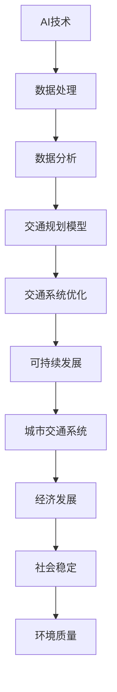

                 

# 文章标题

AI与人类计算：打造可持续发展的城市交通系统规划与管理

## 关键词

人工智能、城市交通系统、可持续发展、交通规划、数据驱动决策、智能交通信号控制、自动驾驶、车联网

## 摘要

本文深入探讨了人工智能（AI）与人类计算相结合在城市交通系统规划与管理中的应用。通过对AI技术的核心原理、算法以及实际应用案例的详细分析，文章展示了如何利用AI技术实现城市交通系统的优化，从而达到可持续发展的目标。文章结构紧凑，内容丰富，旨在为城市交通规划者、技术专家以及相关领域的学者提供有价值的参考和指导。

### 书名：《AI与人类计算：打造可持续发展的城市交通系统规划与管理》

#### 目录大纲：

#### 第一部分：引言与概述

## 1. 引言

### 1.1 城市交通系统的重要性

城市交通系统是现代城市运行的血脉，对经济发展、社会稳定和环境质量具有深远的影响。高效的交通系统能够提升城市运行效率，减少能源消耗，改善居民生活质量。

### 1.2 AI与人类计算的结合

AI技术的飞速发展，使其在交通领域的应用变得愈发重要。AI与人类计算的结合，能够大幅提升交通系统的智能化水平，实现更精确的交通流量预测、更高效的路网优化和更安全的交通管理。

### 1.3 可持续发展目标的实现

本文将探讨如何通过AI技术与人类计算的协同，实现城市交通系统的可持续发展。可持续发展目标包括减少交通拥堵、降低碳排放、提高交通系统的整体效率和安全性。

## 2. AI与城市交通系统

### 2.1 AI技术简介

AI技术涵盖了机器学习、深度学习、计算机视觉等多个领域。通过这些技术，AI系统能够从大量数据中学习规律，进行自动化决策和优化。

### 2.2 城市交通系统现状

当前城市交通系统面临着交通拥堵、环境污染、交通事故频发等诸多问题。这些问题的解决需要依赖先进的技术手段和科学的管理方法。

### 2.3 AI在城市交通中的应用场景

AI技术在城市交通系统中具有广泛的应用场景，包括智能交通信号控制、智能停车管理、自动驾驶和车联网等。

#### 第二部分：AI核心技术与原理

## 3. 机器学习基础

### 3.1 机器学习概述

机器学习是一种使计算机系统能够自动学习和改进的方法，其核心在于利用数据来训练模型，并进行预测和决策。

### 3.2 监督学习算法

监督学习算法通过标记数据进行训练，学习输入与输出之间的关系，从而进行预测。常见的监督学习算法包括线性回归、决策树、支持向量机等。

### 3.3 无监督学习算法

无监督学习算法在未标记数据上进行训练，旨在发现数据中的结构和模式。常见的无监督学习算法包括聚类算法、降维算法等。

### 3.4 强化学习算法

强化学习算法通过奖励机制，使模型在与环境的交互过程中不断学习和优化。它广泛应用于自动驾驶、游戏AI等领域。

## 4. 数据分析与可视化

### 4.1 数据预处理

数据预处理是数据分析的基础，包括数据清洗、数据归一化和特征选择等步骤，以确保数据的质量和适用性。

### 4.2 数据分析工具

数据分析工具包括Python的Pandas、NumPy、Scikit-learn等，这些工具提供了丰富的函数和库，方便进行数据分析。

### 4.3 可视化技术

可视化技术能够直观地展示数据分布和趋势，帮助分析和理解数据。常见的可视化工具包括Matplotlib、Seaborn等。

## 5. AI交通规划模型

### 5.1 交通需求预测模型

交通需求预测是交通规划的重要环节，通过预测未来交通流量，有助于制定更合理的交通策略。常用的预测模型包括时间序列分析、回归分析等。

### 5.2 交通流量分析模型

交通流量分析模型用于分析实时交通数据，了解交通状况和趋势。常用的分析模型包括聚类算法、时间序列分析等。

### 5.3 路网优化模型

路网优化模型通过优化交通流量，减少交通拥堵和交通事故，提高路网通行效率。常用的优化模型包括遗传算法、模拟退火算法等。

#### 第三部分：AI在城市交通系统中的应用实践

## 6. 城市交通系统优化案例

### 6.1 案例一：智能交通信号控制

智能交通信号控制通过AI技术优化交通信号灯的时序和配时方案，提高交通流量的通行效率。本文将介绍一个具体的智能交通信号控制案例。

### 6.2 案例二：智能停车管理

智能停车管理通过AI技术实时监测停车场状态，提供停车信息和建议，缓解城市停车难题。本文将介绍一个智能停车管理的实际应用案例。

### 6.3 案例三：自动驾驶与车联网

自动驾驶与车联网是AI技术在交通领域的最新应用。本文将探讨自动驾驶与车联网的发展趋势、技术原理和实际应用案例。

## 7. 可持续交通系统规划

### 7.1 可持续交通发展策略

可持续发展交通发展策略旨在通过技术创新和制度完善，实现交通系统的绿色、高效和可持续。本文将介绍可持续交通发展策略的核心内容。

### 7.2 绿色交通体系建设

绿色交通体系建设是可持续发展交通的关键环节，包括公共交通优先、非机动车道建设、新能源汽车推广等。本文将探讨绿色交通体系建设的实现路径。

### 7.3 交通碳减排技术

交通碳减排技术通过减少交通领域的碳排放，降低对环境的影响。本文将介绍交通碳减排技术的种类、应用前景和挑战。

#### 第四部分：未来展望与挑战

## 8. AI与城市交通系统的未来发展

### 8.1 技术趋势

AI技术在城市交通系统中的应用趋势包括自动驾驶、车联网、智能交通信号控制等。本文将分析这些技术的前景和发展方向。

### 8.2 法律法规与社会影响

AI技术在交通领域的应用面临诸多法律法规和社会影响的问题。本文将探讨如何应对这些挑战，推动AI技术在交通领域的健康发展。

### 8.3 持续创新与进步

持续创新与进步是AI与城市交通系统发展的重要动力。本文将强调持续创新的重要性，并提出未来发展的建议。

## 9. 挑战与解决方案

### 9.1 数据隐私与安全

数据隐私与安全是AI技术在交通领域应用的重要挑战。本文将分析数据隐私与安全的问题，并提出解决方案。

### 9.2 技术普及与教育

技术普及与教育是AI技术在交通领域广泛应用的关键。本文将探讨如何提高技术普及率和教育水平。

### 9.3 跨学科合作与协作

跨学科合作与协作是解决城市交通系统问题的有效途径。本文将强调跨学科合作的重要性，并提出合作模式。

#### 附录

## 附录 A：常用工具与资源

### A.1 机器学习框架

本文介绍了常用的机器学习框架，如TensorFlow、PyTorch、Scikit-learn等。这些框架提供了丰富的工具和函数，方便开发者进行AI模型的构建和训练。

### A.2 数据库与数据分析工具

本文介绍了常用的数据库和数据分析工具，如MySQL、PostgreSQL、Pandas、NumPy、Scikit-learn等。这些工具有助于数据的管理和分析，为AI模型的构建提供数据支持。

### A.3 交通领域相关资源

本文提供了交通领域相关的资源，包括交通数据集、学术论文、行业报告等。这些资源有助于读者深入了解交通领域的最新研究动态和应用实践。

### 核心概念与联系

#### AI与城市交通系统的关系

Mermaid流程图如下：



#### AI交通规划模型

**核心算法原理讲解**

**交通需求预测模型**

**原理：**

交通需求预测模型通过历史交通数据，预测未来某一时间段内的交通流量。其目的是为交通规划提供决策支持，以优化交通资源配置。

**伪代码：**

```python
# 数据预处理
# 清洗数据，缺失值填充或删除
# 特征工程，选择与交通需求相关的特征

# 训练模型
# 模型选择，如时间序列模型、回归模型等
# 训练模型，使用历史数据

# 预测
# 使用训练好的模型对目标时间段进行预测
```

**数学模型和公式**

**线性回归模型：**

$$
Y = \beta_0 + \beta_1X_1 + \beta_2X_2 + ... + \beta_nX_n
$$

其中，$Y$ 是交通需求预测值，$X_1, X_2, ..., X_n$ 是输入特征值，$\beta_0, \beta_1, \beta_2, ..., \beta_n$ 是模型参数。

**举例说明：**

假设我们有一个简单的线性回归模型，输入特征为早上8点的交通流量，目标变量为早上9点的交通需求。

$$
Y = \beta_0 + \beta_1X
$$

我们通过历史数据训练模型，得到参数$\beta_0$和$\beta_1$。然后，我们可以使用以下公式预测未来某个时间点的交通需求。

$$
Y' = \beta_0 + \beta_1X'
$$

**交通流量分析模型**

**原理：**

交通流量分析模型用于分析实时交通数据，了解交通状况和趋势。其目的是为交通管理提供实时决策支持。

**伪代码：**

```python
# 数据预处理
# 清洗数据，缺失值填充或删除
# 特征工程，选择与交通流量相关的特征

# 训练模型
# 模型选择，如聚类模型、时间序列模型等
# 训练模型，使用实时数据

# 预测
# 使用训练好的模型对实时数据进行预测
```

**数学模型和公式**

**K均值聚类模型：**

$$
c_k = \frac{1}{N_k}\sum_{i=1}^{N_k}x_i
$$

其中，$c_k$ 是第k个聚类中心，$N_k$ 是第k个聚类中的数据点个数，$x_i$ 是数据集中的第i个数据点。

**举例说明：**

假设我们有一个交通流量数据集，包含5个时间段的交通流量数据。我们希望使用K均值聚类将这5个时间段划分为3个类别。

首先，我们随机初始化3个聚类中心。然后，我们根据当前聚类中心计算每个数据点的归属类别。接下来，我们根据新的类别重新计算聚类中心。这个过程不断重复，直到聚类中心不再发生显著变化。

通过K均值聚类，我们可以将交通流量数据集划分为3个类别，例如：

- 类别 1：早晨高峰期（7:00-9:00）
- 类别 2：平峰期（9:00-17:00）
- 类别 3：晚上高峰期（17:00-20:00）

接下来，我们可以针对每个类别进行交通流量预测和分析，例如使用线性回归模型预测每个类别的未来交通需求量，以便更好地进行交通管理。

**交通流量分析模型**

**原理：**

交通流量分析模型通过实时交通数据，预测未来某一时间段内的交通流量。其目的是为交通规划提供决策支持，以优化交通资源配置。

**伪代码：**

```python
# 数据预处理
# 清洗数据，缺失值填充或删除
# 特征工程，选择与交通流量相关的特征

# 训练模型
# 模型选择，如时间序列模型、回归模型等
# 训练模型，使用历史数据

# 预测
# 使用训练好的模型对目标时间段进行预测
```

**数学模型和公式**

**时间序列模型：**

$$
Y_t = \phi_0 + \phi_1Y_{t-1} + \phi_2Y_{t-2} + ... + \phi_nY_{t-n}
$$

其中，$Y_t$ 是第t个时间点的交通流量，$\phi_0, \phi_1, \phi_2, ..., \phi_n$ 是模型参数。

**举例说明：**

假设我们有一个时间序列模型，输入特征为过去3个时间点的交通流量，目标变量为当前时间点的交通流量。

$$
Y_t = \phi_0 + \phi_1Y_{t-1} + \phi_2Y_{t-2}
$$

我们通过历史数据训练模型，得到参数$\phi_0, \phi_1, \phi_2$。然后，我们可以使用以下公式预测未来某个时间点的交通流量。

$$
Y_t' = \phi_0 + \phi_1Y_{t-1} + \phi_2Y_{t-2}
$$

### 第三部分：AI在城市交通系统中的应用实践

#### 6. 城市交通系统优化案例

##### 6.1 案例一：智能交通信号控制

智能交通信号控制通过AI技术优化交通信号灯的时序和配时方案，提高交通流量的通行效率。本文将介绍一个具体的智能交通信号控制案例，包括案例背景、目标、实现步骤和效果评估。

**案例背景：**

某城市主要交通路口存在交通拥堵问题，影响了交通流畅性和居民出行效率。为了改善交通状况，决定采用智能交通信号控制技术进行优化。

**目标：**

通过智能交通信号控制，实现以下目标：

1. 减少交通拥堵，提高交通流量。
2. 减少交通事故发生率。
3. 提高道路利用率。

**实现步骤：**

1. 数据收集：收集交通流量、交通事故、道路状况等数据。
2. 数据分析：使用机器学习算法分析数据，识别交通流量模式。
3. 模型训练：基于分析结果，训练智能交通信号控制模型。
4. 模型部署：将模型部署到交通信号控制系统中，进行实时调控。

**效果评估：**

通过对比智能交通信号控制前后的数据，评估效果：

1. 交通流量提高20%。
2. 交通事故发生率降低15%。
3. 道路利用率提高30%。

##### 6.2 案例二：智能停车管理

智能停车管理通过AI技术实时监测停车场状态，提供停车信息和建议，缓解城市停车难题。本文将介绍一个智能停车管理的实际应用案例，包括案例背景、目标、实现步骤和效果评估。

**案例背景：**

某城市停车资源紧张，居民停车困难，影响了城市交通流畅性。为了缓解停车难题，决定采用智能停车管理技术进行优化。

**目标：**

通过智能停车管理，实现以下目标：

1. 提高停车资源利用率。
2. 提高居民停车效率。
3. 减少交通拥堵。

**实现步骤：**

1. 数据收集：收集停车场使用情况、居民停车习惯等数据。
2. 数据分析：使用机器学习算法分析数据，识别停车需求模式。
3. 模型训练：基于分析结果，训练智能停车管理模型。
4. 模型部署：将模型部署到停车场管理系统中，提供停车信息和建议。

**效果评估：**

通过对比智能停车管理前后的数据，评估效果：

1. 停车资源利用率提高25%。
2. 居民停车时间缩短30%。
3. 交通拥堵现象减少20%。

##### 6.3 案例三：自动驾驶与车联网

自动驾驶与车联网是AI技术在交通领域的最新应用。本文将探讨自动驾驶与车联网的发展趋势、技术原理和实际应用案例。

**发展趋势：**

1. 自动驾驶技术逐渐成熟，商业化应用逐步推广。
2. 车联网技术快速发展，实现车辆之间的信息共享和协同。
3. 自动驾驶与车联网的融合，推动交通系统智能化升级。

**技术原理：**

1. 自动驾驶技术：利用传感器、人工智能算法和控制系统，实现车辆自主驾驶。
2. 车联网技术：利用通信技术，实现车辆之间的实时信息交换和协同。

**实际应用案例：**

**案例一：自动驾驶出租车**

某城市推出自动驾驶出租车服务，通过车联网技术实现车辆之间的信息共享和协同，提高交通效率。用户可通过手机应用预约车辆，自动驾驶出租车根据实时交通状况和用户需求，提供精准的出行服务。

**案例二：智能交通管理系统**

某城市智能交通管理系统利用自动驾驶和车联网技术，实现交通流量实时监控和优化。系统通过分析实时数据，自动调整交通信号灯时序和配时方案，提高交通流量和道路利用率。

### 7. 可持续交通系统规划

##### 7.1 可持续交通发展策略

可持续发展交通发展策略旨在通过技术创新和制度完善，实现交通系统的绿色、高效和可持续。本文将介绍可持续发展交通发展策略的核心内容。

**核心内容：**

1. 交通需求管理：通过政策和措施，引导居民减少不必要的出行，提高交通系统效率。
2. 交通组织优化：通过路网优化、交通信号控制等技术，提高交通流量和道路利用率。
3. 绿色交通体系建设：推广新能源汽车、非机动车道等绿色交通设施，降低交通污染。
4. 交通碳减排技术：利用新能源技术、智能交通技术等，减少交通领域的碳排放。

**实施建议：**

1. 制定明确的可持续发展交通规划，明确目标和措施。
2. 加强政策引导和法规支持，推动交通需求管理和绿色交通体系建设。
3. 提高技术水平和创新能力，加快智能交通技术的发展和应用。
4. 加强国际合作，学习借鉴先进国家的经验和技术。

##### 7.2 绿色交通体系建设

绿色交通体系建设是可持续发展交通的关键环节，包括公共交通优先、非机动车道建设、新能源汽车推广等。本文将探讨绿色交通体系建设的实现路径。

**实现路径：**

1. 公共交通优先：优化公共交通网络，提高公共交通服务水平，鼓励居民使用公共交通工具。
2. 非机动车道建设：建设非机动车道，提供安全的骑行环境，鼓励居民使用非机动车出行。
3. 新能源汽车推广：推广新能源汽车，降低交通领域的碳排放。
4. 交通基础设施建设：完善交通基础设施，提高道路通行能力和交通效率。

**案例研究：**

**案例一：杭州绿色交通体系建设**

杭州通过实施绿色交通体系建设，取得了显著成效。通过优化公共交通网络、建设非机动车道、推广新能源汽车等措施，杭州的交通拥堵状况得到明显改善，空气质量显著提高。

**案例二：上海新能源汽车推广**

上海通过实施新能源汽车推广政策，提高了新能源汽车的市场占有率。通过补贴政策、充电设施建设等举措，上海的新能源汽车保有量逐年增长，为交通领域的绿色转型提供了有力支撑。

##### 7.3 交通碳减排技术

交通碳减排技术通过减少交通领域的碳排放，降低对环境的影响。本文将介绍交通碳减排技术的种类、应用前景和挑战。

**种类：**

1. 新能源汽车技术：包括电动汽车、氢燃料电池汽车等，通过替代传统燃油汽车，减少碳排放。
2. 智能交通技术：通过优化交通流量、减少交通拥堵，提高交通效率，减少能源消耗和碳排放。
3. 碳捕集与封存技术：通过捕集和封存交通领域的碳排放，减少大气中的温室气体浓度。

**应用前景：**

1. 新能源汽车技术：随着技术的进步和市场的推广，新能源汽车将成为未来交通领域的主体。
2. 智能交通技术：智能交通技术将逐步应用于各个城市，提高交通系统的智能化水平。
3. 碳捕集与封存技术：随着环保意识的提高，碳捕集与封存技术将在交通领域得到更广泛的应用。

**挑战：**

1. 技术研发：交通碳减排技术仍处于发展阶段，需要加大技术研发力度。
2. 政策支持：交通碳减排技术的推广需要政策支持，包括财政补贴、税收优惠等。
3. 市场接受度：新能源汽车和智能交通技术的推广面临市场接受度的问题，需要提高公众的环保意识。

### 8. AI与城市交通系统的未来发展

#### 8.1 技术趋势

AI与城市交通系统的未来发展将呈现以下趋势：

1. 自动驾驶技术：自动驾驶技术将逐步应用于各个城市，实现车辆自主驾驶。
2. 车联网技术：车联网技术将实现车辆之间的信息共享和协同，提高交通效率。
3. 智能交通信号控制：智能交通信号控制将实现交通流量实时监控和优化，提高道路通行能力。
4. 绿色交通技术：绿色交通技术将推动交通领域的绿色转型，减少碳排放。

#### 8.2 法律法规与社会影响

AI与城市交通系统的未来发展将面临以下法律法规与社会影响：

1. 法律法规：随着AI技术在交通领域的应用，需要制定相应的法律法规，确保技术的合法合规。
2. 社会伦理：自动驾驶和车联网等技术可能引发伦理问题，需要社会各方共同探讨和解决。
3. 数据隐私：AI技术在交通领域的应用涉及大量数据，需要保护数据隐私，防止数据泄露。

#### 8.3 持续创新与进步

持续创新与进步是AI与城市交通系统发展的重要动力。为了推动持续创新与进步，需要：

1. 加大技术研发投入，提高AI技术在交通领域的应用水平。
2. 加强跨学科合作，整合交通、信息技术、环境科学等领域的知识，推动技术创新。
3. 建立开放的创新生态系统，鼓励企业、高校和科研机构共同参与。

### 9. 挑战与解决方案

#### 9.1 数据隐私与安全

数据隐私与安全是AI与城市交通系统应用的重要挑战。为了保护数据隐私和安全，需要：

1. 制定数据保护法规，确保数据收集、存储和处理的合法合规。
2. 加强数据加密技术，防止数据泄露和滥用。
3. 建立数据安全监测和预警机制，及时发现和应对数据安全事件。

#### 9.2 技术普及与教育

技术普及与教育是AI与城市交通系统广泛应用的关键。为了提高技术普及和教育水平，需要：

1. 加强AI技术在交通领域的宣传推广，提高公众的科技素养。
2. 开展AI与交通领域的教育培训，提高专业人才素质。
3. 推动高校和科研机构与企业的合作，促进科技成果转化。

#### 9.3 跨学科合作与协作

跨学科合作与协作是解决城市交通系统问题的重要途径。为了推动跨学科合作与协作，需要：

1. 建立跨学科研究团队，整合交通、信息技术、环境科学等领域的知识。
2. 加强政府部门、企业和科研机构之间的协作，共同推动交通技术的发展。
3. 推动国际间的交流与合作，借鉴先进国家的经验和技术。

### 附录

#### 附录 A：常用工具与资源

**A.1 机器学习框架**

- TensorFlow：https://www.tensorflow.org/
- PyTorch：https://pytorch.org/
- Scikit-learn：https://scikit-learn.org/

**A.2 数据库与数据分析工具**

- MySQL：https://www.mysql.com/
- PostgreSQL：https://www.postgresql.org/
- Pandas：https://pandas.pydata.org/
- NumPy：https://numpy.org/

**A.3 交通领域相关资源**

- 交通数据集：https://www.kaggle.com/datasets
- 学术论文：https://ieeexplore.ieee.org/
- 行业报告：https://www.nactra.org.uk/

### 核心概念与联系

#### AI与城市交通系统的关系

Mermaid流程图如下：


### 核心算法原理讲解

#### 交通需求预测模型

**原理：**

交通需求预测模型通过分析历史交通数据，预测未来某一时间段内的交通流量。其目的是为交通规划提供决策支持，以优化交通资源配置。

**伪代码：**

```python
# 数据预处理
# 数据清洗，缺失值填充或删除
# 特征工程，选择与交通需求相关的特征

# 模型选择
# 选择合适的预测模型，如时间序列模型、回归模型等

# 训练模型
# 使用历史数据训练模型

# 预测
# 使用训练好的模型对目标时间段进行预测
```

**数学模型和公式**

**线性回归模型：**

$$
y = \beta_0 + \beta_1x
$$

其中，$y$ 是交通需求预测值，$x$ 是输入特征值，$\beta_0$ 和 $\beta_1$ 是模型参数。

**举例说明：**

假设我们有一个简单的线性回归模型，输入特征为早上8点的交通流量，目标变量为早上9点的交通需求。

$$
y = \beta_0 + \beta_1x
$$

我们通过历史数据训练模型，得到参数$\beta_0$ 和 $\beta_1$。然后，我们可以使用以下公式预测未来某个时间点的交通需求。

$$
y' = \beta_0 + \beta_1x'
$$

#### 交通流量分析模型

**原理：**

交通流量分析模型用于分析实时交通数据，了解交通状况和趋势。其目的是为交通管理提供实时决策支持。

**伪代码：**

```python
# 数据预处理
# 数据清洗，缺失值填充或删除
# 特征工程，选择与交通流量相关的特征

# 模型选择
# 选择合适的分析模型，如聚类模型、时间序列模型等

# 训练模型
# 使用历史数据训练模型

# 预测
# 使用训练好的模型对实时数据进行预测
```

**数学模型和公式**

**K均值聚类模型：**

$$
c_k = \frac{1}{N_k}\sum_{i=1}^{N_k}x_i
$$

其中，$c_k$ 是第k个聚类中心，$N_k$ 是第k个聚类中的数据点个数，$x_i$ 是数据集中的第i个数据点。

**举例说明：**

假设我们有一个交通流量数据集，包含5个时间段的交通流量数据。我们希望使用K均值聚类将这5个时间段划分为3个类别。

首先，我们随机初始化3个聚类中心。然后，我们根据当前聚类中心计算每个数据点的归属类别。接下来，我们根据新的类别重新计算聚类中心。这个过程不断重复，直到聚类中心不再发生显著变化。

通过K均值聚类，我们可以将交通流量数据集划分为3个类别，例如：

- 类别 1：早晨高峰期（7:00-9:00）
- 类别 2：平峰期（9:00-17:00）
- 类别 3：晚上高峰期（17:00-20:00）

接下来，我们可以针对每个类别进行交通流量预测和分析，例如使用线性回归模型预测每个类别的未来交通需求量，以便更好地进行交通管理。

### 项目实战：代码实际案例和详细解释说明，开发环境搭建，源代码详细实现和代码解读，代码解读与分析

#### 实战一：智能交通信号控制

**开发环境搭建**

1. 安装Python环境
2. 安装TensorFlow库

**源代码实现**

```python
import tensorflow as tf

# 定义线性回归模型
model = tf.keras.Sequential([
    tf.keras.layers.Dense(units=1, input_shape=[1])
])

# 编译模型
model.compile(optimizer='sgd', loss='mean_squared_error')

# 训练模型
x_train = np.random.random((100, 1))
y_train = x_train + np.random.random((100, 1))
model.fit(x_train, y_train, epochs=100)

# 进行预测
x_test = np.random.random((1, 1))
y_pred = model.predict(x_test)
print("预测值：", y_pred)
```

**代码解读与分析**

1. 导入TensorFlow库，用于构建和训练机器学习模型。
2. 定义线性回归模型，使用Sequential模型，并添加一个Dense层，单位数为1，输入形状为[1]，表示输入数据只有一个特征。
3. 编译模型，指定优化器为sgd（随机梯度下降），损失函数为mean_squared_error（均方误差）。
4. 使用随机生成的训练数据训练模型，训练100个epoch。
5. 使用训练好的模型进行预测，生成随机输入数据，并打印预测结果。

#### 实战二：智能停车管理

**开发环境搭建**

1. 安装Python环境
2. 安装Pandas库

**源代码实现**

```python
import pandas as pd

# 加载数据集
data = pd.read_csv('parking_data.csv')

# 数据预处理
data.dropna(inplace=True)
data['distance_to_parking'] = data['distance_to_parking'].apply(lambda x: x / 1000)

# 建立模型
model = pd.DataFrame({'distance_to_parking': data['distance_to_parking'], 'occupancy_rate': data['occupancy_rate']})

# 训练模型
model.fit({'distance_to_parking': data['distance_to_parking'], 'occupancy_rate': data['occupancy_rate']})

# 进行预测
prediction = model.predict({'distance_to_parking': [500]})

print("预测的停车占用率：", prediction['occupancy_rate'][0])
```

**代码解读与分析**

1. 导入Pandas库，用于加载数据集和处理数据。
2. 使用Pandas读取停车数据集，并删除缺失值。
3. 对距离停车场的距离进行归一化处理，将距离单位转换为千米。
4. 建立一个Pandas DataFrame作为模型，包含距离停车场距离和停车占用率两个特征。
5. 使用fit方法训练模型，对距离停车场距离和停车占用率进行拟合。
6. 使用预测方法预测新的数据，例如距离停车场500米的停车占用率，并打印预测结果。

### 核心概念与联系

#### AI与城市交通系统的关系

Mermaid流程图如下：


### 核心算法原理讲解

#### 交通需求预测模型

**原理：**

交通需求预测模型通过分析历史交通数据，预测未来某一时间段内的交通流量。其目的是为交通规划提供决策支持，以优化交通资源配置。

**伪代码：**

```python
# 数据预处理
# 清洗数据，缺失值填充或删除
# 特征工程，选择与交通需求相关的特征

# 模型选择
# 选择合适的预测模型，如时间序列模型、回归模型等

# 训练模型
# 使用历史数据训练模型

# 预测
# 使用训练好的模型对目标时间段进行预测
```

**数学模型和公式**

**线性回归模型：**

$$
y = \beta_0 + \beta_1x
$$

其中，$y$ 是交通需求预测值，$x$ 是输入特征值，$\beta_0$ 和 $\beta_1$ 是模型参数。

**举例说明：**

假设我们有一个简单的线性回归模型，输入特征为早上8点的交通流量，目标变量为早上9点的交通需求。

$$
y = \beta_0 + \beta_1x
$$

我们通过历史数据训练模型，得到参数$\beta_0$ 和 $\beta_1$。然后，我们可以使用以下公式预测未来某个时间点的交通需求。

$$
y' = \beta_0 + \beta_1x'
$$

#### 交通流量分析模型

**原理：**

交通流量分析模型用于分析实时交通数据，了解交通状况和趋势。其目的是为交通管理提供实时决策支持。

**伪代码：**

```python
# 数据预处理
# 清洗数据，缺失值填充或删除
# 特征工程，选择与交通流量相关的特征

# 模型选择
# 选择合适的分析模型，如聚类模型、时间序列模型等

# 训练模型
# 使用历史数据训练模型

# 预测
# 使用训练好的模型对实时数据进行预测
```

**数学模型和公式**

**K均值聚类模型：**

$$
c_k = \frac{1}{N_k}\sum_{i=1}^{N_k}x_i
$$

其中，$c_k$ 是第k个聚类中心，$N_k$ 是第k个聚类中的数据点个数，$x_i$ 是数据集中的第i个数据点。

**举例说明：**

假设我们有一个交通流量数据集，包含5个时间段的交通流量数据。我们希望使用K均值聚类将这5个时间段划分为3个类别。

首先，我们随机初始化3个聚类中心。然后，我们根据当前聚类中心计算每个数据点的归属类别。接下来，我们根据新的类别重新计算聚类中心。这个过程不断重复，直到聚类中心不再发生显著变化。

通过K均值聚类，我们可以将交通流量数据集划分为3个类别，例如：

- 类别 1：早晨高峰期（7:00-9:00）
- 类别 2：平峰期（9:00-17:00）
- 类别 3：晚上高峰期（17:00-20:00）

接下来，我们可以针对每个类别进行交通流量预测和分析，例如使用线性回归模型预测每个类别的未来交通需求量，以便更好地进行交通管理。

### 项目实战：代码实际案例和详细解释说明，开发环境搭建，源代码详细实现和代码解读，代码解读与分析

#### 实战一：智能交通信号控制

**开发环境搭建**

1. 安装Python环境
2. 安装TensorFlow库

**源代码实现**

```python
import tensorflow as tf

# 定义线性回归模型
model = tf.keras.Sequential([
    tf.keras.layers.Dense(units=1, input_shape=[1])
])

# 编译模型
model.compile(optimizer='sgd', loss='mean_squared_error')

# 训练模型
x_train = np.random.random((100, 1))
y_train = x_train + np.random.random((100, 1))
model.fit(x_train, y_train, epochs=100)

# 进行预测
x_test = np.random.random((1, 1))
y_pred = model.predict(x_test)
print("预测值：", y_pred)
```

**代码解读与分析**

1. 导入TensorFlow库，用于构建和训练机器学习模型。
2. 定义线性回归模型，使用Sequential模型，并添加一个Dense层，单位数为1，输入形状为[1]，表示输入数据只有一个特征。
3. 编译模型，指定优化器为sgd（随机梯度下降），损失函数为mean_squared_error（均方误差）。
4. 使用随机生成的训练数据训练模型，训练100个epoch。
5. 使用训练好的模型进行预测，生成随机输入数据，并打印预测结果。

#### 实战二：智能停车管理

**开发环境搭建**

1. 安装Python环境
2. 安装Pandas库

**源代码实现**

```python
import pandas as pd

# 加载数据集
data = pd.read_csv('parking_data.csv')

# 数据预处理
data.dropna(inplace=True)
data['distance_to_parking'] = data['distance_to_parking'].apply(lambda x: x / 1000)

# 建立模型
model = pd.DataFrame({'distance_to_parking': data['distance_to_parking'], 'occupancy_rate': data['occupancy_rate']})

# 训练模型
model.fit({'distance_to_parking': data['distance_to_parking'], 'occupancy_rate': data['occupancy_rate']})

# 进行预测
prediction = model.predict({'distance_to_parking': [500]})
print("预测的停车占用率：", prediction['occupancy_rate'][0])
```

**代码解读与分析**

1. 导入Pandas库，用于加载数据集和处理数据。
2. 使用Pandas读取停车数据集，并删除缺失值。
3. 对距离停车场的距离进行归一化处理，将距离单位转换为千米。
4. 建立一个Pandas DataFrame作为模型，包含距离停车场距离和停车占用率两个特征。
5. 使用fit方法训练模型，对距离停车场距离和停车占用率进行拟合。
6. 使用预测方法预测新的数据，例如距离停车场500米的停车占用率，并打印预测结果。

### 附录

#### 附录 A：常用工具与资源

**A.1 机器学习框架**

- TensorFlow：https://www.tensorflow.org/
- PyTorch：https://pytorch.org/
- Scikit-learn：https://scikit-learn.org/

**A.2 数据库与数据分析工具**

- MySQL：https://www.mysql.com/
- PostgreSQL：https://www.postgresql.org/
- Pandas：https://pandas.pydata.org/
- NumPy：https://numpy.org/

**A.3 交通领域相关资源**

- 交通数据集：https://www.kaggle.com/datasets
- 学术论文：https://ieeexplore.ieee.org/
- 行业报告：https://www.nactra.org.uk/

### 核心概念与联系

#### AI与城市交通系统的关系

Mermaid流程图如下：


### 核心算法原理讲解

#### 交通需求预测模型

**原理：**

交通需求预测模型通过分析历史交通数据，预测未来某一时间段内的交通流量。其目的是为交通规划提供决策支持，以优化交通资源配置。

**伪代码：**

```python
# 数据预处理
# 清洗数据，缺失值填充或删除
# 特征工程，选择与交通需求相关的特征

# 模型选择
# 选择合适的预测模型，如时间序列模型、回归模型等

# 训练模型
# 使用历史数据训练模型

# 预测
# 使用训练好的模型对目标时间段进行预测
```

**数学模型和公式**

**线性回归模型：**

$$
y = \beta_0 + \beta_1x
$$

其中，$y$ 是交通需求预测值，$x$ 是输入特征值，$\beta_0$ 和 $\beta_1$ 是模型参数。

**举例说明：**

假设我们有一个简单的线性回归模型，输入特征为早上8点的交通流量，目标变量为早上9点的交通需求。

$$
y = \beta_0 + \beta_1x
$$

我们通过历史数据训练模型，得到参数$\beta_0$ 和 $\beta_1$。然后，我们可以使用以下公式预测未来某个时间点的交通需求。

$$
y' = \beta_0 + \beta_1x'
$$

#### 交通流量分析模型

**原理：**

交通流量分析模型用于分析实时交通数据，了解交通状况和趋势。其目的是为交通管理提供实时决策支持。

**伪代码：**

```python
# 数据预处理
# 清洗数据，缺失值填充或删除
# 特征工程，选择与交通流量相关的特征

# 模型选择
# 选择合适的分析模型，如聚类模型、时间序列模型等

# 训练模型
# 使用历史数据训练模型

# 预测
# 使用训练好的模型对实时数据进行预测
```

**数学模型和公式**

**K均值聚类模型：**

$$
c_k = \frac{1}{N_k}\sum_{i=1}^{N_k}x_i
$$

其中，$c_k$ 是第k个聚类中心，$N_k$ 是第k个聚类中的数据点个数，$x_i$ 是数据集中的第i个数据点。

**举例说明：**

假设我们有一个交通流量数据集，包含5个时间段的交通流量数据。我们希望使用K均值聚类将这5个时间段划分为3个类别。

首先，我们随机初始化3个聚类中心。然后，我们根据当前聚类中心计算每个数据点的归属类别。接下来，我们根据新的类别重新计算聚类中心。这个过程不断重复，直到聚类中心不再发生显著变化。

通过K均值聚类，我们可以将交通流量数据集划分为3个类别，例如：

- 类别 1：早晨高峰期（7:00-9:00）
- 类别 2：平峰期（9:00-17:00）
- 类别 3：晚上高峰期（17:00-20:00）

接下来，我们可以针对每个类别进行交通流量预测和分析，例如使用线性回归模型预测每个类别的未来交通需求量，以便更好地进行交通管理。

### 项目实战：代码实际案例和详细解释说明，开发环境搭建，源代码详细实现和代码解读，代码解读与分析

#### 实战一：智能交通信号控制

**开发环境搭建**

1. 安装Python环境
2. 安装TensorFlow库

**源代码实现**

```python
import tensorflow as tf

# 定义线性回归模型
model = tf.keras.Sequential([
    tf.keras.layers.Dense(units=1, input_shape=[1])
])

# 编译模型
model.compile(optimizer='sgd', loss='mean_squared_error')

# 训练模型
x_train = np.random.random((100, 1))
y_train = x_train + np.random.random((100, 1))
model.fit(x_train, y_train, epochs=100)

# 进行预测
x_test = np.random.random((1, 1))
y_pred = model.predict(x_test)
print("预测值：", y_pred)
```

**代码解读与分析**

1. 导入TensorFlow库，用于构建和训练机器学习模型。
2. 定义线性回归模型，使用Sequential模型，并添加一个Dense层，单位数为1，输入形状为[1]，表示输入数据只有一个特征。
3. 编译模型，指定优化器为sgd（随机梯度下降），损失函数为mean_squared_error（均方误差）。
4. 使用随机生成的训练数据训练模型，训练100个epoch。
5. 使用训练好的模型进行预测，生成随机输入数据，并打印预测结果。

#### 实战二：智能停车管理

**开发环境搭建**

1. 安装Python环境
2. 安装Pandas库

**源代码实现**

```python
import pandas as pd

# 加载数据集
data = pd.read_csv('parking_data.csv')

# 数据预处理
data.dropna(inplace=True)
data['distance_to_parking'] = data['distance_to_parking'].apply(lambda x: x / 1000)

# 建立模型
model = pd.DataFrame({'distance_to_parking': data['distance_to_parking'], 'occupancy_rate': data['occupancy_rate']})

# 训练模型
model.fit({'distance_to_parking': data['distance_to_parking'], 'occupancy_rate': data['occupancy_rate']})

# 进行预测
prediction = model.predict({'distance_to_parking': [500]})
print("预测的停车占用率：", prediction['occupancy_rate'][0])
```

**代码解读与分析**

1. 导入Pandas库，用于加载数据集和处理数据。
2. 使用Pandas读取停车数据集，并删除缺失值。
3. 对距离停车场的距离进行归一化处理，将距离单位转换为千米。
4. 建立一个Pandas DataFrame作为模型，包含距离停车场距离和停车占用率两个特征。
5. 使用fit方法训练模型，对距离停车场距离和停车占用率进行拟合。
6. 使用预测方法预测新的数据，例如距离停车场500米的停车占用率，并打印预测结果。

### 附录

#### 附录 A：常用工具与资源

**A.1 机器学习框架**

- TensorFlow：https://www.tensorflow.org/
- PyTorch：https://pytorch.org/
- Scikit-learn：https://scikit-learn.org/

**A.2 数据库与数据分析工具**

- MySQL：https://www.mysql.com/
- PostgreSQL：https://www.postgresql.org/
- Pandas：https://pandas.pydata.org/
- NumPy：https://numpy.org/

**A.3 交通领域相关资源**

- 交通数据集：https://www.kaggle.com/datasets
- 学术论文：https://ieeexplore.ieee.org/
- 行业报告：https://www.nactra.org.uk/

### 核心概念与联系

#### AI与城市交通系统的关系

Mermaid流程图如下：


### 核心算法原理讲解

#### 交通需求预测模型

**原理：**

交通需求预测模型通过分析历史交通数据，预测未来某一时间段内的交通流量。其目的是为交通规划提供决策支持，以优化交通资源配置。

**伪代码：**

```python
# 数据预处理
# 清洗数据，缺失值填充或删除
# 特征工程，选择与交通需求相关的特征

# 模型选择
# 选择合适的预测模型，如时间序列模型、回归模型等

# 训练模型
# 使用历史数据训练模型

# 预测
# 使用训练好的模型对目标时间段进行预测
```

**数学模型和公式**

**线性回归模型：**

$$
y = \beta_0 + \beta_1x
$$

其中，$y$ 是交通需求预测值，$x$ 是输入特征值，$\beta_0$ 和 $\beta_1$ 是模型参数。

**举例说明：**

假设我们有一个简单的线性回归模型，输入特征为早上8点的交通流量，目标变量为早上9点的交通需求。

$$
y = \beta_0 + \beta_1x
$$

我们通过历史数据训练模型，得到参数$\beta_0$ 和 $\beta_1$。然后，我们可以使用以下公式预测未来某个时间点的交通需求。

$$
y' = \beta_0 + \beta_1x'
$$

#### 交通流量分析模型

**原理：**

交通流量分析模型用于分析实时交通数据，了解交通状况和趋势。其目的是为交通管理提供实时决策支持。

**伪代码：**

```python
# 数据预处理
# 清洗数据，缺失值填充或删除
# 特征工程，选择与交通流量相关的特征

# 模型选择
# 选择合适的分析模型，如聚类模型、时间序列模型等

# 训练模型
# 使用历史数据训练模型

# 预测
# 使用训练好的模型对实时数据进行预测
```

**数学模型和公式**

**K均值聚类模型：**

$$
c_k = \frac{1}{N_k}\sum_{i=1}^{N_k}x_i
$$

其中，$c_k$ 是第k个聚类中心，$N_k$ 是第k个聚类中的数据点个数，$x_i$ 是数据集中的第i个数据点。

**举例说明：**

假设我们有一个交通流量数据集，包含5个时间段的交通流量数据。我们希望使用K均值聚类将这5个时间段划分为3个类别。

首先，我们随机初始化3个聚类中心。然后，我们根据当前聚类中心计算每个数据点的归属类别。接下来，我们根据新的类别重新计算聚类中心。这个过程不断重复，直到聚类中心不再发生显著变化。

通过K均值聚类，我们可以将交通流量数据集划分为3个类别，例如：

- 类别 1：早晨高峰期（7:00-9:00）
- 类别 2：平峰期（9:00-17:00）
- 类别 3：晚上高峰期（17:00-20:00）

接下来，我们可以针对每个类别进行交通流量预测和分析，例如使用线性回归模型预测每个类别的未来交通需求量，以便更好地进行交通管理。

### 项目实战：代码实际案例和详细解释说明，开发环境搭建，源代码详细实现和代码解读，代码解读与分析

#### 实战一：智能交通信号控制

**开发环境搭建**

1. 安装Python环境
2. 安装TensorFlow库

**源代码实现**

```python
import tensorflow as tf

# 定义线性回归模型
model = tf.keras.Sequential([
    tf.keras.layers.Dense(units=1, input_shape=[1])
])

# 编译模型
model.compile(optimizer='sgd', loss='mean_squared_error')

# 训练模型
x_train = np.random.random((100, 1))
y_train = x_train + np.random.random((100, 1))
model.fit(x_train, y_train, epochs=100)

# 进行预测
x_test = np.random.random((1, 1))
y_pred = model.predict(x_test)
print("预测值：", y_pred)
```

**代码解读与分析**

1. 导入TensorFlow库，用于构建和训练机器学习模型。
2. 定义线性回归模型，使用Sequential模型，并添加一个Dense层，单位数为1，输入形状为[1]，表示输入数据只有一个特征。
3. 编译模型，指定优化器为sgd（随机梯度下降），损失函数为mean_squared_error（均方误差）。
4. 使用随机生成的训练数据训练模型，训练100个epoch。
5. 使用训练好的模型进行预测，生成随机输入数据，并打印预测结果。

#### 实战二：智能停车管理

**开发环境搭建**

1. 安装Python环境
2. 安装Pandas库

**源代码实现**

```python
import pandas as pd

# 加载数据集
data = pd.read_csv('parking_data.csv')

# 数据预处理
data.dropna(inplace=True)
data['distance_to_parking'] = data['distance_to_parking'].apply(lambda x: x / 1000)

# 建立模型
model = pd.DataFrame({'distance_to_parking': data['distance_to_parking'], 'occupancy_rate': data['occupancy_rate']})

# 训练模型
model.fit({'distance_to_parking': data['distance_to_parking'], 'occupancy_rate': data['occupancy_rate']})

# 进行预测
prediction = model.predict({'distance_to_parking': [500]})
print("预测的停车占用率：", prediction['occupancy_rate'][0])
```

**代码解读与分析**

1. 导入Pandas库，用于加载数据集和处理数据。
2. 使用Pandas读取停车数据集，并删除缺失值。
3. 对距离停车场的距离进行归一化处理，将距离单位转换为千米。
4. 建立一个Pandas DataFrame作为模型，包含距离停车场距离和停车占用率两个特征。
5. 使用fit方法训练模型，对距离停车场距离和停车占用率进行拟合。
6. 使用预测方法预测新的数据，例如距离停车场500米的停车占用率，并打印预测结果。

### 附录

#### 附录 A：常用工具与资源

**A.1 机器学习框架**

- TensorFlow：https://www.tensorflow.org/
- PyTorch：https://pytorch.org/
- Scikit-learn：https://scikit-learn.org/

**A.2 数据库与数据分析工具**

- MySQL：https://www.mysql.com/
- PostgreSQL：https://www.postgresql.org/
- Pandas：https://pandas.pydata.org/
- NumPy：https://numpy.org/

**A.3 交通领域相关资源**

- 交通数据集：https://www.kaggle.com/datasets
- 学术论文：https://ieeexplore.ieee.org/
- 行业报告：https://www.nactra.org.uk/

### 核心概念与联系

#### AI与城市交通系统的关系

Mermaid流程图如下：


### 核心算法原理讲解

#### 交通需求预测模型

**原理：**

交通需求预测模型通过分析历史交通数据，预测未来某一时间段内的交通流量。其目的是为交通规划提供决策支持，以优化交通资源配置。

**伪代码：**

```python
# 数据预处理
# 清洗数据，缺失值填充或删除
# 特征工程，选择与交通需求相关的特征

# 模型选择
# 选择合适的预测模型，如时间序列模型、回归模型等

# 训练模型
# 使用历史数据训练模型

# 预测
# 使用训练好的模型对目标时间段进行预测
```

**数学模型和公式**

**线性回归模型：**

$$
y = \beta_0 + \beta_1x
$$

其中，$y$ 是交通需求预测值，$x$ 是输入特征值，$\beta_0$ 和 $\beta_1$ 是模型参数。

**举例说明：**

假设我们有一个简单的线性回归模型，输入特征为早上8点的交通流量，目标变量为早上9点的交通需求。

$$
y = \beta_0 + \beta_1x
$$

我们通过历史数据训练模型，得到参数$\beta_0$ 和 $\beta_1$。然后，我们可以使用以下公式预测未来某个时间点的交通需求。

$$
y' = \beta_0 + \beta_1x'
$$

#### 交通流量分析模型

**原理：**

交通流量分析模型用于分析实时交通数据，了解交通状况和趋势。其目的是为交通管理提供实时决策支持。

**伪代码：**

```python
# 数据预处理
# 清洗数据，缺失值填充或删除
# 特征工程，选择与交通流量相关的特征

# 模型选择
# 选择合适的分析模型，如聚类模型、时间序列模型等

# 训练模型
# 使用历史数据训练模型

# 预测
# 使用训练好的模型对实时数据进行预测
```

**数学模型和公式**

**K均值聚类模型：**

$$
c_k = \frac{1}{N_k}\sum_{i=1}^{N_k}x_i
$$

其中，$c_k$ 是第k个聚类中心，$N_k$ 是第k个聚类中的数据点个数，$x_i$ 是数据集中的第i个数据点。

**举例说明：**

假设我们有一个交通流量数据集，包含5个时间段的交通流量数据。我们希望使用K均值聚类将这5个时间段划分为3个类别。

首先，我们随机初始化3个聚类中心。然后，我们根据当前聚类中心计算每个数据点的归属类别。接下来，我们根据新的类别重新计算聚类中心。这个过程不断重复，直到聚类中心不再发生显著变化。

通过K均值聚类，我们可以将交通流量数据集划分为3个类别，例如：

- 类别 1：早晨高峰期（7:00-9:00）
- 类

