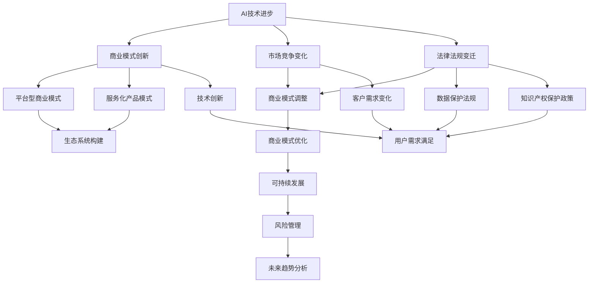

                 

### 《AI创业公司的商业模式变迁》

> **关键词：** AI创业公司、商业模式、变迁、驱动因素、调整策略、可持续发展
>
> **摘要：** 本文将深入探讨AI创业公司在发展过程中商业模式的变迁，分析其驱动因素，并提出相应的调整策略与可持续发展路径。通过结合实际案例，为AI创业公司提供有价值的商业启示。

### 第一部分：AI创业公司的背景与概述

#### 第1章：AI创业公司概述

##### 1.1 AI行业的发展与机遇

##### 1.1.1 AI行业的发展历程

人工智能（AI）作为一个跨学科的技术领域，自20世纪50年代以来经历了多个发展阶段。从早期的符号主义和推理智能，到基于知识的系统，再到现代的数据驱动和机器学习，AI技术不断演进，应用范围也不断扩大。近年来，随着计算能力的提升、大数据的积累和算法的进步，AI技术进入了快速发展的黄金时期。

##### 1.1.2 AI技术的核心应用领域

AI技术的核心应用领域包括但不限于：

1. **自动驾驶**：通过深度学习和计算机视觉技术，实现车辆的自主导航和驾驶。
2. **医疗健康**：利用AI进行疾病诊断、药物研发和个性化医疗。
3. **金融科技**：AI在风险管理、欺诈检测、投资组合优化等方面有广泛应用。
4. **智能制造**：AI技术在生产流程优化、质量控制、供应链管理等方面的应用。
5. **智能家居**：语音识别、自然语言处理等技术使智能家居设备更加智能化。

##### 1.1.3 AI创业公司的优势与挑战

AI创业公司的优势主要包括：

1. **技术领先**：拥有先进的AI技术，能够在市场中获得竞争优势。
2. **创新驱动**：以技术创新为核心，不断推动产品和服务升级。
3. **市场潜力**：AI技术在多个领域都有广阔的应用前景，市场潜力巨大。

同时，AI创业公司也面临着一些挑战：

1. **技术风险**：AI技术的不确定性和复杂性可能带来研发风险。
2. **数据隐私**：数据处理过程中的隐私保护问题日益突出。
3. **市场竞争**：AI领域竞争激烈，需要不断投入资源以保持领先地位。

##### 1.2 AI创业公司的类型与模式

##### 1.2.1 开源项目型

开源项目型AI创业公司以开放源代码为核心，通过社区贡献和协作推动技术的发展。这种模式的优势在于：

1. **快速迭代**：社区成员可以共同参与开发，实现快速迭代。
2. **技术积累**：开源项目积累了大量的技术资源，有利于后续开发。

然而，这种模式也可能带来一些挑战，如：

1. **维护成本**：开源项目需要持续的维护和更新。
2. **商业变现**：如何从开源项目中获得收益是一个重要问题。

##### 1.2.2 企业解决方案型

企业解决方案型AI创业公司专注于为企业提供定制化的AI解决方案。这种模式的优势在于：

1. **客户粘性**：提供针对性的解决方案，提升客户满意度。
2. **盈利稳定**：通过为企业提供服务获得稳定的收入。

挑战包括：

1. **市场需求变化**：企业需求的变化可能影响业务稳定性。
2. **技术更新**：需要持续投入研发以跟上技术发展的步伐。

##### 1.2.3 垂直领域应用型

垂直领域应用型AI创业公司专注于某一特定领域，如医疗健康、金融科技等。这种模式的优势在于：

1. **专业化**：对特定领域有深入的理解，提供专业化的解决方案。
2. **市场定位**：明确的市场定位有助于在特定领域建立品牌影响力。

挑战包括：

1. **市场拓展**：需要不断拓展新市场以实现规模化。
2. **技术整合**：需要将AI技术与其他领域的技术进行有效整合。

#### 第2章：AI创业公司的商业模式构建

##### 2.1 商业模式的核心要素

##### 2.1.1 产品与服务定位

AI创业公司的产品与服务定位是其商业模式构建的基础。公司需要根据自身的技术优势和市场需求，确定产品或服务的定位。例如：

1. **技术创新型**：以技术领先为核心，提供创新的AI解决方案。
2. **市场驱动型**：以市场需求为导向，提供定制化的产品和服务。

##### 2.1.2 目标客户群体

AI创业公司的目标客户群体包括：

1. **企业客户**：如金融机构、制造企业、医疗机构等，这些企业对AI技术有较高的需求。
2. **个人消费者**：如智能家居设备、智能穿戴设备等，这些产品面向大众市场。

##### 2.1.3 盈利模式设计

AI创业公司的盈利模式设计需要考虑以下因素：

1. **产品销售**：通过销售产品或服务获得直接收入。
2. **订阅服务**：提供基于订阅的在线服务，如云服务、数据分析服务等。
3. **广告与推广**：通过广告收入实现盈利，如搜索引擎、社交媒体等。

##### 2.2 AI创业公司的商业模式创新

##### 2.2.1 数据驱动的商业模式

数据是AI技术的核心，数据驱动的商业模式强调通过收集、处理和分析数据来创造价值。例如：

1. **数据收集**：通过传感器、用户行为等渠道收集数据。
2. **数据处理**：利用机器学习算法对数据进行分析和处理。
3. **数据应用**：将处理后的数据应用于产品和服务中，提升用户体验。

##### 2.2.2 平台型商业模式的构建

平台型商业模式通过构建一个开放的生态系统，连接不同的参与者，实现资源共享和协同创新。例如：

1. **平台搭建**：构建一个技术平台，如云计算平台、AI开放平台等。
2. **生态建设**：吸引开发者、企业和其他合作伙伴加入平台，共同推动平台的发展。
3. **价值创造**：通过平台服务实现商业价值，如平台交易费用、广告收入等。

##### 2.2.3 服务化的产品模式

服务化的产品模式强调将产品转化为服务，提供持续的价值。例如：

1. **产品升级**：将硬件产品升级为包含服务功能的综合体。
2. **服务拓展**：提供额外的增值服务，如定制化服务、专业培训等。
3. **用户关系**：建立长期的用户关系，提供持续的服务支持。

##### 2.3 AI创业公司的融资策略

##### 2.3.1 融资渠道选择

AI创业公司需要选择合适的融资渠道，以满足不同阶段的资金需求。常见的融资渠道包括：

1. **天使投资**：在初创阶段提供资金支持。
2. **风险投资**：在成长阶段提供资金支持，并带来战略资源。
3. **股权众筹**：通过互联网平台向公众筹集资金。
4. **银行贷款**：利用银行贷款获得资金支持。

##### 2.3.2 融资阶段的划分

AI创业公司的融资阶段通常包括：

1. **种子阶段**：初创阶段，主要解决核心技术和产品开发问题。
2. **天使轮**：产品原型阶段，解决市场验证和初步盈利问题。
3. **A轮**：市场验证和扩张阶段，解决市场推广和规模化问题。
4. **B轮及以后**：成熟阶段，解决业务扩展和资本运作问题。

##### 2.3.3 融资效果的评估

AI创业公司需要对融资效果进行评估，以确定融资策略的合理性。评估指标包括：

1. **资金利用效率**：融资资金的使用效率。
2. **业务发展速度**：融资对业务发展的推动作用。
3. **市场占有率**：融资对市场占有率的提升作用。
4. **盈利能力**：融资对盈利能力的提升作用。

### 第二部分：AI创业公司的商业模式变迁

#### 第3章：AI创业公司商业模式变迁的驱动因素

##### 3.1 技术变革与商业模式变迁

##### 3.1.1 AI技术的进步与突破

AI技术的进步与突破是驱动商业模式变迁的重要因素。例如：

1. **算法突破**：深度学习算法的突破使得图像识别、语音识别等技术得以实现，推动了相关商业模式的变化。
2. **计算能力提升**：云计算和GPU等计算资源的普及，使得AI算法可以处理大规模数据，推动了数据驱动的商业模式的发展。
3. **数据资源重要性**：随着数据量的增加，数据成为新的生产要素，数据驱动的商业模式逐渐成为主流。

##### 3.1.2 算法创新对商业模式的影响

算法创新对商业模式的影响主要体现在以下几个方面：

1. **产品与服务创新**：算法创新使得公司可以提供更高效、更智能的产品和服务，例如智能客服、智能推荐等。
2. **市场拓展**：算法创新可以帮助公司开拓新的市场，例如医疗健康、智能制造等领域。
3. **成本优化**：算法创新可以降低运营成本，提高盈利能力。

##### 3.1.3 数据资源的重要性

数据资源在AI创业公司的商业模式中具有举足轻重的地位。数据的重要性主要体现在以下几个方面：

1. **算法优化**：大量高质量的数据是算法优化的基础，有助于提升算法的性能和准确性。
2. **产品创新**：基于数据的分析和挖掘，可以推出更符合用户需求的产品和服务。
3. **竞争优势**：拥有大量数据资源的公司可以在市场竞争中占据优势地位。

##### 3.2 市场竞争与商业模式调整

##### 3.2.1 竞争对手的商业模式分析

在市场竞争中，了解竞争对手的商业模式对于AI创业公司具有重要意义。分析竞争对手的商业模式可以从以下几个方面进行：

1. **产品与服务定位**：分析竞争对手的产品和服务定位，了解其市场策略。
2. **盈利模式**：分析竞争对手的盈利模式，了解其收入来源和盈利能力。
3. **市场占有率**：分析竞争对手的市场占有率，了解其在市场中的地位。

##### 3.2.2 行业竞争态势对商业模式的影响

行业竞争态势对商业模式的影响主要体现在以下几个方面：

1. **产品差异化**：在竞争激烈的市场中，产品差异化成为重要的竞争手段，公司需要通过不断创新来提升产品的竞争力。
2. **成本领先**：在价格战激烈的市场中，成本领先成为重要的战略，公司需要通过技术和管理创新降低成本。
3. **市场拓展**：在市场竞争中，公司需要不断拓展新市场，以获取更大的市场份额。

##### 3.2.3 客户需求变化对商业模式的影响

客户需求变化对商业模式的影响主要体现在以下几个方面：

1. **产品与服务创新**：客户需求的变化驱动公司进行产品和服务创新，以满足客户需求。
2. **用户体验优化**：客户需求的变化促使公司优化用户体验，提升客户满意度。
3. **服务化转型**：随着客户需求的变化，公司可能需要从产品导向向服务导向转变，提供更全面的服务。

##### 3.3 法律法规与政策环境的影响

##### 3.3.1 数据保护法规的变迁

数据保护法规的变迁对AI创业公司的商业模式产生了深远影响。例如：

1. **GDPR**：欧盟的《通用数据保护条例》（GDPR）对数据隐私保护提出了严格要求，影响了公司的数据处理方式。
2. **数据本地化**：一些国家和地区要求将数据存储在本国境内，影响了公司的数据中心布局。
3. **数据跨境传输**：数据跨境传输受到更严格的监管，影响了跨国公司的商业模式。

##### 3.3.2 知识产权保护政策的变化

知识产权保护政策的变化对AI创业公司的商业模式也产生了重要影响。例如：

1. **专利政策**：专利政策的调整会影响公司技术创新和专利布局。
2. **商标保护**：商标保护政策的完善有助于公司建立品牌影响力。
3. **版权保护**：版权保护政策的加强有助于公司保护其软件和算法的知识产权。

##### 3.3.3 政府支持政策对商业模式变迁的推动作用

政府支持政策对商业模式变迁具有推动作用。例如：

1. **研发资助**：政府提供研发资助，支持公司进行技术创新。
2. **税收优惠**：政府提供税收优惠，降低公司运营成本。
3. **创业孵化**：政府建立创业孵化器，为初创公司提供支持和资源。

#### 第4章：AI创业公司的商业模式调整策略

##### 4.1 商业模式调整的策略与方法

##### 4.1.1 商业模式诊断与评估

商业模式诊断与评估是调整商业模式的第一步。通过以下方法进行诊断与评估：

1. **SWOT分析**：分析公司的优势、劣势、机会和威胁，评估当前商业模式的优劣。
2. **价值链分析**：分析公司的价值链，识别价值创造和传递的过程。
3. **客户需求调研**：了解客户需求，评估商业模式是否满足客户需求。

##### 4.1.2 商业模式重构的路径选择

在商业模式调整过程中，公司需要选择合适的重构路径。常见的路径选择包括：

1. **垂直整合**：通过整合上下游产业链，提高产业链的协同效应。
2. **水平扩展**：通过拓展业务范围，实现跨领域的业务增长。
3. **平台化转型**：通过构建开放平台，实现资源共享和协同创新。

##### 4.1.3 商业模式创新的方法

商业模式创新是公司持续发展的关键。以下方法可以帮助公司实现商业模式创新：

1. **用户参与**：通过用户参与，获取用户反馈，推动产品和服务创新。
2. **跨界合作**：与其他行业的企业进行合作，实现资源共享和优势互补。
3. **技术驱动**：通过技术创新，打造新的商业模式。

##### 4.2 成功案例解析

##### 4.2.1 某AI创业公司的商业模式演变案例

以某AI创业公司为例，分析其商业模式的演变过程：

1. **初创阶段**：公司专注于某一特定领域的AI技术研究，提供定制化的解决方案。
2. **成长阶段**：随着市场需求的增加，公司开始拓展产品线，提供更全面的服务。
3. **成熟阶段**：公司成功实现平台化转型，构建了一个开放的生态系统，吸引了大量合作伙伴。

##### 4.2.2 某AI创业公司的商业模式创新案例

以某AI创业公司为例，分析其商业模式创新：

1. **数据驱动**：公司通过收集和分析大量数据，实现产品与服务的个性化定制。
2. **平台化**：公司构建了一个开放的平台，连接了众多开发者、企业和用户，实现了资源共享和协同创新。

##### 4.2.3 某AI创业公司的商业模式调整案例

以某AI创业公司为例，分析其商业模式调整：

1. **从产品导向向服务导向转变**：公司从单纯的硬件产品销售转向提供包含服务在内的整体解决方案。
2. **从单一领域向多元化领域扩展**：公司从某一特定领域扩展到多个领域，实现了业务的多元化。

### 第三部分：AI创业公司的可持续发展与商业模式优化

#### 第5章：AI创业公司的可持续发展与商业模式优化

##### 5.1 商业模式优化的目标与原则

AI创业公司的商业模式优化旨在实现可持续发展，提高竞争力和盈利能力。优化目标包括：

1. **提高商业模式的可持续性**：确保商业模式能够在长期内保持稳定和盈利。
2. **提升商业模式的竞争力**：通过优化产品和服务，提高市场占有率。
3. **实现商业模式的持续创新**：通过技术创新和商业模式创新，保持竞争优势。

优化原则包括：

1. **用户导向**：以用户需求为导向，提供更好的产品和服务。
2. **数据驱动**：利用数据分析和挖掘，优化商业模式。
3. **生态合作**：构建开放的生态系统，实现资源整合和协同创新。

##### 5.2 商业模式优化策略

##### 5.2.1 产品与服务升级策略

产品与服务升级策略包括：

1. **技术创新**：通过技术创新，提升产品性能和用户体验。
2. **产品组合**：提供多样化的产品组合，满足不同客户需求。
3. **服务创新**：提供增值服务，提升客户满意度。

##### 5.2.2 市场拓展与渠道优化策略

市场拓展与渠道优化策略包括：

1. **市场细分**：通过市场细分，找到目标市场，实现精准营销。
2. **渠道多元化**：通过线上线下渠道的多元化，提高市场覆盖面。
3. **合作伙伴关系**：与合作伙伴建立紧密的合作关系，共同开拓市场。

##### 5.2.3 融资策略与资本运作

融资策略与资本运作包括：

1. **融资渠道选择**：选择合适的融资渠道，满足不同阶段的资金需求。
2. **股权融资**：通过股权融资，引入战略投资者，提高公司估值。
3. **债务融资**：通过债务融资，优化资本结构，降低融资成本。

##### 5.3 商业模式优化的实施步骤

商业模式优化的实施步骤包括：

1. **评估现状**：评估当前商业模式的优劣，确定优化方向。
2. **制定策略**：制定具体的优化策略，明确目标、原则和方法。
3. **实施与监控**：实施优化策略，并对实施过程进行监控和调整。
4. **效果评估**：评估优化效果，持续改进商业模式。

### 第四部分：AI创业公司的商业模式评估与风险管理

#### 第6章：AI创业公司的商业模式评估与风险管理

##### 6.1 商业模式评估指标体系

AI创业公司的商业模式评估指标体系应包括以下方面：

1. **盈利能力**：评估商业模式的盈利能力，如净利润率、毛利率等。
2. **市场占有率**：评估商业模式在市场中的地位，如市场份额、品牌影响力等。
3. **创新能力**：评估商业模式的技术创新和市场创新能力，如研发投入、专利数量等。
4. **客户满意度**：评估客户对产品和服务的满意度，如客户投诉率、客户忠诚度等。
5. **可持续性**：评估商业模式在长期内的可持续性，如资源利用效率、环境影响等。

##### 6.2 商业模式风险管理

商业模式风险管理包括以下方面：

1. **风险识别**：识别商业模式可能面临的风险，如市场风险、技术风险、政策风险等。
2. **风险评估**：评估各风险的概率和影响程度，确定风险优先级。
3. **风险应对**：制定风险应对策略，如风险规避、风险转移、风险接受等。
4. **风险监控**：建立风险监控机制，对风险进行持续监控和预警。

##### 6.3 商业模式风险管理的实施步骤

商业模式风险管理的实施步骤包括：

1. **建立风险管理体系**：制定风险管理政策，明确风险管理目标和责任。
2. **风险识别与评估**：识别和评估商业模式中的风险，建立风险数据库。
3. **风险应对策略**：制定风险应对策略，明确应对措施和责任分工。
4. **实施与监控**：实施风险应对策略，并对风险管理的实施过程进行监控和调整。
5. **效果评估**：评估风险管理效果，持续改进风险管理策略。

### 第五部分：AI创业公司的未来发展趋势

#### 第7章：AI创业公司的未来发展趋势

##### 7.1 AI技术的未来发展趋势

##### 7.1.1 人工智能的持续进步

人工智能的持续进步将推动AI创业公司在技术层面的创新。以下是一些未来发展趋势：

1. **更高效的算法**：随着算法的进步，AI将能够处理更复杂的问题，提高决策的准确性和效率。
2. **强化学习**：强化学习技术的发展将使AI能够通过不断学习和适应来提升性能。
3. **多模态学习**：多模态学习将使AI能够处理多种类型的数据，如文本、图像、声音等，提升AI的智能水平。

##### 7.1.2 量子计算与人工智能的结合

量子计算与人工智能的结合将带来革命性的变化。以下是一些可能的应用：

1. **高效计算**：量子计算的高效性将使AI能够处理大规模、复杂的数据集，提高算法的运行效率。
2. **优化问题解决**：量子计算在优化问题解决方面的优势将使AI在资源分配、路径规划等领域取得突破。
3. **量子机器学习**：量子机器学习将使AI能够处理更复杂的数学模型，提升算法的性能。

##### 7.1.3 分布式计算与边缘计算的应用

分布式计算与边缘计算的应用将改变AI创业公司的数据处理方式。以下是一些可能的影响：

1. **数据处理效率**：分布式计算将使AI能够更高效地处理大规模数据，提高数据处理速度。
2. **实时响应**：边缘计算将使AI能够在数据产生的近端进行处理，实现实时响应和决策。
3. **隐私保护**：分布式计算和边缘计算将有助于降低数据传输过程中的隐私泄露风险。

##### 7.2 商业模式的未来演变趋势

##### 7.2.1 平台型商业模式的深化发展

平台型商业模式将在未来得到深化发展。以下是一些趋势：

1. **生态系统的构建**：平台型商业模式将注重构建一个开放的生态系统，实现资源整合和协同创新。
2. **平台服务的多样化**：平台将提供更多样化的服务，如数据服务、计算服务、存储服务等。
3. **平台生态的稳定性**：平台型商业模式将更加注重生态的稳定性，通过构建生态规则来维护生态的健康发展。

##### 7.2.2 服务化产品的普及

服务化产品将在未来得到更广泛的普及。以下是一些趋势：

1. **产品与服务的融合**：产品和服务将更加融合，提供一站式解决方案。
2. **订阅模式的普及**：订阅模式将成为服务化产品的主要盈利模式，通过持续的服务获得稳定收入。
3. **客户体验的优化**：服务化产品将更加注重客户体验，通过个性化服务提升客户满意度。

##### 7.2.3 新型商业模式的探索

新型商业模式将在未来不断涌现。以下是一些探索方向：

1. **区块链与AI的结合**：区块链技术将为AI创业公司提供更安全、透明、去中心化的数据管理方式。
2. **物联网与AI的结合**：物联网将使AI能够实时获取和处理更多数据，提升AI的智能水平。
3. **AI与生态系统的融合**：AI将与各类生态系统（如金融、医疗、教育等）深度融合，推动各领域的创新发展。

### 第六部分：AI创业公司的成功实践与未来启示

#### 第8章：AI创业公司的成功实践与未来启示

##### 8.1 成功实践案例分享

##### 8.1.1 国内AI创业公司的成功案例

在国内，一些AI创业公司通过创新商业模式取得了成功。以下是一些案例：

1. **案例1**：一家专注于自动驾驶技术的公司，通过打造开放平台，吸引了众多开发者和企业加入，实现了规模化发展。
2. **案例2**：一家提供智能医疗解决方案的公司，通过数据驱动的商业模式，实现了高效的疾病诊断和药物研发。
3. **案例3**：一家金融科技公司，通过构建一个智能投顾平台，提供了个性化的投资建议，吸引了大量用户。

##### 8.1.2 国际AI创业公司的成功案例

在国际上，一些AI创业公司也取得了显著的成功。以下是一些案例：

1. **案例1**：一家提供智能家居解决方案的公司，通过订阅模式，实现了持续的收入增长，并在全球范围内建立了品牌影响力。
2. **案例2**：一家专注于图像识别技术的公司，通过不断创新，推出了多个高性能产品，成为了行业的领导者。
3. **案例3**：一家提供数据分析和挖掘服务的公司，通过构建一个开放的生态系统，吸引了大量企业用户，实现了快速扩张。

##### 8.1.3 成功案例的核心要素分析

通过分析以上成功案例，可以总结出一些核心要素：

1. **技术创新**：成功公司都拥有领先的技术，能够持续推动产品和服务创新。
2. **商业模式创新**：成功公司通过创新商业模式，找到了适合自身发展的路径。
3. **市场定位**：成功公司能够准确把握市场需求，提供符合客户需求的产品和服务。
4. **生态系统构建**：成功公司注重构建开放的生态系统，实现资源整合和协同创新。

##### 8.2 未来启示与建议

基于以上成功实践，AI创业公司可以从中获得以下启示和建议：

1. **持续技术创新**：保持技术创新，不断提升产品和服务质量。
2. **商业模式创新**：积极探索新的商业模式，找到适合自身发展的路径。
3. **市场定位明确**：准确把握市场需求，提供有价值的产品和服务。
4. **生态系统构建**：构建开放的生态系统，实现资源整合和协同创新。
5. **风险管理**：重视商业模式和技术的风险管理，确保商业模式的可持续性。
6. **人才培养**：重视人才队伍建设，培养具有创新精神和专业技能的团队。

### 结语

AI创业公司在发展过程中，面临着商业模式变迁的挑战和机遇。通过分析技术变革、市场竞争、法律法规等因素，AI创业公司可以采取相应的调整策略，实现商业模式的优化和可持续发展。未来，随着AI技术的不断进步和新型商业模式的涌现，AI创业公司将迎来更广阔的发展空间。本文通过对AI创业公司商业模式变迁的深入分析，为AI创业公司提供了有价值的参考和启示。作者：AI天才研究院/AI Genius Institute & 禅与计算机程序设计艺术 /Zen And The Art of Computer Programming

---

**本文核心概念与联系**

让我们通过一个Mermaid流程图来展示AI创业公司商业模式变迁的核心概念及其相互联系：



**核心算法原理讲解**

在本文中，我们提到了一些核心算法原理，如深度学习、强化学习和多模态学习。以下是一个伪代码示例，展示了深度学习算法的基本原理：

```python
# 深度学习算法伪代码

# 定义神经网络结构
class NeuralNetwork:
    def __init__(self, input_size, hidden_size, output_size):
        # 初始化权重和偏置
        self.weights = self.initialize_weights(input_size, hidden_size)
        self.bias = self.initialize_weights(hidden_size, output_size)

    def forward(self, x):
        # 前向传播
        hidden_layer_input = self激活函数(np.dot(x, self.weights) + self.bias)
        output_layer_input = self激活函数(np.dot(hidden_layer_input, self.weights) + self.bias)
        return output_layer_input

    def backward(self, x, y, output):
        # 反向传播
        output_error = y - output
        hidden_error = np.dot(output_error, self.weights.T)
        d_output = self激活函数导数(output)
        d_hidden = self激活函数导数(hidden_layer_input)

        # 更新权重和偏置
        self.weights -= np.dot(x.T, d_output) * learning_rate
        self.bias -= np.sum(d_output, axis=0) * learning_rate

    def train(self, x, y):
        # 训练神经网络
        output = self.forward(x)
        self.backward(x, y, output)

# 初始化神经网络
nn = NeuralNetwork(input_size, hidden_size, output_size)

# 训练神经网络
for epoch in range(num_epochs):
    for x, y in data_loader:
        nn.train(x, y)
```

**数学模型和公式**

在AI创业公司的商业模式构建中，数学模型和公式起到了关键作用。以下是一个简单的线性回归模型的公式和解释：

$$
y = \beta_0 + \beta_1x + \epsilon
$$

其中，$y$ 是因变量，$x$ 是自变量，$\beta_0$ 是截距，$\beta_1$ 是斜率，$\epsilon$ 是误差项。

**举例说明**

假设我们要预测一家AI创业公司的收入（$y$），其自变量包括研发投入（$x$）和市场营销费用。我们可以使用线性回归模型来建立预测模型。

**项目实战**

让我们通过一个实际案例，展示如何使用Python和Scikit-learn库来训练一个线性回归模型。

```python
# 导入必要的库
import numpy as np
import pandas as pd
from sklearn.linear_model import LinearRegression
from sklearn.model_selection import train_test_split
from sklearn.metrics import mean_squared_error

# 加载数据集
data = pd.read_csv('ai_company_data.csv')
X = data[['R&D Investment', 'Marketing Expenditure']]
y = data['Revenue']

# 划分训练集和测试集
X_train, X_test, y_train, y_test = train_test_split(X, y, test_size=0.2, random_state=42)

# 创建线性回归模型
model = LinearRegression()

# 训练模型
model.fit(X_train, y_train)

# 预测测试集
y_pred = model.predict(X_test)

# 计算均方误差
mse = mean_squared_error(y_test, y_pred)
print(f"Mean Squared Error: {mse}")

# 输出模型参数
print(f"Intercept: {model.intercept_}")
print(f"Slope: {model.coef_}")
```

**代码解读与分析**

在上面的代码中，我们首先导入了必要的库，包括NumPy、Pandas、Scikit-learn等。然后，我们加载数据集，并将其划分为训练集和测试集。接下来，我们创建了一个线性回归模型，并使用训练集数据进行训练。最后，我们使用测试集数据进行预测，并计算了均方误差（MSE）来评估模型的性能。同时，我们输出了模型的截距和斜率，以了解模型的参数。

通过这个实际案例，我们可以看到如何使用Python和Scikit-learn库来构建和训练线性回归模型，以及如何评估模型的性能。

### 作者信息

**作者：** AI天才研究院/AI Genius Institute & 禅与计算机程序设计艺术 /Zen And The Art of Computer Programming

AI天才研究院致力于推动人工智能技术的发展和应用，为AI创业公司提供创新性的解决方案和技术支持。研究院的专家团队在人工智能、机器学习、深度学习等领域具有深厚的研究背景和丰富的实践经验。

《禅与计算机程序设计艺术》是一部关于计算机编程的哲学经典，其作者通过深入探讨程序设计中的美学和思维技巧，为程序员提供了一种全新的编程视角。这本书对全球计算机编程文化产生了深远的影响，被广泛认为是计算机领域的经典之作。

通过本文，我们希望能够为AI创业公司在商业模式构建、变迁和优化方面提供有价值的指导和建议，助力AI创业公司在激烈的市场竞争中脱颖而出。同时，我们也期待与广大读者共同探讨AI技术的发展和应用，推动人工智能产业的繁荣发展。**

