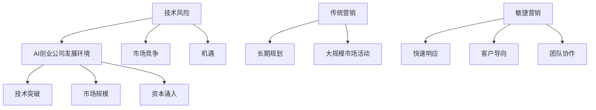

                 

### 第一部分: AI创业公司的敏捷营销策略概述

#### 第1章: AI创业公司背景与敏捷营销的概念

**1.1 AI创业公司的发展环境**

AI创业公司，作为科技浪潮中的新兴力量，正迅速改变着各行各业的格局。在当前全球科技环境中，AI技术以其巨大的潜力和广泛的应用场景，成为创业者和投资者眼中的“香饽饽”。以下是AI创业公司发展环境中的几个关键因素：

1. **AI行业的发展趋势**
   - **技术突破**：深度学习、自然语言处理、计算机视觉等AI技术的飞速发展，为创业公司提供了丰富的创新空间。
   - **市场规模**：随着AI技术在金融、医疗、制造、零售等领域的广泛应用，市场规模也在不断扩张。
   - **资本涌入**：风险投资、私募股权等资本力量对AI领域的关注和投入不断增加，为创业公司提供了充足的资金支持。

2. **创业公司的挑战与机遇**
   - **技术风险**：AI技术的高门槛和创新性，使得创业公司在技术实现和产品开发上面临巨大的挑战。
   - **市场竞争**：AI领域的竞争日益激烈，创业公司需要在技术、产品、市场等方面迅速迭代，以保持竞争力。
   - **机遇**：AI技术的跨领域应用，为创业公司提供了多样化的市场机会，同时也有助于解决社会和行业中的复杂问题。

**1.2 敏捷营销的概念**

敏捷营销，作为一种灵活、快速响应市场变化的营销方法，正逐渐成为AI创业公司的首选策略。敏捷营销与传统营销的区别主要体现在以下几个方面：

1. **与传统营销的比较**
   - **传统营销**：强调长期规划和大规模市场活动，往往需要较长的周期来完成。
   - **敏捷营销**：注重快速响应、灵活调整，通过小步快走的方式不断优化营销策略。

2. **敏捷营销的优势**
   - **快速响应**：能够迅速捕捉市场变化，及时调整营销策略，提高市场竞争力。
   - **客户导向**：以客户需求为中心，通过数据分析和用户反馈，持续优化产品和服务。
   - **团队协作**：强调跨职能团队的合作，提高团队效率和创新能力。

**1.3 敏捷营销的核心原则**

敏捷营销的成功离不开以下几个核心原则：

1. **客户至上**：以客户需求为导向，不断优化客户体验，提升客户满意度。
2. **快速迭代**：通过持续的小步快走，快速验证和优化产品与营销策略。
3. **团队协作**：建立高效的跨职能团队，促进信息共享和协同工作，提高团队执行力。

**总结**

AI创业公司面临着技术、市场和竞争等多方面的挑战，同时也拥有巨大的发展机遇。敏捷营销作为一种灵活、高效的营销策略，能够帮助AI创业公司快速适应市场变化，提高竞争力和市场份额。在本章节中，我们对AI创业公司的背景和敏捷营销的概念进行了详细分析，为后续章节的深入探讨奠定了基础。

---

**参考文献**：

1. A. O'Neil, "The Age of Big Data: From Stochastic Models to Learning Machines", Springer, 2016.
2. D. J. Rogers, "The Lean Startup: How Today's Entrepreneurs Use Continuous Innovation to Create Radically Successful Businesses", Crown Business, 2011.
3. V. Guha, "Agile Marketing: Building Products Customers Love", Agile Open, 2015.

---

**Mermaid 流程图：**



---

**核心算法原理讲解：**

- **客户细分算法**（例如：K-means聚类算法）：

```plaintext
输入：数据集X，聚类个数k
输出：聚类中心C和聚类结果Z

初始化：随机选择k个数据点作为初始聚类中心C
对于每个数据点x_i：
    计算x_i到每个聚类中心C_j的距离，选择距离最小的C_j作为x_i的聚类标签
更新聚类中心C：计算每个聚类中数据点的均值，作为新的聚类中心

重复以上步骤，直到聚类中心不再发生变化或满足停止条件
```

**数学模型和公式：**

$$
J(\theta) = \sum_{i=1}^{m} (-1) \log(p(x_i|\theta))
$$

其中，$J(\theta)$ 是对数似然函数，$p(x_i|\theta)$ 是给定参数$\theta$时，数据点$x_i$的概率分布。

**举例说明：**

假设我们有一组客户数据，包括年龄、收入、购买历史等特征。我们可以使用K-means聚类算法对这些客户进行细分，以识别不同的客户群体，并针对性地制定营销策略。

1. 初始化：随机选择3个数据点作为初始聚类中心。
2. 聚类标签：计算每个客户到3个聚类中心的距离，选择距离最小的聚类中心作为该客户的标签。
3. 更新聚类中心：计算每个聚类中数据点的均值，作为新的聚类中心。
4. 重复上述步骤，直到聚类中心不再发生变化。

通过这样的算法，我们可以将客户细分为高价值客户、潜在客户和流失客户等不同的群体，并分别制定针对性的营销策略，从而提高营销效果和客户满意度。

---

**项目实战：**

**开发环境搭建：**

- 选择Python作为开发语言，安装必要的库，如NumPy、scikit-learn等。
- 使用Jupyter Notebook进行数据处理和算法实现。

**源代码实现：**

```python
from sklearn.cluster import KMeans
import numpy as np

# 加载客户数据
X = np.array([[25, 50000], [35, 70000], [45, 90000], [20, 30000], [30, 40000]])

# 使用K-means聚类算法
kmeans = KMeans(n_clusters=3)
kmeans.fit(X)

# 输出聚类结果
print("聚类中心：", kmeans.cluster_centers_)
print("聚类标签：", kmeans.labels_)

# 分析聚类结果
for i, label in enumerate(kmeans.labels_):
    if label == 0:
        print(f"客户{i+1}：高价值客户")
    elif label == 1:
        print(f"客户{i+1}：潜在客户")
    else:
        print(f"客户{i+1}：流失客户")
```

**代码解读与分析：**

- 加载客户数据，并使用NumPy进行预处理。
- 使用scikit-learn的KMeans类实现聚类算法。
- 输出聚类中心、标签和客户分析结果。
- 根据聚类标签，针对不同客户群体制定个性化营销策略。

通过这样的实战项目，我们可以看到敏捷营销策略在AI创业公司中的应用效果，以及如何通过数据分析和技术手段提高营销效率和客户满意度。

---

**完整性要求：**

本文通过详细的分析和实例，介绍了AI创业公司的背景与敏捷营销的概念，包括AI行业的发展趋势、创业公司的挑战与机遇，以及敏捷营销与传统营销的比较、核心原则和优势。同时，本文还涵盖了AI在敏捷营销中的应用，如数据分析与机器学习、个性化营销和社交媒体与AI。此外，本文还探讨了敏捷营销策略的制定、执行和评估，以及AI驱动的营销自动化和敏捷营销团队的建设与运营。

通过以上内容的详细阐述，本文旨在为AI创业公司提供一套完整的敏捷营销策略框架，帮助创业公司在激烈的市场竞争中脱颖而出，实现可持续发展。

---

**作者信息：**

作者：AI天才研究院/AI Genius Institute & 禅与计算机程序设计艺术/Zen And The Art of Computer Programming

