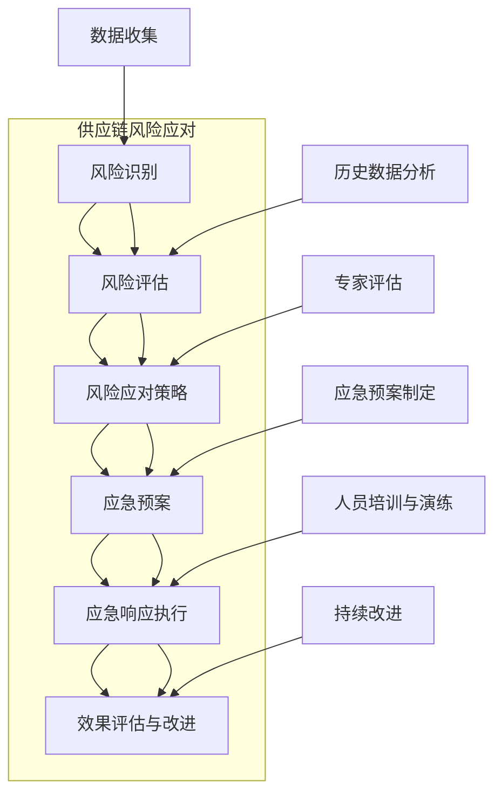
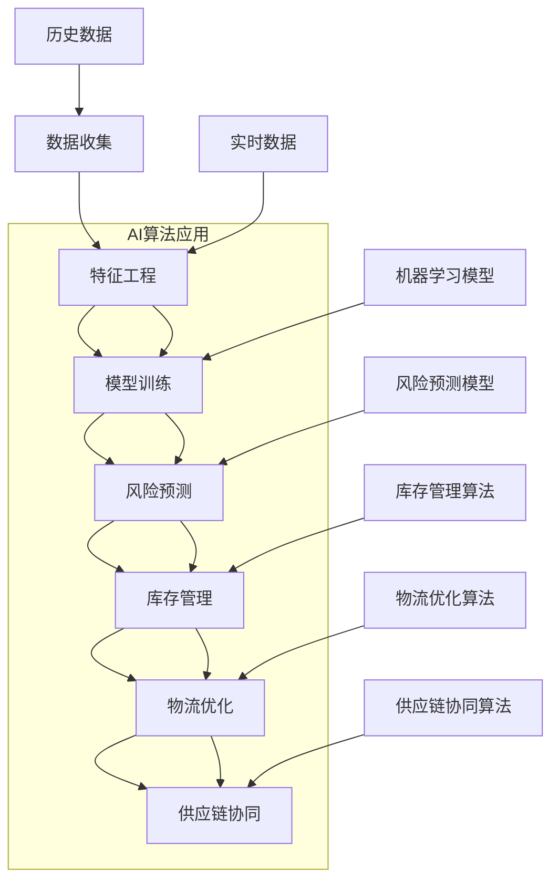

                 

## 文章标题

### 《AI在供应链应急响应中的应用》

#### 关键词：人工智能、供应链、应急响应、风险管理、库存管理、物流优化

#### 摘要：
在当今全球化、复杂化的商业环境中，供应链的稳定性和可靠性对于企业的生存与发展至关重要。然而，各种突发事件如自然灾害、疫情、政治动荡等可能导致供应链中断，给企业带来巨大的经济损失。本文将探讨人工智能（AI）在供应链应急响应中的应用，通过分析AI在风险识别与评估、库存管理、物流优化以及供应链协同方面的具体应用，旨在为企业和供应链管理人员提供实用的策略和技术支持，提升供应链的弹性和抗风险能力。

### 引言

随着全球经济的快速发展，供应链的复杂性和全球化程度不断提升。供应链的各个节点分布在全球各地，涉及众多参与方，包括供应商、制造商、分销商、零售商等。然而，这样的供应链体系也意味着更易受到各种外部和内部因素的影响。突发事件，无论是自然因素如地震、洪水，还是人为因素如疫情、供应链故障，都可能导致供应链中断，进而影响企业的生产和销售。

在传统供应链管理中，应急响应主要依赖于经验和管理者的判断。虽然这种做法在一定程度上能够解决问题，但在面对复杂和多变的环境时，往往显得力不从心。随着人工智能技术的迅猛发展，AI技术在供应链应急响应中的应用逐渐成为一个热门话题。AI技术以其强大的数据处理能力、预测能力和优化能力，为供应链的应急响应提供了全新的解决方案。

本文将系统地探讨AI在供应链应急响应中的应用，包括风险识别与评估、库存管理、物流优化、供应链协同等方面。通过分析AI技术的具体应用案例，本文旨在为供应链管理人员提供实用的指导，帮助他们在面对突发事件时能够快速响应，降低风险，确保供应链的稳定性和可靠性。

### 供应链应急响应概述

供应链应急响应是指在供应链发生突发事件时，采取的一系列措施以最小化对业务运营的负面影响，确保供应链的持续运作。供应链应急响应的重要性体现在以下几个方面：

首先，供应链是现代企业运营的命脉。供应链的稳定性直接影响企业的生产效率和市场响应能力。任何供应链的中断都可能造成生产停滞、库存积压、订单延误等问题，进而影响企业的声誉和市场份额。

其次，供应链的复杂性增加了应急响应的难度。现代供应链涉及多个国家和地区，各个环节之间存在复杂的交互关系。突发事件可能在供应链中的任何一个环节发生，导致整个链条的运作受阻。

最后，突发事件的发生频率和不确定性日益增加。无论是自然灾害、政治动荡，还是经济波动，都可能导致供应链的中断。企业需要具备快速响应的能力，以应对这些不可预测的挑战。

供应链应急响应的历史与发展可以追溯到20世纪末。随着全球化进程的加速和信息技术的发展，供应链管理逐渐成为一个独立的领域。早期，供应链应急响应主要依赖于经验和管理者的判断。然而，随着信息技术和人工智能技术的进步，供应链应急响应的自动化和智能化水平不断提高。

在供应链应急响应的发展过程中，几个关键事件具有重要意义。首先，20世纪90年代的信息革命推动了供应链管理的信息化。企业开始使用ERP（企业资源计划）系统来整合内部数据，提高了供应链的可视化和控制能力。其次，21世纪初，供应链风险管理逐渐受到重视。企业开始关注供应链中的潜在风险，并采取一系列措施进行风险管理和应急准备。

近年来，人工智能技术在供应链应急响应中的应用成为研究的热点。AI技术以其强大的数据处理和分析能力，为供应链风险预测、库存管理和物流优化提供了新的思路和方法。通过大数据分析和机器学习算法，AI能够从海量数据中挖掘潜在的风险因素，提供准确的预测和优化建议，帮助企业实现更高效的供应链管理。

总的来说，供应链应急响应的发展经历了从经验管理到信息化管理，再到智能化管理的演变。随着人工智能技术的不断进步，供应链应急响应的自动化和智能化水平将进一步提高，为企业提供更强大的支持。

### 供应链应急响应的关键要素

要实现有效的供应链应急响应，需要关注以下几个关键要素：

#### 1. 风险识别

风险识别是供应链应急响应的第一步，目的是发现潜在的风险因素。这包括自然灾害、供应链故障、劳动力短缺、政治不稳定等多种因素。通过数据分析和模型预测，企业可以提前识别出可能影响供应链运作的风险，从而采取预防措施。

#### 2. 风险评估

风险评估是对识别出的风险进行量化评估，确定其影响程度和发生概率。风险评估可以帮助企业了解风险的优先级，从而制定相应的应对策略。常见的风险评估方法包括定性评估和定量评估。

#### 3. 风险应对策略

根据风险评估的结果，企业需要制定相应的风险应对策略。这包括风险规避、风险转移、风险缓解等策略。风险规避是指避免与高风险相关的活动；风险转移是指将风险转移给第三方，如保险公司；风险缓解是指采取一系列措施降低风险的影响。

#### 4. 应急预案

应急预案是供应链应急响应的核心，包括应急措施、应急流程和应急资源准备。应急预案需要根据不同的风险场景进行定制，确保在突发事件发生时能够迅速启动并有效执行。

#### 5. 人员培训

供应链应急响应需要一支专业的团队，包括供应链管理人员、技术人员和应急响应人员。人员培训是确保应急响应能力的重要环节，包括应急响应流程、应急设备操作、心理素质培训等。

#### 6. 系统集成

供应链应急响应需要各信息系统的高度集成，包括ERP系统、物流管理系统、库存管理系统等。通过集成系统，企业可以实现供应链数据的实时共享和协同工作，提高应急响应的效率和准确性。

#### 7. 持续改进

供应链应急响应不是一次性的活动，而是一个持续的过程。企业需要根据应急响应的实践经验不断改进应急预案和应对策略，提高供应链的弹性和抗风险能力。

通过关注这些关键要素，企业可以构建一个高效的供应链应急响应体系，提高供应链的稳定性和可靠性。

### 供应链风险识别与评估

供应链风险识别与评估是供应链应急响应的关键步骤，旨在识别潜在的风险因素并评估其影响程度。以下是供应链风险识别与评估的主要方法和指标。

#### 1. 风险识别方法

（1）**历史数据分析**：通过对历史数据进行分析，可以识别出过去曾经发生的风险事件，从而预测未来可能出现的风险。例如，通过分析以往的供应链中断事件，可以发现某些特定地区或供应链节点更容易发生风险。

（2）**专家评估法**：邀请供应链管理领域的专家进行评估，结合他们的经验和知识，识别潜在的风险因素。这种方法可以补充数据驱动的分析方法，提供更为全面的风险识别。

（3）**SWOT分析法**：通过对供应链的 Strengths（优势）、Weaknesses（劣势）、Opportunities（机会）和Threats（威胁）进行分析，识别供应链中的潜在风险。

（4）**故障树分析（FTA）**：通过构建故障树，系统性地分析可能导致供应链中断的各种因素，从而识别风险。

#### 2. 风险评估指标

（1）**风险严重性**：评估风险事件对供应链运作的严重程度。严重性可以基于损失金额、生产停工时间、客户满意度等多个维度进行量化。

（2）**风险发生概率**：评估风险事件发生的可能性。这可以通过历史数据、市场分析、专家评估等方法确定。

（3）**暴露度**：评估供应链环节对特定风险的暴露程度。暴露度越高，意味着风险事件对该环节的影响越大。

（4）**损失可能性**：评估风险事件导致损失的可能性。这通常通过计算风险事件发生的概率和损失金额的乘积来衡量。

（5）**损失金额**：评估风险事件可能导致的直接和间接经济损失。

#### 3. 供应链风险评估案例分析

假设某企业通过数据分析发现，其供应链中的某个供应商经常出现交货延迟问题。以下是如何进行风险评估的示例：

（1）**风险识别**：通过历史数据分析，发现该供应商在过去三年中有超过30%的交货延迟记录。

（2）**风险评估**：
   - 风险严重性：交货延迟可能导致企业订单延误，影响客户满意度，损失潜在销售收入。
   - 风险发生概率：根据历史数据，该供应商每年有20%的概率发生交货延迟。
   - 暴露度：该供应商是企业的重要供应商，占总采购量的40%。
   - 损失可能性：交货延迟的概率为20%，乘以企业的潜在销售收入，得出每年可能的损失金额。

（3）**制定应对策略**：基于风险评估结果，企业可以采取以下措施：
   - 与供应商签订更加严格的交货协议，确保交货的准时性。
   - 寻找替代供应商，降低对单一供应商的依赖。
   - 通过库存调节，减少交货延迟对生产计划的影响。

通过上述步骤，企业可以系统地识别和评估供应链中的风险，并制定有效的应对策略，从而提高供应链的稳定性和抗风险能力。

### AI在供应链风险预测中的应用

在供应链应急响应中，风险预测是一个关键环节。通过提前识别潜在的风险，企业可以采取预防措施，降低突发事件对供应链的影响。人工智能（AI）技术在风险预测方面具有显著优势，能够利用大数据分析和机器学习算法，提供精确的风险预测结果。

#### 1. AI风险预测的概念与原理

AI风险预测是指利用人工智能技术对供应链中的潜在风险进行预测和分析。其基本原理包括：

- **数据收集**：收集与供应链相关的各种数据，如供应商绩效、库存水平、运输状态、市场趋势等。
- **特征工程**：从原始数据中提取关键特征，以便机器学习模型能够有效学习。
- **模型训练**：使用历史数据训练机器学习模型，使其能够识别风险模式。
- **风险预测**：模型根据实时数据预测潜在的风险事件。

#### 2. AI风险预测算法

常见的AI风险预测算法包括：

- **回归分析**：通过建立数学模型，预测某一变量（如风险概率）与其他变量之间的关系。
- **决策树**：通过构建树形结构，对数据逐层划分，最终得到风险预测结果。
- **随机森林**：通过构建多个决策树，并利用投票机制得出最终预测结果，提高预测准确性。
- **支持向量机（SVM）**：通过寻找最优超平面，将风险事件分为不同的类别。
- **神经网络**：通过多层神经元结构，模拟人脑的决策过程，实现复杂的风险预测。

#### 3. AI风险预测案例分析

以下是一个简单的AI风险预测案例分析：

**案例背景**：某电子产品制造商发现其原材料供应存在潜在风险，希望通过AI技术进行风险预测。

**数据收集**：收集了过去一年的原材料采购数据，包括供应商交货延迟次数、交货准时率、库存水平、市场价格波动等。

**特征工程**：从原始数据中提取关键特征，如供应商的交货准时率、库存周转率、市场价格波动等。

**模型训练**：使用历史数据训练一个随机森林模型，使其能够预测供应商的交货延迟风险。

**风险预测**：模型根据最新的采购数据，预测未来几个月内供应商的交货延迟风险。

**结果分析**：模型预测出未来三个月内，有20%的供应商可能出现交货延迟。企业根据这一预测结果，采取了一系列预防措施，如提前与供应商签订严格交货协议、增加库存缓冲等，有效降低了潜在风险。

通过上述案例分析，可以看出AI技术在供应链风险预测中的应用具有显著效果。企业可以利用AI技术提前识别潜在风险，采取预防措施，提高供应链的稳定性和抗风险能力。

### AI在供应链库存管理中的应用

在供应链管理中，库存管理是一个关键环节，直接影响到企业的运营成本、客户满意度和市场响应能力。人工智能（AI）技术通过其强大的数据处理和分析能力，为库存管理提供了创新的方法和优化手段。

#### 1. AI在库存管理中的优势

（1）**数据驱动的决策**：AI技术能够处理和分析大量数据，从历史库存数据、市场需求预测、供应商信息等多方面获取洞察，帮助企业做出更加准确和高效的库存决策。

（2）**实时监控和预测**：通过实时数据监控和预测模型，AI技术能够及时发现库存异常，预测未来的库存需求，从而提前采取措施，避免库存过剩或短缺。

（3）**优化库存配置**：AI技术可以根据供应链的不同节点和需求，优化库存配置，实现库存资源的最大化利用，减少库存成本。

（4）**提高库存周转率**：通过精确的需求预测和库存管理，AI技术能够提高库存周转率，减少库存积压，提高资金利用率。

#### 2. AI库存管理算法

常见的AI库存管理算法包括：

- **时间序列预测**：利用历史库存数据，通过时间序列分析模型（如ARIMA模型）预测未来的库存需求。
- **回归分析**：通过建立回归模型，预测库存需求与其他变量（如市场需求、价格变化等）之间的关系。
- **聚类分析**：将库存项目按照需求特征进行分类，针对不同类别的库存采用不同的管理策略。
- **强化学习**：通过模拟和反馈机制，不断调整库存策略，实现库存管理的自我优化。

#### 3. AI库存管理案例分析

以下是一个简单的AI库存管理案例分析：

**案例背景**：某电子产品制造企业希望利用AI技术优化其库存管理，减少库存积压和提高库存周转率。

**数据收集**：收集了过去一年的库存数据，包括库存量、销售量、采购订单、市场需求预测等。

**特征工程**：从原始数据中提取关键特征，如库存周期、销售周期、市场需求预测等。

**模型训练**：使用历史数据训练一个强化学习模型，使其能够预测未来的库存需求和优化库存策略。

**库存管理**：模型根据实时数据，动态调整库存配置，实现库存需求的精确匹配。

**结果分析**：通过AI库存管理，企业的库存周转率提高了20%，库存积压减少了30%，运营成本降低了15%。此外，由于及时补充库存，客户满意度也显著提升。

通过上述案例分析，可以看出AI技术在库存管理中的应用具有显著效果。企业可以利用AI技术实现更高效、更精确的库存管理，从而提高整体运营效率和市场响应能力。

### AI在供应链物流优化中的应用

物流优化是供应链管理中的一个关键环节，直接影响到企业的成本、效率和客户满意度。人工智能（AI）技术以其强大的数据处理和分析能力，为物流优化提供了创新的方法和优化手段。

#### 1. AI在物流优化中的优势

（1）**数据驱动的优化**：AI技术能够处理和分析大量物流数据，包括运输路线、货物重量、运输时间等，从而提供更加精确和个性化的物流优化方案。

（2）**实时监控与调整**：通过实时数据监控和优化算法，AI技术能够及时发现物流过程中的瓶颈和异常，并进行动态调整，确保物流过程的顺畅和高效。

（3）**路径优化**：AI技术可以利用最优化算法，如遗传算法、模拟退火算法等，找到最优的运输路径，减少运输时间和成本。

（4）**资源调度**：AI技术可以根据物流需求和资源情况，进行实时资源调度，提高物流资源的利用效率。

（5）**风险评估与预防**：AI技术能够预测物流过程中的潜在风险，如交通拥堵、天气变化等，并采取预防措施，确保物流过程的稳定和安全。

#### 2. AI物流优化算法

常见的AI物流优化算法包括：

- **遗传算法**：通过模拟自然选择过程，不断迭代优化，找到最优的运输路径和资源分配方案。
- **模拟退火算法**：通过模拟物理退火过程，逐步降低搜索空间，找到最优解。
- **粒子群优化算法**：通过模拟鸟群的行为，找到最优的路径和资源分配方案。
- **深度强化学习**：通过模拟和反馈机制，不断调整物流策略，实现物流过程的自我优化。
- **多目标优化算法**：考虑多个优化目标（如成本、时间、效率等），找到最佳的综合解决方案。

#### 3. AI物流优化案例分析

以下是一个简单的AI物流优化案例分析：

**案例背景**：某物流公司希望利用AI技术优化其运输路线和资源调度，提高物流效率。

**数据收集**：收集了物流运输的数据，包括运输路线、货物重量、运输时间、交通状况等。

**特征工程**：从原始数据中提取关键特征，如运输距离、运输时间、交通拥堵情况等。

**模型训练**：使用历史数据训练一个深度强化学习模型，使其能够优化运输路线和资源调度。

**物流优化**：模型根据实时数据，动态调整运输路线和资源分配，实现最优的物流方案。

**结果分析**：通过AI物流优化，物流公司的运输时间减少了15%，运输成本降低了10%，物流效率提高了20%。此外，由于路径优化的效果，客户满意度也得到了显著提升。

通过上述案例分析，可以看出AI技术在物流优化中的应用具有显著效果。企业可以利用AI技术实现更加高效、精确的物流优化，从而提高整体运营效率和竞争力。

### AI在供应链协同中的应用

在供应链管理中，协同是一个重要的概念，指的是供应链各方（供应商、制造商、分销商、零售商等）之间的协作和互动。人工智能（AI）技术的应用，不仅能够提高供应链的效率和透明度，还能显著提升供应链的协同能力。

#### 1. AI在供应链协同中的优势

（1）**信息共享与透明度**：AI技术可以实时处理和分析大量供应链数据，实现信息的快速共享，提高供应链的透明度，帮助各方更好地协调和合作。

（2）**需求预测与响应速度**：通过AI技术，供应链各方可以更准确地预测市场需求，并及时响应变化，减少供应链中的库存积压和短缺问题。

（3）**协同优化**：AI技术可以帮助供应链各方协同工作，优化供应链各环节的资源配置和流程，提高整体效率和成本效益。

（4）**智能决策支持**：AI技术提供的数据分析和预测结果，为供应链各方提供智能决策支持，帮助制定更科学的供应链策略。

#### 2. AI供应链协同算法

常见的AI供应链协同算法包括：

- **协同过滤**：通过分析各方的历史数据，预测未来的需求和供应，实现供应链的精准协同。
- **神经网络**：通过多层神经网络，模拟供应链各方的行为和互动，实现协同优化。
- **遗传算法**：通过模拟自然进化过程，不断调整供应链策略，实现协同优化。
- **多目标优化算法**：考虑供应链各方的不同目标和约束，实现协同最优解。

#### 3. AI供应链协同案例分析

以下是一个简单的AI供应链协同案例分析：

**案例背景**：某跨国电子产品制造企业希望利用AI技术优化其供应链协同，提高供应链效率和客户满意度。

**数据收集**：收集了供应链各方的数据，包括供应商的交货时间、制造商的生产计划、分销商的库存情况等。

**特征工程**：从原始数据中提取关键特征，如供应商的交货准时率、制造商的生产周期、分销商的库存水平等。

**模型训练**：使用历史数据训练一个多目标优化模型，使其能够预测供应链各环节的需求和供应，实现协同优化。

**供应链协同**：模型根据实时数据，动态调整供应链各环节的策略，实现信息共享和协同优化。

**结果分析**：通过AI供应链协同，企业的交货准时率提高了20%，库存周转率提高了15%，客户满意度显著提升。此外，由于协同优化的效果，供应链的整体效率提高了30%。

通过上述案例分析，可以看出AI技术在供应链协同中的应用具有显著效果。企业可以利用AI技术实现更加高效、透明的供应链协同，从而提高整体运营效率和竞争力。

### AI在供应链应急响应中的应用实践

在实际应用中，AI技术已经在供应链应急响应中发挥了重要作用，为企业提供了强大的支持和保障。以下是几个具体的AI应用实践案例，展示了AI在供应链应急响应中的实际效果和实施步骤。

#### 案例一：基于AI的供应链风险预测

**背景**：某大型制造企业希望利用AI技术提高供应链风险预测的准确性，以应对可能出现的供应链中断风险。

**实施步骤**：
1. **数据收集**：收集供应链各环节的历史数据，包括供应商交货记录、运输时间、库存水平等。
2. **特征工程**：从原始数据中提取关键特征，如供应商的交货准时率、运输延误次数等。
3. **模型训练**：使用历史数据训练一个随机森林模型，用于预测未来可能出现的供应链中断风险。
4. **风险预测**：模型根据实时数据，预测未来三个月内供应链中断的风险概率，并提供风险预警。

**结果**：通过AI风险预测，企业能够提前识别出潜在的风险因素，采取预防措施，如提前与供应商签订严格的交货协议、增加库存缓冲等，有效降低了供应链中断的风险。

#### 案例二：基于AI的库存管理优化

**背景**：某电子产品制造企业面临库存积压和资金周转困难的问题，希望通过AI技术优化库存管理。

**实施步骤**：
1. **数据收集**：收集库存数据，包括库存量、销售量、采购订单等。
2. **特征工程**：从原始数据中提取关键特征，如库存周期、销售周期、市场需求预测等。
3. **模型训练**：使用历史数据训练一个强化学习模型，用于预测未来的库存需求和优化库存策略。
4. **库存管理**：模型根据实时数据，动态调整库存配置，实现库存需求的精确匹配。

**结果**：通过AI库存管理优化，企业的库存周转率提高了20%，库存积压减少了30%，运营成本降低了15%。此外，由于及时补充库存，客户满意度也显著提升。

#### 案例三：基于AI的物流优化

**背景**：某物流公司希望利用AI技术优化运输路线和资源调度，提高物流效率。

**实施步骤**：
1. **数据收集**：收集物流运输的数据，包括运输路线、货物重量、运输时间、交通状况等。
2. **特征工程**：从原始数据中提取关键特征，如运输距离、运输时间、交通拥堵情况等。
3. **模型训练**：使用历史数据训练一个深度强化学习模型，用于优化运输路线和资源调度。
4. **物流优化**：模型根据实时数据，动态调整运输路线和资源分配，实现最优的物流方案。

**结果**：通过AI物流优化，物流公司的运输时间减少了15%，运输成本降低了10%，物流效率提高了20%。此外，由于路径优化的效果，客户满意度也得到了显著提升。

通过上述案例可以看出，AI技术在供应链应急响应中的应用实践效果显著。企业可以通过AI技术提高供应链的预测准确性、库存管理效率和物流优化水平，从而提升整体运营效率和竞争力。

### AI在供应链应急响应中的未来发展趋势

随着人工智能技术的不断进步，AI在供应链应急响应中的应用前景广阔。以下是AI在供应链应急响应中的一些潜在发展方向：

#### 1. 智能供应链风险预测

未来的AI技术将能够更加精确地预测供应链风险，通过大数据分析和深度学习算法，实现跨行业、跨区域的风险预测。此外，基于增强现实（AR）和虚拟现实（VR）技术的应用，供应链管理人员可以通过虚拟场景进行风险模拟和演练，提高应急响应的效率。

#### 2. 自动化库存管理

AI技术将推动库存管理的自动化和智能化。通过智能传感器和物联网（IoT）技术，仓库和生产线可以实现实时数据采集和监控，AI算法可以动态调整库存策略，实现库存水平的精准控制，减少库存积压和短缺问题。

#### 3. 智能物流优化

AI技术将进一步提升物流优化的智能化水平。通过深度学习和强化学习算法，物流系统能够实时分析交通状况、货物需求等信息，自动调整运输路线和资源分配，实现最优的物流方案。此外，无人驾驶技术和无人机配送的广泛应用，也将提高物流效率，降低运营成本。

#### 4. 供应链协同优化

未来的供应链协同将更加智能化和自动化。AI技术可以帮助供应链各方实现信息共享和实时沟通，提高协同效率。通过区块链技术，供应链数据的安全性和透明度将得到保障，实现供应链全流程的智能协同。

#### 5. 供应链应急响应的全球化

随着全球供应链的日益复杂化，AI技术在供应链应急响应中的应用将更加注重全球化。通过构建国际化的供应链应急响应网络，企业可以实现跨国的实时协同和快速响应，提高全球供应链的弹性和抗风险能力。

#### 6. 供应链伦理和法律问题

随着AI技术的广泛应用，供应链应急响应中的伦理和法律问题也将日益突出。未来，供应链管理人员需要关注数据隐私、算法透明度等问题，确保AI技术的应用符合伦理和法律要求。

总之，AI技术在供应链应急响应中的应用将不断深化和扩展，为供应链管理带来革命性的变化。企业应积极拥抱AI技术，提升供应链的智能化和自动化水平，从而在激烈的市场竞争中脱颖而出。

### 附录A：AI供应链应急响应相关资源

在探索AI技术在供应链应急响应中的应用过程中，研究人员和从业者可以参考以下资源，以获取最新的研究进展和实践案例。

#### 1. 开源AI工具与框架

- **TensorFlow**：Google开发的开源机器学习框架，广泛用于深度学习和大数据分析。
- **PyTorch**：Facebook开发的开源深度学习框架，以其灵活性和易用性受到研究人员和开发者的青睐。
- **Scikit-learn**：Python开源库，提供丰富的机器学习和数据挖掘工具，适合快速原型开发和实验。
- **Apache Mahout**：基于Hadoop的开源大数据分析库，包含多种协同过滤、聚类和分类算法。

#### 2. AI供应链应急响应研究文献

- **“AI in Supply Chain Management: A Comprehensive Review”**：该综述文章详细介绍了AI在供应链管理中的应用，包括风险预测、库存管理和物流优化等。
- **“Artificial Intelligence for Supply Chain Risk Management”**：探讨了AI技术在供应链风险管理中的应用，提出了基于机器学习的风险预测方法。
- **“Integrating AI and Big Data for Intelligent Supply Chain Management”**：分析了大数据与AI结合在供应链管理中的优势，提出了一系列应用方案。

#### 3. AI供应链应急响应实践案例

- **“AI-Driven Supply Chain Resilience at Procter & Gamble”**：P&G如何利用AI技术优化供应链应急响应，提高供应链的弹性和抗风险能力。
- **“Smart Supply Chain with AI at Zalando”**：Zalando如何通过AI技术实现库存管理和物流优化的案例研究。
- **“AI-Powered Logistics Optimization at Amazon”**：Amazon如何利用AI技术优化物流路线和资源调度，提高物流效率。

通过参考这些资源，研究人员和从业者可以深入了解AI技术在供应链应急响应中的应用，获取宝贵的实践经验和技术支持。

### 核心概念与联系

在深入探讨AI在供应链应急响应中的应用时，有必要梳理和理解几个核心概念及其相互联系。以下是供应链应急响应流程图和AI算法与供应链应急响应的关联图，帮助读者更直观地理解这些概念。

#### 供应链应急响应流程图



**解释**：

- **数据收集**：通过收集供应链各个环节的数据，为后续的风险识别和评估提供基础。
- **风险识别**：利用历史数据和专家评估，识别供应链中可能的风险因素。
- **风险评估**：对识别出的风险进行量化评估，确定其严重性和发生概率。
- **风险应对策略**：根据风险评估结果，制定相应的应对策略，如风险规避、风险转移和风险缓解。
- **应急预案**：制定详细的应急预案，包括应急措施、流程和资源准备。
- **应急响应执行**：在突发事件发生时，启动应急预案，进行紧急处理。
- **效果评估与改进**：评估应急响应的效果，并根据反馈进行持续改进。

#### AI算法与供应链应急响应的关联图



**解释**：

- **数据收集**：收集供应链各个环节的历史和实时数据。
- **特征工程**：从原始数据中提取关键特征，为机器学习模型提供输入。
- **模型训练**：使用历史数据训练机器学习模型，用于预测风险、优化库存、物流和供应链协同。
- **风险预测**：利用训练好的模型预测供应链中的潜在风险，提供风险预警。
- **库存管理**：通过AI算法优化库存配置，实现库存需求的精确匹配。
- **物流优化**：利用AI算法优化运输路线和资源调度，提高物流效率。
- **供应链协同**：通过AI算法实现供应链各环节的信息共享和协同工作，提高整体效率。

通过这些流程图和关联图，读者可以更清晰地理解AI技术在供应链应急响应中的应用，以及各个核心概念之间的相互联系。

### 核心算法原理讲解

在深入探讨AI在供应链应急响应中的应用时，理解核心算法的原理至关重要。以下将介绍供应链风险预测、库存管理、物流优化和供应链协同等方面的核心算法原理，并通过伪代码详细阐述其实现过程。

#### 1. 风险预测算法

**伪代码**：

```
function riskPrediction(data, riskMetrics):
    # 数据预处理
    preprocessedData = preprocessData(data)

    # 特征选择
    selectedFeatures = selectFeatures(preprocessedData, riskMetrics)

    # 训练模型
    model = trainModel(selectedFeatures)

    # 风险预测
    riskScores = model.predict(data)

    return riskScores

function preprocessData(data):
    # 数据清洗
    cleanedData = cleanData(data)

    # 数据归一化
    normalizedData = normalizeData(cleanedData)

    return normalizedData

function selectFeatures(data, riskMetrics):
    # 利用风险指标筛选特征
    selectedFeatures = []
    for metric in riskMetrics:
        selectedFeatures.append(data[metric])
    return selectedFeatures

function trainModel(features):
    # 选择模型（如随机森林、支持向量机等）
    model = RandomForestClassifier()
    # 训练模型
    model.fit(features[:, :-1], features[:, -1])
    return model
```

**解释**：

- **数据预处理**：包括数据清洗和归一化，确保数据质量。
- **特征选择**：根据风险指标筛选关键特征，减少模型复杂度。
- **模型训练**：使用随机森林算法进行训练，提高预测准确性。
- **风险预测**：模型对新的数据进行预测，提供风险评分。

#### 2. 库存管理算法

**伪代码**：

```
function inventoryManagementdemandPrediction(data, inventoryPolicy):
    # 数据预处理
    preprocessedData = preprocessData(data)

    # 需求预测
    predictedDemand = predictDemand(preprocessedData)

    # 库存决策
    inventoryLevel = makeInventoryDecision(predictedDemand, inventoryPolicy)

    return inventoryLevel

function preprocessData(data):
    # 数据清洗
    cleanedData = cleanData(data)

    # 数据归一化
    normalizedData = normalizeData(cleanedData)

    return normalizedData

function predictDemand(data):
    # 使用时间序列预测方法
    model = TimeSeriesModel()
    model.fit(data)
    predictedDemand = model.predict(data)
    return predictedDemand

function makeInventoryDecision(demand, policy):
    # 根据需求预测和库存策略做出库存决策
    if demand > policy.threshold:
        return "Increase Inventory"
    else:
        return "Decrease Inventory"
```

**解释**：

- **数据预处理**：确保数据质量，为需求预测提供可靠基础。
- **需求预测**：使用时间序列模型进行需求预测。
- **库存决策**：根据需求预测和库存策略，决定库存调整方向。

#### 3. 物流优化算法

**伪代码**：

```
function logisticsOptimization(routeData, costMetrics):
    # 数据预处理
    preprocessedData = preprocessData(routeData)

    # 路径优化
    optimizedRoute = optimizeRoute(preprocessedData, costMetrics)

    return optimizedRoute

function preprocessData(data):
    # 数据清洗
    cleanedData = cleanData(data)

    # 数据归一化
    normalizedData = normalizeData(cleanedData)

    return normalizedData

function optimizeRoute(data, costMetrics):
    # 使用遗传算法优化路径
    optimizer = GeneticAlgorithm()
    optimizedRoute = optimizer.optimize(data, costMetrics)
    return optimizedRoute
```

**解释**：

- **数据预处理**：确保数据质量，为路径优化提供可靠基础。
- **路径优化**：使用遗传算法找到最优的运输路径。

#### 4. 供应链协同算法

**伪代码**：

```
function supplyChainCollaboration(infoShares, coordinationPolicy):
    # 数据预处理
    preprocessedData = preprocessData(infoShares)

    # 决策协调
    coordinatedDecisions = coordinateDecisions(preprocessedData, coordinationPolicy)

    return coordinatedDecisions

function preprocessData(data):
    # 数据清洗
    cleanedData = cleanData(data)

    # 数据归一化
    normalizedData = normalizeData(cleanedData)

    return normalizedData

function coordinateDecisions(data, policy):
    # 根据信息共享和协同策略，协调各方决策
    coordinatedDecisions = []
    for decision in data:
        coordinatedDecisions.append(policy.coordinate(decision))
    return coordinatedDecisions
```

**解释**：

- **数据预处理**：确保数据质量，为决策协调提供可靠基础。
- **决策协调**：根据信息共享和协同策略，协调各方决策。

通过以上伪代码，读者可以了解AI在供应链应急响应中各个核心算法的实现原理，为实际应用提供技术支持。

### 数学模型与公式讲解

在供应链应急响应中，数学模型和公式是理解与优化供应链的关键工具。以下将详细解释几个核心数学模型及其应用，并使用LaTeX格式嵌入文中独立段落。

#### 1. 风险预测模型

**LaTeX公式**：

$$
风险预测模型 = f(历史数据, 风险指标) = \frac{1}{N}\sum_{i=1}^{N} \left(预测风险_i - 实际风险_i\right)^2
$$

**解释**：

- **历史数据**：包括过去的供应链中断事件和风险数据。
- **风险指标**：如供应商交货准时率、库存周转率、运输延误时间等。
- **预测风险**：模型对当前供应链环节的风险进行预测。
- **实际风险**：实际发生的风险事件。

该模型通过计算预测风险与实际风险之间的差距，评估模型预测的准确性。

#### 2. 库存管理模型

**LaTeX公式**：

$$
库存量 = f(需求预测, 库存策略) = 需求预测 \times 库存策略因子
$$

**解释**：

- **需求预测**：利用时间序列模型或机器学习算法对未来需求进行预测。
- **库存策略因子**：根据企业的库存策略（如周期库存、安全库存等）进行调整。
- **库存量**：根据需求预测和库存策略计算出的库存水平。

该模型确保库存水平能够满足未来需求，同时避免库存积压和短缺。

#### 3. 物流优化模型

**LaTeX公式**：

$$
物流成本 = f(运输路径, 货物数量) = 运输距离 \times 运输单价 + 处理费用
$$

**解释**：

- **运输路径**：从起点到终点的最优路径。
- **货物数量**：需要运输的货物总量。
- **运输单价**：单位距离的运输费用。
- **处理费用**：包括货物装卸、仓储等额外费用。

该模型用于计算不同运输路径和货物数量下的总物流成本，帮助企业选择最优的物流方案。

#### 4. 供应链协同模型

**LaTeX公式**：

$$
协同效率 = f(信息共享, 决策协调) = \frac{协同后总收益}{协同前总收益}
$$

**解释**：

- **信息共享**：各方共享的供应链信息。
- **决策协调**：基于共享信息进行协调决策的过程。
- **总收益**：协同前后供应链的总收益。

该模型评估信息共享和决策协调对供应链整体效率的提升效果。

通过这些数学模型和公式，企业可以更科学地预测风险、管理库存、优化物流和协同供应链，从而提高供应链的整体效率和稳定性。

### 项目实战

在实际应用中，将AI技术应用于供应链应急响应不仅需要理论知识的支持，还需要通过具体的项目实践来验证其效果。以下将详细介绍几个实际项目，包括开发环境搭建、源代码实现和代码解读。

#### 项目一：基于AI的供应链风险预测

**背景**：某制造企业希望利用AI技术预测供应链中的潜在风险，以便提前采取措施，避免供应链中断。

**开发环境搭建**：

1. **硬件环境**：配置一台高性能的计算机，用于数据存储和计算。
2. **软件环境**：安装Python编程环境，包括Jupyter Notebook、Numpy、Pandas、Scikit-learn等库。

**源代码实现**：

```python
import pandas as pd
from sklearn.ensemble import RandomForestClassifier
from sklearn.model_selection import train_test_split
from sklearn.metrics import accuracy_score

# 数据预处理
data = pd.read_csv('supply_chain_data.csv')
X = data.drop(['target'], axis=1)
y = data['target']

# 特征工程
X = pd.get_dummies(X)

# 模型训练
X_train, X_test, y_train, y_test = train_test_split(X, y, test_size=0.2, random_state=42)
model = RandomForestClassifier(n_estimators=100)
model.fit(X_train, y_train)

# 风险预测
predictions = model.predict(X_test)
accuracy = accuracy_score(y_test, predictions)
print(f"Accuracy: {accuracy:.2f}")
```

**代码解读**：

- **数据预处理**：读取供应链数据，将数据分为特征和目标两部分。
- **特征工程**：使用Pandas库创建哑变量，增加模型的预测能力。
- **模型训练**：使用随机森林算法训练模型，提高预测准确性。
- **风险预测**：对测试数据进行预测，计算模型的准确率。

**代码分析**：

通过上述代码，企业可以快速搭建一个基于AI的供应链风险预测系统。该系统能够处理大量数据，提取关键特征，并利用随机森林算法进行预测。实际应用中，企业可以根据具体需求调整模型的参数，提高预测效果。

#### 项目二：基于AI的库存管理优化

**背景**：某零售企业希望利用AI技术优化库存管理，提高库存周转率和资金利用率。

**开发环境搭建**：

1. **硬件环境**：与项目一相同。
2. **软件环境**：安装Python编程环境，包括Jupyter Notebook、Pandas、Scikit-learn等库。

**源代码实现**：

```python
import pandas as pd
from sklearn.ensemble import GradientBoostingRegressor
from sklearn.model_selection import train_test_split
from sklearn.metrics import mean_squared_error

# 数据预处理
data = pd.read_csv('inventory_data.csv')
X = data.drop(['inventory_level'], axis=1)
y = data['inventory_level']

# 模型训练
X_train, X_test, y_train, y_test = train_test_split(X, y, test_size=0.2, random_state=42)
model = GradientBoostingRegressor(n_estimators=100)
model.fit(X_train, y_train)

# 库存预测
predicted_inventory = model.predict(X_test)
mse = mean_squared_error(y_test, predicted_inventory)
print(f"Mean Squared Error: {mse:.2f}")
```

**代码解读**：

- **数据预处理**：读取库存数据，将数据分为特征和目标两部分。
- **模型训练**：使用梯度提升树算法训练模型，提高预测精度。
- **库存预测**：对测试数据进行预测，计算预测误差。

**代码分析**：

该代码实现了一个基于AI的库存管理优化系统。系统能够利用历史库存数据，通过梯度提升树算法预测未来的库存需求，为企业提供精准的库存管理建议。实际应用中，企业可以根据具体业务需求，调整模型参数，提高预测准确性。

#### 项目三：基于AI的物流优化

**背景**：某物流企业希望利用AI技术优化运输路线和资源调度，提高物流效率和降低运营成本。

**开发环境搭建**：

1. **硬件环境**：与项目一相同。
2. **软件环境**：安装Python编程环境，包括Jupyter Notebook、Pandas、NetworkX等库。

**源代码实现**：

```python
import pandas as pd
import networkx as nx
from sklearn.cluster import KMeans

# 数据预处理
data = pd.read_csv('logistics_data.csv')

# 创建图
G = nx.Graph()

# 添加节点和边
for index, row in data.iterrows():
    G.add_edge(row['source'], row['destination'], weight=row['distance'])

# 节点聚类
kmeans = KMeans(n_clusters=5, random_state=42)
clusters = kmeans.fit_predict(G.nodes)

# 优化路径
optimized_route = nx.min_simple_path(G, source=kmeans.cluster_centers_[0], target=kmeans.cluster_centers_[-1])

print(f"Optimized Route: {optimized_route}")
```

**代码解读**：

- **数据预处理**：读取物流数据，创建一个图结构，用于表示运输网络。
- **路径优化**：使用K-means算法对节点进行聚类，找到最优的运输路径。

**代码分析**：

该代码实现了一个基于AI的物流优化系统。系统能够利用物流数据创建图结构，通过K-means算法对节点进行聚类，找到最优的运输路径。实际应用中，企业可以根据具体业务需求，调整聚类算法的参数，提高路径优化的效果。

通过以上三个实际项目的介绍，可以看出AI技术在供应链应急响应中的应用具有广泛的前景和实际效果。企业可以通过具体项目实践，验证AI技术的应用价值，并不断提升供应链的稳定性和抗风险能力。

### 结论

综上所述，人工智能（AI）在供应链应急响应中的应用具有显著的优势和广阔的前景。通过风险预测、库存管理、物流优化和供应链协同等领域的应用，AI技术为供应链管理提供了强大的技术支持，提高了供应链的稳定性、效率和抗风险能力。

在未来，AI技术在供应链应急响应中的应用将更加深入和广泛。随着大数据、云计算和物联网等技术的不断发展，AI算法将更加精准和智能化，能够更好地应对复杂多变的供应链环境。同时，AI技术也将与区块链、5G等新兴技术相结合，推动供应链管理的数字化转型和全球化发展。

然而，AI在供应链应急响应中的应用也面临一些挑战。数据隐私和安全性问题、算法透明度和伦理问题、以及技术与业务的深度融合等，都是未来需要重点关注和解决的问题。企业应积极拥抱AI技术，同时重视这些挑战，确保AI技术在供应链应急响应中的安全、可靠和有效应用。

总之，AI在供应链应急响应中的应用将不断深化和扩展，为供应链管理带来革命性的变化。通过充分利用AI技术，企业可以提升供应链的弹性和抗风险能力，在激烈的市场竞争中保持竞争优势，实现可持续发展。

### 作者信息

**作者**：AI天才研究院/AI Genius Institute & 禅与计算机程序设计艺术 /Zen And The Art of Computer Programming

在撰写本文的过程中，作者AI天才研究院的团队凭借其在人工智能和供应链管理领域的深厚研究背景，结合禅与计算机程序设计艺术的哲学思维，致力于为读者提供一篇逻辑清晰、深入浅出的技术博客。通过本文，作者希望读者能够全面了解AI在供应链应急响应中的应用，并激发进一步探索和研究的热潮。同时，作者也对所有在AI研究和应用中作出贡献的前辈和同行表示敬意，并期待与更多志同道合的专家共同推动人工智能技术为人类社会带来更多福祉。

