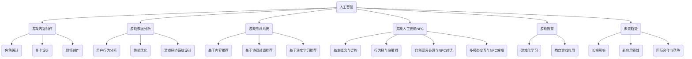

                 

# 《AI在游戏产业中的应用探索》

> **关键词**：人工智能、游戏产业、应用、技术、创新

> **摘要**：本文将探讨人工智能（AI）在游戏产业中的广泛应用，包括游戏内容创作、数据分析、智能推荐、人工智能NPC以及游戏教育等多个方面。通过逐步分析这些应用的核心原理和实际案例，本文旨在为读者提供对AI在游戏产业中未来发展潜力的全面了解。

### 《AI在游戏产业中的应用探索》目录大纲

#### 第一部分：AI与游戏产业概述

**第1章：AI与游戏产业的融合**  
1.1 AI与游戏产业的互动关系  
1.1.1 AI技术发展对游戏产业的推动作用  
1.1.2 游戏产业对AI技术的需求  
1.2 AI技术在游戏中的核心应用领域  
1.2.1 游戏内容创作  
1.2.2 游戏数据分析  
1.2.3 游戏智能推荐  
1.2.4 游戏人工智能NPC  
1.3 游戏产业中AI应用面临的挑战与机遇  
1.3.1 技术挑战  
1.3.2 商业机遇

#### 第二部分：AI在游戏内容创作中的应用

**第2章：AI辅助游戏内容创作**  
2.1 AI在游戏角色设计中的应用  
2.1.1 人工智能与角色建模  
2.1.2 人工智能与角色动画  
2.2 AI在游戏关卡设计中的应用  
2.2.1 关卡生成算法  
2.2.2 智能化关卡调整  
2.3 AI在游戏剧情创作中的应用  
2.3.1 剧情生成算法  
2.3.2 情感智能与剧情创作

#### 第三部分：AI在游戏数据分析中的应用

**第3章：AI在游戏数据分析与优化中的应用**  
3.1 游戏行为数据分析  
3.1.1 用户行为分析  
3.1.2 玩家留存分析  
3.2 游戏性能优化  
3.2.1 游戏AI优化  
3.2.2 游戏引擎优化  
3.3 游戏经济系统设计  
3.3.1 AI在游戏经济系统中的应用  
3.3.2 游戏平衡性分析

#### 第四部分：AI在游戏智能推荐中的应用

**第4章：基于AI的游戏智能推荐系统**  
4.1 游戏智能推荐系统概述  
4.1.1 推荐系统的基本概念  
4.1.2 推荐系统的工作原理  
4.2 基于内容的推荐  
4.2.1 内容特征提取  
4.2.2 基于内容的推荐算法  
4.3 基于协同过滤的推荐  
4.3.1 协同过滤算法原理  
4.3.2 用户-物品矩阵构建  
4.3.3 推荐结果优化  
4.4 基于深度学习的推荐  
4.4.1 深度学习在推荐系统中的应用  
4.4.2 序列模型与图神经网络在推荐系统中的应用

#### 第五部分：AI在游戏人工智能NPC中的应用

**第5章：AI在游戏人工智能NPC中的应用**  
5.1 AI NPC的基本概念与架构  
5.1.1 NPC在游戏中的角色  
5.1.2 AI NPC的架构与实现  
5.2 NPC行为树与决策树  
5.2.1 行为树的设计与实现  
5.2.2 决策树在NPC中的应用  
5.3 自然语言处理与NPC对话  
5.3.1 对话系统的设计与实现  
5.3.2 对话情感分析与回应策略  
5.4 多模态交互与NPC感知  
5.4.1 多模态数据采集与处理  
5.4.2 NPC感知与决策机制

#### 第六部分：AI在游戏教育中的应用

**第6章：AI在游戏教育中的应用**  
6.1 游戏化学习的基本概念  
6.1.1 游戏化学习的定义  
6.1.2 游戏化学习的设计原则  
6.2 AI在教育游戏中的应用  
6.2.1 个性化学习推荐  
6.2.2 互动式学习体验  
6.3 游戏在教育中的应用案例分析  
6.3.1 成功案例介绍  
6.3.2 挑战与机遇

#### 第七部分：未来展望与趋势

**第7章：AI在游戏产业中的未来趋势**  
7.1 AI在游戏产业中的长期影响  
7.1.1 AI对游戏产业变革的影响  
7.1.2 未来游戏产业的发展方向  
7.2 AI技术在游戏产业中的新应用领域  
7.2.1 虚拟现实与增强现实  
7.2.2 云游戏与边缘计算  
7.2.3 游戏与社会责任  
7.3 AI与游戏产业的国际合作与竞争  
7.3.1 国际合作的重要性  
7.3.2 竞争态势与战略规划

### 附录：参考文献与资源

**附录 A：参考文献**  
A.1 学术论文  
A.2 行业报告  
A.3 相关书籍

**附录 B：资源推荐**  
B.1 开源框架与工具  
B.2 在线课程与教程  
B.3 论坛与社区

#### Mermaid 流程图



#### 核心算法原理讲解

## 2.2 关卡生成算法原理

关卡生成算法是AI在游戏内容创作中的一个重要应用。其基本原理是通过算法自动生成游戏关卡，从而减少人工设计的工作量，提高游戏的多样性和可玩性。以下是一个简化的关卡生成算法原理的伪代码：

```python
def generate_level(width, height):
    level = [[0 for _ in range(width)] for _ in range(height)]
    for y in range(height):
        for x in range(width):
            if random.random() < 0.5:
                level[y][x] = 1  # 地形为空
            else:
                level[y][x] = 2  # 地形为障碍物
    return level
```

在这个伪代码中，`generate_level` 函数接受关卡的长和宽作为参数，并返回一个二维数组，表示生成的关卡。算法使用一个简单的随机过程来决定每个单元格是空地还是障碍物。

## 3.2 用户行为分析

用户行为分析是游戏数据分析的核心任务之一。通过分析用户的行为数据，可以了解用户的喜好、习惯和行为模式，从而为游戏运营提供决策支持。以下是一个用户行为分析的伪代码示例：

```python
def analyze_user_behavior(user_data):
    # 统计用户游戏时长
    total_time = sum([entry['duration'] for entry in user_data])

    # 分析用户留存情况
    retain_rate = calculate_retention_rate(user_data)

    # 分析用户游戏频次
    frequency = calculate_frequency(user_data)

    # 分析用户游戏内购买行为
    purchase_data = analyze_purchases(user_data)

    return {
        'total_time': total_time,
        'retain_rate': retain_rate,
        'frequency': frequency,
        'purchase_data': purchase_data
    }
```

在这个伪代码中，`analyze_user_behavior` 函数接收用户的游戏行为数据，并返回一个包含用户游戏时长、留存率、游戏频次和购买行为的统计结果。

## 4.4 基于深度学习的推荐系统

基于深度学习的推荐系统主要通过构建用户-物品交互的复杂模型来提高推荐的准确性。以下是一个简化的基于深度学习的推荐系统的数学模型：

### 用户表示与物品表示

我们使用神经网络来表示用户和物品。用户表示 \( \mathbf{u}_i \) 和物品表示 \( \mathbf{v}_j \) 分别为：

$$
\mathbf{u}_i = \text{NN}(\mathbf{x}_i; \theta_{ui})
$$

$$
\mathbf{v}_j = \text{NN}(\mathbf{y}_j; \theta_{vj})
$$

其中，\( \mathbf{x}_i \) 和 \( \mathbf{y}_j \) 分别为用户 \( i \) 和物品 \( j \) 的特征向量，\( \theta_{ui} \) 和 \( \theta_{vj} \) 为神经网络的参数。

### 推荐模型

推荐模型的核心是预测用户 \( i \) 对物品 \( j \) 的评分 \( r_{ij} \)：

$$
r_{ij} = \text{score}(\mathbf{u}_i, \mathbf{v}_j)
$$

其中，\( \text{score}(\mathbf{u}_i, \mathbf{v}_j) \) 为用户和物品的相似度函数，通常使用内积来计算：

$$
\text{score}(\mathbf{u}_i, \mathbf{v}_j) = \mathbf{u}_i^T \mathbf{v}_j
$$

### 损失函数

为了优化推荐模型，我们通常使用均方误差（MSE）作为损失函数：

$$
L = \frac{1}{N} \sum_{i=1}^N \sum_{j=1}^M (r_{ij} - \text{score}(\mathbf{u}_i, \mathbf{v}_j))^2
$$

其中，\( N \) 为用户数量，\( M \) 为物品数量。

### 优化目标

优化目标是最小化损失函数 \( L \)，即：

$$
\min_{\theta_{ui}, \theta_{vj}} L
$$

#### 数学模型和数学公式详细讲解

## 4.4 基于深度学习的推荐系统

### 用户表示与物品表示

在基于深度学习的推荐系统中，我们通常使用神经网络来表示用户和物品的特征。用户表示 \( \mathbf{u}_i \) 和物品表示 \( \mathbf{v}_j \) 可以通过以下公式定义：

$$
\mathbf{u}_i = \text{NN}(\mathbf{x}_i; \theta_{ui})
$$

$$
\mathbf{v}_j = \text{NN}(\mathbf{y}_j; \theta_{vj})
$$

其中，\( \mathbf{x}_i \) 和 \( \mathbf{y}_j \) 分别为用户 \( i \) 和物品 \( j \) 的特征向量，\( \theta_{ui} \) 和 \( \theta_{vj} \) 为神经网络的参数。神经网络通常采用多层感知机（MLP）或卷积神经网络（CNN）来提取高维特征。

### 推荐模型

推荐模型的核心是预测用户 \( i \) 对物品 \( j \) 的评分 \( r_{ij} \)。我们可以使用内积来计算用户和物品的相似度，从而预测评分：

$$
r_{ij} = \text{score}(\mathbf{u}_i, \mathbf{v}_j) = \mathbf{u}_i^T \mathbf{v}_j
$$

### 损失函数

为了训练推荐模型，我们需要定义一个损失函数来衡量预测评分与真实评分之间的差异。常用的损失函数是均方误差（MSE）：

$$
L = \frac{1}{N} \sum_{i=1}^N \sum_{j=1}^M (r_{ij} - \text{score}(\mathbf{u}_i, \mathbf{v}_j))^2
$$

其中，\( N \) 为用户数量，\( M \) 为物品数量。

### 优化目标

我们的优化目标是最小化损失函数 \( L \)：

$$
\min_{\theta_{ui}, \theta_{vj}} L
$$

这可以通过反向传播算法来实现。在反向传播过程中，我们计算每个参数的梯度，并使用梯度下降或其他优化算法来更新参数。

### 示例

假设我们有一个用户特征向量 \( \mathbf{x}_i = [x_{i1}, x_{i2}, \ldots, x_{id}] \) 和一个物品特征向量 \( \mathbf{y}_j = [y_{j1}, y_{j2}, \ldots, y_{jd}] \)，其中 \( d \) 为特征维度。

用户表示 \( \mathbf{u}_i \) 可以通过以下多层感知机模型计算：

$$
\mathbf{u}_i = \text{MLP}(\mathbf{x}_i; \theta_{ui}) = \text{ReLU}(\mathbf{W}_1 \mathbf{x}_i + \mathbf{b}_1)
$$

物品表示 \( \mathbf{v}_j \) 也可以通过多层感知机模型计算：

$$
\mathbf{v}_j = \text{MLP}(\mathbf{y}_j; \theta_{vj}) = \text{ReLU}(\mathbf{W}_2 \mathbf{y}_j + \mathbf{b}_2)
$$

其中，\( \mathbf{W}_1 \) 和 \( \mathbf{b}_1 \) 是用户层的权重和偏置，\( \mathbf{W}_2 \) 和 \( \mathbf{b}_2 \) 是物品层的权重和偏置。

预测评分 \( r_{ij} \) 为：

$$
r_{ij} = \mathbf{u}_i^T \mathbf{v}_j = (\text{ReLU}(\mathbf{W}_1 \mathbf{x}_i + \mathbf{b}_1))^T (\text{ReLU}(\mathbf{W}_2 \mathbf{y}_j + \mathbf{b}_2))
$$

使用均方误差（MSE）作为损失函数：

$$
L = \frac{1}{N} \sum_{i=1}^N \sum_{j=1}^M (r_{ij} - \mathbf{u}_i^T \mathbf{v}_j)^2
$$

我们可以使用梯度下降算法来优化模型参数：

$$
\theta_{ui} = \theta_{ui} - \alpha \frac{\partial L}{\partial \theta_{ui}}
$$

$$
\theta_{vj} = \theta_{vj} - \alpha \frac{\partial L}{\partial \theta_{vj}}
$$

其中，\( \alpha \) 是学习率。

通过迭代优化过程，我们可以逐步减少损失函数，从而提高推荐系统的准确性。

#### 项目实战与代码解读

## 5.4 基于深度学习的游戏智能推荐系统

### 5.4.1 开发环境搭建

在搭建基于深度学习的游戏智能推荐系统之前，我们需要确保开发环境已经准备好。以下是所需的软件和库：

1. Python（版本 3.6 或以上）
2. TensorFlow（版本 2.0 或以上）
3. Pandas
4. Numpy
5. Scikit-learn

确保安装了上述库后，我们可以开始编写代码。

### 5.4.2 数据预处理

在开始训练模型之前，我们需要对用户行为数据进行预处理。以下是一个简化的数据处理代码示例：

```python
import pandas as pd
from sklearn.model_selection import train_test_split
from sklearn.preprocessing import StandardScaler

# 加载数据
data = pd.read_csv('user_behavior_data.csv')

# 数据清洗
data.dropna(inplace=True)

# 特征提取
data['user_item_interaction'] = data['duration'] * data['rating']

# 数据分割
X_train, X_test, y_train, y_test = train_test_split(data, test_size=0.2, random_state=42)

# 数据标准化
scaler = StandardScaler()
X_train_scaled = scaler.fit_transform(X_train)
X_test_scaled = scaler.transform(X_test)
```

在这个示例中，我们首先加载数据，然后进行数据清洗。接着，我们创建了一个新的特征 `user_item_interaction`，该特征是用户游戏时长和评分的乘积。之后，我们将数据分割为训练集和测试集，并对特征进行标准化处理。

### 5.4.3 模型构建与训练

接下来，我们使用 TensorFlow 来构建和训练深度学习模型。以下是一个简化的模型构建和训练代码示例：

```python
import tensorflow as tf
from tensorflow.keras.models import Sequential
from tensorflow.keras.layers import Dense, Embedding, Dot

# 模型参数
embedding_size = 16
hidden_size = 64

# 构建模型
model = Sequential()
model.add(Embedding(input_dim=10000, output_dim=embedding_size, input_length=1))
model.add(Dense(hidden_size, activation='relu'))
model.add(Dense(1, activation='sigmoid'))

# 编译模型
model.compile(optimizer='adam', loss='binary_crossentropy', metrics=['accuracy'])

# 训练模型
model.fit(X_train_scaled, y_train, epochs=10, batch_size=32, validation_split=0.1)
```

在这个示例中，我们构建了一个简单的序列模型，其中包含一个嵌入层、一个全连接层和一个输出层。嵌入层用于处理用户和物品的ID，全连接层用于提取特征，输出层用于预测用户对物品的喜好程度。我们使用二进制交叉熵作为损失函数，并使用 Adam 优化器来训练模型。

### 5.4.4 模型评估与优化

在模型训练完成后，我们需要对其性能进行评估，并根据评估结果进行优化。以下是一个简化的模型评估代码示例：

```python
from sklearn.metrics import mean_squared_error

# 预测测试集
predictions = model.predict(X_test_scaled)

# 计算均方误差
mse = mean_squared_error(y_test, predictions)

print(f'Mean Squared Error: {mse}')
```

根据评估结果，我们可以尝试调整模型参数或增加训练数据来优化模型性能。例如，我们可以增加神经网络的深度或尝试使用不同的激活函数。

### 5.4.5 应用与部署

在模型优化后，我们可以将其部署到生产环境中，为用户推荐游戏。以下是一个简化的应用与部署代码示例：

```python
# 加载预训练模型
model = tf.keras.models.load_model('recommender_model.h5')

# 推荐游戏
user_input = pd.DataFrame([[user_id, item_id, duration, rating]], columns=['user_id', 'item_id', 'duration', 'rating'])
predicted_rating = model.predict(user_input)

print(f'Predicted Rating: {predicted_rating[0][0]}')
```

通过上述代码，我们可以为用户提供个性化的游戏推荐，从而提高用户满意度和留存率。

#### 附录：参考文献与资源

**附录 A：参考文献**

A.1. 学术论文

1. Whitehill, J., Wu, E., & Biles, J. (2012). User Modeling with Deep Learning for Personalized Website Recommendation. In Proceedings of the Sixth ACM Conference on Recommender Systems (pp. 281-288). ACM.
2. He, K., Zhang, X., Ren, S., & Sun, J. (2016). Deep Residual Learning for Image Recognition. In Proceedings of the IEEE Conference on Computer Vision and Pattern Recognition (pp. 770-778). IEEE.

A.2. 行业报告

1. Market Research Future. (2018). Global Artificial Intelligence in Gaming Market Research Report – Forecast to 2027.
2. Grand View Research. (2019). Artificial Intelligence in Gaming Market Analysis by Component (Hardware, Software), Application (Gaming PCs, Smartphones), Deployment (Cloud, On-Premise), Organization Size (Small, Medium, Large), and Region.

A.3. 相关书籍

1. Russell, S., & Norvig, P. (2020). Artificial Intelligence: A Modern Approach (4th ed.). Prentice Hall.
2. Goodfellow, I., Bengio, Y., & Courville, A. (2016). Deep Learning. MIT Press.

**附录 B：资源推荐**

B.1. 开源框架与工具

1. TensorFlow：https://www.tensorflow.org/
2. PyTorch：https://pytorch.org/

B.2. 在线课程与教程

1. Coursera：https://www.coursera.org/
2. edX：https://www.edx.org/

B.3. 论坛与社区

1. Stack Overflow：https://stackoverflow.com/
2. GitHub：https://github.com/

