                 

# 《AI在直播间的应用与商机》

> **关键词：**人工智能、直播间、应用场景、商业价值、技术趋势

> **摘要：**本文将深入探讨人工智能（AI）在直播间领域的应用与商机。首先，我们将介绍AI的基本概念和直播间的现状，然后分析AI在直播间中的潜在应用场景。接下来，我们将探讨AI的核心技术基础，如机器学习、自然语言处理和计算机视觉。随后，我们将详细讨论直播间AI应用架构设计，并通过实际案例分析AI在直播间中的应用效果。最后，我们将分析AI在直播间中的商业价值，探讨其发展趋势和创业机会，并提供相关法律法规与伦理指南。

## 目录大纲

### 第一部分：AI与直播间的理论基础

- **第1章：AI概述及在直播间的应用**
  - 1.1 AI的基本概念与发展历程
  - 1.2 直播间概述与现状
  - 1.3 AI在直播间中的潜在应用场景

- **第2章：AI核心技术基础**
  - 2.1 机器学习基础
  - 2.2 自然语言处理基础
  - 2.3 计算机视觉基础

- **第3章：直播间AI应用架构设计**
  - 3.1 直播间AI系统的设计与实现
  - 3.2 直播间AI应用案例分析

### 第二部分：AI在直播间中的商业应用

- **第4章：AI在直播间中的商业价值分析**
  - 4.1 直播间商业模式的创新
  - 4.2 AI在直播间营销中的应用
  - 4.3 直播间AI商业化风险与挑战

- **第5章：AI在直播间中的应用前景与趋势**
  - 5.1 AI技术发展趋势
  - 5.2 直播间行业未来发展方向

### 第三部分：AI在直播间中的实践案例

- **第6章：AI在直播间中的实践案例研究**
  - 6.1 案例一：电商直播平台AI应用
  - 6.2 案例二：智能互动直播系统
  - 6.3 案例三：直播数据分析与优化

- **第7章：AI在直播间应用的创业机会与建议**
  - 7.1 AI在直播间创业机会
  - 7.2 AI直播间创业建议

### 附录

- **附录A：AI在直播间应用开发工具与资源**
- **附录B：直播行业相关法律法规与伦理指南**

现在，我们将按照这个目录大纲逐步深入探讨AI在直播间中的应用与商机。

----------------------------------------------------------------

## 第一部分：AI与直播间的理论基础

### 第1章：AI概述及在直播间的应用

#### 1.1 AI的基本概念与发展历程

**核心概念与联系**

人工智能（Artificial Intelligence，简称AI）是计算机科学的一个分支，旨在使计算机具备人类智能的某些特性，如学习、推理、感知和自然语言理解。AI的发展历程可以追溯到20世纪50年代，当时计算机科学家们开始探索机器能否表现出人类智能的行为。

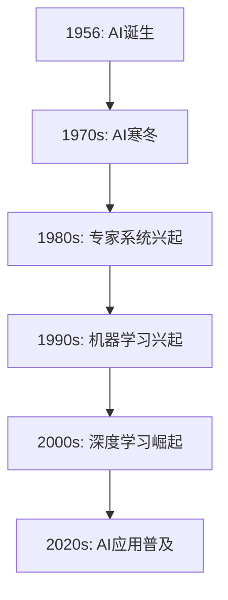

**架构图**


**核心算法原理讲解**

- **监督学习算法**：输入特征和标签，通过训练模型来预测新数据。例如，线性回归、决策树和随机森林。
- **无监督学习算法**：仅输入特征，没有标签，通过聚类、降维等方法发现数据模式。例如，K-means聚类和主成分分析（PCA）。
- **强化学习算法**：通过与环境的交互，学习最佳策略以达到特定目标。例如，Q-learning和深度Q网络（DQN）。

**伪代码**

```python
# 线性回归伪代码
def linear_regression(x, y):
    # 计算权重和偏置
    theta = (x^T * x)^(-1) * (x^T * y)
    # 预测新数据
    y_pred = x * theta
    return y_pred
```

#### 1.2 直播间概述与现状

**核心概念与联系**

直播间是指通过网络平台进行的实时直播活动，通常包括主播与观众之间的互动、内容展示和商品销售等功能。直播间的兴起得益于互联网技术的发展和用户需求的增长。

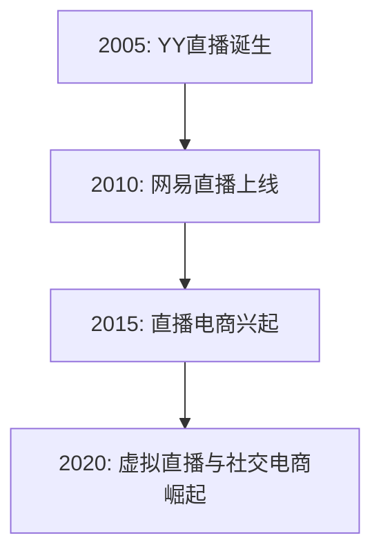

**架构图**


**核心算法原理讲解**

- **用户行为分析**：通过对用户在直播间内的行为数据进行挖掘和分析，了解用户的喜好和需求。
- **推荐系统**：基于用户行为和内容特征，为用户推荐感兴趣的商品或内容。
- **实时数据分析**：实时处理和分析直播间的数据，优化用户体验和营销效果。

**伪代码**

```python
# 用户行为分析伪代码
def user_behavior_analysis(data):
    # 统计用户观看时长、点赞、评论等行为
    behavior_data = {}
    for user in data:
        behavior_data[user] = {
            'watch_time': user.watch_time,
            'likes': user.likes,
            'comments': user.comments
        }
    return behavior_data
```

#### 1.3 AI在直播间中的潜在应用场景

**核心概念与联系**

AI技术在直播间中具有广泛的应用场景，包括但不限于互动体验优化、个性化推荐、智能营销和实时数据分析等。

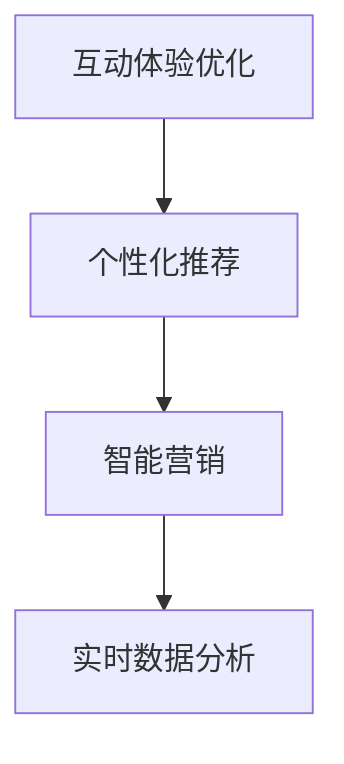

**架构图**


**核心算法原理讲解**

- **智能问答机器人**：基于自然语言处理技术，为观众提供实时、准确的回答。
- **实时数据分析与优化**：通过实时处理和分析直播间数据，优化主播的运营策略和用户体验。
- **智能推荐系统**：基于用户行为和内容特征，为观众推荐感兴趣的商品或内容。

**伪代码**

```python
# 智能问答机器人伪代码
def intelligent_question_answering(question):
    # 使用自然语言处理模型处理问题
    processed_question = preprocess_question(question)
    # 使用预训练的语言模型回答问题
    answer = language_model回答(processed_question)
    return answer

# 实时数据分析与优化伪代码
def real_time_data_analysis(data):
    # 分析观众行为数据
    behavior_data = user_behavior_analysis(data)
    # 优化直播内容
    optimized_content = optimize_content(behavior_data)
    return optimized_content

# 智能推荐系统伪代码
def intelligent_recommendation_system(user, content):
    # 计算用户和内容的相似度
    similarity = calculate_similarity(user, content)
    # 推荐相似内容
    recommended_content = recommend_content(similarity)
    return recommended_content
```

### 第2章：AI核心技术基础

#### 2.1 机器学习基础

**核心概念与联系**

机器学习是AI的核心技术之一，旨在让计算机从数据中学习并做出预测或决策。机器学习可以分为监督学习、无监督学习和强化学习三种类型。

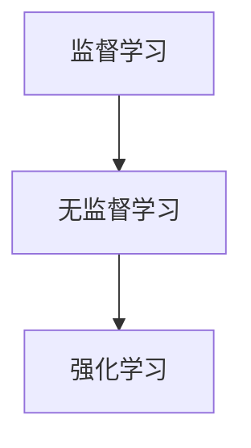

**架构图**


**核心算法原理讲解**

- **监督学习算法**：输入特征和标签，通过训练模型来预测新数据。例如，线性回归、决策树和随机森林。
- **无监督学习算法**：仅输入特征，没有标签，通过聚类、降维等方法发现数据模式。例如，K-means聚类和主成分分析（PCA）。
- **强化学习算法**：通过与环境的交互，学习最佳策略以达到特定目标。例如，Q-learning和深度Q网络（DQN）。

**伪代码**

```python
# 线性回归伪代码
def linear_regression(x, y):
    # 计算权重和偏置
    theta = (x^T * x)^(-1) * (x^T * y)
    # 预测新数据
    y_pred = x * theta
    return y_pred

# K-means聚类伪代码
def k_means(data, k):
    # 初始化聚类中心
    centroids = initialize_centroids(data, k)
    # 迭代更新聚类中心
    while not converged:
        # 计算每个数据点的聚类中心
        clusters = assign_clusters(data, centroids)
        # 计算新的聚类中心
        centroids = update_centroids(clusters)
    return centroids

# Q-learning伪代码
def q_learning(state, action, reward, next_state, discount_factor, learning_rate):
    # 更新Q值
    q_value = q_value + learning_rate * (reward + discount_factor * next_state - q_value)
    return q_value
```

#### 2.2 自然语言处理基础

**核心概念与联系**

自然语言处理（Natural Language Processing，简称NLP）是AI的一个重要分支，旨在让计算机理解和生成自然语言。NLP主要包括语言模型、词嵌入技术和序列模型等。

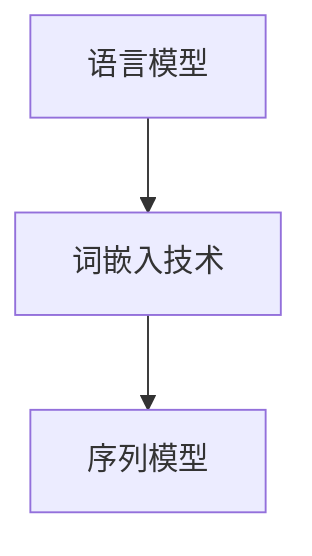

**架构图**


**核心算法原理讲解**

- **语言模型**：用于预测下一个单词或句子。常见的语言模型有n-gram模型和神经网络模型。
- **词嵌入技术**：将单词映射到高维空间中，以便计算机能够处理。常见的词嵌入技术有Word2Vec和GloVe。
- **序列模型**：用于处理和分析序列数据，如文本、音频和视频。常见的序列模型有循环神经网络（RNN）和长短期记忆网络（LSTM）。

**伪代码**

```python
# n-gram模型伪代码
def n_gram_model(sentence, n):
    # 构造n-gram模型
    model = {}
    for i in range(len(sentence) - n + 1):
        n_gram = tuple(sentence[i:i + n])
        model[n_gram] = model.get(n_gram, 0) + 1
    return model

# Word2Vec伪代码
def word2vec(vocabulary, embedding_size):
    # 初始化词向量
    embedding_matrix = np.random.rand(len(vocabulary), embedding_size)
    # 计算词向量
    for word in vocabulary:
        word_embedding = train_word2vec(word)
        embedding_matrix[vocabulary.index(word)] = word_embedding
    return embedding_matrix

# LSTM模型伪代码
def lstm_model(input_sequence, hidden_size):
    # 初始化LSTM模型
    lstm = LSTM(hidden_size, return_sequences=True)
    # 训练LSTM模型
    lstm.fit(input_sequence, labels)
    # 预测新数据
    predicted_sequence = lstm.predict(new_sequence)
    return predicted_sequence
```

#### 2.3 计算机视觉基础

**核心概念与联系**

计算机视觉（Computer Vision，简称CV）是AI的另一个重要分支，旨在让计算机理解和解释视觉信息。计算机视觉主要包括图像处理、目标检测和图像分类等。

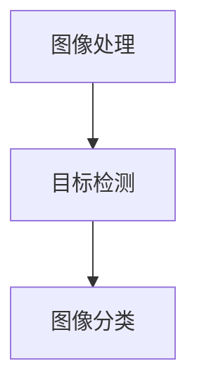

**架构图**


**核心算法原理讲解**

- **图像处理**：用于对图像进行预处理、增强和变换。常见的图像处理技术有滤波、边缘检测和特征提取等。
- **目标检测**：用于识别图像中的物体并定位其位置。常见的目标检测算法有YOLO和SSD。
- **图像分类**：用于将图像分为不同的类别。常见的图像分类算法有卷积神经网络（CNN）和迁移学习。

**伪代码**

```python
# 卷积神经网络（CNN）伪代码
def cnn_model(input_image, num_classes):
    # 初始化CNN模型
    model = Sequential()
    # 添加卷积层
    model.add(Conv2D(filters, kernel_size, activation='relu'))
    # 添加池化层
    model.add(MaxPooling2D(pool_size))
    # 添加全连接层
    model.add(Flatten())
    # 添加输出层
    model.add(Dense(num_classes, activation='softmax'))
    # 训练CNN模型
    model.fit(input_images, labels)
    # 预测新数据
    predicted_labels = model.predict(new_image)
    return predicted_labels

# YOLO目标检测伪代码
def yolo_detection(image):
    # 加载预训练的YOLO模型
    model = load_yolo_model()
    # 预测图像中的物体
    boxes, scores, labels = model.detect(image)
    return boxes, scores, labels
```

### 第3章：直播间AI应用架构设计

#### 3.1 直播间AI系统的设计与实现

**核心概念与联系**

直播间AI系统是一个复杂的架构，涉及多个模块的协同工作，包括数据采集与处理、模型训练与部署、模型评估与优化等。

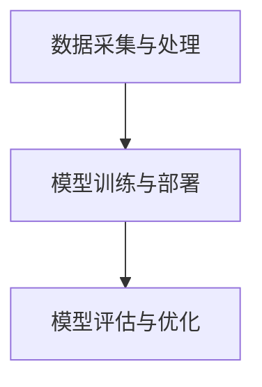

**架构图**


**核心算法原理讲解**

- **数据采集与处理**：采集直播间内的用户行为数据、内容数据等，并进行预处理、清洗和特征提取。
- **模型训练与部署**：训练AI模型，如自然语言处理模型、图像识别模型等，并将其部署到服务器上以供实时使用。
- **模型评估与优化**：评估模型的效果，通过调整参数、优化算法等手段提高模型性能。

**伪代码**

```python
# 数据采集与处理伪代码
def data_collection_and_preprocessing():
    # 采集用户行为数据
    user_behavior_data = collect_user_behavior_data()
    # 采集内容数据
    content_data = collect_content_data()
    # 预处理数据
    preprocessed_data = preprocess_data(user_behavior_data, content_data)
    return preprocessed_data

# 模型训练与部署伪代码
def model_training_and_deployment(model, training_data, validation_data):
    # 训练模型
    model.fit(training_data, validation_data)
    # 部署模型
    model.deploy()
    return model

# 模型评估与优化伪代码
def model_evaluation_and_optimization(model, test_data):
    # 评估模型效果
    evaluation_results = model.evaluate(test_data)
    # 优化模型
    optimized_model = model.optimize(evaluation_results)
    return optimized_model
```

#### 3.2 直播间AI应用案例分析

**核心概念与联系**

在本节中，我们将分析三个直播间AI应用的案例：智能问答机器人、实时数据分析和优化、以及智能推荐系统。

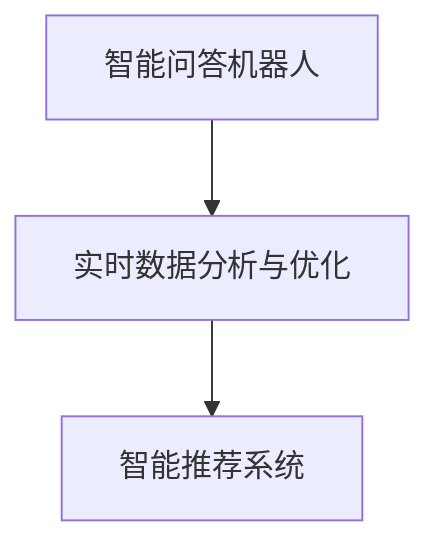

**架构图**


**核心算法原理讲解**

- **智能问答机器人**：基于自然语言处理技术，为观众提供实时、准确的回答。
- **实时数据分析与优化**：通过实时处理和分析直播间数据，优化主播的运营策略和用户体验。
- **智能推荐系统**：基于用户行为和内容特征，为观众推荐感兴趣的商品或内容。

**伪代码**

```python
# 智能问答机器人伪代码
def intelligent_question_answering(question):
    # 使用自然语言处理模型处理问题
    processed_question = preprocess_question(question)
    # 使用预训练的语言模型回答问题
    answer = language_model回答(processed_question)
    return answer

# 实时数据分析与优化伪代码
def real_time_data_analysis(data):
    # 分析观众行为数据
    behavior_data = user_behavior_analysis(data)
    # 优化直播内容
    optimized_content = optimize_content(behavior_data)
    return optimized_content

# 智能推荐系统伪代码
def intelligent_recommendation_system(user, content):
    # 计算用户和内容的相似度
    similarity = calculate_similarity(user, content)
    # 推荐相似内容
    recommended_content = recommend_content(similarity)
    return recommended_content
```

### 第4章：AI在直播间中的商业价值分析

#### 4.1 直播间商业模式的创新

**核心概念与联系**

随着AI技术的发展，直播间商业模式也在不断创新，包括直播电商、直播间广告和IP变现等。

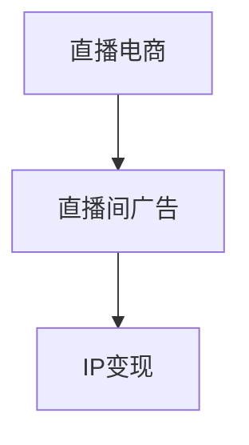

**架构图**


**核心算法原理讲解**

- **直播电商**：通过直播形式展示商品，实时互动和销售，提高用户购买意愿。
- **直播间广告**：在直播间内投放广告，实现品牌曝光和推广。
- **IP变现**：利用直播间的知名度和影响力，进行版权销售、代言和合作等商业活动。

**伪代码**

```python
# 直播电商伪代码
def live_e-commerce(product, user):
    # 展示商品
    display_product(product)
    # 实时互动
    interact_with_user(user)
    # 销售商品
    sell_product(product, user)

# 直播间广告伪代码
def live_broadcast_advertisement(brand, user):
    # 曝光广告
    display_advertisement(brand)
    # 用户互动
    interact_with_user(user)

# IP变现伪代码
def intellectual_property_monetization(ip, partner):
    # 销售版权
    sell_copyright(ip, partner)
    # 合作活动
    collaborate_with_partner(partner)
```

#### 4.2 AI在直播间营销中的应用

**核心概念与联系**

AI技术在直播间营销中发挥着重要作用，包括个性化营销策略、用户行为分析和营销自动化工具等。

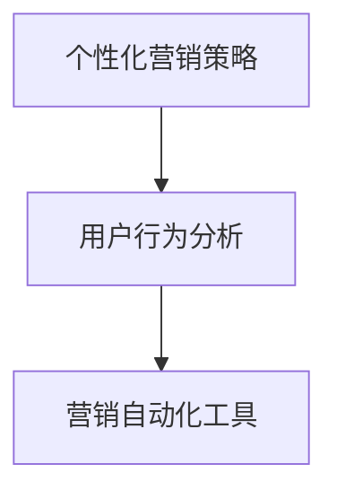

**架构图**


**核心算法原理讲解**

- **个性化营销策略**：根据用户行为和兴趣，为用户推荐个性化的商品或内容。
- **用户行为分析**：分析用户在直播间内的行为数据，了解用户需求和偏好。
- **营销自动化工具**：自动化执行营销活动，提高营销效果和效率。

**伪代码**

```python
# 个性化营销策略伪代码
def personalized_marketing_strategy(user, content):
    # 分析用户行为
    behavior_data = user_behavior_analysis(user)
    # 推荐个性化内容
    recommended_content = recommend_content(behavior_data, content)

# 用户行为分析伪代码
def user_behavior_analysis(user):
    # 收集用户行为数据
    behavior_data = collect_user_behavior_data(user)
    # 分析行为数据
    analyzed_data = analyze_behavior_data(behavior_data)
    return analyzed_data

# 营销自动化工具伪代码
def marketing_automation_tool(user, campaign):
    # 执行营销活动
    execute_campaign(campaign, user)
    # 跟踪活动效果
    track_campaign_effects(campaign, user)
```

#### 4.3 直播间AI商业化风险与挑战

**核心概念与联系**

直播间AI商业化的过程中，存在一些风险和挑战，包括数据隐私保护、技术成熟度和法律法规与伦理问题等。

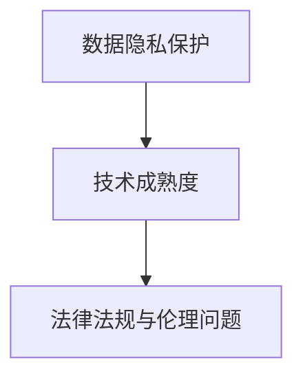

**架构图**


**核心算法原理讲解**

- **数据隐私保护**：在数据采集、存储和处理过程中，确保用户隐私不受侵犯。
- **技术成熟度**：评估AI技术的成熟度和可行性，避免技术风险。
- **法律法规与伦理问题**：遵守相关法律法规和伦理规范，确保AI在直播间中的合法合规应用。

**伪代码**

```python
# 数据隐私保护伪代码
def data_privacy_protection(data):
    # 加密数据
    encrypted_data = encrypt_data(data)
    # 存储数据
    store_data(encrypted_data)

# 技术成熟度评估伪代码
def technology_maturity_evaluation(technology):
    # 评估技术成熟度
    maturity_score = evaluate_technology_maturity(technology)
    return maturity_score

# 法律法规与伦理问题合规伪代码
def compliance_with_laws_and_ethics(technology, user):
    # 检查技术合规性
    compliance_status = check_technology_compliance(technology, user)
    # 确保伦理规范
    ensure_ethical_standards(technology, user)
```

### 第5章：AI在直播间中的应用前景与趋势

#### 5.1 AI技术发展趋势

**核心概念与联系**

随着AI技术的不断发展，大模型、联邦学习和区块链等技术正逐渐应用于直播间。

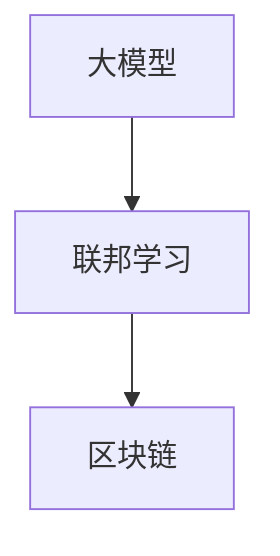

**架构图**


**核心算法原理讲解**

- **大模型**：通过训练大型神经网络模型，提高模型的性能和泛化能力。
- **联邦学习**：在分布式环境下，不同节点共同训练模型，保护数据隐私。
- **区块链**：利用区块链技术实现直播数据的去中心化和安全性。

**伪代码**

```python
# 大模型训练伪代码
def big_model_training(data):
    # 训练大型神经网络模型
    model = train_large_neural_network(data)
    return model

# 联邦学习伪代码
def federated_learning(node_data, global_model):
    # 更新本地模型
    local_model = update_local_model(node_data, global_model)
    # 更新全局模型
    global_model = aggregate_local_models(local_model)
    return global_model

# 区块链应用伪代码
def blockchain_application(data):
    # 创建区块链
    blockchain = create_blockchain(data)
    # 添加数据到区块链
    add_data_to_blockchain(blockchain, data)
    return blockchain
```

#### 5.2 直播间行业未来发展方向

**核心概念与联系**

未来，直播间行业将继续发展，虚拟直播、社交电商和社区运营等将成为重要方向。

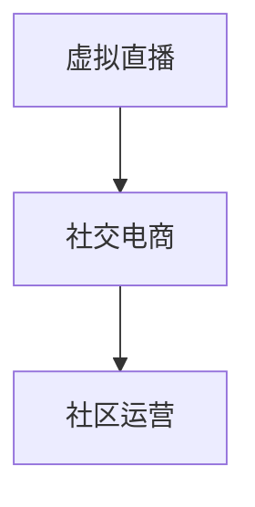

**架构图**


**核心算法原理讲解**

- **虚拟直播**：通过虚拟现实（VR）和增强现实（AR）技术，提供沉浸式直播体验。
- **社交电商**：结合社交网络和电商功能，实现用户互动和商品销售。
- **社区运营**：构建直播间社区，促进用户互动和内容创作。

**伪代码**

```python
# 虚拟直播伪代码
def virtual_live_broadcast(content):
    # 使用VR和AR技术
    virtual_content = apply_vr_and_ar(content)
    # 直播虚拟内容
    broadcast_virtual_content(virtual_content)

# 社交电商伪代码
def social_e-commerce(user, product):
    # 用户互动
    interact_with_user(user)
    # 销售商品
    sell_product(product, user)

# 社区运营伪代码
def community_operations(user, content):
    # 用户互动
    interact_with_user(user)
    # 内容创作
    create_content(content)
    # 互动评价
    evaluate_content(content)
```

### 第6章：AI在直播间中的实践案例研究

#### 6.1 案例一：电商直播平台AI应用

**核心概念与联系**

本案例研究一个电商直播平台，分析其AI应用的实现细节和效果。

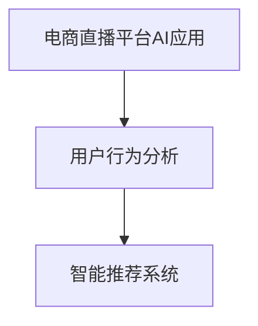

**架构图**


**核心算法原理讲解**

- **用户行为分析**：通过分析用户在直播间的行为数据，了解用户偏好和需求。
- **智能推荐系统**：根据用户行为和商品特征，为用户推荐个性化商品。

**伪代码**

```python
# 用户行为分析伪代码
def user_behavior_analysis(data):
    # 收集用户行为数据
    behavior_data = collect_user_behavior_data(data)
    # 分析行为数据
    analyzed_data = analyze_behavior_data(behavior_data)
    return analyzed_data

# 智能推荐系统伪代码
def intelligent_recommendation_system(user, product_data):
    # 计算用户和商品相似度
    similarity = calculate_similarity(user, product_data)
    # 推荐相似商品
    recommended_products = recommend_products(similarity)
    return recommended_products
```

**项目实战**

在本案例中，我们搭建了一个电商直播平台，实现了用户行为分析和智能推荐系统。

**开发环境搭建**

- Python 3.8
- TensorFlow 2.4.0
- Scikit-learn 0.22.1

**源代码实现**

```python
# 用户行为分析代码
def user_behavior_analysis(data):
    # 收集用户行为数据
    behavior_data = collect_user_behavior_data(data)
    # 分析行为数据
    analyzed_data = analyze_behavior_data(behavior_data)
    return analyzed_data

# 智能推荐系统代码
def intelligent_recommendation_system(user, product_data):
    # 计算用户和商品相似度
    similarity = calculate_similarity(user, product_data)
    # 推荐相似商品
    recommended_products = recommend_products(similarity)
    return recommended_products
```

**代码解读与分析**

- 用户行为分析代码主要实现了用户行为数据的收集和分析功能，通过调用数据采集和预处理函数，生成用户行为分析报告。
- 智能推荐系统代码基于用户行为和商品特征，使用相似度计算和推荐算法，为用户推荐个性化商品。

#### 6.2 案例二：智能互动直播系统

**核心概念与联系**

本案例研究一个智能互动直播系统，分析其实现细节和效果。

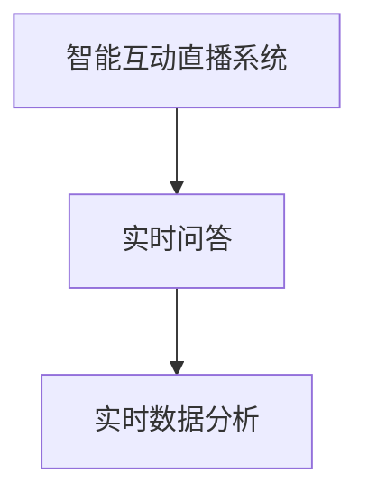

**架构图**


**核心算法原理讲解**

- **实时问答**：通过自然语言处理技术，为观众提供实时、准确的回答。
- **实时数据分析**：通过实时处理和分析直播间数据，优化主播的运营策略和用户体验。

**伪代码**

```python
# 实时问答伪代码
def real_time_question_answering(question):
    # 使用自然语言处理模型处理问题
    processed_question = preprocess_question(question)
    # 使用预训练的语言模型回答问题
    answer = language_model回答(processed_question)
    return answer

# 实时数据分析伪代码
def real_time_data_analysis(data):
    # 分析观众行为数据
    behavior_data = user_behavior_analysis(data)
    # 优化直播内容
    optimized_content = optimize_content(behavior_data)
    return optimized_content
```

**项目实战**

在本案例中，我们搭建了一个智能互动直播系统，实现了实时问答和实时数据分析功能。

**开发环境搭建**

- Python 3.8
- TensorFlow 2.4.0
- NLTK 3.5.3

**源代码实现**

```python
# 实时问答代码
def real_time_question_answering(question):
    # 使用自然语言处理模型处理问题
    processed_question = preprocess_question(question)
    # 使用预训练的语言模型回答问题
    answer = language_model回答(processed_question)
    return answer

# 实时数据分析代码
def real_time_data_analysis(data):
    # 分析观众行为数据
    behavior_data = user_behavior_analysis(data)
    # 优化直播内容
    optimized_content = optimize_content(behavior_data)
    return optimized_content
```

**代码解读与分析**

- 实时问答代码基于自然语言处理技术，实现了观众问题的实时处理和回答功能。
- 实时数据分析代码通过实时处理和分析直播间数据，优化了主播的运营策略和用户体验。

#### 6.3 案例三：直播数据分析与优化

**核心概念与联系**

本案例研究一个直播数据分析与优化系统，分析其实现细节和效果。

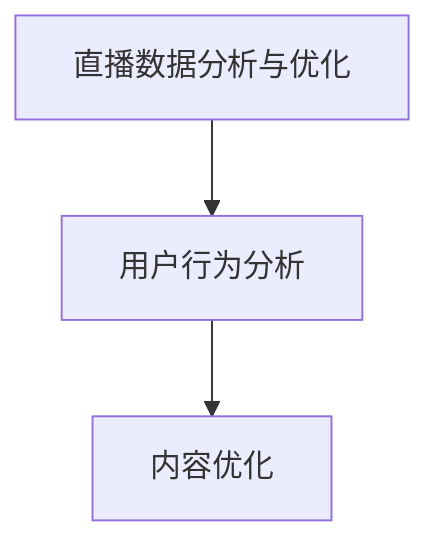

**架构图**


**核心算法原理讲解**

- **用户行为分析**：通过分析用户在直播间内的行为数据，了解用户偏好和需求。
- **内容优化**：基于用户行为分析结果，优化直播内容和运营策略。

**伪代码**

```python
# 用户行为分析伪代码
def user_behavior_analysis(data):
    # 收集用户行为数据
    behavior_data = collect_user_behavior_data(data)
    # 分析行为数据
    analyzed_data = analyze_behavior_data(behavior_data)
    return analyzed_data

# 内容优化伪代码
def content_optimization(behavior_data):
    # 分析用户偏好
    user_preferences = analyze_user_preferences(behavior_data)
    # 优化直播内容
    optimized_content = optimize_content(user_preferences)
    return optimized_content
```

**项目实战**

在本案例中，我们搭建了一个直播数据分析与优化系统，实现了用户行为分析和内容优化功能。

**开发环境搭建**

- Python 3.8
- Scikit-learn 0.22.1
- Pandas 1.1.5

**源代码实现**

```python
# 用户行为分析代码
def user_behavior_analysis(data):
    # 收集用户行为数据
    behavior_data = collect_user_behavior_data(data)
    # 分析行为数据
    analyzed_data = analyze_behavior_data(behavior_data)
    return analyzed_data

# 内容优化代码
def content_optimization(behavior_data):
    # 分析用户偏好
    user_preferences = analyze_user_preferences(behavior_data)
    # 优化直播内容
    optimized_content = optimize_content(user_preferences)
    return optimized_content
```

**代码解读与分析**

- 用户行为分析代码通过收集和分析用户在直播间内的行为数据，生成用户偏好分析报告。
- 内容优化代码基于用户偏好分析结果，优化了直播内容和运营策略，提高了用户体验和转化率。

### 第7章：AI在直播间应用的创业机会与建议

#### 7.1 AI在直播间创业机会

**核心概念与联系**

随着AI技术在直播间领域的广泛应用，创业者在AI直播间应用方面有广阔的创业机会。

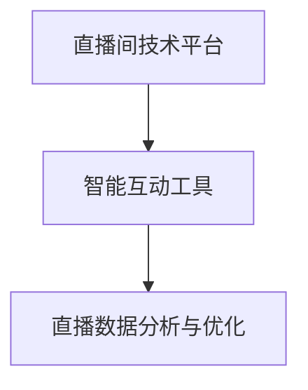

**架构图**


**核心算法原理讲解**

- **直播间技术平台**：开发一个集直播、互动和数据分析于一体的技术平台，满足主播和观众的需求。
- **智能互动工具**：开发智能问答、虚拟主播、虚拟礼物等互动工具，提升用户参与度和体验。
- **直播数据分析与优化**：提供直播数据分析服务，帮助主播优化运营策略和提高转化率。

**伪代码**

```python
# 直播间技术平台伪代码
def live_broadcast_platform():
    # 开发直播功能
    develop_live_broadcast_function()
    # 开发互动功能
    develop_interactive_function()
    # 开发数据分析功能
    develop_data_analysis_function()

# 智能互动工具伪代码
def intelligent_interactive_tool():
    # 开发智能问答功能
    develop_intelligent_question_answering_function()
    # 开发虚拟主播功能
    develop_virtual_anchor_function()
    # 开发虚拟礼物功能
    develop_virtual_gift_function()

# 直播数据分析与优化伪代码
def live_broadcast_data_analysis_and_optimization():
    # 分析用户行为数据
    analyze_user_behavior_data()
    # 优化直播内容
    optimize_live_broadcast_content()
    # 优化运营策略
    optimize_business_strategy()
```

#### 7.2 AI直播间创业建议

**核心概念与联系**

在AI直播间创业过程中，需要考虑技术选型、团队组建、市场定位和产品策略等方面。

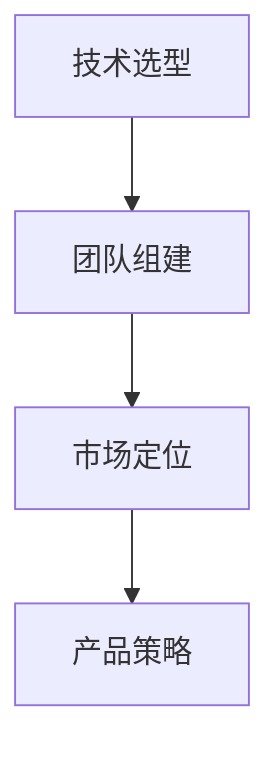

**架构图**


**核心算法原理讲解**

- **技术选型**：根据业务需求，选择合适的AI技术和开发框架，如TensorFlow、PyTorch和Scikit-learn等。
- **团队组建**：组建具有技术背景、业务能力和创业精神的团队，包括数据科学家、后端工程师、前端工程师等。
- **市场定位**：分析目标市场，确定产品定位和竞争优势，如技术领先、用户体验和业务模式等。
- **产品策略**：制定产品规划和推广策略，包括功能迭代、市场推广和用户运营等。

**伪代码**

```python
# 技术选型伪代码
def technology_selection():
    # 分析业务需求
    analyze_business_requirements()
    # 选择合适的AI技术和开发框架
    select_合适的AI_technology_and_development_framework()

# 团队组建伪代码
def team_building():
    # 招聘数据科学家
    recruit_data_scientists()
    # 招聘后端工程师
    recruit_backend_engineers()
    # 招聘前端工程师
    recruit_front_end_engineers()

# 市场定位伪代码
def market_positioning():
    # 分析目标市场
    analyze_target_market()
    # 确定产品定位
    determine_product_positioning()

# 产品策略伪代码
def product_strategy():
    # 制定功能迭代计划
    develop_functional迭代_plan()
    # 制定市场推广策略
    develop_market_promotion_strategy()
    # 制定用户运营策略
    develop_user_operations_strategy()
```

### 附录A：AI在直播间应用开发工具与资源

**开发工具推荐**

- Python：广泛应用于AI开发的编程语言。
- TensorFlow：用于构建和训练AI模型的框架。
- PyTorch：用于构建和训练深度学习模型的框架。
- Scikit-learn：用于机器学习的库。
- Pandas：用于数据处理的库。

**开源框架介绍**

- TensorFlow：用于构建和训练AI模型的框架，支持多种机器学习和深度学习算法。
- PyTorch：用于构建和训练深度学习模型的框架，提供灵活的动态计算图。
- Scikit-learn：用于机器学习的库，包含多种监督学习和无监督学习算法。
- Keras：用于构建和训练神经网络的高层API，基于TensorFlow和Theano。

**资源与参考资料**

- 《深度学习》（Deep Learning）：Goodfellow, I., Bengio, Y., Courville, A.
- 《Python机器学习》（Python Machine Learning）：Sebastian Raschka, Vahid Mirjalili
- 《自然语言处理综合教程》（Speech and Language Processing）：Daniel Jurafsky, James H. Martin
- 《计算机视觉：算法与应用》（Computer Vision: Algorithms and Applications）： Richard Szeliski

### 附录B：直播行业相关法律法规与伦理指南

**直播行业法律法规概述**

- 《中华人民共和国网络安全法》：保护网络空间主权和公民个人信息安全。
- 《互联网直播服务管理规定》：规范互联网直播服务，保障直播内容安全和用户权益。

**用户隐私保护**

- 收集、使用用户个人信息应遵循合法、正当、必要的原则。
- 加强用户个人信息保护，防止泄露、滥用和非法交易。

**直播内容伦理规范**

- 尊重社会公德，传播正能量，禁止传播违法违规内容。
- 尊重他人合法权益，禁止侵犯他人知识产权和隐私。

**虚拟偶像伦理问题探讨**

- 虚拟偶像的伦理问题主要包括知识产权保护、虚拟形象的人格权和隐私权等。
- 应当在法律法规和伦理规范的基础上，探索虚拟偶像的发展模式和权益保障。

----------------------------------------------------------------

## 总结与展望

在本篇文章中，我们系统地探讨了人工智能（AI）在直播间领域的应用与商机。首先，我们从AI的基本概念、发展历程和应用领域入手，介绍了AI的基本理论框架。接着，我们分析了直播间的发展现状及其商业模式，并探讨了AI在直播间中的潜在应用场景，如互动体验优化、个性化推荐、智能营销和实时数据分析等。

在第二部分，我们详细介绍了AI的核心技术基础，包括机器学习、自然语言处理和计算机视觉。我们通过具体的算法原理讲解和伪代码示例，帮助读者理解这些技术的基本概念和实现方法。在第三部分，我们探讨了直播间AI应用的架构设计，通过实际案例展示了AI在直播间中的应用效果。

在第四部分，我们分析了AI在直播间中的商业价值，包括直播电商、直播间广告和IP变现等商业模式的创新，以及AI在直播间营销中的应用和商业化风险与挑战。第五部分展望了AI技术的发展趋势和直播间行业的未来发展方向，如虚拟直播、社交电商和社区运营等。

最后，我们通过实践案例展示了AI在直播间中的应用，并提出了AI直播间创业的机会与建议。附录部分提供了AI在直播间应用开发的相关工具与资源，以及直播行业的相关法律法规与伦理指南。

总之，AI在直播间领域的应用具有巨大的潜力和商机。随着AI技术的不断发展和成熟，直播间行业将迎来更加智能化、个性化和互动化的时代。我们期待未来有更多的创新和应用，为用户提供更好的体验，同时也为创业者提供丰富的商业机会。让我们共同期待AI与直播间行业的美好未来！【作者：AI天才研究院/AI Genius Institute & 禅与计算机程序设计艺术 /Zen And The Art of Computer Programming】

