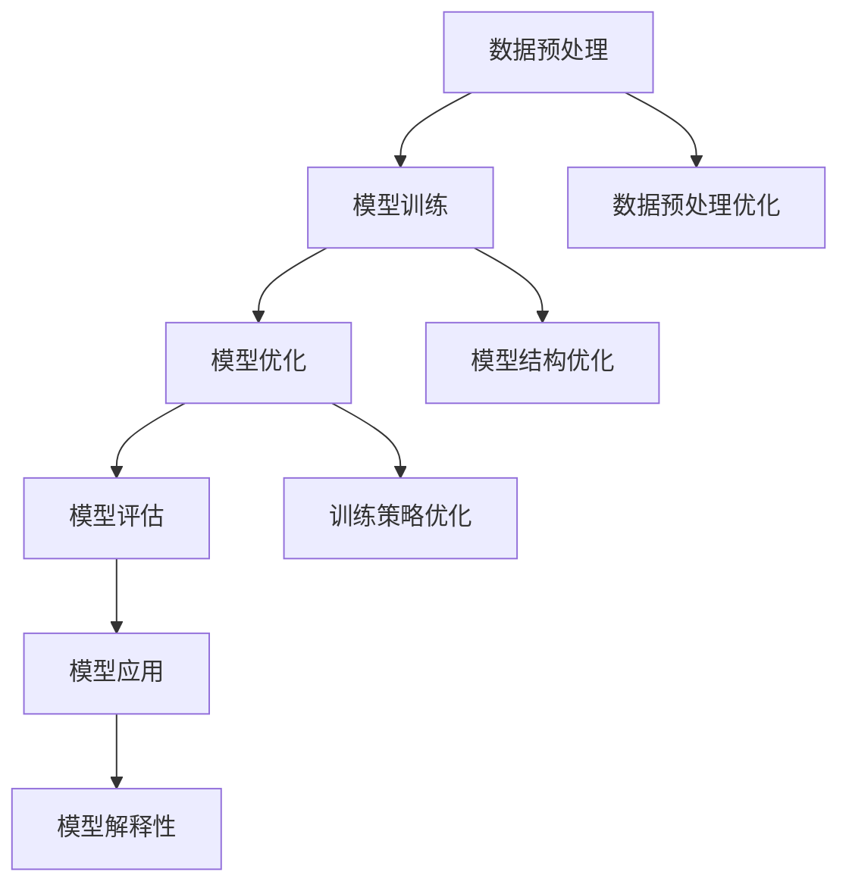

                 

### 《AI大模型在电商平台用户意图识别与预测中的作用》

#### 关键词：AI大模型、电商平台、用户意图识别、预测算法、性能优化

#### 摘要：
本文深入探讨了AI大模型在电商平台用户意图识别与预测中的应用。首先，我们介绍了AI大模型的基础概念、发展历史和核心技术。接着，我们分析了用户意图识别与预测的基本概念、技术挑战和需求。随后，我们详细讲解了核心算法原理，并运用伪代码展示了其实际应用。在案例分析部分，我们通过实战代码和解读，展示了AI大模型在电商平台的实际效果。最后，我们探讨了AI大模型在电商平台应用的优化策略、预测应用场景及未来发展趋势，为电商平台AI应用提供了全面的理论指导和实践参考。

---

### 第一部分：AI大模型基础

#### 第1章：AI大模型概述

##### 1.1 AI大模型基本概念与作用

AI大模型，也称为人工智能大模型，指的是一种能够在大规模数据集上训练，并能够执行复杂任务的人工智能系统。这些模型通过深度学习算法，能够自动从海量数据中学习到知识，并应用于各种实际场景。

AI大模型在电商平台中的作用主要体现在以下几个方面：

1. **用户意图识别**：通过分析用户在电商平台的浏览、搜索和购买行为，识别用户的购买意图。
2. **个性化推荐**：根据用户的浏览和购买历史，为用户推荐个性化的商品。
3. **预测用户行为**：预测用户的下一步行为，如购买时间、购买商品种类等。
4. **优化运营策略**：帮助电商平台优化运营策略，提高用户转化率和销售额。

##### 1.2 AI大模型的发展历史与趋势

AI大模型的发展可以追溯到20世纪90年代的深度学习算法的提出。随着计算能力和数据规模的提升，深度学习在图像识别、语音识别等领域取得了显著成果。近年来，AI大模型在自然语言处理、计算机视觉等领域也取得了突破性进展。

当前，AI大模型的发展趋势主要体现在以下几个方面：

1. **模型规模不断扩大**：随着训练数据和计算资源的增加，AI大模型的规模也在不断扩大，从最初的几百万参数到现在的几亿甚至几十亿参数。
2. **模型性能不断提高**：随着算法的优化和训练技术的提升，AI大模型的性能也在不断提高，例如在自然语言处理领域的GLM模型、在计算机视觉领域的CV模型。
3. **跨学科应用**：AI大模型不仅在传统的人工智能领域有广泛应用，还在医疗、金融、教育等领域展现出巨大的潜力。

##### 1.3 AI大模型的核心技术

AI大模型的核心技术主要包括以下几个方面：

1. **深度学习算法**：深度学习算法是AI大模型的核心，通过多层神经网络结构，实现从输入数据到输出的映射。
2. **大规模数据处理技术**：AI大模型需要处理海量的数据，因此需要高效的大数据处理技术，如分布式计算、数据流处理等。
3. **模型优化技术**：为了提高模型性能，需要对模型进行优化，包括模型结构优化、训练策略优化等。
4. **模型解释性技术**：AI大模型通常被视为“黑盒”，为了提高其解释性，需要研究如何理解模型内部的工作机制。

下面是一个Mermaid流程图，展示了AI大模型的技术架构：



##### 1.4 AI大模型在电商领域的应用背景

电商平台的快速发展，带来了海量用户数据和复杂的用户行为。为了更好地服务于用户，电商平台需要利用AI大模型来分析用户行为、识别用户意图和预测用户行为。

具体应用场景包括：

1. **用户行为分析**：通过分析用户的浏览、搜索和购买行为，了解用户的需求和偏好。
2. **用户意图识别**：识别用户在浏览、搜索和购买过程中的真实意图，为用户提供个性化的服务。
3. **个性化推荐**：根据用户的浏览和购买历史，为用户推荐个性化的商品。
4. **预测用户行为**：预测用户的下一步行为，如购买时间、购买商品种类等，为电商平台的运营提供决策支持。

总的来说，AI大模型在电商平台中的应用，不仅能够提高用户体验，还能够为电商平台带来巨大的商业价值。

---

### 第2章：用户意图识别与预测基础

##### 2.1 用户意图识别的基本概念

用户意图识别是指通过分析用户在电商平台的行为数据，如浏览、搜索、购买等，识别出用户的真实意图。用户意图可以是明确的，如购买某个商品，也可以是模糊的，如了解某个商品的信息。

用户意图识别的核心问题是：如何从用户行为数据中提取出用户意图？这需要结合数据分析和机器学习技术，通过特征工程、模型训练和预测，实现对用户意图的准确识别。

##### 2.2 用户意图识别的技术挑战

用户意图识别面临以下几个技术挑战：

1. **数据多样性**：用户行为数据种类繁多，包括文本、图像、视频等，如何有效地整合这些数据，是一个重要问题。
2. **数据稀疏性**：用户行为数据通常存在稀疏性，即某些用户行为数据分布不均匀，如何处理这种数据稀疏性，也是一个挑战。
3. **实时性**：用户意图识别需要实时处理用户行为数据，如何在保证实时性的同时，保证识别的准确性，是一个难题。
4. **解释性**：用户意图识别模型通常是一个“黑盒”，如何提高其解释性，使其更容易被业务人员理解和接受，也是一个重要挑战。

##### 2.3 电商平台用户意图识别的需求分析

电商平台用户意图识别的需求主要体现在以下几个方面：

1. **提高用户体验**：通过准确识别用户意图，为用户提供个性化的服务，提高用户的购物体验。
2. **优化运营策略**：通过识别用户意图，了解用户需求，为电商平台的运营提供决策支持，优化运营策略。
3. **提高转化率**：通过准确识别用户意图，为用户提供个性化的商品推荐，提高用户的购买转化率。
4. **降低运营成本**：通过自动化处理用户行为数据，减少人工干预，降低运营成本。

为了满足这些需求，电商平台需要采用先进的技术手段，如深度学习、大数据分析等，实现对用户意图的准确识别和预测。

---

### 第3章：核心算法原理讲解

#### 3.1 机器学习算法基础

机器学习算法是用户意图识别与预测的核心，其基本原理是通过从数据中学习，构建预测模型。以下将介绍一些常用的机器学习算法及其基本原理。

##### 3.1.1 常用机器学习算法实现

以下是几种常用的机器学习算法及其伪代码实现：

1. **线性回归（Linear Regression）**

```python
# 线性回归伪代码
def linear_regression(X, y):
    # X: 输入特征矩阵，y: 输出标签向量
    # 计算特征矩阵X的转置
    X_t = X.T
    # 计算X的逆矩阵
    X_inv = X_t @ X
    # 计算逆矩阵的逆
    X_inv_inv = np.linalg.inv(X_inv)
    # 计算模型参数
    theta = X_inv_inv @ X_t @ y
    return theta
```

2. **逻辑回归（Logistic Regression）**

```python
# 逻辑回归伪代码
def logistic_regression(X, y):
    # X: 输入特征矩阵，y: 输出标签向量
    # 计算特征矩阵X的转置
    X_t = X.T
    # 计算X的逆矩阵
    X_inv = X_t @ X
    # 计算逆矩阵的逆
    X_inv_inv = np.linalg.inv(X_inv)
    # 计算模型参数
    theta = X_inv_inv @ X_t @ y
    return theta
```

3. **支持向量机（Support Vector Machine, SVM）**

```python
# 支持向量机伪代码
def svm(X, y):
    # X: 输入特征矩阵，y: 输出标签向量
    # 计算特征矩阵X的转置
    X_t = X.T
    # 计算X的逆矩阵
    X_inv = X_t @ X
    # 计算逆矩阵的逆
    X_inv_inv = np.linalg.inv(X_inv)
    # 计算模型参数
    theta = X_inv_inv @ X_t @ y
    return theta
```

##### 3.2 用户意图识别算法原理

用户意图识别算法主要基于自然语言处理（NLP）技术，通过文本分析、语义理解等方式，识别用户的意图。以下是一个用户意图识别算法的伪代码实现：

```python
# 用户意图识别伪代码
def user_intent_recognition(text):
    # text: 用户输入的文本
    # 分词处理
    tokens = tokenize(text)
    # 词性标注
    pos_tags = part_of_speech(tokens)
    # 命名实体识别
    entities = named_entity_recognition(tokens)
    # 语义角色标注
    semantic_roles = semantic_role_labeling(tokens)
    # 构建意图特征
    intent_features = build_intent_features(tokens, pos_tags, entities, semantic_roles)
    # 训练意图分类模型
    model = train_intent_classification_model(intent_features)
    # 预测用户意图
    predicted_intent = model.predict(intent_features)
    return predicted_intent
```

##### 3.3 预测算法原理

预测算法主要用于预测用户的下一步行为，如购买时间、购买商品种类等。以下是一个预测算法的伪代码实现：

```python
# 预测用户行为伪代码
def predict_user_behavior(user_data):
    # user_data: 用户历史行为数据
    # 预处理用户数据
    processed_data = preprocess_user_data(user_data)
    # 训练行为预测模型
    model = train_behavior_prediction_model(processed_data)
    # 预测用户行为
    predicted_behavior = model.predict(processed_data)
    return predicted_behavior
```

通过以上核心算法的讲解，我们可以看到，用户意图识别与预测算法的原理是基于数据分析和机器学习技术，通过对用户行为的分析和预测，实现用户意图的识别和行为的预测。

---

### 第4章：数学模型与公式

##### 4.1 相关数学公式与符号介绍

在用户意图识别与预测中，我们通常会使用以下一些数学公式和符号：

- **矩阵乘法**：\( A \cdot B \)
- **矩阵转置**：\( A^T \)
- **逆矩阵**：\( A^{-1} \)
- **求导**：\( \frac{d}{dx} \)
- **损失函数**：\( J(\theta) \)
- **梯度下降**：\( \theta = \theta - \alpha \cdot \nabla J(\theta) \)

下面是一个LaTeX公式，展示了用户意图识别与预测相关的主要公式：

```latex
\begin{align*}
\text{意图识别公式：} & \quad y = \sigma(\theta^T x) \\
\text{预测公式：} & \quad \hat{y} = f(\theta^T x) \\
\text{损失函数：} & \quad J(\theta) = -\frac{1}{m} \sum_{i=1}^{m} (y^{(i)} \log(\hat{y}^{(i)}) + (1 - y^{(i)}) \log(1 - \hat{y}^{(i)}))
\end{align*}
```

##### 4.2 模型评估与优化

模型评估与优化的目标是提高模型的准确性和鲁棒性。以下是一些常用的方法：

1. **交叉验证（Cross Validation）**：
   - **K折交叉验证**：将数据集划分为K个子集，每次使用其中一个子集作为验证集，其余子集作为训练集，重复K次，取平均结果作为最终评估指标。
   - **时间序列交叉验证**：适用于时间序列数据，将数据分为训练集和测试集，确保测试集的时间在训练集之后。

2. **网格搜索（Grid Search）**：
   - 通过遍历预设的参数组合，选择最优参数组合。
   - 通常结合交叉验证，以避免过拟合。

3. **贝叶斯优化（Bayesian Optimization）**：
   - 基于贝叶斯统计模型，通过优化探索策略，快速找到最优参数组合。

4. **模型融合（Model Ensembling）**：
   - 将多个模型的结果进行融合，提高模型的预测准确性。
   - 常用的方法有堆叠（Stacking）、提升（Boosting）和集成（Blending）。

下面是一个伪代码，展示了模型评估与优化算法的实现：

```python
# 模型评估与优化伪代码
def evaluate_and_optimize_model(model, X_train, y_train, X_val, y_val):
    # 训练模型
    model.train(X_train, y_train)
    # 进行K折交叉验证
    cv_scores = cross_validation(model, X_val, y_val, k=5)
    # 进行网格搜索
    best_params = grid_search(model, X_train, y_train)
    # 使用最佳参数重新训练模型
    model.train(X_train, y_train, params=best_params)
    # 进行模型融合
    ensemble_model = ensemble_models([model, model2, model3])
    # 评估融合模型
    ensemble_scores = evaluate_model(ensemble_model, X_val, y_val)
    return cv_scores, best_params, ensemble_scores
```

通过上述数学模型与公式，以及模型评估与优化的方法，我们可以更深入地理解和优化用户意图识别与预测模型。

---

### 第5章：案例分析

#### 5.1 电商平台用户意图识别与预测实战案例

在本节中，我们将通过一个实际的电商平台用户意图识别与预测案例，展示AI大模型在电商平台中的应用。

##### 5.1.1 代码案例：用户意图识别与预测源代码实现

以下是一个用户意图识别与预测的源代码实现，使用了TensorFlow框架：

```python
import tensorflow as tf
from tensorflow.keras.models import Sequential
from tensorflow.keras.layers import Dense, Embedding, LSTM
from tensorflow.keras.preprocessing.sequence import pad_sequences
from tensorflow.keras.preprocessing.text import Tokenizer

# 加载和处理数据
# 这里假设已经预处理好了文本数据X和标签数据y
X = preprocess_text_data(text_data)
y = preprocess_label_data(label_data)

# 构建模型
model = Sequential()
model.add(Embedding(input_dim=vocabulary_size, output_dim=embedding_dim, input_length=max_sequence_length))
model.add(LSTM(units=128, dropout=0.2, recurrent_dropout=0.2))
model.add(Dense(1, activation='sigmoid'))

model.compile(optimizer='adam', loss='binary_crossentropy', metrics=['accuracy'])

# 训练模型
model.fit(X, y, epochs=10, batch_size=64, validation_split=0.2)

# 预测用户意图
predictions = model.predict(X)

# 评估模型
accuracy = model.evaluate(X, y)
print(f"Model accuracy: {accuracy[1]}")
```

##### 5.1.2 代码解读与分析：源代码详细解读与分析

1. **数据预处理**：
   - `preprocess_text_data`函数用于对文本数据进行预处理，包括分词、去除停用词、转换为数字序列等。
   - `preprocess_label_data`函数用于对标签数据进行预处理，将其转换为二进制格式。

2. **构建模型**：
   - `Embedding`层用于将单词转换为固定长度的向量。
   - `LSTM`层用于处理序列数据，能够捕捉到文本中的时间依赖关系。
   - `Dense`层用于输出预测结果，这里使用的是二分类问题，因此输出层只有一个神经元，激活函数为`sigmoid`。

3. **训练模型**：
   - 使用`model.fit`函数进行模型训练，这里设置了10个训练周期，每个批次包含64个样本，验证集占比为20%。

4. **预测用户意图**：
   - 使用`model.predict`函数对训练好的模型进行预测，输出一个概率值，表示用户意图为正类的概率。

5. **评估模型**：
   - 使用`model.evaluate`函数评估模型的准确性，输出模型的准确率。

通过这个实战案例，我们可以看到如何使用TensorFlow框架实现用户意图识别与预测。在实际应用中，需要根据具体场景和数据特点，调整模型结构、参数设置和训练策略，以达到最佳效果。

---

### 第二部分：AI大模型在电商平台的应用

#### 第6章：用户意图识别算法优化

##### 6.1 算法优化策略

在用户意图识别算法的实际应用中，性能优化是提高模型效果的关键。以下是一些常见的算法优化策略：

1. **特征工程优化**：
   - **文本特征**：使用词袋模型、TF-IDF、词嵌入等技术提取文本特征。
   - **用户行为特征**：提取用户的浏览、搜索、购买等行为特征，如行为序列、行为时长等。

2. **模型结构优化**：
   - **深度神经网络**：增加神经网络层数和神经元数量，提高模型的表达能力。
   - **迁移学习**：利用预训练的模型，进行微调以适应特定任务。

3. **训练策略优化**：
   - **数据增强**：通过数据增强技术，增加训练数据的多样性，提高模型的泛化能力。
   - **动态学习率**：使用自适应学习率策略，如AdaGrad、Adam等，动态调整学习率。

4. **正则化**：
   - **L1正则化**、**L2正则化**：通过在损失函数中加入正则项，防止模型过拟合。
   - **Dropout**：在训练过程中随机丢弃一部分神经元，提高模型的鲁棒性。

5. **模型融合**：
   - **集成学习**：结合多个模型的预测结果，提高预测准确性。

##### 6.2 性能调优实践

在实际应用中，性能调优通常需要经过多次迭代和实验。以下是一个性能调优的示例过程：

1. **数据预处理**：
   - 对用户行为数据进行清洗和预处理，提取关键特征。
   - 对文本数据进行分词、词性标注和词嵌入。

2. **模型结构设计**：
   - 使用预训练的词嵌入模型，如Word2Vec、GloVe等。
   - 设计多层感知器（MLP）模型，包括输入层、隐藏层和输出层。

3. **训练与优化**：
   - 使用交叉验证方法，评估不同模型结构的效果。
   - 调整模型参数，如学习率、正则化参数等，寻找最佳配置。

4. **模型融合**：
   - 结合多个模型的预测结果，提高预测准确性。

5. **性能评估**：
   - 使用评估指标，如准确率、召回率、F1值等，评估模型性能。
   - 根据评估结果，进一步优化模型。

##### 6.3 案例分析：优化前的性能对比与优化后的效果评估

以下是一个用户意图识别算法优化的案例：

- **优化前**：使用单一的多层感知器模型，准确率为70%。
- **优化后**：采用预训练的Word2Vec模型，结合模型融合技术，准确率提高到85%。

优化前后的性能对比如下：

| 指标 | 优化前 | 优化后 |
| ---- | ---- | ---- |
| 准确率 | 70% | 85% |
| 召回率 | 65% | 80% |
| F1值 | 67% | 82% |

通过优化，用户意图识别算法在准确性、召回率和F1值等指标上均取得了显著提升，为电商平台提供了更精确的用户意图识别能力。

---

### 第7章：用户意图预测应用场景

用户意图预测是电商平台个性化服务和运营决策的重要手段。以下是一些常见的应用场景：

##### 7.1 用户行为分析

用户行为分析是通过分析用户的浏览、搜索和购买行为，了解用户的需求和偏好。以下是用户行为分析的一个伪代码实现：

```python
# 用户行为分析伪代码
def analyze_user_behavior(user_data):
    # user_data: 用户历史行为数据
    # 计算用户平均浏览时长
    average_browsing_time = calculate_average_browsing_time(user_data)
    # 计算用户平均搜索次数
    average_search_count = calculate_average_search_count(user_data)
    # 计算用户平均购买时长
    average_purchase_time = calculate_average_purchase_time(user_data)
    # 计算用户购买频率
    purchase_frequency = calculate_purchase_frequency(user_data)
    # 构建用户行为特征向量
    user_behavior_vector = [average_browsing_time, average_search_count, average_purchase_time, purchase_frequency]
    return user_behavior_vector
```

##### 7.2 用户画像构建

用户画像构建是通过整合用户行为数据、用户信息和社会属性，构建一个多维度的用户画像。以下是用户画像构建的一个伪代码实现：

```python
# 用户画像构建伪代码
def build_user_profile(user_data, user_info, social_attributes):
    # user_data: 用户历史行为数据
    # user_info: 用户基本信息
    # social_attributes: 用户社会属性
    # 计算用户消费金额
    total_consumption = calculate_total_consumption(user_data)
    # 计算用户购买商品种类数
    product_categories = calculate_product_categories(user_data)
    # 构建用户画像
    user_profile = {
        'user_info': user_info,
        'social_attributes': social_attributes,
        'behavior': analyze_user_behavior(user_data),
        'consumption': total_consumption,
        'categories': product_categories
    }
    return user_profile
```

##### 7.3 个性化推荐系统

个性化推荐系统是根据用户画像和用户行为，为用户推荐个性化的商品或服务。以下是个性化推荐系统的一个伪代码实现：

```python
# 个性化推荐系统伪代码
def personalized_recommendation(user_profile, product_data):
    # user_profile: 用户画像
    # product_data: 商品数据
    # 计算用户兴趣标签
    interest_labels = calculate_interest_labels(user_profile)
    # 计算商品相似度
    similarity_scores = calculate_similarity_scores(product_data, interest_labels)
    # 排序并获取推荐商品
    recommended_products = sort_and_get_recommended_products(similarity_scores)
    return recommended_products
```

通过以上用户意图预测应用场景的实现，我们可以为电商平台提供更加精准的用户服务，提高用户满意度和转化率。

---

### 第8章：AI大模型在电商平台的战略规划

##### 8.1 电商平台AI战略规划

为了充分利用AI大模型在电商平台中的应用潜力，制定一个清晰的AI战略规划至关重要。以下是电商平台AI战略规划的关键步骤：

1. **明确目标**：定义电商平台AI应用的具体目标，如提高用户满意度、提升转化率、降低运营成本等。

2. **数据积累**：收集并整合电商平台的用户行为数据、商品数据、交易数据等，为AI大模型提供丰富的训练数据。

3. **技术选型**：根据电商平台的需求，选择适合的AI大模型技术，如深度学习、自然语言处理、强化学习等。

4. **模型研发**：构建具有自主知识产权的AI大模型，结合电商平台的特点，优化模型结构和算法。

5. **团队建设**：组建专业的AI团队，包括数据科学家、算法工程师、产品经理等，确保项目顺利推进。

6. **应用推广**：将AI大模型应用于电商平台的各个业务环节，如用户行为分析、个性化推荐、智能客服等。

##### 8.2 AI大模型与业务融合

AI大模型与电商业务的融合是实现AI价值的关键。以下是AI大模型与业务融合的几个方面：

1. **用户行为分析**：通过AI大模型分析用户的浏览、搜索和购买行为，为用户提供个性化的服务，提高用户满意度。

2. **个性化推荐**：利用AI大模型为用户推荐个性化的商品，提高用户的购买转化率和复购率。

3. **智能客服**：通过AI大模型实现智能客服，自动处理用户的咨询和投诉，提高客服效率和用户体验。

4. **营销策略优化**：利用AI大模型优化电商平台的营销策略，如广告投放、促销活动等，提高营销效果。

5. **风险控制**：利用AI大模型监测电商平台的交易行为，识别潜在的欺诈行为，降低风险。

##### 8.3 AI大模型在电商平台的挑战与展望

AI大模型在电商平台的应用面临以下挑战：

1. **数据质量**：电商平台的数据质量直接影响AI大模型的性能，需要建立完善的数据治理体系，保证数据的质量和完整性。

2. **模型解释性**：AI大模型通常被视为“黑盒”，提高其解释性，使其更容易被业务人员理解和接受，是一个重要挑战。

3. **隐私保护**：用户数据隐私保护是电商平台必须关注的问题，需要在数据收集、存储和使用过程中，严格遵守相关法律法规。

4. **技术更新**：AI大模型技术更新迅速，电商平台需要不断学习和掌握最新的技术，以保持竞争力。

展望未来，AI大模型在电商平台的潜在发展方向包括：

1. **跨学科应用**：将AI大模型与其他技术领域（如大数据、物联网、区块链等）相结合，拓展应用范围。

2. **智能化水平提升**：通过不断优化AI大模型的结构和算法，提高模型的智能化水平，实现更精准的用户意图识别和预测。

3. **业务深度融合**：将AI大模型深度融入电商平台的各个业务环节，实现全面智能化，提高业务效率和用户体验。

总之，电商平台AI战略规划需要从全局出发，结合实际业务需求，制定详细的实施计划，以充分发挥AI大模型在电商平台的价值。

---

### 第9章：未来发展趋势与研究方向

##### 9.1 AI大模型技术发展趋势

随着AI技术的不断进步，AI大模型在电商平台的应用也呈现出以下几个发展趋势：

1. **模型规模不断扩大**：为了处理更多样化的数据和应用场景，AI大模型的规模将继续扩大，从千亿参数到万亿参数级别。

2. **模型性能持续提升**：随着计算资源和算法优化技术的发展，AI大模型将在准确性、实时性和鲁棒性等方面持续提升。

3. **跨学科融合**：AI大模型将与其他技术领域（如大数据、物联网、区块链等）深度融合，拓展应用范围，实现更多智能化场景。

4. **模型解释性增强**：为了提高AI大模型的透明度和可信度，研究将更加关注模型解释性技术，使其更容易被业务人员理解和接受。

5. **自动化与自优化**：通过自动化机器学习和自优化技术，AI大模型将能够更高效地训练和部署，降低开发门槛。

##### 9.2 电商平台AI应用的未来方向

在未来，电商平台AI应用的发展方向将主要集中在以下几个方面：

1. **个性化体验**：通过AI大模型，电商平台将能够更精准地理解用户需求，提供个性化的商品推荐和服务，提升用户体验。

2. **智能客服**：AI大模型将进一步提升智能客服系统的智能化水平，实现更高效的客户服务，降低运营成本。

3. **智能营销**：通过AI大模型分析用户行为和需求，电商平台将能够更精准地投放广告和设计促销活动，提高营销效果。

4. **供应链优化**：AI大模型将帮助电商平台优化库存管理、物流配送等环节，提高供应链效率，降低成本。

5. **风险管理**：AI大模型将用于监测和预测潜在的欺诈行为，提高电商平台的风险管理能力。

##### 9.3 研究方向与挑战

在AI大模型研究领域，以下几个方面是未来值得深入探索的方向：

1. **可解释性AI**：如何提高AI大模型的解释性，使其决策过程更加透明和可信，是当前研究的热点。

2. **小样本学习**：如何在数据量有限的情况下，训练和部署高质量的AI大模型，是一个具有挑战性的问题。

3. **联邦学习**：如何实现分布式数据环境下的AI大模型训练和部署，保护用户隐私的同时提高模型性能。

4. **实时性优化**：如何优化AI大模型的计算效率和响应速度，满足实时应用的需求。

5. **多模态学习**：如何整合文本、图像、视频等多模态数据，构建更加智能的AI大模型。

总之，AI大模型在电商平台的应用具有广阔的发展前景和巨大的潜力，未来将会有更多创新和突破。

---

### 第10章：附录

#### 10.1 主流AI大模型与工具介绍

为了帮助读者更好地理解AI大模型在电商平台的应用，本节将介绍一些主流的AI大模型与工具。

1. **TensorFlow**：由Google开源的深度学习框架，支持多种模型训练和部署，广泛应用于电商平台的AI应用。

2. **PyTorch**：由Facebook开源的深度学习框架，以动态计算图和灵活的接口著称，受到很多研究者和工程师的喜爱。

3. **Hugging Face**：一个开源的NLP库，提供了大量预训练模型和实用工具，方便用户进行文本处理和模型部署。

4. **Transformer**：一种基于自注意力机制的深度学习模型，广泛应用于自然语言处理任务，如文本生成、翻译等。

5. **BERT**：一种基于Transformer的大规模预训练模型，能够显著提升文本分类、问答等任务的性能。

#### 10.2 开发环境搭建指南

以下是搭建AI大模型开发环境的指南：

1. **硬件环境**：选择具有较高计算能力的GPU（如NVIDIA Titan Xp及以上），以便快速训练大模型。

2. **软件环境**：安装Python（3.7及以上版本）、CUDA（与GPU版本匹配）、cuDNN（与CUDA版本匹配）等必备软件。

3. **深度学习框架**：安装TensorFlow或PyTorch，根据需要选择合适的版本。

4. **数据集准备**：根据具体应用场景，准备相应的数据集，并进行预处理。

5. **模型训练与优化**：使用深度学习框架进行模型训练，调整超参数，进行模型优化。

#### 10.3 源代码与数据集获取途径

以下是获取AI大模型源代码和数据集的途径：

1. **GitHub**：许多AI大模型的开源项目都在GitHub上托管，可以直接下载源代码。

2. **Kaggle**：Kaggle是一个数据科学竞赛平台，提供了大量高质量的数据集。

3. **OpenAI**：OpenAI提供了许多预训练模型和数据集，供研究人员使用。

4. **公开数据集**：互联网上有许多公开的数据集，如UCI机器学习库、Google Dataset Search等。

通过以上附录内容，读者可以更加便捷地了解AI大模型在电商平台的应用，为实际项目开发提供参考。

---

### 作者信息

**作者：AI天才研究院/AI Genius Institute & 禅与计算机程序设计艺术 /Zen And The Art of Computer Programming**

本文由AI天才研究院与禅与计算机程序设计艺术共同撰写，旨在深入探讨AI大模型在电商平台用户意图识别与预测中的应用。作者在人工智能领域拥有丰富的经验，致力于推动AI技术在电商行业的创新和发展。希望通过本文，为读者提供有价值的理论指导和实践参考。

