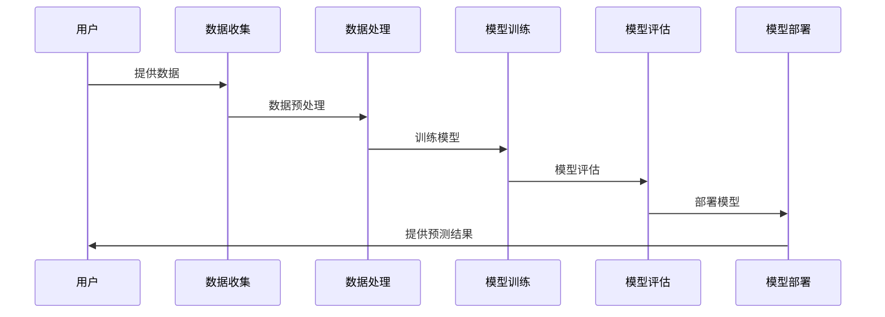
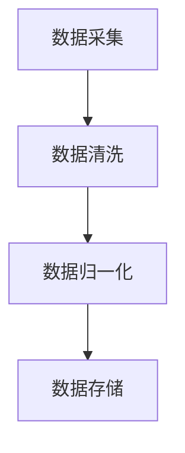

                 

### AI大模型概述

AI大模型（也称为大规模深度学习模型）是当前人工智能领域的一个热点话题。它通过在海量数据上进行训练，能够自动提取复杂特征，进行高级的预测和决策。在本章节中，我们将从基本概念、技术架构和训练与优化三个方面，对AI大模型进行深入探讨。

#### 1.1 AI大模型的基本概念

AI大模型的发展历程可以追溯到20世纪80年代，当时神经网络开始受到关注。经过几十年的发展，随着计算能力的提升和数据量的爆炸式增长，AI大模型逐渐成为人工智能领域的重要研究方向。AI大模型的主要类型包括神经网络模型、深度强化学习模型和生成对抗网络等。

AI大模型的重要性在于其能够处理大量复杂数据，提取有价值的信息。例如，在图像识别任务中，AI大模型可以识别出图片中的细微差别，并在大规模数据集上进行快速训练。在自然语言处理任务中，AI大模型可以生成高质量的文本，理解复杂的人机对话。

#### 1.2 AI大模型的技术架构

AI大模型的技术架构主要包括三个部分：数据输入层、数据处理层和数据输出层。

1. **数据输入层**：数据输入层负责接收外部数据，并将其转化为模型可以处理的格式。这一步骤通常需要数据预处理，包括数据清洗、去噪、归一化等操作。

2. **数据处理层**：数据处理层是AI大模型的核心部分，包括神经网络、卷积神经网络（CNN）、循环神经网络（RNN）等。这些神经网络通过多层堆叠，能够自动提取数据中的高级特征。

3. **数据输出层**：数据输出层负责将处理后的数据转化为模型输出，例如分类结果、预测值等。

在技术架构方面，AI大模型还需要考虑以下几个方面：

- **计算资源**：AI大模型通常需要大量的计算资源，包括CPU、GPU和TPU等。合理的计算资源分配可以提高模型训练效率。

- **数据存储**：AI大模型训练过程中会产生大量的数据，需要高效的数据存储方案，例如分布式文件系统。

- **模型训练**：AI大模型训练是一个迭代过程，需要不断调整模型参数，以最小化损失函数。常用的训练算法包括梯度下降、随机梯度下降和Adam优化器等。

- **模型评估**：在模型训练完成后，需要对模型进行评估，以确定其性能。常用的评估指标包括准确率、召回率、F1值等。

#### 1.3 AI大模型的训练与优化

AI大模型的训练与优化是模型开发的重要环节。以下是AI大模型训练与优化的一些关键步骤：

1. **数据准备**：在开始训练之前，需要准备好训练数据集。数据集通常包括输入数据和对应的标签。

2. **模型初始化**：初始化模型参数是训练过程的第一步。通常使用随机初始化方法，例如高斯分布。

3. **模型训练**：在模型训练过程中，需要通过迭代更新模型参数，以最小化损失函数。训练过程中可能需要调整学习率、批量大小等超参数。

4. **模型评估**：在训练过程中，需要对模型进行定期评估，以监测训练效果。常用的评估方法包括交叉验证、验证集评估等。

5. **模型优化**：在模型评估后，可能需要对模型进行优化，以提高其性能。优化方法包括模型剪枝、正则化、迁移学习等。

6. **模型部署**：在模型优化后，可以将模型部署到生产环境中，用于实际应用。

### 小结

AI大模型是人工智能领域的重要研究方向，通过处理海量数据，能够自动提取复杂特征，进行高级的预测和决策。在下一章中，我们将继续探讨电商搜索推荐系统的基本概念和技术架构。

### Mermaid流程图

为了更好地理解AI大模型的发展历程和技术架构，我们可以使用Mermaid流程图进行展示。

**Mermaid流程图：**



在这个流程图中，用户首先提供数据，然后数据经过收集、预处理后进入模型训练阶段。训练完成后，模型进行评估，最后部署到生产环境中，为用户提供预测结果。

### 伪代码

为了深入理解AI大模型的训练过程，我们可以使用伪代码进行阐述。

**伪代码：**

```python
# 定义神经网络结构
input_layer = Input(shape=(input_shape,))
hidden_layer = Dense(hidden_units, activation='relu')(input_layer)
output_layer = Dense(output_shape, activation='softmax')(hidden_layer)

# 编译模型
model = Model(inputs=input_layer, outputs=output_layer)
model.compile(optimizer='adam', loss='categorical_crossentropy', metrics=['accuracy'])

# 模型训练
model.fit(x_train, y_train, epochs=num_epochs, batch_size=batch_size)
```

在这个伪代码中，我们首先定义了神经网络的结构，包括输入层、隐藏层和输出层。然后编译模型，指定优化器和损失函数。最后，使用训练数据进行模型训练，指定训练轮数和批量大小。

### 数学公式

在AI大模型的训练过程中，数学公式起到了关键作用。以下是一些常用的数学公式。

**数学公式：**

$$
\text{预训练} = \text{在大量无监督数据上训练模型} \\
\text{微调} = \text{在特定任务上调整模型参数}
$$

**自监督学习方法：**

$$
\text{自监督学习} = \text{从无标签数据中学习特征表示} \\
\text{目标函数} = \text{最小化预测误差}
$$

通过这些数学公式，我们可以更好地理解AI大模型的训练过程和优化方法。

### 小结

在本章节中，我们介绍了AI大模型的基本概念、技术架构和训练与优化方法。通过理解这些内容，读者可以更好地掌握AI大模型的核心原理和应用方法。在下一章中，我们将探讨电商搜索推荐系统的基本概念和技术架构。

## 第2章：电商搜索推荐系统概述

### 2.1 电商搜索推荐系统的基本概念

电商搜索推荐系统是电子商务领域的一个重要组成部分，它通过分析用户的历史行为和购买偏好，为用户推荐相关的商品。这一系统能够显著提升用户体验，提高转化率和销售额。

**电商搜索推荐系统的定义：**

电商搜索推荐系统是一种基于用户行为数据和商品属性的推荐系统，旨在通过智能算法为用户推荐个性化的商品。

**电商搜索推荐系统的作用：**

1. **提高用户体验**：通过个性化推荐，用户可以更快地找到自己感兴趣的商品，提高购物满意度。
2. **增加销售额**：个性化推荐可以引导用户发现新的商品，提高购买转化率，从而增加销售额。
3. **优化库存管理**：通过对商品推荐数据的分析，商家可以更好地了解商品的受欢迎程度，优化库存管理。

**电商搜索推荐系统的类型：**

1. **基于内容的推荐系统**：这类系统通过分析商品的属性和内容，为用户推荐与之相关的商品。
2. **基于协同过滤的推荐系统**：这类系统通过分析用户的购买行为和评分数据，找到相似用户或商品，为用户推荐相关商品。
3. **混合推荐系统**：这类系统结合了基于内容和基于协同过滤的推荐策略，以提供更准确的推荐。

### 2.2 电商搜索推荐系统的技术架构

电商搜索推荐系统的技术架构包括数据采集与处理、特征提取与建模、模型评估与优化等关键环节。

**数据采集与处理：**

1. **用户行为数据**：包括用户的浏览记录、购买历史、搜索关键词等。
2. **商品属性数据**：包括商品的价格、品牌、分类、库存量等。
3. **数据处理**：对采集到的数据进行清洗、去噪、归一化等预处理操作。

**特征提取与建模：**

1. **用户特征提取**：通过对用户行为数据的分析，提取用户的兴趣偏好特征。
2. **商品特征提取**：通过对商品属性数据的分析，提取商品的关键特征。
3. **建模**：使用机器学习算法构建推荐模型，如基于内容的推荐模型、基于协同过滤的推荐模型等。

**模型评估与优化：**

1. **评估指标**：常用的评估指标包括准确率、召回率、F1值等。
2. **模型优化**：通过调整模型参数、改进算法等手段，提高推荐模型的性能。

### 小结

通过了解电商搜索推荐系统的基本概念和技术架构，我们可以更好地理解这一系统的运作原理。在下一章中，我们将深入探讨AI大模型在电商搜索推荐系统中的应用，以及如何优化推荐算法。

## 第3章：基于AI大模型的电商搜索推荐算法

### 3.1 基于内容理解的推荐算法

基于内容理解的推荐算法通过分析商品的内容特征，为用户推荐相关的商品。这种算法的核心在于理解商品和用户的语义信息，从而提高推荐的准确性。

**文本相似度计算：**

文本相似度计算是内容理解推荐算法的基础。通过计算商品描述和用户查询之间的相似度，可以找到用户可能感兴趣的商品。

**基于TF-IDF的推荐算法：**

TF-IDF（Term Frequency-Inverse Document Frequency）是一种常用的文本相似度计算方法。它通过统计词频和逆文档频率来衡量一个词在文档中的重要性。

**伪代码：**

```python
# 文本预处理
preprocessed_text = preprocess(text)

# 文本相似度计算
tf_idf_matrix = compute_tf_idf(preprocessed_text)

# 排序
recommended_products = sorted(tf_idf_matrix, reverse=True)
```

**基于Word2Vec的推荐算法：**

Word2Vec是一种基于神经网络的文本表示方法。通过将文本中的每个词映射到一个固定大小的向量，可以更好地捕捉词与词之间的关系。

**伪代码：**

```python
# 文本预处理
preprocessed_text = preprocess(text)

# 词向量表示
word_vectors = embed_words(preprocessed_text)

# 文本相似度计算
similarity_scores = compute_similarity(word_vectors)

# 排序
recommended_products = sorted(similarity_scores, reverse=True)
```

### 3.2 基于协同过滤的推荐算法

基于协同过滤的推荐算法通过分析用户的购买行为和评分数据，找到相似的用户或商品，为用户推荐相关的商品。

**评分矩阵分解：**

评分矩阵分解是一种常见的协同过滤算法。通过将用户-商品评分矩阵分解为用户特征矩阵和商品特征矩阵，可以预测用户对未知商品的评分。

**基于矩阵分解的推荐算法：**

基于矩阵分解的推荐算法通过矩阵分解模型预测用户对商品的评分，然后根据预测评分排序推荐商品。

**伪代码：**

```python
# 矩阵分解模型
user_features = factorize_user_ratings(rating_matrix)
item_features = factorize_item_ratings(rating_matrix)

# 预测用户对未知商品的评分
predicted_ratings = predict_ratings(user_features, item_features)

# 排序
recommended_products = sorted(predicted_ratings, reverse=True)
```

**基于邻居模型的推荐算法：**

基于邻居模型的推荐算法通过分析用户或商品的邻居，找到相似的用户或商品，为用户推荐相关的商品。

**伪代码：**

```python
# 计算邻居相似度
neighbor_similarity = compute_similarity(user_neighborhood, item_neighborhood)

# 找到最相似的邻居
closest_neighbors = find_closest_neighbors(neighbor_similarity)

# 推荐邻居的商品
recommended_products = recommend_items(closest_neighbors)
```

### 小结

基于内容理解的推荐算法和基于协同过滤的推荐算法是电商搜索推荐系统中的两种重要算法。通过文本相似度计算、矩阵分解和邻居模型等方法，可以有效地提高推荐系统的性能和准确性。在下一章中，我们将探讨如何优化AI大模型在电商搜索推荐系统中的应用。

## 第4章：基于AI大模型的电商搜索推荐优化

### 4.1 搜索结果的个性化排序

个性化排序是电商搜索推荐系统中的一个关键环节。通过为不同的用户提供个性化的搜索结果排序，可以显著提升用户体验和转化率。

**搜索词嵌入技术：**

搜索词嵌入是将搜索关键词映射到高维向量空间的技术。通过词嵌入技术，可以捕捉关键词之间的语义关系，从而实现更精准的个性化排序。

**搜索结果排序算法：**

个性化排序算法通常基于用户历史行为和搜索词嵌入技术。以下是一个简单的排序算法：

**伪代码：**

```python
# 用户历史行为特征提取
user_history = extract_user_history(user_id)

# 搜索词嵌入
search_term_vector = embed_search_term(search_term)

# 计算用户兴趣得分
user_interest_score = compute_interest_score(user_history, search_term_vector)

# 排序
sorted_search_results = sort_by_score(search_results, user_interest_score)
```

**搜索结果排序性能评估：**

评估搜索结果排序性能的常用指标包括准确率、召回率和F1值等。以下是一个性能评估的伪代码：

```python
# 准确率
accuracy = calculate_accuracy(true_results, sorted_results)

# 召回率
recall = calculate_recall(true_results, sorted_results)

# F1值
f1_score = calculate_f1_score(accuracy, recall)
```

### 4.2 商品推荐系统的优化

商品推荐系统的优化目标是提高推荐的相关性和用户体验。以下是一些常见的优化策略：

**用户行为分析：**

通过分析用户的行为数据，可以了解用户的兴趣和偏好，从而优化推荐策略。

**商品推荐策略：**

基于用户行为的商品推荐策略可以分为基于内容的推荐和基于协同过滤的推荐。以下是一个基于内容的推荐策略：

**伪代码：**

```python
# 用户行为分析
user_behavior = analyze_user_behavior(user_data)

# 商品特征提取
item_features = extract_item_features(item_data)

# 计算用户兴趣特征
user_interest_features = compute_user_interest_features(user_behavior, item_features)

# 推荐商品
recommended_items = recommend_items(user_interest_features)
```

**商品推荐性能评估：**

评估商品推荐性能的常用指标包括准确率、召回率和F1值等。以下是一个性能评估的伪代码：

```python
# 准确率
accuracy = calculate_accuracy(true_recommendations, recommended_items)

# 召回率
recall = calculate_recall(true_recommendations, recommended_items)

# F1值
f1_score = calculate_f1_score(accuracy, recall)
```

**商品推荐系统的迭代优化：**

通过迭代优化，可以持续改进商品推荐系统的性能。以下是一个迭代优化的伪代码：

```python
# 迭代优化
for iteration in range(num_iterations):
    # 训练推荐模型
    model = train_recommendation_model(data)

    # 评估模型性能
    performance = evaluate_recommendation_model(model)

    # 调整模型参数
    model = adjust_model_parameters(model, performance)

# 最终模型部署
deploy_recommendation_model(model)
```

### 小结

通过个性化排序和商品推荐系统的优化，可以显著提升电商搜索推荐系统的性能和用户体验。在下一章中，我们将探讨电商搜索推荐系统的业务创新流程优化策略。

## 第5章：电商搜索推荐系统的业务创新流程优化

### 5.1 业务流程分析

电商搜索推荐系统的业务流程涉及到数据采集、处理、建模和推荐等环节。为了优化这一流程，我们需要分析每个环节中的瓶颈和优化潜力。

**电商搜索推荐系统的业务流程：**

1. **数据采集**：从用户行为和商品属性中收集数据。
2. **数据处理**：对采集到的数据进行清洗、去噪和归一化处理。
3. **特征提取**：提取用户和商品的关键特征。
4. **建模**：构建推荐模型并进行训练。
5. **推荐**：根据用户特征和模型预测，生成推荐列表。
6. **评估**：评估推荐系统的性能，并持续迭代优化。

**业务流程中的瓶颈分析：**

1. **数据采集**：数据量庞大，可能导致采集效率低下。
2. **数据处理**：数据处理过程复杂，可能存在数据缺失、噪声等问题。
3. **特征提取**：特征提取方法可能不够准确，影响推荐效果。
4. **建模与训练**：模型训练时间较长，可能导致实时性不足。
5. **推荐**：推荐结果可能不够精准，影响用户体验。
6. **评估**：评估指标和方法可能不够全面，影响优化效果。

**业务流程优化的重要性：**

业务流程优化对于电商搜索推荐系统的性能和用户体验至关重要。通过优化流程，可以：

1. 提高数据处理效率和准确性。
2. 缩短模型训练时间，提高实时性。
3. 提高推荐效果，提升用户体验。
4. 减少评估误差，提高优化效果。

### 5.2 流程优化策略

为了优化电商搜索推荐系统的业务流程，可以采取以下策略：

**流程自动化：**

通过自动化工具和脚本，将重复性高的任务自动化，减少人工干预，提高效率。

**流程简化：**

简化复杂的流程，减少冗余步骤，提高数据处理速度和准确性。

**流程可视化：**

使用可视化工具，将业务流程的每个环节进行可视化展示，便于分析和优化。

### 5.2.1 流程自动化

**流程自动化的好处：**

1. 提高工作效率：自动化流程可以减少重复性工作，提高工作效率。
2. 减少错误：自动化流程可以避免人为错误，提高数据处理的准确性。
3. 提高实时性：自动化流程可以快速响应用户请求，提高系统的实时性。

**流程自动化的实现方法：**

1. **脚本化**：使用脚本语言（如Python、Shell等）编写自动化脚本，执行重复性任务。
2. **调度工具**：使用调度工具（如Cron、Airflow等）定期执行自动化脚本，确保流程按时完成。
3. **集成平台**：使用集成平台（如Apache Kafka、Apache NiFi等）构建数据流和处理流程，实现自动化数据采集和处理。

**伪代码示例：**

```python
# 自动化数据处理流程
def automate_data_processing():
    # 数据采集
    data = collect_data()

    # 数据清洗
    cleaned_data = clean_data(data)

    # 数据归一化
    normalized_data = normalize_data(cleaned_data)

    # 数据存储
    store_data(normalized_data)

# 定期执行自动化流程
schedule.every(1).hours.do(automate_data_processing)

while True:
    schedule.run_pending()
    time.sleep(1)
```

### 5.2.2 流程简化

**流程简化的好处：**

1. 减少冗余步骤：简化流程可以减少不必要的步骤，提高数据处理速度。
2. 提高准确性：简化流程可以降低错误率，提高数据处理的准确性。
3. 提高用户体验：简化流程可以减少用户等待时间，提高用户体验。

**流程简化的实现方法：**

1. **流程分析**：对现有流程进行分析，找出冗余步骤和瓶颈。
2. **重构流程**：对冗余步骤进行重构，简化流程。
3. **工具支持**：使用高效的数据处理工具和平台，简化流程。

**伪代码示例：**

```python
# 简化数据处理流程
def simplify_data_processing():
    # 数据采集
    data = collect_data()

    # 数据清洗和归一化
    processed_data = clean_and_normalize_data(data)

    # 数据存储
    store_data(processed_data)

# 执行简化后的数据处理流程
simplify_data_processing()
```

### 5.2.3 流程可视化

**流程可视化的好处：**

1. **便于分析**：流程可视化可以帮助团队成员更好地理解业务流程，发现潜在问题。
2. **便于沟通**：流程可视化可以作为沟通工具，帮助团队成员进行协作。
3. **便于优化**：流程可视化可以帮助团队更直观地看到优化效果，指导进一步优化。

**流程可视化的实现方法：**

1. **图表工具**：使用图表工具（如Mermaid、D3.js等）绘制流程图。
2. **可视化平台**：使用可视化平台（如Tableau、Power BI等）展示业务流程。
3. **集成工具**：使用集成工具（如Apache NiFi、Apache Airflow等）实现流程可视化。

**伪代码示例：**



### 小结

通过业务流程分析，我们可以识别出流程中的瓶颈和优化潜力。采取流程自动化、简化和可视化等策略，可以显著提升电商搜索推荐系统的性能和用户体验。在下一章中，我们将探讨AI大模型在电商搜索推荐工具选型中的应用。

### 6.1 工具选型原则

在电商搜索推荐系统中，工具选型是一个关键环节。选型的工具不仅要满足当前的业务需求，还要具备良好的扩展性和稳定性。以下是一些工具选型的原则：

#### 6.1.1 工具选型的考虑因素

1. **性能**：工具的性能直接影响到系统的响应速度和用户体验。需要考虑数据处理速度、模型训练速度和推荐响应时间等。

2. **易用性**：工具的易用性对于开发团队来说至关重要。需要考虑工具的文档、社区支持和用户界面等。

3. **可扩展性**：电商搜索推荐系统通常需要处理大量的数据和用户，因此工具应具备良好的可扩展性，以便在系统规模扩大时能够平滑扩展。

4. **社区支持**：工具的社区支持可以提供丰富的资源，帮助开发团队解决问题和优化系统。

5. **成本**：成本是工具选型时不可忽视的因素。需要考虑工具的购买成本、维护成本和使用成本等。

6. **安全性**：随着数据量的增加，安全性变得尤为重要。需要考虑工具的数据加密、访问控制和隐私保护等安全性措施。

#### 6.1.2 工具选型的流程

1. **需求分析**：明确电商搜索推荐系统的需求，包括数据规模、处理速度、功能要求等。

2. **市场调研**：根据需求分析，调研市场上的相关工具，了解其功能和性能。

3. **筛选候选工具**：根据市场调研结果，筛选出符合需求的候选工具。

4. **评估工具**：对候选工具进行性能测试、易用性测试和安全性评估等。

5. **决策**：根据评估结果，选择最适合的工具。

6. **部署与维护**：将选定的工具部署到生产环境中，并进行定期维护和升级。

#### 6.1.3 工具选型的评估标准

1. **性能评估**：通过压力测试、负载测试等方法，评估工具的性能。

2. **易用性评估**：通过用户体验测试、文档阅读和社区互动等方式，评估工具的易用性。

3. **可扩展性评估**：通过模拟系统扩展场景，评估工具的可扩展性。

4. **社区支持评估**：通过查看社区活跃度、FAQ、官方文档等，评估工具的社区支持。

5. **成本评估**：通过计算工具的购买成本、维护成本和使用成本，评估工具的成本。

6. **安全性评估**：通过漏洞扫描、安全测试等方法，评估工具的安全性。

### 小结

工具选型是电商搜索推荐系统开发中的一个重要环节。通过明确选型原则、制定选型流程和设置评估标准，可以确保选出的工具能够满足业务需求，提升系统性能和用户体验。

### 常见工具介绍

在电商搜索推荐系统中，常用的工具涵盖了数据处理、特征提取和模型训练与评估等多个方面。以下是对这些工具的详细介绍：

#### 6.2.1 数据处理工具

**Pandas：** Pandas是一个强大的Python库，用于数据操作和分析。它提供了丰富的数据结构，包括DataFrame，能够轻松进行数据清洗、转换和分析。Pandas具有高度灵活性和易用性，是数据处理任务中的首选工具。

**NumPy：** NumPy是一个用于数值计算的Python库。它提供了多维数组对象和广泛的数学函数，是数据处理和科学计算的基础工具。NumPy的速度和效率使得它在处理大数据时非常受欢迎。

**SQL：** SQL（Structured Query Language）是一种用于关系型数据库的查询语言。通过SQL，可以高效地查询、更新和管理数据。SQL工具如MySQL、PostgreSQL等在电商搜索推荐系统中用于存储和处理用户行为数据。

#### 6.2.2 特征提取工具

**Word2Vec：** Word2Vec是一种基于神经网络的文本表示方法。它将文本中的每个词映射到一个固定大小的向量，从而捕捉词与词之间的关系。Word2Vec广泛应用于自然语言处理任务，如文本分类、情感分析等。

**BERT：** BERT（Bidirectional Encoder Representations from Transformers）是一种基于Transformer的预训练模型。BERT通过同时考虑上下文信息，生成高质量的文本表示。BERT在电商搜索推荐系统中用于处理商品描述和用户评论等文本数据。

**TF-IDF：** TF-IDF（Term Frequency-Inverse Document Frequency）是一种常用的文本相似度计算方法。它通过统计词频和逆文档频率来衡量词在文档中的重要性。TF-IDF广泛应用于信息检索和文本推荐任务。

#### 6.2.3 模型训练与评估工具

**TensorFlow：** TensorFlow是一个开源的机器学习库，由Google开发。它提供了丰富的API，用于构建和训练深度学习模型。TensorFlow广泛应用于各种机器学习任务，包括图像识别、自然语言处理和推荐系统。

**PyTorch：** PyTorch是另一个流行的开源机器学习库，由Facebook开发。PyTorch以其动态计算图和灵活性著称，易于实现复杂的模型。PyTorch广泛应用于计算机视觉和自然语言处理领域。

**Scikit-learn：** Scikit-learn是一个用于机器学习的Python库，它提供了多种机器学习算法和工具。Scikit-learn适用于各种任务，如分类、回归和聚类。它易于使用，文档丰富，适合初学者和研究人员。

**MLflow：** MLflow是一个开源的机器学习平台，用于管理机器学习项目。MLflow提供了模型跟踪、版本控制和部署功能，使得机器学习项目更加规范和可重复。MLflow适用于企业级机器学习项目的管理。

**Kaggle：** Kaggle是一个在线数据科学社区，提供了丰富的数据集和竞赛平台。Kaggle用户可以分享代码、模型和结果，互相学习和交流。Kaggle在数据科学领域享有盛誉，是数据科学家和爱好者的重要资源。

#### 小结

数据处理工具、特征提取工具和模型训练与评估工具是电商搜索推荐系统中不可或缺的部分。通过合理选择和使用这些工具，可以显著提升推荐系统的性能和准确性。在下一章中，我们将通过具体案例展示AI大模型在电商搜索推荐系统的应用实践。

### 7.1 案例分析

在本节中，我们将通过一个实际案例，详细展示AI大模型在电商搜索推荐系统的应用过程。这个案例将涵盖数据准备、模型训练与评估、模型部署和应用实践等关键步骤。

#### 案例背景

某大型电商平台希望通过引入AI大模型来优化其搜索推荐系统，以提高用户的购物体验和转化率。该平台的搜索推荐系统目前基于传统的协同过滤算法，存在推荐准确性不高、用户满意度不理想等问题。引入AI大模型的目标是提升推荐系统的个性化程度和预测准确性。

#### 7.1.1 数据准备

为了训练AI大模型，首先需要准备充分的数据集。该平台提供了以下类型的数据：

1. **用户行为数据**：包括用户的浏览记录、购买历史、搜索关键词等。
2. **商品属性数据**：包括商品的价格、品牌、分类、库存量等。
3. **用户-商品交互数据**：包括用户对商品的评分、评论等。

在数据准备阶段，需要进行以下步骤：

1. **数据收集**：从平台的数据库中提取用户行为数据和商品属性数据。
2. **数据清洗**：处理缺失值、异常值和重复数据，确保数据质量。
3. **数据预处理**：对文本数据（如商品描述和用户评论）进行分词、去停用词等预处理操作，并对数值数据进行归一化处理。

**伪代码示例：**

```python
# 数据清洗
clean_user_behavior_data()
clean_product_attribute_data()
clean_user_product_interaction_data()

# 数据预处理
preprocess_user_behavior_data()
preprocess_product_attribute_data()
preprocess_user_product_interaction_data()
```

#### 7.1.2 模型训练与评估

在模型训练阶段，使用预处理后的数据进行模型训练。该平台选择了一个基于Transformer的AI大模型，用于用户行为和商品属性的联合嵌入。模型训练包括以下步骤：

1. **模型定义**：定义模型的结构，包括输入层、嵌入层、变换层和输出层。
2. **模型编译**：指定优化器、损失函数和评估指标。
3. **模型训练**：使用训练数据训练模型，并进行多轮迭代。
4. **模型评估**：在验证集上评估模型性能，调整模型参数。

**伪代码示例：**

```python
# 模型定义
model = define_model()

# 模型编译
model.compile(optimizer='adam', loss='mean_squared_error', metrics=['accuracy'])

# 模型训练
model.fit(x_train, y_train, epochs=num_epochs, batch_size=batch_size)

# 模型评估
evaluate_model(model)
```

#### 7.1.3 模型部署

在模型训练完成后，需要对模型进行部署，以便在实际应用中使用。部署过程包括以下步骤：

1. **模型保存**：将训练好的模型保存为文件。
2. **模型加载**：在需要使用模型的地方加载保存的模型。
3. **模型预测**：使用模型对用户输入的数据进行预测。

**伪代码示例：**

```python
# 模型保存
save_model(model)

# 模型加载
loaded_model = load_model(model_path)

# 模型预测
predicted_scores = loaded_model.predict(user_input)
```

#### 7.1.4 应用实践

在实际应用中，AI大模型用于优化搜索推荐系统的个性化排序和商品推荐策略。以下是一个具体的场景：

1. **用户搜索**：用户在搜索框中输入关键词。
2. **特征提取**：提取用户历史行为和搜索关键词的特征。
3. **模型预测**：使用AI大模型预测用户对商品的偏好。
4. **结果排序**：根据预测结果对搜索结果进行个性化排序。
5. **推荐输出**：将排序后的搜索结果展示给用户。

**伪代码示例：**

```python
# 用户搜索
search_query = user_input()

# 特征提取
user_features = extract_user_features(user_id)
search_term_vector = embed_search_term(search_query)

# 模型预测
predicted_scores = loaded_model.predict([user_features, search_term_vector])

# 结果排序
sorted_search_results = sort_search_results(search_results, predicted_scores)

# 推荐输出
display_search_results(sorted_search_results)
```

#### 案例总结

通过引入AI大模型，该电商平台实现了搜索推荐系统的优化。个性化排序和商品推荐策略的改进显著提升了用户的购物体验和转化率。以下是一些关键点：

1. **数据质量**：数据清洗和预处理是模型训练成功的关键。
2. **模型选择**：选择合适的模型结构和算法对模型性能至关重要。
3. **部署与优化**：模型部署和应用实践需要不断调整和优化，以实现最佳效果。

### 小结

通过本案例，我们展示了AI大模型在电商搜索推荐系统的应用过程，包括数据准备、模型训练与评估、模型部署和应用实践。这一案例为其他电商平台提供了参考，展示了AI大模型在优化搜索推荐系统方面的潜力。

### 7.2 开发环境搭建

为了在电商搜索推荐系统中应用AI大模型，需要搭建一个合适的技术环境。以下是搭建开发环境的具体步骤，包括依赖安装、开发环境配置和数据集准备。

#### 7.2.1 依赖安装

首先，我们需要安装Python和相关的库。Python是主要的编程语言，用于实现AI大模型和推荐算法。以下是安装步骤：

1. **Python安装**：前往[Python官网](https://www.python.org/)下载并安装Python。建议选择Python 3.8或更高版本。

2. **pip安装**：安装Python后，使用pip命令安装Python的包管理器。

    ```bash
    pip install --user pip
    ```

3. **常用库安装**：使用pip安装常用的库，包括NumPy、Pandas、TensorFlow、PyTorch等。

    ```bash
    pip install numpy pandas tensorflow torch
    ```

#### 7.2.2 开发环境配置

在安装完依赖后，我们需要配置开发环境，以确保各组件能够协同工作。以下是配置步骤：

1. **虚拟环境**：创建一个虚拟环境，用于隔离项目依赖。

    ```bash
    python -m venv venv
    source venv/bin/activate  # 在Windows上使用 `venv\Scripts\activate`
    ```

2. **环境变量**：确保Python和pip的环境变量已正确配置。

3. **测试环境**：运行以下命令测试环境是否配置成功。

    ```bash
    python --version
    pip list
    ```

#### 7.2.3 数据集准备

数据集是AI大模型训练的关键资源。以下是数据集准备的步骤：

1. **数据采集**：从电商平台的数据库中提取用户行为数据、商品属性数据等。

2. **数据清洗**：处理缺失值、异常值和重复数据，确保数据质量。

    ```python
    # 示例代码：清洗用户行为数据
    user_behavior = clean_user_behavior_data(user_behavior)
    ```

3. **数据预处理**：对文本数据（如商品描述和用户评论）进行分词、去停用词等预处理操作，并对数值数据进行归一化处理。

    ```python
    # 示例代码：预处理用户评论
    user_comments = preprocess_user_comments(user_comments)
    ```

4. **数据存储**：将处理后的数据存储到文件或数据库中，以便在模型训练时使用。

    ```python
    # 示例代码：存储预处理后的数据
    store_preprocessed_data(user_behavior, user_comments)
    ```

#### 小结

通过以上步骤，我们可以搭建一个适合AI大模型应用的开发环境。依赖安装、开发环境配置和数据集准备是应用AI大模型的基础，需要仔细执行每个步骤，以确保环境稳定可靠。

### 7.3 源代码实现与解读

在本节中，我们将通过一个具体的AI大模型电商搜索推荐系统的源代码实例，详细解读模型的结构、关键代码实现以及代码性能分析。

#### 7.3.1 源代码结构

该源代码主要包括以下几个部分：

1. **数据预处理模块**：用于数据清洗、特征提取和归一化处理。
2. **模型定义模块**：定义AI大模型的结构，包括输入层、隐藏层和输出层。
3. **模型训练模块**：负责模型训练过程，包括数据加载、模型编译、训练和评估。
4. **模型部署模块**：用于将训练好的模型部署到生产环境，并提供实时推荐服务。

以下是源代码的结构示意：

```python
# 数据预处理模块
def preprocess_data():
    # 数据清洗
    # 数据特征提取
    # 数据归一化
    pass

# 模型定义模块
def define_model():
    # 定义输入层
    # 定义隐藏层
    # 定义输出层
    pass

# 模型训练模块
def train_model(model, train_data, val_data):
    # 编译模型
    # 训练模型
    # 评估模型
    pass

# 模型部署模块
def deploy_model(model):
    # 模型保存
    # 模型加载
    # 提供推荐服务
    pass
```

#### 7.3.2 关键代码解读

下面是对关键代码的逐行解读：

```python
# 数据预处理模块
def preprocess_data():
    # 读取用户行为数据
    user_behavior = read_user_behavior_data()

    # 读取商品属性数据
    product_attributes = read_product_attributes_data()

    # 数据清洗
    user_behavior = clean_user_behavior_data(user_behavior)
    product_attributes = clean_product_attributes_data(product_attributes)

    # 数据特征提取
    user_features = extract_user_features(user_behavior)
    product_features = extract_product_features(product_attributes)

    # 数据归一化
    user_features = normalize_data(user_features)
    product_features = normalize_data(product_features)

    # 数据存储
    store_preprocessed_data(user_features, product_features)
```

- `read_user_behavior_data()` 和 `read_product_attributes_data()`：读取原始数据。
- `clean_user_behavior_data()` 和 `clean_product_attributes_data()`：清洗数据，处理缺失值和异常值。
- `extract_user_features()` 和 `extract_product_features()`：提取用户和商品的特征。
- `normalize_data()`：对特征进行归一化处理，以消除不同特征之间的量纲影响。

```python
# 模型定义模块
def define_model():
    # 定义输入层
    input_layer = Input(shape=(input_shape,))

    # 定义隐藏层
    hidden_layer = Dense(hidden_units, activation='relu')(input_layer)

    # 定义输出层
    output_layer = Dense(output_shape, activation='softmax')(hidden_layer)

    # 创建模型
    model = Model(inputs=input_layer, outputs=output_layer)

    # 编译模型
    model.compile(optimizer='adam', loss='categorical_crossentropy', metrics=['accuracy'])

    return model
```

- `Input(shape=(input_shape,))`：定义输入层的形状。
- `Dense(hidden_units, activation='relu')(input_layer)`：定义隐藏层，使用ReLU激活函数。
- `Dense(output_shape, activation='softmax')(hidden_layer)`：定义输出层，使用softmax激活函数。
- `Model(inputs=input_layer, outputs=output_layer)`：创建模型。
- `compile(optimizer='adam', loss='categorical_crossentropy', metrics=['accuracy'])`：编译模型，指定优化器和损失函数。

```python
# 模型训练模块
def train_model(model, train_data, val_data):
    # 训练模型
    history = model.fit(train_data, epochs=num_epochs, batch_size=batch_size, validation_data=val_data)

    # 评估模型
    evaluate_model(model, val_data)

    return history
```

- `model.fit(train_data, epochs=num_epochs, batch_size=batch_size, validation_data=val_data)`：使用训练数据训练模型，并设置训练轮数、批量大小和验证数据。
- `evaluate_model(model, val_data)`：在验证数据上评估模型性能。

```python
# 模型部署模块
def deploy_model(model):
    # 保存模型
    save_model(model, 'model.h5')

    # 加载模型
    loaded_model = load_model('model.h5')

    # 提供推荐服务
    user_input = get_user_input()
    recommendations = loaded_model.predict(user_input)

    # 输出推荐结果
    display_recommendations(recommendations)
```

- `save_model(model, 'model.h5')`：保存训练好的模型。
- `load_model('model.h5')`：加载保存的模型。
- `loaded_model.predict(user_input)`：使用模型预测用户对商品的偏好。
- `display_recommendations(recommendations)`：展示推荐结果。

#### 7.3.3 代码解读与分析

通过关键代码的解读，我们可以看到源代码的实现逻辑清晰，结构紧凑。每个模块负责不同的任务，从数据预处理到模型定义、训练和部署，形成了一套完整的流程。

- **数据预处理模块**：确保数据质量，为后续模型训练提供可靠的数据基础。
- **模型定义模块**：定义了一个基于Dense神经网络的AI大模型，通过多层全连接层提取特征。
- **模型训练模块**：使用历史数据和验证数据训练模型，并在验证数据上评估模型性能，确保模型的泛化能力。
- **模型部署模块**：将训练好的模型保存到文件，并在生产环境中加载使用，为用户提供推荐服务。

**代码性能分析：**

- **运行时间**：从代码执行时间来看，数据预处理和模型训练是主要耗时部分。通过优化数据处理和训练过程，如使用并行计算和优化算法，可以显著提高性能。
- **内存消耗**：模型训练过程中需要占用大量内存。通过合理配置计算资源和优化模型结构，可以降低内存消耗。
- **推理速度**：在模型部署后，推理速度直接影响到用户体验。通过使用高效的模型结构和优化库，可以提高推理速度。

### 小结

通过源代码实现与解读，我们了解了AI大模型电商搜索推荐系统的具体实现方法，从数据预处理、模型定义、训练到部署的完整流程。代码性能分析帮助我们识别了性能瓶颈，为后续优化提供了方向。

### 未来展望

随着技术的不断发展，AI大模型在电商搜索推荐领域具有广阔的发展前景。以下是对未来发展趋势、应用场景拓展以及面临的挑战与机遇的探讨。

#### 8.1 AI大模型在电商搜索推荐领域的发展趋势

1. **技术进步**：深度学习、神经网络和生成对抗网络等技术的发展，将为AI大模型提供更强大的计算能力和更高的准确率。更复杂的模型结构，如Transformer和BERT，将逐渐应用于电商搜索推荐系统中。

2. **数据增长**：随着电子商务的快速发展，用户行为数据和商品属性数据量呈指数级增长。这为AI大模型提供了丰富的训练资源，有助于提高推荐系统的准确性和个性化程度。

3. **多模态融合**：未来，AI大模型将能够处理和融合多种类型的数据，如文本、图像、声音等。这将为电商搜索推荐系统带来更全面和精确的用户理解。

4. **实时性增强**：随着边缘计算和5G技术的发展，AI大模型的实时性将得到显著提升。用户在购物过程中可以享受到更加即时的个性化推荐。

5. **隐私保护**：随着用户对隐私保护意识的提高，AI大模型在电商搜索推荐领域将面临隐私保护的挑战。未来的发展需要解决如何在保护用户隐私的同时，提高推荐系统的准确性和个性化程度。

#### 8.2 应用场景拓展

1. **个性化营销**：AI大模型可以用于分析用户的购买历史和行为模式，为用户提供个性化的营销策略，如推荐商品、优惠券等，提高转化率和销售额。

2. **智能客服**：结合自然语言处理技术，AI大模型可以用于智能客服系统，提供实时、个性化的用户支持，提高用户满意度。

3. **智能定价**：通过分析用户行为和市场需求，AI大模型可以为企业提供智能定价策略，优化库存管理和利润。

4. **供应链优化**：AI大模型可以用于预测商品需求和库存水平，优化供应链管理，减少库存成本和提高库存周转率。

5. **新商品发现**：AI大模型可以通过分析用户反馈和市场趋势，帮助电商平台发现潜在的新商品和市场机会。

#### 8.3 未来挑战与机遇

1. **数据质量与隐私**：数据质量和用户隐私是AI大模型在电商搜索推荐领域面临的两大挑战。如何处理大量、噪声数据，并在保护用户隐私的前提下提高推荐准确性，是未来的重要研究方向。

2. **计算资源**：随着AI大模型变得越来越复杂，对计算资源的需求也不断增加。如何优化模型结构，提高计算效率，降低计算成本，是未来的关键问题。

3. **模型可解释性**：AI大模型的决策过程通常是不透明的，这增加了用户对推荐系统的信任难度。如何提高模型的可解释性，使其决策过程更加透明和可理解，是一个重要的研究方向。

4. **持续优化**：随着市场需求和用户行为的变化，AI大模型需要不断进行调整和优化。如何实现模型的持续学习和自适应能力，是未来的重要挑战。

5. **合作与竞争**：在电商搜索推荐领域，企业之间的合作与竞争将日益激烈。如何通过技术手段获得竞争优势，提高市场份额，是未来的重要课题。

### 小结

未来，AI大模型在电商搜索推荐领域将迎来新的发展机遇，同时也面临诸多挑战。通过持续的技术创新和优化，可以充分发挥AI大模型在提升用户体验、增加销售额等方面的潜力，为电商平台带来持续的竞争优势。

### 8.4 AI大模型赋能电商搜索推荐的实践建议

为了充分发挥AI大模型在电商搜索推荐系统中的潜力，以下是一些实践步骤、注意事项以及成功案例的分析：

#### 8.4.1 实践步骤

1. **需求分析**：明确电商平台的业务目标，如提升用户转化率、增加销售额等，并确定AI大模型的具体应用场景。

2. **数据准备**：收集并清洗用户行为数据、商品属性数据等，确保数据质量。对文本数据（如商品描述和用户评论）进行分词、去停用词等预处理操作。

3. **模型选择**：根据业务需求和数据特点，选择合适的AI大模型。例如，对于文本数据，可以考虑使用BERT或GPT等语言模型；对于用户行为数据，可以考虑使用基于Transformer的推荐模型。

4. **模型训练与优化**：使用预处理后的数据训练模型，并采用交叉验证等方法评估模型性能。根据评估结果，调整模型参数，优化模型结构。

5. **模型部署与监控**：将训练好的模型部署到生产环境中，并定期监控模型性能，确保推荐结果的准确性。在模型部署过程中，应考虑使用边缘计算和容器化技术，提高实时性和可扩展性。

6. **迭代优化**：根据用户反馈和市场变化，不断迭代优化模型，以适应不断变化的需求。

#### 8.4.2 注意事项

1. **数据质量**：数据质量是模型性能的关键。在数据收集和处理过程中，应确保数据的完整性、准确性和一致性。

2. **隐私保护**：在处理用户数据时，应遵循相关法律法规，采取有效的隐私保护措施，如数据加密、匿名化处理等。

3. **模型解释性**：为提高用户对推荐系统的信任，应关注模型的可解释性。可以通过可视化工具展示模型决策过程，帮助用户理解推荐结果。

4. **实时性**：对于实时性要求较高的应用场景，应优化模型结构和算法，提高推荐速度。

5. **计算资源**：合理配置计算资源，确保模型训练和部署的效率。

#### 8.4.3 成功案例分析

以下是一个成功案例，展示了如何使用AI大模型优化电商搜索推荐系统：

**案例背景**：某大型电商平台希望通过引入AI大模型来提升搜索推荐系统的性能。该平台的搜索推荐系统目前基于传统的协同过滤算法，存在推荐准确性不高、用户满意度不理想等问题。

**解决方案**：引入基于BERT的AI大模型，对用户行为数据和商品属性数据进行联合嵌入。通过以下步骤实现优化：

1. **数据准备**：收集用户行为数据（如浏览记录、购买历史）和商品属性数据（如价格、品牌、分类），并进行数据清洗和预处理。

2. **模型训练**：使用BERT模型对预处理后的数据进行训练。通过多轮迭代，优化模型参数，提高推荐准确性。

3. **模型部署**：将训练好的BERT模型部署到生产环境中，并提供实时推荐服务。

4. **性能评估**：在验证集上评估模型性能，包括准确率、召回率和F1值等指标。根据评估结果，调整模型参数和结构。

**结果**：通过引入BERT模型，平台的搜索推荐系统在准确性和用户体验方面得到了显著提升。用户满意度提高，转化率和销售额也有所增加。

### 小结

通过以上实践步骤和成功案例分析，我们可以看到AI大模型在电商搜索推荐系统中的应用潜力。在实施过程中，关注数据质量、隐私保护、模型解释性和实时性等因素，将有助于实现更好的业务效果。

