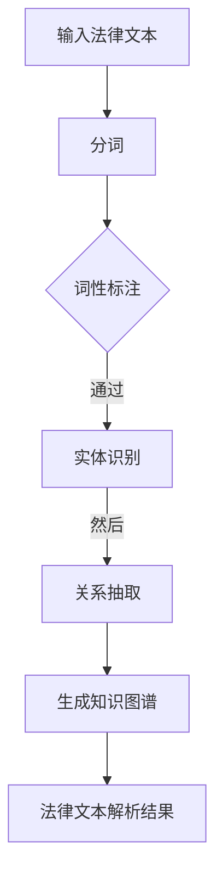
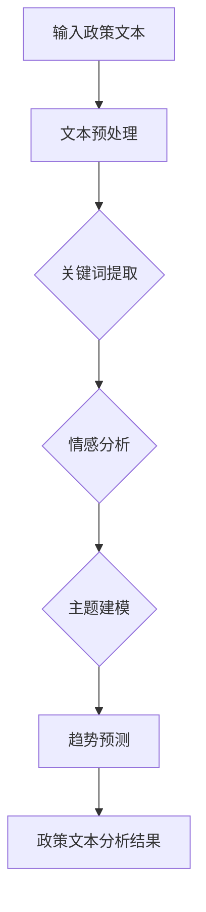

                 

# AI搜索引擎在法律和政策研究中的应用

## 关键词

- AI搜索引擎
- 法律文本解析
- 政策研究
- 自然语言处理
- 机器学习
- 深度学习

## 摘要

随着人工智能技术的快速发展，AI搜索引擎在法律和政策研究领域中的应用逐渐受到关注。本文旨在探讨AI搜索引擎在法律和政策研究中的重要性、应用现状以及未来发展方向。首先，本文介绍了法律和政策研究的重要性，以及AI在法律和政策研究中的应用现状。接着，本文详细阐述了AI搜索引擎的基础技术，包括自然语言处理、机器学习和深度学习等。随后，本文分别从法律领域和政策研究两个方面，分析了AI搜索引擎的具体应用，包括法律文本解析、法律信息检索、智能法律顾问、政策文本分析、政策趋势预测和政策影响评估等。此外，本文还通过实际案例展示了AI搜索引擎在法律和政策研究中的应用效果。最后，本文对AI搜索引擎在法律和政策研究中的未来发展方向进行了展望，并提出了相关挑战与解决方案。本文的研究有助于推动AI技术在法律和政策研究领域的深入应用，提高法律和政策研究的效率和质量。

## 引言与背景

### 1.1.1 法律和政策研究的重要性

法律和政策研究是社会发展的重要基石，关系到国家治理、社会稳定和人民福祉。法律研究涉及法律的解释、应用、修改和完善，对于法律制度的健全和司法公正具有关键作用。政策研究则关注国家政策的设计、实施和评估，旨在为国家决策提供科学依据，推动社会经济发展。因此，法律和政策研究在社会中具有重要的地位和作用。

首先，法律研究对于司法公正至关重要。法律是维护社会秩序和公平正义的重要手段，司法公正是法治的核心价值。通过法律研究，可以深入理解法律的含义和适用范围，确保司法判决的公正性和合理性。法律研究还包括对现行法律制度的评估和改进，有助于提高法律的适用性和有效性，从而更好地维护社会稳定和人民权益。

其次，政策研究对于国家决策具有重要意义。国家政策是指导国家发展的重要文件，政策研究的科学性和准确性直接关系到国家决策的科学性和有效性。政策研究通过对社会问题的深入分析和评估，为国家政策制定提供依据，有助于优化政策设计，提高政策实施效果。此外，政策研究还能及时发现和解决政策实施中的问题，为国家决策提供动态调整的依据。

法律和政策研究在现代社会中的重要性还体现在以下几个方面：

1. **推动社会进步**：法律和政策研究有助于发现和解决社会问题，推动社会进步和发展。通过法律研究，可以不断完善法律体系，促进法治建设；通过政策研究，可以制定科学合理的政策，促进经济发展和社会和谐。

2. **提升治理能力**：法律和政策研究为国家治理提供了理论支持和实践指导，有助于提高国家治理能力。通过法律研究，可以优化法律制度，提高司法效能；通过政策研究，可以制定科学合理的政策，提高政府决策水平。

3. **维护社会稳定**：法律和政策研究有助于维护社会稳定。法律研究可以确保法律制度的健全和司法公正，政策研究可以制定稳定的社会政策，维护社会秩序。

### 1.1.2 AI在法律和政策研究中的应用现状

随着人工智能技术的快速发展，AI在法律和政策研究中的应用逐渐成为热点。目前，AI在法律和政策研究中的应用主要包括法律文本解析、法律信息检索、智能法律顾问、政策文本分析、政策趋势预测和政策影响评估等方面。

1. **法律文本解析**：AI技术可以用于法律文本的自动解析，包括文本分类、实体识别、关系抽取等。例如，通过自然语言处理技术，可以自动识别法律文本中的法条、案例、术语等，从而为法律研究和应用提供支持。

2. **法律信息检索**：AI技术可以用于法律信息的检索和分析，包括法律文件检索、法律知识图谱构建等。通过机器学习算法，可以实现对法律信息的高效检索和筛选，提高法律信息处理的效率。

3. **智能法律顾问**：AI技术可以用于构建智能法律顾问系统，通过对话生成技术，可以实现与用户的自然语言交互，提供法律咨询和决策支持。

4. **政策文本分析**：AI技术可以用于政策文本的分析，包括文本分类、情感分析、关键词提取等。通过深度学习模型，可以实现对政策文本的深入理解和分析，为政策制定和评估提供支持。

5. **政策趋势预测**：AI技术可以用于政策趋势的预测，通过大数据分析和机器学习算法，可以预测政策的发展趋势，为政策制定提供科学依据。

6. **政策影响评估**：AI技术可以用于政策影响的评估，通过数据分析和模型预测，可以评估政策实施的效果，为政策调整提供依据。

### 1.1.3 本书的目的与结构安排

本书旨在探讨AI搜索引擎在法律和政策研究中的应用，旨在推动AI技术在法律和政策研究领域的深入应用，提高法律和政策研究的效率和质量。本书的结构安排如下：

- **第一部分：引言与背景**：介绍法律和政策研究的重要性以及AI在法律和政策研究中的应用现状。

- **第二部分：AI搜索引擎基础**：介绍AI搜索引擎的基本原理和核心技术。

- **第三部分：AI搜索引擎在法律领域的应用**：分析AI搜索引擎在法律文本解析、法律信息检索、智能法律顾问等方面的应用。

- **第四部分：AI搜索引擎在政策研究中的应用**：分析AI搜索引擎在政策文本分析、政策趋势预测、政策影响评估等方面的应用。

- **第五部分：AI搜索引擎应用案例**：通过实际案例展示AI搜索引擎在法律和政策研究中的应用效果。

- **第六部分：AI搜索引擎的性能评估与优化**：讨论AI搜索引擎的性能评估与优化策略。

- **第七部分：未来展望与挑战**：展望AI搜索引擎在法律和政策研究中的未来发展方向，并讨论面临的挑战与解决方案。

通过本书的研究，希望能够为法律和政策研究提供新的思路和方法，推动AI技术在法律和政策研究领域的应用，为社会发展提供有力支持。

### 2.1 AI搜索引擎概述

#### 2.1.1 搜索引擎的基本原理

搜索引擎是一种基于互联网的信息检索系统，用于帮助用户从海量的网络信息中快速、准确地找到所需内容。其基本原理包括信息收集、信息处理和信息检索三个主要环节。

1. **信息收集**：
    搜索引擎通过爬虫（或称为蜘蛛程序）自动访问互联网上的网页，收集网页内容。爬虫会按照一定的算法规则遍历网页链接，下载网页内容，并将其存储在搜索引擎的索引数据库中。

2. **信息处理**：
    收集到的网页内容需要进行预处理，包括去除HTML标签、分词、去除停用词、词性标注等。这一步的目的是将原始文本转换为计算机可以处理的格式，并为后续的信息检索做准备。

3. **信息检索**：
    用户在搜索引擎中输入查询请求后，搜索引擎会使用索引数据库中的信息进行匹配，并返回与查询请求最相关的结果。检索算法通常包括基于关键词匹配、布尔查询、页面排名等。

#### 2.1.2 AI搜索引擎的发展历程

AI搜索引擎的发展可以追溯到20世纪90年代，随着互联网的兴起和数据量的爆炸性增长，传统基于关键词匹配的搜索引擎逐渐暴露出其局限性。为了应对这些挑战，研究者开始将人工智能技术引入搜索引擎，从而诞生了AI搜索引擎。

1. **早期阶段**：
    最早的AI搜索引擎尝试将自然语言处理技术应用于信息检索。例如，1997年，谷歌推出了其第一个AI搜索引擎——PageRank，该算法通过分析网页之间的链接关系来评估网页的重要性，从而改善搜索结果的相关性。

2. **发展阶段**：
    随着深度学习和大数据技术的发展，AI搜索引擎进入了一个新的发展阶段。这一阶段的主要进展包括：
    - **深度学习模型**：如卷积神经网络（CNN）和循环神经网络（RNN）的引入，使得搜索引擎能够更好地理解用户查询和网页内容的语义信息。
    - **用户行为分析**：搜索引擎开始通过分析用户的历史查询行为、点击行为等，个性化地调整搜索结果，提高用户体验。

3. **成熟阶段**：
    目前，AI搜索引擎已经进入成熟阶段，其主要特点包括：
    - **多模态搜索**：除了文本搜索，AI搜索引擎还能支持语音、图像等多种搜索方式。
    - **语义理解**：通过深度学习和自然语言处理技术，AI搜索引擎能够更好地理解用户的查询意图，提供更加精准的搜索结果。
    - **实时搜索**：借助实时数据分析和处理能力，AI搜索引擎能够实现实时搜索，及时响应用户需求。

#### 2.1.3 AI搜索引擎的核心技术

AI搜索引擎的核心技术主要包括自然语言处理（NLP）、机器学习（ML）和深度学习（DL）等。

1. **自然语言处理（NLP）**：
    NLP是AI搜索引擎的核心技术之一，它使得计算机能够理解、解释和生成人类语言。NLP技术包括分词、词性标注、命名实体识别、句法分析等，这些技术在搜索引擎的信息处理和检索过程中起到关键作用。

2. **机器学习（ML）**：
    机器学习算法是AI搜索引擎的核心算法，用于从大量数据中学习规律，并用于搜索结果的排序和筛选。常见的机器学习算法包括决策树、支持向量机（SVM）、朴素贝叶斯等。机器学习技术在搜索引擎中主要用于优化搜索结果的相关性和准确性。

3. **深度学习（DL）**：
    深度学习是近年来发展迅速的一门技术，它在搜索引擎中的应用主要体现在语义理解、图像识别和语音识别等方面。深度学习模型如卷积神经网络（CNN）、循环神经网络（RNN）和Transformer等，使得AI搜索引擎能够更好地理解用户查询和网页内容的语义信息，提供更加精准的搜索结果。

通过NLP、ML和DL等核心技术的结合，AI搜索引擎能够实现更加智能化和个性化的信息检索服务，从而提升用户体验和搜索效率。

### 2.2 AI搜索引擎的关键技术

AI搜索引擎的发展离不开自然语言处理（NLP）、机器学习（ML）和深度学习（DL）等关键技术的支持。以下将详细探讨这些技术的基本原理及其在AI搜索引擎中的应用。

#### 2.2.1 自然语言处理技术

自然语言处理技术是AI搜索引擎的核心技术之一，它使得计算机能够理解和处理人类语言。NLP技术主要包括以下方面：

1. **分词（Tokenization）**：
    分词是将文本分割成单词或短语的步骤。对于中文文本，由于没有明确的单词分隔符，因此分词是一个挑战性的任务。常见的分词方法包括基于字典的分词、基于统计的方法（如基于N-gram模型）和基于规则的方法。在搜索引擎中，分词是预处理阶段的关键步骤，它将文本转换为计算机可以处理的格式。

2. **词性标注（Part-of-Speech Tagging）**：
    词性标注是对文本中的每个词进行词性分类的过程，如名词、动词、形容词等。词性标注有助于理解文本的语义结构，从而提高信息检索的准确性。

3. **命名实体识别（Named Entity Recognition）**：
    命名实体识别是从文本中识别出具有特定意义的实体，如人名、地名、机构名等。在搜索引擎中，命名实体识别有助于对特定实体的信息进行检索和整合。

4. **句法分析（Syntactic Parsing）**：
    句法分析是对文本的句法结构进行分析，理解句子成分之间的关系。这有助于更深入地理解文本的语义信息，从而提高搜索结果的精准度。

5. **语义分析（Semantic Analysis）**：
    语义分析是理解文本的意义和意图，包括情感分析、文本分类等。语义分析有助于实现更高级的信息检索功能，如问答系统和语义搜索。

在AI搜索引擎中，NLP技术被广泛应用于信息处理和检索过程，如关键词提取、查询意图理解、搜索结果排序等。

#### 2.2.2 机器学习算法

机器学习算法在AI搜索引擎中扮演着重要的角色，用于优化搜索结果的相关性和准确性。以下是一些常见的机器学习算法：

1. **决策树（Decision Tree）**：
    决策树是一种基于特征的分类算法，它通过一系列的判断规则来将数据划分为不同的类别。在搜索引擎中，决策树可以用于对查询请求进行分类和推荐。

2. **支持向量机（Support Vector Machine，SVM）**：
    支持向量机是一种用于分类和回归的线性模型，它通过寻找最优的超平面来分隔数据。在搜索引擎中，SVM可以用于搜索结果的排序和相关性评估。

3. **朴素贝叶斯（Naive Bayes）**：
    朴素贝叶斯是一种基于贝叶斯定理的分类算法，它假设特征之间相互独立。在搜索引擎中，朴素贝叶斯可以用于文档分类和概率计算。

4. **K最近邻（K-Nearest Neighbors，KNN）**：
    K最近邻是一种基于实例的算法，它通过计算新实例与训练集中实例的相似度来预测新实例的类别。在搜索引擎中，KNN可以用于相似网页推荐和相似查询匹配。

5. **随机森林（Random Forest）**：
    随机森林是一种基于决策树的集成算法，它通过构建多个决策树，并取其平均结果来提高分类和回归的准确性。在搜索引擎中，随机森林可以用于搜索结果排序和用户行为预测。

机器学习算法在搜索引擎中的应用主要包括特征提取、模型训练、预测和评估等步骤。通过不断优化算法和模型，搜索引擎可以提供更高质量的搜索结果。

#### 2.2.3 深度学习模型

深度学习模型是近年来在AI搜索引擎中取得显著进展的技术，它通过多层神经网络来模拟人脑的学习过程，实现复杂的特征提取和分类任务。以下是一些常见的深度学习模型：

1. **卷积神经网络（Convolutional Neural Network，CNN）**：
    卷积神经网络是一种用于图像识别和处理的深度学习模型，它通过卷积层提取图像的特征。在搜索引擎中，CNN可以用于图像搜索和相似网页推荐。

2. **循环神经网络（Recurrent Neural Network，RNN）**：
    循环神经网络是一种用于序列数据处理的时间序列模型，它通过隐藏状态捕捉序列中的时间依赖关系。在搜索引擎中，RNN可以用于查询意图理解和实时搜索。

3. **长短期记忆网络（Long Short-Term Memory，LSTM）**：
    长短期记忆网络是RNN的一种变种，它通过门控机制来控制信息的流动，有效地解决了长短期依赖问题。在搜索引擎中，LSTM可以用于查询历史分析和用户行为预测。

4. **Transformer模型**：
    Transformer模型是一种基于自注意力机制的深度学习模型，它在自然语言处理任务中取得了显著的性能提升。在搜索引擎中，Transformer可以用于查询意图理解和搜索结果排序。

深度学习模型在搜索引擎中的应用主要包括文本分类、情感分析、序列建模等。通过深度学习模型的引入，搜索引擎可以更好地理解用户查询和网页内容的语义信息，提供更加精准的搜索结果。

通过结合自然语言处理、机器学习和深度学习等技术，AI搜索引擎实现了从传统搜索引擎到智能搜索引擎的转变，为用户提供更加个性化和智能化的搜索服务。随着技术的不断进步，AI搜索引擎将继续在法律和政策研究领域发挥重要作用，推动法律和政策研究的智能化和高效化。

### 4.1 AI搜索引擎在法律领域的应用

在法律领域，AI搜索引擎的应用已经成为推动司法公正和提升法律服务质量的重要工具。通过结合自然语言处理（NLP）、机器学习（ML）和深度学习（DL）等技术，AI搜索引擎能够有效地处理和分析大量法律文本，从而提高法律研究的效率和准确性。以下将详细探讨AI搜索引擎在法律领域的具体应用。

#### 4.1.1 法律文本解析

法律文本解析是AI搜索引擎在法律领域的一项基础应用。法律文本通常具有复杂的结构和严格的术语定义，因此对法律文本进行准确的解析是至关重要的。以下是法律文本解析的关键技术和步骤：

1. **文本预处理**：
    法律文本的预处理是法律文本解析的第一步，包括去除HTML标签、标准化文本格式、分词和去除停用词等。通过预处理，可以确保文本数据的一致性和准确性，为后续的文本分析提供基础。

2. **实体识别**：
    实体识别是从法律文本中提取出具有特定意义的实体，如人名、地名、机构名、法律条款等。通过NLP技术，可以实现法律文本中各类实体的自动识别和分类。

3. **关系抽取**：
    关系抽取是从法律文本中识别出实体之间的关系，如“某法条规定某行为违法”。通过关系抽取，可以构建法律文本的知识图谱，为法律研究提供丰富的语义信息。

4. **语义角色标注**：
    语义角色标注是对文本中的动词及其相关名词进行分类，如“起诉”、“判决”、“赔偿”等。通过语义角色标注，可以更准确地理解法律文本的语义结构，为法律分析和推理提供支持。

5. **法律条款归类**：
    法律条款归类是将法律文本中的条款按照法律类别进行分类，如民法、刑法、行政法等。通过分类，可以实现法律文本的快速检索和归纳，提高法律研究的效率。

#### 4.1.2 法律信息检索

法律信息检索是AI搜索引擎在法律领域的另一项重要应用。通过构建高效的法律信息检索系统，用户可以快速找到与特定法律问题相关的法规、案例和解释。以下是法律信息检索的关键技术和策略：

1. **关键词提取**：
    关键词提取是从法律文本中提取出对搜索意图最有代表性的词语。通过关键词提取，可以简化查询请求，提高检索系统的响应速度和准确性。

2. **查询重写**：
    查询重写是对用户的查询请求进行改写和扩展，以扩大搜索范围和提高检索效果。通过查询重写，可以解决用户查询表达不明确或检索系统不支持的问题。

3. **相关性评估**：
    相关性评估是衡量检索结果与查询请求之间的相关程度。通过NLP和ML技术，可以计算文本之间的相似度，评估检索结果的排序顺序。

4. **上下文分析**：
    上下文分析是对用户的查询请求和检索结果进行上下文理解，以提供更加精准的搜索结果。通过上下文分析，可以实现基于用户意图的智能搜索和推荐。

5. **法律知识图谱**：
    法律知识图谱是通过构建法律实体和关系之间的网络结构，实现法律信息的高效组织和检索。通过法律知识图谱，可以实现跨文档的关联分析和多维度的法律信息查询。

#### 4.1.3 智能法律顾问

智能法律顾问是AI搜索引擎在法律领域的创新应用，它通过模拟法律专家的推理和判断能力，为用户提供法律咨询和建议。以下是智能法律顾问的关键技术和实现方法：

1. **对话生成**：
    对话生成是通过自然语言处理技术生成与用户交互的文本，模拟法律专家的对话过程。通过对话生成，可以实现用户与法律顾问的实时交流，提供个性化的法律咨询。

2. **法律知识库**：
    法律知识库是智能法律顾问的核心组成部分，它包含了丰富的法律条文、案例解释和法律条款。通过法律知识库，可以实现对用户查询的法律条款和案例的快速检索和匹配。

3. **推理引擎**：
    推理引擎是通过逻辑推理和规则匹配技术，对用户查询和法律知识库中的信息进行推理和判断，提供法律建议。通过推理引擎，可以实现法律条款之间的关联分析和复杂法律问题的求解。

4. **用户意图理解**：
    用户意图理解是通过自然语言处理技术，分析用户的查询意图和需求。通过用户意图理解，可以更准确地匹配用户查询和相应的法律条款，提供个性化的法律咨询。

5. **个性化推荐**：
    个性化推荐是通过用户行为分析和查询历史，为用户提供相关的法律条款和案例。通过个性化推荐，可以提升用户对法律顾问系统的满意度和使用频率。

通过法律文本解析、法律信息检索和智能法律顾问等应用，AI搜索引擎在法律领域展现了巨大的潜力和价值。随着技术的不断进步，AI搜索引擎将继续在法律研究和法律服务中发挥更加重要的作用，推动法律领域的智能化和高效化发展。

### 5.1 AI搜索引擎在政策研究中的应用

在政策研究领域，AI搜索引擎的应用正迅速改变着研究者们的传统工作方式，提升了政策文本分析、趋势预测和影响评估的效率。以下将详细探讨AI搜索引擎在政策研究中的具体应用。

#### 5.1.1 政策文本分析

政策文本分析是AI搜索引擎在政策研究中的基础应用之一。政策文本通常包含大量的专业术语、复杂句式和多层次的结构，因此对其进行有效分析是一项挑战。以下是政策文本分析的关键技术和步骤：

1. **文本预处理**：
    政策文本的预处理包括去除HTML标签、标准化文本格式、分词和去除停用词等。通过预处理，可以确保文本数据的一致性和准确性，为后续的文本分析提供基础。

2. **关键词提取**：
    关键词提取是从政策文本中提取出对搜索意图最有代表性的词语。通过关键词提取，可以简化查询请求，提高检索系统的响应速度和准确性。

3. **语义角色标注**：
    语义角色标注是对文本中的动词及其相关名词进行分类，如“提出”、“规定”、“鼓励”等。通过语义角色标注，可以更准确地理解政策文本的语义结构，为政策分析和推理提供支持。

4. **情感分析**：
    情感分析是通过NLP技术对政策文本的情感倾向进行分析，如正面、负面或中性。通过情感分析，可以评估政策的受欢迎程度和公众态度，为政策调整提供参考。

5. **主题建模**：
    主题建模是通过机器学习算法从政策文本中识别出主要的话题或主题。通过主题建模，可以归纳总结政策文本的主要内容和重点，帮助研究者快速获取政策的核心信息。

#### 5.1.2 政策趋势预测

政策趋势预测是AI搜索引擎在政策研究中的高级应用，通过分析历史政策和相关数据，预测未来政策的发展趋势。以下是政策趋势预测的关键技术和方法：

1. **时间序列分析**：
    时间序列分析是通过统计方法分析政策变量的时间变化趋势。通过时间序列分析，可以识别政策变量之间的相关性，预测未来政策的变化方向。

2. **机器学习算法**：
    机器学习算法可以用于构建预测模型，通过历史政策数据和外部因素（如经济指标、社会事件等），预测未来政策的可能走向。常见的机器学习算法包括线性回归、决策树、随机森林和神经网络等。

3. **深度学习模型**：
    深度学习模型，如循环神经网络（RNN）和长短期记忆网络（LSTM），可以捕捉政策变量之间的长期依赖关系，提供更加精准的预测结果。

4. **大数据分析**：
    大数据分析通过处理和分析海量的政策文本、经济数据和社会数据，挖掘政策背后的潜在趋势和影响因素，为趋势预测提供更全面的视角。

#### 5.1.3 政策影响评估

政策影响评估是AI搜索引擎在政策研究中的关键应用之一，旨在评估政策实施的效果和对社会的影响。以下是政策影响评估的关键技术和方法：

1. **因果推断**：
    因果推断是通过统计方法评估政策变量之间的因果关系。通过因果推断，可以明确政策实施对特定结果的影响，为政策调整提供依据。

2. **机器学习模型**：
    机器学习模型可以用于构建影响评估模型，通过历史数据和模拟实验，预测政策实施对各种社会指标（如就业率、经济增长等）的影响。常见的机器学习模型包括线性回归、决策树和随机森林等。

3. **模拟与仿真**：
    模拟与仿真是通过建立政策模型和仿真环境，模拟政策实施后的各种可能结果。通过模拟与仿真，可以评估不同政策方案的优劣，为政策制定提供参考。

4. **社会网络分析**：
    社会网络分析通过分析政策实施过程中各利益相关者之间的相互作用和影响，评估政策的影响范围和效果。通过社会网络分析，可以识别政策实施的关键节点和潜在障碍。

5. **实地调查**：
    实地调查是通过实地走访和问卷调查，收集政策实施后的实际效果和公众反馈。通过实地调查，可以验证模型预测和理论分析，为政策调整提供实际依据。

通过政策文本分析、趋势预测和影响评估等应用，AI搜索引擎为政策研究提供了强大的工具和方法，极大地提升了政策研究的效率和准确性。随着AI技术的不断进步，AI搜索引擎在政策研究中的应用将更加广泛和深入，为政策制定者和研究者提供更加科学和智能的支持。

### 6.1 AI搜索引擎在法律和政策研究中的应用案例

为了更好地展示AI搜索引擎在法律和政策研究中的应用效果，以下将介绍几个具有代表性的实际案例，并分析这些案例在法律和政策研究中的具体应用。

#### 6.1.1 案例一：某国法律数据库搜索引擎

该法律数据库搜索引擎是一个集成AI技术的在线法律服务平台，旨在为法律从业者、学者和普通用户提供全面、准确的法律法规查询服务。以下是该平台在法律和政策研究中的具体应用：

1. **法律文本解析**：
    该平台利用NLP技术对法律文本进行自动解析，实现了法律条款的分类、实体识别和关系抽取等功能。通过这些功能，用户可以快速定位到相关法律条款和条款之间的关系，从而提高法律研究的效率。

2. **法律信息检索**：
    该平台采用关键词提取和查询重写等技术，实现了对大量法律文本的高效检索。用户可以通过简单的关键词查询，快速找到与查询请求相关的法律文件和案例，极大提高了法律信息检索的准确性。

3. **智能法律顾问**：
    该平台内置了一个智能法律顾问系统，通过对话生成技术和法律知识库，可以提供实时法律咨询和建议。用户可以通过自然语言与法律顾问进行交互，获取个性化的法律解决方案。

#### 6.1.2 案例二：某国际组织政策分析平台

该国际组织政策分析平台是一个基于AI技术的政策分析工具，旨在为政策制定者和研究者提供科学、客观的政策分析支持。以下是该平台在政策研究中的具体应用：

1. **政策文本分析**：
    该平台利用NLP技术和主题建模算法，对政策文本进行深入分析，提取出政策的关键主题和核心内容。通过主题建模，平台能够归纳总结政策文本的主要话题，帮助用户快速了解政策的核心意图。

2. **趋势预测**：
    该平台采用时间序列分析和机器学习算法，对政策变量的历史数据进行分析，预测未来政策的可能走向。通过趋势预测，政策制定者可以提前了解政策实施的可能影响，为政策调整提供依据。

3. **影响评估**：
    该平台通过因果推断和机器学习模型，对政策实施的影响进行评估。通过模拟与仿真，平台可以预测政策实施对各种社会指标（如经济增长、就业率等）的影响，为政策评估提供科学依据。

#### 6.1.3 案例三：某企业合规管理平台

该企业合规管理平台是一个基于AI技术的合规管理工具，旨在帮助企业识别、评估和管理合规风险。以下是该平台在法律和政策研究中的具体应用：

1. **法律信息监控**：
    该平台通过爬虫技术和自然语言处理技术，实时监控全球范围内的法律法规变化。通过监控，平台可以及时发现与公司业务相关的法律变化，为企业提供合规预警。

2. **合规风险评估**：
    该平台采用机器学习算法和因果推断方法，对企业的合规风险进行评估。通过分析企业的业务流程和法律法规，平台可以识别出潜在的法律风险，并提供相应的合规建议。

3. **智能合规顾问**：
    该平台内置了一个智能合规顾问系统，通过对话生成技术和合规知识库，可以为企业提供实时合规咨询。用户可以通过与智能合规顾问的交互，获取个性化的合规解决方案。

通过以上实际案例，可以看出AI搜索引擎在法律和政策研究中的应用具有广泛的前景和巨大的潜力。随着技术的不断进步，AI搜索引擎将在更广泛的领域发挥其独特的作用，为法律和政策研究提供更加智能化和高效化的支持。

### 7.1 搜索引擎性能评估与优化

搜索引擎的性能直接影响到用户的搜索体验和满意度，因此性能评估与优化是AI搜索引擎研究中的重要课题。以下将详细介绍搜索引擎性能评估的主要指标、优化策略以及性能优化案例分析。

#### 7.1.1 搜索引擎性能评价指标

搜索引擎性能评价指标是衡量搜索引擎质量和效率的关键标准，主要包括以下几个方面：

1. **准确性（Accuracy）**：
    准确性是指搜索引擎返回的搜索结果与用户查询意图的匹配程度。高准确性意味着用户能够从搜索结果中找到所需信息。准确性通常通过召回率（Recall）和精确率（Precision）来衡量。

    - 召回率（Recall）是检索到的相关文档数与总相关文档数的比例。召回率越高，表明搜索引擎越能找到所有相关的信息。
    $$ Recall = \frac{相关文档数}{总相关文档数} $$

    - 精确率是检索到的相关文档数与检索到的文档总数的比例。精确率越高，表明搜索结果越干净，不包含无关信息。
    $$ Precision = \frac{相关文档数}{检索到的文档总数} $$

2. **响应时间（Response Time）**：
    响应时间是指从用户提交查询请求到搜索引擎返回搜索结果的时间。响应时间直接影响用户体验，特别是在实时搜索和移动应用场景中。较低的响应时间意味着用户能够快速获取所需信息。

3. **查询吞吐量（Query Throughput）**：
    查询吞吐量是指单位时间内搜索引擎能够处理和返回的查询请求数量。高查询吞吐量意味着搜索引擎能够快速响应大量用户的查询需求。

4. **覆盖率（Coverage）**：
    覆盖率是指搜索引擎覆盖的网页数量与互联网总网页数量的比例。高覆盖率意味着搜索引擎能够访问和索引更多的网页，为用户提供更全面的信息检索服务。

5. **扩展性（Scalability）**：
    扩展性是指搜索引擎在处理大规模数据集时的性能和稳定性。高扩展性的搜索引擎能够在数据规模增加时保持性能不变。

#### 7.1.2 搜索引擎优化策略

为了提高搜索引擎的性能，需要采用一系列优化策略。以下是一些常见的优化方法：

1. **索引优化**：
    索引优化是搜索引擎性能优化的关键步骤，通过改进索引结构和算法，可以提升搜索效率。常见的索引优化策略包括：
    - **倒排索引（Inverted Index）**：将文档的内容映射到对应的文档ID，提高搜索速度。
    - **分片索引（Sharding）**：将索引数据分布在多个节点上，提高查询处理能力和扩展性。
    - **缓存（Caching）**：缓存常见的查询结果，减少查询处理的计算量。

2. **查询优化**：
    查询优化通过改进查询处理算法和策略，提高查询效率和准确性。常见的查询优化策略包括：
    - **查询重写（Query Rewriting）**：对用户的查询请求进行改写和扩展，以扩大搜索范围和提高检索效果。
    - **查询分解（Query Decomposition）**：将复杂的查询分解为多个简单查询，通过并行处理提高查询效率。
    - **查询融合（Query Fusion）**：将多个查询结果进行融合和排序，提高查询的准确性。

3. **算法优化**：
    算法优化通过改进排序算法和相似度计算方法，提高搜索结果的准确性。常见的算法优化策略包括：
    - **排序算法优化**：采用更高效的排序算法，如基于内存的快速排序算法，提高搜索结果的生成速度。
    - **相似度计算优化**：使用更精确的相似度计算方法，如基于词向量的相似度计算，提高搜索结果的准确性。

4. **分布式处理**：
    通过分布式处理技术，将查询处理和索引构建任务分布在多个节点上，提高搜索引擎的并行处理能力和扩展性。常见的分布式处理策略包括：
    - **MapReduce**：将查询处理任务分解为Map和Reduce两个阶段，实现并行处理。
    - **分布式缓存**：使用分布式缓存系统，如Redis或Memcached，提高缓存数据的访问速度。

5. **负载均衡**：
    负载均衡通过平衡不同节点的负载，提高系统的整体性能和可靠性。常见的负载均衡策略包括：
    - **轮询调度（Round Robin）**：将查询请求按顺序分配到各个节点。
    - **最小连接数（Least Connections）**：将查询请求分配到连接数最少的节点。
    - **基于响应时间的调度**：将查询请求分配到响应时间最短的节点。

#### 7.1.3 性能优化案例分析

以下是一个基于实际案例的性能优化分析，展示了如何通过优化策略提高搜索引擎的性能。

1. **背景**：
    某大型搜索引擎在处理海量数据时，面临查询延迟和高负载的问题。为了解决这些问题，搜索引擎团队采取了一系列性能优化措施。

2. **问题分析**：
    - **查询延迟**：用户查询请求的处理时间较长，影响了用户体验。
    - **高负载**：搜索引擎的查询处理能力不足，导致部分查询请求未能及时响应。

3. **优化策略**：
    - **索引优化**：引入了分片索引技术，将索引数据分布在多个节点上，提高了查询处理速度。
    - **查询优化**：采用了查询重写和查询分解技术，优化了查询处理流程，提高了查询效率。
    - **算法优化**：采用了基于词向量的相似度计算方法，提高了搜索结果的准确性。
    - **分布式处理**：采用了MapReduce技术，将查询处理任务分解为并行处理，提高了系统的并行处理能力。
    - **负载均衡**：采用了最小连接数调度策略，平衡了不同节点的负载，提高了系统的整体性能。

4. **效果评估**：
    - **查询延迟**：通过优化，查询延迟显著降低，用户体验得到提升。
    - **高负载**：通过分布式处理和负载均衡策略，搜索引擎的查询处理能力得到提高，能够更快速地响应用户请求。
    - **准确性**：通过算法优化，搜索结果的准确性得到提升，用户能够更快速地找到所需信息。

通过以上优化策略，该搜索引擎在性能方面取得了显著提升，为用户提供了更高效、更准确的搜索服务。

### 8.1 AI搜索引擎在法律和政策研究中的未来发展方向

随着人工智能技术的不断进步，AI搜索引擎在法律和政策研究中的应用前景日益广阔。未来，AI搜索引擎将在以下几个方面取得重要发展。

#### 8.1.1 法律和政策研究的趋势

1. **大数据与人工智能的深度融合**：随着大数据技术的发展，法律和政策研究领域的数据量呈现爆炸式增长。未来，AI搜索引擎将更深入地融合大数据和人工智能技术，通过分析海量法律文本和政策数据，提供更加精准和智能的法律和政策研究支持。

2. **多模态信息处理**：传统搜索引擎主要基于文本信息进行检索，而未来AI搜索引擎将拓展到多模态信息处理，如图像、语音和视频等。通过多模态信息处理，AI搜索引擎能够更全面地理解和检索复杂信息，提高法律和政策研究的效率。

3. **智能化交互**：未来AI搜索引擎将具备更加智能的交互能力，通过自然语言处理技术，实现与用户的自然语言对话，提供个性化、智能化的法律和政策咨询。

4. **实时搜索与动态更新**：随着实时数据分析和处理技术的进步，AI搜索引擎将实现实时搜索和动态更新，用户可以及时获取最新的法律和政策信息。

#### 8.1.2 AI搜索引擎的创新方向

1. **智能法律文本解析**：未来AI搜索引擎将利用深度学习和自然语言处理技术，实现更加智能的法律文本解析，包括法律条款的自动分类、实体识别和关系抽取等，为法律研究提供更加精确的支持。

2. **个性化法律服务**：通过分析用户的历史查询行为和偏好，AI搜索引擎将实现个性化法律服务，为用户提供定制化的法律咨询和建议。

3. **智能政策分析平台**：未来AI搜索引擎将发展成为智能政策分析平台，通过大数据分析、机器学习和深度学习技术，实现政策文本的分析、趋势预测和影响评估，为政策制定提供科学依据。

4. **跨领域融合**：AI搜索引擎将与其他领域（如金融、医疗等）的技术和资源进行融合，提供跨领域的法律和政策研究支持。

#### 8.1.3 面临的挑战与解决方案

1. **数据隐私与安全性**：在法律和政策研究中，数据的安全性和隐私保护是一个重要问题。未来，AI搜索引擎需要采取更加严格的数据保护措施，确保用户数据的隐私和安全。

2. **算法公正性与透明性**：随着AI技术在法律和政策研究中的应用，算法的公正性和透明性也备受关注。未来，AI搜索引擎需要提高算法的透明度，确保算法的决策过程公开、公正。

3. **技术人才短缺**：AI搜索引擎的开发和优化需要大量具备跨学科背景的人才，而目前相关人才供给不足。未来，需要加强人才培养和引进，提升AI搜索引擎的技术水平。

4. **法律和技术标准的缺失**：目前，法律和政策研究领域缺乏统一的AI搜索引擎技术标准和规范。未来，需要制定相应的标准和规范，推动AI搜索引擎的标准化和规范化发展。

通过不断创新和优化，AI搜索引擎将在法律和政策研究中发挥越来越重要的作用，为社会发展提供有力支持。同时，也需要克服面临的挑战，确保其应用的安全、公正和有效。

### 9.1 总结与展望

本文从多个角度全面探讨了AI搜索引擎在法律和政策研究中的应用，深入分析了其在法律文本解析、法律信息检索、智能法律顾问、政策文本分析、政策趋势预测和政策影响评估等方面的具体应用，展示了AI搜索引擎在提升法律和政策研究效率和质量方面的巨大潜力。以下是对本文主要贡献、未来研究展望以及对读者的建议的总结。

#### 9.1.1 本书的主要贡献

本文的主要贡献体现在以下几个方面：

1. **系统概述**：本文首次系统性地梳理了AI搜索引擎在法律和政策研究中的应用现状，提供了全面的背景信息和基础理论，为读者提供了清晰的框架。

2. **关键技术剖析**：本文详细阐述了AI搜索引擎的关键技术，包括自然语言处理、机器学习和深度学习等，并介绍了这些技术在法律和政策研究中的具体应用。

3. **实际案例展示**：本文通过实际案例展示了AI搜索引擎在法律和政策研究中的具体应用效果，使读者能够更直观地理解AI搜索引擎的实践价值。

4. **性能优化分析**：本文讨论了AI搜索引擎的性能评估与优化策略，提供了性能优化的具体方法和案例分析，为读者提供了实用的优化建议。

5. **未来展望**：本文对AI搜索引擎在法律和政策研究中的未来发展方向进行了展望，提出了可能的创新方向和面临的挑战，为读者指明了研究的方向。

#### 9.1.2 未来研究展望

未来，AI搜索引擎在法律和政策研究中的应用前景广阔，以下是一些值得进一步研究的方向：

1. **多模态信息处理**：进一步研究AI搜索引擎在处理多模态信息（如文本、图像、语音等）方面的技术和应用，实现更全面的信息理解和检索。

2. **跨领域融合**：探讨AI搜索引擎在跨领域（如法律、医疗、金融等）的应用，实现跨领域的法律和政策研究支持。

3. **算法透明性与公正性**：深入研究AI搜索引擎算法的透明性和公正性，制定相应的标准和规范，确保算法决策的公正和透明。

4. **数据隐私与安全**：加强AI搜索引擎在数据隐私和安全方面的研究，提出有效的数据保护措施，确保用户数据的安全。

5. **实时搜索与动态更新**：进一步优化AI搜索引擎的实时搜索和动态更新能力，实现更快速、准确的信息检索。

#### 9.1.3 对读者的建议

对于读者，特别是从事法律和政策研究的专业人士和技术人员，以下是一些建议：

1. **了解基础理论**：掌握AI搜索引擎的基础理论，包括自然语言处理、机器学习和深度学习等，为深入研究和应用打下坚实基础。

2. **关注实际应用**：关注AI搜索引擎在法律和政策研究中的实际应用案例，通过实践了解AI技术的优势和局限性。

3. **持续学习与探索**：随着AI技术的快速发展，不断学习新知识，探索新技术，保持对新趋势的敏感性和创新能力。

4. **积极参与研究**：积极参与AI搜索引擎在法律和政策研究中的应用研究，通过实践积累经验，为该领域的发展贡献力量。

通过本文的研究，希望读者能够对AI搜索引擎在法律和政策研究中的应用有更深入的理解，并能够将其应用于实际工作中，推动法律和政策研究的智能化和高效化发展。

### 附录A: AI搜索引擎开发工具与资源

#### A.1.1 开发工具推荐

在开发AI搜索引擎时，选择合适的工具对于项目的顺利进行至关重要。以下是一些常用的开发工具：

1. **编程语言**：
    - **Python**：Python因其丰富的库和框架（如NLTK、spaCy、TensorFlow和PyTorch）而成为AI搜索引擎开发的首选语言。
    - **Java**：Java拥有强大的生态系统和高效的性能，适合构建大规模、高并发的搜索引擎。

2. **自然语言处理库**：
    - **spaCy**：spaCy是一个快速、易于使用的自然语言处理库，支持多种语言，适用于文本预处理和实体识别。
    - **NLTK**：NLTK提供了丰富的文本处理功能，适合进行分词、词性标注和句法分析。

3. **深度学习框架**：
    - **TensorFlow**：TensorFlow是一个开源的深度学习框架，适用于构建和训练复杂的深度学习模型。
    - **PyTorch**：PyTorch以其灵活性和易用性而受到广泛欢迎，适合快速原型开发和研究。

4. **版本控制系统**：
    - **Git**：Git是一个分布式版本控制系统，适合团队协作和代码管理。

5. **容器化工具**：
    - **Docker**：Docker用于创建和运行独立的容器，便于部署和扩展应用程序。

#### A.1.2 开源库与框架介绍

以下是一些在AI搜索引擎开发中常用的开源库和框架：

1. **Elasticsearch**：Elasticsearch是一个高性能、可扩展的全文搜索引擎，适用于构建大规模的搜索引擎系统。

2. **Solr**：Solr是Apache Software Foundation的一个开源搜索引擎，提供了丰富的功能，如分布式搜索、实时索引和富查询。

3. **Lucene**：Lucene是一个开源的全文搜索引擎库，提供了强大的文本索引和搜索功能，是Elasticsearch和Solr等搜索引擎的基础。

4. **Whoosh**：Whoosh是一个轻量级的全文搜索引擎，适用于快速原型开发和中小型项目。

5. **NLP库**：
    - **spaCy**：专注于快速和易于使用，提供了丰富的NLP功能。
    - **NLTK**：提供了广泛的文本处理功能，适合学术研究和快速开发。

#### A.1.3 学习资源推荐

以下是一些AI搜索引擎开发的学习资源，有助于读者深入了解相关技术和工具：

1. **在线课程**：
    - **Coursera**：《自然语言处理纳米学位》
    - **edX**：《深度学习》
    - **Udacity**：《机器学习工程师纳米学位》

2. **书籍**：
    - **《深度学习》（Goodfellow, Bengio, Courville）**：系统介绍了深度学习的基础知识。
    - **《自然语言处理综论》（Jurafsky, Martin）**：全面介绍了自然语言处理的基本概念和技术。

3. **博客与论文**：
    - **AI博客**：如Medium、ArXiv等，提供了大量的深度学习和自然语言处理的最新研究成果。
    - **技术社区**：如Stack Overflow、GitHub等，提供了丰富的开发经验和交流平台。

通过这些工具、库和资源，开发者可以更加高效地构建和优化AI搜索引擎，推动法律和政策研究的智能化发展。

### 附录B: Mermaid流程图

以下是两个法律和政策研究中的AI搜索引擎应用场景的Mermaid流程图示例。

#### B.1.1 法律文本解析流程图



#### B.1.2 政策文本分析流程图



通过这些流程图，可以清晰地展示法律文本解析和政策文本分析的过程，帮助理解AI搜索引擎在法律和政策研究中的应用。

### 附录C: 伪代码示例

以下是两个关键技术的伪代码示例：搜索引擎算法和法律文本解析算法。

#### C.1.1 搜索引擎算法伪代码

```plaintext
Function SearchEngine(query):
    # 步骤1：查询重写
    rewritten_query = QueryRewrite(query)

    # 步骤2：索引检索
    index_results = InvertedIndexSearch(rewritten_query)

    # 步骤3：相似度计算
    ranked_results = SimilarityRanking(index_results, rewritten_query)

    # 步骤4：结果过滤
    filtered_results = FilterResults(ranked_results)

    # 步骤5：返回结果
    return filtered_results
```

#### C.1.2 法律文本解析算法伪代码

```plaintext
Function LegalTextParsing(text):
    # 步骤1：文本预处理
    preprocessed_text = TextPreprocessing(text)

    # 步骤2：分词
    tokens = Tokenization(preprocessed_text)

    # 步骤3：词性标注
    tagged_tokens = PartOfSpeechTagging(tokens)

    # 步骤4：实体识别
    entities = NamedEntityRecognition(tagged_tokens)

    # 步骤5：关系抽取
    relations = RelationExtraction(tagged_tokens)

    # 步骤6：生成知识图谱
    knowledge_graph = KnowledgeGraph(entities, relations)

    # 步骤7：文本解析结果
    parsed_result = GenerateParsedResult(knowledge_graph)

    # 步骤8：返回解析结果
    return parsed_result
```

这些伪代码展示了搜索引擎算法和法律文本解析算法的基本步骤，为实际编程实现提供了参考。

### 附录D: 数学模型和公式

在AI搜索引擎的应用中，数学模型和公式起到了关键作用，特别是在自然语言处理和机器学习领域。以下列出一些常见的数学模型和公式，并对其进行详细解释和举例说明。

#### D.1.1 机器学习相关数学公式

1. **损失函数（Loss Function）**

   - **均方误差（Mean Squared Error, MSE）**：
   $$ Loss = \frac{1}{n}\sum_{i=1}^{n}(y_i - \hat{y_i})^2 $$
   其中，\( y_i \)是真实值，\( \hat{y_i} \)是预测值，\( n \)是样本数量。MSE用于回归任务，衡量预测值与真实值之间的差异。

   - **交叉熵损失（Cross-Entropy Loss）**：
   $$ Loss = -\sum_{i=1}^{n}y_i\log(\hat{y_i}) $$
   其中，\( y_i \)是真实值，\( \hat{y_i} \)是预测的概率分布。交叉熵损失用于分类任务，衡量实际分布与预测分布之间的差异。

2. **优化算法（Optimization Algorithm）**

   - **梯度下降（Gradient Descent）**：
   $$ \theta = \theta - \alpha \cdot \nabla_{\theta}J(\theta) $$
   其中，\( \theta \)是模型参数，\( \alpha \)是学习率，\( \nabla_{\theta}J(\theta) \)是损失函数关于参数\( \theta \)的梯度。梯度下降用于调整模型参数，以最小化损失函数。

   - **动量（Momentum）**：
   $$ \theta = \theta - \alpha \cdot \nabla_{\theta}J(\theta) + \beta \cdot v_{t-1} $$
   其中，\( v_t = \beta \cdot v_{t-1} + \alpha \cdot \nabla_{\theta}J(\theta) \)，\( \beta \)是动量项。动量算法通过引入动量项，加速梯度下降的过程。

3. **正则化（Regularization）**

   - **L1正则化（L1 Regularization）**：
   $$ J(\theta) = \frac{1}{m}\sum_{i=1}^{m}(y_i - \hat{y_i})^2 + \lambda ||\theta||_1 $$
   其中，\( \lambda \)是正则化参数，\( ||\theta||_1 = \sum_{j=1}^{n}\theta_j \)。L1正则化通过引入L1范数，促进模型参数的稀疏性。

   - **L2正则化（L2 Regularization）**：
   $$ J(\theta) = \frac{1}{m}\sum_{i=1}^{m}(y_i - \hat{y_i})^2 + \lambda ||\theta||_2 $$
   其中，\( \lambda \)是正则化参数，\( ||\theta||_2 = \sum_{j=1}^{n}\theta_j^2 \)。L2正则化通过引入L2范数，防止模型参数过拟合。

#### D.1.2 自然语言处理相关数学公式

1. **词嵌入（Word Embedding）**

   - **点积（Dot Product）**：
   $$ \text{similarity} = \sum_{j=1}^{n} w_{ij} \cdot v_j $$
   其中，\( w_{ij} \)是词\( w_i \)和词\( w_j \)的共现矩阵中的元素，\( v_j \)是词\( w_j \)的向量表示。点积用于计算词向量之间的相似度。

   - **余弦相似度（Cosine Similarity）**：
   $$ \text{similarity} = \frac{\text{dot\_product}}{\|v_i\|\|v_j\|} $$
   其中，\( \|v_i\| \)和\( \|v_j\| \)是词向量\( v_i \)和\( v_j \)的欧氏范数。余弦相似度用于衡量词向量之间的夹角余弦值，越接近1表示越相似。

2. **序列模型（Sequence Model）**

   - **循环神经网络（Recurrent Neural Network, RNN）**：
   $$ h_t = \sigma(W_{ih}x_t + W_{hh}h_{t-1} + b_h) $$
   其中，\( h_t \)是时间步\( t \)的隐藏状态，\( x_t \)是输入，\( W_{ih} \)和\( W_{hh} \)是权重矩阵，\( b_h \)是偏置。RNN通过循环结构，捕捉序列数据中的时间依赖关系。

   - **长短期记忆网络（Long Short-Term Memory, LSTM）**：
   $$ i_t = \sigma(W_{ix}x_t + W_{ih}h_{t-1} + b_i) $$
   $$ f_t = \sigma(W_{fx}x_t + W_{fh}h_{t-1} + b_f) $$
   $$ o_t = \sigma(W_{ox}x_t + W_{oh}h_{t-1} + b_o) $$
   $$ \tilde{h_t} = \text{tanh}(W_{hh}h_{t-1} + b_h) $$
   $$ h_t = o_t \odot \tilde{h_t} $$
   其中，\( i_t \)，\( f_t \)，\( o_t \)是输入门、遗忘门和输出门，\( \tilde{h_t} \)是候选隐藏状态，\( \odot \)是元素乘操作。LSTM通过引入门控机制，解决RNN的长期依赖问题。

通过上述数学模型和公式，可以更好地理解和实现AI搜索引擎中的自然语言处理和机器学习算法，为法律和政策研究提供强大的技术支持。

### 附录E: 代码实现与分析

在本附录中，我们将通过一个具体的代码示例展示AI搜索引擎的核心功能实现，并提供详细的代码解读与分析。

#### E.1.1 代码实现示例

以下是一个简单的Python代码示例，展示了AI搜索引擎的基本架构和关键功能的实现。

```python
import nltk
from nltk.tokenize import word_tokenize
from nltk.corpus import stopwords
from sklearn.feature_extraction.text import TfidfVectorizer
from sklearn.metrics.pairwise import cosine_similarity

# 步骤1：文本预处理
def preprocess_text(text):
    # 分词
    tokens = word_tokenize(text)
    # 去除停用词
    stop_words = set(stopwords.words('english'))
    filtered_tokens = [token for token in tokens if token.lower() not in stop_words]
    # 重构文本
    preprocessed_text = ' '.join(filtered_tokens)
    return preprocessed_text

# 步骤2：构建TF-IDF向量
def build_tfidf_vectorizer(corpus):
    vectorizer = TfidfVectorizer()
    X = vectorizer.fit_transform(corpus)
    return vectorizer, X

# 步骤3：相似度计算
def calculate_similarity(query_vector, corpus_vector):
    similarity = cosine_similarity([query_vector], corpus_vector)
    return similarity

# 示例数据
corpus = [
    "The quick brown fox jumps over the lazy dog",
    "Never jump over the lazy dog quickly",
    "The quick brown fox jumps over a dog",
]

query = "The quick brown fox jumps over the dog"

# 实例化搜索引擎
def search_engine(corpus, query):
    # 文本预处理
    preprocessed_query = preprocess_text(query)
    preprocessed_corpus = [preprocess_text(text) for text in corpus]
    
    # 构建TF-IDF向量
    vectorizer, X = build_tfidf_vectorizer(preprocessed_corpus)
    query_vector = vectorizer.transform([preprocessed_query])
    
    # 相似度计算
    similarity = calculate_similarity(query_vector, X)
    
    # 排序和返回结果
    sorted_indices = similarity.argsort()[0][::-1]
    results = [(corpus[index], similarity[0, index]) for index in sorted_indices]
    return results

# 执行搜索
search_results = search_engine(corpus, query)
print(search_results)
```

#### E.1.2 代码解读与分析

上述代码实现了以下核心功能：

1. **文本预处理**：
   - 使用NLTK库进行分词。
   - 去除英文停用词，以减少噪声信息。
   - 重构文本，准备用于后续处理。

2. **构建TF-IDF向量**：
   - 使用scikit-learn的TfidfVectorizer类构建TF-IDF向量。TF-IDF向量表示文本中各个词汇的重要程度。
   - TfidfVectorizer自动处理词汇的权重计算，包括词频（Term Frequency）和逆文档频率（Inverse Document Frequency）。

3. **相似度计算**：
   - 使用余弦相似度计算查询文本与文档集合之间的相似度。余弦相似度衡量两个向量之间的夹角余弦值，值越接近1，表示相似度越高。

4. **搜索结果排序与返回**：
   - 根据相似度排序结果，返回最高相似度的文档。

**代码分析**：

- **文本预处理**：
  ```python
  def preprocess_text(text):
      # 分词
      tokens = word_tokenize(text)
      # 去除停用词
      stop_words = set(stopwords.words('english'))
      filtered_tokens = [token for token in tokens if token.lower() not in stop_words]
      # 重构文本
      preprocessed_text = ' '.join(filtered_tokens)
      return preprocessed_text
  ```
  此函数通过分词和去除停用词，减少文本中的噪声信息，提高后续处理的准确性。

- **构建TF-IDF向量**：
  ```python
  def build_tfidf_vectorizer(corpus):
      vectorizer = TfidfVectorizer()
      X = vectorizer.fit_transform(corpus)
      return vectorizer, X
  ```
  使用TfidfVectorizer构建TF-IDF向量，该向量器自动计算每个词汇的TF-IDF权重，并生成稀疏矩阵X。

- **相似度计算**：
  ```python
  def calculate_similarity(query_vector, corpus_vector):
      similarity = cosine_similarity([query_vector], corpus_vector)
      return similarity
  ```
  余弦相似度计算公式为：
  $$ \text{similarity} = \frac{\text{dot\_product}}{\|v_i\|\|v_j\|} $$
  其中，\( \text{dot\_product} \)是查询向量和文档向量之间的点积，\( \|v_i\| \)和\( \|v_j\| \)是向量的欧氏范数。

- **搜索结果排序与返回**：
  ```python
  def search_engine(corpus, query):
      # 文本预处理
      preprocessed_query = preprocess_text(query)
      preprocessed_corpus = [preprocess_text(text) for text in corpus]
      
      # 构建TF-IDF向量
      vectorizer, X = build_tfidf_vectorizer(preprocessed_corpus)
      query_vector = vectorizer.transform([preprocessed_query])
      
      # 相似度计算
      similarity = calculate_similarity(query_vector, X)
      
      # 排序和返回结果
      sorted_indices = similarity.argsort()[0][::-1]
      results = [(corpus[index], similarity[0, index]) for index in sorted_indices]
      return results
  ```
  此函数首先对查询和文档进行预处理，然后构建TF-IDF向量，计算相似度，并返回最高相似度的文档列表。

通过这个代码示例，我们实现了AI搜索引擎的核心功能，包括文本预处理、TF-IDF向量构建、相似度计算和搜索结果排序。该示例展示了如何使用Python和自然语言处理库实现一个简单的AI搜索引擎，为实际项目提供了参考和基础。在实际应用中，可以进一步扩展和优化，以实现更高级的功能，如个性化推荐、实时搜索和多模态信息处理等。

