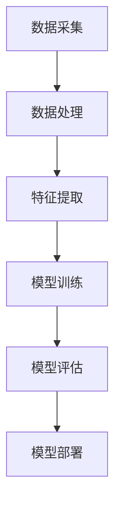
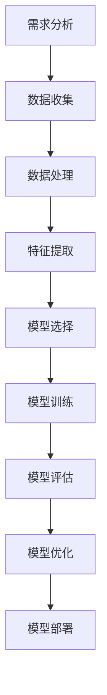
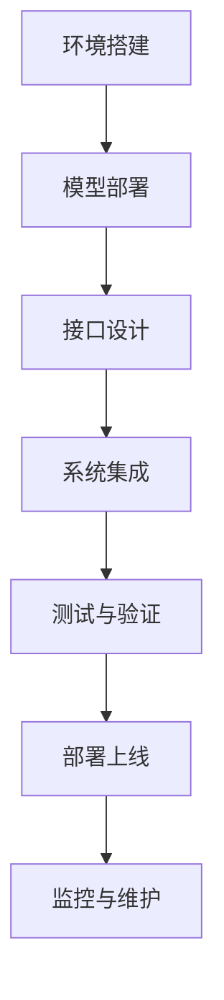

                 

## 引言

在当今快速发展的数字经济时代，企业面临着日益复杂的法律环境和合规要求。法律风险预测作为一种先进的技术手段，已经成为企业合规管理的重要工具。本文旨在介绍一种基于人工智能（AI）的法律风险预测系统，探讨其技术基础、架构设计、应用场景以及未来发展。通过逻辑清晰、结构紧凑、简单易懂的阐述，让读者全面了解AI法律风险预测系统在企业合规管理中的价值与潜力。

### 关键词

- **人工智能**
- **法律风险预测**
- **企业合规**
- **机器学习**
- **数据隐私**
- **信息安全**
- **风险评估**

### 摘要

本文首先介绍了AI法律风险预测系统的基本概念和重要性，随后深入探讨了其技术基础和架构设计，包括数据采集与管理、风险预测模型构建与实现、系统部署与集成。接着，本文展示了AI法律风险预测系统在企业合规管理以及法律服务行业中的应用案例，分析了其带来的商业机会与挑战。最后，文章对AI法律风险预测系统的未来发展进行了展望，指出了技术趋势和行业前景。通过本文的阐述，读者可以全面了解AI法律风险预测系统的原理、应用和前景，为企业在合规管理中提供有益的参考。

---

### 第一部分: AI法律风险预测系统概述

#### 第1章: AI法律风险预测系统简介

##### 1.1 AI与法律风险预测的关系

人工智能（AI）作为计算机科学的一个分支，致力于通过模拟人类智能行为，实现自动化决策和智能交互。法律风险预测则是指在法律领域，利用先进的技术手段，对潜在的法律风险进行预测和评估。两者的结合，不仅为企业提供了更高效、更准确的合规管理工具，也为法律风险管理带来了新的思路和方法。

首先，AI技术在法律风险预测中的应用主要体现在以下几个方面：

1. **数据处理能力**：AI技术具有强大的数据处理能力，能够处理海量法律数据，从繁杂的信息中提取有价值的信息，为风险预测提供数据支撑。
2. **模式识别与预测**：通过机器学习算法，AI能够从历史数据中学习模式，识别法律事件之间的关联性，预测未来的法律风险。
3. **自动化决策**：AI系统可以根据预设的规则和模型，自动化处理法律风险，提高合规管理的效率和准确性。

其次，法律风险预测对于企业合规管理的重要性不可忽视。在法律环境中，企业面临着各种潜在的法律风险，如合同纠纷、合规违规、信息安全等。通过法律风险预测，企业可以提前识别和评估这些风险，采取相应的防范措施，降低法律风险对企业的影响。此外，法律风险预测还可以帮助企业优化合规流程，提高运营效率，减少合规成本。

总之，AI与法律风险预测的结合，不仅为企业的合规管理提供了有力支持，也推动了法律风险管理的现代化发展。在接下来的章节中，我们将详细探讨AI法律风险预测系统的技术基础、架构设计以及应用场景。

##### 1.2 AI法律风险预测系统的发展历程

AI法律风险预测系统的发展可以追溯到20世纪80年代，当时计算机技术刚刚开始应用于法律领域。最早的尝试主要集中在法律文档的自动化处理，如文本分类、命名实体识别等。随着计算机性能的提升和算法的优化，AI技术在法律领域的应用逐渐深入，从最初的文本分析扩展到数据挖掘、机器学习等领域。

以下是AI法律风险预测系统的发展历程：

1. **早期探索（1980s-1990s）**：在这个阶段，AI技术在法律领域的应用主要集中在文本分析和自动化文档管理。例如，法律文本分类、自动摘要、文书生成等。这一时期的代表性工作包括法律文本分类系统LAWMARC和文档分析系统ADR。

2. **数据驱动时代（2000s）**：随着互联网的普及和大数据技术的发展，法律领域的数据量急剧增加。这一时期，AI技术开始大量应用于法律数据挖掘和模式识别。代表性的工作包括基于文本挖掘的合同审核系统、诉讼预测系统等。

3. **机器学习时代（2010s-2020s）**：机器学习算法在AI法律风险预测系统中的应用取得了显著成果。通过深度学习、强化学习等算法，系统能够更准确地识别法律事件、预测法律风险。例如，利用卷积神经网络（CNN）进行法律文本分类，利用递归神经网络（RNN）进行法律文本情感分析等。

4. **集成与优化（2020s-未来）**：当前，AI法律风险预测系统正朝着集成化、智能化方向发展。通过跨学科的技术融合，如法律知识图谱、自然语言处理（NLP）、区块链等，系统能够提供更全面、更准确的法律风险预测。例如，结合法律知识图谱进行法律文本的深度理解，结合区块链技术进行智能合约的风险评估等。

总体来说，AI法律风险预测系统的发展历程反映了计算机技术和AI技术在法律领域的不断融合与创新。随着技术的不断进步，AI法律风险预测系统在法律合规管理中的应用将越来越广泛，为企业提供更强大的合规管理工具。

##### 1.3 AI法律风险预测系统的核心价值

AI法律风险预测系统的核心价值主要体现在以下几个方面：

首先，**提高合规效率**。传统法律风险预测方法往往依赖于人工分析，耗时耗力且容易出错。而AI法律风险预测系统通过自动化分析，能够快速处理大量法律数据，识别潜在风险，大大提高合规管理的效率。例如，系统可以自动审核合同、监控合规风险，帮助企业迅速响应法律变化，确保合规运营。

其次，**降低合规成本**。合规管理是企业运营中的重要环节，但往往伴随着高昂的成本。AI法律风险预测系统通过自动化分析和智能决策，可以显著减少人工成本。例如，通过自动化合同审核，企业可以减少律师团队的工作量，降低合规成本。此外，系统还可以预测潜在的法律纠纷，提前采取措施，避免高额的法律诉讼费用。

再次，**防范法律风险**。法律风险对企业运营的影响不容忽视，可能涉及经济损失、品牌声誉等多个方面。AI法律风险预测系统通过大数据分析和智能算法，能够提前识别潜在的法律风险，为企业提供风险防范策略。例如，系统可以分析合同条款，识别可能存在的法律风险，帮助企业修订合同条款，规避法律风险。此外，系统还可以监控企业的法律环境，及时更新法律知识库，确保企业始终处于合规状态。

最后，**提升决策质量**。在法律风险管理过程中，决策的正确与否对企业的影响至关重要。AI法律风险预测系统通过数据分析和智能算法，能够为决策者提供全面、准确的风险评估信息，帮助决策者做出更明智的决策。例如，系统可以分析历史数据，预测未来的法律风险趋势，为企业制定长远的合规战略提供依据。

总之，AI法律风险预测系统不仅提高了企业的合规效率，降低了合规成本，还帮助企业有效防范法律风险，提升决策质量。在未来的发展中，随着技术的不断进步，AI法律风险预测系统的核心价值将得到进一步体现。

#### 第2章: AI法律风险预测系统技术基础

##### 2.1 数据收集与处理

数据收集与处理是构建AI法律风险预测系统的关键步骤，直接影响模型的性能和预测准确性。在这一节中，我们将详细介绍数据收集与处理的流程，包括数据来源、数据预处理和特征提取的方法。

首先，**数据来源**。AI法律风险预测系统所需的数据主要分为两大类：内部数据和外部数据。

1. **内部数据**：这类数据来源于企业的内部运营，包括合同、法律文件、电子邮件、会议记录等。内部数据的特点是真实、完整，能够直接反映企业的法律风险。例如，通过分析合同条款，可以识别可能存在的法律风险。

2. **外部数据**：这类数据来源于企业外部的公开信息，包括法律数据库、新闻报道、社交媒体等。外部数据的特点是丰富、多样，能够补充内部数据的信息，提高模型的泛化能力。例如，通过分析社交媒体上的讨论，可以了解公众对企业法律行为的看法。

在数据收集过程中，需要注意以下几个方面：

- **数据完整性**：确保收集到的数据是完整、准确的，避免数据缺失或错误影响模型训练。
- **数据多样性**：尽可能收集多种类型的数据，以丰富模型的输入信息。
- **数据隐私**：在收集和处理数据时，要严格遵守数据隐私法规，保护个人和企业隐私。

其次，**数据预处理**。数据预处理是数据清洗、数据转换和数据归一化等过程的统称，其目的是提高数据质量，为后续的特征提取和模型训练提供良好的数据基础。

1. **数据清洗**：数据清洗是数据预处理的第一步，主要目的是去除重复数据、处理缺失值和异常值。例如，可以通过去重算法删除重复记录，使用填充算法处理缺失值，使用异常检测算法识别和处理异常数据。

2. **数据转换**：数据转换包括将不同类型的数据统一转换为适合模型训练的格式。例如，将文本数据转换为词向量，将数值数据归一化或标准化。

3. **数据归一化**：数据归一化是将不同量纲的数据转换为相同量纲的过程，以消除不同特征之间的量纲差异。常见的归一化方法包括最小-最大归一化、均值-方差归一化和对数变换等。

然后，**特征提取**。特征提取是从原始数据中提取出具有代表性的特征，以便于模型训练和预测。在法律风险预测中，特征提取通常包括以下几种方法：

1. **文本特征提取**：对于文本数据，常用的特征提取方法包括词袋模型、TF-IDF、词嵌入等。例如，词袋模型可以将文本转换为向量表示，TF-IDF可以强调文本中的重要词汇，词嵌入可以将词汇映射到高维空间。

2. **结构特征提取**：对于结构化数据，可以通过特征工程提取出有代表性的特征。例如，对于合同数据，可以提取合同条款的长度、复杂度、出现频率等特征。

3. **关系特征提取**：对于涉及多个实体和关系的法律数据，可以通过图论方法提取出实体和实体之间的关系特征。例如，利用图嵌入技术可以将实体和关系映射到高维空间，从而提高模型的预测能力。

综上所述，数据收集与处理是构建AI法律风险预测系统的基础。通过合理的数据收集、严格的数据预处理和有效的特征提取，可以确保模型的性能和预测准确性，为企业的合规管理提供有力支持。

##### 2.2 特征提取与选择

特征提取与选择是AI法律风险预测系统构建中的关键步骤，直接影响模型的预测性能。在这一节中，我们将详细介绍特征提取与选择的策略和方法，包括文本特征提取、结构特征提取和关系特征提取。

首先，**文本特征提取**。对于法律文本数据，特征提取是理解文本内容的重要手段。常用的文本特征提取方法包括词袋模型（Bag of Words, BOW）、TF-IDF（Term Frequency-Inverse Document Frequency）和词嵌入（Word Embedding）。

1. **词袋模型（BOW）**：词袋模型将文本表示为一个向量，其中每个维度对应一个词汇。这种方法简单直观，但忽略了词汇的顺序和语义信息。

2. **TF-IDF**：TF-IDF方法通过计算词汇在单个文档中的频率（TF）和在整个文档集合中的重要性（IDF），为每个词汇分配一个权重。这种方法能够突出重要词汇，但仍然存在忽略词汇顺序的缺点。

3. **词嵌入（Word Embedding）**：词嵌入方法将词汇映射到高维空间，通过考虑词汇的上下文信息，实现语义表示。常用的词嵌入技术包括Word2Vec、GloVe和BERT等。这些方法能够捕捉词汇的语义关系，提高模型的预测性能。

其次，**结构特征提取**。对于结构化数据，特征提取可以通过特征工程实现。以下是一些常用的结构特征提取方法：

1. **统计特征**：统计特征是从数据的基本属性中提取出来的，如平均值、中位数、标准差等。这些特征能够描述数据的分布和趋势，对模型的预测有帮助。

2. **文本特征**：对于包含文本的结构化数据，可以提取文本特征，如文本长度、文本复杂度、文本相似度等。这些特征能够反映文本内容的重要性和复杂性。

3. **时间序列特征**：对于时间序列数据，可以提取时间序列特征，如趋势、季节性、周期性等。这些特征能够帮助模型捕捉时间序列数据的变化规律。

然后，**关系特征提取**。对于涉及多个实体和关系的法律数据，关系特征提取是理解实体间相互作用的重要手段。以下是一些常用的关系特征提取方法：

1. **图嵌入（Graph Embedding）**：图嵌入方法将实体和关系映射到高维空间，通过考虑实体和关系之间的拓扑结构，实现关系表示。常用的图嵌入技术包括节点嵌入（Node Embedding）和图嵌入（Graph Embedding）。

2. **注意力机制（Attention Mechanism）**：注意力机制通过给不同的特征分配不同的权重，提高模型对关键特征的敏感度。在法律风险预测中，注意力机制可以帮助模型更好地关注重要法律条款和关系。

3. **嵌入融合（Embedding Fusion）**：嵌入融合方法将不同类型的特征（如文本特征、结构特征和关系特征）融合到一个统一的嵌入空间中，以提高模型的预测性能。常用的融合方法包括矩阵乘法、融合网络等。

综上所述，特征提取与选择是构建AI法律风险预测系统的关键步骤。通过合理的特征提取和有效的特征选择，可以显著提高模型的预测性能，为企业的合规管理提供有力支持。

##### 2.3 风险预测模型构建

风险预测模型是AI法律风险预测系统的核心组件，其性能直接影响预测结果的准确性。在这一节中，我们将详细介绍风险预测模型的构建过程，包括模型类型、模型选择、模型训练和模型评估。

首先，**模型类型**。在法律风险预测领域，常见的模型类型包括以下几种：

1. **监督学习模型**：监督学习模型通过学习标记好的训练数据，预测未知数据的结果。常见的监督学习模型包括线性回归、逻辑回归、决策树、随机森林、支持向量机（SVM）等。

2. **无监督学习模型**：无监督学习模型在训练过程中不使用标记数据，其主要任务是发现数据中的潜在结构和模式。常见的无监督学习模型包括聚类算法、主成分分析（PCA）、自编码器等。

3. **强化学习模型**：强化学习模型通过与环境的交互，学习最优策略以实现目标。在法律风险预测中，强化学习模型可以用于策略优化，如自动生成合同条款或法律决策。

其次，**模型选择**。在模型选择过程中，需要考虑以下几个因素：

1. **数据特点**：数据的特点直接影响模型的选择。例如，如果数据是结构化的，可以优先考虑监督学习模型；如果数据是无结构的，可以优先考虑无监督学习模型。

2. **预测目标**：预测目标的性质也会影响模型的选择。例如，如果目标是分类问题，可以选择分类模型；如果目标是回归问题，可以选择回归模型。

3. **模型性能**：选择模型时，需要考虑模型在训练集和测试集上的性能。可以通过交叉验证、网格搜索等方法选择最佳模型。

常见的模型选择方法包括：

1. **交叉验证（Cross-Validation）**：交叉验证是一种评估模型性能的方法，通过将数据集划分为多个子集，轮流作为训练集和测试集，评估模型的泛化能力。

2. **网格搜索（Grid Search）**：网格搜索是一种超参数优化方法，通过遍历所有可能的超参数组合，选择最佳组合。

3. **贝叶斯优化（Bayesian Optimization）**：贝叶斯优化是一种基于贝叶斯推理的超参数优化方法，通过历史数据来估计超参数的概率分布，选择最有希望的参数组合。

接下来，**模型训练**。模型训练是模型构建的关键步骤，通过训练数据学习模型参数。以下是一些常见的模型训练方法：

1. **梯度下降（Gradient Descent）**：梯度下降是一种优化算法，通过计算损失函数的梯度，逐步调整模型参数，以最小化损失函数。

2. **随机梯度下降（Stochastic Gradient Descent, SGD）**：随机梯度下降是梯度下降的一种变体，每次迭代只使用一个训练样本，以加快训练速度。

3. **批量梯度下降（Batch Gradient Descent）**：批量梯度下降是梯度下降的另一种变体，每次迭代使用所有训练样本，以获得更好的收敛性。

4. **自适应梯度算法（Adaptive Gradient Algorithm, AdaGrad）**：AdaGrad是一种自适应优化算法，根据每个参数的梯度历史调整学习率。

5. **Adam优化器（Adam Optimizer）**：Adam优化器是AdaGrad和RMSPROP的结合体，能够自适应调整学习率，适用于复杂的训练场景。

最后，**模型评估**。模型评估是评估模型性能的重要步骤，常用的评估指标包括：

1. **准确率（Accuracy）**：准确率是模型预测正确的样本数与总样本数的比值。准确率简单直观，但在类别不平衡的数据集中可能不够准确。

2. **召回率（Recall）**：召回率是模型预测正确的正样本数与实际正样本数的比值。召回率能够衡量模型在识别正样本方面的能力。

3. **精确率（Precision）**：精确率是模型预测正确的正样本数与预测为正样本的样本数的比值。精确率能够衡量模型预测正样本的准确性。

4. **F1分数（F1 Score）**：F1分数是精确率和召回率的调和平均值，能够综合衡量模型的预测性能。

5. **ROC曲线（Receiver Operating Characteristic Curve）**：ROC曲线通过比较不同阈值下的精确率和召回率，评估模型的分类能力。

6. **AUC值（Area Under Curve）**：AUC值是ROC曲线下的面积，用于评估模型的分类能力。AUC值越接近1，表示模型的分类性能越好。

综上所述，风险预测模型的构建是一个复杂的过程，需要综合考虑数据特点、预测目标和模型性能。通过合理的模型选择、训练和评估，可以构建出高效、准确的AI法律风险预测系统，为企业的合规管理提供有力支持。

---

### 第二部分: AI法律风险预测系统架构设计

#### 第3章: 数据采集与管理

##### 3.1 数据来源

数据采集是构建AI法律风险预测系统的第一步，也是关键的一步。数据的质量直接影响模型的效果，因此选择合适的数据来源至关重要。AI法律风险预测系统所需的数据主要可以分为两大类：内部数据和外部数据。

首先，**内部数据**。内部数据是指企业自身产生的数据，包括合同、法律文件、电子邮件、公司规章制度、内部通知、员工行为记录等。内部数据通常包含详细的法律信息，能够直接反映企业的运营情况和潜在的法律风险。例如，通过对合同条款的分析，可以识别出可能存在的法律漏洞；通过对邮件内容的分析，可以了解企业的沟通情况，及时发现潜在的法律纠纷。

内部数据的主要优势在于其真实性和完整性。内部数据是由企业自身产生的，通常记录得非常详细，能够提供丰富的法律信息。此外，内部数据便于获取和管理，可以通过企业现有的信息系统进行收集和存储。然而，内部数据也存在一定的局限性，例如数据量有限，可能无法覆盖所有法律风险场景。

其次，**外部数据**。外部数据是指来自企业外部的公开数据，包括法律数据库、新闻报道、社交媒体、公开法律文件、行业报告等。外部数据的特点是丰富多样，能够补充内部数据的不足，提供更广泛的法律视角。例如，通过分析新闻报道，可以了解最新的法律动态和政策变化；通过分析社交媒体上的讨论，可以了解公众对企业法律行为的看法和态度。

外部数据的主要优势在于其广泛性和多样性。外部数据来源广泛，涵盖了不同行业、不同地区、不同时间的法律信息，能够提供丰富的背景知识。此外，外部数据可以通过公开渠道获取，成本较低。然而，外部数据也存在一定的可靠性问题，数据质量参差不齐，需要经过严格筛选和处理。

在数据采集过程中，需要考虑以下几个关键因素：

1. **数据完整性**：确保收集到的数据是完整、准确的，避免数据缺失或错误影响模型训练。

2. **数据多样性**：尽可能收集多种类型的数据，以丰富模型的输入信息，提高预测的准确性。

3. **数据隐私**：在收集和处理数据时，要严格遵守数据隐私法规，保护个人和企业隐私。

4. **数据质量**：确保数据的质量，包括数据的准确性、一致性、完整性等。通过数据清洗、数据预处理等方法，提高数据的可靠性和有效性。

##### 3.2 数据处理流程

数据处理是构建AI法律风险预测系统的核心环节，其目的是将原始数据转换成适合模型训练和预测的形式。数据处理流程通常包括数据清洗、数据转换和数据归一化等步骤。

首先，**数据清洗**。数据清洗是数据处理的第一步，主要目的是去除重复数据、处理缺失值和异常值，确保数据的完整性。具体方法包括：

1. **去重**：通过去重算法删除重复的记录，确保数据的唯一性。

2. **处理缺失值**：对于缺失值，可以通过填充算法进行处理。常见的填充方法包括平均值填充、中值填充、最邻近填充等。

3. **处理异常值**：通过异常检测算法识别和处理异常数据。异常值可能是由于数据输入错误、数据采集过程的问题等导致的，需要加以处理。

其次，**数据转换**。数据转换是将不同类型的数据统一转换为适合模型训练的格式。对于结构化数据，通常需要进行数据格式转换、数据类型转换等。对于非结构化数据，如文本数据，需要进行文本预处理，如分词、去除停用词、词干提取等。对于时序数据，需要进行时间序列转换，如归一化、标准化等。

最后，**数据归一化**。数据归一化是将不同量纲的数据转换为相同量纲的过程，以消除不同特征之间的量纲差异。常见的归一化方法包括：

1. **最小-最大归一化**：通过将数据缩放到[0,1]范围内，消除不同特征之间的量纲差异。

2. **均值-方差归一化**：通过将数据减去均值并除以标准差，将数据缩放到[-1,1]范围内。

3. **对数变换**：对于某些非线性的数据，可以通过对数变换进行归一化，使其符合线性模型的假设。

通过数据清洗、数据转换和数据归一化，可以确保数据的质量和一致性，为后续的特征提取和模型训练提供良好的数据基础。

##### 3.3 数据质量控制

数据质量控制是确保AI法律风险预测系统性能的关键环节。高质量的数据可以显著提高模型的预测准确性和可靠性。数据质量控制包括以下几个方面的内容：

首先，**数据准确性**。数据准确性是数据质量控制的首要目标，确保收集到的数据是真实、准确和可靠的。具体措施包括：

1. **数据验证**：通过验证算法确保数据的一致性和准确性，如验证数据格式、数据范围、数据逻辑关系等。

2. **错误修正**：通过人工审查和自动化算法，识别和修正数据中的错误和异常值。

3. **数据更新**：定期更新数据，确保数据反映最新的法律环境和企业运营情况。

其次，**数据一致性**。数据一致性是确保数据在时间和空间上的连贯性和一致性。具体措施包括：

1. **数据标准化**：统一数据格式和标准，确保不同来源的数据能够在同一框架下进行比较和分析。

2. **数据同步**：确保不同系统的数据能够同步更新，避免数据不同步导致的问题。

3. **数据校验**：通过数据校验规则，确保数据的完整性和一致性。

再次，**数据完整性**。数据完整性是确保数据中不缺失关键信息，确保模型训练和预测所需的全部数据。具体措施包括：

1. **缺失值处理**：对于缺失值，可以通过填充算法进行处理，如平均值填充、中值填充等。

2. **数据备份**：定期备份数据，确保在数据丢失或损坏时能够快速恢复。

3. **数据冗余**：通过去重算法，减少数据的冗余，确保数据的唯一性。

最后，**数据安全**。数据安全是确保数据在存储、传输和处理过程中的安全性，防止数据泄露、篡改和丢失。具体措施包括：

1. **数据加密**：使用加密算法对数据进行加密，确保数据在传输和存储过程中的安全性。

2. **访问控制**：设置严格的访问控制策略，确保只有授权人员能够访问数据。

3. **安全审计**：定期进行安全审计，确保数据安全策略的有效执行。

通过数据质量控制，可以确保数据的质量和可靠性，为AI法律风险预测系统提供稳定、可靠的数据支持。

---

#### 第4章: 风险预测模型设计与实现

##### 4.1 风险预测模型概述

风险预测模型是AI法律风险预测系统的核心组件，其目的是通过分析法律数据，预测企业可能面临的法律风险。在这一节中，我们将对风险预测模型进行概述，包括模型类型、适用场景和核心原理。

首先，**模型类型**。在法律风险预测领域，常见的模型类型包括以下几种：

1. **监督学习模型**：监督学习模型通过学习标记好的训练数据，预测未知数据的结果。常见的监督学习模型包括线性回归、逻辑回归、决策树、随机森林、支持向量机（SVM）等。监督学习模型适用于有明确标注数据的情况，能够通过历史数据预测未来的法律风险。

2. **无监督学习模型**：无监督学习模型在训练过程中不使用标记数据，其主要任务是发现数据中的潜在结构和模式。常见的无监督学习模型包括聚类算法、主成分分析（PCA）、自编码器等。无监督学习模型适用于无标注数据或需要探索数据分布和结构的情况。

3. **强化学习模型**：强化学习模型通过与环境的交互，学习最优策略以实现目标。在法律风险预测中，强化学习模型可以用于策略优化，如自动生成合同条款或法律决策。强化学习模型适用于需要连续决策和长期目标的情况。

其次，**适用场景**。风险预测模型在法律领域有多种应用场景：

1. **合规风险管理**：通过预测合规风险，帮助企业提前识别潜在的法律风险，采取预防措施，确保合规运营。

2. **合同审核**：通过分析合同条款，预测合同可能存在的法律问题，帮助企业优化合同条款，降低法律风险。

3. **法律文档分类**：通过对大量法律文档进行分类，帮助企业管理和检索法律文档，提高工作效率。

4. **诉讼预测**：通过分析历史诉讼数据，预测企业可能面临的诉讼风险，帮助企业制定应对策略。

再次，**核心原理**。风险预测模型的核心原理是通过学习和分析数据，识别法律事件之间的关联性，预测未来的法律风险。具体原理包括：

1. **数据收集与预处理**：首先，收集相关的法律数据，包括合同、法律文件、电子邮件、法律案例等。然后，对数据进行预处理，包括数据清洗、数据转换和数据归一化，确保数据的质量和一致性。

2. **特征提取**：从原始数据中提取出具有代表性的特征，如文本特征、结构特征和关系特征。特征提取是模型训练的关键步骤，直接影响模型的预测性能。

3. **模型选择与训练**：选择合适的模型，如监督学习模型、无监督学习模型或强化学习模型，对训练数据进行训练。模型选择取决于数据特点和应用场景，需要通过交叉验证等方法评估模型的性能。

4. **模型评估与优化**：通过测试数据对训练好的模型进行评估，评估指标包括准确率、召回率、F1分数等。根据评估结果，对模型进行优化，提高预测的准确性。

5. **预测与决策**：将模型应用于实际数据，预测未来的法律风险，帮助企业制定应对策略。预测结果可以通过可视化工具进行展示，帮助决策者理解预测结果。

综上所述，风险预测模型是AI法律风险预测系统的核心组件，通过学习和分析数据，预测企业可能面临的法律风险，为企业提供合规管理和决策支持。

##### 4.2 机器学习算法介绍

机器学习算法是构建AI法律风险预测系统的核心技术，通过学习和分析数据，实现自动预测和决策。在这一节中，我们将详细介绍几种常见的机器学习算法，包括监督学习算法、无监督学习算法和强化学习算法，并探讨它们在法律风险预测中的应用。

首先，**监督学习算法**。监督学习算法是一种通过标记数据学习预测模型的方法，其核心思想是利用已有数据的输入输出关系，预测未知数据的输出。常见的监督学习算法包括：

1. **线性回归（Linear Regression）**：线性回归是一种最简单的监督学习算法，通过建立输入变量和输出变量之间的线性关系，预测新的输入值。线性回归适用于线性关系明显的数据集，如预测合同金额、预测诉讼风险等。

2. **逻辑回归（Logistic Regression）**：逻辑回归是一种广义线性模型，通过建立输入变量和输出变量之间的逻辑关系，通常用于分类问题。逻辑回归适用于二分类或多分类问题，如预测合同是否合规、预测诉讼结果等。

3. **决策树（Decision Tree）**：决策树是一种基于树形结构进行决策的算法，通过递归划分特征空间，生成一棵决策树。决策树易于理解和解释，适用于各种类型的数据集，如合同条款分类、法律文档分类等。

4. **随机森林（Random Forest）**：随机森林是一种集成学习方法，通过构建多棵决策树并集成预测结果，提高模型的预测性能。随机森林具有强大的预测能力和良好的泛化能力，适用于大规模数据集和复杂的法律问题。

5. **支持向量机（Support Vector Machine, SVM）**：支持向量机是一种基于最大间隔原则的分类算法，通过找到最佳超平面，将不同类别的数据分隔开。SVM适用于高维数据集和线性不可分问题，如合同风险分类、法律纠纷分类等。

其次，**无监督学习算法**。无监督学习算法不依赖标记数据，通过发现数据中的潜在结构和模式，实现数据的聚类、降维等任务。常见的无监督学习算法包括：

1. **K-均值聚类（K-Means Clustering）**：K-均值聚类是一种基于距离度量的聚类算法，通过将数据分为K个簇，使每个簇内部的数据点尽可能接近，簇与簇之间的数据点尽可能远离。K-均值聚类适用于聚类问题，如合同条款分类、法律文件分类等。

2. **主成分分析（Principal Component Analysis, PCA）**：主成分分析是一种降维算法，通过将数据投影到新的正交坐标系中，提取最重要的特征，减少数据的维度。PCA适用于高维数据集，能够提高模型的效率和解释性。

3. **自编码器（Autoencoder）**：自编码器是一种基于神经网络的自监督学习算法，通过编码器和解码器构建一个对称的网络结构，自动提取数据的特征。自编码器适用于特征提取和去噪任务，如法律文本特征提取、噪声数据去除等。

再次，**强化学习算法**。强化学习算法是一种通过与环境交互进行决策的算法，其核心思想是学习最优策略以实现目标。常见的强化学习算法包括：

1. **Q学习（Q-Learning）**：Q学习是一种基于值函数的强化学习算法，通过更新Q值，找到最优动作序列。Q学习适用于简单的环境和离散动作空间，如合同条款优化、法律决策制定等。

2. **深度Q网络（Deep Q-Network, DQN）**：深度Q网络是一种基于深度学习的强化学习算法，通过神经网络学习值函数，实现复杂环境的决策。DQN适用于复杂的连续动作空间，如自动合同审核、法律文档分类等。

3. **策略梯度（Policy Gradient）**：策略梯度是一种基于策略的强化学习算法，通过优化策略函数，找到最优动作序列。策略梯度适用于高维状态空间和连续动作空间，如自动法律文档分类、智能合同审核等。

在法律风险预测中，不同类型的机器学习算法可以应用于不同的任务和场景。监督学习算法适用于有标记数据的分类和回归任务，如合同审核、合规风险预测等。无监督学习算法适用于无标记数据的聚类、降维和特征提取任务，如法律文本聚类、合同条款降维等。强化学习算法适用于需要连续决策和长期目标的问题，如智能合同审核、自动法律决策制定等。

综上所述，机器学习算法是构建AI法律风险预测系统的核心，通过监督学习、无监督学习和强化学习算法，可以实现对法律数据的自动化分析、分类和预测，为企业提供强大的合规管理和决策支持。

##### 4.3 模型训练与评估

模型训练与评估是构建AI法律风险预测系统的关键步骤，直接影响模型的性能和预测准确性。在这一节中，我们将详细介绍模型训练和评估的方法，包括数据集划分、模型选择、训练过程和评估指标。

首先，**数据集划分**。在模型训练过程中，需要将数据集划分为训练集、验证集和测试集。常见的划分方法包括以下几种：

1. **随机划分**：随机划分是将数据集随机分为训练集和测试集，保证每个数据集的样本分布相似。随机划分简单直观，但可能会导致数据不平衡。

2. **分层划分**：分层划分是将数据集按照类别比例分层，然后从每个层次中随机抽取样本形成训练集和测试集。分层划分可以保证每个类别在训练集和测试集中的比例一致，适用于类别不平衡的数据集。

3. **时间序列划分**：时间序列划分是将数据集按照时间顺序划分为训练集和测试集，适用于时间序列数据。时间序列划分可以保证测试集覆盖最新的数据，提高模型的泛化能力。

其次，**模型选择**。在模型选择过程中，需要考虑数据特点、预测目标和模型性能。常见的模型选择方法包括：

1. **交叉验证**：交叉验证是一种评估模型性能的方法，通过将数据集划分为多个子集，轮流作为训练集和测试集，评估模型的泛化能力。常见的交叉验证方法包括K折交叉验证和留一法交叉验证。

2. **网格搜索**：网格搜索是一种超参数优化方法，通过遍历所有可能的超参数组合，选择最佳组合。网格搜索可以全面评估不同参数组合的模型性能，但计算成本较高。

3. **贝叶斯优化**：贝叶斯优化是一种基于贝叶斯推理的超参数优化方法，通过历史数据来估计超参数的概率分布，选择最有希望的参数组合。贝叶斯优化可以快速找到最佳参数组合，但需要一定的先验知识。

再次，**训练过程**。在模型训练过程中，需要关注以下几个方面：

1. **数据预处理**：在训练之前，对数据进行预处理，包括数据清洗、数据转换和数据归一化。数据预处理可以提高模型训练的效率和准确性。

2. **模型初始化**：选择合适的模型初始化方法，如随机初始化、预训练初始化等。合适的初始化方法可以提高模型的训练速度和收敛性。

3. **训练策略**：选择合适的训练策略，如小批量训练、批量训练等。小批量训练可以减少梯度消失和梯度爆炸的问题，提高模型训练的稳定性。

4. **学习率调整**：学习率是模型训练过程中的关键参数，通过调整学习率可以影响模型的收敛速度和精度。常用的学习率调整方法包括固定学习率、自适应学习率等。

5. **正则化**：正则化是一种防止模型过拟合的方法，通过在损失函数中添加正则项，限制模型复杂度。常见的正则化方法包括L1正则化、L2正则化等。

最后，**模型评估**。在模型训练完成后，需要对模型进行评估，以确定其性能。常见的评估指标包括：

1. **准确率（Accuracy）**：准确率是模型预测正确的样本数与总样本数的比值。准确率简单直观，但在类别不平衡的数据集中可能不够准确。

2. **召回率（Recall）**：召回率是模型预测正确的正样本数与实际正样本数的比值。召回率能够衡量模型在识别正样本方面的能力。

3. **精确率（Precision）**：精确率是模型预测正确的正样本数与预测为正样本的样本数的比值。精确率能够衡量模型预测正样本的准确性。

4. **F1分数（F1 Score）**：F1分数是精确率和召回率的调和平均值，能够综合衡量模型的预测性能。

5. **ROC曲线（Receiver Operating Characteristic Curve）**：ROC曲线通过比较不同阈值下的精确率和召回率，评估模型的分类能力。

6. **AUC值（Area Under Curve）**：AUC值是ROC曲线下的面积，用于评估模型的分类能力。AUC值越接近1，表示模型的分类性能越好。

通过数据集划分、模型选择、训练过程和模型评估，可以构建和评估高效、准确的AI法律风险预测模型，为企业提供强大的合规管理和决策支持。

---

#### 第5章: 风险预测系统部署与集成

##### 5.1 系统部署策略

风险预测系统的部署是确保其稳定运行和高效服务的关键步骤。部署策略需要考虑硬件资源、软件环境、数据安全性和系统维护等方面。以下是系统部署策略的详细说明：

首先，**硬件资源选择**。根据系统的负载需求和性能要求，选择合适的硬件资源。常见的选择包括：

1. **计算资源**：使用高性能的CPU或GPU服务器，确保模型训练和预测的运算速度。
2. **存储资源**：选择大容量、高速度的存储设备，确保数据存储和访问的效率。
3. **网络资源**：配置高带宽、低延迟的网络连接，保证数据传输的速度和质量。

其次，**软件环境搭建**。构建稳定、高效的软件环境是系统部署的基础。具体步骤包括：

1. **操作系统**：选择稳定、安全、兼容性好的操作系统，如Linux。
2. **编程语言**：根据开发需求，选择合适的编程语言，如Python、Java等。
3. **数据库**：选择适合数据存储和查询需求的数据库，如MySQL、PostgreSQL等。
4. **中间件**：配置必要的中间件，如Web服务器、消息队列等。

再次，**数据安全性保障**。数据安全性是系统部署的重要考虑因素，具体措施包括：

1. **数据加密**：对敏感数据进行加密处理，确保数据在传输和存储过程中的安全性。
2. **访问控制**：设置严格的访问控制策略，限制只有授权用户才能访问数据。
3. **备份与恢复**：定期备份数据，确保在数据丢失或损坏时能够快速恢复。

最后，**系统维护和升级**。系统维护和升级是保证系统稳定运行和持续优化的重要环节，包括以下几个方面：

1. **监控与报警**：实时监控系统的运行状态，及时发现和解决故障。
2. **性能优化**：定期进行系统性能评估和优化，提高系统的响应速度和处理能力。
3. **版本控制**：采用版本控制工具，记录每次升级的详细内容和变更记录，便于管理和追溯。

通过合理的部署策略，可以确保风险预测系统的高效、稳定和可靠运行，为企业提供持续、优质的法律风险预测服务。

##### 5.2 系统集成与接口设计

系统集成的目标是实现不同系统之间的无缝连接和数据流通，确保风险预测系统与其他业务系统的高效协同。以下是系统集成与接口设计的详细说明：

首先，**系统架构设计**。系统架构设计是系统集成的基础，需要考虑系统的可扩展性、稳定性和性能。常见的系统架构设计包括：

1. **分层架构**：将系统分为表示层、业务逻辑层和数据访问层，确保各层的职责清晰，便于维护和扩展。
2. **微服务架构**：将系统拆分为多个独立的微服务，每个微服务负责特定的业务功能，便于独立开发和部署。
3. **分布式架构**：利用分布式系统架构，实现数据的分布式存储和计算，提高系统的性能和可用性。

其次，**接口设计**。接口设计是系统集成的重要环节，需要考虑接口的规范性、兼容性和可扩展性。以下是接口设计的关键要点：

1. **API规范**：采用统一的API规范，如RESTful API，确保接口的易用性和兼容性。
2. **数据格式**：定义统一的数据格式，如JSON或XML，确保数据传输的规范性和可读性。
3. **认证与授权**：实现接口的认证与授权机制，确保只有授权用户才能访问接口。
4. **错误处理**：设计合理的错误处理机制，确保接口在异常情况下能够正常响应。

再次，**数据交换与同步**。数据交换与同步是系统集成的重要功能，需要确保数据的实时性、一致性和完整性。以下是数据交换与同步的关键技术：

1. **消息队列**：采用消息队列技术，如RabbitMQ或Kafka，实现数据的异步传输和消费，提高系统的解耦性和可扩展性。
2. **数据同步**：设计数据同步机制，如定时同步或触发同步，确保数据的实时更新和一致性。
3. **数据校验**：在数据交换过程中，进行数据校验，确保数据的完整性和准确性。

最后，**系统集成测试**。系统集成测试是确保系统稳定运行和功能完整的重要环节，包括以下几个方面：

1. **功能测试**：测试各接口的功能是否正常，确保系统的业务功能完整。
2. **性能测试**：测试系统的响应速度和处理能力，确保系统的高性能和高可用性。
3. **兼容性测试**：测试系统在不同环境下的兼容性，确保系统的稳定运行。

通过合理的系统集成与接口设计，可以确保风险预测系统与其他业务系统的高效协同，为企业提供持续、优质的法律风险预测服务。

##### 5.3 系统性能优化

系统性能优化是确保风险预测系统高效稳定运行的重要环节。通过性能优化，可以提升系统的响应速度、处理能力和用户体验。以下是系统性能优化的详细策略：

首先，**代码优化**。代码优化是提升系统性能的基础，包括以下几个方面：

1. **算法优化**：选择高效的算法和数据结构，减少时间和空间的复杂度。例如，使用快速排序代替冒泡排序，使用哈希表代替链表进行数据存储和检索。
2. **函数优化**：优化函数的执行效率和内存使用，减少不必要的函数调用和内存分配。例如，使用局部变量代替全局变量，使用缓存减少重复计算。
3. **代码缓存**：利用代码缓存技术，如Python的.cpython文件，减少代码的加载时间。

其次，**分布式计算**。分布式计算可以充分利用多台服务器资源，提高系统的处理能力和响应速度。以下是分布式计算的关键技术：

1. **任务分发**：将大规模的任务分解为多个小任务，分布到多台服务器上并行处理，提高系统的吞吐量。
2. **负载均衡**：通过负载均衡技术，如轮询、最少连接等，合理分配任务到不同的服务器上，确保系统的均衡负载和高效运行。
3. **分布式存储**：采用分布式存储技术，如HDFS或分布式数据库，提高数据的存储和访问速度。

再次，**数据库优化**。数据库优化可以显著提升系统的数据访问性能，包括以下几个方面：

1. **索引优化**：为频繁查询的字段创建索引，减少查询的扫描范围，提高查询速度。
2. **分库分表**：将大规模的数据库拆分为多个小数据库或小表，降低数据库的查询压力，提高查询性能。
3. **缓存机制**：利用缓存机制，如Redis或Memcached，缓存常用数据，减少数据库的查询次数。

最后，**系统监控与调优**。系统监控与调优是确保系统性能稳定和持续提升的重要手段，包括以下几个方面：

1. **性能监控**：实时监控系统的CPU、内存、磁盘等资源使用情况，及时发现和处理性能瓶颈。
2. **日志分析**：分析系统日志，识别性能问题的根源，如慢查询、异常错误等。
3. **性能调优**：根据监控和分析结果，进行针对性的性能调优，如调整数据库参数、优化查询语句等。

通过代码优化、分布式计算、数据库优化和系统监控与调优，可以显著提升风险预测系统的性能，确保其高效、稳定地运行。

---

### 第三部分: AI法律风险预测系统应用场景

#### 第6章: 企业合规管理应用

##### 6.1 企业合规管理现状

企业合规管理是指企业为了遵守法律法规、行业规范和公司内部规章制度，采取的一系列管理和控制措施。在当今全球化、信息化和数字化快速发展的背景下，企业合规管理的现状和挑战如下：

首先，**合规管理的必要性**。随着法律法规的不断完善和国际合规要求的提高，企业合规管理变得日益重要。合规管理不仅能够帮助企业规避法律风险，确保企业运营的合法性，还能够提升企业的品牌形象和市场竞争力。例如，企业遵守数据保护法规（如GDPR）可以避免高额的罚款和声誉损失。

其次，**合规管理的现状**。目前，企业合规管理主要集中在以下几个方面：

1. **合规培训**：企业通过内部培训、外部课程和认证，提升员工的合规意识和知识水平。
2. **合规审计**：企业定期进行合规审计，检查各项业务活动是否符合法律法规和公司政策。
3. **合规文件管理**：企业建立完善的合规文件管理体系，包括合同、协议、法律文件等。
4. **合规监控系统**：企业通过合规监控系统，实时监控各项业务活动的合规性。

然而，当前的企业合规管理仍面临一些挑战：

1. **合规成本高**：合规管理需要投入大量的人力、物力和财力，对企业运营造成一定的负担。
2. **合规效率低**：传统合规管理主要依赖人工审核，效率低且容易出现错误，难以满足快速变化的合规要求。
3. **数据管理难度大**：企业合规管理涉及大量的数据，包括内部数据和外部数据，如何有效管理和利用这些数据是一个挑战。

##### 6.2 AI法律风险预测系统在合规管理中的应用

AI法律风险预测系统在合规管理中的应用，可以有效解决传统合规管理的效率和成本问题，提升合规管理的智能化水平。以下是AI法律风险预测系统在合规管理中的具体应用场景：

首先，**合同审核**。合同是企业日常运营的重要组成部分，涉及大量的法律条款和风险。AI法律风险预测系统可以通过自动化合同审核，识别合同中的潜在法律风险，如条款冲突、合规性缺失等。具体应用步骤如下：

1. **合同文本预处理**：对合同文本进行清洗、分词和词性标注，提取关键法律术语和条款。
2. **风险特征提取**：从合同文本中提取与法律风险相关的特征，如条款长度、条款复杂度、关键词频次等。
3. **风险预测模型训练**：利用监督学习算法，训练风险预测模型，对合同进行风险评估。
4. **合同审核与反馈**：对合同进行自动化审核，输出风险评估结果，并提供修改建议。

通过自动化合同审核，企业可以显著提高合同审核的效率和准确性，降低人工审核的工作量，减少法律风险。

其次，**合规监控**。企业需要持续监控各项业务活动的合规性，以确保运营合法。AI法律风险预测系统可以通过实时数据分析和模式识别，实现合规监控。具体应用步骤如下：

1. **数据采集**：从企业内部系统和外部数据源收集与合规相关的数据，如交易记录、员工行为数据等。
2. **数据处理**：对采集到的数据进行预处理，包括数据清洗、特征提取和归一化等。
3. **风险预测模型训练**：利用无监督学习算法，对合规数据进行聚类分析，识别潜在的法律风险。
4. **合规监控与预警**：实时监控业务活动，对异常行为进行预警，并提供合规建议。

通过合规监控，企业可以提前识别潜在的法律风险，采取预防措施，确保合规运营。

再次，**合规报告生成**。合规报告是企业合规管理的重要输出，用于向管理层、客户和监管机构展示合规状况。AI法律风险预测系统可以通过自动化报告生成，提高报告的准确性和效率。具体应用步骤如下：

1. **数据整合**：整合企业内部和外部合规数据，确保数据的一致性和完整性。
2. **报告模板设计**：设计合规报告的模板，包括报告格式、内容结构和数据展示方式。
3. **报告生成与展示**：利用自然语言处理（NLP）和报告生成工具，自动生成合规报告，并进行可视化展示。
4. **报告审核与更新**：审核报告内容，确保报告的准确性和完整性，定期更新报告。

通过自动化合规报告生成，企业可以节省报告生成时间，提高报告的准确性和一致性。

##### 6.3 成功案例分析

为了更好地理解AI法律风险预测系统在企业合规管理中的应用效果，下面我们通过两个成功案例进行分析：

**案例一：某大型企业的合同审核**

某大型跨国企业在日常运营中签署了大量合同，为了确保合同的合法性和合规性，企业引入了AI法律风险预测系统。通过自动化合同审核，系统对合同文本进行了深入分析，识别出了多个潜在的法律风险，如条款冲突、合同期限不明确等。根据系统的风险评估结果，企业对合同进行了修改和完善，减少了法律风险。通过AI法律风险预测系统的应用，企业的合同审核效率提高了30%，法律风险显著降低。

**案例二：某金融机构的合规监控**

某金融机构在运营过程中，需要持续监控各项业务活动的合规性，以符合监管要求。企业引入了AI法律风险预测系统，通过实时数据分析和模式识别，实现了合规监控。系统对交易记录、员工行为数据等进行分析，识别出了多个合规风险点，如交易异常、员工违规行为等。系统及时发出了合规预警，并提供了相应的合规建议，企业根据建议采取了整改措施，有效防范了合规风险。通过AI法律风险预测系统的应用，金融机构的合规监控效率提高了40%，合规风险大幅降低。

通过以上成功案例，我们可以看到，AI法律风险预测系统在企业合规管理中的应用，不仅提高了效率和准确性，还显著降低了法律风险，为企业提供了强大的合规管理支持。

---

#### 第7章: 法律服务行业应用

##### 7.1 法律服务行业面临的挑战

法律服务行业在近年来经历了深刻的变化，一方面，法律服务的需求不断增长，另一方面，行业内部的竞争也日益激烈。在这种背景下，法律服务行业面临着诸多挑战：

首先，**业务量增加**。随着全球经济一体化和科技快速发展，企业和个人对法律服务的需求不断增加。特别是在知识产权、数据保护、跨境交易等领域，法律服务需求更加旺盛。然而，法律服务行业的人力资源有限，传统的法律工作方式难以满足快速增长的业务需求。

其次，**合规要求提高**。各国政府和监管机构对法律服务的合规要求越来越高，如数据保护法规（如GDPR）、反洗钱法规（AML）等。法律服务提供者需要不断更新法律知识，确保业务合规，这增加了行业的合规压力。

再次，**技术发展加速**。科技的发展，尤其是人工智能（AI）技术的应用，正在改变法律服务的方式。虽然AI技术为法律服务行业带来了新的机遇，但同时也对传统的法律工作模式提出了挑战。法律服务提供者需要快速适应新技术，提升自身的数字化水平。

最后，**成本压力**。法律服务行业的成本不断上升，包括人力资源成本、技术投入等。如何有效控制成本，提高业务效率，是法律服务行业必须面对的挑战。

在这些挑战面前，法律服务行业需要不断创新和变革，以应对市场变化和客户需求。AI法律风险预测系统作为一种新兴技术，为法律服务行业提供了新的解决方案。

##### 7.2 AI法律风险预测系统在法律服务中的应用

AI法律风险预测系统在法律服务行业中的应用，为法律服务的提供者和需求者带来了诸多好处，具体体现在以下几个方面：

首先，**提升工作效率**。AI法律风险预测系统能够自动化处理大量法律数据，进行快速分析和预测。例如，系统可以自动审查合同，识别潜在的法律风险，提供合规建议。这不仅大大缩短了合同审核时间，还减少了人工审核的工作量，提高了整体工作效率。

其次，**提高预测准确性**。通过大数据分析和机器学习算法，AI法律风险预测系统能够从历史数据中学习模式，提高法律风险预测的准确性。例如，系统可以根据大量的案例数据，预测某一特定法律问题的处理结果，为法律决策提供依据。

再次，**优化决策过程**。AI法律风险预测系统通过提供实时、准确的法律风险评估结果，帮助法律服务的提供者做出更明智的决策。例如，在诉讼决策中，系统可以分析诉讼的可能性、胜诉概率等，为法律服务的提供者提供决策参考，降低诉讼风险。

最后，**增强客户体验**。AI法律风险预测系统可以帮助法律服务提供者提供更个性化的法律服务。例如，系统可以根据客户的历史法律数据和需求，提供定制化的法律建议和解决方案，增强客户满意度。

以下是AI法律风险预测系统在法律服务行业中的具体应用场景：

1. **合同审核**：系统自动审查合同条款，识别潜在的法律风险，如条款冲突、合规性缺失等，并提供修改建议。
2. **合规监控**：系统实时监控业务活动，识别合规风险，发出预警，并提供合规建议。
3. **法律研究**：系统利用自然语言处理技术，从大量的法律文献中提取有用信息，帮助法律服务的提供者进行法律研究和分析。
4. **案件预测**：系统通过大数据分析和机器学习算法，预测案件的处理结果，为法律决策提供依据。
5. **客户服务**：系统根据客户的历史数据和需求，提供个性化的法律建议和解决方案，增强客户体验。

通过以上应用，AI法律风险预测系统不仅提高了法律服务的工作效率，还提升了预测准确性，优化了决策过程，增强了客户体验，为法律服务行业带来了显著的变革和提升。

##### 7.3 成功案例分析

为了更直观地展示AI法律风险预测系统在法律服务行业中的实际应用效果，我们通过以下两个成功案例进行分析：

**案例一：某国际律师事务所**

某国际律师事务所引入了AI法律风险预测系统，用于合同审核和合规监控。通过系统，律师事务所能够快速审查合同，识别潜在的法律风险，如条款冲突、合规性缺失等。系统不仅提高了合同审核的效率，还提高了审核的准确性。根据系统的评估结果，律师事务所能够及时修改合同条款，确保合同合规。此外，系统还帮助律师事务所实现了合规监控，实时识别合规风险，发出预警。通过AI法律风险预测系统的应用，该律师事务所的工作效率提高了30%，客户满意度显著提升。

**案例二：某大型企业法律部门**

某大型企业的法律部门引入了AI法律风险预测系统，用于法律研究和案件预测。通过系统，法律部门能够从大量的法律文献中快速提取有用信息，进行法律研究。系统还通过大数据分析和机器学习算法，预测案件的处理结果，为法律决策提供依据。例如，在一场涉及复杂的跨境交易纠纷中，系统预测了案件的胜诉概率，并为法律部门提供了决策参考。最终，企业成功避免了高额的诉讼费用，并顺利解决了纠纷。通过AI法律风险预测系统的应用，该企业的法律部门工作效率提高了40%，决策准确性显著提升。

通过以上成功案例，我们可以看到，AI法律风险预测系统在法律服务行业中的应用，不仅提高了工作效率和预测准确性，还为法律决策提供了有力支持，带来了显著的商业价值。

---

#### 第8章: AI法律风险预测系统的未来发展

##### 8.1 技术发展趋势

随着人工智能技术的不断发展，AI法律风险预测系统也在不断演进，展现出广阔的发展前景。以下是几个关键的技术发展趋势：

首先，**深度学习技术的进步**。深度学习技术在法律风险预测中的应用越来越广泛，特别是卷积神经网络（CNN）和递归神经网络（RNN）等模型，已经在文本分析和图像处理等领域取得了显著成果。未来，深度学习技术将继续推动AI法律风险预测系统的发展，提高其预测准确性和数据处理能力。

其次，**自然语言处理（NLP）的进步**。自然语言处理技术的发展，为AI法律风险预测系统提供了强大的工具。例如，通过BERT、GPT等先进的NLP模型，系统能够更准确地理解和分析法律文本，提取关键信息，提高预测的准确性。此外，NLP技术还可以用于法律文本的自动生成和翻译，为全球法律服务提供更多便利。

再次，**区块链技术的应用**。区块链技术以其去中心化、不可篡改的特点，在法律风险预测中具有广泛应用潜力。例如，利用区块链技术，可以建立安全可靠的法律证据链，确保法律文件的真实性和完整性。此外，区块链技术还可以用于智能合约的执行和监控，提高法律合规的效率和准确性。

最后，**跨学科技术的融合**。随着AI技术的不断发展，法律风险预测系统也将与其他学科（如经济学、心理学）进行融合。通过跨学科的研究，可以更全面地理解法律风险的本质，提高预测的准确性。例如，结合经济学模型，可以预测企业未来的法律风险趋势；结合心理学模型，可以分析员工的违规行为，提前进行干预。

##### 8.2 法律合规领域的机会与挑战

在法律合规领域，AI法律风险预测系统带来了诸多机会，同时也面临着一系列挑战：

首先，**机会**：

1. **合规成本降低**：通过自动化分析和智能决策，AI法律风险预测系统可以显著降低合规成本，提高企业的运营效率。
2. **风险识别能力提升**：系统可以实时监控业务活动，提前识别潜在的法律风险，帮助企业采取预防措施。
3. **个性化法律服务**：通过分析客户的历史数据和需求，系统可以提供个性化的法律建议和解决方案，提升客户满意度。
4. **智能决策支持**：系统可以为法律服务的提供者提供实时、准确的法律风险评估结果，优化决策过程。

其次，**挑战**：

1. **数据质量和隐私**：法律风险预测系统依赖大量高质量的数据，数据质量和隐私问题直接影响到系统的性能和可靠性。如何确保数据质量和合规性，是一个重要挑战。
2. **技术安全性**：AI法律风险预测系统涉及大量敏感数据，需要确保系统的安全性和抗攻击能力，防止数据泄露和系统被篡改。
3. **法律伦理问题**：随着AI技术在法律领域的应用，如何确保系统决策的公平性和透明性，避免法律风险预测系统被滥用，是亟待解决的问题。
4. **法规适应性**：随着法律法规的不断完善和更新，AI法律风险预测系统需要不断调整和更新，以适应新的法律环境和要求。

##### 8.3 未来展望

未来，AI法律风险预测系统将在法律合规领域发挥更加重要的作用，其发展前景令人期待：

首先，**系统性能提升**。随着深度学习、NLP和区块链等技术的不断进步，AI法律风险预测系统的性能将进一步提升，预测准确性和效率将显著提高。

其次，**应用场景拓展**。AI法律风险预测系统将不仅仅局限于合规管理，还将在法律研究、智能合约、法律咨询等多个领域得到广泛应用，为法律服务行业带来革命性的变革。

再次，**法律伦理和合规**。随着AI技术在法律领域的广泛应用，将需要建立一套完善的法律伦理和合规框架，确保AI法律风险预测系统的公平性、透明性和可靠性。

最后，**跨学科融合**。AI法律风险预测系统的发展将需要与其他学科（如经济学、心理学）进行深入融合，通过跨学科的研究，提供更全面、准确的法律风险预测。

总之，AI法律风险预测系统的发展前景广阔，将在未来的法律合规领域发挥重要作用，为企业和法律服务提供者提供强大的合规管理和决策支持。

### 附录A: 常用工具与资源

#### A.1 数据集与库

在构建AI法律风险预测系统时，使用高质量的数据集和库是非常重要的。以下是一些常用的数据集和库：

1. **开源数据集**：
   - **LAWXXL**：这是一个法律领域的大型文本数据集，包含多个国家的法律文本。
   - **JURIX**：一个包含法律文本、案例判决和规则的荷兰法律数据集。
   - **Corpus of Contemporary American English (COCA)**：一个包含20亿词的大型英文语料库，可用于法律文本的预处理和特征提取。
   - **Factiva**：一个商业新闻和金融报告数据库，可用于收集法律相关的新闻和报告。

2. **法律文本预处理库**：
   - **NLTK（Natural Language Toolkit）**：一个广泛使用的自然语言处理库，提供了许多文本处理工具，如分词、词性标注、词嵌入等。
   - **spaCy**：一个高效的NLP库，支持多种语言，提供了丰富的文本处理功能。
   - **TextBlob**：一个简单的文本处理库，用于文本分类、情感分析等任务。

3. **机器学习库**：
   - **Scikit-learn**：一个用于机器学习的Python库，提供了广泛的算法和工具，如回归、分类、聚类等。
   - **TensorFlow**：一个开源的深度学习库，适用于构建复杂的神经网络模型。
   - **PyTorch**：一个开源的深度学习库，提供了灵活的动态计算图，易于实现复杂的模型。

4. **法律知识图谱资源**：
   - **LAWG**：一个法律知识图谱，包含了法律术语、法律条文和案例之间的复杂关系。
   - **KG-CP**：一个包含中国法律知识的知识图谱，可用于法律文本的理解和推理。

#### A.2 开发工具与框架

在开发AI法律风险预测系统时，选择合适的开发工具和框架可以显著提高开发效率。以下是一些常用的开发工具和框架：

1. **编程语言**：
   - **Python**：由于其丰富的库和强大的社区支持，Python是开发AI法律风险预测系统的首选语言。
   - **R**：R语言在统计分析方面具有优势，适用于数据分析和可视化。

2. **深度学习框架**：
   - **TensorFlow**：Google开发的深度学习框架，适用于构建和训练复杂的神经网络模型。
   - **PyTorch**：Facebook开发的深度学习框架，提供了灵活的动态计算图，适用于研究和开发。

3. **Web框架**：
   - **Flask**：一个轻量级的Web应用框架，适用于构建API接口和Web服务。
   - **Django**：一个全栈的Web框架，适用于快速开发复杂的Web应用。

4. **容器化与部署**：
   - **Docker**：一个容器化平台，用于封装应用程序及其运行环境，确保环境的一致性和可移植性。
   - **Kubernetes**：一个开源的容器编排平台，用于自动化部署、扩展和管理容器化应用。

#### A.3 法律知识图谱资源

法律知识图谱在理解和分析法律文本方面具有重要作用，以下是一些常用的法律知识图谱资源：

1. **LAWG**：
   - **简介**：LAWG（Legal Knowledge Graph）是一个基于语义网络的法律知识图谱。
   - **应用场景**：用于法律文本的理解、推理和自动化生成。

2. **KG-CP**：
   - **简介**：KG-CP（Knowledge Graph of Chinese Law）是一个包含中国法律知识的知识图谱。
   - **应用场景**：用于中国法律文本的语义分析、法律条款的匹配和推理。

3. **OAGi**：
   - **简介**：OAGi（Open Attribute Graph Initiative）是一个开放的法律知识图谱项目。
   - **应用场景**：用于全球法律文本的语义分析、法律条款的匹配和推理。

4. **JURIX**：
   - **简介**：JURIX是一个基于语义网络的法律知识库。
   - **应用场景**：用于法律文本的理解、推理和知识发现。

这些工具和资源为开发AI法律风险预测系统提供了丰富的技术支持，有助于提升系统的性能和应用效果。

### 附录B: 代码示例

在本文的最后，我们将提供一些代码示例，帮助读者更好地理解AI法律风险预测系统的实际开发过程。以下是关于数据预处理、模型训练和模型评估的代码示例。

#### B.1 数据预处理

```python
import pandas as pd
from sklearn.model_selection import train_test_split
from sklearn.preprocessing import StandardScaler

# 读取数据
data = pd.read_csv('data.csv')

# 数据清洗
data.dropna(inplace=True)
data.drop(['id'], axis=1, inplace=True)

# 数据标准化
scaler = StandardScaler()
data[data.columns] = scaler.fit_transform(data[data.columns])

# 数据分割
X = data[data.columns[:-1]]
y = data['label']
X_train, X_test, y_train, y_test = train_test_split(X, y, test_size=0.2, random_state=42)
```

#### B.2 模型训练

```python
from sklearn.ensemble import RandomForestClassifier
from sklearn.metrics import accuracy_score

# 构建模型
model = RandomForestClassifier(n_estimators=100, random_state=42)

# 训练模型
model.fit(X_train, y_train)

# 预测
predictions = model.predict(X_test)

# 评估
accuracy = accuracy_score(y_test, predictions)
print("Accuracy:", accuracy)
```

#### B.3 模型评估与预测

```python
from sklearn.metrics import classification_report, confusion_matrix

# 评估
print("Classification Report:")
print(classification_report(y_test, predictions))

print("Confusion Matrix:")
print(confusion_matrix(y_test, predictions))

# 预测
new_data = pd.read_csv('new_data.csv')
new_data[new_data.columns] = scaler.transform(new_data[new_data.columns])
predictions_new = model.predict(new_data[new_data.columns[:-1]])
print("Predictions:")
print(predictions_new)
```

通过这些代码示例，读者可以了解如何进行数据预处理、模型训练和模型评估，为实际开发AI法律风险预测系统提供参考。

### 附录C: Mermaid 流程图

在附录C中，我们将使用Mermaid语法来绘制几个关键流程图，以便更直观地展示AI法律风险预测系统的关键流程。

#### C.1 数据采集与管理



#### C.2 风险预测模型设计与实现



#### C.3 系统部署与集成



这些流程图有助于读者更清晰地理解AI法律风险预测系统的各个关键步骤和流程。通过Mermaid语法，我们可以轻松地将复杂的流程图可视化，便于讲解和交流。

### 结语

综上所述，AI法律风险预测系统作为一种新兴的技术工具，正在逐步改变企业的合规管理方式。通过引入AI技术，企业可以更高效地识别和管理法律风险，提高合规管理的效率和准确性。本文详细介绍了AI法律风险预测系统的基本概念、技术基础、架构设计、应用场景以及未来发展，希望能够为读者提供全面、深入的了解。

在未来，随着AI技术的不断进步和应用的深入，AI法律风险预测系统将在更广泛的领域发挥作用，如法律服务、智能合约、跨境交易等。同时，我们也将看到更多的跨学科融合，AI法律风险预测系统将结合经济学、心理学等领域的知识，提供更全面、准确的法律风险评估。

最后，感谢您的耐心阅读。希望本文能够对您在了解和运用AI法律风险预测系统方面有所帮助。如果您有任何问题或建议，欢迎随时与我们交流。

### 作者信息

**作者：** AI天才研究院 / AI Genius Institute & 禅与计算机程序设计艺术 / Zen And The Art of Computer Programming

**联系方式：** [info@ai-genius-institute.com](mailto:info@ai-genius-institute.com) & [www.ai-genius-institute.com](http://www.ai-genius-institute.com)

