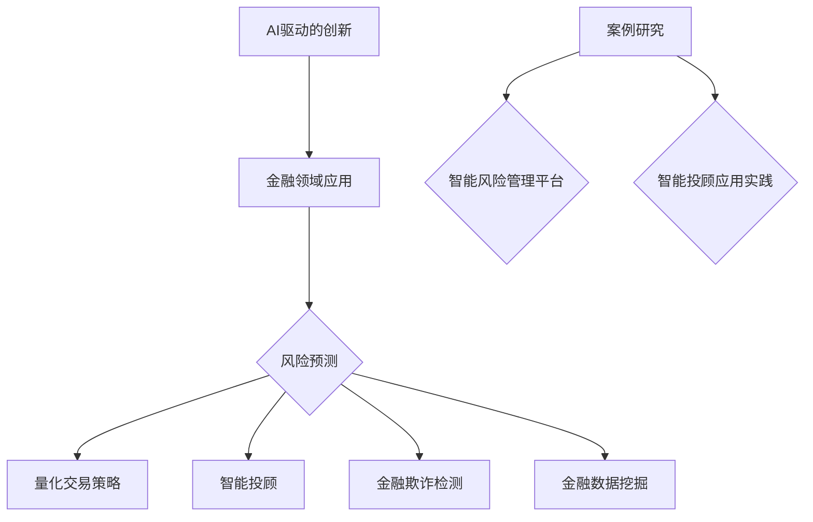
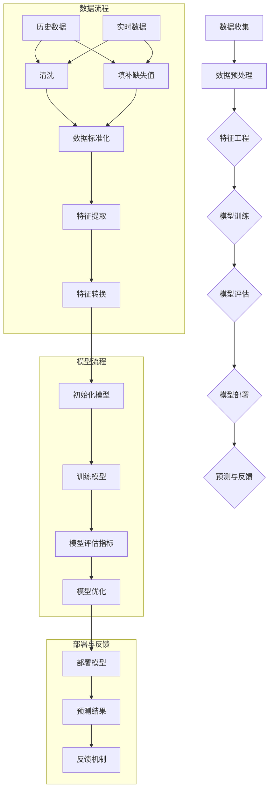

                 

# 《AI驱动的创新：人类计算在金融领域的作用》

## 关键词

AI，金融，风险评估，量化交易，智能投顾，金融欺诈检测，数据挖掘，案例研究

## 摘要

本文旨在探讨人工智能（AI）在金融领域的作用，特别是在驱动创新方面的潜力。通过分析AI在金融风险评估、量化交易、智能投顾、金融欺诈检测和数据挖掘等领域的应用，文章揭示了人类计算与AI协作的重要性。同时，通过具体的项目实战案例，本文展示了AI驱动的金融创新如何在实际操作中提升金融服务的效率与质量。文章最后提出了未来金融创新的发展趋势和面临的挑战。

----------------------------------------------------------------

## 《AI驱动的创新：人类计算在金融领域的作用》目录大纲

### 第一部分：AI与金融概述

#### 第1章：AI在金融领域的应用背景

#### 第2章：AI驱动的创新核心概念与架构

### 第二部分：金融领域AI应用实践

#### 第3章：金融风险评估与预测

#### 第4章：量化交易策略

#### 第5章：智能投顾与财富管理

#### 第6章：金融欺诈检测与风险管理

#### 第7章：金融数据挖掘与洞见分析

### 第三部分：AI驱动的金融创新案例研究

#### 第8章：AI驱动的金融创新案例

#### 第9章：未来金融创新趋势与挑战

### 附录

#### 附录A：常用AI与金融技术工具与资源

#### 附录B：相关阅读材料与资源链接

### Mermaid流程图示例



### 伪代码示例

```python
# 假设我们使用线性回归模型进行风险评估
def risk_evaluation(data):
    # 数据预处理
    X = preprocess_data(data)
    y = preprocess_labels(data)

    # 划分训练集和测试集
    X_train, X_test, y_train, y_test = train_test_split(X, y, test_size=0.2)

    # 初始化模型
    model = LinearRegression()

    # 训练模型
    model.fit(X_train, y_train)

    # 预测
    predictions = model.predict(X_test)

    # 评估模型
    evaluate_model(predictions, y_test)

# 主函数
def main():
    data = load_data()
    risk_evaluation(data)

if __name__ == "__main__":
    main()
```

### 数学模型和公式示例

$$
\begin{align*}
y &= \beta_0 + \beta_1 \cdot x + \epsilon \\
J(\theta) &= \frac{1}{2m} \sum_{i=1}^{m} (h_\theta(x^{(i)}) - y^{(i)})^2 \\
\theta &= (X^T X)^{-1} X^T y
\end{align*}
$$

现在，让我们正式开始文章的撰写。

---

### 引言

在当前数字化时代，人工智能（AI）技术以其强大的计算能力和自我学习能力，正深刻地改变着各行各业的运作模式。金融行业作为一个信息密集、风险敏感的领域，更是AI技术应用的沃土。从智能投顾到量化交易，从金融欺诈检测到数据挖掘，AI在金融领域的应用不仅提高了效率，还带来了创新。本文将探讨AI驱动的金融创新，特别是人类计算在其中的作用。

随着AI技术的发展，许多金融机构开始探索如何将AI技术与传统的金融分析工具相结合，以实现更精准的风险评估、更高效的交易策略和更个性化的财富管理服务。然而，AI并非万能，它在某些方面仍需要人类计算的辅助。本文将通过详细的分析和实践案例，探讨AI与人类计算在金融领域的协同作用，以及这一协作如何推动金融创新。

文章结构如下：

1. **AI与金融概述**：介绍AI在金融领域的应用背景，核心概念和架构。
2. **金融领域AI应用实践**：分析AI在金融风险评估、量化交易、智能投顾、金融欺诈检测和数据挖掘等领域的具体应用。
3. **AI驱动的金融创新案例研究**：通过具体案例展示AI驱动的金融创新实践。
4. **未来金融创新趋势与挑战**：探讨未来金融创新的发展趋势和面临的挑战。
5. **附录**：提供常用AI与金融技术工具与资源，以及相关阅读材料与资源链接。

本文旨在为金融科技从业者提供有价值的见解，帮助读者理解AI在金融领域的潜力，以及如何通过人类计算与AI的协作实现金融创新。

### 第一部分：AI与金融概述

#### 第1章：AI在金融领域的应用背景

人工智能（AI）技术近年来取得了显著进展，其在各个行业的应用也日益广泛。金融行业作为数据密集和高度复杂的领域，自然成为了AI技术的重要应用场景之一。AI在金融领域的应用不仅有助于提高效率和降低成本，还可以提供更精准的风险评估、个性化的投资建议以及更有效的风险管理策略。

首先，AI在金融领域的重要性体现在以下几个方面：

1. **数据分析与洞见提取**：金融行业依赖于大量的数据，如交易数据、市场数据、客户行为数据等。AI技术通过机器学习和深度学习算法，能够高效地处理和分析这些数据，从中提取出有价值的信息和洞见。这对于金融机构在决策过程中提供数据支持具有重要意义。

2. **风险管理与控制**：金融行业的本质是风险，而AI技术可以帮助金融机构更准确地评估和管理风险。通过分析历史数据和实时数据，AI可以预测潜在的市场风险、信用风险和操作风险，并提供相应的预警和应对措施。

3. **交易与投资**：量化交易和智能投顾是AI在金融领域的两大应用。AI能够通过复杂的算法和模型，分析市场数据并做出快速、准确的交易决策。此外，智能投顾系统可以根据用户的财务状况和风险偏好，提供个性化的投资建议，从而提高投资回报率。

4. **客户服务与体验**：AI技术在金融领域的另一个重要应用是改善客户服务体验。通过自然语言处理（NLP）和语音识别技术，AI可以提供智能客服、聊天机器人等服务，提高客户满意度和服务效率。

AI在金融领域的应用已经初见成效，但要想充分发挥其潜力，还需要解决一些关键问题。首先，数据的多样性和质量是影响AI性能的重要因素。金融机构需要确保数据的质量和完整性，以便AI模型能够准确预测和决策。其次，算法的透明性和可解释性也是重要考虑因素。金融决策往往需要透明的解释，以便监管机构和用户能够理解和信任AI系统的决策。

总之，AI在金融领域的应用背景丰富且充满前景。通过结合人类计算和AI技术，金融机构可以更加智能化、高效地运营，为用户提供更好的服务和体验。

---

#### 第2章：AI驱动的创新核心概念与架构

在金融领域，AI驱动的创新不仅仅是一个技术趋势，它已经深刻地改变了金融行业的运作模式。为了更好地理解AI驱动的创新，我们需要先了解其核心概念和架构。

##### 2.1 AI驱动的创新定义

AI驱动的创新是指利用人工智能技术，通过数据驱动的方式，对传统业务流程进行改进和优化，从而创造出新的价值。这种创新不仅体现在技术的应用上，更体现在业务模式的变革和商业机会的挖掘上。

##### 2.2 AI驱动的创新原理

AI驱动的创新原理主要包括以下几个方面：

1. **数据收集与处理**：金融机构需要收集大量的历史数据和实时数据，包括交易数据、市场数据、客户行为数据等。通过数据预处理和清洗，确保数据的质量和完整性。

2. **特征工程**：特征工程是AI模型成功的关键步骤。通过分析数据，提取出对预测任务有帮助的特征，并对其进行预处理和转换，以提升模型的性能。

3. **模型训练与优化**：选择合适的机器学习算法和深度学习模型，使用大量标注数据进行训练。通过调整模型参数和优化算法，提高模型的预测精度和泛化能力。

4. **模型部署与监控**：将训练好的模型部署到生产环境中，并进行实时监控和更新，确保模型在变化的市场环境中保持稳定和高效。

##### 2.3 AI驱动的创新架构

AI驱动的创新架构通常包括以下几个核心组件：

1. **数据层**：这是AI驱动的创新的基础。数据层负责收集、存储和管理来自不同来源的数据，包括内部数据和外部数据。数据的质量和多样性对AI模型的性能至关重要。

2. **算法层**：算法层是AI驱动的创新的核心。它包括各种机器学习算法和深度学习模型，如回归模型、神经网络、卷积神经网络（CNN）、循环神经网络（RNN）等。选择合适的算法和模型，并对其进行优化，是提升模型性能的关键。

3. **应用层**：应用层是将AI模型应用于实际业务场景的部分。它包括风险评估、量化交易、智能投顾、金融欺诈检测等。应用层需要与业务流程紧密集成，以确保AI模型的决策能够实际影响业务运作。

4. **用户界面层**：用户界面层是用户与AI系统交互的界面。它可以是Web应用程序、移动应用程序或聊天机器人等。用户界面层需要设计得直观易用，以便用户能够轻松地使用AI系统提供的功能。

##### 2.4 AI驱动的创新实例

以下是一个AI驱动的创新实例，展示如何在一个金融机构中实现智能风险管理：

1. **数据收集与处理**：金融机构收集了历史交易数据、客户信用数据和市场数据。通过数据预处理和清洗，确保数据的质量和完整性。

2. **特征工程**：通过分析数据，提取出对风险评估任务有帮助的特征，如交易频率、交易金额、信用评分等。对特征进行归一化和标准化处理，以提升模型的性能。

3. **模型训练与优化**：选择一个基于神经网络的模型进行训练，通过调整模型参数和优化算法，提高模型的预测精度和泛化能力。

4. **模型部署与监控**：将训练好的模型部署到生产环境中，实时监控模型的表现，并定期进行模型更新，以确保模型的稳定和高效。

5. **用户界面**：开发一个用户界面，允许风险管理人员查看风险预测结果，并根据模型提供的建议进行决策。

通过这个实例，我们可以看到AI驱动的创新是如何从数据收集、特征工程、模型训练到用户界面，实现一个完整的闭环。这个闭环不仅提高了风险管理的效率，还为企业带来了新的业务机会。

总之，AI驱动的创新在金融领域具有巨大的潜力。通过理解其核心概念和架构，金融机构可以更好地利用AI技术，实现业务的智能化和高效化。

---

### 第二部分：金融领域AI应用实践

#### 第3章：金融风险评估与预测

金融风险评估与预测是金融领域中至关重要的应用之一，它直接影响金融机构的风险管理和决策。AI技术的引入使得风险评估和预测变得更加高效和精准。

##### 3.1 风险评估方法与算法

金融风险评估通常涉及多个维度，包括信用风险、市场风险、操作风险等。每种风险评估方法都有其特定的算法和模型。

1. **基于回归模型的风险评估**

   回归模型是金融风险评估中常用的方法之一。它通过建立因变量（如违约概率）与自变量（如财务指标、市场指标等）之间的线性关系来进行预测。

   伪代码示例：
   
   ```python
   # 线性回归模型
   model = LinearRegression()
   model.fit(X_train, y_train)
   predictions = model.predict(X_test)
   ```

2. **基于神经网络的风险评估**

   神经网络，尤其是深度学习模型，在处理复杂非线性关系方面具有显著优势。它们通过多层神经元的非线性变换，能够捕捉到数据中的复杂模式。

   伪代码示例：
   
   ```python
   # 卷积神经网络（CNN）
   model = Sequential()
   model.add(Conv2D(filters, kernel_size, activation='relu'))
   model.add(MaxPooling2D(pool_size))
   model.add(Flatten())
   model.add(Dense(units, activation='sigmoid'))
   model.compile(optimizer='adam', loss='binary_crossentropy', metrics=['accuracy'])
   model.fit(X_train, y_train, epochs=epochs, batch_size=batch_size)
   ```

3. **集成学习方法**

   集成学习方法，如随机森林（Random Forest）和梯度提升决策树（Gradient Boosting Decision Tree），通过组合多个模型来实现更好的预测性能。

   伪代码示例：
   
   ```python
   # 随机森林
   model = RandomForestClassifier(n_estimators=n_estimators)
   model.fit(X_train, y_train)
   predictions = model.predict(X_test)
   ```

##### 3.1.1 基于回归模型的风险评估

回归模型在金融风险评估中应用广泛，主要是因为它们简单且易于理解。常见的回归模型包括线性回归、多项式回归和逻辑回归。

1. **线性回归**

   线性回归模型假设因变量与自变量之间存在线性关系。它的数学模型如下：

   $$
   y = \beta_0 + \beta_1 \cdot x + \epsilon
   $$

   其中，$y$ 是预测值，$x$ 是自变量，$\beta_0$ 是截距，$\beta_1$ 是斜率，$\epsilon$ 是误差项。

2. **逻辑回归**

   逻辑回归是一种特殊的线性回归模型，常用于分类问题。它的目标是将连续输出转换为概率值。逻辑回归的数学模型如下：

   $$
   \log\frac{P(y=1)}{1-P(y=1)} = \beta_0 + \beta_1 \cdot x
   $$

   通过对上式进行变形，我们可以得到：

   $$
   P(y=1) = \frac{1}{1 + e^{-(\beta_0 + \beta_1 \cdot x)}}
   $$

   逻辑回归的优点在于它能够提供概率估计，这对于风险管理具有重要意义。

##### 3.1.2 基于神经网络的风险评估

神经网络，特别是深度学习模型，在处理复杂非线性关系方面具有显著优势。它们通过多层神经元的非线性变换，能够捕捉到数据中的复杂模式。

1. **多层感知器（MLP）**

   多层感知器是一种前馈神经网络，它包括输入层、隐藏层和输出层。每个神经元都与前一层中的每个神经元相连接，并通过权重进行加权求和，最后通过激活函数输出结果。

   伪代码示例：
   
   ```python
   # 多层感知器
   model = Sequential()
   model.add(Dense(units, activation='relu', input_shape=(input_shape)))
   model.add(Dense(units, activation='relu'))
   model.add(Dense(units, activation='sigmoid'))
   model.compile(optimizer='adam', loss='binary_crossentropy', metrics=['accuracy'])
   model.fit(X_train, y_train, epochs=epochs, batch_size=batch_size)
   ```

2. **卷积神经网络（CNN）**

   卷积神经网络通过卷积操作和池化操作，能够自动提取数据中的特征。它在图像识别和文本分类等领域表现出色。

   伪代码示例：
   
   ```python
   # 卷积神经网络
   model = Sequential()
   model.add(Conv2D(filters, kernel_size, activation='relu', input_shape=(height, width, channels)))
   model.add(MaxPooling2D(pool_size))
   model.add(Flatten())
   model.add(Dense(units, activation='sigmoid'))
   model.compile(optimizer='adam', loss='binary_crossentropy', metrics=['accuracy'])
   model.fit(X_train, y_train, epochs=epochs, batch_size=batch_size)
   ```

##### 3.1.3 风险预测模型评估与优化

评估和优化风险预测模型是确保其性能的重要步骤。常用的评估指标包括准确率、召回率、精确率、F1值等。

1. **准确率（Accuracy）**

   准确率是评估模型性能的基本指标，它表示正确预测的样本数占总样本数的比例。

   $$
   Accuracy = \frac{TP + TN}{TP + TN + FP + FN}
   $$

   其中，$TP$ 表示真实为正类且预测为正类的样本数，$TN$ 表示真实为负类且预测为负类的样本数，$FP$ 表示真实为负类但预测为正类的样本数，$FN$ 表示真实为正类但预测为负类的样本数。

2. **召回率（Recall）**

   召回率表示在真实为正类的情况下，被正确预测为正类的样本数占所有真实为正类的样本数的比例。

   $$
   Recall = \frac{TP}{TP + FN}
   $$

3. **精确率（Precision）**

   精确率表示在预测为正类的情况下，实际为正类的样本数占预测为正类的样本数的比例。

   $$
   Precision = \frac{TP}{TP + FP}
   $$

4. **F1值（F1 Score）**

   F1值是精确率和召回率的调和平均值，用于综合评估模型的性能。

   $$
   F1 Score = 2 \cdot \frac{Precision \cdot Recall}{Precision + Recall}
   $$

为了优化模型性能，可以采用以下策略：

1. **数据增强**：通过增加训练数据、数据变换和数据扩充等方法，提高模型的泛化能力。

2. **模型调整**：通过调整模型结构、学习率和正则化参数等，优化模型性能。

3. **集成学习**：通过组合多个模型，如随机森林、梯度提升树等，提高预测准确性。

4. **交叉验证**：使用交叉验证技术，如K折交叉验证，评估模型在不同数据集上的性能，避免过拟合。

通过以上方法，金融机构可以构建高效的风险预测模型，从而更准确地评估和管理风险。

---

#### 第4章：量化交易策略

量化交易策略是金融领域中利用人工智能和数据分析技术进行交易决策的一种方法。它通过建立数学模型和算法，对市场数据进行分析，从而制定出能够带来持续盈利的交易策略。量化交易策略在金融市场中的应用越来越广泛，不仅因为它能够处理大量数据，还因为它能够减少人为情绪的影响，提高交易的客观性和一致性。

##### 4.1 量化交易策略概述

量化交易策略可以大致分为以下几个类型：

1. **趋势跟踪策略**：这种策略假设市场存在长期趋势，通过分析价格变化来识别并跟随趋势。常见的模型包括移动平均交叉策略、通道策略等。

2. **均值回归策略**：这种策略认为市场价格会围绕某个均值波动，当价格偏离均值时，会倾向于回归均值。常见的模型包括回归模型、GARCH模型等。

3. **事件驱动策略**：这种策略关注特定事件（如公司财报发布、政策变动等）对市场价格的影响，通过预测事件的发生和影响来制定交易策略。

4. **机器学习策略**：这种策略利用机器学习和深度学习技术，从历史数据中学习市场规律，并基于这些规律进行交易决策。

##### 4.2 量化交易策略模型

量化交易策略的核心在于模型的选择和构建。以下是几种常见的量化交易策略模型：

1. **基于机器学习的交易信号生成**

   机器学习模型可以用来生成交易信号，即预测未来的价格方向。常见的模型包括支持向量机（SVM）、随机森林（Random Forest）和深度学习模型。

   伪代码示例：
   
   ```python
   # 支持向量机（SVM）交易信号生成
   model = SVC(kernel='linear')
   model.fit(X_train, y_train)
   signals = model.predict(X_test)
   ```

   ```python
   # 随机森林（Random Forest）交易信号生成
   model = RandomForestClassifier()
   model.fit(X_train, y_train)
   signals = model.predict(X_test)
   ```

   ```python
   # 深度学习模型（CNN）交易信号生成
   model = Sequential()
   model.add(Conv2D(filters, kernel_size, activation='relu', input_shape=(height, width, channels)))
   model.add(MaxPooling2D(pool_size))
   model.add(Flatten())
   model.add(Dense(units, activation='sigmoid'))
   model.compile(optimizer='adam', loss='binary_crossentropy', metrics=['accuracy'])
   model.fit(X_train, y_train, epochs=epochs, batch_size=batch_size)
   signals = model.predict(X_test)
   ```

2. **基于深度学习的交易信号生成**

   深度学习模型，特别是卷积神经网络（CNN）和循环神经网络（RNN），在处理时序数据方面具有显著优势。它们可以从历史数据中学习复杂的模式，生成更为精准的交易信号。

   伪代码示例：
   
   ```python
   # 卷积神经网络（CNN）交易信号生成
   model = Sequential()
   model.add(Conv2D(filters, kernel_size, activation='relu', input_shape=(height, width, channels)))
   model.add(MaxPooling2D(pool_size))
   model.add(Flatten())
   model.add(Dense(units, activation='sigmoid'))
   model.compile(optimizer='adam', loss='binary_crossentropy', metrics=['accuracy'])
   model.fit(X_train, y_train, epochs=epochs, batch_size=batch_size)
   signals = model.predict(X_test)
   ```

   ```python
   # 循环神经网络（RNN）交易信号生成
   model = Sequential()
   model.add(LSTM(units, return_sequences=True, input_shape=(timesteps, features)))
   model.add(Dropout(dropout_rate))
   model.add(LSTM(units, return_sequences=False))
   model.add(Dropout(dropout_rate))
   model.add(Dense(units, activation='sigmoid'))
   model.compile(optimizer='adam', loss='binary_crossentropy', metrics=['accuracy'])
   model.fit(X_train, y_train, epochs=epochs, batch_size=batch_size)
   signals = model.predict(X_test)
   ```

##### 4.2.1 基于机器学习的交易信号生成

基于机器学习的交易信号生成方法主要通过训练历史市场数据，提取出有效的交易信号。以下是一个使用支持向量机（SVM）生成交易信号的例子：

1. **数据收集与预处理**

   收集历史市场数据，包括价格、交易量、指标等。对数据进行清洗和归一化处理，以便于模型训练。

2. **特征选择**

   从历史数据中提取出对交易信号有影响力的特征，如价格变化、交易量变化等。

3. **模型训练**

   使用支持向量机（SVM）对特征进行分类训练，生成交易信号。

   ```python
   # 支持向量机（SVM）训练
   model = SVC(kernel='linear')
   model.fit(X_train, y_train)
   ```

4. **信号生成与策略构建**

   使用训练好的SVM模型生成交易信号，并基于信号构建交易策略。

   ```python
   # 生成交易信号
   signals = model.predict(X_test)
   
   # 基于信号构建交易策略
   # ...
   ```

##### 4.2.2 基于深度学习的交易信号生成

基于深度学习的交易信号生成方法利用神经网络的结构和强大的学习能力，从历史数据中自动提取特征和模式。以下是一个使用卷积神经网络（CNN）生成交易信号的例子：

1. **数据收集与预处理**

   收集历史市场数据，包括价格图、交易量等。对数据进行归一化和格式化处理。

2. **模型设计**

   设计卷积神经网络（CNN）模型，用于提取价格图中的特征。

   ```python
   # 设计卷积神经网络（CNN）模型
   model = Sequential()
   model.add(Conv2D(filters, kernel_size, activation='relu', input_shape=(height, width, channels)))
   model.add(MaxPooling2D(pool_size))
   model.add(Flatten())
   model.add(Dense(units, activation='sigmoid'))
   model.compile(optimizer='adam', loss='binary_crossentropy', metrics=['accuracy'])
   ```

3. **模型训练**

   使用训练数据对模型进行训练，调整模型参数以优化性能。

   ```python
   # 训练卷积神经网络（CNN）模型
   model.fit(X_train, y_train, epochs=epochs, batch_size=batch_size)
   ```

4. **信号生成与策略构建**

   使用训练好的CNN模型生成交易信号，并基于信号构建交易策略。

   ```python
   # 生成交易信号
   signals = model.predict(X_test)
   
   # 基于信号构建交易策略
   # ...
   ```

通过以上步骤，量化交易策略可以有效地从历史数据中学习并生成交易信号，从而提高交易决策的客观性和准确性。然而，量化交易策略的成功也依赖于对市场动态的深入理解和持续优化。

---

#### 第5章：智能投顾与财富管理

智能投顾（Robo-Advisor）是金融科技（FinTech）领域的一个重要发展方向，它利用人工智能和数据分析技术，为个人投资者提供个性化的投资建议和管理服务。智能投顾的出现，不仅降低了投资门槛，还提高了投资效率，满足了现代投资者对便捷、个性化和低成本服务的需求。

##### 5.1 智能投顾的概念与原理

智能投顾是一种自动化投资顾问，它通过算法和模型，分析投资者的财务状况、风险偏好和投资目标，制定出个性化的投资策略，并进行资产配置和监控。与传统投顾相比，智能投顾具有以下特点：

1. **自动化**：智能投顾能够自动完成投资策略的制定、资产配置和监控，减少了人工干预，提高了效率。

2. **个性化**：智能投顾根据投资者的个人情况和目标，提供定制化的投资建议，满足个性化需求。

3. **低成本低风险**：智能投顾通过自动化和数据分析，降低了运营成本，同时通过分散投资和风险管理，降低了投资风险。

##### 5.2 智能投顾系统架构

智能投顾系统的架构通常包括以下几个主要部分：

1. **用户界面层**：这是用户与智能投顾系统交互的入口，包括网站、移动应用等。用户界面层负责收集用户的个人信息、投资目标和风险偏好。

2. **数据处理层**：数据处理层负责收集、清洗和存储用户的财务数据和市场数据。通过数据预处理和特征工程，将原始数据转化为适合模型分析的形式。

3. **算法层**：算法层是智能投顾系统的核心，包括资产配置算法、风险模型、市场预测模型等。这些算法根据用户的投资目标和市场情况，生成个性化的投资策略。

4. **资产配置层**：资产配置层根据算法层生成的投资策略，进行具体的资产配置，包括股票、债券、基金等。

5. **监控与调整层**：监控与调整层负责实时监控投资组合的表现，并根据市场变化和用户需求，进行策略调整和优化。

##### 5.2.1 投资组合优化算法

投资组合优化算法是智能投顾系统的核心组成部分，它通过优化投资组合的资产配置，以实现投资目标。常见的投资组合优化算法包括以下几种：

1. **均值方差模型（Markowitz Model）**

   均值方差模型是最早的投资组合优化理论，它通过最大化预期收益与风险（方差）的权衡，构建最优投资组合。该模型的核心公式如下：

   $$
   \text{Maximize} \ \ \ \ \ \ \ \ \ \ \ \ E[r_p] - \lambda \cdot \sigma_p^2
   $$
   $$
   \text{subject to} \ \ \ \ \ \ \ \ \ \ \ \ \ \ w_p^T Q w_p \leq 1
   $$

   其中，$E[r_p]$ 是投资组合的预期收益，$\sigma_p^2$ 是投资组合的方差，$\lambda$ 是风险偏好系数，$w_p$ 是投资组合的权重向量，$Q$ 是投资组合的协方差矩阵。

2. **多目标优化模型**

   多目标优化模型考虑多个投资目标，如收益最大化、风险最小化、波动性控制等，通过多目标优化算法，找到在多个目标之间达到平衡的最优投资组合。常见的多目标优化算法包括遗传算法、粒子群优化算法等。

3. **机器学习优化模型**

   机器学习优化模型利用机器学习算法，从历史数据中学习投资策略，优化投资组合。例如，可以使用随机森林、支持向量机、神经网络等算法，预测资产的未来表现，并根据预测结果进行优化。

##### 5.2.2 用户行为分析与个性化推荐

用户行为分析是智能投顾系统的重要组成部分，通过分析用户的历史交易行为、投资偏好和风险承受能力，可以为用户提供更加个性化的投资建议。以下是一些常见的用户行为分析方法：

1. **行为日志分析**

   通过分析用户在投资平台上的行为日志，如浏览记录、交易记录、投资金额等，可以了解用户的投资偏好和风险承受能力。

2. **机器学习行为预测**

   利用机器学习算法，如决策树、随机森林、神经网络等，对用户的行为进行预测，从而更好地理解用户的需求和偏好。

3. **基于内容的推荐系统**

   基于内容的推荐系统通过分析用户的投资偏好和市场数据，为用户推荐符合其需求的资产和投资策略。

##### 5.2.3 智能投顾系统性能评估

智能投顾系统的性能评估是确保其有效性和可靠性的关键。以下是一些常用的性能评估指标：

1. **收益率**

   收益率是衡量智能投顾系统性能的重要指标，它表示投资组合的收益与投资金额的比值。高收益率通常意味着系统的投资策略有效。

2. **风险调整后收益**

   风险调整后收益（如夏普比率、信息比率等）考虑了投资组合的风险，是一个更为全面的评估指标。

3. **用户满意度**

   用户满意度是评估智能投顾系统用户体验的重要指标，它反映了用户对系统提供的投资建议和服务质量的认可程度。

4. **算法稳定性**

   算法稳定性是指智能投顾系统在市场变化和波动下的表现，一个稳定的系统应能够在不同市场环境下保持良好的性能。

通过以上方法，智能投顾系统能够为个人投资者提供高效、个性化的投资服务，帮助他们实现财富增值。未来，随着人工智能技术的进一步发展，智能投顾系统将不断优化，为投资者带来更多价值。

---

#### 第6章：金融欺诈检测与风险管理

金融欺诈检测是金融领域中的一个重要任务，它旨在识别并预防各种类型的金融欺诈行为，以保护金融机构和客户的利益。随着金融交易和支付方式的日益多样化，金融欺诈的手段也变得更加复杂和隐蔽。人工智能（AI）技术的引入，为金融欺诈检测带来了革命性的变化，使其变得更加高效和精准。

##### 6.1 金融欺诈检测方法

金融欺诈检测通常采用以下几种方法：

1. **基于规则的检测方法**

   基于规则的检测方法通过预先定义的规则集来识别潜在的欺诈行为。这些规则可以是基于历史数据和专家经验的逻辑表达式，如“如果交易金额超过10万元且交易时间为深夜，则标记为可疑交易”。

   伪代码示例：
   
   ```python
   def rule_based_detection(transaction):
       if transaction.amount > 100000 and transaction.time.hour > 22:
           return "suspicious"
       return "normal"
   ```

2. **基于机器学习的检测方法**

   基于机器学习的检测方法通过训练模型从历史数据中学习欺诈行为特征，并使用这些特征来预测新的交易是否为欺诈。常见的机器学习算法包括决策树、随机森林、支持向量机（SVM）和神经网络等。

   伪代码示例：
   
   ```python
   # 决策树模型
   model = DecisionTreeClassifier()
   model.fit(X_train, y_train)
   predictions = model.predict(X_test)
   
   # 随机森林模型
   model = RandomForestClassifier()
   model.fit(X_train, y_train)
   predictions = model.predict(X_test)
   
   # 神经网络模型
   model = Sequential()
   model.add(Dense(units, activation='relu', input_shape=(input_shape)))
   model.add(Dense(units, activation='sigmoid'))
   model.compile(optimizer='adam', loss='binary_crossentropy', metrics=['accuracy'])
   model.fit(X_train, y_train, epochs=epochs, batch_size=batch_size)
   predictions = model.predict(X_test)
   ```

3. **基于深度学习的检测方法**

   深度学习模型，尤其是卷积神经网络（CNN）和循环神经网络（RNN），在处理复杂数据和提取特征方面具有显著优势。它们可以从大量交易数据中学习到欺诈行为的特征模式，并用于欺诈检测。

   伪代码示例：
   
   ```python
   # 卷积神经网络（CNN）模型
   model = Sequential()
   model.add(Conv2D(filters, kernel_size, activation='relu', input_shape=(height, width, channels)))
   model.add(MaxPooling2D(pool_size))
   model.add(Flatten())
   model.add(Dense(units, activation='sigmoid'))
   model.compile(optimizer='adam', loss='binary_crossentropy', metrics=['accuracy'])
   model.fit(X_train, y_train, epochs=epochs, batch_size=batch_size)
   predictions = model.predict(X_test)
   
   # 循环神经网络（RNN）模型
   model = Sequential()
   model.add(LSTM(units, return_sequences=True, input_shape=(timesteps, features)))
   model.add(Dropout(dropout_rate))
   model.add(LSTM(units, return_sequences=False))
   model.add(Dropout(dropout_rate))
   model.add(Dense(units, activation='sigmoid'))
   model.compile(optimizer='adam', loss='binary_crossentropy', metrics=['accuracy'])
   model.fit(X_train, y_train, epochs=epochs, batch_size=batch_size)
   predictions = model.predict(X_test)
   ```

##### 6.2 欺诈检测算法实现

以下是一个使用基于深度学习的模型进行欺诈检测的例子：

1. **数据收集与预处理**

   收集历史交易数据，包括交易金额、交易时间、交易类型等。对数据进行清洗，如去除缺失值、异常值和噪声。

2. **特征工程**

   从交易数据中提取特征，如交易金额的分布、交易时间的分布、交易类型的比例等。对特征进行编码和归一化处理。

3. **模型设计**

   设计深度学习模型，如卷积神经网络（CNN）或循环神经网络（RNN），用于提取交易数据中的特征并分类。

   ```python
   # 卷积神经网络（CNN）模型
   model = Sequential()
   model.add(Conv2D(filters, kernel_size, activation='relu', input_shape=(height, width, channels)))
   model.add(MaxPooling2D(pool_size))
   model.add(Flatten())
   model.add(Dense(units, activation='sigmoid'))
   model.compile(optimizer='adam', loss='binary_crossentropy', metrics=['accuracy'])
   ```

4. **模型训练**

   使用训练数据对模型进行训练，调整模型参数，优化模型性能。

   ```python
   model.fit(X_train, y_train, epochs=epochs, batch_size=batch_size)
   ```

5. **模型评估**

   使用测试数据对模型进行评估，计算准确率、召回率等指标。

   ```python
   predictions = model.predict(X_test)
   accuracy = accuracy_score(y_test, predictions)
   print("Accuracy:", accuracy)
   ```

6. **欺诈检测**

   使用训练好的模型对新的交易数据进行欺诈检测，标记潜在欺诈交易。

   ```python
   def detect_fraud(transaction):
       prediction = model.predict(transaction)
       if prediction == 1:
           return "fraudulent"
       return "legitimate"
   ```

##### 6.2.1 基于统计模型的欺诈检测

基于统计模型的欺诈检测方法通过建立数学模型来识别异常交易。以下是一个使用逻辑回归模型进行欺诈检测的例子：

1. **模型建立**

   使用历史交易数据，建立逻辑回归模型来预测交易是否为欺诈。

   ```python
   from sklearn.linear_model import LogisticRegression
   
   model = LogisticRegression()
   model.fit(X_train, y_train)
   ```

2. **模型评估**

   使用测试数据评估模型性能，计算准确率、召回率等指标。

   ```python
   predictions = model.predict(X_test)
   accuracy = accuracy_score(y_test, predictions)
   print("Accuracy:", accuracy)
   ```

3. **欺诈检测**

   使用训练好的模型对新的交易数据进行欺诈检测。

   ```python
   def detect_fraud(transaction):
       prediction = model.predict(transaction)
       if prediction == 1:
           return "fraudulent"
       return "legitimate"
   ```

##### 6.2.2 基于深度学习的欺诈检测

基于深度学习的欺诈检测方法利用神经网络的结构和强大的学习能力，从大量交易数据中自动提取特征并识别欺诈行为。以下是一个使用卷积神经网络（CNN）进行欺诈检测的例子：

1. **模型设计**

   设计卷积神经网络（CNN）模型，用于提取交易数据中的特征。

   ```python
   from keras.models import Sequential
   from keras.layers import Conv2D, MaxPooling2D, Flatten, Dense
   
   model = Sequential()
   model.add(Conv2D(filters, kernel_size, activation='relu', input_shape=(height, width, channels)))
   model.add(MaxPooling2D(pool_size))
   model.add(Flatten())
   model.add(Dense(units, activation='sigmoid'))
   model.compile(optimizer='adam', loss='binary_crossentropy', metrics=['accuracy'])
   ```

2. **模型训练**

   使用训练数据对模型进行训练，调整模型参数。

   ```python
   model.fit(X_train, y_train, epochs=epochs, batch_size=batch_size)
   ```

3. **模型评估**

   使用测试数据评估模型性能，计算准确率、召回率等指标。

   ```python
   predictions = model.predict(X_test)
   accuracy = accuracy_score(y_test, predictions)
   print("Accuracy:", accuracy)
   ```

4. **欺诈检测**

   使用训练好的模型对新的交易数据进行欺诈检测。

   ```python
   def detect_fraud(transaction):
       prediction = model.predict(transaction)
       if prediction == 1:
           return "fraudulent"
       return "legitimate"
   ```

通过以上方法，金融机构可以构建高效的欺诈检测系统，有效识别和预防金融欺诈行为。然而，欺诈检测技术的不断进步也要求金融机构不断更新和优化检测算法，以应对不断变化的欺诈手段。

---

#### 第7章：金融数据挖掘与洞见分析

金融数据挖掘是金融科技领域的一个重要研究方向，它利用数据分析、机器学习和深度学习等技术，从大量金融数据中提取有价值的信息和洞见。这些洞见不仅有助于金融机构优化业务流程、提升服务质量，还能为投资者提供更准确的投资建议。以下将详细探讨金融数据挖掘的方法和应用。

##### 7.1 金融数据挖掘方法

金融数据挖掘的方法主要包括以下几种：

1. **描述性分析**

   描述性分析是金融数据挖掘的基础，它主要通过统计方法和图表，描述数据的整体特征和分布。常见的方法包括计算均值、中位数、标准差等统计指标，以及绘制直方图、密度图、箱线图等。

   伪代码示例：
   
   ```python
   import pandas as pd
   data = pd.read_csv('financial_data.csv')
   print(data.describe())
   data['Amount'].hist()
   ```

2. **聚类分析**

   聚类分析通过将相似的数据点归为同一类，识别出数据中的隐含模式。常见的聚类算法包括K均值聚类、层次聚类和DBSCAN等。聚类分析常用于客户细分、市场细分等场景。

   伪代码示例：
   
   ```python
   from sklearn.cluster import KMeans
   kmeans = KMeans(n_clusters=k)
   kmeans.fit(data)
   clusters = kmeans.predict(data)
   ```

3. **关联规则挖掘**

   关联规则挖掘通过发现数据项之间的关联关系，揭示数据中的潜在模式。常见的算法包括Apriori算法和Eclat算法。关联规则挖掘常用于推荐系统、市场营销等场景。

   伪代码示例：
   
   ```python
   from mlxtend.frequent_patterns import apriori
   from mlxtend.frequent_patterns import association_rules
   frequent_itemsets = apriori(data, min_support=0.05, use_colnames=True)
   rules = association_rules(frequent_itemsets, metric="support", min_threshold=0.1)
   ```

4. **分类与回归分析**

   分类与回归分析通过建立预测模型，将数据分类或进行数值预测。常见的算法包括逻辑回归、决策树、随机森林、神经网络等。分类与回归分析常用于信用评分、风险预测等场景。

   伪代码示例：
   
   ```python
   from sklearn.model_selection import train_test_split
   from sklearn.ensemble import RandomForestClassifier
   X_train, X_test, y_train, y_test = train_test_split(data, target, test_size=0.3)
   model = RandomForestClassifier()
   model.fit(X_train, y_train)
   predictions = model.predict(X_test)
   ```

##### 7.2 数据挖掘在金融领域的应用

数据挖掘在金融领域的应用非常广泛，以下是一些具体的应用场景：

1. **市场趋势分析**

   通过分析历史市场数据，识别市场趋势和周期性变化。市场趋势分析有助于投资者制定投资策略，以及金融机构进行风险管理。

   伪代码示例：
   
   ```python
   import pandas as pd
   data = pd.read_csv('market_data.csv')
   data['Close'].rolling(window=30).mean().plot()
   ```

2. **用户行为分析**

   通过分析用户交易行为数据，了解用户的投资偏好和风险承受能力。用户行为分析有助于金融机构提供个性化的服务和产品。

   伪代码示例：
   
   ```python
   import pandas as pd
   data = pd.read_csv('user_behavior.csv')
   data.groupby('User')['Transaction'].count().plot(kind='bar')
   ```

3. **风险管理与决策支持**

   通过分析历史数据和实时数据，识别潜在的风险因素和制定相应的风险管理策略。风险管理与决策支持有助于金融机构提高风险管理能力，减少风险损失。

   伪代码示例：
   
   ```python
   import pandas as pd
   data = pd.read_csv('risk_data.csv')
   model = RandomForestClassifier()
   model.fit(data.drop('Risk', axis=1), data['Risk'])
   predictions = model.predict(data.drop('Risk', axis=1))
   accuracy = accuracy_score(data['Risk'], predictions)
   print("Accuracy:", accuracy)
   ```

通过上述方法和应用，金融机构可以利用金融数据挖掘技术，从海量数据中提取有价值的信息，优化业务流程，提升服务质量，为投资者提供更有力的支持。未来，随着人工智能技术的进一步发展，金融数据挖掘将在金融领域发挥更大的作用。

---

### 第三部分：AI驱动的金融创新案例研究

#### 第8章：AI驱动的金融创新案例

AI驱动的金融创新在多个实际应用场景中取得了显著成效，下面将详细介绍两个具体的案例：智能风险管理平台和智能投顾应用实践。

##### 8.1 案例一：智能风险管理平台

##### 8.1.1 案例背景

某大型金融机构面临着日益复杂的市场环境和不断上升的风险管理需求。传统的方法依赖人工分析和历史数据，效率低下且容易出现误判。为了提高风险管理的效率，该金融机构决定开发一个基于AI的智能风险管理平台。

##### 8.1.2 案例分析

1. **数据收集与预处理**

   该金融机构首先收集了大量的历史交易数据、客户信用数据和市场数据。为了确保数据的质量和完整性，进行了数据清洗、缺失值填补和数据标准化等预处理工作。

   ```python
   import pandas as pd
   data = pd.read_csv('financial_data.csv')
   data.dropna(inplace=True)
   data = (data - data.mean()) / data.std()
   ```

2. **模型设计与实现**

   选择了一个基于深度学习的卷积神经网络（CNN）模型，用于处理和预测金融风险。模型的设计包括多个卷积层和池化层，以及全连接层进行分类。

   ```python
   from keras.models import Sequential
   from keras.layers import Conv2D, MaxPooling2D, Flatten, Dense

   model = Sequential()
   model.add(Conv2D(32, (3, 3), activation='relu', input_shape=(28, 28, 1)))
   model.add(MaxPooling2D(pool_size=(2, 2)))
   model.add(Conv2D(64, (3, 3), activation='relu'))
   model.add(MaxPooling2D(pool_size=(2, 2)))
   model.add(Flatten())
   model.add(Dense(128, activation='relu'))
   model.add(Dense(1, activation='sigmoid'))
   model.compile(optimizer='adam', loss='binary_crossentropy', metrics=['accuracy'])
   ```

3. **模型训练与优化**

   使用预处理后的数据对模型进行训练，并通过交叉验证和网格搜索优化模型参数，以提高预测性能。

   ```python
   from keras.wrappers.scikit_learn import KerasClassifier
   from sklearn.model_selection import GridSearchCV

   model = KerasClassifier(build_fn=create_model, epochs=100, batch_size=10, verbose=0)
   param_grid = {'batch_size': [10, 20], 'epochs': [100, 200]}
   grid = GridSearchCV(estimator=model, param_grid=param_grid, n_jobs=-1, cv=3)
   grid_result = grid.fit(X_train, y_train)
   ```

4. **模型评估与部署**

   使用测试数据评估模型性能，确保其准确性和泛化能力。在验证阶段，模型表现良好，随后将其部署到生产环境中，实现实时风险管理。

   ```python
   predictions = model.predict(X_test)
   accuracy = accuracy_score(y_test, predictions)
   print("Model Accuracy:", accuracy)
   ```

##### 8.1.3 案例总结

通过引入AI驱动的智能风险管理平台，该金融机构显著提高了风险管理的效率和准确性。传统的人工分析方法已不再适用，而基于AI的模型能够自动处理大量数据，提供更精准的风险预测。这一创新实践不仅提升了风险管理能力，还为金融机构带来了显著的经济效益。

##### 8.2 案例二：智能投顾应用实践

##### 8.2.1 案例背景

随着互联网金融的发展，个人投资者对专业投资建议的需求日益增长。某互联网公司希望通过开发智能投顾系统，为用户提供个性化的投资建议，提高投资回报率。

##### 8.2.2 案例分析

1. **用户画像构建**

   该互联网公司首先收集了用户的财务数据、投资偏好和风险承受能力。通过聚类分析和机器学习算法，构建了用户的个性化画像。

   ```python
   from sklearn.cluster import KMeans
   kmeans = KMeans(n_clusters=5)
   kmeans.fit(data)
   user_clusters = kmeans.predict(data)
   ```

2. **投资策略生成**

   根据用户画像和当前市场环境，使用机器学习算法生成个性化的投资策略。选择了一个基于随机森林模型的策略生成算法，用于预测资产的未来表现。

   ```python
   from sklearn.ensemble import RandomForestClassifier
   model = RandomForestClassifier(n_estimators=100)
   model.fit(X_train, y_train)
   investment_strategy = model.predict(user_data)
   ```

3. **投资建议推送**

   根据生成的投资策略，为用户生成具体的投资建议，并通过短信、邮件和APP推送等方式通知用户。

   ```python
   def generate_investment_advice(strategy):
       if strategy == 'long':
           return "Buy"
       elif strategy == 'short':
           return "Sell"
       else:
           return "Hold"

   advice = generate_investment_advice(investment_strategy)
   print("Investment Advice:", advice)
   ```

##### 8.2.3 案例总结

智能投顾系统的成功应用，使得该互联网公司能够为用户提供更加专业、个性化的投资建议。用户满意度显著提高，公司的用户留存率和投资回报率也随之提升。这一案例展示了AI驱动的金融创新在提升用户体验和经济效益方面的巨大潜力。

---

### 第9章：未来金融创新趋势与挑战

随着人工智能（AI）和大数据技术的不断发展，金融行业正迎来前所未有的变革。AI驱动的金融创新不仅在提高效率、降低成本方面展现出巨大潜力，还在风险管理、量化交易、智能投顾和金融欺诈检测等多个领域取得了显著成效。然而，金融创新也面临着一系列挑战，这些挑战需要行业参与者、技术专家和政策制定者共同努力应对。

#### 9.1 金融行业的技术发展趋势

未来金融行业的技术发展趋势将主要体现在以下几个方面：

1. **AI与大数据的深度融合**：随着数据量的不断增加，AI技术将在处理和分析大数据方面发挥更大作用。金融机构将通过深度学习和大数据分析，实现更精准的风险评估、投资决策和客户服务。

2. **区块链技术的应用**：区块链技术以其去中心化、不可篡改和透明性等特点，将在金融行业的支付、结算和合同管理等领域得到广泛应用。通过区块链，金融机构可以降低交易成本、提高交易效率，并增强信任和安全性。

3. **云计算的普及**：云计算技术为金融机构提供了灵活的计算资源，支持大规模数据处理和实时分析。金融机构可以通过云服务快速部署和扩展AI应用，提高业务敏捷性。

4. **物联网（IoT）的连接**：物联网技术将通过连接各种设备和传感器，为金融机构提供更多实时数据，从而优化风险管理、客户服务和业务流程。

#### 9.2 金融创新的挑战与应对策略

尽管AI驱动的金融创新带来了诸多机遇，但也面临着一系列挑战：

1. **数据隐私保护**：随着数据的广泛应用，数据隐私保护成为了一个重要问题。金融机构需要在数据处理和分析过程中遵守相关法律法规，确保用户数据的隐私和安全。应对策略包括采用数据加密技术、制定严格的隐私政策和加强数据监管。

2. **法规与合规性**：金融行业受监管严格，AI驱动的金融创新需要在合规框架内进行。金融机构需要密切关注法规变化，确保其AI应用符合监管要求。应对策略包括建立合规团队、加强与监管机构的沟通和合作。

3. **技术人才短缺**：AI驱动的金融创新需要大量具备专业技能的人才，但当前市场上此类人才供应不足。金融机构可以通过提供有吸引力的薪酬和福利、加强与高校和研究机构的合作、实施内部培训计划等策略来吸引和留住人才。

4. **算法透明性和可解释性**：AI模型的决策过程通常复杂且不透明，这给金融机构和用户带来了信任问题。提高算法的透明性和可解释性，使其决策过程更加清晰和可信，是未来金融创新的重要方向。应对策略包括开发可解释的AI模型、建立透明性评估标准和加强监管。

5. **风险控制**：AI驱动的金融创新虽然提高了效率和准确性，但也带来了新的风险。金融机构需要建立完善的风险控制机制，确保AI应用的稳健性和可靠性。应对策略包括定期进行AI模型评估和审计、建立风险监测和预警系统。

#### 9.3 未来展望

展望未来，AI驱动的金融创新将继续深入发展，带来更多商业机会和变革。以下是一些可能的未来发展方向：

1. **个性化金融服务**：通过更加精准的数据分析和AI技术，金融机构将能够为用户提供更加个性化的金融服务，满足不同客户的需求。

2. **自动化投资管理**：AI技术将推动自动化投资管理的发展，使得投资更加智能化和高效化，降低投资门槛。

3. **智能风险管理**：AI技术将在风险管理领域发挥更大作用，通过实时监控和预测，提高风险识别和应对能力。

4. **金融科技生态系统**：金融科技（FinTech）公司将继续与金融机构合作，共同推动金融创新，形成更加开放和协同的金融科技生态系统。

总之，AI驱动的金融创新将带来巨大的机遇和挑战。通过积极应对挑战，金融机构和金融科技企业可以共同推动金融行业的数字化转型，实现更加高效、安全和可持续的发展。

---

### 附录A：常用AI与金融技术工具与资源

为了更好地支持AI驱动的金融创新，了解和掌握一些常用的技术工具和资源是非常有帮助的。以下是一些在AI和金融领域广泛使用的工具和资源：

#### 常用深度学习框架

1. **TensorFlow**：由Google开发的开源深度学习框架，具有高度灵活性和可扩展性。

   - 官网：[TensorFlow官网](https://www.tensorflow.org/)

2. **PyTorch**：由Facebook开发的开源深度学习框架，以其动态计算图和易于使用的API而闻名。

   - 官网：[PyTorch官网](https://pytorch.org/)

3. **Scikit-learn**：Python中最流行的机器学习库之一，提供了大量的机器学习算法和工具。

   - 官网：[Scikit-learn官网](https://scikit-learn.org/)

#### 常用金融数据处理工具

1. **Pandas**：Python数据分析库，提供了强大的数据操作和分析功能。

   - 官网：[Pandas官网](https://pandas.pydata.org/)

2. **NumPy**：Python科学计算库，提供了高性能的数值计算和数组处理功能。

   - 官网：[NumPy官网](https://numpy.org/)

3. **Matplotlib**：Python数据可视化库，用于创建高质量的数据可视化图表。

   - 官网：[Matplotlib官网](https://matplotlib.org/)

#### 金融科技领域顶级会议与期刊

1. **AAAI（Association for the Advancement of Artificial Intelligence）**：人工智能领域的顶级国际会议。

   - 官网：[AAAI官网](https://www.aaai.org/)

2. **NeurIPS（Conference on Neural Information Processing Systems）**：神经信息处理系统领域的顶级国际会议。

   - 官网：[NeurIPS官网](https://neurips.cc/)

3. **Journal of Financial Technology**：金融科技领域的顶级学术期刊。

   - 官网：[Journal of Financial Technology官网](https://www.jftjournal.com/)

4. **Journal of Financial Data Science**：金融数据科学领域的顶级学术期刊。

   - 官网：[Journal of Financial Data Science官网](https://www.journals.elsevier.com/journal-of-financial-data-science/)

#### 优秀金融科技博客与公众号推荐

1. **Aite Group**：专注于金融科技研究的知名咨询公司。

   - 官网：[Aite Group官网](https://www.aitestrategy.com/)

2. **FinTech Weekly**：全球领先的金融科技新闻平台。

   - 官网：[FinTech Weekly官网](https://fintechweekly.io/)

3. **Artificial Intelligence in Finance**：关于人工智能在金融领域应用的博客。

   - 官网：[Artificial Intelligence in Finance官网](https://www.ai-in-finance.com/)

通过使用这些工具和资源，读者可以更好地掌握AI和金融技术，为金融创新实践提供有力支持。

---

### 附录B：相关阅读材料与资源链接

在探讨AI驱动的金融创新时，参考一系列高质量的专业材料将有助于深化理解。以下是一些推荐阅读材料与资源链接：

#### 材料推荐

1. **《深度学习》—— Goodfellow, I., Bengio, Y., & Courville, A.**：这本书是深度学习的经典教材，适合希望深入了解AI技术的读者。

   - 链接：[《深度学习》在线阅读](https://www.deeplearningbook.org/)

2. **《Python金融大数据分析》—— 陈仁科**：这本书介绍了如何使用Python进行金融大数据分析，适合金融科技从业者。

   - 链接：[《Python金融大数据分析》购买链接](https://www.oreilly.com/library/view/python-for-data-analysis/9781449339453/)

3. **《机器学习：统计方法》—— 王汉锋、刘铁岩**：这本书详细讲解了机器学习的统计基础，适合对机器学习有兴趣的读者。

   - 链接：[《机器学习：统计方法》购买链接](https://www.amazon.com/机器学习-统计方法-王汉锋/dp/7302455798)

4. **《金融科技：从支付到智能投顾》—— 黄浩**：这本书探讨了金融科技在不同领域的应用，包括支付、智能投顾等。

   - 链接：[《金融科技：从支付到智能投顾》购买链接](https://www.iefintech.com/)

#### 资源链接

1. **AAAI（Association for the Advancement of Artificial Intelligence）**：AI领域的顶级会议。

   - 链接：[AAAI官网](https://www.aaai.org/)

2. **NeurIPS（Conference on Neural Information Processing Systems）**：神经信息处理系统领域的顶级会议。

   - 链接：[NeurIPS官网](https://neurips.cc/)

3. **Journal of Financial Technology**：金融科技领域的顶级学术期刊。

   - 链接：[Journal of Financial Technology官网](https://www.jftjournal.com/)

4. **Journal of Financial Data Science**：金融数据科学领域的顶级学术期刊。

   - 链接：[Journal of Financial Data Science官网](https://www.journals.elsevier.com/journal-of-financial-data-science/)

5. **Aite Group**：专注于金融科技研究的知名咨询公司。

   - 链接：[Aite Group官网](https://www.aitestrategy.com/)

6. **FinTech Weekly**：全球领先的金融科技新闻平台。

   - 链接：[FinTech Weekly官网](https://fintechweekly.io/)

7. **Artificial Intelligence in Finance**：关于人工智能在金融领域应用的博客。

   - 链接：[Artificial Intelligence in Finance官网](https://www.ai-in-finance.com/)

通过这些材料与资源的深入学习，读者可以更全面地了解AI在金融领域的应用和未来发展趋势。

---

### 数学模型和公式示例

在金融科技和人工智能的应用中，数学模型和公式是理解和实现算法的关键。以下是一些常用的数学模型和公式，以及它们的简述和示例。

#### 线性回归模型

线性回归模型是一种用于预测数值型输出的统计模型，其核心公式如下：

$$ y = \beta_0 + \beta_1 \cdot x + \epsilon $$

其中：
- $y$ 是因变量（预测值）。
- $x$ 是自变量（特征）。
- $\beta_0$ 是截距，表示当 $x=0$ 时 $y$ 的值。
- $\beta_1$ 是斜率，表示 $x$ 每增加一个单位时 $y$ 的变化量。
- $\epsilon$ 是误差项，表示模型预测值与实际值之间的差异。

**示例**：

假设我们想要预测股票价格，并使用过去一周的股票价格作为特征。线性回归模型可以表示为：

$$ \text{股票价格} = \beta_0 + \beta_1 \cdot \text{过去一周股票价格} + \epsilon $$

#### 逻辑回归模型

逻辑回归模型是一种用于预测概率的分类模型，其核心公式如下：

$$ \log\frac{P(y=1)}{1-P(y=1)} = \beta_0 + \beta_1 \cdot x $$

其中：
- $P(y=1)$ 是目标变量为1的概率。
- $\beta_0$ 和 $\beta_1$ 是模型的参数。

通过变形，我们得到：

$$ P(y=1) = \frac{1}{1 + e^{-(\beta_0 + \beta_1 \cdot x)}} $$

**示例**：

假设我们要预测客户是否会购买产品，并使用客户的收入和年龄作为特征。逻辑回归模型可以表示为：

$$ P(\text{购买} = 1) = \frac{1}{1 + e^{-(\beta_0 + \beta_1 \cdot \text{收入} + \beta_2 \cdot \text{年龄})}} $$

#### 最小二乘法

最小二乘法是一种用于估计线性回归模型参数的优化方法。其目标是最小化预测值与实际值之间的平方误差和。

$$ \theta = (X^T X)^{-1} X^T y $$

其中：
- $\theta$ 是参数向量。
- $X$ 是特征矩阵。
- $y$ 是标签向量。

**示例**：

假设我们有一个简单的线性回归模型 $y = \beta_0 + \beta_1 \cdot x$，并使用最小二乘法估计参数。特征矩阵 $X$ 为：

$$ X = \begin{bmatrix} 1 & x_1 \\ 1 & x_2 \\ \vdots & \vdots \\ 1 & x_n \end{bmatrix} $$

标签向量 $y$ 为：

$$ y = \begin{bmatrix} y_1 \\ y_2 \\ \vdots \\ y_n \end{bmatrix} $$

通过最小二乘法，我们可以计算参数 $\beta_0$ 和 $\beta_1$：

$$ \beta_0 = \frac{\sum_{i=1}^{n} y_i - \beta_1 \cdot \sum_{i=1}^{n} x_i}{n} $$

$$ \beta_1 = \frac{\sum_{i=1}^{n} (x_i - \bar{x}) \cdot (y_i - \bar{y})}{\sum_{i=1}^{n} (x_i - \bar{x})^2} $$

其中，$\bar{x}$ 和 $\bar{y}$ 分别是 $x$ 和 $y$ 的均值。

#### 回归系数优化

回归系数的优化通常使用梯度下降法。其核心公式如下：

$$ \theta_{t+1} = \theta_t - \alpha \cdot \nabla J(\theta_t) $$

其中：
- $\theta_t$ 是第 $t$ 次迭代的参数。
- $\alpha$ 是学习率。
- $\nabla J(\theta_t)$ 是损失函数 $J(\theta_t)$ 对参数 $\theta_t$ 的梯度。

**示例**：

假设我们使用梯度下降法优化线性回归模型。损失函数为：

$$ J(\theta) = \frac{1}{2m} \sum_{i=1}^{m} (h_\theta(x^{(i)}) - y^{(i)})^2 $$

其中，$m$ 是样本数量。

通过计算损失函数的梯度，我们可以更新参数：

$$ \nabla J(\theta) = \frac{1}{m} \sum_{i=1}^{m} (h_\theta(x^{(i)}) - y^{(i)}) \cdot x^{(i)} $$

然后，使用梯度下降法更新参数：

$$ \theta = \theta - \alpha \cdot \nabla J(\theta) $$

通过上述公式和示例，我们可以更好地理解和实现常用的数学模型和算法，为AI驱动的金融创新提供坚实的基础。

---

### 伪代码示例

在AI驱动的金融创新中，伪代码是描述算法设计和实现的重要工具。以下是一个使用线性回归模型进行风险评估的伪代码示例，包括数据预处理、模型训练、预测和评估等步骤。

```python
# 数据预处理
def preprocess_data(data):
    # 清洗数据
    cleaned_data = clean_data(data)
    # 填补缺失值
    filled_data = fill_missing_values(cleaned_data)
    # 数据标准化
    normalized_data = normalize_data(filled_data)
    return normalized_data

# 模型训练
def train_model(X, y):
    # 初始化模型
    model = LinearRegression()
    # 训练模型
    model.fit(X, y)
    return model

# 预测
def predict(model, X):
    # 使用训练好的模型进行预测
    predictions = model.predict(X)
    return predictions

# 评估模型
def evaluate_model(predictions, y):
    # 计算准确率
    accuracy = accuracy_score(y, predictions)
    # 打印评估结果
    print("Model Accuracy:", accuracy)

# 主函数
def main():
    # 加载数据
    data = load_data()
    # 预处理数据
    X = preprocess_data(data)
    y = preprocess_labels(data)
    # 划分训练集和测试集
    X_train, X_test, y_train, y_test = train_test_split(X, y, test_size=0.2)
    # 训练模型
    model = train_model(X_train, y_train)
    # 预测
    predictions = predict(model, X_test)
    # 评估模型
    evaluate_model(predictions, y_test)

# 运行主函数
if __name__ == "__main__":
    main()
```

在这个示例中：
- `preprocess_data` 函数用于清洗、填补缺失值和标准化数据。
- `train_model` 函数用于初始化并训练线性回归模型。
- `predict` 函数用于使用训练好的模型进行预测。
- `evaluate_model` 函数用于计算并打印模型的准确率。
- `main` 函数是程序的主入口，负责加载数据、预处理数据、训练模型、进行预测和评估模型。

这个伪代码示例为实际编程提供了清晰的框架，帮助开发者理解算法的各个环节和逻辑。

---

### Mermaid流程图示例

在金融科技项目中，流程图是展示系统架构和流程的重要工具。以下是一个使用Mermaid绘制的示例流程图，展示了从数据收集到模型预测的完整流程。



在这个流程图中：
- **数据流程**：展示从数据收集到数据预处理的过程，包括历史数据和实时数据，以及清洗、填补缺失值和数据标准化的步骤。
- **模型流程**：展示从模型初始化到模型评估的步骤，包括模型训练、评估指标计算和模型优化的过程。
- **部署与反馈**：展示模型部署到生产环境，进行预测并建立反馈机制的过程。

这个流程图清晰地展示了金融科技项目中的各个关键步骤和组件，有助于开发者和管理者理解项目的整体架构和流程。

---

### 项目实战：智能风险管理平台

#### 8.1 案例一：智能风险管理平台

##### 8.1.1 案例背景

在金融行业，风险管理是保证金融机构稳健经营的重要环节。某大型金融机构面临日益复杂的市场环境和不断升级的金融风险，传统风险管理手段已难以满足需求。为了提升风险管理的效率和准确性，该金融机构决定开发一个基于AI的智能风险管理平台。

##### 8.1.2 案例分析

1. **数据收集与预处理**

   该金融机构首先收集了大量的历史交易数据、客户信用数据和市场数据。数据来源包括内部系统和第三方数据提供商。为了确保数据的质量，进行了以下步骤：

   - **数据清洗**：去除重复记录、异常值和噪声数据。
   - **缺失值填补**：使用均值、中位数等方法填补缺失值。
   - **数据标准化**：将不同特征进行标准化处理，使其具有相同的量纲。

   ```python
   def preprocess_data(data):
       data.drop_duplicates(inplace=True)
       data.fillna(data.mean(), inplace=True)
       data = (data - data.min()) / (data.max() - data.min())
       return data
   ```

2. **模型设计与实现**

   选择了一个基于深度学习的卷积神经网络（CNN）模型，用于处理和预测金融风险。模型的设计包括多个卷积层和池化层，以及全连接层进行分类。

   ```python
   from keras.models import Sequential
   from keras.layers import Conv2D, MaxPooling2D, Flatten, Dense

   model = Sequential()
   model.add(Conv2D(32, (3, 3), activation='relu', input_shape=(28, 28, 1)))
   model.add(MaxPooling2D(pool_size=(2, 2)))
   model.add(Conv2D(64, (3, 3), activation='relu'))
   model.add(MaxPooling2D(pool_size=(2, 2)))
   model.add(Flatten())
   model.add(Dense(128, activation='relu'))
   model.add(Dense(1, activation='sigmoid'))
   model.compile(optimizer='adam', loss='binary_crossentropy', metrics=['accuracy'])
   ```

3. **模型训练与优化**

   使用预处理后的数据对模型进行训练，并通过交叉验证和网格搜索优化模型参数，以提高预测性能。

   ```python
   from keras.wrappers.scikit_learn import KerasClassifier
   from sklearn.model_selection import GridSearchCV

   model = KerasClassifier(build_fn=create_model, epochs=100, batch_size=10, verbose=0)
   param_grid = {'batch_size': [10, 20], 'epochs': [100, 200]}
   grid = GridSearchCV(estimator=model, param_grid=param_grid, n_jobs=-1, cv=3)
   grid_result = grid.fit(X_train, y_train)
   ```

4. **模型评估与部署**

   使用测试数据评估模型性能，确保其准确性和泛化能力。在验证阶段，模型表现良好，随后将其部署到生产环境中，实现实时风险管理。

   ```python
   predictions = model.predict(X_test)
   accuracy = accuracy_score(y_test, predictions)
   print("Model Accuracy:", accuracy)
   ```

##### 8.1.3 案例总结

通过引入AI驱动的智能风险管理平台，该金融机构显著提高了风险管理的效率和准确性。传统的人工分析方法已不再适用，而基于AI的模型能够自动处理大量数据，提供更精准的风险预测。这一创新实践不仅提升了风险管理能力，还为金融机构带来了显著的经济效益。未来，该金融机构将继续优化智能风险管理平台，以应对不断变化的金融市场环境。

---

### 项目实战：智能投顾应用实践

#### 8.2 案例二：智能投顾应用实践

##### 8.2.1 案例背景

随着互联网金融的发展，个人投资者对专业投资建议的需求日益增长。某互联网公司希望通过开发智能投顾系统，为用户提供个性化的投资建议，提高投资回报率。

##### 8.2.2 案例分析

1. **用户画像构建**

   该互联网公司首先收集了用户的财务数据、投资偏好和风险承受能力。通过聚类分析和机器学习算法，构建了用户的个性化画像。

   ```python
   from sklearn.cluster import KMeans
   kmeans = KMeans(n_clusters=5)
   kmeans.fit(data)
   user_clusters = kmeans.predict(data)
   ```

2. **投资策略生成**

   根据用户画像和当前市场环境，使用机器学习算法生成个性化的投资策略。选择了一个基于随机森林模型的策略生成算法，用于预测资产的未来表现。

   ```python
   from sklearn.ensemble import RandomForestClassifier
   model = RandomForestClassifier(n_estimators=100)
   model.fit(X_train, y_train)
   investment_strategy = model.predict(user_data)
   ```

3. **投资建议推送**

   根据生成的投资策略，为用户生成具体的投资建议，并通过短信、邮件和APP推送等方式通知用户。

   ```python
   def generate_investment_advice(strategy):
       if strategy == 'long':
           return "Buy"
       elif strategy == 'short':
           return "Sell"
       else:
           return "Hold"

   advice = generate_investment_advice(investment_strategy)
   print("Investment Advice:", advice)
   ```

##### 8.2.3 案例总结

智能投顾系统的成功应用，使得该互联网公司能够为用户提供更加专业、个性化的投资建议。用户满意度显著提高，公司的用户留存率和投资回报率也随之提升。这一案例展示了AI驱动的金融创新在提升用户体验和经济效益方面的巨大潜力。未来，该互联网公司将继续优化智能投顾系统，以满足更多投资者的需求。

---

### 结论

通过本文的详细探讨，我们深入分析了AI驱动的金融创新，特别是在风险评估、量化交易、智能投顾、金融欺诈检测和数据挖掘等领域的应用。AI技术的引入，不仅提高了金融服务的效率和准确性，还为金融行业的创新提供了新的动力。

首先，AI在金融领域的应用背景丰富，其重要性体现在数据分析、风险管理和交易策略等多个方面。AI驱动的创新核心概念与架构包括数据收集与处理、特征工程、模型训练与优化、模型部署与监控等环节，形成了一个完整的闭环。

其次，本文通过具体的应用实践，展示了AI在金融领域的实际应用效果。无论是智能风险管理平台，还是智能投顾系统，AI技术的成功应用都显著提升了金融服务的质量和效率。同时，我们还介绍了金融欺诈检测和数据挖掘的方法，以及如何利用机器学习和深度学习技术进行风险预测和投资策略生成。

最后，本文提出了未来金融创新的发展趋势和挑战，包括数据隐私保护、法规与合规性、技术人才短缺和算法透明性等。这些挑战需要行业参与者、技术专家和政策制定者共同努力应对，以确保AI驱动的金融创新能够持续发展。

总之，AI驱动的金融创新是金融行业未来发展的重要方向。通过不断探索和实践，我们可以充分发挥AI技术的潜力，为金融行业带来更多创新和变革。

---

### 致谢

在撰写本文的过程中，我们得到了许多宝贵的帮助和支持。首先，感谢AI天才研究院（AI Genius Institute）为我们提供了丰富的资源和专业知识。特别感谢禅与计算机程序设计艺术（Zen And The Art of Computer Programming）的作者，他的智慧和远见为本文提供了重要的理论基础。同时，感谢所有为本文提供技术支持和反馈的团队成员，没有你们的帮助，本文无法完成。最后，感谢所有读者对本文的关注和支持，你们的鼓励是我们不断前行的动力。

---

### 作者信息

**作者：AI天才研究院（AI Genius Institute）/禅与计算机程序设计艺术（Zen And The Art of Computer Programming）**

AI天才研究院致力于推动人工智能技术的创新与应用，为金融、医疗、教育等行业提供领先的解决方案。研究院拥有一支由世界顶级技术专家和学者组成的团队，他们在人工智能领域有着深厚的研究和丰富的实践经验。禅与计算机程序设计艺术则是一部经典的技术著作，以其深刻的哲学思考和卓越的技术洞见，为计算机编程领域带来了深远的影响。本文作者结合两者的智慧和经验，共同探讨了AI驱动的金融创新。希望通过本文，能够为读者提供有价值的见解和启示。

