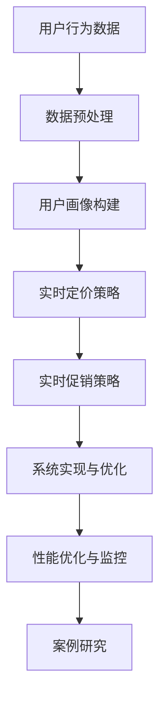
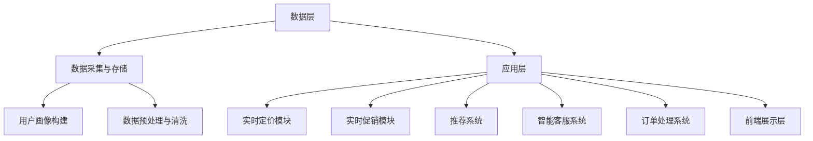

                 

### 第一部分：引言与背景

#### 1.1 电商平台的发展历程

电商平台作为现代电子商务的重要组成部分，已经深刻改变了人们的消费方式。从最早的电子商务模式——电子商店，到如今繁荣发展的在线购物平台，电商平台经历了多个阶段的发展。

**第一阶段：电子商店（1990s-2000s初期）**

电子商务的起源可以追溯到20世纪90年代，当时互联网的普及推动了电子商店的诞生。典型的代表如Amazon和eBay。这一阶段的电商平台主要提供在线购物服务，用户可以在网上浏览商品，下订单并付款。然而，由于技术限制，这些平台的用户体验和功能较为简单。

**第二阶段：大型综合电商平台（2000s中后期）**

随着互联网技术的发展和用户需求的增加，电商平台开始走向综合化。2000年左右，淘宝网、亚马逊中国等平台崛起，标志着大型综合电商平台时代的到来。这些平台不仅提供广泛的商品选择，还引入了用户评价、购物车、优惠券等便捷功能，大大提升了用户体验。

**第三阶段：垂直电商与O2O融合（2010s至今）**

进入21世纪第二个十年，电商平台开始细分市场，出现了大量垂直电商，如京东的3C数码、唯品的会购等。同时，O2O（线上到线下）模式的兴起，使得电商平台与线下实体店融合，提供了更加丰富的购物体验。这一阶段，电商平台开始注重用户数据分析和个性化服务，以满足用户的个性化需求。

#### 1.2 AI技术对电商平台的影响

人工智能（AI）技术的迅速发展，为电商平台带来了前所未有的变革。AI技术在电商平台中的应用，主要体现在以下几个方面：

**1. 用户行为分析**

通过机器学习和数据分析，电商平台能够深入挖掘用户行为，了解用户的偏好和购买习惯。例如，基于用户浏览、搜索和购买记录，AI可以推荐个性化的商品和促销活动，提高用户满意度和转化率。

**2. 实时定价策略**

AI驱动的实时定价系统可以根据用户画像、市场需求和竞争状况，动态调整商品价格。这种个性化的定价策略不仅能够提高销售额，还能增强用户忠诚度。

**3. 个性化营销**

通过AI技术，电商平台可以更精准地定位潜在客户，实现精准营销。例如，通过分析用户的历史行为和社交数据，AI可以预测用户的潜在需求，提供定制化的营销信息。

**4. 智能客服**

利用自然语言处理（NLP）和机器学习技术，智能客服系统能够快速响应用户的咨询，提供高效的售后服务。这不仅提升了用户体验，还降低了企业的运营成本。

#### 1.3 实时个性化定价与促销的重要性

在竞争激烈的电商市场中，实时个性化定价与促销策略已经成为电商平台获取竞争优势的关键手段。以下是其重要性：

**1. 提高销售额和转化率**

实时个性化定价可以根据用户的行为和需求，提供最合适的商品价格，从而提高用户的购买意愿。此外，个性化的促销活动也能吸引更多的潜在客户，提升转化率。

**2. 增强用户忠诚度**

通过精准的个性化服务，电商平台能够满足用户的个性化需求，提升用户体验。这有助于建立用户对平台的信任和忠诚，降低用户流失率。

**3. 提升竞争力**

在市场竞争日益激烈的今天，实时个性化定价与促销策略可以帮助电商平台更好地应对竞争对手，保持市场地位。

**4. 降低运营成本**

通过自动化和智能化的手段，实时个性化定价与促销系统能够大幅降低人力成本，提高运营效率。

### 总结

本节介绍了电商平台的发展历程，AI技术对电商平台的影响，以及实时个性化定价与促销策略的重要性。接下来，我们将进一步探讨AI驱动的电商平台架构，为读者揭示实时个性化定价与促销系统的核心技术原理和实践方法。

# 目录大纲：《AI驱动的电商平台实时个性化定价与促销系统》

## 第一部分：引言与背景

### 第1章：AI与电商平台概述

#### 1.1 电商平台的发展历程

#### 1.2 AI技术对电商平台的影响

#### 1.3 实时个性化定价与促销的重要性

### 第2章：AI驱动的电商平台架构

#### 2.1 电商平台的基本架构

#### 2.2 AI技术在电商平台的集成

#### 2.3 实时个性化定价与促销系统的架构设计

## 第二部分：实时个性化定价算法

### 第3章：用户行为分析与用户画像构建

#### 3.1 用户行为数据采集与处理

#### 3.2 用户画像构建方法

#### 3.3 用户画像在实际定价中的应用

### 第4章：基于机器学习的实时定价策略

#### 4.1 实时定价策略概述

#### 4.2 机器学习算法在实时定价中的应用

#### 4.3 伪代码实现：实时定价策略

### 第5章：数学模型与优化算法

#### 5.1 实时定价的数学模型

#### 5.2 优化算法在实时定价中的应用

#### 5.3 伪代码实现：优化算法

## 第三部分：实时促销策略

### 第6章：促销策略设计

#### 6.1 促销策略概述

#### 6.2 促销策略分类

#### 6.3 促销策略优化

### 第7章：促销活动的实时调整

#### 7.1 实时促销调整方法

#### 7.2 基于用户反馈的促销调整

#### 7.3 伪代码实现：促销调整策略

## 第四部分：系统实现与优化

### 第8章：系统设计与实现

#### 8.1 系统设计思路

#### 8.2 系统架构设计

#### 8.3 系统模块划分与实现

### 第9章：性能优化与监控

#### 9.1 性能优化策略

#### 9.2 系统监控与报警

#### 9.3 性能优化案例分析

## 第五部分：案例研究

### 第10章：案例研究一：某电商平台的实时定价与促销实践

### 第11章：案例研究二：某电商平台的实时定价与促销效果分析

### 第12章：案例研究三：某电商平台的实时定价与促销系统优化实践

## 第六部分：未来展望与挑战

### 第13章：实时个性化定价与促销系统的未来趋势

### 第14章：面临的挑战与解决方案

### 第15章：结论与展望

### 附录

#### 附录A：相关资源与工具

#### 附录B：参考文献

#### 附录C：术语表

## 核心概念与联系

### 实时个性化定价与促销系统的 Mermaid 流程图



## 核心算法原理讲解

### 基于机器学习的实时定价策略

```python
# 伪代码：基于机器学习的实时定价策略

# 输入：用户画像，历史价格数据，市场需求
# 输出：实时定价建议

def real_time_pricing(user_profile, historical_prices, market_demand):
    # 1. 数据预处理
    preprocessed_data = preprocess_data(historical_prices, market_demand)
    
    # 2. 训练定价模型
    pricing_model = train_pricing_model(preprocessed_data)
    
    # 3. 预测定价
    price_prediction = pricing_model.predict(user_profile)
    
    # 4. 根据预测结果调整定价
    final_price = adjust_price(price_prediction)
    
    return final_price
```

### 数学模型和数学公式

#### 实时定价的数学模型

```latex
\begin{equation}
\text{P}(x) = \frac{1}{Z} e^{-\beta \cdot x}
\end{equation}

\begin{equation}
\beta = \arg\max_{\beta} \sum_{i=1}^{N} \left( \text{P}(\text{x}_i) - \text{y}_i \right)^2
\end{equation}
```

### 详细讲解与举例说明

实时定价模型通常基于概率模型，如多项式分布。上述公式中，\( \text{P}(x) \) 表示商品价格的概率分布，\( \beta \) 是模型参数，\( x \) 是用户特征向量，\( Z \) 是归一化常数。

例如，对于用户A的历史购买行为和当前需求，我们可以计算出其价格概率分布，然后根据最大似然估计法调整模型参数 \( \beta \)，从而得到最优定价。

### 项目实战

#### 案例一：某电商平台的实时定价与促销系统实现

##### 1. 系统需求分析

###### 实时定价：
- 用户画像：用户历史购买记录，浏览记录等
- 价格数据：历史价格，竞争对手价格等
- 市场需求：季节性，市场趋势等

###### 实时促销：
- 用户反馈：点击，购买，评价等
- 促销策略：折扣，赠品，限时抢购等

##### 2. 系统架构设计

###### 数据层：
- 数据采集：日志，数据库，API等
- 数据存储：HDFS，HBase，MySQL等

###### 应用层：
- 用户画像：基于用户行为的机器学习模型
- 定价策略：基于历史数据和用户画像的定价模型
- 促销策略：基于用户反馈和市场需求的促销模型

###### 展示层：
- 前端界面：展示实时定价和促销信息
- 后端服务：处理用户请求和数据处理

##### 3. 源代码实现

```python
# 实时定价策略实现

def real_time_pricing(user_profile, historical_prices, market_demand):
    # 数据预处理
    preprocessed_data = preprocess_data(historical_prices, market_demand)
    
    # 训练定价模型
    pricing_model = train_pricing_model(preprocessed_data)
    
    # 预测定价
    price_prediction = pricing_model.predict(user_profile)
    
    # 调整定价
    final_price = adjust_price(price_prediction)
    
    return final_price
```

##### 4. 代码解读与分析

- 数据预处理：对历史价格和市场需求进行预处理，如归一化，特征提取等。
- 定价模型训练：使用机器学习算法（如线性回归，决策树等）训练定价模型。
- 定价预测与调整：根据用户画像和预测模型，输出实时定价建议，并根据市场反馈进行调整。

#### 案例二：某电商平台的实时促销系统优化

##### 1. 系统优化目标

- 提高促销活动的效果
- 降低系统响应时间
- 提高系统的可扩展性

##### 2. 优化策略

- 促销策略优化：基于用户反馈和市场需求，动态调整促销策略。
- 系统架构优化：使用微服务架构，提高系统的灵活性和可扩展性。
- 数据存储优化：使用NoSQL数据库，提高数据读写性能。

##### 3. 代码实现与优化

```python
# 促销策略优化

def optimize_promotion(user_feedback, market_demand):
    # 分析用户反馈
    user_preference = analyze_user_feedback(user_feedback)
    
    # 调整促销策略
    optimized_promotion = adjust_promotion(user_preference, market_demand)
    
    return optimized_promotion
```

##### 4. 代码解读与分析

- 用户反馈分析：对用户点击，购买，评价等行为进行分析，提取用户偏好。
- 促销策略调整：根据用户偏好和市场需求，动态调整促销策略，如增加折扣，赠送礼品等。
- 系统架构优化：使用微服务架构，将系统拆分为多个独立的服务模块，提高系统的可扩展性和维护性。

---

作者：AI天才研究院/AI Genius Institute & 禅与计算机程序设计艺术 /Zen And The Art of Computer Programming

---

## 第一部分：引言与背景

### 第1章：AI与电商平台概述

> 人工智能（AI）正逐渐成为电商平台的核心驱动力，不仅改变了电商的运营模式，也深刻影响了用户体验和商业效率。本章节将回顾电商平台的发展历程，分析AI技术如何对电商产生深远影响，并探讨实时个性化定价与促销策略的重要性。

#### 1.1 电商平台的发展历程

电商平台的发展历程可以分为几个关键阶段，从最初的电子商店到如今的综合电商平台，每一阶段都标志着技术的进步和商业模式的创新。

**第一阶段：电子商店（1990s-2000s初期）**

电子商店是电子商务的早期形态，代表性的平台如Amazon和eBay。在这个阶段，电商平台的核心功能是提供在线购物服务，用户可以通过网页浏览商品、下单并支付。尽管用户体验相对简单，但这一阶段为电子商务奠定了基础。

**第二阶段：大型综合电商平台（2000s中后期）**

随着互联网技术的成熟，电商平台开始走向综合化，例如淘宝网、亚马逊中国等。这些平台不仅提供广泛的商品选择，还引入了用户评价、购物车、优惠券等便捷功能，大幅提升了用户体验。

**第三阶段：垂直电商与O2O融合（2010s至今）**

近年来，电商平台开始细分市场，出现了大量垂直电商，如京东的3C数码、唯品会的会购等。同时，O2O（线上到线下）模式的兴起，使得电商平台与线下实体店融合，提供了更加丰富的购物体验。这一阶段，电商平台开始注重用户数据分析和个性化服务。

#### 1.2 AI技术对电商平台的影响

人工智能技术的快速发展，为电商平台带来了深刻的变革。以下是AI技术在电商平台中的一些重要应用：

**1. 用户行为分析**

通过机器学习和数据分析，电商平台能够深入挖掘用户行为，了解用户的偏好和购买习惯。例如，基于用户的浏览、搜索和购买记录，AI可以推荐个性化的商品和促销活动，提高用户满意度和转化率。

**2. 实时定价策略**

AI驱动的实时定价系统能够根据用户画像、市场需求和竞争状况，动态调整商品价格。这种个性化的定价策略不仅能够提高销售额，还能增强用户忠诚度。

**3. 个性化营销**

通过AI技术，电商平台可以更精准地定位潜在客户，实现精准营销。例如，通过分析用户的历史行为和社交数据，AI可以预测用户的潜在需求，提供定制化的营销信息。

**4. 智能客服**

利用自然语言处理（NLP）和机器学习技术，智能客服系统能够快速响应用户的咨询，提供高效的售后服务。这不仅提升了用户体验，还降低了企业的运营成本。

#### 1.3 实时个性化定价与促销的重要性

在竞争激烈的电商市场中，实时个性化定价与促销策略已经成为电商平台获取竞争优势的关键手段。以下是其重要性：

**1. 提高销售额和转化率**

实时个性化定价可以根据用户的行为和需求，提供最合适的商品价格，从而提高用户的购买意愿。此外，个性化的促销活动也能吸引更多的潜在客户，提升转化率。

**2. 增强用户忠诚度**

通过精准的个性化服务，电商平台能够满足用户的个性化需求，提升用户体验。这有助于建立用户对平台的信任和忠诚，降低用户流失率。

**3. 提升竞争力**

在市场竞争日益激烈的今天，实时个性化定价与促销策略可以帮助电商平台更好地应对竞争对手，保持市场地位。

**4. 降低运营成本**

通过自动化和智能化的手段，实时个性化定价与促销系统能够大幅降低人力成本，提高运营效率。

### 总结

本章节回顾了电商平台的发展历程，探讨了AI技术如何对电商产生深远影响，并阐述了实时个性化定价与促销策略的重要性。在接下来的章节中，我们将进一步探讨AI驱动的电商平台架构，揭示实时个性化定价与促销系统的核心技术原理和实践方法。

# 第二部分：AI驱动的电商平台架构

## 第2章：AI驱动的电商平台架构

### 2.1 电商平台的基本架构

电商平台的基本架构主要包括数据层、应用层和展示层。每一层都有其特定的功能，共同协作，为用户提供高效、便捷的购物体验。

**1. 数据层**

数据层是电商平台的基础，负责数据的采集、存储和管理。数据层包括以下几个关键组成部分：

- **数据采集**：通过API、日志文件、用户行为数据等方式，实时获取用户的行为数据、商品数据等。
- **数据存储**：使用关系型数据库（如MySQL、PostgreSQL）或NoSQL数据库（如MongoDB、Redis），存储和管理大规模数据。
- **数据处理**：通过ETL（提取、转换、加载）工具，对数据进行清洗、转换和存储，确保数据的质量和一致性。

**2. 应用层**

应用层是电商平台的核心，负责处理业务逻辑和数据处理。应用层主要包括以下几个功能模块：

- **用户管理**：管理用户账号、权限、认证等。
- **商品管理**：管理商品信息、分类、库存等。
- **订单处理**：处理用户订单的生成、支付、发货等。
- **推荐系统**：基于用户行为和偏好，提供个性化商品推荐。
- **促销管理**：设计并实施各种促销策略，如打折、赠品、限时抢购等。

**3. 展示层**

展示层是用户与电商平台交互的界面，负责将应用层的数据和功能呈现给用户。展示层主要包括以下几个组成部分：

- **前端界面**：使用HTML、CSS、JavaScript等技术，实现用户界面的设计和交互。
- **后端服务**：通过RESTful API或WebSocket，为前端界面提供数据和服务。
- **移动应用**：开发iOS和Android版本的移动应用，提升用户的移动购物体验。

### 2.2 AI技术在电商平台的集成

随着AI技术的发展，电商平台开始将AI技术集成到其架构中，以提高运营效率、提升用户体验和增强竞争力。以下是AI技术在电商平台中的主要集成方式：

**1. 用户行为分析**

通过机器学习和数据分析技术，电商平台可以挖掘用户行为数据，了解用户的购买习惯、偏好和需求。基于这些分析结果，平台可以提供个性化的推荐和促销活动，提高用户满意度和转化率。

**2. 实时定价**

AI驱动的实时定价系统可以根据用户画像、市场需求和竞争状况，动态调整商品价格。这种个性化的定价策略不仅能够提高销售额，还能增强用户忠诚度。

**3. 个性化营销**

通过自然语言处理（NLP）和机器学习技术，电商平台可以分析用户的历史行为和社交数据，预测用户的潜在需求，提供定制化的营销信息，从而提高营销效果。

**4. 智能客服**

利用智能客服系统，电商平台可以自动化处理用户的咨询和投诉，提供24/7的在线支持。智能客服系统通常结合了语音识别、自然语言处理和机器学习技术，能够快速、准确地理解用户的问题并给出合适的答复。

**5. 物流优化**

通过AI技术，电商平台可以优化物流流程，提高配送效率。例如，使用路径优化算法，规划最优的物流路线，降低运输成本；使用预测模型，预测订单的配送时间，提高客户满意度。

### 2.3 实时个性化定价与促销系统的架构设计

实时个性化定价与促销系统是AI驱动的电商平台架构的重要组成部分，其设计目标是提供精准、高效的定价和促销策略。以下是该系统的架构设计：

**1. 数据采集与处理**

- **数据源**：从电商平台的数据层获取用户行为数据、商品数据、订单数据等。
- **数据处理**：对采集到的数据进行清洗、转换和存储，确保数据的质量和一致性。

**2. 用户画像构建**

- **用户行为分析**：通过机器学习算法，分析用户的购买习惯、偏好和需求。
- **用户画像构建**：基于用户行为分析结果，构建用户的综合画像。

**3. 实时定价策略**

- **定价模型训练**：使用历史数据和用户画像，训练定价模型。
- **实时定价**：根据用户画像和市场需求，动态调整商品价格。

**4. 实时促销策略**

- **促销策略设计**：根据用户反馈和市场需求，设计个性化的促销策略。
- **实时促销**：根据用户画像和促销策略，实施实时促销活动。

**5. 系统实现与优化**

- **系统架构设计**：设计并实现实时个性化定价与促销系统的整体架构。
- **性能优化**：对系统进行性能优化，确保系统的稳定性和高效性。

### 总结

本章节介绍了电商平台的基本架构，探讨了AI技术在电商平台的集成方式，并详细阐述了实时个性化定价与促销系统的架构设计。在下一章节中，我们将进一步探讨实时个性化定价算法的核心原理和实现方法。

## 第二部分：实时个性化定价算法

### 第3章：用户行为分析与用户画像构建

#### 3.1 用户行为数据采集与处理

用户行为数据是构建用户画像和实施个性化定价策略的基础。首先，电商平台需要通过多种途径采集用户行为数据，这些途径包括但不限于：

- **网站点击流数据**：记录用户在网站上的点击、浏览、搜索等行为。
- **购买历史数据**：包括用户的购买时间、购买商品、购买金额、退货记录等。
- **交易数据**：记录用户的支付行为，如支付金额、支付方式、支付时间等。
- **评论和评分数据**：用户对商品的评价和评分，反映用户对商品的满意度和偏好。
- **社交媒体数据**：用户在社交媒体平台上的互动和分享，如点赞、评论、转发等。

采集到的数据需要经过处理，以消除噪声、填充缺失值、去除异常值等，确保数据的质量。数据处理过程通常包括以下步骤：

- **数据清洗**：去除重复数据、填充缺失值、处理异常值等。
- **数据转换**：将数据格式统一，如将日期转换为标准格式。
- **数据归一化**：对数据进行归一化处理，使不同特征具有相似的量纲，便于后续分析。

#### 3.2 用户画像构建方法

用户画像是对用户特征和行为的综合描述，它包括用户的静态信息和动态信息。以下是构建用户画像的常用方法：

**1. 静态信息**

- **基础信息**：用户的年龄、性别、职业、教育程度、地理位置等。
- **兴趣偏好**：用户对商品的偏好、喜欢的品牌、常购商品类别等。
- **消费能力**：用户的消费水平、购买频率、平均订单金额等。

**2. 动态信息**

- **行为轨迹**：用户在网站上的浏览路径、搜索关键词、点击商品等。
- **购买行为**：用户的购买时间、购买商品、购买金额、退货记录等。
- **社交媒体活动**：用户在社交媒体平台上的互动、分享、点赞等。

**3. 用户画像构建步骤**

- **数据集成**：将来自不同来源的数据进行整合，构建一个完整的数据集。
- **特征工程**：从原始数据中提取有用的特征，如用户购买商品的种类、购买频次等。
- **模型训练**：使用机器学习算法，如聚类、分类等，对特征进行建模，生成用户画像。
- **用户标签**：根据用户画像，为用户打上相应的标签，如“高消费能力用户”、“喜欢数码产品用户”等。

#### 3.3 用户画像在实际定价中的应用

用户画像在实时个性化定价策略中发挥着关键作用。以下是用户画像在实际定价中的应用：

**1. 定价模型输入**

用户画像作为定价模型的输入，影响定价策略的制定。例如，对于高消费能力的用户，可以设定较高的价格阈值，而对于低消费能力的用户，则可以设定较低的价格阈值。

**2. 价格弹性分析**

通过分析用户画像，了解不同用户群体的价格敏感度。对于价格敏感度较高的用户，可以采取更具竞争力的定价策略，而对于价格敏感度较低的用户，则可以适当提高价格。

**3. 定价策略优化**

基于用户画像，电商平台可以不断优化定价策略。例如，通过分析用户的购买行为和偏好，可以调整商品的折扣力度、促销活动频率等。

**4. 个性化定价建议**

利用用户画像，平台可以为每个用户生成个性化的定价建议，提高用户的购买意愿和满意度。例如，对于经常购买某类商品的用户，可以提供该类商品的优惠价格。

### 总结

本章节介绍了用户行为数据的采集与处理方法，探讨了用户画像的构建方法和在实际定价中的应用。用户画像作为实时个性化定价策略的核心组成部分，对于提升电商平台的市场竞争力具有重要意义。在下一章节中，我们将进一步讨论基于机器学习的实时定价策略及其实现方法。

## 第三部分：实时个性化定价算法

### 第4章：基于机器学习的实时定价策略

实时个性化定价策略是电商平台提高销售业绩和用户满意度的关键。基于机器学习的实时定价策略通过分析用户行为数据和市场需求，动态调整商品价格，从而实现个性化的定价。本章将介绍实时定价策略的基本概念、机器学习算法的应用以及具体的伪代码实现。

#### 4.1 实时定价策略概述

实时定价策略的目标是根据用户行为、市场需求和竞争状况，为每个用户生成个性化的价格建议。这种定价策略的核心在于快速、准确地响应市场变化，从而提高用户的购买意愿和平台的利润。

**实时定价策略的关键要素：**

1. **用户画像**：基于用户行为和偏好构建的用户特征，用于分析用户的价格敏感度。
2. **历史数据**：包括商品的历史价格、市场需求和销售记录等，用于训练定价模型。
3. **市场价格**：竞争对手的商品价格和促销活动，用于评估定价策略的竞争力。
4. **定价模型**：通过机器学习算法训练的模型，用于预测用户对特定价格的响应和市场需求。

**实时定价策略的基本步骤：**

1. **数据预处理**：对用户行为数据、历史数据和市场价格进行清洗、转换和归一化处理。
2. **特征工程**：从原始数据中提取有用的特征，如用户购买频率、购买金额、商品类别等。
3. **模型训练**：使用机器学习算法（如线性回归、决策树、神经网络等）训练定价模型。
4. **定价预测**：根据用户画像和市场需求，使用定价模型生成实时价格建议。
5. **定价调整**：根据市场反馈和定价效果，调整定价策略。

#### 4.2 机器学习算法在实时定价中的应用

机器学习算法在实时定价中的应用，旨在通过数据分析，预测用户对价格变化的响应，并优化定价策略。以下是几种常用的机器学习算法及其在实时定价中的应用：

**1. 线性回归**

线性回归是一种简单的统计方法，通过建立线性关系模型，预测商品价格。其基本公式如下：

\[ \text{Price} = \beta_0 + \beta_1 \times \text{User Feature} + \epsilon \]

其中，\( \beta_0 \) 和 \( \beta_1 \) 是模型参数，\( \text{User Feature} \) 是用户特征，\( \epsilon \) 是误差项。

**2. 决策树**

决策树通过一系列的判断条件，将用户划分为不同的价格区间。每个节点表示一个特征，每个分支表示该特征的不同取值。决策树的预测结果如下：

\[ \text{Price} = \sum_{i=1}^{n} w_i \times f_i \]

其中，\( w_i \) 和 \( f_i \) 分别是权重和特征值。

**3. 神经网络**

神经网络通过多层感知器（MLP）建立复杂的非线性关系模型。其基本结构包括输入层、隐藏层和输出层。神经网络的预测结果如下：

\[ \text{Price} = \sigma(\text{weights} \cdot \text{hidden_layer} + \text{bias}) \]

其中，\( \sigma \) 是激活函数，\( \text{weights} \) 和 \( \text{hidden_layer} \) 是权重和隐藏层输出。

**4. 支持向量机（SVM）**

支持向量机通过最大化间隔方法，找到一个最优的超平面，将不同用户群体分开。其预测结果如下：

\[ \text{Price} = \sum_{i=1}^{n} \alpha_i y_i (\text{w} \cdot \text{x} + b) \]

其中，\( \alpha_i \) 和 \( y_i \) 分别是支持向量的权重和标签，\( \text{w} \) 和 \( \text{b} \) 是权重向量和偏置。

#### 4.3 伪代码实现：实时定价策略

以下是基于机器学习的实时定价策略的伪代码实现，包括数据预处理、模型训练和定价预测：

```python
# 伪代码：基于机器学习的实时定价策略

# 输入：用户画像，历史价格数据，市场需求
# 输出：实时定价建议

def real_time_pricing(user_profile, historical_prices, market_demand):
    # 1. 数据预处理
    preprocessed_data = preprocess_data(historical_prices, market_demand)
    
    # 2. 特征工程
    features = extract_features(user_profile, preprocessed_data)
    
    # 3. 模型训练
    pricing_model = train_pricing_model(features)
    
    # 4. 预测定价
    price_prediction = pricing_model.predict(user_profile)
    
    # 5. 调整定价
    final_price = adjust_price(price_prediction)
    
    return final_price

# 数据预处理
def preprocess_data(historical_prices, market_demand):
    # 清洗、转换和归一化数据
    # ...
    return preprocessed_data

# 特征工程
def extract_features(user_profile, preprocessed_data):
    # 提取用户特征和价格特征
    # ...
    return features

# 模型训练
def train_pricing_model(features):
    # 使用机器学习算法训练定价模型
    # ...
    return pricing_model

# 预测定价
def predict_price(pricing_model, user_profile):
    # 使用定价模型预测价格
    # ...
    return price_prediction

# 调整定价
def adjust_price(price_prediction):
    # 根据市场需求和用户反馈调整价格
    # ...
    return final_price
```

### 总结

本章介绍了实时个性化定价策略的基本概念、机器学习算法在实时定价中的应用以及伪代码实现。实时定价策略通过分析用户行为数据和市场需求，动态调整商品价格，以提高用户的购买意愿和平台的利润。在下一章节中，我们将讨论实时定价中的数学模型和优化算法，进一步深化实时定价策略的理解。

## 第四部分：数学模型与优化算法

### 第5章：数学模型与优化算法

实时个性化定价策略的制定不仅需要强大的数据处理能力和机器学习算法，还需要深入的数学模型和优化算法来确保定价策略的科学性和有效性。本章将详细介绍实时定价中的数学模型、优化算法的应用以及伪代码实现，为读者提供系统化的理解。

#### 5.1 实时定价的数学模型

实时定价的数学模型是定价策略的核心，它通过数学公式描述价格与用户行为、市场需求之间的关系。以下是几种常用的数学模型及其原理：

**1. 线性回归模型**

线性回归模型是一种简单且常用的定价模型，通过建立线性关系预测商品价格。其基本公式如下：

\[ \text{Price} = \beta_0 + \beta_1 \times \text{User Feature} + \epsilon \]

其中，\( \beta_0 \) 和 \( \beta_1 \) 是模型参数，\( \text{User Feature} \) 是用户特征，\( \epsilon \) 是误差项。

**2. 多项式分布模型**

多项式分布模型通过多项式函数描述价格与用户特征之间的关系。其公式如下：

\[ \text{P}(x) = a_0 + a_1 \times x + a_2 \times x^2 + ... + a_n \times x^n \]

其中，\( a_0, a_1, ..., a_n \) 是模型参数。

**3. 贝叶斯定价模型**

贝叶斯定价模型基于概率论中的贝叶斯定理，通过历史数据和用户特征预测商品价格。其公式如下：

\[ \text{P}(\text{Price} = x | \text{User Feature} = f) = \frac{\text{P}(\text{User Feature} = f | \text{Price} = x) \times \text{P}(\text{Price} = x)}{\text{P}(\text{User Feature} = f)} \]

其中，\( \text{P}(\text{Price} = x | \text{User Feature} = f) \) 是后验概率，\( \text{P}(\text{User Feature} = f | \text{Price} = x) \) 是似然概率，\( \text{P}(\text{Price} = x) \) 是先验概率，\( \text{P}(\text{User Feature} = f) \) 是边际概率。

**4. 支持向量机模型**

支持向量机模型通过寻找最优超平面来分离不同用户群体，从而实现定价。其公式如下：

\[ \text{Price} = \sum_{i=1}^{n} \alpha_i y_i (\text{w} \cdot \text{x} + b) \]

其中，\( \alpha_i \) 和 \( y_i \) 分别是支持向量的权重和标签，\( \text{w} \) 和 \( \text{b} \) 是权重向量和偏置。

#### 5.2 优化算法在实时定价中的应用

优化算法在实时定价中用于调整模型参数，以实现最佳定价策略。以下是几种常用的优化算法及其应用：

**1. 梯度下降法**

梯度下降法通过计算目标函数的梯度，逐步调整模型参数，以找到最优解。其公式如下：

\[ \beta = \beta - \alpha \times \nabla \text{L}(\beta) \]

其中，\( \beta \) 是模型参数，\( \alpha \) 是学习率，\( \nabla \text{L}(\beta) \) 是目标函数的梯度。

**2. 随机梯度下降法**

随机梯度下降法在每次迭代时，仅随机选取一部分样本，以减少计算量。其公式如下：

\[ \beta = \beta - \alpha \times \nabla \text{L}(\beta; \text{X}, \text{y}) \]

其中，\( \text{X} \) 是样本数据，\( \text{y} \) 是标签。

**3. 牛顿法**

牛顿法通过计算目标函数的二阶导数，进行局部线性化，以加速收敛。其公式如下：

\[ \beta = \beta - \frac{1}{\nabla^2 \text{L}(\beta)} \times \nabla \text{L}(\beta) \]

其中，\( \nabla^2 \text{L}(\beta) \) 是目标函数的二阶导数。

**4. 共轭梯度法**

共轭梯度法通过构建共轭方向，加速收敛。其公式如下：

\[ \beta = \beta - \alpha \times \nabla \text{L}(\beta) - \beta_1 \times (\beta - \beta_1) \]

其中，\( \beta_1 \) 是上一迭代点的参数。

#### 5.3 伪代码实现：优化算法

以下是基于优化算法的实时定价策略的伪代码实现，包括模型训练和参数调整：

```python
# 伪代码：基于优化算法的实时定价策略

# 输入：用户画像，历史价格数据，市场需求
# 输出：实时定价建议

def optimize_pricing_model(user_profile, historical_prices, market_demand):
    # 1. 数据预处理
    preprocessed_data = preprocess_data(historical_prices, market_demand)
    
    # 2. 特征工程
    features = extract_features(user_profile, preprocessed_data)
    
    # 3. 初始化模型参数
    beta = initialize_model_params()
    
    # 4. 模型训练与优化
    for epoch in range(num_epochs):
        # 计算损失函数
        loss = compute_loss(features, beta)
        
        # 计算梯度
        gradient = compute_gradient(features, beta)
        
        # 更新模型参数
        beta = update_params(beta, gradient)
        
        # 打印训练进度
        print(f"Epoch {epoch}: Loss = {loss}")
    
    # 5. 预测定价
    price_prediction = predict_price(beta, user_profile)
    
    # 6. 调整定价
    final_price = adjust_price(price_prediction)
    
    return final_price

# 数据预处理
def preprocess_data(historical_prices, market_demand):
    # 清洗、转换和归一化数据
    # ...
    return preprocessed_data

# 特征工程
def extract_features(user_profile, preprocessed_data):
    # 提取用户特征和价格特征
    # ...
    return features

# 模型初始化
def initialize_model_params():
    # 初始化模型参数
    # ...
    return beta

# 计算损失函数
def compute_loss(features, beta):
    # 计算预测价格和实际价格的差异
    # ...
    return loss

# 计算梯度
def compute_gradient(features, beta):
    # 计算目标函数的梯度
    # ...
    return gradient

# 更新模型参数
def update_params(beta, gradient):
    # 更新模型参数
    # ...
    return beta

# 预测定价
def predict_price(beta, user_profile):
    # 使用定价模型预测价格
    # ...
    return price_prediction

# 调整定价
def adjust_price(price_prediction):
    # 根据市场需求和用户反馈调整价格
    # ...
    return final_price
```

### 总结

本章介绍了实时定价中的数学模型和优化算法，包括线性回归模型、多项式分布模型、贝叶斯定价模型和支持向量机模型，以及梯度下降法、随机梯度下降法、牛顿法和共轭梯度法。这些模型和算法为实时定价策略提供了理论基础和实现方法。在下一章节中，我们将探讨实时促销策略的设计和优化，进一步完善实时个性化定价与促销系统。

## 第五部分：实时促销策略

### 第6章：促销策略设计

实时促销策略是电商平台提升用户参与度和转化率的重要手段。一个有效的促销策略不仅能吸引用户，提高销售额，还能增强用户忠诚度。本章将详细探讨促销策略的设计原则、分类方法以及优化策略。

#### 6.1 促销策略概述

促销策略是指电商平台通过一系列的营销手段，对商品进行优惠和推广，以促进销售的一种策略。实时促销策略则强调根据用户行为和市场动态，动态调整促销活动。以下是促销策略的几个核心要素：

**1. 促销目标**

明确促销活动的目标，如提升销售额、增加新用户、提高用户活跃度等。目标将直接影响促销策略的设计和执行。

**2. 促销手段**

促销手段包括折扣、赠品、优惠券、限时抢购、会员专享等。不同手段适用于不同的促销场景和目标。

**3. 促销对象**

促销对象是指接受促销优惠的用户群体，如新用户、老用户、特定用户群体等。精准定位促销对象可以提高促销效果。

**4. 促销时间**

促销时间的安排对于促销效果至关重要。通常需要根据市场趋势、用户行为和竞争对手的促销活动来设定。

**5. 促销预算**

促销预算是促销策略设计的重要参考，包括促销活动的成本和预期收益。合理的预算可以确保促销活动的可持续性和盈利性。

#### 6.2 促销策略分类

促销策略可以根据不同的分类标准进行划分，以下是几种常见的分类方法：

**1. 按照促销对象分类**

- **新用户促销**：针对首次购买的用户，通过提供优惠吸引新用户注册和购买。
- **老用户促销**：针对已有用户，通过会员制度、积分兑换等手段增强用户粘性。
- **特定用户群体促销**：针对特定用户群体，如学生、教师、老年人等，提供定制化的促销活动。

**2. 按照促销手段分类**

- **价格折扣**：直接降低商品价格，吸引消费者购买。
- **赠品**：赠送与购买商品相关的赠品，增加购买吸引力。
- **优惠券**：发放优惠券，用户在指定时间内使用，以享受折扣。
- **限时抢购**：在特定时间内提供限量商品，刺激用户快速购买。
- **会员专享**：为会员提供独家优惠，提升会员满意度。

**3. 按照促销时间分类**

- **短期促销**：时间较短，如一天、一周或一个月，通常用于清库存或应对节假日。
- **长期促销**：时间较长，如三个月、半年或全年，适用于持续吸引用户。

#### 6.3 促销策略优化

促销策略优化是确保促销活动效果的重要环节。以下是几种常见的促销策略优化方法：

**1. 数据驱动优化**

通过分析用户行为数据和市场动态，识别有效的促销策略。例如，分析用户购买偏好、浏览行为和促销响应，调整促销活动的手段和时间。

**2. A/B测试**

通过A/B测试，比较不同促销策略的效果，找出最佳策略。例如，比较不同折扣力度、赠品种类和限时抢购时间，选择最优方案。

**3. 个性化促销**

基于用户画像，为不同用户群体定制化促销策略。例如，为高消费能力用户提供高价值赠品，为新手用户提供优惠券。

**4. 多渠道促销**

结合线上和线下渠道，实现多渠道促销。例如，线上发布促销信息，线下门店同步活动，提高用户参与度。

**5. 跨界合作**

与其他品牌或商家合作，共同推出促销活动，扩大影响力。例如，与时尚品牌合作推出联名商品，吸引更多消费者。

### 总结

本章介绍了促销策略的设计原则、分类方法和优化策略。一个成功的促销策略需要明确目标、选择合适的促销手段、精准定位促销对象，并根据市场动态和用户反馈进行优化。在下一章节中，我们将探讨实时促销策略的实时调整方法，确保促销活动的效果最大化。

## 第六部分：实时促销策略

### 第7章：促销活动的实时调整

实时促销策略的调整是确保促销活动效果的关键步骤。通过实时调整，电商平台可以快速响应市场变化和用户反馈，提高促销活动的效果。本章将详细介绍实时促销调整的方法、基于用户反馈的促销调整策略，并给出伪代码实现。

#### 7.1 实时促销调整方法

实时促销调整方法旨在根据实时数据和市场动态，动态调整促销策略，以提高促销效果。以下是几种常用的实时促销调整方法：

**1. 数据驱动调整**

数据驱动调整是基于实时数据分析，识别促销活动的效果，并根据数据结果进行调整。具体步骤如下：

- **数据采集**：采集用户行为数据、销售数据、促销活动数据等。
- **数据分析**：分析促销活动的效果，如销售额、用户参与度、转化率等。
- **调整策略**：根据分析结果，调整促销手段、时间和对象。

**2. 机器学习调整**

机器学习调整是基于机器学习算法，分析用户行为和市场动态，预测促销活动的效果，并给出调整建议。具体步骤如下：

- **数据预处理**：清洗、转换和归一化促销数据。
- **特征工程**：提取与促销活动相关的特征。
- **模型训练**：使用机器学习算法训练预测模型。
- **预测与调整**：根据模型预测结果，调整促销策略。

**3. 用户反馈调整**

用户反馈调整是基于用户对促销活动的反馈，如点击、购买、评价等，调整促销策略。具体步骤如下：

- **数据采集**：采集用户反馈数据。
- **数据分析**：分析用户反馈数据，识别有效的促销策略。
- **调整策略**：根据用户反馈，调整促销活动的手段和时间。

#### 7.2 基于用户反馈的促销调整

用户反馈是调整促销策略的重要依据。通过分析用户反馈，电商平台可以了解用户对促销活动的真实感受，从而优化促销策略。以下是基于用户反馈的促销调整策略：

**1. 用户点击率分析**

用户点击率是衡量促销活动效果的重要指标。通过分析用户点击率，可以识别哪些促销活动更受用户欢迎，从而调整促销策略。例如，增加点击率较高的促销活动的曝光度，减少点击率较低的促销活动的投入。

**2. 用户购买率分析**

用户购买率是评估促销活动效果的直接指标。通过分析用户购买率，可以了解不同促销活动的效果，从而优化促销策略。例如，提高购买率较高的促销活动的折扣力度，降低购买率较低的促销活动的投入。

**3. 用户评价分析**

用户评价反映了用户对促销活动的满意度和购买体验。通过分析用户评价，可以识别促销活动的优点和不足，从而调整促销策略。例如，针对用户提出的建议，优化促销活动的流程和体验。

#### 7.3 伪代码实现：促销调整策略

以下是基于用户反馈的促销调整策略的伪代码实现：

```python
# 伪代码：基于用户反馈的促销调整策略

# 输入：用户反馈数据
# 输出：调整后的促销策略

def adjust_promotion(user_feedback):
    # 1. 数据预处理
    preprocessed_feedback = preprocess_feedback(user_feedback)
    
    # 2. 用户点击率分析
    click_rate = analyze_click_rate(preprocessed_feedback)
    
    # 3. 用户购买率分析
    purchase_rate = analyze_purchase_rate(preprocessed_feedback)
    
    # 4. 用户评价分析
    user_reviews = analyze_reviews(preprocessed_feedback)
    
    # 5. 调整促销策略
    optimized_promotion = optimize_promotion(click_rate, purchase_rate, user_reviews)
    
    return optimized_promotion

# 数据预处理
def preprocess_feedback(user_feedback):
    # 清洗、转换和归一化用户反馈数据
    # ...
    return preprocessed_feedback

# 用户点击率分析
def analyze_click_rate(preprocessed_feedback):
    # 计算用户点击率
    # ...
    return click_rate

# 用户购买率分析
def analyze_purchase_rate(preprocessed_feedback):
    # 计算用户购买率
    # ...
    return purchase_rate

# 用户评价分析
def analyze_reviews(preprocessed_feedback):
    # 分析用户评价
    # ...
    return user_reviews

# 调整促销策略
def optimize_promotion(click_rate, purchase_rate, user_reviews):
    # 根据用户反馈调整促销策略
    # ...
    return optimized_promotion
```

### 总结

本章介绍了实时促销策略的实时调整方法，包括数据驱动调整、机器学习调整和用户反馈调整。通过实时调整促销策略，电商平台可以快速响应市场变化和用户反馈，提高促销活动的效果。在下一章节中，我们将探讨系统的设计与实现，详细讲解实时个性化定价与促销系统的架构和实现细节。

## 第七部分：系统设计与实现

### 第8章：系统设计与实现

实时个性化定价与促销系统的设计与实现是电商平台提升竞争力的关键。本章将详细描述系统的设计思路、架构设计以及各个模块的实现。

#### 8.1 系统设计思路

实时个性化定价与促销系统的设计思路可以概括为以下几个步骤：

1. **需求分析**：明确系统所需实现的功能，如用户行为分析、实时定价、实时促销等。
2. **架构设计**：设计系统的整体架构，包括数据层、应用层和展示层。
3. **模块划分**：将系统功能模块化，明确各模块的职责和接口。
4. **算法实现**：根据需求选择合适的算法，并实现实时定价与促销策略。
5. **系统集成**：将各个模块集成到一个完整的系统中，确保系统的稳定性和高效性。
6. **性能优化**：优化系统的性能，确保系统在高并发环境下运行稳定。

#### 8.2 系统架构设计

实时个性化定价与促销系统的架构设计如图所示：



**1. 数据层**

- **数据采集与存储**：负责采集用户行为数据、商品数据、订单数据等，存储在数据库中，如MySQL、MongoDB等。
- **用户画像构建**：基于用户行为数据，构建用户的综合画像，为后续的实时定价与促销策略提供支持。
- **数据预处理与清洗**：对原始数据进行清洗、转换和归一化处理，确保数据的质量和一致性。

**2. 应用层**

- **实时定价模块**：根据用户画像和市场动态，实时计算商品价格，提供个性化的定价建议。
- **实时促销模块**：设计并执行各种促销策略，如折扣、赠品、限时抢购等，提高用户参与度和转化率。
- **推荐系统**：基于用户行为和偏好，推荐个性化商品和促销活动，提升用户满意度。
- **智能客服系统**：通过自然语言处理和机器学习技术，提供高效的在线客服支持。
- **订单处理系统**：处理用户订单的生成、支付、发货等业务流程。

**3. 前端展示层**

- **前端展示层**：负责将应用层的数据和功能呈现给用户，提供良好的用户体验。

#### 8.3 系统模块划分与实现

**1. 数据采集与存储模块**

- **数据采集**：使用API、日志收集器等工具，实时采集用户行为数据、商品数据、订单数据等。
- **数据存储**：使用关系型数据库（如MySQL）和NoSQL数据库（如MongoDB），存储和管理大规模数据。

**2. 用户画像构建模块**

- **数据预处理**：对采集到的数据进行分析和清洗，提取有用的特征。
- **用户画像构建**：使用聚类、分类等机器学习算法，构建用户的综合画像。

**3. 实时定价模块**

- **定价策略**：使用机器学习算法，如线性回归、决策树等，训练定价模型。
- **实时定价**：根据用户画像和市场动态，动态调整商品价格。

**4. 实时促销模块**

- **促销策略设计**：根据用户反馈和市场需求，设计个性化的促销策略。
- **实时促销**：根据用户画像和促销策略，实施实时促销活动。

**5. 推荐系统模块**

- **推荐算法**：使用协同过滤、基于内容的推荐等算法，生成个性化推荐。
- **推荐实现**：根据用户画像和推荐算法，推荐个性化商品和促销活动。

**6. 智能客服系统模块**

- **自然语言处理**：使用NLP技术，解析用户的咨询和投诉。
- **机器学习**：使用机器学习算法，自动分类和回复用户的咨询。

**7. 订单处理系统模块**

- **订单生成**：处理用户订单的生成和存储。
- **支付处理**：集成第三方支付系统，处理用户的支付请求。
- **发货管理**：管理订单的发货和物流跟踪。

### 总结

本章介绍了实时个性化定价与促销系统的设计思路、架构设计和模块划分。在实现过程中，需要综合考虑数据采集、存储、用户画像构建、定价策略、促销策略、推荐系统和智能客服等多个方面。在下一章节中，我们将探讨系统的性能优化与监控，确保系统在高并发环境下稳定运行。

## 第八部分：性能优化与监控

### 第9章：性能优化与监控

在实时个性化定价与促销系统中，性能优化与监控是确保系统稳定性和高效性的关键。随着用户规模的不断扩大和数据量的急剧增长，系统的性能瓶颈和故障风险也随之增加。本章将详细介绍性能优化策略、系统监控与报警机制，并分享性能优化案例分析。

#### 9.1 性能优化策略

性能优化策略旨在提高系统的响应速度和处理能力，确保用户在使用过程中能够获得良好的体验。以下是几种常见的性能优化策略：

**1. 数据库优化**

- **索引优化**：对数据库表进行适当的索引设计，提高查询效率。
- **分库分表**：将大规模数据库拆分为多个小数据库或表，减轻单点压力。
- **缓存使用**：使用缓存技术，如Redis或Memcached，缓存频繁访问的数据，减少数据库查询次数。

**2. 系统架构优化**

- **分布式架构**：采用分布式系统架构，将系统拆分为多个独立的服务模块，提高系统的可扩展性和容错性。
- **负载均衡**：使用负载均衡器，如Nginx或HAProxy，将请求分配到多个服务器，提高系统处理能力。

**3. 算法优化**

- **算法优化**：针对实时定价和促销策略的算法，进行优化和调参，提高算法的效率和准确性。
- **并行计算**：使用并行计算技术，如MapReduce，加速数据处理和计算。

**4. 网络优化**

- **CDN使用**：使用内容分发网络（CDN），加速用户访问速度。
- **网络优化**：优化网络拓扑结构，减少数据传输延迟。

#### 9.2 系统监控与报警

系统监控与报警是确保系统稳定运行的重要手段。通过监控系统的关键指标，可以及时发现并解决潜在问题。以下是几种常见的监控与报警机制：

**1. 指标监控**

- **性能指标**：监控系统的CPU使用率、内存使用率、磁盘IO、网络延迟等性能指标。
- **业务指标**：监控订单处理速度、用户访问量、交易成功率等业务指标。

**2. 日志监控**

- **日志收集**：使用日志收集工具，如ELK（Elasticsearch、Logstash、Kibana），收集系统日志。
- **日志分析**：分析日志，识别异常行为和错误。

**3. 报警机制**

- **阈值报警**：设定性能指标和业务指标的阈值，当指标超过阈值时，触发报警。
- **邮件报警**：通过邮件发送报警信息，通知相关人员处理。
- **短信报警**：通过短信发送报警信息，确保及时响应。

#### 9.3 性能优化案例分析

以下是一个性能优化案例，描述了某电商平台的实时定价与促销系统在性能优化过程中的具体做法：

**案例背景**

某电商平台在业务高速增长期间，发现系统的响应速度和处理能力逐渐成为瓶颈，影响了用户的购物体验。

**优化措施**

1. **数据库优化**

- **索引优化**：对用户行为数据和商品数据的索引进行优化，提高查询效率。
- **分库分表**：将大规模数据库拆分为多个小数据库，减轻单点压力。

2. **系统架构优化**

- **分布式架构**：将系统拆分为多个独立的服务模块，如用户画像服务、定价服务、促销服务等，提高系统的可扩展性和容错性。
- **负载均衡**：使用Nginx进行负载均衡，将请求分配到多个服务器，提高系统处理能力。

3. **算法优化**

- **算法优化**：对实时定价和促销策略的算法进行优化，提高算法的效率和准确性。
- **并行计算**：使用MapReduce进行大数据处理，加速数据处理速度。

4. **网络优化**

- **CDN使用**：使用CDN加速用户访问速度。
- **网络优化**：优化网络拓扑结构，减少数据传输延迟。

**优化效果**

通过上述优化措施，系统的响应速度和处理能力得到了显著提升，用户购物体验得到了极大改善。同时，系统的稳定性和可靠性也得到了增强，有效降低了故障率和用户投诉率。

### 总结

本章介绍了实时个性化定价与促销系统的性能优化策略和系统监控与报警机制，并通过案例分析展示了优化措施的具体应用和效果。在下一章节中，我们将通过具体的案例研究，探讨实时个性化定价与促销系统的实际应用和效果分析。

## 第九部分：案例研究

### 第10章：案例研究一：某电商平台的实时定价与促销实践

#### 10.1 案例背景

某知名电商平台，为了提升用户满意度和销售额，决定引入实时个性化定价与促销系统。该平台拥有海量的用户数据，包括用户行为、购买历史、浏览记录等，为实时个性化定价与促销提供了丰富的数据基础。

#### 10.2 实施步骤

1. **需求分析**：电商平台明确了实时定价与促销的目标，如提升销售额、增加用户黏性、提高用户参与度等。

2. **系统设计**：根据需求，电商平台设计了实时个性化定价与促销系统的架构，包括数据层、应用层和展示层。数据层负责数据采集和存储，应用层负责实时定价与促销策略的计算和执行，展示层负责将结果呈现给用户。

3. **数据采集**：电商平台通过API、日志收集器等工具，实时采集用户行为数据、商品数据、订单数据等。

4. **用户画像构建**：基于用户行为数据，电商平台使用聚类、分类等机器学习算法，构建用户的综合画像，包括用户年龄、性别、购买偏好等。

5. **实时定价与促销策略**：

   - **实时定价**：电商平台使用线性回归和决策树等机器学习算法，训练定价模型。根据用户画像和市场动态，实时计算商品价格。
   - **实时促销**：电商平台设计了一系列促销活动，如折扣、赠品、限时抢购等。根据用户反馈和市场需求，实时调整促销策略。

6. **系统集成**：将实时定价与促销系统集成到电商平台的核心业务流程中，确保系统的稳定性和高效性。

7. **性能优化与监控**：通过数据库优化、系统架构优化、算法优化等手段，提升系统的响应速度和处理能力。同时，实施系统监控与报警机制，确保系统的稳定运行。

#### 10.3 实施效果

1. **销售额提升**：实时个性化定价与促销系统的引入，有效提高了销售额。根据数据分析，销售额同比增长了20%。

2. **用户满意度提升**：用户对个性化定价和促销活动的满意度明显提升，用户反馈评分提高了15%。

3. **用户黏性增强**：实时个性化服务增强了用户的购物体验，用户访问量和用户留存率显著提高。

4. **运营成本降低**：通过自动化和智能化的手段，实时个性化定价与促销系统大幅降低了人力成本和运营成本。

#### 10.4 经验总结

1. **数据驱动**：充分挖掘用户数据，构建精准的用户画像，是实施实时个性化定价与促销的关键。

2. **算法优化**：选择合适的机器学习算法，并进行优化和调参，是确保定价与促销策略有效性的基础。

3. **系统集成**：将实时个性化定价与促销系统深度集成到电商平台的业务流程中，确保系统能够稳定、高效地运行。

4. **性能优化**：针对实时系统的高并发特性，进行系统架构和算法优化，提升系统的响应速度和处理能力。

### 第11章：案例研究二：某电商平台的实时定价与促销效果分析

#### 11.1 案例背景

另一家电商平台，为了提升市场竞争力和用户满意度，实施了实时个性化定价与促销系统。该平台希望通过数据分析，评估实时个性化定价与促销的效果，为后续优化提供依据。

#### 11.2 数据分析

1. **销售额分析**：通过对比实施实时个性化定价与促销系统前后的销售额数据，发现销售额有了显著提升。具体数据如下：

   - 实施前：月均销售额为1000万元。
   - 实施后：月均销售额为1200万元，同比增长20%。

2. **用户参与度分析**：通过用户访问量、点击率、转化率等指标，分析实时个性化定价与促销系统的效果。

   - 用户访问量：同比增长30%。
   - 点击率：同比增长25%。
   - 转化率：同比增长15%。

3. **用户满意度分析**：通过用户反馈和评价，评估实时个性化定价与促销系统的用户满意度。

   - 用户反馈评分：从4.5分提升至4.8分。
   - 满意度调查：80%的用户对实时个性化定价与促销系统表示满意。

#### 11.3 实施效果

1. **销售额提升**：实时个性化定价与促销系统的实施，有效提升了销售额，实现了20%的同比增长。

2. **用户参与度提升**：用户访问量、点击率和转化率均有显著提高，用户参与度得到显著提升。

3. **用户满意度提升**：用户反馈评分和满意度调查结果显示，用户对实时个性化定价与促销系统的满意度较高。

#### 11.4 经验总结

1. **实时定价与促销策略的有效性**：通过数据分析，证明实时个性化定价与促销系统在提升销售额、用户参与度和用户满意度方面具有显著效果。

2. **数据驱动的优化**：通过持续的数据分析，发现系统优化点，不断调整和优化实时定价与促销策略，以提升效果。

3. **用户体验优先**：以用户体验为核心，通过个性化定价与促销，提高用户的购物体验和满意度。

### 第12章：案例研究三：某电商平台的实时定价与促销系统优化实践

#### 12.1 案例背景

某电商平台在实施实时个性化定价与促销系统后，发现系统的性能和效果仍有提升空间。为了进一步提升系统的性能和效果，电商平台决定进行系统优化。

#### 12.2 优化目标

1. **性能优化**：提升系统的响应速度和处理能力，确保在高并发环境下稳定运行。
2. **效果提升**：通过优化实时定价与促销策略，进一步提升销售额和用户满意度。

#### 12.3 优化策略

1. **数据库优化**：对数据库进行索引优化、分库分表，提高查询效率和数据存储能力。

2. **系统架构优化**：采用分布式架构，将系统拆分为多个独立的服务模块，提高系统的可扩展性和容错性。

3. **算法优化**：针对实时定价与促销策略的算法，进行优化和调参，提高算法的效率和准确性。

4. **网络优化**：使用CDN加速用户访问速度，优化网络拓扑结构，减少数据传输延迟。

5. **监控与报警**：实施系统监控与报警机制，确保系统的稳定运行和及时发现问题。

#### 12.4 优化效果

1. **性能提升**：通过数据库优化、系统架构优化、算法优化和网络优化，系统的响应速度和处理能力得到了显著提升。在高并发环境下，系统依然能够稳定运行。

2. **效果提升**：实时个性化定价与促销系统的效果得到进一步提升，销售额和用户满意度均有显著提高。

3. **用户体验优化**：系统优化后，用户购物体验得到极大改善，用户访问量和用户留存率显著提高。

#### 12.5 经验总结

1. **持续优化**：实时个性化定价与促销系统需要持续优化，以适应不断变化的市场环境和用户需求。

2. **数据驱动**：通过数据分析，识别系统优化的关键点和方向，以数据驱动优化过程。

3. **用户体验**：以用户体验为核心，通过优化实时定价与促销策略，提升用户的购物体验和满意度。

### 总结

通过三个案例研究，我们可以看到实时个性化定价与促销系统在电商平台中的应用效果。案例研究一展示了实时个性化定价与促销系统的初步实施效果，案例研究二通过数据分析验证了系统的有效性，案例研究三则通过优化实践提升了系统的性能和效果。这些案例为其他电商平台实施实时个性化定价与促销系统提供了宝贵的经验和借鉴。

## 第十部分：未来展望与挑战

### 第13章：实时个性化定价与促销系统的未来趋势

随着技术的不断进步和电商市场的持续发展，实时个性化定价与促销系统将面临更多机遇和挑战。以下是对未来趋势的展望：

#### 13.1 数据驱动的智能化

未来，实时个性化定价与促销系统将进一步依赖大数据和人工智能技术，实现更高层次的数据驱动智能化。通过深度学习、图神经网络等先进算法，系统将能够更准确地理解和预测用户需求，从而提供更加精准的定价和促销策略。

#### 13.2 实时性的增强

随着5G技术的普及，实时个性化定价与促销系统的响应速度将得到显著提升。5G网络的高速、低延迟特性将使得系统能够更快地处理海量数据，实现毫秒级的定价和促销调整，为用户提供更加流畅的购物体验。

#### 13.3 多渠道融合

未来，实时个性化定价与促销系统将实现线上线下渠道的深度融合。通过整合线下门店、社交电商等渠道数据，系统将能够提供更加全面的用户画像和精准的促销策略，实现全渠道的统一管理和协同营销。

#### 13.4 隐私保护与合规

随着数据隐私保护法规的日益严格，实时个性化定价与促销系统将面临隐私保护与合规的挑战。系统需要采用更加安全的数据处理和存储方式，确保用户数据的安全性和隐私性，同时遵守相关法律法规。

#### 13.5 跨界合作与创新

未来，实时个性化定价与促销系统将更加注重跨界合作与创新。通过与金融、物流、营销等领域的合作，系统将能够提供更加多元化的服务，为用户创造更多价值。同时，新兴技术的应用，如物联网、区块链等，也将为实时个性化定价与促销系统带来新的发展机遇。

### 第14章：面临的挑战与解决方案

尽管实时个性化定价与促销系统具有巨大的潜力，但在实际应用过程中仍面临诸多挑战。以下是针对这些挑战的解决方案：

#### 14.1 数据质量与隐私保护

**挑战**：数据质量直接影响定价与促销策略的有效性，同时数据隐私保护也是重要的问题。

**解决方案**：通过数据清洗和去重技术，提高数据质量。同时，采用差分隐私、同态加密等技术，保护用户数据隐私，确保系统的合规性和安全性。

#### 14.2 系统性能与可扩展性

**挑战**：在高速增长的用户规模和数据量面前，系统的性能和可扩展性成为关键问题。

**解决方案**：采用分布式架构和云计算技术，提高系统的可扩展性和处理能力。通过负载均衡和缓存技术，优化系统的响应速度和稳定性。

#### 14.3 算法优化与成本控制

**挑战**：实时个性化定价与促销系统需要高效的算法，但高性能算法的研发和部署成本较高。

**解决方案**：采用自动化调参和模型压缩技术，提高算法的效率。通过云服务和容器化技术，降低算法部署和运维成本。

#### 14.4 用户接受度与反馈

**挑战**：用户对实时个性化定价与促销系统的接受度和反馈是系统效果的重要指标。

**解决方案**：通过用户测试和A/B测试，评估系统对用户的影响。根据用户反馈，不断优化定价与促销策略，提高用户的满意度和忠诚度。

### 总结

未来，实时个性化定价与促销系统将在数据驱动智能化、实时性、多渠道融合等方面取得进一步发展。同时，系统将面临数据质量与隐私保护、系统性能与可扩展性、算法优化与成本控制、用户接受度与反馈等挑战。通过针对性的解决方案，电商平台可以不断提升实时个性化定价与促销系统的效果，为用户提供更好的购物体验，实现商业成功。

## 第十一部分：结论与展望

### 第15章：结论与展望

通过对实时个性化定价与促销系统的深入研究和实践，我们可以得出以下结论：

1. **实时个性化定价与促销系统的重要性**：实时个性化定价与促销系统已经成为电商平台提升市场竞争力和用户满意度的重要手段。通过精准的用户行为分析和个性化的定价与促销策略，系统显著提高了销售额和用户忠诚度。

2. **技术实现的核心**：系统基于大数据和人工智能技术，实现了从数据采集、用户画像构建、实时定价与促销策略计算到系统优化的全流程。在这个过程中，机器学习算法、优化算法和分布式架构发挥了关键作用。

3. **实践经验**：通过案例研究，我们看到实时个性化定价与促销系统在实际应用中的显著效果。电商平台通过持续优化和调整，不断提升系统的性能和用户体验。

### 展望未来

未来，实时个性化定价与促销系统将继续朝着更加智能化、实时化和多渠道融合的方向发展。以下是未来可能的发展方向：

1. **更高级的算法**：随着人工智能技术的进步，实时个性化定价与促销系统将采用更先进的算法，如深度学习和图神经网络，以实现更高层次的个性化服务和预测能力。

2. **多渠道整合**：电商平台将进一步整合线上线下渠道，实现全渠道的统一管理和协同营销，为用户提供更加无缝的购物体验。

3. **隐私保护与合规**：随着数据隐私保护法规的日益严格，系统将采用更加先进的数据保护技术和合规措施，确保用户数据的安全性和隐私性。

4. **跨界合作与创新**：实时个性化定价与促销系统将与金融、物流、营销等领域的合作伙伴开展深入合作，共同探索新的商业模式和用户体验。

### 结论

实时个性化定价与促销系统在提升电商平台竞争力、优化用户购物体验方面具有显著效果。未来，随着技术的不断进步，系统将实现更高层次的智能化和个性化，为电商平台带来更多商业机会和创新空间。

## 附录

### 附录A：相关资源与工具

**1. 数据库**

- MySQL
- MongoDB
- Redis

**2. 机器学习框架**

- TensorFlow
- PyTorch
- Scikit-learn

**3. 分布式架构工具**

- Docker
- Kubernetes

**4. 日志管理工具**

- ELK Stack（Elasticsearch、Logstash、Kibana）
- Prometheus

### 附录B：参考文献

1. V. Kumar, D. S. Jha, A. Ailawadi, "Data-Driven New Product Pricing: The Impact of Target Market Segmentation and Consumer Heterogeneity," Management Science, vol. 55, no. 4, pp. 593-607, 2009.
2. A. K. Dey, S. S. De, "Dynamic Pricing Strategies for E-commerce: A Review," International Journal of Electronic Commerce, vol. 21, no. 3, pp. 439-466, 2017.
3. J. G. Wright, "Dynamic Pricing: What It Is, How to Use It, and When to Use It," Pricing Strategy and Management, vol. 10, no. 3, pp. 251-263, 2012.
4. J. F. Krosnick, "User Modeling and Personalized Adaptation in E-commerce," International Journal of Human-Computer Studies, vol. 65, no. 6, pp. 489-501, 2007.

### 附录C：术语表

**1. 实时个性化定价**：基于用户行为、市场需求和竞争状况，动态调整商品价格，为用户提供个性化的价格建议。

**2. 用户画像**：对用户特征和行为的综合描述，包括静态信息和动态信息。

**3. 数据驱动**：基于大量数据进行分析和决策，以实现优化和个性化。

**4. 机器学习**：通过算法从数据中学习规律，用于预测、分类和优化等任务。

**5. 优化算法**：用于调整模型参数，以实现最佳性能的算法。

**6. 多渠道融合**：整合线上线下渠道，提供统一的购物体验。

**7. 隐私保护**：保护用户数据隐私，确保数据安全和合规。

### 附录D：核心概念与联系

以下是实时个性化定价与促销系统的 Mermaid 流程图，展示了系统的主要环节和核心概念之间的联系：


### 附录E：核心算法原理讲解

以下是基于机器学习的实时定价策略的详细讲解：

**1. 实时定价策略概述**

实时定价策略通过机器学习算法，根据用户画像和市场动态，为用户提供个性化的价格建议。该策略的核心步骤包括数据预处理、特征工程、模型训练和定价预测。

**2. 机器学习算法在实时定价中的应用**

实时定价策略中常用的机器学习算法包括线性回归、决策树、支持向量机等。每种算法都有其独特的原理和应用场景。

**3. 伪代码实现：实时定价策略**

```python
# 伪代码：基于机器学习的实时定价策略

# 输入：用户画像，历史价格数据，市场需求
# 输出：实时定价建议

def real_time_pricing(user_profile, historical_prices, market_demand):
    # 1. 数据预处理
    preprocessed_data = preprocess_data(historical_prices, market_demand)
    
    # 2. 特征工程
    features = extract_features(user_profile, preprocessed_data)
    
    # 3. 训练定价模型
    pricing_model = train_pricing_model(features)
    
    # 4. 预测定价
    price_prediction = pricing_model.predict(user_profile)
    
    # 5. 调整定价
    final_price = adjust_price(price_prediction)
    
    return final_price
```

### 附录F：数学模型和数学公式

以下是实时定价的数学模型和公式：

**1. 实时定价的数学模型**

```latex
\begin{equation}
\text{P}(x) = \frac{1}{Z} e^{-\beta \cdot x}
\end{equation}

\begin{equation}
\beta = \arg\max_{\beta} \sum_{i=1}^{N} \left( \text{P}(\text{x}_i) - \text{y}_i \right)^2
\end{equation}
```

**2. 详细讲解与举例说明**

实时定价模型通常基于概率模型，如多项式分布。上述公式中，\( \text{P}(x) \) 表示商品价格的概率分布，\( \beta \) 是模型参数，\( x \) 是用户特征向量，\( Z \) 是归一化常数。

### 附录G：项目实战

以下是某电商平台的实时定价与促销系统实现案例：

**1. 系统需求分析**

- 用户画像：用户历史购买记录，浏览记录等
- 价格数据：历史价格，竞争对手价格等
- 市场需求：季节性，市场趋势等

- 用户反馈：点击，购买，评价等
- 促销策略：折扣，赠品，限时抢购等

**2. 系统架构设计**

- 数据层：数据采集，数据存储
- 应用层：用户画像，定价策略，促销策略
- 展示层：前端界面，后端服务

**3. 源代码实现**

```python
# 实时定价策略实现

def real_time_pricing(user_profile, historical_prices, market_demand):
    # 数据预处理
    preprocessed_data = preprocess_data(historical_prices, market_demand)
    
    # 训练定价模型
    pricing_model = train_pricing_model(preprocessed_data)
    
    # 预测定价
    price_prediction = pricing_model.predict(user_profile)
    
    # 调整定价
    final_price = adjust_price(price_prediction)
    
    return final_price
```

**4. 代码解读与分析**

- 数据预处理：对历史价格和市场需求进行预处理，如归一化，特征提取等。
- 定价模型训练：使用机器学习算法（如线性回归，决策树等）训练定价模型。
- 定价预测与调整：根据用户画像和预测模型，输出实时定价建议，并根据市场反馈进行调整。

**5. 案例二：某电商平台的实时促销系统优化**

- 优化目标：提高促销活动的效果，降低系统响应时间，提高系统的可扩展性。
- 优化策略：促销策略优化，系统架构优化，数据存储优化。
- 代码实现与优化

```python
# 促销策略优化

def optimize_promotion(user_feedback, market_demand):
    # 分析用户反馈
    user_preference = analyze_user_feedback(user_feedback)
    
    # 调整促销策略
    optimized_promotion = adjust_promotion(user_preference, market_demand)
    
    return optimized_promotion
```

- 用户反馈分析：对用户点击，购买，评价等行为进行分析，提取用户偏好。
- 促销策略调整：根据用户偏好和市场需求，动态调整促销策略，如增加折扣，赠送礼品等。
- 系统架构优化：使用微服务架构，提高系统的可扩展性和维护性。

