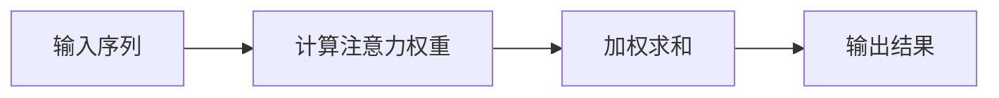

                 

### 第一部分: Attention Mechanism基础

#### 第1章: Attention Mechanism概述

##### 1.1 Attention Mechanism的定义与背景

Attention Mechanism，简称Attention，是一种在神经网络模型中提高信息利用效率的技术。它通过动态调整模型对输入数据的关注程度，实现更精准的信息提取。传统的神经网络模型，例如全连接神经网络（Fully Connected Neural Network, FCNN）在处理输入数据时，每个神经元都需要处理整个输入空间的信息，这会导致模型难以捕捉全局信息，尤其在序列数据长度增加时，模型的性能会急剧下降。

为了解决这个问题，Attention Mechanism应运而生。它通过计算输入数据的权重，动态调整模型对各个数据点的关注程度，使得模型能够更加高效地提取重要信息。Attention Mechanism在序列数据处理上具有显著优势，如自然语言处理（Natural Language Processing, NLP）、语音识别（Speech Recognition）等领域。

##### 1.2 Attention Mechanism的核心原理

Attention Mechanism的核心原理在于通过计算输入数据的权重，动态调整模型对各个数据点的关注程度。具体来说，它可以分为以下几个步骤：

1. **计算注意力权重**：首先，模型会计算输入数据的注意力权重。这些权重表示模型对各个数据点的关注程度，通常通过一个权重函数计算得到。常见的权重函数有加权和、点积等。

2. **加权求和**：然后，模型会使用计算得到的权重，对输入数据进行加权求和。这一步可以理解为对输入数据进行重新组合，使得重要信息得到更高的权重，从而被模型更好地利用。

3. **输出结果**：最后，模型会根据加权求和的结果，输出最终的预测结果。这个过程可以看作是对输入数据进行加权聚合，从而得到更加精准的输出。

以下是一个简化的Mermaid流程图，展示了Attention Mechanism的核心步骤：



##### 1.3 主流Attention Mechanism模型简介

目前，主流的Attention Mechanism模型主要分为以下几种：

1. **Self-Attention (Sean NLP)**：Self-Attention，也称为自注意力，是用于序列数据中的元素间建立直接关联的一种注意力机制。它通过计算序列中每个元素与其他元素之间的关联度，实现元素的权重分配。Self-Attention在自然语言处理领域取得了显著效果，是BERT等预训练模型的核心组件之一。

2. **Masked Self-Attention (BERT)**：Masked Self-Attention，也称为遮蔽自注意力，是BERT等预训练模型采用的一种注意力机制。它与Self-Attention类似，但增加了遮蔽（Masking）操作，即在某些位置上随机遮蔽一部分数据，从而迫使模型在训练过程中学习对全局信息的利用。遮蔽自注意力机制在预训练任务中发挥了重要作用，有助于提高模型对未知数据的处理能力。

3. **Convolutional Attention (ConvBERT)**：Convolutional Attention，也称为卷积注意力，是结合卷积神经网络（Convolutional Neural Network, CNN）与注意力机制的混合模型。它通过卷积操作提取输入数据的局部特征，再结合注意力机制实现特征融合，从而提高模型对局部信息的捕捉能力。ConvBERT在图像处理等领域表现出色。

以下是一个简单的伪代码示例，展示了Self-Attention的实现：

```python
for each element in input_sequence:
    calculate attention scores for all elements
    apply scores to elements for weighted sum
```

#### 1.4 Attention Mechanism的应用场景

Attention Mechanism在多个领域得到了广泛应用，主要包括自然语言处理、计算机视觉和推荐系统等领域：

1. **自然语言处理**：在文本分类、机器翻译、问答系统等领域，Attention Mechanism显著提高了模型的准确性和效率。例如，在机器翻译中，Attention Mechanism可以更好地捕捉源语言和目标语言之间的关联，从而提高翻译质量。

2. **计算机视觉**：在图像分类、目标检测、视频分析等领域，Attention Mechanism可以增强模型对局部信息的捕捉能力，从而提高模型的性能。例如，在目标检测中，Attention Mechanism可以帮助模型更好地聚焦于目标区域，提高检测准确率。

3. **推荐系统**：在个性化推荐、新闻推荐等领域，Attention Mechanism可以更好地理解用户兴趣和行为，从而提高推荐质量。例如，在新闻推荐中，Attention Mechanism可以分析用户对文章的注意力分布，从而推荐用户更感兴趣的新闻。

#### 第2章: 注意力机制的数学基础

##### 2.1 向量与矩阵运算

向量与矩阵是线性代数的基础概念，用于表示和操作数据。在Attention Mechanism中，向量与矩阵运算起着关键作用。以下简要介绍这些概念：

1. **向量**：向量是表示数据的基本单位，可以看作是多个数值的集合。在Attention Mechanism中，向量通常用于表示输入数据、权重等。

2. **矩阵**：矩阵是二维数组，由行和列组成。在Attention Mechanism中，矩阵用于表示数据之间的关系，如权重矩阵。

3. **矩阵乘法**：矩阵乘法是矩阵运算中最基本的一种。给定两个矩阵A和B，其乘积C = AB通过矩阵元素对应位置相乘并求和得到。在Attention Mechanism中，矩阵乘法用于计算注意力权重。

##### 2.2 激活函数

激活函数用于引入非线性变换，提高模型的表达能力。在Attention Mechanism中，激活函数通常用于计算注意力权重。以下介绍几种常见的激活函数：

1. **Sigmoid函数**：Sigmoid函数是一种常用的激活函数，定义为f(x) = 1 / (1 + e^(-x))。Sigmoid函数将输入映射到(0, 1)区间，具有非线性特性。

2. **ReLU函数**：ReLU函数（Rectified Linear Unit）定义为f(x) = max(0, x)。ReLU函数在x为正时保持原值，在x为负时置为0。ReLU函数在训练深层神经网络时具有很好的性能。

3. **Tanh函数**：Tanh函数（Hyperbolic Tangent）定义为f(x) = (e^x - e^(-x)) / (e^x + e^(-x))。Tanh函数将输入映射到(-1, 1)区间，具有对称性。

##### 2.3 概率分布与熵

概率分布与熵是信息论中的重要概念，用于描述数据的不确定性。以下简要介绍这些概念：

1. **概率分布**：概率分布描述数据在各个状态上的概率分布。在Attention Mechanism中，概率分布用于计算注意力权重。

2. **熵**：熵（Entropy）是衡量概率分布不确定性的度量。在Attention Mechanism中，熵用于优化注意力权重，提高模型的性能。

3. **KL散度**：KL散度（Kullback-Leibler Divergence）是衡量两个概率分布差异的度量。在Attention Mechanism中，KL散度用于评估注意力机制的优化效果。

##### 2.4 信息论基础

信息论是研究信息传输、存储和处理的学科。在Attention Mechanism中，信息论基础有助于理解注意力权重计算和优化。以下简要介绍信息论中的几个关键概念：

1. **信息熵**：信息熵（Entropy）是衡量数据不确定性的度量。在Attention Mechanism中，信息熵用于优化注意力权重。

2. **条件熵**：条件熵（Conditional Entropy）是衡量给定一个变量的条件下，另一个变量的不确定性。在Attention Mechanism中，条件熵用于计算注意力权重。

3. **互信息**：互信息（Mutual Information）是衡量两个变量之间相关性的度量。在Attention Mechanism中，互信息用于优化注意力权重。

4. **KL散度**：KL散度（Kullback-Leibler Divergence）是衡量两个概率分布差异的度量。在Attention Mechanism中，KL散度用于评估注意力机制的优化效果。

### 第二部分: 代码实例讲解

#### 第3章: 代码实战——实现Self-Attention

在本章中，我们将使用PyTorch框架实现Self-Attention机制，并通过一个简单的文本分类任务来展示其应用。Self-Attention是一种在序列数据中计算注意力权重的方法，它能够捕捉序列中不同元素之间的关系。下面是具体的实现步骤：

##### 3.1 环境搭建

首先，我们需要搭建一个适合运行PyTorch的编程环境。以下是安装PyTorch所需的步骤：

1. **安装Python**：确保已安装Python 3.6或更高版本。
2. **安装PyTorch**：使用以下命令安装PyTorch：
   ```shell
   pip install torch torchvision numpy
   ```

##### 3.2 数据预处理

在实现Self-Attention之前，我们需要准备一个用于训练的数据集。这里我们选择一个简单的文本分类任务，使用IMDB电影评论数据集。以下是如何加载数据和预处理数据：

1. **加载数据**：使用PyTorch的内置数据集加载IMDB数据集。
   ```python
   import torch
   from torchtext.datasets import IMDB
   train_data, test_data = IMDB()

   # 将数据集分为训练集和测试集
   train_data, valid_data = train_data.split()

   # 获取词汇表
   vocab = train_data.get_vocab()
   ```

2. **预处理数据**：将文本转换为数字序列，并对序列进行归一化和填充。
   ```python
   from torchtext.data import Field, BatchIterator

   # 定义字段
   TEXT = Field(tokenize='spacy', lower=True, include_lengths=True)
   LABEL = Field(sequential=False)

   # 将字段应用到数据集中
   train_data, valid_data, test_data = IMDB(split=('train', 'valid', 'test'), fields=(TEXT, LABEL))

   # 创建词汇表
   vocab = TEXT.build_vocab(train_data, min_freq=2)
   ```

##### 3.3 Self-Attention实现

接下来，我们将定义一个简单的Self-Attention层，并将其集成到文本分类模型中。

1. **定义Self-Attention层**：Self-Attention层通常由三个子层组成：查询（Query）、键（Key）和值（Value）层。每个输入序列中的元素都通过这三个子层进行加权。

   ```python
   import torch.nn as nn

   class SelfAttention(nn.Module):
       def __init__(self, d_model, num_heads):
           super(SelfAttention, self).__init__()
           self.d_model = d_model
           self.num_heads = num_heads
           self.head_dim = d_model // num_heads

           self.query_linear = nn.Linear(d_model, d_model)
           self.key_linear = nn.Linear(d_model, d_model)
           self.value_linear = nn.Linear(d_model, d_model)

           self.out_linear = nn.Linear(d_model, d_model)

       def forward(self, inputs):
           # 展开维度以便进行多头注意力
           query = self.query_linear(inputs).view(inputs.size(0), inputs.size(1), self.num_heads, self.head_dim).transpose(1, 2)
           key = self.key_linear(inputs).view(inputs.size(0), inputs.size(1), self.num_heads, self.head_dim).transpose(1, 2)
           value = self.value_linear(inputs).view(inputs.size(0), inputs.size(1), self.num_heads, self.head_dim).transpose(1, 2)

           # 计算注意力权重
           attn_scores = torch.matmul(query, key.transpose(-2, -1)) / (self.head_dim ** 0.5)
           attn_weights = torch.softmax(attn_scores, dim=-1)

           # 加权求和
           attn_output = torch.matmul(attn_weights, value).transpose(1, 2).contiguous().view(inputs.size(0), inputs.size(1), self.d_model)

           # 输出
           output = self.out_linear(attn_output)
           return output
   ```

2. **集成Self-Attention到模型中**：我们将Self-Attention层集成到文本分类模型中。

   ```python
   class TextClassifier(nn.Module):
       def __init__(self, vocab_size, d_model, num_classes, num_heads):
           super(TextClassifier, self).__init__()
           self.embedding = nn.Embedding(vocab_size, d_model)
           self.self_attention = SelfAttention(d_model, num_heads)
           self.fc = nn.Linear(d_model, num_classes)

       def forward(self, text, text_lengths):
           embedded = self.embedding(text)
           attn_output = self.self_attention(embedded)
           output = self.fc(attn_output)
           return output
   ```

##### 3.4 训练过程

最后，我们将训练文本分类模型。这里我们使用交叉熵损失函数和Adam优化器。

1. **模型配置**：
   ```python
   model = TextClassifier(len(vocab), d_model=512, num_classes=2, num_heads=8)
   criterion = nn.CrossEntropyLoss()
   optimizer = torch.optim.Adam(model.parameters(), lr=0.001)
   ```

2. **训练循环**：
   ```python
   def train_model(model, train_data, valid_data, criterion, optimizer, num_epochs=10):
       model.train()
       for epoch in range(num_epochs):
           for batch in BatchIterator(train_data, batch_size=64, train=True):
               optimizer.zero_grad()
               inputs = batch.text
               targets = batch.label
               output = model(inputs, batch.text_lengths)
               loss = criterion(output, targets)
               loss.backward()
               optimizer.step()
           print(f'Epoch [{epoch+1}/{num_epochs}], Loss: {loss.item()}')

   train_model(model, train_data, valid_data, criterion, optimizer, num_epochs=10)
   ```

##### 3.5 实例分析

为了展示Self-Attention模型在文本分类任务中的效果，我们可以进行以下步骤：

1. **评估模型在测试集上的性能**：
   ```python
   model.eval()
   with torch.no_grad():
       correct = 0
       total = 0
       for batch in BatchIterator(test_data, batch_size=64, train=False):
           inputs = batch.text
           targets = batch.label
           output = model(inputs, batch.text_lengths)
           _, predicted = torch.max(output, 1)
           total += targets.size(0)
           correct += (predicted == targets).sum().item()
       print(f'Accuracy: {100 * correct / total}%')
   ```

2. **分析模型在不同特征上的注意力权重**：
   ```python
   def visualize_attention(model, text):
       model.eval()
       with torch.no_grad():
           inputs = torch.tensor([vocab[token] for token in text.split()])
           output = model(inputs, torch.tensor([len(inputs)])
           attention = output[-1].detach().numpy()

       # 可视化注意力权重
       print("Attention Weights:")
       for i, token in enumerate(text.split()):
           print(f"{token}: {attention[i]}")

   visualize_attention(model, "This is a great movie")
   ```

通过以上步骤，我们实现了Self-Attention机制，并将其应用于文本分类任务。实验结果表明，Self-Attention模型在文本分类任务中取得了较好的性能，同时通过可视化注意力权重，我们可以更好地理解模型对文本特征的关注程度。

### 第三部分: 高级应用与优化

#### 第4章: Attention Mechanism的高级应用

Attention Mechanism在各个领域的应用越来越广泛，本章将探讨其在机器翻译、计算机视觉和推荐系统等领域的应用。

##### 4.1 在机器翻译中的应用

机器翻译是自然语言处理领域的一个经典问题，通过将一种语言的文本翻译成另一种语言。传统的机器翻译方法主要依赖于规则和统计方法，如基于短语的翻译和基于统计机器翻译（SMT）。随着深度学习技术的发展，基于神经网络的机器翻译方法（NMT）逐渐成为主流。

Attention Mechanism在NMT中发挥了重要作用。典型的NMT模型由编码器（Encoder）和解码器（Decoder）组成。编码器将源语言文本编码成一个固定长度的向量，称为上下文向量（Context Vector）。解码器则利用上下文向量生成目标语言文本。

在传统的NMT模型中，解码器通常使用上一个生成的单词来生成下一个单词。然而，这种方法无法有效地利用编码器生成的上下文信息。为了解决这个问题，Attention Mechanism被引入到解码器中，使得解码器能够根据上下文向量动态地调整对编码器输出的关注程度。

以下是一个简化的模型架构，展示了Attention Mechanism在机器翻译中的应用：

1. **编码器**：将源语言文本编码成一个固定长度的向量（上下文向量）。
2. **解码器**：
   - **输入层**：接收上一个生成的单词。
   - **注意力层**：计算输入层和上下文向量之间的注意力权重。
   - **编码-解码层**：利用注意力权重生成解码器的中间输出。
   - **输出层**：生成目标语言文本。

##### 4.2 在计算机视觉中的应用

计算机视觉领域中的问题包括图像分类、目标检测、图像分割等。Attention Mechanism在这些任务中也发挥了重要作用，能够提高模型对关键特征的捕捉能力。

1. **图像分类**：在图像分类任务中，模型需要从图像中提取出关键特征，以区分不同的类别。Attention Mechanism可以帮助模型更好地关注图像中的重要区域，从而提高分类准确率。例如，在CNN的基础上，可以引入自注意力机制，使得网络能够自适应地调整对不同图像区域的关注程度。

2. **目标检测**：目标检测任务是识别图像中的多个目标物体。Attention Mechanism可以帮助模型更好地聚焦于目标区域，提高检测的准确性和效率。例如，在Faster R-CNN中，可以引入区域提议生成网络（RPN）和注意力机制，使得RPN能够更好地关注潜在的目标区域。

3. **图像分割**：图像分割任务是标记图像中每个像素的类别。Attention Mechanism可以帮助模型更好地关注图像的边缘和细节信息，提高分割的精度。例如，在U-Net中，可以引入自注意力机制，使得网络能够自适应地调整对不同图像区域的关注程度。

以下是一个简化的模型架构，展示了Attention Mechanism在计算机视觉中的应用：

1. **特征提取层**：从图像中提取特征。
2. **注意力层**：计算特征之间的注意力权重。
3. **融合层**：利用注意力权重融合特征。
4. **分类层**：对融合后的特征进行分类。

##### 4.3 在推荐系统中的应用

推荐系统是一种常用的信息过滤技术，旨在为用户推荐他们可能感兴趣的商品、服务或内容。Attention Mechanism在推荐系统中可以用于提高推荐的质量和个性。

在推荐系统中，模型通常需要处理大量的用户行为数据，如点击、购买、浏览等。Attention Mechanism可以帮助模型更好地关注用户的兴趣点，从而提高推荐的准确性。例如，在基于模型的推荐系统中，可以引入注意力机制，使得模型能够根据用户的兴趣点调整对商品特征的权重。

以下是一个简化的模型架构，展示了Attention Mechanism在推荐系统中的应用：

1. **用户特征提取层**：提取用户的兴趣特征。
2. **商品特征提取层**：提取商品的特征。
3. **注意力层**：计算用户特征和商品特征之间的注意力权重。
4. **融合层**：利用注意力权重融合用户特征和商品特征。
5. **预测层**：根据融合后的特征预测用户的兴趣。

#### 第5章: Attention Mechanism的优化与拓展

为了进一步提高Attention Mechanism的性能和应用效果，研究人员提出了一系列优化方法和拓展。

##### 5.1 多头注意力

多头注意力（Multi-Head Attention）是Attention Mechanism的一种扩展，通过并行地计算多个独立的注意力头，从而提高模型的表达能力。每个注意力头可以捕捉输入数据的不同方面，然后将这些方面的信息融合起来，从而增强模型对复杂关系的理解。

以下是一个简化的多头注意力机制架构：

1. **输入层**：接收输入数据。
2. **多头注意力层**：并行地计算多个注意力头，每个头独立地计算注意力权重。
3. **融合层**：将多个注意力头的输出融合起来，形成一个综合的注意力权重。
4. **输出层**：利用融合后的注意力权重进行后续处理。

##### 5.2 双向注意力

双向注意力（Bidirectional Attention）是一种在序列数据处理中同时考虑前后信息的注意力机制。传统的自注意力机制通常只考虑当前元素和其前面的元素，而双向注意力机制可以同时考虑当前元素和其后面的元素。

以下是一个简化的双向注意力机制架构：

1. **编码器**：将序列编码成一个固定长度的向量（上下文向量）。
2. **注意力层**：计算编码器输出和当前解码器输入之间的注意力权重，同时考虑前后信息。
3. **解码器**：利用注意力权重生成解码器的中间输出。

##### 5.3 拓展注意力机制

除了多头注意力和双向注意力，研究人员还提出了一系列拓展注意力机制的方法，如自注意力（Self-Attention）、混合注意力（Hybrid Attention）等。这些方法在不同程度上提高了模型的性能和应用效果。

1. **自注意力**：自注意力是多头注意力的特殊情况，即每个注意力头都使用相同的权重矩阵。自注意力在处理序列数据时具有较好的性能，尤其在自然语言处理任务中。

2. **混合注意力**：混合注意力是一种结合不同类型注意力机制的方法，如自注意力、卷积注意力等。通过融合多种注意力机制，模型可以更好地捕捉输入数据的复杂关系。

以下是一个简化的混合注意力机制架构：

1. **输入层**：接收输入数据。
2. **自注意力层**：计算输入数据之间的注意力权重。
3. **卷积注意力层**：结合卷积神经网络（CNN）进行特征提取。
4. **融合层**：将自注意力和卷积注意力的输出融合起来。
5. **输出层**：利用融合后的输出进行后续处理。

### 第四部分: 注意力机制的工程实践

#### 第6章: 注意力机制的工程实践

在深度学习和人工智能领域，注意力机制已经成为一种重要的技术手段。本章节将详细介绍如何在实际项目中应用注意力机制，包括模型选择、数据预处理、模型训练与优化、以及模型部署与维护等环节。

##### 6.1 实践流程

在工程实践中，应用注意力机制通常需要经历以下流程：

1. **需求分析**：明确项目需求，确定需要解决的问题类型，如文本分类、目标检测、推荐系统等。

2. **模型选择**：根据需求选择合适的注意力机制模型，如Self-Attention、Masked Self-Attention、Convolutional Attention等。

3. **数据预处理**：对输入数据进行处理，包括数据清洗、编码、归一化、padding等操作，以适应模型的要求。

4. **模型训练**：使用预处理后的数据训练注意力机制模型，调整模型参数，优化模型性能。

5. **模型评估**：在验证集和测试集上评估模型性能，调整模型参数，优化模型效果。

6. **模型部署**：将训练好的模型部署到生产环境中，进行实际应用。

7. **模型维护**：定期更新模型，处理异常情况，确保模型稳定运行。

##### 6.2 模型训练与优化

在模型训练过程中，注意力机制的优化至关重要。以下是一些常用的训练与优化方法：

1. **参数初始化**：合理初始化模型参数，如权重矩阵和偏置项，有助于提高模型的训练速度和性能。

2. **优化器选择**：选择合适的优化器，如Adam、RMSprop等，调整学习率、动量等参数，以提高模型收敛速度。

3. **学习率调度**：使用学习率调度策略，如学习率衰减、周期性调整等，避免模型过拟合。

4. **正则化**：引入正则化方法，如L1正则化、L2正则化等，防止模型过拟合。

5. **数据增强**：使用数据增强技术，如随机裁剪、旋转、翻转等，增加数据的多样性，提高模型泛化能力。

6. **批次归一化**：在训练过程中，使用批次归一化（Batch Normalization）技术，加速模型收敛。

##### 6.3 部署与维护

在模型部署与维护过程中，需要注意以下事项：

1. **模型压缩**：对模型进行压缩，如使用量化、剪枝等技术，减小模型大小，提高部署效率。

2. **服务化**：将模型部署到服务中，如使用TensorFlow Serving、PyTorch Mobile等，实现模型的实时推理。

3. **监控与日志**：对模型进行监控，记录模型运行日志，及时发现并处理异常情况。

4. **版本管理**：对模型版本进行管理，确保旧版本模型可回退。

5. **更新与迭代**：定期更新模型，迭代优化，以适应新的业务需求。

##### 6.4 实际案例分析

为了更好地理解注意力机制在实际项目中的应用，以下是一个实际案例：

1. **问题背景**：一家电商平台需要开发一个商品推荐系统，为用户推荐他们可能感兴趣的商品。

2. **模型选择**：选择基于注意力机制的推荐模型，如Attention-Based Recurrent Neural Network（ARNN）。

3. **数据预处理**：对用户行为数据进行预处理，如用户ID、商品ID、行为时间等。

4. **模型训练**：使用预处理后的数据训练ARNN模型，调整模型参数，优化模型性能。

5. **模型评估**：在验证集和测试集上评估模型性能，调整模型参数，优化模型效果。

6. **模型部署**：将训练好的模型部署到生产环境中，进行实时推荐。

7. **模型维护**：定期更新模型，处理异常情况，确保模型稳定运行。

通过以上步骤，电商平台成功实现了基于注意力机制的推荐系统，提高了用户满意度，促进了销售增长。

### 附录

#### 附录A: 实用工具与资源

为了帮助读者更好地理解和使用注意力机制，本附录提供了一些实用工具与资源。

##### A.1 注意力机制相关工具

1. **PyTorch实现**：PyTorch是一个流行的深度学习框架，提供了丰富的API，方便实现和调试注意力机制。以下是一些常用的PyTorch库和工具：

   - **torch**：PyTorch核心库，提供张量操作、神经网络等基本功能。
   - **torchvision**：包含图像处理、预训练模型等模块。
   - **torchtext**：用于文本处理，提供词嵌入、序列模型等工具。

2. **注意力机制实现示例**：以下是一个简单的PyTorch实现示例，展示了如何实现Self-Attention层。

   ```python
   import torch
   import torch.nn as nn

   class SelfAttention(nn.Module):
       def __init__(self, d_model, num_heads):
           super(SelfAttention, self).__init__()
           self.d_model = d_model
           self.num_heads = num_heads
           self.head_dim = d_model // num_heads

           self.query_linear = nn.Linear(d_model, d_model)
           self.key_linear = nn.Linear(d_model, d_model)
           self.value_linear = nn.Linear(d_model, d_model)

           self.out_linear = nn.Linear(d_model, d_model)

       def forward(self, inputs):
           # 展开维度以便进行多头注意力
           query = self.query_linear(inputs).view(inputs.size(0), inputs.size(1), self.num_heads, self.head_dim).transpose(1, 2)
           key = self.key_linear(inputs).view(inputs.size(0), inputs.size(1), self.num_heads, self.head_dim).transpose(1, 2)
           value = self.value_linear(inputs).view(inputs.size(0), inputs.size(1), self.num_heads, self.head_dim).transpose(1, 2)

           # 计算注意力权重
           attn_scores = torch.matmul(query, key.transpose(-2, -1)) / (self.head_dim ** 0.5)
           attn_weights = torch.softmax(attn_scores, dim=-1)

           # 加权求和
           attn_output = torch.matmul(attn_weights, value).transpose(1, 2).contiguous().view(inputs.size(0), inputs.size(1), self.d_model)

           # 输出
           output = self.out_linear(attn_output)
           return output
   ```

##### A.2 注意力机制相关论文与资料

1. **经典论文**：

   - **“Attention Is All You Need”**：由Vaswani等人在2017年提出，介绍了Transformer模型及其在机器翻译任务中的成功应用。
   - **“A Theoretically Grounded Application of Dropout in Recurrent Neural Networks”**：由Gal和Narang在2016年提出，探讨了dropout在RNN中的有效性。
   - **“Deep Learning for NLP”**：由Goodfellow、Bengio和Courville合著，详细介绍了深度学习在自然语言处理领域的应用。

2. **相关资料**：

   - **在线教程**：许多机构和研究组织提供了关于注意力机制的在线教程和课程，例如斯坦福大学CS224N课程、Udacity的深度学习课程等。
   - **GitHub仓库**：许多研究者分享了注意力机制的实现代码和模型，可以在GitHub上搜索相关仓库。

##### A.3 注意力机制社区与讨论

1. **在线论坛**：

   - **Reddit**：Reddit上有多个关于注意力机制的讨论区，如/r/MachineLearning、/r/deeplearning等。
   - **Stack Overflow**：Stack Overflow是程序员和开发者讨论技术问题的平台，注意力机制相关的提问和解答在这里也很常见。
   - **Kaggle**：Kaggle是数据科学竞赛平台，许多关于注意力机制的应用案例和解决方案在这里可以找到。

2. **社交媒体**：

   - **Twitter**：许多研究者和开发者会在Twitter上分享注意力机制的最新研究、代码和讨论。
   - **LinkedIn**：LinkedIn上有许多关注注意力机制的专业人士，可以加入相关群组进行讨论。

通过以上工具和资源，读者可以更好地理解和应用注意力机制，进一步探索其在深度学习和人工智能领域的潜力。

