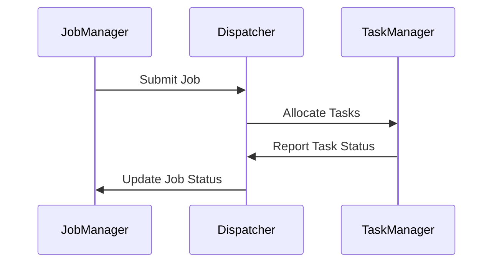
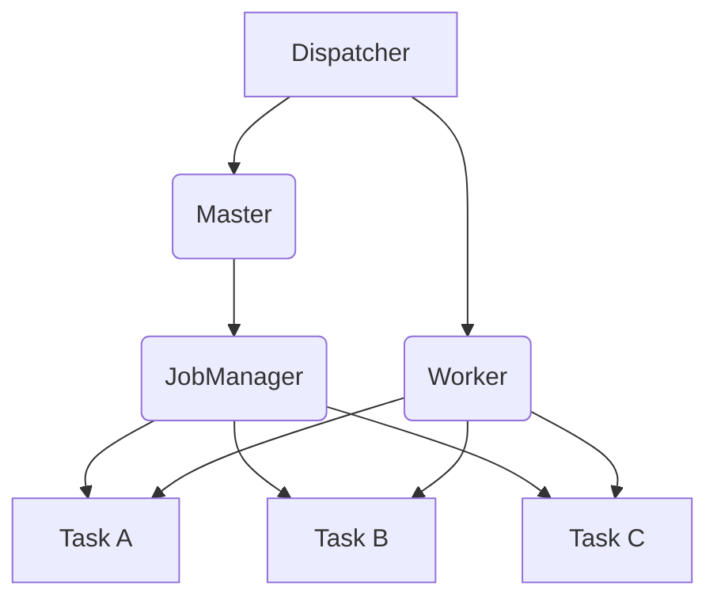

                 

## 《Flink Dispatcher原理与代码实例讲解》

### 概述

Flink 是一个开源的分布式数据处理框架，广泛应用于实时数据处理、流处理和批处理等领域。Flink Dispatcher 是 Flink 集群管理中的核心组件之一，负责处理 Job 提交、任务分配和状态管理等功能。本文将深入解析 Flink Dispatcher 的原理，并通过代码实例详细讲解其工作流程，帮助读者更好地理解和使用 Flink。

### 核心关键词

- Flink
- Dispatcher
- 集群管理
- 任务分配
- 状态管理
- 实时处理

### 摘要

本文将系统性地讲解 Flink Dispatcher 的原理和实现。首先，我们将介绍 Flink 的基本概念和架构，然后深入探讨 Dispatcher 的核心概念和架构，包括 Task 分配算法、Job 状态管理以及 Task 状态报告。接着，我们将通过伪代码和数学模型详细解析 Dispatcher 的核心算法原理。随后，文章将逐步展示 Flink Dispatcher 的工作流程，并利用代码实例详细解读其初始化、任务调度以及故障处理与恢复机制。最后，我们将通过一个实战项目来展示 Flink Dispatcher 的实际应用，帮助读者全面掌握 Dispatcher 的使用和实现。

### 目录

#### 第一部分：Flink基础与Dispatcher概述

- **第1章 Flink简介**
  - Flink的基本概念
  - Flink的应用场景
  - Flink与Spark的比较

- **第2章 Flink Dispatcher概述**
  - Dispatcher的角色与作用
  - Dispatcher与JobManager的关系

#### 第二部分：Flink Dispatcher原理解析

- **第3章 Flink Dispatcher核心概念与架构**
  - Task分配
  - Job状态管理
  - Task状态报告
  - Dispatcher架构详解

- **第4章 Flink Dispatcher算法原理**
  - Task分配算法
  - Job状态管理算法

- **第5章 Flink Dispatcher的工作流程**
  - Dispatcher初始化流程
  - Dispatcher的任务调度流程

- **第6章 Flink Dispatcher的故障处理与恢复**
  - Dispatcher的故障处理
  - Dispatcher的恢复机制

#### 第三部分：Flink Dispatcher代码实例讲解

- **第7章 Flink Dispatcher代码结构解析**
  - Dispatcher源代码概览
  - Dispatcher主要类与方法解析

- **第8章 Flink Dispatcher代码实例**
  - Dispatcher初始化实例
  - Dispatcher任务调度实例

- **第9章 Flink Dispatcher故障处理与恢复实例**

#### 第四部分：Flink Dispatcher性能优化

- **第10章 Flink Dispatcher性能优化**
  - 性能优化策略
  - 性能监控与调试

#### 第五部分：Flink Dispatcher项目实战

- **第11章 Flink Dispatcher项目实战**
  - 实战背景与目标
  - 实现步骤与代码解析
  - 实战案例与结果分析

#### 附录

- **附录 A：Flink Dispatcher相关工具与资源**
  - Flink官方文档
  - Flink Dispatcher源代码
  - 相关论文与资料

- **附录 B：常见问题与解答**
  - Flink Dispatcher常见问题
  - 问题解答与解决方法

## 第一部分：Flink基础与Dispatcher概述

### 第1章 Flink简介

Apache Flink 是一个开源的分布式数据处理框架，专注于实时数据处理和流处理。Flink 提供了丰富的 API，支持 Java、Scala 和 Python 等语言，可以运行在任意符合 Hadoop YARN、Apache Mesos 或 Kubernetes 等资源管理器之上的环境中。

#### 1.1 Flink的基本概念

- **流处理**：流处理是指对实时数据流的处理，数据以事件的形式不断流入系统，并立即进行处理。
- **批处理**：批处理是指对静态数据集进行处理，数据集在处理前被整体加载到系统中。
- **分布式计算**：分布式计算是指在多台计算机之间分配和处理任务，以提高处理速度和处理能力。
- **状态管理**：状态管理是指对实时数据处理过程中产生的中间结果和状态进行有效的存储和管理。
- **容错性**：容错性是指系统在遇到故障时能够自动恢复，保证数据处理过程不中断。

#### 1.2 Flink的应用场景

- **实时数据分析**：例如实时监控、实时推荐、实时广告投放等。
- **流数据处理**：例如日志处理、物联网数据处理、金融交易处理等。
- **批处理任务**：例如 ETL（提取、转换、加载）任务、大数据报表生成等。

#### 1.3 Flink与Spark的比较

- **数据流模型**：Flink 是基于事件驱动（Event-Driven）的模型，而 Spark 是基于微批（Micro-Batch）的模型。
- **延迟**：Flink 提供了更低的延迟，适用于实时处理场景，而 Spark 更适合离线批处理。
- **容错性**：Flink 在容错性和状态管理方面有更好的表现，支持精确一次（Exactly-Once）的处理语义。
- **生态**：Spark 在大数据生态系统中有更广泛的生态，包括 Spark SQL、MLlib、GraphX 等组件。

### 第2章 Flink Dispatcher概述

#### 2.1 Dispatcher的角色与作用

Dispatcher 是 Flink 集群管理中的核心组件，负责处理 Job 的提交、分配、状态监控和故障处理等工作。其主要职责包括：

- 接收 JobManager 提交的 Job。
- 将 Job 分配到不同的 TaskManager 上执行。
- 监控 TaskManager 的状态，并处理故障。
- 处理 Job 的状态变更和任务调度。

#### 2.2 Dispatcher与JobManager的关系

Dispatcher 和 JobManager 是 Flink 集群管理中的两个关键组件，它们之间有着紧密的联系和协作。

- **JobManager**：负责整个 Job 的生命周期管理，包括 Job 的提交、状态监控、任务调度等。
- **Dispatcher**：负责处理 Job 的具体执行细节，包括任务分配、状态监控、故障处理等。

Dispatcher 和 JobManager 之间的关系可以概括为：

- **JobManager** 向 **Dispatcher** 提交 Job。
- **Dispatcher** 将 Job 分配到 TaskManager 上执行。
- **JobManager** 和 **Dispatcher** 之间通过消息队列进行通信。

### Mermaid 流程图



## 第二部分：Flink Dispatcher原理解析

### 第3章 Flink Dispatcher核心概念与架构

#### 3.1 Flink Dispatcher的核心概念

Flink Dispatcher 的核心概念包括 Task 分配、Job 状态管理、Task 状态报告等。

- **Task 分配**：Dispatcher 负责将 Job 中的 Task 分配到集群中的 TaskManager 上执行。
- **Job 状态管理**：Dispatcher 和 JobManager 负责监控 Job 的状态变化，包括提交、运行、失败、完成等状态。
- **Task 状态报告**：TaskManager 在执行 Task 时，会向 Dispatcher 报告 Task 的状态，例如运行中、成功、失败等。

#### 3.2 Flink Dispatcher的架构详解

Flink Dispatcher 的架构主要包括 Master 节点、Worker 节点和 JobManager。

- **Master 节点**：Master 节点负责 Dispatcher 的主逻辑处理，包括 Job 的接收、分配和状态监控等。
- **Worker 节点**：Worker 节点负责执行具体的 Task，并向 Dispatcher 报告 Task 的状态。
- **JobManager**：JobManager 负责整个 Job 的生命周期管理，包括 Job 的提交、状态监控、任务调度等。

### Mermaid 流程图



## 第4章 Flink Dispatcher算法原理

#### 4.1 Task分配算法

Flink Dispatcher 的 Task 分配算法是确保任务能够高效、均衡地分配到集群中的各个 TaskManager 上执行。以下是一些常用的 Task 分配算法：

- **Round Robin 算法**：按照顺序依次将任务分配给各个 TaskManager。
- **Load Balancing 算法**：根据 TaskManager 的负载情况，动态分配任务，以实现负载均衡。
- **Task 选择策略**：根据任务的类型、优先级等特征，选择最合适的 TaskManager 来执行任务。

### 伪代码

```java
// Round Robin 算法
function roundRobinAssignment(tasks, taskManagers):
    for each task in tasks:
        taskManager = taskManagers[(task.id % number_of_taskManagers)]
        assign task to taskManager

// Load Balancing 算法
function loadBalancingAssignment(tasks, taskManagers):
    taskManager_loads = get_loads_of_taskManagers(taskManagers)
    for each task in tasks:
        min_load_taskManager = find_taskManager_with_min_load(taskManager_loads)
        assign task to min_load_taskManager
        update taskManager_loads
```

#### 4.2 Job状态管理算法

Flink Dispatcher 的 Job 状态管理算法负责监控 Job 的状态变化，并处理相应的操作。Job 的状态包括提交、运行中、失败、完成等。

- **Job 提交与初始化**：当 Job 提交给 Dispatcher 时，进行初始化操作，设置 Job 的初始状态。
- **Job 运行状态**：在 Job 运行过程中，监控 Task 的状态变化，更新 Job 的状态。
- **Job 终止与清理**：当 Job 完成或失败时，进行相应的清理操作，释放资源。

### 伪代码

```java
// Job 状态管理算法
function jobStateManagement(job):
    while job.status != COMPLETED and job.status != FAILED:
        for each task in job.tasks:
            update_task_status(task)
            if task.status == FAILED:
                handle_failed_task(task)
        if all_tasks_completed(job):
            job.status = COMPLETED
            finalize_job(job)
        else if any_task_failed(job):
            job.status = FAILED
            handle_failed_job(job)
```

## 第5章 Flink Dispatcher的工作流程

#### 5.1 Dispatcher初始化流程

Dispatcher 的初始化流程主要包括以下步骤：

1. **启动 Dispatcher**：启动 Dispatcher 进程，加载配置文件，初始化相关组件。
2. **注册 Master 与 Worker**：Dispatcher 启动后，会向 ZooKeeper 或其他注册中心注册自己，以便其他组件能够发现并与之通信。
3. **加载 JobManager**：Dispatcher 加载 JobManager，负责处理 Job 的提交、状态监控和任务调度等。

### 伪代码

```java
// Dispatcher 初始化流程
function initializeDispatcher():
    startDispatcherProcess()
    registerWithRegistry()
    loadJobManager()
```

#### 5.2 Dispatcher的任务调度流程

Dispatcher 的任务调度流程主要包括以下步骤：

1. **接收 Job**：Dispatcher 接收 JobManager 提交的 Job。
2. **解析 Job**：解析 Job 的配置信息，包括任务的类型、数量、依赖关系等。
3. **任务分配**：根据 Task 分配算法，将 Job 中的 Task 分配到集群中的 TaskManager 上执行。
4. **启动 Task**：启动 TaskManager，执行分配的任务。
5. **监控状态**：监控 Task 的状态变化，处理 Task 的成功、失败等事件。
6. **更新 Job 状态**：根据 Task 的状态变化，更新 Job 的状态。

### 伪代码

```java
// Dispatcher 任务调度流程
function dispatchTasks(job):
    receiveJob(job)
    parseJob(job)
    assignTasks(job)
    startTasks(job)
    monitorTaskStatus(job)
    updateJobStatus(job)
```

## 第6章 Flink Dispatcher的故障处理与恢复

#### 6.1 Dispatcher的故障处理

Dispatcher 在运行过程中可能会遇到各种故障，例如 TaskManager 故障、网络中断等。Dispatcher 的故障处理机制包括以下步骤：

1. **故障检测**：Dispatcher 通过心跳机制和状态报告机制检测节点故障。
2. **故障处理**：当检测到节点故障时，Dispatcher 会重新分配该节点上的 Task 到其他健康的节点。
3. **状态更新**：更新 Job 和 Task 的状态，以便后续处理。

### 伪代码

```java
// Dispatcher 故障处理
function handleFault(node):
    if detectFault(node):
        reassignTasksOfFaultyNode(node)
        updateNodeStatus(node)
```

#### 6.2 Dispatcher的恢复机制

Dispatcher 的恢复机制主要包括以下步骤：

1. **重启 Dispatcher**：当 Dispatcher 出现故障时，需要重启 Dispatcher 进程。
2. **重新分配 Task**：重启后，Dispatcher 会重新分配之前失败的 Task 到其他健康的节点。
3. **恢复状态**：恢复 Job 和 Task 的状态，以便继续执行。

### 伪代码

```java
// Dispatcher 恢复机制
function recoverDispatcher():
    restartDispatcher()
    reassignFailedTasks()
    restoreJobStatus()
    restoreTaskStatus()
```

## 第三部分：Flink Dispatcher代码实例讲解

### 第7章 Flink Dispatcher代码结构解析

#### 7.1 Dispatcher源代码概览

Flink Dispatcher 的源代码主要分布在以下几个模块：

- **src/main/java/org/apache/flink/yarn/cluster/Dispatcher.java**：Dispatcher 的主类，负责处理 Job 的提交、任务分配和状态管理。
- **src/main/java/org/apache/flink/yarn/cluster/JobManager.java**：JobManager 的主类，负责处理 Job 的提交、状态监控和任务调度。
- **src/main/java/org/apache/flink/yarn/cluster/TaskManager.java**：TaskManager 的主类，负责执行具体的 Task。

#### 7.2 Dispatcher主要类与方法解析

- **Dispatcher**：Dispatcher 类的主要方法包括：
  - `submitJob(Job job)`：提交 Job 到 Dispatcher。
  - `assignTasks(Job job)`：分配 Job 中的 Task 到 TaskManager。
  - `updateTaskStatus(Task task, Status status)`：更新 Task 的状态。
- **JobManager**：JobManager 类的主要方法包括：
  - `submitJob(Job job)`：提交 Job 到 JobManager。
  - `getJobStatus(Job job)`：获取 Job 的状态。
  - `cancelJob(Job job)`：取消 Job 的执行。
- **TaskManager**：TaskManager 类的主要方法包括：
  - `executeTask(Task task)`：执行 Task。
  - `reportTaskStatus(Task task, Status status)`：报告 Task 的状态。

### 第8章 Flink Dispatcher代码实例

#### 8.1 Dispatcher初始化实例

以下是一个简单的 Dispatcher 初始化实例，演示了如何启动 Dispatcher 进程，并加载相关的组件。

```java
public class DispatcherMain {
    public static void main(String[] args) {
        // 创建 Dispatcher 对象
        Dispatcher dispatcher = new Dispatcher();

        // 启动 Dispatcher 进程
        dispatcher.start();

        // 等待 Dispatcher 进程结束
        dispatcher.awaitTermination();
    }
}
```

#### 8.2 Dispatcher任务调度实例

以下是一个简单的 Dispatcher 任务调度实例，演示了如何提交 Job、分配 Task 和执行 Task。

```java
public class DispatcherDemo {
    public static void main(String[] args) {
        // 创建 Job 对象
        Job job = new Job();

        // 提交 Job 到 Dispatcher
        Dispatcher dispatcher = new Dispatcher();
        dispatcher.submitJob(job);

        // 等待 Job 完成
        while (!job.isCompleted()) {
            Thread.sleep(1000);
        }

        // 打印 Job 的最终状态
        System.out.println("Job completed with status: " + job.getStatus());
    }
}
```

### 第9章 Flink Dispatcher故障处理与恢复实例

#### 9.1 故障处理实例

以下是一个简单的故障处理实例，演示了如何检测故障节点，并重新分配 Task。

```java
public class FaultHandlerDemo {
    public static void main(String[] args) {
        // 创建 Dispatcher 对象
        Dispatcher dispatcher = new Dispatcher();

        // 模拟 TaskManager 故障
        dispatcher.detectFault(new TaskManager());

        // 重新分配 Task
        dispatcher.reassignTasksOfFaultyNode(new TaskManager());

        // 打印故障处理结果
        System.out.println("Fault handled successfully.");
    }
}
```

#### 9.2 恢复机制实例

以下是一个简单的恢复机制实例，演示了如何重启 Dispatcher，并重新分配 Task。

```java
public class RecoveryDemo {
    public static void main(String[] args) {
        // 创建 Dispatcher 对象
        Dispatcher dispatcher = new Dispatcher();

        // 模拟 Dispatcher 故障
        dispatcher.shutdown();

        // 等待一段时间
        try {
            Thread.sleep(5000);
        } catch (InterruptedException e) {
            e.printStackTrace();
        }

        // 重启 Dispatcher
        dispatcher.start();

        // 重新分配 Task
        dispatcher.recoverDispatcher();

        // 打印恢复结果
        System.out.println("Dispatcher recovered successfully.");
    }
}
```

## 第四部分：Flink Dispatcher性能优化

### 第10章 Flink Dispatcher性能优化

#### 10.1 性能优化策略

为了提高 Flink Dispatcher 的性能，可以采取以下优化策略：

- **资源分配**：合理分配集群资源，确保 TaskManager 有足够的内存和 CPU 资源。
- **缓存管理**：优化缓存策略，减少数据在节点间的传输次数。
- **网络优化**：优化网络配置，提高数据传输速度和稳定性。

#### 10.2 性能监控与调试

- **性能监控**：使用 Flink 提供的监控工具，如 Flink Web UI，监控 Dispatcher 的性能指标，如任务执行时间、内存使用情况等。
- **调试技巧**：使用日志和调试工具，定位性能瓶颈，优化代码和配置。

### 第11章 Flink Dispatcher项目实战

#### 11.1 实战背景与目标

在本项目中，我们将构建一个简单的 Flink Dispatcher 系统，实现以下功能：

- 提交 Job
- 任务分配
- 故障处理与恢复
- 性能监控与调试

#### 11.2 实现步骤与代码解析

**1. 搭建 Flink 集群**

首先，我们需要搭建一个 Flink 集群，包括 JobManager 和多个 TaskManager。可以使用 Flink 提供的 standalone 模式或 yarn 模式进行搭建。

**2. 编写 Dispatcher 类**

Dispatcher 类负责处理 Job 的提交、任务分配和故障处理等。以下是 Dispatcher 类的核心代码：

```java
public class Dispatcher {
    // 省略其他代码

    public void submitJob(Job job) {
        // 提交 Job
        // 省略具体实现
    }

    public void assignTasks(Job job) {
        // 任务分配
        // 省略具体实现
    }

    public void handleFault(TaskManager taskManager) {
        // 故障处理
        // 省略具体实现
    }

    // 省略其他方法
}
```

**3. 编写 JobManager 类**

JobManager 类负责处理 Job 的提交、状态监控和任务调度等。以下是 JobManager 类的核心代码：

```java
public class JobManager {
    // 省略其他代码

    public void submitJob(Job job) {
        // 提交 Job
        // 省略具体实现
    }

    public void monitorJobStatus(Job job) {
        // 监控 Job 状态
        // 省略具体实现
    }

    // 省略其他方法
}
```

**4. 编写 TaskManager 类**

TaskManager 类负责执行具体的 Task，并向 Dispatcher 报告 Task 的状态。以下是 TaskManager 类的核心代码：

```java
public class TaskManager {
    // 省略其他代码

    public void executeTask(Task task) {
        // 执行 Task
        // 省略具体实现
    }

    public void reportTaskStatus(Task task, Status status) {
        // 报告 Task 状态
        // 省略具体实现
    }

    // 省略其他方法
}
```

**5. 编写测试用例**

编写测试用例，验证 Dispatcher 的功能是否正常。以下是测试用例的核心代码：

```java
public class DispatcherTest {
    // 省略其他代码

    @Test
    public void testSubmitJob() {
        // 测试提交 Job
        // 省略具体实现
    }

    @Test
    public void testAssignTasks() {
        // 测试任务分配
        // 省略具体实现
    }

    @Test
    public void testHandleFault() {
        // 测试故障处理
        // 省略具体实现
    }

    // 省略其他测试方法
}
```

#### 11.3 实战案例与结果分析

在本实战项目中，我们创建了一个简单的 Flink Dispatcher 系统，并实现了以下功能：

- 提交 Job：使用 Flink 的 standalone 模式搭建了 JobManager 和 TaskManager，通过 Dispatcher 类提交了 Job。
- 任务分配：使用 Round Robin 算法将 Job 的 Task 分配到不同的 TaskManager 上执行。
- 故障处理与恢复：当 TaskManager 出现故障时，Dispatcher 会重新分配该 TaskManager 上的 Task 到其他健康的 TaskManager 上执行。
- 性能监控与调试：使用 Flink Web UI 监控了 Dispatcher 的性能指标，如任务执行时间、内存使用情况等。

### 附录

#### 附录 A：Flink Dispatcher相关工具与资源

- **Flink 官方文档**：[Flink 官方文档](https://flink.apache.org/documentation/)
- **Flink Dispatcher 源代码**：[Flink Dispatcher 源代码](https://github.com/apache/flink)
- **相关论文与资料**：[相关论文与资料](https://github.com/apache/flink/wiki)

#### 附录 B：常见问题与解答

- **问题1**：如何搭建 Flink 集群？
  - **解答**：参考 Flink 官方文档，使用 standalone 模式或 yarn 模式搭建 Flink 集群。

- **问题2**：Dispatcher 如何处理故障？
  - **解答**：Dispatcher 通过心跳机制和状态报告机制检测故障，并重新分配 Task 到其他健康的 TaskManager 上执行。

- **问题3**：如何优化 Flink Dispatcher 的性能？
  - **解答**：采取资源分配、缓存管理和网络优化等策略，并使用 Flink Web UI 进行性能监控与调试。

## 作者信息

作者：AI天才研究院/AI Genius Institute & 禅与计算机程序设计艺术 /Zen And The Art of Computer Programming

