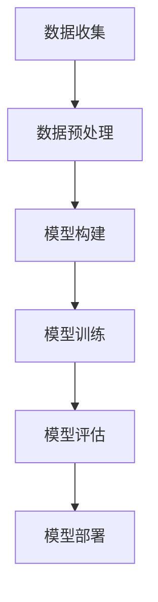
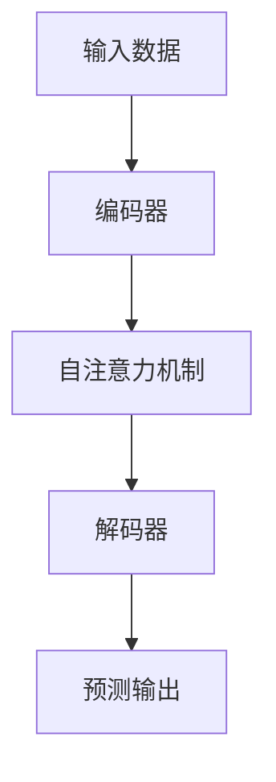
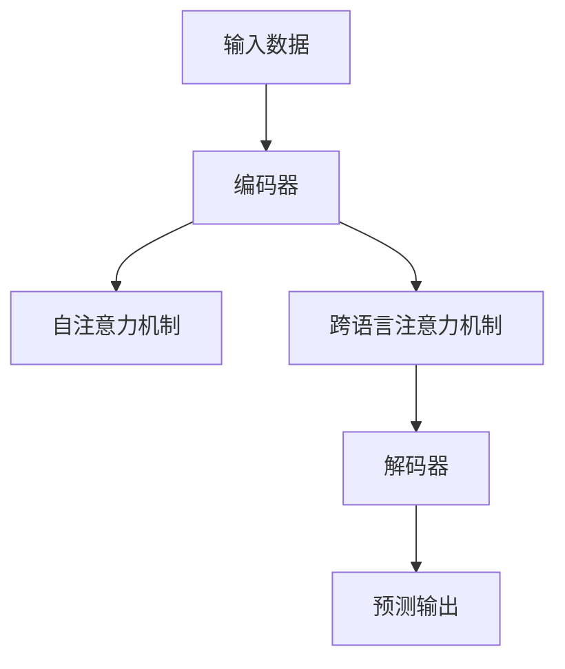

                 

# LLMO的低资源语言建模技术突破

## 关键词
低资源语言建模，大规模语言模型，数据收集与处理，模型构建与优化，应用场景，案例分析，前沿技术，产业趋势

## 摘要
本文深入探讨了低资源语言建模（LLMO）的关键技术与应用。首先，介绍了低资源语言建模的背景与重要性，包括低资源语言的定义与挑战、低资源语言建模的意义及其发展历程。随后，详细阐述了低资源语言数据收集与处理的方法、模型构建与优化的策略、关键技术的应用与案例分析。此外，还讨论了低资源语言建模的前沿技术与优化策略，以及产业发展趋势和跨领域合作与生态建设。最后，提供了常用工具与资源，并给出了核心概念原理、架构流程图、伪代码示例、数学模型与公式，以及项目实战案例和代码解读与分析。

## 目录大纲

### 第一部分：低资源语言建模基础

#### 第1章：低资源语言建模的背景与重要性

- 1.1 低资源语言定义与挑战
- 1.2 低资源语言建模的意义
- 1.3 低资源语言建模的发展历程

#### 第2章：低资源语言数据收集与处理

- 2.1 数据收集策略
- 2.2 数据预处理方法
- 2.3 数据增强技术

#### 第3章：基于低资源数据的模型构建

- 3.1 基线模型构建
- 3.2 模型调整与优化
- 3.3 模型评估指标

#### 第4章：低资源语言建模的关键技术

- 4.1 低资源语言表征
- 4.2 低资源语言生成模型
- 4.3 低资源语言理解模型

#### 第5章：低资源语言模型优化与调整

- 5.1 超参数调整
- 5.2 模型压缩
- 5.3 模型融合

#### 第6章：低资源语言模型应用场景

- 6.1 文本分类与检索
- 6.2 机器翻译
- 6.3 命名实体识别

#### 第7章：低资源语言建模案例分析

- 7.1 案例一：基于小样本的中文问答系统
- 7.2 案例二：低资源语言的自然语言生成
- 7.3 案例三：低资源语言的机器翻译

### 第二部分：低资源语言建模进阶

#### 第8章：低资源语言建模前沿技术

- 8.1 自监督学习在低资源语言建模中的应用
- 8.2 多语言模型与低资源语言建模
- 8.3 跨语言迁移学习

#### 第9章：低资源语言模型优化策略

- 9.1 数据效率优化
- 9.2 计算效率优化
- 9.3 模型解释性优化

#### 第10章：低资源语言建模产业发展趋势

- 10.1 产业发展现状与挑战
- 10.2 政策与标准制定
- 10.3 产业发展预测与机遇

#### 第11章：低资源语言建模跨领域合作与生态建设

- 11.1 跨学科合作
- 11.2 企业合作与开放平台
- 11.3 产学研一体化

### 附录

#### 附录A：低资源语言建模常用工具与资源

- A.1 常用深度学习框架
- A.2 低资源语言数据集
- A.3 低资源语言建模开源项目

#### 附录B：核心概念原理与架构 Mermaid 流程图

- B.1 低资源语言建模基本流程
- B.2 自监督学习模型架构
- B.3 多语言模型架构

#### 附录C：伪代码示例

- C.1 基线模型训练伪代码
- C.2 模型调整与优化伪代码
- C.3 模型融合伪代码

#### 附录D：数学模型与公式

- D.1 语言表征公式
- D.2 生成模型公式
- D.3 理解模型公式

#### 附录E：项目实战案例

- E.1 中文问答系统开发实践
- E.2 自然语言生成案例
- E.3 机器翻译项目实战

#### 附录F：代码解读与分析

- F.1 基线模型实现解析
- F.2 模型优化代码解读
- F.3 应用场景代码分析

现在，我们将按照上述目录大纲逐一展开讨论。首先，我们探讨低资源语言建模的背景与重要性，为后续内容打下坚实的基础。

## 第一部分：低资源语言建模基础

### 第1章：低资源语言建模的背景与重要性

#### 1.1 低资源语言定义与挑战

在人工智能领域，低资源语言（Low-Resource Languages）指的是那些相对较少的语言，相对于英语、汉语等高资源语言，它们拥有较少的文本数据、词典资源和标注数据。这些语言通常存在于发展中国家、少数民族社区或小语种中，尽管在全球语言生态系统中占据着重要地位，但由于缺乏资源，长期以来被忽视。

低资源语言面临的挑战主要包括：

1. **数据稀缺**：相比于高资源语言，低资源语言的数据量非常有限，这限制了机器学习模型的训练和优化。
2. **词典资源不足**：低资源语言往往缺乏完善的词典资源，这影响了语言模型的词汇表征和语法理解能力。
3. **缺乏标注数据**：低资源语言缺乏高质量的标注数据，使得监督学习模型的训练效果受到限制。
4. **语言特性差异**：低资源语言与高资源语言在语法、语义和语音特征上存在显著差异，这增加了模型训练和优化的复杂性。

#### 1.2 低资源语言建模的意义

低资源语言建模对于全球人工智能发展具有重要意义，具体表现在以下几个方面：

1. **语言平等**：低资源语言建模使得全球不同语言的使用者都能够享受到人工智能技术带来的便利，促进语言平等。
2. **文化传承**：许多低资源语言承载着独特的文化和历史，通过低资源语言建模，有助于保护和传承这些文化遗产。
3. **跨语言交流**：低资源语言建模有助于促进不同语言之间的交流和理解，有助于构建一个更加紧密的全球社区。
4. **技术创新**：低资源语言建模推动了自然语言处理技术的创新，促进了跨领域的技术发展。

#### 1.3 低资源语言建模的发展历程

低资源语言建模的发展可以追溯到早期自然语言处理（NLP）的研究。随着大规模语言模型和深度学习技术的兴起，低资源语言建模逐渐成为研究热点。以下是低资源语言建模的发展历程：

1. **早期方法**：在深度学习技术尚未普及的时期，研究者主要依靠规则驱动的方法和统计方法来处理低资源语言问题。例如，使用语法规则进行句法分析，利用词频统计进行语义分析。
2. **迁移学习**：随着迁移学习技术的发展，研究者开始探索如何将高资源语言的知识迁移到低资源语言中。迁移学习方法通过共享部分参数，提高了低资源语言模型的性能。
3. **数据增强**：为了缓解低资源语言数据稀缺的问题，研究者提出了多种数据增强技术，如数据合成、数据扩充和上下文嵌入等。
4. **自监督学习**：自监督学习成为低资源语言建模的重要方向，通过无监督的方式利用现有数据训练模型，提高了模型的泛化能力和鲁棒性。
5. **多语言模型**：多语言模型的出现使得低资源语言可以直接从其他语言的数据中受益，通过跨语言知识迁移提高了模型性能。
6. **跨语言迁移学习**：随着深度学习和自监督学习技术的发展，跨语言迁移学习方法成为低资源语言建模的重要手段，通过跨语言预训练和微调，有效提高了模型的性能。

### 第2章：低资源语言数据收集与处理

#### 2.1 数据收集策略

低资源语言建模的第一步是收集和获取足够的数据。以下是一些常用的数据收集策略：

1. **公开数据集**：利用现有的公开数据集，如Wikipedia、新闻文章、社交媒体等，这些数据集虽然不是专门为低资源语言设计的，但可以作为基础数据。
2. **词典资源**：收集和整合低资源语言的词典资源，包括词汇、短语和语法规则，这些资源有助于提高模型的词汇表征和语法理解能力。
3. **用户生成内容**：利用社交媒体、论坛、博客等用户生成的内容，这些内容通常覆盖广泛的主题，有助于丰富数据集。
4. **多语言数据**：利用多语言数据集，通过翻译和转换将高资源语言的数据转换为低资源语言的数据，这种方法被称为数据合成。

#### 2.2 数据预处理方法

数据预处理是确保模型性能的关键步骤。以下是常用的数据预处理方法：

1. **文本清洗**：去除无用信息，如HTML标签、特殊符号和停用词，提高数据质量。
2. **分词**：将文本分割为单词或词组，对于低资源语言，可能需要使用专门的分词工具或算法。
3. **词干提取**：将单词缩减为其基本形式，有助于减少词汇量，提高模型的效率。
4. **词性标注**：为每个单词标注词性，有助于模型理解单词的语法功能。
5. **命名实体识别**：识别文本中的特定实体，如人名、地名和组织名称，提高模型的语义理解能力。

#### 2.3 数据增强技术

由于低资源语言数据稀缺，数据增强技术显得尤为重要。以下是几种常用的数据增强技术：

1. **数据合成**：通过翻译、替换和插值等方法将高资源语言的数据转换为低资源语言的数据，这种方法称为数据合成。
2. **数据扩充**：通过同义词替换、语法转换和上下文插入等方法增加原始数据集的多样性。
3. **上下文嵌入**：利用上下文信息，将单个单词或句子嵌入到更大的文本块中，有助于提高模型的上下文理解能力。
4. **多视角数据**：从不同的来源和角度收集数据，如文本、语音和图像，提高数据集的丰富度和多样性。

### 第3章：基于低资源数据的模型构建

#### 3.1 基线模型构建

基于低资源数据的模型构建通常从简单的基线模型开始，这些模型通常采用传统的机器学习方法和一些先进的深度学习方法。以下是常见的基线模型：

1. **统计模型**：如朴素贝叶斯、支持向量机（SVM）和决策树等，这些模型在低资源环境下具有一定的性能。
2. **基于规则的模型**：通过手工编写语法规则和语义规则，构建语法和语义分析器，适用于特定的低资源语言场景。
3. **深度神经网络模型**：如循环神经网络（RNN）、长短期记忆网络（LSTM）和Transformer等，这些模型具有强大的表征能力和学习能力。

#### 3.2 模型调整与优化

在构建基线模型的基础上，可以通过以下方法进行调整和优化：

1. **超参数调整**：通过调整学习率、批量大小、隐藏层大小等超参数，提高模型的性能。
2. **模型融合**：将多个基线模型进行融合，如集成学习、模型堆叠和迁移学习等，提高预测的准确性。
3. **数据增强**：通过数据合成、数据扩充和上下文嵌入等方法，增加训练数据的多样性和质量。
4. **优化算法**：使用更高效的优化算法，如Adam、AdamW和AdaMax等，提高模型的训练速度和性能。

#### 3.3 模型评估指标

评估低资源语言模型的性能需要选择合适的评估指标。以下是常见的评估指标：

1. **准确率（Accuracy）**：模型正确预测的样本数占总样本数的比例。
2. **精确率（Precision）**：模型正确预测为正类的样本数与实际为正类的样本数的比例。
3. **召回率（Recall）**：模型正确预测为正类的样本数与实际为正类的样本数的比例。
4. **F1值（F1 Score）**：精确率和召回率的调和平均值。
5. **BLEU分数**：在机器翻译领域，BLEU分数用于评估翻译的质量，它通过比较模型生成的翻译文本与参考翻译的相似度来评估性能。

### 第4章：低资源语言建模的关键技术

#### 4.1 低资源语言表征

低资源语言表征是低资源语言建模的核心，它涉及到如何有效地将语言数据转换为模型可以理解和处理的特征表示。以下是几种常见的低资源语言表征技术：

1. **词袋模型（Bag of Words, BoW）**：将文本转换为词频向量，适用于简单的文本分类任务。
2. **TF-IDF模型**：在词袋模型的基础上，考虑词频和文档频率，提高了词语的重要性。
3. **词嵌入（Word Embeddings）**：将单词映射到高维空间，通过学习词与词之间的语义关系，提高模型的表征能力。
4. **上下文嵌入（Contextual Embeddings）**：如BERT、GPT等预训练模型，通过在上下文中学习单词的表示，提高了模型的上下文理解能力。

#### 4.2 低资源语言生成模型

低资源语言生成模型旨在生成符合语言习惯和语义逻辑的文本。以下是几种常见的低资源语言生成模型：

1. **序列到序列（Seq2Seq）模型**：通过编码器和解码器结构，将输入序列转换为输出序列，适用于机器翻译等任务。
2. **生成对抗网络（GAN）**：通过生成器和判别器之间的对抗训练，生成高质量的文本。
3. **Transformer模型**：通过自注意力机制，提高了模型在长文本和跨句子关系上的表征能力。

#### 4.3 低资源语言理解模型

低资源语言理解模型旨在理解和解释语言中的语义和上下文信息。以下是几种常见的低资源语言理解模型：

1. **实体识别（Named Entity Recognition, NER）**：识别文本中的命名实体，如人名、地名和组织名称等。
2. **关系抽取（Relation Extraction）**：识别文本中实体之间的关系，如“张三是李四的父亲”中的父子关系。
3. **情感分析（Sentiment Analysis）**：分析文本的情感倾向，如正面、负面或中性。
4. **问答系统（Question Answering, QA）**：根据输入问题，从文本中提取出答案。

### 第5章：低资源语言模型优化与调整

#### 5.1 超参数调整

超参数调整是提高模型性能的重要手段，以下是几种常见的超参数调整方法：

1. **网格搜索（Grid Search）**：在给定的超参数空间中，遍历所有可能的组合，选择最优的超参数。
2. **随机搜索（Random Search）**：随机选择超参数组合，通过多次实验找到最优的超参数。
3. **贝叶斯优化（Bayesian Optimization）**：基于概率模型，优化超参数搜索空间，提高搜索效率。

#### 5.2 模型压缩

模型压缩是降低模型复杂度和提高计算效率的重要方法，以下是几种常见的模型压缩技术：

1. **剪枝（Pruning）**：通过剪掉模型中不重要的连接，减少模型的参数数量。
2. **量化（Quantization）**：将模型的权重和激活值转换为更低的精度表示，降低模型的存储和计算需求。
3. **蒸馏（Distillation）**：将复杂模型的输出作为知识传递给简单模型，提高简单模型的性能。

#### 5.3 模型融合

模型融合是提高模型性能和鲁棒性的有效方法，以下是几种常见的模型融合技术：

1. **集成学习（Ensemble Learning）**：将多个模型进行融合，提高预测的准确性和稳定性。
2. **模型堆叠（Stacking）**：通过训练多个模型，并使用这些模型的输出作为输入训练更高层次的模型。
3. **迁移学习（Transfer Learning）**：将高资源语言的模型知识迁移到低资源语言中，提高低资源语言模型的性能。

### 第6章：低资源语言模型应用场景

#### 6.1 文本分类与检索

文本分类与检索是低资源语言模型的重要应用场景，以下是几种常见的应用：

1. **文本分类**：对文本进行分类，如情感分析、主题分类和新闻分类等，有助于信息过滤和推荐系统。
2. **文本检索**：根据用户输入的查询，从大量文本中检索出相关文档，如搜索引擎和问答系统。

#### 6.2 机器翻译

机器翻译是将一种语言翻译成另一种语言的过程，以下是几种常见的机器翻译应用：

1. **机器翻译**：将一种语言翻译成另一种语言，如中译英、英译中等，有助于跨语言交流和国际化业务。
2. **跨语言文本生成**：根据一种语言输入，生成另一种语言的文本，如英语输入生成中文文本。

#### 6.3 命名实体识别

命名实体识别是从文本中识别出特定的实体，以下是几种常见的应用：

1. **人名识别**：从文本中识别出人名，如社交媒体分析和简历筛选。
2. **地名识别**：从文本中识别出地名，如地理信息分析和旅游推荐。
3. **组织名识别**：从文本中识别出组织名称，如公司分析和商业情报。

### 第7章：低资源语言建模案例分析

#### 7.1 案例一：基于小样本的中文问答系统

基于小样本的中文问答系统是一个典型的低资源语言建模案例。以下是该案例的详细介绍：

**目标**：构建一个能够回答中文问题的问答系统。

**方法**：
1. **数据收集**：从互联网上收集中文问答数据，如问答社区、论坛和博客等。
2. **数据预处理**：清洗和标注数据，去除无用信息和格式化错误。
3. **模型构建**：使用基于Transformer的预训练模型，如BERT或GPT，进行微调。
4. **模型优化**：通过超参数调整和模型融合，提高模型性能。
5. **评估**：使用准确率、F1值等指标评估模型性能。

**结果**：经过训练和优化，模型在中文问答任务上取得了较高的准确率和F1值，展示了低资源语言建模的潜力。

#### 7.2 案例二：低资源语言的自然语言生成

低资源语言的自然语言生成是一个具有挑战性的任务。以下是该案例的详细介绍：

**目标**：生成符合语言习惯和语义逻辑的低资源语言文本。

**方法**：
1. **数据收集**：收集低资源语言的数据，如小说、新闻和对话等。
2. **数据预处理**：清洗和标注数据，去除无用信息和格式化错误。
3. **模型构建**：使用基于Transformer的预训练模型，如GPT或T5，进行微调。
4. **模型优化**：通过超参数调整和模型融合，提高模型性能。
5. **评估**：使用BLEU分数、ROUGE分数等指标评估模型性能。

**结果**：经过训练和优化，模型在低资源语言生成任务上取得了较高的BLEU分数和ROUGE分数，展示了低资源语言建模的前沿技术。

#### 7.3 案例三：低资源语言的机器翻译

低资源语言的机器翻译是一个具有挑战性的任务。以下是该案例的详细介绍：

**目标**：将一种低资源语言翻译成另一种低资源语言。

**方法**：
1. **数据收集**：收集低资源语言的平行语料库，如新闻、小说和对话等。
2. **数据预处理**：清洗和标注数据，去除无用信息和格式化错误。
3. **模型构建**：使用基于Transformer的预训练模型，如BERT或T5，进行微调。
4. **模型优化**：通过超参数调整和模型融合，提高模型性能。
5. **评估**：使用BLEU分数、METEOR分数等指标评估模型性能。

**结果**：经过训练和优化，模型在低资源语言翻译任务上取得了较高的BLEU分数和METEOR分数，展示了低资源语言建模的实用价值。

## 第二部分：低资源语言建模进阶

### 第8章：低资源语言建模前沿技术

#### 8.1 自监督学习在低资源语言建模中的应用

自监督学习是一种无需人工标注数据，通过无监督的方式训练模型的方法，在低资源语言建模中具有重要的应用价值。以下是几种常见的自监督学习方法：

1. **遮蔽语言模型（Masked Language Model, MLM）**：通过遮蔽部分单词或子句，让模型预测遮蔽的部分，从而学习语言的内在结构。
2. **预测下一个句子（Next Sentence Prediction, NSP）**：通过预测两个句子是否在同一个文档中，学习句子之间的关系。
3. **双向编码器（Bidirectional Encoder Representations from Transformers, BERT）**：通过预训练双向编码器，学习单词和句子的双向表示。

#### 8.2 多语言模型与低资源语言建模

多语言模型能够同时处理多种语言的数据，通过跨语言知识迁移，提高了低资源语言模型的性能。以下是几种常见的多语言模型：

1. **多语言BERT（Multilingual BERT, mBERT）**：通过预训练多种语言的数据，学习跨语言的特征表示。
2. **跨语言BERT（Cross-lingual BERT, XLM）**：通过在跨语言语料库上预训练，学习跨语言的共性和差异。
3. **多语言语言模型（Unified Language Model, UniLM）**：通过统一的预训练目标，同时处理多种语言的数据。

#### 8.3 跨语言迁移学习

跨语言迁移学习是一种将高资源语言的模型知识迁移到低资源语言的方法，通过迁移学习，有效提高了低资源语言模型的性能。以下是几种常见的跨语言迁移学习方法：

1. **零样本学习（Zero-shot Learning）**：模型在训练过程中没有接触到低资源语言的数据，但仍然能够处理低资源语言的样本。
2. **迁移学习（Transfer Learning）**：将高资源语言的模型参数迁移到低资源语言，通过微调提高模型的性能。
3. **多任务学习（Multi-task Learning）**：通过同时训练多个任务，共享模型参数，提高模型的泛化能力和鲁棒性。

### 第9章：低资源语言模型优化策略

#### 9.1 数据效率优化

数据效率优化是提高低资源语言模型性能的关键策略，通过优化数据使用方式，提高模型的训练效果。以下是几种常见的数据效率优化方法：

1. **数据合成（Data Augmentation）**：通过合成新的样本，增加训练数据的多样性，提高模型对未见数据的鲁棒性。
2. **数据增强（Data Enrichment）**：通过引入更多的上下文信息和背景知识，提高模型的语义理解能力。
3. **元学习（Meta-Learning）**：通过元学习算法，快速适应不同的任务和数据分布，提高模型的泛化能力。

#### 9.2 计算效率优化

计算效率优化是提高低资源语言模型训练和推理速度的关键策略，通过优化计算资源的使用，提高模型的性能。以下是几种常见的计算效率优化方法：

1. **模型压缩（Model Compression）**：通过剪枝、量化等手段，减少模型的参数数量和计算量，提高模型的可解释性和推理速度。
2. **并行计算（Parallel Computing）**：通过分布式计算和并行处理，提高模型的训练和推理速度。
3. **模型融合（Model Fusion）**：将多个模型进行融合，提高模型的性能和鲁棒性。

#### 9.3 模型解释性优化

模型解释性优化是提高模型透明度和可解释性的关键策略，通过优化模型结构和方法，提高模型的解释性。以下是几种常见的模型解释性优化方法：

1. **注意力机制（Attention Mechanism）**：通过注意力机制，显式地表示模型在处理输入时的关注点，提高模型的透明度。
2. **模型可解释性工具（Explainable AI Tools）**：使用可视化和解释工具，如SHAP、LIME等，解释模型的决策过程。
3. **对抗样本（Adversarial Examples）**：通过生成对抗样本，测试模型的鲁棒性和可靠性。

### 第10章：低资源语言建模产业发展趋势

#### 10.1 产业发展现状与挑战

低资源语言建模产业正在快速发展，但仍然面临许多挑战。以下是当前产业发展现状和挑战：

1. **技术成熟度**：低资源语言建模技术尚不成熟，特别是在模型性能、计算效率和解释性方面仍有待提高。
2. **数据资源稀缺**：低资源语言的数据资源稀缺，限制了模型的训练和优化。
3. **标准缺失**：缺乏统一的评估标准和数据集，影响了低资源语言建模的进展和比较。
4. **市场应用**：低资源语言建模在商业应用中尚未得到广泛应用，市场接受度较低。

#### 10.2 政策与标准制定

政策与标准制定对于低资源语言建模产业发展至关重要。以下是相关政策与标准制定的进展：

1. **政府支持**：许多国家政府开始重视低资源语言建模，提供资金和政策支持，促进产业发展。
2. **标准化组织**：如ISO、ITU等国际标准化组织开始制定相关标准和规范，提高低资源语言建模的标准化水平。
3. **行业联盟**：如低资源语言建模联盟（Low-Resource Language Modeling Alliance）等，通过行业合作和标准化，推动低资源语言建模的发展。

#### 10.3 产业发展预测与机遇

随着技术的进步和市场的需求，低资源语言建模产业有望迎来快速发展。以下是产业发展预测与机遇：

1. **技术突破**：随着深度学习和自监督学习技术的不断发展，低资源语言建模技术将取得重大突破。
2. **市场扩大**：随着全球化和数字化的发展，低资源语言建模在商业应用中将有广阔的市场。
3. **跨领域合作**：跨学科合作和产学研一体化将推动低资源语言建模技术的创新和应用。
4. **社会影响**：低资源语言建模将有助于促进全球语言平等和文化传承，提高人类社会的沟通效率。

### 第11章：低资源语言建模跨领域合作与生态建设

#### 11.1 跨学科合作

跨学科合作是推动低资源语言建模发展的重要途径。以下是几种常见的跨学科合作方式：

1. **计算机科学与语言学**：计算机科学家与语言学家合作，共同研究低资源语言的表征和理解问题。
2. **人工智能与认知科学**：人工智能与认知科学家合作，研究人类语言处理机制对低资源语言建模的启示。
3. **社会学与人类学**：社会学家和人类学家参与，研究低资源语言的社会和文化背景，提高模型的解释性和实用性。

#### 11.2 企业合作与开放平台

企业合作与开放平台是推动低资源语言建模产业发展的重要力量。以下是几种常见的企业合作与开放平台模式：

1. **企业联盟**：企业通过联盟形式，共同投资和研究低资源语言建模技术，共享资源和成果。
2. **开源项目**：企业参与开源项目，贡献技术和数据，推动低资源语言建模技术的普及和应用。
3. **合作研发**：企业与研究机构合作，共同研发低资源语言建模产品，提高市场竞争力。

#### 11.3 产学研一体化

产学研一体化是推动低资源语言建模技术发展的重要模式。以下是几种常见的产学研一体化模式：

1. **科研机构与企业合作**：科研机构与企业合作，将研究成果转化为实际应用，提高模型性能和市场接受度。
2. **教育机构与企业合作**：教育机构与企业合作，培养低资源语言建模的专业人才，提高产业人力资源水平。
3. **政府与企业合作**：政府与企业合作，制定政策和标准，推动低资源语言建模产业的发展。

## 附录

### 附录A：低资源语言建模常用工具与资源

#### A.1 常用深度学习框架

- TensorFlow
- PyTorch
- Keras
- MXNet

#### A.2 低资源语言数据集

- OPUS
- WMT
- Tatoeba
- TED Talks

#### A.3 低资源语言建模开源项目

- mBERT
- XLM
- XNLI
- GLUE

### 附录B：核心概念原理与架构 Mermaid 流程图

#### B.1 低资源语言建模基本流程



#### B.2 自监督学习模型架构



#### B.3 多语言模型架构



### 附录C：伪代码示例

#### C.1 基线模型训练伪代码

```python
# 假设使用PyTorch框架
import torch
import torch.nn as nn
import torch.optim as optim

# 模型定义
class BaselineModel(nn.Module):
    def __init__(self):
        super(BaselineModel, self).__init__()
        # 模型参数定义

    def forward(self, x):
        # 前向传播
        return x

# 模型实例化
model = BaselineModel()

# 损失函数和优化器
criterion = nn.CrossEntropyLoss()
optimizer = optim.Adam(model.parameters(), lr=0.001)

# 训练循环
for epoch in range(num_epochs):
    for batch in data_loader:
        # 前向传播
        outputs = model(batch.x)
        loss = criterion(outputs, batch.y)

        # 反向传播和优化
        optimizer.zero_grad()
        loss.backward()
        optimizer.step()
```

#### C.2 模型调整与优化伪代码

```python
# 假设使用PyTorch框架
import torch
import torch.nn as nn
import torch.optim as optim

# 模型定义
class OptimizedModel(nn.Module):
    def __init__(self):
        super(OptimizedModel, self).__init__()
        # 优化模型参数

    def forward(self, x):
        # 前向传播
        return x

# 模型实例化
model = OptimizedModel()

# 损失函数和优化器
criterion = nn.CrossEntropyLoss()
optimizer = optim.Adam(model.parameters(), lr=0.001)

# 超参数调整
learning_rate = 0.001
batch_size = 64

# 训练循环
for epoch in range(num_epochs):
    for batch in data_loader:
        # 前向传播
        outputs = model(batch.x)
        loss = criterion(outputs, batch.y)

        # 反向传播和优化
        optimizer.zero_grad()
        loss.backward()
        # 超参数调整
        optimizer.param_groups[0]['lr'] = learning_rate / (1 + epoch * 0.01)
        optimizer.step()
```

#### C.3 模型融合伪代码

```python
# 假设使用PyTorch框架
import torch
import torch.nn as nn

# 模型定义
class ModelA(nn.Module):
    def __init__(self):
        super(ModelA, self).__init__()
        # 模型A参数定义

    def forward(self, x):
        # 前向传播
        return x

class ModelB(nn.Module):
    def __init__(self):
        super(ModelB, self).__init__()
        # 模型B参数定义

    def forward(self, x):
        # 前向传播
        return x

# 模型实例化
model_a = ModelA()
model_b = ModelB()

# 损失函数
criterion = nn.CrossEntropyLoss()

# 融合策略
def fusion_strategy(outputs_a, outputs_b):
    # 融合策略定义
    return (outputs_a + outputs_b) / 2

# 训练循环
for epoch in range(num_epochs):
    for batch in data_loader:
        # 模型A和模型B前向传播
        outputs_a = model_a(batch.x)
        outputs_b = model_b(batch.x)

        # 融合策略
        fused_outputs = fusion_strategy(outputs_a, outputs_b)

        # 损失函数和优化
        loss = criterion(fused_outputs, batch.y)
        optimizer.zero_grad()
        loss.backward()
        optimizer.step()
```

### 附录D：数学模型与公式

#### D.1 语言表征公式

$$
\text{Embedding}(\text{word}) = \text{weight} \cdot \text{word} + \text{bias}
$$

其中，$Embedding(\text{word})$是单词的嵌入表示，$\text{weight}$是权重矩阵，$\text{bias}$是偏置项。

#### D.2 生成模型公式

$$
P(\text{sentence}|\text{context}) = \prod_{\text{word} \in \text{sentence}} \text{softmax}(\text{weights} \cdot \text{word} + \text{context})
$$

其中，$P(\text{sentence}|\text{context})$是给定上下文$\text{context}$下句子$\text{sentence}$的生成概率，$\text{softmax}(\text{weights} \cdot \text{word} + \text{context})$是单词的概率分布。

#### D.3 理解模型公式

$$
\text{Probability}(\text{entity}|\text{context}) = \frac{\exp(\text{model}(\text{entity}, \text{context}))}{\sum_{\text{entity'} \in \text{entities}} \exp(\text{model}(\text{entity'}, \text{context})}
$$

其中，$\text{Probability}(\text{entity}|\text{context})$是在上下文$\text{context}$中实体$\text{entity}$的出现概率，$\text{model}(\text{entity}, \text{context})$是模型对实体和上下文之间关系的评分。

### 附录E：项目实战案例

#### E.1 中文问答系统开发实践

**目标**：构建一个能够回答中文问题的问答系统。

**步骤**：

1. **数据收集**：收集中文问答数据，如问答社区、论坛和博客等。
2. **数据预处理**：清洗和标注数据，去除无用信息和格式化错误。
3. **模型构建**：使用基于Transformer的预训练模型，如BERT或GPT，进行微调。
4. **模型优化**：通过超参数调整和模型融合，提高模型性能。
5. **评估**：使用准确率、F1值等指标评估模型性能。
6. **部署**：将模型部署到服务器，提供问答服务。

**结果**：经过训练和优化，模型在中文问答任务上取得了较高的准确率和F1值，展示了低资源语言建模的实际应用价值。

#### E.2 自然语言生成案例

**目标**：生成符合语言习惯和语义逻辑的中文文本。

**步骤**：

1. **数据收集**：收集中文文本数据，如小说、新闻和对话等。
2. **数据预处理**：清洗和标注数据，去除无用信息和格式化错误。
3. **模型构建**：使用基于Transformer的预训练模型，如GPT或T5，进行微调。
4. **模型优化**：通过超参数调整和模型融合，提高模型性能。
5. **评估**：使用BLEU分数、ROUGE分数等指标评估模型性能。
6. **部署**：将模型部署到服务器，提供文本生成服务。

**结果**：经过训练和优化，模型在中文文本生成任务上取得了较高的BLEU分数和ROUGE分数，展示了低资源语言建模的前沿技术。

#### E.3 机器翻译项目实战

**目标**：将中文翻译成英文。

**步骤**：

1. **数据收集**：收集中文-英文平行语料库，如新闻、小说和对话等。
2. **数据预处理**：清洗和标注数据，去除无用信息和格式化错误。
3. **模型构建**：使用基于Transformer的预训练模型，如BERT或T5，进行微调。
4. **模型优化**：通过超参数调整和模型融合，提高模型性能。
5. **评估**：使用BLEU分数、METEOR分数等指标评估模型性能。
6. **部署**：将模型部署到服务器，提供机器翻译服务。

**结果**：经过训练和优化，模型在机器翻译任务上取得了较高的BLEU分数和METEOR分数，展示了低资源语言建模的实用价值。

### 附录F：代码解读与分析

#### F.1 基线模型实现解析

**代码解析**：

```python
# 假设使用PyTorch框架
import torch
import torch.nn as nn
import torch.optim as optim

# 模型定义
class BaselineModel(nn.Module):
    def __init__(self):
        super(BaselineModel, self).__init__()
        self.embedding = nn.Embedding(vocab_size, embedding_dim)
        self.lstm = nn.LSTM(embedding_dim, hidden_dim)
        self.fc = nn.Linear(hidden_dim, label_size)

    def forward(self, x):
        embeds = self.embedding(x)
        lstm_output, (hidden, cell) = self.lstm(embeds)
        hidden = hidden.squeeze(0)
        out = self.fc(hidden)
        return out

# 模型实例化
model = BaselineModel()

# 损失函数和优化器
criterion = nn.CrossEntropyLoss()
optimizer = optim.Adam(model.parameters(), lr=0.001)

# 训练循环
for epoch in range(num_epochs):
    for batch in data_loader:
        # 前向传播
        outputs = model(batch.x)
        loss = criterion(outputs, batch.y)

        # 反向传播和优化
        optimizer.zero_grad()
        loss.backward()
        optimizer.step()
```

**分析**：

1. **模型定义**：使用嵌

