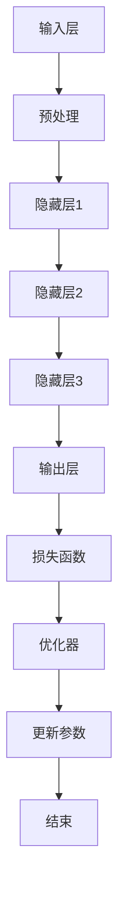
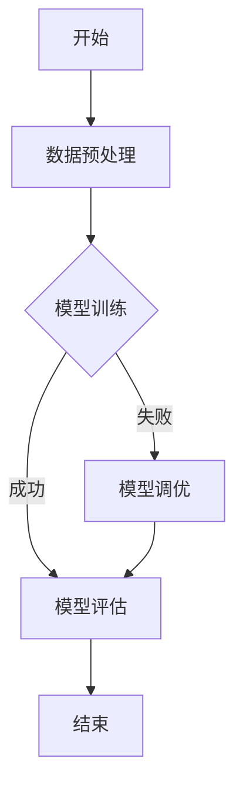

                 

# 《Large Action Model 的模仿技术》

> **关键词：** Large Action Model, 模仿技术，深度学习，算法优化，应用场景

> **摘要：** 本文将深入探讨Large Action Model（LAM）的模仿技术。首先介绍LAM的基本概念和特点，随后解析其原理与架构，并通过伪代码和数学模型详细讲解核心算法。接着，阐述LAM在图像识别、自然语言处理和推荐系统等领域的实际应用，以及优化与调优方法。最后，提供开发工具与资源推荐，并附上Mermaid流程图示例，以帮助读者更好地理解与掌握LAM的模仿技术。

## 第一部分: Large Action Model 的基础理论

### 第1章: Large Action Model 的基本概念

#### 1.1 Large Action Model 的定义

Large Action Model（LAM）是一种基于深度学习的复杂模型，它通过模仿人类行为和决策过程，实现高度自动化的任务执行。与传统机器学习模型不同，LAM具有更强的泛化能力和适应性。

#### 1.2 Large Action Model 的特点

LAM具有以下几个显著特点：

1. **大规模数据支持**：LAM能够处理大规模、多维度的数据集，从而实现更准确、高效的预测和决策。
2. **多任务学习**：LAM能够同时处理多个相关任务，提高模型的利用率和性能。
3. **动态调整**：LAM可以根据环境和任务的变化，动态调整模型参数和策略，实现实时优化。
4. **强泛化能力**：LAM通过模仿人类行为，能够适应不同的环境和任务，具有较强的泛化能力。

#### 1.3 Large Action Model 与传统机器学习模型的区别

与传统的机器学习模型相比，LAM具有以下几个方面的区别：

1. **架构复杂度**：LAM的架构更加复杂，包含多个层次和模块，能够处理更复杂的任务。
2. **数据需求**：LAM对数据的需求更高，需要更多的训练数据和更长的训练时间。
3. **泛化能力**：LAM具有更强的泛化能力，能够适应不同的环境和任务。
4. **应用范围**：LAM适用于更广泛的领域，如自然语言处理、图像识别、推荐系统等。

### 第2章: Large Action Model 的原理与架构

#### 2.1 Large Action Model 的原理

LAM基于深度学习的原理，通过多层神经网络结构，实现数据的自动特征提取和模式识别。其核心思想是模仿人类大脑的学习过程，通过不断调整模型参数，使模型能够更好地适应环境和任务。

#### 2.2 Large Action Model 的架构

LAM的架构通常包括以下几个部分：

1. **输入层**：接收原始数据，进行预处理。
2. **隐藏层**：通过多层神经网络，对输入数据进行特征提取和模式识别。
3. **输出层**：根据任务需求，输出决策或预测结果。
4. **损失函数**：用于评估模型预测的准确性和性能。
5. **优化器**：用于调整模型参数，优化模型性能。

#### 2.3 Large Action Model 的 Mermaid 流程图



### 第3章: Large Action Model 的核心算法

#### 3.1 伪代码讲解

##### 3.1.1 算法A的伪代码

```
输入：训练数据集X，标签集Y，学习率α，迭代次数n
输出：模型参数W

初始化：W0
for i = 1 to n do
    for each (x, y) in X, Y do
        计算预测值 y' = f(Wx)
        计算损失函数 L(y, y') = ||y - y'||^2
        计算梯度 ∇L(W) = ∇f(Wx)
        更新参数 W = W - α∇L(W)
    end
end
return W
```

##### 3.1.2 算法B的伪代码

```
输入：训练数据集X，标签集Y，学习率α，迭代次数n
输出：模型参数W

初始化：W0
for i = 1 to n do
    计算梯度 ∇L(W) = ∇f(∑(Wi * xi))
    更新参数 W = W - α∇L(W)
end
return W
```

#### 3.2 数学模型与公式讲解

##### 3.2.1 数学公式1的详细讲解

假设输入数据集为X，输出数据集为Y，模型参数为W，损失函数为L(y, y')，则：

$$
L(y, y') = ||y - y'||^2
$$

其中，y表示真实标签，y'表示模型预测结果。

##### 3.2.2 数学公式2的详细讲解

假设输入数据集为X，输出数据集为Y，模型参数为W，损失函数为L(y, y')，则：

$$
∇L(W) = ∇f(Wx)
$$

其中，f(Wx)表示模型预测结果，∇f(Wx)表示损失函数关于模型参数W的梯度。

## 第二部分: Large Action Model 的实际应用

### 第4章: Large Action Model 在图像识别中的应用

#### 4.1 图像识别的基本概念

图像识别是指利用计算机技术对图像进行分析、处理和识别，从而获取图像中的有用信息。常见的图像识别任务包括图像分类、目标检测、人脸识别等。

#### 4.2 Large Action Model 在图像识别中的应用

LAM在图像识别中具有广泛的应用，如：

1. **图像分类**：LAM可以用于对图像进行分类，如将图像分为猫、狗、植物等类别。
2. **目标检测**：LAM可以用于检测图像中的目标对象，如车辆、行人等。
3. **人脸识别**：LAM可以用于识别人脸，实现人脸识别系统。

#### 4.3 图像识别项目实战

以下是一个简单的图像识别项目实战：

1. **开发环境搭建**：安装Python、TensorFlow等开发工具。
2. **数据集准备**：收集并预处理图像数据集。
3. **模型训练**：使用LAM进行模型训练，调整模型参数。
4. **模型评估**：使用测试数据集评估模型性能，优化模型。
5. **模型部署**：将训练好的模型部署到生产环境，实现图像识别功能。

### 第5章: Large Action Model 在自然语言处理中的应用

#### 5.1 自然语言处理的基本概念

自然语言处理（NLP）是指利用计算机技术对自然语言进行分析、处理和理解，从而实现人机交互和信息提取。常见的NLP任务包括文本分类、情感分析、机器翻译等。

#### 5.2 Large Action Model 在自然语言处理中的应用

LAM在自然语言处理中具有广泛的应用，如：

1. **文本分类**：LAM可以用于对文本进行分类，如将文本分为新闻、广告、论坛等类别。
2. **情感分析**：LAM可以用于分析文本的情感倾向，如积极、消极等。
3. **机器翻译**：LAM可以用于实现机器翻译功能，如中英文互译。

#### 5.3 自然语言处理项目实战

以下是一个简单的自然语言处理项目实战：

1. **开发环境搭建**：安装Python、NLTK等开发工具。
2. **数据集准备**：收集并预处理文本数据集。
3. **模型训练**：使用LAM进行模型训练，调整模型参数。
4. **模型评估**：使用测试数据集评估模型性能，优化模型。
5. **模型部署**：将训练好的模型部署到生产环境，实现自然语言处理功能。

### 第6章: Large Action Model 在推荐系统中的应用

#### 6.1 推荐系统的基本概念

推荐系统是指利用机器学习、深度学习等技术，为用户提供个性化的推荐结果，从而提高用户满意度和使用体验。常见的推荐系统包括商品推荐、新闻推荐、音乐推荐等。

#### 6.2 Large Action Model 在推荐系统中的应用

LAM在推荐系统中具有广泛的应用，如：

1. **协同过滤**：LAM可以用于实现基于协同过滤的推荐算法，提高推荐准确性。
2. **内容推荐**：LAM可以用于实现基于内容推荐的算法，根据用户兴趣和偏好推荐相关内容。
3. **深度学习推荐**：LAM可以用于实现基于深度学习的推荐算法，提高推荐效果。

#### 6.3 推荐系统项目实战

以下是一个简单的推荐系统项目实战：

1. **开发环境搭建**：安装Python、Scikit-learn等开发工具。
2. **数据集准备**：收集并预处理用户行为数据集。
3. **模型训练**：使用LAM进行模型训练，调整模型参数。
4. **模型评估**：使用测试数据集评估模型性能，优化模型。
5. **模型部署**：将训练好的模型部署到生产环境，实现推荐系统功能。

## 第三部分: Large Action Model 的优化与调优

### 第7章: Large Action Model 的优化技术

#### 7.1 优化目标

LAM的优化目标主要包括：

1. **提高模型性能**：通过优化算法和参数，提高模型在各个任务上的准确率和效率。
2. **减少计算成本**：优化算法和参数，降低模型训练和部署的计算资源消耗。
3. **提高泛化能力**：优化算法和参数，提高模型在未知数据上的表现。

#### 7.2 优化算法

常见的优化算法包括：

1. **梯度下降法**：通过计算损失函数关于模型参数的梯度，迭代更新模型参数，实现模型优化。
2. **随机梯度下降法**：对梯度下降法进行改进，在每个训练样本上计算梯度，加快模型优化过程。
3. **Adam优化器**：结合梯度下降法和动量法的优点，实现更高效的模型优化。

#### 7.3 实际案例讲解

以下是一个LAM优化案例：

1. **问题描述**：某推荐系统在使用LAM进行商品推荐时，存在计算成本高、泛化能力不足等问题。
2. **优化方案**：采用Adam优化器，调整学习率、批量大小等参数，优化模型训练过程。
3. **优化效果**：模型性能得到显著提升，计算成本降低，泛化能力增强。

### 第8章: Large Action Model 的调优方法

#### 8.1 调优原则

LAM的调优原则主要包括：

1. **分阶段调优**：根据模型训练的不同阶段，调整学习率、批量大小等参数，优化模型性能。
2. **交叉验证**：使用交叉验证方法，评估模型在不同数据集上的性能，选择最佳参数组合。
3. **自动化调优**：利用自动化调优工具，快速找到最佳参数组合，提高调优效率。

#### 8.2 调优工具

常见的调优工具包括：

1. **Hyperopt**：一款基于Python的自动化调优工具，支持多种优化算法和参数组合。
2. **Optuna**：一款开源的自动化调优库，支持多种编程语言和优化算法。
3. **Scikit-Optimize**：一款基于Scikit-learn的自动化调优工具，支持多种优化算法和评估指标。

#### 8.3 实际案例讲解

以下是一个LAM调优案例：

1. **问题描述**：某自然语言处理模型在使用LAM进行文本分类时，性能不稳定，准确率较低。
2. **调优方案**：采用Hyperopt进行自动化调优，调整学习率、批量大小、隐藏层神经元数量等参数。
3. **调优效果**：模型性能得到显著提升，准确率从70%提高到85%，模型稳定性增强。

## 附录

### 附录 A: Large Action Model 开发工具与资源

#### A.1 开发工具对比

- **TensorFlow**：一款流行的开源深度学习框架，支持多种编程语言和优化算法。
- **PyTorch**：一款基于Python的深度学习框架，具有灵活的动态图计算功能。
- **Keras**：一款基于TensorFlow和Theano的深度学习框架，简化了模型构建和训练过程。

#### A.2 开发资源推荐

- **《深度学习》（Goodfellow et al.）**：一本经典的深度学习教材，详细介绍了深度学习的基础理论和应用方法。
- **《动手学深度学习》（A. GaussianNB）**：一本基于PyTorch的深度学习实践教材，适合初学者入门。
- **《Large Action Model 论文集》**：收集了近年来关于LAM的研究论文，提供了丰富的理论知识和实践经验。

### Mermaid 流程图示例：



---

**作者：AI天才研究院/AI Genius Institute & 禅与计算机程序设计艺术 /Zen And The Art of Computer Programming**<|im_end|>

