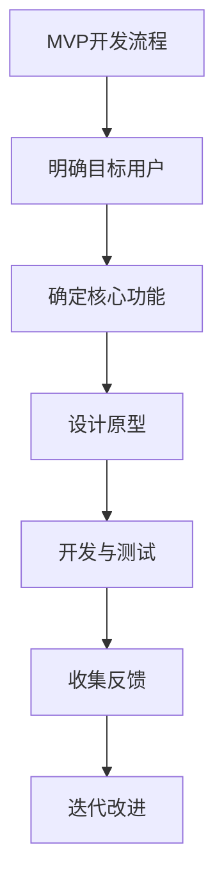

                 

# 《MVP开发指南：快速验证创业idea的有效方法》

> **关键词：** MVP, 创业, 验证, 快速原型, 用户反馈

> **摘要：** 本指南将详细探讨MVP（最小可行产品）的概念、构建步骤和如何通过MVP快速验证创业idea的有效性。我们将提供实用的方法、技巧和案例分析，帮助创业者实现从概念到商业化的成功转型。

## 目录大纲

### 第一部分：MVP（最小可行产品）基础

#### 第1章：MVP概念与重要性

1.1 MVP的定义

1.2 MVP的重要性

1.3 MVP与传统产品的对比

#### 第2章：构建MVP的步骤

2.1 明确目标用户

2.2 确定核心功能

2.3 设计原型

2.4 开发与测试

2.5 收集反馈

### 第二部分：快速验证创业idea

#### 第3章：验证创业idea的方法

3.1 市场调研

3.2 用户访谈

3.3 竞争分析

3.4 调查问卷

#### 第4章：快速原型开发

4.1 快速原型开发工具介绍

4.2 快速原型设计流程

4.3 原型测试与迭代

#### 第5章：获取早期用户

5.1 用户获取渠道

5.2 社交媒体营销

5.3 用户增长策略

#### 第6章：数据驱动决策

6.1 数据分析工具与技巧

6.2 用户行为分析

6.3 数据驱动的产品决策

### 第三部分：MVP开发的实践技巧

#### 第7章：项目管理与团队协作

7.1 项目管理工具

7.2 团队协作与沟通

7.3 时间管理与进度跟踪

#### 第8章：降低开发成本

8.1 代码复用与优化

8.2 第三方服务与API利用

8.3 成本效益分析

#### 第9章：MVP的扩展与商业化

9.1 功能扩展策略

9.2 商业模式探索

9.3 从MVP到商业产品的过渡

### 附录

#### 附录A：MVP开发资源与工具

A.1 开发资源介绍

A.2 开发工具推荐

#### 附录B：MVP开发实例分析

B.1 实例一：产品A的MVP开发过程

B.2 实例二：产品B的MVP验证与迭代

### Mermaid流程图示例



### 伪代码示例

```pseudo
function validate_idea(user_feedback) {
    if (user_feedback.satisfied > 50%) {
        return "Idea validated successfully."
    } else {
        return "Idea needs further refinement."
    }
}
```

### 数学公式示例

$$
\text{MVP价值函数} = f(\text{功能集}, \text{用户需求}, \text{开发成本})
$$

其中：
$$
f(\text{功能集}, \text{用户需求}, \text{开发成本}) = \text{最小化开发成本的同时，最大化用户价值}
$$

### 代码解读与分析示例

```python
# 代码示例：用户注册功能
def register_user(username, email, password):
    """
    用户注册功能实现。

    参数：
    username（字符串）：用户名。
    email（字符串）：邮箱地址。
    password（字符串）：密码。

    返回值：
    boolean：注册成功返回True，失败返回False。
    """
    
    # 校验用户名是否已存在
    if is_username_exists(username):
        print("用户名已存在，注册失败。")
        return False
    
    # 校验邮箱格式是否正确
    if not is_valid_email(email):
        print("邮箱格式不正确，注册失败。")
        return False
    
    # 创建新用户记录
    user_record = {
        'username': username,
        'email': email,
        'password': password
    }
    
    # 存储用户记录到数据库
    if save_user_to_db(user_record):
        print("注册成功。")
        return True
    else:
        print("注册失败，数据库操作错误。")
        return False

# 辅助函数：校验用户名是否存在
def is_username_exists(username):
    # 此处应为数据库查询操作
    return False

# 辅助函数：校验邮箱格式是否正确
def is_valid_email(email):
    # 此处应为邮箱格式校验逻辑
    return True

# 辅助函数：保存用户记录到数据库
def save_user_to_db(user_record):
    # 此处应为数据库插入操作
    return True
```

接下来，我们将逐步深入探讨MVP的概念、构建步骤、验证方法以及实践技巧，帮助您更好地理解和应用MVP来验证您的创业idea。

## 第一部分：MVP（最小可行产品）基础

### 第1章：MVP概念与重要性

#### 1.1 MVP的定义

MVP（最小可行产品，Minimum Viable Product）是一种产品设计策略，旨在构建一个具有核心功能的最简化产品版本，以便快速推向市场并获得用户反馈。它的核心在于“最小化”和“可行”两个关键词。

**最小化**：意味着产品不包含所有可能的功能，只保留核心功能。这些核心功能是为了解决用户最关键的问题，实现产品的基本价值。

**可行**：意味着这个最小化版本的产品在技术上可以实现，并且可以在市场上找到目标用户。它不需要完美，只需要足够好，能够满足用户的基本需求。

#### 1.2 MVP的重要性

1. **降低风险**：通过构建MVP，创业者在产品发布前就能够验证市场需求，减少盲目投入带来的风险。
2. **节约成本**：MVP的开发成本远低于全面功能的产品，有助于节省资源和时间。
3. **快速迭代**：MVP的构建和反馈周期较短，有利于产品快速迭代和优化。
4. **用户反馈**：MVP可以直接获取用户的真实反馈，帮助产品更好地满足用户需求。
5. **聚焦核心价值**：MVP强调核心功能的实现，有助于团队聚焦产品核心价值，避免功能过度膨胀。

#### 1.3 MVP与传统产品的对比

| 特点 | MVP | 传统产品 |
| --- | --- | --- |
| 功能完整性 | 最简化，只包含核心功能 | 功能全面，包含所有潜在需求 |
| 开发周期 | 短，快速迭代 | 长，逐步完善 |
| 成本投入 | 低，节约资源 | 高，投资大 |
| 用户反馈 | 及时，直接获取 | 间接，市场调研 |
| 风险控制 | 高效，风险可控 | 低效，风险较大 |

通过以上对比，我们可以看出MVP在初创阶段的优势显著，它是一种高效、低风险的产品开发策略。

### 第2章：构建MVP的步骤

#### 2.1 明确目标用户

构建MVP的第一步是明确目标用户。这包括了解他们的需求、行为和偏好，以便为产品定义明确的市场细分。

1. **市场调研**：通过调查问卷、用户访谈和市场数据分析，收集目标用户的相关信息。
2. **用户画像**：创建用户画像，包括用户的年龄、性别、职业、使用习惯等特征。
3. **需求分析**：分析用户的需求，找出最迫切需要解决的核心问题。

#### 2.2 确定核心功能

确定了目标用户后，下一步是确定MVP的核心功能。

1. **核心问题解决**：选择能够解决用户核心问题的功能，这些功能是产品成功的关键。
2. **功能优先级排序**：根据用户需求的重要性，对功能进行优先级排序，确保最关键的功能得到优先实现。
3. **最小化功能集**：只实现核心功能，避免不必要的复杂性和功能冗余。

#### 2.3 设计原型

设计原型是构建MVP的关键步骤，它可以帮助团队验证产品的功能和用户体验。

1. **低保真原型**：使用低保真原型工具（如纸笔草图、线框图等）快速构建原型，不需要考虑细节。
2. **高保真原型**：在低保真原型的基础上，添加更多的设计元素和交互效果，实现高保真原型。
3. **用户测试**：通过用户测试，收集用户对原型的反馈，进行迭代优化。

#### 2.4 开发与测试

原型设计完成后，进入开发与测试阶段。

1. **快速开发**：采用敏捷开发方法，快速构建MVP，确保尽快推向市场。
2. **功能测试**：对核心功能进行详细测试，确保产品在技术上能够正常工作。
3. **用户测试**：将MVP提供给目标用户进行测试，收集反馈，进行迭代改进。

#### 2.5 收集反馈

MVP推向市场后，收集用户反馈是至关重要的。

1. **反馈渠道**：建立多种反馈渠道，如用户调查、在线问卷、用户论坛等，方便用户提出意见和建议。
2. **数据分析**：分析用户反馈，找出产品的问题和改进点。
3. **迭代改进**：根据用户反馈，对MVP进行迭代优化，不断提高产品质量和用户体验。

通过以上步骤，创业者可以构建一个有效的MVP，快速验证创业idea的有效性，为后续的产品开发奠定坚实基础。

## 第二部分：快速验证创业idea

### 第3章：验证创业idea的方法

验证创业idea是创业过程中至关重要的一步，它可以帮助创业者确定市场需求和用户接受度。以下是几种常见的验证方法：

#### 3.1 市场调研

市场调研是验证创业idea的第一步，通过收集和分析市场数据，了解目标市场的现状和趋势。

1. **定性与定量研究**：结合定性和定量方法，获取全面的市场信息。
2. **用户访谈**：与潜在用户进行一对一访谈，了解他们的需求和痛点。
3. **竞争对手分析**：分析竞争对手的产品和市场表现，找出差异化和竞争优势。

#### 3.2 用户访谈

用户访谈是一种直接获取用户反馈的方法，可以帮助创业者深入了解用户的需求和期望。

1. **访谈对象选择**：选择具有代表性的用户，如早期采用者和潜在用户。
2. **访谈内容设计**：围绕用户需求、使用习惯和潜在问题展开访谈。
3. **数据整理与分析**：记录访谈内容，整理用户反馈，进行数据分析。

#### 3.3 竞争分析

竞争分析可以帮助创业者了解市场格局和竞争对手的优势与不足，从而找到自身的产品定位和差异化策略。

1. **产品比较**：比较竞争对手的产品特性、功能和服务。
2. **市场占有率**：分析竞争对手在市场上的地位和占有率。
3. **用户评价**：收集用户对竞争对手产品的评价和反馈。

#### 3.4 调查问卷

调查问卷是一种高效的数据收集方法，可以通过在线平台或社交媒体快速获取大量用户的反馈。

1. **问卷设计**：设计简洁、明确的问卷，确保用户能够快速理解并回答问题。
2. **样本选择**：选择具有代表性的样本，确保数据的有效性。
3. **数据分析**：对问卷结果进行统计分析，提取关键信息。

通过以上方法，创业者可以全面了解市场环境和用户需求，从而验证创业idea的可行性。

### 第4章：快速原型开发

快速原型开发是验证创业idea的关键步骤，它可以帮助团队在短时间内构建一个功能完整、易于迭代的产品原型。以下是快速原型开发的关键环节：

#### 4.1 快速原型开发工具介绍

快速原型开发工具可以帮助团队高效地创建原型，以下是一些常用的工具：

1. **Sketch**：一款强大的UI设计工具，支持矢量绘图和原型设计。
2. **Figma**：一款基于浏览器的协作设计工具，支持实时协作和原型设计。
3. **Adobe XD**：一款专业的用户体验设计工具，支持从概念到高保真原型的一站式服务。
4. **Axure RP**：一款功能丰富的原型设计工具，支持交互设计和原型验证。

#### 4.2 快速原型设计流程

快速原型设计流程可以分为以下几个步骤：

1. **需求分析**：明确产品需求，确定原型设计的目标和范围。
2. **界面设计**：根据需求，设计产品界面和交互流程。
3. **原型制作**：使用原型开发工具，将设计稿转化为交互原型。
4. **用户测试**：将原型展示给用户，收集反馈，进行迭代优化。

#### 4.3 原型测试与迭代

原型测试是验证原型设计和功能实现的关键环节，以下是一些建议：

1. **测试目标**：明确测试的目标，如用户体验、功能实现等。
2. **测试场景**：设计具有代表性的测试场景，模拟用户使用过程。
3. **数据收集**：记录用户在测试过程中的行为和反馈，进行分析。
4. **迭代优化**：根据测试结果，对原型进行迭代优化，提高产品质量和用户体验。

通过快速原型开发，团队可以在短时间内验证创业idea，为后续的产品开发提供重要依据。

### 第5章：获取早期用户

获取早期用户是验证创业idea的关键步骤，早期用户的反馈和参与对于产品的发展和成功至关重要。以下是一些获取早期用户的方法：

#### 5.1 用户获取渠道

选择合适的用户获取渠道可以帮助团队快速找到目标用户。以下是一些常用的渠道：

1. **社交媒体**：利用社交媒体平台（如微博、微信、Facebook等）推广产品，吸引潜在用户。
2. **博客和论坛**：在专业博客和论坛发布产品相关信息，吸引行业用户。
3. **线下活动**：参加行业会议、展览等活动，与潜在用户面对面交流。
4. **邮件营销**：通过邮件发送产品介绍和优惠信息，吸引潜在用户。

#### 5.2 社交媒体营销

社交媒体营销是一种高效的获取早期用户的方法，以下是一些技巧：

1. **内容策略**：发布有价值、有趣、与用户相关的内容，吸引关注和互动。
2. **互动营销**：与用户互动，回复评论和私信，建立良好的用户关系。
3. **广告投放**：根据目标用户特征，进行精准的广告投放，提高曝光率。
4. **KOL合作**：与行业意见领袖合作，借助他们的影响力和粉丝基础推广产品。

#### 5.3 用户增长策略

用户增长策略是持续获取新用户、提高用户留存率和活跃度的关键。以下是一些建议：

1. **用户体验优化**：不断提升产品功能和用户体验，提高用户满意度。
2. **用户反馈机制**：建立完善的用户反馈机制，及时收集和处理用户反馈。
3. **推荐奖励**：设置推荐奖励机制，鼓励现有用户推荐新用户。
4. **社区运营**：建立用户社区，提供交流平台，增加用户粘性。
5. **数据分析**：通过数据分析，了解用户行为和需求，优化产品和服务。

通过以上方法，团队可以有效地获取早期用户，为产品的发展和成功奠定基础。

### 第6章：数据驱动决策

在产品开发过程中，数据驱动决策是一种高效的方法，它可以帮助团队根据用户行为和反馈做出明智的决策。以下是实现数据驱动决策的关键步骤：

#### 6.1 数据分析工具与技巧

选择合适的数据分析工具和技巧是数据驱动决策的基础，以下是一些建议：

1. **Google Analytics**：一款强大的网站分析工具，可以跟踪用户行为和转化率。
2. **Mixpanel**：一款专注于用户行为分析的工具，提供丰富的用户行为追踪和报告功能。
3. **Tableau**：一款数据可视化工具，可以帮助团队直观地理解数据。
4. **SQL**：学习SQL，掌握数据库查询技能，可以从数据中提取有用的信息。
5. **Python**：使用Python进行数据处理和分析，可以自定义各种分析模型。

#### 6.2 用户行为分析

用户行为分析是数据驱动决策的核心，以下是一些关键指标和策略：

1. **用户留存率**：衡量用户在一段时间内持续使用产品的比例，反映产品的粘性。
2. **用户活跃度**：衡量用户在产品上的互动频率和深度，反映产品的用户参与度。
3. **转化率**：衡量用户完成特定目标（如注册、购买等）的比例，反映产品的引导效果。
4. **用户流失率**：衡量用户在一段时间内停止使用产品的比例，反映产品存在的问题。
5. **策略优化**：根据用户行为分析结果，不断优化产品功能和用户体验，提高用户满意度。

#### 6.3 数据驱动的产品决策

数据驱动的产品决策可以帮助团队做出更明智的决策，以下是一些建议：

1. **需求验证**：通过数据分析，验证用户需求和市场趋势，确保产品开发方向正确。
2. **功能优化**：根据用户反馈和数据指标，不断优化产品功能和用户体验。
3. **市场定位**：通过数据了解目标用户特征和偏好，制定有效的市场定位策略。
4. **资源分配**：根据数据指标，合理分配资源和预算，提高投资回报率。
5. **风险控制**：通过数据预测和风险分析，及时发现和应对潜在风险。

通过数据驱动决策，团队可以更好地理解用户需求和市场动态，提高产品的竞争力和成功率。

## 第三部分：MVP开发的实践技巧

### 第7章：项目管理与团队协作

MVP开发涉及多个环节，需要高效的项目管理和团队协作。以下是一些实践技巧：

#### 7.1 项目管理工具

选择合适的项目管理工具可以提高团队的工作效率，以下是一些常用的工具：

1. **Trello**：一款基于看板的项目管理工具，适用于任务分配和进度跟踪。
2. **Jira**：一款功能强大的敏捷项目管理工具，提供任务跟踪、敏捷迭代和报告功能。
3. **Asana**：一款灵活的项目管理工具，支持任务分配、进度跟踪和报告。
4. **Slack**：一款团队沟通工具，支持实时聊天、文件共享和协作。

#### 7.2 团队协作与沟通

团队协作和沟通是MVP开发成功的关键，以下是一些建议：

1. **明确目标**：确保团队成员对项目目标有清晰的认识，统一行动方向。
2. **角色分工**：明确团队成员的角色和职责，确保每个人都能发挥最大的作用。
3. **定期会议**：定期举行团队会议，讨论项目进展、问题和解决方案。
4. **透明沟通**：保持沟通渠道畅通，及时分享信息和反馈，避免信息孤岛。

#### 7.3 时间管理与进度跟踪

时间管理和进度跟踪是项目成功的关键，以下是一些建议：

1. **任务分配**：合理分配任务，确保每个成员都有明确的任务和时间表。
2. **进度跟踪**：定期检查项目进度，确保任务按时完成。
3. **风险管理**：识别和应对潜在的风险，确保项目按计划进行。
4. **调整计划**：根据实际情况调整项目计划，确保项目按时、按质完成。

通过以上实践技巧，团队可以高效地进行MVP开发，提高项目的成功率。

### 第8章：降低开发成本

在MVP开发过程中，降低开发成本是关键，以下是一些有效的策略：

#### 8.1 代码复用与优化

1. **代码复用**：通过模块化和组件化，实现代码的复用，减少重复工作。
2. **代码优化**：优化代码结构，提高代码的可读性和可维护性，减少维护成本。

#### 8.2 第三方服务与API利用

1. **第三方服务**：利用第三方服务（如云服务、支付服务等），减少开发和维护成本。
2. **API利用**：通过API调用第三方服务，实现功能扩展，避免从头开始开发。

#### 8.3 成本效益分析

1. **成本效益分析**：评估不同方案的投入产出比，选择成本效益最高的方案。
2. **资源优化**：合理配置资源，避免资源浪费，提高资源利用效率。

通过以上策略，团队可以降低MVP开发成本，提高项目的经济效益。

### 第9章：MVP的扩展与商业化

MVP的成功验证了创业idea的有效性，接下来需要将MVP扩展为完整的商业产品，并进行商业化运营。以下是一些关键步骤：

#### 9.1 功能扩展策略

1. **核心功能强化**：在MVP基础上，进一步优化和强化核心功能，提高用户体验。
2. **功能拓展**：根据用户反馈和市场需求，逐步增加新的功能模块。

#### 9.2 商业模式探索

1. **商业模式设计**：根据产品特点和市场环境，设计适合的商业模式。
2. **盈利模式分析**：分析不同盈利模式的优势和可行性，选择最佳盈利模式。

#### 9.3 从MVP到商业产品的过渡

1. **产品迭代**：在MVP基础上，进行多轮迭代，逐步完善产品功能和用户体验。
2. **市场推广**：制定有效的市场推广策略，提高产品知名度和用户覆盖。
3. **商业化运营**：建立商业化运营团队，确保产品顺利推向市场，实现商业化目标。

通过以上步骤，创业者可以将MVP成功扩展为商业产品，实现商业价值。

### 附录

#### 附录A：MVP开发资源与工具

**A.1 开发资源介绍**

- **开发文档**：提供详细的开发文档，包括技术规范、设计文档和用户手册。
- **技术社区**：加入技术社区，获取技术支持和资源分享。
- **开源代码**：利用开源代码和框架，提高开发效率和稳定性。

**A.2 开发工具推荐**

- **集成开发环境（IDE）**：推荐使用Visual Studio Code、Eclipse等流行的IDE。
- **版本控制系统**：推荐使用Git进行版本控制，确保代码的版本管理和协作。
- **测试工具**：推荐使用Selenium、JUnit等进行功能测试和自动化测试。

通过以上资源与工具，团队可以高效地进行MVP开发，提高开发质量和效率。

#### 附录B：MVP开发实例分析

**B.1 实例一：产品A的MVP开发过程**

- **需求分析**：明确产品A的目标用户和核心需求。
- **功能设计**：确定产品A的核心功能，包括用户注册、数据上传和数据分析等。
- **原型设计**：使用Figma进行原型设计，进行用户测试和反馈收集。
- **开发与测试**：采用敏捷开发方法，快速构建MVP，进行功能测试和用户测试。
- **反馈迭代**：根据用户反馈，对MVP进行迭代优化，提高用户体验。

**B.2 实例二：产品B的MVP验证与迭代**

- **市场调研**：通过调查问卷和用户访谈，了解产品B的目标用户和市场环境。
- **原型设计**：使用Axure RP进行原型设计，模拟用户使用场景。
- **用户测试**：邀请目标用户进行原型测试，收集反馈。
- **功能迭代**：根据用户反馈，对MVP进行功能迭代，优化产品性能和用户体验。
- **商业化推广**：制定商业化推广策略，提高产品知名度和用户覆盖。

通过以上实例分析，创业者可以借鉴成功经验，提高MVP开发的成功率。

## 结语

MVP开发是一种高效、低风险的产品开发策略，它帮助创业者快速验证创业idea的有效性，为后续的产品开发和商业化奠定基础。通过本文的详细探讨，您应该对MVP的开发方法、验证方法和实践技巧有了更深入的了解。希望本文能为您提供实用的指导，助力您的创业之路成功前行。

### 作者信息

**作者：** AI天才研究院/AI Genius Institute & 禅与计算机程序设计艺术 /Zen And The Art of Computer Programming

AI天才研究院致力于推动人工智能技术的发展和应用，禅与计算机程序设计艺术则专注于深入剖析计算机编程的本质和艺术。希望通过本文，为您带来有价值的技术分享和启发。如果您对MVP开发有任何疑问或建议，欢迎在评论区留言交流。让我们共同探讨，共同进步！<|vq_12558|>

