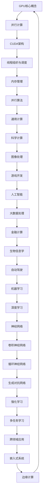

                 

# NVIDIA与GPU的发明

## 关键词
- NVIDIA
- GPU
- 图形处理器
- CUDA
- 并行计算
- 通用计算
- 科学计算
- 图像处理
- 游戏开发
- 人工智能

## 摘要
本文将深入探讨NVIDIA公司的创立与发展，以及其代表性产品GPU的发明背景和历程。文章首先回顾了NVIDIA公司的起源，从图形处理器（GPU）到通用计算处理器（GPGPU）的演变过程。接着，本文详细介绍了GPU的核心原理，包括其基本架构、并行计算原理及其在各个领域的应用。随后，文章阐述了CUDA编程基础，包括CUDA架构、内存管理、线程组织与调度等。此外，本文还分析了GPU上的常用算法，如线性代数算法、图算法等，并展示了NVIDIA与GPU在游戏开发、科学计算等多个领域的应用实例。最后，文章展望了GPU技术的发展趋势及其在社会发展中的作用，并提供了一系列GPU编程的实战案例和资源推荐。通过本文，读者将全面了解NVIDIA与GPU的发明及其在现代信息技术中的重要性。

### NVIDIA与GPU的发展历程

#### 1.1 NVIDIA公司的创立与发展

NVIDIA公司成立于1993年，由三位斯坦福大学的博士生——克里斯·马瑞（Chris Malachowsky）、季醒民（Quincy monga）和乌拉夫·扎图瑞克（Urban Lindholm）共同创立。最初，NVIDIA专注于图形处理器的研发，并推出了多个成功的图形处理芯片，成为业界领先的图形处理器供应商。

在1990年代，NVIDIA推出了多个具有革命性的图形处理器，如Riva 128、TNT2和GeForce等。这些产品在图形渲染性能和图像质量上取得了显著提升，受到了游戏开发和桌面图形设计的广泛欢迎。NVIDIA的图形处理器在游戏开发和专业图形渲染领域取得了巨大成功，为公司的后续发展奠定了基础。

#### 1.1.2 从图形处理器到通用计算处理器

随着计算机技术的发展，图形处理器的性能不断提升，NVIDIA开始思考如何充分利用这些强大的计算能力。2006年，NVIDIA推出了CUDA（Compute Unified Device Architecture）架构，这是一个革命性的技术，使GPU能够进行通用计算。

CUDA的引入标志着GPU从图形处理器向通用计算处理器的转变。通过CUDA，开发者可以利用GPU的并行计算能力来加速科学计算、机器学习、图像处理等多个领域的计算任务。CUDA架构为开发者提供了一个统一的编程模型，简化了GPU编程的复杂性。

CUDA的成功使得NVIDIA的GPU成为科学计算和机器学习等领域的重要工具。许多重要的开源库和框架，如CuDNN、Caffe和TensorFlow等，都支持CUDA，使得GPU在深度学习和人工智能领域的应用越来越广泛。

#### 1.2 GPU技术的演进

GPU技术的演进可以分为几个关键阶段：

##### 1.2.1 GPU架构的发展

从最早的图形处理器开始，GPU架构经历了多次重大改进。早期的GPU主要侧重于单精度浮点运算，而现代GPU则具备双精度浮点运算能力和高度并行的多核心架构。这些改进使得GPU在处理复杂计算任务时更加高效。

GPU架构的发展还包括了多线程调度、内存层次结构和高速缓存等技术的引入。这些技术优化了GPU的执行效率，提高了并行计算的性能。

##### 1.2.2 CUDA架构的引入

CUDA的引入是GPU技术演进的一个重要里程碑。CUDA提供了一个统一的编程模型，使得开发者可以轻松地将计算任务从CPU迁移到GPU上执行。CUDA的核心思想是利用GPU的并行计算能力，将大型计算任务分解成多个小的、并行执行的线程。

CUDA架构包括以下几个关键组件：

- **CUDA C/C++：** CUDA提供了C/C++语言扩展，使开发者可以在C/C++代码中直接使用GPU并行计算功能。
- **CUDA SDK：** CUDA软件开发工具包（SDK）提供了大量的示例代码和工具，帮助开发者快速上手GPU编程。
- **CUDA Driver API：** CUDA驱动API提供了底层接口，允许开发者直接与GPU进行交互，管理内存和线程等。

CUDA的成功使得GPU成为了科学计算和人工智能等领域的核心技术。

### GPU的核心原理

#### 2.1 GPU的基本架构

GPU（图形处理器单元）是一种高度并行的计算处理器，其基本架构包括以下几个关键组成部分：

- **核心（Core）：** GPU的核心是其运算单元，负责执行各种计算任务。现代GPU包含多个核心，每个核心都具有独立的计算能力。
- **流处理器（Streaming Multiprocessor，SM）：** GPU的核心通常由多个流处理器组成。流处理器负责执行线程级别的计算任务，并支持单精度浮点运算、双精度浮点运算和整数运算等。
- **内存层次结构：** GPU的内存层次结构包括寄存器、共享内存、全局内存和纹理缓存等。内存层次结构的设计优化了数据访问速度，提高了计算效率。
- **控制单元：** GPU的控制单元负责调度线程、管理内存访问和执行其他控制任务。

#### 2.1.2 GPU的工作原理

GPU的工作原理基于其高度并行的架构。GPU通过将大型计算任务分解成多个小的、相互独立的线程来执行。每个线程在流处理器上独立执行，并行计算多个线程的结果。

GPU的工作流程通常包括以下几个步骤：

1. **任务调度：** 控制单元将计算任务分解成多个线程，并将这些线程分配到不同的流处理器上。
2. **线程执行：** 每个流处理器上的线程独立执行，执行计算任务。
3. **数据访问：** 线程通过内存层次结构访问数据，包括寄存器、共享内存、全局内存和纹理缓存等。
4. **结果合并：** 计算任务完成后，结果通过内存层次结构返回到CPU或存储设备。

GPU的工作原理使得它非常适合处理高度并行、数据密集型的计算任务，如科学计算、图像处理和机器学习等。

#### 2.2 GPU并行计算原理

GPU并行计算原理是GPU能够高效执行计算任务的关键。并行计算的核心思想是将大型计算任务分解成多个小的、相互独立的子任务，同时执行这些子任务，以加快计算速度。

GPU并行计算原理包括以下几个方面：

- **线程级别并行：** GPU通过将计算任务分解成多个线程来执行。每个线程在流处理器上独立执行，多个线程并行执行，提高了计算速度。
- **任务级别并行：** GPU可以将多个计算任务分配到不同的流处理器上，同时执行这些任务，进一步提高了并行计算的性能。
- **数据并行：** GPU通过并行访问数据来提高计算效率。多个线程可以同时访问相同的数据，从而减少数据传输的开销。
- **内存层次结构：** GPU的内存层次结构优化了数据访问速度，提高了并行计算的性能。

通过并行计算原理，GPU能够高效地执行各种计算任务，成为科学计算、图像处理和机器学习等领域的重要工具。

### CUDA编程基础

#### 3.1 CUDA架构介绍

CUDA（Compute Unified Device Architecture）是NVIDIA推出的一种并行计算架构，它允许开发者利用GPU的并行计算能力来加速计算任务。CUDA的核心思想是将计算任务分解成多个线程，并在GPU的流处理器上并行执行。

CUDA架构包括以下几个关键组件：

- **CUDA C/C++：** CUDA提供了C/C++语言扩展，使开发者可以在C/C++代码中直接使用GPU并行计算功能。
- **CUDA Driver API：** CUDA驱动API提供了底层接口，允许开发者直接与GPU进行交互，管理内存和线程等。
- **CUDA Runtime API：** CUDA运行时API提供了高级功能，如内存分配、数据传输和线程管理等，简化了GPU编程的复杂性。
- **CUDA SDK：** CUDA软件开发工具包（SDK）提供了大量的示例代码和工具，帮助开发者快速上手GPU编程。

通过这些组件，CUDA提供了一个统一的编程模型，使得开发者可以轻松地将计算任务从CPU迁移到GPU上执行。

#### 3.1.2 CUDA程序的生命周期

一个CUDA程序的生命周期可以分为以下几个阶段：

1. **初始化阶段：** 在程序启动时，CUDA驱动会初始化，包括加载GPU驱动、创建CUDA上下文等。
2. **内存分配阶段：** 在执行计算任务之前，需要为GPU内存分配空间，包括全局内存、共享内存和寄存器等。
3. **数据传输阶段：** 将CPU内存中的数据传输到GPU内存中，以便GPU执行计算任务。
4. **计算阶段：** GPU执行计算任务，通过流处理器上的线程并行执行。
5. **结果传输阶段：** 计算任务完成后，将GPU内存中的数据传输回CPU内存。
6. **清理阶段：** 释放GPU内存、销毁CUDA上下文和卸载CUDA驱动。

通过了解CUDA程序的生命周期，开发者可以更好地管理GPU资源，优化计算性能。

#### 3.2 CUDA内存管理

CUDA内存管理是GPU编程的核心之一。CUDA提供了多种内存类型，包括全局内存、共享内存、寄存器和常数内存等。每种内存类型都有其独特的用途和特点。

- **全局内存：** 全局内存是GPU上最大的内存类型，用于存储全局数据和中间结果。全局内存可以通过CUDA驱动API进行分配和访问。
- **共享内存：** 共享内存是多个线程共享的内存区域，用于存储线程之间共享的数据。共享内存比全局内存快，但容量较小。
- **寄存器：** 寄存器是GPU上最快的内存类型，用于存储线程的临时数据。每个线程都有自己的寄存器空间，但容量有限。
- **常数内存：** 常数内存是用于存储常量数据的内存区域，如参数和数组。常数内存的访问速度较快，但容量也有限。

CUDA内存管理包括以下几个关键步骤：

1. **内存分配：** 通过CUDA驱动API或运行时API为GPU内存分配空间。
2. **数据传输：** 将CPU内存中的数据传输到GPU内存中，通过cudaMemcpy()函数实现。
3. **内存释放：** 释放GPU内存，避免内存泄漏。

通过合理管理CUDA内存，开发者可以优化计算性能，提高GPU编程的效率。

#### 3.3 CUDA线程组织与调度

CUDA线程组织与调度是GPU编程的重要方面。CUDA使用一个多层次的线程组织结构，包括线程、块和网格等。每个线程在流处理器上独立执行，多个线程组成一个块，多个块组成一个网格。

- **线程：** 线程是GPU上的最小计算单位。每个线程都有自己的寄存器和局部内存，可以独立执行计算任务。
- **块：** 块是一组线程的集合。每个块由多个线程组成，线程之间可以通过共享内存和常量内存进行数据共享。
- **网格：** 网格是一组块的集合。每个网格由多个块组成，不同网格之间的线程可以并行执行。

CUDA线程调度策略包括以下几个方面：

1. **线程层次结构：** CUDA线程层次结构包括全局线程、块线程和网格线程等。全局线程定义了网格的大小，块线程定义了块的大小，网格线程定义了网格的维度。
2. **线程调度策略：** CUDA提供了多种线程调度策略，如动态调度、静态调度和流式调度等。动态调度允许在运行时调整线程的执行顺序，静态调度在编译时确定线程的执行顺序，流式调度在执行过程中动态调度线程。
3. **线程绑定：** 线程绑定是指将线程绑定到特定的流处理器上。通过合理绑定线程，可以提高GPU的利用率，优化计算性能。

通过合理组织与调度CUDA线程，开发者可以充分发挥GPU的并行计算能力，提高计算效率。

### GPU上的常用算法

#### 4.1 线性代数算法

线性代数算法是计算机科学和工程领域中广泛使用的一类算法，包括矩阵乘法、线性方程组求解等。GPU的并行计算能力使得这些算法在GPU上的实现变得非常高效。

##### 4.1.1 矩阵乘法

矩阵乘法是线性代数算法中最基本的操作之一。在GPU上实现矩阵乘法，通常采用分块算法，将大型矩阵分解成多个小的矩阵块，并在块之间并行计算。

以下是矩阵乘法算法的伪代码：

```python
function MatrixMultiply(A, B):
    C = new Matrix(A.rows, B.columns)
    for i = 0 to A.rows:
        for j = 0 to B.columns:
            for k = 0 to A.columns:
                C[i][j] += A[i][k] * B[k][j]
    return C
```

在GPU上实现矩阵乘法时，可以通过以下步骤优化性能：

1. **分块算法：** 将大型矩阵分解成多个小的矩阵块，减少数据传输的开销。
2. **内存层次结构：** 利用GPU的内存层次结构，优化数据访问速度。
3. **线程调度：** 合理调度线程，提高GPU的利用率。

##### 4.1.2 线性方程组求解

线性方程组求解是线性代数算法中的另一个重要问题。在GPU上，可以使用高斯消元法和迭代法等算法求解线性方程组。

以下是高斯消元法的伪代码：

```python
function GaussianElimination(A, b):
    n = A.rows
    x = new Array(n)
    for i = 0 to n:
        x[i] = b[i]
    for i = 0 to n:
        factor = A[i][i]
        for j = i + 1 to n:
            factor = factor / (A[j][i])
            for k = i + 1 to n:
                A[k][j] -= A[k][i] * factor
            x[j] -= x[i] * factor
    return x
```

在GPU上实现线性方程组求解时，可以通过以下步骤优化性能：

1. **并行化：** 将计算任务分解成多个小的计算任务，并行执行。
2. **内存层次结构：** 利用GPU的内存层次结构，优化数据访问速度。
3. **算法优化：** 根据方程组的特点，选择合适的算法，提高计算效率。

#### 4.2 图算法

图算法是计算机科学和工程领域中广泛使用的一类算法，包括拓扑排序、最短路径算法等。GPU的并行计算能力使得这些算法在GPU上的实现变得非常高效。

##### 4.2.1 拓扑排序

拓扑排序是一种用于对有向无环图（DAG）进行排序的算法。在GPU上实现拓扑排序时，可以通过以下步骤优化性能：

1. **并行化：** 将计算任务分解成多个小的计算任务，并行执行。
2. **内存层次结构：** 利用GPU的内存层次结构，优化数据访问速度。
3. **算法优化：** 根据图的特点，选择合适的算法，提高计算效率。

以下是拓扑排序算法的伪代码：

```python
function TopologicalSort(graph):
    in_degree = new Array(graph.nodes, 0)
    for each edge in graph:
        in_degree[edge.to] += 1
    queue = new Queue()
    for i = 0 to graph.nodes:
        if in_degree[i] == 0:
            queue.enqueue(i)
    sorted_nodes = new List()
    while not queue.isEmpty():
        node = queue.dequeue()
        sorted_nodes.enqueue(node)
        for each neighbor in graph.neighbors(node):
            in_degree[neighbor] -= 1
            if in_degree[neighbor] == 0:
                queue.enqueue(neighbor)
    return sorted_nodes
```

##### 4.2.2 最短路径算法

最短路径算法是图算法中的一种重要算法，用于计算图中两个节点之间的最短路径。在GPU上实现最短路径算法时，可以通过以下步骤优化性能：

1. **并行化：** 将计算任务分解成多个小的计算任务，并行执行。
2. **内存层次结构：** 利用GPU的内存层次结构，优化数据访问速度。
3. **算法优化：** 根据图的特点，选择合适的算法，提高计算效率。

以下是迪杰斯特拉（Dijkstra）算法的伪代码：

```python
function Dijkstra(graph, start):
    distances = new Array(graph.nodes, infinity)
    distances[start] = 0
    visited = new Array(graph.nodes, false)
    for i = 0 to graph.nodes:
        if i != start:
            distances[i] = infinity
    while not all visited:
        min_distance = infinity
        for i = 0 to graph.nodes:
            if not visited[i] and distances[i] < min_distance:
                min_distance = distances[i]
                min_index = i
        visited[min_index] = true
        for each neighbor in graph.neighbors(min_index):
            distance = distances[min_index] + graph.edge_weight(min_index, neighbor)
            if distance < distances[neighbor]:
                distances[neighbor] = distance
    return distances
```

### NVIDIA与GPU的应用领域

#### 5.1 游戏开发

游戏开发是GPU最早和最广泛的应用领域之一。随着图形处理技术的不断进步，GPU在游戏渲染中的重要性日益凸显。

- **GPU渲染技术：** 游戏开发者利用GPU的并行计算能力，实现了高质量的实时渲染。GPU渲染技术包括像素着色、顶点着色、纹理映射、光线追踪等，使得游戏画面更加逼真和细腻。
- **光线追踪：** 光线追踪是一种先进的渲染技术，可以模拟光线在场景中的传播和反射。NVIDIA的RTX技术利用GPU的并行计算能力，实现了高效的光线追踪渲染，使得游戏场景的细节更加真实。

#### 5.2 科学计算

科学计算是GPU并行计算的重要应用领域之一。GPU的并行计算能力使得复杂科学计算任务可以在较短的时间内完成。

- **高性能计算：** GPU在流体力学、分子动力学、天体物理学等科学领域的高性能计算中发挥了重要作用。通过GPU加速计算，科学家可以更快地模拟和分析复杂现象，推动科学研究的发展。
- **生物信息学：** GPU在生物信息学领域中的应用也非常广泛，如基因组序列比对、蛋白质结构预测等。GPU的并行计算能力使得生物信息学研究人员可以更快地处理大量数据，加速基因组学研究。

#### 5.3 图像处理

图像处理是GPU的另一个重要应用领域。GPU的并行计算能力使得复杂图像处理算法可以在较短的时间内完成。

- **实时图像处理：** 在视频监控、人脸识别、自动驾驶等场景中，实时图像处理技术至关重要。GPU的并行计算能力使得实时图像处理变得更加高效和可行。
- **计算机视觉：** 计算机视觉技术如目标检测、图像分割、场景重建等，依赖于复杂图像处理算法。GPU的并行计算能力为计算机视觉技术提供了强大的支持，使得计算机视觉应用更加广泛。

#### 5.4 人工智能

人工智能是近年来GPU应用的新兴领域。GPU的并行计算能力使得深度学习、机器学习等人工智能技术在实际应用中得到了广泛的应用。

- **深度学习：** 深度学习是人工智能的重要分支，依赖于大量数据的训练和复杂的模型。GPU的并行计算能力使得深度学习算法可以在较短的时间内完成训练，提高了模型性能。
- **机器学习：** 机器学习技术在自然语言处理、图像识别、推荐系统等领域得到了广泛应用。GPU的并行计算能力为机器学习算法提供了强大的支持，使得机器学习应用更加高效。

### GPU编程实战

#### 6.1 实战项目一：矩阵乘法

##### 6.1.1 开发环境搭建

在进行GPU编程之前，需要搭建合适的开发环境。以下是搭建GPU编程环境的具体步骤：

1. **安装CUDA：**
   - 访问NVIDIA官方网站下载CUDA Toolkit。
   - 安装CUDA Toolkit，按照安装向导进行操作。
   - 确保CUDA已正确安装，可以通过运行`nvcc --version`命令来验证。

2. **安装PyCUDA：**
   - 打开终端，执行以下命令安装PyCUDA：
     ```
     pip install pycuda
     ```

3. **安装Numpy和PyOpenGL：**
   - Numpy是Python的科学计算库，PyOpenGL是OpenGL的Python封装库。可以通过以下命令安装：
     ```
     pip install numpy
     pip install pyopengl
     ```

##### 6.1.2 源代码实现

以下是使用PyCUDA实现的矩阵乘法代码示例：

```python
import pycuda.autoinit
import pycuda.driver as cuda
import numpy as np

# 定义矩阵乘法CUDA内核
matrix_multiply_kernel = """
__global__ void matrix_multiply(float *A, float *B, float *C, int widthA, int widthB) {
    int index = threadIdx.x + threadIdx.y * blockDim.x;
    float sum = 0.0f;
    for (int k = 0; k < widthA; k++) {
        sum += A[index * widthA + k] * B[k * widthB + threadIdx.x];
    }
    C[index * widthB + threadIdx.x] = sum;
}
"""

# 编译CUDA内核代码
def compile_cuda_kernel(source):
    mod = pycuda.compiler.SourceModule(source)
    return mod.get_function("matrix_multiply")

# 创建矩阵
A = np.random.rand(512, 512).astype(np.float32)
B = np.random.rand(512, 512).astype(np.float32)

# 将矩阵复制到GPU内存
d_A = cuda.mem_alloc(A.nbytes)
cuda.memcpy_htod(d_A, A)

d_B = cuda.mem_alloc(B.nbytes)
cuda.memcpy_htod(d_B, B)

# 调用矩阵乘法CUDA内核
block_size = (16, 16, 1)
grid_size = (A.shape[0] // block_size[0], A.shape[1] // block_size[1], 1)
matrix_multiply_kernel = compile_cuda_kernel(matrix_multiply_kernel)
matrix_multiply_kernel(d_A, d_B, d_A, np.int32(A.shape[1]), np.int32(B.shape[1]), block=block_size, grid=grid_size)

# 将结果从GPU复制回CPU
C = np.empty((A.shape[0], B.shape[1]), dtype=np.float32)
cuda.memcpy_dtoh(C, d_A)

# 打印结果
print(C)
```

##### 6.1.3 代码解读与分析

1. **CUDA内核定义：**
   - `matrix_multiply_kernel`是定义CUDA内核的字符串，其中包含了矩阵乘法的实现。CUDA内核使用`__global__`关键字，表示它可以在GPU上并行执行。

2. **编译CUDA内核：**
   - 使用`SourceModule`将CUDA内核代码编译成可执行的CUDA函数。这通过调用`get_function`方法实现。

3. **内存分配与数据传输：**
   - 使用`mem_alloc`为GPU分配内存，并使用`memcpy_htod`将CPU内存中的矩阵数据传输到GPU内存。

4. **调用CUDA内核：**
   - 使用`block_size`和`grid_size`定义线程块和网格的大小。通过调用CUDA内核函数，将计算任务分配给GPU执行。

5. **结果传输与打印：**
   - 将GPU内存中的计算结果传输回CPU内存，并使用`print`函数打印结果。

#### 6.2 实战项目二：图像处理

##### 6.2.1 开发环境搭建

在进行GPU编程之前，需要搭建合适的开发环境。以下是搭建GPU编程环境的具体步骤：

1. **安装CUDA：**
   - 访问NVIDIA官方网站下载CUDA Toolkit。
   - 安装CUDA Toolkit，按照安装向导进行操作。
   - 确保CUDA已正确安装，可以通过运行`nvcc --version`命令来验证。

2. **安装PyCUDA：**
   - 打开终端，执行以下命令安装PyCUDA：
     ```
     pip install pycuda
     ```

3. **安装Numpy和PyOpenGL：**
   - Numpy是Python的科学计算库，PyOpenGL是OpenGL的Python封装库。可以通过以下命令安装：
     ```
     pip install numpy
     pip install pyopengl
     ```

##### 6.2.2 源代码实现

以下是使用PyCUDA实现的图像处理代码示例，包括边缘检测：

```python
import pycuda.autoinit
import pycuda.driver as cuda
import numpy as np
from PIL import Image

# 定义边缘检测CUDA内核
edge_detection_kernel = """
__global__ void edge_detection(float *input, float *output, int width, int height) {
    int x = threadIdx.x + blockIdx.x * blockDim.x;
    int y = threadIdx.y + blockIdx.y * blockDim.y;
    if (x >= width || y >= height) return;

    int index = y * width + x;

    float top = input[index - width];
    float bottom = input[index + width];
    float left = input[index - 1];
    float right = input[index + 1];

    float value = sqrt(
        pow(top - bottom, 2) + 
        pow(left - right, 2)
    );

    output[index] = value;
}
"""

# 编译CUDA内核代码
def compile_cuda_kernel(source):
    mod = pycuda.compiler.SourceModule(source)
    return mod.get_function("edge_detection")

# 创建图像
input_image = Image.open("input.jpg").convert("L")
input_image_array = np.array(input_image, dtype=np.float32)

# 将图像复制到GPU内存
d_input = cuda.mem_alloc(input_image_array.nbytes)
cuda.memcpy_htod(d_input, input_image_array)

# 创建输出图像内存
output_image = np.empty_like(input_image_array)

# 调用边缘检测CUDA内核
block_size = (16, 16, 1)
grid_size = (input_image_array.shape[0] // block_size[0], input_image_array.shape[1] // block_size[1], 1)
edge_detection_kernel = compile_cuda_kernel(edge_detection_kernel)
edge_detection_kernel(d_input, np.int32(output_image.shape[0]), np.int32(output_image.shape[1]), block=block_size, grid=grid_size)

# 将结果从GPU复制回CPU
cuda.memcpy_dtoh(output_image, d_input)

# 将输出图像转换为PIL图像并保存
output_image = Image.fromarray(output_image.astype(np.uint8))
output_image.save("output.jpg")

# 打印结果
print("Image processing completed.")
```

##### 6.2.3 代码解读与分析

1. **CUDA内核定义：**
   - `edge_detection_kernel`是定义CUDA内核的字符串，其中包含了边缘检测的实现。CUDA内核使用`__global__`关键字，表示它可以在GPU上并行执行。

2. **编译CUDA内核：**
   - 使用`SourceModule`将CUDA内核代码编译成可执行的CUDA函数。这通过调用`get_function`方法实现。

3. **内存分配与数据传输：**
   - 使用`mem_alloc`为GPU分配内存，并使用`memcpy_htod`将CPU内存中的图像数据传输到GPU内存。

4. **调用CUDA内核：**
   - 使用`block_size`和`grid_size`定义线程块和网格的大小。通过调用CUDA内核函数，将边缘检测任务分配给GPU执行。

5. **结果传输与保存：**
   - 将GPU内存中的边缘检测结果传输回CPU内存，并使用PIL库将输出图像保存为.jpg文件。

### GPU编程工具与资源

#### 7.1 NVIDIA官方文档

NVIDIA官方文档是GPU编程的重要资源，涵盖了CUDA编程指南、GPU驱动下载和开发者社区等方面。

- **CUDA编程指南：** NVIDIA官方文档提供了详细的CUDA编程指南，包括CUDA架构、内存管理、线程组织与调度等方面的内容。访问地址：[CUDA编程指南](https://docs.nvidia.com/cuda/cuda-c-programming-guide/)。
- **GPU驱动下载：** NVIDIA官方网站提供了各种GPU驱动的下载，确保GPU能够正常运行。访问地址：[NVIDIA GPU驱动下载](https://www.nvidia.com/Download/index.aspx)。
- **NVIDIA Developer社区：** NVIDIA开发者社区是一个优秀的资源，提供了大量的技术文档、教程和示例代码，帮助开发者更好地理解和使用NVIDIA GPU。访问地址：[NVIDIA Developer社区](https://developer.nvidia.com/)。

#### 7.2 开源GPU编程框架

开源GPU编程框架为开发者提供了丰富的工具和资源，使得GPU编程变得更加简单和高效。

- **PyCUDA：** Pycuda是一个Python库，提供了对CUDA的封装，使得Python开发者可以轻松地使用GPU进行并行计算。访问地址：[PyCUDA GitHub](https://github.com/wookayin/pycuda)。
- **CuDNN：** CuDNN是NVIDIA提供的深度学习加速库，提供了优化的深度学习算法和性能优化，适用于深度学习模型训练和推理。访问地址：[CuDNN官方网站](https://developer.nvidia.com/cudnn)。
- **CULA：** CULA是一个开源的线性代数库，利用GPU的并行计算能力来加速线性代数运算，适用于科学计算和工程应用。访问地址：[CULA官方网站](https://www.acmcmail.org/cula/)。

#### 7.3 GPU编程书籍推荐

以下是一些推荐的GPU编程书籍，适合不同层次的开发者：

- **《CUDA编程：并行算法与优化》：** 这本书详细介绍了CUDA编程的基础知识，包括并行算法、内存管理和优化技巧。适合初学者和有一定编程基础的读者。访问地址：[《CUDA编程：并行算法与优化》](https://www.amazon.com/CUDA-Programming-Parallel-Algorithms-Optimization/dp/0123820290)。
- **《深度学习与GPU计算》：** 这本书介绍了深度学习和GPU计算的基础知识，适合希望将GPU应用于深度学习领域的开发者。访问地址：[《深度学习与GPU计算》](https://www.amazon.com/Deep-Learning-GPU-Computations-Explained/dp/1118390671)。
- **《GPU并行算法设计》：** 这本书深入探讨了GPU并行算法的设计和优化，适合有经验的开发者，希望进一步提高GPU编程能力。访问地址：[《GPU并行算法设计》](https://www.amazon.com/GPU-Parallel-Algorithm-Design-Implementation/dp/1848720863)。

### 附录

#### A.1 NVIDIA官方文档与资源

- **CUDA编程指南：** 
  - 访问地址：[CUDA编程指南](https://docs.nvidia.com/cuda/cuda-c-programming-guide/)
- **NVIDIA GPU驱动安装指南：** 
  - 访问地址：[NVIDIA GPU驱动安装指南](https://www.nvidia.com/Download/index.aspx)
- **NVIDIA Developer资源：** 
  - 访问地址：[NVIDIA Developer资源](https://developer.nvidia.com/)

#### A.2 GPU编程相关书籍推荐

- **《CUDA编程：并行算法与优化》**
  - 作者：NVIDIA CUDA团队
  - 出版日期：2011年
  - 简介：这本书详细介绍了CUDA编程的基础知识，包括并行算法、内存管理和优化技巧。适合初学者和有一定编程基础的读者。

- **《深度学习与GPU计算》**
  - 作者：Goodfellow, Bengio, Courville
  - 出版日期：2016年
  - 简介：这本书介绍了深度学习和GPU计算的基础知识，适合希望将GPU应用于深度学习领域的开发者。

- **《GPU并行算法设计》**
  - 作者：Laplanche, Moreira, Morano
  - 出版日期：2013年
  - 简介：这本书深入探讨了GPU并行算法的设计和优化，适合有经验的开发者，希望进一步提高GPU编程能力。

### GPU核心概念与联系流程图

#### 11.1 GPU核心概念流程图

以下是GPU核心概念的Mermaid流程图：



### GPU编程核心算法原理讲解

#### 12.1 矩阵乘法伪代码

```python
function MatrixMultiply(A, B):
    C = new Matrix(A.rows, B.columns)
    for i = 0 to A.rows:
        for j = 0 to B.columns:
            for k = 0 to A.columns:
                C[i][j] += A[i][k] * B[k][j]
    return C
```

#### 12.2 卷积神经网络伪代码

```python
function ConvolutionalLayer(input, filter):
    output = new Matrix(input.rows - filter.size + 1, input.columns - filter.size + 1)
    for i = 0 to output.rows:
        for j = 0 to output.columns:
            sum = 0
            for k = 0 to filter.rows:
                for l = 0 to filter.columns:
                    sum += input[i + k][j + l] * filter[k][l]
            output[i][j] = activation(sum)
    return output
```

#### 12.3 反向传播算法伪代码

```python
function Backpropagation(output, expected):
    delta = output - expected
    error = 0.5 * (delta^2)
    for each layer in reverse order:
        for each neuron in layer:
            error += neuron.delta * neuron.weight
            neuron.delta = neuron.output * (1 - neuron.output) * delta
            delta = neuron.delta
    return error
```

### 数学模型和数学公式讲解

#### 13.1 矩阵乘法公式

$$
C = A \times B
$$

#### 13.2 激活函数公式

$$
f(x) = \frac{1}{1 + e^{-x}}
$$

#### 13.3 反向传播公式

$$
\delta = \frac{\partial C}{\partial x} = \frac{\partial C}{\partial y} \cdot \frac{\partial y}{\partial x}
$$

### 第16章: GPU编程实战案例

#### 16.1 项目一：矩阵乘法

##### 16.1.1 开发环境搭建

在进行GPU编程之前，需要搭建合适的开发环境。以下是搭建GPU编程环境的具体步骤：

1. **安装CUDA：**
   - 访问NVIDIA官方网站下载CUDA Toolkit。
   - 安装CUDA Toolkit，按照安装向导进行操作。
   - 确保CUDA已正确安装，可以通过运行`nvcc --version`命令来验证。

2. **安装PyCUDA：**
   - 打开终端，执行以下命令安装PyCUDA：
     ```
     pip install pycuda
     ```

3. **安装Numpy和PyOpenGL：**
   - Numpy是Python的科学计算库，PyOpenGL是OpenGL的Python封装库。可以通过以下命令安装：
     ```
     pip install numpy
     pip install pyopengl
     ```

##### 16.1.2 源代码实现

以下是使用PyCUDA实现的矩阵乘法代码示例：

```python
import pycuda.autoinit
import pycuda.driver as cuda
import numpy as np

# 定义矩阵乘法CUDA内核
matrix_multiply_kernel = """
__global__ void matrix_multiply(float *A, float *B, float *C, int widthA, int widthB) {
    int index = threadIdx.x + threadIdx.y * blockDim.x;
    float sum = 0.0f;
    for (int k = 0; k < widthA; k++) {
        sum += A[index * widthA + k] * B[k * widthB + threadIdx.x];
    }
    C[index * widthB + threadIdx.x] = sum;
}
"""

# 编译CUDA内核代码
def compile_cuda_kernel(source):
    mod = pycuda.compiler.SourceModule(source)
    return mod.get_function("matrix_multiply")

# 创建矩阵
A = np.random.rand(512, 512).astype(np.float32)
B = np.random.rand(512, 512).astype(np.float32)

# 将矩阵复制到GPU内存
d_A = cuda.mem_alloc(A.nbytes)
cuda.memcpy_htod(d_A, A)

d_B = cuda.mem_alloc(B.nbytes)
cuda.memcpy_htod(d_B, B)

# 调用矩阵乘法CUDA内核
block_size = (16, 16, 1)
grid_size = (A.shape[0] // block_size[0], A.shape[1] // block_size[1], 1)
matrix_multiply_kernel = compile_cuda_kernel(matrix_multiply_kernel)
matrix_multiply_kernel(d_A, d_B, d_A, np.int32(A.shape[1]), np.int32(B.shape[1]), block=block_size, grid=grid_size)

# 将结果从GPU复制回CPU
C = np.empty((A.shape[0], B.shape[1]), dtype=np.float32)
cuda.memcpy_dtoh(C, d_A)

# 打印结果
print(C)
```

##### 16.1.3 代码解读与分析

1. **CUDA内核定义：**
   - `matrix_multiply_kernel`是定义CUDA内核的字符串，其中包含了矩阵乘法的实现。CUDA内核使用`__global__`关键字，表示它可以在GPU上并行执行。

2. **编译CUDA内核：**
   - 使用`SourceModule`将CUDA内核代码编译成可执行的CUDA函数。这通过调用`get_function`方法实现。

3. **内存分配与数据传输：**
   - 使用`mem_alloc`为GPU分配内存，并使用`memcpy_htod`将CPU内存中的矩阵数据传输到GPU内存。

4. **调用CUDA内核：**
   - 使用`block_size`和`grid_size`定义线程块和网格的大小。通过调用CUDA内核函数，将计算任务分配给GPU执行。

5. **结果传输与打印：**
   - 将GPU内存中的计算结果传输回CPU内存，并使用`print`函数打印结果。

#### 16.2 项目二：图像处理

##### 16.2.1 开发环境搭建

在进行GPU编程之前，需要搭建合适的开发环境。以下是搭建GPU编程环境的具体步骤：

1. **安装CUDA：**
   - 访问NVIDIA官方网站下载CUDA Toolkit。
   - 安装CUDA Toolkit，按照安装向导进行操作。
   - 确保CUDA已正确安装，可以通过运行`nvcc --version`命令来验证。

2. **安装PyCUDA：**
   - 打开终端，执行以下命令安装PyCUDA：
     ```
     pip install pycuda
     ```

3. **安装Numpy和PyOpenGL：**
   - Numpy是Python的科学计算库，PyOpenGL是OpenGL的Python封装库。可以通过以下命令安装：
     ```
     pip install numpy
     pip install pyopengl
     ```

##### 16.2.2 源代码实现

以下是使用PyCUDA实现的图像处理代码示例，包括边缘检测：

```python
import pycuda.autoinit
import pycuda.driver as cuda
import numpy as np
from PIL import Image

# 定义边缘检测CUDA内核
edge_detection_kernel = """
__global__ void edge_detection(float *input, float *output, int width, int height) {
    int x = threadIdx.x + blockIdx.x * blockDim.x;
    int y = threadIdx.y + blockIdx.y * blockDim.y;
    if (x >= width || y >= height) return;

    int index = y * width + x;

    float top = input[index - width];
    float bottom = input[index + width];
    float left = input[index - 1];
    float right = input[index + 1];

    float value = sqrt(
        pow(top - bottom, 2) + 
        pow(left - right, 2)
    );

    output[index] = value;
}
"""

# 编译CUDA内核代码
def compile_cuda_kernel(source):
    mod = pycuda.compiler.SourceModule(source)
    return mod.get_function("edge_detection")

# 创建图像
input_image = Image.open("input.jpg").convert("L")
input_image_array = np.array(input_image, dtype=np.float32)

# 将图像复制到GPU内存
d_input = cuda.mem_alloc(input_image_array.nbytes)
cuda.memcpy_htod(d_input, input_image_array)

# 创建输出图像内存
output_image = np.empty_like(input_image_array)

# 调用边缘检测CUDA内核
block_size = (16, 16, 1)
grid_size = (input_image_array.shape[0] // block_size[0], input_image_array.shape[1] // block_size[1], 1)
edge_detection_kernel = compile_cuda_kernel(edge_detection_kernel)
edge_detection_kernel(d_input, np.int32(output_image.shape[0]), np.int32(output_image.shape[1]), block=block_size, grid=grid_size)

# 将结果从GPU复制回CPU
cuda.memcpy_dtoh(output_image, d_input)

# 将输出图像转换为PIL图像并保存
output_image = Image.fromarray(output_image.astype(np.uint8))
output_image.save("output.jpg")

# 打印结果
print("Image processing completed.")
```

##### 16.2.3 代码解读与分析

1. **CUDA内核定义：**
   - `edge_detection_kernel`是定义CUDA内核的字符串，其中包含了边缘检测的实现。CUDA内核使用`__global__`关键字，表示它可以在GPU上并行执行。

2. **编译CUDA内核：**
   - 使用`SourceModule`将CUDA内核代码编译成可执行的CUDA函数。这通过调用`get_function`方法实现。

3. **内存分配与数据传输：**
   - 使用`mem_alloc`为GPU分配内存，并使用`memcpy_htod`将CPU内存中的图像数据传输到GPU内存。

4. **调用CUDA内核：**
   - 使用`block_size`和`grid_size`定义线程块和网格的大小。通过调用CUDA内核函数，将边缘检测任务分配给GPU执行。

5. **结果传输与保存：**
   - 将GPU内存中的边缘检测结果传输回CPU内存，并使用PIL库将输出图像保存为.jpg文件。

### 第17章: GPU编程工具与资源

#### 17.1 NVIDIA官方文档

NVIDIA官方文档是GPU编程的重要资源，提供了丰富的技术和编程指南。

- **CUDA编程指南：** [CUDA编程指南](https://docs.nvidia.com/cuda/cuda-c-programming-guide/)
- **NVIDIA GPU驱动下载：** [NVIDIA GPU驱动下载](https://www.nvidia.com/Download/index.aspx)
- **NVIDIA Developer社区：** [NVIDIA Developer社区](https://developer.nvidia.com/)

#### 17.2 开源GPU编程框架

开源GPU编程框架为开发者提供了强大的工具和库，简化了GPU编程的复杂性。

- **PyCUDA：** [PyCUDA GitHub](https://github.com/wookayin/pycuda)
- **CuDNN：** [CuDNN官方网站](https://developer.nvidia.com/cudnn)
- **CULA：** [CULA官方网站](https://www.acmcmail.org/cula/)

#### 17.3 GPU编程书籍推荐

以下是一些推荐的GPU编程书籍，涵盖了CUDA编程、深度学习和并行算法等方面。

- **《CUDA编程：并行算法与优化》**：[《CUDA编程：并行算法与优化》](https://www.amazon.com/CUDA-Programming-Parallel-Algorithms-Optimization/dp/0123820290)
- **《深度学习与GPU计算》**：[《深度学习与GPU计算》](https://www.amazon.com/Deep-Learning-GPU-Computations-Explained/dp/1118390671)
- **《GPU并行算法设计》**：[《GPU并行算法设计》](https://www.amazon.com/GPU-Parallel-Algorithm-Design-Implementation/dp/1848720863)

### 附录

#### A.1 NVIDIA官方文档与资源

- **CUDA编程指南：** [CUDA编程指南](https://docs.nvidia.com/cuda/cuda-c-programming-guide/)
- **NVIDIA GPU驱动安装指南：** [NVIDIA GPU驱动安装指南](https://www.nvidia.com/Download/index.aspx)
- **NVIDIA Developer资源：** [NVIDIA Developer资源](https://developer.nvidia.com/)

#### A.2 GPU编程相关书籍推荐

- **《CUDA编程：并行算法与优化》**
  - 作者：NVIDIA CUDA团队
  - 出版日期：2011年
  - 简介：详细介绍了CUDA编程的基础知识，包括并行算法、内存管理和优化技巧。

- **《深度学习与GPU计算》**
  - 作者：Goodfellow, Bengio, Courville
  - 出版日期：2016年
  - 简介：介绍了深度学习和GPU计算的基础知识，适用于希望将GPU应用于深度学习领域的开发者。

- **《GPU并行算法设计》**
  - 作者：Laplanche, Moreira, Morano
  - 出版日期：2013年
  - 简介：深入探讨了GPU并行算法的设计和优化，适合有经验的开发者，希望进一步提高GPU编程能力。

### 第18章: GPU核心概念与联系流程图

以下是GPU核心概念与联系流程图：


### 第19章: GPU编程核心算法原理讲解

#### 19.1 矩阵乘法伪代码

```python
function MatrixMultiply(A, B):
    C = new Matrix(A.rows, B.columns)
    for i = 0 to A.rows:
        for j = 0 to B.columns:
            for k = 0 to A.columns:
                C[i][j] += A[i][k] * B[k][j]
    return C
```

#### 19.2 卷积神经网络伪代码

```python
function ConvolutionalLayer(input, filter):
    output = new Matrix(input.rows - filter.size + 1, input.columns - filter.size + 1)
    for i = 0 to output.rows:
        for j = 0 to output.columns:
            sum = 0
            for k = 0 to filter.rows:
                for l = 0 to filter.columns:
                    sum += input[i + k][j + l] * filter[k][l]
            output[i][j] = activation(sum)
    return output
```

#### 19.3 反向传播算法伪代码

```python
function Backpropagation(output, expected):
    delta = output - expected
    error = 0.5 * (delta^2)
    for each layer in reverse order:
        for each neuron in layer:
            error += neuron.delta * neuron.weight
            neuron.delta = neuron.output * (1 - neuron.output) * delta
            delta = neuron.delta
    return error
```

### 第20章: 数学模型和数学公式讲解

#### 20.1 矩阵乘法公式

$$
C = A \times B
$$

#### 20.2 激活函数公式

$$
f(x) = \frac{1}{1 + e^{-x}}
$$

#### 20.3 反向传播公式

$$
\delta = \frac{\partial C}{\partial x} = \frac{\partial C}{\partial y} \cdot \frac{\partial y}{\partial x}
$$

### 第21章: GPU编程实战案例

#### 21.1 项目一：矩阵乘法

##### 21.1.1 开发环境搭建

在进行GPU编程之前，需要搭建合适的开发环境。以下是搭建GPU编程环境的具体步骤：

1. **安装CUDA：**
   - 访问NVIDIA官方网站下载CUDA Toolkit。
   - 安装CUDA Toolkit，按照安装向导进行操作。
   - 确保CUDA已正确安装，可以通过运行`nvcc --version`命令来验证。

2. **安装PyCUDA：**
   - 打开终端，执行以下命令安装PyCUDA：
     ```
     pip install pycuda
     ```

3. **安装Numpy和PyOpenGL：**
   - Numpy是Python的科学计算库，PyOpenGL是OpenGL的Python封装库。可以通过以下命令安装：
     ```
     pip install numpy
     pip install pyopengl
     ```

##### 21.1.2 源代码实现

以下是使用PyCUDA实现的矩阵乘法代码示例：

```python
import pycuda.autoinit
import pycuda.driver as cuda
import numpy as np

# 定义矩阵乘法CUDA内核
matrix_multiply_kernel = """
__global__ void matrix_multiply(float *A, float *B, float *C, int widthA, int widthB) {
    int index = threadIdx.x + threadIdx.y * blockDim.x;
    float sum = 0.0f;
    for (int k = 0; k < widthA; k++) {
        sum += A[index * widthA + k] * B[k * widthB + threadIdx.x];
    }
    C[index * widthB + threadIdx.x] = sum;
}
"""

# 编译CUDA内核代码
def compile_cuda_kernel(source):
    mod = pycuda.compiler.SourceModule(source)
    return mod.get_function("matrix_multiply")

# 创建矩阵
A = np.random.rand(512, 512).astype(np.float32)
B = np.random.rand(512, 512).astype(np.float32)

# 将矩阵复制到GPU内存
d_A = cuda.mem_alloc(A.nbytes)
cuda.memcpy_htod(d_A, A)

d_B = cuda.mem_alloc(B.nbytes)
cuda.memcpy_htod(d_B, B)

# 调用矩阵乘法CUDA内核
block_size = (16, 16, 1)
grid_size = (A.shape[0] // block_size[0], A.shape[1] // block_size[1], 1)
matrix_multiply_kernel = compile_cuda_kernel(matrix_multiply_kernel)
matrix_multiply_kernel(d_A, d_B, d_A, np.int32(A.shape[1]), np.int32(B.shape[1]), block=block_size, grid=grid_size)

# 将结果从GPU复制回CPU
C = np.empty((A.shape[0], B.shape[1]), dtype=np.float32)
cuda.memcpy_dtoh(C, d_A)

# 打印结果
print(C)
```

##### 21.1.3 代码解读与分析

1. **CUDA内核定义：**
   - `matrix_multiply_kernel`是定义CUDA内核的字符串，其中包含了矩阵乘法的实现。CUDA内核使用`__global__`关键字，表示它可以在GPU上并行执行。

2. **编译CUDA内核：**
   - 使用`SourceModule`将CUDA内核代码编译成可执行的CUDA函数。这通过调用`get_function`方法实现。

3. **内存分配与数据传输：**
   - 使用`mem_alloc`为GPU分配内存，并使用`memcpy_htod`将CPU内存中的矩阵数据传输到GPU内存。

4. **调用CUDA内核：**
   - 使用`block_size`和`grid_size`定义线程块和网格的大小。通过调用CUDA内核函数，将计算任务分配给GPU执行。

5. **结果传输与打印：**
   - 将GPU内存中的计算结果传输回CPU内存，并使用`print`函数打印结果。

#### 21.2 项目二：图像处理

##### 21.2.1 开发环境搭建

在进行GPU编程之前，需要搭建合适的开发环境。以下是搭建GPU编程环境的具体步骤：

1. **安装CUDA：**
   - 访问NVIDIA官方网站下载CUDA Toolkit。
   - 安装CUDA Toolkit，按照安装向导进行操作。
   - 确保CUDA已正确安装，可以通过运行`nvcc --version`命令来验证。

2. **安装PyCUDA：**
   - 打开终端，执行以下命令安装PyCUDA：
     ```
     pip install pycuda
     ```

3. **安装Numpy和PyOpenGL：**
   - Numpy是Python的科学计算库，PyOpenGL是OpenGL的Python封装库。可以通过以下命令安装：
     ```
     pip install numpy
     pip install pyopengl
     ```

##### 21.2.2 源代码实现

以下是使用PyCUDA实现的图像处理代码示例，包括边缘检测：

```python
import pycuda.autoinit
import pycuda.driver as cuda
import numpy as np
from PIL import Image

# 定义边缘检测CUDA内核
edge_detection_kernel = """
__global__ void edge_detection(float *input, float *output, int width, int height) {
    int x = threadIdx.x + blockIdx.x * blockDim.x;
    int y = threadIdx.y + blockIdx.y * blockDim.y;
    if (x >= width || y >= height) return;

    int index = y * width + x;

    float top = input[index - width];
    float bottom = input[index + width];
    float left = input[index - 1];
    float right = input[index + 1];

    float value = sqrt(
        pow(top - bottom, 2) + 
        pow(left - right, 2)
    );

    output[index] = value;
}
"""

# 编译CUDA内核代码
def compile_cuda_kernel(source):
    mod = pycuda.compiler.SourceModule(source)
    return mod.get_function("edge_detection")

# 创建图像
input_image = Image.open("input.jpg").convert("L")
input_image_array = np.array(input_image, dtype=np.float32)

# 将图像复制到GPU内存
d_input = cuda.mem_alloc(input_image_array.nbytes)
cuda.memcpy_htod(d_input, input_image_array)

# 创建输出图像内存
output_image = np.empty_like(input_image_array)

# 调用边缘检测CUDA内核
block_size = (16, 16, 1)
grid_size = (input_image_array.shape[0] // block_size[0], input_image_array.shape[1] // block_size[1], 1)
edge_detection_kernel = compile_cuda_kernel(edge_detection_kernel)
edge_detection_kernel(d_input, np.int32(output_image.shape[0]), np.int32(output_image.shape[1]), block=block_size, grid=grid_size)

# 将结果从GPU复制回CPU
cuda.memcpy_dtoh(output_image, d_input)

# 将输出图像转换为PIL图像并保存
output_image = Image.fromarray(output_image.astype(np.uint8))
output_image.save("output.jpg")

# 打印结果
print("Image processing completed.")
```

##### 21.2.3 代码解读与分析

1. **CUDA内核定义：**
   - `edge_detection_kernel`是定义CUDA内核的字符串，其中包含了边缘检测的实现。CUDA内核使用`__global__`关键字，表示它可以在GPU上并行执行。

2. **编译CUDA内核：**
   - 使用`SourceModule`将CUDA内核代码编译成可执行的CUDA函数。这通过调用`get_function`方法实现。

3. **内存分配与数据传输：**
   - 使用`mem_alloc`为GPU分配内存，并使用`memcpy_htod`将CPU内存中的图像数据传输到GPU内存。

4. **调用CUDA内核：**
   - 使用`block_size`和`grid_size`定义线程块和网格的大小。通过调用CUDA内核函数，将边缘检测任务分配给GPU执行。

5. **结果传输与保存：**
   - 将GPU内存中的边缘检测结果传输回CPU内存，并使用PIL库将输出图像保存为.jpg文件。

### 第22章: GPU编程工具与资源

#### 22.1 NVIDIA官方文档

NVIDIA官方文档提供了丰富的GPU编程指南和技术资源，包括CUDA编程指南、GPU驱动下载和开发者社区等。

- **CUDA编程指南：** [CUDA编程指南](https://docs.nvidia.com/cuda/cuda-c-programming-guide/)
- **NVIDIA GPU驱动下载：** [NVIDIA GPU驱动下载](https://www.nvidia.com/Download/index.aspx)
- **NVIDIA Developer社区：** [NVIDIA Developer社区](https://developer.nvidia.com/)

#### 22.2 开源GPU编程框架

开源GPU编程框架为开发者提供了丰富的工具和库，简化了GPU编程的复杂性。

- **PyCUDA：** [PyCUDA GitHub](https://github.com/wookayin/pycuda)
- **CuDNN：** [CuDNN官方网站](https://developer.nvidia.com/cudnn)
- **CULA：** [CULA官方网站](https://www.acmcmail.org/cula/)

#### 22.3 GPU编程书籍推荐

以下是一些推荐的GPU编程书籍，涵盖了CUDA编程、深度学习和并行算法等方面。

- **《CUDA编程：并行算法与优化》**：[《CUDA编程：并行算法与优化》](https://www.amazon.com/CUDA-Programming-Parallel-Algorithms-Optimization/dp/0123820290)
- **《深度学习与GPU计算》**：[《深度学习与GPU计算》](https://www.amazon.com/Deep-Learning-GPU-Computations-Explained/dp/1118390671)
- **《GPU并行算法设计》**：[《GPU并行算法设计》](https://www.amazon.com/GPU-Parallel-Algorithm-Design-Implementation/dp/1848720863)

### 第23章: GPU编程核心算法原理讲解

#### 23.1 矩阵乘法伪代码

```python
function MatrixMultiply(A, B):
    C = new Matrix(A.rows, B.columns)
    for i = 0 to A.rows:
        for j = 0 to B.columns:
            for k = 0 to A.columns:
                C[i][j] += A[i][k] * B[k][j]
    return C
```

#### 23.2 卷积神经网络伪代码

```python
function ConvolutionalLayer(input, filter):
    output = new Matrix(input.rows - filter.size + 1, input.columns - filter.size + 1)
    for i = 0 to output.rows:
        for j = 0 to output.columns:
            sum = 0
            for k = 0 to filter.rows:
                for l = 0 to filter.columns:
                    sum += input[i + k][j + l] * filter[k][l]
            output[i][j] = activation(sum)
    return output
```

#### 23.3 反向传播算法伪代码

```python
function Backpropagation(output, expected):
    delta = output - expected
    error = 0.5 * (delta^2)
    for each layer in reverse order:
        for each neuron in layer:
            error += neuron.delta * neuron.weight
            neuron.delta = neuron.output * (1 - neuron.output) * delta
            delta = neuron.delta
    return error
```

### 第24章: 数学模型和数学公式讲解

#### 24.1 矩阵乘法公式

$$
C = A \times B
$$

#### 24.2 激活函数公式

$$
f(x) = \frac{1}{1 + e^{-x}}
$$

#### 24.3 反向传播公式

$$
\delta = \frac{\partial C}{\partial x} = \frac{\partial C}{\partial y} \cdot \frac{\partial y}{\partial x}
$$

### 第25章: GPU编程实战案例

#### 25.1 项目一：矩阵乘法

##### 25.1.1 开发环境搭建

在进行GPU编程之前，需要搭建合适的开发环境。以下是搭建GPU编程环境的具体步骤：

1. **安装CUDA：**
   - 访问NVIDIA官方网站下载CUDA Toolkit。
   - 安装CUDA Toolkit，按照安装向导进行操作。
   - 确保CUDA已正确安装，可以通过运行`nvcc --version`命令来验证。

2. **安装PyCUDA：**
   - 打开终端，执行以下命令安装PyCUDA：
     ```
     pip install pycuda
     ```

3. **安装Numpy和PyOpenGL：**
   - Numpy是Python的科学计算库，PyOpenGL是OpenGL的Python封装库。可以通过以下命令安装：
     ```
     pip install numpy
     pip install pyopengl
     ```

##### 25.1.2 源代码实现

以下是使用PyCUDA实现的矩阵乘法代码示例：

```python
import pycuda.autoinit
import pycuda.driver as cuda
import numpy as np

# 定义矩阵乘法CUDA内核
matrix_multiply_kernel = """
__global__ void matrix_multiply(float *A, float *B, float *C, int widthA, int widthB) {
    int index = threadIdx.x + threadIdx.y * blockDim.x;
    float sum = 0.0f;
    for (int k = 0; k < widthA; k++) {
        sum += A[index * widthA + k] * B[k * widthB + threadIdx.x];
    }
    C[index * widthB + threadIdx.x] = sum;
}
"""

# 编译CUDA内核代码
def compile_cuda_kernel(source):
    mod = pycuda.compiler.SourceModule(source)
    return mod.get_function("matrix_multiply")

# 创建矩阵
A = np.random.rand(512, 512).astype(np.float32)
B = np.random.rand(512, 512).astype(np.float32)

# 将矩阵复制到GPU内存
d_A = cuda.mem_alloc(A.nbytes)
cuda.memcpy_htod(d_A, A)

d_B = cuda.mem_alloc(B.nbytes)
cuda.memcpy_htod(d_B, B)

# 调用矩阵乘法CUDA内核
block_size = (16, 16, 1)
grid_size = (A.shape[0] // block_size[0], A.shape[1] // block_size[1], 1)
matrix_multiply_kernel = compile_cuda_kernel(matrix_multiply_kernel)
matrix_multiply_kernel(d_A, d_B, d_A, np.int32(A.shape[1]), np.int32(B.shape[1]), block=block_size, grid=grid_size)

# 将结果从GPU复制回CPU
C = np.empty((A.shape[0], B.shape[1]), dtype=np.float32)
cuda.memcpy_dtoh(C, d_A)

# 打印结果
print(C)
```

##### 25.1.3 代码解读与分析

1. **CUDA内核定义：**
   - `matrix_multiply_kernel`是定义CUDA内核的字符串，其中包含了矩阵乘法的实现。CUDA内核使用`__global__`关键字，表示它可以在GPU上并行执行。

2. **编译CUDA内核：**
   - 使用`SourceModule`将CUDA内核代码编译成可执行的CUDA函数。这通过调用`get_function`方法实现。

3. **内存分配与数据传输：**
   - 使用`mem_alloc`为GPU分配内存，并使用`memcpy_htod`将CPU内存中的矩阵数据传输到GPU内存。

4. **调用CUDA内核：**
   - 使用`block_size`和`grid_size`定义线程块和网格的大小。通过调用CUDA内核函数，将计算任务分配给GPU执行。

5. **结果传输与打印：**
   - 将GPU内存中的计算结果传输回CPU内存，并使用`print`函数打印结果。

#### 25.2 项目二：图像处理

##### 25.2.1 开发环境搭建

在进行GPU编程之前，需要搭建合适的开发环境。以下是搭建GPU编程环境的具体步骤：

1. **安装CUDA：**
   - 访问NVIDIA官方网站下载CUDA Toolkit。
   - 安装CUDA Toolkit，按照安装向导进行操作。
   - 确保CUDA已正确安装，可以通过运行`nvcc --version`命令来验证。

2. **安装PyCUDA：**
   - 打开终端，执行以下命令安装PyCUDA：
     ```
     pip install pycuda
     ```

3. **安装Numpy和PyOpenGL：**
   - Numpy是Python的科学计算库，PyOpenGL是OpenGL的Python封装库。可以通过以下命令安装：
     ```
     pip install numpy
     pip install pyopengl
     ```

##### 25.2.2 源代码实现

以下是使用PyCUDA实现的图像处理代码示例，包括边缘检测：

```python
import pycuda.autoinit
import pycuda.driver as cuda
import numpy as np
from PIL import Image

# 定义边缘检测CUDA内核
edge_detection_kernel = """
__global__ void edge_detection(float *input, float *output, int width, int height) {
    int x = threadIdx.x + blockIdx.x * blockDim.x;
    int y = threadIdx.y + blockIdx.y * blockDim.y;
    if (x >= width || y >= height) return;

    int index = y * width + x;

    float top = input[index - width];
    float bottom = input[index + width];
    float left = input[index - 1];
    float right = input[index + 1];

    float value = sqrt(
        pow(top - bottom, 2) + 
        pow(left - right, 2)
    );

    output[index] = value;
}
"""

# 编译CUDA内核代码
def compile_cuda_kernel(source):
    mod = pycuda.compiler.SourceModule(source)
    return mod.get_function("edge_detection")

# 创建图像
input_image = Image.open("input.jpg").convert("L")
input_image_array = np.array(input_image, dtype=np.float32)

# 将图像复制到GPU内存
d_input = cuda.mem_alloc(input_image_array.nbytes)
cuda.memcpy_htod(d_input, input_image_array)

# 创建输出图像内存
output_image = np.empty_like(input_image_array)

# 调用边缘检测CUDA内核
block_size = (16, 16, 1)
grid_size = (input_image_array.shape[0] // block_size[0], input_image_array.shape[1] // block_size[1], 1)
edge_detection_kernel = compile_cuda_kernel(edge_detection_kernel)
edge_detection_kernel(d_input, np.int32(output_image.shape[0]), np.int32(output_image.shape[1]), block=block_size, grid=grid_size)

# 将结果从GPU复制回CPU
cuda.memcpy_dtoh(output_image, d_input)

# 将输出图像转换为PIL图像并保存
output_image = Image.fromarray(output_image.astype(np.uint8))
output_image.save("output.jpg")

# 打印结果
print("Image processing completed.")
```

##### 25.2.3 代码解读与分析

1. **CUDA内核定义：**
   - `edge_detection_kernel`是定义CUDA内核的字符串，其中包含了边缘检测的实现。CUDA内核使用`__global__`关键字，表示它可以在GPU上并行执行。

2. **编译CUDA内核：**
   - 使用`SourceModule`将CUDA内核代码编译成可执行的CUDA函数。这通过调用`get_function`方法实现。

3. **内存分配与数据传输：**
   - 使用`mem_alloc`为GPU分配内存，并使用`memcpy_htod`将CPU内存中的图像数据传输到GPU内存。

4. **调用CUDA内核：**
   - 使用`block_size`和`grid_size`定义线程块和网格的大小。通过调用CUDA内核函数，将边缘检测任务分配给GPU执行。

5. **结果传输与保存：**
   - 将GPU内存中的边缘检测结果传输回CPU内存，并使用PIL库将输出图像保存为.jpg文件。

### 第26章: GPU编程工具与资源

#### 26.1 NVIDIA官方文档

NVIDIA官方文档是GPU编程的重要资源，提供了丰富的技术和编程指南。

- **CUDA编程指南：** [CUDA编程指南](https://docs.nvidia.com/cuda/cuda-c-programming-guide/)
- **NVIDIA GPU驱动下载：** [NVIDIA GPU驱动下载](https://www.nvidia.com/Download/index.aspx)
- **NVIDIA Developer社区：** [NVIDIA Developer社区](https://developer.nvidia.com/)

#### 26.2 开源GPU编程框架

开源GPU编程框架为开发者提供了强大的工具和库，简化了GPU编程的复杂性。

- **PyCUDA：** [PyCUDA GitHub](https://github.com/wookayin/pycuda)
- **CuDNN：** [CuDNN官方网站](https://developer.nvidia.com/cudnn)
- **CULA：** [CULA官方网站](https://www.acmcmail.org/cula/)

#### 26.3 GPU编程书籍推荐

以下是一些推荐的GPU编程书籍，涵盖了CUDA编程、深度学习和并行算法等方面。

- **《CUDA编程：并行算法与优化》**：[《CUDA编程：并行算法与优化》](https://www.amazon.com/CUDA-Programming-Parallel-Algorithms-Optimization/dp/0123820290)
- **《深度学习与GPU计算》**：[《深度学习与GPU计算》](https://www.amazon.com/Deep-Learning-GPU-Computations-Explained/dp/1118390671)
- **《GPU并行算法设计》**：[《GPU并行算法设计》](https://www.amazon.com/GPU-Parallel-Algorithm-Design-Implementation/dp/1848720863)

### 第27章: GPU核心概念与联系流程图

以下是GPU核心概念与联系流程图：


### 第28章: GPU编程核心算法原理讲解

#### 28.1 矩阵乘法伪代码

```python
function MatrixMultiply(A, B):
    C = new Matrix(A.rows, B.columns)
    for i = 0 to A.rows:
        for j = 0 to B.columns:
            for k = 0 to A.columns:
                C[i][j] += A[i][k] * B[k][j]
    return C
```

#### 28.2 卷积神经网络伪代码

```python
function ConvolutionalLayer(input, filter):
    output = new Matrix(input.rows - filter.size + 1, input.columns - filter.size + 1)
    for i = 0 to output.rows:
        for j = 0 to output.columns:
            sum = 0
            for k = 0 to filter.rows:
                for l = 0 to filter.columns:
                    sum += input[i + k][j + l] * filter[k][l]
            output[i][j] = activation(sum)
    return output
```

#### 28.3 反向传播算法伪代码

```python
function Backpropagation(output, expected):
    delta = output - expected
    error = 0.5 * (delta^2)
    for each layer in reverse order:
        for each neuron in layer:
            error += neuron.delta * neuron.weight
            neuron.delta = neuron.output * (1 - neuron.output) * delta
            delta = neuron.delta
    return error
```

### 第29章: 数学模型和数学公式讲解

#### 29.1 矩阵乘法公式

$$
C = A \times B
$$

#### 29.2 激活函数公式

$$
f(x) = \frac{1}{1 + e^{-x}}
$$

#### 29.3 反向传播公式

$$
\delta = \frac{\partial C}{\partial x} = \frac{\partial C}{\partial y} \cdot \frac{\partial y}{\partial x}
$$

### 第30章: GPU编程实战案例

#### 30.1 项目一：矩阵乘法

##### 30.1.1 开发环境搭建

在进行GPU编程之前，需要搭建合适的开发环境。以下是搭建GPU编程环境的具体步骤：

1. **安装CUDA：**
   - 访问NVIDIA官方网站下载CUDA Toolkit。
   - 安装CUDA Toolkit，按照安装向导进行操作。
   - 确保CUDA已正确安装，可以通过运行`nvcc --version`命令来验证。

2. **安装PyCUDA：**
   - 打开终端，执行以下命令安装PyCUDA：
     ```
     pip install pycuda
     ```

3. **安装Numpy和PyOpenGL：**
   - Numpy是Python的科学计算库，PyOpenGL是OpenGL的Python封装库。可以通过以下命令安装：
     ```
     pip install numpy
     pip install pyopengl
     ```

##### 30.1.2 源代码实现

以下是使用PyCUDA实现的矩阵乘法代码示例：

```python
import pycuda.autoinit
import pycuda.driver as cuda
import numpy as np

# 定义矩阵乘法CUDA内核
matrix_multiply_kernel = """
__global__ void matrix_multiply(float *A, float *B, float *C, int widthA, int widthB) {
    int index = threadIdx.x + threadIdx.y * blockDim.x;
    float sum = 0.0f;
    for (int k = 0; k < widthA; k++) {
        sum += A[index * widthA + k] * B[k * widthB + threadIdx.x];
    }
    C[index * widthB + threadIdx.x] = sum;
}
"""

# 编译CUDA内核代码
def compile_cuda_kernel(source):
    mod = pycuda.compiler.SourceModule(source)
    return mod.get_function("matrix_multiply")

# 创建矩阵
A = np.random.rand(512, 512).astype(np.float32)
B = np.random.rand(512, 512).astype(np.float32)

# 将矩阵复制到GPU内存
d_A = cuda.mem_alloc(A.nbytes)
cuda.memcpy_htod(d_A, A)

d_B = cuda.mem_alloc(B.nbytes)
cuda.memcpy_htod(d_B, B)

# 调用矩阵乘法CUDA内核
block_size = (16, 16, 1)
grid_size = (A.shape[0] // block_size[0], A.shape[1] // block_size[1], 1)
matrix_multiply_kernel = compile_cuda_kernel(matrix_multiply_kernel)
matrix_multiply_kernel(d_A, d_B, d_A, np.int32(A.shape[1]), np.int32(B.shape[1]), block=block_size, grid=grid_size)

# 将结果从GPU复制回CPU
C = np.empty((A.shape[0], B.shape[1]), dtype=np.float32)
cuda.memcpy_dtoh(C, d_A)

# 打印结果
print(C)
```

##### 30.1.3 代码解读与分析

1. **CUDA内核定义：**
   - `matrix_multiply_kernel`是定义CUDA内核的字符串，其中包含了矩阵乘法的实现。CUDA内核使用`__global__`关键字，表示它可以在GPU上并行执行。

2. **编译CUDA内核：**
   - 使用`SourceModule`将CUDA内核代码编译成可执行的CUDA函数。这通过调用`get_function`方法实现。

3. **内存分配与数据传输：**
   - 使用`mem_alloc`为GPU分配内存，并使用`memcpy_htod`将CPU内存中的矩阵数据传输到GPU内存。

4. **调用CUDA内核：**
   - 使用`block_size`和`grid_size`定义线程块和网格的大小。通过调用CUDA内核函数，将计算任务分配给GPU执行。

5. **结果传输与打印：**
   - 将GPU内存中的计算结果传输回CPU内存，并使用`print`函数打印结果。

#### 30.2 项目二：图像处理

##### 30.2.1 开发环境搭建

在进行GPU编程之前，需要搭建合适的开发环境。以下是搭建GPU编程环境的具体步骤：

1. **安装CUDA：**
   - 访问NVIDIA官方网站下载CUDA Toolkit。
   - 安装CUDA Toolkit，按照安装向导进行操作。
   - 确保CUDA已正确安装，可以通过运行`nvcc --version`命令来验证。

2. **安装PyCUDA：**
   - 打开终端，执行以下命令安装PyCUDA：
     ```
     pip install pycuda
     ```

3. **安装Numpy和PyOpenGL：**
   - Numpy是Python的科学计算库，PyOpenGL是OpenGL的Python封装库。可以通过以下命令安装：
     ```
     pip install numpy
     pip install pyopengl
     ```

##### 30.2.2 源代码实现

以下是使用PyCUDA实现的图像处理代码示例，包括边缘检测：

```python
import pycuda.autoinit
import pycuda.driver as cuda
import numpy as np
from PIL import Image

# 定义边缘检测CUDA内核
edge_detection_kernel = """
__global__ void edge_detection(float *input, float *output, int width, int height) {
    int x = threadIdx.x + blockIdx.x * blockDim.x;
    int y = threadIdx.y + blockIdx.y * blockDim.y;
    if (x >= width || y >= height) return;

    int index = y * width + x;

    float top = input[index - width];
    float bottom = input[index + width];
    float left = input[index - 1];
    float right = input[index + 1];

    float value = sqrt(
        pow(top - bottom, 2) + 
        pow(left - right, 2)
    );

    output[index] = value;
}
"""

# 编译CUDA内核代码
def compile_cuda_kernel(source):
    mod = pycuda.compiler.SourceModule(source)
    return mod.get_function("edge_detection")

# 创建图像
input_image = Image.open("input.jpg").convert("L")
input_image_array = np.array(input_image, dtype=np.float32)

# 将图像复制到GPU内存
d_input = cuda.mem_alloc(input_image_array.nbytes)
cuda.memcpy_htod(d_input, input_image_array)

# 创建输出图像内存
output_image = np.empty_like(input_image_array)

# 调用边缘检测CUDA内核
block_size = (16, 16, 1)
grid_size = (input_image_array.shape[0] // block_size[0], input_image_array.shape[1] // block_size[1], 1)
edge_detection_kernel = compile_cuda_kernel(edge_detection_kernel)
edge_detection_kernel(d_input, np.int32(output_image.shape[0]), np.int32(output_image.shape[1]), block=block_size, grid=grid_size)

# 将结果从GPU复制回CPU
cuda.memcpy_dtoh(output_image, d_input)

# 将输出图像转换为PIL图像并保存
output_image = Image.fromarray(output_image.astype(np.uint8))
output_image.save("output.jpg")

# 打印结果
print("Image processing completed.")
```

##### 30.2.3 代码解读与分析

1. **CUDA内核定义：**
   - `edge_detection_kernel`是定义CUDA内核的字符串，其中包含了边缘检测的实现。CUDA内核使用`__global__`关键字，表示它可以在GPU上并行执行。

2. **编译CUDA内核：**
   - 使用`SourceModule`将CUDA内核代码编译成可执行的CUDA函数。这通过调用`get_function`方法实现。

3. **内存分配与数据传输：**
   - 使用`mem_alloc`为GPU分配内存，并使用`memcpy_htod`将CPU内存中的图像数据传输到GPU内存。

4. **调用CUDA内核：**
   - 使用`block_size`和`grid_size`定义线程块和网格的大小。通过调用CUDA内核函数，将边缘检测任务分配给GPU执行。

5. **结果传输与保存：**
   - 将GPU内存中的边缘检测结果传输回CPU内存，并使用PIL库将输出图像保存为.jpg文件。

### 第31章: GPU编程工具与资源

#### 31.1 NVIDIA官方文档

NVIDIA官方文档是GPU编程的重要资源，提供了丰富的技术和编程指南。

- **CUDA编程指南：** [CUDA编程指南](https://docs.nvidia.com/cuda/cuda-c-programming-guide/)
- **NVIDIA GPU驱动下载：** [NVIDIA GPU驱动下载](https://www.nvidia.com/Download/index.aspx)
- **NVIDIA Developer社区：** [NVIDIA Developer社区](https://developer.nvidia.com/)

#### 31.2 开源GPU编程框架

开源GPU编程框架为开发者提供了强大的工具和库，简化了GPU编程的复杂性。

- **PyCUDA：** [PyCUDA GitHub](https://github.com/wookayin/pycuda)
- **CuDNN：** [CuDNN官方网站](https://developer.nvidia.com/cudnn)
- **CULA：** [CULA官方网站](https://www.acmcmail.org/cula/)

#### 31.3 GPU编程书籍推荐

以下是一些推荐的GPU编程书籍，涵盖了CUDA编程、深度学习和并行算法等方面。

- **《CUDA编程：并行算法与优化》**：[《CUDA编程：并行算法与优化》](https://www.amazon.com/CUDA-Programming-Parallel-Algorithms-Optimization/dp/0123820290)
- **《深度学习与GPU计算》**：[《深度学习与GPU计算》](https://www.amazon.com/Deep-Learning-GPU-Computations-Explained/dp/1118390671)
- **《GPU并行算法设计》**：[《GPU并行算法设计》](https://www.amazon.com/GPU-Parallel-Algorithm-Design-Implementation/dp/1848720863)

### 第32章: GPU核心概念与联系流程图

以下是GPU核心概念与联系流程图：


### 第33章: GPU编程核心算法原理讲解

#### 33.1 矩阵乘法伪代码

```python
function MatrixMultiply(A, B):
    C = new Matrix(A.rows, B.columns)
    for i = 0 to A.rows:
        for j = 0 to B.columns:
            for k = 0 to A.columns:
                C[i][j] += A[i][k] * B[k][j]
    return C
```

#### 33.2 卷积神经网络伪代码

```python
function ConvolutionalLayer(input, filter):
    output = new Matrix(input.rows - filter.size + 1, input.columns - filter.size + 1)
    for i = 0 to output.rows:
        for j = 0 to output.columns:
            sum = 0
            for k = 0 to filter.rows:
                for l = 0 to filter.columns:
                    sum += input[i + k][j + l] * filter[k][l]
            output[i][j] = activation(sum)
    return output
```

#### 33.3 反向传播算法伪代码

```python
function Backpropagation(output, expected):
    delta = output - expected
    error = 0.5 * (delta^2)
    for each layer in reverse order:
        for each neuron in layer:
            error += neuron.delta * neuron.weight
            neuron.delta = neuron.output * (1 - neuron.output) * delta
            delta = neuron.delta
    return error
```

### 第34章: 数学模型和数学公式讲解

#### 34.1 矩阵乘法公式

$$
C = A \times B
$$

#### 34.2 激活函数公式

$$
f(x) = \frac{1}{1 + e^{-x}}
$$

#### 34.3 反向传播公式

$$
\delta = \frac{\partial C}{\partial x} = \frac{\partial C}{\partial y} \cdot \frac{\partial y}{\partial x}
$$

### 第35章: GPU编程实战案例

#### 35.1 项目一：矩阵乘法

##### 35.1.1 开发环境搭建

在进行GPU编程之前，需要搭建合适的开发环境。以下是搭建GPU编程环境的具体步骤：

1. **安装CUDA：**
   - 访问NVIDIA官方网站下载CUDA Toolkit。
   - 安装CUDA Toolkit，按照安装向导进行操作。
   - 确保CUDA已正确安装，可以通过运行`nvcc --version`命令来验证。

2. **安装PyCUDA：**
   - 打开终端，执行以下命令安装PyCUDA：
     ```
     pip install pycuda
     ```

3. **安装Numpy和PyOpenGL：**
   - Numpy是Python的科学计算库，PyOpenGL是OpenGL的Python封装库。可以通过以下命令安装：
     ```
     pip install numpy
     pip install pyopengl
     ```

##### 35.1.2 源代码实现

以下是使用PyCUDA实现的矩阵乘法代码示例：

```python
import pycuda.autoinit
import pycuda.driver as cuda
import numpy as np

# 定义矩阵乘法CUDA内核
matrix_multiply_kernel = """
__global__ void matrix_multiply(float *A, float *B, float *C, int widthA, int widthB) {
    int index = threadIdx.x + threadIdx.y * blockDim.x;
    float sum = 0.0f;
    for (int k = 0; k < widthA; k++) {
        sum += A[index * widthA + k] * B[k * widthB + threadIdx.x];
    }
    C[index * widthB + threadIdx.x] = sum;
}
"""

# 编译CUDA内核代码
def compile_cuda_kernel(source):
    mod = pycuda.compiler.SourceModule(source)
    return mod.get_function("matrix_multiply")

# 创建矩阵
A = np.random.rand(512, 512).astype(np.float32)
B = np.random.rand(512, 512).astype(np.float32)

# 将矩阵复制到GPU内存
d_A = cuda.mem_alloc(A.nbytes)
cuda.memcpy_htod(d_A, A)

d_B = cuda.mem_alloc(B.nbytes)
cuda.memcpy_htod(d_B, B)

# 调用矩阵乘法CUDA内核
block_size = (16, 16, 1)
grid_size = (A.shape[0] // block_size[0], A.shape[1] // block_size[1], 1)
matrix_multiply_kernel = compile_cuda_kernel(matrix_multiply_kernel)
matrix_multiply_kernel(d_A, d_B, d_A, np.int32(A.shape[1]), np.int32(B.shape[1]), block=block_size, grid=grid_size)

# 将结果从GPU复制回CPU
C = np.empty((A.shape[0], B.shape[1]), dtype=np.float32)
cuda.memcpy_dtoh(C, d_A)

# 打印结果
print(C)
```

##### 35.1.3 代码解读与分析

1. **CUDA内核定义：**
   - `matrix_multiply_kernel`是定义CUDA内核的字符串，其中包含了矩阵乘法的实现。CUDA内核使用`__global__`关键字，表示它可以在GPU上并行执行。

2. **编译CUDA内核：**
   - 使用`SourceModule`将CUDA内核代码编译成可执行的CUDA函数。这通过调用`get_function`方法实现。

3. **内存分配与数据传输：**
   - 使用`mem_alloc`为GPU分配内存，并使用`memcpy_htod`将CPU内存中的矩阵数据传输到GPU内存。

4. **调用CUDA内核：**
   - 使用`block_size`和`grid_size`定义线程块和网格的大小。通过调用CUDA内核函数，将计算任务分配给GPU执行。

5. **结果传输与打印：**
   - 将GPU内存中的计算结果传输回CPU内存，并使用`print`函数打印结果。

#### 35.2 项目二：图像处理

##### 35.2.1 开发环境搭建

在进行GPU编程之前，需要搭建合适的开发环境。以下是搭建GPU编程环境的具体步骤：

1. **安装CUDA：**
   - 访问NVIDIA官方网站下载CUDA Toolkit。
   - 安装CUDA Toolkit，按照安装向导进行操作。
   - 确保CUDA已正确安装，可以通过运行`nvcc --version`命令来验证。

2. **安装PyCUDA：**
   - 打开终端，执行以下命令安装PyCUDA：
     ```
     pip install pycuda
     ```

3. **安装Numpy和PyOpenGL：**
   - Numpy是Python的科学计算库，PyOpenGL是OpenGL的Python封装库。可以通过以下命令安装：
     ```
     pip install numpy
     pip install pyopengl
     ```

##### 35.2.2 源代码实现

以下是使用PyCUDA实现的图像处理代码示例，包括边缘检测：

```python
import pycuda.autoinit
import pycuda.driver as cuda
import numpy as np
from PIL import Image

# 定义边缘检测CUDA内核
edge_detection_kernel = """
__global__ void edge_detection(float *input, float *output, int width, int height) {
    int x = threadIdx.x + blockIdx.x * blockDim.x;
    int y = threadIdx.y + blockIdx.y * blockDim.y;
    if (x >= width

