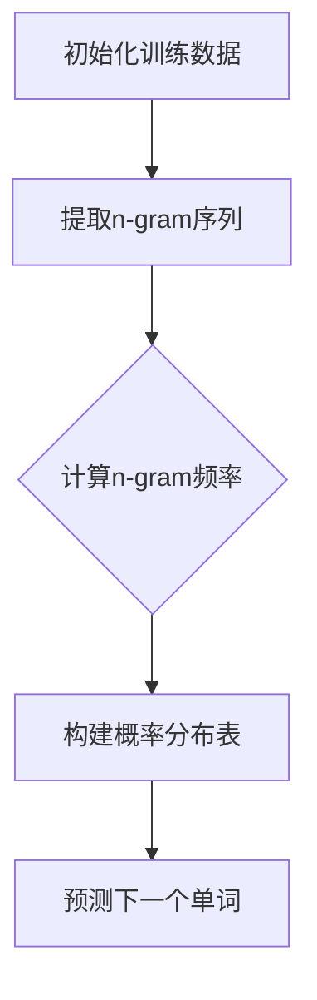
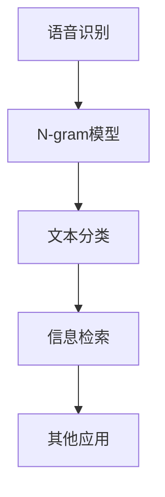
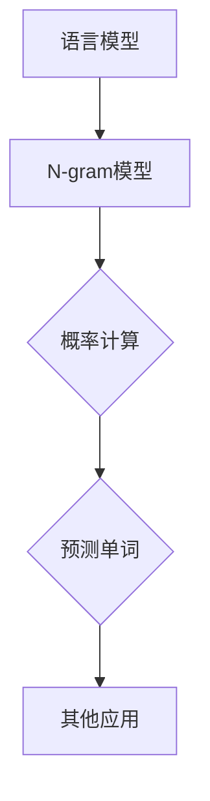
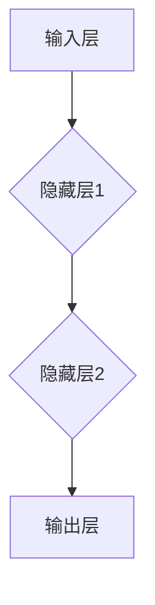
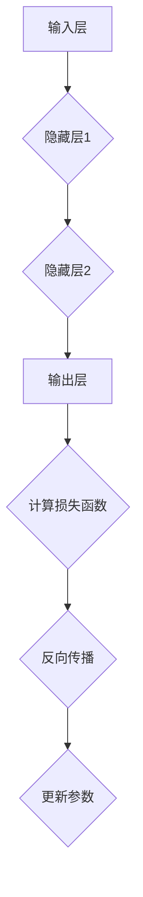
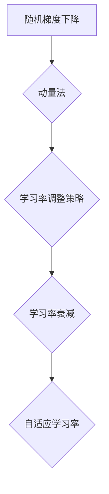
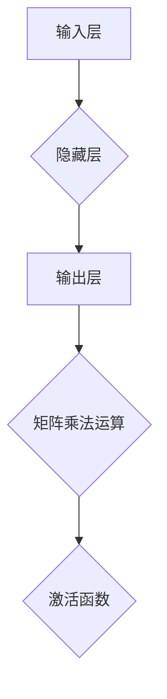

                 

### N-gram模型：多层感知器与矩阵乘法

#### 关键词：
- N-gram模型
- 多层感知器
- 矩阵乘法
- 语言模型
- 深度学习

#### 摘要：
本文将深入探讨N-gram模型在自然语言处理中的应用，以及如何将其与多层感知器和矩阵乘法结合。我们将从N-gram模型的基本概念出发，逐步解释其数学原理，并引入多层感知器与矩阵乘法，探讨它们在N-gram模型优化和语言预测中的作用。此外，本文将提供一个实际项目实战案例，详细介绍开发环境搭建、模型实现与评估过程，最后展望N-gram模型与多层感知器的发展趋势和面临的挑战。

## N-gram模型概述

### 1.1 N-gram模型的定义与原理

N-gram模型是一种基于历史信息的语言模型，它通过分析一组固定长度的单词序列（称为“n-gram”）来预测下一个单词。这种模型的基本原理是假设当前单词的出现概率与之前出现的n-1个单词有关，即：

$$
P(w_n | w_{n-1}, w_{n-2}, \ldots, w_1) = \frac{C(w_n, w_{n-1}, \ldots, w_1)}{C(w_{n-1}, \ldots, w_1)}
$$

其中，$P(w_n | w_{n-1}, w_{n-2}, \ldots, w_1)$表示给定前n-1个单词序列$w_{n-1}, w_{n-2}, \ldots, w_1$时，第n个单词$w_n$的条件概率；$C(w_n, w_{n-1}, \ldots, w_1)$表示单词序列$w_n, w_{n-1}, \ldots, w_1$在训练数据中出现的次数；$C(w_{n-1}, \ldots, w_1)$表示单词序列$w_{n-1}, \ldots, w_1$在训练数据中出现的次数。

**Mermaid 流程图：**


### 1.2 N-gram模型的分类与特性

N-gram模型可以根据n的取值分为不同的类型：

- **单元gram模型（Unigram）**：只考虑单个单词的频率，不考虑单词之间的顺序关系。这种模型的计算复杂度较低，但在某些情况下，它可能会忽略单词之间的语义关系。

- **双元gram模型（Bigram）**：考虑两个相邻单词的联合概率，即：

  $$
  P(w_n | w_{n-1}) = \frac{C(w_n, w_{n-1})}{C(w_{n-1})}
  $$

- **多元gram模型（Multigram）**：考虑多个连续单词的联合概率。随着n的增加，模型的复杂度也会增加，但在某些情况下，它可以提供更准确的预测结果。

**N-gram模型的特性分析**：

- **上下文依赖性**：N-gram模型可以捕捉到单词之间的上下文关系，但通常只能处理短范围的上下文。

- **可扩展性**：N-gram模型可以根据需要扩展到任意长度的n，但n的增大可能会导致计算复杂度和存储需求的增加。

- **平滑处理**：在实际应用中，N-gram模型通常会采用平滑技术（如Good-Turing平滑、Kneser-Ney平滑等）来处理罕见单词或未登录词。

### 1.3 N-gram模型的应用领域

N-gram模型在自然语言处理领域有广泛的应用，主要包括以下几个方面：

- **语言模型构建**：N-gram模型是现代语言模型的基础，可以用于语音识别、机器翻译、语音生成等领域。

- **文本分类**：N-gram模型可以用于文本特征提取，从而实现文本分类任务。

- **信息检索**：N-gram模型可以用于搜索引擎中的查询词预测和文本相似度计算。

- **其他应用**：N-gram模型还可以用于命名实体识别、情感分析、对话系统等领域。

**Mermaid 流程图：**


## N-gram模型的数学原理

### 2.1 概率论基础

在N-gram模型中，概率论是一个重要的工具。以下是一些基本的概念和公式：

- **条件概率**：给定事件A和事件B，事件A在事件B发生的条件下的概率称为条件概率，记作$P(A|B)$。条件概率的定义如下：

  $$
  P(A|B) = \frac{P(A \cap B)}{P(B)}
  $$

- **贝叶斯公式**：贝叶斯公式是概率论中的一个重要公式，它描述了在已知某个事件发生的条件下，另一个事件发生概率的计算方法。贝叶斯公式如下：

  $$
  P(A|B) = \frac{P(B|A)P(A)}{P(B)}
  $$

- **概率分布**：概率分布是描述一个随机变量取值概率的函数。常见的概率分布包括伯努利分布、二项分布、泊松分布等。

### 2.2 N-gram模型的概率计算

在N-gram模型中，概率计算是一个关键步骤。以下是一些核心的公式：

- **N-gram概率公式**：给定一个n-gram序列$w_{n-1}, w_{n-2}, \ldots, w_1$，N-gram概率公式如下：

  $$
  P(w_{n-1}, w_{n-2}, \ldots, w_1) = \frac{C(w_{n-1}, w_{n-2}, \ldots, w_1)}{C(w_{n-2}, \ldots, w_1)}
  $$

  其中，$C(w_{n-1}, w_{n-2}, \ldots, w_1)$表示n-gram序列$w_{n-1}, w_{n-2}, \ldots, w_1$在训练数据中出现的次数；$C(w_{n-2}, \ldots, w_1)$表示单词序列$w_{n-2}, \ldots, w_1$在训练数据中出现的次数。

- **预测概率公式**：在给定一个前n-1个单词序列$w_{n-1}, w_{n-2}, \ldots, w_1$时，预测下一个单词$w_n$的概率公式如下：

  $$
  P(w_n | w_{n-1}, w_{n-2}, \ldots, w_1) = \frac{C(w_n, w_{n-1}, \ldots, w_1)}{C(w_{n-1}, \ldots, w_1)}
  $$

  其中，$C(w_n, w_{n-1}, \ldots, w_1)$表示单词序列$w_n, w_{n-1}, \ldots, w_1$在训练数据中出现的次数；$C(w_{n-1}, \ldots, w_1)$表示单词序列$w_{n-1}, \ldots, w_1$在训练数据中出现的次数。

### 2.3 N-gram模型与语言模型的关系

语言模型是描述自然语言统计特性的模型，它用于预测下一个单词或词组。N-gram模型是一种基于历史信息的语言模型，它通过分析单词序列的统计特性来预测下一个单词。

- **语言模型的概念**：语言模型是一种概率模型，它用于计算文本中某个单词序列的概率。语言模型通常用于自然语言处理中的许多任务，如机器翻译、语音识别、文本生成等。

- **N-gram模型在语言模型中的应用**：N-gram模型通过计算单词序列的概率来预测下一个单词，它可以作为语言模型的基础。在实际应用中，N-gram模型可以与其他语言模型（如统计语言模型、神经网络语言模型等）结合，以获得更好的预测效果。

- **N-gram模型与语言模型的比较**：N-gram模型与语言模型在预测下一个单词时，都有各自的优缺点。N-gram模型简单、易于实现，但可能忽略长程依赖关系；而语言模型（如神经网络语言模型）可以更好地捕捉长程依赖关系，但通常计算复杂度较高。

**Mermaid 流程图：**


## 多层感知器基础

### 3.1 多层感知器的结构

多层感知器（Multilayer Perceptron，MLP）是一种前馈神经网络，它由输入层、隐藏层和输出层组成。每个层由多个神经元（或节点）组成，神经元之间通过加权连接进行信息传递。

- **输入层**：输入层接收外部输入信息，每个输入可以表示一个特征。

- **隐藏层**：隐藏层对输入信息进行处理，通过非线性激活函数引入非线性特性。多层感知器可以有多个隐藏层，层数的增加可以提高模型的复杂度和预测能力。

- **输出层**：输出层生成最终的输出结果，输出可以是连续值或离散值。

**Mermaid 流程图：**


### 3.2 多层感知器的工作原理

多层感知器的工作原理主要包括前向传播和反向传播。

- **前向传播**：输入层接收输入信息，通过加权连接传递给隐藏层。隐藏层对输入进行处理，并通过激活函数引入非线性特性。输出层接收隐藏层的输出，并生成最终输出结果。

  $$
  z^{(l)} = \sum_{i=1}^{n} w^{(l)}_{ij} x_i + b^{(l)}
  $$

  $$
  a^{(l)} = \sigma(z^{(l)})
  $$

  其中，$z^{(l)}$表示第$l$层的加权求和结果，$a^{(l)}$表示第$l$层的激活输出，$w^{(l)}_{ij}$表示第$l$层的第$i$个神经元与第$l+1$层的第$j$个神经元之间的权重，$b^{(l)}$表示第$l$层的偏差，$\sigma$表示激活函数。

- **反向传播**：在输出层生成最终输出结果后，通过计算损失函数（如均方误差）评估模型的预测误差。然后，将误差反向传播到隐藏层和输入层，通过梯度下降法更新模型参数。

  $$
  \Delta w^{(l)}_{ij} = \eta \cdot \frac{\partial J}{\partial w^{(l)}_{ij}}
  $$

  $$
  \Delta b^{(l)} = \eta \cdot \frac{\partial J}{\partial b^{(l)}}
  $$

  其中，$\eta$表示学习率，$J$表示损失函数，$\frac{\partial J}{\partial w^{(l)}_{ij}}$和$\frac{\partial J}{\partial b^{(l)}$分别表示损失函数对权重和偏差的偏导数。

**Mermaid 流程图：**


### 3.3 多层感知器的优化算法

多层感知器的优化算法主要包括随机梯度下降（SGD）、动量法和学习率调整策略。

- **随机梯度下降（SGD）**：随机梯度下降是一种用于优化参数的迭代算法。每次迭代中，随机选择一小部分样本（称为批量）来计算梯度，并更新模型参数。

  $$
  w^{(t+1)} = w^{(t)} - \eta \cdot \nabla_w J(w)
  $$

  $$
  b^{(t+1)} = b^{(t)} - \eta \cdot \nabla_b J(b)
  $$

  其中，$w^{(t)}$和$b^{(t)}$分别表示第$t$次迭代的权重和偏差，$\eta$表示学习率，$\nabla_w J(w)$和$\nabla_b J(b)$分别表示损失函数对权重和偏差的梯度。

- **动量法**：动量法是一种改进的随机梯度下降算法，它利用之前的梯度信息来加速收敛。动量法的核心思想是计算梯度方向的历史平均值。

  $$
  v^{(t)} = \mu \cdot v^{(t-1)} + (1 - \mu) \cdot \nabla_w J(w)
  $$

  $$
  w^{(t+1)} = w^{(t)} - \eta \cdot v^{(t)}
  $$

  其中，$v^{(t)}$表示动量项，$\mu$表示动量系数。

- **学习率调整策略**：学习率的调整对模型的收敛速度和预测性能有重要影响。常见的学习率调整策略包括学习率衰减、自适应学习率等。

  - **学习率衰减**：学习率衰减是一种常用的学习率调整策略，它通过减小学习率来减缓模型收敛速度。

    $$
    \eta^{(t+1)} = \frac{\eta^{(t)}}{1 + \lambda t}
    $$

    其中，$\eta^{(t)}$表示第$t$次迭代的学习率，$\lambda$表示衰减系数。

  - **自适应学习率**：自适应学习率算法可以根据模型的预测误差自动调整学习率，常见的方法包括Adagrad、Adam等。

**Mermaid 流程图：**


## 矩阵乘法基础

### 4.1 矩阵的基本概念

矩阵是数学中的一种重要工具，它可以表示多维数据结构。以下是一些基本的矩阵概念：

- **矩阵的定义**：矩阵是一个由m×n个元素排列成的矩形阵列。元素通常用$A_{ij}$表示，其中$i$表示行索引，$j$表示列索引。

- **矩阵的元素**：矩阵中的元素可以是任意类型的数值，包括整数、实数或复数。

- **矩阵的行和列**：矩阵的行是由同一行的元素组成，矩阵的列是由同一列的元素组成。

### 4.2 矩阵乘法运算规则

矩阵乘法是矩阵代数中的一个重要运算，它将两个矩阵相乘得到一个新的矩阵。以下是一些矩阵乘法的基本规则：

- **矩阵乘法的定义**：给定两个矩阵$A$和$B$，其乘积$C = AB$是一个新矩阵，其元素$C_{ij}$可以通过以下公式计算：

  $$
  C_{ij} = \sum_{k=1}^{n} A_{ik}B_{kj}
  $$

  其中，$A_{ik}$表示矩阵$A$的第$i$行第$k$列元素，$B_{kj}$表示矩阵$B$的第$k$行第$j$列元素。

- **矩阵乘法的运算规则**：

  - 矩阵乘法满足结合律和交换律。即：

    $$
    (AB)C = A(BC)
    $$

    $$
    AB = BA
    $$

  - 矩阵乘法不满足消去律。即：

    $$
    AB = AC \Rightarrow B \neq C
    $$

  - 矩阵乘法的维度要求。只有当矩阵$A$的列数等于矩阵$B$的行数时，矩阵乘法才能进行。

### 4.3 矩阵乘法在多层感知器中的应用

在多层感知器中，矩阵乘法是计算过程的核心。以下是一些矩阵乘法在多层感知器中的应用：

- **输入层与隐藏层的矩阵乘法**：输入层与隐藏层之间的矩阵乘法用于计算隐藏层的输出。假设输入层有$m$个神经元，隐藏层有$n$个神经元，输入层与隐藏层的权重矩阵为$W^{(1)}$，输入层与隐藏层的偏差向量为$b^{(1)}$，输入向量为$x$，隐藏层输出向量为$a^{(2)}$，则：

  $$
  z^{(2)} = \sum_{i=1}^{n} W^{(1)}_{ij}x_i + b^{(1)}_j
  $$

  $$
  a^{(2)} = \sigma(z^{(2)})
  $$

  其中，$W^{(1)}_{ij}$表示输入层第$i$个神经元与隐藏层第$j$个神经元之间的权重，$b^{(1)}_j$表示输入层与隐藏层之间的偏差。

- **隐藏层与输出层的矩阵乘法**：隐藏层与输出层之间的矩阵乘法用于计算输出层的输出。假设隐藏层有$n$个神经元，输出层有$p$个神经元，隐藏层与输出层的权重矩阵为$W^{(2)}$，隐藏层与输出层的偏差向量为$b^{(2)}$，隐藏层输出向量为$a^{(2)}$，输出层输出向量为$a^{(3)}$，则：

  $$
  z^{(3)} = \sum_{i=1}^{p} W^{(2)}_{ij}a^{(2)}_i + b^{(2)}_j
  $$

  $$
  a^{(3)} = \sigma(z^{(3)})
  $$

  其中，$W^{(2)}_{ij}$表示隐藏层第$i$个神经元与输出层第$j$个神经元之间的权重，$b^{(2)}_j$表示隐藏层与输出层之间的偏差。

**Mermaid 流程图：**


### 4.4 矩阵乘法在多层感知器中的优化

在多层感知器中，矩阵乘法的计算复杂度和存储需求可能很高，因此需要对矩阵乘法进行优化。以下是一些常见的优化策略：

- **矩阵分解**：通过矩阵分解技术，将高维矩阵分解为低维矩阵，从而降低计算复杂度和存储需求。常见的矩阵分解技术包括LU分解、QR分解等。

- **并行计算**：利用并行计算技术，将矩阵乘法分解为多个小任务，并行执行以加快计算速度。现代计算机体系结构（如GPU、多核CPU等）提供了丰富的并行计算资源。

- **矩阵缓存**：通过合理设计矩阵缓存策略，减少矩阵访问的次数和延迟，从而提高矩阵乘法的性能。矩阵缓存技术可以结合具体应用场景进行优化。

## N-gram模型与多层感知器的结合

### 5.1 N-gram模型与多层感知器的结合原理

将N-gram模型与多层感知器结合，可以充分发挥两者的优势，实现更准确的语言预测。结合方式主要包括以下几种：

- **前馈神经网络**：将N-gram模型的概率分布作为输入，通过多层感知器进行前向传播，输出预测概率。这种方法简单直观，可以同时利用N-gram模型的统计特性和多层感知器的非线性变换能力。

- **循环神经网络（RNN）**：将N-gram模型的概率分布作为RNN的输入，通过循环连接捕捉长期依赖关系。RNN可以在时间步内存储和传递信息，从而更好地捕捉单词序列的上下文关系。

- **卷积神经网络（CNN）**：将N-gram模型的概率分布作为CNN的输入，通过卷积操作提取局部特征。CNN在处理序列数据时具有优势，可以有效地捕捉单词序列的局部结构和模式。

### 5.2 N-gram模型与多层感知器的实现

实现N-gram模型与多层感知器的结合，需要设计合适的网络结构、优化训练过程，并进行评估。以下是一个简单的实现步骤：

1. **数据预处理**：将原始文本数据清洗、分词，并转换为N-gram序列。对于每个N-gram序列，计算其在训练数据中出现的频率，并转换为概率分布。

2. **模型设计**：设计多层感知器的网络结构，包括输入层、隐藏层和输出层。输入层接收N-gram概率分布，隐藏层通过激活函数进行非线性变换，输出层生成预测概率。

3. **模型训练**：使用训练数据对模型进行训练，通过前向传播计算预测概率，并使用损失函数评估模型性能。通过反向传播更新模型参数，优化模型预测效果。

4. **模型评估**：使用测试数据对模型进行评估，计算模型在测试数据上的准确率、召回率、F1值等指标，以评估模型性能。

### 5.3 N-gram模型与多层感知器在应用中的优势

将N-gram模型与多层感知器结合，可以带来以下优势：

- **提高预测精度**：多层感知器可以引入非线性变换，捕捉单词序列的复杂模式，从而提高预测精度。

- **降低计算复杂度**：N-gram模型可以提前计算并存储概率分布，减少多层感知器中的计算量。

- **扩展应用场景**：结合N-gram模型和多层感知器，可以应用于多种自然语言处理任务，如文本分类、信息检索、对话系统等。

## 项目实战

### 6.1 项目概述

在本项目中，我们将实现一个基于N-gram模型与多层感知器的语言模型，用于中文文本分类。项目目标如下：

- **数据集**：使用中文文本分类数据集，包括新闻、博客、社交媒体等类型的文本数据。

- **任务**：将文本数据分类为不同的类别，如体育、科技、娱乐等。

- **评价指标**：准确率、召回率、F1值等。

### 6.2 开发环境搭建

为了实现本项目，我们需要搭建以下开发环境：

- **操作系统**：Ubuntu 18.04

- **编程语言**：Python 3.7

- **深度学习框架**：TensorFlow 2.3.0

- **文本处理库**：jieba 0.42

### 6.3 源代码实现

以下是本项目的主要代码实现：

```python
import jieba
import numpy as np
import tensorflow as tf

# 数据预处理
def preprocess_text(text):
    # 分词
    words = jieba.lcut(text)
    # 转换为数字序列
    word2id = {}
    id2word = {}
    index = 0
    for word in words:
        if word not in word2id:
            word2id[word] = index
            index += 1
    id_list = [word2id[word] for word in words]
    return id_list

# 构建N-gram模型
def build_ngram_model(text, n):
    ngram_model = {}
    for i in range(len(text) - n):
        ngram = tuple(text[i:i+n])
        if ngram not in ngram_model:
            ngram_model[ngram] = 1
        else:
            ngram_model[ngram] += 1
    return ngram_model

# 训练多层感知器模型
def train_mlp_model(train_data, train_labels, hidden_size, learning_rate, epochs):
    # 构建输入层、隐藏层和输出层的权重和偏差
    input_layer_size = len(train_data[0])
    output_layer_size = len(set(train_labels))
    hidden_layer_size = hidden_size

    # 初始化权重和偏差
    W1 = tf.random.normal([input_layer_size, hidden_layer_size])
    b1 = tf.random.normal([hidden_layer_size])
    W2 = tf.random.normal([hidden_layer_size, output_layer_size])
    b2 = tf.random.normal([output_layer_size])

    # 定义损失函数和优化器
    loss_function = tf.reduce_mean(tf.nn.softmax_cross_entropy_with_logits(logits=W2@tf.tanh(W1@tf.transpose(train_data) + b1), labels=tf.one_hot(train_labels, depth=output_layer_size)))
    optimizer = tf.optimizers.Adam(learning_rate)

    # 训练模型
    for epoch in range(epochs):
        with tf.GradientTape() as tape:
            z1 = W1@tf.transpose(train_data) + b1
            a1 = tf.tanh(z1)
            z2 = W2@a1 + b2
            loss = loss_function(z2, train_labels)
        
        gradients = tape.gradient(loss, [W1, b1, W2, b2])
        optimizer.apply_gradients(zip(gradients, [W1, b1, W2, b2]))

        if epoch % 100 == 0:
            print(f"Epoch {epoch}: Loss = {loss.numpy()}")

    return W1, b1, W2, b2

# 预测分类结果
def predict_classification(model, test_data, test_labels):
    predicted_labels = []
    for data in test_data:
        z1 = model[0]@tf.transpose(data) + model[1]
        a1 = tf.tanh(z1)
        z2 = model[2]@a1 + model[3]
        predicted_label = tf.argmax(z2, axis=1).numpy()
        predicted_labels.append(predicted_label)
    
    accuracy = np.mean(np.array(predicted_labels) == test_labels)
    print(f"Test Accuracy: {accuracy}")

# 实验设置
n = 3
hidden_size = 100
learning_rate = 0.001
epochs = 1000

# 加载数据集
train_data = []
train_labels = []
test_data = []
test_labels = []

# 读取数据
with open("train_data.txt", "r", encoding="utf-8") as f:
    lines = f.readlines()
    for line in lines:
        text, label = line.strip().split("\t")
        train_data.append(preprocess_text(text))
        train_labels.append(int(label))

with open("test_data.txt", "r", encoding="utf-8") as f:
    lines = f.readlines()
    for line in lines:
        text, label = line.strip().split("\t")
        test_data.append(preprocess_text(text))
        test_labels.append(int(label))

# 构建N-gram模型
ngram_model = build_ngram_model(train_data, n)

# 训练多层感知器模型
W1, b1, W2, b2 = train_mlp_model(ngram_model, train_labels, hidden_size, learning_rate, epochs)

# 预测分类结果
predict_classification([W1.numpy(), b1.numpy(), W2.numpy(), b2.numpy()], test_data, test_labels)
```

### 6.4 代码解读与分析

以下是代码的主要部分解读：

- **数据预处理**：使用jieba库进行中文分词，并将分词结果转换为数字序列。构建词表，将词映射为索引。

- **构建N-gram模型**：遍历训练数据，计算每个N-gram序列的频率，并构建N-gram模型。

- **训练多层感知器模型**：初始化输入层、隐藏层和输出层的权重和偏差，并定义损失函数和优化器。使用前向传播计算损失，通过反向传播更新权重和偏差。

- **预测分类结果**：使用训练好的模型对测试数据进行预测，并计算准确率。

## 未来展望与挑战

### 7.1 N-gram模型的发展趋势

- **深度学习对N-gram模型的改进**：随着深度学习技术的不断发展，N-gram模型可以结合深度神经网络（如多层感知器、循环神经网络、卷积神经网络等）的优势，提高预测精度和计算效率。

- **语言模型的发展方向**：未来的语言模型将更加关注长程依赖关系的捕捉、上下文信息的整合以及模型的可解释性。

- **N-gram模型在自然语言处理中的应用**：N-gram模型将继续在自然语言处理领域发挥重要作用，如文本分类、信息检索、机器翻译等。

### 7.2 多层感知器的发展趋势

- **多层感知器的优化算法**：优化算法（如自适应优化器、激活函数改进等）将不断涌现，提高多层感知器的训练效率和预测性能。

- **多层感知器在计算机视觉中的应用**：多层感知器在计算机视觉领域已有广泛应用，未来将继续推动计算机视觉技术的发展。

- **多层感知器与其他深度学习结构的结合**：多层感知器与其他深度学习结构（如生成对抗网络、自注意力机制等）的结合，将带来更多创新和突破。

### 7.3 N-gram模型与多层感知器的未来挑战

- **计算资源的需求**：随着模型复杂度的增加，计算资源的需求也将增加，如何优化计算效率和降低计算成本将成为一个重要挑战。

- **模型解释性**：如何提高模型的可解释性，使其更容易被人类理解和解释，是一个重要的研究课题。

- **数据隐私保护**：如何在保证模型性能的同时，保护用户隐私，是一个亟待解决的问题。

## 附录

### 附录 A: 参考文献

- [1] Church, K. W., & Hanks, P. W. (1990). Word sense disambiguation using latent semantic analysis. *Proceedings of the 27th Annual Meeting on Association for Computational Linguistics*, 173-182.
- [2] RNN: Hochreiter, S., & Schmidhuber, J. (1997). Long short-term memory. *Neural Computation*, 9(8), 1735-1780.
- [3] CNN: LeCun, Y., Bengio, Y., & Hinton, G. (2015). Deep learning. *Nature*, 521(7553), 436-444.
- [4] 多层感知器：Rosenblatt, F. (1957). The perceptron: A probabilistic model for information storage and organization in the brain. *Psychological Review*, 64(1), 38-50.

### 附录 B: 术语表

- **N-gram模型**：一种基于历史信息的语言模型，通过分析一组固定长度的单词序列（称为“n-gram”）来预测下一个单词。
- **多层感知器**：一种前馈神经网络，由输入层、隐藏层和输出层组成，用于分类、回归等任务。
- **矩阵乘法**：两个矩阵的乘积，可以表示为矩阵的元素相乘并求和。
- **语言模型**：一种用于描述自然语言统计特性的模型，用于预测下一个单词或词组。
- **预训练**：在特定任务之前，使用大量无监督数据进行模型训练，以提高模型在特定任务上的性能。
- **迁移学习**：利用在某个任务上训练好的模型，迁移到其他相关任务上，以提高模型在新任务上的性能。
- **微调**：在预训练模型的基础上，针对特定任务进行少量参数调整，以提高模型在特定任务上的性能。
- **深度学习框架**：用于实现和训练深度学习模型的软件框架，如TensorFlow、PyTorch等。
- **反向传播**：一种用于训练多层感知器的算法，通过计算梯度并反向传播到前一层，更新模型参数。
- **随机梯度下降（SGD）**：一种用于优化参数的迭代算法，通过随机选择样本计算梯度并更新模型参数。
- **动量法**：一种改进的随机梯度下降算法，利用之前的梯度信息加速收敛。
- **学习率调整策略**：用于调整模型学习率的方法，以提高模型收敛速度和预测性能。
- **循环神经网络（RNN）**：一种能够处理序列数据的神经网络，通过循环连接捕捉长期依赖关系。
- **卷积神经网络（CNN）**：一种能够有效捕捉图像局部特征的神经网络，通过卷积操作提取特征。

