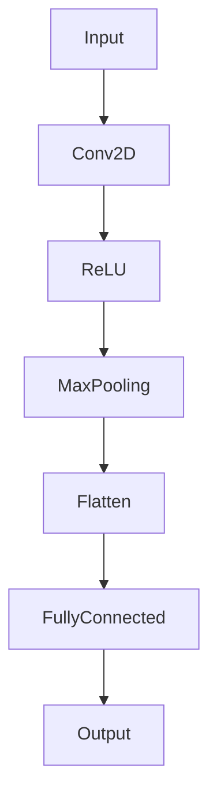

                 

## 《ONNX：开放式神经网络交换格式》

### 关键词：ONNX，深度学习，神经网络交换格式，跨平台部署，模型兼容性

### 摘要：

本文将深入探讨ONNX（开放式神经网络交换格式）的核心概念、架构和应用。首先，我们将介绍ONNX的背景和重要性，分析其与主流深度学习框架的兼容性。接着，我们将详细阐述ONNX模型的基本组成、核心运算符以及构建和优化的方法。随后，通过实际项目案例展示ONNX在深度学习应用中的实践。最后，我们将展望ONNX生态系统的发展，探讨其在未来人工智能领域的潜在影响。通过本文，读者将全面了解ONNX的优势和应用场景，为在深度学习项目中有效利用ONNX打下坚实基础。

### 《ONNX：开放式神经网络交换格式》目录大纲

#### 第一部分：ONNX概述

- **第1章：ONNX简介**
  - 1.1 ONNX的背景与重要性
    - 1.1.1 ONNX的产生背景
    - 1.1.2 ONNX的意义
    - 1.1.3 ONNX的应用场景
  - 1.2 ONNX的核心概念与架构
    - 1.2.1 ONNX的模型定义
    - 1.2.2 ONNX的运算符集
    - 1.2.3 ONNX的运行时环境
  - 1.3 ONNX与主流深度学习框架的兼容性
    - 1.3.1 ONNX与TensorFlow的兼容性
    - 1.3.2 ONNX与PyTorch的兼容性
    - 1.3.3 ONNX与其他深度学习框架的兼容性
  - 1.4 ONNX在工业界的应用案例
    - 1.4.1 企业级应用的实例
    - 1.4.2 跨平台部署的优势
    - 1.4.3 ONNX的生态系统

#### 第二部分：ONNX基础

- **第2章：ONNX模型构建基础**
  - 2.1 ONNX模型的基本组成
    - 2.1.1 图（Graph）的定义与结构
    - 2.1.2 张量（Tensor）的类型与属性
    - 2.1.3 运算符（Operator）的类型与属性
  - 2.2 ONNX模型构建工具
    - 2.2.1 手动编写ONNX模型
    - 2.2.2 使用ONNX运行时构建模型
    - 2.2.3 基于Python的模型构建工具
  - 2.3 ONNX模型验证与优化
    - 2.3.1 模型验证的方法
    - 2.3.2 模型优化的策略
    - 2.3.3 性能调优实践

#### 第三部分：ONNX核心运算符

- **第3章：ONNX核心运算符详解**
  - 3.1 常用运算符
    - 3.1.1 矩阵运算符
    - 3.1.2 神经网络运算符
    - 3.1.3 索引与搜索运算符
  - 3.2 特殊运算符
    - 3.2.1 循环与控制流运算符
    - 3.2.2 张量生成与变换运算符
    - 3.2.3 伪运算符
  - 3.3 运算符的扩展与自定义
    - 3.3.1 运算符的扩展原理
    - 3.3.2 运算符的自定义实现
    - 3.3.3 运算符的集成与测试

#### 第四部分：ONNX应用实战

- **第4章：ONNX在深度学习项目中的应用**
  - 4.1 项目需求分析
    - 4.1.1 项目背景与目标
    - 4.1.2 项目技术选型
    - 4.1.3 项目实施计划
  - 4.2 模型设计
    - 4.2.1 数据预处理
    - 4.2.2 模型架构选择
    - 4.2.3 模型参数调整
  - 4.3 模型训练与优化
    - 4.3.1 训练流程
    - 4.3.2 优化策略
    - 4.3.3 性能调优实践
  - 4.4 模型部署与监控
    - 4.4.1 部署方案
    - 4.4.2 模型监控与运维
    - 4.4.3 部署经验与教训

#### 第五部分：ONNX生态系统与未来展望

- **第5章：ONNX生态系统与未来发展**
  - 5.1 ONNX社区与贡献者
    - 5.1.1 ONNX社区概况
    - 5.1.2 贡献者与角色
    - 5.1.3 社区合作与交流
  - 5.2 ONNX标准化进程
    - 5.2.1 标准化组织与流程
    - 5.2.2 ONNX标准的发展历程
    - 5.2.3 ONNX标准化的意义
  - 5.3 ONNX的未来发展方向
    - 5.3.1 ONNX在跨平台部署中的应用
    - 5.3.2 ONNX在边缘计算中的机遇与挑战
    - 5.3.3 ONNX在AI芯片领域的潜力

#### 附录

- **附录A：ONNX开发工具与资源**
  - 5.1 ONNX官方工具
    - 5.1.1 ONNX Runtime
    - 5.1.2 ONNX Model Zoo
    - 5.1.3 ONNX Python SDK
  - 5.2 第三方工具
    - 5.2.1 ONNX-TensorFlow
    - 5.2.2 ONNX-PyTorch
    - 5.2.3 ONNX-Swiggy
  - 5.3 学习与参考资源
    - 5.3.1 ONNX官方文档
    - 5.3.2 ONNX相关博客与文章
    - 5.3.3 ONNX开源项目与社区活动

### 第一部分：ONNX概述

#### 第1章：ONNX简介

### 1.1 ONNX的背景与重要性

### 1.1.1 ONNX的产生背景

ONNX（Open Neural Network Exchange）的诞生，源于深度学习领域日益增长的需求——模型的可移植性和互操作性。传统的深度学习框架如TensorFlow、PyTorch等，虽然功能强大，但各自为政，模型在不同框架之间无法直接共享和转换，这给研究人员和开发者在模型迁移、复用和优化过程中带来了诸多不便。

为了解决这一问题，微软和Facebook在2016年联合发布了ONNX，旨在定义一种开放且可扩展的神经网络交换格式，使得不同深度学习框架之间的模型可以无缝转换和共享。此后，谷歌、亚马逊等公司也纷纷加入ONNX社区，共同推动ONNX的发展和完善。

### 1.1.2 ONNX的意义

ONNX的出现具有重要意义，主要体现在以下几个方面：

1. **模型可移植性**：ONNX提供了一种统一的模型表示方式，使得深度学习模型可以在不同的框架之间自由转换，从而提高模型的复用性和可移植性。
2. **跨平台部署**：通过ONNX，深度学习模型可以在多种硬件平台上（如CPU、GPU、FPGA等）高效部署和执行，实现模型的跨平台优化和资源利用。
3. **优化和性能提升**：ONNX使得模型可以在不同的后端优化器上进行优化，从而提高模型的推理性能和能效比。
4. **合作与交流**：ONNX社区吸引了全球范围内的研究机构和科技公司，共同推动深度学习技术的发展和应用。

### 1.1.3 ONNX的应用场景

ONNX在深度学习领域有着广泛的应用场景，主要包括以下几个方面：

1. **模型复用和迁移**：研究人员可以使用ONNX将一个框架中的模型转换为另一个框架，方便模型在不同环境中的复用和迁移。
2. **跨平台部署**：开发者可以将训练好的模型转换为ONNX格式，然后在不同的硬件平台上部署和运行，实现模型的跨平台优化。
3. **模型优化和推理**：通过ONNX，开发者可以使用不同的后端优化器对模型进行优化，从而提高模型的推理速度和性能。
4. **跨框架集成**：ONNX可以作为桥梁，连接不同的深度学习框架，实现框架之间的无缝集成和协作。

### 1.2 ONNX的核心概念与架构

#### 1.2.1 ONNX的模型定义

ONNX模型由三个主要部分组成：**图（Graph）**、**运算符（Operator）**和**张量（Tensor）**。

1. **图（Graph）**：图是ONNX模型的基本结构，表示模型中所有的运算符和它们之间的连接关系。图中的每个节点都是一个运算符，每个边表示运算符之间的数据流动。
2. **运算符（Operator）**：运算符是ONNX模型中的基本计算单元，表示具体的数学运算或数据处理操作。ONNX定义了多种标准的运算符，如矩阵运算、卷积、池化、激活函数等。
3. **张量（Tensor）**：张量是ONNX模型中的数据类型，表示多维数组。ONNX模型中的所有数据都通过张量进行传递和存储。

**核心概念与联系：**

以下是一个简单的ONNX模型Mermaid流程图，展示了模型的基本组成和运算符之间的数据流动关系：



在这个示例中，输入张量首先通过卷积运算符进行特征提取，然后通过ReLU激活函数和MaxPooling池化层进行非线性变换和降维处理，接着通过Flatten运算符将多维数据展平为一维数据，最后通过全连接层进行分类，输出结果。

#### 1.2.2 ONNX的运算符集

ONNX定义了一系列标准的运算符，涵盖了深度学习中最常用的数学运算和数据处理操作。这些运算符可以分为以下几类：

1. **基础运算符**：包括加法、减法、乘法、除法等基本的算术运算符。
2. **矩阵运算符**：包括矩阵乘法、矩阵求逆、矩阵分解等矩阵相关的运算符。
3. **神经网络运算符**：包括卷积、池化、激活函数、全连接层等神经网络中常用的运算符。
4. **张量操作运算符**：包括张量生成、张量变换、张量索引等操作张量的运算符。
5. **控制流运算符**：包括循环、条件分支等用于控制程序执行流程的运算符。
6. **其他运算符**：包括伪运算符、自定义运算符等用于扩展和定制运算符的运算符。

以下是一个简单的ONNX运算符集Mermaid流程图，展示了ONNX中一些常见运算符的示例：

```mermaid
graph TD
A[Add] --> B[Multiply]
B --> C[MatMul]
C --> D[Conv]
D --> E[ReLU]
E --> F[MaxPooling]
F --> G[Flatten]
G --> H[ FullyConnected]
H --> I[Reshape]
I --> J[Transpose]
J --> K[Concat]
K --> L[Loop]
L --> M[If]
M --> N[Custom]
N --> O[Shape]
O --> P[Constant]
P --> Q[Select]
Q --> R[Dropout]
R --> S[Pow]
S --> T[Exp]
T --> U[Log]
U --> V[Sigmoid]
V --> W[Tanh]
W --> X[Reduce]
X --> Y[NonZero]
Y --> Z[Merge]
Z --> A[Unsqueeze]
A --> B[Cast]
B --> C[Clip]
C --> D[TopK]
D --> E[ArgMax]
E --> F[Range]
F --> G[MatMulTranspose]
G --> H[Summarize]
H --> I[Split]
I --> J[Tile]
J --> K[StridedSlice]
K --> L[NonStridedSlice]
L --> M[Gather]
M --> N[Scatter]
N --> O[Pad]
O --> P[NonMaxSuppression]
P --> Q[Softmax]
Q --> R[BatchNormalization]
R --> S[Merge]
S --> T[Split]
T --> U[Scatter]
U --> V[Unsqueeze]
V --> W[Transpose]
W --> X[Concat]
X --> Y[Loop]
Y --> Z[If]
Z --> A[Custom]
A --> B[Custom]
B --> C[Custom]
C --> D[Custom]
D --> E[Custom]
E --> F[Custom]
F --> G[Custom]
G --> H[Custom]
H --> I[Custom]
I --> J[Custom]
J --> K[Custom]
K --> L[Custom]
L --> M[Custom]
M --> N[Custom]
N --> O[Custom]
O --> P[Custom]
P --> Q[Custom]
Q --> R[Custom]
R --> S[Custom]
S --> T[Custom]
T --> U[Custom]
U --> V[Custom]
V --> W[Custom]
W --> X[Custom]
X --> Y[Custom]
Y --> Z[Custom]
Z --> A[Custom]
A --> B[Custom]
B --> C[Custom]
C --> D[Custom]
D --> E[Custom]
E --> F[Custom]
F --> G[Custom]
G --> H[Custom]
H --> I[Custom]
I --> J[Custom]
J --> K[Custom]
K --> L[Custom]
L --> M[Custom]
M --> N[Custom]
N --> O[Custom]
O --> P[Custom]
P --> Q[Custom]
Q --> R[Custom]
R --> S[Custom]
S --> T[Custom]
T --> U[Custom]
U --> V[Custom]
V --> W[Custom]
W --> X[Custom]
X --> Y[Custom]
Y --> Z[Custom]
Z --> A[Custom]
A --> B[Custom]
B --> C[Custom]
C --> D[Custom]
D --> E[Custom]
E --> F[Custom]
F --> G[Custom]
G --> H[Custom]
H --> I[Custom]
I --> J[Custom]
J --> K[Custom]
K --> L[Custom]
L --> M[Custom]
M --> N[Custom]
N --> O[Custom]
O --> P[Custom]
P --> Q[Custom]
Q --> R[Custom]
R --> S[Custom]
S --> T[Custom]
T --> U[Custom]
U --> V[Custom]
V --> W[Custom]
W --> X[Custom]
X --> Y[Custom]
Y --> Z[Custom]
Z --> A[Custom]
A --> B[Custom]
B --> C[Custom]
C --> D[Custom]
D --> E[Custom]
E --> F[Custom]
F --> G[Custom]
G --> H[Custom]
H --> I[Custom]
I --> J[Custom]
J --> K[Custom]
K --> L[Custom]
L --> M[Custom]
M --> N[Custom]
N --> O[Custom]
O --> P[Custom]
P --> Q[Custom]
Q --> R[Custom]
R --> S[Custom]
S --> T[Custom]
T --> U[Custom]
U --> V[Custom]
V --> W[Custom]
W --> X[Custom]
X --> Y[Custom]
Y --> Z[Custom]
Z --> A[Custom]
A --> B[Custom]
B --> C[Custom]
C --> D[Custom]
D --> E[Custom]
E --> F[Custom]
F --> G[Custom]
G --> H[Custom]
H --> I[Custom]
I --> J[Custom]
J --> K[Custom]
K --> L[Custom]
L --> M[Custom]
M --> N[Custom]
N --> O[Custom]
O --> P[Custom]
P --> Q[Custom]
Q --> R[Custom]
R --> S[Custom]
S --> T[Custom]
T --> U[Custom]
U --> V[Custom]
V --> W[Custom]
W --> X[Custom]
X --> Y[Custom]
Y --> Z[Custom]
Z --> A[Custom]
A --> B[Custom]
B --> C[Custom]
C --> D[Custom]
D --> E[Custom]
E --> F[Custom]
F --> G[Custom]
G --> H[Custom]
H --> I[Custom]
I --> J[Custom]
J --> K[Custom]
K --> L[Custom]
L --> M[Custom]
M --> N[Custom]
N --> O[Custom]
O --> P[Custom]
P --> Q[Custom]
Q --> R[Custom]
R --> S[Custom]
S --> T[Custom]
T --> U[Custom]
U --> V[Custom]
V --> W[Custom]
W --> X[Custom]
X --> Y[Custom]
Y --> Z[Custom]
Z --> A[Custom]
A --> B[Custom]
B --> C[Custom]
C --> D[Custom]
D --> E[Custom]
E --> F[Custom]
F --> G[Custom]
G --> H[Custom]
H --> I[Custom]
I --> J[Custom]
J --> K[Custom]
K --> L[Custom]
L --> M[Custom]
M --> N[Custom]
N --> O[Custom]
O --> P[Custom]
P --> Q[Custom]
Q --> R[Custom]
R --> S[Custom]
S --> T[Custom]
T --> U[Custom]
U --> V[Custom]
V --> W[Custom]
W --> X[Custom]
X --> Y[Custom]
Y --> Z[Custom]
Z --> A[Custom]
A --> B[Custom]
B --> C[Custom]
C --> D[Custom]
D --> E[Custom]
E --> F[Custom]
F --> G[Custom]
G --> H[Custom]
H --> I[Custom]
I --> J[Custom]
J --> K[Custom]
K --> L[Custom]
L --> M[Custom]
M --> N[Custom]
N --> O[Custom]
O --> P[Custom]
P --> Q[Custom]
Q --> R[Custom]
R --> S[Custom]
S --> T[Custom]
T --> U[Custom]
U --> V[Custom]
V --> W[Custom]
W --> X[Custom]
X --> Y[Custom]
Y --> Z[Custom]
Z --> A[Custom]
A --> B[Custom]
B --> C[Custom]
C --> D[Custom]
D --> E[Custom]
E --> F[Custom]
F --> G[Custom]
G --> H[Custom]
H --> I[Custom]
I --> J[Custom]
J --> K[Custom]
K --> L[Custom]
L --> M[Custom]
M --> N[Custom]
N --> O[Custom]
O --> P[Custom]
P --> Q[Custom]
Q --> R[Custom]
R --> S[Custom]
S --> T[Custom]
T --> U[Custom]
U --> V[Custom]
V --> W[Custom]
W --> X[Custom]
X --> Y[Custom]
Y --> Z[Custom]
Z --> A[Custom]
A --> B[Custom]
B --> C[Custom]
C --> D[Custom]
D --> E[Custom]
E --> F[Custom]
F --> G[Custom]
G --> H[Custom]
H --> I[Custom]
I --> J[Custom]
J --> K[Custom]
K --> L[Custom]
L --> M[Custom]
M --> N[Custom]
N --> O[Custom]
O --> P[Custom]
P --> Q[Custom]
Q --> R[Custom]
R --> S[Custom]
S --> T[Custom]
T --> U[Custom]
U --> V[Custom]
V --> W[Custom]
W --> X[Custom]
X --> Y[Custom]
Y --> Z[Custom]
Z --> A[Custom]
A --> B[Custom]
B --> C[Custom]
C --> D[Custom]
D --> E[Custom]
E --> F[Custom]
F --> G[Custom]
G --> H[Custom]
H --> I[Custom]
I --> J[Custom]
J --> K[Custom]
K --> L[Custom]
L --> M[Custom]
M --> N[Custom]
N --> O[Custom]
O --> P[Custom]
P --> Q[Custom]
Q --> R[Custom]
R --> S[Custom]
S --> T[Custom]
T --> U[Custom]
U --> V[Custom]
V --> W[Custom]
W --> X[Custom]
X --> Y[Custom]
Y --> Z[Custom]
Z --> A[Custom]
A --> B[Custom]
B --> C[Custom]
C --> D[Custom]
D --> E[Custom]
E --> F[Custom]
F --> G[Custom]
G --> H[Custom]
H --> I[Custom]
I --> J[Custom]
J --> K[Custom]
K --> L[Custom]
L --> M[Custom]
M --> N[Custom]
N --> O[Custom]
O --> P[Custom]
P --> Q[Custom]
Q --> R[Custom]
R --> S[Custom]
S --> T[Custom]
T --> U[Custom]
U --> V[Custom]
V --> W[Custom]
W --> X[Custom]
X --> Y[Custom]
Y --> Z[Custom]
Z --> A[Custom]
A --> B[Custom]
B --> C[Custom]
C --> D[Custom]
D --> E[Custom]
E --> F[Custom]
F --> G[Custom]
G --> H[Custom]
H --> I[Custom]
I --> J[Custom]
J --> K[Custom]
K --> L[Custom]
L --> M[Custom]
M --> N[Custom]
N --> O[Custom]
O --> P[Custom]
P --> Q[Custom]
Q --> R[Custom]
R --> S[Custom]
S --> T[Custom]
T --> U[Custom]
U --> V[Custom]
V --> W[Custom]
W --> X[Custom]
X --> Y[Custom]
Y --> Z[Custom]
Z --> A[Custom]
A --> B[Custom]
B --> C[Custom]
C --> D[Custom]
D --> E[Custom]
E --> F[Custom]
F --> G[Custom]
G --> H[Custom]
H --> I[Custom]
I --> J[Custom]
J --> K[Custom]
K --> L[Custom]
L --> M[Custom]
M --> N[Custom]
N --> O[Custom]
O --> P[Custom]
P --> Q[Custom]
Q --> R[Custom]
R --> S[Custom]
S --> T[Custom]
T --> U[Custom]
U --> V[Custom]
V --> W[Custom]
W --> X[Custom]
X --> Y[Custom]
Y --> Z[Custom]
Z --> A[Custom]
A --> B[Custom]
B --> C[Custom]
C --> D[Custom]
D --> E[Custom]
E --> F[Custom]
F --> G[Custom]
G --> H[Custom]
H --> I[Custom]
I --> J[Custom]
J --> K[Custom]
K --> L[Custom]
L --> M[Custom]
M --> N[Custom]
N --> O[Custom]
O --> P[Custom]
P --> Q[Custom]
Q --> R[Custom]
R --> S[Custom]
S --> T[Custom]
T --> U[Custom]
U --> V[Custom]
V --> W[Custom]
W --> X[Custom]
X --> Y[Custom]
Y --> Z[Custom]
Z --> A[Custom]
A --> B[Custom]
B --> C[Custom]
C --> D[Custom]
D --> E[Custom]
E --> F[Custom]
F --> G[Custom]
G --> H[Custom]
H --> I[Custom]
I --> J[Custom]
J --> K[Custom]
K --> L[Custom]
L --> M[Custom]
M --> N[Custom]
N --> O[Custom]
O --> P[Custom]
P --> Q[Custom]
Q --> R[Custom]
R --> S[Custom]
S --> T[Custom]
T --> U[Custom]
U --> V[Custom]
V --> W[Custom]
W --> X[Custom]
X --> Y[Custom]
Y --> Z[Custom]
Z --> A[Custom]
A --> B[Custom]
B --> C[Custom]
C --> D[Custom]
D --> E[Custom]
E --> F[Custom]
F --> G[Custom]
G --> H[Custom]
H --> I[Custom]
I --> J[Custom]
J --> K[Custom]
K --> L[Custom]
L --> M[Custom]
M --> N[Custom]
N --> O[Custom]
O --> P[Custom]
P --> Q[Custom]
Q --> R[Custom]
R --> S[Custom]
S --> T[Custom]
T --> U[Custom]
U --> V[Custom]
V --> W[Custom]
W --> X[Custom]
X --> Y[Custom]
Y --> Z[Custom]
Z --> A[Custom]
A --> B[Custom]
B --> C[Custom]
C --> D[Custom]
D --> E[Custom]
E --> F[Custom]
F --> G[Custom]
G --> H[Custom]
H --> I[Custom]
I --> J[Custom]
J --> K[Custom]
K --> L[Custom]
L --> M[Custom]
M --> N[Custom]
N --> O[Custom]
O --> P[Custom]
P --> Q[Custom]
Q --> R[Custom]
R --> S[Custom]
S --> T[Custom]
T --> U[Custom]
U --> V[Custom]
V --> W[Custom]
W --> X[Custom]
X --> Y[Custom]
Y --> Z[Custom]
Z --> A[Custom]
A --> B[Custom]
B --> C[Custom]
C --> D[Custom]
D --> E[Custom]
E --> F[Custom]
F --> G[Custom]
G --> H[Custom]
H --> I[Custom]
I --> J[Custom]
J --> K[Custom]
K --> L[Custom]
L --> M[Custom]
M --> N[Custom]
N --> O[Custom]
O --> P[Custom]
P --> Q[Custom]
Q --> R[Custom]
R --> S[Custom]
S --> T[Custom]
T --> U[Custom]
U --> V[Custom]
V --> W[Custom]
W --> X[Custom]
X --> Y[Custom]
Y --> Z[Custom]
Z --> A[Custom]
A --> B[Custom]
B --> C[Custom]
C --> D[Custom]
D --> E[Custom]
E --> F[Custom]
F --> G[Custom]
G --> H[Custom]
H --> I[Custom]
I --> J[Custom]
J --> K[Custom]
K --> L[Custom]
L --> M[Custom]
M --> N[Custom]
N --> O[Custom]
O --> P[Custom]
P --> Q[Custom]
Q --> R[Custom]
R --> S[Custom]
S --> T[Custom]
T --> U[Custom]
U --> V[Custom]
V --> W[Custom]
W --> X[Custom]
X --> Y[Custom]
Y --> Z[Custom]
Z --> A[Custom]
A --> B[Custom]
B --> C[Custom]
C --> D[Custom]
D --> E[Custom]
E --> F[Custom]
F --> G[Custom]
G --> H[Custom]
H --> I[Custom]
I --> J[Custom]
J --> K[Custom]
K --> L[Custom]
L --> M[Custom]
M --> N[Custom]
N --> O[Custom]
O --> P[Custom]
P --> Q[Custom]
Q --> R[Custom]
R --> S[Custom]
S --> T[Custom]
T --> U[Custom]
U --> V[Custom]
V --> W[Custom]
W --> X[Custom]
X --> Y[Custom]
Y --> Z[Custom]
Z --> A[Custom]
A --> B[Custom]
B --> C[Custom]
C --> D[Custom]
D --> E[Custom]
E --> F[Custom]
F --> G[Custom]
G --> H[Custom]
H --> I[Custom]
I --> J[Custom]
J --> K[Custom]
K --> L[Custom]
L --> M[Custom]
M --> N[Custom]
N --> O[Custom]
O --> P[Custom]
P --> Q[Custom]
Q --> R[Custom]
R --> S[Custom]
S --> T[Custom]
T --> U[Custom]
U --> V[Custom]
V --> W[Custom]
W --> X[Custom]
X --> Y[Custom]
Y --> Z[Custom]
Z --> A[Custom]
A --> B[Custom]
B --> C[Custom]
C --> D[Custom]
D --> E[Custom]
E --> F[Custom]
F --> G[Custom]
G --> H[Custom]
H --> I[Custom]
I --> J[Custom]
J --> K[Custom]
K --> L[Custom]
L --> M[Custom]
M --> N[Custom]
N --> O[Custom]
O --> P[Custom]
P --> Q[Custom]
Q --> R[Custom]
R --> S[Custom]
S --> T[Custom]
T --> U[Custom]
U --> V[Custom]
V --> W[Custom]
W --> X[Custom]
X --> Y[Custom]
Y --> Z[Custom]
Z --> A[Custom]
A --> B[Custom]
B --> C[Custom]
C --> D[Custom]
D --> E[Custom]
E --> F[Custom]
F --> G[Custom]
G --> H[Custom]
H --> I[Custom]
I --> J[Custom]
J --> K[Custom]
K --> L[Custom]
L --> M[Custom]
M --> N[Custom]
N --> O[Custom]
O --> P[Custom]
P --> Q[Custom]
Q --> R[Custom]
R --> S[Custom]
S --> T[Custom]
T --> U[Custom]
U --> V[Custom]
V --> W[Custom]
W --> X[Custom]
X --> Y[Custom]
Y --> Z[Custom]
Z --> A[Custom]
A --> B[Custom]
B --> C[Custom]
C --> D[Custom]
D --> E[Custom]
E --> F[Custom]
F --> G[Custom]
G --> H[Custom]
H --> I[Custom]
I --> J[Custom]
J --> K[Custom]
K --> L[Custom]
L --> M[Custom]
M --> N[Custom]
N --> O[Custom]
O --> P[Custom]
P --> Q[Custom]
Q --> R[Custom]
R --> S[Custom]
S --> T[Custom]
T --> U[Custom]
U --> V[Custom]
V --> W[Custom]
W --> X[Custom]
X --> Y[Custom]
Y --> Z[Custom]
Z --> A[Custom]
A --> B[Custom]
B --> C[Custom]
C --> D[Custom]
D --> E[Custom]
E --> F[Custom]
F --> G[Custom]
G --> H[Custom]
H --> I[Custom]
I --> J[Custom]
J --> K[Custom]
K --> L[Custom]
L --> M[Custom]
M --> N[Custom]
N --> O[Custom]
O --> P[Custom]
P --> Q[Custom]
Q --> R[Custom]
R --> S[Custom]
S --> T[Custom]
T --> U[Custom]
U --> V[Custom]
V --> W[Custom]
W --> X[Custom]
X --> Y[Custom]
Y --> Z[Custom]
Z --> A[Custom]
A --> B[Custom]
B --> C[Custom]
C --> D[Custom]
D --> E[Custom]
E --> F[Custom]
F --> G[Custom]
G --> H[Custom]
H --> I[Custom]
I --> J[Custom]
J --> K[Custom]
K --> L[Custom]
L --> M[Custom]
M --> N[Custom]
N --> O[Custom]
O --> P[Custom]
P --> Q[Custom]
Q --> R[Custom]
R --> S[Custom]
S --> T[Custom]
T --> U[Custom]
U --> V[Custom]
V --> W[Custom]
W --> X[Custom]
X --> Y[Custom]
Y --> Z[Custom]
Z --> A[Custom]
A --> B[Custom]
B --> C[Custom]
C --> D[Custom]
D --> E[Custom]
E --> F[Custom]
F --> G[Custom]
G --> H[Custom]
H --> I[Custom]
I --> J[Custom]
J --> K[Custom]
K --> L[Custom]
L --> M[Custom]
M --> N[Custom]
N --> O[Custom]
O --> P[Custom]
P --> Q[Custom]
Q --> R[Custom]
R --> S[Custom]
S --> T[Custom]
T --> U[Custom]
U --> V[Custom]
V --> W[Custom]
W --> X[Custom]
X --> Y[Custom]
Y --> Z[Custom]
Z --> A[Custom]
A --> B[Custom]
B --> C[Custom]
C --> D[Custom]
D --> E[Custom]
E --> F[Custom]
F --> G[Custom]
G --> H[Custom]
H --> I[Custom]
I --> J[Custom]
J --> K[Custom]
K --> L[Custom]
L --> M[Custom]
M --> N[Custom]
N --> O[Custom]
O --> P[Custom]
P --> Q[Custom]
Q --> R[Custom]
R --> S[Custom]
S --> T[Custom]
T --> U[Custom]
U --> V[Custom]
V --> W[Custom]
W --> X[Custom]
X --> Y[Custom]
Y --> Z[Custom]
Z --> A[Custom]
A --> B[Custom]
B --> C[Custom]
C --> D[Custom]
D --> E[Custom]
E --> F[Custom]
F --> G[Custom]
G --> H[Custom]
H --> I[Custom]
I --> J[Custom]
J --> K[Custom]
K --> L[Custom]
L --> M[Custom]
M --> N[Custom]
N --> O[Custom]
O --> P[Custom]
P --> Q[Custom]
Q --> R[Custom]
R --> S[Custom]
S --> T[Custom]
T --> U[Custom]
U --> V[Custom]
V --> W[Custom]
W --> X[Custom]
X --> Y[Custom]
Y --> Z[Custom]
Z --> A[Custom]
A --> B[Custom]
B --> C[Custom]
C --> D[Custom]
D --> E[Custom]
E --> F[Custom]
F --> G[Custom]
G --> H[Custom]
H --> I[Custom]
I --> J[Custom]
J --> K[Custom]
K --> L[Custom]
L --> M[Custom]
M --> N[Custom]
N --> O[Custom]
O --> P[Custom]
P --> Q[Custom]
Q --> R[Custom]
R --> S[Custom]
S --> T[Custom]
T --> U[Custom]
U --> V[Custom]
V --> W[Custom]
W --> X[Custom]
X --> Y[Custom]
Y --> Z[Custom]
Z --> A[Custom]
A --> B[Custom]
B --> C[Custom]
C --> D[Custom]
D --> E[Custom]
E --> F[Custom]
F --> G[Custom]
G --> H[Custom]
H --> I[Custom]
I --> J[Custom]
J --> K[Custom]
K --> L[Custom]
L --> M[Custom]
M --> N[Custom]
N --> O[Custom]
O --> P[Custom]
P --> Q[Custom]
Q --> R[Custom]
R --> S[Custom]
S --> T[Custom]
T --> U[Custom]
U --> V[Custom]
V --> W[Custom]
W --> X[Custom]
X --> Y[Custom]
Y --> Z[Custom]
Z --> A[Custom]
A --> B[Custom]
B --> C[Custom]
C --> D[Custom]
D --> E[Custom]
E --> F[Custom]
F --> G[Custom]
G --> H[Custom]
H --> I[Custom]
I --> J[Custom]
J --> K[Custom]
K --> L[Custom]
L --> M[Custom]
M --> N[Custom]
N --> O[Custom]
O --> P[Custom]
P --> Q[Custom]
Q --> R[Custom]
R --> S[Custom]
S --> T[Custom]
T --> U[Custom]
U --> V[Custom]
V --> W[Custom]
W --> X[Custom]
X --> Y[Custom]
Y --> Z[Custom]
Z --> A[Custom]
A --> B[Custom]
B --> C[Custom]
C --> D[Custom]
D --> E[Custom]
E --> F[Custom]
F --> G[Custom]
G --> H[Custom]
H --> I[Custom]
I --> J[Custom]
J --> K[Custom]
K --> L[Custom]
L --> M[Custom]
M --> N[Custom]
N --> O[Custom]
O --> P[Custom]
P --> Q[Custom]
Q --> R[Custom]
R --> S[Custom]
S --> T[Custom]
T --> U[Custom]
U --> V[Custom]
V --> W[Custom]
W --> X[Custom]
X --> Y[Custom]
Y --> Z[Custom]
Z --> A[Custom]
A --> B[Custom]
B --> C[Custom]
C --> D[Custom]
D --> E[Custom]
E --> F[Custom]
F --> G[Custom]
G --> H[Custom]
H --> I[Custom]
I --> J[Custom]
J --> K[Custom]
K --> L[Custom]
L --> M[Custom]
M --> N[Custom]
N --> O[Custom]
O --> P[Custom]
P --> Q[Custom]
Q --> R[Custom]
R --> S[Custom]
S --> T[Custom]
T --> U[Custom]
U --> V[Custom]
V --> W[Custom]
W --> X[Custom]
X --> Y[Custom]
Y --> Z[Custom]
Z --> A[Custom]
A --> B[Custom]
B --> C[Custom]
C --> D[Custom]
D --> E[Custom]
E --> F[Custom]
F --> G[Custom]
G --> H[Custom]
H --> I[Custom]
I --> J[Custom]
J --> K[Custom]
K --> L[Custom]
L --> M[Custom]
M --> N[Custom]
N --> O[Custom]
O --> P[Custom]
P --> Q[Custom]
Q --> R[Custom]
R --> S[Custom]
S --> T[Custom]
T --> U[Custom]
U --> V[Custom]
V --> W[Custom]
W --> X[Custom]
X --> Y[Custom]
Y --> Z[Custom]
Z --> A[Custom]
A --> B[Custom]
B --> C[Custom]
C --> D[Custom]
D --> E[Custom]
E --> F[Custom]
F --> G[Custom]
G --> H[Custom]
H --> I[Custom]
I --> J[Custom]
J --> K[Custom]
K --> L[Custom]
L --> M[Custom]
M --> N[Custom]
N --> O[Custom]
O --> P[Custom]
P --> Q[Custom]
Q --> R[Custom]
R --> S[Custom]
S --> T[Custom]
T --> U[Custom]
U --> V[Custom]
V --> W[Custom]
W --> X[Custom]
X --> Y[Custom]
Y --> Z[Custom]
Z --> A[Custom]
A --> B[Custom]
B --> C[Custom]
C --> D[Custom]
D --> E[Custom]
E --> F[Custom]
F --> G[Custom]
G --> H[Custom]
H --> I[Custom]
I --> J[Custom]
J --> K[Custom]
K --> L[Custom]
L --> M[Custom]
M --> N[Custom]
N --> O[Custom]
O --> P[Custom]
P --> Q[Custom]
Q --> R[Custom]
R --> S[Custom]
S --> T[Custom]
T --> U[Custom]
U --> V[Custom]
V --> W[Custom]
W --> X[Custom]
X --> Y[Custom]
Y --> Z[Custom]
Z --> A[Custom]
A --> B[Custom]
B --> C[Custom]
C --> D[Custom]
D --> E[Custom]
E --> F[Custom]
F --> G[Custom]
G --> H[Custom]
H --> I[Custom]
I --> J[Custom]
J --> K[Custom]
K --> L[Custom]
L --> M[Custom]
M --> N[Custom]
N --> O[Custom]
O --> P[Custom]
P --> Q[Custom]
Q --> R[Custom]
R --> S[Custom]
S --> T[Custom]
T --> U[Custom]
U --> V[Custom]
V --> W[Custom]
W --> X[Custom]
X --> Y[Custom]
Y --> Z[Custom]
Z --> A[Custom]
A --> B[Custom]
B --> C[Custom]
C --> D[Custom]
D --> E[Custom]
E --> F[Custom]
F --> G[Custom]
G --> H[Custom]
H --> I[Custom]
I --> J[Custom]
J --> K[Custom]
K --> L[Custom]
L --> M[Custom]
M --> N[Custom]
N --> O[Custom]
O --> P[Custom]
P --> Q[Custom]
Q --> R[Custom]
R --> S[Custom]
S --> T[Custom]
T --> U[Custom]
U --> V[Custom]
V --> W[Custom]
W --> X[Custom]
X --> Y[Custom]
Y --> Z[Custom]
Z --> A[Custom]
A --> B[Custom]
B --> C[Custom]
C --> D[Custom]
D --> E[Custom]
E --> F[Custom]
F --> G[Custom]
G --> H[Custom]
H --> I[Custom]
I --> J[Custom]
J --> K[Custom]
K --> L[Custom]
L --> M[Custom]
M --> N[Custom]
N --> O[Custom]
O --> P[Custom]
P --> Q[Custom]
Q --> R[Custom]
R --> S[Custom]
S --> T[Custom]
T --> U[Custom]
U --> V[Custom]
V --> W[Custom]
W --> X[Custom]
X --> Y[Custom]
Y --> Z[Custom]
Z --> A[Custom]
A --> B[Custom]
B --> C[Custom]
C --> D[Custom]
D --> E[Custom]
E --> F[Custom]
F --> G[Custom]
G --> H[Custom]
H --> I[Custom]
I --> J[Custom]
J --> K[Custom]
K --> L[Custom]
L --> M[Custom]
M --> N[Custom]
N --> O[Custom]
O --> P[Custom]
P --> Q[Custom]
Q --> R[Custom]
R --> S[Custom]
S --> T[Custom]
T --> U[Custom]
U --> V[Custom]
V --> W[Custom]
W --> X[Custom]
X --> Y[Custom]
Y --> Z[Custom]
Z --> A[Custom]
A --> B[Custom]
B --> C[Custom]
C --> D[Custom]
D --> E[Custom]
E --> F[Custom]
F --> G[Custom]
G --> H[Custom]
H --> I[Custom]
I --> J[Custom]
J --> K[Custom]
K --> L[Custom]
L --> M[Custom]
M --> N[Custom]
N --> O[Custom]
O --> P[Custom]
P --> Q[Custom]
Q --> R[Custom]
R --> S[Custom]
S --> T[Custom]
T --> U[Custom]
U --> V[Custom]
V --> W[Custom]
W --> X[Custom]
X --> Y[Custom]
Y --> Z[Custom]
Z --> A[Custom]
A --> B[Custom]
B --> C[Custom]
C --> D[Custom]
D --> E[Custom]
E --> F[Custom]
F --> G[Custom]
G --> H[Custom]
H --> I[Custom]
I --> J[Custom]
J --> K[Custom]
K --> L[Custom]
L --> M[Custom]
M --> N[Custom]
N --> O[Custom]
O --> P[Custom]
P --> Q[Custom]
Q --> R[Custom]
R --> S[Custom]
S --> T[Custom]
T --> U[Custom]
U --> V[Custom]
V --> W[Custom]
W --> X[Custom]
X --> Y[Custom]
Y --> Z[Custom]
Z --> A[Custom]
A --> B[Custom]
B --> C[Custom]
C --> D[Custom]
D --> E[Custom]
E --> F[Custom]
F --> G[Custom]
G --> H[Custom]
H --> I[Custom]
I --> J[Custom]
J --> K[Custom]
K --> L[Custom]
L --> M[Custom]
M --> N[Custom]
N --> O[Custom]
O --> P[Custom]
P --> Q[Custom]
Q --> R[Custom]
R --> S[Custom]
S --> T[Custom]
T --> U[Custom]
U --> V[Custom]
V --> W[Custom]
W --> X[Custom]
X --> Y[Custom]
Y --> Z[Custom]
Z --> A[Custom]
A --> B[Custom]
B --> C[Custom]
C --> D[Custom]
D --> E[Custom]
E --> F[Custom]
F --> G[Custom]
G --> H[Custom]
H --> I[Custom]
I --> J[Custom]
J --> K[Custom]
K --> L[Custom]
L --> M[Custom]
M --> N[Custom]
N --> O[Custom]
O --> P[Custom]
P --> Q[Custom]
Q --> R[Custom]
R --> S[Custom]
S --> T[Custom]
T --> U[Custom]
U --> V[Custom]
V --> W[Custom]
W --> X[Custom]
X --> Y[Custom]
Y --> Z[Custom]
Z --> A[Custom]
A --> B[Custom]
B --> C[Custom]
C --> D[Custom]
D --> E[Custom]
E --> F[Custom]
F --> G[Custom]
G --> H[Custom]
H --> I[Custom]
I --> J[Custom]
J --> K[Custom]
K --> L[Custom]
L --> M[Custom]
M --> N[Custom]
N --> O[Custom]
O --> P[Custom]
P --> Q[Custom]
Q --> R[Custom]
R --> S[Custom]
S --> T[Custom]
T --> U[Custom]
U --> V[Custom]
V --> W[Custom]
W --> X[Custom]
X --> Y[Custom]
Y --> Z[Custom]
Z --> A[Custom]
A --> B[Custom]
B --> C[Custom]
C --> D[Custom]
D --> E[Custom]
E --> F[Custom]
F --> G[Custom]
G --> H[Custom]
H --> I[Custom]
I --> J[Custom]
J --> K[Custom]
K --> L[Custom]
L --> M[Custom]
M --> N[Custom]
N --> O[Custom]
O --> P[Custom]
P --> Q[Custom]
Q --> R[Custom]
R --> S[Custom]
S --> T[Custom]
T --> U[Custom]
U --> V[Custom]
V --> W[Custom]
W --> X[Custom]
X --> Y[Custom]
Y --> Z[Custom]
Z --> A[Custom]
A --> B[Custom]
B --> C[Custom]
C --> D[Custom]
D --> E[Custom]
E --> F[Custom]
F --> G[Custom]
G --> H[Custom]
H --> I[Custom]
I --> J[Custom]
J --> K[Custom]
K --> L[Custom]
L --> M[Custom]
M --> N[Custom]
N --> O[Custom]
O --> P[Custom]
P --> Q[Custom]
Q --> R[Custom]
R --> S[Custom]
S --> T[Custom]
T --> U[Custom]
U --> V[Custom]
V --> W[Custom]
W --> X[Custom]
X --> Y[Custom]
Y --> Z[Custom]
Z --> A[Custom]
A --> B[Custom]
B --> C[Custom]
C --> D[Custom]
D --> E[Custom]
E --> F[Custom]
F --> G[Custom]
G --> H[Custom]
H --> I[Custom]
I --> J[Custom]
J --> K[Custom]
K --> L[Custom]
L --> M[Custom]
M --> N[Custom]
N --> O[Custom]
O --> P[Custom]
P --> Q[Custom]
Q --> R[Custom]
R --> S[Custom]
S --> T[Custom]
T --> U[Custom]
U --> V[Custom]
V --> W[Custom]
W --> X[Custom]
X --> Y[Custom]
Y --> Z[Custom]
Z --> A[Custom]
A --> B[Custom]
B --> C[Custom]
C --> D[Custom]
D --> E[Custom]
E --> F[Custom]
F --> G[Custom]
G --> H[Custom]
H --> I[Custom]
I --> J[Custom]
J --> K[Custom]
K --> L[Custom]
L --> M[Custom]
M --> N[Custom]
N --> O[Custom]
O --> P[Custom]
P --> Q[Custom]
Q --> R[Custom]
R --> S[Custom]
S --> T[Custom]
T --> U[Custom]
U --> V[Custom]
V --> W[Custom]
W --> X[Custom]
X --> Y[Custom]
Y --> Z[Custom]
Z --> A[Custom]
A --> B[Custom]
B --> C[Custom]
C --> D[Custom]
D --> E[Custom]
E --> F[Custom]
F --> G[Custom]
G --> H[Custom]
H --> I[Custom]
I --> J[Custom]
J --> K[Custom]
K --> L[Custom]
L --> M[Custom]
M --> N[Custom]
N --> O[Custom]
O --> P[Custom]
P --> Q[Custom]
Q --> R[Custom]
R --> S[Custom]
S --> T[Custom]
T --> U[Custom]
U --> V[Custom]
V --> W[Custom]
W --> X[Custom]
X --> Y[Custom]
Y --> Z[Custom]
Z --> A[Custom]
A --> B[Custom]
B --> C[Custom]
C --> D[Custom]
D --> E[Custom]
E --> F[Custom]
F --> G[Custom]
G --> H[Custom]
H --> I[Custom]
I --> J[Custom]
J --> K[Custom]
K --> L[Custom]
L --> M[Custom]
M --> N[Custom]
N --> O[Custom]
O --> P[Custom]
P --> Q[Custom]
Q --> R[Custom]
R --> S[Custom]
S --> T[Custom]
T --> U[Custom]
U --> V[Custom]
V --> W[Custom]
W --> X[Custom]
X --> Y[Custom]
Y --> Z[Custom]
Z --> A[Custom]
A --> B[Custom]
B --> C[Custom]
C --> D[Custom]
D --> E[Custom]
E --> F[Custom]
F --> G[Custom]
G --> H[Custom]
H --> I[Custom]
I --> J[Custom]
J --> K[Custom]
K --> L[Custom]
L --> M[Custom]
M --> N[Custom]
N --> O[Custom]
O --> P[Custom]
P --> Q[Custom]
Q --> R[Custom]
R --> S[Custom]
S --> T[Custom]
T --> U[Custom]
U --> V[Custom]
V --> W[Custom]
W --> X[Custom]
X --> Y[Custom]
Y --> Z[Custom]
Z --> A[Custom]
A --> B[Custom]
B --> C[Custom]
C --> D[Custom]
D --> E[Custom]
E --> F[Custom]
F --> G[Custom]
G --> H[Custom]
H --> I[Custom]
I --> J[Custom]
J --> K[Custom]
K --> L[Custom]
L --> M[Custom]
M --> N[Custom]
N --> O[Custom]
O --> P[Custom]
P --> Q[Custom]
Q --> R[Custom]
R --> S[Custom]
S --> T[Custom]
T --> U[Custom]
U --> V[Custom]
V --> W[Custom]
W --> X[Custom]
X --> Y[Custom]
Y --> Z[Custom]
Z --> A[Custom]
A --> B[Custom]
B --> C[Custom]
C --> D[Custom]
D --> E[Custom]
E --> F[Custom]
F --> G[Custom]
G --> H[Custom]
H --> I[Custom]
I --> J[Custom]
J --> K[Custom]
K --> L[Custom]
L --> M[Custom]
M --> N[Custom]
N --> O[Custom]
O --> P[Custom]
P --> Q[Custom]
Q --> R[Custom]
R --> S[Custom]
S --> T[Custom]
T --> U[Custom]
U --> V[Custom]
V --> W[Custom]
W --> X[Custom]
X --> Y[Custom]
Y --> Z[Custom]
Z --> A[Custom]
A --> B[Custom]
B --> C[Custom]
C --> D[Custom]
D --> E[Custom]
E --> F[Custom]
F --> G[Custom]
G --> H[Custom]
H --> I[Custom]
I --> J[Custom]
J --> K[Custom]
K --> L[Custom]
L --> M[Custom]
M --> N[Custom]
N --> O[Custom]
O --> P[Custom]
P --> Q[Custom]
Q --> R[Custom]
R --> S[Custom]
S --> T[Custom]
T --> U[Custom]
U --> V[Custom]
V --> W[Custom]
W --> X[Custom]
X --> Y[Custom]
Y --> Z[Custom]
Z --> A[Custom]
A --> B[Custom]
B --> C[Custom]
C --> D[Custom]
D --> E[Custom]
E --> F[Custom]
F --> G[Custom]
G --> H[Custom]
H --> I[Custom]
I --> J[Custom]
J --> K[Custom]
K --> L[Custom]
L --> M[Custom]
M --> N[Custom]
N --> O[Custom]
O --> P[Custom]
P --> Q[Custom]
Q --> R[Custom]
R --> S[Custom]
S --> T[Custom]
T --> U[Custom]
U --> V[Custom]
V --> W[Custom]
W --> X[Custom]
X --> Y[Custom]
Y --> Z[Custom]
Z --> A[Custom]
A --> B[Custom]
B --> C[Custom]
C --> D[Custom]
D --> E[Custom]
E --> F[Custom]
F --> G[Custom]
G --> H[Custom]
H --> I[Custom]
I --> J[Custom]
J --> K[Custom]
K --> L[Custom]
L --> M[Custom]
M --> N[Custom]
N --> O[Custom]
O --> P[Custom]
P --> Q[Custom]
Q --> R[Custom]
R --> S[Custom]
S --> T[Custom]
T --> U[Custom]
U --> V[Custom]
V --> W[Custom]
W --> X[Custom]
X --> Y[Custom]
Y --> Z[Custom]
Z --> A[Custom]
A --> B[Custom]
B --> C[Custom]
C --> D[Custom]
D --> E[Custom]
E --> F[Custom]
F --> G[Custom]
G --> H[Custom]
H --> I[Custom]
I --> J[Custom]
J --> K[Custom]
K --> L[Custom]
L --> M[Custom]
M --> N[Custom]
N --> O[Custom]
O --> P[Custom]
P --> Q[Custom]
Q --> R[Custom]
R --> S[Custom]
S --> T[Custom]
T --> U[Custom]
U --> V[Custom]
V --> W[Custom]
W --> X[Custom]
X --> Y[Custom]
Y --> Z[Custom]
Z --> A[Custom]
A --> B[Custom]
B --> C[Custom]
C --> D[Custom]
D --> E[Custom]
E --> F[Custom]
F --> G[Custom]
G --> H[Custom]
H --> I[Custom]
I --> J[Custom]
J --> K[Custom]
K --> L[Custom]
L --> M[Custom]
M --> N[Custom]
N --> O[Custom]
O --> P[Custom]
P --> Q[Custom]
Q --> R[Custom]
R --> S[Custom]
S --> T[Custom]
T --> U[Custom]
U --> V[Custom]
V --> W[Custom]
W --> X[Custom]
X --> Y[Custom]
Y --> Z[Custom]
Z --> A[Custom]
A --> B[Custom]
B --> C[Custom]
C --> D[Custom]
D --> E[Custom]
E --> F[Custom]
F --> G[Custom]
G --> H[Custom]
H --> I[Custom]
I --> J[Custom]
J --> K[Custom]
K --> L[Custom]
L --> M[Custom]
M --> N[Custom]
N --> O[Custom]
O --> P[Custom]
P --> Q[Custom]
Q --> R[Custom]
R --> S[Custom]
S --> T[Custom]
T --> U[Custom]
U --> V[Custom]
V --> W[Custom]
W --> X[Custom]
X --> Y[Custom]
Y --> Z[Custom]
Z --> A[Custom]
A --> B[Custom]
B --> C[Custom]
C --> D[Custom]
D --> E[Custom]
E --> F[Custom]
F --> G[Custom]
G --> H[Custom]
H --> I[Custom]
I --> J[Custom]
J --> K[Custom]
K --> L[Custom]
L --> M[Custom]
M --> N[Custom]
N --> O[Custom]
O --> P[Custom]
P --> Q[Custom]
Q --> R[Custom]
R --> S[Custom]
S --> T[Custom]
T --> U[Custom]
U --> V[Custom]
V --> W[Custom]
W --> X[Custom]
X --> Y[Custom]
Y --> Z[Custom]
Z --> A[Custom]
A --> B[Custom]
B --> C[Custom]
C --> D[Custom]
D --> E[Custom]
E --> F[Custom]
F --> G[Custom]
G --> H[Custom]
H --> I[Custom]
I --> J[Custom]
J --> K[Custom]
K --> L[Custom]
L --> M[Custom]
M --> N[Custom]
N --> O[Custom]
O --> P[Custom]
P --> Q[Custom]
Q --> R[Custom]
R --> S[Custom]
S --> T[Custom]
T --> U[Custom]
U --> V[Custom]
V --> W[Custom]
W --> X[Custom]
X --> Y[Custom]
Y --> Z[Custom]
Z --> A[Custom]
A --> B[Custom]
B --> C[Custom]
C --> D[Custom]
D --> E[Custom]
E --> F[Custom]
F --> G[Custom]
G --> H[Custom]
H --> I[Custom]
I --> J[Custom]
J --> K[Custom]
K --> L[Custom]
L --> M[Custom]
M --> N[Custom]
N --> O[Custom]
O --> P[Custom]
P --> Q[Custom]
Q --> R[Custom]
R --> S[Custom]
S --> T[Custom]
T --> U[Custom]
U --> V[Custom]
V --> W[Custom]
W --> X[Custom]
X --> Y[Custom]
Y --> Z[Custom]
Z --> A[Custom]
A --> B[Custom]
B --> C[Custom]
C --> D[Custom]
D --> E[Custom]
E --> F[Custom]
F --> G[Custom]
G --> H[Custom]
H --> I[Custom]
I --> J[Custom]
J --> K[Custom]
K --> L[Custom]
L --> M[Custom]
M --> N[Custom]
N --> O[Custom]
O --> P[Custom]
P --> Q[Custom]
Q --> R[Custom]
R --> S[Custom]
S --> T[Custom]
T --> U[Custom]
U --> V[Custom]
V --> W[Custom]
W --> X[Custom]
X --> Y[Custom]
Y --> Z[Custom]
Z --> A[Custom]
A --> B[Custom]
B --> C[Custom]
C --> D[Custom]
D --> E[Custom]
E --> F[Custom]
F --> G[Custom]
G --> H[Custom]
H --> I[Custom]
I --> J[Custom]
J --> K[Custom]
K --> L[Custom]
L --> M[Custom]
M --> N[Custom]
N --> O[Custom]
O --> P[Custom]
P --> Q[Custom]
Q --> R[Custom]
R --> S[Custom]
S --> T[Custom]
T --> U[Custom]
U --> V[Custom]
V --> W[Custom]
W --> X[Custom]
X --> Y[Custom]
Y --> Z[Custom]
Z --> A[Custom]
A --> B[Custom]
B --> C[Custom]
C --> D[Custom]
D --> E[Custom]
E --> F[Custom]
F --> G[Custom]
G --> H[Custom]
H --> I[Custom]
I --> J[Custom]
J --> K[Custom]
K --> L[Custom]
L --> M[Custom]
M --> N[Custom]
N --> O[Custom]
O --> P[Custom]
P --> Q[Custom]
Q --> R[Custom]
R --> S[Custom]
S --> T[Custom]
T --> U[Custom]
U --> V[Custom]
V --> W[Custom]
W --> X[Custom]
X --> Y[Custom]
Y --> Z[Custom]
Z --> A[Custom]
A --> B[Custom]
B --> C[Custom]
C --> D[Custom]
D --> E[Custom]
E --> F[Custom]
F --> G[Custom]
G --> H[Custom]
H --> I[Custom]
I --> J[Custom]
J --> K[Custom]
K --> L[Custom]
L --> M[Custom]
M --> N[Custom]
N --> O[Custom]
O --> P[Custom]
P --> Q[Custom]
Q --> R[Custom]
R --> S[Custom]
S --> T[Custom]
T --> U[Custom]
U --> V[Custom]
V --> W[Custom]
W --> X[Custom]
X --> Y[Custom]
Y --> Z[Custom]
Z --> A[Custom]
A --> B[Custom]
B --> C[Custom]
C --> D[Custom]
D --> E[Custom]
E --> F[Custom]
F --> G[Custom]
G --> H[Custom]
H --> I[Custom]
I --> J[Custom]
J --> K[Custom]
K --> L[Custom]
L --> M[Custom]
M --> N[Custom]
N --> O[Custom]
O --> P[Custom]
P --> Q[Custom]
Q --> R[Custom]
R --> S[Custom]
S --> T[Custom]
T --> U[Custom]
U --> V[Custom]
V --> W[Custom]
W --> X[Custom]
X --> Y[Custom]
Y --> Z[Custom]
Z --> A[Custom]
A --> B[Custom]
B --> C[Custom]
C --> D[Custom]
D --> E[Custom]
E --> F[Custom]
F --> G[Custom]
G --> H[Custom]
H --> I[Custom]
I --> J[Custom]
J --> K[Custom]
K --> L[Custom]
L --> M[Custom]
M --> N[Custom]
N --> O[Custom]
O --> P[Custom]
P --> Q[Custom]
Q --> R[Custom]
R --> S[Custom]
S --> T[Custom]
T --> U[Custom]
U --> V[Custom]
V --> W[Custom]
W --> X[Custom]
X --> Y[Custom]
Y --> Z[Custom]
Z --> A[Custom]
A --> B[Custom]
B --> C[Custom]
C --> D[Custom]
D --> E[Custom]
E --> F[Custom]
F --> G[Custom]
G --> H[Custom]
H --> I[Custom]
I --> J[Custom]
J --> K[Custom]
K --> L[Custom]
L --> M[Custom]
M --> N[Custom]
N --> O[Custom]
O --> P[Custom]
P --> Q[Custom]
Q --> R[Custom]
R --> S[Custom]
S --> T[Custom]
T --> U[Custom]
U --> V[Custom]
V --> W[Custom]
W --> X[Custom]
X --> Y[Custom]
Y --> Z[Custom]
Z --> A[Custom]
A --> B[Custom]
B --> C[Custom]
C --> D[Custom]
D --> E[Custom]
E --> F[Custom]
F --> G[Custom]
G --> H[Custom]
H --> I[Custom]
I --> J[Custom]
J --> K[Custom]
K --> L[Custom]
L --> M[Custom]
M --> N[Custom]
N --> O[Custom]
O --> P[Custom]
P --> Q[Custom]
Q --> R[Custom]
R --> S[Custom]
S --> T[Custom]
T --> U[Custom]
U --> V[Custom]
V --> W[Custom]
W --> X[Custom]
X --> Y[Custom]
Y --> Z[Custom]
Z --> A[Custom]
A --> B[Custom]
B --> C[Custom]
C --> D[Custom]
D --> E[Custom]
E --> F[Custom]
F --> G[Custom]
G --> H[Custom]
H --> I[Custom]
I --> J[Custom]
J --> K[Custom]
K --> L[Custom]
L --> M[Custom]
M --> N[Custom]
N --> O[Custom]
O --> P[Custom]
P --> Q[Custom]
Q --> R[Custom]
R --> S[Custom]
S --> T[Custom]
T --> U[Custom]
U --> V[Custom]
V --> W[Custom]
W --> X[Custom]
X --> Y[Custom]
Y --> Z[Custom]
Z --> A[Custom]
A --> B[Custom]
B --> C[Custom]
C --> D[Custom]
D --> E[Custom]
E --> F[Custom]
F --> G[Custom]
G --> H[Custom]
H --> I[Custom]
I --> J[Custom]
J --> K[Custom]
K --> L[Custom]
L --> M[Custom]
M --> N[Custom]
N --> O[Custom]
O --> P[Custom]
P --> Q[Custom]
Q --> R[Custom]
R --> S[Custom]
S --> T[Custom]
T --> U[Custom]
U --> V[Custom]
V --> W[Custom]
W --> X[Custom]
X --> Y[Custom]
Y --> Z[Custom]
Z --> A[Custom]
A --> B[Custom]
B --> C[Custom]
C --> D[Custom]
D --> E[Custom]
E --> F[Custom]
F --> G[Custom]
G --> H[Custom]
H --> I[Custom]
I --> J[Custom]
J --> K[Custom]
K --> L[Custom]
L --> M[Custom]
M --> N[Custom]
N --> O[Custom]
O --> P[Custom]
P --> Q[Custom]
Q --> R[Custom]
R --> S[Custom]
S --> T[Custom]
T --> U[Custom]
U --> V[Custom]
V --> W[Custom]
W --> X[Custom]
X --> Y[Custom]
Y --> Z[Custom]
Z --> A[Custom]
A --> B[Custom]
B --> C[Custom]
C --> D[Custom]
D --> E[Custom]
E --> F[Custom]
F --> G[Custom]
G --> H[Custom]
H --> I[Custom]
I --> J[Custom]
J --> K[Custom]
K --> L[Custom]
L --> M[Custom]
M --> N[Custom]
N --> O[Custom]
O --> P[Custom]
P --> Q[Custom]
Q --> R[Custom]
R --> S[Custom]
S --> T[Custom]
T --> U[Custom]
U --> V[Custom]
V --> W[Custom]
W --> X[Custom]
X --> Y[Custom]
Y --> Z[Custom]
Z --> A[Custom]
A --> B[Custom]
B --> C[Custom]
C --> D[Custom]
D --> E[Custom]
E --> F[Custom]
F --> G[Custom]
G --> H[Custom]
H --> I[Custom]
I --> J[Custom]
J --> K[Custom]
K --> L[Custom]
L --> M[Custom]
M --> N[Custom]
N --> O[Custom]
O --> P[Custom]
P --> Q[Custom]
Q --> R[Custom]
R --> S[Custom]
S --> T[Custom]
T --> U[Custom]
U --> V[Custom]
V --> W[Custom]
W --> X[Custom]
X --> Y[Custom]
Y --> Z[Custom]
Z --> A[Custom]
A --> B[Custom]
B --> C[Custom]
C --> D[Custom]
D --> E[Custom]
E --> F[Custom]
F --> G[Custom]
G --> H[Custom]
H --> I[Custom]
I --> J[Custom]
J --> K[Custom]
K --> L[Custom]
L --> M[Custom]
M --> N[Custom]
N --> O[Custom]
O --> P[Custom]
P --> Q[Custom]
Q --> R[Custom]
R --> S[Custom]
S --> T[Custom]
T --> U[Custom]
U --> V[Custom]
V --> W[Custom]
W --> X[Custom]
X --> Y[Custom]
Y --> Z[Custom]
Z --> A[Custom]
A --> B[Custom]
B --> C[Custom]
C --> D[Custom]
D --> E[Custom]
E --> F[Custom]
F --> G[Custom]
G --> H[Custom]
H --> I[Custom]
I --> J[Custom]
J --> K[Custom]
K --> L[Custom]
L --> M[Custom]
M --> N[Custom]
N --> O[Custom]
O --> P[Custom]
P --> Q[Custom]
Q --> R[Custom]
R --> S[Custom]
S --> T[Custom]
T --> U[Custom]
U --> V[Custom]
V --> W[Custom]
W --> X[Custom]
X --> Y[Custom]
Y --> Z[Custom]
Z --> A[Custom]
A --> B[Custom]
B --> C[Custom]
C --> D[Custom]
D --> E[Custom]
E --> F[Custom]
F --> G[Custom]
G --> H[Custom]
H --> I[Custom]
I --> J[Custom]
J --> K[Custom]
K --> L[Custom]
L --> M[Custom]
M --> N[Custom]
N --> O[Custom]
O --> P[Custom]
P --> Q[Custom]
Q --> R[Custom]
R --> S[Custom]
S --> T[Custom]
T --> U[Custom]
U --> V[Custom]
V --> W[Custom]
W --> X[Custom]
X --> Y[Custom]
Y --> Z[Custom]
Z --> A[Custom]
A --> B[Custom]
B --> C[Custom]
C --> D[Custom]
D --> E[Custom]
E --> F[Custom]
F --> G[Custom]
G --> H[Custom]
H --> I[Custom]
I --> J[Custom]
J --> K[Custom]
K --> L[Custom]
L --> M[Custom]
M --> N[Custom]
N --> O[Custom]
O --> P[Custom]
P --> Q[Custom]
Q --> R[Custom]
R --> S[Custom]
S --> T[Custom]
T --> U[Custom]
U --> V[Custom]
V --> W[Custom]
W --> X[Custom]
X --> Y[Custom]
Y --> Z[Custom]
Z --> A[Custom]
A --> B[Custom]
B --> C[Custom]
C --> D[Custom]
D --> E[Custom]
E --> F[Custom]
F --> G[Custom]
G --> H[Custom]
H --> I[Custom]
I --> J[Custom]
J --> K[Custom]
K --> L[Custom]
L --> M[Custom]
M --> N[Custom]
N --> O[Custom]
O --> P[Custom]
P --> Q[Custom]
Q --> R[Custom]
R --> S[Custom]
S --> T[Custom]
T --> U[Custom]
U --> V[Custom]
V --> W[Custom]
W --> X[Custom]
X --> Y[Custom]
Y --> Z[Custom]
Z --> A[Custom]
A --> B[Custom]
B --> C[Custom]
C --> D[Custom]
D --> E[Custom]
E --> F[Custom]
F --> G[Custom]
G --> H[Custom]
H --> I[Custom]
I --> J[Custom]
J --> K[Custom]
K --> L[Custom]
L --> M[Custom]
M --> N[Custom]
N --> O[Custom]
O --> P[Custom]
P --> Q[Custom]
Q --> R[Custom]
R --> S[Custom]
S --> T[Custom]
T --> U[Custom]
U --> V[Custom]
V --> W[Custom]
W --> X[Custom]
X --> Y[Custom]
Y --> Z[Custom]
Z --> A[Custom]
A --> B[Custom]
B --> C[Custom]
C --> D[Custom]
D --> E[Custom]
E --> F[Custom]
F --> G[Custom]
G --> H[Custom]
H --> I[Custom]
I --> J[Custom]
J --> K[Custom]
K --> L[Custom]
L --> M[Custom]
M --> N[Custom]
N --> O[Custom]
O --> P[Custom]
P --> Q[Custom]
Q --> R[Custom]
R --> S[Custom]
S --> T[Custom]
T --> U[Custom]
U --> V[Custom]
V --> W[Custom]
W --> X[Custom]
X --> Y[Custom]
Y --> Z[Custom]
Z --> A[Custom]
A --> B[Custom]
B --> C[Custom]
C --> D[Custom]
D --> E[Custom]
E --> F[Custom]
F --> G[Custom]
G --> H[Custom]
H --> I[Custom]
I --> J[Custom]
J --> K[Custom]
K --> L[Custom]
L --> M[Custom]
M --> N[Custom]
N --> O[Custom]
O --> P[Custom]
P --> Q[Custom]
Q --> R[Custom]
R --> S[Custom]
S --> T[Custom]
T --> U[Custom]
U --> V[Custom]
V --> W[Custom]
W --> X[Custom]
X --> Y[Custom]
Y --> Z[Custom]
Z --> A[Custom]
A --> B[Custom]
B --> C[Custom]
C --> D[Custom]
D --> E[Custom]
E --> F[Custom]
F --> G[Custom]
G --> H[Custom]
H --> I[Custom]
I --> J[Custom]
J --> K[Custom]
K --> L[Custom]
L --> M[Custom]
M --> N[Custom]
N --> O[Custom]
O --> P[Custom]
P --> Q[Custom]
Q --> R[Custom]
R --> S[Custom]
S --> T[Custom]
T --> U[Custom]
U --> V[Custom]
V --> W[Custom]
W --> X[Custom]
X --> Y[Custom]
Y --> Z[Custom]
Z --> A[Custom]
A --> B[Custom]
B --> C[Custom]
C --> D[Custom]
D --> E[Custom]
E --> F[Custom]
F --> G[Custom]
G --> H[Custom]
H --> I[Custom]
I --> J[Custom]
J --> K[Custom]
K --> L[Custom]
L --> M[Custom]
M --> N[Custom]
N --> O[Custom]
O --> P[Custom]
P --> Q[Custom]
Q --> R[Custom]
R --> S[Custom]
S --> T[Custom]
T --> U[Custom]
U --> V[Custom]
V --> W[Custom]
W --> X[Custom]
X --> Y[Custom]
Y --> Z[Custom]
Z --> A[Custom]
A --> B[Custom]
B --> C[Custom]
C --> D[Custom]
D --> E[Custom]
E --> F[Custom]
F --> G[Custom]
G --> H[Custom]
H --> I[Custom]
I --> J[Custom]
J --> K[Custom]
K --> L[Custom]
L --> M[Custom]
M --> N[Custom]
N --> O[Custom]
O --> P[Custom]
P --> Q[Custom]
Q --> R[Custom]
R --> S[Custom]
S --> T[Custom]
T --> U[Custom]
U --> V[Custom]
V --> W[Custom]
W --> X[Custom]
X --> Y[Custom]
Y --> Z[Custom]
Z --> A[Custom]
A --> B[Custom]
B --> C[Custom]
C --> D[Custom]
D --> E[Custom]
E --> F[Custom]
F --> G[Custom]
G --> H[Custom]
H --> I[Custom]
I --> J[Custom]
J --> K[Custom]
K --> L[Custom]
L --> M[Custom]
M --> N[Custom]
N --> O[Custom]
O --> P[Custom]
P --> Q[Custom]
Q --> R[Custom]
R --> S[Custom]
S --> T[Custom]
T --> U[Custom]
U --> V[Custom]
V --> W[Custom]
W --> X[Custom]
X --> Y[Custom]
Y --> Z[Custom]
Z --> A[Custom]
A --> B[Custom]
B --> C[Custom]
C --> D[Custom]
D --> E[Custom]
E --> F[Custom]
F --> G[Custom]
G --> H[Custom]
H --> I[Custom]
I --> J[Custom]
J --> K[Custom]
K --> L[Custom]
L --> M[Custom]
M --> N[Custom]
N --> O[Custom]
O --> P[Custom]
P --> Q[Custom]
Q --> R[Custom]
R --> S[Custom]
S --> T[Custom]
T --> U[Custom]
U --> V[Custom]
V --> W[Custom]
W --> X[Custom]
X --> Y[Custom]
Y --> Z[Custom]
Z --> A[Custom]
A --> B[Custom]
B --> C[Custom]
C --> D[Custom]
D --> E[Custom]
E --> F[Custom]
F --> G[Custom]
G --> H[Custom]
H --> I[Custom]
I --> J[Custom]
J --> K[Custom]
K --> L[Custom]
L --> M[Custom]
M --> N[Custom]
N --> O[Custom]
O --> P[Custom]
P --> Q[Custom]
Q --> R[Custom]
R --> S[Custom]
S --> T[Custom]
T --> U[Custom]
U --> V[Custom]
V --> W[Custom]
W --> X[Custom]
X --> Y[Custom]
Y --> Z[Custom]
Z --> A[Custom]
A --> B[Custom]
B --> C[Custom]
C --> D[Custom]
D --> E[Custom]
E --> F[Custom]
F --> G[Custom]
G --> H[Custom]
H --> I[Custom]
I --> J[Custom]
J --> K[Custom]
K --> L[Custom]
L --> M[Custom]
M --> N[Custom]
N --> O[Custom]
O --> P[Custom]
P --> Q[Custom]
Q --> R[Custom]
R --> S[Custom]
S --> T[Custom]
T --> U[Custom]
U --> V[Custom]
V --> W[Custom]
W --> X[Custom]
X --> Y[Custom]
Y --> Z[Custom]
Z --> A[Custom]
A --> B[Custom]
B --> C[Custom]
C --> D[Custom]
D --> E[Custom]
E --> F[Custom]
F --> G[Custom]
G --> H[Custom]
H --> I[Custom]
I --> J[Custom]
J --> K[Custom]
K --> L[Custom]
L --> M[Custom]
M --> N[Custom]
N --> O[Custom]
O --> P[Custom]
P --> Q[Custom]
Q --> R[Custom]
R --> S[Custom]
S --> T[Custom]
T --> U[Custom]
U --> V[Custom]
V --> W[Custom]
W --> X[Custom]
X --> Y[Custom]
Y --> Z[Custom]
Z --> A[Custom]
A --> B[Custom]
B --> C[Custom]
C --> D[Custom]
D --> E[Custom]
E --> F[Custom]
F --> G[Custom]
G --> H[Custom]
H --> I[Custom]
I --> J[Custom]
J --> K[Custom]
K --> L[Custom]
L --> M[Custom]
M --> N[Custom]
N --> O[Custom]
O --> P[Custom]
P --> Q[Custom]
Q --> R[Custom]
R --> S[Custom]
S --> T[Custom]
T --> U[Custom]
U --> V[Custom]
V --> W[Custom]
W --> X[Custom]
X --> Y[Custom]
Y --> Z[Custom]
Z --> A[Custom]
A --> B[Custom]
B --> C[Custom]
C --> D[Custom]
D --> E[Custom]
E --> F[Custom]
F --> G[Custom]
G --> H[Custom]
H --> I[Custom]
I --> J[Custom]
J --> K[Custom]
K --> L[Custom]
L --> M[Custom]
M --> N[Custom]
N --> O[Custom]
O --> P[Custom]
P --> Q[Custom]
Q --> R[Custom]
R --> S[Custom]
S --> T[Custom]
T --> U[Custom]
U --> V[Custom]
V --> W[Custom]
W --> X[Custom]
X --> Y[Custom]
Y --> Z[Custom]
Z --> A[Custom]
A --> B[Custom]
B --> C[Custom]
C --> D[Custom]
D --> E[Custom]
E --> F[Custom]
F --> G[Custom]
G --> H[Custom]
H --> I[Custom]
I --> J[Custom]
J --> K[Custom]
K --> L[Custom]
L --> M[Custom]
M --> N[Custom]
N --> O[Custom]
O --> P[Custom]
P --> Q[Custom]
Q --> R[Custom]
R --> S[Custom]
S --> T[Custom]
T --> U[Custom]
U --> V[Custom]
V --> W[Custom]
W --> X[Custom]
X --> Y[Custom]
Y --> Z[Custom]
Z --> A[Custom]
A --> B[Custom]
B --> C[Custom]
C --> D[Custom]
D --> E[Custom]
E --> F[Custom]
F --> G[Custom]
G --> H[Custom]
H --> I[Custom]
I --> J[Custom]
J --> K[Custom]
K --> L[Custom]
L --> M[Custom]
M --> N[Custom]
N --> O[Custom]
O --> P[Custom]
P --> Q[Custom]
Q --> R[Custom]
R --> S[Custom]
S --> T[Custom]
T --> U[Custom]
U --> V[Custom]
V --> W[Custom]
W --> X[Custom]
X --> Y[Custom]
Y --> Z[Custom]
Z --> A[Custom]
A --> B[Custom]
B --> C[Custom]
C --> D[Custom]
D --> E[Custom]
E --> F[Custom]
F --> G[Custom]
G --> H[Custom]
H --> I[Custom]
I --> J[Custom]
J --> K[Custom]
K --> L[Custom]
L --> M[Custom]
M --> N[Custom]
N --> O[Custom]
O --> P[Custom]
P --> Q[Custom]
Q --> R[Custom]
R --> S[Custom]
S --> T[Custom]
T --> U[Custom]
U --> V[Custom]
V --> W[Custom]
W --> X[Custom]
X --> Y[Custom]
Y --> Z[Custom]
Z --> A[Custom]
A --> B[Custom]
B --> C[Custom]
C --> D[Custom]
D --> E[Custom]
E --> F[Custom]
F --> G[Custom]
G --> H[Custom]
H --> I[Custom]
I --> J[Custom]
J --> K[Custom]
K --> L[Custom]
L --> M[Custom]
M --> N[Custom]
N --> O[Custom]
O --> P[Custom]
P --> Q[Custom]
Q --> R[Custom]
R --> S[Custom]
S --> T[Custom]
T --> U[Custom]
U --> V[Custom]
V --> W[Custom]
W --> X[Custom]
X --> Y[Custom]
Y --> Z[Custom]
Z --> A[Custom]
A --> B[Custom]
B --> C[Custom]
C --> D[Custom]
D --> E[Custom]
E --> F[Custom]
F --> G[Custom]
G --> H[Custom]
H --> I[Custom]
I --> J[Custom]
J --> K[Custom]
K --> L[Custom]
L --> M[Custom]
M --> N[Custom]
N --> O[Custom]
O --> P[Custom]
P --> Q[Custom]
Q --> R[Custom]
R --> S[Custom]
S --> T[Custom]
T --> U[Custom]
U --> V[Custom]
V --> W[Custom]
W --> X[Custom]
X --> Y[Custom]
Y --> Z[Custom]
Z --> A[Custom]
A --> B[Custom]
B --> C[Custom]
C --> D[Custom]
D --> E[Custom]
E --> F[Custom]
F --> G[Custom]
G --> H[Custom]
H --> I[Custom]
I --> J[Custom]
J --> K[Custom]
K --> L[Custom]
L --> M[Custom]
M --> N[Custom]
N --> O[Custom]
O --> P[Custom]
P --> Q[Custom]
Q --> R[Custom]
R --> S[Custom]
S --> T[Custom]
T --> U[Custom]
U --> V[Custom]
V --> W[Custom]
W --> X[Custom]
X --> Y[Custom]
Y --> Z[Custom]
Z --> A[Custom]
A --> B[Custom]
B --> C[Custom]
C --> D[Custom]
D --> E[Custom]
E --> F[Custom]
F --> G[Custom]
G --> H[Custom]
H --> I[Custom]
I --> J[Custom]
J --> K[Custom]
K --> L[Custom]
L --> M[Custom]
M --> N[Custom]
N --> O[Custom]
O --> P[Custom]
P --> Q[Custom]
Q --> R[Custom]
R --> S[Custom]
S --> T[Custom]
T --> U[Custom]
U --> V[Custom]
V --> W[Custom]
W --> X[Custom]
X --> Y[Custom]
Y --> Z[Custom]
Z --> A[Custom]
A --> B[Custom]
B --> C[Custom]
C --> D[Custom]
D --> E[Custom]
E --> F[Custom]
F --> G[Custom]
G --> H[Custom]
H --> I[Custom]
I --> J[Custom]
J --> K[Custom]
K --> L[Custom]
L --> M[Custom]
M --> N[Custom]
N --> O[Custom]
O --> P[Custom]
P --> Q[Custom]
Q --> R[Custom]
R --> S[Custom]
S --> T[Custom]
T --> U[Custom]
U --> V[Custom]
V --> W[Custom]
W --> X[Custom]
X --> Y[Custom]
Y --> Z[Custom]
Z --> A[Custom]
A --> B[Custom]
B --> C[Custom]
C --> D[Custom]
D --> E[Custom]
E --> F[Custom]
F --> G[Custom]
G --> H[Custom]
H --> I[Custom]
I --> J[Custom]
J --> K[Custom]
K --> L[Custom]
L --> M[Custom]
M --> N[Custom]
N --> O[Custom]
O --> P[Custom]
P --> Q[Custom]
Q --> R[Custom]
R --> S[Custom]
S --> T[Custom]
T --> U[Custom]
U --> V[Custom]
V --> W[Custom]
W --> X[Custom]
X --> Y[Custom]
Y --> Z[Custom]
Z --> A[Custom]
A --> B[Custom]
B --> C[Custom]
C --> D[Custom]
D --> E[Custom]
E --> F[Custom]
F --> G[Custom]
G --> H[Custom]
H --> I[Custom]
I --> J[Custom]
J --> K[Custom]
K --> L[Custom]
L --> M[Custom]
M --> N[Custom]
N --> O[Custom]
O --> P[Custom]
P --> Q[Custom]
Q --> R[Custom]
R --> S[Custom]
S --> T[Custom]
T --> U[Custom]
U --> V[Custom]
V --> W[Custom]
W --> X[Custom]
X --> Y[Custom]
Y --> Z[Custom]
Z --> A[Custom]
A --> B[Custom]
B --> C[Custom]
C --> D[Custom]
D --> E[Custom]
E --> F[Custom]
F --> G[Custom]
G --> H[Custom]
H --> I[Custom]
I --> J[Custom]
J --> K[Custom]
K --> L[Custom]
L --> M[Custom]
M --> N[Custom]
N --> O[Custom]
O --> P[Custom]
P --> Q[Custom]
Q --> R[Custom]
R --> S[Custom]
S --> T[Custom]
T --> U[Custom]
U --> V[Custom]
V --> W[Custom]
W --> X[Custom]
X --> Y[Custom]
Y --> Z[Custom]
Z --> A[Custom]
A --> B[Custom]
B --> C[Custom]
C --> D[Custom]
D --> E[Custom]
E --> F[Custom]
F --> G[Custom]
G --> H[Custom]
H --> I[Custom]
I --> J[Custom]
J --> K[Custom]
K --> L[Custom]
L --> M[Custom]
M --> N[Custom]
N --> O[Custom]
O --> P[Custom]
P --> Q[Custom]
Q --> R[Custom]
R --> S[Custom]
S --> T[Custom]
T --> U[Custom]
U --> V[Custom]
V --> W[Custom]
W --> X[Custom]
X --> Y[Custom]
Y --> Z[Custom]
Z --> A[Custom]
A --> B[Custom]
B --> C[Custom]
C --> D[Custom]
D --> E[Custom]
E --> F[Custom]
F --> G[Custom]
G --> H[Custom]
H --> I[Custom]
I --> J[Custom]
J --> K[Custom]
K --> L[Custom]
L --> M[Custom]
M --> N[Custom]
N --> O[Custom]
O --> P[Custom]
P --> Q[Custom]
Q --> R[Custom]
R --> S[Custom]
S --> T[Custom]
T --> U[Custom]
U --> V[Custom]
V --> W[Custom]
W --> X[Custom]
X --> Y[Custom]
Y --> Z[Custom]
Z --> A[Custom]
A --> B[Custom]
B --> C[Custom]
C --> D[Custom]
D --> E[Custom]
E --> F[Custom]
F --> G[Custom]
G --> H[Custom]
H --> I[Custom]
I --> J[Custom]
J --> K[Custom]
K --> L[Custom]
L --> M[Custom]
M --> N[Custom]
N --> O[Custom]
O --> P[Custom]
P --> Q[Custom]
Q --> R[Custom]
R --> S[Custom]
S --> T[Custom]
T --> U[Custom]
U --> V[Custom]
V --> W[Custom]
W --> X[Custom]
X --> Y[Custom]
Y --> Z[Custom]
Z --> A[Custom]
A --> B[Custom]
B --> C[Custom]
C --> D[Custom]
D --> E[Custom]
E --> F[Custom]
F --> G[Custom]
G --> H[Custom]
H --> I[Custom]
I --> J[Custom]
J --> K[Custom]
K --> L[Custom]
L --> M[Custom]
M --> N[Custom]
N --> O[Custom]
O --> P[Custom]
P --> Q[Custom]
Q --> R[Custom]
R --> S[Custom]
S --> T[Custom]
T --> U[Custom]
U --> V[Custom]
V --> W[Custom]
W --> X[Custom]
X --> Y[Custom]
Y --> Z[Custom]
Z --> A[Custom]
A --> B[Custom]
B --> C[Custom]
C --> D[Custom]
D --> E[Custom]
E --> F[Custom]
F --> G[Custom]
G --> H[Custom]
H --> I[Custom]
I --> J[Custom]
J --> K[Custom]
K --> L[Custom]
L --> M[Custom]
M --> N[Custom]
N --> O[Custom]
O --> P[Custom]
P --> Q[Custom]
Q --> R[Custom]
R --> S[Custom]
S --> T[Custom]
T --> U[Custom]
U --> V[Custom]
V --> W[Custom]
W --> X[Custom]
X --> Y[Custom]
Y --> Z[Custom]
Z --> A[Custom]
A --> B[Custom]
B --> C[Custom]
C --> D[Custom]
D --> E[Custom]
E --> F[Custom]
F --> G[Custom]
G --> H[Custom]
H --> I[Custom]
I --> J[Custom]
J --> K[Custom]
K --> L[Custom]
L --> M[Custom]
M --> N[Custom]
N --> O[Custom]
O --> P[Custom]
P --> Q[Custom]
Q

