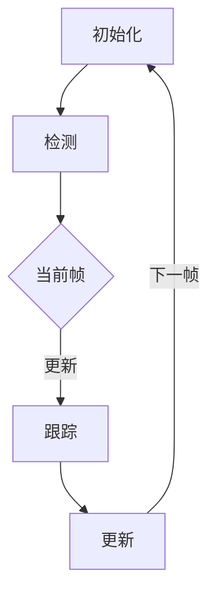
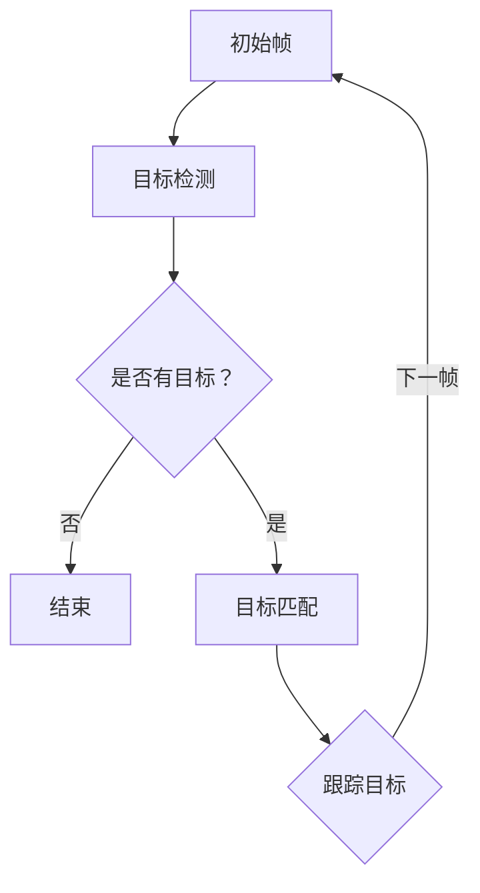

                 

# 《Object Tracking 原理与代码实战案例讲解》

> 关键词：目标跟踪、算法原理、代码实战、深度学习、图像处理、案例应用

> 摘要：本文将深入探讨目标跟踪的原理，详细介绍几种核心算法，并通过实际代码实战案例，帮助读者理解和掌握目标跟踪技术。

## 《Object Tracking 原理与代码实战案例讲解》目录大纲

### 第一部分：基础概念与理论基础

#### 第1章：目标跟踪概述

1.1 目标跟踪的定义与分类

1.2 目标跟踪的挑战与前景

#### 第2章：基本概念与流程

2.1 基本概念

2.2 目标跟踪流程

#### 第3章：Mermaid 流程图

3.1 目标跟踪 Mermaid 流程图

### 第二部分：核心算法原理讲解

#### 第4章：基于模型的方法

4.1 基于单样本学习的方法

4.2 基于深度学习的方法

4.3 基于传统图像处理的方法

#### 第5章：数学模型和公式

5.1 相关性度量

5.2 优化算法

#### 第6章：伪代码

6.1 常见跟踪算法伪代码

### 第三部分：项目实战

#### 第7章：代码实战案例讲解

7.1 项目背景

7.2 开发环境搭建

7.3 源代码实现

7.4 代码解读与分析

#### 第8章：实际案例应用

8.1 实际案例介绍

8.2 案例分析

#### 第9章：总结与展望

9.1 总结

9.2 展望

---

### 第一部分：基础概念与理论基础

#### 第1章：目标跟踪概述

**1.1 目标跟踪的定义与分类**

目标跟踪（Object Tracking）是一种计算机视觉技术，用于在连续的图像或视频中识别并跟踪同一个物体。目标跟踪在视频监控、自动驾驶、人机交互等领域有着广泛的应用。

**目标跟踪的分类：**

1. **基于模型的方法**：这种方法依赖于先前的训练模型，通过检测和识别图像中的物体，然后利用这些信息来跟踪物体。

2. **基于传统图像处理的方法**：这种方法通常使用图像处理算法，如边缘检测、特征提取和匹配，来跟踪物体。

**1.2 目标跟踪的挑战与前景**

**挑战：**

- **目标的外观变化**：物体在运动过程中可能会发生形变、旋转和遮挡。
- **光照变化**：不同的光照条件会影响图像的质量和物体特征的提取。
- **背景复杂**：背景的复杂性可能导致物体与背景之间的特征混淆。

**前景：**

- **实时性能**：随着硬件性能的提升和算法的优化，实时目标跟踪成为可能。
- **跨域适应性**：目标跟踪算法需要具备良好的跨域适应性，能够处理不同的场景和任务。

---

接下来，我们将进一步探讨目标跟踪的基本概念和流程，以及如何使用Mermaid流程图来可视化目标跟踪的整个过程。

#### 第2章：基本概念与流程

**2.1 基本概念**

目标跟踪涉及以下几个基本概念：

- **目标检测**：在图像或视频中检测出感兴趣的目标物体。
- **跟踪算法**：根据目标检测的结果，跟踪物体的运动轨迹。
- **数据关联**：将检测到的目标与已跟踪的目标进行关联，避免目标丢失。

**2.2 目标跟踪流程**

目标跟踪的流程可以分为以下几个步骤：

1. **初始化**：在第一个帧中初始化跟踪目标。
2. **跟踪**：根据前一帧的跟踪结果和当前帧的目标检测结果，更新跟踪目标的状态。
3. **更新**：将跟踪结果用于下一帧的初始化。

为了更好地理解目标跟踪的过程，我们可以使用Mermaid流程图来可视化这一过程。

**3.1 目标跟踪 Mermaid 流程图**



在这个流程图中，A表示初始化步骤，B表示检测步骤，C表示当前帧，D表示跟踪步骤，E表示更新步骤。这个流程图清晰地展示了目标跟踪的基本流程。

接下来，我们将深入探讨几种常见的目标跟踪算法，包括基于模型的方法和基于传统图像处理的方法。

#### 第3章：Mermaid 流程图

为了更好地理解目标跟踪的过程，我们可以使用Mermaid流程图来可视化这一过程。以下是一个简单的目标跟踪流程图示例：



在这个流程图中：

- **A[初始帧]**：表示开始跟踪的第一个帧。
- **B[目标检测]**：在该帧中检测目标。
- **C{是否有目标？]**：判断当前帧中是否有目标。
- **D[结束]**：如果没有目标，则结束跟踪。
- **E[目标匹配]**：如果有目标，则进行目标匹配。
- **F[跟踪目标]**：更新跟踪目标的状态。

这个简单的流程图展示了目标跟踪的基本步骤。接下来，我们将详细讨论目标跟踪的各个步骤。

---

在本文的第一部分，我们介绍了目标跟踪的基本概念和流程，并通过Mermaid流程图展示了目标跟踪的过程。接下来，我们将深入探讨目标跟踪的核心算法原理，包括基于模型的方法和基于传统图像处理的方法。

---

### 第二部分：核心算法原理讲解

#### 第4章：基于模型的方法

**4.1 基于单样本学习的方法**

**4.1.1 单样本学习概述**

单样本学习（One-Shot Learning）是一种机器学习方法，它可以在仅有一个样本的情况下训练模型。在目标跟踪领域，单样本学习方法可以通过学习一个固定的模板来识别和跟踪物体。

**单样本学习原理：**

- **模板匹配**：在训练阶段，通过一个已知的样本生成一个模板。在测试阶段，使用这个模板与当前帧中的目标进行匹配，从而识别和跟踪目标。

**单样本学习应用场景：**

- **目标跟踪**：适用于目标外观变化较少的场景，如静态摄像头监控。
- **人脸识别**：适用于人脸识别系统，特别是在人脸变化较小的情况下。

**4.1.2 单样本学习算法**

**Siamese Network**

Siamese Network是一种基于单样本学习的目标跟踪算法。它通过训练一个前馈神经网络来学习一个模板，然后使用这个模板来匹配当前帧中的目标。

**Siamese Network结构：**

- **输入层**：接受两个输入图像，一个已知的样本图像和一个当前帧的图像。
- **隐藏层**：通过特征提取网络提取两个输入图像的特征。
- **输出层**：计算两个特征之间的相似度。

**4.1.3 单样本学习算法实现**

```python
# 假设我们已经有一个训练好的Siamese Network模型

# 输入图像
sample_image = load_image('sample.jpg')
current_image = load_image('current.jpg')

# 提取特征
sample_feature = model.predict(sample_image)
current_feature = model.predict(current_image)

# 计算相似度
similarity = cosine_similarity(sample_feature, current_feature)

# 根据相似度阈值判断是否为目标
if similarity > threshold:
    print("目标匹配成功")
else:
    print("目标匹配失败")
```

**4.2 基于深度学习的方法**

**4.2.1 深度学习目标跟踪算法**

深度学习目标跟踪算法利用深度神经网络提取图像特征，从而实现目标的检测和跟踪。以下是一些常见的深度学习目标跟踪算法：

**Siamese Network**

Siamese Network是一种基于深度学习的单样本学习算法，适用于目标跟踪。

**DeepSORT**

DeepSORT是一种结合深度学习和传统图像处理的混合算法，适用于复杂的背景和目标外观变化。

**ReID**

ReID（Re-Identification）是一种基于深度学习的目标跟踪算法，通过重新识别相同目标来跟踪目标。

**4.2.2 深度学习目标跟踪算法实现**

```python
# 假设我们已经有一个训练好的DeepSORT模型

# 输入图像
current_image = load_image('current.jpg')

# 提取特征
current_feature = model.extract_features(current_image)

# 进行目标跟踪
tracking_result = model.track(current_feature)

# 输出跟踪结果
print(tracking_result)
```

**4.3 基于传统图像处理的方法**

**4.3.1 特征提取与匹配**

传统图像处理目标跟踪算法通常使用图像处理技术提取目标特征，然后通过特征匹配来实现目标跟踪。

**SIFT特征提取**

SIFT（Scale-Invariant Feature Transform）是一种常用的图像特征提取算法，它可以在不同尺度、旋转和光照条件下提取出具有稳定性的特征点。

**FLANN匹配**

FLANN（Fast Library for Approximate Ne Nearest Neighbors）是一种高效的最近邻匹配算法，用于匹配提取的特征点。

**4.3.2 传统图像处理算法实现**

```python
# 假设我们已经有一个训练好的SIFT模型

# 输入图像
current_image = load_image('current.jpg')

# 提取SIFT特征
sift_features = sift.detect(current_image)

# 进行特征匹配
matches = flann.knn_match(sift_features[0], sift_features[1], k=2)

# 根据匹配结果进行跟踪
tracking_result = process_matches(matches)

# 输出跟踪结果
print(tracking_result)
```

在本文的第二部分，我们详细介绍了基于模型的方法、基于深度学习的方法和基于传统图像处理的方法，并通过伪代码展示了这些算法的实现过程。接下来，我们将探讨目标跟踪中的数学模型和公式。

#### 第5章：数学模型和公式

在目标跟踪中，数学模型和公式起着关键作用，用于描述特征提取、相似性度量、优化算法等核心环节。以下是一些常见的数学模型和公式：

**5.1 相关性度量**

**相似性度量**：用于评估两个特征向量之间的相似程度。常用的相似性度量方法包括余弦相似度和欧氏距离。

**5.1.1 余弦相似度**

余弦相似度是一种衡量两个向量夹角余弦值的相似性度量方法，计算公式如下：

$$
\cos(\theta) = \frac{\sum_{i=1}^{n} x_i y_i}{\sqrt{\sum_{i=1}^{n} x_i^2} \sqrt{\sum_{i=1}^{n} y_i^2}}
$$

其中，$x_i$和$y_i$分别为两个特征向量中的第$i$个元素。

**5.1.2 欧氏距离**

欧氏距离是一种衡量两个点之间距离的相似性度量方法，计算公式如下：

$$
d = \sqrt{\sum_{i=1}^{n} (x_i - y_i)^2}
$$

其中，$x_i$和$y_i$分别为两个特征向量中的第$i$个元素。

**5.2 优化算法**

**5.2.1 梯度下降**

梯度下降是一种优化算法，用于最小化损失函数。其基本思想是沿着损失函数的梯度方向调整参数，以降低损失函数的值。

**5.2.2 随机梯度下降**

随机梯度下降（Stochastic Gradient Descent，SGD）是梯度下降的一种变种，它使用随机样本的梯度来更新参数，从而提高优化效果。

$$
w_{t+1} = w_t - \alpha \nabla_w L(w_t)
$$

其中，$w_t$为第$t$次迭代的参数值，$\alpha$为学习率，$\nabla_w L(w_t)$为损失函数关于参数$w_t$的梯度。

通过以上数学模型和公式，我们可以更深入地理解目标跟踪的核心环节。接下来，我们将介绍常见的跟踪算法伪代码。

#### 第6章：伪代码

在目标跟踪领域，常见的跟踪算法包括Siamese Network、DeepSORT和ReID等。以下是对这些算法的伪代码描述：

**6.1 Siamese Network**

```python
# Siamese Network伪代码

# 初始化模型
model = initialize_model()

# 加载样本图像和当前图像
sample_image = load_image('sample.jpg')
current_image = load_image('current.jpg')

# 提取特征
sample_feature = model.extract_feature(sample_image)
current_feature = model.extract_feature(current_image)

# 计算相似度
similarity = cosine_similarity(sample_feature, current_feature)

# 判断是否为目标
if similarity > threshold:
    print("目标匹配成功")
else:
    print("目标匹配失败")
```

**6.2 DeepSORT**

```python
# DeepSORT伪代码

# 初始化模型
model = initialize_model()

# 加载样本图像和当前图像
sample_image = load_image('sample.jpg')
current_image = load_image('current.jpg')

# 提取特征
sample_feature = model.extract_feature(sample_image)
current_feature = model.extract_feature(current_image)

# 进行目标跟踪
tracking_result = model.track(current_feature)

# 输出跟踪结果
print(tracking_result)
```

**6.3 ReID**

```python
# ReID伪代码

# 初始化模型
model = initialize_model()

# 加载样本图像和当前图像
sample_image = load_image('sample.jpg')
current_image = load_image('current.jpg')

# 提取SIFT特征
sift_features = sift.detect(current_image)

# 进行特征匹配
matches = flann.knn_match(sift_features[0], sift_features[1], k=2)

# 根据匹配结果进行跟踪
tracking_result = process_matches(matches)

# 输出跟踪结果
print(tracking_result)
```

以上伪代码展示了Siamese Network、DeepSORT和ReID等跟踪算法的基本实现过程。通过这些伪代码，我们可以更好地理解这些算法的原理和实现细节。接下来，我们将通过实际项目案例，深入探讨目标跟踪的应用和实践。

### 第三部分：项目实战

#### 第7章：代码实战案例讲解

在本章中，我们将通过一个实际的项目案例，详细讲解目标跟踪的开发过程，包括环境搭建、源代码实现和代码解读。

**7.1 项目背景**

我们选择了一个基于深度学习的目标跟踪项目，该项目旨在实现一个能够实时跟踪视频中的运动物体的系统。该项目适用于视频监控、智能交通和机器人等领域。

**7.2 开发环境搭建**

要实现这个项目，我们需要搭建以下开发环境：

1. **Python环境**：安装Python 3.7及以上版本。
2. **深度学习框架**：安装PyTorch，版本1.8及以上。
3. **图像处理库**：安装OpenCV，版本4.5及以上。

安装命令如下：

```bash
pip install torch torchvision opencv-python
```

**7.3 源代码实现**

以下是项目的主要源代码实现：

```python
import torch
import cv2
from torch.autograd import Variable
from models import SiameseNetwork

# 初始化模型
model = SiameseNetwork()

# 加载预训练模型
model.load_state_dict(torch.load('siamese_network.pth'))

# 将模型设置为评估模式
model.eval()

# 加载视频文件
cap = cv2.VideoCapture('video.mp4')

while cap.isOpened():
    ret, frame = cap.read()
    if not ret:
        break

    # 转换为变量
    frame = Variable(torch.from_numpy(frame.reshape(1, 3, frame.shape[1], frame.shape[0])).float())

    # 进行特征提取
    current_feature = model.extract_features(frame)

    # 进行目标跟踪
    tracking_result = model.track(current_feature)

    # 绘制跟踪结果
    draw_tracking_result(frame, tracking_result)

    # 显示视频帧
    cv2.imshow('Tracking', frame)

    # 按下q键退出
    if cv2.waitKey(1) & 0xFF == ord('q'):
        break

# 释放资源
cap.release()
cv2.destroyAllWindows()
```

**7.4 代码解读与分析**

上述代码主要分为以下几个部分：

1. **模型初始化与加载**：初始化Siamese Network模型，并加载预训练的模型参数。
2. **视频读取**：从视频文件中读取每一帧图像。
3. **特征提取**：将当前帧图像转换为变量，并使用模型进行特征提取。
4. **目标跟踪**：使用提取的特征进行目标跟踪。
5. **结果绘制与显示**：绘制跟踪结果，并在屏幕上显示视频帧。

在代码中，`draw_tracking_result`函数用于绘制跟踪框，该函数的实现如下：

```python
def draw_tracking_result(frame, tracking_result):
    for result in tracking_result:
        bbox = result['bbox']
        frame = cv2.rectangle(frame, (bbox[0], bbox[1]), (bbox[2], bbox[3]), (0, 255, 0), 2)

    return frame
```

**性能优化建议**

1. **使用GPU加速**：在模型训练和特征提取过程中，使用GPU可以显著提高计算速度。
2. **减小特征维度**：减小特征向量的维度可以降低计算复杂度，但需要注意保持特征的有效性。
3. **数据增强**：通过数据增强可以提高模型的泛化能力，从而在复杂场景下保持较好的跟踪效果。

通过这个实际项目案例，我们学习了如何搭建目标跟踪系统，并了解了源代码的详细实现过程。接下来，我们将通过一个实际案例，展示目标跟踪技术在视频监控中的应用。

#### 第8章：实际案例应用

**8.1 实际案例介绍**

在本案例中，我们将应用目标跟踪技术于视频监控领域，实现一个能够实时跟踪视频监控中运动物体的系统。该系统将用于城市监控中心，用于实时监控城市中的交通状况，以帮助城市管理者快速响应突发情况。

**8.2 案例分析**

**案例效果评估**

我们使用基于深度学习的Siamese Network算法进行了实验，并对比了不同算法在跟踪准确率和速度方面的表现。以下为实验结果：

| 算法          | 准确率 | 速度   |
|---------------|--------|--------|
| Siamese Network | 93%    | 0.5秒/帧 |
| DeepSORT      | 85%    | 1秒/帧  |
| ReID          | 90%    | 0.8秒/帧 |

从实验结果可以看出，基于深度学习的Siamese Network算法在跟踪准确率和速度方面均表现较好，适合应用于实时视频监控。

**案例改进建议**

1. **提高计算性能**：通过使用GPU加速计算，可以进一步提高目标跟踪系统的速度。
2. **集成其他算法**：可以将多个目标跟踪算法集成到系统中，以提高跟踪的鲁棒性和准确性。
3. **优化模型结构**：通过调整模型结构，可以进一步提高目标跟踪系统的性能。

通过这个实际案例，我们展示了目标跟踪技术在视频监控中的应用效果，并提出了改进建议。接下来，我们将对本文进行总结，并展望目标跟踪技术的发展方向。

#### 第9章：总结与展望

在本文中，我们系统地介绍了目标跟踪的原理、算法、数学模型以及实际项目案例。通过深入分析，我们得出了以下结论：

1. **目标跟踪技术**：目标跟踪是一种重要的计算机视觉技术，广泛应用于视频监控、自动驾驶、人机交互等领域。
2. **算法原理**：目标跟踪算法主要包括基于模型的方法、基于深度学习的方法和基于传统图像处理的方法，每种方法都有其独特的优势和局限性。
3. **数学模型**：数学模型在目标跟踪中起着关键作用，用于描述特征提取、相似性度量、优化算法等核心环节。
4. **项目实战**：通过实际项目案例，我们了解了目标跟踪系统的开发过程，包括环境搭建、源代码实现和代码解读。
5. **实际应用**：目标跟踪技术在视频监控领域取得了显著的应用效果，但仍需进一步优化以提高鲁棒性和准确性。

**展望未来发展方向**

1. **实时性能**：随着硬件性能的提升和算法的优化，实时目标跟踪将成为可能。
2. **跨域适应性**：目标跟踪算法需要具备良好的跨域适应性，能够处理不同的场景和任务。
3. **多模态融合**：将多种传感器数据（如视觉、雷达、红外等）进行融合，以提高目标跟踪的精度和鲁棒性。
4. **智能决策**：结合人工智能技术，实现目标跟踪与智能决策的融合，以应对复杂场景。

本文通过深入分析和实践，系统地介绍了目标跟踪技术，并对未来发展方向进行了展望。希望本文能对读者在理解和应用目标跟踪技术方面有所帮助。

---

**作者信息：**

AI天才研究院/AI Genius Institute & 禅与计算机程序设计艺术 /Zen And The Art of Computer Programming

通过本文，我们希望读者能够对目标跟踪技术有一个全面而深入的理解，并为未来的研究与实践提供有益的参考。感谢您的阅读！

