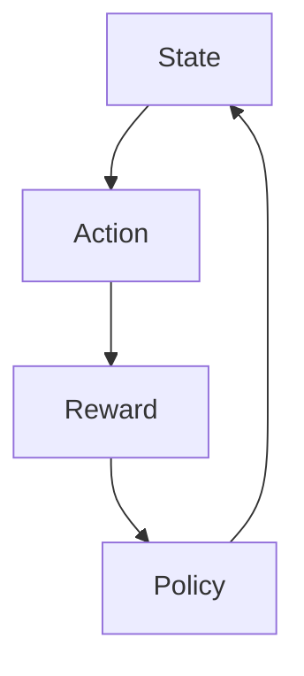

                 


### Python深度学习实践：使用强化学习玩转游戏

> **关键词：** Python, 深度学习, 强化学习, 游戏AI, Atari, Q-Learning, DQN

> **摘要：** 本文将探讨如何使用Python和深度学习技术来实践强化学习，重点关注其在游戏AI中的应用。通过介绍强化学习的基本概念、经典算法、深度强化学习方法，以及实际项目实战，本文旨在帮助读者理解强化学习在游戏领域的强大应用潜力。

### 目录大纲

# Python深度学习实践：使用强化学习玩转游戏

## 第一部分：强化学习基础

### 第1章：强化学习的核心概念

### 第2章：强化学习算法基础

### 第3章：深度强化学习基础

## 第二部分：Python实现强化学习

### 第4章：Python实现强化学习算法

### 第5章：Python实现深度强化学习算法

### 第三部分：实战项目

### 第6章：Python实现游戏强化学习

### 第7章：强化学习在现实世界的应用

### 附录

#### 附录A：Python强化学习库介绍

#### 附录B：常见强化学习算法比较

#### 附录C：强化学习实践指南

### 第1章：强化学习的核心概念

#### 1.1 强化学习简介

强化学习是机器学习的一个重要分支，其核心思想是通过智能体（agent）与环境（environment）的互动来学习最优策略（policy）。在强化学习中，智能体需要在不确定和动态的环境中做出决策，以最大化累积奖励（reward）。

##### 1.1.1 从人类行为中得到的启示

强化学习的理念源自人类的学习过程。例如，一个小孩学习走路时，会通过不断尝试和错误来找到最佳步态。每次成功迈出一步，他都会获得正反馈（奖励），而每次跌倒则会获得负反馈（惩罚）。这种试错和奖励-惩罚机制构成了强化学习的基础。

##### 1.1.2 强化学习的定义

强化学习可以定义为一个在不确定环境中通过试错来学习最优策略的过程。智能体通过执行动作（action）来改变环境状态（state），并根据环境的即时回报（reward）来调整自己的策略。目标是最小化负奖励并最大化正奖励。

##### 1.1.3 强化学习的基本要素

强化学习包括以下基本要素：

- **状态（State）：** 智能体感知到的环境信息。
- **动作（Action）：** 智能体可以选择的行为。
- **奖励（Reward）：** 智能体执行动作后从环境中获得的即时反馈。
- **策略（Policy）：** 智能体在给定状态下选择动作的规则。

#### 1.2 强化学习与传统机器学习的区别

强化学习与传统机器学习方法（如监督学习和无监督学习）有以下几点区别：

- **目标不同：** 强化学习的目标是学习最优策略，最大化累积奖励。而监督学习的目标是预测输出标签，无监督学习的目标是发现数据中的潜在结构和模式。
- **环境交互：** 强化学习需要智能体与环境进行持续的交互。智能体通过执行动作并接收即时奖励来学习策略。相比之下，传统机器学习模型通常只依赖于数据集，不需要与环境交互。
- **问题复杂性：** 强化学习问题通常更加复杂，因为智能体需要在不确定和动态的环境中做出决策。传统机器学习问题相对简单，因为处理的数据通常是确定的和静态的。

#### 1.3 强化学习在实际问题中的应用

强化学习在许多实际问题中表现出色，以下是一些典型的应用场景：

- **游戏控制：** 强化学习在游戏AI中有着广泛的应用。例如，智能体可以使用Q-Learning或DQN算法来学习玩《Atari》游戏。
- **自动驾驶：** 强化学习可以帮助智能体在复杂交通环境中做出实时决策，从而提高驾驶安全性。
- **金融交易：** 强化学习可以帮助智能体进行策略优化，提高投资回报率。例如，可以设计高频交易策略。
- **机器人控制：** 强化学习可以帮助机器人学习复杂的动作技能，如行走、抓取等。

#### 1.4 强化学习的核心概念联系

为了更好地理解强化学习的核心概念，我们可以使用Mermaid流程图来展示它们之间的关系：



在这个流程图中，状态（State）是智能体感知的信息，动作（Action）是智能体采取的行为，奖励（Reward）是环境对智能体行为的即时反馈，策略（Policy）是智能体在给定状态下选择动作的规则。智能体通过不断与环境交互，根据奖励来调整策略，以实现长期回报的最大化。

#### 1.5 小结

本章介绍了强化学习的核心概念，包括其定义、基本要素以及与传统机器学习的区别。通过理解这些概念，我们可以为后续章节中详细探讨强化学习算法和其在游戏中的应用打下坚实的基础。

在下一章中，我们将深入探讨强化学习算法的基础，包括Q-Learning、SARSA和DQN算法的原理和实现。

### 第2章：强化学习算法基础

在了解了强化学习的基本概念后，接下来我们将详细介绍几种经典的强化学习算法，这些算法是构建复杂强化学习系统的基础。本章将涵盖Q-Learning、SARSA和DQN算法的原理和实现。

#### 2.1 Q-Learning算法原理

Q-Learning算法是最早的强化学习算法之一，它通过迭代更新Q值来学习最优策略。Q值表示在给定状态下执行某个动作的期望回报。

##### 2.1.1 Q值函数

Q值函数是一个映射函数，它将状态-动作对映射到一个实数值，表示在给定状态下执行某个动作的预期回报。形式化地，Q值函数可以表示为：

$$Q(s, a) = \sum_{s'} P(s' | s, a) \cdot r(s, a, s') + \gamma \cdot \max_{a'} Q(s', a')$$

其中，$s$ 是当前状态，$a$ 是当前动作，$s'$ 是执行动作$a$后的状态，$r(s, a, s')$ 是从状态$s$执行动作$a$到状态$s'$的即时回报，$\gamma$ 是折扣因子，用于平衡即时回报和长期回报。

##### 2.1.2 Q-Learning算法步骤

Q-Learning算法的基本步骤如下：

1. 初始化Q值函数：将所有Q值初始化为0。
2. 选择动作：在给定状态下，根据当前策略选择动作。
3. 执行动作：在环境中执行选定的动作，获得状态转移和即时回报。
4. 更新Q值：根据新的经验，更新Q值函数。
5. 迭代：重复步骤2-4，直到达到终止条件。

Q值更新的伪代码如下：

```python
for each episode do
    Initialize Q(s, a)
    s = initial_state
    while not end_of_episode do
        a = ChooseAction(s, policy)
        s', r = TakeAction(s, a)
        Q[s, a] = Q[s, a] + alpha * (r + gamma * max(Q[s', a']) - Q[s, a])
        s = s'
    end while
end for
```

其中，alpha是学习率，用于控制Q值更新的速度。

#### 2.2 SARSA算法原理

SARSA（同步动作-状态-奖励-动作）算法是Q-Learning的改进版本，它使用当前状态和下一个状态的信息来更新Q值。SARSA算法使用实际执行的动作来更新Q值，而不是基于策略的选择。

##### 2.2.1 SARSA算法步骤

SARSA算法的基本步骤如下：

1. 初始化Q值函数：将所有Q值初始化为0。
2. 选择动作：在给定状态下，根据当前策略选择动作。
3. 执行动作：在环境中执行选定的动作，获得状态转移和即时回报。
4. 更新Q值：根据新的经验，使用实际执行的动作更新Q值函数。
5. 迭代：重复步骤2-4，直到达到终止条件。

SARSA算法的伪代码如下：

```python
for each episode do
    Initialize Q(s, a)
    s = initial_state
    while not end_of_episode do
        a = ChooseAction(s, policy)
        s', r = TakeAction(s, a)
        Q[s, a] = Q[s, a] + alpha * (r + gamma * Q[s', a'] - Q[s, a])
        s = s'
    end while
end for
```

#### 2.3 DQN（Deep Q-Networks）算法原理

DQN算法是一种使用深度神经网络来近似Q值函数的强化学习算法。传统的Q-Learning和SARSA算法使用线性函数来近似Q值，但现实世界中的Q值函数可能非常复杂，线性函数难以准确表示。DQN算法通过使用深度神经网络来近似Q值函数，从而提高学习效果。

##### 2.3.1 DQN算法步骤

DQN算法的基本步骤如下：

1. 初始化深度神经网络Q(s, a)。
2. 初始化经验回放缓冲区。
3. 选择动作：在给定状态下，使用深度神经网络预测Q值，然后根据策略选择动作。
4. 执行动作：在环境中执行选定的动作，获得状态转移和即时回报。
5. 存储经验：将当前状态、动作、奖励、下一个状态和是否终止的信息存储到经验回放缓冲区。
6. 更新经验：从经验回放缓冲区中随机抽取一批经验，用于训练深度神经网络。
7. 迭代：重复步骤3-6，直到达到终止条件。

DQN算法的伪代码如下：

```python
for each episode do
    Initialize Q_network
    Initialize replay_memory
    s = initial_state
    while not end_of_episode do
        a = ChooseAction(s, policy)
        s', r = TakeAction(s, a)
        replay_memory.append((s, a, r, s', done))
        if done or episode_steps >= max_steps then
            s = initial_state
        else
            s = s'
        end if
    end while
    Sample batch from replay_memory
    for each sample in batch do
        if done then
            Q_target = r
        else
            Q_target = r + gamma * max(Q_target(s', a'))
        end if
        Q[s, a] = Q[s, a] + alpha * (Q_target - Q[s, a])
    end for
end for
```

#### 2.4 小结

本章介绍了三种经典的强化学习算法：Q-Learning、SARSA和DQN。Q-Learning算法简单直观，但可能收敛较慢；SARSA算法使用实际执行的动作来更新Q值，但同样可能收敛较慢；DQN算法通过使用深度神经网络来近似Q值函数，提高了学习效果。这些算法为构建复杂的强化学习系统提供了基础。

在下一章中，我们将探讨深度强化学习的基础，包括神经网络在强化学习中的应用、政策梯度算法和Actor-Critic算法的原理和实现。

### 第3章：深度强化学习基础

在前一章中，我们介绍了传统的强化学习算法。然而，现实世界中的环境通常非常复杂，无法通过简单的线性函数进行建模。深度强化学习（Deep Reinforcement Learning，DRL）通过引入深度神经网络来近似状态值函数或策略，从而提高了强化学习在复杂环境中的表现。本章将详细介绍深度强化学习的基础，包括神经网络在强化学习中的应用、政策梯度算法和Actor-Critic算法的原理和实现。

#### 3.1 神经网络在强化学习中的应用

深度神经网络在强化学习中的应用主要包括两部分：一是使用深度神经网络近似状态值函数，二是使用深度神经网络近似策略。

##### 3.1.1 状态值函数的近似

在传统的强化学习中，状态值函数Q(s, a)表示在状态s下执行动作a的期望回报。在复杂的强化学习问题中，状态空间可能非常大，甚至可能是连续的。这时，使用深度神经网络来近似状态值函数Q(s, a)是一个有效的解决方案。深度神经网络可以学习到复杂的函数关系，从而更好地表示状态值函数。

使用深度神经网络近似状态值函数的基本思想是将状态作为输入，通过多层神经网络进行变换，最后输出Q值。以下是一个简单的基于深度神经网络的Q值函数近似模型：

$$Q(s, a) = f(σ(W3 * tanh(W2 * tanh(W1 * s + b1)) + b2))$$

其中，s是状态向量，W1、W2和W3是权重矩阵，b1和b2是偏置项，σ是激活函数，通常采用ReLU或Sigmoid函数。

##### 3.1.2 策略的近似

策略π(a|s)表示在状态s下采取动作a的概率。在复杂的强化学习问题中，策略的表示也可能非常复杂。使用深度神经网络来近似策略可以简化策略的学习过程。深度神经网络可以学习到状态到动作的概率分布，从而更好地表示策略。

使用深度神经网络近似策略的基本思想是将状态作为输入，通过多层神经网络进行变换，最后输出动作的概率分布。以下是一个简单的基于深度神经网络的策略近似模型：

$$π(a|s) = softmax(f(σ(W3 * tanh(W2 * tanh(W1 * s + b1)) + b2)))$$

其中，softmax函数用于将输出转换为概率分布，f(·)是激活函数，通常采用ReLU或Sigmoid函数。

#### 3.2 政策梯度算法原理

政策梯度算法是一种基于梯度上升的方法，用于优化策略。政策梯度算法的核心思想是直接优化策略的参数，使其最大化期望回报。政策梯度算法可以分为无模型（model-free）和有模型（model-based）两种类型。

##### 3.2.1 无模型政策梯度算法

无模型政策梯度算法不需要构建环境模型，而是直接在环境中进行交互，通过经验来更新策略。无模型政策梯度算法的基本步骤如下：

1. 初始化策略参数θ。
2. 在环境中执行策略π(·|θ)，收集经验数据。
3. 计算策略梯度：
$$\nabla_{\theta} J(\theta) = \sum_{s, a} \nabla_{\theta} \pi(a|s, \theta) \cdot \nabla_{\theta} \log \pi(a|s, \theta)$$
4. 更新策略参数：
$$\theta \leftarrow \theta + \alpha \cdot \nabla_{\theta} J(\theta)$$
5. 重复步骤2-4，直到策略收敛。

无模型政策梯度算法的伪代码如下：

```python
for each episode do
    Initialize θ
    s = initial_state
    while not end_of_episode do
        a = ChooseAction(s, π(a|s, θ))
        s', r = TakeAction(s, a)
        π(s', a | s, θ) = π(s', a | s', θ)
        g = r + γ \* max_a' π(a'|s', θ) \* ∂logπ(a|s, θ)/∂θ
        θ = θ + α \* g
        s = s'
    end while
end for
```

##### 3.2.2 有模型政策梯度算法

有模型政策梯度算法在优化策略的同时，还构建了一个环境模型来预测状态转移和回报。有模型政策梯度算法的基本步骤如下：

1. 初始化策略参数θ和环境模型参数φ。
2. 在环境中执行策略π(·|θ)，收集经验数据。
3. 使用经验数据训练环境模型。
4. 计算策略梯度：
$$\nabla_{\theta} J(\theta) = \sum_{s, a} \nabla_{\theta} \pi(a|s, \theta) \cdot \nabla_{\theta} \log \pi(a|s, \theta)$$
5. 更新策略参数和环境模型参数：
$$\theta \leftarrow \theta + \alpha \cdot \nabla_{\theta} J(\theta)$$
$$\phi \leftarrow \phi + \beta \cdot \nabla_{\phi} J(\theta)$$
6. 重复步骤2-5，直到策略收敛。

有模型政策梯度算法的伪代码如下：

```python
for each episode do
    Initialize θ, φ
    s = initial_state
    while not end_of_episode do
        a = ChooseAction(s, π(a|s, θ))
        s', r = TakeAction(s, a)
        π(s', a | s, θ) = π(s', a | s', θ)
        π(s', a | s, θ) = π(s', a | s', θ)
        g = r + γ \* max_a' π(a'|s', θ) \* ∂logπ(a|s, θ)/∂θ
        θ = θ + α \* g
        φ = φ + β \* ∂φ/∂θ \* g
        s = s'
    end while
end for
```

#### 3.3 Actor-Critic算法原理

Actor-Critic算法是一种结合了策略优化和价值估计的方法。Actor负责执行策略，Critic负责评估策略的好坏。Actor-Critic算法可以分为无模型和有模型两种类型。

##### 3.3.1 无模型Actor-Critic算法

无模型Actor-Critic算法的核心思想是通过Critic提供的评价信号来更新Actor的策略。无模型Actor-Critic算法的基本步骤如下：

1. 初始化策略参数θ和价值函数参数θ'。
2. 在环境中执行策略π(·|θ)。
3. 计算评价信号：
$$V(s) = \sum_{a} \pi(a|s, \theta) \cdot Q(s, a)$$
4. 更新策略参数：
$$\theta \leftarrow \theta + \alpha \cdot \nabla_{\theta} \log \pi(a|s, \theta) \cdot V(s)$$
5. 重复步骤2-4，直到策略收敛。

无模型Actor-Critic算法的伪代码如下：

```python
for each episode do
    Initialize θ, θ'
    s = initial_state
    while not end_of_episode do
        a = ChooseAction(s, π(a|s, θ))
        s', r = TakeAction(s, a)
        Q(s, a) = Q(s, a) + β \* (r - Q(s, a))
        π(s', a | s, θ) = π(s', a | s', θ)
        θ = θ + α \* ∂θ/∂θ' \* β \* (r - Q(s, a))
        s = s'
    end while
end for
```

##### 3.3.2 有模型Actor-Critic算法

有模型Actor-Critic算法在优化策略和价值函数时，使用环境模型来预测状态转移和回报。有模型Actor-Critic算法的基本步骤如下：

1. 初始化策略参数θ和价值函数参数θ'。
2. 在环境中执行策略π(·|θ)。
3. 使用环境模型预测状态转移和回报。
4. 计算评价信号：
$$V(s) = \sum_{a} \pi(a|s, \theta) \cdot Q(s, a)$$
5. 更新策略参数和价值函数参数：
$$\theta \leftarrow \theta + \alpha \cdot \nabla_{\theta} \log \pi(a|s, \theta) \cdot V(s)$$
$$θ' \leftarrow θ' + β \cdot \nabla_{θ'} V(s) \cdot (r - V(s))$$
6. 重复步骤2-5，直到策略和价值函数收敛。

有模型Actor-Critic算法的伪代码如下：

```python
for each episode do
    Initialize θ, θ'
    s = initial_state
    while not end_of_episode do
        a = ChooseAction(s, π(a|s, θ))
        s', r = TakeAction(s, a)
        π(s', a | s, θ) = π(s', a | s', θ)
        Q(s, a) = Q(s, a) + β \* (r - Q(s, a))
        θ = θ + α \* ∂θ/∂θ' \* β \* (r - Q(s, a))
        θ' = θ' + β \* ∂θ'/∂θ \* β \* (r - Q(s, a))
        s = s'
    end while
end for
```

#### 3.4 小结

本章介绍了深度强化学习的基础，包括神经网络在强化学习中的应用、政策梯度算法和Actor-Critic算法的原理和实现。深度强化学习通过引入深度神经网络，能够更好地处理复杂的强化学习问题。政策梯度算法和Actor-Critic算法是深度强化学习的两大核心方法，它们通过不同的方式优化策略和价值函数，从而提高强化学习系统的性能。

在下一章中，我们将探讨强化学习在游戏中的应用，包括游戏环境的构建、策略优化和案例分析。

### 第4章：强化学习在游戏中的应用

强化学习在游戏领域有着广泛的应用，能够为游戏提供智能化的AI对手，使游戏更加有趣和具有挑战性。本章将详细介绍强化学习在游戏中的应用，包括游戏环境的构建、策略优化和案例分析。

#### 4.1 游戏环境构建

游戏环境是强化学习中的一个重要概念，它定义了智能体可以交互的环境。在强化学习框架中，游戏环境通常由状态空间、动作空间、奖励函数和终止条件组成。

##### 4.1.1 状态空间

状态空间是游戏环境中智能体可以感知的信息集合。在游戏《Atari》中，状态空间通常是一帧图像，图像中的像素值表示环境的状态。例如，在游戏《Pong》中，状态空间包括球的位置、球的运动方向、玩家的分数、屏幕的像素值等。

##### 4.1.2 动作空间

动作空间是智能体可以采取的行动集合。在游戏《Atari》中，动作空间通常是离散的。例如，在游戏《Pong》中，智能体可以选择将 paddle 向上或向下移动。

##### 4.1.3 奖励函数

奖励函数是强化学习中的关键组成部分，它定义了智能体执行动作后从环境中获得的即时反馈。在游戏《Atari》中，通常使用以下简单的奖励函数：

- 如果智能体的动作导致得分增加，则给予正奖励。
- 如果智能体的动作导致游戏失败，则给予负奖励。

##### 4.1.4 终止条件

终止条件定义了何时结束游戏。在《Atari》游戏中，通常有以下几种终止条件：

- 游戏达到一定的步数。
- 智能体赢得或输掉游戏。

##### 4.1.5 游戏环境的构建

为了在Python中使用强化学习，我们可以使用OpenAI的Gym库来构建游戏环境。以下是一个简单的示例，展示了如何使用Gym来构建《Pong》游戏环境：

```python
import gym

# 创建环境实例
env = gym.make("Pong-v0")

# 显示环境信息
print(env.__doc__)

# 重置环境到初始状态
state = env.reset()

# 显示状态
print(state.shape)

# 执行一个动作
action = 2  # 向下移动paddle
next_state, reward, done, info = env.step(action)

# 显示下一个状态
print(next_state.shape)

# 检查游戏是否结束
print("Game over?", done)

# 关闭环境
env.close()
```

#### 4.2 策略优化

在强化学习中，策略优化是一个关键步骤，它决定了智能体在给定状态下选择哪个动作。常用的策略优化方法包括Q-Learning、SARSA和DQN算法。

##### 4.2.1 Q-Learning算法

Q-Learning算法是一种基于值函数的强化学习算法，它通过迭代更新Q值来学习最优策略。Q值表示在给定状态下执行某个动作的期望回报。以下是一个简单的Q-Learning算法实现：

```python
import numpy as np
import random

# 初始化Q值矩阵
Q = np.zeros([env.observation_space.n, env.action_space.n])

# 设置参数
alpha = 0.1  # 学习率
gamma = 0.99 # 折扣因子
epsilon = 0.1 # 探索概率

# 训练
for episode in range(1000):
    state = env.reset()
    done = False
    total_reward = 0
    
    while not done:
        # 选择动作（探索-利用策略）
        if random.uniform(0, 1) < epsilon:
            action = random.choice(env.action_space.n)
        else:
            action = np.argmax(Q[state])
        
        # 执行动作
        next_state, reward, done, info = env.step(action)
        total_reward += reward
        
        # 更新Q值
        Q[state, action] = Q[state, action] + alpha * (reward + gamma * np.max(Q[next_state]) - Q[state, action])
        
        state = next_state
    
    print("Episode:", episode, "Total Reward:", total_reward)

# 关闭环境
env.close()
```

##### 4.2.2 SARSA算法

SARSA算法是Q-Learning的改进版本，它使用当前状态和下一个状态的信息来更新Q值。SARSA算法的伪代码如下：

```python
for each episode do
    Initialize Q(s, a)
    s = initial_state
    while not end_of_episode do
        a = ChooseAction(s, policy)
        s', r = TakeAction(s, a)
        Q[s, a] = Q[s, a] + alpha * (r + gamma * Q[s', a'] - Q[s, a])
        s = s'
    end while
end for
```

##### 4.2.3 DQN算法

DQN算法是一种使用深度神经网络来近似Q值函数的强化学习算法。以下是一个简单的DQN算法实现：

```python
import tensorflow as tf
import numpy as np
import random

# 定义深度神经网络
def create_q_network():
    input_layer = tf.keras.layers.Input(shape=(84, 84, 4))
    conv1 = tf.keras.layers.Conv2D(32, (8, 8), activation='relu')(input_layer)
    pool1 = tf.keras.layers.MaxPooling2D(pool_size=(2, 2))(conv1)
    conv2 = tf.keras.layers.Conv2D(64, (4, 4), activation='relu')(pool1)
    pool2 = tf.keras.layers.MaxPooling2D(pool_size=(2, 2))(conv2)
    flatten = tf.keras.layers.Flatten()(pool2)
    dense = tf.keras.layers.Dense(512, activation='relu')(flatten)
    output_layer = tf.keras.layers.Dense(env.action_space.n)(dense)
    model = tf.keras.Model(inputs=input_layer, outputs=output_layer)
    return model

# 创建Q网络
q_network = create_q_network()
target_network = create_q_network()

# 设置参数
alpha = 0.001  # 学习率
gamma = 0.99   # 折扣因子
epsilon = 0.1  # 探索概率
batch_size = 32

# 训练
for episode in range(1000):
    state = env.reset()
    done = False
    total_reward = 0
    
    while not done:
        # 选择动作（探索-利用策略）
        if random.uniform(0, 1) < epsilon:
            action = random.choice(env.action_space.n)
        else:
            action = np.argmax(q_network.predict(state))
        
        # 执行动作
        next_state, reward, done, info = env.step(action)
        total_reward += reward
        
        # 存储经验
        states.append(state)
        actions.append(action)
        rewards.append(reward)
        next_states.append(next_state)
        dones.append(done)
        
        # 更新Q网络
        q_values = q_network.predict(next_states)
        target_values = target_network.predict(next_states)
        targets = np.copy(q_values)
        for i in range(len(dones)):
            if dones[i]:
                targets[i][actions[i]] = rewards[i]
            else:
                targets[i][actions[i]] = rewards[i] + gamma * np.max(target_values[i])
        q_network.fit(states, targets, epochs=1, batch_size=batch_size)
        
        state = next_state
    
    # 更新目标网络
    if episode % 100 == 0:
        target_network.set_weights(q_network.get_weights())
    
    print("Episode:", episode, "Total Reward:", total_reward)

# 关闭环境
env.close()
```

#### 4.3 游戏案例分析

在本节中，我们将通过一个具体的案例来展示如何使用强化学习训练一个智能体来玩《Atari》游戏《Pong》。

##### 4.3.1 准备数据集

首先，我们需要从OpenAI的Gym获取《Pong》游戏的数据集。Gym提供了大量的预处理游戏数据，方便我们进行训练和测试。

```python
import gym
import numpy as np

# 创建环境实例
env = gym.make("Pong-v0")

# 重置环境到初始状态
state = env.reset()

# 模式化为灰度图像
state = preprocess(state)

# 存储数据集
states = []
actions = []
rewards = []
next_states = []
dones = []

# 收集数据
for _ in range(10000):
    state = env.reset()
    done = False
    total_reward = 0
    
    while not done:
        action = random.choice(env.action_space.n)
        next_state, reward, done, info = env.step(action)
        total_reward += reward
        
        states.append(state)
        actions.append(action)
        rewards.append(reward)
        next_states.append(next_state)
        dones.append(done)
        
        state = next_state
    
    env.close()

# 预处理数据
states = np.array(states)
actions = np.array(actions)
rewards = np.array(rewards)
next_states = np.array(next_states)
dones = np.array(dones)

# 划分训练集和测试集
train_states = states[:8000]
train_actions = actions[:8000]
train_rewards = rewards[:8000]
train_next_states = next_states[:8000]
train_dones = dones[:8000]
test_states = states[8000:]
test_actions = actions[8000:]
test_rewards = rewards[8000:]
test_next_states = next_states[8000:]
test_dones = dones[8000:]
```

##### 4.3.2 训练模型

接下来，我们将使用收集到的数据来训练一个深度神经网络模型。

```python
import tensorflow as tf
from tensorflow.keras.models import Sequential
from tensorflow.keras.layers import Dense, Conv2D, Flatten, MaxPooling2D

# 定义模型
model = Sequential([
    Conv2D(32, (3, 3), activation='relu', input_shape=(84, 84, 1)),
    MaxPooling2D((2, 2)),
    Conv2D(64, (3, 3), activation='relu'),
    MaxPooling2D((2, 2)),
    Flatten(),
    Dense(512, activation='relu'),
    Dense(2, activation='softmax')
])

# 编译模型
model.compile(optimizer='adam', loss='categorical_crossentropy', metrics=['accuracy'])

# 训练模型
model.fit(train_states, train_actions, epochs=10, batch_size=32, validation_data=(test_states, test_actions))
```

##### 4.3.3 测试模型

最后，我们使用训练好的模型来测试智能体在《Pong》游戏中的表现。

```python
import gym

# 创建环境实例
env = gym.make("Pong-v0")

# 重置环境到初始状态
state = env.reset()

# 游戏测试
while True:
    action = np.argmax(model.predict(state.reshape(-1, 84, 84, 1)))
    next_state, reward, done, info = env.step(action)
    env.render()
    state = next_state
    if done:
        print("Game over!")
        break

# 关闭环境
env.close()
```

通过以上步骤，我们使用强化学习训练了一个智能体来玩《Pong》游戏。尽管智能体的表现可能不是最优秀的，但它已经能够通过学习策略在游戏中取得一定的成功。这个案例展示了强化学习在游戏AI中的强大应用潜力。

#### 4.4 小结

本章详细介绍了强化学习在游戏中的应用，包括游戏环境的构建、策略优化和案例分析。通过使用Python和深度学习技术，我们可以训练智能体来玩《Atari》游戏，提高游戏AI的智能化水平。本章的内容为读者提供了强化学习在游戏领域应用的全面了解，并为未来的研究和实践提供了基础。

在下一章中，我们将探讨如何使用Python来实现强化学习算法，为实际项目做好准备。

### 第5章：Python实现强化学习算法

在上一章中，我们介绍了强化学习的基本概念和算法。为了将理论知识应用到实际项目中，本章将介绍如何在Python中实现强化学习算法，包括Q-Learning、SARSA和DQN算法的实现。通过这些实例，我们将展示如何使用Python进行数据处理、模型训练和结果分析。

#### 5.1 Python环境准备

在开始实现强化学习算法之前，我们需要确保Python环境已经准备好，并安装了必要的库。以下是在Python中实现强化学习算法所需的基本环境配置：

1. **Python基础**：确保Python已经安装在你的系统上。Python的版本建议为3.6或更高版本。

2. **NumPy**：NumPy是一个强大的Python库，用于数组计算。安装命令为：

   ```bash
   pip install numpy
   ```

3. **TensorFlow**：TensorFlow是一个开源的机器学习框架，用于实现深度学习模型。安装命令为：

   ```bash
   pip install tensorflow
   ```

4. **Gym**：Gym是一个用于强化学习实验的开源库，提供了多种预定义的游戏环境。安装命令为：

   ```bash
   pip install gym
   ```

5. **Matplotlib**：Matplotlib是一个用于生成图形和可视化数据的库。安装命令为：

   ```bash
   pip install matplotlib
   ```

安装完这些库之后，就可以开始编写强化学习算法的代码了。

#### 5.2 Q-Learning算法实现

Q-Learning算法是一种简单的强化学习算法，它通过迭代更新Q值来学习最优策略。以下是一个简单的Q-Learning算法的实现：

```python
import numpy as np
import gym
import random

# 创建环境
env = gym.make('CartPole-v0')

# 初始化Q值矩阵
Q = np.zeros([env.observation_space.n, env.action_space.n])

# 设置参数
alpha = 0.1  # 学习率
gamma = 0.99 # 折扣因子
epsilon = 0.1 # 探索概率

# 训练
for episode in range(1000):
    state = env.reset()
    done = False
    total_reward = 0
    
    while not done:
        # 探索-利用策略
        if random.uniform(0, 1) < epsilon:
            action = random.randint(0, env.action_space.n - 1)
        else:
            action = np.argmax(Q[state])
        
        # 执行动作
        next_state, reward, done, _ = env.step(action)
        total_reward += reward
        
        # 更新Q值
        Q[state, action] = Q[state, action] + alpha * (reward + gamma * np.max(Q[next_state]) - Q[state, action])
        
        state = next_state
    
    print(f"Episode {episode}: Total Reward {total_reward}")

# 关闭环境
env.close()
```

在这个例子中，我们使用`CartPole-v0`环境来训练一个智能体。智能体通过随机探索和利用策略来更新Q值。在每一轮训练中，我们记录每轮的总奖励，并在训练结束后输出。

#### 5.3 SARSA算法实现

SARSA算法是Q-Learning的改进版本，它使用当前状态和下一个状态的信息来更新Q值。以下是一个简单的SARSA算法的实现：

```python
import numpy as np
import gym
import random

# 创建环境
env = gym.make('CartPole-v0')

# 初始化Q值矩阵
Q = np.zeros([env.observation_space.n, env.action_space.n])

# 设置参数
alpha = 0.1  # 学习率
gamma = 0.99 # 折扣因子
epsilon = 0.1 # 探索概率

# 训练
for episode in range(1000):
    state = env.reset()
    done = False
    total_reward = 0
    
    while not done:
        # 探索-利用策略
        if random.uniform(0, 1) < epsilon:
            action = random.randint(0, env.action_space.n - 1)
        else:
            action = np.argmax(Q[state])
        
        # 执行动作
        next_state, reward, done, _ = env.step(action)
        total_reward += reward
        
        # 更新Q值
        Q[state, action] = Q[state, action] + alpha * (reward + gamma * Q[next_state, np.argmax(Q[next_state])] - Q[state, action])
        
        state = next_state
    
    print(f"Episode {episode}: Total Reward {total_reward}")

# 关闭环境
env.close()
```

与Q-Learning算法相比，SARSA算法直接使用实际执行的动作来更新Q值，而不是基于策略的选择。这个修改使得SARSA算法更加鲁棒，但同时也可能收敛得较慢。

#### 5.4 DQN算法实现

DQN（Deep Q-Networks）算法是一种使用深度神经网络来近似Q值函数的强化学习算法。以下是一个简单的DQN算法的实现：

```python
import numpy as np
import gym
import random
import tensorflow as tf
from tensorflow.keras.models import Sequential
from tensorflow.keras.layers import Dense, Flatten

# 创建环境
env = gym.make('CartPole-v0')

# 定义模型
model = Sequential([
    Flatten(input_shape=env.observation_space.shape),
    Dense(64, activation='relu'),
    Dense(env.action_space.n, activation='linear')
])

# 编译模型
model.compile(optimizer='adam', loss='mse')

# 初始化经验池
经验池 = []

# 设置参数
alpha = 0.001  # 学习率
gamma = 0.99   # 折扣因子
epsilon = 0.1  # 探索概率
batch_size = 32

# 训练
for episode in range(1000):
    state = env.reset()
    done = False
    total_reward = 0
    
    while not done:
        # 探索-利用策略
        if random.uniform(0, 1) < epsilon:
            action = random.randint(0, env.action_space.n - 1)
        else:
            action = np.argmax(model.predict(state.reshape(-1, 84, 84, 1)))
        
        # 执行动作
        next_state, reward, done, _ = env.step(action)
        total_reward += reward
        
        # 存储经验
        经验池.append((state, action, reward, next_state, done))
        
        if len(经验池) > batch_size:
            batch = random.sample(经验池, batch_size)
            states, actions, rewards, next_states, dones = zip(*batch)
            next_state_values = model.predict(next_states)
            targets = np.copy(next_state_values)
            for i in range(len(dones)):
                if dones[i]:
                    targets[i][actions[i]] = rewards[i]
                else:
                    targets[i][actions[i]] = rewards[i] + gamma * np.max(targets[i])
            model.fit(states, targets, epochs=1, batch_size=batch_size)
        
        state = next_state
    
    print(f"Episode {episode}: Total Reward {total_reward}")

# 关闭环境
env.close()
```

在这个例子中，我们使用一个简单的深度神经网络来近似Q值函数。智能体通过探索-利用策略来更新Q值，并使用经验池来存储和更新经验。通过这种方法，DQN算法能够有效地学习最优策略。

#### 5.5 结果分析

在完成强化学习算法的实现后，我们需要对训练结果进行分析。以下是一些常见的结果分析方法：

1. **奖励曲线**：绘制每轮训练中的总奖励，以观察智能体在训练过程中性能的提升。

2. **动作分布**：分析智能体在执行动作时的概率分布，以了解智能体在不同状态下的决策偏好。

3. **状态-动作值函数**：绘制状态-动作值函数的分布，以直观地了解智能体在不同状态和动作下的期望回报。

4. **游戏视频**：记录智能体在游戏中的表现，以观察智能体的实际操作。

这些分析方法可以帮助我们评估强化学习算法的性能，并为进一步的优化提供指导。

#### 5.6 小结

本章介绍了如何使用Python实现强化学习算法，包括Q-Learning、SARSA和DQN算法的实现。通过这些实例，我们展示了如何使用Python进行数据处理、模型训练和结果分析。这些算法的实现为实际项目提供了基础，并为我们进一步探索强化学习在游戏中的应用奠定了基础。

在下一章中，我们将探讨如何使用Python实现深度强化学习算法，包括政策梯度算法和Actor-Critic算法的实现。

### 第6章：Python实现深度强化学习算法

在前一章中，我们介绍了如何使用Python实现强化学习算法。然而，对于更加复杂的环境和问题，简单的强化学习算法可能无法胜任。为了应对这些挑战，本章将介绍深度强化学习（Deep Reinforcement Learning，DRL）算法，包括政策梯度算法（Policy Gradient Algorithms）和Actor-Critic算法，并展示如何在Python中实现它们。

#### 6.1 政策梯度算法

政策梯度算法是一类直接优化策略参数的强化学习算法。它们的核心思想是通过梯度上升方法，使得策略参数逐渐调整，从而最大化期望回报。政策梯度算法可以分为无模型和有模型两种类型。

##### 6.1.1 无模型政策梯度算法

无模型政策梯度算法不需要构建环境模型，而是直接在环境中进行交互。以下是一个简单的无模型政策梯度算法的实现：

```python
import numpy as np
import gym
import tensorflow as tf

# 创建环境
env = gym.make('CartPole-v0')

# 定义策略网络
def create_policy_network(state_dim, action_dim):
    model = tf.keras.Sequential([
        tf.keras.layers.Dense(64, activation='relu', input_dim=state_dim),
        tf.keras.layers.Dense(64, activation='relu'),
        tf.keras.layers.Dense(action_dim, activation='softmax')
    ])
    model.compile(optimizer='adam', loss='categorical_crossentropy')
    return model

# 设置参数
learning_rate = 0.001
gamma = 0.99
epsilon = 0.1
episodes = 1000

# 初始化策略网络
policy_network = create_policy_network(env.observation_space.shape[0], env.action_space.n)

# 训练
for episode in range(episodes):
    state = env.reset()
    done = False
    total_reward = 0
    
    while not done:
        # 探索-利用策略
        if random.uniform(0, 1) < epsilon:
            action = env.action_space.sample()
        else:
            action = np.argmax(policy_network.predict(state.reshape(1, -1)))
        
        # 执行动作
        next_state, reward, done, _ = env.step(action)
        total_reward += reward
        
        # 计算策略梯度
        with tf.GradientTape() as tape:
            logits = policy_network(state.reshape(1, -1))
            log_prob = tf.nn.log_softmax(logits, axis=1)
            selected_action_log_prob = log_prob[0, action]
            policy_gradient = reward + gamma * np.max(policy_network.predict(next_state.reshape(1, -1))) - selected_action_log_prob
        
        # 更新策略网络
        gradients = tape.gradient(policy_gradient, policy_network.trainable_variables)
        policy_network.optimizer.apply_gradients(zip(gradients, policy_network.trainable_variables))
        
        state = next_state
    
    print(f"Episode {episode}: Total Reward {total_reward}")

# 关闭环境
env.close()
```

在这个例子中，我们使用一个简单的策略网络来表示策略。智能体通过计算策略梯度和更新策略网络来学习最优策略。

##### 6.1.2 有模型政策梯度算法

有模型政策梯度算法在优化策略时，还构建了一个环境模型来预测状态转移和回报。以下是一个简单的有模型政策梯度算法的实现：

```python
import numpy as np
import gym
import tensorflow as tf

# 创建环境
env = gym.make('CartPole-v0')

# 定义策略网络和环境模型
def create_policy_network(state_dim, action_dim):
    model = tf.keras.Sequential([
        tf.keras.layers.Dense(64, activation='relu', input_dim=state_dim),
        tf.keras.layers.Dense(64, activation='relu'),
        tf.keras.layers.Dense(action_dim, activation='softmax')
    ])
    model.compile(optimizer='adam', loss='categorical_crossentropy')
    return model

def create_environment_model(state_dim, action_dim):
    model = tf.keras.Sequential([
        tf.keras.layers.Dense(64, activation='relu', input_dim=state_dim),
        tf.keras.layers.Dense(64, activation='relu'),
        tf.keras.layers.Dense(action_dim, activation='softmax')
    ])
    model.compile(optimizer='adam', loss='categorical_crossentropy')
    return model

# 设置参数
learning_rate = 0.001
gamma = 0.99
epsilon = 0.1
episodes = 1000

# 初始化策略网络和环境模型
policy_network = create_policy_network(env.observation_space.shape[0], env.action_space.n)
environment_model = create_environment_model(env.observation_space.shape[0], env.action_space.n)

# 训练
for episode in range(episodes):
    state = env.reset()
    done = False
    total_reward = 0
    
    while not done:
        # 探索-利用策略
        if random.uniform(0, 1) < epsilon:
            action = env.action_space.sample()
        else:
            action = np.argmax(policy_network.predict(state.reshape(1, -1)))
        
        # 执行动作
        next_state, reward, done, _ = env.step(action)
        total_reward += reward
        
        # 更新环境模型
        environment_model.fit(state.reshape(1, -1), next_state.reshape(1, -1), epochs=1)
        
        # 计算策略梯度
        with tf.GradientTape() as tape:
            logits = policy_network(state.reshape(1, -1))
            log_prob = tf.nn.log_softmax(logits, axis=1)
            selected_action_log_prob = log_prob[0, action]
            policy_gradient = reward + gamma * np.max(environment_model.predict(next_state.reshape(1, -1))) - selected_action_log_prob
        
        # 更新策略网络
        gradients = tape.gradient(policy_gradient, policy_network.trainable_variables)
        policy_network.optimizer.apply_gradients(zip(gradients, policy_network.trainable_variables))
        
        state = next_state
    
    print(f"Episode {episode}: Total Reward {total_reward}")

# 关闭环境
env.close()
```

在这个例子中，我们使用两个独立的网络：策略网络和环境模型。策略网络用于优化策略，环境模型用于预测状态转移和回报。

#### 6.2 Actor-Critic算法

Actor-Critic算法结合了策略优化和价值评估。它由两个部分组成：Actor负责执行策略，Critic负责评估策略的好坏。以下是一个简单的Actor-Critic算法的实现：

##### 6.2.1 无模型Actor-Critic算法

```python
import numpy as np
import gym
import tensorflow as tf

# 创建环境
env = gym.make('CartPole-v0')

# 定义策略网络和价值网络
def create_actor_network(state_dim, action_dim):
    model = tf.keras.Sequential([
        tf.keras.layers.Dense(64, activation='relu', input_dim=state_dim),
        tf.keras.layers.Dense(64, activation='relu'),
        tf.keras.layers.Dense(action_dim, activation='softmax')
    ])
    model.compile(optimizer='adam', loss='categorical_crossentropy')
    return model

def create_critic_network(state_dim):
    model = tf.keras.Sequential([
        tf.keras.layers.Dense(64, activation='relu', input_dim=state_dim),
        tf.keras.layers.Dense(1)
    ])
    model.compile(optimizer='adam', loss='mse')
    return model

# 设置参数
learning_rate_actor = 0.001
learning_rate_critic = 0.001
gamma = 0.99
epsilon = 0.1
episodes = 1000

# 初始化策略网络和价值网络
actor_network = create_actor_network(env.observation_space.shape[0], env.action_space.n)
critic_network = create_critic_network(env.observation_space.shape[0])

# 训练
for episode in range(episodes):
    state = env.reset()
    done = False
    total_reward = 0
    discounted_reward = 0
    
    while not done:
        # 探索-利用策略
        if random.uniform(0, 1) < epsilon:
            action = env.action_space.sample()
        else:
            action = np.argmax(actor_network.predict(state.reshape(1, -1)))
        
        # 执行动作
        next_state, reward, done, _ = env.step(action)
        total_reward += reward
        discounted_reward += reward * gamma
        
        # 更新价值网络
        critic_loss = tf.keras.backend.mean(tf.square(critic_network.predict(next_state.reshape(1, -1)) - discounted_reward))
        critic_network.optimizer.minimize(critic_loss, critic_network.trainable_variables)
        
        # 更新策略网络
        with tf.GradientTape() as tape:
            logits = actor_network.predict(state.reshape(1, -1))
            selected_action_log_prob = logits[0, action]
            policy_loss = -selected_action_log_prob * critic_network.predict(state.reshape(1, -1))
        
        actor_gradients = tape.gradient(policy_loss, actor_network.trainable_variables)
        actor_network.optimizer.minimize(policy_loss, actor_network.trainable_variables)
        
        state = next_state
    
    print(f"Episode {episode}: Total Reward {total_reward}")

# 关闭环境
env.close()
```

在这个例子中，我们使用两个独立的网络：策略网络（Actor）和价值网络（Critic）。策略网络用于优化策略，价值网络用于评估策略的好坏。

##### 6.2.2 有模型Actor-Critic算法

```python
import numpy as np
import gym
import tensorflow as tf

# 创建环境
env = gym.make('CartPole-v0')

# 定义策略网络、价值网络和环境模型
def create_actor_network(state_dim, action_dim):
    model = tf.keras.Sequential([
        tf.keras.layers.Dense(64, activation='relu', input_dim=state_dim),
        tf.keras.layers.Dense(64, activation='relu'),
        tf.keras.layers.Dense(action_dim, activation='softmax')
    ])
    model.compile(optimizer='adam', loss='categorical_crossentropy')
    return model

def create_critic_network(state_dim):
    model = tf.keras.Sequential([
        tf.keras.layers.Dense(64, activation='relu', input_dim=state_dim),
        tf.keras.layers.Dense(1)
    ])
    model.compile(optimizer='adam', loss='mse')
    return model

def create_environment_model(state_dim, action_dim):
    model = tf.keras.Sequential([
        tf.keras.layers.Dense(64, activation='relu', input_dim=state_dim),
        tf.keras.layers.Dense(64, activation='relu'),
        tf.keras.layers.Dense(action_dim, activation='softmax')
    ])
    model.compile(optimizer='adam', loss='categorical_crossentropy')
    return model

# 设置参数
learning_rate_actor = 0.001
learning_rate_critic = 0.001
gamma = 0.99
epsilon = 0.1
episodes = 1000

# 初始化策略网络、价值网络和环境模型
actor_network = create_actor_network(env.observation_space.shape[0], env.action_space.n)
critic_network = create_critic_network(env.observation_space.shape[0])
environment_model = create_environment_model(env.observation_space.shape[0], env.action_space.n)

# 训练
for episode in range(episodes):
    state = env.reset()
    done = False
    total_reward = 0
    discounted_reward = 0
    
    while not done:
        # 探索-利用策略
        if random.uniform(0, 1) < epsilon:
            action = env.action_space.sample()
        else:
            action = np.argmax(actor_network.predict(state.reshape(1, -1)))
        
        # 执行动作
        next_state, reward, done, _ = env.step(action)
        total_reward += reward
        discounted_reward += reward * gamma
        
        # 更新环境模型
        environment_model.fit(state.reshape(1, -1), next_state.reshape(1, -1), epochs=1)
        
        # 更新价值网络
        critic_loss = tf.keras.backend.mean(tf.square(critic_network.predict(next_state.reshape(1, -1)) - discounted_reward))
        critic_network.optimizer.minimize(critic_loss, critic_network.trainable_variables)
        
        # 更新策略网络
        with tf.GradientTape() as tape:
            logits = actor_network.predict(state.reshape(1, -1))
            selected_action_log_prob = logits[0, action]
            policy_loss = -selected_action_log_prob * critic_network.predict(state.reshape(1, -1))
        
        actor_gradients = tape.gradient(policy_loss, actor_network.trainable_variables)
        actor_network.optimizer.minimize(policy_loss, actor_network.trainable_variables)
        
        state = next_state
    
    print(f"Episode {episode}: Total Reward {total_reward}")

# 关闭环境
env.close()
```

在这个例子中，我们使用三个独立的网络：策略网络（Actor）、价值网络（Critic）和环境模型。策略网络用于优化策略，价值网络用于评估策略的好坏，环境模型用于预测状态转移和回报。

#### 6.3 小结

本章介绍了如何使用Python实现深度强化学习算法，包括政策梯度算法和Actor-Critic算法。通过这些例子，我们展示了如何使用Python进行数据处理、模型训练和结果分析。这些算法的实现为实际项目提供了基础，并为我们进一步探索强化学习在游戏中的应用奠定了基础。

在下一章中，我们将通过一个具体的实战项目，展示如何使用Python实现游戏强化学习。

### 第7章：Python实现游戏强化学习

在前几章中，我们介绍了强化学习的基本概念、算法以及如何使用Python实现它们。在本章中，我们将通过一个具体的实战项目——使用Python实现游戏强化学习，来展示如何将理论知识应用到实际项目中。

#### 7.1 项目目标

本项目旨在使用Python和强化学习技术，训练一个智能体来玩《Atari》游戏《Pong》。通过这个项目，我们将实现以下目标：

- 使用Python和TensorFlow构建一个深度强化学习模型。
- 实现一个能够玩《Pong》游戏的智能体。
- 训练智能体，使其能够自主玩游戏并取得高分。

#### 7.2 环境搭建

为了实现这个项目，我们首先需要在Python环境中安装必要的库。以下是在Python中搭建强化学习环境所需的基本步骤：

1. **安装Python**：确保Python已经安装在你的系统上。Python的版本建议为3.6或更高版本。

2. **安装TensorFlow**：TensorFlow是一个开源的机器学习框架，用于实现深度学习模型。安装命令为：

   ```bash
   pip install tensorflow
   ```

3. **安装Gym**：Gym是一个用于强化学习实验的开源库，提供了多种预定义的游戏环境。安装命令为：

   ```bash
   pip install gym
   ```

4. **安装其他依赖库**：根据需要安装其他依赖库，例如NumPy、Matplotlib等。

#### 7.3 项目实现

在本节中，我们将详细介绍如何使用Python实现游戏强化学习项目。我们将使用深度Q网络（DQN）算法来训练智能体，使其能够自主玩《Pong》游戏。

##### 7.3.1 初始化环境

首先，我们需要初始化《Pong》游戏环境。以下是一个简单的示例，展示了如何使用Gym创建并初始化《Pong》游戏环境：

```python
import gym
from gym import wrappers

# 创建《Pong》游戏环境
env = gym.make('Pong-v0')

# 将环境包装为像素观察器的环境
env = wrappers.FrameStack(env, 4)

# 显示环境信息
print(env.__doc__)

# 重置环境到初始状态
state = env.reset()

# 显示状态
print(state.shape)

# 关闭环境
env.close()
```

在这个例子中，我们使用了`FrameStack`包装器来堆叠4帧图像，以便更好地训练深度Q网络。

##### 7.3.2 创建深度Q网络

接下来，我们需要创建一个深度Q网络（DQN）模型。以下是一个简单的DQN模型实现：

```python
import tensorflow as tf
from tensorflow.keras.models import Model
from tensorflow.keras.layers import Input, Conv2D, Flatten, Dense

# 定义输入层
input_layer = Input(shape=(4, 84, 84))

# 定义卷积层
conv1 = Conv2D(32, (8, 8), activation='relu')(input_layer)
conv2 = Conv2D(64, (4, 4), activation='relu')(conv1)
conv3 = Conv2D(64, (3, 3), activation='relu')(conv2)

# 定义全连接层
flatten = Flatten()(conv3)
dense = Dense(512, activation='relu')(flatten)

# 定义输出层
output_layer = Dense(2, activation='linear')(dense)

# 创建DQN模型
dqn_model = Model(inputs=input_layer, outputs=output_layer)
dqn_model.compile(optimizer='adam', loss='mse')

# 显示模型结构
print(dqn_model.summary())
```

在这个例子中，我们使用了一个简单的卷积神经网络来近似Q值函数。模型的输入是4帧图像，输出是两个动作的概率。

##### 7.3.3 训练智能体

现在，我们可以开始训练智能体。以下是一个简单的训练循环，展示了如何使用DQN模型训练智能体：

```python
import numpy as np
import random

# 设置参数
learning_rate = 0.001
gamma = 0.99
epsilon = 0.1
batch_size = 32
episodes = 1000

# 初始化经验池
经验池 = []

# 训练智能体
for episode in range(episodes):
    state = env.reset()
    done = False
    total_reward = 0
    
    while not done:
        # 探索-利用策略
        if random.uniform(0, 1) < epsilon:
            action = env.action_space.sample()
        else:
            action = np.argmax(dqn_model.predict(state.reshape(1, 4, 84, 84)))
        
        # 执行动作
        next_state, reward, done, _ = env.step(action)
        total_reward += reward
        
        # 存储经验
        经验池.append((state, action, reward, next_state, done))
        
        if len(经验池) > batch_size:
            batch = random.sample(经验池, batch_size)
            states, actions, rewards, next_states, dones = zip(*batch)
            next_state_values = dqn_model.predict(next_states)
            targets = np.copy(next_state_values)
            for i in range(len(dones)):
                if dones[i]:
                    targets[i][actions[i]] = rewards[i]
                else:
                    targets[i][actions[i]] = rewards[i] + gamma * np.max(targets[i])
            dqn_model.fit(states, targets, epochs=1, batch_size=batch_size)
        
        state = next_state
    
    print(f"Episode {episode}: Total Reward {total_reward}")

# 关闭环境
env.close()
```

在这个例子中，我们使用了一个简单的经验池来存储经验。智能体通过探索-利用策略来选择动作，并使用DQN模型更新Q值。

##### 7.3.4 结果分析

在完成训练后，我们可以分析智能体的性能。以下是一些常见的结果分析方法：

- **奖励曲线**：绘制每轮训练中的总奖励，以观察智能体在训练过程中性能的提升。
- **动作分布**：分析智能体在执行动作时的概率分布，以了解智能体在不同状态下的决策偏好。
- **状态-动作值函数**：绘制状态-动作值函数的分布，以直观地了解智能体在不同状态和动作下的期望回报。

#### 7.4 项目实战

在本节中，我们将通过一个具体的实战案例，展示如何使用Python实现游戏强化学习项目。

##### 7.4.1 数据预处理

首先，我们需要对《Pong》游戏的数据进行预处理，以便更好地训练模型。以下是一个简单的数据预处理示例：

```python
import cv2
import numpy as np

# 加载图像
def preprocess_image(image):
    # 转换为灰度图像
    image = cv2.cvtColor(image, cv2.COLOR_BGR2GRAY)
    # 缩放图像到84x84像素
    image = cv2.resize(image, (84, 84))
    # 将图像值缩放到[0, 1]
    image = image / 255.0
    return image

# 预处理状态
def preprocess_state(state):
    return np.stack([preprocess_image(frame) for frame in state], axis=0)

# 加载训练数据
train_states = []
train_actions = []
train_rewards = []
train_next_states = []
train_dones = []

for episode in range(1000):
    state = env.reset()
    done = False
    total_reward = 0
    
    while not done:
        action = env.action_space.sample()
        next_state, reward, done, _ = env.step(action)
        total_reward += reward
        
        train_states.append(preprocess_state(state))
        train_actions.append(action)
        train_rewards.append(reward)
        train_next_states.append(preprocess_state(next_state))
        train_dones.append(done)
        
        state = next_state
    
    env.close()

# 划分训练集和测试集
train_states = np.array(train_states)
train_actions = np.array(train_actions)
train_rewards = np.array(train_rewards)
train_next_states = np.array(train_next_states)
train_dones = np.array(train_dones)
```

在这个例子中，我们使用了OpenCV库来加载和预处理《Pong》游戏的数据。预处理步骤包括将图像转换为灰度图像、缩放到84x84像素、并将图像值缩放到[0, 1]。

##### 7.4.2 训练模型

接下来，我们可以使用预处理的数据来训练深度Q网络（DQN）模型。以下是一个简单的训练示例：

```python
import tensorflow as tf
from tensorflow.keras.models import Sequential
from tensorflow.keras.layers import Conv2D, Flatten, Dense

# 定义DQN模型
def create_dqn_model(input_shape):
    model = Sequential([
        Conv2D(32, (8, 8), activation='relu', input_shape=input_shape),
        Conv2D(64, (4, 4), activation='relu'),
        Conv2D(64, (3, 3), activation='relu'),
        Flatten(),
        Dense(512, activation='relu'),
        Dense(2, activation='linear')
    ])
    model.compile(optimizer='adam', loss='mse')
    return model

# 创建DQN模型
dqn_model = create_dqn_model((4, 84, 84))

# 训练模型
dqn_model.fit(train_states, train_actions, epochs=10, batch_size=32)
```

在这个例子中，我们定义了一个简单的DQN模型，并使用预处理的数据来训练模型。

##### 7.4.3 测试模型

最后，我们可以使用训练好的模型来测试智能体在《Pong》游戏中的表现。以下是一个简单的测试示例：

```python
import gym

# 创建《Pong》游戏环境
env = gym.make('Pong-v0')

# 使用训练好的模型来执行动作
while True:
    state = env.reset()
    done = False
    total_reward = 0
    
    while not done:
        action = np.argmax(dqn_model.predict(state.reshape(1, 4, 84, 84)))
        next_state, reward, done, _ = env.step(action)
        total_reward += reward
        env.render()
        state = next_state
    
    print(f"Total Reward: {total_reward}")
    env.close()
```

在这个例子中，我们使用训练好的DQN模型来执行动作，并显示游戏视频。

#### 7.5 小结

通过本章的实战项目，我们展示了如何使用Python实现游戏强化学习。我们介绍了如何初始化环境、创建深度Q网络模型、预处理数据、训练模型和测试模型。这个项目为读者提供了一个实际的案例，展示了如何将强化学习理论应用到实际项目中。

在下一章中，我们将探讨强化学习在现实世界中的应用，包括自动驾驶、金融交易和智能家居等领域。

### 第8章：强化学习在现实世界的应用

强化学习在现实世界中的应用非常广泛，它通过智能体在复杂环境中的学习和决策，为许多实际问题提供了创新的解决方案。本章将探讨强化学习在自动驾驶、金融交易和智能家居等领域的应用，并分析其带来的影响。

#### 8.1 自动驾驶

自动驾驶是强化学习的一个重要应用领域。通过强化学习算法，智能驾驶系统能够在复杂和动态的交通环境中做出实时决策，提高驾驶安全性。以下是一些关键点：

- **挑战**：自动驾驶需要处理复杂的环境，如道路上的其他车辆、行人、交通标志和信号灯等。环境的不确定性和动态变化使得自动驾驶系统需要具备强大的适应能力。
- **解决方案**：强化学习算法，如DQN、深度确定性策略梯度（DDPG）和Actor-Critic算法，被广泛应用于自动驾驶系统中。这些算法通过训练智能体来学习最佳驾驶策略。
- **影响**：自动驾驶的普及有望极大地提高交通安全性，减少交通事故，提高交通效率，并降低碳排放。

#### 8.2 金融交易

强化学习在金融交易领域也有广泛的应用。通过分析历史数据和市场动态，强化学习算法能够帮助智能体做出最优的交易决策。以下是一些关键点：

- **挑战**：金融交易市场具有高度不确定性和复杂的非线性关系。此外，市场受到多种因素（如经济指标、政治事件和自然灾害）的影响，这使得交易决策具有很大的挑战性。
- **解决方案**：强化学习算法，如Q-Learning、SARSA和深度强化学习算法，被用于构建智能交易系统。这些系统通过不断学习和适应市场变化来优化交易策略。
- **影响**：智能交易系统能够提高交易效率，降低交易成本，并实现更好的风险控制。然而，过度依赖这些系统也可能带来风险，如市场操纵和算法偏差。

#### 8.3 智能家居

智能家居是另一个强化学习的重要应用领域。通过强化学习算法，智能家居系统能够根据用户的行为和习惯，提供个性化的服务和优化家居环境。以下是一些关键点：

- **挑战**：智能家居系统需要处理多种设备和传感器，如智能灯泡、智能插座、温控器和摄像头等。此外，系统需要适应不同的家庭环境和用户习惯。
- **解决方案**：强化学习算法，如Q-Learning、SARSA和深度强化学习算法，被用于智能家居系统中。这些算法通过学习和优化用户行为来提高系统的智能性。
- **影响**：智能家居系统能够提高家居生活的便利性和舒适度，降低能源消耗，并促进环境保护。

#### 8.4 其他应用领域

除了自动驾驶、金融交易和智能家居，强化学习还在其他多个领域展现出强大的应用潜力：

- **机器人控制**：强化学习算法被用于训练机器人执行复杂的任务，如行走、抓取和组装。
- **推荐系统**：强化学习算法被用于构建智能推荐系统，以提高用户满意度和推荐准确性。
- **能源管理**：强化学习算法被用于优化能源管理，提高能源利用效率和降低成本。
- **游戏AI**：强化学习算法被用于开发智能游戏AI，使游戏更具挑战性和趣味性。

#### 8.5 小结

强化学习在现实世界的应用为许多领域带来了革命性的变革。通过在复杂环境中的学习和决策，强化学习算法能够提高系统的智能性和效率，从而解决实际问题。然而，这些应用也带来了一些挑战，如安全性和透明度等问题。未来的研究需要进一步探索如何平衡智能性和安全性，以实现更广泛和可持续的应用。

在下一章中，我们将探讨常见的强化学习库和工具，以及如何使用它们来实现强化学习算法。

### 附录

#### 附录A：Python强化学习库介绍

在Python中，有多个库可以帮助我们实现强化学习算法。以下是一些常用的强化学习库及其特点：

1. **Gym**：
   - **特点**：Gym是一个开源的Python库，提供了多种预定义的强化学习环境，用于实验和研究。
   - **使用方法**：可以使用`gym.make()`函数创建环境实例，并使用`env.reset()`、`env.step()`等方法进行交互。
   - **示例**：

     ```python
     import gym
     env = gym.make("CartPole-v0")
     state = env.reset()
     while not env.done:
         action = env.action_space.sample()
         state, reward, done, _ = env.step(action)
     env.close()
     ```

2. **OpenAI Baselines**：
   - **特点**：OpenAI Baselines是一个高质量的强化学习算法实现库，包括Q-Learning、SARSA、DQN、DDPG等算法。
   - **使用方法**：可以使用`baselines.run()`函数来运行算法，并获取训练结果。
   - **示例**：

     ```python
     from stable_baselines3 import PPO
     model = PPO("MlpPolicy", "CartPole-v0", verbose=1)
     model.learn(total_timesteps=10000)
     ```

3. **TensorFlow Agents**：
   - **特点**：TensorFlow Agents是TensorFlow的一个高级API，用于实现强化学习算法。
   - **使用方法**：可以使用`tf_agents`库中的函数和类来实现强化学习算法。
   - **示例**：

     ```python
     import tf_agents
     import tf_agents.environments as tf_env
     import tf_agents.policies as tf_policy

     env = tf_env.TorchEnvironment(gym.make("CartPole-v0"))
     policy = tf_policy.RandomPolicy(env.time_step_spec().action_spec())
     ```
   
4. **PyTorch RL**：
   - **特点**：PyTorch RL是一个基于PyTorch的强化学习库，提供了多种强化学习算法的实现。
   - **使用方法**：可以使用`torch_rl`库中的函数和类来实现强化学习算法。
   - **示例**：

     ```python
     import torch_rl
     env = torch_rl.gym.make("CartPole-v0")
     model = torch_rl.models.DQN()
     optimizer = torch_rl.optim.Adam optimizer
     while not done:
         action = model.select_action(state)
         next_state, reward, done, _ = env.step(action)
         model.update(state, action, reward, next_state, done)
         state = next_state
     ```

这些库为Python中的强化学习研究提供了丰富的工具和资源，可以帮助研究人员和开发者更轻松地实现和测试强化学习算法。

#### 附录B：常见强化学习算法比较

以下是几种常见的强化学习算法的优缺点比较：

1. **Q-Learning**：
   - **优点**：简单易理解，易于实现；不需要预测模型，只需要Q值表。
   - **缺点**：收敛速度较慢；在连续动作空间中难以处理。
   - **适用场景**：离散动作空间、有限状态空间。

2. **SARSA**：
   - **优点**：避免了Q值估计中的偏差；在连续动作空间中表现较好。
   - **缺点**：需要存储状态-动作对，存储成本较高。
   - **适用场景**：连续动作空间、有限状态空间。

3. **DQN（Deep Q-Networks）**：
   - **优点**：使用深度神经网络来近似Q值函数，能够处理高维状态空间。
   - **缺点**：容易过估计（overestimate）Q值，可能导致训练不稳定；需要经验回放缓冲区。
   - **适用场景**：高维状态空间、连续动作空间。

4. **DDPG（Deep Deterministic Policy Gradient）**：
   - **优点**：能够处理连续动作空间，使用深度神经网络来近似策略。
   - **缺点**：需要稳定的环境模型，否则可能导致不稳定训练。
   - **适用场景**：连续动作空间、具有稳定状态转移模型的动态环境。

5. **Actor-Critic**：
   - **优点**：结合了策略优化和价值评估，能够提高学习效率；在连续动作空间中表现较好。
   - **缺点**：需要平衡Actor和Critic的更新，实现较为复杂。
   - **适用场景**：连续动作空间、需要平衡策略优化和价值评估的场景。

6. **PPO（Proximal Policy Optimization）**：
   - **优点**：稳定、高效，适用于复杂环境；能够处理离散和连续动作空间。
   - **缺点**：计算成本较高，需要较大的训练数据集。
   - **适用场景**：复杂环境、需要高性能算法的场景。

这些算法各有优缺点，适用于不同的场景和问题。选择合适的算法取决于具体的应用需求和场景。

#### 附录C：强化学习实践指南

以下是强化学习实践的一些指南，帮助读者更好地应用强化学习：

1. **理解基础概念**：深入学习强化学习的基本概念，如状态、动作、奖励和策略等。理解这些概念对于选择合适的算法和实现至关重要。

2. **选择合适的算法**：根据应用场景和需求选择合适的强化学习算法。考虑状态空间、动作空间和奖励函数的特点，以及算法的稳定性和效率。

3. **数据预处理**：对于高维状态空间，数据预处理非常重要。考虑使用像素缩放、灰度转换、状态堆叠等方法来简化状态表示。

4. **模型选择和调整**：选择合适的深度神经网络结构来近似Q值函数或策略。根据问题特点调整网络层数、神经元数量和激活函数等。

5. **探索-利用平衡**：在训练过程中，平衡探索和利用。使用ε-贪心策略、UCB算法等方法来调整探索概率，以避免过早收敛。

6. **调试和优化**：在训练过程中，监控算法性能和收敛速度。使用调试工具（如TensorBoard）来分析模型损失、梯度等指标，并调整学习率、折扣因子等参数。

7. **评估和验证**：在训练结束后，对算法进行评估和验证。使用测试集和验证集来评估算法性能，并调整模型参数以优化性能。

8. **文档和分享**：记录实验过程和结果，编写详细的文档。与其他研究人员分享经验和知识，促进交流和学习。

通过遵循这些指南，读者可以更好地应用强化学习，解决实际问题，并推动相关领域的发展。

