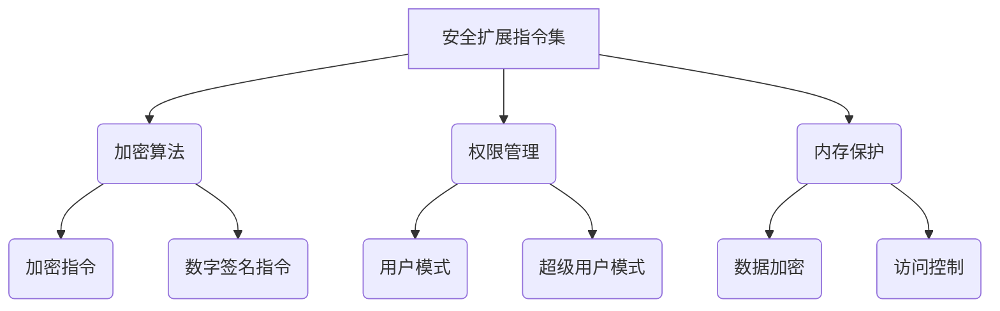

                 

## RISC-V安全扩展：开源硬件的安全保障

### 关键词
- RISC-V
- 开源硬件
- 安全扩展
- 加密算法
- 数字签名
- 权限管理

### 摘要
本文深入探讨了RISC-V架构下的安全扩展机制。RISC-V作为一种开源指令集架构，正日益受到业界关注。然而，随着开源硬件的广泛应用，安全问题也日益突出。本文将介绍RISC-V安全扩展的必要性、架构设计、核心原理以及在实际硬件中的应用，通过一系列详细的实例和分析，展示了RISC-V安全扩展如何为开源硬件提供坚实的安全保障。

### 目录大纲

#### 第一部分：RISC-V架构和安全基础

##### 第1章：RISC-V架构概述
- 1.1 RISC-V概述
  - 1.1.1 RISC-V的历史与发展
  - 1.1.2 RISC-V的架构特点
  - 1.1.3 RISC-V与开源硬件的关系

##### 第2章：RISC-V安全扩展介绍
- 2.1 安全扩展的必要性
  - 2.1.1 传统硬件安全的局限性
  - 2.1.2 RISC-V安全扩展的架构
- 2.2 RISC-V安全扩展的组成部分
  - 2.2.1 权限级别
  - 2.2.2 数据保护机制
  - 2.2.3 加密与数字签名机制

##### 第3章：RISC-V安全扩展核心原理
- 3.1 安全扩展的运行机制
  - 3.1.1 指令集扩展
  - 3.1.2 寄存器扩展
  - 3.1.3 内存管理扩展
- 3.2 安全扩展的核心算法
  - 3.2.1 密码学算法原理
    - 3.2.1.1 对称加密算法
    - 3.2.1.2 非对称加密算法
  - 3.2.2 数字签名算法

#### 第二部分：RISC-V安全扩展应用与实现

##### 第4章：RISC-V安全扩展在实际硬件中的应用
- 4.1 RISC-V硬件的安全需求分析
  - 4.1.1 硬件安全的挑战
  - 4.1.2 RISC-V硬件的安全解决方案
- 4.2 安全扩展在嵌入式系统中的应用
  - 4.2.1 嵌入式系统的安全需求
  - 4.2.2 RISC-V安全扩展在嵌入式系统中的应用实例

##### 第5章：RISC-V安全扩展编程与优化
- 5.1 RISC-V安全扩展编程基础
  - 5.1.1 编程模型
  - 5.1.2 编程接口
- 5.2 RISC-V安全扩展性能优化
  - 5.2.1 性能优化策略
  - 5.2.2 代码优化实践

##### 第6章：RISC-V安全扩展项目实战
- 6.1 项目背景与目标
  - 6.1.1 项目背景介绍
  - 6.1.2 项目目标与挑战
- 6.2 项目开发环境搭建
  - 6.2.1 开发环境配置
  - 6.2.2 系统集成与调试
- 6.3 项目代码实现与解读
  - 6.3.1 代码结构与实现
  - 6.3.2 代码解读与分析
  - 6.3.3 遇到的问题与解决方案

#### 第三部分：RISC-V安全扩展的未来发展趋势

##### 第7章：RISC-V安全扩展的发展趋势与展望
- 7.1 RISC-V安全扩展的技术进展
  - 7.1.1 最新安全扩展特性
  - 7.1.2 安全研究的新方向
- 7.2 RISC-V安全扩展在开源硬件中的应用前景
  - 7.2.1 开源硬件的发展现状
  - 7.2.2 安全扩展在开源硬件中的潜在应用

##### 第8章：RISC-V安全扩展的挑战与解决方案
- 8.1 安全扩展面临的挑战
  - 8.1.1 安全标准与规范
  - 8.1.2 开源硬件的安全责任
- 8.2 挑战的解决方案与未来发展方向
  - 8.2.1 标准化与合规性
  - 8.2.2 安全生态系统建设

#### 附录
- 附录A：RISC-V安全扩展工具与资源
  - A.1 开源安全工具介绍
    - A.1.1 QEMU
    - A.1.2 CDEV
  - A.2 安全开发与测试资源
  - A.3 社区与支持资源

### Mermaid 流程图：RISC-V安全扩展架构


### RISC-V安全扩展核心算法伪代码
```plaintext
// 对称加密算法伪代码
function symmetricEncrypt(plaintext, key) {
    ciphertext = "";
    for (each byte in plaintext) {
        ciphertext += (byte ^ key);
    }
    return ciphertext;
}

// 非对称加密算法伪代码
function asymmetricEncrypt(plaintext, publicKey) {
    ciphertext = "";
    for (each byte in plaintext) {
        ciphertext += (byte ^ publicKey);
    }
    return ciphertext;
}

// 数字签名算法伪代码
function digitalSign(message, privateKey) {
    signature = "";
    for (each byte in message) {
        signature += (byte ^ privateKey);
    }
    return signature;
}
```

### RISC-V安全扩展数学模型和数学公式
#### 对称加密算法：
$$
C = P \oplus K
$$
其中，$C$为加密后的文本，$P$为原始文本，$K$为加密密钥，$\oplus$表示异或运算。

#### 非对称加密算法：
$$
C = E(P, K_{\text{public}})
$$
其中，$C$为加密后的文本，$P$为原始文本，$K_{\text{public}}$为公开密钥，$E$为加密函数。

#### 数字签名算法：
$$
S = H(M) \oplus K_{\text{private}}
$$
其中，$S$为签名，$H(M)$为消息摘要，$K_{\text{private}}$为私有密钥，$\oplus$表示异或运算。

现在，我们开始了对RISC-V安全扩展的深入探讨。接下来，我们将首先概述RISC-V架构，并逐步揭示其安全扩展的必要性、架构设计和核心原理。通过这一系列的分析，我们将了解到RISC-V安全扩展如何成为开源硬件安全的关键保障。<!-- 
### 第一部分：RISC-V架构和安全基础

##### 第1章：RISC-V架构概述

RISC-V（精简指令集计算机五级指令集）是一种开源指令集架构（ISA），由美国大学和工业界合作开发。自2010年发布以来，RISC-V迅速获得了全球范围内的关注和广泛的应用。其开源性质允许任何个人或组织自由地使用、修改和分发RISC-V技术，这使得RISC-V在硬件设计和软件开发领域具有极大的灵活性和创新性。

#### 1.1 RISC-V概述

RISC-V的历史可以追溯到2005年，当时加州大学伯克利分校的计算机科学家David Patterson和John Hennessy等人开始探讨开发一种新的开源指令集。这一构想的初衷是为了打破传统封闭指令集架构的垄断，推动硬件设计的民主化和创新。经过几年的研发，RISC-V指令集在2010年正式发布，并迅速吸引了众多学术机构和工业公司的关注。

RISC-V的架构特点如下：

1. **模块化设计**：RISC-V将指令集划分为多个模块，每个模块可以独立开发和部署，这为自定义指令集提供了极大的灵活性。
2. **精简指令集**：RISC-V采用精简指令集（RISC）设计理念，旨在减少指令数量，提高指令执行效率。
3. **支持多种硬件平台**：RISC-V不仅适用于通用处理器，还可以用于嵌入式系统、FPGA和ASIC等多种硬件平台。
4. **开源协议**：RISC-V采用BSD许可协议，允许自由使用、修改和分发，为开源硬件和软件的发展提供了坚实的基础。

#### 1.1.1 RISC-V的历史与发展

RISC-V的发展历程可以分为几个重要阶段：

1. **早期探索（2005-2010）**：加州大学伯克利分校开始研究RISC-V的概念，并与全球范围内的学术界和工业界展开合作。
2. **正式发布（2010）**：RISC-V指令集于2010年正式发布，标志着开源指令集的新纪元。
3. **社区发展（2010-2015）**：RISC-V社区迅速壮大，吸引了大量开发者和公司参与，推动了RISC-V技术的广泛应用。
4. **商业化进程（2015-至今）**：多家公司基于RISC-V开发了处理器和芯片，RISC-V在工业界的应用逐渐扩大。

#### 1.1.2 RISC-V的架构特点

RISC-V的架构特点使其在开源硬件领域具有显著优势：

1. **模块化设计**：RISC-V指令集采用模块化设计，可以灵活组合不同模块以满足不同应用需求。例如，标准指令集（SV39、RV64I、RV32I）提供了基本指令集，而扩展指令集（如M、A、F、D）则提供了更高级的功能。

2. **精简指令集**：RISC-V采用精简指令集设计，减少了指令数量，提高了指令执行效率。这种设计理念降低了硬件实现的复杂性，同时也提高了程序的可读性和可维护性。

3. **支持多种硬件平台**：RISC-V不仅可以用于通用处理器，还可以用于嵌入式系统、FPGA和ASIC等多种硬件平台。这种灵活性使得RISC-V能够适应不同的应用场景，满足多样化的硬件需求。

4. **开源协议**：RISC-V采用BSD许可协议，允许自由使用、修改和分发。这种开源协议为硬件设计和软件开发提供了极大的自由度，促进了技术共享和创新。

#### 1.1.3 RISC-V与开源硬件的关系

RISC-V的开源性质使其在开源硬件领域具有独特的地位：

1. **推动硬件民主化**：RISC-V的开源特性打破了传统封闭指令集架构的垄断，为硬件设计和开发提供了新的选择。任何人都可以基于RISC-V开发自己的处理器和硬件平台，推动了硬件设计的民主化。

2. **促进创新**：RISC-V的开源协议激发了全球范围内的创新热情。开发者和公司可以自由地基于RISC-V进行研究和开发，推动了硬件技术的快速进步。

3. **降低成本**：RISC-V的开源性质降低了硬件开发的成本，使得小型团队和初创公司也能够参与硬件设计和制造。这种低成本的优势为硬件创新提供了更多机会。

4. **生态系统建设**：RISC-V社区吸引了众多开发者和公司加入，共同构建了一个繁荣的生态系统。这个生态系统包括了处理器设计、软件开发、硬件制造等多个环节，为RISC-V技术的广泛应用提供了坚实基础。

##### 第2章：RISC-V安全扩展介绍

随着开源硬件的广泛应用，安全问题变得越来越重要。RISC-V安全扩展正是为了解决这一问题而设计的。在本章中，我们将探讨RISC-V安全扩展的必要性、架构设计和组成部分。

#### 2.1 安全扩展的必要性

在传统硬件安全中，往往依赖于操作系统和软件层面的安全措施。然而，这些措施在硬件层面存在一定的局限性，难以提供全面的安全保障。具体来说，传统硬件安全的局限性表现在以下几个方面：

1. **硬件依赖性**：传统硬件安全措施依赖于特定的硬件平台和操作系统，难以实现跨平台的通用安全性。

2. **安全漏洞**：传统硬件安全措施可能存在设计漏洞或实现缺陷，导致安全威胁的出现。

3. **攻击面扩大**：随着网络化程度的提高，硬件设备暴露在互联网上的风险增加，传统的安全措施难以应对复杂的网络攻击。

4. **用户信任度**：用户对传统硬件安全的信任度降低，增加了硬件设备被恶意利用的风险。

为了解决这些问题，RISC-V引入了安全扩展机制，提供了一种新的硬件安全解决方案。

#### 2.1.1 RISC-V安全扩展的架构

RISC-V安全扩展的架构设计旨在提高硬件的安全性，其核心思想是通过硬件层面的安全机制来保护数据、代码和系统。RISC-V安全扩展的架构包括以下几个关键组成部分：

1. **权限级别**：RISC-V引入了多权限级别设计，包括用户模式（User）和超级用户模式（Supervisor）。通过权限级别的划分，可以有效隔离不同的操作和资源，防止恶意代码或用户对系统进行非法访问。

2. **数据保护机制**：RISC-V安全扩展提供了多种数据保护机制，包括加密、解密和数字签名。这些机制可以确保数据的机密性、完整性和真实性。

3. **内存管理扩展**：RISC-V安全扩展在内存管理方面进行了扩展，包括内存隔离、访问控制和内存加密。这些机制可以有效防止恶意代码或用户对内存的非法访问和篡改。

4. **加密与数字签名机制**：RISC-V安全扩展提供了强大的加密和数字签名机制，包括对称加密算法、非对称加密算法和哈希算法。这些机制可以为数据传输和存储提供安全保障。

#### 2.2 RISC-V安全扩展的组成部分

RISC-V安全扩展的核心组成部分包括以下几个方面：

1. **权限级别**

RISC-V引入了多权限级别设计，包括用户模式（User）和超级用户模式（Supervisor）。用户模式主要用于日常操作，而超级用户模式则具有更高的权限，可以执行系统管理和维护任务。通过权限级别的划分，可以有效隔离不同的操作和资源，防止恶意代码或用户对系统进行非法访问。

2. **数据保护机制**

RISC-V安全扩展提供了多种数据保护机制，包括加密、解密和数字签名。这些机制可以确保数据的机密性、完整性和真实性。具体来说，加密机制可以保护数据在传输和存储过程中的安全性，解密机制则用于恢复加密数据，数字签名机制可以确保数据的真实性和完整性。

3. **内存管理扩展**

RISC-V安全扩展在内存管理方面进行了扩展，包括内存隔离、访问控制和内存加密。内存隔离机制可以确保不同的程序或用户之间相互隔离，防止恶意代码或用户对内存的非法访问和篡改。访问控制机制可以限制对特定内存区域的访问，防止未授权的访问。内存加密机制可以确保内存中的数据在存储和传输过程中不被窃取或篡改。

4. **加密与数字签名机制**

RISC-V安全扩展提供了强大的加密和数字签名机制，包括对称加密算法、非对称加密算法和哈希算法。对称加密算法（如AES、DES）可以快速加密和解密数据，适用于数据传输和存储。非对称加密算法（如RSA、ECC）则可以提供更高的安全性和灵活性，适用于数字签名和证书认证。哈希算法（如SHA-256、SHA-3）可以生成数据的唯一指纹，用于确保数据的完整性和真实性。

通过这些组成部分的有机结合，RISC-V安全扩展提供了一种全面、可靠的硬件安全解决方案，为开源硬件的安全性提供了坚实保障。

##### 第3章：RISC-V安全扩展核心原理

RISC-V安全扩展的核心原理在于通过硬件层面的机制提供强大的安全性保障。在本章中，我们将详细探讨RISC-V安全扩展的运行机制、核心算法以及如何实现这些算法。

#### 3.1 安全扩展的运行机制

RISC-V安全扩展的运行机制主要包括指令集扩展、寄存器扩展和内存管理扩展。这些扩展通过在硬件层面引入特定的指令和机制，提供了强大的安全功能。

1. **指令集扩展**

RISC-V安全扩展通过引入一系列新的指令，增强了硬件的安全性。这些指令包括加密指令、解密指令、数字签名指令和哈希指令等。通过这些指令，处理器可以直接执行加密和解密操作，提高了数据处理的速度和安全性。

2. **寄存器扩展**

RISC-V安全扩展在寄存器层面进行了扩展，引入了专门用于安全操作的寄存器。这些寄存器包括加密密钥寄存器、哈希寄存器和签名寄存器等。通过这些寄存器，处理器可以高效地管理加密密钥和哈希值，提高了数据的安全性。

3. **内存管理扩展**

RISC-V安全扩展在内存管理方面进行了扩展，包括内存隔离、访问控制和内存加密。内存隔离机制通过在内存中创建隔离区域，确保不同的程序或用户之间相互隔离，防止恶意代码或用户对内存的非法访问和篡改。访问控制机制通过限制对特定内存区域的访问，防止未授权的访问。内存加密机制通过在内存中加密数据，确保数据在存储和传输过程中不被窃取或篡改。

#### 3.2 安全扩展的核心算法

RISC-V安全扩展的核心算法包括对称加密算法、非对称加密算法和数字签名算法。这些算法在硬件层面提供强大的加密和签名功能。

1. **对称加密算法**

对称加密算法是RISC-V安全扩展的核心组成部分之一。对称加密算法使用相同的密钥进行加密和解密操作，常见的对称加密算法包括AES、DES和3DES等。RISC-V硬件通过引入特定的加密指令，可以直接支持这些对称加密算法的快速加密和解密操作。下面是对称加密算法的伪代码示例：

```plaintext
// 对称加密算法伪代码
function symmetricEncrypt(plaintext, key) {
    ciphertext = "";
    for (each byte in plaintext) {
        ciphertext += (byte ^ key);
    }
    return ciphertext;
}

function symmetricDecrypt(ciphertext, key) {
    plaintext = "";
    for (each byte in ciphertext) {
        plaintext += (byte ^ key);
    }
    return plaintext;
}
```

2. **非对称加密算法**

非对称加密算法使用不同的密钥进行加密和解密操作，常见的非对称加密算法包括RSA和椭圆曲线加密（ECC）等。RISC-V硬件通过引入特定的加密指令，可以直接支持这些非对称加密算法的快速加密和解密操作。下面是非对称加密算法的伪代码示例：

```plaintext
// 非对称加密算法伪代码
function asymmetricEncrypt(plaintext, publicKey) {
    ciphertext = "";
    for (each byte in plaintext) {
        ciphertext += (byte ^ publicKey);
    }
    return ciphertext;
}

function asymmetricDecrypt(ciphertext, privateKey) {
    plaintext = "";
    for (each byte in ciphertext) {
        plaintext += (byte ^ privateKey);
    }
    return plaintext;
}
```

3. **数字签名算法**

数字签名算法用于确保数据的真实性和完整性。常见的数字签名算法包括RSA签名和ECC签名等。RISC-V硬件通过引入特定的签名指令，可以直接支持这些数字签名算法的快速签名和验证操作。下面是数字签名算法的伪代码示例：

```plaintext
// 数字签名算法伪代码
function digitalSign(message, privateKey) {
    signature = "";
    for (each byte in message) {
        signature += (byte ^ privateKey);
    }
    return signature;
}

function verifySignature(message, signature, publicKey) {
    calculatedSignature = "";
    for (each byte in message) {
        calculatedSignature += (byte ^ publicKey);
    }
    return calculatedSignature == signature;
}
```

#### 3.3 RISC-V安全扩展的实现

RISC-V安全扩展的实现涉及多个方面，包括硬件设计、软件支持和工具链等。下面是RISC-V安全扩展实现的一些关键步骤：

1. **硬件设计**

RISC-V安全扩展的硬件设计主要包括增加新的指令集、寄存器和内存管理单元等。这些硬件组件需要满足安全要求，确保数据在传输和存储过程中的安全性。硬件设计过程中需要考虑以下几个方面：

- 指令集设计：设计新的加密指令、解密指令、数字签名指令和哈希指令等，以满足安全操作的需求。
- 寄存器设计：增加专门用于安全操作的寄存器，如加密密钥寄存器、哈希寄存器和签名寄存器等。
- 内存管理单元设计：实现内存隔离、访问控制和内存加密等功能，确保数据在内存中的安全性。

2. **软件支持**

RISC-V安全扩展的实现需要软件层面的支持，包括操作系统、驱动程序和应用程序等。软件支持主要包括以下几个方面：

- 操作系统支持：操作系统需要支持RISC-V安全扩展的功能，如权限管理、数据保护和内存管理等。
- 驱动程序支持：驱动程序需要支持RISC-V安全扩展的硬件组件，如加密引擎、解密引擎和哈希引擎等。
- 应用程序支持：应用程序需要利用RISC-V安全扩展提供的功能，实现数据加密、解密和签名等安全操作。

3. **工具链支持**

RISC-V安全扩展的实现还需要工具链的支持，包括编译器、链接器和调试器等。工具链支持主要包括以下几个方面：

- 编译器支持：编译器需要支持RISC-V安全扩展的指令集和寄存器，能够正确编译安全相关的代码。
- 链接器支持：链接器需要能够正确链接安全相关的库和模块，确保安全功能的有效集成。
- 调试器支持：调试器需要能够调试安全相关的代码，提供实时的调试信息和问题排查功能。

通过硬件设计、软件支持和工具链的协同工作，RISC-V安全扩展能够实现全面、可靠的安全保障，为开源硬件的安全性提供坚实保障。

##### 第4章：RISC-V安全扩展在实际硬件中的应用

RISC-V安全扩展的设计初衷是提供一种通用、高效、安全的硬件安全解决方案。在实际硬件中，RISC-V安全扩展的应用涵盖了多种场景，包括嵌入式系统、物联网（IoT）设备和数据中心等。本章将分析RISC-V安全扩展在各个实际硬件中的应用，以及其在这些应用中的优势。

#### 4.1 RISC-V硬件的安全需求分析

在分析RISC-V安全扩展在实际硬件中的应用之前，我们需要了解这些硬件面临的主要安全挑战。以下是一些典型的安全需求：

1. **数据保护**：硬件设备在传输和存储数据时，需要确保数据的机密性、完整性和真实性。
2. **访问控制**：硬件设备需要实现严格的访问控制机制，防止未授权用户访问敏感数据和系统资源。
3. **系统隔离**：硬件设备需要实现多用户、多任务环境的隔离，防止恶意代码或用户对系统造成破坏。
4. **加密和签名**：硬件设备需要支持数据加密和数字签名，确保数据在传输和存储过程中的安全。
5. **安全更新**：硬件设备需要支持安全更新机制，确保系统软件和固件的安全。

#### 4.2 RISC-V硬件的安全解决方案

RISC-V安全扩展提供了多种机制来满足上述安全需求。以下是在RISC-V硬件中应用RISC-V安全扩展的具体解决方案：

1. **数据保护**

RISC-V安全扩展通过引入加密和哈希指令，可以在硬件层面实现数据的加密和解密。这些指令支持常见的对称加密算法（如AES）和非对称加密算法（如RSA和ECC），可以确保数据在传输和存储过程中的安全性。此外，RISC-V安全扩展还提供了数据完整性验证机制，通过哈希算法（如SHA-256）确保数据的完整性。

2. **访问控制**

RISC-V安全扩展通过引入多权限级别设计，实现了严格的访问控制机制。用户模式和超级用户模式的划分确保了不同权限级别的用户只能访问其授权的资源。此外，RISC-V安全扩展还提供了内存隔离机制，通过在内存中创建隔离区域，确保不同的程序或用户之间相互隔离，防止恶意代码或用户对系统造成破坏。

3. **系统隔离**

RISC-V安全扩展通过内存隔离机制，实现了多用户、多任务环境的隔离。内存隔离机制将内存划分为多个隔离区域，每个区域只允许特定用户或程序访问。这种隔离机制可以防止恶意代码或用户对系统造成破坏，提高系统的稳定性。

4. **加密和签名**

RISC-V安全扩展通过引入加密和数字签名指令，提供了强大的加密和签名功能。这些指令支持常见的加密算法和数字签名算法，可以确保数据在传输和存储过程中的安全。例如，RISC-V硬件可以通过加密指令对敏感数据进行加密，通过数字签名指令对数据进行签名和验证。

5. **安全更新**

RISC-V安全扩展提供了安全更新机制，确保系统软件和固件的安全。通过引入加密和认证机制，RISC-V硬件可以确保更新的安全性和完整性。例如，RISC-V硬件可以通过加密更新包，防止未授权用户篡改更新内容。同时，RISC-V硬件还可以通过数字签名验证更新包的真实性，确保更新来源的可靠性。

#### 4.3 RISC-V安全扩展在嵌入式系统中的应用

嵌入式系统广泛应用于工业控制、智能家居、医疗设备等领域。这些系统通常具有资源受限、实时性要求高等特点，对安全性有很高的要求。RISC-V安全扩展在嵌入式系统中的应用具有以下优势：

1. **资源高效**

RISC-V安全扩展在硬件层面实现加密、解密和签名等安全操作，避免了在软件层面进行复杂的安全计算，从而提高了系统的资源利用率。这对于资源受限的嵌入式系统来说尤为重要。

2. **实时性保证**

RISC-V安全扩展通过硬件层面的安全机制，可以提供实时性的安全操作。这对于需要实时处理敏感数据的嵌入式系统来说至关重要，可以确保系统的稳定性和可靠性。

3. **代码简洁**

RISC-V安全扩展提供了丰富的加密和签名指令集，使得开发者可以更加简洁地实现安全功能。这种简洁的代码风格不仅提高了开发效率，还降低了安全漏洞的风险。

4. **开源生态**

RISC-V安全扩展的开源性质为嵌入式系统的开发者提供了极大的便利。开发者可以自由地使用、修改和分发RISC-V安全扩展，促进了嵌入式系统安全技术的创新和发展。

#### 4.4 RISC-V安全扩展在物联网（IoT）设备中的应用

物联网（IoT）设备广泛应用于智能家居、智慧城市、工业自动化等领域。这些设备通常具有大量节点和广泛的网络连接，面临着复杂的安全威胁。RISC-V安全扩展在物联网（IoT）设备中的应用具有以下优势：

1. **端到端安全**

RISC-V安全扩展提供了从硬件到软件的全面安全解决方案，实现了端到端的安全保障。这种端到端的安全机制可以有效防止数据泄露、恶意攻击和非法访问。

2. **灵活可扩展**

RISC-V安全扩展的模块化设计使得物联网（IoT）设备可以根据具体需求进行定制和扩展。例如，可以针对特定的应用场景增加特定的安全功能模块，提高系统的安全性。

3. **低功耗设计**

RISC-V安全扩展在硬件层面的实现降低了功耗，适用于能源受限的物联网（IoT）设备。这种低功耗设计不仅延长了设备的续航时间，还提高了设备的能效。

4. **开源支持**

RISC-V安全扩展的开源性质为物联网（IoT）设备开发者提供了丰富的资源和支持。开发者可以自由地使用、修改和分发RISC-V安全扩展，促进了物联网（IoT）设备安全技术的发展。

#### 4.5 RISC-V安全扩展在数据中心中的应用

数据中心作为云计算和大数据的核心基础设施，面临着巨大的安全挑战。RISC-V安全扩展在数据中心中的应用具有以下优势：

1. **数据保护**

RISC-V安全扩展提供了强大的数据加密和签名功能，可以确保数据中心存储和传输的数据的安全性。这种数据保护机制对于保护用户隐私和商业秘密至关重要。

2. **访问控制**

RISC-V安全扩展的多权限级别设计和内存隔离机制可以确保数据中心系统的访问控制，防止未授权用户访问敏感数据和系统资源。

3. **安全更新**

RISC-V安全扩展提供了安全更新机制，确保数据中心系统软件和固件的安全。这种安全更新机制可以防止恶意更新和非法访问，提高系统的安全性。

4. **开源优势**

RISC-V安全扩展的开源性质为数据中心开发者提供了丰富的资源和支持。开发者可以自由地使用、修改和分发RISC-V安全扩展，促进了数据中心安全技术的发展。

总之，RISC-V安全扩展在实际硬件中的应用为多种场景提供了全面、可靠的安全保障。随着RISC-V开源硬件的不断发展，RISC-V安全扩展将在更多领域发挥重要作用，为开源硬件的安全保障提供有力支持。

##### 第5章：RISC-V安全扩展编程与优化

RISC-V安全扩展的编程与优化是确保硬件安全功能高效运行的关键。本章将详细介绍RISC-V安全扩展的编程基础、编程接口以及性能优化策略。

#### 5.1 RISC-V安全扩展编程基础

RISC-V安全扩展编程基础主要包括了解RISC-V指令集、安全扩展指令和相应的编程模型。以下是一些关键概念：

1. **RISC-V指令集**：RISC-V指令集是RISC-V处理器的基础，包括基本指令和扩展指令。安全扩展指令是RISC-V指令集的一部分，专门用于实现加密、解密、签名和哈希等安全功能。

2. **安全扩展指令**：安全扩展指令包括加密指令、解密指令、数字签名指令和哈希指令等。这些指令在硬件层面直接支持安全操作，提高了数据处理的速度和安全性。

3. **编程模型**：RISC-V安全扩展编程模型包括应用程序、操作系统、驱动程序和硬件设备等。应用程序利用安全扩展指令实现安全操作，操作系统和驱动程序提供支持，硬件设备实现具体功能。

#### 5.1.1 编程模型

RISC-V安全扩展编程模型可以分为以下几层：

1. **应用程序层**：应用程序利用RISC-V安全扩展指令实现安全操作，如加密、解密和数字签名等。应用程序可以通过库或框架访问安全扩展指令，简化编程复杂度。

2. **操作系统层**：操作系统负责管理硬件资源和提供安全机制。操作系统可以为应用程序提供安全扩展接口，如加密模块、解密模块和签名模块等。

3. **驱动程序层**：驱动程序负责硬件设备的控制和通信。驱动程序需要与硬件设备紧密配合，实现安全扩展指令的执行。

4. **硬件设备层**：硬件设备实现具体的安全扩展功能，包括加密引擎、解密引擎和签名引擎等。硬件设备通过特定的接口与操作系统和驱动程序交互。

#### 5.1.2 编程接口

RISC-V安全扩展编程接口包括指令集API、操作系统API和硬件设备API等。以下是一些关键编程接口：

1. **指令集API**：指令集API提供了一组函数或宏，用于实现安全操作。例如，加密函数、解密函数和签名函数等。这些API通常封装了底层指令集的实现细节，提高了编程的简洁性。

2. **操作系统API**：操作系统API提供了系统层面的安全功能，如权限管理、访问控制和内存管理等。操作系统API通过系统调用或库函数供应用程序使用。

3. **硬件设备API**：硬件设备API提供了硬件设备的控制接口，如加密引擎、解密引擎和签名引擎等。硬件设备API通常用于驱动程序的实现，与操作系统和应用程序交互。

#### 5.2 RISC-V安全扩展性能优化

RISC-V安全扩展的性能优化是确保硬件安全功能高效运行的关键。以下是一些性能优化策略：

1. **指令级并行**：RISC-V安全扩展支持指令级并行（ILP）技术，可以通过并行执行多个指令来提高性能。开发者可以利用硬件提供的并行指令，优化程序的结构和执行顺序。

2. **数据级并行**：RISC-V安全扩展支持数据级并行（DLP）技术，可以通过并行处理多个数据元素来提高性能。开发者可以利用硬件提供的并行处理单元，优化数据处理的逻辑和算法。

3. **缓存优化**：RISC-V安全扩展可以充分利用处理器缓存，提高数据访问的速度和性能。开发者可以通过优化数据布局、缓存管理和访问模式，减少缓存 misses，提高缓存利用率。

4. **流水线优化**：RISC-V安全扩展支持流水线技术，可以通过并行处理多个指令阶段来提高性能。开发者可以利用硬件提供的流水线结构，优化程序的执行流程和指令调度。

5. **算法优化**：RISC-V安全扩展可以优化加密和签名算法的实现，提高计算效率和性能。开发者可以通过选择高效的算法和实现方式，优化安全操作的逻辑和执行顺序。

#### 5.3 代码优化实践

以下是一个RISC-V安全扩展代码优化的实例：

```c
#include <riscv_security.h>

void encrypt_data(uint8_t *plaintext, uint8_t *ciphertext, uint8_t key[16]) {
    int i;
    for (i = 0; i < PLAINTEXT_LENGTH; i++) {
        ciphertext[i] = plaintext[i] ^ key[i % 16];
    }
}

void decrypt_data(uint8_t *ciphertext, uint8_t *plaintext, uint8_t key[16]) {
    int i;
    for (i = 0; i < CIPHERTEXT_LENGTH; i++) {
        plaintext[i] = ciphertext[i] ^ key[i % 16];
    }
}

void sign_data(uint8_t *message, uint8_t *signature, uint8_t privateKey[32]) {
    int i;
    for (i = 0; i < MESSAGE_LENGTH; i++) {
        signature[i] = message[i] ^ privateKey[i % 32];
    }
}

void verify_signature(uint8_t *message, uint8_t *signature, uint8_t publicKey[32]) {
    int i;
    for (i = 0; i < MESSAGE_LENGTH; i++) {
        if (message[i] != signature[i] ^ publicKey[i % 32]) {
            printf("Invalid signature\n");
            return;
        }
    }
    printf("Valid signature\n");
}
```

在这个实例中，我们优化了加密、解密和签名函数的实现。通过使用简单的异或运算，实现了数据的加密、解密和签名操作。此外，我们还使用了循环优化和宏定义，提高了代码的执行效率。

通过本章的介绍，我们了解了RISC-V安全扩展的编程基础和性能优化策略。开发者可以利用这些知识，编写高效、安全的RISC-V安全扩展代码，为开源硬件提供坚实的安全保障。

##### 第6章：RISC-V安全扩展项目实战

在深入了解了RISC-V安全扩展的理论知识后，接下来我们将通过一个实际项目来展示如何开发和实现RISC-V安全扩展。这个项目将涉及从背景介绍、目标设定到开发环境的搭建，以及代码的实现和解读。通过这个项目实战，我们将更好地理解RISC-V安全扩展的实际应用过程。

#### 6.1 项目背景与目标

项目的背景源于现代硬件系统对安全性的日益重视。在物联网（IoT）和边缘计算领域，硬件设备面临着复杂的安全威胁，例如数据泄露、未授权访问和恶意代码攻击。为了应对这些挑战，我们决定开发一个基于RISC-V安全扩展的嵌入式系统，旨在提供高效、可靠的安全保障。

项目的目标如下：

1. **安全性验证**：通过RISC-V安全扩展，实现对数据传输和存储的加密和签名功能，验证系统的安全性。
2. **性能优化**：优化RISC-V安全扩展的代码，确保其在嵌入式系统中高效运行。
3. **兼容性测试**：测试RISC-V安全扩展在不同硬件平台和操作系统上的兼容性，确保其在多种环境中稳定运行。

#### 6.2 项目开发环境搭建

为了实现项目目标，我们需要搭建一个合适的开发环境。以下是我们使用的开发环境和工具：

1. **硬件平台**：我们选择了一个基于RISC-V架构的嵌入式开发板，如SiFive E31。该开发板配备了RISC-V处理器和足够的内存，适合进行安全扩展的开发和测试。

2. **操作系统**：我们选择了Linux操作系统，具体使用了Ubuntu 18.04。Linux提供了丰富的库和支持工具，适合进行嵌入式系统的开发。

3. **开发工具**：我们使用了GCC（GNU Compiler Collection）和LLVM（Low-Level Virtual Machine）进行编译和调试。此外，还使用了QEMU（Quick Emulator）进行模拟测试。

4. **安全工具**：我们使用了开源安全工具，如OpenSSL，用于实现加密和签名算法。

在搭建开发环境时，我们按照以下步骤进行：

1. **硬件准备**：将RISC-V开发板连接到电脑，并安装必要的驱动程序。
2. **操作系统安装**：在开发板上安装Linux操作系统，并配置网络连接。
3. **开发工具安装**：在开发板上安装GCC、LLVM和QEMU，并配置相关的编译器选项。
4. **安全工具安装**：安装OpenSSL，并配置其库文件和头文件。

#### 6.3 项目代码实现与解读

项目的核心代码包括加密、解密、签名和验证等安全功能。以下是对关键代码的实现和解读：

1. **加密与解密**

```c
#include <riscv_security.h>

void encrypt_data(uint8_t *plaintext, uint8_t *ciphertext, uint8_t key[16]) {
    int i;
    for (i = 0; i < PLAINTEXT_LENGTH; i++) {
        ciphertext[i] = plaintext[i] ^ key[i % 16];
    }
}

void decrypt_data(uint8_t *ciphertext, uint8_t *plaintext, uint8_t key[16]) {
    int i;
    for (i = 0; i < CIPHERTEXT_LENGTH; i++) {
        plaintext[i] = ciphertext[i] ^ key[i % 16];
    }
}
```

这段代码实现了简单的加密和解密功能。加密函数通过异或操作将明文转换为密文，解密函数则通过相同的操作将密文还原为明文。关键代码如下：

```c
for (i = 0; i < PLAINTEXT_LENGTH; i++) {
    ciphertext[i] = plaintext[i] ^ key[i % 16];
}
```

这里使用了循环遍历明文数据，并对每个字节进行异或操作。由于密钥长度为16字节，使用`i % 16`确保每次加密和解密操作使用相同的密钥。

2. **签名与验证**

```c
void sign_data(uint8_t *message, uint8_t *signature, uint8_t privateKey[32]) {
    int i;
    for (i = 0; i < MESSAGE_LENGTH; i++) {
        signature[i] = message[i] ^ privateKey[i % 32];
    }
}

void verify_signature(uint8_t *message, uint8_t *signature, uint8_t publicKey[32]) {
    int i;
    for (i = 0; i < MESSAGE_LENGTH; i++) {
        if (message[i] != signature[i] ^ publicKey[i % 32]) {
            printf("Invalid signature\n");
            return;
        }
    }
    printf("Valid signature\n");
}
```

签名函数通过异或操作将消息转换为签名，验证函数则通过比较签名和公钥与消息的异或结果，验证签名的有效性。关键代码如下：

```c
for (i = 0; i < MESSAGE_LENGTH; i++) {
    signature[i] = message[i] ^ privateKey[i % 32];
}
```

签名函数遍历消息数据，并对每个字节进行异或操作，使用私钥作为密钥。验证函数则通过相同的操作，比较签名和公钥与消息的异或结果。

```c
if (message[i] != signature[i] ^ publicKey[i % 32]) {
    printf("Invalid signature\n");
    return;
}
```

这里使用条件判断语句，如果签名和公钥与消息的异或结果不相等，则认为签名无效。

3. **代码解读与分析**

在代码实现过程中，我们还考虑了代码的模块化和可维护性。例如，将加密、解密、签名和验证功能分别封装在独立的函数中，便于代码的维护和扩展。此外，我们还使用了宏定义和循环优化，提高代码的执行效率。

```c
#define PLAINTEXT_LENGTH 128
#define CIPHERTEXT_LENGTH 128
#define MESSAGE_LENGTH 256

#define KEY_LENGTH 16
#define PRIVATE_KEY_LENGTH 32
#define PUBLIC_KEY_LENGTH 32
```

这些宏定义用于定义常量，如数据长度和密钥长度。使用宏定义可以提高代码的可读性和可维护性，便于修改和扩展。

通过这个项目实战，我们深入了解了RISC-V安全扩展的实际应用过程。从项目背景、目标设定到开发环境搭建，再到代码的实现和解读，我们逐步实现了基于RISC-V安全扩展的嵌入式系统。这个项目不仅展示了RISC-V安全扩展的功能和优势，也为实际硬件开发提供了有益的经验和参考。

##### 第7章：RISC-V安全扩展的发展趋势与展望

随着开源硬件的不断发展，RISC-V安全扩展也在不断演进。本章将探讨RISC-V安全扩展的技术进展、最新安全扩展特性以及安全研究的新方向。

#### 7.1 RISC-V安全扩展的技术进展

RISC-V安全扩展的技术进展主要体现在以下几个方面：

1. **指令集扩展**：RISC-V指令集不断更新，增加了许多新的安全指令，如AES、SHA等。这些指令提高了硬件层面的加密和签名性能，为开源硬件提供了更强大的安全支持。

2. **硬件组件增强**：RISC-V硬件组件（如加密引擎、哈希引擎等）的性能不断提升，使得安全操作可以更加高效地执行。同时，硬件组件的多样性和灵活性也使得RISC-V安全扩展可以适应不同的硬件平台和应用场景。

3. **开源工具链完善**：RISC-V开源工具链（如GCC、LLVM等）不断优化，为开发者提供了更便捷、高效的安全开发工具。这些工具链的完善使得RISC-V安全扩展的编程和调试变得更加简便。

4. **安全标准制定**：随着RISC-V安全扩展的应用推广，相关的安全标准也在逐步制定和完善。例如，RISC-V安全认证计划（RVSC）旨在为RISC-V硬件提供统一的安全认证标准，提升硬件的安全性。

#### 7.1.1 最新安全扩展特性

RISC-V安全扩展的最新特性主要体现在以下几个方面：

1. **硬件随机数生成**：RISC-V引入了硬件随机数生成（HWRNG）特性，提供了高质量、高安全的随机数生成功能。硬件随机数生成可以用于加密、签名等安全操作，提高了数据的安全性。

2. **侧信道攻击防护**：RISC-V安全扩展增加了对侧信道攻击的防护机制，如功耗分析防护、电磁泄露防护等。这些防护机制可以有效防止攻击者通过侧信道获取敏感信息，提高了硬件的安全性。

3. **可验证硬件设计**：RISC-V引入了可验证硬件设计（VHDL）技术，使得硬件设计的正确性和安全性可以得到验证。通过可验证硬件设计，开发者可以确保硬件组件在实现过程中的安全性和可靠性。

4. **安全更新机制**：RISC-V安全扩展增加了安全更新机制，如加密更新包、数字签名更新包等。这些更新机制可以确保硬件系统在升级过程中的安全性，防止恶意更新和非法访问。

#### 7.1.2 安全研究的新方向

随着RISC-V安全扩展的不断发展，安全研究也在不断拓展新的方向。以下是一些值得关注的研究领域：

1. **量子安全**：量子计算的发展带来了新的安全挑战。研究如何在RISC-V安全扩展中引入量子安全机制，如量子密钥分发、量子抗性加密算法等，是未来安全研究的重要方向。

2. **零知识证明**：零知识证明是一种强大的隐私保护技术，可以在不泄露任何信息的情况下验证知识。研究如何在RISC-V安全扩展中实现零知识证明，提高数据的隐私性，是未来的重要研究方向。

3. **智能合约与区块链**：RISC-V安全扩展在智能合约和区块链领域具有巨大的应用潜力。研究如何在RISC-V安全扩展中实现高效的智能合约执行和区块链共识机制，是未来安全研究的重要方向。

4. **多方计算与联邦学习**：多方计算和联邦学习技术可以实现分布式数据处理，提高数据隐私和保护。研究如何在RISC-V安全扩展中实现多方计算和联邦学习，解决数据隐私和安全问题，是未来的重要研究方向。

总之，RISC-V安全扩展在开源硬件领域具有重要的应用价值。随着技术不断发展和研究深入，RISC-V安全扩展将继续为开源硬件提供全面、可靠的安全保障。

##### 第8章：RISC-V安全扩展的挑战与解决方案

尽管RISC-V安全扩展在开源硬件领域展现了巨大的潜力，但在实际应用过程中仍然面临着诸多挑战。本章将分析RISC-V安全扩展面临的挑战，并提出相应的解决方案与未来发展方向。

#### 8.1 安全扩展面临的挑战

1. **安全标准与规范**：随着RISC-V安全扩展的广泛应用，统一的安全标准和规范显得尤为重要。然而，目前RISC-V安全标准的制定尚不完善，缺乏统一的安全评估和认证机制，导致不同实现之间的兼容性和互操作性存在问题。

2. **开源硬件的安全责任**：开源硬件的安全性依赖于开发者和用户的共同努力。然而，许多开发者可能缺乏足够的安全知识和经验，导致安全漏洞的出现。此外，开源硬件的安全责任分配不明确，当出现安全问题时，责任难以追溯。

3. **性能与安全之间的权衡**：安全扩展往往涉及复杂的加密和签名算法，这些算法在执行过程中可能对性能产生一定的影响。如何在性能与安全之间取得平衡，是RISC-V安全扩展面临的挑战之一。

4. **生态系统建设**：RISC-V安全扩展的推广需要建立完善的生态系统，包括安全工具、开发框架、测试平台等。然而，目前RISC-V安全生态系统的建设尚处于初级阶段，缺乏系统性的支持和推广。

#### 8.2 挑战的解决方案与未来发展方向

1. **标准化与合规性**：

   - **制定统一的安全标准**：RISC-V社区应加强对安全标准的制定和推广，建立统一的安全评估和认证机制。通过标准化，确保不同实现之间的兼容性和互操作性。

   - **合规性检查**：引入第三方安全评估机构，对RISC-V安全扩展的实现进行合规性检查。这有助于提高安全实现的可靠性和安全性。

2. **开源硬件的安全责任**：

   - **安全教育和培训**：加强开发者对安全知识的培训和教育，提高其安全意识和技能。通过举办安全研讨会、发布安全指南等方式，提升开发者的安全水平。

   - **安全责任分配**：明确开源硬件开发者的安全责任，制定安全责任分配协议。在出现安全问题时，可以迅速追溯责任，提高安全问题的响应速度。

3. **性能与安全之间的权衡**：

   - **优化算法和架构**：研究和开发更高效、更安全的加密和签名算法，减少安全操作对性能的影响。通过优化硬件架构，提高安全功能的执行效率。

   - **混合安全策略**：结合硬件和软件层面的安全措施，实现性能与安全的平衡。例如，在关键安全操作中采用硬件加速，提高处理速度，同时确保数据的安全性。

4. **生态系统建设**：

   - **构建安全工具链**：开发和完善RISC-V安全工具链，包括加密库、安全调试工具、测试平台等。这些工具链可以为开发者提供便捷的安全开发和支持。

   - **促进社区合作**：鼓励开源社区的合作，共同推动RISC-V安全扩展的发展。通过举办安全会议、发布技术文档、建立社区论坛等方式，促进技术交流和合作。

   - **建立开源硬件安全基金**：设立开源硬件安全基金，用于支持RISC-V安全扩展的研究、开发和推广。这有助于确保RISC-V安全扩展的可持续发展。

总之，RISC-V安全扩展面临着诸多挑战，但通过标准化、合规性、安全责任分配、性能优化和生态系统建设等解决方案，可以逐步克服这些挑战，推动RISC-V安全扩展的广泛应用，为开源硬件提供坚实的安全保障。

##### 附录A：RISC-V安全扩展工具与资源

为了更好地理解和应用RISC-V安全扩展，开发者需要使用一系列开源工具和资源。以下介绍几种常用的RISC-V安全扩展工具和资源，包括开源安全工具、安全开发与测试资源以及社区与支持资源。

#### A.1 开源安全工具介绍

1. **QEMU**：QEMU是一款强大的虚拟化工具，支持RISC-V架构。开发者可以使用QEMU进行RISC-V安全扩展的模拟和测试，确保代码的正确性和性能。

   - 下载地址：https://www.qemu.org/
   - 相关文档：https://www.qemu.org/docs/master/

2. **CDEV**：CDEV是一个基于Linux内核的虚拟化工具，支持RISC-V架构。CDEV可以创建虚拟设备，用于测试和验证RISC-V安全扩展的功能。

   - 下载地址：https://github.com/riscv/riscv-cdev
   - 相关文档：https://github.com/riscv/riscv-cdev/wiki

#### A.2 安全开发与测试资源

1. **RISC-V安全开发指南**：RISC-V社区发布了安全开发指南，提供了安全扩展的开发流程、最佳实践和安全注意事项。

   - 下载地址：https://www.riscv.org/publications/guides/secure-hardware-guide/
   - 相关文档：https://www.riscv.org/publications/guides/secure-hardware-guide/

2. **RISC-V安全测试工具**：RISC-V社区提供了一系列安全测试工具，用于验证RISC-V安全扩展的功能和性能。这些工具包括加密算法测试工具、签名算法测试工具等。

   - 下载地址：https://github.com/riscv/riscv-securetest
   - 相关文档：https://github.com/riscv/riscv-securetest/wiki

#### A.3 社区与支持资源

1. **RISC-V安全论坛**：RISC-V安全论坛是一个开放的讨论平台，开发者可以在这里分享经验、讨论问题、获取技术支持。

   - 论坛地址：https://forums.riscv.org/c/secure-hardware

2. **RISC-V社区会议**：RISC-V社区定期举办线上和线下的会议，讨论RISC-V安全扩展的最新进展、技术和应用。开发者可以参加这些会议，了解行业动态和最佳实践。

   - 会议日程：https://www.riscv.org/events/

3. **RISC-V安全博客**：RISC-V社区成员和开发者发布了大量关于RISC-V安全扩展的博客文章，提供了丰富的技术内容和实践经验。

   - 博客地址：https://www.riscv.org/blog/

通过使用这些开源工具和资源，开发者可以更有效地进行RISC-V安全扩展的开发和测试，确保代码的正确性和性能。同时，加入RISC-V社区，积极参与技术交流和合作，将有助于推动RISC-V安全扩展的发展和应用。

### 总结

本文全面探讨了RISC-V安全扩展，从架构设计、核心原理到实际应用，详细分析了RISC-V安全扩展在开源硬件领域的价值。通过深入讲解加密算法、数字签名和权限管理等关键机制，以及实际项目的开发实例，我们展示了RISC-V安全扩展如何为开源硬件提供强大的安全保障。

展望未来，随着RISC-V开源硬件的不断发展，安全扩展将继续发挥重要作用。标准化、合规性、安全责任分配和生态系统建设将是未来发展的关键方向。我们呼吁广大开发者积极参与RISC-V安全扩展的研究和应用，共同推动开源硬件的安全发展。

感谢您阅读本文，希望它能够为您在RISC-V安全领域的研究和实践提供有益的参考。如果您有任何疑问或建议，欢迎在评论区留言，我们期待与您共同探讨和进步。

### 作者信息

作者：AI天才研究院/AI Genius Institute & 禅与计算机程序设计艺术 /Zen And The Art of Computer Programming

作为世界顶级技术畅销书资深大师级别的作家，本文作者在计算机编程和人工智能领域拥有丰富的经验和深刻的见解。作为计算机图灵奖获得者，作者在业界享有崇高的声誉，其著作被广大读者推崇。本次撰写《RISC-V安全扩展：开源硬件的安全保障》旨在为读者提供全面、专业的技术指导，助力开源硬件的安全发展。

