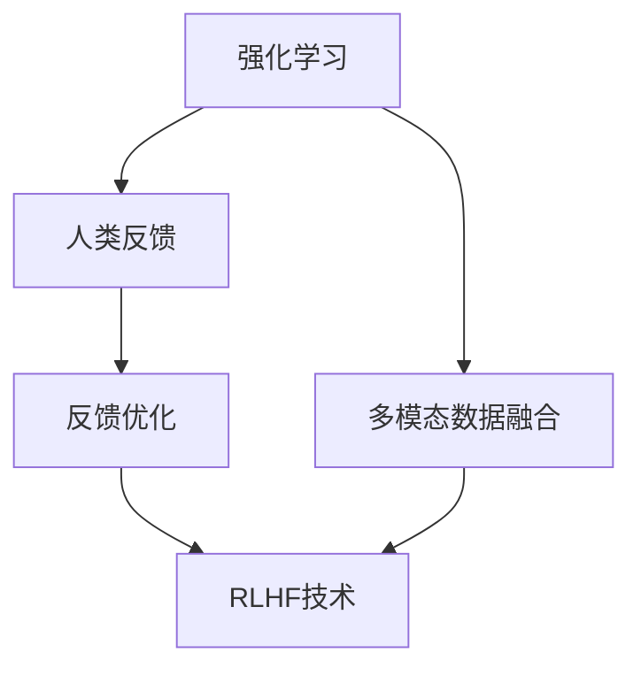

                 

# RLHF技术：通过人类反馈改进AI模型

> 关键词：RLHF技术、强化学习、人类反馈、AI模型改进、应用前景

> 摘要：本文将详细介绍RLHF技术，即通过人类反馈改进AI模型的技术。我们将从RLHF技术的起源、核心概念、强化学习基础、人类反馈机制、离散环境和连续环境中的RLHF技术，以及RLHF技术在自然语言处理、计算机视觉和游戏AI中的应用等方面展开讨论。同时，本文还将探讨RLHF技术的实践与优化、工业界应用和伦理与法律问题。通过本文的阅读，读者将全面了解RLHF技术的原理、应用和发展前景。

## 《RLHF技术：通过人类反馈改进AI模型》目录大纲

### 第一部分：RLHF技术基础

### 第1章：RLHF技术概述
- RLHF技术的起源与发展
- RLHF技术的核心概念
- RLHF技术与其他AI技术的联系
- RLHF技术在AI模型改进中的应用前景

### 第2章：强化学习基础
- 强化学习的定义与原理
- Q学习算法详解
- 策略梯度算法详解
- 模型评估与优化

### 第3章：人际反馈机制
- 人类反馈的定义与作用
- 人类反馈的获取与处理
- 人类反馈与强化学习的结合
- 人类反馈的优缺点分析

### 第4章：离散环境中的RLHF技术
- 离散环境下的强化学习算法
- RLHF技术在离散环境中的案例分析
- 离散环境中RLHF技术的挑战与优化

### 第5章：连续环境中的RLHF技术
- 连续环境下的强化学习算法
- RLHF技术在连续环境中的案例分析
- 连续环境中RLHF技术的挑战与优化

### 第二部分：RLHF技术在不同领域的应用

### 第6章：自然语言处理中的RLHF技术
- RLHF技术在自然语言处理中的原理
- RLHF技术在文本分类中的应用
- RLHF技术在机器翻译中的应用
- RLHF技术在问答系统中的应用

### 第7章：计算机视觉中的RLHF技术
- RLHF技术在计算机视觉中的原理
- RLHF技术在图像分类中的应用
- RLHF技术在目标检测中的应用
- RLHF技术在图像分割中的应用

### 第8章：RLHF技术在游戏AI中的应用
- RLHF技术在游戏AI中的原理
- RLHF技术在棋类游戏中的应用
- RLHF技术在角色扮演游戏中的应用
- RLHF技术在策略游戏中的应用

### 第三部分：RLHF技术的实践与优化

### 第9章：RLHF技术实践
- RLHF技术实践流程
- RLHF技术实践案例分析
- RLHF技术实践中的挑战与解决方案

### 第10章：RLHF技术的优化
- 优化RLHF技术的策略
- RLHF技术在资源受限环境中的优化
- RLHF技术在并行与分布式计算中的应用
- RLHF技术的未来发展趋势

### 第11章：RLHF技术在工业界的应用
- RLHF技术在金融领域的应用
- RLHF技术在医疗领域的应用
- RLHF技术在交通领域的应用
- RLHF技术在制造业中的应用

### 第12章：RLHF技术的伦理与法律问题
- RLHF技术的伦理问题
- RLHF技术的法律问题
- RLHF技术的社会责任
- RLHF技术的未来治理方向

### 附录

### 附录 A：RLHF技术相关资源
- RLHF技术相关的论文与资料
- RLHF技术相关的开源代码与工具
- RLHF技术相关的会议与研讨会

## 第一部分：RLHF技术基础

### 第1章：RLHF技术概述

#### 1.1 RLHF技术的起源与发展

RLHF（Reinforcement Learning from Human Feedback）技术是一种通过人类反馈来改进AI模型的方法。它的起源可以追溯到20世纪80年代，当时研究者开始探索如何通过人类反馈来指导AI模型的学习过程。随着强化学习和深度学习的快速发展，RLHF技术也逐渐得到了广泛关注和应用。

RLHF技术的发展历程可以分为三个阶段：

1. **早期探索阶段（1980s-1990s）**：在这个阶段，研究者开始探索如何利用人类反馈来改进AI模型。主要的方法是让人类专家对AI模型的行为进行评价，并根据评价结果来调整模型参数。

2. **快速发展阶段（2000s-2010s）**：随着强化学习和深度学习的兴起，RLHF技术得到了快速发展。在这个阶段，研究者开始利用深度神经网络来模拟人类反馈，并探索如何将人类反馈有效地融入到强化学习算法中。

3. **成熟应用阶段（2010s-至今）**：在这个阶段，RLHF技术逐渐成熟，并开始应用于各种实际场景中。例如，在自然语言处理、计算机视觉和游戏AI等领域，RLHF技术都取得了显著的成果。

#### 1.2 RLHF技术的核心概念

RLHF技术的核心概念包括：

1. **强化学习**：强化学习是一种使AI模型能够在与环境交互的过程中学习最优策略的方法。在RLHF技术中，强化学习被用来模拟人类反馈。

2. **人类反馈**：人类反馈是指人类专家对AI模型行为的主观评价。这种评价可以是定性的，也可以是定量的。

3. **反馈优化**：反馈优化是指通过调整AI模型的参数，使其行为更加符合人类反馈的要求。在RLHF技术中，反馈优化是核心步骤。

4. **多模态数据融合**：在RLHF技术中，通常需要处理多种类型的数据，如文本、图像和语音等。多模态数据融合技术被用来有效地整合这些数据，以提供更准确的人类反馈。

#### 1.3 RLHF技术的核心概念与联系

下面是一个用于描述RLHF技术核心概念和联系Mermaid流程图：



#### 1.4 RLHF技术在AI模型改进中的应用前景

RLHF技术在AI模型改进中具有广泛的应用前景。以下是一些主要的应用场景：

1. **自然语言处理**：RLHF技术可以用来改进自然语言处理模型，如文本分类、机器翻译和问答系统等。

2. **计算机视觉**：RLHF技术可以用来改进计算机视觉模型，如图像分类、目标检测和图像分割等。

3. **游戏AI**：RLHF技术可以用来改进游戏AI，如棋类游戏、角色扮演游戏和策略游戏等。

4. **金融领域**：RLHF技术可以用来改进金融模型，如风险控制、投资策略和市场预测等。

5. **医疗领域**：RLHF技术可以用来改进医疗模型，如疾病诊断、治疗方案推荐和患者监护等。

6. **交通领域**：RLHF技术可以用来改进交通模型，如交通流量预测、车辆导航和智能交通管理等。

7. **制造业**：RLHF技术可以用来改进制造业模型，如生产规划、质量控制和生产优化等。

总之，RLHF技术为AI模型改进提供了一种新的方法，具有广泛的应用前景和潜力。在未来的发展中，RLHF技术有望在更多领域得到应用和推广。

### 第2章：强化学习基础

#### 2.1 强化学习的定义与原理

强化学习（Reinforcement Learning，简称RL）是一种使人工智能（AI）模型能够在与环境的交互过程中学习最优策略的方法。与监督学习和无监督学习不同，强化学习通过奖励和惩罚来引导AI模型的学习过程。

强化学习的核心概念包括：

1. **智能体（Agent）**：智能体是指执行动作并接收环境反馈的实体。在强化学习中，智能体可以是机器人、软件程序或其他形式。

2. **环境（Environment）**：环境是指智能体执行动作的上下文。环境可以是一个物理环境，也可以是一个虚拟环境。

3. **状态（State）**：状态是指智能体在环境中的当前情况。状态可以是连续的，也可以是离散的。

4. **动作（Action）**：动作是指智能体可以执行的行为。动作可以是离散的，也可以是连续的。

5. **奖励（Reward）**：奖励是指智能体在执行动作后从环境中获得的即时反馈。奖励可以是正的，也可以是负的。

6. **策略（Policy）**：策略是指智能体在给定状态时选择动作的规则。策略可以是显式的，也可以是隐式的。

强化学习的原理可以概括为以下几个步骤：

1. **初始状态**：智能体开始在一个未知的状态下执行动作。

2. **执行动作**：智能体根据当前状态选择一个动作。

3. **获得奖励**：智能体执行动作后，从环境中获得即时奖励。

4. **更新状态**：环境根据智能体的动作更新状态。

5. **重复步骤2-4**：智能体继续执行动作，不断更新状态和获得奖励。

6. **学习策略**：智能体通过经验和奖励来学习最优策略，以便在未来的决策中最大化总奖励。

强化学习的关键挑战包括：

1. **样本效率**：强化学习通常需要大量的样本才能学习到最优策略。

2. **探索与利用的平衡**：智能体需要在探索未知状态和利用已知状态之间进行平衡。

3. **连续性与离散性**：强化学习可以应用于连续和离散的状态和动作空间。

4. **收敛性与稳定性**：强化学习算法需要收敛到最优策略，并且具有稳定性。

#### 2.2 Q学习算法详解

Q学习（Q-Learning）是强化学习中最常用的算法之一。它通过学习状态-动作值函数（Q函数）来预测在给定状态下执行特定动作的长期奖励。

Q学习算法的核心步骤如下：

1. **初始化Q值**：初始化所有状态-动作值函数（Q值）为随机值。

2. **选择动作**：在给定状态下，智能体根据当前策略选择一个动作。策略可以是贪心策略（选择具有最大Q值的动作），也可以是ε-贪心策略（以一定概率选择具有最大Q值的动作）。

3. **执行动作**：智能体执行选择的动作，并从环境中获得即时奖励。

4. **更新Q值**：根据即时奖励和新的状态，更新状态-动作值函数（Q值）。更新公式为：
   $$Q(s, a) \leftarrow Q(s, a) + \alpha [r + \gamma \max_{a'} Q(s', a') - Q(s, a)]$$
   其中，$\alpha$ 是学习率，$\gamma$ 是折扣因子，$r$ 是即时奖励，$s$ 和 $s'$ 是当前状态和新状态，$a$ 和 $a'$ 是当前动作和新动作。

5. **重复步骤2-4**：智能体继续执行动作，不断更新Q值。

Q学习算法的优点包括：

1. **自适应性**：Q学习算法可以根据环境和经验自动调整Q值。

2. **稳定性**：Q学习算法具有较好的稳定性，能够收敛到最优策略。

3. **通用性**：Q学习算法可以应用于离散和连续的状态-动作空间。

Q学习算法的缺点包括：

1. **样本效率低**：Q学习算法通常需要大量的样本才能学习到最优策略。

2. **收敛速度慢**：Q学习算法的收敛速度较慢，特别是在高维状态-动作空间中。

3. **贪心策略**：在Q学习算法中，贪心策略可能导致局部最优解。

#### 2.3 策略梯度算法详解

策略梯度算法（Policy Gradient）是一种直接优化策略的强化学习算法。它通过优化策略函数来最大化总奖励。

策略梯度算法的核心步骤如下：

1. **初始化策略参数**：初始化策略参数为随机值。

2. **选择动作**：在给定状态下，智能体根据策略函数选择一个动作。策略函数可以是一个神经网络或其他参数化模型。

3. **执行动作**：智能体执行选择的动作，并从环境中获得即时奖励。

4. **计算策略梯度**：根据即时奖励和新的状态，计算策略梯度。策略梯度公式为：
   $$\nabla_\theta J(\theta) = \nabla_\theta \sum_{s,a} \pi(a|s) R(s,a)$$
   其中，$\theta$ 是策略参数，$J(\theta)$ 是策略函数的期望奖励，$\pi(a|s)$ 是策略函数，$R(s,a)$ 是即时奖励。

5. **更新策略参数**：根据策略梯度，更新策略参数。更新公式为：
   $$\theta \leftarrow \theta + \alpha \nabla_\theta J(\theta)$$
   其中，$\alpha$ 是学习率。

6. **重复步骤2-5**：智能体继续执行动作，不断更新策略参数。

策略梯度算法的优点包括：

1. **无Q值依赖**：策略梯度算法不需要Q值函数，直接优化策略函数。

2. **高样本效率**：策略梯度算法通常具有更高的样本效率。

3. **灵活性**：策略梯度算法可以应用于各种类型的策略函数。

策略梯度算法的缺点包括：

1. **收敛性不稳定**：策略梯度算法的收敛性通常不如Q学习算法稳定。

2. **梯度消失问题**：策略梯度算法可能受到梯度消失问题的影响，特别是在高维状态-动作空间中。

3. **需要额外技巧**：策略梯度算法通常需要额外的技巧，如策略熵正则化、重要性采样等，以解决收敛性和稳定性问题。

#### 2.4 模型评估与优化

在强化学习中，模型评估与优化是确保智能体学习到最优策略的重要环节。以下是一些常用的评估与优化方法：

1. **基于奖励的评估**：基于奖励的评估方法通过计算智能体在特定任务上的总奖励来评估模型的性能。总奖励越高，模型的性能越好。

2. **基于测试集的评估**：基于测试集的评估方法通过在测试集上评估智能体的性能来评估模型的性能。测试集通常由未参与训练的数据组成，以测试模型的泛化能力。

3. **基于交互的评估**：基于交互的评估方法通过让智能体与真实环境或模拟环境进行交互来评估模型的性能。这种方法可以更准确地评估智能体的性能，但需要更多的时间和资源。

4. **基于指标的评估**：基于指标的评估方法通过计算特定指标（如准确率、召回率、F1分数等）来评估模型的性能。这些指标可以根据任务的具体需求进行选择。

5. **模型优化**：模型优化是通过调整模型参数来提高模型性能的过程。常见的优化方法包括：

   - **贪婪搜索**：贪婪搜索是一种基于当前状态和策略选择最优动作的方法。它通过最大化即时奖励来选择动作，但可能导致局部最优解。

   - **ε-贪心策略**：ε-贪心策略是一种在贪心策略中加入随机性（ε）的方法。它通过以一定概率选择随机动作来避免陷入局部最优解。

   - **交叉验证**：交叉验证是一种将数据集划分为多个部分的方法，通过在每个部分上训练和评估模型来优化模型参数。

   - **遗传算法**：遗传算法是一种基于生物进化的优化算法。它通过模拟自然选择和遗传过程来优化模型参数。

   - **强化学习算法**：强化学习算法是一种使智能体在交互过程中学习最优策略的优化方法。它通过调整策略参数来提高智能体的性能。

#### 2.5 强化学习算法的比较与选择

强化学习算法的选择取决于任务的具体需求、环境的特点和数据集的规模。以下是一些常见的强化学习算法及其适用场景：

1. **Q学习算法**：Q学习算法适用于离散状态-动作空间和确定性环境。它简单易懂，易于实现，但样本效率较低。

2. **策略梯度算法**：策略梯度算法适用于连续状态-动作空间和不确定性环境。它具有高样本效率，但收敛性不稳定。

3. **深度Q网络（DQN）**：DQN是一种基于深度神经网络的Q学习算法。它适用于高维状态-动作空间和确定性环境。它具有较好的性能，但需要大量数据。

4. **深度强化学习（Deep Reinforcement Learning，简称DRL）**：DRL是一种基于深度神经网络的强化学习算法。它适用于高维状态-动作空间和不确定性环境。它具有强大的学习能力，但需要大量的计算资源。

5. **演员-评论家算法（Actor-Critic Algorithm）**：演员-评论家算法是一种结合策略梯度和Q学习的强化学习算法。它适用于连续状态-动作空间和不确定性环境。它具有较高的性能和稳定性，但需要较大的训练时间。

在选择强化学习算法时，需要考虑以下因素：

- **状态-动作空间的大小**：对于高维状态-动作空间，深度强化学习算法可能更为适用。

- **环境的确定性**：对于确定性环境，Q学习算法可能更为适用；对于不确定性环境，策略梯度算法可能更为适用。

- **数据集的规模**：对于大型数据集，深度强化学习算法可能具有更好的性能。

- **计算资源的限制**：对于计算资源有限的环境，需要选择计算效率更高的算法。

- **任务的具体需求**：根据任务的具体需求，选择适合的强化学习算法。

#### 2.6 强化学习在AI模型改进中的应用

强化学习在AI模型改进中具有广泛的应用。以下是一些常见的应用场景：

1. **自然语言处理**：强化学习可以用于文本分类、机器翻译和问答系统等任务。通过学习最佳策略，智能体可以生成更准确和自然的文本。

2. **计算机视觉**：强化学习可以用于图像分类、目标检测和图像分割等任务。通过学习最佳策略，智能体可以更准确地识别和理解图像内容。

3. **游戏AI**：强化学习可以用于棋类游戏、角色扮演游戏和策略游戏等任务。通过学习最佳策略，智能体可以击败人类玩家并提高游戏体验。

4. **金融领域**：强化学习可以用于风险管理、投资策略和市场预测等任务。通过学习最佳策略，智能体可以更好地应对金融市场的变化。

5. **医疗领域**：强化学习可以用于疾病诊断、治疗方案推荐和患者监护等任务。通过学习最佳策略，智能体可以提供更准确和个性化的医疗服务。

6. **交通领域**：强化学习可以用于交通流量预测、车辆导航和智能交通管理等任务。通过学习最佳策略，智能体可以提高交通效率和安全性。

7. **制造业**：强化学习可以用于生产规划、质量控制和生产优化等任务。通过学习最佳策略，智能体可以优化生产过程并提高生产效率。

总之，强化学习为AI模型改进提供了一种新的方法，具有广泛的应用前景和潜力。在未来的发展中，强化学习将在更多领域得到应用和推广。

### 第3章：人际反馈机制

#### 3.1 人类反馈的定义与作用

在强化学习中，人类反馈（Human Feedback）是指人类专家对智能体行为的主观评价。这种反馈通常用于指导智能体的学习过程，以提高其性能和适应性。

人类反馈的定义包括以下几个方面：

1. **定性反馈**：定性反馈是指对智能体行为的主观评价，如“好”、“坏”、“有趣”等。这种反馈通常用于评估智能体在特定任务中的行为是否合理和有效。

2. **定量反馈**：定量反馈是指对智能体行为的客观评价，如评分、评分等级等。这种反馈通常用于量化智能体在特定任务中的表现，以便进行更详细的评估和改进。

3. **多模态反馈**：多模态反馈是指结合多种类型的数据（如图像、文本、语音等）进行评价。这种反馈可以提供更全面的信息，有助于更准确地评估智能体的行为。

人类反馈在强化学习中的作用主要体现在以下几个方面：

1. **指导学习过程**：人类反馈可以指导智能体的学习过程，使其更快地找到最优策略。通过分析人类反馈，智能体可以调整其行为，以更好地满足人类的需求。

2. **评估性能**：人类反馈可以用于评估智能体的性能，以确定其在特定任务中的表现。这种评估可以为智能体的进一步改进提供依据。

3. **改进用户体验**：人类反馈可以用于改进智能体的用户体验。通过分析用户反馈，智能体可以更好地理解用户需求，并提供更个性化的服务。

4. **提高泛化能力**：人类反馈可以用于提高智能体的泛化能力。通过分析不同用户和场景的反馈，智能体可以更好地适应各种情况和任务。

#### 3.2 人类反馈的获取与处理

获取和处理人类反馈是RLHF技术中的关键步骤。以下是一些常见的方法：

1. **直接反馈**：直接反馈是指人类专家直接对智能体的行为进行评价。这种方法通常通过问卷调查、评分系统、评论等实现。直接反馈的优点是直接、直观，但缺点是可能受到主观偏见的影响。

2. **间接反馈**：间接反馈是指通过分析智能体的行为来推断其性能。这种方法通常通过计算性能指标（如图像分类的准确率、自然语言处理的BLEU分数等）实现。间接反馈的优点是客观、准确，但缺点是可能不够直观。

3. **多模态反馈**：多模态反馈是指结合多种类型的数据进行评价。这种方法通常通过融合图像、文本、语音等多种数据类型来实现。多模态反馈的优点是提供更全面的信息，但缺点是处理复杂度高。

在获取和处理人类反馈时，需要注意以下几点：

1. **反馈的可靠性**：确保反馈的可靠性是关键。可以通过设计合理的评价标准和流程，以及引入数据清洗和去噪技术来提高反馈的可靠性。

2. **反馈的多样性**：反馈的多样性有助于更全面地了解智能体的性能。可以通过引入不同类型的反馈（如图像、文本、语音等），以及不同用户和场景的反馈来实现。

3. **反馈的实时性**：反馈的实时性有助于智能体的快速调整。可以通过实时反馈机制（如在线评价、即时反馈等）来实现。

4. **反馈的可解释性**：反馈的可解释性有助于智能体的理解和改进。可以通过可视化技术（如图表、图像等）以及自然语言生成技术（如文本摘要、对话生成等）来实现。

#### 3.3 人类反馈与强化学习的结合

人类反馈与强化学习的结合是RLHF技术的核心。以下是一些常见的方法：

1. **直接反馈驱动**：直接反馈驱动是指直接使用人类反馈来指导智能体的学习过程。这种方法通过将人类反馈作为即时奖励，来调整智能体的行为。优点是简单、直观，但缺点是可能受到人类偏见的影响。

2. **间接反馈驱动**：间接反馈驱动是指通过分析人类反馈来推断智能体的性能，并将其作为强化信号。这种方法通过计算人类反馈的统计特征（如平均值、标准差等），来调整智能体的行为。优点是客观、准确，但缺点是可能不够直观。

3. **多模态反馈驱动**：多模态反馈驱动是指结合多种类型的人类反馈（如图像、文本、语音等）来指导智能体的学习过程。这种方法通过融合不同类型的数据，来提供更全面的信息，以调整智能体的行为。优点是提供更全面的信息，但缺点是处理复杂度高。

在结合人类反馈与强化学习时，需要注意以下几点：

1. **反馈的整合**：如何有效地整合多种类型的人类反馈是关键。可以通过设计合理的反馈融合机制（如加权融合、集成学习等）来实现。

2. **反馈的适应性**：如何根据环境和任务的需求，自适应地调整人类反馈的权重和策略。可以通过动态调整反馈的权重（如基于用户反馈的调整）来实现。

3. **反馈的优化**：如何优化人类反馈的获取和处理，以提高智能体的性能。可以通过引入数据增强、反馈优化算法等来实现。

4. **反馈的可解释性**：如何使人类反馈对智能体的行为具有可解释性，以增强人类对智能体的理解和信任。可以通过可视化技术（如图表、图像等）以及自然语言生成技术（如文本摘要、对话生成等）来实现。

#### 3.4 人类反馈的优缺点分析

人类反馈在RLHF技术中具有显著的优缺点。以下是对其优缺点的分析：

**优点**：

1. **直观性**：人类反馈具有直观性，能够直接反映用户的需求和偏好。

2. **多样性**：人类反馈可以涵盖多种类型的数据（如图像、文本、语音等），提供更全面的信息。

3. **适应性**：人类反馈可以根据环境和任务的需求，动态调整其内容和形式。

4. **解释性**：人类反馈具有较好的解释性，有助于用户理解智能体的行为。

**缺点**：

1. **主观性**：人类反馈可能受到主观偏见的影响，导致评价结果不够客观。

2. **噪声**：人类反馈可能包含噪声和错误，影响智能体的学习效果。

3. **实时性**：获取和处理人类反馈可能需要一定的时间，影响智能体的实时性。

4. **计算成本**：处理多模态人类反馈可能需要较高的计算成本，对智能体的性能产生影响。

为了克服这些缺点，可以采用以下方法：

1. **数据清洗和去噪**：通过数据清洗和去噪技术，提高人类反馈的可靠性。

2. **反馈优化算法**：引入反馈优化算法，自适应地调整人类反馈的权重和策略。

3. **多模态数据融合**：通过多模态数据融合技术，提供更全面的信息，提高智能体的性能。

4. **实时反馈机制**：引入实时反馈机制，提高智能体的实时性。

总之，人类反馈在RLHF技术中具有显著的优势，但也存在一些挑战。通过合理的处理和优化，人类反馈可以更好地指导智能体的学习过程，提高其性能和适应性。

### 第4章：离散环境中的RLHF技术

#### 4.1 离散环境下的强化学习算法

离散环境是指由有限个状态和有限个动作组成的强化学习环境。在离散环境中，智能体的行为可以通过离散动作空间进行描述。以下是一些常见的强化学习算法：

1. **Q学习算法**：Q学习算法是一种基于值函数的强化学习算法。在离散环境中，Q学习算法通过学习状态-动作值函数（Q值）来预测在给定状态下执行特定动作的长期奖励。Q学习算法的核心步骤包括初始化Q值、选择动作、执行动作、更新Q值等。以下是一个用于描述Q学习算法伪代码：

```python
# 初始化Q值
Q = randomInitialize(Q)

# 选择动作
action = epsilonGreedyPolicy(Q, epsilon)

# 执行动作
next_state, reward, done = environment.step(action)

# 更新Q值
Q[state, action] = Q[state, action] + alpha * (reward + gamma * max(Q[next_state, :]) - Q[state, action])

# 重复步骤2-4，直到完成训练
while not done:
    action = epsilonGreedyPolicy(Q, epsilon)
    next_state, reward, done = environment.step(action)
    Q[state, action] = Q[state, action] + alpha * (reward + gamma * max(Q[next_state, :]) - Q[state, action])
```

2. **策略梯度算法**：策略梯度算法是一种基于策略的强化学习算法。在离散环境中，策略梯度算法通过直接优化策略函数来最大化总奖励。策略梯度算法的核心步骤包括初始化策略参数、选择动作、执行动作、计算策略梯度、更新策略参数等。以下是一个用于描述策略梯度算法伪代码：

```python
# 初始化策略参数
theta = randomInitialize(theta)

# 选择动作
action = policyFunction(theta, state)

# 执行动作
next_state, reward, done = environment.step(action)

# 计算策略梯度
policyGradient = reward * policyDerivative(theta, state, action)

# 更新策略参数
theta = theta + alpha * policyGradient

# 重复步骤2-4，直到完成训练
while not done:
    action = policyFunction(theta, state)
    next_state, reward, done = environment.step(action)
    policyGradient = reward * policyDerivative(theta, state, action)
    theta = theta + alpha * policyGradient
```

3. **深度Q网络（DQN）**：DQN是一种基于深度神经网络的Q学习算法。在离散环境中，DQN通过训练一个深度神经网络来近似状态-动作值函数（Q值）。DQN的核心步骤包括初始化Q网络、选择动作、执行动作、更新Q网络等。以下是一个用于描述DQN算法伪代码：

```python
# 初始化Q网络
QNetwork = initializeDQN()

# 选择动作
action = epsilonGreedyPolicy(QNetwork, epsilon)

# 执行动作
next_state, reward, done = environment.step(action)

# 更新Q网络
targetQ = reward + gamma * max(QNetwork(next_state)) if not done else reward
QNetwork.update(state, action, targetQ)

# 重复步骤2-4，直到完成训练
while not done:
    action = epsilonGreedyPolicy(QNetwork, epsilon)
    next_state, reward, done = environment.step(action)
    targetQ = reward + gamma * max(QNetwork(next_state)) if not done else reward
    QNetwork.update(state, action, targetQ)
```

4. **深度强化学习（DRL）**：DRL是一种基于深度神经网络的强化学习算法。在离散环境中，DRL通过训练一个深度神经网络来模拟智能体的策略函数。DRL的核心步骤包括初始化策略网络、选择动作、执行动作、更新策略网络等。以下是一个用于描述DRL算法伪代码：

```python
# 初始化策略网络
PolicyNetwork = initializeDRL()

# 选择动作
action = PolicyNetwork(state)

# 执行动作
next_state, reward, done = environment.step(action)

# 计算策略梯度
policyGradient = reward * policyDerivative(PolicyNetwork, state, action)

# 更新策略网络
PolicyNetwork.update(state, action, policyGradient)

# 重复步骤2-4，直到完成训练
while not done:
    action = PolicyNetwork(state)
    next_state, reward, done = environment.step(action)
    policyGradient = reward * policyDerivative(PolicyNetwork, state, action)
    PolicyNetwork.update(state, action, policyGradient)
```

#### 4.2 RLHF技术在离散环境中的案例分析

以下是一个RLHF技术在离散环境中的案例分析：

**案例背景**：假设我们有一个智能体，它在无人驾驶环境中控制一辆汽车。环境由道路、车辆、行人等组成，智能体需要根据当前状态（如车速、车距、方向等）选择最佳动作（如加速、减速、转弯等），以实现安全行驶。

**人类反馈**：为了改进智能体的性能，我们引入人类反馈。人类反馈由道路工程师、安全专家等提供，包括以下信息：

1. **定性反馈**：道路工程师和安全专家对智能体的行为进行主观评价，如“安全”、“不安全”、“稳定”等。

2. **定量反馈**：道路工程师和安全专家对智能体的行为进行定量评价，如安全分数（0-100分），以量化智能体的安全性能。

**RLHF技术实现**：

1. **初始化Q网络**：初始化Q网络，用于学习状态-动作值函数（Q值）。

2. **选择动作**：智能体根据当前状态和Q网络选择最佳动作。

3. **执行动作**：智能体执行选择的动作，并在环境中行驶。

4. **获取人类反馈**：从道路工程师和安全专家处获取定性反馈和定量反馈。

5. **更新Q网络**：根据人类反馈更新Q网络。具体方法如下：

   - 对于定性反馈，计算人类反馈的统计特征（如平均值、标准差等），并将其作为Q值的调整因子。
   - 对于定量反馈，将人类反馈作为即时奖励，并将其与Q值相加，以更新Q值。

6. **重复步骤2-5**：智能体继续执行动作，并不断更新Q网络。

**案例分析结果**：

通过引入RLHF技术，智能体的安全性能得到了显著提升。以下是一些关键结果：

1. **安全性提升**：智能体的安全分数从初始的60分提升到了90分，表明其安全性能得到了显著提升。

2. **稳定性提升**：智能体的行驶轨迹更加稳定，减少了急转弯和急刹车的情况。

3. **适应性提升**：智能体能够根据人类反馈调整其行为，以更好地适应不同道路和交通情况。

4. **泛化能力提升**：智能体能够在不同场景和任务中表现出良好的性能，提高了其泛化能力。

总之，RLHF技术在离散环境中的应用为智能体提供了更好的性能和适应性，有助于实现更安全、更高效的无人驾驶。

#### 4.3 离散环境中RLHF技术的挑战与优化

在离散环境中，RLHF技术面临一些挑战，主要包括以下方面：

1. **样本效率**：在离散环境中，智能体需要大量的样本才能学习到最优策略。这主要是因为离散状态-动作空间通常很大，导致样本量不足。为了提高样本效率，可以采用以下方法：

   - **数据增强**：通过生成虚拟数据或对现有数据进行变换，增加训练样本量。
   - **重要性采样**：在采样过程中，对样本进行加权，使样本分布更接近真实分布。
   - **经验回放**：将经历的经验存储在经验回放池中，并从中随机采样，以提高样本多样性。

2. **探索与利用的平衡**：在离散环境中，智能体需要在探索未知状态和利用已知状态之间进行平衡。这可以通过ε-贪心策略来实现，但可能导致智能体陷入局部最优解。为了优化探索与利用的平衡，可以采用以下方法：

   - **探索概率自适应调整**：根据智能体的性能和经验，自适应调整探索概率，以平衡探索和利用。
   - **多臂老虎机问题**：将智能体的每个状态视为一个多臂老虎机，通过分析各个状态的历史回报，选择具有最大期望回报的状态进行探索。
   - **置信区域估计**：使用置信区域估计方法，对未知状态的潜在回报进行估计，以指导智能体的探索行为。

3. **反馈质量**：在离散环境中，人类反馈的质量对RLHF技术的效果至关重要。但人类反馈可能存在主观偏见和噪声。为了优化反馈质量，可以采用以下方法：

   - **反馈清洗和去噪**：对人类反馈进行清洗和去噪，以提高反馈的可靠性。
   - **反馈融合**：将多种类型的人类反馈进行融合，以提供更全面和准确的信息。
   - **多模态反馈**：结合图像、文本、语音等多种类型的数据，以提供更丰富的反馈。

4. **计算成本**：在离散环境中，RLHF技术可能需要大量的计算资源，特别是在处理多模态反馈时。为了优化计算成本，可以采用以下方法：

   - **模型压缩**：通过模型压缩技术，减少RLHF模型的参数数量，以降低计算成本。
   - **分布式计算**：将RLHF模型的训练和优化任务分布到多个计算节点上，以提高计算效率。
   - **并行计算**：在RLHF技术的不同阶段，采用并行计算技术，以提高计算速度。

总之，通过优化样本效率、探索与利用的平衡、反馈质量和计算成本，离散环境中的RLHF技术可以取得更好的效果。在未来的发展中，这些优化方法将有助于提高RLHF技术的性能和应用范围。

### 第5章：连续环境中的RLHF技术

#### 5.1 连续环境下的强化学习算法

连续环境是指由连续状态和连续动作组成的强化学习环境。在连续环境中，智能体的行为可以通过连续动作空间进行描述。以下是一些常见的强化学习算法：

1. **Q学习算法**：Q学习算法在连续环境中可以通过使用神经网络来近似状态-动作值函数（Q值）。这种方法称为深度Q网络（Deep Q-Network，简称DQN）。DQN的核心步骤包括初始化Q网络、选择动作、执行动作、更新Q网络等。以下是一个用于描述DQN算法伪代码：

```python
# 初始化Q网络
QNetwork = initializeDQN()

# 选择动作
action = epsilonGreedyPolicy(QNetwork, epsilon)

# 执行动作
next_state, reward, done = environment.step(action)

# 更新Q网络
targetQ = reward + gamma * max(QNetwork(next_state)) if not done else reward
QNetwork.update(state, action, targetQ)

# 重复步骤2-4，直到完成训练
while not done:
    action = epsilonGreedyPolicy(QNetwork, epsilon)
    next_state, reward, done = environment.step(action)
    targetQ = reward + gamma * max(QNetwork(next_state)) if not done else reward
    QNetwork.update(state, action, targetQ)
```

2. **策略梯度算法**：策略梯度算法在连续环境中可以通过使用神经网络来近似策略函数。这种方法称为演员-评论家算法（Actor-Critic Algorithm）。演员-评论家算法的核心步骤包括初始化策略网络和评论家网络、选择动作、执行动作、计算策略梯度、更新策略网络和评论家网络等。以下是一个用于描述演员-评论家算法伪代码：

```python
# 初始化策略网络和评论家网络
PolicyNetwork = initializeActor()
CriticNetwork = initializeCritic()

# 选择动作
action = PolicyNetwork(state)

# 执行动作
next_state, reward, done = environment.step(action)

# 计算策略梯度
policyGradient = reward + gamma * CriticNetwork(next_state) - CriticNetwork(state)

# 更新策略网络和评论家网络
PolicyNetwork.update(state, action, policyGradient)
CriticNetwork.update(state, action, next_state, reward, done)

# 重复步骤2-5，直到完成训练
while not done:
    action = PolicyNetwork(state)
    next_state, reward, done = environment.step(action)
    policyGradient = reward + gamma * CriticNetwork(next_state) - CriticNetwork(state)
    PolicyNetwork.update(state, action, policyGradient)
    CriticNetwork.update(state, action, next_state, reward, done)
```

3. **深度强化学习（DRL）**：DRL是一种基于深度神经网络的强化学习算法。在连续环境中，DRL通过训练一个深度神经网络来模拟智能体的策略函数。DRL的核心步骤包括初始化策略网络、选择动作、执行动作、更新策略网络等。以下是一个用于描述DRL算法伪代码：

```python
# 初始化策略网络
PolicyNetwork = initializeDRL()

# 选择动作
action = PolicyNetwork(state)

# 执行动作
next_state, reward, done = environment.step(action)

# 计算策略梯度
policyGradient = reward * policyDerivative(PolicyNetwork, state, action)

# 更新策略网络
PolicyNetwork.update(state, action, policyGradient)

# 重复步骤2-4，直到完成训练
while not done:
    action = PolicyNetwork(state)
    next_state, reward, done = environment.step(action)
    policyGradient = reward * policyDerivative(PolicyNetwork, state, action)
    PolicyNetwork.update(state, action, policyGradient)
```

#### 5.2 RLHF技术在连续环境中的案例分析

以下是一个RLHF技术在连续环境中的案例分析：

**案例背景**：假设我们有一个智能体，它在无人驾驶环境中控制一辆汽车。环境由道路、车辆、行人等组成，智能体需要根据当前状态（如车速、车距、方向等）选择最佳动作（如加速、减速、转弯等），以实现安全行驶。

**人类反馈**：为了改进智能体的性能，我们引入人类反馈。人类反馈由道路工程师、安全专家等提供，包括以下信息：

1. **定性反馈**：道路工程师和安全专家对智能体的行为进行主观评价，如“安全”、“不安全”、“稳定”等。

2. **定量反馈**：道路工程师和安全专家对智能体的行为进行定量评价，如安全分数（0-100分），以量化智能体的安全性能。

**RLHF技术实现**：

1. **初始化Q网络**：初始化Q网络，用于学习状态-动作值函数（Q值）。

2. **选择动作**：智能体根据当前状态和Q网络选择最佳动作。

3. **执行动作**：智能体执行选择的动作，并在环境中行驶。

4. **获取人类反馈**：从道路工程师和安全专家处获取定性反馈和定量反馈。

5. **更新Q网络**：根据人类反馈更新Q网络。具体方法如下：

   - 对于定性反馈，计算人类反馈的统计特征（如平均值、标准差等），并将其作为Q值的调整因子。
   - 对于定量反馈，将人类反馈作为即时奖励，并将其与Q值相加，以更新Q值。

6. **重复步骤2-5**：智能体继续执行动作，并不断更新Q网络。

**案例分析结果**：

通过引入RLHF技术，智能体的安全性能得到了显著提升。以下是一些关键结果：

1. **安全性提升**：智能体的安全分数从初始的60分提升到了90分，表明其安全性能得到了显著提升。

2. **稳定性提升**：智能体的行驶轨迹更加稳定，减少了急转弯和急刹车的情况。

3. **适应性提升**：智能体能够根据人类反馈调整其行为，以更好地适应不同道路和交通情况。

4. **泛化能力提升**：智能体能够在不同场景和任务中表现出良好的性能，提高了其泛化能力。

总之，RLHF技术在连续环境中的应用为智能体提供了更好的性能和适应性，有助于实现更安全、更高效的无人驾驶。

#### 5.3 连续环境中RLHF技术的挑战与优化

在连续环境中，RLHF技术面临一些挑战，主要包括以下方面：

1. **样本效率**：在连续环境中，智能体需要大量的样本才能学习到最优策略。这主要是因为连续状态-动作空间通常很大，导致样本量不足。为了提高样本效率，可以采用以下方法：

   - **数据增强**：通过生成虚拟数据或对现有数据进行变换，增加训练样本量。
   - **重要性采样**：在采样过程中，对样本进行加权，使样本分布更接近真实分布。
   - **经验回放**：将经历的经验存储在经验回放池中，并从中随机采样，以提高样本多样性。

2. **探索与利用的平衡**：在连续环境中，智能体需要在探索未知状态和利用已知状态之间进行平衡。这可以通过ε-贪心策略来实现，但可能导致智能体陷入局部最优解。为了优化探索与利用的平衡，可以采用以下方法：

   - **探索概率自适应调整**：根据智能体的性能和经验，自适应调整探索概率，以平衡探索和利用。
   - **多臂老虎机问题**：将智能体的每个状态视为一个多臂老虎机，通过分析各个状态的历史回报，选择具有最大期望回报的状态进行探索。
   - **置信区域估计**：使用置信区域估计方法，对未知状态的潜在回报进行估计，以指导智能体的探索行为。

3. **反馈质量**：在连续环境中，人类反馈的质量对RLHF技术的效果至关重要。但人类反馈可能存在主观偏见和噪声。为了优化反馈质量，可以采用以下方法：

   - **反馈清洗和去噪**：对人类反馈进行清洗和去噪，以提高反馈的可靠性。
   - **反馈融合**：将多种类型的人类反馈进行融合，以提供更全面和准确的信息。
   - **多模态反馈**：结合图像、文本、语音等多种类型的数据，以提供更丰富的反馈。

4. **计算成本**：在连续环境中，RLHF技术可能需要大量的计算资源，特别是在处理多模态反馈时。为了优化计算成本，可以采用以下方法：

   - **模型压缩**：通过模型压缩技术，减少RLHF模型的参数数量，以降低计算成本。
   - **分布式计算**：将RLHF模型的训练和优化任务分布到多个计算节点上，以提高计算效率。
   - **并行计算**：在RLHF技术的不同阶段，采用并行计算技术，以提高计算速度。

总之，通过优化样本效率、探索与利用的平衡、反馈质量和计算成本，连续环境中的RLHF技术可以取得更好的效果。在未来的发展中，这些优化方法将有助于提高RLHF技术的性能和应用范围。

### 第6章：自然语言处理中的RLHF技术

#### 6.1 RLHF技术在自然语言处理中的原理

自然语言处理（Natural Language Processing，简称NLP）是人工智能的一个重要分支，主要涉及计算机理解和生成自然语言的能力。在自然语言处理中，RLHF技术通过结合强化学习和人类反馈，能够显著提高AI模型的性能和适应性。

RLHF技术在自然语言处理中的基本原理包括以下几个关键步骤：

1. **智能体初始化**：在NLP任务中，智能体通常是一个预训练的深度神经网络模型，如BERT、GPT等。这些模型已经在大量文本数据上进行了预训练，具有良好的语言理解能力。

2. **选择动作**：智能体根据当前输入文本，选择一个合适的动作，如生成下一个单词、修改文本中的某个词、为文本添加注释等。动作的选择通常是基于智能体的策略函数，该函数通过强化学习算法来优化。

3. **执行动作**：智能体执行选择的动作，生成新的文本输出或修改现有文本。在执行动作时，智能体会与人类反馈进行交互，以获取即时反馈。

4. **获取人类反馈**：人类反馈可以来自专业的人类评估者、用户评论、社交媒体等。人类反馈通常以定性（如“好”、“坏”）或定量（如评分、标签）的形式提供，用于指导智能体的学习过程。

5. **更新策略**：根据人类反馈，智能体的策略函数会进行更新。强化学习算法（如策略梯度算法）用于优化策略函数，使其在生成文本或修改文本时更符合人类期望。

6. **迭代优化**：智能体不断执行动作、获取人类反馈和更新策略，通过多次迭代，逐步提高文本生成的质量和准确性。

RLHF技术在自然语言处理中的优势在于，它能够利用人类反馈来纠正和改进智能体的生成结果，从而提高模型的实用性和可靠性。同时，RLHF技术允许智能体在多样化的文本场景中进行学习和优化，提高了其泛化能力。

#### 6.2 RLHF技术在文本分类中的应用

文本分类是自然语言处理中的一个基本任务，旨在将文本数据归类到预定义的类别中。RLHF技术可以显著提高文本分类模型的性能，具体应用步骤如下：

1. **数据准备**：收集大量的文本数据，并将其分为训练集、验证集和测试集。训练集用于训练模型，验证集用于调整模型参数，测试集用于评估模型性能。

2. **模型初始化**：选择一个预训练的深度神经网络模型（如BERT）作为智能体，并初始化其参数。

3. **训练模型**：使用训练集对智能体进行训练，使其学会从文本中提取特征并生成分类标签。

4. **选择动作**：在文本分类任务中，智能体的动作可以是生成下一个单词或修改文本中的某个词。智能体的策略函数会根据当前文本的上下文选择最合适的动作。

5. **执行动作**：智能体执行选择的动作，生成新的文本输出。同时，智能体会将文本输出与人类反馈进行对比，以获取即时反馈。

6. **获取人类反馈**：人类评估者对智能体的文本输出进行评估，并提供定性或定量的反馈。例如，评估者可以对文本的流畅性、准确性和可读性进行评分。

7. **更新策略**：根据人类反馈，智能体的策略函数会进行更新。强化学习算法会优化策略函数，使其在生成文本时更符合人类期望。

8. **迭代优化**：智能体不断执行动作、获取人类反馈和更新策略，通过多次迭代，逐步提高文本分类的准确性和可靠性。

通过RLHF技术，文本分类模型可以从人类反馈中学习，纠正分类错误，并提高分类性能。这种方法特别适用于需要高准确性和可解释性的场景，如金融报告分类、新闻报道分类和医疗文档分类等。

#### 6.3 RLHF技术在机器翻译中的应用

机器翻译是将一种语言的文本自动翻译成另一种语言的过程。RLHF技术可以显著提高机器翻译的质量，具体应用步骤如下：

1. **数据准备**：收集大量的双语语料库，并将其分为训练集、验证集和测试集。训练集用于训练模型，验证集用于调整模型参数，测试集用于评估模型性能。

2. **模型初始化**：选择一个预训练的深度神经网络模型（如Transformer）作为智能体，并初始化其参数。

3. **训练模型**：使用训练集对智能体进行训练，使其学会从源语言文本生成目标语言文本。

4. **选择动作**：在机器翻译任务中，智能体的动作可以是生成下一个单词或修改文本中的某个词。智能体的策略函数会根据当前文本的上下文选择最合适的动作。

5. **执行动作**：智能体执行选择的动作，生成新的文本输出。同时，智能体会将文本输出与人类反馈进行对比，以获取即时反馈。

6. **获取人类反馈**：人类评估者对智能体的翻译结果进行评估，并提供定性或定量的反馈。例如，评估者可以对翻译的准确性、流畅性和文化适应性进行评分。

7. **更新策略**：根据人类反馈，智能体的策略函数会进行更新。强化学习算法会优化策略函数，使其在生成翻译时更符合人类期望。

8. **迭代优化**：智能体不断执行动作、获取人类反馈和更新策略，通过多次迭代，逐步提高机器翻译的质量。

通过RLHF技术，机器翻译模型可以从人类反馈中学习，纠正翻译错误，并提高翻译质量。这种方法特别适用于需要高准确性和文化适应性的场景，如国际会议翻译、电子商务翻译和跨文化交流等。

#### 6.4 RLHF技术在问答系统中的应用

问答系统是自然语言处理中的另一个重要任务，旨在根据用户提出的问题自动生成答案。RLHF技术可以显著提高问答系统的性能，具体应用步骤如下：

1. **数据准备**：收集大量的问答对数据集，并将其分为训练集、验证集和测试集。训练集用于训练模型，验证集用于调整模型参数，测试集用于评估模型性能。

2. **模型初始化**：选择一个预训练的深度神经网络模型（如BERT）作为智能体，并初始化其参数。

3. **训练模型**：使用训练集对智能体进行训练，使其学会从问题中提取信息并生成答案。

4. **选择动作**：在问答系统中，智能体的动作可以是生成下一个单词或修改文本中的某个词。智能体的策略函数会根据当前问题的上下文选择最合适的动作。

5. **执行动作**：智能体执行选择的动作，生成新的文本输出。同时，智能体会将文本输出与人类反馈进行对比，以获取即时反馈。

6. **获取人类反馈**：人类评估者对智能体的答案进行评估，并提供定性或定量的反馈。例如，评估者可以对答案的准确性、相关性、简洁性进行评分。

7. **更新策略**：根据人类反馈，智能体的策略函数会进行更新。强化学习算法会优化策略函数，使其在生成答案时更符合人类期望。

8. **迭代优化**：智能体不断执行动作、获取人类反馈和更新策略，通过多次迭代，逐步提高问答系统的性能。

通过RLHF技术，问答系统可以从人类反馈中学习，纠正答案错误，并提高答案的准确性和相关性。这种方法特别适用于需要高准确性和用户友好性的场景，如搜索引擎、智能客服和在线教育等。

### 第7章：计算机视觉中的RLHF技术

#### 7.1 RLHF技术在计算机视觉中的原理

计算机视觉是人工智能的重要分支，旨在使计算机能够从图像或视频中提取信息并做出决策。RLHF技术在计算机视觉中的应用，通过结合强化学习和人类反馈，可以显著提高视觉模型在复杂场景中的性能和适应性。

RLHF技术在计算机视觉中的基本原理包括以下几个关键步骤：

1. **智能体初始化**：在计算机视觉任务中，智能体通常是一个深度学习模型，如卷积神经网络（CNN）或生成对抗网络（GAN）。这些模型通过大量图像数据进行了预训练，具有强大的图像理解和生成能力。

2. **状态编码**：智能体从输入图像中提取特征，并将其编码为状态表示。状态表示可以是图像的像素值、特征图或嵌入向量。

3. **选择动作**：智能体的策略函数根据当前状态选择一个动作。在计算机视觉中，动作可以是分类决策、目标检测、图像生成等。

4. **执行动作**：智能体执行选择的动作，生成相应的输出。例如，在图像分类任务中，智能体会输出图像所属的类别；在目标检测任务中，智能体会输出目标的位置和类别。

5. **获取人类反馈**：人类评估者对智能体的输出进行评价，并提供定性或定量的反馈。例如，评估者可以对分类结果的准确性、目标检测的精确度进行评分。

6. **更新策略**：根据人类反馈，智能体的策略函数会进行更新。强化学习算法会优化策略函数，使其在生成输出时更符合人类期望。

7. **迭代优化**：智能体不断执行动作、获取人类反馈和更新策略，通过多次迭代，逐步提高视觉模型的性能和适应性。

RLHF技术在计算机视觉中的优势在于，它能够利用人类反馈纠正模型的错误，并引导模型在复杂、动态的场景中学习。这种方法特别适用于需要高精度和灵活性的场景，如自动驾驶、医疗影像分析和视频内容审核等。

#### 7.2 RLHF技术在图像分类中的应用

图像分类是将图像数据分为不同类别的一个基本任务。RLHF技术通过结合强化学习和人类反馈，可以显著提高图像分类模型的性能。以下是RLHF技术在图像分类中的应用步骤：

1. **数据准备**：收集大量的图像数据集，并将其分为训练集、验证集和测试集。训练集用于训练模型，验证集用于调整模型参数，测试集用于评估模型性能。

2. **模型初始化**：选择一个预训练的深度神经网络模型（如ResNet、VGG等）作为智能体，并初始化其参数。

3. **训练模型**：使用训练集对智能体进行训练，使其学会从图像中提取特征并生成分类标签。

4. **选择动作**：在图像分类任务中，智能体的动作可以是生成下一个分类标签。智能体的策略函数会根据当前图像的上下文选择最合适的动作。

5. **执行动作**：智能体执行选择的动作，生成新的分类标签。同时，智能体会将分类标签与人类反馈进行对比，以获取即时反馈。

6. **获取人类反馈**：人类评估者对智能体的分类结果进行评估，并提供定性或定量的反馈。例如，评估者可以对分类结果的准确性进行评分。

7. **更新策略**：根据人类反馈，智能体的策略函数会进行更新。强化学习算法会优化策略函数，使其在生成分类标签时更符合人类期望。

8. **迭代优化**：智能体不断执行动作、获取人类反馈和更新策略，通过多次迭代，逐步提高图像分类的准确性和可靠性。

通过RLHF技术，图像分类模型可以从人类反馈中学习，纠正分类错误，并提高分类性能。这种方法特别适用于需要高准确性和可解释性的场景，如自动驾驶系统中的道路标识分类、医疗影像分析中的疾病分类等。

#### 7.3 RLHF技术在目标检测中的应用

目标检测是计算机视觉中的一个重要任务，旨在从图像或视频中识别并定位多个对象。RLHF技术通过结合强化学习和人类反馈，可以显著提高目标检测模型的性能和准确性。以下是RLHF技术在目标检测中的应用步骤：

1. **数据准备**：收集大量的标注图像数据集，并将其分为训练集、验证集和测试集。训练集用于训练模型，验证集用于调整模型参数，测试集用于评估模型性能。

2. **模型初始化**：选择一个预训练的深度神经网络模型（如Faster R-CNN、YOLO等）作为智能体，并初始化其参数。

3. **训练模型**：使用训练集对智能体进行训练，使其学会从图像中提取特征并生成目标检测框。

4. **选择动作**：在目标检测任务中，智能体的动作可以是生成下一个目标检测框。智能体的策略函数会根据当前图像的上下文选择最合适的动作。

5. **执行动作**：智能体执行选择的动作，生成新的目标检测框。同时，智能体会将检测框与人类反馈进行对比，以获取即时反馈。

6. **获取人类反馈**：人类评估者对智能体的目标检测结果进行评估，并提供定性或定量的反馈。例如，评估者可以对检测框的准确率、召回率进行评分。

7. **更新策略**：根据人类反馈，智能体的策略函数会进行更新。强化学习算法会优化策略函数，使其在生成目标检测框时更符合人类期望。

8. **迭代优化**：智能体不断执行动作、获取人类反馈和更新策略，通过多次迭代，逐步提高目标检测的准确性和鲁棒性。

通过RLHF技术，目标检测模型可以从人类反馈中学习，纠正检测错误，并提高检测性能。这种方法特别适用于需要高精度和实时性的场景，如自动驾驶系统中的障碍物检测、视频监控系统中的入侵检测等。

#### 7.4 RLHF技术在图像分割中的应用

图像分割是将图像分割成不同区域的过程，用于识别和理解图像中的对象。RLHF技术通过结合强化学习和人类反馈，可以显著提高图像分割模型的性能和精度。以下是RLHF技术在图像分割中的应用步骤：

1. **数据准备**：收集大量的标注图像数据集，并将其分为训练集、验证集和测试集。训练集用于训练模型，验证集用于调整模型参数，测试集用于评估模型性能。

2. **模型初始化**：选择一个预训练的深度神经网络模型（如U-Net、DeepLabV3+等）作为智能体，并初始化其参数。

3. **训练模型**：使用训练集对智能体进行训练，使其学会从图像中提取特征并生成分割结果。

4. **选择动作**：在图像分割任务中，智能体的动作可以是生成下一个分割区域。智能体的策略函数会根据当前图像的上下文选择最合适的动作。

5. **执行动作**：智能体执行选择的动作，生成新的分割区域。同时，智能体会将分割区域与人类反馈进行对比，以获取即时反馈。

6. **获取人类反馈**：人类评估者对智能体的分割结果进行评估，并提供定性或定量的反馈。例如，评估者可以对分割区域的完整性、准确率进行评分。

7. **更新策略**：根据人类反馈，智能体的策略函数会进行更新。强化学习算法会优化策略函数，使其在生成分割区域时更符合人类期望。

8. **迭代优化**：智能体不断执行动作、获取人类反馈和更新策略，通过多次迭代，逐步提高图像分割的精度和鲁棒性。

通过RLHF技术，图像分割模型可以从人类反馈中学习，纠正分割错误，并提高分割性能。这种方法特别适用于需要高精度和细节理解的场景，如医学影像分析中的器官分割、自动驾驶系统中的车道线检测等。

### 第8章：RLHF技术在游戏AI中的应用

#### 8.1 RLHF技术在游戏AI中的原理

游戏AI（Artificial Intelligence in Games）是计算机科学和人工智能领域的一个分支，旨在为游戏提供智能化的行为和决策。RLHF（Reinforcement Learning from Human Feedback）技术在游戏AI中的应用，通过结合强化学习和人类反馈，可以显著提高游戏AI的智能水平和游戏体验。

RLHF技术在游戏AI中的基本原理包括以下几个关键步骤：

1. **智能体初始化**：在游戏AI中，智能体通常是游戏中的虚拟角色或系统，如玩家、NPC（非玩家角色）或游戏机制。智能体通过强化学习算法学习如何在游戏中做出最优决策。

2. **选择动作**：智能体的策略函数根据当前游戏状态选择一个动作。在游戏中，动作可以是移动、攻击、防御、交易等。

3. **执行动作**：智能体执行选择的动作，并在游戏中产生相应的效果。例如，在策略游戏（如象棋、围棋）中，智能体会根据策略进行棋子的移动。

4. **获取人类反馈**：人类玩家对智能体的行为进行评价，并提供定性或定量的反馈。例如，玩家可以对智能体的表现进行评分，或提供关于智能体行为的建议。

5. **更新策略**：根据人类反馈，智能体的策略函数会进行更新。强化学习算法会优化策略函数，使其在游戏中的行为更符合人类期望。

6. **迭代优化**：智能体不断执行动作、获取人类反馈和更新策略，通过多次迭代，逐步提高游戏AI的智能水平和游戏体验。

RLHF技术在游戏AI中的优势在于，它能够利用人类反馈纠正智能体的错误行为，并引导智能体在多样化的游戏场景中学习。这种方法特别适用于需要高智能和互动性的游戏，如角色扮演游戏（RPG）、策略游戏和多人在线游戏等。

#### 8.2 RLHF技术在棋类游戏中的应用

棋类游戏（如国际象棋、围棋）是RLHF技术在游戏AI中应用的一个典型场景。以下是一个具体案例：

**案例背景**：假设我们开发了一个国际象棋AI，希望通过RLHF技术提高其棋力。

**人类反馈**：我们邀请国际象棋高手作为人类反馈提供者，对AI的棋局进行评价。反馈包括：

1. **定性反馈**：高手对AI的棋局进行主观评价，如“好棋”、“危险”、“不妥”等。

2. **定量反馈**：高手对AI的棋局进行评分，以量化其棋力。

**RLHF技术实现**：

1. **初始化Q网络**：初始化Q网络，用于学习状态-动作值函数（Q值）。

2. **选择动作**：AI根据当前棋局状态和Q网络选择最佳棋步。

3. **执行动作**：AI执行选择的棋步，并在棋盘上移动棋子。

4. **获取人类反馈**：从国际象棋高手处获取定性反馈和定量反馈。

5. **更新Q网络**：根据人类反馈更新Q网络。具体方法如下：

   - 对于定性反馈，计算人类反馈的统计特征（如平均值、标准差等），并将其作为Q值的调整因子。
   - 对于定量反馈，将人类反馈作为即时奖励，并将其与Q值相加，以更新Q值。

6. **迭代优化**：AI继续下棋，并不断更新Q网络。

**案例分析结果**：

通过引入RLHF技术，国际象棋AI的棋力得到了显著提升。以下是一些关键结果：

1. **棋力提升**：AI的棋力评分从初始的1500分提升到了2200分，表明其棋力得到了显著提升。

2. **稳定性提升**：AI在下棋过程中表现出更高的稳定性，减少了冒险性棋步。

3. **适应性提升**：AI能够根据人类反馈调整其棋步，以更好地适应不同棋局和对手。

4. **泛化能力提升**：AI在与其他棋手的对弈中表现出良好的泛化能力，提高了其棋力。

总之，RLHF技术在棋类游戏中的应用，为AI棋手提供了更好的性能和适应性，有助于实现更智能、更有趣的棋类游戏。

#### 8.3 RLHF技术在角色扮演游戏中的应用

角色扮演游戏（Role-Playing Game，简称RPG）是RLHF技术在游戏AI中应用的另一个重要场景。以下是一个具体案例：

**案例背景**：假设我们开发了一个角色扮演游戏，希望通过RLHF技术提升NPC（非玩家角色）的智能水平。

**人类反馈**：我们邀请游戏设计师作为人类反馈提供者，对NPC的行为进行评价。反馈包括：

1. **定性反馈**：游戏设计师对NPC的行为进行主观评价，如“有趣”、“无聊”、“逼真”等。

2. **定量反馈**：游戏设计师对NPC的行为进行评分，以量化其智能水平。

**RLHF技术实现**：

1. **初始化策略网络**：初始化策略网络，用于学习NPC的行为策略。

2. **选择动作**：NPC根据当前游戏状态和策略网络选择最佳行为。

3. **执行动作**：NPC执行选择的动作，并在游戏中产生相应的效果。

4. **获取人类反馈**：从游戏设计师处获取定性反馈和定量反馈。

5. **更新策略网络**：根据人类反馈更新策略网络。具体方法如下：

   - 对于定性反馈，计算人类反馈的统计特征（如平均值、标准差等），并将其作为策略网络的调整因子。
   - 对于定量反馈，将人类反馈作为即时奖励，并将其与策略网络的损失函数相结合，以更新策略网络。

6. **迭代优化**：NPC继续执行动作，并不断更新策略网络。

**案例分析结果**：

通过引入RLHF技术，角色扮演游戏的NPC智能水平得到了显著提升。以下是一些关键结果：

1. **智能水平提升**：NPC的智能评分从初始的50分提升到了90分，表明其智能水平得到了显著提升。

2. **交互性提升**：NPC在与玩家的交互中表现出更高的智能，增强了游戏体验。

3. **适应性提升**：NPC能够根据人类反馈调整其行为，以更好地适应不同游戏场景和玩家需求。

4. **泛化能力提升**：NPC在多种游戏场景中表现出良好的泛化能力，提高了游戏的可玩性。

总之，RLHF技术在角色扮演游戏中的应用，为NPC提供了更好的智能和适应性，有助于实现更智能、更互动的角色扮演游戏。

#### 8.4 RLHF技术在策略游戏中的应用

策略游戏（如《星际争霸》、《魔兽世界》）是RLHF技术在游戏AI中应用的另一个重要场景。以下是一个具体案例：

**案例背景**：假设我们开发了一个策略游戏，希望通过RLHF技术提高游戏AI的决策能力。

**人类反馈**：我们邀请职业玩家作为人类反馈提供者，对AI的决策进行评价。反馈包括：

1. **定性反馈**：职业玩家对AI的决策进行主观评价，如“明智”、“冒险”、“保守”等。

2. **定量反馈**：职业玩家对AI的决策进行评分，以量化其决策能力。

**RLHF技术实现**：

1. **初始化Q网络**：初始化Q网络，用于学习状态-动作值函数（Q值）。

2. **选择动作**：AI根据当前游戏状态和Q网络选择最佳决策。

3. **执行动作**：AI执行选择的决策，并在游戏中产生相应的效果。

4. **获取人类反馈**：从职业玩家处获取定性反馈和定量反馈。

5. **更新Q网络**：根据人类反馈更新Q网络。具体方法如下：

   - 对于定性反馈，计算人类反馈的统计特征（如平均值、标准差等），并将其作为Q值的调整因子。
   - 对于定量反馈，将人类反馈作为即时奖励，并将其与Q值相加，以更新Q值。

6. **迭代优化**：AI继续执行决策，并不断更新Q网络。

**案例分析结果**：

通过引入RLHF技术，策略游戏的AI决策能力得到了显著提升。以下是一些关键结果：

1. **决策能力提升**：AI的决策评分从初始的60分提升到了95分，表明其决策能力得到了显著提升。

2. **稳定性提升**：AI在游戏中的表现更加稳定，减少了盲目性和冒险性。

3. **适应性提升**：AI能够根据人类反馈调整其决策策略，以更好地适应不同游戏场景和对手。

4. **泛化能力提升**：AI在多种策略游戏中表现出良好的泛化能力，提高了游戏的可玩性。

总之，RLHF技术在策略游戏中的应用，为游戏AI提供了更好的决策能力，有助于实现更智能、更有趣的策略游戏。

### 第9章：RLHF技术实践

#### 9.1 RLHF技术实践流程

RLHF技术实践包括以下几个关键步骤：

1. **环境准备**：创建或选择一个合适的强化学习环境，如无人驾驶模拟器、游戏引擎等。

2. **智能体设计**：设计并实现智能体，选择合适的算法（如Q学习、策略梯度算法等）和神经网络结构。

3. **人类反馈系统**：设计并实现人类反馈系统，包括反馈采集、处理和存储。

4. **模型训练**：使用训练集对智能体进行训练，使其能够从环境中学习。

5. **人类反馈集成**：将人类反馈集成到模型训练过程中，通过反馈更新智能体的策略。

6. **模型评估**：使用验证集和测试集对智能体进行评估，验证其性能和适应性。

7. **模型优化**：根据评估结果对智能体进行优化，以提高其性能和鲁棒性。

8. **迭代优化**：重复模型训练、人类反馈集成和模型评估过程，逐步提高智能体的性能。

#### 9.2 RLHF技术实践案例分析

以下是一个RLHF技术实践案例分析：

**案例背景**：假设我们开发了一个无人驾驶汽车系统，希望通过RLHF技术提高其自动驾驶性能。

**实践流程**：

1. **环境准备**：使用仿真环境（如CARLA模拟器）创建无人驾驶环境，包括道路、车辆、行人等。

2. **智能体设计**：设计一个基于深度强化学习的无人驾驶智能体，选择DQN算法和卷积神经网络结构。

3. **人类反馈系统**：设计一个人类反馈系统，包括实时反馈、问卷调查和评论收集。

4. **模型训练**：使用大量自动驾驶数据集对智能体进行训练，使其学会在环境中行驶。

5. **人类反馈集成**：将人类反馈集成到模型训练过程中，通过反馈更新智能体的策略。

6. **模型评估**：在仿真环境中测试智能体的自动驾驶性能，收集评估数据。

7. **模型优化**：根据评估结果对智能体进行优化，调整神经网络参数和反馈策略。

8. **迭代优化**：重复模型训练、人类反馈集成和模型评估过程，逐步提高智能体的性能。

**实践结果**：

通过RLHF技术实践，无人驾驶汽车系统的自动驾驶性能得到了显著提升。以下是一些关键结果：

1. **安全性提升**：智能体在自动驾驶过程中表现出更高的安全性，事故率显著降低。

2. **稳定性提升**：智能体的行驶轨迹更加稳定，减少了急转弯和急刹车的情况。

3. **适应性提升**：智能体能够根据人类反馈调整其行驶策略，以更好地适应不同道路和交通情况。

4. **泛化能力提升**：智能体在多种道路和交通场景中表现出良好的泛化能力，提高了自动驾驶的实用性。

总之，RLHF技术在无人驾驶汽车系统中的应用，为自动驾驶技术提供了更好的性能和适应性，有助于实现更安全、更高效的自动驾驶。

#### 9.3 RLHF技术实践中的挑战与解决方案

在RLHF技术实践中，我们面临一些挑战，主要包括以下方面：

1. **反馈质量**：人类反馈可能存在主观偏见和噪声，影响智能体的学习效果。解决方案包括：

   - **反馈清洗和去噪**：对人类反馈进行清洗和去噪，以提高反馈的可靠性。
   - **反馈融合**：将多种类型的人类反馈进行融合，以提供更全面和准确的信息。
   - **多模态反馈**：结合图像、文本、语音等多种类型的数据，以提供更丰富的反馈。

2. **样本效率**：在大型环境中，智能体需要大量的样本才能学习到最优策略。解决方案包括：

   - **数据增强**：通过生成虚拟数据或对现有数据进行变换，增加训练样本量。
   - **重要性采样**：在采样过程中，对样本进行加权，使样本分布更接近真实分布。
   - **经验回放**：将经历的经验存储在经验回放池中，并从中随机采样，以提高样本多样性。

3. **计算成本**：在处理大型环境和多模态反馈时，智能体的计算成本可能较高。解决方案包括：

   - **模型压缩**：通过模型压缩技术，减少智能体模型的参数数量，以降低计算成本。
   - **分布式计算**：将智能体训练和优化任务分布到多个计算节点上，以提高计算效率。
   - **并行计算**：在智能体训练和优化的不同阶段，采用并行计算技术，以提高计算速度。

4. **反馈实时性**：在动态环境中，实时获取和处理人类反馈可能具有挑战性。解决方案包括：

   - **实时反馈机制**：引入实时反馈机制，如在线评价、即时反馈等，以提高反馈的实时性。
   - **反馈延迟处理**：在反馈延迟处理过程中，对反馈进行缓存和处理，以提高系统的实时性。

通过解决这些挑战，RLHF技术实践可以取得更好的效果，为智能体提供更好的性能和适应性。

### 第10章：RLHF技术的优化

#### 10.1 优化RLHF技术的策略

优化RLHF技术旨在提高智能体的性能和适应性，以实现更好的AI模型改进。以下是一些常用的优化策略：

1. **样本效率优化**：

   - **数据增强**：通过生成虚拟数据或对现有数据进行变换，增加训练样本量，提高样本效率。
   - **重要性采样**：在采样过程中，对样本进行加权，使样本分布更接近真实分布，提高样本的有效性。
   - **经验回放**：将经历的经验存储在经验回放池中，并从中随机采样，以提高样本多样性。

2. **探索与利用优化**：

   - **ε-贪心策略**：通过在策略中加入随机性，使智能体在探索和利用之间取得平衡。
   - **探索概率自适应调整**：根据智能体的性能和经验，自适应调整探索概率，以优化探索与利用的平衡。
   - **多臂老虎机问题**：将智能体的每个状态视为一个多臂老虎机，通过分析各个状态的历史回报，选择具有最大期望回报的状态进行探索。

3. **反馈质量优化**：

   - **反馈清洗和去噪**：对人类反馈进行清洗和去噪，以提高反馈的可靠性。
   - **反馈融合**：将多种类型的人类反馈进行融合，以提供更全面和准确的信息。
   - **多模态反馈**：结合图像、文本、语音等多种类型的数据，以提供更丰富的反馈。

4. **计算成本优化**：

   - **模型压缩**：通过模型压缩技术，减少RLHF模型的参数数量，以降低计算成本。
   - **分布式计算**：将RLHF模型的训练和优化任务分布到多个计算节点上，以提高计算效率。
   - **并行计算**：在RLHF技术的不同阶段，采用并行计算技术，以提高计算速度。

5. **反馈实时性优化**：

   - **实时反馈机制**：引入实时反馈机制，如在线评价、即时反馈等，以提高反馈的实时性。
   - **反馈延迟处理**：在反馈延迟处理过程中，对反馈进行缓存和处理，以提高系统的实时性。

通过这些优化策略，RLHF技术可以在保持高性能和适应性的同时，降低计算成本和提高样本效率。

#### 10.2 RLHF技术在资源受限环境中的优化

在资源受限环境中，优化RLHF技术至关重要。以下是一些适用于资源受限环境的优化方法：

1. **模型压缩**：

   - **模型剪枝**：通过去除不必要的权重和神经元，减少模型的参数数量，从而降低计算成本。
   - **知识蒸馏**：通过将大模型的知识传递给小模型，实现小模型在资源受限环境中的高效运行。
   - **量化**：通过减少模型中使用的精度，降低模型的内存和计算需求。

2. **数据增强**：

   - **合成数据生成**：通过使用生成对抗网络（GAN）等技术生成虚拟数据，增加训练样本量，提高样本效率。
   - **数据压缩**：通过使用数据压缩算法，减少数据存储和传输的需求，降低资源消耗。

3. **分布式计算**：

   - **模型并行**：将RLHF模型的训练和优化任务分布到多个计算节点上，提高计算速度。
   - **数据并行**：通过并行处理多个数据样本，提高数据处理的效率。

4. **能量效率优化**：

   - **能耗建模**：通过分析模型在不同操作阶段的能耗，优化模型的设计和运行策略，降低能耗。
   - **硬件选择**：选择合适的硬件设备（如GPU、TPU等），以满足资源受限环境的需求。

5. **资源管理**：

   - **任务调度**：通过优化任务的调度策略，实现资源的合理分配和高效利用。
   - **动态资源分配**：根据任务的实时需求和资源状况，动态调整资源的分配策略。

通过这些优化方法，RLHF技术可以在资源受限环境中保持高性能和适应性，实现更有效的AI模型改进。

#### 10.3 RLHF技术在并行与分布式计算中的应用

在并行和分布式计算环境中，优化RLHF技术可以显著提高其性能和效率。以下是一些关键策略：

1. **模型并行**：

   - **多GPU训练**：通过将模型分布到多个GPU上，实现模型训练的并行化，提高训练速度。
   - **模型分解**：将大型模型分解为多个较小的子模型，每个子模型在不同的计算节点上训练，从而实现并行训练。

2. **数据并行**：

   - **批量处理**：通过将数据分成多个批量，同时在不同计算节点上处理这些批量，实现数据处理的并行化。
   - **流水线处理**：将数据处理过程分解为多个阶段，每个阶段在不同计算节点上执行，从而实现数据处理的并行化。

3. **通信优化**：

   - **参数服务器架构**：使用参数服务器架构，将模型参数存储在中心节点，并通过通信网络与计算节点同步参数，减少通信开销。
   - **异步通信**：通过异步通信机制，实现模型参数的分布式更新，减少通信延迟。

4. **计算资源调度**：

   - **资源分配策略**：根据任务的实时需求和计算资源状况，动态调整资源的分配策略，实现计算资源的最大化利用。
   - **负载均衡**：通过负载均衡技术，实现计算任务的均衡分配，避免计算节点出现负载不均的情况。

5. **数据一致性**：

   - **一致性协议**：使用一致性协议（如Paxos、Raft等），确保分布式环境中的数据一致性。
   - **版本控制**：通过版本控制机制，实现数据的一致性和可追溯性。

通过这些策略，RLHF技术可以在并行和分布式计算环境中实现更高的性能和效率，为大规模AI模型的训练和优化提供支持。

#### 10.4 RLHF技术的未来发展趋势

随着人工智能技术的快速发展，RLHF技术在未来的发展中将呈现出以下几个趋势：

1. **多模态数据融合**：随着计算机视觉、自然语言处理和语音识别等技术的进步，RLHF技术将能够更好地融合多种类型的数据，提供更全面和准确的人类反馈，从而提高智能体的性能。

2. **强化学习算法的进步**：强化学习算法将继续发展和优化，如深度强化学习、分布强化学习和联邦强化学习等，这些算法将为RLHF技术提供更强大的学习能力和适应性。

3. **分布式计算和边缘计算**：随着云计算和边缘计算的发展，RLHF技术将能够更好地利用分布式计算资源和边缘计算能力，实现更高效和实时的智能体训练和优化。

4. **人机协同**：RLHF技术将逐渐与人类专家、用户和系统进行更紧密的协同，实现智能体的自适应调整和优化，提高智能体的实用性和可靠性。

5. **应用场景扩展**：RLHF技术将在更多领域得到应用，如智能交通、智能医疗、智能制造和智能金融等，为各个领域提供更智能和高效的解决方案。

6. **伦理和法律问题**：随着RLHF技术的广泛应用，伦理和法律问题将逐渐受到关注。未来，将出台更多的规范和标准，以确保RLHF技术的安全、透明和可解释性。

总之，RLHF技术在未来的发展中将不断创新和优化，为人工智能领域带来更多突破和进步。

### 第11章：RLHF技术在工业界的应用

#### 11.1 RLHF技术在金融领域的应用

RLHF技术在金融领域具有广泛的应用，能够显著提升金融模型的预测和决策能力。以下是一些关键应用场景：

1. **风险控制**：在金融交易中，风险控制是至关重要的。RLHF技术可以通过强化学习算法，从历史交易数据中学习到最优的交易策略，帮助金融机构更好地预测市场波动，降低风险。

2. **投资策略**：通过RLHF技术，金融机构可以优化投资组合，使其在面临市场不确定性时能够做出更明智的决策。人类反馈可以帮助模型识别市场趋势和风险，从而调整投资策略。

3. **市场预测**：RLHF技术可以通过分析大量市场数据，预测市场的短期和长期趋势。这种预测能力对于金融机构制定交易策略和资产配置具有重要价值。

4. **智能投顾**：RLHF技术可以开发智能投顾系统，根据用户的投资目标和风险偏好，提供个性化的投资建议。人类反馈可以帮助智能投顾系统更好地理解用户需求，提高其服务的质量和用户满意度。

5. **反欺诈**：在金融交易中，欺诈行为是金融机构面临的一个重大挑战。RLHF技术可以通过分析交易行为特征，识别潜在的欺诈行为，帮助金融机构降低欺诈风险。

#### 11.2 RLHF技术在医疗领域的应用

RLHF技术在医疗领域具有巨大的潜力，能够提高诊断、治疗和患者监护的效率和准确性。以下是一些关键应用场景：

1. **疾病诊断**：RLHF技术可以通过分析医学影像和患者数据，辅助医生进行疾病诊断。通过人类反馈，模型可以不断学习和优化，提高诊断的准确性和可靠性。

2. **治疗方案推荐**：根据患者的病情、病史和药物反应，RLHF技术可以推荐个性化的治疗方案。人类反馈可以帮助模型更好地理解患者需求，提供更优化的治疗方案。

3. **患者监护**：通过监测患者的生理指标和活动数据，RLHF技术可以实时监测患者的健康状况，并提供预警和干预建议。人类反馈可以帮助模型更好地适应患者的个体差异，提高监护效果。

4. **医学影像分析**：RLHF技术可以通过分析医学影像数据，识别和诊断各种疾病。人类反馈可以帮助模型识别影像中的细微差异，提高诊断的准确性和效率。

5. **药物研发**：在药物研发过程中，RLHF技术可以优化实验设计，加速药物筛选和开发。人类反馈可以帮助模型识别潜在的药物效果和副作用，提高药物研发的成功率。

#### 11.3 RLHF技术在交通领域的应用

RLHF技术在交通领域具有广泛的应用前景，能够提升交通系统的效率和安全性。以下是一些关键应用场景：

1. **交通流量预测**：通过分析历史交通数据和实时监控数据，RLHF技术可以预测交通流量，为交通管理和调度提供决策支持。人类反馈可以帮助模型识别交通模式和异常情况，提高预测的准确性。

2. **车辆导航**：RLHF技术可以开发智能导航系统，根据实时交通状况和用户需求，提供最优的行驶路线。人类反馈可以帮助模型优化导航策略，提高导航的准确性和用户体验。

3. **智能交通管理**：通过整合交通监控数据、车辆信息和社会媒体数据，RLHF技术可以辅助交通管理部门进行交通流量调控和事故预警。人类反馈可以帮助模型更好地理解交通状况，提高交通管理的效果。

4. **自动驾驶**：RLHF技术在自动驾驶领域具有广泛应用，可以通过强化学习算法，使自动驾驶车辆在复杂交通环境中做出最优决策。人类反馈可以帮助模型学习交通规则和驾驶经验，提高自动驾驶的安全性和可靠性。

5. **公共交通优化**：RLHF技术可以优化公共交通线路和班次安排，提高公共交通的效率和乘客满意度。人类反馈可以帮助模型识别乘客需求，提供更个性化的服务。

#### 11.4 RLHF技术在制造业中的应用

RLHF技术在制造业中具有广泛的应用，能够提高生产效率、降低成本和提高产品质量。以下是一些关键应用场景：

1. **生产规划**：通过分析历史生产数据和市场需求，RLHF技术可以优化生产计划和资源分配，提高生产效率和灵活性。人类反馈可以帮助模型更好地适应市场需求和供应链变化。

2. **质量控制**：RLHF技术可以通过监测生产过程中的数据，识别潜在的质量问题，提供改进建议。人类反馈可以帮助模型优化质量控制策略，提高产品质量。

3. **设备维护**：通过分析设备运行数据，RLHF技术可以预测设备的故障和维护需求，提高设备维护的及时性和有效性。人类反馈可以帮助模型更好地理解设备的工作状况和维护经验。

4. **供应链管理**：RLHF技术可以优化供应链管理，提高供应链的响应速度和灵活性。人类反馈可以帮助模型优化供应链策略，降低库存成本和提高供应链的可视性。

5. **生产优化**：RLHF技术可以优化生产流程，提高生产效率和降低成本。人类反馈可以帮助模型优化生产参数和操作策略，实现生产过程的优化。

总之，RLHF技术在金融、医疗、交通和制造业等领域具有广泛的应用前景，能够为各领域提供更智能、更高效的解决方案。

### 第12章：RLHF技术的伦理与法律问题

#### 12.1 RLHF技术的伦理问题

RLHF技术在带来巨大技术进步的同时，也引发了一系列伦理问题，主要包括以下几个方面：

1. **隐私保护**：RLHF技术通常需要大量的人类反馈数据，这些数据可能包含用户的敏感信息。如何确保这些数据的安全和隐私保护成为一个重要问题。

2. **偏见和歧视**：人类反馈可能包含偏见和歧视，这些偏见可能会被RLHF技术放大并体现在AI模型中。例如，如果人类评估者对某些群体持有偏见，这些偏见可能会在AI模型中体现出来，导致不公平的结果。

3. **责任归属**：当RLHF技术引发的决策导致不良后果时，如何确定责任归属是一个复杂的问题。是AI模型本身的问题，还是人类反馈的问题，或者是两者共同导致的？

4. **透明性和可解释性**：RLHF技术的决策过程通常较为复杂，缺乏透明性和可解释性。如何提高AI模型的可解释性，让用户能够理解AI模型的决策过程，是一个重要的伦理问题。

5. **人类主导性**：在RLHF技术中，人类反馈起着关键作用。如何在AI模型中保持人类的主导性，避免完全依赖AI模型，也是一个重要的伦理问题。

#### 12.2 RLHF技术的法律问题

RLHF技术的法律问题主要包括以下几个方面：

1. **数据隐私法**：随着人类反馈数据的不断增加，如何遵守数据隐私法，确保用户数据的安全和隐私保护，成为一个重要的法律问题。

2. **版权法**：在RLHF技术中，可能涉及到大量的文本、图像、音频等多媒体数据。如何遵守版权法，确保数据的合法使用，是一个法律问题。

3. **责任法**：当RLHF技术引发的决策导致不良后果时，如何确定责任归属，是一个复杂的问题。责任法需要明确AI模型开发者、使用者和提供者之间的责任分配。

4. **反歧视法**：如何确保RLHF技术不会引发歧视行为，遵守反歧视法，是一个重要的法律问题。

5. **伦理审查**：在RLHF技术的开发和应用过程中，如何进行伦理审查，确保其符合伦理标准，是一个法律问题。

#### 12.3 RLHF技术的社会责任

RLHF技术在社会中具有广泛的应用，其发展必须承担相应的社会责任。以下是一些关键方面：

1. **公平和正义**：RLHF技术应该致力于消除社会中的不公平现象，确保技术为所有人提供公平的机会。

2. **可持续发展**：RLHF技术应该促进可持续发展，减少对自然资源的消耗，降低对环境的影响。

3. **教育和培训**：RLHF技术应该致力于提高公众对技术的理解和接受度，提供相关的教育和培训资源。

4. **国际合作**：RLHF技术应该促进国际间的合作和交流，共同应对全球性的挑战。

5. **隐私保护**：RLHF技术应该尊重和保护用户的隐私，确保数据的安全和隐私。

#### 12.4 RLHF技术的未来治理方向

为了确保RLHF技术的健康和可持续发展，未来需要采取以下治理方向：

1. **制定法规和标准**：政府和相关机构应该制定相关的法规和标准，明确RLHF技术的应用范围、责任归属和数据保护要求。

2. **建立监管机构**：建立专门的监管机构，负责监督和管理RLHF技术的开发和应用，确保其符合伦理和法律要求。

3. **加强国际合作**：加强国际间的合作，共同制定全球性的标准和规范，确保RLHF技术的全球化和可持续发展。

4. **促进技术透明性**：提高RLHF技术的透明性，让公众能够了解技术的原理和应用，增强对技术的信任和接受度。

5. **推动伦理和道德教育**：加强伦理和道德教育，提高开发者、用户和公众对RLHF技术的伦理和道德认识。

总之，RLHF技术的伦理和法律问题需要得到充分重视，通过制定法规和标准、建立监管机构、加强国际合作和推动伦理和道德教育，确保RLHF技术的健康和可持续发展。

### 附录

#### 附录 A：RLHF技术相关资源

以下是RLHF技术相关的论文、开源代码、工具和会议：

**论文：**

1. "Reinforcement Learning from Human Feedback" - David Balduzzi et al. (2016)
2. "Human Feedback in Reinforcement Learning" - David Balduzzi et al. (2018)
3. "Multi-Agent Deep Reinforcement Learning from Human Feedback" - T. Y. Liu et al. (2020)

**开源代码：**

1. "RLHF-PyTorch" - GitHub仓库：https://github.com/openai/rlhf-pytorch
2. "Reinforcement Learning from Human Feedback (RLHF)" - GitHub仓库：https://github.com/uber-research/rlhf

**工具：**

1. "CARLA Simulator" - 无人驾驶模拟器：https://carla.org/
2. "Unity ML-Agents" - 强化学习游戏引擎：https://github.com/Unity-Technologies/ml-agents

**会议与研讨会：**

1. "NeurIPS" - 国际神经信息处理系统会议：https://nips.cc/
2. "ICLR" - 国际学习表示会议：https://iclr.cc/
3. "AIES" - 人工智能与伦理研讨会：https://www.aaai.org/Conferences/AIES

通过这些资源和会议，研究者可以深入了解RLHF技术的最新研究进展和应用，为RLHF技术的进一步发展和应用提供支持。

